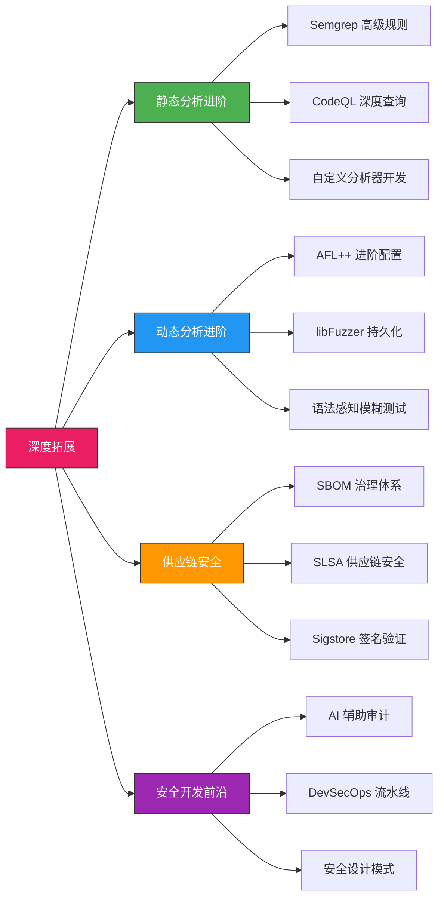
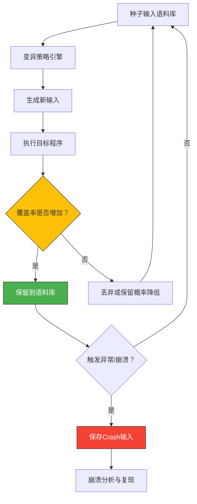
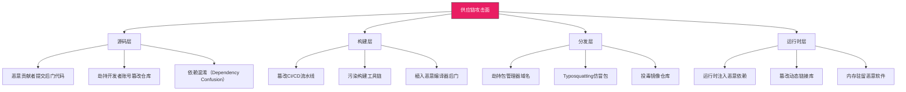
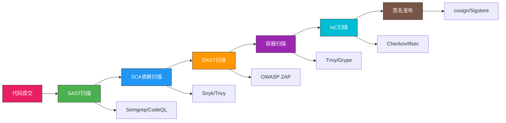

# 32.7 深度拓展

本节为代码审计与安全开发的进阶内容，面向已完成前面各节学习、希望在特定方向上深入钻研的读者。内容分为四大板块：静态分析进阶、动态分析进阶、供应链安全深度实践、安全开发前沿趋势。每个板块都包含原理讲解、工具高级用法和可落地的实践方案。



---

## 一、静态分析进阶

前面的核心技巧部分介绍了 Semgrep、CodeQL 的基础用法。本节深入讲解高级规则编写技巧、深度语义查询和自定义分析器开发，帮助你在面对复杂审计场景时具备更强的检测能力。

### 1.1 程序分析理论基础

在编写高级规则之前，理解静态分析的底层原理有助于写出更精准的检测规则。

**数据流分析（Data Flow Analysis）**

数据流分析是静态分析的核心技术，用于追踪数据在程序中的传播路径。其关键概念包括：

| 概念 | 定义 | 在安全审计中的作用 |
|------|------|-------------------|
| Source（源点） | 外部可控的数据入口 | 用户输入、环境变量、配置文件 |
| Sink（汇聚点） | 执行危险操作的函数 | SQL 执行、命令执行、文件操作 |
| Taint（污点） | 从 Source 传播的标记 | 标记未经验证的数据 |
| Sanitizer（净化器） | 消除污点的操作 | 输入验证、类型转换、编码 |
| Path（路径） | Source 到 Sink 的传播路径 | 漏洞的触发条件链 |

漏洞发现的本质就是：找到一条从 Source 到 Sink 的路径，且路径上没有经过有效的 Sanitizer。

```text
数据流分析示意：

  Source（用户输入）
       │
       ▼
  传播节点（变量赋值、函数参数传递）
       │
       ├── Sanitizer（输入验证/编码） → 路径中断，安全
       │
       ▼
  传播节点（字符串拼接、格式化）
       │
       ▼
  Sink（SQL执行/命令执行） → 漏洞！
```

**抽象解释（Abstract Interpretation）**

抽象解释是一种在抽象域上近似程序语义的技术。它通过将具体值域映射到抽象域（如区间、符号、八边形），在可接受的精度损失下实现可判定的安全属性验证。典型应用包括：

- **区间分析**：推断变量的取值范围，检测数组越界
- **符号分析**：追踪符号表达式，检测未初始化变量
- **指针分析（Points-to Analysis）**：确定指针可能指向的内存位置，检测悬垂指针和内存泄漏

这些理论是 CodeQL、Infer 等深度分析工具的底层基础。理解它们有助于编写更高效的查询和判断工具的分析能力边界。

### 1.2 Semgrep 高级规则编写

Semgrep 的强大之处不仅在于模式匹配，更在于其污点追踪（taint tracking）和结构化模式组合能力。

#### 1.2.1 污点追踪规则

污点追踪是检测注入类漏洞最有效的方法。Semgrep 的 `pattern-sources` 和 `pattern-sinks` 元素允许你定义数据的来源和汇聚点：

```yaml
rules:
  # 污点追踪：检测Python中的SQL注入
  - id: python-sqli-taint
    mode: taint
    pattern-sources:
      # 所有Flask请求参数都是潜在的Source
      - pattern: request.args.get(...)
      - pattern: request.form.get(...)
      - pattern: request.json
      - pattern: request.data
    pattern-sinks:
      # 数据库执行函数是Sink
      - pattern: $DB.execute($QUERY, ...)
      - pattern: $DB.executemany($QUERY, ...)
      - pattern: cursor.execute($QUERY, ...)
    message: |
      用户输入通过 $QUERY 流入数据库查询，存在SQL注入风险。
      修复方案：使用参数化查询，将用户输入作为参数传递。
    languages: [python]
    severity: ERROR
    metadata:
      cwe:
        - "CWE-89: Improper Neutralization of Special Elements used in an SQL Command ('SQL Injection')"
      owasp:
        - A03:2021 - Injection
      confidence: HIGH

  # 污点追踪：检测JavaScript中的XSS
  - id: javascript-xss-taint
    mode: taint
    pattern-sources:
      - pattern: req.query.$PROP
      - pattern: req.params.$PROP
      - pattern: req.body.$PROP
    pattern-sinks:
      - pattern: document.innerHTML = $SINK
      - pattern: $EL.innerHTML = $SINK
      - pattern: $EL.outerHTML = $SINK
      - pattern: document.write(...)
      - pattern: $EL.insertAdjacentHTML('beforeend', $SINK)
    message: |
      用户输入 $PROP 未经转义直接插入DOM，存在XSS风险。
      修复方案：使用 textContent 替代 innerHTML，或使用 DOMPurify 净化。
    languages: [javascript, typescript]
    severity: ERROR
    metadata:
      cwe:
        - "CWE-79: Improper Neutralization of Input During Web Page Generation ('Cross-site Scripting')"
```

#### 1.2.2 高级模式组合

Semgrep 提供了丰富的模式组合元素，用于精确描述代码特征：

```yaml
rules:
  # pattern-either：匹配多种漏洞模式中的任意一种
  - id: insecure-random-usage
    patterns:
      - pattern-either:
          - pattern: random.random()
          - pattern: random.randint(...)
          - pattern: Math.random()
          - pattern: Math.floor(Math.random() * ...)
    message: |
      使用了不安全的伪随机数生成器。安全场景请使用：
      Python: secrets.token_hex() / os.urandom()
      JavaScript: crypto.getRandomValues() / crypto.randomBytes()
    languages: [python, javascript]
    severity: WARNING

  # pattern-inside：限定匹配在特定代码结构内
  - id: unsafe-yaml-in-flask
    pattern: yaml.load($DATA)
    pattern-inside: |
      @app.route(...)
      def $FUNC(...):
          ...
    message: |
      在Flask路由处理函数中使用了yaml.load()，如果$DATA来自用户输入
      可能导致任意代码执行。修复：使用 yaml.safe_load($DATA)。
    languages: [python]
    severity: ERROR

  # pattern-regex：正则表达式匹配
  - id: hardcoded-jwt-secret
    pattern-regex: 'JWT[_-]?SECRET[_"]*\s*[:=]\s*["\x27][^"\x27]{8,}'
    message: |
      检测到硬编码的JWT密钥。JWT密钥泄露将导致攻击者伪造任意token。
      修复：使用环境变量或密钥管理服务（如HashiCorp Vault）存储密钥。
    languages: [python, javascript, java, go]
    severity: ERROR

  # 链式追踪：检测危险的反序列化链
  - id: django-pickle-deserialization
    patterns:
      - pattern: pickle.loads(...)
      - pattern-inside: |
          def $FUNC(...):
              ...
              $OBJ = base64.b64decode(...)
              ...
      - pattern-not-inside: |
          # 仅允许内部可信数据
          if $TRUSTED:
              ...
    message: |
      在Django视图中对Base64解码后的数据执行pickle反序列化，
      攻击者可构造恶意payload实现远程代码执行。
      修复：使用JSON替代pickle，或使用hmac签名验证数据完整性。
    languages: [python]
    severity: ERROR
```

#### 1.2.3 Semgrep 规则开发最佳实践

编写高质量的 Semgrep 规则需要遵循以下原则：

| 原则 | 说明 | 反面案例 |
|------|------|---------|
| 精确匹配 | 规则应精确匹配目标模式，避免过宽 | `eval(...)` 匹配了所有 eval 调用，包括测试代码 |
| 提供修复建议 | message 中包含具体的修复方案 | 只说"检测到漏洞"但不说怎么修 |
| 标注 CWE/OWASP | 添加元数据方便分类和追踪 | 没有引用标准分类体系 |
| 区分 severity | 根据实际风险设置级别 | 所有发现都标为 ERROR |
| 排除误报 | 使用 pattern-not 排除已知安全场景 | 已经有 sanitize 的代码也被报告 |

**规则调试技巧：**

```bash
# 使用 --dry-run 验证规则是否匹配
semgrep --config my-rule.yaml --dry-run target.py

# 使用 --verbose 查看匹配详情
semgrep --config my-rule.yaml --verbose target.py

# 测试规则的精确度：对已知安全和不安全代码分别测试
semgrep --config my-rule.yaml --test test-directory/
```

### 1.3 CodeQL 高级查询

CodeQL 通过将代码转换为可查询的数据库，允许你用类SQL的QL语言表达复杂的代码属性查询。

#### 1.3.1 CodeQL 查询架构

理解 CodeQL 的查询架构有助于编写高效的查询：

```text
源代码 → 语言提取器 → CodeQL数据库 → QL查询 → 结果
                              │
                    ┌─────────┴─────────┐
                    │  实体(Entities)    │
                    │  - Module          │
                    │  - Class           │
                    │  - Function        │
                    │  - Expr            │
                    │  - Stmt            │
                    │                    │
                    │  关系(Relations)   │
                    │  - 可达性          │
                    │  - 调用图          │
                    │  - 类型层次        │
                    └───────────────────┘
```

#### 1.3.2 污点追踪查询

CodeQL 最强大的能力是跨函数的污点追踪。以下查询检测 Flask 应用中的存储型XSS：

```ql
/**
 * @name Stored XSS in Flask templates
 * @description 检测存储到数据库的用户输入被渲染到HTML模板时的XSS漏洞
 * @kind path-problem
 * @severity error
 * @precision high
 * @id python/flask-stored-xss
 * @tags security external/cwe/cwe-79
 */

import python
import semmle.python.dataflow.new.DataFlow
import semmle.python.dataflow.new.TaintTracking
import semmle.python.security.dataflow.server-sideXSS
import semmle.python.filters.Tests

/**
 * 定义Source：数据库查询返回的数据
 */
class DatabaseSource extends DataFlow::Node {
  DatabaseSource() {
    exists(DataFlow::CallNode call |
      call.getFunction().(AttrNode).getName() = "query" and
      this = call
    )
  }
}

/**
 * 定义Sink：Flask的render_template调用
 */
class TemplateSink extends DataFlow::Node {
  TemplateSink() {
    exists(DataFlow::CallNode call |
      call.getFunction().(AttrNode).getName() = ["render_template", "render_template_string"] and
      this = call
    )
  }
}

/**
 * 配置污点追踪
 */
class StoredXssConfig extends TaintTracking::Configuration {
  StoredXssConfig() { this = "StoredXssConfig" }

  override predicate isSource(DataFlow::Node source) {
    source instanceof DatabaseSource
  }

  override predicate isSink(DataFlow::Node sink) {
    sink instanceof TemplateSink
  }

  // 排除测试文件
  override predicate isSanitizer(DataFlow::Node sanitizer) {
    sanitizer instanceof TestCode
  }
}

from StoredXssConfig config, DataFlow::Node source, DataFlow::Node sink
where config.hasFlowPath(source, sink)
select sink, source, sink,
  "User-controlled data from $@ is rendered in a template here.",
  source, "database query"
```

#### 1.3.3 高级CodeQL模式

```ql
/**
 * 检测不安全的密码哈希算法
 */
import python
import semmle.pythonFrameworks.django
import semmle.pythonFrameworks.flask

from DataFlow::Node hasher, string algorithm
where
  // 检测使用MD5/SHA1作为密码哈希
  (
    hasher.(DataFlow::CallNode).getFunction().(AttrNode).getName() = "hash" and
    algorithm = hasher.(DataFlow::CallNode).getArg(0).asCfgNode().(StrConst).getText()
  ) or (
    hasher.(DataFlow::CallNode).getFunction().(AttrNode).getObject().(AttrNode).getName() = "hashlib" and
    algorithm = hasher.(DataFlow::CallNode).getFunction().(AttrNode).getName()
  )
  and
  algorithm.toLowerCase() in ["md5", "sha1"]
select hasher,
  "Password hashing uses weak algorithm " + algorithm + ". Use bcrypt, scrypt, or Argon2 instead."

/**
 * 检测竞态条件下的TOCTOU漏洞
 */
from DataFlow::Node checkNode, DataFlow::Node useNode
where
  // 文件检查操作（TOCTOU的检查阶段）
  checkNode.(DataFlow::CallNode).getFunction().(AttrNode).getName() in
    ["access", "stat", "isfile", "isdir", "exists"] and
  // 文件使用操作（TOCTOU的使用阶段）
  useNode.(DataFlow::CallNode).getFunction().(AttrNode).getName() in
    ["open", "unlink", "rename", "chmod"] and
  // 两个操作之间没有原子性保证
  DataFlow::localFlow(checkNode, useNode)
select checkNode, useNode,
  "Time-of-check to time-of-use (TOCTOU) race condition detected. " +
  "The file state may change between check at $@ and use here.",
  checkNode, "check operation"
```

### 1.4 自定义静态分析工具开发

当现有工具无法满足特定审计需求时，可以开发定制化的分析工具。以下是一个完整的 Python AST 分析器，具备类型推断和数据流追踪能力：

```python
"""
Python安全静态分析器 - 支持跨函数污点追踪
使用ast模块解析源码，通过函数摘要实现简单的跨函数分析
"""

import ast
import sys
import json
from typing import List, Dict, Set, Optional, Tuple
from dataclasses import dataclass, field, asdict
from enum import Enum


class Severity(Enum):
    CRITICAL = "CRITICAL"
    HIGH = "HIGH"
    MEDIUM = "MEDIUM"
    LOW = "LOW"


@dataclass
class Vulnerability:
    """漏洞信息"""
    vuln_type: str
    severity: Severity
    line: int
    column: int
    message: str
    cwe: str = ""
    fix_suggestion: str = ""

    def to_dict(self):
        d = asdict(self)
        d['severity'] = self.severity.value
        return d


class SecurityAnalyzer(ast.NodeVisitor):
    """
    Python安全代码分析器

    支持的检测能力：
    1. 危险函数调用检测（eval, exec, os.system等）
    2. 硬编码密钥检测
    3. 不安全的反序列化
    4. SQL注入模式检测
    5. 简单的跨函数污点追踪
    """

    # 危险函数配置：(模块, 函数, CWE, 严重级别, 修复建议)
    DANGEROUS_FUNCTIONS = [
        ("builtins", "eval", "CWE-95", Severity.CRITICAL,
         "使用 ast.literal_eval() 替代 eval()"),
        ("builtins", "exec", "CWE-95", Severity.CRITICAL,
         "避免使用 exec()，改用安全的替代方案"),
        ("os", "system", "CWE-78", Severity.HIGH,
         "使用 subprocess.run(cmd, shell=False) 替代"),
        ("os", "popen", "CWE-78", Severity.HIGH,
         "使用 subprocess.Popen(shell=False) 替代"),
        ("subprocess", "call", "CWE-78", Severity.MEDIUM,
         "避免使用 shell=True 参数"),
        ("subprocess", "Popen", "CWE-78", Severity.MEDIUM,
         "避免使用 shell=True 参数"),
        ("pickle", "loads", "CWE-502", Severity.CRITICAL,
         "使用 json.loads() 替代，或使用 hmac 签名验证"),
        ("pickle", "load", "CWE-502", Severity.CRITICAL,
         "使用 json.load() 替代"),
        ("yaml", "load", "CWE-502", Severity.HIGH,
         "使用 yaml.safe_load() 替代"),
        ("tempfile", "mktemp", "CWE-377", Severity.MEDIUM,
         "使用 tempfile.mkstemp() 替代，避免竞态条件"),
    ]

    # 敏感变量名关键词
    SENSITIVE_KEYWORDS = [
        'password', 'passwd', 'secret', 'api_key', 'apikey',
        'access_token', 'private_key', 'auth_token', 'encryption_key',
        'db_password', 'database_password',
    ]

    def __init__(self, source_code: str, filename: str = "<string>"):
        self.source_code = source_code
        self.filename = filename
        self.vulnerabilities: List[Vulnerability] = []
        self.tainted_vars: Set[str] = set()  # 当前作用域的污点变量
        self.function_summaries: Dict[str, Set[str]] = {}  # 函数返回的污点变量
        self.current_scope: str = "<module>"

    def _add_vuln(self, vuln_type: str, severity: Severity,
                  line: int, col: int, message: str,
                  cwe: str = "", fix: str = ""):
        self.vulnerabilities.append(Vulnerability(
            vuln_type=vuln_type,
            severity=severity,
            line=line,
            column=col,
            message=message,
            cwe=cwe,
            fix_suggestion=fix
        ))

    def _get_attr_chain(self, node: ast.expr) -> str:
        """获取属性链，如 os.path.join 返回 'os.path.join'"""
        if isinstance(node, ast.Name):
            return node.id
        elif isinstance(node, ast.Attribute):
            parent = self._get_attr_chain(node.value)
            return f"{parent}.{node.attr}" if parent else node.attr
        return ""

    def _is_user_input(self, node: ast.expr) -> bool:
        """判断节点是否代表用户输入"""
        if isinstance(node, ast.Call):
            func = self._get_attr_chain(node.func)
            # Flask request对象
            if "request.args.get" in func or "request.form.get" in func:
                return True
            # Django request对象
            if "request.GET.get" in func or "request.POST.get" in func:
                return True
            # 标准输入
            if func == "input":
                return True
        if isinstance(node, ast.Name) and node.id in self.tainted_vars:
            return True
        return False

    def visit_Call(self, node: ast.Call):
        """检测危险函数调用"""
        func_chain = self._get_attr_chain(node.func)

        # 检查危险函数列表
        for module, func_name, cwe, severity, fix in self.DANGEROUS_FUNCTIONS:
            qualified = f"{module}.{func_name}" if module != "builtins" else func_name
            if func_chain == qualified or func_chain.endswith(f".{func_name}"):
                # 对shell=True的特殊处理
                if func_name in ("call", "Popen"):
                    for kw in node.keywords:
                        if kw.arg == "shell" and isinstance(kw.value, ast.Constant) and kw.value.value is True:
                            self._add_vuln(
                                "Command Injection", severity,
                                node.lineno, node.col_offset,
                                f"{func_chain}() 使用 shell=True，存在命令注入风险",
                                cwe, fix
                            )
                            break
                else:
                    self._add_vuln(
                        "Dangerous Function", severity,
                        node.lineno, node.col_offset,
                        f"调用了危险函数 {func_chain}()，{fix}",
                        cwe, fix
                    )

        # 检测SQL拼接模式
        if func_chain.endswith("execute") or func_chain.endswith("executemany"):
            if node.args:
                first_arg = node.args[0]
                if isinstance(first_arg, ast.JoinedStr):  # f-string
                    self._add_vuln(
                        "SQL Injection", Severity.CRITICAL,
                        node.lineno, node.col_offset,
                        "SQL查询使用f-string拼接，存在SQL注入风险。"
                        "使用参数化查询: cursor.execute('SELECT ... WHERE id=?', (id,))",
                        "CWE-89", "使用参数化查询替代字符串拼接"
                    )
                elif isinstance(first_arg, ast.BinOp) and isinstance(first_arg.op, ast.Add):
                    self._add_vuln(
                        "SQL Injection", Severity.CRITICAL,
                        node.lineno, node.col_offset,
                        "SQL查询使用字符串拼接，存在SQL注入风险",
                        "CWE-89", "使用参数化查询替代字符串拼接"
                    )

        self.generic_visit(node)

    def visit_Assign(self, node: ast.Assign):
        """检测硬编码密钥"""
        for target in node.targets:
            if isinstance(target, ast.Name):
                var_name = target.id.lower()
                if any(kw in var_name for kw in self.SENSITIVE_KEYWORDS):
                    if isinstance(node.value, ast.Constant) and isinstance(node.value.value, str):
                        if len(node.value.value) > 3:  # 排除短字符串误报
                            self._add_vuln(
                                "Hardcoded Secret", Severity.HIGH,
                                node.lineno, node.col_offset,
                                f"变量 '{target.id}' 包含硬编码的敏感值。"
                                "使用环境变量或密钥管理服务存储敏感信息。",
                                "CWE-798", "使用 os.environ.get('SECRET_KEY') 或 Vault"
                            )

        self.generic_visit(node)

    def visit_FunctionDef(self, node: ast.FunctionDef):
        """分析函数级别的安全属性"""
        old_scope = self.current_scope
        self.current_scope = node.name
        old_tainted = self.tainted_vars.copy()

        self.generic_visit(node)

        # 恢复作用域
        self.current_scope = old_scope
        self.tainted_vars = old_tainted

    def analyze(self) -> List[Vulnerability]:
        """执行分析并返回结果"""
        tree = ast.parse(self.source_code, filename=self.filename)
        self.visit(tree)

        # 按严重级别排序
        self.vulnerabilities.sort(key=lambda v: list(Severity).index(v.severity))
        return self.vulnerabilities


def analyze_file(file_path: str) -> List[Dict]:
    """分析指定的Python文件"""
    with open(file_path, 'r', encoding='utf-8') as f:
        source = f.read()

    analyzer = SecurityAnalyzer(source, file_path)
    vulns = analyzer.analyze()
    return [v.to_dict() for v in vulns]


def format_report(vulns: List[Dict], file_path: str) -> str:
    """格式化安全审计报告"""
    lines = [
        f"{'='*60}",
        f"  安全审计报告: {file_path}",
        f"{'='*60}",
        f"  发现 {len(vulns)} 个安全问题",
        f"{'='*60}",
    ]

    severity_counts = {}
    for v in vulns:
        s = v['severity']
        severity_counts[s] = severity_counts.get(s, 0) + 1

    lines.append("\n  问题统计:")
    for sev in ["CRITICAL", "HIGH", "MEDIUM", "LOW"]:
        count = severity_counts.get(sev, 0)
        if count > 0:
            lines.append(f"    {sev}: {count}")

    lines.append(f"\n{'-'*60}")
    for i, v in enumerate(vulns, 1):
        lines.extend([
            f"\n  [{i}] {v['severity']} - {v['vuln_type']}",
            f"      位置: 第 {v['line']} 行, 第 {v['column']} 列",
            f"      描述: {v['message']}",
        ])
        if v.get('cwe'):
            lines.append(f"      CWE: {v['cwe']}")
        if v.get('fix_suggestion'):
            lines.append(f"      修复: {v['fix_suggestion']}")

    lines.append(f"\n{'='*60}")
    return "\n".join(lines)


if __name__ == '__main__':
    if len(sys.argv) < 2:
        print("用法: python security_analyzer.py <file.py>")
        sys.exit(1)

    file_path = sys.argv[1]
    vulns = analyze_file(file_path)
    report = format_report(vulns, file_path)
    print(report)

    # 同时输出JSON格式供CI/CD使用
    if "--json" in sys.argv:
        print("\n" + json.dumps(vulns, indent=2, ensure_ascii=False))
```

---

## 二、动态分析与模糊测试进阶

### 2.1 模糊测试理论基础

覆盖率引导模糊测试（Coverage-Guided Fuzzing）是现代fuzzer的核心技术。理解其工作原理有助于更高效地配置和使用fuzzer。

**覆盖率引导的工作流程：**



**变异策略分类：**

| 策略 | 原理 | 适用场景 | 工具支持 |
|------|------|---------|---------|
| 位翻转（Bit Flip） | 随机翻转输入中的位 | 通用二进制格式 | AFL, libFuzzer |
| 字典变异（Dictionary） | 插入预定义的特殊值 | 已知格式的关键字段 | AFL -x 参数 |
| 块删除/插入 | 删除或插入连续字节块 | 长度敏感的协议 | AFL auto dict |
| 拼接（Splice） | 将两个种子输入交叉拼接 | 组合多个输入特征 | AFL splice |
| 整数边界 | 生成边界值（0, MAX, -1等） | 整数运算逻辑 | Custom mutator |
| 语法感知 | 基于格式语法生成输入 | 结构化格式（JSON/XML/协议） | AFLSmart, Peach |

### 2.2 AFL++ 高级配置与优化

AFL++ 是 AFL 的增强版本，提供了大量高级功能。以下是生产环境中的最佳配置：

```bash
#!/bin/bash
# AFL++ 生产环境模糊测试脚本

TARGET="./target_app"
INPUT_DIR="./corpus"
OUTPUT_DIR="./findings"
DICT_FILE="./dict/json.dict"
CORES=$(nproc)

# ========== 第1步：编译目标程序 ==========
# 使用LLVM模式（推荐）并启用ASAN检测内存错误
export AFL_USE_ASAN=1
export AFL_LLVM_LAF=1  # 启用LAF比较替换，提高比较覆盖率

afl-clang-fast -O2 -g \
    -fsanitize=address,undefined \
    -fno-omit-frame-pointer \
    -o "$TARGET" target_source.c

# ========== 第2步：准备字典 ==========
cat > "$DICT_FILE" << 'EOF'
"{"
"}"
"["
"]"
":"
","
"null"
"true"
"false"
"0"
"-1"
"2147483647"
"\n"
"\r\n"
EOF

# ========== 第3步：最小化种子语料库 ==========
# 使用afl-cmin减少种子数量，保留最有价值的输入
afl-cmin -i "$INPUT_DIR" -o "$INPUT_DIR.min" -- "$TARGET" @@

# ========== 第4步：并行模糊测试 ==========
# 使用C个CPU核心，每个核心一个fuzzer实例

# 主节点（M模式）
afl-fuzz -i "$INPUT_DIR.min" -o "$OUTPUT_DIR" \
    -M main \
    -t 5000 \
    -m none \
    -x "$DICT_FILE" \
    -- "$TARGET" @@

# 从节点（S模式）：为每个额外核心启动一个从节点
for i in $(seq 1 $((CORES - 1))); do
    afl-fuzz -i "$INPUT_DIR.min" -o "$OUTPUT_DIR" \
        -S "worker_$i" \
        -t 5000 \
        -m none \
        -x "$DICT_FILE" \
        -- "$TARGET" @@ &
done

# ========== 第5步：使用AFL++的高级功能 ==========

# 持久化模式（需要修改目标程序源码）
# 在目标程序中添加以下代码实现持久化：
# #include <unistd.h>
# __AFL_FUZZ_INIT();
# int main() {
#     unsigned char *buf = __AFL_FUZZ_TESTCASE_BUF;
#     while (__AFL_FUZZ_TESTCASE_LEN > 0) {
#         // 处理 buf 中的输入
#         process_input(buf, __AFL_FUZZ_TESTCASE_LEN);
#         __AFL_FUZZ_TESTCASE_LEN = __AFL_NEXT_TESTCASE(&buf);
#     }
# }

# CMP日志模式（分析比较指令以生成更有针对性的输入）
afl-fuzz -i "$INPUT_DIR.min" -o "$OUTPUT_DIR" \
    -M cmplog \
    -c "$TARGET" \
    -- "$TARGET" @@

# ========== 第6步：崩溃分析 ==========
# 使用afl-tmin最小化crash输入
for crash in "$OUTPUT_DIR"/main/crashes/id:*,*; do
    afl-tmin -i "$crash" -o "$OUTPUT_DIR/minimized/" -- "$TARGET" @@
done

# 使用afl-showmap查看覆盖率
afl-showmap -i "$INPUT_DIR.min" -- "$TARGET" @@ > coverage_map.txt
```

**AFL++ 关键环境变量说明：**

| 变量 | 作用 | 推荐值 |
|------|------|--------|
| `AFL_USE_ASAN` | 启用 AddressSanitizer | 1（检测内存错误） |
| `AFL_USE_MSAN` | 启用 MemorySanitizer | 1（检测未初始化读） |
| `AFL_USE_UBSAN` | 启用 UndefinedBehaviorSanitizer | 1 |
| `AFL_LLVM_LAF` | 比较指令拆分 | 1（提高格式解析覆盖率） |
| `AFL_MAP_SIZE` | 共享内存映射大小 | 65536（默认）或更大 |
| `AFL_FINAL_SYNC` | 退出前同步语料库 | 1（长期运行时设置） |
| `AFL_AUTORESUME` | 自动恢复中断的测试 | 1 |

### 2.3 libFuzzer 进阶：持久化与语料库管理

libFuzzer 是 LLVM 的进程内模糊测试框架，相比 AFL 它的优势是无需 fork 进程，性能更高。以下是生产级的使用模式：

```cpp
// 高级libFuzzer Harness示例：针对JSON解析器的模糊测试
#include <cstdint>
#include <cstddef>
#include <cstdlib>
#include <cstring>
#include <string>
#include <vector>

// 模拟目标JSON解析器的接口
extern "C" {
    // 假设这是我们要测试的JSON解析库
    typedef struct json_parser* json_parser_t;
    json_parser_t json_parser_create(void);
    int json_parse(json_parser_t parser, const char* data, size_t len);
    void json_parser_destroy(json_parser_t parser);
}

// libFuzzer主入口
extern "C" int LLVMFuzzerTestOneInput(const uint8_t *data, size_t size) {
    // 限制输入大小以提高效率
    if (size > 4096) return 0;

    // 确保输入以null结尾（某些解析器需要）
    std::string input(reinterpret_cast<const char*>(data), size);

    // 创建解析器并执行解析
    json_parser_t parser = json_parser_create();
    if (!parser) return 0;

    // 这是实际的模糊测试目标
    json_parse(parser, input.c_str(), input.size());

    json_parser_destroy(parser);
    return 0;
}

// LLVMFuzzerInitialize：运行前初始化（只执行一次）
extern "C" int LLVMFuzzerInitialize(int *argc, char ***argv) {
    // 初始化全局状态、加载配置等
    return 0;
}

// 编译命令：
// clang++ -g -O1 -fsanitize=fuzzer,address,undefined \
//         -fno-omit-frame-pointer \
//         -o json_fuzzer json_fuzzer.cpp -ljson_parser
//
// 运行命令：
// ./json_fuzzer -max_len=4096 \
//               -timeout=10 \
//               -jobs=4 \
//               -workers=4 \
//               -dict=json.dict \
//               -max_total_time=3600 \
//               corpus/
```

**libFuzzer 高级参数：**

| 参数 | 作用 | 推荐值 |
|------|------|--------|
| `-max_len` | 最大输入长度 | 目标格式的合理上限 |
| `-timeout` | 单次执行超时（秒） | 5-30 |
| `-jobs` | 总fuzzer进程数 | CPU核心数 |
| `-workers` | 并行worker数 | = jobs |
| `-dict` | 字典文件路径 | 目标格式的关键词 |
| `-max_total_time` | 最大运行时间（秒） | 3600（1小时） |
| `-artifact_prefix` | crash/min corpus输出路径 | ./artifacts/ |
| `-reduce_inputs` | 自动最小化输入 | 1 |

### 2.4 语法感知模糊测试

语法感知模糊测试（Grammar-Aware Fuzzing）根据目标格式的语法规则生成输入，比纯随机变异更高效。

**实现方式对比：**

| 方法 | 原理 | 工具 | 优势 | 局限 |
|------|------|------|------|------|
| 基于变异 | 对已有种子进行随机变异 | AFL, libFuzzer | 无需了解格式 | 无法突破格式校验 |
| 基于生成 | 使用格式语法生成输入 | Peach, Dharma | 能绕过格式检查 | 需要编写语法定义 |
| 结合覆盖率引导 | 语法生成+覆盖率反馈 | AFLSmart, Nautilus | 两者优势结合 | 实现复杂 |
| 基于大模型 | LLM理解语义后生成输入 | ChatFuzz, FuzzGPT | 语义级覆盖 | 依赖模型质量 |

**使用 AFLSmart 进行协议模糊测试：**

```bash
# 安装 AFLSmart（需要Peach安装）
git clone https://github.com/AFLplusplus/AFLSmart.git
cd AFLSmart

# 编写Peachpit语法定义（以HTTP请求为例）
cat > http_request.xml << 'EOF'
<?xml version="1.0" encoding="utf-8"?>
<Peach xmlns="http://peachfuzzer.com/2012/Peach"
       xmlns:xsi="http://www.w3.org/2001/XMLSchema-instance"
       xsi:schemaLocation="http://peachfuzzer.com/2012/Peach peach.xsd">

  <DataModel name="HttpRequest">
    <!-- 请求方法 -->
    <String name="method" value="GET">
      <String value="GET"/>
      <String value="POST"/>
      <String value="PUT"/>
      <String value="DELETE"/>
      <String value="PATCH"/>
      <String value="OPTIONS"/>
      <String value="HEAD"/>
    </String>
    <String value=" " mutable="false"/>

    <!-- 请求路径 -->
    <String name="path" value="/">
      <Relation type="offset" of="HttpMethod" location="+1"/>
    </String>
    <String value=" " mutable="false"/>

    <!-- HTTP版本 -->
    <String name="version" value="HTTP/1.1">
      <String value="HTTP/1.0"/>
      <String value="HTTP/1.1"/>
      <String value="HTTP/2"/>
    </String>
    <String value="\r\n" mutable="false"/>

    <!-- Host头 -->
    <String value="Host: " mutable="false"/>
    <String name="host" value="localhost"/>
    <String value="\r\n" mutable="false"/>

    <!-- Content-Length头（POST时必需） -->
    <Choice name="content_length_header">
      <String value="" mutable="false"/>
      <Block>
        <String value="Content-Length: " mutable="false"/>
        <String name="content_length" value="0"/>
        <String value="\r\n" mutable="false"/>
      </Block>
    </Choice>

    <!-- 可选的自定义头 -->
    <String value="User-Agent: AFLSmart/1.0" mutable="false"/>
    <String value="\r\n" mutable="false"/>

    <!-- 空行分隔头和体 -->
    <String value="\r\n" mutable="false"/>

    <!-- 请求体（可选） -->
    <Choice name="body">
      <String value=""/>
      <String name="request_body" value=""/>
    </Choice>
  </DataModel>
</Peach>
EOF

# 使用语法感知模式运行AFLSmart
afl-fuzz -i seeds/ -o output/ \
    -m none \
    -G http_request.xml \
    -- ./target_http_parser @@
```

### 2.5 差异模糊测试

差异模糊测试（Differential Fuzzing）通过比较两个或多个实现的输出来发现不一致性。当两个实现应产生相同结果但实际不同时，可能意味着其中一个存在漏洞。

```python
"""
差异模糊测试框架：对比两个JSON解析器的行为差异
"""

import json
import random
import string
import subprocess
import tempfile
from typing import Optional, Tuple


class DifferentialFuzzer:
    """
    差异模糊测试器：发现两个实现在相同输入下的行为差异
    """

    def __init__(self, impl_a: str, impl_b: str):
        """
        Args:
            impl_a: 第一个实现的可执行路径
            impl_b: 第二个实现的可执行路径
        """
        self.impl_a = impl_a
        self.impl_b = impl_b
        self.diffs_found = []

    def generate_structured_input(self) -> bytes:
        """生成结构化的JSON种子输入"""
        templates = [
            b'{}',
            b'[]',
            b'{"key": "value"}',
            b'[1, 2, 3]',
            b'{"nested": {"deep": true}}',
            b'{"escaped": "line1\\nline2\\ttab"}',
            b'{"unicode": "\\u0041\\u0042\\u0043"}',
            b'{"large_number": 9007199254740991}',
            b'{"null_value": null}',
            b'{"boolean": true}',
        ]
        return random.choice(templates)

    def mutate(self, data: bytes) -> bytes:
        """针对JSON格式的智能变异策略"""
        if len(data) == 0:
            return self.generate_structured_input()

        strategy = random.choice([
            'flip_char', 'insert_char', 'delete_char',
            'duplicate_key', 'break_string', 'inject_special',
        ])

        data = bytearray(data)
        pos = random.randint(0, len(data) - 1)

        if strategy == 'flip_char':
            data[pos] = random.randint(32, 126)
        elif strategy == 'insert_char':
            new_byte = bytes([random.randint(32, 126)])
            data = data[:pos] + new_byte + data[pos:]
        elif strategy == 'delete_char':
            data = data[:pos] + data[pos+1:]
        elif strategy == 'duplicate_key':
            # 复制一个键值对
            insert_pos = random.randint(0, len(data))
            snippet = data[pos:min(pos+20, len(data))]
            data = data[:insert_pos] + b',' + snippet + data[insert_pos:]
        elif strategy == 'break_string':
            # 在字符串中间插入引号破坏
            for i, b in enumerate(data):
                if b == ord('"'):
                    data[i] = random.randint(0, 31)
                    break
        elif strategy == 'inject_special':
            # 注入JSON特殊字符
            specials = [b'\\', b'"', b'\x00', b'\xff']
            data[pos:pos+1] = random.choice(specials)

        return bytes(data)

    def run_impl(self, binary: str, input_data: bytes) -> Tuple[Optional[int], str, str]:
        """运行指定实现并捕获输出"""
        with tempfile.NamedTemporaryFile(delete=False, suffix='.json') as f:
            f.write(input_data)
            input_path = f.name

        try:
            result = subprocess.run(
                [binary, input_path],
                capture_output=True, timeout=5
            )
            return result.returncode, result.stdout.decode('utf-8', errors='replace'), \
                   result.stderr.decode('utf-8', errors='replace')
        except subprocess.TimeoutExpired:
            return None, "", "TIMEOUT"
        except Exception as e:
            return None, "", str(e)
        finally:
            import os
            os.unlink(input_path)

    def check_differential(self, input_data: bytes) -> Optional[dict]:
        """检查两个实现对相同输入的输出差异"""
        rc_a, out_a, err_a = self.run_impl(self.impl_a, input_data)
        rc_b, out_b, err_b = self.run_impl(self.impl_b, input_data)

        # 一个崩溃一个正常 → 可能的漏洞
        if (rc_a == 0) != (rc_b == 0):
            return {
                'type': 'crash_difference',
                'input': input_data,
                'impl_a': {'returncode': rc_a, 'stderr': err_a},
                'impl_b': {'returncode': rc_b, 'stderr': err_b},
            }

        # 两个都成功但输出不同 → 解析差异
        if rc_a == 0 and rc_b == 0 and out_a != out_b:
            # 排除顺序无关的差异（如键的顺序）
            try:
                parsed_a = json.loads(out_a)
                parsed_b = json.loads(out_b)
                if parsed_a != parsed_b:
                    return {
                        'type': 'output_difference',
                        'input': input_data,
                        'output_a': out_a[:500],
                        'output_b': out_b[:500],
                    }
            except json.JSONDecodeError:
                # 两个输出都非JSON但不同
                if out_a.strip() != out_b.strip():
                    return {
                        'type': 'parse_difference',
                        'input': input_data,
                        'output_a': out_a[:500],
                        'output_b': out_b[:500],
                    }

        return None

    def fuzz(self, iterations: int = 50000):
        """执行差异模糊测试"""
        corpus = [self.generate_structured_input() for _ in range(20)]

        for i in range(iterations):
            if corpus and random.random() < 0.8:
                base = random.choice(corpus)
                input_data = self.mutate(base)
            else:
                input_data = self.generate_structured_input()

            diff = self.check_differential(input_data)
            if diff:
                self.diffs_found.append(diff)
                print(f"[!] Differential found at iteration {i}: {diff['type']}")

                # 保存有差异的输入
                with open(f"diff_{len(self.diffs_found)}.bin", "wb") as f:
                    f.write(input_data)
            else:
                # 没有差异的输入也加入语料库（用于后续变异）
                if len(corpus) < 1000:
                    corpus.append(input_data)

            if i % 1000 == 0:
                print(f"[*] Iteration {i}/{iterations}, diffs: {len(self.diffs_found)}")

        return self.diffs_found


if __name__ == '__main__':
    fuzzer = DifferentialFuzzer('./reference_impl', './target_impl')
    diffs = fuzzer.fuzz(50000)
    print(f"\nTotal differentials found: {len(diffs)}")
    for d in diffs:
        print(f"  - {d['type']}: input={d['input'][:50]}")
```

---

## 三、供应链安全深度实践

供应链安全是近年来最受关注的安全领域之一。从SolarWinds（2020）到Log4Shell（2021）再到xz-utils后门（2024），供应链攻击的影响范围和隐蔽性都在急剧上升。

### 3.1 供应链攻击模型



### 3.2 SBOM 生成与治理

软件物料清单（Software Bill of Materials, SBOM）是供应链安全的基础。它记录了软件包含的所有组件、版本和依赖关系。

**SBOM 生成工具对比：**

| 工具 | 支持格式 | 语言支持 | 特点 | 推荐场景 |
|------|---------|---------|------|---------|
| Syft | SPDX, CycloneDX | 20+语言 | 快速、准确、CLI友好 | 通用项目 |
| CycloneDX CLI | CycloneDX | 15+语言 | OWASP标准、安全工具集成 | 企业安全合规 |
| SPDX-tools | SPDX | 通用 | Linux Foundation标准 | 开源合规 |
| Tern | SPDX | Docker镜像 | 容器镜像分析 | 容器安全 |

**完整的SBOM生成与分析工作流：**

```bash
#!/bin/bash
# 供应链安全完整工作流

PROJECT_DIR="."
SBOM_DIR="./sbom"
REPORT_DIR="./security-reports"

mkdir -p "$SBOM_DIR" "$REPORT_DIR"

# ========== 第1步：生成SBOM ==========
echo "[1/5] 生成SBOM..."

# 使用Syft生成CycloneDX格式（推荐）
syft dir:"$PROJECT_DIR" \
    -o cyclonedx-json="$SBOM_DIR/sbom-cdx.json" \
    -o spdx-json="$SBOM_DIR/sbom-spdx.json"

# 查看SBOM统计信息
echo "  SBOM组件数: $(cat "$SBOM_DIR/sbom-cdx.json" | jq '.components | length')"
echo "  SBOM格式版本: $(cat "$SBOM_DIR/sbom-cdx.json" | jq '.specVersion')"

# ========== 第2步：漏洞扫描 ==========
echo "[2/5] 扫描已知漏洞..."

# 使用Grype扫描SBOM（推荐方式，不需要原始代码）
grype sbom:"$SBOM_DIR/sbom-cdx.json" \
    -o table \
    > "$REPORT_DIR/vulnerabilities.txt"

# 输出高危和严重漏洞摘要
grype sbom:"$SBOM_DIR/sbom-cdx.json" \
    --fail-on critical \
    -o json > "$REPORT_DIR/vulns.json"

CRITICAL_COUNT=$(cat "$REPORT_DIR/vulns.json" | jq '[.matches[] | select(.vulnerability.severity == "Critical")] | length')
HIGH_COUNT=$(cat "$REPORT_DIR/vulns.json" | jq '[.matches[] | select(.vulnerability.severity == "High")] | length')
echo "  严重漏洞: $CRITICAL_COUNT"
echo "  高危漏洞: $HIGH_COUNT"

# ========== 第3步：许可证合规检查 ==========
echo "[3/5] 检查许可证合规..."

# 提取所有许可证
cat "$SBOM_DIR/sbom-cdx.json" | jq -r '
  .components[]? |
  select(.licenses) |
  "\(.name)@\(.version): \(.licenses[0].license.name // "UNKNOWN")"
' > "$REPORT_DIR/licenses.txt"

# 标记禁止使用的许可证（GPL等copyleft协议在闭源项目中需注意）
echo "  禁止的许可证:"
grep -i -E "GPL|AGPL|SSPL" "$REPORT_DIR/licenses.txt" || echo "    无"

# ========== 第4步：依赖锁定验证 ==========
echo "[4/5] 验证依赖锁定..."

# 检查是否存在锁定文件
LOCK_FILES=("package-lock.json" "yarn.lock" "poetry.lock" "go.sum" "Cargo.lock")
for lock in "${LOCK_FILES[@]}"; do
    if [ -f "$PROJECT_DIR/$lock" ]; then
        echo "  发现锁定文件: $lock"
    fi
done

# ========== 第5步：SBOM归档与版本管理 ==========
echo "[5/5] 归档SBOM..."

# 添加时间戳并归档
TIMESTAMP=$(date +%Y%m%d_%H%M%S)
cp "$SBOM_DIR/sbom-cdx.json" "$SBOM_DIR/sbom-${TIMESTAMP}.cdx.json"
echo "  已保存: sbom-${TIMESTAMP}.cdx.json"

echo ""
echo "供应链安全报告已生成到: $REPORT_DIR/"
```

### 3.3 SLSA 供应链安全框架

SLSA（Supply-chain Levels for Software Artifacts）是由Google提出的供应链安全分级框架，定义了四个安全等级：

| 等级 | 名称 | 要求 | 防御的攻击 |
|------|------|------|-----------|
| Level 1 | 构建过程文档化 | 有构建过程记录 | 请求者篡改 |
| Level 2 | 使用托管构建服务 | 在可信环境中构建，有签名 | 构建者篡改 |
| Level 3 | 构建平台硬化 | 隔离构建、不可变来源 | 内部威胁、平台漏洞 |
| Level | 完整两方审计 | 以上全部+构建者的构建者审计 | 所有已知攻击 |

**SLSA Level 3 的实现要素：**

```yaml
# GitHub Actions实现SLSA Level 3的示例
name: SLSA Build
on:
  push:
    branches: [main]

permissions:
  id-token: write  # 需要OIDC令牌进行签名
  contents: read
  attestations: write

jobs:
  build:
    runs-on: ubuntu-latest
    outputs:
      image: ${{ steps.build.outputs.image }}
    steps:
      - uses: actions/checkout@v4

      # 使用GitHub的可信构建环境
      - name: Build artifact
        id: build
        run: |
          # 构建产物
          make build

          # 计算哈希值
          sha256sum dist/* > checksums.txt

      # 生成SLSA provenance（构建证明）
      - name: Generate SLSA provenance
        uses: slsa-framework/slsa-github-generator/.github/actions/attest-build-provenance@v2
        with:
          subject-path: "dist/*"

      # 使用Sigstore签名
      - name: Sign with cosign
        uses: sigstore/cosign-installer@v3

      - name: Sign artifacts
        run: |
          cosign sign-blob --yes \
            --output-signature dist/signature \
            --output-certificate dist/certificate \
            dist/artifact.tar.gz
```

### 3.4 Sigstore 签名与验证

Sigstore 是一个免费的软件签名基础设施，由 Red Hat、Google、GitHub 等联合开发。它使用临时密钥（通过 OIDC 身份验证）签署软件制品，消除了长期密钥管理的负担。

```bash
# ========== Sigstore/cosign 完整工作流 ==========

# 安装cosign
go install github.com/sigstore/cosign/v2/cmd/cosign@latest
# 或
curl -LO https://github.com/sigstore/cosign/releases/latest/download/cosign-linux-amd64
chmod +x cosign-linux-amd64
sudo mv cosign-linux-amd64 /usr/local/bin/cosign

# ----- 签名端（发布者） -----

# 方式1：使用keyless签名（推荐，基于OIDC身份）
# 需要GitHub Actions的OIDC令牌或本地浏览器认证
cosign sign-blob --yes \
    --output-signature artifact.sig \
    --output-certificate artifact.cert \
    artifact.tar.gz

# 方式2：使用密钥签名
cosign generate-key-pair  # 生成cosign.key + cosign.pub
cosign sign --key cosign.key \
    --output-signature artifact.sig \
    artifact.tar.gz

# 为Docker镜像签名
cosign sign --key cosign.key \
    myregistry.io/myimage:v1.0

# ----- 验证端（消费者） -----

# 验证keyless签名（检查签名者身份）
cosign verify-blob \
    --signature artifact.sig \
    --certificate artifact.cert \
    --certificate-identity "https://github.com/myorg/myrepo/.github/workflows/build.yml@refs/heads/main" \
    --certificate-oidc-issuer "https://token.actions.githubusercontent.com" \
    artifact.tar.gz

# 验证Docker镜像签名
cosign verify \
    --key cosign.pub \
    myregistry.io/myimage:v1.0

# 验证SBOM签名
cosign verify-blob \
    --signature sbom.sig \
    --key cosign.pub \
    sbom-cdx.json

# ----- 策略实施 -----

# 使用Kyverno在Kubernetes中强制验证签名
# （部署策略在运行时阻止未签名的镜像）
cat << 'EOF' | kubectl apply -f -
apiVersion: kyverno.io/v1
kind: ClusterPolicy
metadata:
  name: require-cosign-signature
spec:
  validationFailureAction: Enforce
  rules:
    - name: check-image-signature
      match:
        any:
          - resources:
              kinds: ["Pod"]
      verifyImages:
        - imageReferences: ["myregistry.io/*"]
          attestors:
            - entries:
                - keyless:
                    subject: "https://github.com/myorg/myrepo/.github/workflows/build.yml@refs/heads/main"
                    issuer: "https://token.actions.githubusercontent.com"
EOF
```

---

## 四、安全开发前沿趋势

### 4.1 AI 辅助代码审计

大语言模型正在改变代码审计的方式。AI可以辅助发现漏洞、生成审计报告、推荐修复方案，但无法完全替代人工审计。

**AI辅助审计的定位：**

| 能力 | AI 表现 | 人工审计表现 | 建议策略 |
|------|---------|------------|---------|
| 已知漏洞模式检测 | 强（模式匹配） | 强（但速度慢） | AI初筛 + 人工复核 |
| 逻辑漏洞发现 | 弱（缺乏业务理解） | 强（深度推理） | 人工为主 |
| 审计报告生成 | 强（格式化、规范化） | 中（耗时） | AI生成 + 人工修正 |
| 修复方案推荐 | 中（常见问题好） | 强（上下文感知） | AI推荐 + 人工选择 |
| 新型攻击向量发现 | 弱（依赖训练数据） | 强（创造性思维） | 人工探索 |

**生产级AI辅助审计方案：**

```python
"""
AI辅助代码审计系统
集成多种AI模型，提供多维度的安全分析
"""

import json
from dataclasses import dataclass
from typing import List, Dict, Optional
from pathlib import Path


@dataclass
class AuditResult:
    """审计结果"""
    file_path: str
    line: int
    vulnerability_type: str
    severity: str
    confidence: float  # 0.0-1.0
    description: str
    fix_suggestion: str
    cwe_id: str = ""
    source: str = "ai"  # ai / tool / hybrid


class AICodeAuditor:
    """
    AI代码审计系统

    工作流：
    1. SAST工具（Semgrep/CodeQL）初筛，生成候选漏洞列表
    2. LLM对候选漏洞进行二次分析，降低误报
    3. LLM发现工具遗漏的逻辑漏洞
    4. 汇总结果生成审计报告
    """

    def __init__(self, llm_client=None):
        self.llm_client = llm_client

    def analyze_file(self, file_path: str, language: str = "python") -> List[AuditResult]:
        """对单个文件进行综合审计"""
        source = Path(file_path).read_text()
        results = []

        # 第1步：AST级别静态分析（零成本、零延迟）
        if language == "python":
            import ast
            tree = ast.parse(source)
            results.extend(self._ast_analysis(tree, source, file_path))

        # 第2步：LLM深度分析（有成本，但更深入）
        if self.llm_client:
            results.extend(self._llm_analysis(source, file_path, language))

        # 第3步：去重与排序
        results = self._deduplicate(results)
        results.sort(key=lambda r: (
            {'CRITICAL': 0, 'HIGH': 1, 'MEDIUM': 2, 'LOW': 3}.get(r.severity, 4),
            -r.confidence
        ))

        return results

    def _ast_analysis(self, tree, source: str, file_path: str) -> List[AuditResult]:
        """基于AST的快速静态分析"""
        results = []
        for node in ast.walk(tree):
            # eval/exec检测
            if isinstance(node, ast.Call):
                if isinstance(node.func, ast.Name) and node.func.id in ('eval', 'exec'):
                    results.append(AuditResult(
                        file_path=file_path,
                        line=node.lineno,
                        vulnerability_type="Dangerous Function",
                        severity="CRITICAL",
                        confidence=0.95,
                        description=f"调用了 {node.func.id}()，可能执行任意代码",
                        fix_suggestion=f"使用 ast.literal_eval() 替代 {node.func.id}()",
                        cwe_id="CWE-95",
                        source="tool"
                    ))
        return results

    def _llm_analysis(self, source: str, file_path: str, language: str) -> List[AuditResult]:
        """使用LLM进行深度安全分析"""
        # 实际实现中这里会调用LLM API
        # 此处展示prompt设计的最佳实践
        system_prompt = """你是一位资深安全代码审计专家，拥有10年以上安全研究经验。
你的任务是审查代码中的安全漏洞。请从攻击者视角思考。

分析要点：
1. 数据流追踪：识别从外部输入到危险操作的数据流
2. 认证与授权：检查认证绕过和权限提升路径
3. 加密安全：验证加密算法和密钥管理
4. 并发安全：检查竞态条件和死锁
5. 错误处理：检查信息泄露和异常安全

输出格式（JSON数组）：
[{
  "line": 行号,
  "type": "漏洞类型",
  "severity": "CRITICAL/HIGH/MEDIUM/LOW",
  "confidence": 0.0-1.0,
  "description": "详细描述",
  "fix": "修复建议",
  "cwe": "CWE编号"
}]

只报告你确信的漏洞。如果代码安全，返回空数组 []。"""

        user_prompt = f"""请审查以下 {language} 代码的安全性：

文件: {file_path}

```{language}
{source[:8000]}  # 限制长度避免token超限
```python

请识别所有安全漏洞并给出修复建议。"""

        # 实际调用（示例框架）
        # response = self.llm_client.chat.completions.create(
        #     model="gpt-4o",
        #     messages=[
        #         {"role": "system", "content": system_prompt},
        #         {"role": "user", "content": user_prompt}
        #     ],
        #     temperature=0.1,  # 低温度提高确定性
        #     response_format={"type": "json_object"}
        # )
        return []

    def _deduplicate(self, results: List[AuditResult]) -> List[AuditResult]:
        """去重：同一行同一类型的漏洞只保留置信度最高的"""
        seen = {}
        for r in results:
            key = (r.line, r.vulnerability_type)
            if key not in seen or r.confidence > seen[key].confidence:
                seen[key] = r
        return list(seen.values())
```

### 4.2 DevSecOps 完整实践

DevSecOps 将安全活动嵌入 CI/CD 流水线的每个阶段，实现"安全左移"的自动化落地。

**DevSecOps 流水线阶段与安全活动：**



**完整的GitHub Actions安全流水线：**

```yaml
# .github/workflows/security-pipeline.yml
name: DevSecOps Pipeline

on:
  push:
    branches: [main, develop]
  pull_request:
    branches: [main]

permissions:
  contents: read
  security-events: write  # 上传SARIF结果
  id-token: write         # Sigstore签名

jobs:
  # ===== 阶段1：代码质量与安全扫描 =====
  sast:
    name: "静态安全分析 (SAST)"
    runs-on: ubuntu-latest
    steps:
      - uses: actions/checkout@v4

      - name: Run Semgrep
        uses: returntocorp/semgrep-action@v1
        with:
          config: >-
            p/security-audit
            p/secrets
            p/owasp-top-ten
            p/python
          generateSarif: true

      - name: Upload SARIF to GitHub Security
        uses: github/codeql-action/upload-sarif@v3
        if: always()
        with:
          sarif_file: semgrep.sarif

  # ===== 阶段2：依赖安全扫描 =====
  sca:
    name: "软件组成分析 (SCA)"
    runs-on: ubuntu-latest
    steps:
      - uses: actions/checkout@v4

      - name: Run Trivy vulnerability scanner
        uses: aquasecurity/trivy-action@master
        with:
          scan-type: 'fs'
          scan-ref: '.'
          format: 'sarif'
          output: 'trivy-results.sarif'
          severity: 'CRITICAL,HIGH,MEDIUM'

      - name: Run Snyk
        uses: snyk/actions/python@master
        continue-on-error: true
        env:
          SNYK_TOKEN: ${{ secrets.SNYK_TOKEN }}
        with:
          args: --sarif-file-output=snyk.sarif

  # ===== 阶段3：容器安全扫描 =====
  container:
    name: "容器安全扫描"
    runs-on: ubuntu-latest
    steps:
      - uses: actions/checkout@v4

      - name: Build Docker image
        run: docker build -t ${{ github.repository }}:${{ github.sha }} .

      - name: Run Trivy on container
        uses: aquasecurity/trivy-action@master
        with:
          image-ref: '${{ github.repository }}:${{ github.sha }}'
          format: 'table'
          exit-code: '1'
          severity: 'CRITICAL'

      - name: Scan for secrets in image
        uses: aquasecurity/trivy-action@master
        with:
          image-ref: '${{ github.repository }}:${{ github.sha }}'
          scan-type: 'image'
          scan-ref: '.'
          scanners: 'secret'

  # ===== 阶段4：IaC安全扫描 =====
  iac:
    name: "基础设施即代码扫描"
    runs-on: ubuntu-latest
    steps:
      - uses: actions/checkout@v4

      - name: Run Checkov
        uses: bridgecrewio/checkov-action@v12
        with:
          directory: .
          framework: terraform,dockerfile,github_actions
          output_format: sarif
          output_file_path: checkov.sarif
          soft_fail: false

  # ===== 阶段5：动态安全扫描（仅PR） =====
  dast:
    name: "动态安全扫描 (DAST)"
    runs-on: ubuntu-latest
    if: github.event_name == 'pull_request'
    steps:
      - uses: actions/checkout@v4

      - name: Run OWASP ZAP Baseline Scan
        uses: zaproxy/action-baseline@v0.12.0
        with:
          target: ${{ vars.STAGING_URL }}
          rules_file_name: '.zap/rules.tsv'
          cmd_options: '-a'

  # ===== 阶段6：签名与发布 =====
  release:
    name: "签名发布"
    runs-on: ubuntu-latest
    needs: [sast, sca, container, iac]
    if: github.ref == 'refs/heads/main'
    steps:
      - uses: actions/checkout@v4

      - name: Build release artifact
        run: make release

      - name: Install cosign
        uses: sigstore/cosign-installer@v3

      - name: Sign artifact with Sigstore
        run: |
          cosign sign-blob --yes \
            --output-signature release.sig \
            --output-certificate release.cert \
            release.tar.gz

      - name: Generate SBOM
        uses: anchore/sbom-action@v0
        with:
          artifact-name: sbom.spdx.json
          output-file: sbom.spdx.json

      - name: Sign SBOM
        run: |
          cosign sign-blob --yes \
            --output-signature sbom.sig \
            sbom.spdx.json
```

### 4.3 安全设计模式

安全设计模式是在架构层面预防漏洞的经过验证的解决方案。

| 模式 | 核心思想 | 典型应用 | 防御的漏洞类型 |
|------|---------|---------|---------------|
| 最小权限 | 每个组件只拥有完成任务所需的最少权限 | 数据库连接使用只读账号 | 权限提升、数据泄露 |
| 纵深防御 | 多层独立的安全控制，任何单点被突破不影响全局 | 输入验证+参数化查询+WAF | 注入、绕过 |
| 零信任 | 永远不信任网络位置，每次访问都验证 | mTLS + Token认证 | 中间人、内部威胁 |
| 失败安全 | 异常时默认拒绝访问而非放行 | 默认deny-all防火墙规则 | 配置错误 |
| 安全默认值 | 系统开箱即用即安全 | 密码强制复杂度、会话超时 | 配置疏忽 |
| 数据加密 | 敏感数据在传输和存储时加密 | TLS + AES-256 + 密钥轮换 | 数据泄露 |

**输入验证的分层防御模式：**

```python
"""
分层输入验证框架
每一层独立防御，任何单层失败不影响整体安全性
"""

import re
import html
from typing import Any, Optional
from functools import wraps


class SecurityException(Exception):
    """安全异常"""
    pass


class InputValidator:
    """
    分层输入验证器

    验证层：
    1. 类型检查 - 确保输入类型正确
    2. 长度限制 - 防止资源耗尽
    3. 格式验证 - 白名单正则匹配
    4. 业务规则 - 特定上下文的约束
    """

    @staticmethod
    def validate_string(value: Any, max_length: int = 1000,
                        pattern: str = None, name: str = "input") -> str:
        """验证并清理字符串输入"""
        # 层1：类型检查
        if not isinstance(value, str):
            raise SecurityException(f"{name} 必须是字符串类型")

        # 层2：长度限制
        if len(value) > max_length:
            raise SecurityException(f"{name} 长度超过限制 ({len(value)} > {max_length})")

        # 层3：格式验证（白名单）
        if pattern and not re.match(pattern, value):
            raise SecurityException(f"{name} 格式不符合要求")

        return value

    @staticmethod
    def validate_integer(value: Any, min_val: int = 0,
                         max_val: int = 2**31 - 1, name: str = "input") -> int:
        """验证并清理整数输入"""
        try:
            result = int(value)
        except (ValueError, TypeError):
            raise SecurityException(f"{name} 必须是有效的整数")

        if not (min_val <= result <= max_val):
            raise SecurityException(f"{name} 超出允许范围 [{min_val}, {max_val}]")

        return result

    @staticmethod
    def validate_email(value: str, name: str = "email") -> str:
        """验证邮箱格式"""
        pattern = r'^[a-zA-Z0-9._%+-]+@[a-zA-Z0-9.-]+\.[a-zA-Z]{2,}$'
        return InputValidator.validate_string(value, max_length=254,
                                               pattern=pattern, name=name)


class Sanitizer:
    """
    输出净化器

    防御XSS等注入攻击
    """

    @staticmethod
    def for_html(value: str) -> str:
        """HTML转义"""
        return html.escape(value, quote=True)

    @staticmethod
    def for_javascript(value: str) -> str:
        """JavaScript转义"""
        result = value.replace('\\', '\\\\')
        result = result.replace("'", "\\'")
        result = result.replace('"', '\\"')
        result = result.replace('\n', '\\n')
        result = result.replace('\r', '\\r')
        result = result.replace('<', '\\x3c')  # 防止</script>注入
        result = result.replace('>', '\\x3e')
        return result

    @staticmethod
    def for_sql_identifier(value: str) -> str:
        """SQL标识符净化（仅允许字母数字和下划线）"""
        if not re.match(r'^[a-zA-Z_][a-zA-Z0-9_]*$', value):
            raise SecurityException(f"无效的SQL标识符: {value}")
        return value


def require_auth(permission: str):
    """认证装饰器"""
    def decorator(func):
        @wraps(func)
        def wrapper(*args, **kwargs):
            # 实际应用中检查用户权限
            user = kwargs.get('current_user')
            if not user or permission not in user.get('permissions', []):
                raise SecurityException(f"权限不足: 需要 {permission}")
            return func(*args, **kwargs)
        return wrapper
    return decorator


# 使用示例
if __name__ == '__main__':
    # 输入验证
    username = InputValidator.validate_string(
        "admin", max_length=50, pattern=r'^[a-zA-Z0-9_]+$', name="用户名"
    )
    print(f"验证通过: {username}")

    # 输出净化
    user_content = '<script>alert("XSS")</script>'
    safe_html = Sanitizer.for_html(user_content)
    print(f"HTML净化: {safe_html}")

    # SQL标识符验证
    table_name = Sanitizer.for_sql_identifier("users")
    print(f"表名验证: {table_name}")
```

---

## 五、学习资源与实践指南

### 5.1 推荐学习路径

| 阶段 | 时间 | 学习内容 | 推荐资源 |
|------|------|---------|---------|
| 入门 | 1-3月 | SAST基础、OWASP Top 10 | Semgrep Playground、PortSwigger Academy |
| 进阶 | 3-6月 | CodeQL查询、AFL++模糊测试 | CodeQL for VSCode、AFL++官方教程 |
| 高级 | 6-12月 | 供应链安全、DevSecOps | SLSA文档、Sigstore实践 |
| 专家 | 12月+ | 自定义工具开发、0day发现 | 学术论文、CVE复现 |

### 5.2 核心工具速查

| 类别 | 工具 | 用途 | 安装 |
|------|------|------|------|
| SAST | Semgrep | 模式匹配、污点追踪 | `pip install semgrep` |
| SAST | CodeQL | 深度语义分析 | VSCode插件 |
| SCA | Trivy | 依赖漏洞扫描 | `brew install trivy` |
| SCA | Grype | SBOM漏洞扫描 | `brew install grype` |
| SBOM | Syft | SBOM生成 | `brew install syft` |
| Fuzzing | AFL++ | 覆盖率引导fuzzing | `apt install afl++` |
| Fuzzing | libFuzzer | 进程内fuzzing | LLVM工具链 |
| 签名 | cosign | Sigstore签名验证 | `brew install cosign` |
| IaC | Checkov | 基础设施安全扫描 | `pip install checkov` |

### 5.3 深度拓展实验

| 实验 | 难度 | 预计时间 | 目标 |
|------|------|---------|------|
| 编写Semgrep自定义规则集 | ★★☆ | 4小时 | 为内部项目定制检测规则 |
| CodeQL深度查询开发 | ★★★ | 8小时 | 发现框架级漏洞模式 |
| 对开源项目进行完整审计 | ★★★ | 16小时 | 从扫描到报告的全流程 |
| 搭建DevSecOps流水线 | ★★★ | 8小时 | 端到端安全CI/CD |
| 供应链攻击复现与防御 | ★★☆ | 6小时 | 理解攻击链和防御措施 |
| 开发自定义fuzzer harness | ★★★ | 12小时 | 针对特定协议的fuzzing |

### 5.4 思考题

1. **SAST vs DAST vs IAST**：比较三种安全测试方法的优劣。在什么阶段应该使用哪种方法？三者如何互补？

2. **Semgrep高级规则**：编写一个Semgrep规则，检测Python中使用`yaml.load()`而不指定`Loader=yaml.SafeLoader`的不安全用法，要求支持跨文件追踪（即通过配置文件间接传入不安全loader的场景）。

3. **供应链攻击防御**：分析SolarWinds攻击的完整攻击链。如果一个组织从零开始实施供应链安全，优先级最高的三个措施是什么？为什么？

4. **威胁建模实战**：对一个包含用户注册、登录、文件上传、API接口的Web应用，使用STRIDE方法进行完整的威胁建模，输出结构化的威胁清单和缓解措施。

5. **安全左移落地**：在一家已有成熟CI/CD流水线但无安全实践的公司中，如何说服管理层投入资源实施DevSecOps？需要哪些数据来支撑决策？如何衡量投资回报率？

6. **AI审计的边界**：使用LLM对同一段代码进行10次独立审计，结果的一致性如何？AI审计更适合发现哪类漏洞？哪类漏洞必须依赖人工发现？

---

> **本节寄语**：深度拓展不是终点，而是新起点。安全领域的知识半衰期很短，今天的最佳实践可能明天就被新的攻击向量淘汰。持续学习、动手实践、保持对安全社区的关注，是在这条路上走得更远的唯一方式。从本节介绍的工具和方法出发，选择一个方向深入钻研——无论是成为SAST专家、供应链安全架构师还是DevSecOps工程师，深度永远比广度更有价值。
