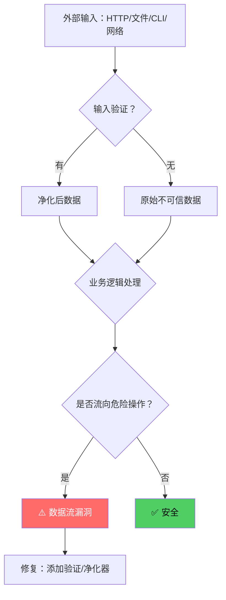
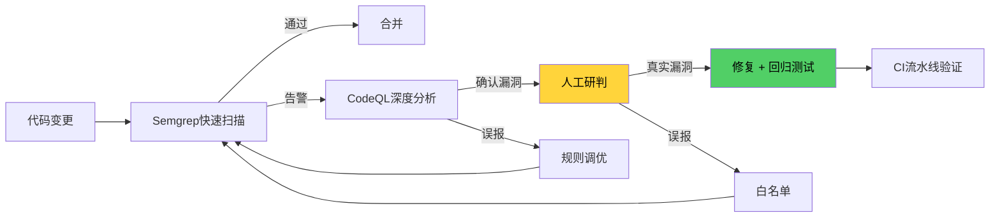

## 四、本节小结

本节通过七个真实CVE案例和两类实战审计场景，系统展示了代码审计从发现到修复的完整流程。本节小结将从**漏洞模式归纳**、**审计方法论提炼**、**工具链协同策略**、**常见误区纠正**以及**进阶方向指引**五个维度，帮助读者将分散的案例知识整合为可复用的审计能力框架。

---

### 4.1 七大案例全景回顾

本节覆盖的案例横跨四个技术领域，每个案例都代表一类典型漏洞模式。以下表格从漏洞类型、根因分类、影响范围、审计方法四个维度进行横向对比：

| 案例 | CVE编号 | 漏洞类型 | 根因分类 | CVSS | 审计方法 |
|------|---------|----------|----------|------|----------|
| Log4Shell | CVE-2021-44228 | JNDI注入→RCE | 不可信数据流向危险操作 | 10.0 | CodeQL污点追踪 |
| HTTP/2 Rapid Reset | CVE-2023-44487 | 资源耗尽→DoS | 协议状态机边界条件缺陷 | 7.5 | Semgrep模式匹配 |
| xz-utils后门 | CVE-2024-3094 | 供应链后门 | 构建系统被篡改 | N/A | 性能异常+反汇编 |
| Linux内核堆溢出 | CVE-2022-0185 | 堆溢出→提权 | 累积长度检查缺陷 | 7.8 | CodeQL数据流分析 |
| PHP SQL注入 | — | SQL注入→数据泄露 | 用户输入直接拼接SQL | — | Semgrep污点分析 |
| Node.js原型污染 | — | 原型污染→权限提升 | 对象合并未过滤危险属性 | — | Semgrep模式匹配 |
| OpenSSL缓冲区溢出 | — | 缓冲区溢出→RCE | 协议解析长度验证缺失 | — | CodeQL缓冲区分析 |

> **核心观察**：七个案例中，**五个**涉及"不可信数据流向危险操作"（Log4Shell、SQL注入、原型污染、HTTP/2 Rapid Reset、OpenSSL），占比71%。这验证了一个基本规律：**数据流追踪是代码审计的第一优先级**。

---

### 4.2 漏洞模式归纳：从案例到方法论

通过对七个案例的根因分析，可以将代码审计中的漏洞模式归纳为以下五大类别：

#### 4.2.1 数据流漏洞：不可信输入直达危险操作

这是本节案例中最常见的模式，占所有案例的71%。其本质是**污点分析**中的"源→汇"路径未被有效阻断。

**典型场景**：

- **Log4Shell**：用户输入的日志消息 → JndiLookup.lookup() → JNDI远程查找 → 恶意类加载执行
- **PHP SQL注入**：$_GET参数 → 字符串拼接 → mysqli_query() → 数据库执行
- **Node.js原型污染**：req.body → deepMerge() → __proto__属性赋值 → 全局对象污染

**审计方法**：

1. **识别"源"**：所有外部输入点（HTTP请求、文件读取、命令行参数、环境变量、网络套接字）
2. **识别"汇"**：所有危险操作（数据库查询、命令执行、文件操作、对象反序列化、网络请求）
3. **追踪路径**：使用CodeQL污点分析或Semgrep污点模式，追踪源到汇的完整路径
4. **检查净化器**：路径中是否存在有效的输入验证、类型转换、白名单过滤



**修复原则**：在源和汇之间插入至少一层净化器，且净化器本身必须是安全的（不能引入新的绕过路径）。

#### 4.2.2 边界条件漏洞：长度、大小、索引的验证缺失

这类漏洞在C/C++和系统级代码中尤为突出，是缓冲区溢出、整数溢出、越界访问的根源。

**典型场景**：

- **Linux内核堆溢出**：mount选项的累积长度超过固定PAGE_SIZE缓冲区，但检查逻辑存在缺陷
- **OpenSSL缓冲区溢出**：协议解析中长度字段未与实际数据大小对比
- **HTTP/2 Rapid Reset**：快速连续RST_STREAM导致资源计数与实际分配不匹配

**审计方法**：

1. **枚举所有缓冲区操作**：malloc/kmalloc/alloca → memcpy/memmove/read/write → free/kfree
2. **检查每个长度参数**：来源是否可信？是否经过验证？是否可能溢出？
3. **追踪累积状态**：多次调用中累积的变量（计数器、缓冲区指针、大小字段）是否正确维护？
4. **验证边界条件**：空输入、最大输入、负数输入、零长度输入的处理是否正确？

```c
// 审计检查清单：缓冲区操作
// 对每个memcpy/memmove调用，检查以下四个条件：
// 1. 目标缓冲区是否已分配？
// 2. 目标缓冲区大小是否已知且可信？
// 3. 源数据大小是否经过验证？
// 4. 源大小 <= 目标大小？

// 不安全示例（Linux内核CVE-2022-0185模式）：
char *buf = kmalloc(PAGE_SIZE, GFP_KERNEL);  // 固定大小
size_t offset = 0;
// 多次调用累积写入，但检查不充分
if (offset + len > PAGE_SIZE) { /* 检查有缺陷 */ }
memcpy(buf + offset, data, len);  // 可能溢出
offset += len;

// 安全示例：
size_t remaining = PAGE_SIZE - offset;
if (len > remaining) return -EINVAL;  // 严格检查
memcpy(buf + offset, data, len);
offset += len;
```

**修复原则**：采用"安全余量"策略——在分配大小和实际使用之间预留至少32字节的边界，防止边界对齐问题导致的意外溢出。

#### 4.2.3 供应链漏洞：构建系统和依赖管理的攻击面

xz-utils后门案例揭示了一个被长期忽视的攻击面：**构建过程本身可能被篡改**。

**攻击链分析**：

```text
攻击者获取维护者权限
    ↓
在测试文件中嵌入加密后门数据
    ↓
修改构建脚本（build-to-host）
    ↓
构建时解密并注入后门代码到目标文件
    ↓
后门通过IFUNC机制hook关键函数
    ↓
运行时触发SSH认证绕过
```

**审计方法**：

1. **构建脚本审计**：所有构建脚本（Makefile、CMakeLists.txt、build.sh、setup.py）都应纳入审计范围
2. **测试数据审计**：测试文件（尤其是二进制测试数据）可能包含隐藏的payload
3. **依赖完整性校验**：使用SLSA框架或类似机制验证构建产物的完整性
4. **贡献者身份验证**：关键提交应有多人review，维护者权限变更应有审计日志
5. **运行时异常检测**：性能异常（如xz案例中SSH延迟增加500ms）可能是后门的信号

**修复原则**：

- 采用**可重现构建（Reproducible Build）**：相同源码在相同环境下应产生相同的二进制产物
- 实施**供应链安全框架**（如SLSA Level 3+）：确保从源码到部署的每个环节都可验证
- 对关键依赖使用**签名验证**：确保下载的依赖包未被篡改

#### 4.2.4 协议解析漏洞：状态机和长度字段的陷阱

HTTP/2 Rapid Reset和OpenSSL缓冲区溢出都涉及协议解析中的边界条件缺陷。协议实现是代码审计的"重灾区"，因为协议规范复杂、边界条件多、实现代码量大。

**常见陷阱**：

- **长度字段与实际数据不匹配**：协议头声明的长度大于实际数据，或小于实际数据
- **状态机转换不完整**：某些状态组合未被正确处理（如RST_STREAM在特定状态下的行为）
- **资源生命周期管理**：协议连接的生命周期中，资源分配和释放的配对关系
- **扩展字段处理**：协议扩展字段的默认行为和安全假设

**审计方法**：

1. **协议规范对照**：将代码实现与RFC/协议规范逐条对照，检查是否有遗漏或偏差
2. **状态机建模**：绘制协议状态转换图，检查所有状态转换路径是否都有对应的代码处理
3. **边界条件测试**：使用Fuzzing对协议解析器进行持续测试（OSS-Fuzz是开源项目的首选）
4. **资源审计**：追踪每个协议连接/流的生命周期，确保资源分配和释放严格配对

#### 4.2.5 业务逻辑漏洞：自动化工具的盲区

虽然本节案例以技术型漏洞为主，但需要指出：**原型污染**本质上是一个业务逻辑漏洞——它利用的是JavaScript语言特性，而非某个具体的函数缺陷。这类漏洞往往无法被SAST工具直接发现，需要人工审计。

**审计方法**：

1. **威胁建模**：从攻击者视角思考"如果我是攻击者，我会利用哪些业务逻辑缺陷？"
2. **权限审计**：检查所有权限判断逻辑，是否存在越权访问的可能性
3. **状态审计**：检查业务状态转换逻辑，是否存在竞态条件或状态绕过

---

### 4.3 审计方法论提炼：从案例到通用流程

基于七个案例的审计实践，可以提炼出以下通用审计流程：

#### 阶段一：信息收集与威胁建模

```text
输入：目标代码仓库
输出：威胁模型 + 审计范围

步骤：
1. 技术栈识别：语言、框架、依赖库
2. 架构理解：数据流图、组件交互图
3. 攻击面枚举：所有外部输入点、网络接口、文件操作
4. 威胁建模：STRIDE方法，识别每个组件的潜在威胁
5. 优先级排序：根据攻击面大小和漏洞历史确定审计重点
```

#### 阶段二：自动化扫描

```text
输入：威胁模型 + 审计范围
输出：漏洞候选列表

步骤：
1. SAST扫描：Semgrep快速扫描 + CodeQL深度分析
2. 依赖检查：SCA工具检查已知CVE
3. 配置审计：检查安全配置项（CSP、CORS、TLS等）
4. 结果去重：合并多个工具的告警，去除重复项
5. 优先级排序：按CVSS评分和实际可利用性排序
```

#### 阶段三：人工深度审计

```text
输入：漏洞候选列表
输出：确认的漏洞 + 修复建议

步骤：
1. 逐条研判：确认每条告警是否为真实漏洞
2. 攻击链分析：构建完整的攻击路径
3. 影响评估：确定漏洞的实际危害范围
4. 修复方案：提供具体的代码修复建议
5. 回归验证：确认修复不会引入新问题
```

#### 阶段四：持续监控

```text
输入：修复后的代码
输出：持续的安全保障

步骤：
1. CI/CD集成：将SAST扫描集成到CI流水线
2. 定期审计：每季度进行一次全面审计
3. 威胁情报：关注新披露的CVE和漏洞模式
4. 安全培训：提升开发团队的安全意识
```

---

### 4.4 工具链协同策略：自动化与人工的平衡

本节案例展示了三种工具的使用场景：

| 工具 | 适用场景 | 本节案例 | 优势 | 局限 |
|------|----------|----------|------|------|
| **Semgrep** | 快速模式匹配、CI门禁 | SQL注入、原型污染、HTTP/2 Rapid Reset | 速度快、规则灵活、易集成 | 语义分析能力有限 |
| **CodeQL** | 深度语义分析、污点追踪 | Log4Shell、Linux内核堆溢出、OpenSSL | 精确的污点分析、跨文件追踪 | 学习成本高、扫描速度慢 |
| **人工审计** | 复杂逻辑、供应链、业务漏洞 | xz-utils后门、原型污染 | 理解上下文、发现设计缺陷 | 效率低、依赖经验 |

**协同策略**：



**核心原则**：

1. **Semgrep做守门人**：在CI阶段快速拦截已知模式的漏洞，阻断高风险提交
2. **CodeQL做深挖者**：对Semgrep发现的可疑路径进行深度分析，确认攻击链
3. **人工做最终裁决**：对高影响、复杂逻辑的漏洞进行最终确认和修复方案设计
4. **反馈闭环**：将人工审计的发现转化为Semgrep规则，提升自动化覆盖率

---

### 4.5 常见误区与纠正

#### 误区一：修复了漏洞就等于安全了

**错误认知**："Log4Shell修复后，我们的Java应用就安全了。"

**纠正**：Log4Shell修复只解决了JNDI注入这一个漏洞。但Log4j 2.x还存在其他漏洞（如CVE-2021-45105、CVE-2021-44832），且修复方案可能引入新的问题。正确的做法是：

1. **升级而非修补**：优先升级到官方修复版本，而非自行修补代码
2. **全面扫描**：修复后对整个代码库重新扫描，确认没有类似的未修复漏洞
3. **回归测试**：验证修复不会破坏正常功能

#### 误区二：开源项目一定安全

**错误认知**："xz-utils是开源的，社区审核过，应该没问题。"

**纠正**：xz-utils后门案例证明，开源不等于安全。攻击者可以通过社会工程学获取维护者权限，在构建过程中植入后门。正确的做法是：

1. **验证构建产物**：使用可重现构建验证二进制产物与源码的一致性
2. **监控异常行为**：关注性能异常、网络异常等运行时信号
3. **多元化信任**：不要依赖单一维护者或单一构建系统

#### 误区三：工具告警越多越好

**错误认知**："我把所有安全工具都接入，告警越多越安全。"

**纠正**：过多的告警会导致"告警疲劳"，安全团队会忽略真正重要的漏洞。正确的做法是：

1. **精准配置**：只启用与项目相关的规则，禁用无关告警
2. **定期评审**：每季度评审告警分布，识别高噪声规则并优化
3. **量化指标**：跟踪"真实漏洞数 / 总告警数"比率，目标应高于20%

#### 误区四：审计是一次性活动

**错误认知**："我们做过一次全面审计，代码是安全的。"

**纠正**：代码是持续变化的，每次变更都可能引入新的漏洞。正确的做法是：

1. **持续集成**：将安全扫描集成到CI/CD流水线，每次提交都自动扫描
2. **定期审计**：每季度进行一次全面审计，每年进行一次深度审计
3. **威胁情报**：关注新披露的CVE和漏洞模式，及时评估对现有代码的影响

---

### 4.6 从实战到体系：代码审计能力成熟度模型

基于本节的案例分析和审计实践，可以将代码审计能力分为五个成熟度等级：

| 等级 | 名称 | 特征 | 工具使用 | 人工投入 |
|------|------|------|----------|----------|
| **L1** | 初始级 | 依赖开发人员自查，无系统化流程 | 无 | 高 |
| **L2** | 工具级 | 引入SAST工具，但无系统化流程 | Semgrep | 中 |
| **L3** | 流程级 | 建立审计流程，工具+人工结合 | Semgrep + CodeQL | 中 |
| **L4** | 量化级 | 量化安全指标，持续改进 | 全工具链 + 自动化 | 低 |
| **L5** | 优化级 | 安全左移，开发即安全 | DevSecOps全链路 | 极低 |

**从L1到L5的演进路径**：

1. **L1→L2**：引入Semgrep，配置官方规则库，集成到CI流水线
2. **L2→L3**：引入CodeQL，建立人工审计流程，制定漏洞修复SLA
3. **L3→L4**：量化安全指标（漏洞密度、修复时间、漏报率），建立安全度量体系
4. **L4→L5**：安全左移，将安全要求融入需求分析和设计阶段，实现"开发即安全"

---

### 4.7 本节要点速查表

```text
┌─────────────────────────────────────────────────────────────┐
│                     本节要点速查                            │
├─────────────────────────────────────────────────────────────┤
│                                                             │
│  七大案例模式                                               │
│  ├─ 数据流漏洞（5/7）：不可信输入→危险操作                  │
│  ├─ 边界条件（2/7）：长度/大小/索引验证缺失                  │
│  ├─ 供应链（1/7）：构建系统被篡改                            │
│  ├─ 协议解析（2/7）：状态机/长度字段陷阱                     │
│  └─ 业务逻辑（1/7）：原型污染等语言特性滥用                  │
│                                                             │
│  审计方法论                                                 │
│  ├─ 信息收集：技术栈识别 + 威胁建模                         │
│  ├─ 自动扫描：SAST + SCA + 配置审计                         │
│  ├─ 人工审计：研判 + 攻击链分析 + 修复方案                   │
│  └─ 持续监控：CI集成 + 定期审计 + 威胁情报                   │
│                                                             │
│  工具链协同                                                 │
│  ├─ Semgrep：守门人（CI门禁）                               │
│  ├─ CodeQL：深挖者（深度分析）                              │
│  └─ 人工：最终裁决（复杂逻辑）                              │
│                                                             │
│  核心原则                                                   │
│  ├─ 数据流追踪是第一优先级                                  │
│  ├─ 边界检查永远不够（预留安全余量）                        │
│  ├─ 供应链安全不可忽视（可重现构建）                        │
│  ├─ 协议解析是重灾区（Fuzzing持续测试）                     │
│  └─ 自动化工具是起点，人工审计是保障                        │
│                                                             │
│  常见误区                                                   │
│  ├─ 修复了漏洞≠安全（需全面扫描+回归测试）                  │
│  ├─ 开源≠安全（需验证构建产物）                            │
│  ├─ 告警越多≠越好（需精准配置+定期评审）                    │
│  └─ 审计不是活动（需持续集成+定期审计）                     │
│                                                             │
└─────────────────────────────────────────────────────────────┘
```

---

### 4.8 从本节到下一节：从案例到体系

本节通过七个真实案例展示了代码审计的"术"——如何发现和分析具体漏洞。下一节（第33章）将进入**安全开发生命周期（SDL）**的体系化讨论，将本节的审计能力融入软件开发的全生命周期。

**核心过渡**：

- 本节解决的是**"如何发现漏洞"**的问题
- 下一节解决的是**"如何防止漏洞产生"**的问题
- 从"事后审计"到"事前预防"，是安全成熟度的关键跃迁

通过本节的系统学习，读者应当：

1. **理解**：七大案例背后的五大漏洞模式及其根因
2. **掌握**：从信息收集到持续监控的完整审计流程
3. **应用**：根据项目特点选择合适的工具链协同策略
4. **进阶**：了解从L1到L5的能力成熟度演进路径

下一节将讨论如何将代码审计能力融入安全开发生命周期，实现从"事后补救"到"事前预防"的转变。