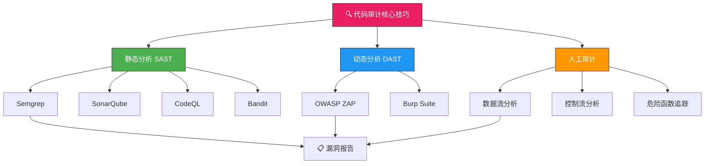
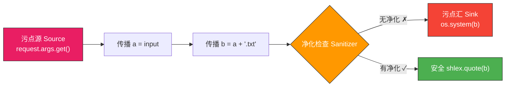
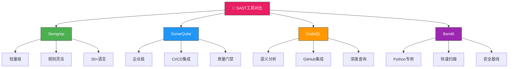
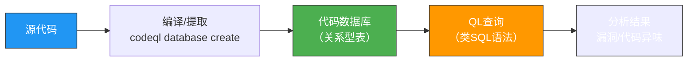
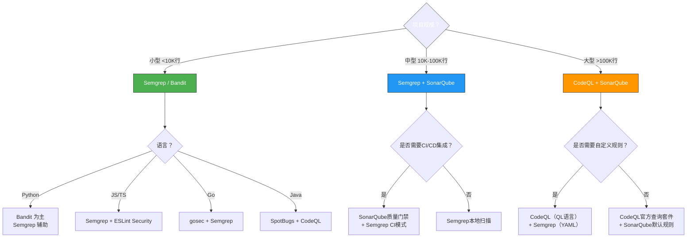

## 一、静态分析（SAST）



静态应用安全测试（Static Application Security Testing，SAST）是在不运行程序的情况下，通过分析源代码、字节码或二进制代码来发现安全漏洞的技术。它是代码审计中最基础、最高频使用的技巧，也是"安全左移"理念的核心实现手段。SAST工具能在开发的最早期阶段——甚至在代码编写过程中——就识别出潜在的安全风险，将修复成本降至最低。

### 1.1 SAST的工作原理

SAST工具并非简单地做文本搜索，其底层依赖多种程序分析技术来理解代码语义：

**抽象语法树（AST）解析**

所有现代SAST工具的第一步都是将源代码解析为抽象语法树。AST将代码的语法结构表示为树形数据结构，每个节点代表代码中的一个语法元素（变量声明、函数调用、条件判断等）。基于AST，工具能够：

- 识别代码结构，而非仅做文本匹配
- 理解变量作用域和生命周期
- 追踪函数调用关系

```text
// 源代码
result = eval(user_input)

// AST表示（简化）
AssignmentExpr
├── target: Identifier("result")
└── value: CallExpr
    ├── function: Identifier("eval")
    └── arguments: [Identifier("user_input")]
```

**数据流分析（Data Flow Analysis）**

数据流分析追踪程序中数据的传播路径。它构建"定义-使用链"（Definition-Use Chain），记录每个变量在哪里被赋值（定义点）、在哪里被读取（使用点）。通过数据流分析，SAST工具可以判断一个危险函数的参数是否源自不可信的用户输入。

**污点追踪（Taint Tracking）**

污点追踪是数据流分析的高级形式，也是SAST最核心的安全分析能力。其基本模型为：

| 组件 | 含义 | 示例 |
|------|------|------|
| **污点源（Source）** | 数据进入程序的入口点 | `request.args.get()`、`argv[1]` |
| **传播路径（Propagation）** | 污点数据在程序中的流动 | 赋值传递、函数参数传递、数组/对象成员传递 |
| **净化点（Sanitizer）** | 对污点数据进行安全处理 | `shlex.quote()`、参数化查询、输入验证 |
| **污点汇（Sink）** | 执行危险操作的位置 | `os.system()`、`execute()`、`render_template_string()` |

当污点源的数据未经净化直接到达污点汇时，即判定存在安全漏洞。



**控制流分析（Control Flow Analysis）**

控制流分析构建程序的控制流图（CFG），理解代码的执行路径。它能够发现：

- 不可达代码（dead code）中隐藏的后门
- 条件分支中缺失的安全检查
- 异常处理路径中的安全漏洞（如catch块中未正确处理错误）
- 竞态条件（Race Condition）——两条执行路径对共享资源的非原子操作

**过程间分析（Inter-procedural Analysis）**

最强大的SAST工具能够跨越函数边界进行分析。当数据通过函数调用传递时，过程间分析能够追踪参数在被调用函数内部的流向，而非仅仅局限于单个函数内部。这是区分企业级工具和轻量级工具的关键能力——CodeQL和Semgrep的污点模式都支持跨函数追踪。

### 1.2 SAST vs DAST vs IAST

在安全测试工具谱系中，SAST、DAST和IAST各有其定位和适用场景：

| 维度 | SAST（静态分析） | DAST（动态分析） | IAST（交互式分析） |
|------|-----------------|-----------------|-------------------|
| **分析对象** | 源代码/字节码 | 运行中的应用 | 运行中的应用+源码 |
| **是否需要运行** | 否 | 是 | 是 |
| **分析时机** | 编码/构建阶段 | 测试/生产阶段 | 测试阶段 |
| **覆盖率** | 全代码路径（含死代码） | 仅已执行路径 | 已执行路径 |
| **误报率** | 中-高（依赖工具精度） | 低 | 低 |
| **漏报率** | 中（不理解运行时环境） | 高（依赖爬虫覆盖率） | 低 |
| **典型工具** | Semgrep、CodeQL、SonarQube | OWASP ZAP、Burp Suite | OpenRASP、Contrast |
| **CI/CD集成** | 容易 | 较难（需部署环境） | 中等（需插桩） |
| **业务逻辑漏洞** | 难以发现 | 可以发现 | 可以发现 |
| **代码级修复指导** | 精确到行号 | 仅报告URL/参数 | 精确到调用栈 |

> **实践建议**：SAST和DAST不是替代关系，而是互补关系。SAST擅长发现代码层面的模式缺陷（如SQL注入、XSS），DAST擅长发现配置和运行时问题（如安全头缺失、认证绕过）。成熟的DevSecOps流程会同时集成两者。

### 1.3 Semgrep



Semgrep（Semantic Grep）是由 r2c（现为 Semgrep Inc.）开发的开源静态分析工具，以其轻量级、易上手、规则灵活著称。它支持30+编程语言，能够通过简洁的模式匹配语法定义安全规则，在GitHub上拥有超过8,000颗星。Semgrep的核心设计哲学是"让安全规则像写代码一样自然"——规则本身就是代码模式，而非复杂的查询语言。

**核心概念**

Semgrep的规则由三个核心部分组成：

- **模式（Pattern）**：要匹配的代码模式，使用 Semgrep 的元变量语法（如 `$VAR` 匹配任意变量名）
- **消息（Message）**：匹配到时的报告信息，应清晰说明问题和修复建议
- **严重性（Severity）**：发现的问题等级——`ERROR`（必须修复）、`WARNING`（建议修复）、`INFO`（信息性提示）

**基础安装与使用**

```bash
# 安装Semgrep（推荐使用pip，需要Python 3.9+）
pip install semgrep

# 验证安装
semgrep --version

# 使用OWASP官方规则集扫描
semgrep --config=p/owasp-top-ten .

# 使用多种规则集扫描（组合不同规则包）
semgrep --config=p/owasp-top-ten --config=p/security-audit .

# 自动检测语言并扫描
semgrep --config=auto --lang=python .

# 输出JSON格式报告（便于后续处理）
semgrep --config=auto --json --output=report.json .

# 输出SARIF格式（GitHub Code Scanning兼容）
semgrep --config=p/owasp-top-ten --sarif -o report.sarif .

# 仅扫描特定目录
semgrep --config=p/owasp-top-ten ./src/ ./app/

# 排除目录
semgrep --config=p/owasp-top-ten --exclude='tests' --exclude='vendor' .

# 使用Semgrep Cloud的托管规则（需要API token）
semgrep --config=p/security-audit --config=p/secrets .
```

**自定义规则编写**

Semgrep使用YAML格式定义规则，核心是模式匹配语法。元变量（以`$`开头）匹配任意标识符，`...`匹配任意参数序列或代码片段：

```yaml
# rules/sql-injection.yaml
rules:
  - id: python-sql-injection
    patterns:
      - pattern: |
          $QUERY = f"...{...}..."
          $CONN.execute($QUERY)
      - pattern-not: |
          $QUERY = f"...{...}..."
          $CONN.execute($QUERY, ...)
    message: >
      检测到可能的SQL注入漏洞：使用f-string构建SQL查询。
      请使用参数化查询替代字符串拼接。
    languages: [python]
    severity: ERROR
    metadata:
      cwe:
        - "CWE-89: Improper Neutralization of Special Elements used in an SQL Command"
      owasp:
        - A03:2021 - Injection
      confidence: HIGH
```

**Semgrep模式匹配语法详解**

| 语法 | 含义 | 示例 |
|------|------|------|
| `$VAR` | 匹配任意变量名 | `$X = "hello"` 匹配 `name = "hello"` |
| `...` | 匹配任意数量参数 | `foo(...)` 匹配 `foo(1, 2, 3)` |
| `"...${...}..."` | 匹配含插值的字符串 | `f"...{$X}..."` |
| `$FUNC(...)` | 匹配任意函数调用 | `$FUNC($X)` |
| `pattern-not` | 排除匹配（否定模式） | 排除已修复的情况 |
| `pattern-either` | 多选匹配（OR逻辑） | 匹配多种危险模式之一 |
| `patterns` | 组合匹配（AND逻辑） | 同时满足多个条件 |
| `pattern-inside` | 限定匹配范围 | 限定在特定代码结构内部 |

**高级模式匹配实战**

```yaml
# 规则：检测不安全的随机数生成用于安全场景
rules:
  - id: insecure-random-for-security
    pattern-either:
      - pattern: random.randint(...)
      - pattern: random.random()
      - pattern: random.choice(...)
    paths:
      include:
        - "*auth*"
        - "*token*"
        - "*session*"
        - "*crypto*"
    message: >
      在安全相关上下文中使用了不安全的随机数生成器。
      应使用secrets模块或os.urandom()。
    languages: [python]
    severity: WARNING

  # 规则：检测硬编码密钥
  - id: hardcoded-secret
    pattern-either:
      - pattern: |
          $KEY = "AKIA..."
      - pattern: |
          $KEY = "sk-..."
      - pattern: |
          password = "..."
    message: 检测到可能的硬编码凭据
    languages: [python, javascript, java]
    severity: ERROR
```

**Semgrep污点追踪（Taint Mode）**

污点追踪是Semgrep最强大的功能之一，可以追踪数据从源到汇的流动，自动跨越赋值、函数调用等传播步骤：

```yaml
# taint-rules/command-injection.yaml
rules:
  - id: command-injection-taint
    mode: taint
    pattern-sources:
      - pattern: request.args.get(...)
      - pattern: request.form.get(...)
      - pattern: request.json.get(...)
    pattern-sinks:
      - pattern: os.system(...)
      - pattern: subprocess.call(...)
      - pattern: subprocess.Popen(...)
    pattern-sanitizers:
      - pattern: shlex.quote(...)
    message: >
      检测到命令注入：用户输入流向命令执行函数，
      且未经过充分的净化处理。
    languages: [python]
    severity: ERROR
```

```yaml
# 高级污点追踪：跨函数路径分析
rules:
  - id: sqli-through-service-layer
    mode: taint
    pattern-sources:
      - pattern: |
          def $FUNC(...):
              ...
              $DATA = request.args.get(...)
              return $DATA
    pattern-sinks:
      - pattern: |
          $CONN.execute($QUERY, ...)
    pattern-sanitizers:
      - pattern: |
          $SAFE = $DB.escape_string(...)
    message: >
      SQL注入：用户输入通过服务层函数传递到数据库查询，
      中间未做转义处理。
    languages: [python]
    severity: ERROR
```

**Semgrep实战扫描流程**

```bash
# 1. 首次全面扫描（使用多种规则集）
semgrep --config=p/owasp-top-ten --config=p/security-audit \
        --config=p/secrets --json -o initial-scan.json .

# 2. 分析结果统计
cat initial-scan.json | jq '.results | group_by(.extra.severity) | map({severity: .[0].extra.severity, count: length})'

# 3. 针对性深度扫描（使用污点分析规则）
semgrep --config=custom/taint-rules/ --json -o taint-scan.json .

# 4. 生成SARIF格式报告（用于GitHub Code Scanning集成）
semgrep --config=p/owasp-top-ten --sarif -o report.sarif .

# 5. 生成HTML格式报告（便于人工审阅）
semgrep --config=p/owasp-top-ten --html -o report.html .

# 6. 仅扫描Git差异（增量扫描，CI/CD中常用）
semgrep --config=p/owasp-top-ten --diff \
        --baseline-ref=HEAD~1 .

# 7. 验证规则（确保自定义规则语法正确）
semgrep --test --config=custom-rules/ .
```

**Semgrep的局限性**

- **不支持跨文件的数据流追踪**：免费版的污点分析局限于单个文件内；Semgrep Cloud Pro版本支持跨文件分析
- **基于模式匹配而非语义分析**：无法理解复杂的业务逻辑漏洞（如权限绕过、业务流程缺陷）
- **需要持续维护规则**：自定义规则需要随代码变更和新漏洞类型更新
- **编译型语言支持有限**：对C/C++等需要编译的语言，分析精度不如基于编译器的工具

### 1.4 CodeQL

CodeQL是GitHub开发的语义代码分析引擎，将代码转换为可查询的数据库，使用类SQL查询语言（QL）进行深度安全分析。CodeQL是目前业界最强大的静态分析工具之一，支持C/C++、Java、JavaScript/TypeScript、Python、Go、Ruby、Rust等主流语言。

**核心概念**

CodeQL的工作流程是一个将代码"数据库化"再"查询化"的过程：



代码数据库将程序的各个方面存储为关系表：函数签名表、变量绑定表、控制流边表、AST节点表等。QL查询就是在这些表上运行的逻辑查询，类似于在代码的"语义快照"上执行SQL。

**CodeQL CLI安装与使用**

```bash
# 下载CodeQL CLI（各平台二进制）
# https://github.com/github/codeql-cli-binaries/releases

# 克隆CodeQL标准查询库
git clone --depth 1 https://github.com/github/codeql.git

# 设置CODEQL_HOME环境变量
export CODEQL_HOME=$HOME/codeql
export PATH=$CODEQL_HOME:$PATH

# 创建CodeQL数据库（以Python为例）
codeql database create \
  --language=python \
  --source-root=. \
  --db=my-database \
  my-python-project

# 创建JavaScript数据库（自动提取，无需编译）
codeql database create \
  --language=javascript \
  --source-root=. \
  --db=js-database \
  my-js-project

# 使用官方查询套件运行分析
codeql database analyze \
  my-database \
  codeql/python-queries:Security \
  --format=sarif-latest \
  --output=results.sarif

# 使用自定义查询目录
codeql database analyze \
  my-database \
  custom-queries/ \
  --format=csv \
  --output=results.csv

# 查看数据库包含的表
codeql dataset schema my-database --format=json | jq '.tables | keys'

# 运行单条查询
codeql query run \
  --database=my-database \
  --output=output.bqrs \
  custom-query.ql

# 解码查询结果
codeql bqrs decode \
  --format=json \
  --output=results.json \
  output.bqrs
```

**QL查询语言基础**

QL（Query Language）是一种面向对象的逻辑编程语言，语法类似于Datalog和SQL的结合体。其核心结构是"from...where...select"三段式：

```ql
/**
 * 查找所有SQL注入漏洞
 * @id python/sql-injection
 * @severity error
 */

import python
import semmle.python.security.dataflow.SqlInjectionQuery
import SqlInjectionFlow::PathGraph

from SqlInjectionFlow::PathNode source, SqlInjectionFlow::PathNode sink
where SqlInjectionFlow::flowPath(source, sink)
select sink.getNode(), source, sink,
  "SQL查询中使用了未经验证的用户输入 $@.", 
  source.getNode(), "user input"
```

**自定义CodeQL查询示例**

```ql
/**
 * 查找Python中的命令注入漏洞
 * @id python/command-injection
 */

import python
import semmle.python.security.dataflow.CommandInjectionQuery

// 定义数据源（用户输入）
class UserInput extends CommandInjectionFlow::Source {
  UserInput() {
    this.(CallNode).getFunction().(AttrNode).getName() in [
      "get", "form", "args", "json", "data"
    ]
  }
}

// 定义危险汇点（命令执行）
class CommandSink extends CommandInjectionFlow::Sink {
  CommandSink() {
    this.(CallNode).getFunction().(AttrNode).getName() in [
      "system", "popen", "exec", "call"
    ]
  }
}

// 追踪数据流
from CommandInjectionFlow::PathNode source, CommandInjectionFlow::PathNode sink
where CommandInjectionFlow::flowPath(source, sink)
select sink.getNode(), source, sink,
  "命令注入：未经验证的用户输入 $@ 被传递给系统命令执行.",
  source.getNode(), "user input"
```

**CodeQL高级用法：自定义污点追踪**

```ql
// 自定义污点传播规则
class TaintStep extends TaintTracking::Configuration {
  TaintStep() { this = "CustomTaintStep" }
  
  override predicate isSource(DataFlow::Node source) {
    source.asCfgNode().(CallNode).getFunction().getName() = "get_user_input"
  }
  
  override predicate isSink(DataFlow::Node sink) {
    sink.asCfgNode().(CallNode).getFunction().getName() = "execute_query"
  }
  
  override predicate isSanitizer(DataFlow::Node node) {
    node.asCfgNode().(CallNode).getFunction().getName() = "sanitize_input"
  }
  
  // 自定义污点传播步骤：处理JSON解析的传播
  override predicate isAdditionalTaintStep(DataFlow::Node pred, DataFlow::Node succ) {
    exists(CallNode call |
      call.getFunction().getName() = "parse_json" and
      pred.asCfgNode() = call.getArg(0) and
      succ.asCfgNode() = call
    )
  }
}
```

**CodeQL GitHub Actions集成**

```yaml
# .github/workflows/codeql.yml
name: "CodeQL Analysis"

on:
  push:
    branches: [main]
  pull_request:
    branches: [main]
  schedule:
    - cron: '0 6 * * 1'  # 每周一早上6点

jobs:
  analyze:
    runs-on: ubuntu-latest
    permissions:
      security-events: write
    
    strategy:
      matrix:
        language: ['python', 'javascript', 'java']
    
    steps:
      - uses: actions/checkout@v4
      
      - name: Initialize CodeQL
        uses: github/codeql-action/init@v3
        with:
          languages: ${{ matrix.language }}
          queries: security-extended
          # 使用自定义配置（可选）
          # config-file: .github/codeql/codeql-config.yml
      
      - name: Autobuild
        uses: github/codeql-action/autobuild@v3
      
      - name: Perform CodeQL Analysis
        uses: github/codeql-action/analyze@v3
        with:
          category: "/language:${{ matrix.language }}"
```

**CodeQL的优势与局限**

| 维度 | 说明 |
|------|------|
| **优势** | 深度语义分析、精确的数据流追踪、QL语言表达力强、GitHub原生集成 |
| **局限** | 构建型语言需要完整编译环境、数据库创建耗时（大型项目可能数十分钟）、QL学习曲线陡峭 |
| **适用场景** | 大型代码库深度审计、自定义漏洞检测规则开发、安全研究和CVE挖掘 |

### 1.5 SonarQube

SonarQube是最广泛使用的企业级代码质量与安全分析平台，由SonarSource开发。它不仅关注安全漏洞，还覆盖代码质量（可维护性、可靠性、技术债务）和代码覆盖率等维度。在DevSecOps体系中，SonarQube通常作为"质量门禁"的核心组件。

**核心特性**

- **多维度分析**：安全漏洞（SAST）+ 代码异味（Code Smell）+ Bug + 安全覆盖率
- **质量门禁（Quality Gate）**：可配置的质量阈值，不达标则阻止合并/部署
- **多分支分析**：支持对Git分支和PR进行独立分析
- **持续追踪**：记录代码质量随时间的变化趋势
- **丰富的插件生态**：支持安全规则扩展、自定义分析器

**安装与配置**

```bash
# Docker方式快速部署SonarQube（推荐）
docker run -d --name sonarqube \
  -p 9000:9000 \
  -e SONAR_ES_BOOTSTRAP_CHECKS_DISABLE=true \
  sonarqube:latest

# 默认访问地址：http://localhost:9000
# 默认账号：admin / admin（首次登录需修改密码）

# 使用SonarScanner扫描项目
# 安装sonar-scanner CLI
# https://docs.sonarsource.com/sonarqube/latest/analyzing-source-code/scanners/sonarscanner/

# 项目级配置（sonar-project.properties）
cat > sonar-project.properties << 'EOF'
sonar.projectKey=my-project
sonar.sources=./src
sonar.tests=./tests
sonar.language=python
sonar.python.coverage.reportPaths=coverage.xml
sonar.qualitygate.wait=true
EOF

# 运行扫描
sonar-scanner

# 使用Maven集成（Java项目）
mvn sonar:sonar \
  -Dsonar.host.url=http://localhost:9000 \
  -Dsonar.login=<token>
```

**质量门禁配置示例**

在SonarQube的"Quality Gates"中配置阈值规则：

| 指标 | 门禁条件 | 说明 |
|------|---------|------|
| 新代码Bug数 | = 0 | 新增代码不允许存在Bug |
| 新代码漏洞数 | = 0 | 新增代码不允许存在安全漏洞 |
| 新代码安全热点审查率 | >= 100% | 安全热点必须全部审查 |
| 新代码覆盖率 | >= 80% | 新增代码测试覆盖率不低于80% |
| 新代码重复率 | <= 3% | 新增代码重复率控制在3%以内 |
| 可维护性评级 | = A | 新增代码可维护性评级为A |

### 1.6 其他静态分析工具

| 工具 | 语言 | 特点 | 适用场景 |
|------|------|------|----------|
| Bandit | Python | 专注Python安全，开箱即用 | Python项目快速安全扫描 |
| ESLint + security插件 | JavaScript/TypeScript | 可扩展性强，生态丰富 | Node.js/前端项目 |
| SpotBugs + FindSecBugs | Java | 深度字节码分析 | Java应用 |
| Brakeman | Ruby | Rails专用，零配置 | Ruby on Rails |
| gosec | Go | Go安全专用，内置于Go工具链 | Go项目 |
| Trivy | 多语言 | 依赖漏洞扫描，容器安全 | 供应链安全 |
| Coverity | 多语言 | 高精度，企业级 | 大型C/C++项目 |
| Fortify SCA | 多语言 | 商业级最全面的SAST | 企业合规审计 |

**Bandit（Python专用）**

Bandit是Python生态中最常用的安全静态分析工具，由PyCQA维护。它读取Python AST并逐节点运行安全检查插件，专注于检测Python特有的安全问题。

```bash
# 安装
pip install bandit

# 基础扫描（递归扫描目录）
bandit -r ./src

# 使用高严重性过滤（仅显示高危和严重问题）
bandit -r ./src -ll

# 仅报告严重问题
bandit -r ./src -lll

# 指定测试插件（B201=subprocess, B301=pickle, B302=marshal, B303=md5/sha）
bandit -r ./src -t B201,B301,B302,B303

# 排除特定测试
bandit -r ./src --skip B101  # B101=assert（跳过断言检查）

# 自定义配置文件
cat > .bandit << 'EOF'
[bandit]
exclude = ./tests,./venv
tests = B201,B301,B302,B303
skips = B101
EOF

# 输出JSON报告
bandit -r ./src -f json -o report.json

# 输出JUnit XML（CI/CD集成用）
bandit -r ./src -f junitxml -o report.xml
```

**Bandit常用检查插件编号**

| 编号 | 检查项 | 风险等级 |
|------|--------|---------|
| B101 | assert使用 | LOW |
| B102 | exec使用 | HIGH |
| B103 | 文件权限设置过于宽松 | MEDIUM |
| B104 | 绑定所有网络接口 | MEDIUM |
| B201 | Flask调试模式 | HIGH |
| B301 | pickle不安全反序列化 | HIGH |
| B302 | marshal不安全反序列化 | HIGH |
| B303 | 使用不安全的哈希算法（md5/sha1） | MEDIUM |
| B501 | SSL验证禁用 | HIGH |
| B601 | shell注入（subprocess调用） | HIGH |

**gosec（Go安全扫描）**

```bash
# 安装
go install github.com/securego/gosec/v2/cmd/gosec@latest

# 扫描当前模块
gosec ./...

# 仅报告高危问题
gosec -severity high ./...

# 生成HTML报告
gosec -fmt html -out report.html ./...

# 排除特定规则
gosec -exclude=G104 ./...
```

**Trivy（依赖漏洞扫描）**

Trivy不仅仅是SAST工具，更是全面的安全扫描器，擅长发现供应链层面的已知漏洞：

```bash
# 安装
# macOS: brew install trivy
# Linux: curl -sfL https://raw.githubusercontent.com/aquasecurity/trivy/main/contrib/install.sh | sh

# 扫描项目依赖漏洞
trivy fs --security-checks vuln .

# 扫描容器镜像
trivy image nginx:latest

# 扫描IaC配置（Terraform、Dockerfile、Kubernetes等）
trivy config .

# 扫描SBOM（软件物料清单）
trivy sbom ./sbom.json

# 扫描文件系统中的特定文件
trivy fs --scanners vuln,secret,misconfig .

# 设置严重性过滤
trivy fs --severity HIGH,CRITICAL .

# 输出JSON报告
trivy fs --format json --output report.json .
```

### 1.7 SAST工具选型决策框架

面对多种SAST工具，如何选择最适合自身场景的方案？以下是决策路径：



**按场景推荐**

| 场景 | 推荐方案 | 理由 |
|------|---------|------|
| 个人项目/快速审计 | Semgrep + Bandit | 零配置、秒级启动、开箱即用 |
| 创业团队CI/CD | SonarQube Community + Semgrep | 质量门禁 + 安全扫描一体化 |
| 企业级安全合规 | Fortify SCA + SonarQube Enterprise + CodeQL | 全面覆盖、审计报告、合规证据 |
| 安全研究/CVE挖掘 | CodeQL + Semgrep | 深度语义分析 + 灵活自定义规则 |
| 开源项目安全 | CodeQL（GitHub免费）+ Trivy | 自动化扫描 + 供应链安全 |
| Python Web应用 | Bandit + Semgrep + Trivy | 覆盖代码安全 + 依赖漏洞 |

### 1.8 SAST在CI/CD中的集成

SAST工具的价值最大化依赖于与开发流程的深度集成。以下是几种典型的CI/CD集成模式：

**GitHub Actions集成示例**

```yaml
# .github/workflows/sast.yml
name: SAST Pipeline

on:
  push:
    branches: [main, develop]
  pull_request:
    branches: [main]

jobs:
  semgrep:
    name: Semgrep Scan
    runs-on: ubuntu-latest
    steps:
      - uses: actions/checkout@v4
      
      - name: Run Semgrep
        uses: semgrep/semgrep-action@v1
        with:
          config: >-
            p/owasp-top-ten
            p/security-audit
            p/secrets
          generateSarif: true
      
      - name: Upload SARIF to GitHub
        uses: github/codeql-action/upload-sarif@v3
        if: always()
        with:
          sarif_file: semgrep.sarif

  sonarqube:
    name: SonarQube Analysis
    runs-on: ubuntu-latest
    steps:
      - uses: actions/checkout@v4
        with:
          fetch-depth: 0
      
      - name: SonarQube Scan
        uses: SonarSource/sonarqube-scan-action@master
        env:
          SONAR_TOKEN: ${{ secrets.SONAR_TOKEN }}
          SONAR_HOST_URL: ${{ secrets.SONAR_HOST_URL }}
      
      - name: SonarQube Quality Gate
        uses: SonarSource/sonarqube-quality-gate-action@master
        timeout-minutes: 5
        env:
          SONAR_TOKEN: ${{ secrets.SONAR_TOKEN }}

  trivy:
    name: Dependency Scan
    runs-on: ubuntu-latest
    steps:
      - uses: actions/checkout@v4
      
      - name: Run Trivy vulnerability scanner
        uses: aquasecurity/trivy-action@master
        with:
          scan-type: 'fs'
          scan-ref: '.'
          severity: 'HIGH,CRITICAL'
          exit-code: '1'  # 发现高危漏洞时失败
          format: 'table'
```

**GitLab CI集成示例**

```yaml
# .gitlab-ci.yml
stages:
  - test
  - security

semgrep-sast:
  stage: security
  image: semgrep/semgrep
  script:
    - semgrep --config=p/owasp-top-ten --sarif -o gl-sast-report.sarif .
  artifacts:
    reports:
      sast: gl-sast-report.sarif
  rules:
    - if: '$CI_PIPELINE_SOURCE == "merge_request_event"'
    - if: '$CI_COMMIT_BRANCH == "main"'

sonarqube:
  stage: security
  image:
    name: sonarsource/sonar-scanner-cli:latest
    entrypoint: [""]
  script:
    - sonar-scanner
      -Dsonar.projectKey=$CI_PROJECT_NAME
      -Dsonar.host.url=$SONAR_HOST_URL
      -Dsonar.login=$SONAR_TOKEN
  variables:
    SONAR_HOST_URL: "$SONAR_HOST_URL"
  rules:
    - if: '$CI_COMMIT_BRANCH == "main"'
```

### 1.9 误报管理与规则调优

SAST工具的误报（False Positive）是影响其采用率的最大障碍。根据行业经验，未经调优的SAST工具误报率可达30-70%。有效的误报管理策略：

**误报产生的原因**

| 原因 | 说明 | 典型表现 |
|------|------|---------|
| **上下文缺失** | 工具不理解业务逻辑 | 安全框架已自动处理的输入被标记为注入风险 |
| **不完整建模** | 分析范围不完整 | 跨模块调用未被追踪，误判为未净化 |
| **过于保守的规则** | 规则覆盖面过宽 | 所有字符串拼接都被标记为潜在SQL注入 |
| **框架适配不足** | 不理解框架的隐式安全机制 | Django ORM的查询参数化被误判为字符串拼接 |

**调优策略**

```bash
# 1. Semgrep：使用.nosemgrep忽略已确认的误报（在代码行添加注释）
# nosemgrep: python.lang.security.audit.dangerous-system-call
result = os.system(safe_command)

# 2. Semgrep：在配置中排除路径
semgrep --config=p/owasp-top-ten \
        --exclude='tests/' \
        --exclude='vendor/' \
        --exclude='*.generated.*' .

# 3. SonarQube：通过UI标记误报（Won't Fix / False Positive）
# 或通过API批量标记
curl -X POST "http://localhost:9000/api/issues/doTransition" \
  -d "issue=<issue_key>&transition=wonfix"

# 4. CodeQL：在查询中添加过滤条件减少噪声
# 只关注新增代码中的问题（增量分析）
codeql database analyze my-database \
  codeql/python-queries:Security \
  --pr-comment \
  --format=sarif-latest

# 5. 建立"例外清单"——团队确认的误报集中管理
```

**误报管理最佳实践**

1. **分层扫描**：先用宽泛规则快速扫描，再用精确规则深度分析
2. **增量分析**：只扫描变更代码，减少历史代码的误报噪声
3. **团队共识**：定期召开误报审查会议，统一判断标准
4. **规则定制**：根据项目技术栈定制规则，排除框架自动处理的安全机制
5. **持续追踪**：记录误报率趋势，衡量调优效果

### 1.10 SAST的局限性与最佳实践

**SAST无法发现的漏洞类型**

| 漏洞类型 | 原因 | 应配合的手段 |
|---------|------|-------------|
| 认证/授权逻辑缺陷 | 需要理解业务上下文 | 人工审计 + DAST |
| 运行时配置错误 | 不在代码层面 | DAST + 配置审计 |
| 竞态条件（部分） | 分析精度有限 | 模糊测试 + 代码审查 |
| 加密实现缺陷 | 需要密码学专业知识 | 人工审计 |
| 拒绝服务（DoS） | 需要运行时性能数据 | DAST + 压力测试 |
| 供应链攻击（运行时） | 依赖运行时行为 | SBOM + 运行时监控 |

**SAST使用最佳实践**

1. **尽早集成**：在IDE中使用Semgrep/CodeQL插件，实现"编码时即扫描"
2. **增量扫描**：CI/CD中使用差异扫描，只分析变更代码
3. **多工具组合**：单一工具无法覆盖所有漏洞类型，至少组合两种不同原理的工具
4. **规则优先级**：先运行高置信度规则，再运行宽泛规则
5. **持续调优**：定期审查扫描结果，更新规则集，降低误报率
6. **与人工审计结合**：工具发现模式问题，人发现逻辑问题
7. **建立度量指标**：追踪扫描频率、发现率、修复率、误报率

> **核心认知**：SAST是代码审计的"第一道防线"，但它不是万能的。最有效的安全策略是SAST（编码阶段）→ DAST（测试阶段）→ 人工审计（深度审查）→ 运行时监控（生产阶段）的多层防御体系。工具发现的是"模式"，人发现的是"意图"——理解代码的业务逻辑和设计意图，是区分优秀审计师和普通扫描操作员的关键。

---
