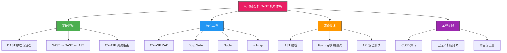
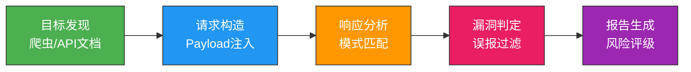
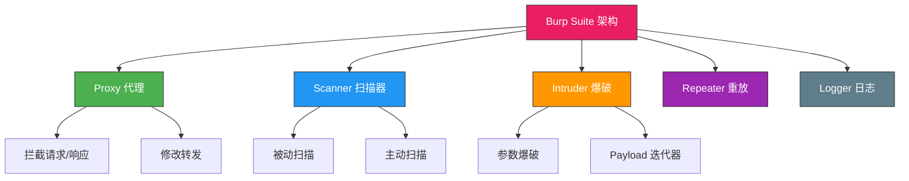

## 二、动态分析（DAST）



动态应用安全测试（Dynamic Application Security Testing，DAST）是在程序运行时进行安全测试的技术，通过模拟攻击者的行为来发现运行时漏洞。与静态分析不同，DAST 无需访问源代码，完全从外部视角测试应用，能发现 SAST 无法检测的运行时问题——如配置错误、认证绕过、服务端逻辑漏洞等。

### 2.1 DAST 核心原理

DAST 的本质是"黑盒测试"：测试工具不知道应用的内部实现，只通过 HTTP 请求与应用交互，分析响应中的异常来推断漏洞。

**DAST 工作流程**



**四个关键阶段详解：**

| 阶段 | 核心任务 | 技术手段 | 典型产出 |
|------|----------|----------|----------|
| 目标发现 | 枚举所有攻击面 | 爬虫、站点地图、API schema 解析 | URL 列表、参数清单 |
| 请求构造 | 注入测试 Payload | Payload 字典、编码变形、上下文适配 | 测试用例集 |
| 响应分析 | 识别漏洞信号 | 错误模式匹配、时间盲注、差异比对 | 候选漏洞列表 |
| 漏洞判定 | 区分真阳/误报 | 二次验证、上下文确认、手动复核 | 最终报告 |

**DAST 的独特价值：**

- **覆盖运行时特有问题**：服务器配置错误、HTTP 头缺失、TLS 配置不当、Cookie 安全属性缺失
- **无需源代码**：适用于第三方应用、闭源系统、API 服务
- **模拟真实攻击**：从攻击者视角发现业务逻辑漏洞
- **验证缓解措施**：确认 WAF、输入过滤是否真正有效

**DAST 的局限性：**

- 无法定位漏洞在源代码中的具体位置
- 依赖爬虫覆盖率，深层页面可能遗漏
- 对认证后的功能区域覆盖不足
- 无法发现不产生可观测响应的漏洞（如内存泄漏）

### 2.2 DAST vs SAST vs IAST 对比

| 维度 | SAST（静态分析） | DAST（动态分析） | IAST（交互式分析） |
|------|------------------|------------------|-------------------|
| 测试时机 | 编译/编码阶段 | 运行时 | 运行时（带插桩） |
| 代码访问 | 需要源代码 | 不需要 | 需要 |
| 视角 | 内部实现 | 外部攻击者 | 内部+运行时 |
| 误报率 | 中等 | 较低 | 低 |
| 漏报率 | 较高（无运行时上下文） | 中等（依赖覆盖率） | 低 |
| 覆盖范围 | 全代码路径 | 已触达的执行路径 | 已触达的执行路径 |
| 性能影响 | 低（静态分析） | 中等（网络请求） | 高（运行时插桩） |
| 部署复杂度 | 低 | 中 | 高 |
| 适用阶段 | 开发/CI | 测试/预发布/生产 | 测试/预发布 |

**最佳实践：三者互补而非替代。** 成熟的安全体系通常在 CI 阶段用 SAST 扫源码，在预发布用 DAST 做外部测试，在关键环境用 IAST 做深度监控。

### 2.3 OWASP ZAP —— 开源 DAST 标杆

OWASP ZAP（Zed Attack Proxy）是最流行的开源 Web 应用安全扫描器，支持自动化扫描、手动测试、API 测试。

**安装与基础使用**

```bash
# Docker 方式（推荐，环境隔离）
docker pull ghcr.io/zaproxy/zaproxy:stable

# 基线扫描（快速，仅检查常见问题）
docker run -t ghcr.io/zaproxy/zaproxy:stable zap-baseline.py \
  -t https://example.com \
  -r baseline-report.html \
  -J baseline-report.json

# API 扫描（针对 OpenAPI/Swagger）
docker run -t ghcr.io/zaproxy/zaproxy:stable zap-api-scan.py \
  -t https://example.com/openapi.json \
  -f openapi \
  -r api-report.html

# 完整扫描（深度，耗时较长）
docker run -t ghcr.io/zaproxy/zaproxy:stable zap-full-scan.py \
  -t https://example.com \
  -r full-report.html \
  -x full-report.xml \
  -J full-report.json

# 扫描需要认证的站点（Context File 方式）
docker run -t -v $(pwd)/contexts:/zap/wrk/contexts \
  ghcr.io/zaproxy/zaproxy:stable zap-full-scan.py \
  -t https://example.com \
  -c contexts/authed.context \
  -r authed-report.html
```

**ZAP 扫描模式详解**

| 模式 | 耗时 | 覆盖深度 | 适用场景 |
|------|------|----------|----------|
| Baseline | 1-5 分钟 | 仅被动检查 | CI/CD 快速反馈 |
| API Scan | 5-30 分钟 | 针对 API 端点 | REST/GraphQL API |
| Full Scan | 30 分钟+ | 被动+主动 | 预发布深度测试 |
| Spider + AJAX Spider | 可变 | 站点地图构建 | 前期目标发现 |

**ZAP 自定义策略**

```bash
# 创建自定义扫描策略（排除误报项）
docker run -t -v $(pwd)/rules:/zap/wrk/rules \
  ghcr.io/zaproxy/zaproxy:stable zap-full-scan.py \
  -t https://example.com \
  -z "-config spider.maxDepth=5" \
  -z "-config scanner.maxScanDurationInMins=60" \
  -r custom-report.html
```

### 2.4 Burp Suite —— 专业渗透测试平台

Burp Suite 是商业级 Web 安全测试工具，提供被动扫描、主动扫描、Intruder 爆破、Repeater 手动重放等模块。



**社区版（免费）核心功能：**

- **Proxy**：拦截浏览器流量，修改请求参数
- **Repeater**：手动重放 HTTP 请求，逐个测试 Payload
- **Decoder**：URL/Base64/HTML 编解码
- **Comparer**：逐字节比对两个响应的差异

**专业版增强功能：**

- **Scanner**：自动化主动/被动扫描，支持自定义扫描策略
- **Intruder**：自动化参数爆破，支持多种 Payload 模式（Sniper/Battering Ram/Pitchfork/Cluster Bomb）
- **Sequencer**：分析 Session Token 的随机性质量
- **Logger**：完整流量记录与搜索

**Burp Scanner 扫描策略配置要点：**

```text
扫描配置建议：
1. 被动扫描：始终开启，无副作用
2. 主动扫描：仅在测试环境使用，生产环境慎用
3. Scope 设置：限制扫描范围到目标域名，避免误扫
4. Scan Check Override：对已知误报项设置跳过
5. Resource Pool：控制并发请求数，避免目标崩溃
```

### 2.5 Nuclei —— 模板化漏洞扫描

Nuclei 是 ProjectDiscovery 开发的基于模板的快速扫描器，社区维护了 8000+ 漏洞检测模板。

```bash
# 安装
go install -v github.com/projectdiscovery/nuclei/v3/cmd/nuclei@latest

# 基础扫描
nuclei -u https://example.com

# 使用特定模板类型
nuclei -u https://example.com -t http/cves/
nuclei -u https://example.com -t http/exposures/

# 批量扫描
nuclei -l urls.txt -t http/ -o results.txt

# 高严重性过滤
nuclei -u https://example.com -severity critical,high

# 使用自定义模板
nuclei -u https://example.com -t custom-templates/

# 并发控制
nuclei -u https://example.com -c 25 -rl 150

# 输出多种格式
nuclei -u https://example.com -json -sarif -o nuclei-results.json
```

**Nuclei 自定义模板示例**

```yaml
# custom-templates/custom-sqli.yaml
id: custom-sql-injection-test
info:
  name: Custom SQL Injection Test
  author: security-team
  severity: high
  tags: sqli,custom

http:
  - method: GET
    path:
      - "{{BaseURL}}/?id=1'%20OR%201=1--"

    matchers-condition: and
    matchers:
      - type: word
        words:
          - "sql syntax"
          - "mysql_"
          - "ORA-"
          - "PostgreSQL"
          - "SQLite"
        condition: or

      - type: status
        status:
          - 200
          - 500

    extractors:
      - type: regex
        regex:
          - "SQL syntax.*?MySQL"
          - "ORA-\\d{5}"
```

**Nuclei 与 ZAP 的对比：**

| 维度 | Nuclei | OWASP ZAP |
|------|--------|-----------|
| 核心理念 | 模板化快速检测 | 全功能扫描平台 |
| 速度 | 极快（并发模板） | 中等 |
| 自定义 | YAML 模板，易上手 | 插件 + 策略配置 |
| 深度 | 单点检测为主 | 全面主动扫描 |
| 适用场景 | 快速巡检、CVE 验证 | 深度安全测试 |
| 社区 | 8000+ 模板持续更新 | 丰富的插件生态 |

### 2.6 IAST 插桩技术 —— OpenRASP

交互式应用安全测试（IAST）结合了 SAST 和 DAST 的优势，在应用运行时通过插桩（Instrumentation）监控代码执行和数据流动，能精确定位漏洞位置。

**OpenRASP 安装与配置**

```bash
# 下载 OpenRASP Java Agent
wget https://github.com/baidu/openrasp/releases/latest/download/rasp-java.tar.gz
tar -xzf rasp-java.tar.gz

# 方式一：Java Agent 启动参数
java -javaagent:rasp/rasp.jar \
     -Drasp.conf.file=rasp/conf/rasp.properties \
     -jar app.jar

# 方式二：Tomcat 集成
# 将 rasp.jar 放入 TOMCAT_HOME/bin/，修改 catalina.sh
CATALINA_OPTS="$CATALINA_OPTS -javaagent:rasp/rasp.jar"

# Docker 方式
docker run -e JAVA_OPTS="-javaagent:/opt/rasp/rasp.jar" \
  -v /path/to/rasp:/opt/rasp \
  my-java-app:latest
```

**OpenRASP 监控能力：**

| 检测类型 | 监控目标 | 检测方式 |
|----------|----------|----------|
| SQL 注入 | JDBC Statement 执行 | 拦截 SQL 语句，分析参数拼接 |
| 命令注入 | Runtime.exec() 调用 | 检查命令参数中的用户输入 |
| 文件操作 | 文件读写路径 | 检测目录穿越和敏感文件访问 |
| XXE | XML 解析器配置 | 检查外部实体是否禁用 |
| 反序列化 | ObjectInputStream | 监控非白名单类的反序列化 |

### 2.7 运行时安全监控

对于无法使用标准 IAST 工具的场景，可以通过自定义插桩实现运行时安全监控。

**Python 运行时监控装饰器**

```python
import functools
import logging
import traceback
import re

logger = logging.getLogger(__name__)

# 危险函数白名单（监控这些函数的调用）
SENSITIVE_FUNCTIONS = {
    'execute', 'executemany',      # 数据库执行
    'system', 'popen', 'call',     # 命令执行
    'eval', 'exec',                # 代码执行
    'open', 'write',               # 文件操作
    'connect', 'bind',             # 网络操作
}

# 已知危险模式（正则匹配）
DANGEROUS_PATTERNS = {
    'sql_injection': [
        r"'\s*(OR|AND)\s*['\"]?\d+['\"]?\s*=\s*['\"]?\d+",
        r"UNION\s+(ALL\s+)?SELECT",
        r";\s*(DROP|DELETE|UPDATE|INSERT)\s+",
        r"--\s*$",
    ],
    'command_injection': [
        r"\$\(",
        r"`[^`]+`",
        r"\|\s*(bash|sh|cmd|powershell)",
        r"&&\s*\w+",
    ],
    'path_traversal': [
        r"\.\./\.\.",
        r"\.\.\\",
        r"%2e%2e",
    ],
}

def security_monitor(func):
    """运行时安全监控装饰器"""
    @functools.wraps(func)
    def wrapper(*args, **kwargs):
        func_name = func.__name__
        
        # 仅监控敏感函数
        if func_name not in SENSITIVE_FUNCTIONS:
            return func(*args, **kwargs)
        
        # 提取所有字符串参数进行检查
        all_args = list(args) + list(kwargs.values())
        
        for arg in all_args:
            if not isinstance(arg, str):
                continue
            
            arg_lower = arg.lower()
            
            # 检查各类危险模式
            for vuln_type, patterns in DANGEROUS_PATTERNS.items():
                for pattern in patterns:
                    if re.search(pattern, arg, re.IGNORECASE):
                        logger.warning(
                            f"[SECURITY] {vuln_type} detected in {func_name}(): "
                            f"pattern={pattern}, arg_preview={arg[:200]}"
                        )
                        # 生产环境可选择：记录、告警、阻断
                        # raise SecurityError(f"Blocked: {vuln_type}")
        
        try:
            result = func(*args, **kwargs)
            return result
        except Exception as e:
            logger.error(f"Exception in {func_name}: {e}")
            logger.debug(traceback.format_exc())
            raise
    
    return wrapper

# 使用示例
@security_monitor
def execute_query(query: str):
    return db.execute(query)

@security_monitor
def read_file(path: str):
    with open(path, 'r') as f:
        return f.read()
```

**Python 进阶：基于 sys.settrace 的全局监控**

```python
import sys
import inspect

def global_security_tracer(frame, event, arg):
    """全局追踪器：监控所有函数调用"""
    if event == 'call':
        func_name = frame.f_code.co_name
        module = frame.f_globals.get('__name__', '')
        
        # 监控 os.system / subprocess 调用
        if func_name in ('system', 'popen', 'call') and 'os' in module:
            # 获取调用参数
            args = frame.f_locals.get('command', frame.f_locals.get('args', ''))
            logger.warning(f"[TRACE] Dangerous function called: {module}.{func_name}({args})")
        
        # 监控 eval/exec 调用
        if func_name in ('eval', 'exec') and 'builtins' not in module:
            code = frame.f_locals.get('expression', frame.f_locals.get('source', ''))
            logger.warning(f"[TRACE] Code execution: {func_name}({code[:200]})")
    
    return global_security_tracer

# 启用追踪（仅在测试/调试环境）
# sys.settrace(global_security_tracer)
```

### 2.8 自定义安全测试框架

在商业工具之外，根据具体业务需求编写定制化测试脚本，能更精准地覆盖业务逻辑漏洞。

**完整的 Web 安全测试框架**

```python
import requests
import hashlib
import time
import json
from urllib.parse import urljoin, urlparse
from dataclasses import dataclass, field
from typing import List, Optional

@dataclass
class Vulnerability:
    """漏洞数据模型"""
    vuln_type: str
    url: str
    parameter: str
    payload: str
    evidence: str
    severity: str = "HIGH"
    cvss: Optional[float] = None
    cwe: Optional[str] = None
    
    def to_dict(self):
        return {
            'type': self.vuln_type,
            'url': self.url,
            'parameter': self.parameter,
            'payload': self.payload,
            'evidence': self.evidence[:500],
            'severity': self.severity,
            'cvss': self.cvss,
            'cwe': self.cwe,
        }

class SecurityTester:
    """Web 安全测试框架"""
    
    def __init__(self, base_url: str, timeout: int = 10):
        self.base_url = base_url.rstrip('/')
        self.session = requests.Session()
        self.session.headers.update({
            'User-Agent': 'SecurityTester/1.0 (Authorized Penetration Test)'
        })
        self.timeout = timeout
        self.vulnerabilities: List[Vulnerability] = []
        self.tested_urls = set()
    
    def _send(self, method: str, url: str, **kwargs) -> Optional[requests.Response]:
        """带重试和错误处理的请求发送"""
        kwargs.setdefault('timeout', self.timeout)
        kwargs.setdefault('allow_redirects', False)
        try:
            return self.session.request(method, url, **kwargs)
        except requests.RequestException as e:
            return None
    
    def test_sql_injection(self, url: str, params: dict):
        """SQL 注入测试（错误型 + 盲注）"""
        error_patterns = [
            'sql syntax', 'mysql_', 'ORA-', 'PostgreSQL',
            'SQLite', 'Microsoft SQL', 'unclosed quotation',
            'You have an error in your SQL', 'Warning.*mysql',
            'valid MySQL result', 'pg_query', 'SQLite/JDBCDriver',
        ]
        
        payloads = {
            'error_based': [
                "' OR '1'='1",
                "' OR 1=1--",
                "1' UNION SELECT NULL--",
                "') OR ('1'='1",
                "1' AND '1'='1",
            ],
            'blind_boolean': [
                ("' AND 1=1--", "' AND 1=2--"),
            ],
            'blind_time': [
                ("' AND SLEEP(3)--", 3),
                ("'; WAITFOR DELAY '0:0:3'--", 3),
            ],
        }
        
        # 错误型注入测试
        for payload in payloads['error_based']:
            test_params = {k: f"{v}{payload}" for k, v in params.items()}
            resp = self._send('GET', url, params=test_params)
            if resp is None:
                continue
            
            body_lower = resp.text.lower()
            for pattern in error_patterns:
                if pattern.lower() in body_lower:
                    self.vulnerabilities.append(Vulnerability(
                        vuln_type="SQL Injection (Error-based)",
                        url=url, parameter=list(params.keys()),
                        payload=payload, evidence=pattern,
                        cwe="CWE-89"
                    ))
                    break
        
        # 布尔盲注测试
        for true_payload, false_payload in payloads['blind_boolean']:
            params_true = {k: f"{v}{true_payload}" for k, v in params.items()}
            params_false = {k: f"{v}{false_payload}" for k, v in params.items()}
            
            resp_true = self._send('GET', url, params=params_true)
            resp_false = self._send('GET', url, params=params_false)
            
            if resp_true and resp_false:
                if (resp_true.status_code == resp_false.status_code and
                    resp_true.text != resp_false.text and
                    abs(len(resp_true.text) - len(resp_false.text)) > 100):
                    self.vulnerabilities.append(Vulnerability(
                        vuln_type="SQL Injection (Blind Boolean)",
                        url=url, parameter=list(params.keys()),
                        payload=true_payload,
                        evidence=f"Response length diff: {len(resp_true.text)} vs {len(resp_false.text)}",
                        cwe="CWE-89"
                    ))
        
        # 时间盲注测试
        for payload, delay in payloads['blind_time']:
            test_params = {k: f"{v}{payload}" for k, v in params.items()}
            start = time.time()
            self._send('GET', url, params=test_params)
            elapsed = time.time() - start
            
            if elapsed >= delay - 0.5:
                self.vulnerabilities.append(Vulnerability(
                    vuln_type="SQL Injection (Time-based Blind)",
                    url=url, parameter=list(params.keys()),
                    payload=payload,
                    evidence=f"Response delay: {elapsed:.1f}s (expected >{delay}s)",
                    cwe="CWE-89"
                ))
    
    def test_xss(self, url: str, params: dict):
        """XSS 测试（反射型）"""
        payloads = [
            '<script>alert(1)</script>',
            '">',
            "javascript:alert(1)",
            '<svg onload=alert(1)>',
            "';alert(1)//",
            '<iframe src="javascript:alert(1)">',
            '<details open ontoggle=alert(1)>',
            '<math><mtext><table><mglyph><svg><mtext><textarea><path id="</textarea>">',
        ]
        
        for payload in payloads:
            test_params = {k: payload for k in params}
            resp = self._send('GET', url, params=test_params)
            if resp is None:
                continue
            
            # 检查 payload 是否被原样反射
            if payload in resp.text:
                # 进一步检查是否有 HTML 编码
                import html
                encoded = html.escape(payload)
                if encoded not in resp.text or payload == resp.text[resp.text.find(payload):resp.text.find(payload)+len(payload)]:
                    self.vulnerabilities.append(Vulnerability(
                        vuln_type="XSS (Reflected)",
                        url=url, parameter=list(params.keys()),
                        payload=payload,
                        evidence=f"Payload reflected without encoding",
                        severity="HIGH",
                        cwe="CWE-79"
                    ))
    
    def test_path_traversal(self, url: str, params: dict):
        """路径遍历测试"""
        traversal_payloads = [
            '../../../etc/passwd',
            '..\\..\\..\\windows\\win.ini',
            '....//....//....//etc/passwd',
            '%2e%2e%2f%2e%2e%2f%2e%2e%2fetc%2fpasswd',
            '..%252f..%252f..%252fetc/passwd',
        ]
        
        linux_signatures = ['root:', '/bin/bash', '/etc/passwd']
        windows_signatures = ['[extensions]', '[fonts]', '[operating systems]']
        
        for payload in traversal_payloads:
            test_params = {k: payload for k in params}
            resp = self._send('GET', url, params=test_params)
            if resp is None:
                continue
            
            body = resp.text.lower()
            for sig in linux_signatures + windows_signatures:
                if sig.lower() in body:
                    self.vulnerabilities.append(Vulnerability(
                        vuln_type="Path Traversal",
                        url=url, parameter=list(params.keys()),
                        payload=payload,
                        evidence=f"File content signature: {sig}",
                        cwe="CWE-22"
                    ))
                    break
    
    def test_ssrf(self, url: str, params: dict):
        """SSRF 测试"""
        internal_targets = [
            'http://127.0.0.1',
            'http://localhost',
            'http://169.254.169.254/latest/meta-data/',  # AWS
            'http://metadata.google.internal/',  # GCP
            'http://169.254.169.254/metadata/instance',  # Azure
        ]
        
        for target in internal_targets:
            test_params = {k: target for k in params}
            resp = self._send('GET', url, params=test_params)
            if resp is None:
                continue
            
            # 检查响应中是否包含内部服务信息
            indicators = ['ami-', 'instance-id', 'local-ipv4', 'hostname']
            for indicator in indicators:
                if indicator in resp.text:
                    self.vulnerabilities.append(Vulnerability(
                        vuln_type="SSRF",
                        url=url, parameter=list(params.keys()),
                        payload=target,
                        evidence=f"Internal metadata leaked: {indicator}",
                        severity="CRITICAL",
                        cwe="CWE-918"
                    ))
                    break
    
    def test_info_disclosure(self, url: str):
        """信息泄露检测"""
        # 检查敏感 HTTP 头
        resp = self._send('GET', url)
        if resp is None:
            return
        
        # 服务器版本泄露
        server = resp.headers.get('Server', '')
        x_powered = resp.headers.get('X-Powered-By', '')
        
        if server and any(v in server for v in ['Apache/', 'nginx/', 'Microsoft-IIS/']):
            self.vulnerabilities.append(Vulnerability(
                vuln_type="Information Disclosure",
                url=url, parameter="HTTP Headers",
                payload="N/A",
                evidence=f"Server header leaks version: {server}",
                severity="LOW",
                cwe="CWE-200"
            ))
        
        # 安全头缺失检查
        security_headers = {
            'Strict-Transport-Security': 'HSTS',
            'X-Content-Type-Options': 'Content-Type Options',
            'X-Frame-Options': 'Frame Options',
            'Content-Security-Policy': 'CSP',
        }
        
        missing = []
        for header, name in security_headers.items():
            if header.lower() not in {h.lower() for h in resp.headers}:
                missing.append(name)
        
        if missing:
            self.vulnerabilities.append(Vulnerability(
                vuln_type="Missing Security Headers",
                url=url, parameter="HTTP Headers",
                payload="N/A",
                evidence=f"Missing: {', '.join(missing)}",
                severity="MEDIUM",
                cwe="CWE-693"
            ))
    
    def generate_report(self) -> str:
        """生成结构化测试报告"""
        report = f"""
{'='*60}
  Web 安全测试报告
{'='*60}
  目标: {self.base_url}
  发现漏洞: {len(self.vulnerabilities)} 个
  测试时间: {time.strftime('%Y-%m-%d %H:%M:%S')}
{'='*60}

"""
        # 按严重性排序
        severity_order = {'CRITICAL': 0, 'HIGH': 1, 'MEDIUM': 2, 'LOW': 3}
        sorted_vulns = sorted(
            self.vulnerabilities,
            key=lambda v: severity_order.get(v.severity, 99)
        )
        
        for i, vuln in enumerate(sorted_vulns, 1):
            report += f"""[{i}] {vuln.vuln_type} ({vuln.severity})
    URL:       {vuln.url}
    Parameter: {vuln.parameter}
    Payload:   {vuln.payload}
    Evidence:  {vuln.evidence}
    CWE:       {vuln.cwe or 'N/A'}

"""
        
        # 统计摘要
        from collections import Counter
        type_counts = Counter(v.vuln_type for v in self.vulnerabilities)
        sev_counts = Counter(v.severity for v in self.vulnerabilities)
        
        report += f"""{'='*60}
  漏洞统计
{'='*60}
  按类型:
"""
        for vtype, count in type_counts.most_common():
            report += f"    {vtype}: {count}\n"
        
        report += f"\n  按严重性:\n"
        for sev in ['CRITICAL', 'HIGH', 'MEDIUM', 'LOW']:
            if sev in sev_counts:
                report += f"    {sev}: {sev_counts[sev]}\n"
        
        return report


# 使用示例
if __name__ == '__main__':
    tester = SecurityTester("https://target.example.com")
    
    # 测试带参数的端点
    tester.test_sql_injection(
        "https://target.example.com/search",
        {"q": "test", "category": "1"}
    )
    tester.test_xss(
        "https://target.example.com/profile",
        {"name": "test", "bio": "hello"}
    )
    tester.test_path_traversal(
        "https://target.example.com/download",
        {"file": "readme.txt"}
    )
    tester.test_ssrf(
        "https://target.example.com/fetch",
        {"url": "http://example.com"}
    )
    tester.test_info_disclosure("https://target.example.com/")
    
    print(tester.generate_report())
```

### 2.9 DAST 集成到 CI/CD

将 DAST 集成到持续集成流水线中，可以在每次部署前自动发现运行时漏洞。

**ZAP 基线扫描 GitHub Actions**

```yaml
# .github/workflows/dast.yml
name: DAST Security Scan

on:
  push:
    branches: [main]
  pull_request:
    branches: [main]
  schedule:
    - cron: '0 2 * * 1'  # 每周一凌晨 2 点

jobs:
  zap-baseline:
    runs-on: ubuntu-latest
    steps:
      - uses: actions/checkout@v4
      
      - name: Build and start application
        run: |
          docker compose -f docker-compose.test.yml up -d
          # 等待应用就绪
          timeout 60 bash -c 'until curl -s http://localhost:8080/health; do sleep 2; done'
      
      - name: OWASP ZAP Baseline Scan
        uses: zaproxy/action-baseline@v0.13.0
        with:
          target: 'http://localhost:8080'
          rules_file_name: '.zap/rules.tsv'
          cmd_options: '-a'
      
      - name: Upload ZAP Report
        uses: actions/upload-artifact@v4
        if: always()
        with:
          name: zap-report
          path: report.html
```

**Nuclei 扫描 GitLab CI**

```yaml
# .gitlab-ci.yml
dast-scan:
  stage: security
  image: projectdiscovery/nuclei:latest
  script:
    - nuclei -u $DEPLOY_URL -severity critical,high -json -o nuclei-results.json
    - |
      VULN_COUNT=$(cat nuclei-results.json | grep -c '"severity"')
      echo "Found $VULN_COUNT vulnerabilities"
      if [ $VULN_COUNT -gt 0 ]; then
        echo "Security scan failed!"
        exit 1
      fi
  artifacts:
    paths:
      - nuclei-results.json
    when: always
  rules:
    - if: '$CI_PIPELINE_SOURCE == "merge_request_event"'
    - if: '$CI_COMMIT_BRANCH == "main"'
```

### 2.10 DAST 最佳实践与常见误区

**最佳实践**

| 实践 | 说明 |
|------|------|
| 认证配置 | 务必配置登录态 Cookie/Token，否则只能扫描公开页面 |
| Scope 限定 | 明确扫描范围，避免误扫第三方服务或生产数据 |
| 分级扫描 | 先 Baseline 快扫，发现问题再 Full Scan 深入 |
| 定期执行 | 将 DAST 纳入发布流水线，而非一次性任务 |
| 结果验证 | DAST 报告必须人工复核，区分真阳和误报 |
| 环境隔离 | DAST 扫描在测试环境进行，不要直接扫生产 |

**常见误区**

| 误区 | 纠正 |
|------|------|
| "DAST 能替代 SAST" | 两者互补：DAST 找运行时问题，SAST 找代码缺陷 |
| "扫描结果 100% 可信" | DAST 误报率 10-30%，需人工验证 |
| "只扫一次就够了" | 应用变更后需重新扫描，建议每次部署前扫描 |
| "Full Scan 最好" | 深度扫描可能触发 WAF 限流或应用崩溃，需评估风险 |
| "忽略低危漏洞" | 低危漏洞可组合利用形成攻击链，不应忽视 |

***

**本节要点回顾：**

- DAST 从外部攻击者视角测试运行时漏洞，与 SAST/IAST 互补
- OWASP ZAP 是最成熟的开源 DAST 工具，支持基线/API/完整三种扫描模式
- Nuclei 以模板化方式快速检测已知漏洞，适合批量巡检
- OpenRASP 等 IAST 工具在运行时插桩，能精确定位漏洞代码位置
- 自定义测试脚本可针对业务逻辑编写精准测试用例
- DAST 应集成到 CI/CD 流水线，实现安全测试自动化
