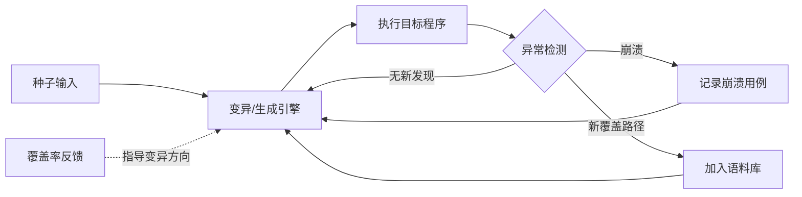
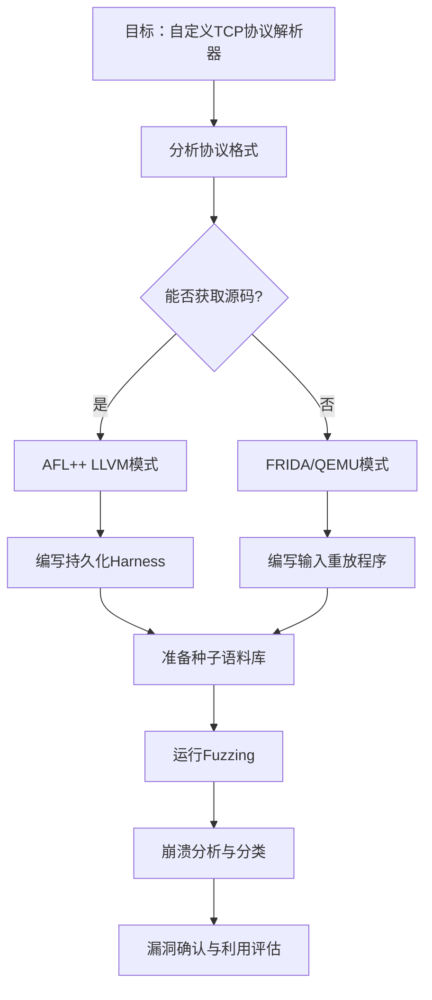
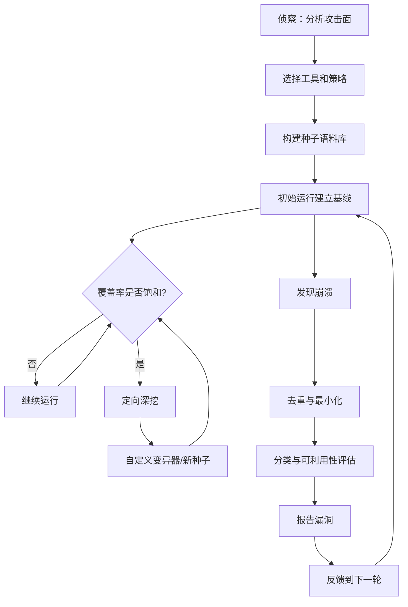

## 三、模糊测试（Fuzzing）

模糊测试（Fuzzing）是一种通过向程序输入大量随机或半随机数据来自动发现安全漏洞的软件测试技术。自1988年Barton Miller在威斯康星大学首次系统化提出以来，Fuzzing已发展为发现内存安全漏洞（缓冲区溢出、Use-After-Free、整数溢出等）最有效的方法之一。据统计，Google的OSS-Fuzz项目自2016年上线以来已帮助发现超过10,000个漏洞和40,000个代码缺陷，覆盖了 Chromium、Linux内核、OpenSSL 等关键基础设施项目。

### 3.1 模糊测试的核心原理

#### 3.1.1 基本工作流程

模糊测试的核心思想是"暴力输入 + 智能监控"，其完整工作流程如下：



整个过程可以概括为四个阶段：

1. **输入生成**：基于种子文件进行变异（翻转位、插入、删除、替换），或根据协议规范生成结构化输入
2. **目标执行**：将生成的输入喂给目标程序，可以是进程级（AFL）或函数级（libFuzzer）
3. **异常监控**：通过信号捕获（SIGSEGV、SIGABRT）、Sanitizer报告或退出码判断是否触发异常
4. **反馈优化**：利用代码覆盖率信息，优先保留能触发新代码路径的输入，形成进化循环

#### 3.1.2 模糊测试的分类体系

| 分类维度 | 类型 | 核心原理 | 适用场景 | 代表工具 |
|----------|------|----------|----------|----------|
| 输入生成策略 | 基于变异（Mutation-based） | 对已有种子文件进行随机翻转、插入、删除 | 有初始样本的场景 | AFL, AFL++, Honggfuzz |
| 输入生成策略 | 基于生成（Generation-based） | 根据协议/格式规范从零构造输入 | 无样本但有规范文档 | Peach, Dharma, writeFuzz |
| 反馈机制 | 黑盒模糊（Black-box） | 不获取内部信息，纯随机测试 | 闭源程序、快速初筛 | radamsa, dumb-fuzzing |
| 反馈机制 | 白盒模糊（White-box） | 利用符号执行推导路径约束 | 小型关键函数 | QSYM, KLEE |
| 反馈机制 | 灰盒模糊（Grey-box） | 利用轻量级覆盖率引导变异方向 | 大多数实际场景 | AFL, libFuzzer, Honggfuzz |
| 智能程度 | 结构感知（Structure-aware） | 理解输入格式语法，保持结构合法性 | 协议/文件格式解析器 | AFLSmart, Nautilus, Superion |
| 演进方向 | 差分模糊（Differential） | 对比多个实现的输出差异 | 加密库、协议实现 | DIFUZE |

#### 3.1.3 覆盖率引导：从黑盒到灰盒的进化

传统黑盒模糊测试的最大问题是大量输入无法通过格式校验（如magic number检查、长度校验），导致覆盖率极低。覆盖率引导（Coverage-guided）技术通过编译时插桩，在运行时收集每个分支的命中信息，只保留"触发了新路径"的输入作为下一步变异的种子。

```c
// 覆盖率采集的核心实现原理
// AFL使用共享内存中的位图（coverage bitmap）记录分支信息

// 编译时插桩（每条分支后插入一段薄代码）
void __afl_maybe_log(uint32_t cur, uint32_t prev) {
    uint32_t idx = prev ^ cur;          // 异或计算分支对
    idx = (idx >> 1) ^ (idx << 4);      // 混淆映射
    idx &= MAP_SIZE - 1;                // 映射到固定大小位图
    afl_area[idx]++;                    // 命中计数+1
    // 若afl_area[idx]从0变为非0，说明发现了新边
}
```

这种机制使得灰盒模糊测试在效率和精度之间取得了最佳平衡，成为当前主流方案。

### 3.2 AFL/AFL++：工业级模糊测试引擎

AFL（American Fuzzy Lop）由Michał Zalewski于2013年发布，是覆盖率引导模糊测试的标杆工具。AFL++是社区维护的增强版本，新增了更多变异策略、崩溃分类、性能优化等功能，已成为实际使用的首选。

#### 3.2.1 安装与编译

```bash
# === 方法一：从包管理器安装（可能版本较旧） ===
sudo apt-get install afl++

# === 方法二：从源码编译（推荐，获取最新特性） ===
git clone https://github.com/AFLplusplus/AFLplusplus.git
cd AFLplusplus
make -j$(nproc)
sudo make install

# === 安装验证 ===
afl-fuzz --version
afl-cc --version
```

#### 3.2.2 编译目标程序

AFL需要对目标程序进行编译插桩才能追踪覆盖率。AFL++提供了多种编译器前端：

```bash
# === 方式一：GCC/Clang插桩模式（最简单） ===
# 在分支处插入轻量级追踪代码
afl-cc -g -O0 -fsanitize=address -o target target.c

# === 方式二：LLVM模式（推荐，支持更多特性） ===
# 编译时收集更精确的边覆盖信息，支持 CMPLOG/REDQUEEN
afl-clang-fast -g -O1 -fsanitize=address -o target target.c

# === 方式三：QEMU模式（无需源码，适合闭源二进制） ===
# 使用QEMU用户态模拟器在运行时动态插桩
# 注意：性能约为原生的2-5倍开销
afl-fuzz -Q -i input -o output -- ./target_binary @@

# === 方式四：FRIDA模式（动态插桩，适合闭源二进制） ===
# 无需修改二进制文件，运行时hook
AFL_FRIDA_TRUST_STUBS=1 afl-fuzz -O -i input -o output -- ./target_binary @@

# === 方式五： Unicorn模式（模拟器模糊测试） ===
# 适用于IoT固件、自定义指令集等无法直接执行的代码
```

编译选项选择建议：

| 场景 | 推荐模式 | 性能开销 | 适用条件 |
|------|----------|----------|----------|
| 有源码 | afl-clang-fast | 低（~5%） | C/C++项目 |
| 闭源二进制 | FRIDA模式 | 中（~2x） | 用户态程序 |
| 闭源+老系统 | QEMU模式 | 高（~5x） | 兼容性好 |
| IoT固件 | Unicorn模式 | 高 | 交叉编译环境 |

#### 3.2.3 准备初始语料库

高质量的种子语料库是高效模糊测试的基础。种子文件应该能够通过程序的前几层校验逻辑，进入"有趣"的代码路径。

```bash
# === 创建种子语料库 ===
mkdir -p input/

# 对于文本协议，从实际交互中截取样本
curl -s http://target/api/endpoint > input/sample.json

# 对于二进制格式，使用格式工具生成合法样本
# 例如PDF：用ghostscript转换一个简单文本文件
echo "Hello" | enscript -p /tmp/hello.ps
ps2pdf /tmp/hello.ps input/hello.pdf

# 对于网络协议，从Wireshark导出
# File > Export Specified Packets > Save as raw

# === 语料库最小化 ===
# 去除冗余种子，只保留能覆盖不同路径的最小集合
afl-cmin -i corpus_raw/ -o corpus_min/ -t 1000 -- ./target @@

# === 崩溃用例最小化 ===
# 找到触发崩溃的最小输入
afl-tmin -i crashes/id:000000 -o crash_min.txt -- ./target @@
```

**语料库构建策略对比**：

| 策略 | 方法 | 优点 | 缺点 |
|------|------|------|------|
| 从真实数据采集 | 网络抓包、日志提取 | 覆盖面广，格式合法 | 可能包含敏感信息 |
| 格式工具生成 | 使用对应的编解码器 | 格式标准，覆盖各字段 | 工具依赖，生成有限 |
| 代码模板构造 | 手动编写覆盖各分支的输入 | 精准控制覆盖路径 | 耗时，难以规模化 |
| AFL-CMIN | 自动最小化种子集合 | 去除冗余，提升效率 | 需要编译后的目标 |

#### 3.2.4 运行模糊测试

```bash
# === 基础运行 ===
afl-fuzz -i input/ -o output/ -- ./target @@

# === 完整参数配置 ===
afl-fuzz \
  -i input/ \              # 种子输入目录
  -o output/ \             # 输出目录（崩溃、挂起、队列）
  -M main \                # 主实例名称（用于多实例协作）
  -t 5000 \                # 超时时间（毫秒），默认1000
  -m none \                # 内存限制（MB），none表示禁用内存检查
  -x dict/protocol.dict \  # 自定义字典，包含协议关键字
  -p fast \                # 变异策略：fast/mcoe/explore/rare
  -- ./target @@           # @@ 会被替换为输入文件路径

# === 多核并行 fuzzing ===
# 主实例（负责全局同步）
afl-fuzz -i input/ -o output/ -M main -- ./target @@

# 从实例（独立探索，从主实例同步新发现的种子）
afl-fuzz -i input/ -o output/ -S worker1 -- ./target @@
afl-fuzz -i input/ -o output/ -S worker2 -- ./target @@
# ... 直到用完所有CPU核心
```

#### 3.2.5 持久化模式

默认情况下，AFL每处理一个输入都需要fork一个新进程，fork开销在高频调用时会成为瓶颈。持久化模式允许在单次启动中反复调用目标函数，性能提升可达10-100倍。

```c
// target_persistent.c — 持久化模式示例
#include <stdio.h>
#include <stdlib.h>
#include <string.h>
#include <unistd.h>
#include <stdint.h>

// 被模糊测试的目标函数
int process_input(const char *data, size_t size) {
    if (size < sizeof(uint32_t) + 1) return -1;

    // 解析协议头部
    uint32_t length;
    memcpy(&length, data, sizeof(uint32_t));

    // 整数溢出检查：length可能被恶意构造为极大值
    if (length > size - sizeof(uint32_t)) return -1;

    const char *payload = data + sizeof(uint32_t);
    // ... 业务逻辑处理 ...

    return 0;
}

int main(void) {
    // 读取缓冲区放在循环外，避免反复分配
    char buf[65536];

    // AFL持久化模式宏：循环执行最多10000次
    // 在此模式下，fork+exec被替换为函数直接调用
    while (__AFL_LOOP(10000)) {
        ssize_t len = read(STDIN_FILENO, buf, sizeof(buf));
        if (len > 0) {
            process_input(buf, (size_t)len);
        }
    }

    return 0;
}

// 编译命令：
// afl-clang-fast -g -O1 -fsanitize=address -o target_persistent target_persistent.c
// 运行命令：
// afl-fuzz -i input/ -o output/ -- ./target_persistent
```

#### 3.2.6 字典与高级变异

字典（Dictionary）提供了协议关键字和格式特定的常量值，帮助变异引擎生成更有意义的输入：

```bash
# === 创建字典文件 ===
# protocol.dict — 适用于网络协议解析器
cat > protocol.dict << 'EOF'
"HTTP/1.0"
"HTTP/1.1"
"GET "
"POST "
"PUT "
"DELETE "
"Content-Type: "
"Content-Length: "
"\r\n"
"\r\n\r\n"
"Accept: "
"Host: "
"Connection: keep-alive"
EOF

# 使用字典运行
afl-fuzz -i input/ -o output/ -x protocol.dict -- ./target @@

# === 自定义变异器 ===
# 编写.so插件实现特定格式的变异逻辑
# 例如：只变异JSON中value字段，保持key合法
export AFL_CUSTOM_MUTATOR_LIBRARY=./json_mutator.so
afl-fuzz -i input/ -o output/ -- ./target @@
```

#### 3.2.7 AFL++ 命中率与性能监控

```bash
# 查看各实例的运行状态
afl-whatsup output/

# 输出示例（关键指标解读）：
# Status        : paused（暂停/正常运行中）
# Total run time         : 2 hours    — 运行总时长
# Total execs            : 150M       — 总执行次数
# Execution speed        : 2000 execs/sec — 每秒执行数（越高越好）
# Total paths            : 342        — 发现的路径总数
# Pending paths          : 12         — 待探索的路径（越少越好）
# Pending favs           : 3          — 待探索的高价值路径
# Total crashes          : 5          — 发现的崩溃数
# Total hangs            : 0          — 发现的挂起数
# Top path               : id:000012  — 覆盖最多新边的种子
```

### 3.3 libFuzzer：函数级精细模糊测试

libFuzzer是LLVM项目内建的进程内模糊测试引擎。与AFL的进程级（fork一个新进程处理每个输入）不同，libFuzzer直接在同一进程内反复调用目标函数，消除了进程创建开销，特别适合对库函数和API进行细粒度测试。

#### 3.3.1 基础用法

```c
// fuzz_target.c
#include <stdint.h>
#include <stddef.h>
#include <string.h>

// 被测试的目标函数
int parse_packet(const uint8_t *data, size_t size) {
    if (size < 8) return -1;

    // 解析包头（使用memcpy避免未对齐访问）
    uint16_t type;
    uint16_t length;
    memcpy(&type, data, sizeof(type));
    memcpy(&length, data + 2, sizeof(length));

    // 验证长度字段的合法性
    if (length > size - 4) return -1;

    const uint8_t *payload = data + 4;
    // ... 业务处理逻辑 ...

    return 0;
}

// libFuzzer入口函数 — 每次迭代被调用一次
int LLVMFuzzerTestOneInput(const uint8_t *data, size_t size) {
    parse_packet(data, size);
    return 0;
}

// 可选：全局初始化（程序启动时执行一次）
int LLVMFuzzerInitialize(int *argc, char ***argv) {
    // 设置信号处理器、加载配置等
    return 0;
}
```

```bash
# 编译
clang -g -O1 -fsanitize=fuzzer,address,undefined \
    -o fuzz_target fuzz_target.c

# 运行
mkdir corpus/
echo "initial_seed" > corpus/seed.txt
./fuzz_target corpus/

# 高级参数
./fuzz_target \
  -max_len=4096 \           # 最大输入长度
  -timeout=10 \             # 单次执行超时（秒）
  -max_total_time=3600 \    # 总运行时间（秒，0=无限）
  -jobs=8 \                 # 并行任务数
  -workers=8 \              # 并行线程数
  -dict=dict.txt \          # 字典文件
  -dict=/path/to/json.dict \
  -entropic=1 \             # 启用熵收集策略（推荐）
  -len_control=0 \          # 禁用长度控制（适合固定长度协议）
  -rss_limit_mb=4096 \      # 内存限制
  corpus/
```

#### 3.3.2 结构感知模糊测试（Structure-Aware Fuzzing）

对于有严格格式要求的输入（如协议包、文件格式），纯随机变异往往无法通过格式校验。结构感知模糊测试让变异引擎理解输入的结构语法，只在语义合法的位置进行变异：

```c
#include <stdint.h>
#include <stddef.h>
#include <stdlib.h>
#include <string.h>

// 定义协议结构
typedef struct __attribute__((packed)) {
    uint16_t type;      // 包类型：1=请求, 2=响应, 3=错误
    uint16_t flags;     // 标志位
    uint32_t length;    // payload长度
    uint8_t  payload[]; // 变长payload
} Packet;

// 定义已知的合法类型值
static const uint16_t valid_types[] = {1, 2, 3, 10, 11, 12};

int LLVMFuzzerTestOneInput(const uint8_t *data, size_t size) {
    // 最小包大小检查
    if (size < sizeof(Packet)) return 0;

    const Packet *pkt = (const Packet *)data;

    // 验证类型字段 — 只处理已知类型
    int type_valid = 0;
    for (size_t i = 0; i < sizeof(valid_types)/sizeof(valid_types[0]); i++) {
        if (pkt->type == valid_types[i]) {
            type_valid = 1;
            break;
        }
    }
    if (!type_valid) return 0;

    // 验证长度字段 — 防止越界读取
    if (pkt->length > size - sizeof(Packet)) return 0;

    // 根据类型分发到不同处理函数
    switch (pkt->type) {
        case 1:
        case 2:
        case 3:
            handle_request(pkt->payload, pkt->length);
            break;
        case 10:
        case 11:
        case 12:
            handle_response(pkt->payload, pkt->length);
            break;
    }

    return 0;
}

// 使用FuzzedDataProvider进行结构化输入生成（C++版本更强大）
// 需要包含 #include <fuzzer/FuzzedDataProvider.h>
// FuzzedDataProvider fdp(data, size);
// uint16_t type = fdp.ConsumeIntegralInRange<uint16_t>(1, 12);
// auto payload = fdp.ConsumeBytes<uint8_t>(fdp.remaining_bytes());
```

#### 3.3.3 Corpus最小化与管理

```bash
# 使用CMin最小化语料库
# 去除冗余种子，只保留触发不同路径的最小集合
./fuzz_target -minimize_crash=1 -exact_artifact_path=min_input crash_input

# 从崩溃文件中提取可重现的最小输入
./fuzz_target -minimize_dict=1 -exact_artifact_path=crash_min.txt \
    corpus/ dict.txt

# 交叉最小化：找到触发特定崩溃的最小输入
./fuzz_target -minimize_crash=1 -only_ascii=1 \
    -exact_artifact_path=min_crash.txt \
    output/crashes/crash-file
```

### 3.4 Honggfuzz：多协议多平台模糊测试

Honggfuzz由Google安全工程师开发，支持多种反馈模式（硬件分支计数、Intel PT、软件覆盖率），特别擅长网络协议和多进程目标的模糊测试。

```bash
# === 安装 ===
git clone https://github.com/google/honggfuzz.git
cd honggfuzz
make
sudo cp honggfuzz /usr/local/bin/

# === 基本用法 ===
# 对二进制文件进行模糊测试
honggfuzz -i input/ -o output/ -n 1 -- ./target __FILE__

# === 多进程模式（适合网络服务） ===
# 启动16个并行worker
honggfuzz \
  -i input/ \
  -o output/ \
  -n 16 \                    # 16个并行进程
  -t 10 \                    # 超时10秒
  -- ./server --port @@

# === 使用Intel Processor Trace ===
# 需要支持Intel PT的CPU（Skylake及以后）
honggfuzz \
  -i input/ -o output/ \
  --linux_perf \
  -- ./target __FILE__

# === 使用硬件断点采样 ===
honggfuzz \
  -i input/ -o output/ \
  --linux_perf_bts \
  -- ./target __FILE__
```

### 3.5 Python代码模糊测试

#### 3.5.1 使用Atheris

Atheris是Google开发的Python原生模糊测试引擎，基于libFuzzer，支持CPython 3.8+。

```python
#!/usr/bin/env python3
"""
fuzz_json_parser.py — 使用Atheris对JSON解析逻辑进行模糊测试
"""
import atheris
import sys
import json


def parse_config(data: bytes) -> dict:
    """被测试的目标函数：解析JSON配置"""
    try:
        config = json.loads(data)
        if not isinstance(config, dict):
            raise TypeError("Config must be a dictionary")

        # 深度处理配置
        if 'database' in config:
            db = config['database']
            if isinstance(db, dict):
                host = db.get('host', 'localhost')
                port = int(db.get('port', 3306))
                if not (0 < port < 65536):
                    raise ValueError(f"Invalid port: {port}")
                name = db.get('name', '')
                if '/' in name or '\\' in name:
                    raise ValueError(f"Invalid database name: {name}")

        if 'logging' in config:
            level = config['logging'].get('level', 'INFO')
            if level not in ('DEBUG', 'INFO', 'WARNING', 'ERROR', 'CRITICAL'):
                raise ValueError(f"Invalid log level: {level}")

        return config
    except (json.JSONDecodeError, TypeError, ValueError, KeyError):
        return {}
    except Exception as e:
        # 捕获意外异常 — 有助于发现未预期的崩溃
        raise  # 让Atheris记录这个异常


def TestOneInput(data: bytes):
    """libFuzzer风格的入口函数"""
    # 方法1：直接使用原始字节
    parse_config(data)

    # 方法2：使用FuzzedDataProvider生成结构化输入
    fdp = atheris.FuzzedDataProvider(data)
    if fdp.remaining_bytes() > 0:
        # 从字节数据生成Unicode字符串再进行解析
        try:
            string_data = fdp.ConsumeUnicodeNoSurrogates(
                fdp.remaining_bytes()
            )
            parse_config(string_data.encode('utf-8'))
        except Exception:
            pass


if __name__ == '__main__':
    atheris.Setup(sys.argv, TestOneInput)
    atheris.Fuzz()
```

```bash
# 安装atheris
pip install atheris

# 运行模糊测试
python fuzz_json_parser.py corpus/

# 带参数运行
python fuzz_json_parser.py \
  -max_len=8192 \
  -timeout=5 \
  -dict=json_keywords.txt \
  corpus/
```

#### 3.5.2 使用Python内置的unittest.fuzz

Python 3.12+内置了基于Atheris的模糊测试支持（实验性功能）：

```python
import unittest

class TestJSONParser(unittest.TestCase):
    def test_parse_config(self):
        """Atheris会自动变异传入的字节参数"""
        self.assertEqual(1, 1)  # 基本结构示例

# 命令行运行：python -m unittest.fuzz
```

### 3.6 实战：模糊测试网络协议解析器

网络协议解析器是Fuzzing的高价值目标。以下是一个完整的实战案例——模糊测试自定义TCP协议的解析逻辑。

#### 3.6.1 目标分析与策略制定



#### 3.6.2 编写Harness

```c
// harness.c — 为网络协议解析器编写Fuzzing harness
#include <stdio.h>
#include <stdlib.h>
#include <string.h>
#include <stdint.h>
#include <unistd.h>

// 模拟网络连接结构
typedef struct {
    int fd;
    char *buffer;
    size_t buf_len;
} Connection;

// 被测试的协议解析函数（来自目标库）
extern int protocol_parse(const char *data, size_t len, Connection *conn);

int main(void) {
    char buf[65536];
    Connection conn = {0};

    while (__AFL_LOOP(10000)) {
        ssize_t n = read(STDIN_FILENO, buf, sizeof(buf));
        if (n <= 0) continue;

        // 重置连接状态
        conn.fd = -1;
        conn.buffer = NULL;
        conn.buf_len = 0;

        // 调用目标解析函数
        protocol_parse(buf, (size_t)n, &conn);

        // 清理资源
        if (conn.buffer) free(conn.buffer);
    }

    return 0;
}

// 编译：
// afl-clang-fast -g -O1 -fsanitize=address \
//   -I/path/to/target/include \
//   -o harness harness.c \
//   -L/path/to/target/lib -ltarget
```

#### 3.6.3 崩溃分析与分类

发现崩溃后的分析流程至关重要——并非所有崩溃都是安全漏洞。

```bash
# === 第一步：去重与最小化 ===
# 收集所有崩溃用例
ls output/default/crashes/

# 对崩溃用例进行分类（按信号类型）
for f in output/default/crashes/id:*; do
    signal=$(basename "$f" | grep -oP 'sig:\K\d+')
    echo "Signal $signal: $f"
done

# 最小化每个崩溃用例
for f in output/default/crashes/id:*; do
    afl-tmin -i "$f" -o "${f}.min" -- ./target @@
done

# === 第二步：确定性重现 ===
# 用GDB分析崩溃
gdb --args ./target < output/default/crashes/id:000000,sig:06,src:000001

# 在GDB中：
# (gdb) set print pretty on
# (gdb) run < crash_file
# (gdb) bt          # 查看崩溃调用栈
# (gdb) info registers  # 查看寄存器状态
# (gdb) x/20i $pc-10  # 查看崩溃点附近的指令

# === 第三步：使用Sanitizer获取详细信息 ===
# AddressSanitizer (ASan) — 检测内存越界
#   输出包含：崩溃类型、越界偏移、分配/释放的调用栈
# UndefinedBehaviorSanitizer (UBSan) — 检测未定义行为
#   输出包含：具体哪行代码触发了UB
# MemorySanitizer (MSan) — 检测未初始化内存读取

# === 第四步：崩溃分类 ===
# 常见信号含义：
#   SIGSEGV (11) — 段错误（空指针、野指针、栈溢出）
#   SIGABRT (6)  — 程序主动中止（assert失败、double free）
#   SIGFPE  (8)  — 浮点异常（除以零）
#   SIGBUS  (7)  — 总线错误（未对齐访问）
#
# 重要：区分exploitable vs non-exploitable
# 使用!exploitable GDB插件（Microsoft发布）进行自动分类
```

### 3.7 模糊测试最佳实践与常见误区

#### 3.7.1 性能优化要点

| 优化项 | 方法 | 预期提升 |
|--------|------|----------|
| 持久化模式 | 使用`__AFL_LOOP`减少fork开销 | 10-100x |
| LLVM模式 | 使用`afl-clang-fast`替代`afl-cc` | 20-30% |
| CMPLOG | 启用`-c`参数进行比较指令追踪 | 路径+30% |
| 多实例协作 | 主从模式并行fuzzing | 近线性扩展 |
| 语料库最小化 | 定期运行`afl-cmin` | 速度+20% |
| 字典 | 提供协议关键字字典 | 覆盖率+15-30% |
| 超时设置 | 设置合理的超时（不要太长） | 避免卡死 |

#### 3.7.2 常见误区

**误区一：种子语料库越少越好**

实际上，高质量、多样化的种子语料库是高效fuzzing的前提。一个只包含"test"字符串的种子库可能永远无法通过magic number校验。

**正确做法**：收集至少10-20个覆盖不同代码路径的合法输入作为种子。可以通过覆盖率分析工具找出覆盖最少路径的种子，替换为更高质量的输入。

**误区二：跑了很久没崩溃 = 程序安全**

Fuzzing只能证明漏洞存在，不能证明漏洞不存在。一个运行24小时没发现崩溃的程序不代表安全——可能是因为变异策略不对、种子不好、或漏洞在深层路径中。

**正确做法**：关注覆盖率增长曲线。如果覆盖率在长时间内不再增长，说明当前fuzzing已经饱和，需要更换变异策略或增加新种子。

**误区三：忽略Sanitizer报告的"小"问题**

编译时使用`-fsanitize=address,undefined`可以检测到大量潜在问题，但很多开发者习惯性忽略它们。

**正确做法**：将Sanitizer输出视为与崩溃同等重要的告警。一个UBSan报告的未定义行为可能在特定优化级别下演变为安全漏洞。

**误区四：只用默认参数**

AFL的默认参数适合快速测试，但针对特定目标通常需要调优。

**正确做法**：根据目标特性调整参数——长输入用`-m none`避免OOM检测误报，慢程序用`-t 10000`避免超时误报，结构化输入使用字典和自定义变异器。

#### 3.7.3 覆盖率分析与目标量化

```bash
# === 使用LLVM的源码级覆盖率 ===
# 编译时启用覆盖率采集
clang -g -O1 -fsanitize=fuzzer,address,coverage \
    -fprofile-instr-generate -fcoverage-mapping \
    -o fuzz_target fuzz_target.c

# 运行后生成覆盖率数据
LLVM_PROFILE_FILE=fuzz.profraw ./fuzz_target corpus/ -max_total_time=600

# 生成覆盖率报告
llvm-profdata merge -sparse fuzz.profraw -o fuzz.profdata
llvm-cov show ./fuzz_target -instr-profile=fuzz.profdata \
    --format=html > coverage.html

# 查看总体覆盖率统计
llvm-cov report ./fuzz_target -instr-profile=fuzz.profdata

# === 使用lcov（GCC插桩版本） ===
lcov --capture --directory . --output-file coverage.info
genhtml coverage.info --output-directory coverage-report
# 浏览 coverage-report/index.html
```

### 3.8 进阶：集群化模糊测试与漏洞挖掘方法论

#### 3.8.1 OSS-Fuzz与ClusterFuzz

Google的OSS-Fuzz项目为开源项目提供免费的持续模糊测试服务，底层使用ClusterFuzz进行大规模集群调度：

- **OSS-Fuzz**：开源项目可以申请加入，提交Dockerfile和构建脚本后，Google会在数万台机器上持续运行fuzzing
- **ClusterFuzz**：OSS-Fuzz的底层引擎，负责任务调度、崩溃去重、回归检测、报告生成
- **发现问题后**：通过Monorail（Chromium的bug跟踪系统）报告，给予90天修复期限后公开

#### 3.8.2 漏洞挖掘方法论

有效的漏洞挖掘不是简单地"把工具跑起来"，而是需要系统化的方法论：

1. **侦察阶段**：分析目标的攻击面（输入点）、解析器复杂度、历史漏洞模式
2. **工具选择**：根据目标特性选择合适的fuzzer和编译模式
3. **语料库构建**：收集多样化的合法输入，确保能深入核心解析逻辑
4. **初始运行**：先运行1-2小时建立基线，观察覆盖率增长趋势
5. **定向深挖**：对覆盖率停滞的区域，编写自定义变异器或添加定向种子
6. **崩溃处理**：去重、最小化、分类、确认可利用性
7. **循环迭代**：将分析结果反馈到下一轮fuzzing中



### 3.9 工具对比与选型指南

| 特性 | AFL++ | libFuzzer | Honggfuzz | radamsa |
|------|-------|-----------|-----------|---------|
| 插桩方式 | 编译插桩/QEMU/FRIDA | LLVM内建 | 软件/硬件/Intel PT | 无 |
| 运行模型 | 进程级（fork） | 进程内（函数调用） | 进程级 | 进程级 |
| 是否需要源码 | LLVM模式需要，QEMU不需要 | 需要 | 都可以 | 不需要 |
| 适用目标 | 可执行程序 | 库函数 | 任意程序 | 任意程序 |
| 多实例协作 | 支持（主从模式） | 支持（-jobs/-workers） | 支持（-n参数） | 不支持 |
| 崩溃分类 | 内建 | 依赖ASan | 内建 | 无 |
| 学习曲线 | 中等 | 低 | 低 | 极低 |
| 社区活跃度 | 极高 | 高 | 高 | 中 |

**选型建议**：

- **有源码，追求高覆盖率**：AFL++（LLVM模式） + libFuzzer（函数级覆盖）
- **闭源二进制**：AFL++（FRIDA模式）或 Honggfuzz
- **快速初筛/概念验证**：radamsa
- **网络服务**：Honggfuzz（多进程模式）或 AFL++ + TCP harness
- **库/API测试**：libFuzzer（进程内调用最高效）
- **大规模持续测试**：申请OSS-Fuzz

### 3.10 本节小结

模糊测试是现代安全研究中投入产出比最高的漏洞发现技术之一。掌握以下要点：

1. **理解原理**：覆盖率引导是灰盒模糊测试的核心，理解覆盖率反馈机制有助于调优策略
2. **工具选择**：AFL++是最全面的通用工具，libFuzzer适合库函数测试，Honggfuzz适合多进程场景
3. **语料库是关键**：高质量的种子语料库能让fuzzing效率提升数倍
4. **持久化模式必用**：对于可编译的目标，持久化模式是性能的基础保障
5. **崩溃分析闭环**：发现崩溃只是开始，去重、最小化、分类、确认可利用性是完整的漏洞发现流程
6. **迭代优化**：根据覆盖率反馈调整策略、种子和变异器，形成"fuzz → 分析 → 优化 → 再fuzz"的闭环
