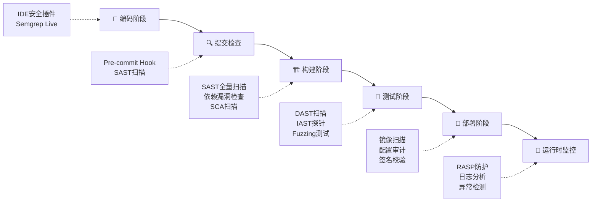
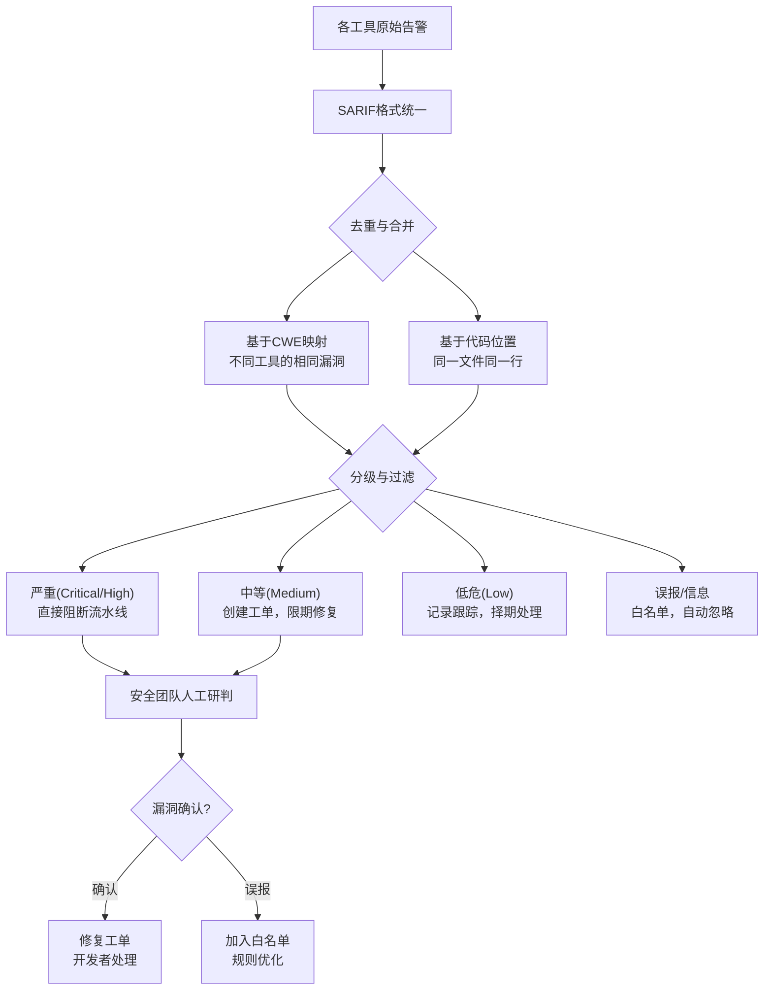
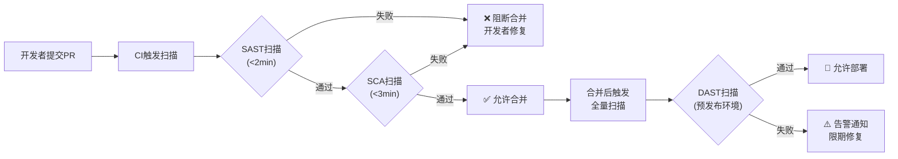
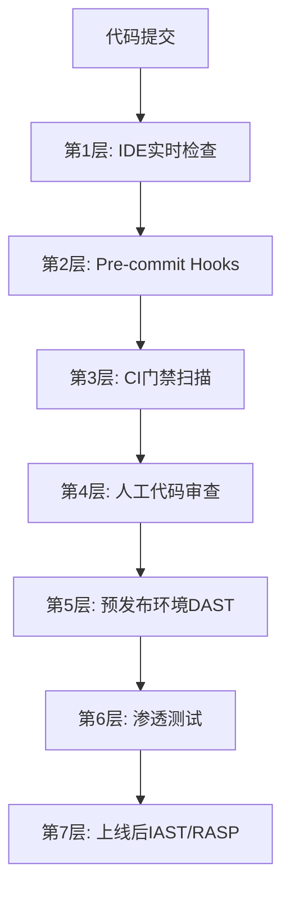

## 四、综合工具链

前三个小节分别介绍了静态分析（SAST）、动态分析（DAST/IAST）和模糊测试（Fuzzing）三大核心技术。然而在实际工程中，没有任何一个工具能独立完成全面的安全审计。真正的安全能力来自于**将这些工具编织成一个有机运转的工具链**——从代码提交到生产部署，每个环节都有对应的安全检查点，各工具的输出互相补充、互相验证，形成纵深防御体系。

本节将从架构设计、工具安装、流水线集成、告警治理、监控运营五个维度，系统讲解如何构建一套生产级的代码审计综合工具链。

---

### 4.1 工具链架构设计

#### 4.1.1 纵深防御模型

综合工具链的核心思想是**纵深防御（Defense in Depth）**——在软件开发生命周期的不同阶段部署不同类型的检测工具，确保即使某一层被绕过，下一层仍然能够捕获漏洞。



各阶段的检测工具和职责划分如下：

| 阶段 | 检测类型 | 代表工具 | 检出能力 | 执行时机 |
|------|---------|---------|---------|---------|
| 编码阶段 | 实时SAST | Semgrep VS Code插件、SonarLint | 输入验证缺失、危险函数调用 | 编码时实时 |
| 提交检查 | 增量SAST | pre-commit + bandit | 新增代码的安全缺陷 | git commit时 |
| 构建阶段 | 全量SAST + SCA | Semgrep、CodeQL、Trivy | 全量代码漏洞 + 依赖CVE | CI流水线 |
| 测试阶段 | DAST + IAST + Fuzzing | ZAP、Burp Suite、libFuzzer | 运行时漏洞、内存安全 | 预发布环境 |
| 部署阶段 | 镜像/配置扫描 | Trivy、Checkov、Grype | 容器漏洞、IaC配置错误 | 镜像推送时 |
| 运行时 | RASP + WAF | OpenRASP、ModSecurity | 0-day利用防护 | 持续 |

#### 4.1.2 工具链分层架构

一个成熟的工具链通常分为四层：

```text
┌─────────────────────────────────────────────────────┐
│                  可视化与运营层                        │
│  SonarQube Dashboard / DefectDojo / 自研安全平台     │
├─────────────────────────────────────────────────────┤
│                  告警治理层                            │
│  告警去重 / 误报过滤 / 优先级排序 / 工单系统集成      │
├─────────────────────────────────────────────────────┤
│                  扫描执行层                            │
│  SAST(Semgrep/CodeQL) + DAST(ZAP) + SCA(Trivy)     │
│  Fuzzing(libFuzzer/AFL++) + Secret Scanning(Gitleaks)│
├─────────────────────────────────────────────────────┤
│                  代码与制品层                          │
│  源代码仓库 / 构建产物 / 容器镜像 / 依赖锁定文件      │
└─────────────────────────────────────────────────────┘
```

- **代码与制品层**：被扫描的对象，包括源代码、构建产物（JAR/二进制）、容器镜像、依赖锁定文件（package-lock.json、go.sum、poetry.lock）
- **扫描执行层**：各类安全工具的运行环境，负责执行具体的扫描任务
- **告警治理层**：对各工具的扫描结果进行统一处理——去重、分级、分配，避免告警洪水
- **可视化与运营层**：安全态势的统一视图，支持趋势分析、SLA追踪、团队效能评估

---

### 4.2 工具链安装与配置

#### 4.2.1 完整工具链安装脚本

以下脚本覆盖了构建综合工具链所需的全部核心工具：

```bash
#!/bin/bash
# setup_audit_tools.sh - 代码审计综合工具链安装脚本
# 适用环境: Ubuntu 22.04+ / Debian 12+
# 用途: 一键安装 SAST + DAST + SCA + Fuzzing 全套工具

set -euo pipefail

echo "=========================================="
echo "  代码审计综合工具链安装脚本"
echo "=========================================="

# ---------- 颜色定义 ----------
RED='\033[0;31m'
GREEN='\033[0;32m'
YELLOW='\033[1;33m'
NC='\033[0m'

log_info()  { echo -e "${GREEN}[INFO]${NC} $1"; }
log_warn()  { echo -e "${YELLOW}[WARN]${NC} $1"; }
log_error() { echo -e "${RED}[ERROR]${NC} $1"; }

# ---------- 系统依赖 ----------
log_info "安装系统依赖..."
sudo apt-get update -qq
sudo apt-get install -y -qq \
    build-essential clang llvm \
    python3-pip python3-venv \
    curl wget git jq \
    libcurl4-openssl-dev libssl-dev

# ========== 第一层：静态分析工具 (SAST) ==========

log_info "安装 SAST 工具..."

# 1. Semgrep - 轻量级模式匹配SAST
pip install --user semgrep
log_info "Semgrep $(semgrep --version 2>/dev/null || echo 'installed')"

# 2. Bandit - Python专属SAST
pip install --user bandit
log_info "Bandit installed"

# 3. CodeQL - 语义代码分析（需要单独下载CLI）
CODEQL_VERSION="2.17.5"
if [ ! -d "$HOME/codeql" ]; then
    log_info "下载 CodeQL CLI v${CODEQL_VERSION}..."
    curl -sL "https://github.com/github/codeql-action/releases/download/codeql-bundle-v${CODEQL_VERSION}/codeql-bundle-linux64.tar.gz" \
        | tar xz -C "$HOME"
    log_info "CodeQL CLI 安装完成"
else
    log_info "CodeQL CLI 已存在，跳过安装"
fi

# 4. Gitleaks - 密钥/硬编码凭证扫描
if ! command -v gitleaks &>/dev/null; then
    GITLEAKS_VERSION="8.18.4"
    wget -q "https://github.com/gitleaks/gitleaks/releases/download/v${GITLEAKS_VERSION}/gitleaks_${GITLEAKS_VERSION}_linux_x64.tar.gz" -O /tmp/gitleaks.tar.gz
    sudo tar xzf /tmp/gitleaks.tar.gz -C /usr/local/bin gitleaks
    rm /tmp/gitleaks.tar.gz
fi
log_info "Gitleaks $(gitleaks version 2>/dev/null || echo 'installed')"

# ========== 第二层：依赖与供应链安全 (SCA) ==========

log_info "安装 SCA 工具..."

# 5. Trivy - 容器/依赖/配置扫描（多用途）
if ! command -v trivy &>/dev/null; then
    TRIVY_VERSION="0.52.2"
    wget -q "https://github.com/aquasecurity/trivy/releases/download/v${TRIVY_VERSION}/trivy_${TRIVY_VERSION}_Linux-64bit.tar.gz" -O /tmp/trivy.tar.gz
    sudo tar xzf /tmp/trivy.tar.gz -C /usr/local/bin trivy
    rm /tmp/trivy.tar.gz
fi
log_info "Trivy $(trivy --version 2>/dev/null | head -1 || echo 'installed')"

# 6. Grype - 容器镜像漏洞扫描
if ! command -v grype &>/dev/null; then
    curl -sSfL https://raw.githubusercontent.com/anchore/grype/main/install.sh | sh -s -- -b /usr/local/bin
fi
log_info "Grype installed"

# ========== 第三层：动态分析工具 (DAST) ==========

log_info "安装 DAST 工具..."

# 7. OWASP ZAP - 动态安全扫描
if ! command -v zap-cli &>/dev/null; then
    pip install --user zapcli
fi
log_info "ZAP CLI installed"

# 8. Nikto - Web服务器扫描
if ! command -v nikto &>/dev/null; then
    sudo apt-get install -y -qq nikto 2>/dev/null || {
        log_warn "Nikto apt安装失败，使用git安装..."
        sudo git clone https://github.com/sullo/nikto.git /opt/nikto
        sudo ln -sf /opt/nikto/program/nikto.pl /usr/local/bin/nikto
    }
fi

# ========== 第四层：模糊测试工具 (Fuzzing) ==========

log_info "安装 Fuzzing 工具..."

# 9. AFL++ - 覆盖率引导模糊测试
if ! command -v afl-fuzz &>/dev/null; then
    sudo apt-get install -y -qq afl++ 2>/dev/null || {
        log_warn "afl++ apt安装失败，从源码编译..."
        cd /tmp
        git clone https://github.com/AFLplusplus/AFLplusplus.git
        cd AFLplusplus
        make -j$(nproc) source-only
        sudo make install
        cd -
    }
fi
log_info "AFL++ $(afl-fuzz --version 2>/dev/null || echo 'installed')"

# 10. go-fuzz - Go语言模糊测试
go install golang.org/x/tools/cmd/gofuzz@latest 2>/dev/null || log_warn "go-fuzz 安装跳过（需要Go环境）"

# 11. Python-Atheris - Python模糊测试
pip install --user atheris 2>/dev/null || log_warn "atheris 需要特定Python版本"

# ========== 第五层：报告与治理工具 ==========

log_info "安装报告与治理工具..."

# 12. DefectDojo - 漏洞管理平台（Docker方式）
if command -v docker &>/dev/null; then
    log_info "Docker 已安装，可使用 DefectDojo 进行漏洞管理"
    log_info "安装命令: docker compose -f https://raw.githubusercontent.com/DefectDojo/django-DefectDojo/master/docker-compose.yml up -d"
fi

# 13. SARIF 命令行工具 - 多工具结果统一格式
pip install --user sarif-tools 2>/dev/null || true

echo ""
echo "=========================================="
log_info "工具链安装完成！已安装工具清单："
echo "=========================================="
echo "SAST:     Semgrep, Bandit, CodeQL, Gitleaks"
echo "SCA:      Trivy, Grype"
echo "DAST:     OWASP ZAP, Nikto"
echo "Fuzzing:  AFL++, go-fuzz, atheris"
echo "治理:     sarif-tools, DefectDojo (Docker)"
echo "=========================================="
```

#### 4.2.2 各工具配置要点

安装只是第一步，正确配置才能发挥工具的最大效能。

**Semgrep 自定义规则配置**

Semgrep 的核心价值在于可定制规则。以下是一个覆盖常见 Web 安全漏洞的自定义规则集：

```yaml
# .semgrep/custom-web-security.yml
rules:
  # SQL注入 - 参数拼接
  - id: python-sql-injection
    pattern: |
      $CURSOR.execute("..." + $PARAM + "...")
    message: |
      SQL注入风险：使用字符串拼接构造SQL查询。
      建议使用参数化查询: cursor.execute("... %s ...", ($PARAM,))
    languages: [python]
    severity: ERROR
    metadata:
      cwe: "CWE-89: SQL Injection"
      owasp: "A03:2021 - Injection"

  # 命令注入 - os.system
  - id: python-os-system
    patterns:
      - pattern: os.system($CMD)
      - pattern-not: os.system("...")
    message: |
      命令注入风险：os.system() 接受外部输入。
      建议使用 subprocess.run() 并传入列表参数。
    languages: [python]
    severity: ERROR

  # 硬编码密钥
  - id: hardcoded-secret-key
    pattern: |
      $VAR = "..."
    metavariable-regex:
      metavariable: $VAR
      regex: (secret_key|api_key|password|token|private_key)
    message: |
      硬编码密钥：变量名暗示敏感信息，不应硬编码在源码中。
      建议从环境变量或密钥管理服务读取。
    languages: [python, java, javascript, go]
    severity: WARNING
```

**Bandit 配置**

```ini
# .bandit
[bandit]
exclude = tests
skips = B101  # 排除 assert 命令使用的告警（测试中常见）
confidence = medium
severity = medium
```

**Trivy 配置**

```yaml
# trivy.yaml
scan:
  scanners:
    - vuln       # 漏洞扫描
    - secret     # 密钥扫描
    - misconfig  # 配置错误扫描

severity:
  - CRITICAL
  - HIGH
  - MEDIUM

vulnerability:
  ignore-unfixed: false  # 不忽略无补丁的漏洞

misconfiguration:
  scanners:
    - dockerfile
    - terraform
    - cloudformation
```

---

### 4.3 CI/CD 流水线集成

工具链的价值在 CI/CD 流水线中才能真正释放。以下按 GitHub Actions、GitLab CI 和 Jenkins 三种主流平台给出完整的集成方案。

#### 4.3.1 GitHub Actions 完整流水线

```yaml
# .github/workflows/security-audit.yml
name: 安全审计流水线

on:
  push:
    branches: [main, develop]
  pull_request:
    branches: [main]

permissions:
  contents: read
  security-events: write  # SARIF上传权限

jobs:
  # ===== 阶段1: 提交级快速检查（<2分钟）=====
  commit-check:
    name: 快速安全检查
    runs-on: ubuntu-latest
    steps:
      - uses: actions/checkout@v4
        with:
          fetch-depth: 0  # 完整历史，用于增量扫描

      - name: Gitleaks 密钥扫描
        uses: gitleaks/gitleaks-action@v2
        env:
          GITHUB_TOKEN: ${{ secrets.GITHUB_TOKEN }}

      - name: Semgrep 增量扫描
        uses: returntocorp/semgrep-action@v1
        with:
          config: >-
            p/owasp-top-ten
            .semgrep/custom-web-security.yml
        env:
          SEMGREP_RULES: >-
            p/owasp-top-ten
            .semgrep/custom-web-security.yml

  # ===== 阶段2: 构建级深度扫描（<10分钟）=====
  build-scan:
    name: 深度安全扫描
    runs-on: ubuntu-latest
    needs: commit-check
    steps:
      - uses: actions/checkout@v4

      - name: Bandit Python扫描
        run: |
          pip install bandit
          bandit -r ./src -f json -o bandit-report.json -ll || true
          # 仅将HIGH及以上级别写入SARIF
          bandit -r ./src -f sarif -o bandit.sarif -ll || true

      - name: CodeQL 深度分析
        uses: github/codeql-action/analyze@v3
        with:
          languages: python
          category: "/language:python"

      - name: Trivy 文件系统扫描
        uses: aquasecurity/trivy-action@master
        with:
          scan-type: 'fs'
          scan-ref: '.'
          format: 'sarif'
          output: 'trivy-fs.sarif'
          severity: 'CRITICAL,HIGH'

      - name: Trivy 依赖漏洞扫描
        uses: aquasecurity/trivy-action@master
        with:
          scan-type: 'fs'
          scan-ref: '.'
          format: 'table'
          ignore-unfixed: true

      - name: 合并SARIF报告
        run: |
          # 使用 sarif-tools 合并多工具结果
          pip install sarif-tools
          sarif-tools merge \
            bandit.sarif \
            trivy-fs.sarif \
            -o merged-report.sarif || true

      - name: 上传SARIF到GitHub Security
        uses: github/codeql-action/upload-sarif@v3
        if: always()
        with:
          sarif_file: merged-report.sarif

      - name: 上传扫描报告
        uses: actions/upload-artifact@v4
        if: always()
        with:
          name: security-reports
          path: |
            bandit-report.json
            bandit.sarif
            trivy-fs.sarif
            merged-report.sarif

  # ===== 阶段3: 预发布环境动态扫描（需部署后触发）=====
  dast-scan:
    name: 动态安全扫描
    runs-on: ubuntu-latest
    needs: build-scan
    if: github.ref == 'refs/heads/main'
    services:
      # 模拟被测应用
      app:
        image: ${{ github.repository }}:${{ github.sha }}
        ports:
          - 8080:8080
        options: >-
          --health-cmd "curl -f http://localhost:8080/health"
          --health-interval 30s
          --health-timeout 10s
          --health-retries 3
    steps:
      - name: 等待应用就绪
        run: |
          for i in $(seq 1 30); do
            if curl -sf http://localhost:8080/health; then
              echo "应用就绪"
              break
            fi
            sleep 2
          done

      - name: OWASP ZAP 扫描
        uses: zaproxy/action-full-scan@v0.10.0
        with:
          target: http://localhost:8080
          rules_file_name: '.zap/rules.tsv'
          cmd_options: >-
            -a
            -j
            -l WARN

      - name: 上传DAST报告
        uses: actions/upload-artifact@v4
        if: always()
        with:
          name: dast-report
          path: zap-report.*
```

#### 4.3.2 GitLab CI 集成

```yaml
# .gitlab-ci.yml
stages:
  - commit-check
  - build-scan
  - dast-scan
  - report

variables:
  SEMGREP_RULES: "p/owasp-top-ten"

# ===== 提交级快速检查 =====
sast-commit:
  stage: commit-check
  image: semgrep/semgrep
  script:
    - semgrep --config p/owasp-top-ten --error --json -o sast-report.json .
  artifacts:
    reports:
      sast: sast-report.json
    expire_in: 7 days
  rules:
    - if: $CI_PIPELINE_SOURCE == "merge_request_event"

# ===== 构建级深度扫描 =====
bandit-scan:
  stage: build-scan
  image: python:3.11
  script:
    - pip install bandit
    - bandit -r ./src -f json -o bandit-report.json -ll
  artifacts:
    paths: [bandit-report.json]
    expire_in: 30 days
  allow_failure: false

codeql-scan:
  stage: build-scan
  image: ghcr.io/github/codeql-cli/codeql:latest
  script:
    - codeql database create codeql-db --language=python .
    - codeql database analyze codeql-db python-queries -format=sarif-latest -o codeql.sarif
  artifacts:
    paths: [codeql.sarif]
    expire_in: 30 days

trivy-scan:
  stage: build-scan
  image: aquasec/trivy:latest
  script:
    - trivy fs --format sarif -o trivy.sarif --severity CRITICAL,HIGH .
    - trivy fs --format table --severity CRITICAL,HIGH .
  artifacts:
    paths: [trivy.sarif]
    expire_in: 30 days

# ===== 动态扫描 =====
zap-scan:
  stage: dast-scan
  image: ghcr.io/zaproxy/zaproxy:stable
  script:
    - mkdir -p /zap/wrk/
    - zap-full-scan.py -t $DEPLOY_URL -r zap-report.html -J zap-report.json
  artifacts:
    paths: [zap-report.*]
    expire_in: 30 days
  needs: [bandit-scan, codeql-scan, trivy-scan]
  rules:
    - if: $CI_COMMIT_BRANCH == "main"

# ===== 报告合并 =====
security-report:
  stage: report
  image: python:3.11
  script:
    - pip install sarif-tools
    - sarif-tools merge bandit.sarif codeql.sarif trivy.sarif -o merged.sarif
    - sarif-tools summary merged.sarif
  artifacts:
    paths: [merged.sarif]
    reports:
      sast: merged.sarif
    expire_in: 90 days
  needs: [bandit-scan, codeql-scan, trivy-scan]
  when: always
```

#### 4.3.3 工具选型决策矩阵

在选择具体工具组合时，需要综合考虑项目特征、团队能力和预算约束：

| 维度 | Semgrep | CodeQL | SonarQube | Coverity |
|------|---------|--------|-----------|----------|
| **部署难度** | 极低（CLI/PaaS） | 低（CLI/Action） | 中（需服务端） | 高（商业部署） |
| **规则定制** | YAML模式匹配 | QL查询语言 | 配置+自定义规则 | 专有规则语言 |
| **分析深度** | 中（模式匹配） | 深（全程序分析） | 中（模式+数据流） | 极深（路径敏感） |
| **误报率** | 低-中 | 低 | 中 | 极低 |
| **多语言** | 30+语言 | 主流语言 | 20+语言 | 15+语言 |
| **开源/商业** | 开源核心 | 免费使用 | 开源+商业 | 商业 |
| **适用场景** | CI门禁、快速扫描 | 深度审计、开源项目 | 企业级持续质量 | 关键系统、合规 |
| **成本** | 免费（SaaS付费） | 免费 | 免费-$50K+/年 | $50K-$200K+/年 |

---

### 4.4 告警治理与误报管理

工具链集成后，最大的挑战不是"扫描出漏洞"，而是"处理海量告警"。一个中等规模项目的全量扫描可能产生数百甚至数千条告警，其中大量是误报或低危信息。告警治理不当会导致安全团队陷入"告警疲劳"，最终忽视真正重要的漏洞。

#### 4.4.1 告警治理流水线



#### 4.4.2 SARIF 统一报告格式

SARIF（Static Analysis Results Interchange Format）是 OASIS 标准化的静态分析结果交换格式，用于统一不同工具的输出。几乎所有主流安全工具都支持 SARIF 输出。

```python
#!/usr/bin/env python3
"""
merge_sarif.py - 合并多个SARIF报告并进行告警治理
"""
import json
import hashlib
from collections import defaultdict
from pathlib import Path

def load_sarif(path: str) -> dict:
    """加载SARIF文件"""
    with open(path) as f:
        return json.load(f)

def fingerprint_result(result: dict) -> str:
    """为告警结果生成指纹，用于去重"""
    rule_id = result.get("ruleId", "unknown")
    # 提取代码位置
    locations = result.get("locations", [])
    if locations:
        physical = locations[0].get("physicalLocation", {})
        artifact = physical.get("artifactLocation", {}).get("uri", "")
        region = physical.get("region", {})
        line = region.get("startLine", 0)
        col = region.get("startColumn", 0)
    else:
        artifact, line, col = "", 0, 0

    raw = f"{rule_id}:{artifact}:{line}:{col}"
    return hashlib.md5(raw.encode()).hexdigest()

def merge_sarif_files(sarif_paths: list[str]) -> dict:
    """合并多个SARIF文件，去重并分级"""
    all_runs = []
    all_results = []
    fingerprints = set()
    stats = defaultdict(int)

    for path in sarif_paths:
        data = load_sarif(path)
        for run in data.get("runs", []):
            all_runs.append(run)
            for result in run.get("results", []):
                fp = fingerprint_result(result)
                if fp not in fingerprints:
                    fingerprints.add(fp)
                    # 标记来源工具
                    result["_source_tool"] = run.get("tool", {}).get(
                        "driver", {}
                    ).get("name", "unknown")
                    all_results.append(result)
                    level = result.get("level", "warning")
                    stats[level] += 1
                else:
                    stats["duplicated"] += 1

    merged = {
        "$schema": "https://raw.githubusercontent.com/oasis-tcs/sarif-spec/master/Schemata/sarif-schema-2.1.0.json",
        "version": "2.1.0",
        "runs": all_runs,
        "merged_results": all_results,
    }

    return merged, dict(stats)

def generate_summary(merged: dict, stats: dict) -> str:
    """生成告警摘要"""
    results = merged.get("merged_results", [])
    summary = []
    summary.append(f"=== 告警治理摘要 ===")
    summary.append(f"总告警数: {len(results)}")
    summary.append(f"去重数:   {stats.get('duplicated', 0)}")
    summary.append(f"  - Critical: {stats.get('error', 0)}")
    summary.append(f"  - Warning:  {stats.get('warning', 0)}")
    summary.append(f"  - Note:     {stats.get('note', 0)}")
    summary.append("")

    # 按来源工具分组
    by_tool = defaultdict(int)
    by_cwe = defaultdict(int)
    for r in results:
        by_tool[r.get("_source_tool", "unknown")] += 1
        cwe = "N/A"
        for prop in r.get("properties", {}).get("tags", []):
            if prop.startswith("external/cwe/"):
                cwe = prop.split("/")[-1]
                break
        by_cwe[cwe] += 1

    summary.append("--- 按工具分布 ---")
    for tool, count in sorted(by_tool.items(), key=lambda x: -x[1]):
        summary.append(f"  {tool}: {count}")

    summary.append("")
    summary.append("--- 按CWE分类 ---")
    for cwe, count in sorted(by_cwe.items(), key=lambda x: -x[1])[:10]:
        summary.append(f"  CWE-{cwe}: {count}")

    return "\n".join(summary)

# 使用示例
if __name__ == "__main__":
    import sys
    sarif_files = sys.argv[1:]
    if not sarif_files:
        print("用法: python merge_sarif.py file1.sarif file2.sarif ...")
        sys.exit(1)

    merged, stats = merge_sarif_files(sarif_files)
    print(generate_summary(merged, stats))

    # 写入合并后的SARIF
    output = Path("merged-results.sarif")
    with open(output, "w") as f:
        json.dump({
            "version": "2.1.0",
            "runs": merged.get("runs", []),
        }, f, indent=2)
    print(f"\n合并报告已保存至: {output}")
```

#### 4.4.3 白名单机制

对于确认为误报的告警，需要建立可审计的白名单机制，避免遗漏真实漏洞：

```yaml
# .semgrep-ignore  - Semgrep白名单配置
# 格式: # nosemgrep <规则ID> <原因>
# 仅对已确认误报的告警进行白名单

# 示例：已确认此处使用ORM，不存在SQL注入
- python-sql-injection:
    - "src/legacy/db.py:42"  # 已使用SQLAlchemy ORM
    - reason: "SQLAlchemy ORM使用参数化查询，非字符串拼接"
      expires: "2024-12-31"  # 白名单到期时间，强制复查

# 示例：已确认此处的assert用于测试环境
- python-os-system:
    - "tests/test_cli.py:15"  # 测试代码，非生产逻辑
      reason: "测试专用脚本，不接触外部输入"
```

**白名单管理原则**：
1. **有期限**：所有白名单必须设置过期时间，到期后强制复查
2. **有理由**：每条白名单必须附带排除原因
3. **有审批**：中高危告警的白名单需要安全团队审批
4. **可追溯**：白名单变更记录纳入审计日志
5. **可统计**：定期统计白名单数量，白名单过多说明规则需要优化

---

### 4.5 DevSecOps 工作流设计

将安全工具链融入 DevOps 流程，需要在不显著影响开发效率的前提下最大化安全覆盖。以下是三种典型的工作流模式。

#### 4.5.1 模式一：门禁模式（推荐大多数团队）

安全扫描作为 CI 流水线的硬性门禁——高危漏洞直接阻断合并/部署。



**实施要点**：
- PR级检查：仅扫描变更文件（增量扫描），控制在2分钟内
- 合并后全量扫描：扫描全部代码，允许并行执行不阻断开发
- 阈值设置：Critical和High级别阻断，Medium创建工单，Low仅记录
- 超时保护：扫描超时视为通过（避免基础设施问题阻塞开发）

#### 4.5.2 模式二：并行扫描模式（大型团队）

安全扫描与构建测试并行执行，结果汇总后统一判定。

```yaml
# 简化的并行扫描流水线
jobs:
  build-and-test:
    steps:
      - run: make test  # 构建和测试

  security-sast:
    steps:
      - run: semgrep --config auto .
      - run: bandit -r ./src

  security-sca:
    steps:
      - run: trivy fs --severity CRITICAL,HIGH .

  security-secret:
    steps:
      - run: gitleaks detect

  gate:
    needs: [build-and-test, security-sast, security-sca, security-secret]
    steps:
      - run: |
          # 检查各扫描结果，综合判定是否放行
          if [ "$SECURITY_STATUS" = "FAIL" ]; then
            echo "安全检查未通过"
            exit 1
          fi
```

**优势**：不增加流水线总耗时（取并行中最慢的那个，而非串行求和）

#### 4.5.3 模式三：分层扫描模式（关键系统）

对关键系统（金融、医疗、政务）采用更严格的分层策略：



每一层的职责和通过标准：

| 层级 | 检查内容 | 阻断标准 | 耗时 |
|------|---------|---------|------|
| 第1层 IDE实时 | 语法级安全问题 | 仅提示，不阻断 | 实时 |
| 第2层 Pre-commit | 新增代码的安全缺陷 | Critical阻断 | <30秒 |
| 第3层 CI门禁 | 全量SAST + SCA + 密钥扫描 | High及以上阻断 | <5分钟 |
| 第4层 人工审查 | 逻辑漏洞、架构安全、设计缺陷 | 安全专家签字 | 1-3天 |
| 第5层 预发布DAST | 运行时漏洞、配置问题 | Critical阻断 | <1小时 |
| 第6层 渗透测试 | 业务逻辑、越权、竞态条件 | 发现高危则阻断 | 1-5天 |
| 第7层 运行时IAST | 0-day防护、异常行为 | 告警+自动封堵 | 持续 |

---

### 4.6 监控运营与度量

工具链不是部署完就结束了，持续的监控运营才能确保其长期有效。

#### 4.6.1 关键安全度量指标

| 指标名称 | 计算方式 | 目标值 | 预警阈值 |
|---------|---------|--------|---------|
| **MTTR（平均修复时间）** | 从告警创建到漏洞修复的平均时长 | Critical < 24h, High < 7天 | >目标值的1.5倍 |
| **漏检率** | 生产漏洞中未被工具链捕获的比例 | <10% | >20% |
| **误报率** | 确认为误报的告警占总告警比例 | <30% | >50% |
| **覆盖率** | 被安全扫描覆盖的代码文件比例 | >90% | <70% |
| **告警积压数** | 超过SLA未处理的告警数量 | 0 | >10 |
| **安全债务** | 累积未修复的安全缺陷数 | 逐月下降 | 连续3月上升 |

#### 4.6.2 安全运营看板

```text
┌────────────────────────────────────────────────────────────┐
│                    安全运营看板 (Security Dashboard)         │
├────────────────────────────────────────────────────────────┤
│                                                            │
│  📊 本月概览                                               │
│  ┌──────────┬──────────┬──────────┬──────────┐            │
│  │ 扫描次数  │ 发现告警  │ 已修复   │ MTTR     │            │
│  │   156    │   89     │   72    │ 3.2天    │            │
│  │ ↑12%     │ ↓8%      │ ↑15%    │ ↓0.5天   │            │
│  └──────────┴──────────┴──────────┴──────────┘            │
│                                                            │
│  🔴 Critical漏洞: 3个 (全部在修复中)                        │
│  🟡 High漏洞:     12个 (8个已修复, 4个待处理)               │
│  🟢 Medium漏洞:   45个 (已全部纳入修复计划)                  │
│                                                            │
│  📈 趋势: 漏洞密度从上月 2.3/KLOC 降至 1.8/KLOC            │
│                                                            │
│  ⚠️ 告警:                                                  │
│    - Semgrep误报率上升至42%，建议优化规则                    │
│    - 3个Critical漏洞超过24h SLA                             │
│    - 依赖漏洞: 2个高危CVE待升级                             │
│                                                            │
└────────────────────────────────────────────────────────────┘
```

#### 4.6.3 自动化安全巡检

定期自动执行的安全检查任务，确保工具链持续有效：

```python
#!/usr/bin/env python3
"""
security_patrol.py - 定期安全巡检脚本
建议通过 cron 每周执行一次
"""
import subprocess
import json
from datetime import datetime

class SecurityPatrol:
    def __init__(self):
        self.findings = []

    def check_dependencies(self):
        """检查依赖漏洞"""
        result = subprocess.run(
            ["trivy", "fs", "--format", "json", "--severity", "CRITICAL,HIGH", "."],
            capture_output=True, text=True
        )
        data = json.loads(result.stdout)
        vulns = data.get("Results", [])
        critical_count = sum(
            1 for r in vulns
            for v in r.get("Vulnerabilities", [])
            if v.get("Severity") == "CRITICAL"
        )
        self.findings.append({
            "check": "依赖漏洞",
            "critical": critical_count,
            "total": sum(len(r.get("Vulnerabilities", [])) for r in vulns),
        })

    def check_secrets(self):
        """检查密钥泄露"""
        result = subprocess.run(
            ["gitleaks", "detect", "--report-format", "json", "--exit-code", "0"],
            capture_output=True, text=True
        )
        try:
            data = json.loads(result.stdout)
        except json.JSONDecodeError:
            data = []
        self.findings.append({
            "check": "密钥泄露",
            "count": len(data) if isinstance(data, list) else 0,
        })

    def check_sast(self):
        """检查SAST告警趋势"""
        result = subprocess.run(
            ["semgrep", "--config", "auto", "--json", "--quiet", "."],
            capture_output=True, text=True
        )
        try:
            data = json.loads(result.stdout)
            results = data.get("results", [])
        except json.JSONDecodeError:
            results = []
        by_severity = {"ERROR": 0, "WARNING": 0, "INFO": 0}
        for r in results:
            sev = r.get("extra", {}).get("severity", "INFO").upper()
            by_severity[sev] = by_severity.get(sev, 0) + 1
        self.findings.append({
            "check": "SAST扫描",
            "by_severity": by_severity,
            "total": len(results),
        })

    def generate_report(self) -> str:
        """生成巡检报告"""
        report = [
            f"安全巡检报告 - {datetime.now().strftime('%Y-%m-%d %H:%M')}",
            "=" * 60,
        ]
        for f in self.findings:
            report.append(f"\n📋 {f['check']}:")
            for k, v in f.items():
                if k != "check":
                    report.append(f"  {k}: {v}")

        # 判定整体风险等级
        critical_total = sum(
            f.get("critical", 0) + f.get("count", 0)
            for f in self.findings
        )
        if critical_total > 5:
            report.append(f"\n🚨 整体风险等级: 高 (发现 {critical_total} 个高危问题)")
        elif critical_total > 0:
            report.append(f"\n⚠️ 整体风险等级: 中 (发现 {critical_total} 个高危问题)")
        else:
            report.append(f"\n✅ 整体风险等级: 低")

        return "\n".join(report)

if __name__ == "__main__":
    patrol = SecurityPatrol()
    patrol.check_dependencies()
    patrol.check_secrets()
    patrol.check_sast()
    print(patrol.generate_report())
```

---

### 4.7 常见集成误区与最佳实践

#### 误区一：工具越多越好

**现象**：团队接入了十余款安全工具，每次扫描产生上千条告警，无人能处理完。

**正确做法**：遵循"最少够用"原则。每个维度选择一款最合适的工具：

```yaml
SAST:  Semgrep（开源灵活）或 CodeQL（深度分析）—— 选一个
DAST:  OWASP ZAP（免费）或 Burp Suite Pro（商业）—— 选一个
SCA:   Trivy（多用途）或 Snyk（商业）—— 选一个
Secret: Gitleaks（开源）—— 必装
Fuzz:  AFL++（二进制）或 libFuzzer（库）—— 按需
```

#### 误区二：所有扫描都在合并前执行

**现象**：每次PR都触发全量SAST + DAST，开发等待时间从5分钟膨胀到30分钟。

**正确做法**：分层扫描，增量优先。PR级只做增量扫描（仅扫描变更文件），全量扫描在合并后异步执行。

#### 误区三：误报直接忽略

**现象**：开发者抱怨"都是误报"，安全团队直接关闭告警规则。

**正确做法**：建立误报分析闭环。每条误报都要分析根因——是规则写得太宽泛？还是缺少上下文信息？优化规则而非关闭规则。

#### 误区四：只关注新代码

**现象**：工具链只扫描新增代码，存量代码中的漏洞被忽略。

**正确做法**：定期对全量代码执行深度扫描。建议每季度一次全量扫描，每月一次增量扫描。存量漏洞同样是攻击者的目标。

#### 误区五：安全扫描与开发流程脱节

**现象**：安全团队独立运行工具链，开发者看不到结果，也无人跟进修复。

**正确做法**：将安全扫描结果推送到开发者的工作界面——IDE中的实时提示、PR中的内联评论、Slack/飞书中的告警通知。让安全成为每个人的责任，而非安全团队的独角戏。

---

### 4.8 本节要点速查

```text
┌─────────────────────────────────────────────────────────────┐
│                    综合工具链要点速查                         │
├─────────────────────────────────────────────────────────────┤
│                                                             │
│  架构设计                                                   │
│  ├─ 纵深防御: 编码→提交→构建→测试→部署→运行时 六层检查     │
│  ├─ 四层架构: 制品层→执行层→治理层→运营层                   │
│  └─ 增量+全量结合: PR增量扫描 + 合并后全量扫描              │
│                                                             │
│  工具选型                                                   │
│  ├─ SAST: Semgrep(灵活) / CodeQL(深度) / SonarQube(企业)   │
│  ├─ SCA:  Trivy(多用途) / Grype(镜像) / Snyk(商业)         │
│  ├─ DAST: ZAP(免费) / Burp Suite(商业)                     │
│  ├─ Secret: Gitleaks(必装)                                 │
│  └─ Fuzzing: AFL++(二进制) / libFuzzer(库)                 │
│                                                             │
│  告警治理                                                   │
│  ├─ SARIF统一格式: 多工具结果合并为标准格式                 │
│  ├─ 指纹去重: 基于CWE+代码位置去重                         │
│  ├─ 白名单机制: 有期限、有理由、有审批、可追溯              │
│  └─ 关键指标: MTTR<24h, 误报率<30%, 覆盖率>90%             │
│                                                             │
│  工作流模式                                                 │
│  ├─ 门禁模式(推荐): 安全扫描阻断合并                        │
│  ├─ 并行模式(大团队): 安全扫描与构建测试并行                 │
│  └─ 分层模式(关键系统): 7层纵深防御                         │
│                                                             │
│  运营要点                                                   │
│  ├─ 定期巡检: 每周自动巡检 + 每季度全量扫描                 │
│  ├─ 度量追踪: 漏洞密度、MTTR、误报率趋势                   │
│  └─ 规则优化: 根据误报分析持续改进扫描规则                  │
│                                                             │
│  核心认知                                                   │
│  ├─ 工具链的价值不在于工具数量，而在于流程整合              │
│  ├─ 告警治理是工具链能否持续运转的关键                      │
│  └─ 安全左移: 让安全检查融入开发者日常工作流                │
│                                                             │
└─────────────────────────────────────────────────────────────┘
```

---

综合工具链是将前三个小节的"术"整合为"器"的关键一步。掌握了工具链的架构设计、CI/CD集成、告警治理和运营度量，你就能将分散的安全检查点编织成一张覆盖全生命周期的安全网。下一节将对整个"核心技巧"部分进行总结回顾，并为进入实战案例做好准备。
