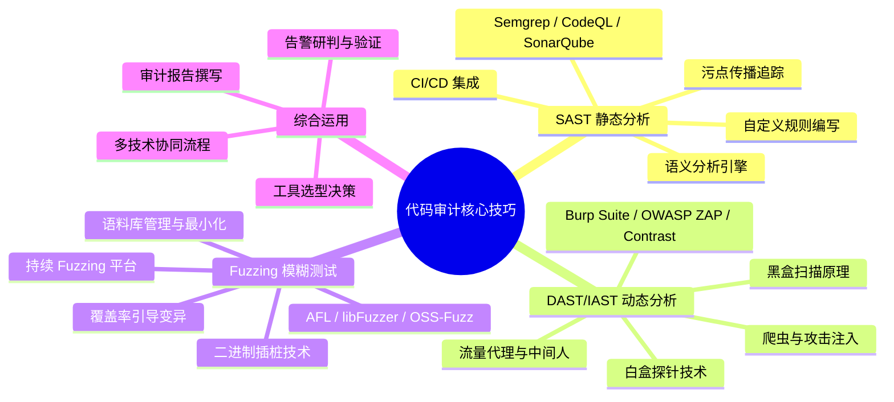
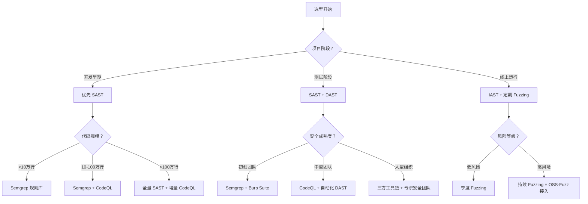

## 五、本节小结

本节系统讲解了代码审计的三大核心技巧——**静态分析（SAST）**、**动态分析（DAST/IAST）** 和**模糊测试（Fuzzing）**。三者并非互斥选项，而是构成现代代码审计工具链的三大支柱。本节的小结将从知识体系回顾、全景对比、选型决策、实际工作流、常见误区、能力成熟度模型以及进阶方向七个维度，帮助读者建立完整的知识框架，并为下一组实战章节做好准备。

---

### 5.1 核心技巧知识体系回顾

在进入总结之前，先回顾本节（第 1-5 节）所覆盖的完整知识体系：



三大技巧分别解决不同层面的安全问题：

| 技巧 | 解决的核心问题 | 发现能力的边界 | 学习曲线 |
|------|--------------|--------------|---------|
| **SAST** | 代码中是否存在已知的不安全编码模式？ | 只能发现"模式匹配范围内"的问题，无法验证运行时行为 | 中等（规则编写需 QL 或正则表达式基础） |
| **DAST/IAST** | 应用在运行时是否暴露出可被利用的漏洞？ | 只能覆盖实际执行路径，无法触达未被调用的代码分支 | 中高（环境配置、流量管理、认证处理） |
| **Fuzzing** | 关键解析/处理逻辑在异常输入下是否会崩溃？ | 只能发现导致崩溃或异常行为的缺陷，无法发现纯逻辑漏洞 | 高（需要理解目标模块的数据流和编译插桩） |

> **核心认知**：没有任何一种单一技术能覆盖所有漏洞类型。成熟的审计体系必然采用"SAST 扫全量 → DAST/IAST 验运行时 → Fuzzing 挖深水区"的纵深策略。三者的关系如同"体检、专科检查和压力测试"——体检覆盖面广但精度有限，专科检查针对性强但只看局部，压力测试能发现隐性问题但只适用于特定指标。

---

### 5.2 三大核心技巧全景对比

| 维度 | 静态分析（SAST） | 动态分析（DAST/IAST） | 模糊测试（Fuzzing） |
|------|-----------------|---------------------|-------------------|
| **分析时机** | 不运行代码，直接分析源码或字节码 | 在应用运行时主动探测或被动监听 | 生成随机/变异输入并监控程序行为 |
| **覆盖范围** | 理论上可达全代码路径（含死代码） | 仅覆盖实际执行的路径 | 取决于输入变异策略和覆盖率引导 |
| **漏洞类型** | 注入、XSS、逻辑缺陷、配置问题、密码学误用 | 运行时暴露的认证绕过、会话管理、配置泄露 | 内存安全漏洞（OOB、UAF、堆溢出、整数溢出） |
| **误报率** | 中至高（静态推断无法验证运行时状态） | 低（实际触发的行为具有确定性） | 极低（crash + 回溯栈可直接复现） |
| **漏报率** | 中（无法覆盖运行时动态行为） | 中高（受爬虫覆盖率和输入生成限制） | 中（受限于变异策略和目标模块选择） |
| **配置成本** | 中（规则编写、白名单维护、语义分析调优） | 中到高（代理部署、探针注入、流量镜像、认证配置） | 高（编译插桩、语料库构建、环境隔离、崩溃分析） |
| **规模化能力** | 最强（天然适合 CI/CD 流水线，增量分析） | 中（需要运行时环境，容器化可缓解） | 中到弱（计算资源消耗大，持续运行需集群支持） |
| **学习曲线** | 中（规则语法 + 安全编码知识） | 中高（渗透测试基础 + 工具链熟练度） | 高（编译原理 + 目标程序架构理解） |
| **典型工具** | Semgrep、CodeQL、SonarQube、Checkmarx | Burp Suite、OWASP ZAP、HCL AppScan、Contrast（IAST） | AFL++、libFuzzer、OSS-Fuzz、Honggfuzz |
| **开源/商业** | 开源为主（CodeQL 免费用于公共仓库） | 商业为主（Burp Pro、AppScan） | 开源为主 |

#### 误报与漏报的量化参考

理解误报率和漏报率的实际影响，对于制定审计策略至关重要：

| 指标 | SAST 典型值 | DAST 典型值 | Fuzzing 典型值 | 影响 |
|------|-----------|-----------|-------------|------|
| **误报率** | 30%-60%（视规则质量） | 5%-15% | <2% | 误报高→人工研判成本大→"告警疲劳" |
| **漏报率** | 20%-40%（逻辑漏洞基本漏报） | 40%-60%（受限于路径覆盖） | 30%-50%（非崩溃类漏洞漏报） | 漏报高→虚假安全感→实际风险未降低 |

> **实战经验**：一个中等规模项目（50 万行代码）首次全量 SAST 扫描，可能产生 500-2000 条告警。其中真正需要修复的高危漏洞通常只有 10-30 条。这意味着告警研判（triage）本身就是一个需要投入资源的专项工作。团队需要建立"告警分级 → 快速研判 → 修复验证"的闭环流程，否则工具产出的告警堆积会成为团队负担。

---

### 5.3 选型决策框架：场景决定工具

在实际项目中，选型需要根据**项目阶段、代码规模、安全成熟度**三个维度综合判断。



#### 5.3.1 初创团队/个人开发者推荐组合

- **必选**：Semgrep + 官方规则库（零成本上手，GitHub Actions 一键集成）
  - 安装：`pip install semgrep` 或使用 GitHub Action
  - 规则：`p/default`（官方推荐）+ `p/owasp-top-ten`（OWASP Top 10 覆盖）
  - 预期效果：每 PR 扫描 30 秒内完成，拦截 70% 以上的常见编码缺陷
- **可选**：AFL++ + 关键模块插桩（仅对 C/C++/Rust 代码）
  - 适用条件：项目有自研的解析器、协议处理、编解码模块
  - 入门成本：约 1-2 天搭建环境 + 语料库
- **暂缓**：CodeQL（学习成本高，QL 查询需 1-2 周掌握）、商业 IAST（预算有限）

#### 5.3.2 中型团队推荐组合

- **流水线固化**：Semgrep（CI 门禁，每 PR 必跑） + CodeQL（MR 深度分析，每周定时跑）
- **定期巡检**：Burp Suite Pro 自动化扫描（每两周一次，覆盖 Top 10 攻击面）
- **专项安全**：libFuzzer 持续运行于 CI（针对高风险模块，如认证、支付、文件上传）
- **人员配置**：至少 1 名安全工程师负责告警研判、规则维护、漏洞跟踪

#### 5.3.3 大型组织推荐组合

- **全量覆盖**：商业 SAST（Coverity / Fortify / Checkmarx） + 自研规则 + 内部安全知识库
- **运行时防护**：IAST 探针部署于预发布环境 + RASP 防护于生产环境
- **持续 Fuzzing**：ClusterFuzz / OSS-Fuzz 集群式运行，按模块分配计算资源
- **人工兜底**：安全工程师对高、中危告警逐条研判，建立漏洞数据库（CVE 映射 + 内部编号）
- **流程保障**：安全 SLA（严重漏洞 24h 修复、高危 72h、中危 7 天） + 月度安全报告

---

### 5.4 实际审计工作流示例：一次完整的代码审计

以下以审计一个 **Web 应用的用户登录模块** 为例，展示三者的协作流程。

#### 阶段一：SAST 扫全量（CI 阶段）

```yaml
# .github/workflows/sast.yml
name: SAST Scan
on: [pull_request]
jobs:
  semgrep:
    runs-on: ubuntu-latest
    steps:
      - uses: actions/checkout@v4
      - uses: semgrep/semgrep-action@v1
        with:
          config: p/default p/owasp-top-ten
      # semgrep 发现: 密码重置接口缺少 JWT 校验
      # severity: HIGH → 阻断合并

  codeql:
    uses: github/codeql-action/.github/workflows/codeql-analysis.yml@v3
    with:
      languages: python
    # CodeQL 发现: SQL 注入风险（参数拼接而非预编译）
```

**SAST 阶段预期产出**：
- 一份按严重程度分级的告警列表（Critical / High / Medium / Low / Info）
- 每条告警附带代码位置（文件:行号:列号）和修复建议
- 高危告警自动阻断 PR 合并，中低危告警作为 Review 参考

#### 阶段二：DAST 验运行时（预发布环境）

```bash
# 使用 OWASP ZAP 进行自动化渗透扫描
zap-cli quick-scan --self-contained \
  --spider https://staging.example.com/login \
  --scan-policy "High-Level" \
  --output /tmp/zap-report.html

# 或使用 Burp Suite REST API
curl -X POST http://localhost:1337/scan \
  -H "Content-Type: application/json" \
  -d '{"url": "https://staging.example.com/login", "scan_type": "active"}'

# 发现: 会话 Cookie 未设置 Secure 和 HttpOnly 标志
# 发现: 登录失败未限制次数，存在暴力破解风险
# 发现: 登录响应头缺少 X-Content-Type-Options 和 X-Frame-Options
```

**DAST 阶段预期产出**：
- 与 HTTP 请求/响应直接关联的漏洞证据（可直接复现）
- 配置层面的安全缺陷（Cookie 标志、响应头、TLS 配置）
- 业务逻辑层面的发现（暴力破解风险、会话固定、认证绕过路径）

#### 阶段三：Fuzzing 挖深水区（关键模块专项）

```c
// libfuzzer 测试登录 token 解析函数
#include <stdint.h>
#include <stddef.h>
#include "login_token.h"  // 目标头文件

extern "C" int LLVMFuzzerTestOneInput(const uint8_t *data, size_t size) {
    // 限制输入长度，避免超长输入浪费计算资源
    if (size > 256) return 0;

    std::string input(reinterpret_cast<const char*>(data), size);
    LoginToken token;

    // 目标函数：解析登录 token
    // ASan + MSan 会自动检测：OOB 读写、UAF、整数溢出、未初始化内存
    ParseLoginToken(input, &token);

    return 0;
}

// 编译:
// clang++ -fsanitize=fuzzer,address,undefined token_fuzz.cpp -o token_fuzz
//
// 运行:
// ./token_fuzz corpus/ -max_len=256 -runs=1000000 -timeout=10
//
// 语料库积累后:
// ./token_fuzz corpus/ -merge=1  # 合并去重
```

**Fuzzing 阶段预期产出**：
- 崩溃用例（crash-inducing input）+ 完整的 ASan/UBSan 栈回溯
- 最小化复现用例（`llvm-reduce` 或工具内置 minimizer）
- 从崩溃栈可直接定位到源码具体行号，便于修复

#### 三者协同后的审计成果

| 阶段 | 发现的漏洞 | 漏洞类型 | 严重程度 |
|------|-----------|---------|---------|
| SAST | 密码重置接口缺少 JWT 校验 | 认证绕过 | HIGH |
| SAST | SQL 注入（参数拼接而非预编译） | 注入攻击 | CRITICAL |
| DAST | 会话 Cookie 未设置 Secure/HttpOnly | 会话安全 | MEDIUM |
| DAST | 登录失败无速率限制 | 暴力破解 | HIGH |
| DAST | 响应头缺少安全头配置 | 安全加固 | LOW |
| Fuzzing | token 解析函数整数溢出 | 内存安全 | CRITICAL |

> 这个例子充分说明：**任何一个阶段都无法替代另两个**。SAST 不运行代码，发现不了运行时配置问题（Cookie 标志、响应头）；DAST 只走实际路径，发现不了深埋的逻辑分支（token 解析的边界条件）；Fuzzing 只关注崩溃，发现不了业务逻辑漏洞（越权访问、JWT 校验缺失）。三者协同才能构建完整的安全防线。

---

### 5.5 常见误区与纠正

#### 误区一：自动化工具可以替代人工审计

**错误认知**："上了 Semgrep 和 CodeQL 之后，就不需要人工看代码了。"

**纠正**：自动化工具擅长发现**已知模式的漏洞**（注入、XSS、硬编码密钥等），但**业务逻辑漏洞**（越权访问、竞争条件、设计缺陷）几乎完全依赖人工审计。根据 SANS 2023 年报告，约 68% 的高危业务漏洞仍由人工审计发现，自动化工具漏报率超过 40%。

**典型遗漏场景**：
- **越权访问**：用户 A 能通过修改 URL 中的 ID 访问用户 B 的数据——这是业务逻辑问题，静态分析无法理解"谁应该能访问什么"
- **竞态条件**：两个并发请求同时扣款导致余额变负——这是时序问题，需要人工分析数据流
- **设计缺陷**：密码重置流程允许攻击者通过修改邮箱接收重置链接——这是流程设计问题

**正确做法**：将自动化工具作为"守门人"，人工审计作为"深挖者"。自动化负责 80% 的通用安全问题，人工负责 20% 的复杂逻辑和设计问题——但这 20% 往往对应着最大的潜在危害。

#### 误区二：Fuzzing 只有 C/C++ 项目才需要

**错误认知**："我用的是 Python/Java/Go，内存安全，不需要 Fuzzing。"

**纠正**：内存安全只是漏洞的一类。Fuzzing 的价值远超内存安全检测：

- **Python 项目**：Fuzzing 可以发现逻辑异常（无限循环、资源泄露、解析器崩溃）。例如，对自定义 JSON Schema 解析器进行 Fuzzing，发现畸形 JSON 导致的无限递归（栈溢出）
- **Java 项目**：Fuzzing 可以发现 XML 解析异常（XXE）、反序列化漏洞、正则表达式 DoS（ReDoS）。例如，对 XML 反序列化入口进行 Fuzzing，发现恶意构造的 XML 实体可触发 SSRF
- **Go 项目**：自 Go 1.18 起内置了原生 Fuzzing 支持（`go test -fuzz`），Google 已用其发现了大量 panic 和竞态条件。Go 的 Fuzzing 集成成本极低，几乎没有理由不使用
- **JavaScript/TypeScript 项目**：对输入解析模块（如自定义 Markdown 解析器、SVG 渲染器）进行 Fuzzing，可发现原型污染、ReDoS 等问题

**正确做法**：所有语言的项目都应至少对以下模块做 Fuzzing：
- 输入解析器（JSON、XML、二进制协议解码）
- 数据转换函数（编码/解码、序列化/反序列化、格式化）
- 网络协议处理（HTTP 请求解析、WebSocket 消息帧处理）
- 文件格式处理（PDF、图片、音视频解码器）

#### 误区三：工具越多越安全

**错误认知**："我把市面上所有安全工具全接入，绝对安全。"

**纠正**：工具数量与安全质量不是线性关系。多个工具的告警去重、真伪研判、优先级排序本身就成为新的工作负担。团队花在"处理告警"上的时间如果超过"修复漏洞"的时间，安全成本失控。

**反面案例**：某中型团队同时接入了 8 款安全工具，每月产生超过 5000 条告警。安全工程师花费 80% 的时间在告警研判上，真正修复漏洞的时间不到 20%。最终团队缩减为 3 款核心工具，月告警量降至 200 条，修复率从 15% 提升到 75%。

**正确做法**：遵循**"工具最少够用原则"**：
1. 每个维度选一款最合适的工具（SAST 1款 + DAST/IAST 1款 + Fuzzing 1款）
2. 先用小规模跑通流程，再逐步扩展规则
3. 定期评审告警量的分布，识别"高噪声低产出"的工具并替换
4. 建立告警 SLA：Critical 告警 24h 内研判，High 72h，Medium 7 天，Low 双周批量处理

#### 误区四：安全扫描跑一次就够了

**错误认知**："上线前扫了一次，没有高危漏洞，安全没问题了。"

**纠正**：安全是一个持续的过程，而非一次性的检查。代码在持续演进，新的漏洞可能在每次提交中引入。威胁情报也在更新，曾经安全的依赖库可能被发现存在 CVE。

**正确做法**：
- SAST 集成到 CI/CD，每 PR 自动触发
- DAST 在预发布环境每周自动运行
- Fuzzing 持续运行，语料库不断积累
- 依赖扫描（SCA）每周更新，监控新披露的 CVE
- 建立"安全事件响应流程"，确保新漏洞被发现后能快速修复

#### 误区五：只关注技术漏洞，忽视安全架构

**错误认知**："只要工具没报高危，系统就是安全的。"

**纠正**：工具只能发现技术层面的漏洞，但安全架构的缺陷往往更为致命。例如：
- 微服务间缺少 mTLS，内网通信未加密
- 数据库访问没有最小权限原则，应用使用 DBA 账号
- 日志中记录了用户密码或敏感信息
- API 缺少速率限制，可被滥用为 DDoS 放大器

**正确做法**：在工具扫描之外，定期进行安全架构评审（Security Architecture Review），关注认证授权模型、数据流转路径、基础设施安全配置等系统性问题。

---

### 5.6 代码审计能力成熟度模型

根据团队在代码审计方面的投入和产出，可以将能力划分为五个成熟度等级：


| 等级 | 名称 | 特征 | 工具使用 | 人员投入 | 安全效果 |
|------|------|------|---------|---------|---------|
| **L0** | 无防护 | 无任何安全扫描，依赖开发者的安全意识 | 无 | 无 | 几乎为零，漏洞在生产环境被外部发现 |
| **L1** | 基础扫描 | 引入 SAST 工具，CI 中集成基础规则 | SAST（默认规则） | 兼职（开发人员顺带看） | 能拦截 30%-40% 的通用漏洞 |
| **L2** | 流程集成 | SAST + DAST 流水线化，告警分级处理 | SAST + DAST | 半专职（安全工程师 50% 时间） | 能拦截 50%-60% 的漏洞，有基本的响应流程 |
| **L3** | 深度审计 | 三大技术全覆盖，有人工审计流程，安全需求前置 | SAST + DAST + Fuzzing | 专职安全团队（2-5 人） | 能拦截 70%-80% 的漏洞，安全成为开发流程的一部分 |
| **L4** | 持续安全 | DevSecOps 全链路，威胁建模自动化，安全左移贯穿全生命周期 | 全工具链 + 自研平台 | 成熟安全团队（5+ 人）+ 安全文化 | 能拦截 85%+ 的漏洞，安全成为竞争优势 |

**如何评估你的团队当前处于哪个等级？**

回答以下五个关键问题：

1. **扫描频率**：你们的安全扫描是何时触发的？（手动 → L1，每次 PR → L2+，持续运行 → L4）
2. **告警处理**：告警产出后有明确的处理流程吗？（没人看 → L1，有人研判 → L2+，有 SLA → L3+）
3. **工具覆盖**：你们使用了几类安全技术？（仅 SAST → L1-2，SAST + DAST → L2-3，三类全覆盖 → L3+）
4. **人员配置**：有专职安全人员吗？（无 → L0-1，兼职 → L2，专职 → L3+）
5. **安全文化**：开发者会主动考虑安全问题吗？（不会 → L0-1，偶尔 → L2，每次设计都考虑 → L4）

---

### 5.7 审计准备度检查清单

在启动一次正式的代码审计之前，确保以下准备工作就绪：

#### 环境准备

| 检查项 | 说明 | 完成 |
|--------|------|------|
| 代码仓库访问权限 | 确保能访问全部源码（含配置文件、脚本） | □ |
| 依赖清单（SBOM） | 能自动生成软件物料清单（如 `syft`、`trivy`） | □ |
| 构建环境 | 能在本地或 CI 中成功编译/构建项目 | □ |
| 测试环境 | 有独立的预发布环境供 DAST 扫描 | □ |
| 基线快照 | 记录当前代码版本号和已知漏洞状态 | □ |

#### 工具准备

| 检查项 | 说明 | 完成 |
|--------|------|------|
| SAST 工具安装 | Semgrep/CodeQL 已安装并能正常运行 | □ |
| SAST 规则确认 | 选择适合项目语言和框架的规则集 | □ |
| DAST 工具配置 | Burp/ZAP 已配置，认证模块已设置 | □ |
| Fuzzing 环境 | 编译器插桩可用，基础语料库已准备 | □ |
| 工具版本记录 | 记录所有工具版本号，确保结果可复现 | □ |

#### 知识准备

| 检查项 | 说明 | 完成 |
|--------|------|------|
| 架构文档 | 了解系统的整体架构、数据流、信任边界 | □ |
| 威胁模型 | 已完成或更新了威胁建模（STRIDE/PASTA） | □ |
| 历史漏洞 | 回顾之前的审计报告和修复记录 | □ |
| 合规要求 | 明确适用的安全标准（OWASP Top 10、CIS、等保等） | □ |
| 修复流程 | 确认漏洞发现后的修复、验证、关闭流程 | □ |

---

### 5.8 从本节到下一节：从技巧到体系

本书第 32 章分为两个部分：

| 部分 | 章节 | 核心内容 | 类比 |
|------|------|---------|------|
| **核心技巧**（本节） | 1-5 节 | 三大底层技术：SAST、DAST/IAST、Fuzzing | 学会使用锤子、螺丝刀、电钻 |
| **实战指南**（下一组） | 6-10 节 | 将这些技术应用到真实场景：Web 应用审计、移动端审计、容器镜像审计、云配置审计、DevSecOps 流水线 | 学会建造一栋完整的房子 |

**核心技巧是"术"**——掌握它们，你有了发现漏洞的能力。就像学会了各种工具的使用方法，知道每种工具适合解决什么问题。

**实战指南是"道"**——将它们系统化、流程化、标准化，你才能持续、高效地保障安全质量。就像学会了建筑的整体方法论，知道如何规划、施工、验收一栋完整的建筑。

**两者之间的鸿沟**：很多安全从业者卡在"会用工具"到"会做审计"之间。具体表现为：
- 工具跑了一堆，不知道从哪条告警开始处理
- 发现了漏洞，不知道如何评估真实风险和修复优先级
- 修复了漏洞，不知道如何验证修复效果
- 做了审计，不知道如何形成可复用的知识和流程

从下一节开始，我们将把 SAST、DAST 和 Fuzzing 这三把"利器"融入具体的审计场景中，用真实的漏洞案例和可复用的审计清单，帮助你跨越这个鸿沟：

- **第 6 节**：Web 应用代码审计——从 OWASP Top 10 出发，覆盖注入、认证、授权、配置等完整攻击面
- **第 7 节**：移动端代码审计——Android/iOS 平台特有的安全风险和审计方法
- **第 8 节**：容器镜像审计——Dockerfile 安全、镜像漏洞扫描、运行时安全
- **第 9 节**：云配置审计——AWS/Azure/GCP 的常见安全 misconfiguration 和自动化检测
- **第 10 节**：DevSecOps 流水线——将安全融入 CI/CD 的完整实践方案

---

### 5.9 本节要点速查表

```text
┌─────────────────────────────────────────────────────────────┐
│                     本节要点速查                              │
├─────────────────────────────────────────────────────────────┤
│                                                             │
│  静态分析（SAST）                                           │
│  ├─ Semgrep: 灵活的模式匹配 + 污点追踪，适合 CI 门禁        │
│  ├─ CodeQL: QL 查询 + 深层语义分析，适合深度审计            │
│  ├─ 优势: 全路径覆盖、CI 友好、误报可接受                    │
│  └─ 局限: 无法验证运行时行为，逻辑漏洞漏报率高              │
│                                                             │
│  动态分析（DAST/IAST）                                      │
│  ├─ DAST: 黑盒扫描，无需源码，适合第三方应用                │
│  ├─ IAST: 白盒 + 运行时探针，精准定位代码位置               │
│  ├─ RASP: 运行时自保护，适合线上防护（本章未详述）          │
│  └─ 局限: 受限于爬虫覆盖率和认证配置，路径覆盖不全          │
│                                                             │
│  模糊测试（Fuzzing）                                        │
│  ├─ AFL++: 覆盖率引导，适合二进制/闭源场景                  │
│  ├─ libFuzzer: 进程内 Fuzzing，适合开源库和 CI 集成         │
│  ├─ OSS-Fuzz: Google 维护的持续 Fuzzing 平台                │
│  └─ 局限: 计算资源消耗大，非崩溃类漏洞无法发现              │
│                                                             │
│  黄金法则                                                   │
│  ├─ SAST + DAST + Fuzzing 三者互补，缺一不可                │
│  ├─ 自动化覆盖 80% 通用问题，人工覆盖 20% 核心漏洞          │
│  ├─ 工具选型看场景，不看数量——最少够用原则                  │
│  ├─ 安全是持续过程，不是一次性检查                          │
│  └─ 技术漏洞之外，安全架构评审同样重要                      │
│                                                             │
│  能力成熟度（自评）                                         │
│  ├─ L0 无防护 → L1 基础扫描 → L2 流程集成                  │
│  ├─ L3 深度审计 → L4 持续安全                              │
│  └─ 每提升一级，漏洞拦截率提升约 15%-20%                    │
│                                                             │
└─────────────────────────────────────────────────────────────┘
```

---

### 5.10 本节学习目标检查

通过本节的系统学习，读者应当能够：

1. **理解**：三大技巧的本质区别和适用场景，以及它们各自的优势和局限
2. **掌握**：每种技巧的核心工具如何安装、配置和运行，以及基本的规则编写方法
3. **应用**：根据项目实际需求（阶段、规模、成熟度），选择合适的工具组合并搭建审计工具链
4. **协同**：设计 SAST → DAST → Fuzzing 的三阶段协同审计流程，最大化漏洞发现率
5. **研判**：对工具产出的告警进行分级、验证和优先级排序，区分真漏洞和误报
6. **进阶**：了解从"单独使用工具"到"构建审计体系"到"DevSecOps 全链路"的成长路径
7. **规避**：识别并避免常见的审计误区（工具替代人工、一次扫描够了、工具越多越好等）

> **下一步**：从第 6 节开始，我们将进入实战部分，首先从最常见的 **Web 应用代码审计** 开始。Web 应用是攻击面最广、漏洞类型最丰富、也是读者最可能第一时间遇到的审计场景。我们将把本节学到的三大技巧应用于真实的 Web 应用，覆盖 OWASP Top 10 的每一个类别，并提供可直接复用的审计检查清单。
