## 一、代码审计方法论

代码审计是软件安全的基石。在安全开发生命周期（SDL）中，代码审计是唯一能在软件发布前系统性发现深层安全缺陷的手段——渗透测试只能触及运行时行为，而代码审计能直达问题根因。本节将从理论到方法、从流程到工具，完整构建代码审计的方法论体系。

---

### 1.1 什么是代码审计

代码审计（Code Audit / Source Code Review）是对计算机程序源代码进行系统性安全审查的过程，旨在发现安全漏洞、逻辑缺陷、编码规范违反以及潜在的质量问题。

从本质上看，代码审计回答的是一个核心问题：**这段代码在所有可能的执行路径下，是否都满足安全约束？** 这意味着审计人员不仅要理解代码"做了什么"，更要理解代码"可能做什么"——包括开发者意图之外的行为。

#### 代码审计与相关活动的区别

| 活动 | 视角 | 覆盖范围 | 优势 | 局限 |
|------|------|----------|------|------|
| **代码审计** | 源代码级 | 所有代码路径 | 深度发现，根因定位 | 需要源代码，人力密集 |
| **渗透测试** | 运行时 | 可达路径 | 模拟真实攻击 | 路径覆盖有限 |
| **模糊测试** | 输入变异 | 输入空间 | 发现崩溃和异常 | 难以覆盖深层逻辑 |
| **SCA扫描** | 依赖组件 | 第三方库 | 快速发现已知漏洞 | 不覆盖自研代码 |
| **SAST扫描** | 源代码级 | 自动化全覆盖 | 高效，可CI集成 | 误报率高，逻辑漏洞弱 |

代码审计的核心价值体现在四个维度：

- **深度发现**：能够发现黑盒测试无法触及的深层逻辑漏洞，例如竞态条件、权限提升、加密误用等
- **全面覆盖**：理论上可以覆盖所有代码路径，不受输入空间和运行时条件的限制
- **根因定位**：直接定位漏洞的根因代码，而非仅发现漏洞的表现，为修复提供精确指导
- **预防为主**：在软件发布前消除安全隐患，修复成本远低于上线后（据IBM Systems Sciences Institute研究，生产环境修复成本是设计阶段的100倍）

#### 代码审计的ROI分析

一个典型的Web应用代码审计项目投入产出比：

```text
项目规模：50,000行代码的中型Web应用
审计团队：2名安全审计师，工作2周
审计成本：约15-25万元人民币

预期产出：
- 发现高危漏洞 5-15个
- 发现中危漏洞 15-30个
- 发现低危及信息级问题 30-60个

对比：
- 等保合规测评中一个高危漏洞的整改成本：10-30万元
- 生产环境数据泄露事件的平均损失：420万美元（IBM 2023报告）
- 因漏洞导致的业务中断损失：每小时数万到数百万元

结论：代码审计的投入远低于漏洞修复和事件响应的成本
```

---

### 1.2 代码审计分类体系

代码审计的分类维度决定了审计策略的选择。理解不同分类方式有助于根据项目特点制定最优审计方案。

#### 1.2.1 按审计透明度分类

**（1）白盒审计（White-box Audit）**

白盒审计是代码审计最主要的形式，审计人员可以完全访问源代码、设计文档、配置文件等所有开发资料。其优势在于可以完整理解程序逻辑和数据流，能够发现复杂的逻辑漏洞和设计缺陷，审计覆盖率高，漏报率低。

白盒审计的典型场景：

- 企业内部系统安全评估
- 开源软件安全审查
- 第三方组件源码审计
- 合规性要求下的安全验证

白盒审计面临的挑战：

- 代码量大时审计效率下降（10万行以上代码需要明确的审计策略）
- 审计人员需要具备目标技术栈的深入理解
- 可能受制于时间压力导致审计不充分

**（2）灰盒审计（Gray-box Audit）**

灰盒审计介于白盒和黑盒之间，审计人员拥有部分源代码或有限的系统信息。在实际工作中，灰盒审计非常常见：

- 只能访问前端代码的Web应用审计（后端闭源）
- 只能获取部分模块源码的组件审计
- 基于反编译的二进制代码审计
- 委托第三方审计时部分代码受限的场景

灰盒审计的核心策略是"以有限信息推断整体安全态势"，需要审计人员具备较强的推理能力和经验。

**（3）黑盒审计（Black-box Audit）**

严格来说，黑盒审计不属于传统意义上的代码审计，但实践中常作为补充手段。审计人员不接触源代码，仅通过外部行为推断内部实现：

- API模糊测试推断后端逻辑
- 二进制逆向工程分析
- 行为分析和侧信道推断

#### 1.2.2 按审计时机分类

**（1）设计阶段审计（Pre-code Audit）**

在编码开始前，对架构设计、威胁模型、安全方案进行审查。此阶段审查成本最低，效果最高：

- 审查安全架构设计是否合理
- 验证威胁模型的完整性
- 评估安全控制措施的有效性
- 确认合规要求的覆盖情况

**（2）开发阶段审计（Development Audit）**

在编码过程中进行的审计，通常结合CI/CD流水线实现：

- 增量代码审查（每次提交或合并请求）
- 定期全量扫描（每日或每周）
- 安全关键模块的专项审计

**（3）发布前审计（Pre-release Audit）**

在软件发布前进行的全面审计，是质量关卡的关键环节：

- 全量代码安全扫描
- 重点模块深度审计
- 修复验证和回归测试

**（4）运维阶段审计（Post-release Audit）**

软件上线后的持续审计，针对变更和事件驱动：

- 变更代码审计
- 安全事件响应中的代码溯源
- 定期安全体检

#### 1.2.3 按自动化程度分类

**（1）人工审计（Manual Audit）**

完全由人工完成的审计，适用于复杂逻辑分析和上下文理解：

- 优势：理解业务逻辑，发现设计缺陷，误报极低
- 劣势：效率低，依赖审计师经验，覆盖面受时间限制
- 适用场景：安全关键模块、高价值目标、SAST工具误报验证

**（2）自动化审计（Automated Audit）**

完全由工具完成的审计，适用于模式化漏洞检测：

- 优势：速度快，覆盖面广，可重复执行
- 劣势：误报率高，难以理解业务逻辑，对设计缺陷无能为力
- 适用场景：CI/CD集成、全量扫描、已知漏洞模式检测

**（3）混合审计（Hybrid Audit）**

人工与自动化结合的审计，是当前最佳实践：

- 工具先行：用SAST工具进行全量扫描，筛选出可疑点
- 人工聚焦：对工具筛选结果进行人工验证和深入分析
- 经验反馈：将人工发现的新模式反馈给工具，提升检测能力

```text
混合审计流程：

┌─────────────┐    ┌─────────────┐    ┌─────────────┐    ┌─────────────┐
│  自动化扫描  │ →  │  结果聚合    │ →  │  人工分析    │ →  │  修复验证    │
│  SAST/SCA   │    │  去重/关联   │    │  逻辑审计    │    │  回归测试    │
└─────────────┘    └─────────────┘    └─────────────┘    └─────────────┘
     ↑                                                              │
     └──────────── 模式反馈 / 规则优化 ←────────────────────────────┘
```

---

### 1.3 代码审计核心方法论

方法论是审计工作的"操作系统"，决定了审计的效率和质量。以下是五种核心审计方法，各有适用场景和优劣势。

#### 1.3.1 自顶向下法（Top-Down Method）

**核心思想**：从架构设计开始，先理解整体安全模型，再逐层深入各模块、函数、语句。

**审计路径**：

```text
架构审计 → 模块审计 → 函数审计 → 语句审计
```

**适用场景**：

- 大型项目首次审计
- 需要全面评估安全态势
- 架构设计阶段的安全审查

**具体步骤**：

1. **架构层审计**：审查整体架构设计，识别信任边界和安全控制点
2. **模块层审计**：按优先级逐一审查各功能模块的安全性
3. **函数层审计**：对关键函数进行详细的输入输出分析
4. **语句层审计**：对敏感代码段进行逐行审查

**优势**：结构清晰，不会遗漏大范围安全问题，适合建立全局安全视图。

**劣势**：耗时较长，对审计师的架构理解能力要求高，可能在细节审计上投入不足。

**实例**：审计一个电商平台时，自顶向下法会先分析整体架构（前端→API网关→业务服务→数据层），识别出核心信任边界（用户认证、支付处理、数据存储），然后优先审计支付模块（涉及资金安全），再审计订单模块、用户模块等。

#### 1.3.2 自底向上法（Bottom-Up Method）

**核心思想**：从具体的危险函数和API调用开始，逆向追踪数据来源，验证是否经过充分的安全处理。

**审计路径**：

```text
危险函数定位 → 参数来源追踪 → 入口点确认 → 漏洞验证
```

**适用场景**：

- 小型项目或专项审计
- 已知漏洞模式的检测
- SAST扫描结果的人工验证

**具体步骤**：

1. **危险函数定位**：识别所有可能引发安全问题的函数调用
2. **参数来源追踪**：从危险函数反向追踪参数的数据来源
3. **入口点确认**：确认数据是否来自用户可控输入
4. **漏洞验证**：验证输入是否经过充分的安全处理

**常见危险函数清单（以C/C++为例）**：

| 类别 | 危险函数 | 风险 | 安全替代 |
|------|----------|------|----------|
| 字符串操作 | `strcpy`, `strcat`, `sprintf` | 缓冲区溢出 | `strncpy`, `strncat`, `snprintf` |
| 内存操作 | `gets`, `scanf("%s")` | 无界读取 | `fgets`, `scanf("%255s")` |
| 命令执行 | `system`, `popen` | 命令注入 | `execve`, 参数化调用 |
| 文件操作 | `fopen`, `access` | 路径穿越 | 输入验证 + `openat` |
| 格式化 | `printf`, `sprintf` | 格式化字符串漏洞 | `printf("%s", str)` |

**优势**：效率高，直击要害，对已知漏洞模式检出率高。

**劣势**：可能遗漏不涉及危险函数的设计缺陷，缺乏全局视角。

#### 1.3.3 数据流分析法（Data Flow Analysis）

**核心思想**：追踪用户输入从进入系统到执行敏感操作的完整路径，是发现注入类漏洞最有效的方法。

**审计模型**：

```text
Source（数据源）→ Transform（转换处理）→ Sink（危险操作）
```

**数据流追踪示例**：

```text
Source（用户输入）                    Sink（危险操作）
     │                                    │
     ▼                                    ▼
┌─────────┐    ┌─────────┐    ┌─────────┐    ┌─────────┐
│ HTTP请求 │ →  │ 参数解析 │ →  │ 业务处理 │ →  │ SQL查询  │
│ ?id=1'  │    │ $_GET   │    │ 拼接SQL  │    │ 执行SQL  │
└─────────┘    └─────────┘    └─────────┘    └─────────┘
                                    │
                              无安全处理
                              （漏洞！）
```

**数据流分析的关键要素**：

1. **识别Source**：所有用户可控的输入点
   - HTTP请求参数（GET/POST/Headers/Cookies）
   - 文件上传内容
   - 环境变量和配置文件
   - 第三方API返回数据
   - 数据库读取数据（在特定场景下）

2. **识别Sink**：所有敏感操作执行点
   - SQL查询执行
   - 文件系统操作
   - 命令/代码执行
   - 模板渲染
   - HTTP重定向
   - 序列化/反序列化

3. **分析Transform**：数据在传递过程中的所有转换
   - 是否进行了输入验证
   - 是否进行了输出编码
   - 是否使用了参数化查询
   - 是否进行了类型转换
   - 是否进行了长度限制

**数据流污染传播规则**：

```text
规则1：污点数据经过任何字符串拼接操作，结果仍为污点
规则2：污点数据经过类型转换（如转为整数），在某些语言中可能失去污点
规则3：污点数据经过充分的验证和编码后，可标记为"清洁"
规则4：污点数据在条件分支中传播到所有可能的分支
规则5：污点数据作为函数参数传入后，在函数内部的所有使用点都带有污点
```

#### 1.3.4 控制流分析法（Control Flow Analysis）

**核心思想**：分析程序的执行路径，关注条件分支、异常处理、并发控制等逻辑问题，发现数据流分析难以覆盖的逻辑漏洞。

**重点关注领域**：

1. **权限检查逻辑**：验证所有访问控制点是否完整一致
2. **异常处理路径**：检查异常是否可能导致安全控制绕过
3. **竞态条件**：分析多线程/并发场景下的时序问题
4. **状态机逻辑**：验证业务流程是否允许非法状态转换

**竞态条件审计示例**：

```python
# 典型的TOCTOU（Time-of-Check Time-of-Use）竞态条件
def transfer_funds(user, amount):
    balance = get_balance(user)          # 检查点
    # ⚠️ 竞态窗口：另一个线程可能在此时修改余额
    if balance >= amount:
        debit(user, amount)              # 使用点
        credit(destination, amount)
```

**控制流分析的审计要点**：

- 每个权限检查点是否覆盖了所有执行路径
- 异常处理是否泄露敏感信息或绕过安全控制
- 事务边界是否正确，是否存在部分提交问题
- 并发访问共享资源是否有适当的锁机制
- 状态转换是否有限制，是否防止了非法状态跳转

#### 1.3.5 威胁建模驱动法（Threat-Model-Driven Audit）

**核心思想**：基于威胁建模结果，针对识别出的威胁场景设计审计用例，实现精准审计。

**审计路径**：

```text
威胁识别 → 攻击面分析 → 安全控制验证 → 漏洞验证
```

**具体步骤**：

1. 基于STRIDE模型识别各组件面临的威胁
2. 针对每种威胁设计对应的审计检查点
3. 验证已部署的安全控制措施是否有效
4. 模拟攻击场景验证漏洞可利用性

**优势**：审计目标明确，资源分配合理，与安全需求直接对应。

**劣势**：依赖威胁建模的质量，可能遗漏未识别的威胁。

> 关于威胁建模的详细内容，请参阅本章后续"威胁建模"章节。

#### 1.3.6 方法论对比与选择

| 方法论 | 适用规模 | 审计深度 | 审计效率 | 发现能力 | 适用阶段 |
|--------|----------|----------|----------|----------|----------|
| 自顶向下 | 大型项目 | 高 | 低 | 全面 | 首次审计 |
| 自底向上 | 中小型 | 中 | 高 | 特定模式 | 专项审计 |
| 数据流分析 | 所有规模 | 高 | 中 | 注入类漏洞 | 重点审计 |
| 控制流分析 | 所有规模 | 高 | 中 | 逻辑漏洞 | 深度审计 |
| 威胁建模驱动 | 所有规模 | 高 | 中 | 威胁对应 | 全阶段 |

**实践建议**：实际审计中通常组合使用多种方法。例如，先用自顶向下法建立全局视图，再用数据流分析法重点审查注入类漏洞，最后用控制流分析法验证权限和逻辑问题。

---

### 1.4 代码审计标准流程

一个完整的代码审计项目通常包含四个阶段，每个阶段都有明确的输入、输出和质量标准。

```mermaid
graph TD
    A["📋 代码审计流程"]
    
    A --> B["阶段一：准备与信息收集"]
    A --> C["阶段二：架构分析"]
    A --> D["阶段三：逐模块审计"]
    A --> E["阶段四：漏洞验证与报告"]
    
    B --> B1["收集项目文档"]
    B --> B2["搭建审计环境"]
    B --> B3["了解技术栈"]
    B --> B4["确定审计范围"]
    B --> B5["建立检查清单"]
    
    C --> C1["识别入口点"]
    C --> C2["识别出口点"]
    C --> C3["分析数据流路径"]
    C --> C4["标注信任边界"]
    C --> C5["评估攻击面"]
    
    D --> D1["认证与授权模块"]
    D --> D2["数据处理模块"]
    D --> D3["通信模块"]
    D --> D4["存储模块"]
    D --> D5["配置管理"]
    
    E --> E1["漏洞验证"]
    E --> E2["编写审计报告"]
    E --> E3["修复建议"]
    E --> E4["复审验证"]
    
    style A fill:#E91E63,stroke:#333,color:#fff
    style B fill:#2196F3,stroke:#333,color:#fff
    style C fill:#FF9800,stroke:#333,color:#fff
    style D fill:#9C27B0,stroke:#333,color:#fff
    style E fill:#4CAF50,stroke:#333,color:#fff
```



#### 阶段一：准备与信息收集

准备工作直接决定审计效率。充分的准备可以避免审计过程中的反复确认和信息缺失。

```text
准备阶段检查清单：
├── 项目文档收集
│   ├── 架构设计文档（含架构图、数据流图）
│   ├── API接口文档（RESTful/SOAP/gRPC）
│   ├── 数据库设计文档（ER图、数据字典）
│   ├── 部署架构文档（网络拓扑、服务依赖）
│   └── 安全需求文档（如有）
├── 代码获取与环境搭建
│   ├── 获取完整源代码仓库（含配置文件）
│   ├── 搭建代码浏览环境（Source Insight / VS Code / IntelliJ IDEA）
│   ├── 配置代码索引和搜索功能
│   └── 准备审计工作底稿模板
├── 技术栈了解
│   ├── 编程语言及其版本
│   ├── 框架和中间件
│   ├── 数据库类型和版本
│   └── 第三方依赖库清单
├── 范围与优先级确定
│   ├── 明确审计范围（全量/增量/特定模块）
│   ├── 确定审计优先级（按业务价值和风险）
│   ├── 制定审计时间表
│   └── 确定交付物格式和标准
└── 检查清单建立
    ├── 语言特定安全检查项
    ├── 框架特定安全检查项
    ├── 业务逻辑安全检查项
    └── 合规性检查项
```

#### 阶段二：架构分析

理解整个应用的架构是审计的基础。架构分析的目标是建立对系统安全态势的全局认知，识别出高风险区域和优先审计目标。

**入口点（Entry Points）识别**：用户可控的输入点，是攻击者的主要接触面。

- HTTP接口：REST API端点、表单提交、文件上传
- 消息队列：异步消息消费者
- 文件读取：配置文件、用户上传文件、外部数据文件
- 命令行参数：CLI工具的输入参数
- 网络协议：WebSocket、TCP/UDP自定义协议

**出口点（Exit Points）识别**：敏感操作执行点，是漏洞利用的最终目标。

- 数据库查询：SQL执行、NoSQL操作
- 文件操作：读写删除、权限修改
- 命令执行：系统命令、子进程创建
- 网络请求：外部API调用、邮件发送
- 序列化操作：对象序列化/反序列化

**信任边界标注**：不同安全域之间的交互接口，是最容易出现安全问题的地方。

```text
典型Web应用的信任边界：

┌──────────────────────────────────────────────┐
│                  互联网                       │
│  ┌──────────────────────────────────────┐   │
│  │        边界一：用户→Web服务器         │   │
│  │  ┌──────────────────────────────┐   │   │
│  │  │     Web服务器                │   │   │
│  │  │  ┌──────────────────────┐   │   │   │
│  │  │  │  边界二：Web→应用服务器│   │   │   │
│  │  │  │  ┌──────────────┐   │   │   │   │
│  │  │  │  │  应用服务器   │   │   │   │   │
│  │  │  │  │ ┌──────────┐│   │   │   │   │
│  │  │  │  │ │边界三：   ││   │   │   │   │
│  │  │  │  │ │应用→数据库││   │   │   │   │
│  │  │  │  │ │ ┌──────┐││   │   │   │   │
│  │  │  │  │ │ │数据库 │││   │   │   │   │
│  │  │  │  │ │ └──────┘││   │   │   │   │
│  │  │  │  │ └──────────┘│   │   │   │   │
│  │  │  │  └──────────────┘   │   │   │   │
│  │  │  └──────────────────────┘   │   │   │
│  │  └──────────────────────────────┘   │   │
│  └──────────────────────────────────────┘   │
└──────────────────────────────────────────────┘

审计重点：每个信任边界都是潜在的安全问题发生点
```

#### 阶段三：逐模块审计

按照模块优先级，逐一进行深入审计。模块优先级通常由以下因素决定：

- **业务价值**：涉及资金、用户隐私的模块优先级最高
- **攻击面大小**：暴露给用户越多的模块风险越高
- **代码复杂度**：复杂逻辑更容易隐藏缺陷
- **变更频率**：频繁变更的模块更容易引入新问题

各模块审计重点：

| 模块类别 | 审计重点 | 常见漏洞 |
|----------|----------|----------|
| 认证与授权 | 身份验证、会话管理、权限控制 | 认证绕过、权限提升、会话劫持 |
| 数据处理 | 输入验证、输出编码、数据序列化 | 注入攻击、XSS、反序列化 |
| 通信模块 | 加密实现、协议处理、API调用 | 中间人攻击、协议降级、密钥泄露 |
| 存储模块 | 数据库操作、文件I/O、缓存处理 | SQL注入、路径穿越、缓存投毒 |
| 配置管理 | 密钥管理、配置文件、环境变量 | 硬编码密钥、配置泄露、默认凭据 |

#### 阶段四：漏洞验证与报告

对发现的可疑问题进行验证，确认漏洞的可利用性，并编写结构化的审计报告。

**漏洞验证原则**：

- 每个发现都需要实际验证，不能仅凭代码分析下结论
- 验证过程要记录复现步骤和证据
- 无法实际验证的漏洞要标注验证状态
- 避免在生产环境中进行验证性攻击

**审计报告结构**：

```text
代码审计报告
├── 1. 执行摘要
│   ├── 审计范围和目标
│   ├── 审计方法概述
│   ├── 关键发现摘要
│   └── 总体风险评级
├── 2. 漏洞详情
│   ├── 每个漏洞的详细描述
│   ├── 影响分析
│   ├── 复现步骤
│   ├── 修复建议
│   └── 参考标准（CWE/CVE编号）
├── 3. 统计分析
│   ├── 漏洞分布（按严重等级/类型/模块）
│   ├── 趋势对比（与历史审计结果）
│   └── 修复进度跟踪
└── 4. 改进建议
    ├── 短期修复方案
    ├── 长期改进建议
    └── 流程优化建议
```

---

### 1.5 代码审计评估标准

#### 1.5.1 漏洞严重等级评定

基于CVSS（Common Vulnerability Scoring System）评分框架，结合业务影响进行综合评定：

| 漏洞等级 | CVSS评分 | 描述 | 典型示例 | 处理要求 |
|----------|----------|------|----------|----------|
| **严重（Critical）** | 9.0-10.0 | 可远程利用，无需认证，影响重大 | 远程代码执行、SQL注入导致数据泄露 | 立即修复，阻断发布 |
| **高危（High）** | 7.0-8.9 | 可利用性较高，影响较大 | 权限提升、存储型XSS、SSRF | 7天内修复 |
| **中危（Medium）** | 4.0-6.9 | 需要特定条件，影响有限 | 反射型XSS、CSRF、信息泄露 | 30天内修复 |
| **低危（Low）** | 0.1-3.9 | 利用难度高，影响较小 | 版本泄露、不必要的HTTP头 | 下个版本修复 |
| **信息（Info）** | 0.0 | 编码规范、最佳实践建议 | 未使用HTTPS、弱随机数 | 计划改进 |

#### 1.5.2 审计质量度量

除了漏洞发现数量，代码审计的质量还应通过以下指标衡量：

| 度量指标 | 计算方式 | 目标值 | 说明 |
|----------|----------|--------|------|
| 代码覆盖率 | 审计行数/总代码行数 | ≥80% | 确保审计的全面性 |
| 漏洞密度 | 漏洞数/千行代码 | 行业基准对比 | 反映代码安全质量 |
| 误报率 | 误报数/总发现数 | ≤15% | 反映审计准确性 |
| 漏报率 | 未发现漏洞/总漏洞 | ≤10% | 需通过抽样验证 |
| 修复率 | 已修复漏洞/总漏洞 | 100%（高危以上） | 反映整改效果 |
| 修复时效 | 提出到修复的平均天数 | 严重<3天，高危<7天 | 反映响应效率 |

---

### 1.6 代码审计最佳实践

#### 1.6.1 审计效率提升策略

1. **建立语言/框架安全检查库**：将常见漏洞模式、检查要点、修复方案整理成标准化检查清单，避免每次审计从零开始。

2. **善用工具辅助**：将重复性工作交给工具（SAST扫描、依赖检查、模式匹配），将人工精力集中在复杂逻辑分析上。

3. **分层审计策略**：
   - 第一层：自动化全量扫描（筛选可疑点）
   - 第二层：人工快速审查（排除明显误报）
   - 第三层：深度人工审计（验证真实漏洞）

4. **并行审计**：对于大型项目，按模块分配审计人员并行工作，定期同步发现。

5. **知识积累**：每次审计后总结新的漏洞模式和审计技巧，持续更新审计检查库。

#### 1.6.2 审计团队能力要求

| 能力维度 | 初级审计师 | 中级审计师 | 高级审计师 |
|----------|------------|------------|------------|
| 编程能力 | 理解一种语言 | 精通2-3种语言 | 精通多种语言+底层原理 |
| 安全知识 | OWASP Top 10 | 常见漏洞原理+利用 | 0day发现+漏洞利用链 |
| 审计经验 | 在指导下完成 | 独立完成审计 | 主导审计项目 |
| 工具使用 | 基础SAST工具 | 多种工具组合 | 工具定制开发 |
| 报告能力 | 模板化报告 | 有深度的分析报告 | 战略级安全建议 |

#### 1.6.3 常见审计误区

1. **"扫描工具覆盖一切"**：SAST工具只能检测已知模式，对业务逻辑漏洞、设计缺陷几乎无效。工具是辅助，不是替代。

2. **"只关注高危漏洞"**：低危漏洞的组合利用链往往能造成严重影响。例如，信息泄露+弱认证+权限提升 = 系统沦陷。

3. **"审计一次就够了"**：代码在持续演进，审计需要持续进行。每次重大变更都应该触发增量审计。

4. **"修复就万事大吉"**：修复可能引入新问题。每个修复都应该经过验证和回归测试。

5. **"审计只关注代码"**：配置文件、数据库脚本、部署脚本、CI/CD配置都是攻击面，不应该被忽略。

---

### 1.7 代码审计工具生态概览

审计工具是方法论的落地载体。以下是审计工具的分类概览，具体工具的使用方法将在后续"核心技巧"章节详细展开。

| 工具类别 | 代表工具 | 特点 | 适用场景 |
|----------|----------|------|----------|
| **SAST工具** | SonarQube, Semgrep, Checkmarx | 静态分析，模式匹配 | CI/CD集成，全量扫描 |
| **SCA工具** | OWASP Dependency-Check, Snyk | 依赖组件扫描 | 已知漏洞检测 |
| **IAST工具** | Contrast Security, Seeker | 运行时插桩 | 动态验证 |
| **代码浏览器** | Source Insight, VS Code | 代码导航和搜索 | 人工审计辅助 |
| **自定义脚本** | Semgrep规则,grep/ripgrep | 模式定制 | 特定场景检测 |

> 关于SAST、DAST、Fuzzing等核心工具的详细使用方法，请参阅本章"核心技巧"相关章节。

---

### 1.8 本节小结

本节从方法论层面构建了代码审计的完整知识体系：

1. **定义与价值**：代码审计是软件安全的基石，能在发布前系统性发现深层安全缺陷
2. **分类体系**：从透明度、时机、自动化程度三个维度理解审计的不同形态
3. **核心方法论**：五种方法各有适用场景，实践中通常组合使用
4. **标准流程**：四个阶段各有明确的输入输出和质量标准
5. **评估标准**：基于CVSS的漏洞等级评定和审计质量度量
6. **最佳实践**：效率提升、团队能力建设和常见误区规避
7. **工具生态**：工具是方法论的落地载体，但不能替代人工分析

代码审计既是一门科学（有标准化的方法和流程），也是一门艺术（需要经验和直觉）。掌握方法论是起点，在实践中不断积累和迭代才是成为优秀审计师的正确路径。
