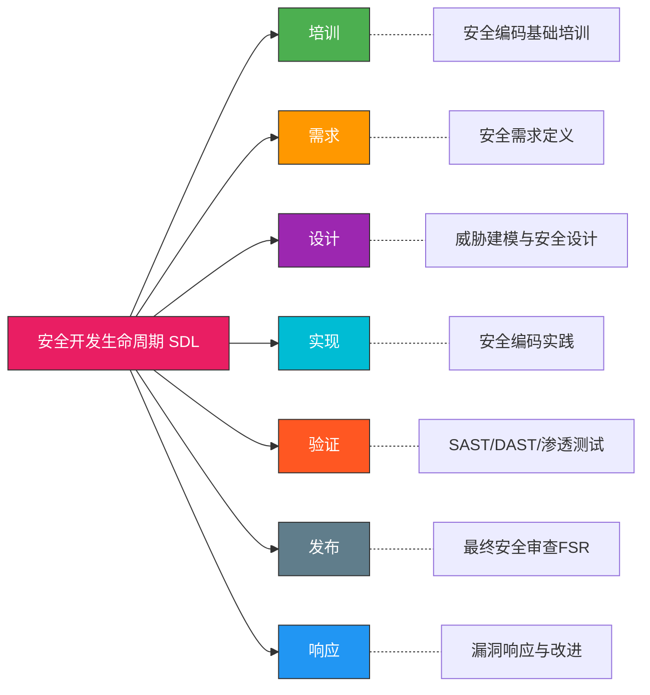
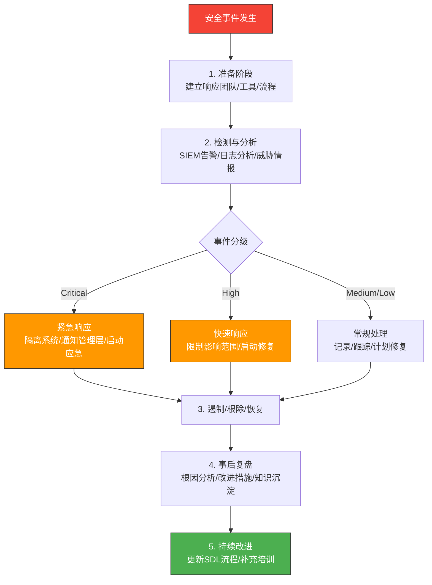
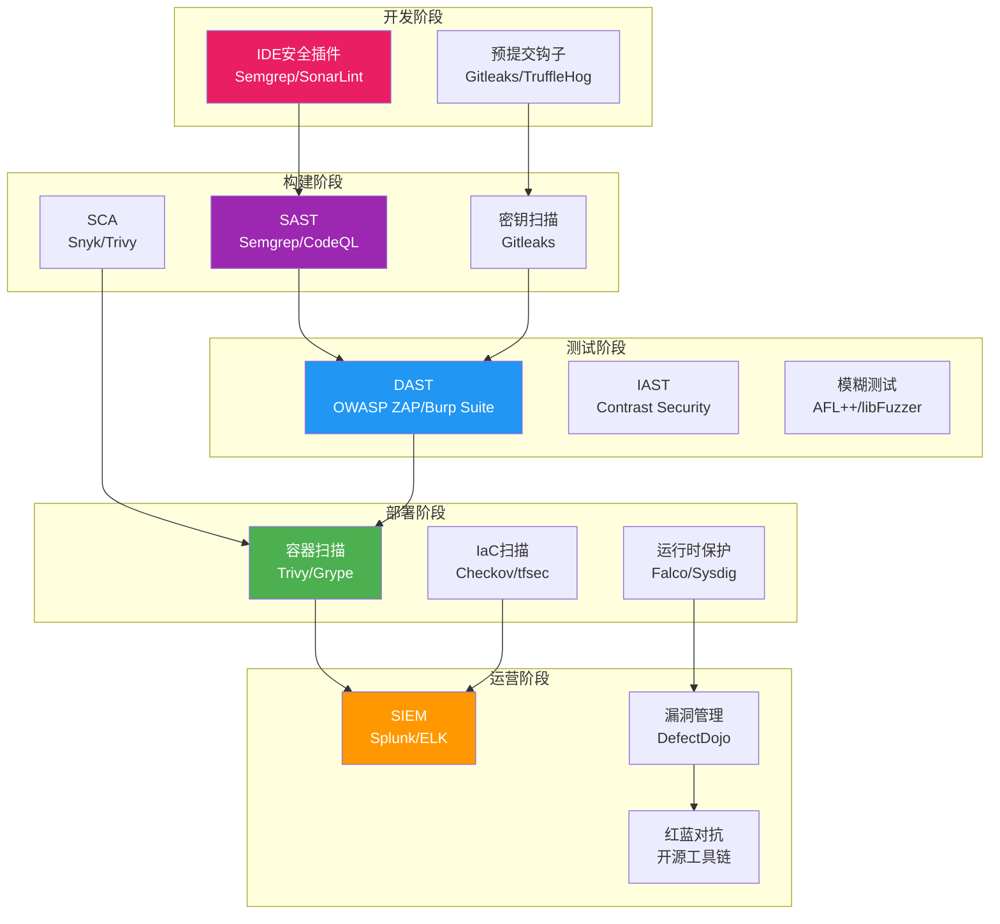

## 二、安全开发生命周期（SDL）

### 2.1 SDL概述与演进背景

安全开发生命周期（Security Development Lifecycle，SDL）是微软于2004年正式提出的一套系统性安全开发框架，其核心理念是将安全活动**嵌入软件开发的每个阶段**，而非在产品发布前才进行安全检查——即"安全左移"（Shift Left Security）。

SDL的诞生源于微软在2000年代初频繁遭遇的安全危机。2001年"红色代码"蠕虫、2003年"冲击波"蠕虫等大规模安全事件暴露出传统"先开发、后修补"模式的根本缺陷。微软在Bill Gates2002年发布的"可信计算备忘录"（Trustworthy Computing Memo）后，正式将SDL制度化。实施SDL后，微软产品中的漏洞密度在十年间下降了约50%以上。

#### SDL的七大阶段



#### SDL与其他安全框架的关系

| 框架 | 提出者 | 侧重点 | 适用范围 | 成熟度 |
|------|--------|--------|----------|--------|
| **Microsoft SDL** | 微软 | 全生命周期过程控制 | 大中型软件团队 | 最成熟，行业标准 |
| **BSIMM** | Cigital/Synopsys | 实际安全活动度量 | 企业级安全评估 | 数据驱动 |
| **OWASP SAMM** | OWASP | 自评估与改进路线 | Web应用开发 | 开放免费 |
| **NIST SSDF** | NIST | 美国联邦合规要求 | 政府与关键基础设施 | 法规驱动 |
| **PCI DSS** | PCI SSC | 支付数据安全合规 | 金融支付系统 | 合规强制 |

微软SDL是其中**历史最久、文档最完善**的框架，但并非唯一选择。OWASP SAMM因其开放性和灵活性，在中小型团队中更受欢迎；BSIMM则以实际度量数据帮助企业评估自身安全能力水平。

### 2.2 SDL各阶段深度解析

#### 阶段一：安全培训（Training）

**为什么培训是第一步？** 因为安全的核心问题始终是**人**。Gartner 2023年报告指出，超过70%的安全漏洞源于开发人员的安全知识不足或安全意识薄弱。再好的流程和技术，如果没有具备安全意识的人员去执行，都将形同虚设。

**培训内容体系：**

| 培训层级 | 对象 | 核心内容 | 形式 |
|----------|------|----------|------|
| 基础级 | 全体开发人员 | OWASP Top 10、常见漏洞类型、安全编码基础 | 线上课程+CTF练习 |
| 中级 | 高级开发/架构师 | 威胁建模方法、安全设计原则、安全架构 | 工作坊+案例研讨 |
| 专业级 | 安全工程师/SRE | 渗透测试、安全工具开发、应急响应 | 认证培训+实战演练 |
| 管理级 | 技术负责人/PM | SDL流程管理、安全度量指标、合规要求 | 管理课程+审计演练 |

**培训效果衡量指标：**
- 安全编码考核通过率（目标：>95%）
- 新发现漏洞中"已知漏洞类型"占比变化趋势
- 安全评审发现的问题数量随时间的下降曲线
- 安全事件响应平均时间（MTTR）

**培训实施的常见误区：**

1. **一年一次大培训**：安全知识需要持续更新。推荐采用"季度主题+月度微课+周度安全提示"的节奏。
2. **纯理论灌输**：安全培训必须结合实际编码场景。推荐使用代码审查实战、CTF挑战赛、内部安全黑客松等形式。
3. **一刀切培训**：不同岗位需要不同深度的安全培训。给前端工程师讲内核漏洞利用是浪费时间，给安全工程师讲基础HTML编码同样是错配。

#### 阶段二：安全需求（Requirements）

安全需求阶段的核心任务是**在项目初期就明确定义安全目标和安全标准**，避免安全成为"事后补救"。

**安全需求定义的四大维度：**

| 维度 | 具体内容 | 示例 |
|------|----------|------|
| **机密性需求** | 数据分类分级、加密要求、访问控制 | "所有PII数据必须AES-256加密存储" |
| **完整性需求** | 数据校验、防篡改机制、审计日志 | "所有数据库操作必须记录审计日志" |
| **可用性需求** | 服务级别目标、容灾备份、抗DDoS | "核心API可用性≥99.95%，RTO<1小时" |
| **合规需求** | 法规要求、行业标准、内部策略 | "满足GDPR第25条隐私设计要求" |

**安全质量门（Quality Gates）设置：**

```text
代码提交门槛:
├── SAST扫描: 无Critical/High级别漏洞
├── 依赖检查: 无已知CVE漏洞（或有合理豁免）
├── 密钥检查: 无硬编码凭证
└── 代码评审: 至少1名安全意识成员审批

发布门槛:
├── DAST扫描: 无Critical级别漏洞
├── 渗透测试: 已完成并关闭所有高风险发现
├── 安全配置审查: 默认配置安全
└── 最终安全评审FSR: 通过
```

**第三方组件安全评估：** 现代软件平均80%以上的代码来自第三方组件（Sonatype 2023年报告），因此供应链安全是SDL的关键环节：
- 建立经批准的组件清单（Approved Software Bill of Materials, SBOM）
- 持续监控组件漏洞（如使用Dependabot、Snyk、Trivy）
- 评估组件维护活跃度（最近提交时间、Issue响应速度）
- 评估组件许可证合规性（避免GPL传染性许可证风险）

#### 阶段三：安全设计（Design）

安全设计是SDL中**投入产出比最高**的阶段。IBM的研究表明，在设计阶段发现并修复一个安全问题的成本是编码阶段的**1/5**，是发布后修复的**1/30**。

**攻击面分析（Attack Surface Analysis）：**

攻击面是系统中所有可被外部用户访问和利用的入口点的总和。攻击面分析的目标是**识别、评估并最小化**这些入口点。

```text
攻击面分类:
├── 网络攻击面
│   ├── 公开API端点（REST/GraphQL/gRPC）
│   ├── Web管理后台
│   ├── 数据库直接访问端口
│   └── 第三方集成接口
├── 用户输入攻击面
│   ├── 表单输入字段
│   ├── URL参数
│   ├── 文件上传接口
│   └── API请求体
├── 代码攻击面
│   ├── 动态代码执行（eval/exec）
│   ├── 反序列化入口
│   ├── 模板渲染引擎
│   └── 插件/扩展机制
└── 物理/运维攻击面
    ├── SSH/RDP远程管理
    ├── CI/CD流水线
    ├── 日志/监控系统
    └── 备份存储
```

**威胁建模（Threat Modeling）：**

威胁建模是系统化识别和评估安全威胁的方法。主流方法论包括：

| 方法论 | 核心思路 | 适用场景 | 复杂度 |
|--------|----------|----------|--------|
| **STRIDE** | 按威胁分类逐一检查 | 通用系统分析 | 中等 |
| **PASTA** | 以攻击者视角模拟攻击 | 高风险系统深度分析 | 高 |
| **Attack Trees** | 以攻击目标构建树状图 | 特定攻击场景分析 | 中等 |
| **LINDDUN** | 以隐私威胁为核心 | 隐私合规系统 | 中等 |

**STRIDE模型详解：**

STRIDE是微软提出的威胁分类模型，每种威胁类型都有对应的系统属性：

| 威胁类型 | 含义 | 对应属性 | 典型攻击 | 缓解措施 |
|----------|------|----------|----------|----------|
| **S**poofing（仿冒） | 冒充合法用户或系统 | 身份认证 | 会话劫持、钓鱼攻击 | 多因素认证、证书绑定 |
| **T**ampering（篡改） | 非授权修改数据 | 完整性 | SQL注入、中间人攻击 | 数字签名、输入验证 |
| **R**epudiation（否认） | 否认执行过某操作 | 不可否认性 | 日志删除、操作抵赖 | 审计日志、数字签名 |
| **I**nformation Disclosure（信息泄露） | 敏感数据被未授权访问 | 机密性 | 数据库泄露、日志暴露 | 加密、访问控制 |
| **D**enial of Service（拒绝服务） | 系统可用性被破坏 | 可用性 | DDoS、资源耗尽攻击 | 限流、资源隔离 |
| **E**levation of Privilege（权限提升） | 获取超越授权的权限 | 授权 | 越权访问、缓冲区溢出 | 最小权限、沙箱 |

**安全设计四大原则：**

| 原则 | 含义 | 实践示例 |
|------|------|----------|
| **最小权限（Least Privilege）** | 每个组件只授予完成任务所需的最小权限 | 数据库用户只授予SELECT/INSERT权限，不给DROP |
| **纵深防御（Defense in Depth）** | 多层安全控制，单点失效不影响整体安全 | WAF + 输入验证 + 参数化查询 + 最小数据库权限 |
| **默认安全（Secure by Default）** | 默认配置即为安全状态 | 新用户默认无权限，需显式授权 |
| **职责分离（Separation of Duties）** | 关键操作需要多人协作完成 | 代码部署需要开发提交+运维审批+自动测试 |

#### 阶段四：安全实现（Implementation）

安全实现阶段将设计阶段的安全决策转化为实际代码。这一阶段的核心挑战是**开发人员的安全编码能力**。

**安全编码最佳实践：**

```python
# ═══════════════════════════════════════════
# 1. 输入验证——所有用户输入都是不可信的
# ═══════════════════════════════════════════

# ❌ 不安全：直接拼接用户输入
def search_user(username):
    query = f"SELECT * FROM users WHERE name = '{username}'"
    return db.execute(query)

# ✅ 安全：参数化查询 + 白名单验证
import re
def search_user(username):
    # 白名单验证：只允许字母数字和下划线
    if not re.match(r'^[a-zA-Z0-9_]{1,64}$', username):
        raise ValueError("Invalid username format")
    query = "SELECT * FROM users WHERE name = ?"
    return db.execute(query, (username,))


# ═══════════════════════════════════════════
# 2. 认证与会话管理
# ═══════════════════════════════════════════

# ❌ 不安全：弱密码哈希
import hashlib
def hash_password(password):
    return hashlib.md5(password.encode()).hexdigest()

# ✅ 安全：使用bcrypt/scrypt/argon2
from argon2 import PasswordHasher
ph = PasswordHasher(
    time_cost=3,        # 迭代次数
    memory_cost=65536,   # 内存使用64MB
    parallelism=4        # 并行线程数
)
def hash_password(password):
    return ph.hash(password)

def verify_password(stored_hash, password):
    try:
        return ph.verify(stored_hash, password)
    except Exception:
        return False


# ═══════════════════════════════════════════
# 3. 敏感数据保护
# ═══════════════════════════════════════════

# ❌ 不安全：明文存储密钥
API_KEY = "sk-1234567890abcdef"  # 硬编码在代码中

# ✅ 安全：从环境变量或密钥管理服务获取
import os
from vault import VaultClient  # HashiCorp Vault

def get_api_key():
    # 优先从Vault获取，降级到环境变量
    vault = VaultClient()
    secret = vault.read_secret("production/api-key")
    if secret:
        return secret["api_key"]
    return os.environ.get("API_KEY")
    # 绝不在日志中打印密钥值
```

**编码阶段安全清单：**

| 类别 | 检查项 | 工具辅助 |
|------|--------|----------|
| 输入处理 | 所有外部输入都经过验证和清理 | Semgrep自定义规则 |
| 认证 | 使用强哈希算法（Argon2/bcrypt） | 代码审查 |
| 授权 | 所有API端点都有权限检查 | 自定义中间件测试 |
| 加密 | 使用标准加密库，禁止自实现算法 | 依赖扫描 |
| 错误处理 | 错误信息不泄露系统细节 | 代码审查 |
| 日志安全 | 日志不包含密码/令牌/PII数据 | Semgrep/自定义规则 |
| 依赖管理 | 所有依赖来自可信源且版本受控 | Dependabot/Snyk |

**禁用不安全的API和函数：**

不同编程语言中都存在已被证明不安全的函数，应在编码规范中明确禁止：

| 语言 | 禁用函数 | 替代方案 | 风险类型 |
|------|----------|----------|----------|
| C | `strcpy`, `strcat`, `gets` | `strncpy`, `strncat`, `fgets` | 缓冲区溢出 |
| C | `sprintf` | `snprintf` | 缓冲区溢出 |
| Python | `eval()`, `exec()` | 安全的解析库（json.loads） | 代码注入 |
| JavaScript | `eval()`, `innerHTML` | `textContent`, DOM API | XSS |
| Java | `Runtime.exec(String)` | `ProcessBuilder`（参数化） | 命令注入 |
| PHP | `unserialize()` | `json_decode()` | 反序列化攻击 |

**安全编译/运行选项：**

```bash
# C/C++ 编译安全选项
gcc -fstack-protector-strong \    # 栈保护（canary检测栈溢出）
    -D_FORTIFY_SOURCE=2 \         # 缓冲区溢出运行时检测
    -fPIE -pie \                  # 位置无关可执行文件（配合ASLR）
    -Wformat -Werror=format-security \  # 格式化字符串攻击检测
    -Wl,-z,relro,-z,now \         # 完整RELRO（防止GOT覆写）
    -o program source.c

# Java 安全选项
java -Djava.security.manager \    # 启用安全管理器
     -Djava.security.policy=policy \  # 安全策略文件
     -XX:+UseContainerSupport \   # 容器环境安全
     -jar app.jar
```

#### 阶段五：安全验证（Verification）

安全验证阶段通过多种测试手段确认代码和系统满足安全需求。不同测试方法各有侧重，需要组合使用才能形成完整的安全验证体系。

**安全测试方法对比：**

| 方法 | 测试时机 | 测试对象 | 优势 | 局限 |
|------|----------|----------|------|------|
| **SAST**（静态应用安全测试） | 编码/CI阶段 | 源代码 | 早期发现、不需运行环境 | 误报率高、无法检测运行时问题 |
| **DAST**（动态应用安全测试） | 测试/预发布 | 运行时应用 | 检测真实攻击场景 | 需要运行环境、覆盖面依赖爬虫 |
| **IAST**（交互式安全测试） | 测试阶段 | 运行时+源码 | 结合SAST/DAST优势 | 性能开销大、语言绑定 |
| **SCA**（软件组成分析） | 全阶段 | 第三方依赖 | 发现已知CVE | 无法发现0day、依赖清单完整性 |
| **模糊测试** | 测试阶段 | 接口/协议 | 发现边界条件问题 | 耗时长、结果需人工分析 |
| **渗透测试** | 预发布/上线后 | 完整系统 | 模拟真实攻击 | 成本高、依赖测试人员水平 |

**SAST工具选型：**

| 工具 | 类型 | 语言支持 | 特点 |
|------|------|----------|------|
| **Semgrep** | 开源 | Python/JS/Go/Java/Ruby | 自定义规则灵活、CI友好 |
| **SonarQube** | 社区版免费 | 30+语言 | 质量门集成、趋势分析 |
| **CodeQL** | 免费（GitHub） | C/C++/Java/JS/Python/Ruby | 语义分析能力强、查询语言 |
| **Checkmarx** | 商业 | 全语言覆盖 | 企业级、合规报告 |
| **Fortify** | 商业 | 全语言覆盖 | 深度分析、低误报率 |

**模糊测试实践：**

```bash
# 使用 AFL++ 对文件解析器进行模糊测试
# 1. 编译插桩版本
afl-clang-fast -fsanitize=address,fuzzer -o fuzz_target parse_input.c

# 2. 准备种子文件
mkdir seeds/
echo "test input" > seeds/input.txt

# 3. 启动模糊测试
afl-fuzz -i seeds/ -o findings/ -t 5000 ./fuzz_target

# 使用 libFuzzer（更适合协议/接口模糊测试）
# 4. 编写fuzz目标函数
cat > fuzz_parser.c << 'EOF'
#include <stdint.h>
#include <stdlib.h>
#include "parser.h"

int LLVMFuzzerTestOneInput(const uint8_t *data, size_t size) {
    // 模拟解析器输入
    parse_result_t result;
    parse_input(data, size, &result);
    free_result(&result);
    return 0;
}
EOF

# 5. 编译并运行
clang -fsanitize=fuzzer,address -o fuzz_parser fuzz_parser.c parser.c
./fuzz_parser -max_total_time=3600  # 运行1小时
```

#### 阶段六：安全发布（Release）

发布前的最终安全审查（Final Security Review，FSR）是SDL的最后一道防线。FSR不是简单地"打勾"，而是需要对整个SDL执行情况进行**系统性回顾**。

**FSR检查清单：**

```text
最终安全审查 FSR 清单:
├── 需求阶段
│   ├── 安全需求是否全部定义？ [ ] 是 [ ] 否
│   ├── 合规要求是否已识别？ [ ] 是 [ ] 否
│   └── 第三方组件安全评估是否完成？ [ ] 是 [ ] 否
├── 设计阶段
│   ├── 威胁建模是否完成（关键模块100%覆盖）？ [ ] 是 [ ] 否
│   ├── 所有已识别威胁是否有缓解措施？ [ ] 是 [ ] 否
│   └── 攻击面是否已最小化？ [ ] 是 [ ] 否
├── 实现阶段
│   ├── 安全编码规范是否已执行？ [ ] 是 [ ] 否
│   ├── 代码评审是否包含安全审查？ [ ] 是 [ ] 否
│   └── 所有已知不安全API是否已替换？ [ ] 是 [ ] 否
├── 验证阶段
│   ├── SAST扫描Critical/High问题是否已修复？ [ ] 是 [ ] 否
│   ├── DAST扫描Critical问题是否已修复？ [ ] 是 [ ] 否
│   ├── 渗透测试是否已完成？ [ ] 是 [ ] 否
│   └── 安全回归测试是否通过？ [ ] 是 [ ] 否
└── 发布准备
    ├── 安全事件响应计划是否已确认？ [ ] 是 [ ] 否
    ├── 安全响应团队是否已就绪？ [ ] 是 [ ] 否
    ├── 安全配置是否已审查？ [ ] 是 [ ] 否
    └── 监控告警是否已配置？ [ ] 是 [ ] 否
```

**发布决策矩阵：**

| 情况 | 处理方式 | 决策者 |
|------|----------|--------|
| 所有FSR检查项通过 | 正常发布 | 安全负责人 |
| 有High级别漏洞未修复 | 延期发布，修复后重新审查 | 安全负责人+技术负责人 |
| 有Critical级别漏洞未修复 | **禁止发布**，必须修复 | CTO/安全负责人联合决策 |
| 合规要求未满足 | 评估法律风险后决定 | 法务+安全+管理层 |

#### 阶段七：安全响应（Response）

发布不是安全工作的终点，而是安全运营的起点。安全响应阶段的目标是**建立持续的安全维护和改进机制**。

**安全事件响应流程（NIST框架）：**



**漏洞生命周期管理：**

```text
漏洞生命周期:
├── 1. 发现（Discovery）
│   ├── 内部安全测试发现
│   ├── 外部安全研究员报告（Bug Bounty）
│   ├── 供应商安全公告
│   └── 威胁情报订阅
├── 2. 评估（Assessment）
│   ├── CVSS评分（严重/高/中/低）
│   ├── 可利用性评估（是否有公开PoC）
│   ├── 业务影响评估（受影响资产价值）
│   └── 修复优先级排序
├── 3. 修复（Remediation）
│   ├── 紧急修复（Critical: 24-48小时）
│   ├── 快速修复（High: 1-2周）
│   ├── 计划修复（Medium: 30天内）
│   └── 跟踪修复（Low: 下个版本）
├── 4. 验证（Verification）
│   ├── 补丁测试
│   ├── 回归验证
│   └── 漏洞复测确认关闭
└── 5. 经验沉淀（Knowledge Capture）
    ├── 漏洞根因分析报告
    ├── 编码规范更新
    ├── SDL流程改进
    └── 安全培训素材更新
```

### 2.3 轻量级SDL实践

并非所有团队都需要完整的微软SDL。对于中小型团队（5-30人），可以采用精简版SDL，在保持安全效果的同时降低实施成本。

**精简版SDL vs 完整版SDL对比：**

| 活动 | 完整版SDL | 精简版SDL | 建议 |
|------|-----------|-----------|------|
| 安全培训 | 全员分级培训 | 年度安全编码培训+入职安全须知 | 必须 |
| 安全需求 | 完整安全需求文档 | 关键模块安全需求评审 | 必须 |
| 威胁建模 | 全系统STRIDE分析 | 关键模块简化版威胁建模 | 必须 |
| 安全编码 | 详细编码规范+工具集成 | 关键安全规则+自动化检查 | 必须 |
| 代码评审 | 安全专家参与评审 | 安全Checklist+自动化扫描 | 必须 |
| SAST | 多工具交叉验证 | Semgrep/SonarQube集成CI | 必须 |
| DAST | 完整自动化+手动测试 | OWASP ZAP基线扫描 | 推荐 |
| 渗透测试 | 专业红队 | 年度外部渗透测试 | 推荐 |
| 模糊测试 | 全接口覆盖 | 关键解析器模糊测试 | 可选 |
| 最终安全审查 | 完整FSR清单 | 关键检查项Review | 必须 |
| 安全响应 | 完整响应团队+流程 | 明确响应负责人+联系方式 | 必须 |

**精简版SDL最小可行流程：**

```text
开发人员提交代码
    ↓
自动化检查（CI/CD）
├── Semgrep SAST扫描 → 有Critical/High？ → 阻断合并
├── 依赖检查（Snyk/Trivy） → 有Critical CVE？ → 阻断合并
└── 密钥扫描（Gitleaks） → 发现密钥？ → 阻断合并
    ↓
代码评审（人工）
├── 安全相关变更需安全意识成员审批
└── 使用安全Review Checklist
    ↓
测试环境验证
├── OWASP ZAP基线扫描 → 有High问题？ → 阻断发布
└── 基础安全回归测试
    ↓
发布部署
├── 确认监控告警就绪
└── 确认应急联系方式就绪
```

### 2.4 DevSecOps：SDL的现代化演进

DevSecOps是SDL在云原生和敏捷开发时代的自然演进。它将安全活动**全面自动化并深度集成到CI/CD流水线**中，使安全成为开发流程的内在组成部分，而非独立的审批环节。

**DevSecOps核心理念：**

1. **安全即代码（Security as Code）**：安全策略、规则、检查全部代码化，可版本管理、可自动化执行
2. **持续安全（Continuous Security）**：安全检查贯穿开发全生命周期，而非仅在发布前
3. **自动化优先（Automation First）**：尽可能自动化安全检查，减少人工审批瓶颈
4. **共同责任（Shared Responsibility）**：安全不是安全团队的专属责任，而是全员责任

**DevSecOps工具链全景：**



**DevSecOps流水线配置示例：**

```yaml
# GitLab CI/CD 完整安全流水线
stages:
  - pre-build
  - build
  - test
  - security
  - deploy
  - post-deploy

# ═══ 预构建阶段：代码提交时的安全检查 ═══
gitleaks:
  stage: pre-build
  image: zricethezav/gitleaks:latest
  script:
    - gitleaks detect --source . --report-format json --report-path gitleaks-report.json
  allow_failure: false

# ═══ 构建阶段：SAST + 依赖检查 ═══
semgrep:
  stage: security
  image: semgrep/semgrep
  script:
    - semgrep --config=auto --json --output semgrep-report.json .
  artifacts:
    paths:
      - semgrep-report.json

dependency-check:
  stage: security
  image: aquasec/trivy:latest
  script:
    - trivy fs --format json --output trivy-fs-report.json .
    # 检查是否有Critical级别漏洞，有则失败
    - trivy fs --severity CRITICAL --exit-code 1 .

# ═══ 测试阶段：DAST + 容器扫描 ═══
dast:
  stage: security
  image: owasp/zap2docker-stable
  script:
    - zap-baseline.py -t $TARGET_URL -J zap-report.json
  only:
    - main
    - release/*
  allow_failure: true  # DAST不阻断合并，但记录结果

container-scan:
  stage: security
  image: aquasec/trivy:latest
  script:
    - trivy image --severity CRITICAL,HIGH --exit-code 1 $CI_REGISTRY_IMAGE:$CI_COMMIT_SHA
  only:
    - main

# ═══ 部署阶段：IaC安全扫描 ═══
iac-scan:
  stage: security
  image: bridgecrew/checkov:latest
  script:
    - checkov -d terraform/ --output junitxml | tee checkov-report.xml
  artifacts:
    reports:
      junit: checkov-report.xml

# ═══ 部署后：运行时安全验证 ═══
runtime-scan:
  stage: post-deploy
  image: aquasec/kube-hunter:latest
  script:
    - kube-hunter --remote $K8S_CLUSTER_URL --json > kube-hunter-report.json
  only:
    - main
  when: on_success
```

**DevSecOps度量指标：**

| 指标 | 含义 | 目标值 | 度量方式 |
|------|------|--------|----------|
| **MTTR（平均修复时间）** | 从发现漏洞到修复的平均时间 | Critical<24h, High<7d | 漏洞管理系统统计 |
| **漏洞逃逸率** | 发布后发现的漏洞占比 | <5% | 发布后漏洞数/总漏洞数 |
| **安全测试覆盖率** | 经过安全测试的代码/接口占比 | >80% | CI/CD流水线统计 |
| **安全构建失败率** | 因安全检查失败的构建占比 | 监控趋势下降 | CI/CD统计 |
| **依赖漏洞占比** | 第三方依赖漏洞占总漏洞比例 | 监控趋势下降 | SCA工具统计 |
| **密钥泄露次数** | 代码仓库中发现的硬编码密钥次数 | 0 | Gitleaks持续监控 |

### 2.5 SDL实施常见误区与纠正

| 误区 | 问题描述 | 正确做法 |
|------|----------|----------|
| **SDL只适用于大公司** | "我们是小团队，不需要SDL" | 精简版SDL同样适用，核心安全活动不可省略 |
| **安全是安全团队的事** | 开发人员不参与安全活动 | 全员安全意识培训+安全编码规范+安全Review |
| **工具能解决一切问题** | 买了安全工具就万事大吉 | 工具只是辅助，核心是人员意识和流程设计 |
| **SDL会影响开发效率** | 安全流程太慢影响交付 | DevSecOps通过自动化将安全检查融入CI/CD |
| **威胁建模太复杂** | 从不做威胁建模 | 从关键模块开始，使用简化版STRIDE，逐步深入 |
| **安全需求可以后面再补** | 先做功能再考虑安全 | 安全需求必须在需求阶段就定义，否则修复成本指数级增长 |
| **做完一次SDL就永久安全** | SDL是一次性项目 | SDL是持续改进过程，需要定期回顾和更新 |

### 2.6 SDL效果评估与ROI

**SDL投资回报率（ROI）计算：**

```text
SDL ROI = (修复成本节省 + 安全事件损失避免) / SDL实施成本

实例估算（中型软件公司，100人开发团队）:
├── SDL年度实施成本:
│   ├── 安全培训: ¥20万（课程+讲师+时间成本）
│   ├── 工具采购: ¥30万（SAST/DAST/SCA工具License）
│   ├── 安全团队人力: ¥100万（2名安全工程师）
│   └── 流程管理: ¥20万（流程设计+审计）
│   └── 合计: ¥170万
│
├── 安全收益:
│   ├── 避免的安全事件损失: ¥500-2000万
│   │   （IBM《2023年数据泄露成本报告》: 平均数据泄露成本¥1430万）
│   ├── 减少的漏洞修复成本: ¥200万
│   │   （设计阶段修复成本是发布后的1/30）
│   └── 合计: ¥700-2200万
│
└── ROI: 312%-1194%
```

**SDL成熟度评估模型：**

| 等级 | 特征 | 关键活动 |
|------|------|----------|
| **Level 1 - 初始** | 无系统化安全流程 | 偶尔的安全测试、被动响应漏洞 |
| **Level 2 - 可重复** | 有基本安全流程 | SAST集成CI、安全编码规范、基础培训 |
| **Level 3 - 已定义** | 标准化SDL流程 | 完整威胁建模、全阶段安全活动、度量指标 |
| **Level 4 - 已管理** | 流程可度量可优化 | 安全KPI监控、持续改进、自动化水平高 |
| **Level 5 - 优化** | 安全驱动创新 | 安全即代码、零信任架构、AI辅助安全分析 |

### 2.7 真实案例分析

**案例一：微软Azure DevOps SDL实践**

微软在Azure DevOps中实施SDL的经验值得借鉴：
- 所有Azure服务代码必须通过SDL门控才能合并
- 自动化安全检查覆盖超过100条规则
- 每次代码提交触发SAST+SCA+密钥扫描
- 威胁建模作为设计评审的必选环节
- 安全事件响应SLA：Critical 24小时内、High 7天内

**成果**：Azure服务的漏洞密度低于行业平均水平约40%，安全事件响应时间缩短60%。

**案例二：某电商平台SDL实施教训**

某中型电商平台（年GMV 50亿元）在未实施SDL的情况下，2022年遭遇了一次严重的供应链安全事件：
- 某开源日志库的恶意更新被引入生产环境
- 导致用户数据泄露（约200万条用户信息）
- 事件修复成本：约¥800万（应急响应+系统修复+用户通知+合规处罚）
- 品牌声誉损失：难以量化

事后分析发现，如果实施了基本的SDL实践（SCA依赖检查+代码评审），完全可以避免此次事件。此后该平台投入SDL建设，第一年就发现了12个潜在的高风险供应链问题。

**案例三：Google的"项目氧气"与安全文化**

Google的研究发现，工程团队的安全表现与团队管理者的技术领导力高度相关。具体而言：
- 安全培训频率与漏洞发现率呈正相关（培训越多，发现越多，修复越早）
- 安全编码规范的执行率与团队Code Review文化直接相关
- 安全工具的采用率取决于工具对开发流程的侵入程度（越无感，采用率越高）

### 2.8 SDL进阶：AI驱动的安全开发

随着AI技术的发展，SDL正在向智能化方向演进：

**AI在SDL中的应用场景：**

| 应用场景 | 传统方式 | AI增强方式 | 效果提升 |
|----------|----------|------------|----------|
| 代码安全审查 | 人工审查+规则引擎 | LLM辅助审查+上下文理解 | 发现率提升30-50% |
| 威胁建模 | 专家手动分析 | AI自动识别数据流+生成威胁清单 | 效率提升3-5倍 |
| 漏洞优先级 | CVSS评分+人工判断 | AI结合可利用性+业务上下文排序 | 修复效率提升40% |
| 安全测试用例 | 手工编写 | AI生成边界条件+异常场景用例 | 覆盖率提升20-40% |
| 事件响应 | 人工分析日志 | AI辅助日志分析+攻击链重建 | 响应时间缩短50%+ |

**AI辅助安全编码工具推荐：**

| 工具 | 类型 | 核心能力 |
|------|------|----------|
| **GitHub Copilot** | AI编码助手 | 上下文感知的安全代码建议 |
| **Semgrep + AI规则** | SAST增强 | AI辅助规则生成和误报过滤 |
| **Amazon CodeWhisperer** | AI编码助手 | 内置安全扫描和漏洞检测 |
| **Snyk Code** | SAST | 语义分析+AI优先级排序 |

---

**本节要点总结：**

SDL不是一组独立的安全活动，而是一个**系统化的安全开发框架**，其核心价值在于：

1. **预防优于修复**：在设计阶段预防安全问题的成本是发布后的1/30
2. **全生命周期覆盖**：从培训到响应，安全贯穿软件开发每个阶段
3. **持续改进**：SDL不是一次性项目，而是需要不断优化的流程
4. **因地制宜**：根据团队规模和项目风险选择合适的SDL实施深度
5. **工具+人+流程**：三者缺一不可，工具自动化是趋势，但人的意识是根本
