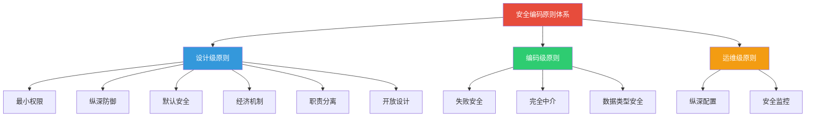
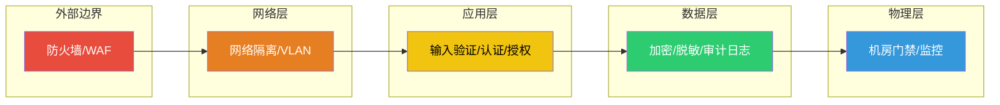
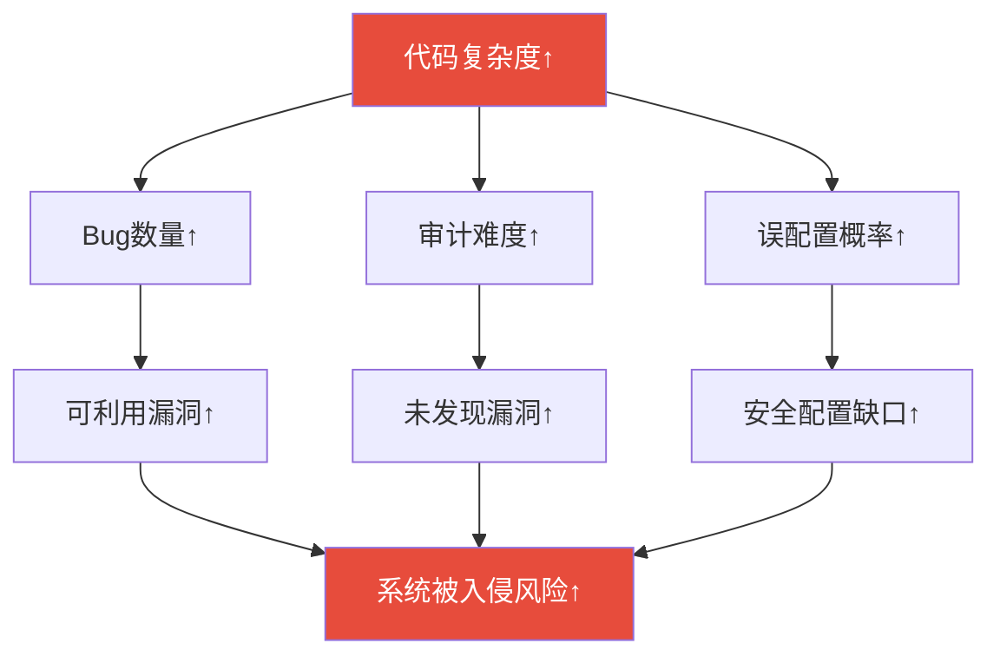
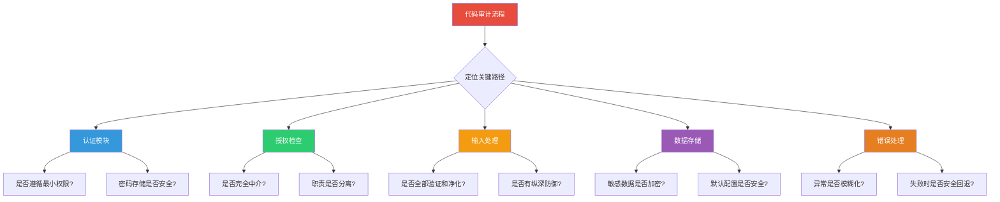
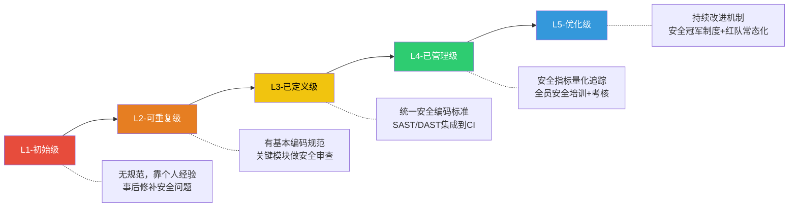

## 四、安全编码原则

安全编码原则是软件安全开发的基石——它们不是具体的编码技巧，而是指导所有安全决策的元规则。掌握这些原则，开发者可以在面对任何新技术、新框架时自动做出安全正确的选择，而不必逐一记忆每种攻击的防御方法。本节系统讲解 OWASP、CERT、STRIDE 等权威框架总结的核心安全编码原则，结合跨语言代码示例、真实案例和审计要点，帮助读者建立完整的安全编码思维体系。

### 4.1 安全编码原则全景图

安全编码原则可按作用层次分为三大类：**设计级原则**（指导架构决策）、**编码级原则**（指导日常编码）、**运维级原则**（指导部署与运行）。下表梳理了最核心的十大原则及其定位：

| 原则 | 层次 | 核心思想 | 一句话口诀 |
|------|------|----------|-----------|
| 最小权限原则 | 设计/运维 | 只给完成任务的最低权限 | 能少给就少给 |
| 纵深防御原则 | 设计 | 多层防护，单点不致溃 | 多堵墙，不靠一扇门 |
| 默认安全原则 | 设计/编码 | 默认配置即最安全配置 | 开箱即安全 |
| 失败安全原则 | 设计/编码 | 出错时回退到安全状态 | 宁可拒绝服务，不可放行漏洞 |
| 经济机制原则 | 设计 | 安全机制越简单越好 | 简单就是安全 |
| 职责分离原则 | 设计 | 敏感操作需多人/多步完成 | 一个人说了不算 |
| 完全中介原则 | 编码 | 每次访问都必须验证授权 | 不信任何人，每次检查 |
| 开放设计原则 | 设计 | 安全性不依赖设计保密 | 锁的原理可以公开 |
| 数据类型安全原则 | 编码 | 严格类型约束减少歧义 | 类型是第一道防线 |
| 纵深配置原则 | 运维 | 安全配置层层校验 | 配置错了也不出事 |



### 4.2 设计级安全原则详解

#### 4.2.1 最小权限原则（Principle of Least Privilege, POLP）

**核心定义：** 每个用户、程序、进程和线程只应拥有完成其当前任务所必需的最小权限集，不多也不少。该原则源自 Saltzer 和 Schroeder 1975 年的奠基论文《The Protection of Information in Computer Systems》。

**为什么重要：** 当攻击者利用漏洞入侵系统时，他们获得的权限等同于被入侵进程的权限。如果 Web 服务以 root 运行，一个 SQL 注入就能读取 `/etc/shadow`；如果以 `www-data` 运行，攻击面被大幅压缩。

**实施要点：**

```python
import os
import pwd
import grp

def drop_privileges(target_user="www-data"):
    """从root降权到指定用户——Web服务器启动时的标准操作"""
    # 1. 获取目标用户的UID/GID
    pw = pwd.getpwnam(target_user)
    uid, gid = pw.pw_uid, pw.pw_gid
    
    # 2. 先切换组（顺序很重要：先组后用户）
    os.setgroups([])
    os.setgid(gid)
    
    # 3. 再切换用户ID
    os.setuid(uid)
    
    # 4. 验证已无法恢复root权限
    assert os.getuid() != 0, "降权失败：仍是root"
    assert os.geteuid() != 0, "降权失败：有效UID仍是root"
    
    print(f"已切换到 {target_user} (uid={os.getuid()}, gid={os.getgid()})")

# 反面案例：Nginx默认以www-data运行，但某些错误配置会导致worker以root运行
# 漏洞利用路径：webshell → worker进程 → root shell
```

```java
// Java：最小权限在数据库连接中的体现
public class SecureDBPool {
    // 错误做法：使用DBA账号连接
    // String url = "jdbc:mysql://localhost/app"; // 用户: root
    
    // 正确做法：为应用创建专用只读/受限写入账号
    public Connection getConnection() throws SQLException {
        Properties props = new Properties();
        props.setProperty("user", "app_readonly");  // 只有SELECT权限
        props.setProperty("password", "xxx");
        return DriverManager.getConnection(URL, props);
    }
}
```

**真实案例——权限过大的代价：**

2017 年 Equifax 数据泄露事件中，攻击者利用 Apache Struts 的 CVE-2017-5638 漏洞获取了服务器访问权限。由于数据库服务账户拥有过高权限（可访问整个数据库而非仅业务所需的表），攻击者在 76 天内窃取了 1.47 亿条记录。如果数据库账户遵循最小权限原则，只授权特定表的读取权限，即使应用层被攻破，泄露范围也可被大幅限制。

**审计检查清单：**

| 检查项 | 不安全模式 | 安全模式 | 审计方法 |
|--------|-----------|---------|---------|
| 进程运行身份 | root / Administrator | 专用低权限用户 | `ps aux` 查看进程UID |
| 数据库账户权限 | SELECT/INSERT/UPDATE/DELETE/DDL 全开 | 仅业务所需最小权限集合 | `SHOW GRANTS FOR 'user'@'host'` |
| 文件系统权限 | 777 / 666 | 最小必要权限 | `find / -perm -777` |
| API Token 权限 | 全局管理权限 | 按功能域分配权限 | 检查Token声明范围 |
| 容器运行用户 | root（默认） | 非root用户 | `docker exec id` |

#### 4.2.2 纵深防御原则（Defense in Depth）

**核心定义：** 通过多层独立的安全控制保护系统，确保任何单一层的失效不会导致整体安全崩溃。该原则源自军事战略中的"纵深防御"概念，被 NSA 和 NIST 广泛采纳。

**为什么重要：** 没有任何单一安全措施是完美的。防火墙可能配置错误，WAF 可能有绕过规则，输入验证可能有遗漏。纵深防御确保即使攻击者突破了第一层防护，后面还有多层阻拦。

```python
# 纵深防御在用户输入处理中的完整实践
import re
import html
import hashlib
import secrets

def secure_login(username: str, password: str) -> dict:
    """一个遵循纵深防御的登录函数——4层防护，每层独立生效"""
    
    # ── 第1层：输入验证（白名单模式）──
    # 只允许字母数字和常见用户名字符，拒绝一切可疑输入
    if not re.match(r'^[a-zA-Z0-9_\-]{3,32}$', username):
        raise ValidationError("用户名格式不合法")
    if not (8 <= len(password) <= 128):
        raise ValidationError("密码长度必须在8-128之间")
    
    # ── 第2层：参数化查询（防SQL注入）──
    # 即使第1层被绕过，参数化查询也能阻止注入
    user = db.execute(
        "SELECT id, password_hash, salt FROM users WHERE username = ?",
        (username,)
    ).fetchone()
    
    if not user:
        # 模糊响应：不泄露"用户名不存在"还是"密码错误"
        return {"success": False, "message": "用户名或密码错误"}
    
    # ── 第3层：密码验证（防暴力破解辅助）──
    computed_hash = hashlib.pbkdf2_hmac(
        'sha256', password.encode(), user['salt'], 100000
    )
    if not secrets.compare_digest(computed_hash, user['password_hash']):
        # 记录失败尝试，触发暴力破解防护
        record_failed_attempt(user['id'])
        return {"success": False, "message": "用户名或密码错误"}
    
    # ── 第4层：会话管理（防会话劫持）──
    session_token = secrets.token_urlsafe(64)
    db.execute(
        "INSERT INTO sessions (user_id, token, expires_at) VALUES (?, ?, ?)",
        (user['id'], session_token, now() + timedelta(minutes=30))
    )
    
    return {"success": True, "session": session_token}
```

**纵深防御的层次模型：**



**各层防护对照表：**

| 防护层 | 防御目标 | 典型技术 | 不能防御的 |
|--------|---------|---------|-----------|
| 输入验证 | 恶意输入进入系统 | 白名单校验、正则匹配 | 绕过验证的业务逻辑攻击 |
| 参数化查询 | SQL注入 | 预编译语句、ORM | 业务逻辑层的权限绕过 |
| 认证层 | 身份伪造 | MFA、强密码策略 | 内部人员滥用 |
| 授权层 | 越权访问 | RBAC/ABAC、最小权限 | 提权后的横向移动 |
| 加密层 | 数据泄露 | AES-256、TLS 1.3 | 内存中的明文数据 |
| 审计层 | 事后溯源 | 日志记录、SIEM | 日志篡改（需独立存储） |

#### 4.2.3 默认安全原则（Secure by Default / Secure Defaults）

**核心定义：** 系统在首次安装、部署和运行时的默认配置必须是安全的，用户不需要额外操作就能获得基本的安全保护。安全不应是"需要手动开启的选项"，而应是"需要主动关闭的选项"。

**为什么重要：** 大多数用户不会修改默认配置。如果默认配置是不安全的（如默认开启调试端口、默认无密码），那么系统从部署的第一天起就处于暴露状态。

```yaml
# 安全默认配置 vs 不安全默认配置对比

# === 不安全默认配置 ===
app:
  debug: true                    # ← 调试模式默认开启（泄露栈信息）
  secret_key: "changeme"         # ← 默认密钥（可被猜测）
  database:
    user: root                   # ← 默认使用root
    password: ""                 # ← 默认空密码
    host: 0.0.0.0                # ← 监听所有接口
  cors:
    allow_origin: "*"            # ← 允许任何来源
  session:
    secure: false                # ← Cookie不设Secure标记
    httponly: false              # ← Cookie可被JS访问
    timeout: never               # ← 会话永不过期

# === 安全默认配置 ===
app:
  debug: false                   # ← 调试模式默认关闭
  secret_key: ${SECRET_KEY}      # ← 强制从环境变量读取
  database:
    user: ${DB_USER}             # ← 使用专用最小权限账户
    password: ${DB_PASSWORD}     # ← 强制设置密码
    host: 127.0.0.1              # ← 仅监听本地回环
  cors:
    allow_origin: "https://app.example.com"  # ← 精确匹配允许来源
  session:
    secure: true                 # ← 强制HTTPS传输
    httponly: true               # ← 禁止JS访问
    timeout: 1800                # ← 30分钟过期
```

**审计要点：** 在代码审计中，重点关注以下"默认不安全"的配置项——这些是审计中最常见的发现：

| 配置项 | 风险等级 | 常见不安全默认值 | 安全默认值 |
|--------|---------|----------------|-----------|
| 调试模式 | 高 | `debug=true` | `debug=false` |
| 监听地址 | 高 | `0.0.0.0` | `127.0.0.1` |
| 默认密码 | 临界 | 空字符串或 `admin` | 首次启动强制设置 |
| CORS | 高 | `*` | 明确白名单 |
| HTTP Headers | 中 | 缺少安全头 | 默认添加全部安全头 |
| TLS版本 | 高 | 允许TLS 1.0/1.1 | 仅TLS 1.2+ |

#### 4.2.4 失败安全原则（Fail Secure / Fail Safe）

**核心定义：** 当系统遇到错误、异常或不可预期的情况时，必须回退到一个安全的状态，而不是继续运行或暴露敏感信息。安全失败 ≠ 系统停机，而是"在安全状态下优雅降级"。

**为什么重要：** 攻击者经常故意触发错误来探测系统内部信息（如通过注入SQL语法错误获取数据库结构），或利用错误处理路径绕过正常验证。

```python
# 安全的错误处理模式

import logging
import traceback
from typing import Optional

logger = logging.getLogger(__name__)

# ── 模式1：模糊化错误响应 ──
def transfer_money(sender_id: str, recipient_id: str, amount: float) -> dict:
    """转账操作：失败时不泄露内部细节"""
    try:
        # 验证余额
        sender = db.get_account(sender_id)
        if sender.balance < amount:
            return {"success": False, "error": "余额不足"}
        
        # 执行转账（事务）
        with db.transaction():
            db.execute("UPDATE accounts SET balance = balance - ? WHERE id = ?",
                       (amount, sender_id))
            db.execute("UPDATE accounts SET balance = balance + ? WHERE id = ?",
                       (amount, recipient_id))
        
        return {"success": True}
    
    except DatabaseError as e:
        # 内部：详细日志（含完整堆栈，便于排查）
        logger.error("转账失败: sender=%s, recipient=%s, amount=%s",
                     sender_id, recipient_id, amount, exc_info=True)
        # 外部：模糊响应（不泄露SQL错误、表结构等）
        return {"success": False, "error": "转账处理失败，请稍后重试"}
    
    except Exception as e:
        # 兜底：捕获所有未预期异常
        logger.critical("未预期异常: %s", str(e), exc_info=True)
        return {"success": False, "error": "系统暂时不可用"}

# ── 模式2：安全回退 ──
def get_user_permissions(user_id: str) -> list:
    """获取用户权限：权限查询失败时回退到最严格权限"""
    try:
        permissions = db.query(
            "SELECT permission FROM user_permissions WHERE user_id = ?",
            (user_id,)
        )
        return [p['permission'] for p in permissions]
    except Exception:
        # 关键：权限查询失败时，不返回空列表（可能被利用），
        # 而是返回最小权限集合或直接拒绝
        logger.error("权限查询失败，回退到拒绝模式", exc_info=True)
        raise PermissionError("无法验证权限，请联系管理员")

# ── 反面案例：不安全的错误处理 ──
def insecure_handler(user_input: str):
    try:
        return eval(user_input)  # 危险！
    except SyntaxError as e:
        return f"语法错误: {e}"  # 泄露内部语法分析信息
    except NameError as e:
        return f"未定义变量: {e}"  # 泄露变量名
    except Exception as e:
        return f"系统错误: {type(e).__name__}: {e}"  # 泄露异常类型和消息
```

**错误处理的安全层级：**

| 层级 | 处理方式 | 适用场景 | 安全性 |
|------|---------|---------|--------|
| 日志记录 | 详细记录到安全日志系统 | 所有异常 | 最高（外部不可见）|
| 用户响应 | 模糊化通用错误信息 | 面向终端用户 | 高（不泄露内部）|
| 错误码 | 结构化错误码供调试 | API消费者 | 中（需文档化）|
| 完整异常 | 异常类型+消息+堆栈 | 仅开发调试模式 | 低（仅限内网调试）|

#### 4.2.5 经济机制原则（Economy of Mechanism）

**核心定义：** 安全机制应尽可能简单和小巧。复杂性是安全的天敌——更多的代码意味着更多的Bug，更多的配置项意味着更多的误配置可能。

**为什么重要：** 一个经过严格审计的 100 行认证模块，远比一个未经审计的 5000 行"功能丰富"的认证框架安全。OpenSSH 以代码精简著称，其安全记录远优于许多功能更多但代码量庞大的替代品。

**实践指导：**

```python
# 反面案例：过度复杂的权限检查
def check_permission_complex(user, action, resource, context):
    """25种条件组合，难以审计和测试"""
    if (user.role in ALLOWED_ROLES and 
        action in ACTION_WHITELIST and
        (resource.owner_id == user.id or 
         (resource.is_public and action in PUBLIC_ACTIONS) or
         (resource.team_id in user.team_ids and 
          TEAM_ACTION_MAP.get(action, False)) or
         (context.ip in TRUSTED_IPS and 
          context.time.hour in WORK_HOURS and
          not user.is_suspended)):
        return True
    # ... 继续嵌套
    return False

# 正面案例：简单清晰的权限模型
def check_permission(user, action, resource) -> bool:
    """三行逻辑，易于审计"""
    # 1. 显式拒绝总是优先
    if user.is_suspended:
        return False
    # 2. 所有者拥有完全控制
    if resource.owner_id == user.id:
        return True
    # 3. 查访问控制列表
    return acl.has_permission(user.id, action, resource.id)
```

**代码复杂度与安全性的关系：**



#### 4.2.6 职责分离原则（Separation of Duties, SoD）

**核心定义：** 任何关键操作不应由单一个人或单一组件完成，必须拆分到多个独立的实体。源自内控审计领域的经典原则，在系统安全中同样适用。

**应用示例：**

| 场景 | 不安全（单人完成） | 安全（职责分离） |
|------|-------------------|-----------------|
| 代码部署 | 开发者自行push到生产 | 开发→Code Review→CI/CD→运维审批→部署 |
| 数据库变更 | 直接执行DDL | 变更申请→DBA审核→执行→验证 |
| 密钥管理 | 硬编码在代码中 | 密钥管理系统存储→运行时动态获取→定期轮换 |
| 权限变更 | 用户自助修改角色 | 申请→主管审批→安全团队执行→审计日志 |

#### 4.2.7 完全中介原则（Complete Mediation）

**核心定义：** 每一次对资源的访问都必须经过完整的授权验证，不得因"之前已经检查过"而跳过。这是 OWASP Top 10 中 A01:2021（权限控制失效）的理论根源。

**为什么重要：** 许多权限绕过漏洞源于开发者假设"用户已经登录就不需要再检查权限"或"这个API只能从前端页面调用"。攻击者直接调用后端API时，这些假设全部失效。

```python
# 反面案例：缺失完全中介
@app.route('/api/document/<doc_id>')
def get_document(doc_id):
    # 仅检查用户是否登录，不检查是否有权访问该文档
    if not current_user.is_authenticated:
        return jsonify({"error": "未登录"}), 401
    
    # 攻击者登录后，遍历doc_id即可读取所有文档（水平越权）
    doc = db.get_document(doc_id)
    return jsonify(doc)

# 正面案例：完全中介
@app.route('/api/document/<doc_id>')
@require_authentication
def get_document(doc_id):
    doc = db.get_document(doc_id)
    if doc is None:
        return jsonify({"error": "文档不存在"}), 404
    
    # 每次访问都验证：用户是否有权访问该特定文档
    if not authorization.can_access(current_user.id, doc.id):
        audit_log.record("未授权文档访问尝试", 
                         user=current_user.id, doc=doc.id)
        return jsonify({"error": "无权访问"}), 403
    
    return jsonify(doc)
```

### 4.3 编码级安全原则与实践

除了上述设计级原则，编码层面有若干直接影响代码安全性的具体实践原则。

#### 4.3.1 输入永远不可信（Never Trust User Input）

这是安全编码的第一铁律。所有来自外部的数据——HTTP请求参数、URL、Cookie、文件上传、甚至环境变量——都必须被视为潜在恶意输入。

```python
# 完整的输入处理流水线
from typing import Any, Callable
import bleach
import jsonschema

class InputProcessor:
    """分层处理用户输入：验证 → 净化 → 类型转换"""
    
    def process(self, raw_input: dict, schema: dict) -> dict:
        # 第一步：结构验证（是否符合预期格式）
        try:
            jsonschema.validate(raw_input, schema)
        except jsonschema.ValidationError as e:
            raise ValidationError(f"输入结构不合法: {e.message}")
        
        # 第二步：深度净化（去除危险内容）
        sanitized = {}
        for key, value in raw_input.items():
            if isinstance(value, str):
                # HTML净化：移除所有脚本标签和事件处理器
                sanitized[key] = bleach.clean(value, 
                    tags=['b', 'i', 'u', 'em', 'strong'],
                    attributes={},
                    strip=True)
            else:
                sanitized[key] = value
        
        # 第三步：类型转换（确保类型安全）
        typed = {
            'username': str(sanitized.get('username', '')),
            'age': int(sanitized.get('age', 0)),
            'email': str(sanitized.get('email', '')),
        }
        
        # 第四步：业务规则校验
        if not (3 <= len(typed['username']) <= 32):
            raise ValidationError("用户名长度必须在3-32之间")
        if not (0 <= typed['age'] <= 150):
            raise ValidationError("年龄范围不合法")
        
        return typed
```

#### 4.3.2 最小惊讶原则在安全中的应用（Security Principle of Least Astonishment）

**核心思想：** 安全机制的行为应符合开发者的直觉预期。如果一个安全API的行为出人意料，开发者很可能会误用它，从而引入漏洞。

```java
// 反直觉的安全API示例
// Java早期版本的Random类不适用于安全场景，但命名容易误导
java.util.Random random = new java.util.Random();
// 不安全：Random的输出可被预测，不应用于生成令牌、密钥等

// 安全替代：SecureRandom（名称明确表明其安全用途）
java.security.SecureRandom secureRandom = new java.security.SecureRandom();
byte[] token = new byte[32];
secureRandom.nextBytes(token);
```

#### 4.3.3 安全编码的语言特定规范

不同语言有不同的安全陷阱。以下是审计中最常见的语言级安全问题：

**C/C++ — 内存安全：**

```c
// ── 栈缓冲区溢出 ──
// 反面案例
void process_input(char *user_data) {
    char buffer[64];
    strcpy(buffer, user_data);  // 如果user_data > 64字节，栈溢出
}

// 安全替代方案1：使用strn函数族
void process_input_safe(char *user_data) {
    char buffer[64];
    size_t max_len = sizeof(buffer) - 1;
    strncpy(buffer, user_data, max_len);
    buffer[max_len] = '\0';  // 确保null终止
}

// 安全替代方案2：使用snprintf
void process_input_safer(char *user_data) {
    char buffer[64];
    snprintf(buffer, sizeof(buffer), "%s", user_data);
}

// 安全替代方案3：使用动态分配（避免固定缓冲区）
#include <stdlib.h>
#include <string.h>
void process_input_safest(const char *user_data) {
    size_t len = strlen(user_data);
    char *buffer = malloc(len + 1);
    if (!buffer) return;
    memcpy(buffer, user_data, len + 1);
    // ... 使用buffer ...
    free(buffer);
}

// ── 整数溢出 ──
// 反面案例：整数溢出导致堆缓冲区溢出
void *allocate_array(size_t count, size_t elem_size) {
    size_t total = count * elem_size;  // 如果count和elem_size都很大，溢出为小值
    return malloc(total);              // 分配的内存远小于预期
}

// 安全替代：检查溢出
void *allocate_array_safe(size_t count, size_t elem_size) {
    if (count > 0 && elem_size > SIZE_MAX / count) {
        return NULL;  // 溢出检测
    }
    return malloc(count * elem_size);
}
```

**Java — 反序列化与注入：**

```java
// ── 不安全的反序列化 ──
// 反面案例：直接反序列化不可信数据
ObjectInputStream ois = new ObjectInputStream(untrustedInputStream);
Object obj = ois.readObject();  // 触发链攻击（如Apache Commons Collections Gadget）

// 安全替代：使用白名单过滤
ObjectInputStream ois = new ObjectInputStream(untrustedInputStream) {
    @Override
    protected Class<?> resolveClass(ObjectStreamClass desc) 
            throws IOException, ClassNotFoundException {
        // 只允许反序列化预定义的安全类
        if (!ALLOWED_CLASSES.contains(desc.getName())) {
            throw new InvalidClassException("不允许反序列化: " + desc.getName());
        }
        return super.resolveClass(desc);
    }
};

// ── 路径遍历 ──
// 反面案例
File file = new File("/uploads/" + userInput);  // userInput = "../../etc/passwd"

// 安全替代
Path uploadDir = Paths.get("/uploads").toAbsolutePath().normalize();
Path filePath = uploadDir.resolve(userInput).normalize();
if (!filePath.startsWith(uploadDir)) {
    throw new SecurityException("路径遍历攻击检测");
}
```

**JavaScript/TypeScript — 原型链污染与XSS：**

```javascript
// ── 原型链污染 ──
// 反面案例
function merge(target, source) {
    for (let key in source) {
        if (typeof source[key] === 'object') {
            target[key] = merge(target[key] || {}, source[key]);
        } else {
            target[key] = source[key];
        }
    }
    return target;
}

// 攻击者输入: {"__proto__": {"admin": true}}
// 结果: 所有对象都被注入 admin=true 属性

// 安全替代：使用Object.create(null)或过滤__proto__
function safeMerge(target, source) {
    const safeTarget = Object.assign({}, target);
    for (let key of Object.keys(source)) {
        if (key === '__proto__' || key === 'constructor' || key === 'prototype') {
            continue;  // 拒绝原型链相关属性
        }
        safeTarget[key] = source[key];
    }
    return safeTarget;
}

// ── XSS防护 ──
// 反面案例
element.innerHTML = userInput;  // 直接插入HTML

// 安全替代1：使用textContent
element.textContent = userInput;  // 作为纯文本插入

// 安全替代2：DOMPurify
import DOMPurify from 'dompurify';
element.innerHTML = DOMPurify.sanitize(userInput);
```

**Python — 代码注入与反序列化：**

```python
import ast
import subprocess
import pickle
import json

# ── eval/exec 注入 ──
# 反面案例
result = eval(user_input)  # 攻击者输入: __import__('os').system('rm -rf /')

# 安全替代1：使用ast.literal_eval（仅解析字面量）
result = ast.literal_eval(user_input)  # 只接受字符串、数字、列表、字典等

# 安全替代2：沙箱执行
import RestrictedPython
result = RestrictedPython.safe_exec(user_input)

# ── 命令注入 ──
# 反面案例
subprocess.call(f"ping {host}", shell=True)  # host = "8.8.8.8; rm -rf /"

# 安全替代：使用列表参数，避免shell=True
subprocess.call(["ping", "-c", "4", host])  # host作为整体参数，不被shell解析

# ── Pickle反序列化攻击 ──
# 反面案例
data = pickle.loads(untrusted_bytes)  # 可执行任意代码

# 安全替代：使用JSON替代Pickle
data = json.loads(untrusted_bytes.decode('utf-8'))  # 只解析数据，不执行代码
```

**Go — 竞态条件与安全：**

```go
// ── 并发安全 ──
// 反面案例：竞态条件
type Account struct {
    Balance int
}

func (a *Account) Transfer(amount int) {
    // 多个goroutine同时调用时，Balance的读写没有同步保护
    if a.Balance >= amount {
        a.Balance -= amount  // 竞态：两个goroutine可能同时通过检查
    }
}

// 安全替代：使用互斥锁
type SafeAccount struct {
    mu      sync.Mutex
    Balance int
}

func (a *SafeAccount) Transfer(amount int) bool {
    a.mu.Lock()
    defer a.mu.Unlock()
    
    if a.Balance >= amount {
        a.Balance -= amount
        return true
    }
    return false
}
```

### 4.4 安全编码原则在代码审计中的应用

将安全原则映射到具体的审计检查点，可以系统性地发现代码中的安全隐患：

| 安全原则 | 审计关注点 | 典型发现 | 风险等级 |
|---------|-----------|---------|---------|
| 最小权限 | 进程/账户/Token权限是否过大 | 使用root运行Web服务 | 临界 |
| 纵深防御 | 关键路径是否只有一层防护 | 仅靠前端验证 | 高 |
| 默认安全 | 默认配置是否安全 | debug=true发布到生产 | 高 |
| 失败安全 | 异常处理是否泄露敏感信息 | 异常消息返回给用户 | 中-高 |
| 经济机制 | 代码是否不必要地复杂 | 1000行的单个函数 | 中 |
| 职责分离 | 关键操作是否单人可完成 | 开发者直推生产 | 高 |
| 完全中介 | 每次访问是否都经过验证 | 仅入口验证，子路径跳过 | 高 |



### 4.5 常见误区与纠正

| 误区 | 正确理解 | 纠正方法 |
|------|---------|---------|
| "用了HTTPS就是安全的" | HTTPS只保护传输层，不防应用层攻击 | 纵深防御，HTTPS只是其中一层 |
| "前端已验证就不需后端验证" | 前端验证可被绕过，永远不安全 | 完全中介原则，后端必须独立验证 |
| "加密 = 安全" | 错误的加密实现可能更不安全 | 使用成熟库，遵循标准算法 |
| "开源代码就是安全代码" | 开源只意味着可审计，不代表已被审计 | 主动审计，关注CVE跟踪 |
| "加了防火墙就够了" | 防火墙不能防御应用层攻击 | 纵深防御，多层防护 |
| "测试通过就是安全的" | 功能测试不覆盖安全边界 | 专项安全测试（渗透测试、模糊测试） |
| "安全是安全团队的事" | 安全是每个开发者的基本素养 | DevSecOps，安全左移 |
| "复杂的安全机制更安全" | 复杂性是安全的敌人 | 经济机制原则，保持简单 |

### 4.6 进阶：安全编码成熟度模型

组织的安全编码实践可分为五个成熟度级别：



**各级别关键实践：**

| 级别 | 核心实践 | 工具支撑 | 组织要求 |
|------|---------|---------|---------|
| L1 初始 | 开发者自行处理安全 | 无 | 无 |
| L2 可重复 | 安全编码checklist + 代码审查 | IDE安全插件 | 1-2名安全负责人 |
| L3 已定义 | 统一安全编码标准 + 自动化扫描 | SAST(Depth/Semgrep)、DAST(ZAP) | 安全团队，定期培训 |
| L4 已管理 | 安全指标KPI + 威胁建模 | WAF、RASP、SIEM | 安全冠军制度 |
| L5 优化 | 红蓝对抗 + 持续改进 | 全链路安全平台 | 安全文化内化 |

### 4.7 总结

安全编码原则是防御代码漏洞的根本方法论。掌握这些原则意味着：

1. **从被动修补到主动防御**：不再等漏洞被发现再修补，而是在编码阶段就消除漏洞
2. **从经验驱动到原则驱动**：面对新技术/新框架时，用原则指导决策而非依赖记忆
3. **从个人能力到系统能力**：通过编码规范和工具链将安全能力固化到开发流程中

核心记住三个关键原则的优先级：
- **第一优先：输入不可信**——所有安全问题的根源
- **第二优先：纵深防御**——没有银弹，多层防护才是正道
- **第三优先：失败安全**——出错了也要安全地出错

这些原则不是一次性学习的内容，而是在每次写代码、每次代码审查、每次安全测试中反复应用的实践指南。将它们内化为编码本能，就是安全开发者与普通开发者的核心区别。
