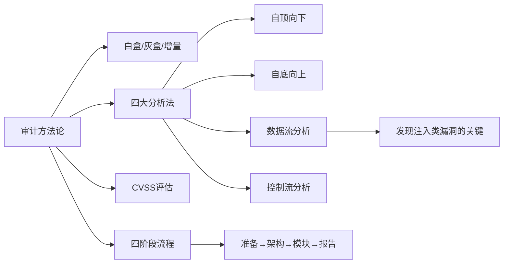
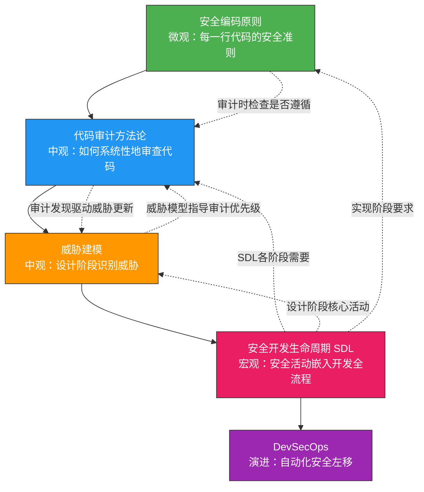

## 五、本节小结

理论基础是代码审计的根基。本节系统梳理了代码审计方法论、安全开发生命周期（SDL）、威胁建模、安全编码原则四大核心知识板块，构建了一个从"知道要审计什么"到"知道如何系统性地保护代码"的完整理论框架。以下是对各核心主题的提炼与串联。

### 1. 代码审计方法论：审计的"操作系统"

代码审计方法论解决的是"怎么审、审什么、按什么标准审"的根本问题。回顾本节内容，核心要点如下：

| 知识维度 | 核心内容 | 实践意义 |
|----------|----------|----------|
| **定义与价值** | 对源代码进行系统性安全审查，发现漏洞、逻辑缺陷和编码违规 | 修复成本最低的安全实践（编码阶段 vs 生产阶段，成本差30-100倍） |
| **分类体系** | 白盒（完全访问）、灰盒（部分访问）、增量审计（变更驱动） | 根据资源和场景选择合适的审计类型 |
| **审计流程** | 准备→架构分析→逐模块审计→漏洞验证与报告 | 四阶段流程是所有审计项目的通用骨架 |
| **评估标准** | CVSS评分体系（Critical/High/Medium/Low/Info） | 统一漏洞严重程度的判定标准，驱动修复优先级 |
| **核心方法** | 自顶向下、自底向上、数据流分析、控制流分析 | 四种方法互为补充，实践中通常组合使用 |

**关键认知：** 数据流分析法是发现注入类漏洞最有效的方法——追踪用户输入从Source（数据源）经过Transform（转换处理）到Sink（危险操作）的完整路径。这种方法论思维将贯穿后续所有实战环节。

### 2. SDL：将安全融入开发的基因

安全开发生命周期（SDL）解决的是"安全活动在何时、以何种方式嵌入开发流程"的问题。微软2004年提出的SDL框架至今仍是行业标准。

**SDL七大阶段速查：**

| 阶段 | 核心安全活动 | 关键产出 |
|------|-------------|----------|
| **培训** | 安全编码基础、常见漏洞类型、安全设计原则 | 全员安全意识基线 |
| **需求** | 安全/隐私需求定义、风险评估、第三方组件安全评估 | 安全需求规格 |
| **设计** | 攻击面分析、威胁建模（STRIDE/DREAD）、安全设计原则 | 威胁模型文档 |
| **实现** | 安全编码规范、禁用不安全API、安全编译选项、代码评审 | 安全的代码实现 |
| **验证** | SAST、DAST、模糊测试、渗透测试、安全回归测试 | 安全测试报告 |
| **发布** | 最终安全审查（FSR）、安全配置清单、响应计划确认 | 发布就绪确认 |
| **响应** | 漏洞响应流程、补丁开发、事后分析 | 持续改进闭环 |

**DevSecOps的演进：** 传统SDL是流程驱动的，而DevSecOps将其升级为工具驱动——通过CI/CD流水线自动执行SAST（Semgrep）、依赖扫描（Trivy）、DAST（ZAP）等安全检查，实现"安全即代码"。对于中小团队，可以采用精简版SDL：保留安全需求分析、关键模块威胁建模、安全编码规范、代码评审、自动化安全测试这五项核心活动。

### 3. 威胁建模：在攻击者视角下思考

威胁建模解决的是"系统可能面临哪些威胁、如何系统性地识别和评估它们"的问题。它是SDL设计阶段的核心活动。

**威胁建模的四个核心问题：**

1. **我们在做什么？** —— 通过数据流图（DFD）可视化系统架构，识别信任边界
2. **什么可能出错？** —— 使用STRIDE模型系统性地识别六类威胁
3. **我们要怎么应对？** —— 为每类威胁制定针对性的缓解措施
4. **我们做得够好吗？** —— 使用DREAD模型评估风险，确定修复优先级

**STRIDE威胁分类速查：**

| 威胁类型 | 英文 | 安全属性 | 典型场景 |
|----------|------|----------|----------|
| 伪造（Spoofing） | Identity Spoofing | 认证 | 身份冒充、伪造令牌 |
| 篡改（Tampering） | Data Integrity | 完整性 | SQL注入、数据篡改 |
| 抵赖（Repudiation） | Non-repudiation | 不可否认性 | 缺少审计日志 |
| 信息泄露（Information Disclosure） | Confidentiality | 机密性 | 数据泄露、调试信息暴露 |
| 拒绝服务（Denial of Service） | Availability | 可用性 | 资源耗尽、死锁 |
| 权限提升（Elevation of Privilege） | Authorization | 授权 | 越权访问、提权漏洞 |

**DREAD风险评估模型：** Damage（损害）、Reproducibility（可复现性）、Exploitability（可利用性）、Affected Users（受影响用户）、Discoverability（可发现性）。每个维度1-10分，总分决定修复优先级。此外，PASTA（Process for Attack Simulation and Threat Analysis）方法以攻击者视角为中心，更适用于复杂系统的威胁分析。

### 4. 安全编码原则：防御的第一道防线

安全编码原则解决的是"在编写每一行代码时，应该遵循哪些基本原则来避免引入漏洞"的问题。

**五大核心原则：**

| 原则 | 核心思想 | 反面教材 | 正确做法 |
|------|----------|----------|----------|
| **最小权限** | 只授予完成任务所需的最小权限 | 用root运行Web服务 | 使用专用低权限用户（如www-data） |
| **纵深防御** | 部署多层独立的安全控制 | 仅依赖前端输入校验 | 前端+后端+数据库三层校验 |
| **默认安全** | 系统默认配置应是安全的 | 默认开启调试模式 | 默认关闭调试端口、错误信息脱敏 |
| **最小公共化** | 避免多个组件共享资源 | 所有用户共享数据库连接池 | 按用户隔离资源，限制并发 |
| **纵深防御补充** | 失败时安全（Fail-Safe） | 异常时泄露完整堆栈 | 异常时返回通用错误，记录详细日志 |

**安全编码的实操要点：**
- **输入验证**：永远不信任用户输入，采用白名单验证
- **输出编码**：根据输出上下文选择编码方式（HTML/URL/JavaScript/SQL）
- **参数化查询**：杜绝SQL注入的根本手段
- **加密存储**：敏感数据加密存储，使用经过验证的加密库
- **安全配置**：关闭不必要的服务和端口，启用安全头

### 5. 四大知识板块的内在联系

这四个主题并非孤立存在，而是形成了一个层层递进的理论体系：

**串联理解：**
- **安全编码原则**是微观层面的"细胞"——每一行代码都应遵循最小权限、输入验证、输出编码等原则
- **代码审计方法论**是中观层面的"骨架"——用数据流分析、控制流分析等方法系统性地检查代码是否遵循了这些原则
- **威胁建模**是中观层面的"雷达"——在设计阶段就识别出系统可能面临的威胁，为审计提供优先级指引
- **SDL**是宏观层面的"操作系统"——将上述所有活动有机地嵌入到软件开发的每个阶段
- **DevSecOps**是SDL的现代化演进——通过自动化工具链实现安全左移

### 6. 理论基础的实战转化指南

掌握了理论基础后，如何将其转化为实际审计能力？以下是转化路径：

| 理论知识 | 转化方向 | 具体行动 |
|----------|----------|----------|
| 代码审计流程 | → 审计项目执行 | 按四阶段流程组织一次完整的代码审计 |
| 数据流分析法 | → 漏洞发现技巧 | 选择一个开源项目，追踪用户输入到危险函数的路径 |
| STRIDE模型 | → 威胁识别能力 | 对一个Web应用绘制DFD并应用STRIDE分析 |
| SDL框架 | → 流程改进 | 在自己的项目中引入至少三项SDL核心活动 |
| 安全编码原则 | → 代码审查标准 | 将五大原则转化为代码评审的检查清单 |

### 7. 自我检测

完成理论基础学习后，尝试回答以下问题来检验理解深度：

**基础题：**
1. 白盒审计、灰盒审计、增量审计的核心区别是什么？各自适用什么场景？
2. SDL的七大阶段分别对应哪些安全活动？
3. STRIDE模型的六个字母分别代表什么类型的威胁？
4. 最小权限原则在Web应用中如何体现？请举三个具体例子。

**进阶题：**
5. 数据流分析法中，Source→Transform→Sink模型如何帮助发现SQL注入漏洞？请用伪代码说明。
6. 在DevSecOps流水线中，SAST、DAST、依赖扫描分别应该放在CI/CD的哪个阶段？为什么？
7. 如果一个系统同时存在SQL注入和越权访问两种威胁，如何用DREAD模型确定修复优先级？
8. 纵深防御原则和最小权限原则在实际应用中如何协同工作？

### 8. 下一步：从理论到工具

理论基础为你建立了"审计什么"和"为什么审计"的认知框架。下一节将进入**核心技巧**部分，介绍如何使用Semgrep、CodeQL、OWASP ZAP、AFL++等工具将理论转化为高效的审计实践——从静态分析到动态测试，从模糊测试到综合工具链，构建完整的安全工具矩阵。

> **学习建议：** 在进入工具实操前，确保对上述理论框架有清晰的理解。工具是手段，理论是思维——没有理论指导的工具操作只是"扫描员"，有理论支撑的工具运用才是"审计师"。建议先回顾不熟悉的知识点，再带着理论框架进入下一节的学习。
