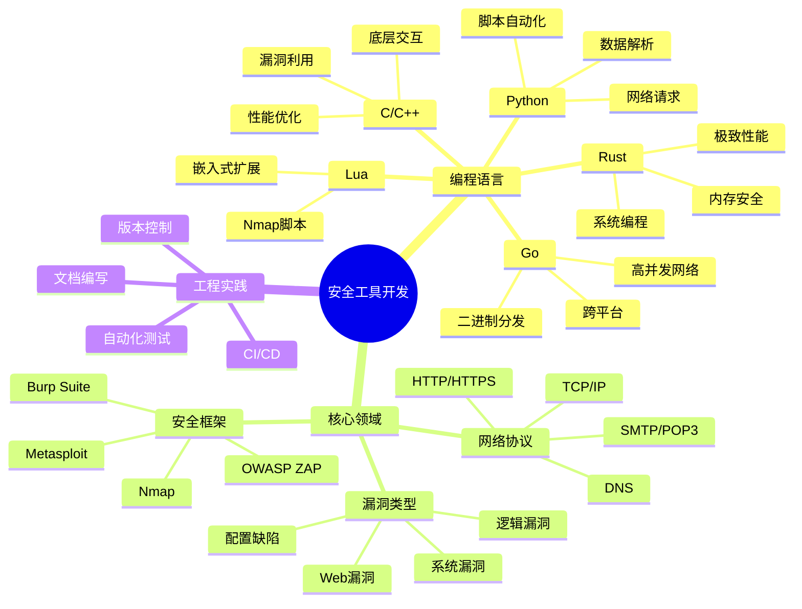
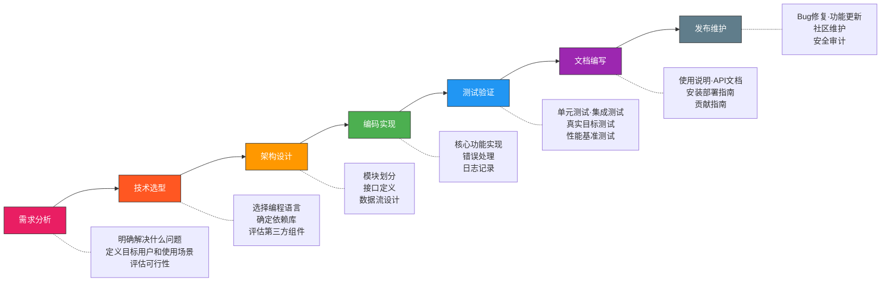
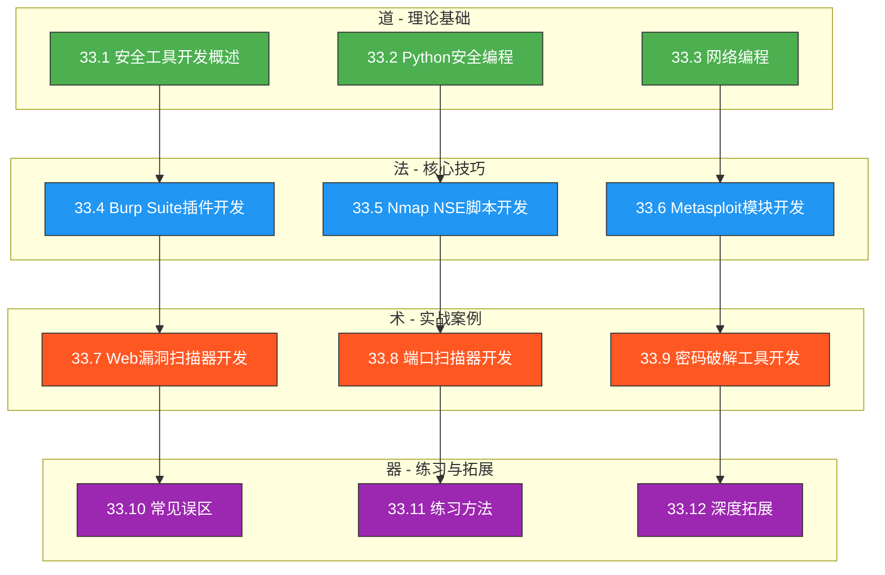

# 第33章 安全工具开发

## 为什么安全工具开发是一项核心能力

在网络安全领域，熟练使用现成工具只能让你停留在"操作员"层面。真正拉开差距的，是**能否根据实际场景从零构建工具**。安全工具开发不是"锦上添花"的附加技能，而是连接安全理论与攻防实战的核心枢纽。

理解这一点并不难——想象一个渗透测试工程师在面对自研协议的私有系统时，市面上没有现成的扫描器可用；或者一个安全运营工程师需要将三四个孤立的告警源整合成一个自动化研判流程。这些场景的共同特征是：**现有工具无法直接解决问题，必须定制开发**。

安全工具开发能力的价值体现在五个维度：

| 维度 | 具体价值 | 典型场景 |
|------|----------|----------|
| 定制化 | 针对特定业务逻辑构造专属检测规则 | 针对自研CMS的漏洞扫描器 |
| 效率倍增 | 将重复性人工操作转化为自动化流程 | 批量子域名探测+端口扫描+指纹识别一体化 |
| 深度理解 | 开发过程迫使你理解协议/漏洞的底层机制 | 编写SQL注入检测器需要深刻理解SQL语法和数据库差异 |
| 职业壁垒 | 掌握工具开发的安全工程师远比纯工具使用者稀缺 | 安全团队leader、红队核心成员、安全产品研发 |
| 社区贡献 | 开源工具是安全圈最具影响力的技术名片 | Nuclei、SQLMap、Subfinder等开源项目的作者 |

### 从"用工具"到"造工具"的认知跃迁

很多安全从业者在职业中期会遇到瓶颈：工具用得很溜，但遇到新场景就束手无策。根源在于对工具的工作原理理解停留在黑盒层面。安全工具开发要求你具备三个层次的能力：

1. **协议层理解**：知道数据在网络中如何流动，HTTP请求的每一个字段意味着什么，TCP三次握手的每一步在做什么
2. **漏洞层理解**：知道漏洞产生的根本原因——是输入验证缺失、是权限控制不当、还是逻辑设计缺陷
3. **工程层理解**：知道如何将安全知识转化为可执行、可复用、可扩展的软件系统

这三个层次的知识相互支撑。协议理解是漏洞理解的基础，漏洞理解是工具设计的前提，工程能力则决定了工具能否从"能用"进化到"好用"。

### 安全工具开发的独特挑战

与通用软件开发相比，安全工具开发面临三个独特挑战：

**对抗性环境**：安全工具面对的是主动防御的目标系统。Web应用防火墙（WAF）会检测和阻断扫描流量，IDS/IPS会识别攻击特征，目标管理员可能随时变更防御策略。这意味着工具必须具备流量伪装、速率控制、特征混淆等对抗能力。

**准确性要求极高**：普通软件的bug可能导致功能异常，但安全工具的bug可能导致严重后果——漏报（False Negative）让真实漏洞逃逸，误报（False Positive）浪费安全团队的时间和信任。一个漏报率超过5%的漏洞扫描器在生产环境中几乎无法使用。

**合法性边界模糊**：同样的技术实现，在授权测试中是合法工具，在未授权使用中就是违法行为。工具开发者必须在设计阶段就内置合规性约束，比如授权验证机制、使用日志审计、敏感操作二次确认等。

## 章节学习路线图

本章按照"道法术器"的层次组织内容，从底层原理到上层应用层层递进：

```mermaid
graph TD
    A["第33章 安全工具开发"]

    A --> B["理论基础（道）"]
    A --> C["核心技巧（法）"]
    A --> D["实战案例（术）"]
    A --> E["练习与误区（器）"]

    B --> B1["33.1 安全工具开发概述<br/>工具分类·开发原则·语言选型"]
    B --> B2["33.2 Python安全编程<br/>核心库·安全编码·异常处理"]
    B --> B3["33.3 网络编程<br/>TCP/IP·Socket·HTTP·异步"]

    C --> C1["33.4 Burp Suite插件开发<br/>API·自定义扫描器·被动检测"]
    C --> C2["33.5 Nmap NSE脚本开发<br/>Lua基础·脚本编写·规则引擎"]
    C --> C3["33.6 Metasploit模块开发<br/>模块架构·Payload·辅助模块"]

    D --> D1["33.7 Web漏洞扫描器开发<br/>爬虫·检测引擎·报告生成"]
    D --> D2["33.8 端口扫描器开发<br/>SYN扫描·并发模型·服务识别"]
    D --> D3["33.9 密码破解工具开发<br/>字典·规则引擎·GPU加速"]

    E --> E1["33.10 常见误区<br/>过度工程·忽视安全·不写测试"]
    E --> E2["33.11 练习方法<br/>循序渐进·项目驱动·开源学习"]
    E --> E3["33.12 深度拓展<br/>AI辅助·云原生·供应链安全"]

    style A fill:#E91E63,stroke:#333,color:#fff
    style B fill:#4CAF50,stroke:#333,color:#fff
    style C fill:#2196F3,stroke:#333,color:#fff
    style D fill:#FF5722,stroke:#333,color:#fff
    style E fill:#9C27B0,stroke:#333,color:#fff
```



### 各节内容概要与学习目标

| 节号 | 核心内容 | 学完能做到什么 | 建议用时 |
|------|----------|----------------|----------|
| 33.1 | 安全工具分类、开发原则、语言选型 | 能为特定安全需求选择合适的工具类型和开发语言 | 1小时 |
| 33.2 | Python安全编程核心库、安全编码实践 | 能用Python编写健壮的网络请求、数据解析、并发处理代码 | 2小时 |
| 33.3 | TCP/IP协议栈、Socket编程、HTTP处理、异步编程 | 能从底层Socket开始构建网络通信模块 | 2小时 |
| 33.4 | Burp Suite扩展API、自定义扫描检查、被动检测 | 能为Burp Suite编写自定义扫描插件 | 2小时 |
| 33.5 | Nmap NSE脚本语言Lua、脚本编写、规则引擎 | 能编写Nmap NSE脚本实现自定义探测逻辑 | 2小时 |
| 33.6 | Metasploit模块架构、Payload编写、辅助模块 | 能为Metasploit框架编写exploit和auxiliary模块 | 3小时 |
| 33.7 | Web漏洞扫描器的完整开发流程 | 能独立开发一个具备爬虫+检测+报告功能的Web扫描器 | 4小时 |
| 33.8 | 端口扫描器的核心算法和并发模型 | 能用Python/Go实现SYN扫描和TCP扫描 | 3小时 |
| 33.9 | 密码破解的字典策略、规则引擎、GPU加速 | 能开发支持规则变换的密码破解工具 | 3小时 |
| 33.10 | 开发过程中的常见错误和纠正方法 | 能识别和避免安全工具开发中的典型陷阱 | 0.5小时 |
| 33.11 | 从入门到进阶的系统化练习路径 | 能制定个人的安全工具开发学习计划 | 0.5小时 |
| 33.12 | AI辅助安全开发、云原生安全、供应链安全 | 了解安全工具开发的前沿趋势和进阶方向 | 1小时 |

**总计建议学习时间：约21小时**，建议分3-4周完成，每周投入5-7小时。

### 技术栈全景图

安全工具开发涉及的技术栈横跨多个领域，理解全局有助于建立系统认知：



## 安全工具开发生命周期

一个专业的安全工具从构想到成熟，经历七个阶段。每个阶段都有其核心任务和常见陷阱：



### 阶段详解

**需求分析**是最容易被跳过、但影响最大的阶段。许多安全工具开发者（尤其是初学者）拿到一个想法就直接开始写代码，结果写了三天发现方向不对。正确做法是先回答三个问题：

- 这个工具要解决什么**具体问题**？（不是"做一个扫描器"，而是"在内网渗透中快速识别可达的SMB服务并检测MS17-010"）
- 目标用户是谁？他们的技术水平如何？
- 已有哪些类似工具？你的工具比它们好在哪里？

需求分析的产出应该是一份简明的需求文档，包含：功能需求列表（Must Have / Nice to Have）、性能指标（并发数、扫描速度、内存占用）、兼容性要求（操作系统、Python版本、网络环境）、安全约束（授权验证、日志审计、敏感数据处理）。

**技术选型**决定了后续开发的效率和工具的性能上限。本章后续会详细对比Python、Go、Rust、C/C++在不同场景下的优劣，这里先给出一个简明决策树：

- 需要快速出原型 + Web安全场景 → **Python**
- 需要高并发网络扫描 + 跨平台二进制分发 → **Go**
- 需要极致性能 + 内存安全保证 → **Rust**
- 需要与操作系统底层交互 + 漏洞利用开发 → **C/C++**
- 需要与Java生态集成 + Android安全 → **Java/Kotlin**

技术选型时还需要考虑团队因素：如果团队主要使用Python，强行切换到Go可能增加学习成本；如果工具需要分发给非技术用户使用，编译为单一二进制文件的Go/Rust比需要解释器的Python更合适。

**架构设计**决定了工具的可维护性和可扩展性。一个好的安全工具应该具备：

- **清晰的模块边界**：爬虫模块、检测模块、报告模块各司其职，通过明确定义的接口通信
- **可配置的参数系统**：命令行参数 + 配置文件 + 环境变量，三层配置优先级
- **可插拔的检测规则**：新增漏洞检测规则不需要修改核心代码，通过YAML/JSON配置文件或插件机制加载
- **完善的日志系统**：支持多级别日志输出（DEBUG/INFO/WARN/ERROR），可输出到文件或syslog
- **优雅的错误处理**：网络超时、连接拒绝、权限不足等异常场景都有合理的降级策略

**编码实现**阶段的核心原则是：**先让它能工作，再让它工作得好**。先实现最小可用版本（MVP），验证核心逻辑正确后再逐步添加并发优化、错误恢复、进度显示等功能。具体实践：

- 第一步：用最简单的同步代码实现核心检测逻辑
- 第二步：添加命令行参数解析和输出格式化
- 第三步：引入多线程/异步提升扫描速度
- 第四步：完善错误处理和日志记录
- 第五步：添加配置文件支持和结果持久化

**测试验证**对安全工具来说尤为重要——因为安全工具的bug不仅仅是功能缺陷，还可能在真实渗透测试中给出错误结论（漏报或误报），直接影响安全评估的可信度。测试应该覆盖：

| 测试类型 | 目标 | 具体方法 |
|----------|------|----------|
| 单元测试 | 每个函数的输入输出正确性 | pytest + mock，覆盖边界条件和异常路径 |
| 集成测试 | 模块间协作是否正常 | 使用Docker靶机验证端到端流程 |
| 对抗测试 | 检测能力的真实水平 | 用已知漏洞目标验证检测准确率和误报率 |
| 性能测试 | 大规模目标下的资源消耗 | 并发扫描1000+目标，监控CPU/内存/带宽 |
| 鲁棒性测试 | 异常输入和网络环境的处理 | 注入畸形数据、模拟网络抖动和超时 |

**文档编写**是安全工具能否被广泛使用的关键。一份好的README应该包含：项目简介（一句话说明工具用途）、安装指南（依赖说明+安装命令+环境要求）、快速开始（3分钟内跑通的最小示例）、详细用法（所有参数说明+使用示例）、开发指南（如何贡献代码+代码规范+测试方法）。

**发布维护**不是终点而是新的起点。发布后需要持续关注：用户反馈和Issue处理、依赖库的安全更新、新漏洞检测规则的添加、性能优化和bug修复。对于开源工具，还需要维护社区氛围、审核PR、编写变更日志。

## 适用读者与前置知识

### 分级读者画像

**入门级读者**（0-1年安全经验）：
- 前置要求：掌握Python基础语法，了解HTTP协议基本概念
- 学习重点：33.1-33.3（理论基础），33.7（Web漏洞扫描器案例）
- 预期收获：能用Python编写简单的信息收集脚本和漏洞检测工具

**进阶级读者**（1-3年安全经验）：
- 前置要求：有渗透测试实战经验，熟悉常见漏洞类型
- 学习重点：33.4-33.6（核心技巧），33.8-33.9（高级实战案例）
- 预期收获：能为Burp Suite/Nmap/Metasploit开发自定义插件和模块

**高级读者**（3年以上安全经验）：
- 前置要求：有安全工具开发经验，了解软件工程最佳实践
- 学习重点：33.12（深度拓展），各章节的进阶内容和架构设计部分
- 预期收获：能设计和实现企业级安全工具平台，理解安全工具的前沿趋势

### 前置知识自查清单

在开始学习之前，确认你已经具备以下基础知识：

| 知识领域 | 最低要求 | 自查方法 | 补救资源 |
|----------|----------|----------|----------|
| Python语法 | 变量、函数、类、异常处理、文件读写 | 能不查文档写出一个HTTP请求脚本 | 《Python Crash Course》前10章 |
| HTTP协议 | 请求方法、状态码、请求头、Cookie机制 | 能用curl构造带自定义Header的请求 | MDN Web Docs - HTTP |
| 网络基础 | IP地址、端口、TCP/UDP区别、DNS解析 | 能解释三次握手的过程 | 《图解TCP/IP》 |
| Linux基础 | 命令行操作、文件权限、进程管理 | 能在终端完成日常开发工作 | 《鸟哥的Linux私房菜》 |
| Git基础 | clone、commit、push、pull、branch | 能在GitHub上管理一个项目 | Git官方教程 |

如果以上任何一项你不熟悉，建议先花1-2天补齐再开始本章学习。

### 开发环境准备

在开始学习之前，按照以下清单准备开发环境：

| 组件 | 推荐版本 | 用途 | 安装验证命令 |
|------|----------|------|-------------|
| Python | 3.8+（推荐3.11+） | 主要开发语言 | `python3 --version` |
| pip | 最新版 | Python包管理 | `pip3 --version` |
| Git | 2.30+ | 版本控制 | `git --version` |
| Docker | 24.0+ | 隔离测试环境 | `docker --version` |
| VS Code / PyCharm | 最新版 | 集成开发环境 | — |
| 虚拟机（Kali Linux） | 2024+ | 安全测试环境 | — |

#### Python虚拟环境配置

安全工具开发强烈建议使用虚拟环境隔离依赖，避免不同项目的包版本冲突：

```bash
# 创建项目专用虚拟环境
python3 -m venv ~/sec-tools-env

# 激活虚拟环境
source ~/sec-tools-env/bin/activate

# 升级pip
pip install --upgrade pip

# 安装本章常用依赖
pip install requests scapy aiohttp beautifulsoup4 \
    python-nmap impacket paramiko \
    colorama rich tabulate \
    pytest pytest-asyncio

# 导出依赖列表（用于环境复现）
pip freeze > requirements.txt
```

#### Docker测试环境

安全工具的测试必须在隔离环境中进行。以下Docker Compose配置提供了包含常见漏洞的靶机环境：

```yaml
# docker-compose.test.yml
version: '3.8'
services:
  dvwa:
    image: vulnerables/web-dvwa
    ports:
      - "8080:80"
    environment:
      - MYSQL_PASS=admin

  webgoat:
    image: webgoat/webgoat
    ports:
      - "9090:8080"
      - "9091:9090"

  metasploitable:
    image: tleemcjr/metasploitable2
    ports:
      - "8081:80"
      - "3306:3306"
      - "2222:22"
```

```bash
# 启动测试环境
docker-compose -f docker-compose.test.yml up -d

# 验证服务可用
curl -s http://localhost:8080 | head -20

# 测试完成后关闭
docker-compose -f docker-compose.test.yml down
```

#### 推荐的开发工具配置

**VS Code推荐扩展**：
- Python（Microsoft官方）：代码补全、调试、Linting
- Pylance：类型检查和智能提示
- Python Debugger：断点调试支持
- GitLens：Git历史可视化
- YAML：配置文件语法高亮
- REST Client：直接在编辑器中测试HTTP请求

**调试技巧**：
- 使用`pdb`或`ipdb`进行断点调试：`python -m ipdb your_script.py`
- 使用`logging`模块代替`print`输出调试信息，支持级别控制和文件输出
- 使用`cProfile`分析性能瓶颈：`python -m cProfile -s cumtime your_script.py`
- 使用`memory_profiler`检测内存泄漏：`python -m memory_profiler your_script.py`

## 安全工具的分类体系

理解安全工具的分类有助于在开发时做出正确的架构决策。安全工具可以从三个维度进行分类：

### 按功能定位分类

| 类别 | 功能描述 | 代表工具 | 开发复杂度 |
|------|----------|----------|------------|
| 信息收集 | 资产发现、子域名枚举、端口扫描 | Subfinder, Amass, Nmap | ★★☆☆☆ |
| 漏洞扫描 | 自动化漏洞检测和验证 | Nuclei, Nikto, SQLMap | ★★★☆☆ |
| 漏洞利用 | 利用已知漏洞获取系统权限 | Metasploit, sqlmap --os-shell | ★★★★☆ |
| 后渗透 | 权限维持、横向移动、数据提取 | Mimikatz, BloodHound | ★★★★★ |
| 密码破解 | 字典攻击、规则变换、GPU加速 | Hashcat, John the Ripper | ★★★☆☆ |
| 流量分析 | 网络抓包、协议解析、流量重放 | Wireshark, tcpdump, Scapy | ★★★☆☆ |
| 代码审计 | 静态分析、污点追踪、模式匹配 | Semgrep, Bandit, FindSecBugs | ★★★★☆ |
| 社会工程 | 钓鱼模拟、信息收集、 pretexting | GoPhish, SET | ★★☆☆☆ |

### 按技术架构分类

**单体工具**：功能集中在单一可执行文件或脚本中，适合解决特定的单一问题。例如：一个端口扫描脚本、一个SQL注入检测器。优点是部署简单、依赖少；缺点是功能扩展困难、代码复用率低。

**插件化框架**：核心引擎提供基础能力，具体功能通过插件实现。例如：Burp Suite的扩展机制、Nmap的NSE脚本、Metasploit的模块系统。优点是扩展性强、社区贡献方便；缺点是核心架构设计复杂、插件间隔离困难。

**分布式平台**：多个组件协同工作，支持任务分发和结果汇聚。例如：分布式端口扫描器（类似ZMap架构）、大规模漏洞管理平台。优点是可扩展到海量目标；缺点是架构复杂、需要运维基础设施。

### 按使用场景分类

- **渗透测试工具**：针对授权目标的安全评估，要求精确的检测能力和详细的报告输出
- **安全运营工具**：日常安全监控和响应，要求高可用性和实时性
- **红队工具**：模拟高级持续性威胁（APT），要求隐蔽性和对抗能力
- **蓝队工具**：防御检测和应急响应，要求准确性和低误报率
- **安全研究工具**：漏洞分析和安全实验，要求灵活性和可定制性

## 学习方法论

### 四阶段学习法

安全工具开发的最佳学习路径不是"读完再写"，而是"边读边写、边写边改"：

**第一阶段：模仿（第1-2周）**

找一个优秀的开源安全工具（推荐从简单的开始，如 `dirsearch` 或 `subfinder`），完整阅读其源代码，理解其架构设计和核心算法。然后尝试在本地运行、调试、修改，观察行为变化。这个阶段的目标是建立"安全工具长什么样"的直觉。

模仿阶段的具体做法：
1. 选择一个2000行以内的小型工具（如dirsearch）
2. 克隆仓库，完整阅读README和所有文档
3. 按照文档搭建环境并运行，记录每个参数的效果
4. 逐文件阅读源码，画出模块依赖关系图
5. 尝试修改一个功能点，观察行为变化

**第二阶段：复刻（第3-4周）**

选择一个你理解透彻的工具，从零开始自己实现一个简化版本。不要看原工具的代码，凭理解来写。完成后对比差异，找出自己的设计缺陷。这个阶段的目标是锻炼独立设计能力。

复刻阶段的具体做法：
1. 选择一个核心功能明确的工具（如subfinder的子域名枚举功能）
2. 在不参考源码的情况下，独立设计架构并实现
3. 用相同的目标进行测试，对比结果差异
4. 阅读原工具源码，分析设计差异的原因
5. 重构自己的实现，吸收优秀的设计思路

**第三阶段：创新（第5-6周）**

从你自己的实际工作中找一个痛点，设计并实现一个解决该痛点的工具。这个阶段的关键是"需求真实"——解决自己的问题比做练习项目更能锻炼完整的能力。

创新阶段的项目建议：
- **内网资产发现器**：自动探测内网存活主机和开放服务
- **自定义CMS漏洞扫描器**：针对公司自研系统的专项检测
- **安全事件关联分析器**：将多个告警源的日志关联分析
- **自动化渗透报告生成器**：从扫描结果自动生成格式化报告
- **敏感信息泄露检测器**：扫描代码仓库和配置文件中的密钥泄露

**第四阶段：开源（持续）**

将你的工具发布到GitHub，编写README和使用文档，接受社区反馈并持续迭代。开源不仅是技术能力的检验，也是建立个人品牌的重要途径。

### 阅读开源代码的技巧

阅读优秀开源安全工具的代码，是提升工具开发能力最高效的途径之一。以下是高效阅读代码的方法：

1. **先读README和文档**，了解工具的设计目标和功能边界
2. **再看目录结构**，理解模块划分和代码组织方式
3. **从入口点开始**（通常是 `main()` 或CLI解析部分），追踪核心执行流程
4. **关注数据流**：输入从哪里来？经过哪些处理？输出到哪里去？
5. **记录设计模式**：哪些模式可以复用到自己的项目中

推荐研读的开源项目（按难度递增）：

| 项目 | 语言 | 学习价值 | GitHub Stars |
|------|------|----------|-------------|
| dirsearch | Python | Web目录扫描的完整实现 | 8k+ |
| subfinder | Go | 子域名枚举的并发模型 | 8k+ |
| nuclei | Go | 模板化扫描引擎的架构设计 | 18k+ |
| sqlmap | Python | SQL注入检测的深度实现 | 30k+ |
| Metasploit | Ruby | 安全框架的模块化架构 | 33k+ |

### 学习效果检验标准

每个学习阶段结束后，用以下标准检验学习效果：

**模仿阶段检验**：
- 能不看文档说出工具的3个核心模块及其职责
- 能修改一个功能点并解释修改的影响
- 能画出工具的数据流图

**复刻阶段检验**：
- 能独立实现一个简化版工具（代码量500行以内）
- 功能覆盖原工具核心能力的60%以上
- 代码通过基本的单元测试

**创新阶段检验**：
- 工具能解决一个真实的工作痛点
- 有完整的README和使用文档
- 代码有基本的错误处理和日志记录

**开源阶段检验**：
- GitHub仓库有清晰的项目结构
- README包含安装、使用、贡献指南
- 至少获得5个Star或1个外部贡献者

## 法律与道德底线

在开始学习安全工具开发之前，必须明确法律和道德的边界。安全工具是双刃剑——同样的端口扫描器，在授权渗透测试中是合法的生产力工具，在未授权扫描中就是违法行为。

**核心原则**：

1. **授权原则**：只在获得明确书面授权的目标上使用你开发的工具
2. **最小影响原则**：工具应该实现探测目的的同时，最小化对目标系统的影响
3. **数据保护原则**：工具收集的数据应该妥善保管，不得泄露给未授权方
4. **漏洞披露原则**：发现的漏洞应该遵循负责任的漏洞披露流程
5. **代码安全原则**：工具本身不能成为攻击者的后门或攻击跳板

以下法律条款与安全工具开发直接相关：

- 《中华人民共和国网络安全法》第27条：禁止未经授权侵入他人网络、干扰他人网络正常功能
- 《中华人民共和国刑法》第285条：非法侵入计算机信息系统罪
- 《网络安全审查办法》：涉及关键信息基础设施的安全工具需要审查

**合法实践的安全边界**：

| 行为 | 合法条件 | 风险等级 |
|------|----------|----------|
| 端口扫描 | 获得目标所有者的书面授权 | 低 |
| 漏洞验证 | 在授权范围内，不获取敏感数据 | 中 |
| 渗透测试 | 完整的授权协议+明确的测试范围 | 中 |
| 开发漏洞利用代码 | 仅用于研究和授权测试，不公开可直接利用的EXP | 高 |
| 分发安全工具 | 确保工具不包含恶意功能，有免责声明 | 中 |

**底线很清晰**：在自己搭建的靶场环境中练习，在获得授权的项目中实战，在法律允许的范围内创新。

## 本章学习目标清单

完成本章全部内容后，读者应具备以下能力（可对照自查）：

- [ ] 能够根据需求场景选择合适的安全工具类型和开发语言
- [ ] 能够用Python编写健壮的网络编程代码（Socket/HTTP/异步）
- [ ] 能够为Burp Suite编写自定义扫描插件
- [ ] 能够为Nmap编写NSE脚本实现自定义探测逻辑
- [ ] 能够为Metasploit框架编写exploit和auxiliary模块
- [ ] 能够独立设计和实现一个Web漏洞扫描器
- [ ] 能够实现多线程/异步端口扫描器
- [ ] 能够设计规则引擎实现密码字典变换
- [ ] 能够识别和避免安全工具开发中的常见误区
- [ ] 能够制定系统化的安全工具开发学习路径
- [ ] 了解AI辅助安全开发、云原生安全等前沿方向

## 章节结构总览

本章共12节内容，按照"道→法→术→器"的递进逻辑组织：



让我们开始安全工具开发的学习之旅。
