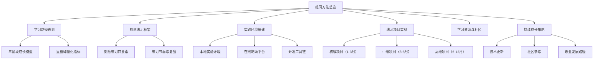
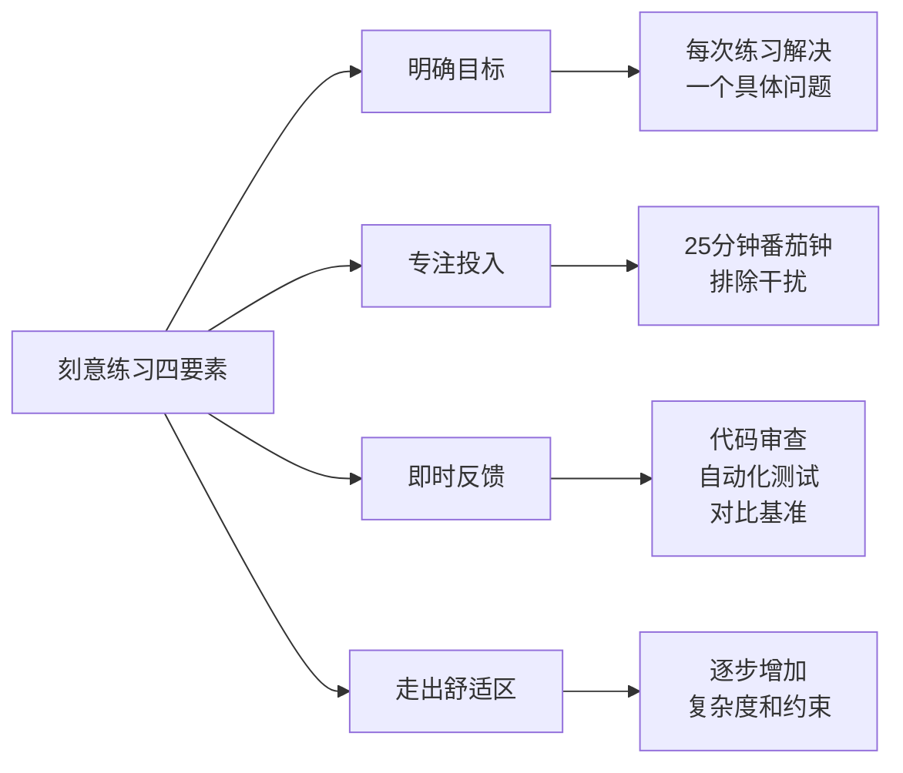
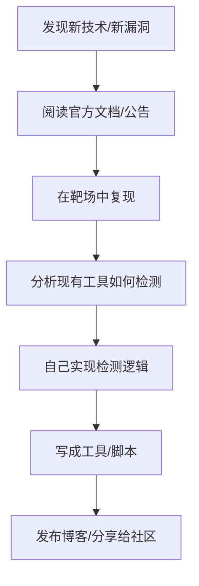
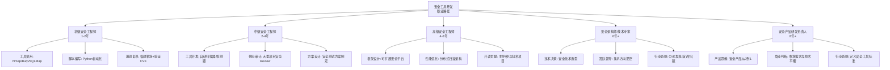

# 第33章 安全工具开发 - 练习方法

安全工具开发是一门"手艺"——仅靠阅读文档和教程远远不够，必须通过**系统化的刻意练习**将知识转化为肌肉记忆。本节不只是给你一份学习清单，而是提供一套可执行的练习方法论：如何规划学习路径、如何搭建实验环境、如何高效刷题、如何评估自己的进步。



---

## 33.1 学习路径规划：从入门到精通的三阶段模型

安全工具开发的学习不是线性的"从A到B"，而是一个**螺旋上升**的过程：每个阶段都在前一阶段的基础上加深理解，同时引入新的复杂度维度。

### 33.1.1 初学者阶段（1-3个月）

**核心目标**：掌握 Python 编程基础和网络协议原理，能独立完成简单的安全脚本。

**为什么选 Python**：Python 是安全工具开发的事实标准语言。其丰富的第三方库（requests、scapy、paramiko、pwntools）让安全开发者可以用最少的代码量实现功能，将精力集中在安全逻辑本身而非语言细节上。同时，Python 的动态类型和简洁语法降低了入门门槛，而其在数据分析、Web 框架、自动化运维等领域的通用性也意味着你学到的技能可以迁移到其他场景。

#### 必须掌握的知识节点

| 领域 | 具体内容 | 重要程度 | 预估学时 |
|------|----------|----------|----------|
| Python 基础 | 变量、条件、循环、函数、类 | ★★★★★ | 40h |
| 数据结构 | 列表、字典、集合、元组、队列 | ★★★★★ | 20h |
| 文件操作 | 读写文件、CSV/JSON 解析、路径处理 | ★★★★☆ | 15h |
| 异常处理 | try/except、自定义异常、日志记录 | ★★★★☆ | 10h |
| 网络基础 | TCP/IP 四层模型、三次握手、DNS 解析 | ★★★★★ | 30h |
| HTTP 协议 | 请求方法、状态码、头部字段、Cookie/Session | ★★★★★ | 25h |
| Socket 编程 | TCP/UDP Socket、非阻塞、超时设置 | ★★★★☆ | 20h |
| 安全工具使用 | Nmap、Burp Suite、SQLMap 的基本操作 | ★★★★☆ | 30h |

#### 练习项目 1：TCP 端口扫描器

这是安全工具开发的"Hello World"——它涵盖了 Socket 编程、异常处理、命令行参数解析三大核心技能。

```python
"""
练习1：多线程端口扫描器
目标：从单线程版本出发，逐步优化为生产级工具
学习要点：Socket编程、并发模型、性能优化、用户体验

进阶路径：
  V1 - 单线程扫描（理解基础逻辑）
  V2 - 多线程扫描（理解并发模型）
  V3 - 异步扫描（理解事件驱动）
  V4 - 输出格式化+服务识别（理解工程化）
"""

import socket
import argparse
import time
from concurrent.futures import ThreadPoolExecutor, as_completed

# 常见服务端口映射
COMMON_SERVICES = {
    21: "FTP", 22: "SSH", 23: "Telnet", 25: "SMTP",
    53: "DNS", 80: "HTTP", 110: "POP3", 143: "IMAP",
    443: "HTTPS", 993: "IMAPS", 995: "POP3S",
    3306: "MySQL", 3389: "RDP", 5432: "PostgreSQL",
    6379: "Redis", 8080: "HTTP-Proxy", 8443: "HTTPS-Alt",
    27017: "MongoDB"
}

def detect_service(port):
    """根据端口号推断服务类型"""
    return COMMON_SERVICES.get(port, "Unknown")

def scan_port(target, port, timeout=1):
    """扫描单个端口，返回 (端口, 状态, 服务名)"""
    try:
        sock = socket.socket(socket.AF_INET, socket.SOCK_STREAM)
        sock.settimeout(timeout)
        result = sock.connect_ex((target, port))
        sock.close()

        if result == 0:
            service = detect_service(port)
            return (port, "OPEN", service)
        else:
            return (port, "CLOSED", "")
    except socket.timeout:
        return (port, "FILTERED", "")
    except socket.error:
        return (port, "ERROR", "")

def threaded_scan(target, ports, max_threads=100, timeout=1):
    """多线程端口扫描"""
    open_ports = []
    total = len(ports)

    with ThreadPoolExecutor(max_workers=max_threads) as executor:
        future_to_port = {
            executor.submit(scan_port, target, port, timeout): port
            for port in ports
        }

        completed = 0
        for future in as_completed(future_to_port):
            completed += 1
            port, status, service = future.result()

            if status == "OPEN":
                print(f"  [+] {port}/tcp  OPEN  {service}")
                open_ports.append((port, service))

            # 进度显示（每完成10%打印一次）
            if completed % max(1, total // 10) == 0:
                print(f"  [*] 进度: {completed}/{total} ({completed*100//total}%)")

    return sorted(open_ports, key=lambda x: x[0])

def main():
    parser = argparse.ArgumentParser(
        description='多线程TCP端口扫描器',
        epilog='示例: python scanner.py 192.168.1.1 -p 1-1024 -t 200'
    )
    parser.add_argument('target', help='目标IP地址或主机名')
    parser.add_argument('-p', '--ports', default='1-1024',
                       help='端口范围，如 1-1024 或 80,443,8080')
    parser.add_argument('-t', '--threads', type=int, default=100,
                       help='并发线程数 (默认: 100)')
    parser.add_argument('--timeout', type=float, default=1.0,
                       help='连接超时秒数 (默认: 1.0)')

    args = parser.parse_args()

    # 解析端口范围
    if '-' in args.ports:
        start, end = map(int, args.ports.split('-'))
        ports = list(range(start, end + 1))
    else:
        ports = [int(p.strip()) for p in args.ports.split(',')]

    # DNS解析验证目标
    try:
        target_ip = socket.gethostbyname(args.target)
        print(f"\n[*] 扫描目标: {args.target} ({target_ip})")
    except socket.gaierror:
        print(f"[-] 无法解析主机: {args.target}")
        return

    print(f"[*] 扫描端口: {args.ports} ({len(ports)}个)")
    print(f"[*] 并发线程: {args.threads}")
    print(f"[*] 超时设置: {args.timeout}s\n")

    start_time = time.time()
    open_ports = threaded_scan(args.target, ports, args.threads, args.timeout)
    elapsed = time.time() - start_time

    print(f"\n{'='*50}")
    print(f"[*] 扫描完成，耗时 {elapsed:.2f}s")
    print(f"[*] 发现 {len(open_ports)} 个开放端口")

    if open_ports:
        print(f"\n{'端口':<10}{'服务':<15}")
        print("-" * 25)
        for port, service in open_ports:
            print(f"{port:<10}{service:<15}")

if __name__ == '__main__':
    main()
```

**练习要点与调试技巧**：
- 遇到 `Permission denied` 时：使用 `sudo` 运行或改用 `connect_ex()` 避免需要原始套接字
- `timeout` 设置过短会导致漏报（FILTERED 误判为 CLOSED），过长会拖慢扫描速度——建议从 1s 开始，根据网络延迟调整
- 使用 `ThreadPoolExecutor` 而非手动管理 `threading.Thread`，避免线程泄漏

#### 练习项目 2：HTTP 请求工具

理解 HTTP 协议的最好方式是自己发送请求并分析响应的每一个细节。

```python
"""
练习2：功能完整的HTTP探测工具
目标：实现一个可复用的HTTP探测器，支持多种请求模式
学习要点：requests库深入使用、HTTP协议细节、响应解析

进阶路径：
  V1 - 基本GET/POST请求
  V2 - 支持自定义头部、代理、Cookie
  V3 - 响应分析（安全头检测、技术栈指纹）
  V4 - 并发批量探测
"""

import requests
import argparse
import json
from urllib.parse import urlparse, urljoin

class HTTPProbe:
    """HTTP探测器"""

    # 安全相关的响应头及其推荐值
    SECURITY_HEADERS = {
        'Strict-Transport-Security': {
            'description': 'HSTS强制HTTPS',
            'severity': 'medium',
            'expected': 'max-age=31536000; includeSubDomains'
        },
        'Content-Security-Policy': {
            'description': '内容安全策略，防XSS',
            'severity': 'high',
            'expected': "default-src 'self'"
        },
        'X-Content-Type-Options': {
            'description': '防止MIME类型嗅探',
            'severity': 'medium',
            'expected': 'nosniff'
        },
        'X-Frame-Options': {
            'description': '防止点击劫持',
            'severity': 'medium',
            'expected': 'DENY 或 SAMEORIGIN'
        },
        'X-XSS-Protection': {
            'description': '浏览器XSS过滤器',
            'severity': 'low',
            'expected': '1; mode=block'
        },
        'Referrer-Policy': {
            'description': '控制Referer泄露',
            'severity': 'low',
            'expected': 'strict-origin-when-cross-origin'
        }
    }

    def __init__(self, timeout=10, user_agent=None):
        self.session = requests.Session()
        self.timeout = timeout
        if user_agent:
            self.session.headers['User-Agent'] = user_agent
        else:
            self.session.headers['User-Agent'] = (
                'Mozilla/5.0 (Windows NT 10.0; Win64; x64) '
                'AppleWebKit/537.36 Chrome/120.0.0.0 Safari/537.36'
            )

    def probe(self, url, method='GET', headers=None, data=None,
              follow_redirects=True):
        """发送请求并分析响应"""
        result = {
            'url': url,
            'method': method,
            'status_code': None,
            'headers': {},
            'security_headers': {},
            'tech_stack': [],
            'cookies': [],
            'error': None
        }

        try:
            response = self.session.request(
                method, url,
                headers=headers or {},
                data=data,
                timeout=self.timeout,
                allow_redirects=follow_redirects,
                verify=True  # SSL验证
            )

            result['status_code'] = response.status_code
            result['headers'] = dict(response.headers)
            result['cookies'] = [
                {'name': c.name, 'value': c.value[:20] + '...',
                 'domain': c.domain, 'secure': c.secure, 'httponly': c.has_nonstandard_attr('httponly')}
                for c in response.cookies
            ]

            # 安全头检测
            for header, info in self.SECURITY_HEADERS.items():
                value = response.headers.get(header)
                result['security_headers'][header] = {
                    'present': value is not None,
                    'value': value,
                    'description': info['description'],
                    'severity': info['severity']
                }

            # 技术栈指纹识别
            result['tech_stack'] = self._detect_tech(response)

        except requests.RequestException as e:
            result['error'] = str(e)

        return result

    def _detect_tech(self, response):
        """从响应中检测技术栈"""
        techs = []
        headers = response.headers

        # 服务器技术
        if 'Server' in headers:
            techs.append(f"Server: {headers['Server']}")
        if 'X-Powered-By' in headers:
            techs.append(f"Framework: {headers['X-Powered-By']}")

        # 安全技术
        if 'X-CDN' in headers or 'Via' in headers:
            techs.append("CDN: Detected")
        if headers.get('Content-Type', '').startswith('application/json'):
            techs.append("API: JSON")

        return techs

    def print_report(self, result):
        """输出格式化报告"""
        print(f"\n{'='*60}")
        print(f"URL: {result['url']}")
        print(f"方法: {result['method']}")
        print(f"状态码: {result['status_code']}")

        if result['error']:
            print(f"错误: {result['error']}")
            return

        # 技术栈
        if result['tech_stack']:
            print(f"\n技术栈:")
            for tech in result['tech_stack']:
                print(f"  - {tech}")

        # 安全头审计
        print(f"\n安全头审计:")
        missing = [h for h, v in result['security_headers'].items()
                   if not v['present']]
        present = [h for h, v in result['security_headers'].items()
                   if v['present']]

        if missing:
            print(f"  [!] 缺失 ({len(missing)}):")
            for h in missing:
                info = result['security_headers'][h]
                print(f"      - {h} ({info['severity']}): {info['description']}")

        if present:
            print(f"  [+] 已配置 ({len(present)}):")
            for h in present:
                print(f"      - {h}")

        print(f"\nCookies ({len(result['cookies'])}个):")
        for c in result['cookies']:
            flags = []
            if c['secure']: flags.append('Secure')
            print(f"  - {c['name']} (domain={c['domain']}, {','.join(flags) or '无安全标志'})")


if __name__ == '__main__':
    parser = argparse.ArgumentParser(description='HTTP安全探测工具')
    parser.add_argument('url', help='目标URL')
    parser.add_argument('-m', '--method', default='GET',
                       choices=['GET', 'POST', 'PUT', 'DELETE', 'HEAD'],
                       help='HTTP方法')
    parser.add_argument('-H', '--header', action='append',
                       help='自定义请求头 (key:value)')
    parser.add_argument('-d', '--data', help='请求体数据')
    parser.add_argument('--timeout', type=int, default=10)

    args = parser.parse_args()

    probe = HTTPProbe(timeout=args.timeout)
    headers = {}
    if args.header:
        for h in args.header:
            key, value = h.split(':', 1)
            headers[key.strip()] = value.strip()

    result = probe.probe(args.url, args.method, headers, args.data)
    probe.print_report(result)
```

#### 练习项目 3：子域名枚举工具

DNS 枚举是信息收集阶段的核心技能，也是理解网络协议、并发编程和异常处理的绝佳练习。

```python
"""
练习3：高性能子域名枚举器
目标：从字典文件中枚举有效子域名
学习要点：DNS解析、多线程编程、线程安全、进度追踪

进阶路径：
  V1 - 单线程字典枚举
  V2 - 多线程+Queue
  V3 - 异步IO（aiohttp+aiodns）
  V4 - 多种DNS记录查询+结果导出
"""

import dns.resolver
import dns.exception
import threading
import time
import json
from queue import Queue, Empty
from datetime import datetime

class SubdomainEnumerator:
    """高性能子域名枚举器"""

    def __init__(self, domain, threads=50, timeout=3, dns_servers=None):
        self.domain = domain
        self.threads = threads
        self.timeout = timeout
        self.dns_servers = dns_servers or ['8.8.8.8', '1.1.1.1', '223.5.5.5']
        self.queue = Queue()
        self.results = []
        self.lock = threading.Lock()
        self.stats = {'checked': 0, 'found': 0, 'errors': 0}
        self.stats_lock = threading.Lock()

    def load_wordlist(self, wordlist):
        """从文件加载字典"""
        count = 0
        with open(wordlist, 'r', encoding='utf-8', errors='ignore') as f:
            for line in f:
                sub = line.strip()
                if sub and not sub.startswith('#'):
                    self.queue.put(sub)
                    count += 1
        return count

    def check_subdomain(self, subdomain):
        """查询单个子域名的所有DNS记录类型"""
        full_domain = f"{subdomain}.{self.domain}"
        try:
            resolver = dns.resolver.Resolver()
            resolver.nameservers = self.dns_servers
            resolver.timeout = self.timeout
            resolver.lifetime = self.timeout

            # 查询A记录
            a_records = []
            try:
                answers = resolver.resolve(full_domain, 'A')
                a_records = [str(rdata) for rdata in answers]
            except (dns.resolver.NoAnswer, dns.resolver.NXDOMAIN,
                    dns.exception.Timeout):
                pass

            # 查询CNAME记录
            cname_record = None
            try:
                answers = resolver.resolve(full_domain, 'CNAME')
                cname_record = str(answers[0].target)
            except (dns.resolver.NoAnswer, dns.resolver.NXDOMAIN,
                    dns.exception.Timeout):
                pass

            if a_records or cname_record:
                with self.lock:
                    self.results.append({
                        'subdomain': full_domain,
                        'a_records': a_records,
                        'cname': cname_record,
                        'timestamp': datetime.now().isoformat()
                    })
                with self.stats_lock:
                    self.stats['found'] += 1
                print(f"  [+] {full_domain} -> {', '.join(a_records)}")

        except Exception:
            with self.stats_lock:
                self.stats['errors'] += 1

    def worker(self):
        """工作线程：从队列取任务直到队列为空"""
        while True:
            try:
                subdomain = self.queue.get(timeout=2)
            except Empty:
                break

            self.check_subdomain(subdomain)
            self.queue.task_done()

            with self.stats_lock:
                self.stats['checked'] += 1

    def enumerate(self, wordlist):
        """启动枚举"""
        print(f"[*] 目标域名: {self.domain}")
        print(f"[*] DNS服务器: {', '.join(self.dns_servers)}")
        print(f"[*] 并发线程: {self.threads}")

        total = self.load_wordlist(wordlist)
        if total == 0:
            print("[-] 字典为空")
            return []

        print(f"[*] 字典条目: {total}")
        print(f"[*] 开始枚举...\n")

        start_time = time.time()

        # 创建并启动工作线程
        thread_list = []
        for _ in range(min(self.threads, total)):
            t = threading.Thread(target=self.worker, daemon=True)
            t.start()
            thread_list.append(t)

        for t in thread_list:
            t.join()

        elapsed = time.time() - start_time

        print(f"\n{'='*50}")
        print(f"[*] 枚举完成")
        print(f"[*] 耗时: {elapsed:.1f}s")
        print(f"[*] 已检查: {self.stats['checked']}/{total}")
        print(f"[*] 发现: {self.stats['found']} 个有效子域名")
        print(f"[*] 错误: {self.stats['errors']}")

        return sorted(self.results, key=lambda x: x['subdomain'])

    def export_json(self, filename):
        """导出结果为JSON"""
        with open(filename, 'w') as f:
            json.dump(self.results, f, indent=2)
        print(f"[+] 结果已导出: {filename}")

    def export_csv(self, filename):
        """导出结果为CSV"""
        with open(filename, 'w') as f:
            f.write("subdomain,a_records,cname\n")
            for r in self.results:
                ips = '|'.join(r['a_records'])
                cname = r['cname'] or ''
                f.write(f"{r['subdomain']},{ips},{cname}\n")
        print(f"[+] 结果已导出: {filename}")


# 使用示例
if __name__ == '__main__':
    import argparse

    parser = argparse.ArgumentParser(description='子域名枚举器')
    parser.add_argument('domain', help='目标域名')
    parser.add_argument('-w', '--wordlist', default='subdomains.txt',
                       help='字典文件路径')
    parser.add_argument('-t', '--threads', type=int, default=50,
                       help='并发线程数')
    parser.add_argument('-o', '--output', help='输出文件（JSON格式）')
    parser.add_argument('--dns', nargs='+', default=['8.8.8.8', '1.1.1.1'],
                       help='DNS服务器列表')

    args = parser.parse_args()

    enum = SubdomainEnumerator(args.domain, args.threads, dns_servers=args.dns)
    results = enum.enumerate(args.wordlist)

    if args.output:
        if args.output.endswith('.json'):
            enum.export_json(args.output)
        elif args.output.endswith('.csv'):
            enum.export_csv(args.output)
```

#### 初学者阶段的自检清单

完成以下任务，说明你已准备好进入中级阶段：

- [ ] 能不查文档写出 Socket TCP 连接的基本代码
- [ ] 能解释 HTTP 请求/响应的完整生命周期
- [ ] 能使用 Nmap 完成基本的端口扫描和 OS 指纹识别
- [ ] 能用 Burp Suite 拦截、修改、重放 HTTP 请求
- [ ] 完成至少 10 个 OverTheWire Bandit 或 Natas 挑战
- [ ] 独立完成上述三个练习项目的所有进阶版本

---

### 33.1.2 中级阶段（3-6个月）

**核心目标**：具备开发功能完整的安全工具的能力，能进行 Web 漏洞的检测与验证。

中级阶段的关键跨越是**从"写脚本"到"做项目"**。初学者写的是一次性脚本（run once then throw away），中级开发者写的应该是可维护、可复用、有良好结构的工具。

#### 必须掌握的知识节点

| 领域 | 具体内容 | 重要程度 | 预估学时 |
|------|----------|----------|----------|
| 异步编程 | asyncio、aiohttp、async DNS | ★★★★★ | 30h |
| 正则表达式 | 模式匹配、捕获组、贪婪/非贪婪 | ★★★★★ | 20h |
| 数据解析 | JSON、XML、HTML（BeautifulSoup）、二进制 | ★★★★☆ | 20h |
| 加密编码 | Base64、URL编码、MD5/SHA、AES/RSA | ★★★★☆ | 25h |
| OWASP Top 10 | 注入、XSS、SSRF、反序列化、越权等 | ★★★★★ | 40h |
| WAF 绕过 | 编码绕过、分块传输、大小写变异、注释注入 | ★★★★☆ | 25h |
| 代码架构 | 模块化设计、配置管理、日志系统、错误处理 | ★★★★★ | 30h |
| 数据库操作 | SQLite（本地结果存储）、Redis（任务队列） | ★★★★☆ | 15h |

#### 练习项目 4：Web 漏洞扫描器

这是一个**架构练习**——核心不在于检测逻辑有多复杂，而在于如何设计一个可扩展的扫描框架。

```python
"""
练习4：可扩展Web漏洞扫描器
目标：开发支持插件式漏洞检测的扫描框架
学习要点：框架设计、并发任务管理、爬虫技术、报告生成

项目结构：
web_scanner/
├── __init__.py
├── crawler.py          # 网页爬虫模块
├── detectors/          # 漏洞检测插件目录
│   ├── __init__.py
│   ├── base.py         # 检测器基类
│   ├── sqli.py         # SQL注入检测
│   ├── xss.py          # XSS检测
│   ├── header.py       # 安全头检测
│   └── sensitive.py    # 敏感信息泄露检测
├── reporter.py         # 报告生成器
├── scanner.py          # 主程序入口
└── config.py           # 配置管理
"""

import requests
import re
from abc import ABC, abstractmethod
from urllib.parse import urljoin, urlparse, parse_qs, urlencode, urlunparse
from concurrent.futures import ThreadPoolExecutor
from bs4 import BeautifulSoup
import time

class DetectorBase(ABC):
    """漏洞检测器基类 - 所有检测器必须继承此类"""

    @property
    @abstractmethod
    def name(self):
        """检测器名称"""
        pass

    @property
    @abstractmethod
    def severity(self):
        """严重程度: critical/high/medium/low/info"""
        pass

    @abstractmethod
    def detect(self, url, response=None, params=None):
        """
        执行检测
        返回: list of dict, 每个元素包含:
            - type: 漏洞类型
            - url: 漏洞URL
            - param: 问题参数
            - detail: 详细描述
            - severity: 严重程度
            - evidence: 证据
        """
        pass

class SQLInjectionDetector(DetectorBase):
    """SQL注入检测器"""

    name = "sql_injection"
    severity = "critical"

    # SQL注入测试Payload
    PAYLOADS = [
        ("'", "单引号"),
        ("' OR '1'='1", "经典永真条件"),
        ("' OR '1'='1' --", "注释截断"),
        ("1; DROP TABLE --", "堆叠查询"),
        ("' UNION SELECT NULL--", "联合查询"),
        ("' AND SLEEP(5)--", "时间盲注"),
        ("1' AND '1'='1", "布尔盲注"),
    ]

    # SQL错误特征
    ERROR_PATTERNS = [
        r"SQL syntax.*MySQL",
        r"Warning.*mysql_",
        r"MySQLSyntaxErrorException",
        r"ORA-\d{5}",
        r"PostgreSQL.*ERROR",
        r"SQLite.*error",
        r"Microsoft.*ODBC.*SQL Server",
        r"Syntax error.*query",
        r"unterminated.*string",
        r"pg_query\(\)",
    ]

    def __init__(self, timeout=10):
        self.timeout = timeout
        self.error_regex = re.compile(
            '|'.join(self.ERROR_PATTERNS), re.IGNORECASE
        )

    def detect(self, url, response=None, params=None):
        findings = []
        test_params = params or {}

        if not test_params:
            # 尝试从URL中提取参数
            parsed = urlparse(url)
            test_params = parse_qs(parsed.query)
            test_params = {k: v[0] if v else '' for k, v in test_params.items()}

        if not test_params:
            return findings

        for param_name in test_params:
            original_value = test_params[param_name]

            for payload, desc in self.PAYLOADS:
                test_params[param_name] = payload

                try:
                    test_url = self._build_url(url, test_params)
                    resp = requests.get(test_url, timeout=self.timeout,
                                       allow_redirects=False,
                                       verify=False)

                    # 检测SQL错误
                    body = resp.text
                    match = self.error_regex.search(body)

                    if match:
                        findings.append({
                            'type': 'SQL Injection',
                            'url': url,
                            'param': param_name,
                            'severity': self.severity,
                            'detail': f"{desc}触发了SQL错误",
                            'evidence': match.group()[:200],
                            'payload': payload
                        })

                    # 时间盲注检测
                    elif 'SLEEP' in payload.upper():
                        if resp.elapsed.total_seconds() > 4:
                            findings.append({
                                'type': 'Time-based SQL Injection',
                                'url': url,
                                'param': param_name,
                                'severity': self.severity,
                                'detail': '时间盲注：服务器响应延迟',
                                'evidence': f'响应耗时 {resp.elapsed.total_seconds():.1f}s',
                                'payload': payload
                            })

                except requests.RequestException:
                    continue

                # 恢复原始值
                test_params[param_name] = original_value

        return findings

    def _build_url(self, url, params):
        """重建带参数的URL"""
        parsed = urlparse(url)
        new_query = urlencode(params, doseq=True)
        return urlunparse(parsed._replace(query=new_query))


class SecurityHeaderDetector(DetectorBase):
    """HTTP安全头检测器"""

    name = "security_headers"
    severity = "medium"

    MISSING_HEADERS = {
        'Strict-Transport-Security': '缺少HSTS，可能被降级攻击',
        'Content-Security-Policy': '缺少CSP，XSS风险增加',
        'X-Content-Type-Options': '缺少MIME类型保护',
        'X-Frame-Options': '缺少点击劫持保护',
    }

    def detect(self, url, response=None, params=None):
        findings = []
        try:
            resp = response or requests.get(url, timeout=10, verify=False)
            headers = {k.lower(): v for k, v in resp.headers.items()}

            for header, desc in self.MISSING_HEADERS.items():
                if header.lower() not in headers:
                    findings.append({
                        'type': 'Missing Security Header',
                        'url': url,
                        'param': header,
                        'severity': self.severity,
                        'detail': desc,
                        'evidence': f'{header} 未配置'
                    })

            # 检测Server头信息泄露
            if 'server' in headers:
                findings.append({
                    'type': 'Server Header Disclosure',
                    'url': url,
                    'param': 'Server',
                    'severity': 'low',
                    'detail': f'服务器信息泄露: {headers["server"]}',
                    'evidence': headers['server']
                })

        except requests.RequestException:
            pass

        return findings


class SensitiveInfoDetector(DetectorBase):
    """敏感信息泄露检测器"""

    name = "sensitive_info"
    severity = "high"

    PATTERNS = {
        'email': (r'[a-zA-Z0-9._%+-]+@[a-zA-Z0-9.-]+\.[a-zA-Z]{2,}', '邮箱地址'),
        'phone': (r'1[3-9]\d{9}', '手机号码'),
        'id_card': (r'\d{17}[\dXx]', '身份证号'),
        'api_key': (r'["\']?api[_-]?key["\']?\s*[:=]\s*["\']([^"\']+)', 'API密钥'),
        'password_field': (r'password["\']?\s*(?:value|[:=])\s*["\']([^"\']+)', '密码字段'),
        'private_key': (r'-----BEGIN.*PRIVATE KEY-----', '私钥'),
    }

    def detect(self, url, response=None, params=None):
        findings = []
        try:
            resp = response or requests.get(url, timeout=10, verify=False)
            body = resp.text

            for name, (pattern, desc) in self.PATTERNS.items():
                matches = re.findall(pattern, body, re.IGNORECASE)
                if matches:
                    # 去重并限制证据长度
                    evidence = list(set(matches))[:3]
                    findings.append({
                        'type': 'Sensitive Information Leak',
                        'url': url,
                        'param': name,
                        'severity': self.severity if 'private_key' in name else 'medium',
                        'detail': f'检测到{desc}泄露',
                        'evidence': str(evidence)[:200]
                    })

        except requests.RequestException:
            pass

        return findings


class SimpleCrawler:
    """简易网页爬虫"""

    def __init__(self, base_url, max_depth=2, max_pages=50):
        self.base_url = base_url
        self.base_domain = urlparse(base_url).netloc
        self.max_depth = max_depth
        self.max_pages = max_pages
        self.visited = set()
        self.found_urls = set()

    def crawl(self):
        """广度优先爬取"""
        from collections import deque
        queue = deque([(self.base_url, 0)])

        while queue and len(self.visited) < self.max_pages:
            url, depth = queue.popleft()

            if url in self.visited or depth > self.max_depth:
                continue

            self.visited.add(url)
            self.found_urls.add(url)

            try:
                resp = requests.get(url, timeout=5, allow_redirects=True,
                                   verify=False)
                soup = BeautifulSoup(resp.text, 'html.parser')

                for a_tag in soup.find_all('a', href=True):
                    link = urljoin(url, a_tag['href'])
                    parsed = urlparse(link)

                    # 只爬取同域名的页面
                    if parsed.netloc == self.base_domain:
                        clean_url = urlunparse(parsed._replace(
                            fragment='', query=parse_qs(parsed.query)
                        ))
                        if clean_url not in self.visited:
                            queue.append((clean_url, depth + 1))

            except requests.RequestException:
                continue

        return list(self.found_urls)


class ScannerEngine:
    """扫描引擎 - 协调爬虫和检测器"""

    def __init__(self, detectors=None):
        self.detectors = detectors or []
        self.all_findings = []

    def add_detector(self, detector):
        self.detectors.append(detector)

    def scan_url(self, url):
        """对单个URL执行所有检测"""
        findings = []
        for detector in self.detectors:
            try:
                results = detector.detect(url)
                findings.extend(results)
            except Exception as e:
                print(f"  [!] {detector.name} 检测异常: {e}")
        return findings

    def scan_target(self, target_url, max_depth=2, max_pages=30):
        """扫描整个目标"""
        print(f"\n[*] 扫描引擎启动")
        print(f"[*] 已加载 {len(self.detectors)} 个检测器")
        for d in self.detectors:
            print(f"    - {d.name} (severity: {d.severity})")

        # 第一步：爬取目标
        print(f"\n[*] 爬取阶段...")
        crawler = SimpleCrawler(target_url, max_depth, max_pages)
        urls = crawler.crawl()
        print(f"[*] 发现 {len(urls)} 个页面")

        # 第二步：逐个检测
        print(f"\n[*] 检测阶段...")
        for i, url in enumerate(urls):
            print(f"  [{i+1}/{len(urls)}] {url}")
            findings = self.scan_url(url)
            self.all_findings.extend(findings)

            if findings:
                for f in findings:
                    print(f"    [{f['severity'].upper()}] {f['type']}: {f['detail']}")

        return self.all_findings

    def generate_report(self, output_file='scan_report.json'):
        """生成扫描报告"""
        report = {
            'scan_time': time.strftime('%Y-%m-%d %H:%M:%S'),
            'total_findings': len(self.all_findings),
            'by_severity': {},
            'findings': self.all_findings
        }

        for f in self.all_findings:
            sev = f['severity']
            report['by_severity'][sev] = report['by_severity'].get(sev, 0) + 1

        with open(output_file, 'w', encoding='utf-8') as fp:
            import json
            json.dump(report, fp, indent=2, ensure_ascii=False)

        print(f"\n[*] 报告已生成: {output_file}")
        print(f"[*] 总发现数: {report['total_findings']}")
        for sev, count in sorted(report['by_severity'].items()):
            print(f"    {sev}: {count}")

        return report


if __name__ == '__main__':
    import argparse

    parser = argparse.ArgumentParser(description='Web漏洞扫描器')
    parser.add_argument('target', help='目标URL')
    parser.add_argument('--depth', type=int, default=2, help='爬取深度')
    parser.add_argument('--pages', type=int, default=30, help='最大页面数')

    args = parser.parse_args()

    # 初始化引擎并注册检测器
    engine = ScannerEngine()
    engine.add_detector(SQLInjectionDetector())
    engine.add_detector(SecurityHeaderDetector())
    engine.add_detector(SensitiveInfoDetector())

    # 执行扫描
    engine.scan_target(args.target, args.depth, args.pages)
    engine.generate_report()
```

#### 练习项目 5：密码哈希分析工具

密码破解的本质是**性能优化**——理解哈希算法的工作原理，并找到最快的计算路径。

```python
"""
练习5：密码哈希分析与破解工具
目标：理解密码存储安全，掌握常见哈希的分析与破解
学习要点：密码学基础、性能优化、多进程编程

伦理提醒：此工具仅用于授权的安全测试和密码审计。
未授权破解他人密码属于违法行为。
"""

import hashlib
import hmac
import time
import string
import itertools
from multiprocessing import Pool, cpu_count
from collections import Counter

class HashAnalyzer:
    """哈希分析器——识别哈希类型"""

    # 哈希特征：(长度, 字符集正则)
    HASH_PATTERNS = {
        'MD5':       (32, r'^[a-f0-9]+$'),
        'SHA-1':     (40, r'^[a-f0-9]+$'),
        'SHA-256':   (64, r'^[a-f0-9]+$'),
        'SHA-512':   (128, r'^[a-f0-9]+$'),
        'NTLM':      (32, r'^[a-f0-9]+$'),
        'MySQL5':    (40, r'^\*[0-9a-f]{40}$'),
        'bcrypt':    (60, r'^\$2[aby]?\$\d{2}\$.{53}$'),
        'Argon2':    (None, r'^\$argon2'),  # 可变长度
    }

    @staticmethod
    def identify(hash_str):
        """尝试识别哈希类型"""
        import re
        results = []

        for name, (length, pattern) in HashAnalyzer.HASH_PATTERNS.items():
            if length and len(hash_str) != length:
                continue
            if re.match(pattern, hash_str):
                results.append(name)

        return results or ['Unknown']

    @staticmethod
    def security_level(hash_type):
        """评估哈希算法的安全等级"""
        levels = {
            'MD5': 'broken - 可在秒级碰撞',
            'SHA-1': 'broken - 可在分钟级碰撞',
            'NTLM': 'weak - 可被彩虹表秒破',
            'SHA-256': 'moderate - 无盐时可被字典攻击',
            'bcrypt': 'strong - 原生加盐+慢哈希',
            'Argon2': 'strong - 抗GPU/ASIC',
        }
        return levels.get(hash_type, 'unknown')

    @staticmethod
    def crack_info(hash_type):
        """根据类型估算破解难度"""
        difficulty = {
            'MD5': '极快（~100亿次/秒 GPU）',
            'SHA-1': '快（~50亿次/秒 GPU）',
            'NTLM': '极快（~1000亿次/秒 GPU）',
            'SHA-256': '中等（无盐时）',
            'bcrypt': '慢（~15000次/秒 CPU）',
            'Argon2': '极慢（可配置）',
        }
        return difficulty.get(hash_type, '取决于具体实现')


def _hash_worker(args):
    """多进程工作函数"""
    password, target_hash, hash_func = args
    computed = hash_func(password)
    if hmac.compare_digest(computed, target_hash):
        return password
    return None


class PasswordCracker:
    """密码破解器"""

    HASH_FUNCS = {
        'md5': lambda p: hashlib.md5(p.encode()).hexdigest(),
        'sha1': lambda p: hashlib.sha1(p.encode()).hexdigest(),
        'sha256': lambda p: hashlib.sha256(p.encode()).hexdigest(),
        'ntlm': lambda p: hashlib.new('md4', p.encode('utf-16-le')).hexdigest(),
    }

    def __init__(self, target_hash, hash_type='md5', workers=None):
        self.target_hash = target_hash.lower().strip()
        self.hash_type = hash_type.lower()
        self.hash_func = self.HASH_FUNCS.get(self.hash_type)
        self.workers = workers or cpu_count()
        self.found = None
        self.attempts = 0

        if not self.hash_func:
            raise ValueError(f"不支持的哈希类型: {hash_type}")

    def dictionary_attack(self, wordlist_file):
        """字典攻击"""
        print(f"[*] 字典攻击 - 目标: {self.target_hash[:16]}... ({self.hash_type})")
        start_time = time.time()

        with open(wordlist_file, 'r', encoding='utf-8', errors='ignore') as f:
            words = [line.strip() for line in f if line.strip()]

        # 使用多进程池
        args_list = [(w, self.target_hash, self.hash_func) for w in words]

        with Pool(self.workers) as pool:
            for result in pool.imap_unordered(_hash_worker, args_list):
                self.attempts += 1
                if self.attempts % 100000 == 0:
                    elapsed = time.time() - start_time
                    rate = self.attempts / elapsed if elapsed > 0 else 0
                    print(f"  [*] 已尝试 {self.attempts:,} | "
                          f"速度: {rate:,.0f}/s")

                if result:
                    self.found = result
                    pool.terminate()
                    break

        elapsed = time.time() - start_time
        rate = self.attempts / elapsed if elapsed > 0 else 0

        if self.found:
            print(f"\n  [+] 破解成功! 密码: {self.found}")
        else:
            print(f"\n  [-] 未找到密码")
        print(f"  [*] 总尝试: {self.attempts:,} | 耗时: {elapsed:.1f}s | "
              f"速度: {rate:,.0f}/s")

        return self.found

    def brute_force(self, charset, min_len=1, max_len=6):
        """暴力破解"""
        print(f"[*] 暴力破解 - 字符集: {len(charset)} | "
              f"长度: {min_len}-{max_len}")
        print(f"[*] 搜索空间: {sum(len(charset)**i for i in range(min_len, max_len+1)):,}")

        start_time = time.time()

        for length in range(min_len, max_len + 1):
            print(f"  [*] 尝试长度 {length} ({len(charset)**length:,} 种组合)")

            for combo in itertools.product(charset, repeat=length):
                password = ''.join(combo)
                self.attempts += 1

                if self.hash_func(password) == self.target_hash:
                    self.found = password
                    elapsed = time.time() - start_time
                    print(f"\n  [+] 破解成功! 密码: {self.found}")
                    print(f"  [*] 耗时: {elapsed:.1f}s | "
                          f"尝试: {self.attempts:,}")
                    return self.found

                if self.attempts % 1000000 == 0:
                    elapsed = time.time() - start_time
                    rate = self.attempts / elapsed if elapsed > 0 else 0
                    print(f"    [*] 进度: {self.attempts:,} | "
                          f"速度: {rate:,.0f}/s")

        elapsed = time.time() - start_time
        print(f"\n  [-] 未找到密码 | 耗时: {elapsed:.1f}s | "
              f"尝试: {self.attempts:,}")
        return None

    def hybrid_attack(self, wordlist_file):
        """
        混合攻击：字典单词 + 常见变体（大小写变换、数字后缀、特殊字符）
        模拟真实用户的密码设置习惯
        """
        print(f"[*] 混合攻击 - 字典+变体")
        start_time = time.time()

        suffixes = [''] + [str(i) for i in range(100)]
        suffixes += ['!', '@', '#', '$', '123', '!@#', '!!!']

        with open(wordlist_file, 'r', encoding='utf-8', errors='ignore') as f:
            for line in f:
                base = line.strip()
                if not base:
                    continue

                # 生成变体
                variations = [
                    base,
                    base.lower(),
                    base.upper(),
                    base.capitalize(),
                    base.swapcase(),
                ]

                for word in variations:
                    for suffix in suffixes:
                        password = word + suffix
                        self.attempts += 1

                        if self.hash_func(password) == self.target_hash:
                            elapsed = time.time() - start_time
                            self.found = password
                            print(f"\n  [+] 破解成功! 密码: {self.found}")
                            print(f"  [*] 耗时: {elapsed:.1f}s | "
                                  f"尝试: {self.attempts:,}")
                            return self.found

                    # 前缀变体（年份、常见前缀）
                    for prefix in ['2024', '2025', '2026', 'qwerty', 'admin']:
                        password = prefix + word
                        self.attempts += 1
                        if self.hash_func(password) == self.target_hash:
                            elapsed = time.time() - start_time
                            self.found = password
                            print(f"\n  [+] 破解成功! 密码: {self.found}")
                            return self.found

        elapsed = time.time() - start_time
        print(f"\n  [-] 未找到密码 | 耗时: {elapsed:.1f}s | "
              f"尝试: {self.attempts:,}")
        return None


if __name__ == '__main__':
    import argparse

    parser = argparse.ArgumentParser(description='密码哈希分析与破解工具')
    parser.add_argument('action', choices=['analyze', 'crack'],
                       help='analyze=分析哈希类型, crack=破解')
    parser.add_argument('hash', help='目标哈希值')
    parser.add_argument('-t', '--type', default='md5',
                       choices=['md5', 'sha1', 'sha256', 'ntlm'])
    parser.add_argument('-w', '--wordlist', help='字典文件')
    parser.add_argument('-m', '--mode', choices=['dict', 'brute', 'hybrid'],
                       default='dict')
    parser.add_argument('--charset', default=string.ascii_lowercase + string.digits)
    parser.add_argument('--min-len', type=int, default=1)
    parser.add_argument('--max-len', type=int, default=6)
    parser.add_argument('--workers', type=int, default=None)

    args = parser.parse_args()

    if args.action == 'analyze':
        results = HashAnalyzer.identify(args.hash)
        print(f"哈希值: {args.hash}")
        print(f"可能的类型: {', '.join(results)}")
        for h in results:
            print(f"  {h}: 安全等级 - {HashAnalyzer.security_level(h)}")
            print(f"       破解难度 - {HashAnalyzer.crack_info(h)}")
    else:
        cracker = PasswordCracker(args.hash, args.type, args.workers)
        if args.mode == 'dict' and args.wordlist:
            cracker.dictionary_attack(args.wordlist)
        elif args.mode == 'brute':
            cracker.brute_force(args.charset, args.min_len, args.max_len)
        elif args.mode == 'hybrid' and args.wordlist:
            cracker.hybrid_attack(args.wordlist)
        else:
            print("请指定字典文件 (-w)")
```

---

## 33.2 刻意练习框架：如何高效练习

很多人花了很多时间写代码，但进步缓慢。原因在于他们只是在"重复"，而非"刻意练习"。心理学家 Anders Ericsson 提出的**刻意练习（Deliberate Practice）**理论认为，有效的技能提升需要满足四个条件：



### 32.2.1 刻意练习四要素

**1. 明确且具体的目标**

不要说"今天学安全开发"，而是说"今天实现一个支持 SYN/ACK/NULL 三种扫描模式的端口扫描器"。每次练习都应该有一个**可验证的交付物**。

| 模糊目标 | 具体目标 |
|----------|----------|
| 学习 Web 安全 | 实现一个能检测 5 种 XSS 变体的检测器 |
| 练习 Python | 用 asyncio 重写端口扫描器，对比性能提升比例 |
| 看看 SQLMap 源码 | 分析 SQLMap 的 `tamper` 模块接口，写一个自定义 tamper 脚本 |
| 了解 Docker | 用 Docker Compose 搭建包含 DVWA + SQLi-Labs + MySQL 的靶场环境 |

**2. 高度专注的投入**

安全工具开发需要深度思考。建议使用**番茄工作法**——25 分钟全神贯注写代码，5 分钟休息。在这 25 分钟内：
- 关闭即时通讯工具
- 不切换到浏览器看新闻
- 如果遇到问题，先记在纸上稍后处理，不要打断当前的编码流

**3. 即时且高质量的反馈**

自己写代码最大的问题是**缺乏反馈**。解决方法：

| 反馈来源 | 实现方式 | 适用场景 |
|----------|----------|----------|
| 自动化测试 | 为每个函数写单元测试 | 所有代码 |
| 代码审查 | 让同事或社区 Review 你的 PR | 项目级代码 |
| 基准对比 | 和现有工具（Nmap/SQLMap）对比结果 | 工具功能验证 |
| CTF 环境 | 在靶场中测试你的工具 | 安全工具 |
| Lint 工具 | flake8 / mypy / pylint 自动检测代码质量 | 所有代码 |

**4. 持续走出舒适区**

如果你写端口扫描器已经很轻松了，那就加难度——实现 SYN 扫描需要原始套接字；实现全连接扫描需要处理大量并发；实现服务识别需要构造协议探测包。每次都在上一次的基础上增加一个新维度。

### 32.2.2 练习节奏与复盘

推荐的练习节奏：

| 频率 | 活动 | 时长 | 目标 |
|------|------|------|------|
| 每天 | 编码练习 | 1-2h | 完成一个小功能点 |
| 每周 | CTF 挑战 | 3-5h | 完成 2-3 道中等难度题目 |
| 每两周 | 项目迭代 | 一个下午 | 为个人项目添加新功能 |
| 每月 | 代码复盘 | 2h | 回顾本月代码，重构、优化、写文档 |
| 每季度 | 技能评估 | 半天 | 对照自检清单评估进展，调整学习方向 |

**每次编码后写复盘笔记**（哪怕只有 3 行）：

```markdown
## 2026-06-26 练习复盘

**做了什么**：用 asyncio 重写了端口扫描器
**遇到的问题**：asyncio.Semaphore 限制并发时，信号量在协程异常时没有释放
**解决方法**：用 async with 语句管理信号量，确保异常安全
**明天要做的**：加一个服务指纹识别功能，对比 nmap 的 -sV 结果
```

---

## 33.3 实践环境搭建

### 33.3.1 本地实验环境（Docker）

搭建一个隔离的安全实验环境是**所有练习的前提**——永远不要在生产网络上测试你的工具。

```yaml
# docker-compose.yml - 安全实验靶场环境
# 使用: docker-compose up -d
# 访问: 各服务端口见下方注释

version: '3.8'

services:
  # DVWA - Damn Vulnerable Web Application
  # 练习: SQL注入、XSS、CSRF、文件上传、命令注入
  # 访问: http://localhost:8080 (用户名: admin / 密码: password)
  dvwa:
    image: vulnerables/web-dvwa
    ports:
      - "8080:80"
    networks:
      - sec-lab
    restart: unless-stopped

  # WebGoat - OWASP 官方教学靶场
  # 练习: OWASP Top 10 全系列漏洞
  # 访问: http://localhost:8081/WebGoat
  webgoat:
    image: webgoat/webgoat
    ports:
      - "8081:8080"
    environment:
      - WEBGOAT_PORT=8080
    networks:
      - sec-lab
    restart: unless-stopped

  # SQLi-Labs - SQL注入专项练习
  # 练习: Union注入、盲注、报错注入、堆叠查询等 75 种场景
  # 访问: http://localhost:8083
  sqli-labs:
    image: acgpiano/sqli-labs
    ports:
      - "8083:80"
    networks:
      - sec-lab
    restart: unless-stopped

  # Metasploitable2 - 渗透测试综合靶机
  # 练习: 系统级漏洞利用、服务枚举、提权
  # 访问: http://localhost:8082 (Web), SSH: localhost:2222
  metasploitable:
    image: tleemcjr/metasploitable2
    ports:
      - "8082:80"
      - "2222:22"
      - "2121:21"
      - "33060:3306"
    networks:
      - sec-lab
    restart: unless-stopped

  # Juice Shop - OWASP 大型现代靶场
  # 练习: 100+ 道挑战，覆盖前端安全、API安全、认证绕过等
  # 访问: http://localhost:3000
  juice-shop:
    image: bkimminich/juice-shop
    ports:
      - "3000:3000"
    networks:
      - sec-lab
    restart: unless-stopped

networks:
  sec-lab:
    driver: bridge
```

启动命令：

```bash
# 启动全部靶场
docker-compose up -d

# 查看运行状态
docker-compose ps

# 查看某个服务的日志
docker-compose logs -f dvwa

# 停止并清理
docker-compose down

# 重建（镜像更新后）
docker-compose pull && docker-compose up -d
```

**靶场使用建议**：

| 靶场 | 适合阶段 | 练习重点 | 建议耗时 |
|------|----------|----------|----------|
| DVWA | 初学者 | 漏洞原理理解、工具基本使用 | 2-3 周 |
| SQLi-Labs | 初/中级 | SQL 注入的各种变体和绕过 | 2-4 周 |
| WebGoat | 中级 | OWASP Top 10 全系列 | 4-6 周 |
| Juice Shop | 中/高级 | 现代 Web 应用安全、API 安全 | 4-8 周 |
| Metasploitable | 中/高级 | 渗透测试全流程 | 2-4 周 |

### 33.3.2 在线靶场平台

| 平台 | 地址 | 特色 | 适合人群 | 价格 |
|------|------|------|----------|------|
| HackTheBox | hackthebox.com | 高质量渗透测试靶机，Active/Retired 分类 | 中高级 | 免费+VIP |
| TryHackMe | tryhackme.com | 引导式学习路径，适合零基础 | 初中级 | 免费+订阅 |
| OverTheWire | overthewire.org | 经典 Linux/网络安全 Wargames | 初学者 | 完全免费 |
| VulnHub | vulnhub.com | 可下载的虚拟机靶场 | 全阶段 | 完全免费 |
| PentesterLab | pentesterlab.com | 精简的 Web 漏洞练习 | 初中级 | 免费+订阅 |
| PicoCTF | picoctf.org | 卡内基梅隆大学 CTF 平台 | 初学者 | 完全免费 |
| PortSwigger Academy | portswigger.net/web-security | Burp Suite 官方 Web 安全学院 | 全阶段 | 完全免费 |

**平台使用策略**：

1. **初学者路线**：OverTheWire Natas/Wargames → TryHackMe 学习路径 → HackTheBox Easy
2. **中级路线**：HackTheBox Medium → PortSwigger Academy → PicoCTF 团队赛
3. **高级路线**：HackTheBox Hard → 自建靶场复现 CVE → CTF 比赛（如 DEF CON Quals）

### 33.3.3 开发工具链配置

```bash
# 1. 创建隔离的Python虚拟环境
python3 -m venv ~/sec-tools-env
source ~/sec-tools-env/bin/activate

# 2. 安装安全开发核心依赖
pip install \
    requests \           # HTTP 客户端
    beautifulsoup4 \     # HTML 解析
    scapy \              # 网络包构造/解析
    python-nmap \        # Nmap Python 接口
    paramiko \           # SSH 客户端
    cryptography \       # 加密库
    aiohttp \            # 异步 HTTP
    dnspython \          # DNS 解析
    pwntools \           # CTF/二进制安全工具
    sqlmap \             # SQL 注入（参考实现）

# 3. 安装代码质量工具
pip install \
    flake8 \             # 代码风格检查
    black \              # 自动格式化
    mypy \               # 类型检查
    pytest \             # 单元测试
    pytest-cov \         # 测试覆盖率

# 4. 安全编码检查工具
pip install bandit        # Python安全lint

# 5. 配置 .bashrc（每次自动激活环境）
echo 'source ~/sec-tools-env/bin/activate' >> ~/.bashrc

# 6. bandit 安全扫描示例
bandit -r ./your_project/ -f json -o security_report.json
```

---

## 33.4 高级阶段（6-12个月）

**核心目标**：能独立设计和开发高质量的安全工具框架，具备向开源社区贡献代码的能力。

### 34.4.1 必须掌握的高级技能

| 领域 | 具体内容 | 为什么重要 |
|------|----------|-----------|
| 设计模式 | 工厂模式（插件系统）、观察者模式（事件通知）、策略模式（多算法切换） | 大型工具的基础架构能力 |
| 代码测试 | 单元测试、集成测试、Mock 技术、覆盖率分析 | 安全工具的正确性直接影响判断 |
| 性能优化 | C 扩展（cffi/Cython）、内存池、零拷贝 IO | 大规模扫描需要极致性能 |
| 安全编码 | 输入验证、最小权限、安全的随机数、缓冲区溢出防范 | 安全工具本身不能有漏洞 |
| 二进制安全 | ELF/PE 格式、GDB/LLDB、动态调试、反混淆 | 漏洞研究和恶意软件分析的基础 |
| 逆向工程 | IDA/Ghidra 使用、控制流分析、数据流分析 | 理解未知软件的安全机制 |

### 34.4.2 练习项目 6：安全工具框架

```python
"""
练习6：可扩展安全工具框架
目标：设计一个插件化的安全工具框架，掌握框架级设计能力
学习要点：抽象基类、插件系统、事件驱动、异步调度、结果管理

框架核心理念：
  1. 插件化 - 功能通过插件扩展，核心保持精简
  2. 事件驱动 - 扫描事件可被多个处理器响应
  3. 异步调度 - 并发执行任务，支持取消和超时
  4. 结果标准化 - 所有插件输出统一格式
"""

import os
import sys
import json
import time
import asyncio
import importlib
import logging
from abc import ABC, abstractmethod
from pathlib import Path
from datetime import datetime
from dataclasses import dataclass, field, asdict
from typing import Dict, List, Optional, Any
from enum import Enum

# ========== 数据模型 ==========

class Severity(Enum):
    """漏洞严重程度"""
    CRITICAL = "critical"
    HIGH = "high"
    MEDIUM = "medium"
    LOW = "low"
    INFO = "info"

@dataclass
class Finding:
    """标准化的发现结果"""
    title: str
    severity: Severity
    url: str = ""
    param: str = ""
    detail: str = ""
    evidence: str = ""
    recommendation: str = ""
    cwe_id: str = ""
    timestamp: str = field(default_factory=lambda: datetime.now().isoformat())

@dataclass
class ScanResult:
    """扫描结果汇总"""
    target: str
    start_time: str
    end_time: str = ""
    findings: List[Finding] = field(default_factory=list)
    plugin_stats: Dict[str, dict] = field(default_factory=dict)

    def summary(self):
        by_severity = {}
        for f in self.findings:
            by_severity[f.severity.value] = by_severity.get(f.severity.value, 0) + 1
        return {
            'total': len(self.findings),
            'by_severity': by_severity,
            'plugins_used': list(self.plugin_stats.keys())
        }

# ========== 插件系统 ==========

class PluginBase(ABC):
    """插件基类 - 所有检测/扫描插件必须继承"""

    @property
    @abstractmethod
    def name(self) -> str:
        """插件唯一名称"""
        pass

    @property
    @abstractmethod
    def version(self) -> str:
        """版本号"""
        pass

    @property
    @abstractmethod
    def description(self) -> str:
        """插件描述"""
        pass

    @property
    @abstractmethod
    def severity_level(self) -> Severity:
        """该插件检测的默认严重程度"""
        pass

    @abstractmethod
    async def scan(self, target: str, **kwargs) -> List[Finding]:
        """
        异步扫描入口
        参数:
            target: 扫描目标（URL/IP/域名）
        返回:
            List[Finding] - 发现的漏洞列表
        """
        pass

    def validate_target(self, target: str) -> bool:
        """目标合法性检查（可覆写）"""
        return bool(target and target.strip())


class PluginManager:
    """插件管理器"""

    def __init__(self, plugin_dirs=None):
        self.plugin_dirs = plugin_dirs or ['plugins']
        self.plugins: Dict[str, PluginBase] = {}
        self.logger = logging.getLogger('PluginManager')

    def discover(self):
        """发现并加载所有插件"""
        for plugin_dir in self.plugin_dirs:
            if not os.path.exists(plugin_dir):
                os.makedirs(plugin_dir)
                self.logger.info(f"创建插件目录: {plugin_dir}")
                continue

            for item in Path(plugin_dir).glob('*.py'):
                if item.name.startswith('_'):
                    continue

                module_name = f"{plugin_dir}.{item.stem}"
                try:
                    module = importlib.import_module(module_name)

                    for attr_name in dir(module):
                        attr = getattr(module, attr_name)
                        if (isinstance(attr, type) and
                            issubclass(attr, PluginBase) and
                            attr is not PluginBase):

                            instance = attr()
                            if instance.name in self.plugins:
                                self.logger.warning(
                                    f"插件名冲突: {instance.name} "
                                    f"(来自 {module_name})"
                                )
                            self.plugins[instance.name] = instance
                            self.logger.info(
                                f"加载插件: {instance.name} v{instance.version}"
                            )

                except Exception as e:
                    self.logger.error(f"加载 {module_name} 失败: {e}")

    def get(self, name: str) -> Optional[PluginBase]:
        return self.plugins.get(name)

    def list_all(self) -> List[dict]:
        return [
            {'name': p.name, 'version': p.version,
             'description': p.description, 'severity': p.severity_level.value}
            for p in self.plugins.values()
        ]


# ========== 示例插件：端口扫描 ==========

class PortScanPlugin(PluginBase):
    """端口扫描插件 - 使用TCP connect扫描"""

    @property
    def name(self): return "port_scan"

    @property
    def version(self): return "1.0.0"

    @property
    def description(self): return "TCP端口扫描与服务识别"

    @property
    def severity_level(self): return Severity.INFO

    COMMON_PORTS = {
        21: ('FTP', Severity.MEDIUM),
        22: ('SSH', Severity.LOW),
        23: ('Telnet', Severity.HIGH),
        25: ('SMTP', Severity.INFO),
        80: ('HTTP', Severity.INFO),
        443: ('HTTPS', Severity.INFO),
        3306: ('MySQL', Severity.MEDIUM),
        3389: ('RDP', Severity.MEDIUM),
        5432: ('PostgreSQL', Severity.MEDIUM),
        6379: ('Redis', Severity.HIGH),
        8080: ('HTTP-Proxy', Severity.INFO),
        27017: ('MongoDB', Severity.HIGH),
    }

    async def scan(self, target, ports=None, timeout=1, **kwargs):
        findings = []
        import socket

        test_ports = ports or list(self.COMMON_PORTS.keys())

        for port in test_ports:
            try:
                _, writer = await asyncio.wait_for(
                    asyncio.open_connection(target, port),
                    timeout=timeout
                )
                writer.close()
                await writer.wait_closed()

                service, severity = self.COMMON_PORTS.get(
                    port, ('Unknown', Severity.INFO)
                )

                findings.append(Finding(
                    title=f"开放端口: {port}/{service}",
                    severity=severity,
                    url=f"{target}:{port}",
                    detail=f"TCP端口 {port} 开放，运行 {service} 服务",
                    recommendation=f"确认 {service} 服务是否必要，"
                                 f"如非必要请关闭或限制访问"
                ))

            except (asyncio.TimeoutError, ConnectionRefusedError, OSError):
                continue

        return findings


# ========== 扫描引擎 ==========

class ScanEngine:
    """扫描引擎 - 协调插件执行"""

    def __init__(self, plugin_manager: PluginManager, max_concurrent=10):
        self.pm = plugin_manager
        self.semaphore = asyncio.Semaphore(max_concurrent)
        self.logger = logging.getLogger('ScanEngine')

    async def _run_plugin(self, plugin: PluginBase, target: str,
                          **kwargs) -> tuple:
        """在信号量控制下运行单个插件"""
        async with self.semaphore:
            start = time.time()
            try:
                findings = await plugin.scan(target, **kwargs)
                elapsed = time.time() - start
                return (plugin.name, findings, elapsed, None)
            except Exception as e:
                elapsed = time.time() - start
                return (plugin.name, [], elapsed, str(e))

    async def scan(self, target: str, plugins: List[str] = None,
                   **kwargs) -> ScanResult:
        """执行扫描"""
        result = ScanResult(
            target=target,
            start_time=datetime.now().isoformat()
        )

        # 确定要运行的插件
        if plugins:
            active = [self.pm.get(p) for p in plugins if self.pm.get(p)]
        else:
            active = list(self.pm.plugins.values())

        self.logger.info(
            f"开始扫描 {target}，{len(active)} 个插件"
        )

        # 并发执行所有插件
        tasks = [
            self._run_plugin(p, target, **kwargs) for p in active
        ]
        completed = await asyncio.gather(*tasks)

        for name, findings, elapsed, error in completed:
            result.plugin_stats[name] = {
                'time': f"{elapsed:.1f}s",
                'findings': len(findings),
                'error': error
            }
            result.findings.extend(findings)

            if error:
                self.logger.error(f"插件 {name} 出错: {error}")

        result.end_time = datetime.now().isoformat()
        return result

    def report(self, result: ScanResult, output_file=None):
        """生成报告"""
        summary = result.summary()

        print(f"\n{'='*60}")
        print(f"扫描报告 - {result.target}")
        print(f"{'='*60}")
        print(f"开始: {result.start_time}")
        print(f"结束: {result.end_time}")
        print(f"总发现: {summary['total']}")
        print(f"\n按严重程度:")
        for sev, count in summary['by_severity'].items():
            print(f"  {sev}: {count}")
        print(f"\n插件统计:")
        for name, stats in result.plugin_stats.items():
            status = f"错误: {stats['error']}" if stats['error'] else "OK"
            print(f"  {name}: {stats['findings']}个发现, "
                  f"耗时{stats['time']}, {status}")

        if output_file:
            data = {
                'target': result.target,
                'start': result.start_time,
                'end': result.end_time,
                'summary': summary,
                'findings': [asdict(f) for f in result.findings],
                'plugin_stats': result.plugin_stats
            }
            with open(output_file, 'w', encoding='utf-8') as fp:
                json.dump(data, fp, indent=2, ensure_ascii=False, default=str)
            print(f"\n报告已导出: {output_file}")


# ========== 主程序 ==========

async def main():
    # 配置日志
    logging.basicConfig(
        level=logging.INFO,
        format='%(asctime)s [%(name)s] %(levelname)s: %(message)s'
    )

    # 初始化
    pm = PluginManager()
    pm.discover()

    print(f"已加载 {len(pm.plugins)} 个插件:")
    for p in pm.list_all():
        print(f"  {p['name']} v{p['version']} ({p['severity']})")

    engine = ScanEngine(pm)

    # 执行扫描
    target = "127.0.0.1"
    result = await engine.scan(target)

    # 输出报告
    engine.report(result, output_file='scan_result.json')


if __name__ == '__main__':
    asyncio.run(main())
```

---

## 33.5 学习资源推荐

### 33.5.1 必读书籍（按优先级排序）

| 优先级 | 书名 | 作者 | 为什么读 |
|--------|------|------|----------|
| ★★★★★ | 《Python黑帽子》(Black Hat Python, 2nd Ed) | Justin Seitz | 安全Python编程的圣经，覆盖网络、Web、二进制安全 |
| ★★★★★ | 《Web Application Hacker's Handbook》 | Stuttard & Pinto | Web安全测试权威指南，漏洞原理+利用技术+防御 |
| ★★★★☆ | 《Metasploit: The Penetration Tester's Guide》 | Kennedy et al. | 框架级安全工具的设计思想，值得学习其架构 |
| ★★★★☆ | 《Hacking: The Art of Exploitation》 | Jon Erickson | 深入理解漏洞利用的底层原理（缓冲区溢出、堆利用） |
| ★★★★☆ | 《The Tangled Web》 | Michal Zalewski | Web安全底层原理，浏览器安全模型 |
| ★★★☆☆ | 《Cryptography Engineering》 | Ferguson et al. | 密码学工程实践，安全工具中的加密实现必读 |

### 33.5.2 认证课程

| 认证 | 机构 | 侧重点 | 含金量 |
|------|------|--------|--------|
| OSCP | Offensive Security | 渗透测试实操 | ★★★★★ 行业认可度最高 |
| PNPT | TCM Security | 渗透测试+工具开发 | ★★★★☆ 性价比高 |
| SANS SEC573 | SANS | Python安全编程 | ★★★★★ 专业深度 |
| CEH | EC-Council | 安全认证（偏理论） | ★★★☆☆ 知名度高但实操少 |

### 33.5.3 开源项目（源码学习推荐）

深入阅读优秀开源工具的源码是提升编程能力最有效的方式。建议按照以下顺序：

| 项目 | 语言 | 你该学什么 | GitHub |
|------|------|-----------|--------|
| SQLMap | Python | 自动化测试框架设计、 tamper 插件机制 | sqlmapproject/sqlmap |
| Nuclei | Go | 模板引擎设计、大规模并发扫描 | projectdiscovery/nuclei |
| Subfinder | Go | 高效的 DNS 枚举架构 | projectdiscovery/subfinder |
| Amass | Go | 信息收集的系统化方法 | owasp-amass/amass |
| httpx | Go | HTTP 探测的工程化实践 | projectdiscovery/httpx |
| pwntools | Python | CTF/二进制安全工具链 | Gallopsled/pwntools |

---

## 33.6 持续成长策略

### 33.6.1 保持技术更新

安全领域知识更新极快——去年的"新漏洞"今年可能已经有了自动化利用工具。以下是保持前沿的关键渠道：

**信息源优先级**：

1. **CVE 和漏洞公告**：NVD (nvd.nist.gov)、CNVD (cnvd.org.cn)、CVE Details
2. **安全研究博客**：
   - 英文：PortSwigger Research、Project Discovery Blog、Google Project Zero
   - 中文：安全客 (anquanke.com)、FreeBuf、先知社区 (xianzhicommunity.com)
3. **社区讨论**：
   - Reddit: r/netsec、r/ReverseEngineering
   - Hacker News（搜索 "security" 标签）
   - Discord: HackTheBox、TryHackMe、Nuclei 社区
4. **安全会议**：
   - Black Hat / DEF CON（全球顶级）
   - KCon（国内高质量）
   - 各地安全沙龙/Meetup

**学习新技术的方法论**：



### 33.6.2 实践出真知

**刻意练习时间表**：

| 周期 | 活动 | 预期产出 |
|------|------|----------|
| 每周 | 完成 1-2 个 CTF 挑战 | 解题 Writeup |
| 每两周 | 开发/迭代一个小工具 | GitHub 仓库更新 |
| 每月 | 阅读 1 个开源项目的核心模块 | 源码分析笔记 |
| 每季度 | 参与 1 个 Bug Bounty 项目 | 漏洞报告 |
| 每半年 | 写 1 篇深度技术博客 | 公开发表 |

**CTF 练习策略**：

CTF（Capture The Flag）是安全技能提升最高效的方式之一。不同类型的 CTF 题目锻炼不同能力：

| CTF 类型 | 锻炼能力 | 推荐平台 | 适合工具开发 |
|----------|----------|----------|-------------|
| Web | SQL注入/XSS/SSRF等 | PortSwigger Academy | Web 扫描器 |
| Crypto | 密码分析、加密实现缺陷 | Cryptopals | 密码学工具 |
| Pwn | 二进制漏洞利用 | pwnable.kr | Fuzz 工具 |
| Reverse | 逆向分析 | crackmes.one | 反混淆工具 |
| Misc | 综合分析、OSINT | CTFtime.org | 自动化脚本 |

### 33.6.3 职业发展路径



**各阶段的核心能力指标**：

| 阶段 | 编码能力 | 安全知识 | 工程能力 | 软技能 |
|------|----------|----------|----------|--------|
| 初级 | 能写 Python 脚本 | 理解常见漏洞原理 | 基本 Git 使用 | 能写清晰的漏洞报告 |
| 中级 | 能开发完整工具 | 能发现 0day | 模块化设计+测试 | 能做技术分享 |
| 高级 | 能设计框架 | 能做漏洞研究 | 分布式+CI/CD | 能指导初级成员 |
| 专家 | 能定义标准 | 能做原创研究 | 平台化思维 | 能影响技术决策 |

---

## 33.7 常见练习误区

在安全工具开发的学习过程中，以下误区会严重拖慢你的进度：

| 误区 | 正确做法 |
|------|----------|
| 只看教程不动手 | 看完一个知识点后立刻写代码验证，哪怕只有 10 行 |
| 一上来就追求复杂功能 | 从最简单的版本开始，逐步增加功能（V1→V2→V3） |
| 忽视错误处理和日志 | 从第一天起就养成写 try/except 和 logging 的习惯 |
| 闭门造车不看源码 | 定期阅读 SQLMap、Nuclei 等项目的源码，学习优秀的设计 |
| 追求工具数量而非质量 | 宁可一个工具做到极致，也不要十个半成品 |
| 跳过基础直接搞高级 | 协议理解不扎实，写的工具必然有逻辑漏洞 |
| 不写文档和测试 | 文档是给未来的自己看的，测试是防止回归的保险 |
| 只在本地测试 | 学会在真实（但授权的）环境中验证你的工具 |

**练习的核心原则：写代码→遇到问题→解决问题→总结→再写代码**。这个循环不需要完美，但需要持续。安全工具开发是一项实践性极强的技能——只有当你真正写过、调试过、部署过，才算真正掌握。
