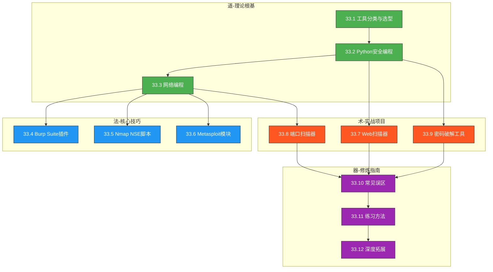

# 第33章 安全工具开发 — 本章小结

本章用12节篇幅，从"安全工具开发有什么用"讲到"用AI辅助开发前沿工具"，覆盖了道（理论基础）、法（核心技巧）、术（实战案例）、器（练习与拓展）四个层次。作为全章的收官，本节将散落在各节中的核心认知重新组织为一张完整的知识地图，帮助你把碎片化的知识点串成可以长期使用的思维框架。

---

## 一、本章核心认知：一张知识地图

安全工具开发不是一个孤立的技能点，而是一个以**协议理解**为根基、以**漏洞认知**为驱动、以**工程能力**为保障的系统性能力。全章12节内容可以浓缩为三句话：

1. **知道数据怎么流动**（33.1-33.3 理论基础）——理解TCP/IP、HTTP/HTTPS、SSL/TLS等协议的工作机制，是写出正确工具代码的前提。
2. **知道漏洞怎么产生**（33.4-33.6 核心技巧）——深入Burp Suite、Nmap、Metasploit的扩展API，你才能在现有框架上构建针对特定场景的检测能力。
3. **知道工具怎么落地**（33.7-33.9 实战案例）——从零实现Web扫描器、端口扫描器、密码破解工具，把前两步的知识转化为可执行的代码。

下面用一张表把12节的核心知识点和它们之间的逻辑关系列清楚：

| 层次 | 节号 | 核心内容 | 关键产出 | 前置依赖 |
|------|------|----------|----------|----------|
| **道** | 33.1 | 安全工具分类、开发原则、语言选型决策树 | 能为具体场景选择正确的工具类型和语言 | 无 |
| | 33.2 | Python核心安全库（requests/scapy/aiohttp）、安全编码实践、异常处理 | 能写出健壮的网络请求和数据解析代码 | 33.1 |
| | 33.3 | TCP/IP协议栈、Socket编程、HTTP/HTTPS处理、异步IO | 能从底层Socket构建网络通信模块 | 33.2 |
| **法** | 33.4 | Burp Suite扩展API、自定义扫描检查、被动/主动检测 | 能为Burp Suite编写自定义扫描插件 | 33.2 |
| | 33.5 | Lua语言基础、NSE脚本结构、规则引擎 | 能编写Nmap NSE脚本实现自定义探测 | 33.1 |
| | 33.6 | Metasploit模块架构、Payload编写、Ruby开发 | 能编写exploit和auxiliary模块 | 33.1 |
| **术** | 33.7 | Web漏洞扫描器：爬虫→检测引擎→报告系统 | 独立完成一个完整的Web扫描器项目 | 33.2-33.4 |
| | 33.8 | 端口扫描器：SYN扫描、并发模型、服务指纹 | 用Python/Go实现高性能端口扫描器 | 33.3 |
| | 33.9 | 密码破解：字典策略、规则引擎、GPU加速 | 开发支持规则变换的密码破解工具 | 33.2 |
| **器** | 33.10 | 常见误区：过度工程、忽视安全、不写测试 | 能识别和避免典型开发陷阱 | 全部 |
| | 33.11 | 练习方法：四阶段学习法、开源代码阅读 | 能制定系统化的学习路径 | 33.10 |
| | 33.12 | AI辅助开发、云原生安全、供应链安全 | 了解前沿趋势和进阶方向 | 33.7-33.9 |



> **读图提示**：箭头方向表示"前置依赖"。例如，要写Web扫描器（33.7），需要先掌握Python安全编程（33.2）和Burp Suite插件开发（33.4）的基础。学习时沿着箭头方向推进，效率最高。

---

## 二、理论基础回顾：从"会用工具"到"理解工具"

### 2.1 安全工具的本质——自动化人类安全思维

33.1节给出了安全工具的五类分类：信息收集工具、漏洞检测工具、渗透测试工具、防御监控工具、辅助工具。但更重要的是理解分类背后的逻辑——**每一类工具都是对人类安全思维的自动化**：

- **信息收集工具**自动化了"侦察"思维——人用浏览器手动翻页面，工具用爬虫批量抓取
- **漏洞检测工具**自动化了"分析"思维——人手动拼SQL注入Payload，工具用规则引擎批量检测
- **渗透测试工具**自动化了"利用"思维——人手动构造exploit，工具用Payload生成器自动适配
- **防御监控工具**自动化了"监控"思维——人手动查日志，工具用告警规则实时发现异常

理解这一点，你就知道为什么要先学理论再学工具——工具只是思维的载体，思维才是核心竞争力。

### 2.2 Python安全编程的三个关键

33.2节覆盖了requests、scapy、aiohttp等核心库。回顾时重点关注三个关键点：

**关键一：请求库的选择不是随意的**

| 场景 | 推荐库 | 理由 |
|------|--------|------|
| 简单HTTP请求 | requests | API最简洁，社区最成熟 |
| 需要控制底层包 | scapy | 可以构造任意协议的数据包 |
| 高并发请求 | aiohttp | 异步IO，单线程处理数千连接 |
| WebSocket测试 | websockets | 专门处理WebSocket协议 |
| HTTP/2支持 | httpx | 原生HTTP/2，兼容requests API |

**关键二：安全编码不是"可选的锦上添花"**

安全工具本身的漏洞比普通软件更危险——如果一个漏洞扫描器自己存在命令注入漏洞，攻击者可以利用它反向控制安全团队的基础设施。33.2节强调的输入验证、最小权限、安全存储，不是"最佳实践"，而是底线要求。

**关键三：异常处理决定工具的可用性**

在真实渗透测试中，网络不稳定、目标超时、服务不可达是常态。一个不会崩溃、能优雅降级的工具，比一个功能更多但动不动就crash的工具实用得多。33.2节中的`safe_request`模式——捕获异常、记录日志、返回安全默认值——是每个网络工具都应具备的基础能力。

### 2.3 网络编程的层次模型

33.3节从TCP/IP协议栈讲到Socket编程再到HTTP处理，覆盖了网络编程的完整层次。理解这些层次之间的关系，是编写网络工具的基础：

```text
应用层  HTTP/HTTPS/DNS/SMTP    ← 33.3 HTTP处理部分
传输层  TCP/UDP                 ← 33.3 Socket编程部分
网络层  IP/ICMP                 ← 33.3 协议栈概述
链路层  Ethernet/WiFi           ← scapy可操作
```

一个实用的认知是：**大多数安全工具工作在不同层次**。端口扫描器工作在传输层（TCP连接），Web扫描器工作在应用层（HTTP请求），而像scapy这样的工具可以直接操作到链路层（构造以太网帧）。知道你要操作的层次，就知道该用什么库和什么方法。

---

## 三、核心技巧回顾：三大框架的扩展开发

### 3.1 三大框架的定位差异

33.4-33.6节分别介绍了Burp Suite、Nmap、Metasploit的扩展开发。它们的定位和适用场景完全不同：

| 框架 | 核心定位 | 扩展语言 | 典型扩展场景 | 开发门槛 |
|------|----------|----------|-------------|----------|
| Burp Suite | Web应用安全测试平台 | Java / Jython(Python) | 自定义扫描检查、被动检测、自动化工作流 | 中等 |
| Nmap | 网络发现和端口扫描 | Lua | 自定义探测脚本、服务识别、漏洞检测 | 较低 |
| Metasploit | 渗透测试框架 | Ruby | exploit模块、辅助模块、后渗透模块 | 较高 |

选择哪个框架的扩展开发，取决于你的工作场景：
- 如果你主要做**Web渗透测试**，优先学Burp Suite扩展
- 如果你主要做**内网渗透和资产发现**，优先学Nmap NSE脚本
- 如果你主要做**漏洞利用和红队行动**，优先学Metasploit模块

### 3.2 扩展开发的共性原则

尽管三个框架的技术栈不同，但扩展开发有一些共性原则：

**原则一：理解宿主框架的数据流**

在编写任何框架的扩展之前，先搞清楚数据在框架内部如何流动。例如：
- Burp Suite：请求从浏览器→Proxy→你的Extension→Target
- Nmap：扫描结果从引擎→Script→你的回调函数→输出
- Metasploit：从用户参数→Module→Framework→目标→结果返回

不理解数据流就盲目写代码，是初学者最常见的错误。

**原则二：从被动检测开始，再做主动检测**

被动检测（分析已有数据）比主动检测（发送新请求）更安全、更容易调试。建议的开发顺序是：
1. 先写一个日志/分析类的扩展，验证你理解了框架API
2. 再写一个被动检测类的扩展，处理已有请求和响应
3. 最后写主动检测/攻击类的扩展，这类扩展影响最大、需要最严格的测试

**原则三：复用框架已有的基础设施**

不要重复造轮子。Burp Suite已经有成熟的HTTP请求/响应处理、证书管理、会话管理；Nmap已经有端口扫描、服务识别、NSE库函数；Metasploit已经有Payload生成、目标管理、会话管理。在这些基础设施之上构建你的逻辑，而不是从零实现底层功能。

---

## 四、实战案例回顾：三个完整项目的核心收获

33.7-33.9节是本章的核心输出——三个完整的安全工具开发实战。回顾时不要只看功能实现，更要提炼每个项目背后的工程智慧。

### 4.1 Web漏洞扫描器（33.7）——模块化架构的典范

Web扫描器是安全工具中最复杂的类型之一，因为它需要同时处理：网络请求、HTML解析、漏洞检测、结果管理、报告生成。33.7节通过这个项目展示了**模块化架构**的核心思想：

```text
┌─────────────────────────────────────────┐
│              主控制器                     │
│  接收参数 → 协调模块 → 汇总结果          │
└──────────┬──────────┬──────────┬────────┘
           │          │          │
    ┌──────▼──┐  ┌────▼────┐  ┌─▼──────────┐
    │ 爬虫模块 │  │检测模块  │  │ 报告模块   │
    │ URL发现  │  │漏洞验证  │  │ HTML/JSON  │
    │ 链接提取 │  │PoC生成   │  │ PDF导出    │
    └─────────┘  └─────────┘  └────────────┘
```

**核心收获**：
- 爬虫的去重策略（URL标准化、visited集合）决定了扫描器的效率
- 检测模块的可插拔设计（规则配置文件 + 插件接口）决定了工具的可扩展性
- 并发控制（线程池/信号量）决定了工具对目标的友好程度

### 4.2 端口扫描器（33.8）——并发模型选择的实战

端口扫描器看起来简单，但并发模型的选择直接影响扫描速度和结果准确性。33.8节通过这个项目展示了不同并发模型的权衡：

| 并发模型 | 实现方式 | 适用场景 | 优势 | 劣势 |
|----------|----------|----------|------|------|
| 多线程 | threading.Thread | 少量目标、简单扫描 | 实现简单 | GIL限制、线程开销 |
| 线程池 | concurrent.futures | 中等规模扫描 | 控制并发数 | 仍有GIL限制 |
| 异步IO | asyncio + aiohttp | 大量目标、HTTP扫描 | 架构最轻 | 需要异步编程基础 |
| 多进程 | multiprocessing | CPU密集型任务 | 绕过GIL | 进程开销大 |
| 协程池 | asyncio + 信号量 | 超大规模并发 | 最灵活 | 实现复杂度最高 |

**核心收获**：对于端口扫描器这种I/O密集型任务，asyncio + 信号量控制并发数是当前最佳实践。但要注意TCP半开扫描（SYN扫描）需要root权限，且在Windows上无法直接实现。

### 4.3 密码破解工具（33.9）——规则引擎的设计

密码破解工具的核心不是"暴力穷举"，而是**规则引擎**——通过有限的字典和智能的变换规则，覆盖无限的密码空间。33.9节通过这个项目展示了规则引擎的设计模式：

```python
# 规则引擎的核心模式：规则链
class RuleEngine:
    """每条规则是一个变换函数，多条规则串联执行"""
    def __init__(self):
        self.rules = []
    
    def add_rule(self, rule_func):
        self.rules.append(rule_func)
        return self  # 支持链式调用
    
    def transform(self, word):
        """对输入单词依次应用所有规则"""
        results = {word}
        for rule in self.rules:
            new_results = set()
            for w in results:
                new_results.update(rule(w))
            results = new_results
        return results

# 使用示例
engine = RuleEngine()
engine.add_rule(lambda w: [w.capitalize()])       # 首字母大写
engine.add_rule(lambda w: [w + "123"])             # 追加数字
engine.add_rule(lambda w: [w.replace("a", "@")])   # 字符替换
# "password" → {"Password", "password123", "p@ssword", ...}
```

**核心收获**：
- 规则引擎比暴力穷举效率高几个数量级——一个100万字典 + 50条规则可以生成5000万候选密码
- 分布式破解需要解决任务分配和去重两个问题
- GPU加速（通过hashcat的oclHashcat模式）可以把破解速度提升100-1000倍

---

## 五、误区反思：不要重复前人的错误

33.10节列出了安全工具开发中的常见误区。这里不重复列举，而是把最重要的三个误区做深度展开，因为这三个错误几乎每个初学者都会犯：

### 误区一：过度追求功能全面，忽视核心功能的健壮性

**典型表现**：一个端口扫描器同时支持SYN扫描、TCP扫描、UDP扫描、服务识别、漏洞检测、报告生成……每个功能都写了，但每个都只能处理正常情况，一遇到异常就崩溃。

**正确做法**：先做好一个核心功能。例如，先实现"只做TCP全连接扫描 + 并发控制 + 超时处理 + 日志记录"，确保这个核心功能在任何网络环境下都不会崩溃，然后再逐步添加其他功能。33.7节的Web扫描器也是遵循这个原则——先确保爬虫和检测引擎的稳定性，再添加报告和可视化。

### 误区二：工具本身存在安全漏洞

**典型表现**：开发了一个SQL注入检测器，但自己的命令行参数解析存在命令注入漏洞——用户输入`target=127.0.0.1; rm -rf /`时直接拼接到shell命令中执行。

**正确做法**：所有用户输入都必须经过验证和转义。具体来说：
- 命令行参数：使用`argparse`解析，不要用`sys.argv`直接拼接
- 网络输入：对URL、IP地址做格式验证，使用`ipaddress`模块解析
- 文件路径：使用`os.path`处理，不要字符串拼接
- 数据库查询：使用参数化查询，不要字符串拼接SQL

### 误区三：不做测试，发布后才发现核心逻辑有bug

**典型表现**：端口扫描器在本地测试正常，部署到真实环境后发现——对同一目标的重复扫描会耗尽系统文件描述符、超时配置无效导致扫描挂起、结果文件在并发写入时损坏。

**正确做法**：安全工具的测试比普通软件更重要，因为工具的bug直接导致错误的安全评估结论。33.11节建议的测试策略：

| 测试类型 | 测试内容 | 工具/方法 |
|----------|----------|-----------|
| 单元测试 | 每个函数的输入输出 | pytest + mock |
| 集成测试 | 模块间协作 | docker-compose靶机 |
| 对抗测试 | 用已知漏洞目标验证检测准确率 | DVWA、WebGoat |
| 压力测试 | 大规模目标下的资源消耗 | locust、自定义脚本 |
| 异常测试 | 网络超时、连接拒绝、数据损坏 | tc模拟网络异常 |

---

## 六、技能矩阵：你现在在哪里，要去哪里

### 6.1 编程技能的分级要求

不同级别的安全工具开发者，对编程技能的要求差异很大：

| 技能 | 初级（0-1年） | 中级（1-3年） | 高级（3年+） |
|------|---------------|---------------|-------------|
| **Python** | 基础语法、文件操作、requests库 | 异步编程（asyncio）、scapy包构造、多线程/多进程 | 框架设计（插件架构）、性能优化（C扩展）、CI/CD集成 |
| **JavaScript** | 基础DOM操作、浏览器控制台 | Node.js脚本、浏览器扩展基础 | 完整浏览器扩展、Chrome DevTools协议 |
| **Ruby** | 基础语法 | Metasploit模块结构、Rex库使用 | 自定义Meterpreter扩展、高级Payload |
| **Lua** | 基础语法（Nmap NSE入门足够） | NSE库函数、规则引擎 | 复杂的多阶段扫描脚本 |
| **Java** | 基础语法 | Burp Suite Montoya API | 完整的Burp Suite扩展产品 |
| **Go** | 基础语法、goroutine | 高并发网络工具、交叉编译 | 生产级扫描器框架 |

### 6.2 安全知识的分级要求

| 领域 | 初级 | 中级 | 高级 |
|------|------|------|------|
| **Web安全** | OWASP Top 10基本原理 | 手动漏洞挖掘、WAF绕过 | 0day挖掘、自动化利用链构建 |
| **网络安全** | 端口扫描、服务识别 | 协议分析、流量嗅探 | 协议级漏洞挖掘、中间人攻击 |
| **系统安全** | 基本的权限管理 | 本地提权、横向移动 | 内核漏洞利用、持久化技术 |
| **密码学** | 哈希函数、对称加密 | 非对称加密、数字签名 | 密码协议分析、侧信道攻击 |

---

## 七、进阶方向：选择你的赛道

33.12节介绍了AI安全、区块链安全、隐私保护等前沿方向。这里帮你做选择决策——不是每个方向都值得投入，关键看你已有的积累和目标：

### 7.1 五大进阶赛道对比

| 赛道 | 核心技能要求 | 市场需求 | 学习难度 | 建议前置积累 |
|------|-------------|----------|----------|-------------|
| **Web安全研究** | HTTP协议深度理解、浏览器原理、自动化脚本 | 极高（Bug Bounty、企业渗透测试） | ★★★☆☆ | 33.7的Web扫描器经验 |
| **二进制安全** | 汇编语言、调试器使用、漏洞利用构造 | 高（漏洞挖掘、红队） | ★★★★★ | C/C++基础、操作系统原理 |
| **移动安全** | Android/iOS逆向、App安全测试 | 高（移动互联网安全） | ★★★★☆ | Java/Kotlin/Swift基础 |
| **云安全** | 容器安全、K8s安全、云配置审计 | 极高（云原生转型） | ★★★☆☆ | Docker/K8s基础、33.12的云原生安全 |
| **AI+安全** | 机器学习、NLP、数据科学 | 增长中（智能安全运营） | ★★★★☆ | Python数据科学栈、ML基础 |

### 7.2 推荐的进阶路径

如果你刚完成本章的学习，建议按以下路径进阶：

**路径一：Web安全专精**（最快变现）
1. 深入OWASP Top 10，每个漏洞类型都能手动复现
2. 参与Bug Bounty项目（HackerOne、漏洞盒子），积累真实漏洞经验
3. 开发一个针对特定CMS（如WordPress、Drupal）的专用扫描器
4. 将工具开源，建立个人技术品牌

**路径二：红队全栈**（最有挑战）
1. 学习Metasploit高级模块开发和自定义Payload
2. 掌握C2框架（Cobalt Strike、Sliver）的使用和扩展
3. 学习内网渗透的完整攻击链（侦察→初始访问→提权→横向移动→数据获取）
4. 在红队演练中积累实战经验

**路径三：安全平台建设**（最有前景）
1. 学习云安全基础（AWS/GCP/Azure安全服务）
2. 掌握容器安全（镜像扫描、运行时防护、网络策略）
3. 开发统一的安全运营平台（日志聚合→告警→响应）
4. 进入企业安全团队或安全产品公司

---

## 八、行动指南：今天就开始

### 8.1 立即行动清单（本周内完成）

| 序号 | 行动 | 预计用时 | 验证标准 |
|------|------|----------|----------|
| 1 | 搭建Python虚拟环境，安装本章所有依赖库 | 30分钟 | `pip list`显示所有库已安装 |
| 2 | 启动Docker靶机环境（DVWA + WebGoat） | 15分钟 | `curl http://localhost:8080`返回DVWA页面 |
| 3 | 复现33.8节的端口扫描器，跑通基本功能 | 2小时 | 能正确扫描`127.0.0.1`的常见端口 |
| 4 | 为端口扫描器添加并发功能和超时处理 | 1小时 | 1000个端口的扫描在30秒内完成 |
| 5 | 阅读一个开源工具的源码（推荐dirsearch） | 2小时 | 能画出工具的模块结构图 |

### 8.2 短期目标（一个月内完成）

1. **完成第一个完整项目**：从零实现一个简单但完整的安全工具（端口扫描器或子域名枚举器），包含CLI参数、并发控制、日志记录、错误处理、基本测试
2. **参与一次CTF比赛**：在比赛中刻意使用自己开发的工具，体验"工具不够用"的场景，激发新的开发需求
3. **阅读两个开源工具源码**：推荐从`subfinder`（Go，简洁）和`sqlmap`（Python，功能丰富）开始
4. **发布第一个开源工具到GitHub**：即使功能很简单，也要经历README编写、LICENSE选择、代码整理的完整流程

### 8.3 中期目标（三到六个月内完成）

1. **精通一个框架的扩展开发**：根据你的工作方向选择Burp Suite/Nmap/Metasploit之一，做到能独立开发生产级扩展
2. **完成一个有实际使用价值的工具**：解决你自己或团队遇到的真实问题，不是练习项目而是真正有人在用的工具
3. **参与一个开源安全项目**：不只是fork和star，而是提交PR、修复issue、参与讨论
4. **建立技术博客或社交媒体存在**：写3-5篇安全工具开发的技术文章，分享你的开发经验和踩坑记录

---

## 九、关键原则：带走这五条

经过12节内容的学习，如果只能记住五条原则，请记住这五条：

1. **先让它能工作，再让它工作得好**。MVP（最小可行产品）思维不是偷懒，而是工程智慧。先验证核心逻辑正确，再优化性能和用户体验。33.7节的Web扫描器也是先实现基本的爬虫+检测，再逐步添加并发、报告、可视化等功能。

2. **安全工具自身必须安全**。输入验证、最小权限、安全存储不是"最佳实践"的选修课，而是生死攸关的必修课。一个有漏洞的安全工具比没有工具更危险。

3. **测试不是可选项，而是必须项**。安全工具的bug会导致错误的安全评估结论——漏报意味着漏洞未被发现，误报意味着浪费安全团队的时间。单元测试+集成测试+对抗测试，三者缺一不可。

4. **理解原理比会用工具更重要**。会用Nmap的`-sV`参数检测服务版本，不如理解服务指纹识别的原理；会用SQLMap检测SQL注入，不如理解不同数据库的语法差异。原理理解让你在新场景下也能构建工具。

5. **参与开源是最快的进阶路径**。阅读优秀工具的源码能学到教科书上没有的工程智慧；向开源项目贡献代码能获得资深开发者的反馈；发布自己的开源工具能建立技术影响力。33.11节的"四阶段学习法"的最终阶段就是开源。

---

## 十、常见问题深度解答

### Q1：应该先学安全还是先学编程？

**答**：建议同步进行，但侧重点随阶段变化。初期（前3个月）以编程为主——掌握Python基础语法、文件操作、网络请求，能写出基本的脚本。同时穿插安全知识的学习——了解HTTP协议、常见漏洞类型、OWASP Top 10。进入中期后（3-6个月），重心转向安全——在安全场景中深化编程技能。到了后期（6个月以上），编程和安全已经融为一体，你不再会区分"这是编程知识"还是"这是安全知识"。

这种"螺旋式上升"的学习方式，比"先花半年学完所有编程再学安全"效率高得多。因为在安全场景中学到的编程技能，记忆更深刻、理解更透彻。

### Q2：Python、Go、Rust——安全工具开发应该选哪个？

**答**：这个问题没有唯一正确答案，但有一个清晰的决策框架：

- **Python**：开发速度最快，库最丰富，是安全工具开发的首选语言。如果你只学一门语言，选Python。33.7-33.9节的三个实战项目全部使用Python，正是因为Python在安全工具领域的统治地位。
- **Go**：编译为单一二进制文件，部署简单；并发模型（goroutine）性能优秀。适合需要高性能、跨平台分发的工具，如端口扫描器、子域名枚举器。nuclei、subfinder、httpx等新一代安全工具都选择了Go。
- **Rust**：内存安全+高性能，适合对可靠性和性能要求极高的场景。RustScan（端口扫描器）、Feroxbuster（目录爆破）是代表作。但学习曲线最陡峭，建议有一定C/C++基础后再学。

**实际建议**：先精通Python，再根据需求学Go或Rust。很多优秀的安全工具团队是Python+Go混合使用——Python做原型验证和胶水层，Go做核心引擎和高性能模块。

### Q3：如何在合法范围内练习安全工具开发？

**答**：安全工具开发的法律边界很清晰，但具体操作时需要格外注意：

**完全合法的练习环境**：
- 自己搭建的Docker靶机（DVWA、WebGoat、Metasploitable）
- 本地虚拟机（VulnHub下载的靶机）
- 在线靶场（HackTheBox、TryHackMe、Pikachu）
- 自己拥有所有权的服务器和域名

**需要授权的场景**：
- 扫描公司内部系统——需要IT部门书面授权
- 参与渗透测试项目——需要客户签署授权书
- 参与CTF比赛——比赛规则即授权

**绝对不能做的**：
- 未经授权扫描互联网上的服务器
- 使用开发的工具攻击他人系统
- 扫描政府、金融等关键基础设施
- 将漏洞信息用于非授权用途

**底线**：《中华人民共和国网络安全法》第27条明确规定，禁止未经授权侵入他人网络。在自己控制的环境中练习，在获得授权的项目中使用，这是安全工具开发者的铁律。

### Q4：如何评估自己的技术水平？

**答**：可以通过以下维度进行自我评估：

| 维度 | 初级标准 | 中级标准 | 高级标准 |
|------|----------|----------|----------|
| **工具开发** | 能复现教程中的代码 | 能独立从零开发简单工具 | 能设计并实现企业级安全平台 |
| **漏洞理解** | 知道OWASP Top 10是什么 | 能手动挖掘和利用常见漏洞 | 能发现0day或设计新的检测方法 |
| **代码质量** | 代码能跑就行 | 有错误处理、日志、基本测试 | CI/CD、代码审查、性能优化 |
| **框架扩展** | 能看懂现有扩展的代码 | 能编写简单的自定义扩展 | 能开发生产级的框架扩展 |
| **开源贡献** | 能阅读开源项目源码 | 能提交PR修复bug | 能独立维护一个开源安全工具 |

一个实用的自测方法：打开HackerOne或漏洞盒子的公开漏洞报告，随机选5个，看你能理解多少、能复现多少。如果能理解80%以上并复现60%以上，说明你已经具备中级水平。

### Q5：安全工具开发的职业前景如何？

**答**：安全工具开发是网络安全领域中需求增长最快的细分方向之一。原因很简单——随着企业数字化转型加速，攻击面不断扩大，自动化安全工具的需求只会越来越大。

**主要职业方向和薪资参考**（一线城市，2024年数据）：

| 职位 | 核心工作 | 薪资范围（年薪） | 入门门槛 |
|------|----------|-----------------|----------|
| 安全开发工程师 | 开发和维护安全工具/平台 | 25-50万 | Python+安全基础 |
| 红队工具开发者 | 开发渗透测试工具和自动化攻击脚本 | 35-70万 | 渗透测试经验+工具开发 |
| 安全产品经理 | 定义安全产品的功能和方向 | 30-60万 | 安全经验+产品思维 |
| 安全研究员 | 漏洞研究、攻击技术研究 | 40-80万+ | 深度技术能力+研究成果 |
| 自由职业/创业 | 开源工具商业化、安全咨询 | 无上限 | 综合能力 |

---

## 十一、结语：从"造工具"到"用工具解决问题"

安全工具开发的终极目标不是"造出更多工具"，而是"用工具解决真实的安全问题"。一个好的安全工具开发者，首先是一个好的安全问题分析师——他能准确识别问题的本质，然后判断"应该用现成工具、修改现有工具、还是从零开发"。

记住以下三点：

**第一，工具是手段，不是目的。** 不要为了开发工具而开发工具。如果一个现成的工具能解决你的问题，直接用它，把时间花在更有价值的事情上。只有当现成工具无法满足需求时，才考虑定制开发。

**第二，理解原理比会用工具更重要。** 会用Nmap扫端口的人很多，但理解TCP三次握手、知道SYN扫描为什么比全连接扫描快、明白为什么某些端口会被防火墙过滤的人很少。原理理解让你在面对新场景时也能构建工具，而不仅仅是搜索"有没有现成的工具"。

**第三，持续学习是唯一不变的策略。** 安全领域变化极快——新的漏洞类型、新的攻击技术、新的防御手段层出不穷。本章介绍的Python安全编程、三大框架扩展开发、三个实战项目，都是当下最有实用价值的知识。但五年后，可能新的框架会取代它们，新的语言会成为主流。保持好奇心，保持学习的习惯，比掌握任何一个具体工具都更重要。

从今天开始，选择一个项目，动手实践。无论是33.8节的端口扫描器，还是33.7节的Web扫描器，甚至是33.9节的密码破解工具——选一个，把它做出来。过程中遇到的问题，就是你最好的学习材料。

**安全之路，工具先行。愿你在安全工具开发的道路上不断进步，为网络安全事业贡献力量！**

---

*本章参考资源*

| 类别 | 资源名称 | 用途 |
|------|----------|------|
| 书籍 | 《Python黑帽子》（Black Hat Python） | Python安全编程实战 |
| 书籍 | 《Black Hat Go》 | Go语言安全工具开发 |
| 书籍 | 《Rust for Rustaceans》 | Rust高级编程 |
| 开源项目 | nuclei（GitHub Stars 18k+） | 模板化扫描引擎架构 |
| 开源项目 | sqlmap（GitHub Stars 30k+） | SQL注入检测深度实现 |
| 开源项目 | Metasploit（GitHub Stars 33k+） | 模块化安全框架 |
| 靶场 | HackTheBox | 安全工具练习环境 |
| 靶场 | VulnHub | 漏洞虚拟机下载 |
| 社区 | OWASP Tool Projects | 安全工具开发社区 |
| 社区 | HackerOne Hacktivity | 公开漏洞报告学习 |

***

*作者：Silas 的 AI 助手*
