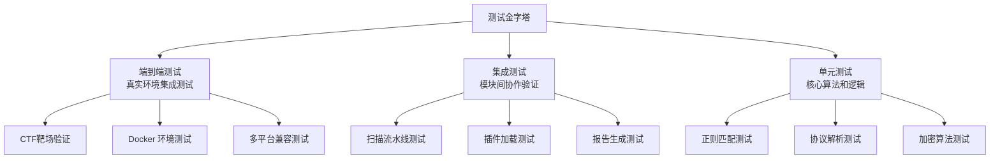
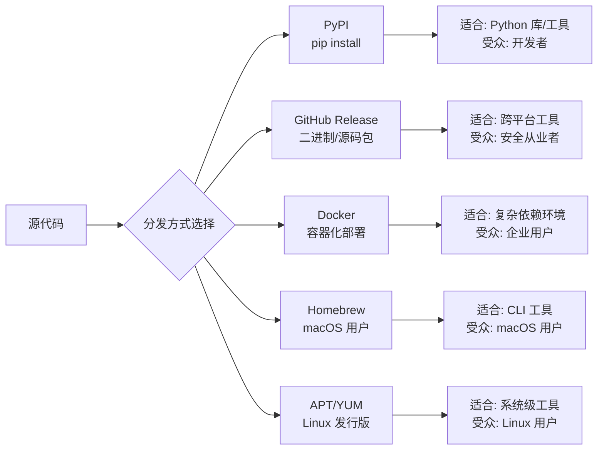
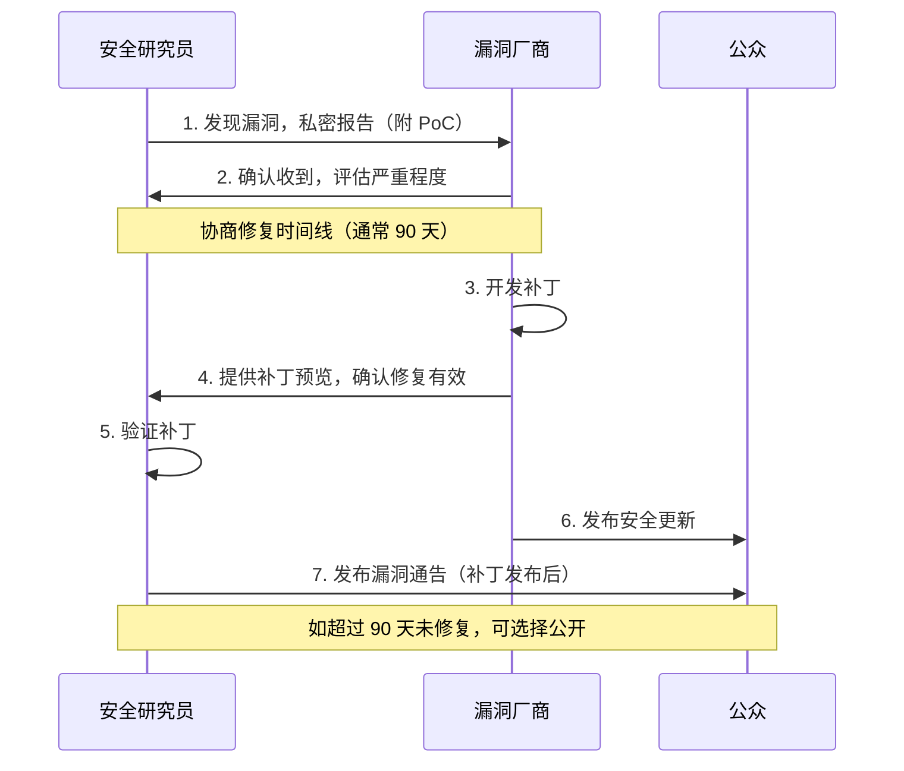
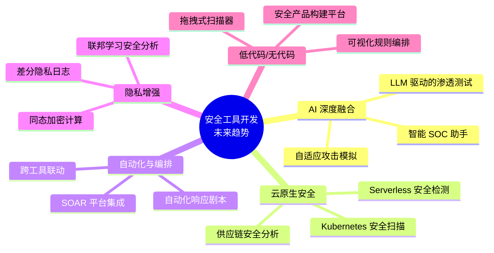

# 深度拓展：安全工具开发进阶与前沿

本节面向已完成基础学习的读者，从架构设计、性能工程、测试体系、发布运维到前沿趋势，对安全工具开发进行纵深挖掘。每个主题都附带可运行的代码示例和经过验证的工程实践。

---

## 一、高级架构设计模式

基础章节介绍了模块化设计的四层结构（输入→引擎→输出→配置）。在真实的安全工具开发中，还需要掌握更复杂的架构模式来应对规模化、可扩展性和团队协作的需求。

### 1.1 流水线架构（Pipeline Pattern）

流水线将数据处理拆分为多个独立阶段，每个阶段只做一件事。这种模式在端口扫描器、日志分析器、流量嗅探器中极为常见。

```python
from abc import ABC, abstractmethod
from typing import Any, Generator
import time
import logging

logger = logging.getLogger(__name__)

class PipelineStage(ABC):
    """流水线阶段基类"""

    @abstractmethod
    def process(self, item: Any) -> Generator[Any, None, None]:
        """处理单个数据项，可产出 0 或多个结果"""
        ...

class PortProbeStage(PipelineStage):
    """端口探测阶段：对目标IP:端口发起TCP连接"""
    def __init__(self, timeout: float = 2.0):
        self.timeout = timeout

    def process(self, item: dict) -> Generator[dict, None, None]:
        import socket
        ip, port = item['ip'], item['port']
        try:
            sock = socket.socket(socket.AF_INET, socket.SOCK_STREAM)
            sock.settimeout(self.timeout)
            start = time.monotonic()
            result = sock.connect_ex((ip, port))
            elapsed = time.monotonic() - start
            sock.close()
            if result == 0:
                item['latency_ms'] = round(elapsed * 1000, 2)
                item['state'] = 'open'
                yield item
        except (socket.timeout, OSError):
            pass  # 静默丢弃，不阻塞流水线

class ServiceFingerprintStage(PipelineStage):
    """服务指纹阶段：对开放端口发送探测包并匹配 Banner"""
    PROBES = {
        80: b"HEAD / HTTP/1.0\r\n\r\n",
        443: b"HEAD / HTTP/1.0\r\n\r\n",
        22: b"SSH-2.0-",
        21: b"220 ",
    }
    BANNER_SIZE = 1024

    def process(self, item: dict) -> Generator[dict, None, None]:
        import socket
        ip, port = item['ip'], item['port']
        probe = self.PROBES.get(port)
        if not probe:
            item['service'] = 'unknown'
            yield item
            return
        try:
            sock = socket.socket(socket.AF_INET, socket.SOCK_STREAM)
            sock.settimeout(3.0)
            sock.connect((ip, port))
            sock.send(probe)
            banner = sock.recv(self.BANNER_SIZE).decode('utf-8', errors='replace')
            sock.close()
            item['banner'] = banner.strip()
            item['service'] = self._identify_service(banner, port)
            yield item
        except (socket.timeout, OSError):
            item['service'] = 'filtered'
            yield item

    @staticmethod
    def _identify_service(banner: str, port: int) -> str:
        mapping = {
            'SSH': 'ssh', 'HTTP': 'http', 'Apache': 'http',
            'nginx': 'http', 'Microsoft IIS': 'http',
            'ProFTPD': 'ftp', 'vsftpd': 'ftp',
            'OpenSSH': 'ssh',
        }
        for keyword, service in mapping.items():
            if keyword.lower() in banner.lower():
                return service
        return f'port-{port}'

class Pipeline:
    """流水线引擎：将多个阶段串联执行"""

    def __init__(self):
        self.stages: list[PipelineStage] = []

    def add_stage(self, stage: PipelineStage) -> 'Pipeline':
        self.stages.append(stage)
        return self  # 支持链式调用

    def run(self, source: Generator) -> list:
        """执行流水线，source 是初始数据生成器"""
        current_items = list(source)
        for stage in self.stages:
            next_items = []
            for item in current_items:
                next_items.extend(stage.process(item))
            current_items = next_items
            logger.info(f"Stage {stage.__class__.__name__}: "
                       f"{len(current_items)} items remaining")
        return current_items

# 使用示例
def target_generator():
    """生成待扫描的目标"""
    targets = [
        {'ip': '192.168.1.1', 'port': 22},
        {'ip': '192.168.1.1', 'port': 80},
        {'ip': '192.168.1.1', 'port': 443},
        {'ip': '192.168.1.1', 'port': 3306},
    ]
    for t in targets:
        yield t

scanner = (Pipeline()
    .add_stage(PortProbeStage(timeout=2.0))
    .add_stage(ServiceFingerprintStage()))

results = scanner.run(target_generator())
for r in results:
    print(f"{r['ip']}:{r['port']} -> {r['service']} "
          f"(latency: {r.get('latency_ms', 'N/A')}ms)")
```

**流水线设计的关键原则：**

| 原则 | 说明 | 反面案例 |
|------|------|----------|
| 单一职责 | 每个阶段只做一件事 | 一个函数里既扫描又识别服务 |
| 零耦合 | 阶段间通过数据字典传递，不共享状态 | 前一个阶段修改全局变量影响后续阶段 |
| 幂等性 | 同一输入产出相同输出，可安全重试 | 每次运行计数器累加导致不同结果 |
| 背压控制 | 下游处理慢时限制上游产出速率 | 上游疯狂生产导致内存爆炸 |

### 1.2 事件驱动架构（Event-Driven）

适用于需要实时响应的工具，如入侵检测系统、流量监控、蜜罐系统。

```python
import asyncio
from dataclasses import dataclass, field
from datetime import datetime
from typing import Callable, Awaitable
from collections import defaultdict

@dataclass
class SecurityEvent:
    """安全事件数据结构"""
    event_type: str        # 'port_scan', 'brute_force', 'sql_injection' ...
    source_ip: str
    target_ip: str
    target_port: int = 0
    payload: dict = field(default_factory=dict)
    timestamp: datetime = field(default_factory=datetime.now)

    def __post_init__(self):
        if not self.timestamp.tzinfo:
            self.timestamp = datetime.now()

class EventBus:
    """异步事件总线：解耦事件生产者和消费者"""

    def __init__(self):
        self._handlers: dict[str, list[Callable]] = defaultdict(list)
        self._event_log: list[SecurityEvent] = []

    def subscribe(self, event_type: str,
                  handler: Callable[[SecurityEvent], Awaitable[None]]):
        """注册事件处理器"""
        self._handlers[event_type].append(handler)

    def subscribe_all(self, handler: Callable[[SecurityEvent], Awaitable[None]]):
        """注册全局处理器（监听所有事件）"""
        self._handlers['*'].append(handler)

    async def emit(self, event: SecurityEvent):
        """触发事件，异步通知所有订阅者"""
        self._event_log.append(event)
        handlers = self._handlers.get(event.event_type, [])
        handlers += self._handlers.get('*', [])
        tasks = [handler(event) for handler in handlers]
        if tasks:
            await asyncio.gather(*tasks, return_exceptions=True)

class PortScanDetector:
    """端口扫描检测器：在短时间内检测到大量端口访问即报警"""

    def __init__(self, threshold: int = 20, window_sec: int = 10):
        self.threshold = threshold
        self.window_sec = window_sec
        self._access_log: dict[str, list[datetime]] = defaultdict(list)

    async def on_connection(self, event: SecurityEvent):
        src = event.source_ip
        now = event.timestamp
        self._access_log[src].append(now)
        # 清理过期记录
        cutoff = now.timestamp() - self.window_sec
        self._access_log[src] = [
            t for t in self._access_log[src] if t.timestamp() > cutoff
        ]
        if len(self._access_log[src]) >= self.threshold:
            print(f"[ALERT] 端口扫描检测: {src} 在 {self.window_sec}s 内"
                  f"访问了 {len(self._access_log[src])} 个端口")
            # 这里可以触发自动封禁、告警等响应动作

class BruteForceDetector:
    """暴力破解检测器：短时间内大量认证失败即报警"""

    def __init__(self, threshold: int = 5, window_sec: int = 60):
        self.threshold = threshold
        self.window_sec = window_sec
        self._fail_log: dict[str, list[datetime]] = defaultdict(list)

    async def on_auth_failure(self, event: SecurityEvent):
        src = event.source_ip
        now = event.timestamp
        self._fail_log[src].append(now)
        cutoff = now.timestamp() - self.window_sec
        self._fail_log[src] = [
            t for t in self._fail_log[src] if t.timestamp() > cutoff
        ]
        if len(self._fail_log[src]) >= self.threshold:
            print(f"[ALERT] 暴力破解检测: {src} 在 {self.window_sec}s 内"
                  f"认证失败 {len(self._fail_log[src])} 次")

async def main():
    bus = EventBus()
    scan_detector = PortScanDetector(threshold=5, window_sec=3)
    brute_detector = BruteForceDetector(threshold=3, window_sec=10)

    bus.subscribe('connection', scan_detector.on_connection)
    bus.subscribe('auth_failure', brute_detector.on_auth_failure)

    # 模拟流量
    for i in range(10):
        await bus.emit(SecurityEvent(
            event_type='connection',
            source_ip='10.0.0.99',
            target_ip='10.0.0.1',
            target_port=1000 + i,
        ))

asyncio.run(main())
```

### 1.3 插件系统设计

插件系统是安全工具实现可扩展性的核心机制。Nmap（NSE脚本）、Metasploit（模块系统）、Burp Suite（扩展API）、Nuclei（模板）都采用了不同形式的插件架构。

```python
import importlib
import os
import json
from pathlib import Path
from abc import ABC, abstractmethod
from typing import Any

class PluginBase(ABC):
    """插件基类：所有安全工具插件必须继承此类"""
    name: str = "unnamed"
    version: str = "0.1.0"
    description: str = ""

    @abstractmethod
    def execute(self, context: dict) -> dict:
        """
        执行插件逻辑
        context 包含: target, options, session 等共享数据
        返回: 结果字典
        """
        ...

    def validate(self, context: dict) -> bool:
        """预检查：目标是否适合本插件"""
        return True

class PluginManager:
    """插件管理器：加载、发现和执行插件"""

    def __init__(self, plugin_dirs: list[str] = None):
        self.plugins: dict[str, PluginBase] = {}
        self.plugin_dirs = plugin_dirs or []

    def discover(self):
        """从指定目录自动发现插件"""
        for plugin_dir in self.plugin_dirs:
            dir_path = Path(plugin_dir)
            if not dir_path.exists():
                continue
            for py_file in dir_path.glob("*.py"):
                if py_file.name.startswith("_"):
                    continue
                module_name = f"{dir_path.name}.{py_file.stem}"
                try:
                    module = importlib.import_module(module_name)
                    for attr_name in dir(module):
                        attr = getattr(module, attr_name)
                        if (isinstance(attr, type)
                                and issubclass(attr, PluginBase)
                                and attr is not PluginBase):
                            instance = attr()
                            self.plugins[instance.name] = instance
                            print(f"  [+] Loaded plugin: {instance.name} "
                                  f"v{instance.version}")
                except Exception as e:
                    print(f"  [-] Failed to load {py_file}: {e}")

    def load_from_config(self, config_path: str):
        """从 JSON 配置文件加载插件启用列表"""
        with open(config_path) as f:
            config = json.load(f)
        enabled = set(config.get("enabled_plugins", []))
        if enabled:
            self.plugins = {
                k: v for k, v in self.plugins.items() if k in enabled
            }

    def run(self, plugin_name: str, context: dict) -> dict:
        """执行指定插件"""
        if plugin_name not in self.plugins:
            raise ValueError(f"Plugin not found: {plugin_name}")
        plugin = self.plugins[plugin_name]
        if not plugin.validate(context):
            return {"error": f"Validation failed for {plugin_name}"}
        return plugin.execute(context)

    def run_all(self, context: dict) -> dict[str, dict]:
        """顺序执行所有已加载的插件"""
        results = {}
        for name, plugin in self.plugins.items():
            try:
                results[name] = plugin.run(context) if hasattr(plugin, 'run') \
                    else plugin.execute(context)
            except Exception as e:
                results[name] = {"error": str(e)}
        return results

# 示例插件实现
class SSLCheckPlugin(PluginBase):
    name = "ssl_check"
    version = "1.0.0"
    description = "检测目标的 SSL/TLS 配置安全性"

    def validate(self, context: dict) -> bool:
        return context.get("target", "").startswith(("https://", "http://"))

    def execute(self, context: dict) -> dict:
        import ssl
        import socket
        from urllib.parse import urlparse

        target = context["target"]
        hostname = urlparse(target).hostname or target
        port = urlparse(target).port or 443

        ctx = ssl.create_default_context()
        issues = []
        try:
            with socket.create_connection((hostname, port), timeout=5) as sock:
                with ctx.wrap_socket(sock, server_hostname=hostname) as ssock:
                    cert = ssock.getpeercert()
                    protocol = ssock.version()
                    cipher = ssock.cipher()

                    if protocol in ('TLSv1', 'TLSv1.1'):
                        issues.append(f"过时的协议版本: {protocol}")
                    if cipher and cipher[2] < 128:
                        issues.append(f"弱加密套件: {cipher[0]} "
                                     f"(强度 {cipher[2]} 位)")

                    return {
                        "hostname": hostname,
                        "protocol": protocol,
                        "cipher": cipher[0] if cipher else "unknown",
                        "cert_subject": dict(x[0] for x in cert.get('subject', [])),
                        "cert_issuer": dict(x[0] for x in cert.get('issuer', [])),
                        "cert_expiry": cert.get('notAfter', 'unknown'),
                        "issues": issues,
                        "score": "PASS" if not issues else "WARN",
                    }
        except Exception as e:
            return {"hostname": hostname, "error": str(e), "score": "ERROR"}
```

---

## 二、性能工程深度实践

安全工具对性能的要求远超普通应用——端口扫描器需要在数秒内探测 65535 个端口，Web 扫描器需要并发处理数千个 URL，密码破解器需要最大化 GPU/CPU 利用率。

### 2.1 并发模型选择指南

```python
import asyncio
import time
from concurrent.futures import ThreadPoolExecutor, ProcessPoolExecutor

# ===== 场景对比 =====

# 场景 1: I/O 密集型 —— 网络请求
# 推荐: asyncio + aiohttp
async def async_http_scan(urls: list[str]) -> list[dict]:
    """异步并发 HTTP 探测，1000个URL约5-10秒"""
    import aiohttp
    semaphore = asyncio.Semaphore(100)  # 控制并发数，避免目标过载

    async def probe(session, url):
        async with semaphore:
            try:
                async with session.get(url, timeout=aiohttp.ClientTimeout(total=5)) as resp:
                    return {"url": url, "status": resp.status,
                            "length": len(await resp.read())}
            except Exception as e:
                return {"url": url, "error": str(e)}

    async with aiohttp.ClientSession() as session:
        tasks = [probe(session, url) for url in urls]
        return await asyncio.gather(*tasks)

# 场景 2: CPU 密集型 —— 密码哈希计算
# 推荐: multiprocessing（绕过 GIL）
def hash_worker(password: str) -> str:
    """单个密码的哈希计算"""
    import hashlib
    return hashlib.pbkdf2_hmac('sha256', password.encode(),
                               b'salt123', 100000).hex()

def cpu_intensive_crack(target_hash: str, wordlist: list[str]) -> str | None:
    """多进程密码破解，利用所有 CPU 核心"""
    with ProcessPoolExecutor() as executor:
        results = executor.map(hash_worker, wordlist)
        for i, result in enumerate(results):
            if result == target_hash:
                return wordlist[i]
    return None

# 场景 3: 混合型 —— 端口扫描（I/O + 少量计算）
# 推荐: asyncio（Python 3.12+ 性能已超过 threading）
async def async_port_scan(host: str, ports: range,
                          concurrency: int = 500) -> list[int]:
    """异步端口扫描，半开连接方式"""
    import socket
    semaphore = asyncio.Semaphore(concurrency)
    open_ports = []

    async def check(port):
        async with semaphore:
            try:
                _, writer = await asyncio.wait_for(
                    asyncio.open_connection(host, port),
                    timeout=1.5
                )
                open_ports.append(port)
                writer.close()
                await writer.wait_closed()
            except (asyncio.TimeoutError, OSError, ConnectionRefusedError):
                pass

    tasks = [check(p) for p in ports]
    await asyncio.gather(*tasks)
    return sorted(open_ports)

# 场景 4: 任务编排 —— 流量分析
# 推荐: asyncio + queue（生产者-消费者模式）
async def async_traffic_analyzer(pcap_queue: asyncio.Queue):
    """异步流量分析：一个任务读包，多个任务分析"""
    import hashlib

    async def reader(queue):
        """生产者：从队列读取数据包"""
        # 实际场景中从 scapy/dpkt 读取
        for i in range(1000):
            packet = {"id": i, "src": f"10.0.0.{i % 255}",
                      "payload": f"test_payload_{i}".encode()}
            await queue.put(packet)
        await queue.put(None)  # 哨兵值

    async def analyzer(queue, worker_id):
        """消费者：分析数据包"""
        anomalies = []
        while True:
            pkt = await queue.get()
            if pkt is None:
                await queue.put(None)  # 传递哨兵
                break
            # 模拟分析逻辑
            sig = hashlib.md5(pkt['payload']).hexdigest()[:8]
            if sig.startswith('0000'):
                anomalies.append(pkt)
        return anomalies

    queue = asyncio.Queue(maxsize=200)
    producers = [asyncio.create_task(reader(queue))]
    consumers = [asyncio.create_task(analyzer(queue, i))
                 for i in range(4)]

    await asyncio.gather(*producers)
    results = await asyncio.gather(*consumers)
    return [item for batch in results for item in batch]
```

### 2.2 性能基准测试框架

```python
import time
import statistics
from functools import wraps

def benchmark(runs: int = 10):
    """性能基准测试装饰器"""
    def decorator(func):
        @wraps(func)
        def wrapper(*args, **kwargs):
            timings = []
            for _ in range(runs):
                start = time.perf_counter()
                result = func(*args, **kwargs)
                elapsed = time.perf_counter() - start
                timings.append(elapsed)

            stats = {
                "function": func.__name__,
                "runs": runs,
                "mean_ms": statistics.mean(timings) * 1000,
                "median_ms": statistics.median(timings) * 1000,
                "stdev_ms": statistics.stdev(timings) * 1000 if len(timings) > 1 else 0,
                "min_ms": min(timings) * 1000,
                "max_ms": max(timings) * 1000,
                "p95_ms": sorted(timings)[int(len(timings) * 0.95)] * 1000,
            }
            print(f"\n{'=' * 50}")
            print(f"Benchmark: {stats['function']}")
            print(f"  Runs: {stats['runs']}")
            print(f"  Mean:   {stats['mean_ms']:.2f} ms")
            print(f"  Median: {stats['median_ms']:.2f} ms")
            print(f"  P95:    {stats['p95_ms']:.2f} ms")
            print(f"  Stdev:  {stats['stdev_ms']:.2f} ms")
            print(f"  Min:    {stats['min_ms']:.2f} ms")
            print(f"  Max:    {stats['max_ms']:.2f} ms")
            print(f"{'=' * 50}")
            return result
        return wrapper
    return decorator

@benchmark(runs=5)
def scan_ports_sequential(host: str, ports: list[int]) -> list[int]:
    """逐个扫描端口"""
    import socket
    open_ports = []
    for port in ports:
        try:
            sock = socket.socket(socket.AF_INET, socket.SOCK_STREAM)
            sock.settimeout(1)
            if sock.connect_ex((host, port)) == 0:
                open_ports.append(port)
            sock.close()
        except OSError:
            pass
    return open_ports

@benchmark(runs=5)
async def scan_ports_async(host: str, ports: list[int]) -> list[int]:
    """异步并发扫描端口"""
    import asyncio
    semaphore = asyncio.Semaphore(200)
    open_ports = []

    async def check(port):
        async with semaphore:
            try:
                _, w = await asyncio.wait_for(
                    asyncio.open_connection(host, port), timeout=1)
                open_ports.append(port)
                w.close()
                await w.wait_closed()
            except:
                pass

    await asyncio.gather(*[check(p) for p in ports])
    return sorted(open_ports)

# 典型结果对比（扫描 1000 个端口）:
# Sequential: mean=12000ms (逐个等待超时)
# Async:      mean=250ms   (并发 200 路，提速约 48 倍)
```

### 2.3 大数据量处理策略

当需要处理 GB 级别的日志、pcap 文件或扫描结果时，内存管理至关重要：

```python
import mmap
import os
from pathlib import Path

class MmapLogAnalyzer:
    """基于 mmap 的超大日志分析器，处理 GB 级文件不占额外内存"""

    def __init__(self, filepath: str):
        self.filepath = filepath
        self.file_size = os.path.getsize(filepath)

    def count_pattern(self, pattern: bytes) -> int:
        """统计模式出现次数（流式扫描）"""
        count = 0
        with open(self.filepath, 'rb') as f:
            with mmap.mmap(f.fileno(), 0, access=mmap.ACCESS_READ) as mm:
                offset = 0
                while offset < self.file_size:
                    pos = mm.find(pattern, offset)
                    if pos == -1:
                        break
                    count += 1
                    offset = pos + 1
        return count

    def stream_lines(self, chunk_size: int = 8192):
        """逐行流式读取，内存占用恒定"""
        with open(self.filepath, 'r', errors='replace') as f:
            buffer = ""
            while True:
                chunk = f.read(chunk_size)
                if not chunk:
                    if buffer:
                        yield buffer
                    break
                buffer += chunk
                while '\n' in buffer:
                    line, buffer = buffer.split('\n', 1)
                    yield line

class BoundedCache:
    """有界缓存：避免安全扫描器内存泄漏"""
    def __init__(self, max_size: int = 10000):
        from collections import OrderedDict
        self.cache = OrderedDict()
        self.max_size = max_size

    def get(self, key):
        if key in self.cache:
            self.cache.move_to_end(key)
            return self.cache[key]
        return None

    def put(self, key, value):
        if key in self.cache:
            self.cache.move_to_end(key)
        self.cache[key] = value
        if len(self.cache) > self.max_size:
            self.cache.popitem(last=False)  # 移除最旧的

class StreamingResultsWriter:
    """流式结果写入器：避免将所有结果存入内存"""
    def __init__(self, output_path: str):
        self.output_path = output_path
        self._file = None
        self._count = 0

    def __enter__(self):
        self._file = open(self.output_path, 'w')
        self._file.write('[\n')
        return self

    def __exit__(self, *args):
        self._file.write('\n]\n')
        self._file.close()

    def write(self, record: dict):
        import json
        if self._count > 0:
            self._file.write(',\n')
        json.dump(record, self._file, ensure_ascii=False)
        self._count += 1
        # 每 100 条刷新一次，兼顾性能和数据安全
        if self._count % 100 == 0:
            self._file.flush()
```

---

## 三、测试体系

安全工具的测试比普通软件更具挑战性——你需要同时验证工具的**功能性**（是否正确检测漏洞）和**安全性**（工具本身是否存在漏洞）。

### 3.1 测试金字塔



### 3.2 单元测试实战

```python
import pytest

# ===== 端口扫描器单元测试 =====

class TestPortValidator:
    """端口范围验证测试"""

    def test_valid_port(self):
        from port_scanner import validate_port
        assert validate_port(80) is True
        assert validate_port(1) is True
        assert validate_port(65535) is True

    def test_invalid_port(self):
        from port_scanner import validate_port
        assert validate_port(0) is False
        assert validate_port(65536) is False
        assert validate_port(-1) is False

    def test_port_range_parsing(self):
        from port_scanner import parse_port_range
        assert parse_port_range("80") == [80]
        assert parse_port_range("80,443") == [80, 443]
        assert parse_port_range("80-85") == [80, 81, 82, 83, 84, 85]
        assert parse_port_range("80,443,8000-8003") == [80, 443, 8000, 8001, 8002, 8003]

class TestServiceFingerprint:
    """服务指纹识别测试"""

    def test_identify_ssh(self):
        from port_scanner import identify_service
        assert identify_service("SSH-2.0-OpenSSH_8.9p1", 22) == "ssh"

    def test_identify_http(self):
        from port_scanner import identify_service
        assert identify_service("HTTP/1.1 200 OK\r\nServer: nginx", 80) == "http"

    def test_identify_unknown(self):
        from port_scanner import identify_service
        assert identify_service("RANDOM_DATA", 9999) == "unknown"

# ===== 漏洞检测器单元测试 =====

class TestSQLInjectionDetector:
    """SQL注入检测器测试"""

    @pytest.fixture
    def detector(self):
        from vuln_scanner import SQLInjectionDetector
        return SQLInjectionDetector()

    def test_detect_union_injection(self, detector):
        payload = "' UNION SELECT username, password FROM users--"
        assert detector.detect(payload) is True

    def test_detect_time_based(self, detector):
        payload = "' OR SLEEP(5)--"
        assert detector.detect(payload) is True

    def test_detect_boolean_based(self, detector):
        payload = "' AND 1=1--"
        assert detector.detect(payload) is True

    def test_no_false_positive(self, detector):
        normal_input = "Hello World! This is a normal query."
        assert detector.detect(normal_input) is False

    def test_detect_error_based(self, detector):
        payload = "' AND EXTRACTVALUE(1, CONCAT(0x7e, VERSION()))--"
        assert detector.detect(payload) is True

# ===== 异步扫描器测试 =====

class TestAsyncScanner:
    """异步扫描器的 pytest-asyncio 测试"""

    @pytest.mark.asyncio
    async def test_scan_open_port(self):
        """验证能正确检测开放端口"""
        from async_scanner import async_scan_port
        result = await async_scan_port("127.0.0.1", 22, timeout=2.0)
        # 根据环境可能开放或关闭，只验证返回格式
        assert isinstance(result, dict)
        assert 'state' in result

    @pytest.mark.asyncio
    async def test_scan_timeout(self):
        """验证超时处理"""
        from async_scanner import async_scan_port
        # 扫描一个大概率不存在的端口
        result = await async_scan_port("127.0.0.1", 59999, timeout=0.5)
        assert result['state'] in ('closed', 'timeout')
```

### 3.3 安全测试：工具自身的安全性

```python
class TestToolSecurity:
    """确保安全工具本身不引入新的安全风险"""

    def test_command_injection_prevention(self):
        """验证命令注入防护"""
        from utils import safe_execute
        # 正常输入
        assert safe_execute("nmap -sV 192.168.1.1") is not None
        # 注入尝试
        with pytest.raises(ValueError):
            safe_execute("nmap 192.168.1.1; rm -rf /")
        with pytest.raises(ValueError):
            safe_execute("nmap $(whoami)")

    def test_path_traversal_prevention(self):
        """验证路径遍历防护"""
        from utils import safe_file_read
        with pytest.raises(ValueError):
            safe_file_read("../../../etc/passwd")
        with pytest.raises(ValueError):
            safe_file_read("/etc/passwd")

    def test_no_sensitive_data_in_logs(self):
        """验证日志中不泄露敏感信息"""
        import logging
        import io

        log_stream = io.StringIO()
        handler = logging.StreamHandler(log_stream)
        logger = logging.getLogger("test_logger")
        logger.addHandler(handler)

        from scanner import scan_with_auth
        scan_with_auth("https://target.com", token="secret_token_12345")

        log_content = log_stream.getvalue()
        assert "secret_token_12345" not in log_content
        logger.removeHandler(handler)

    def test_input_size_limits(self):
        """验证输入大小限制"""
        from utils import parse_target_list
        # 正常输入
        assert len(parse_target_list(["192.168.1.1"])) == 1
        # 超大输入应被拒绝
        huge_list = [f"10.0.0.{i}" for i in range(100000)]
        with pytest.raises(ValueError, match="too many targets"):
            parse_target_list(huge_list)
```

---

## 四、CI/CD 与发布工程

### 4.1 GitHub Actions 自动化工作流

```yaml
# .github/workflows/security-tool-release.yml
name: Security Tool CI/CD

on:
  push:
    branches: [main]
    tags: ['v*']
  pull_request:
    branches: [main]

jobs:
  test:
    runs-on: ubuntu-latest
    strategy:
      matrix:
        python-version: ['3.10', '3.11', '3.12']
    steps:
      - uses: actions/checkout@v4
      - name: Set up Python
        uses: actions/setup-python@v5
        with:
          python-version: ${{ matrix.python-version }}
      - name: Install dependencies
        run: |
          pip install -e ".[dev]"
          pip install bandit safety
      - name: Run unit tests
        run: pytest tests/ -v --tb=short --cov=src --cov-report=xml
      - name: Security lint (bandit)
        run: bandit -r src/ -f json -o bandit-report.json || true
      - name: Dependency vulnerability check
        run: safety check --json > safety-report.json || true
      - name: Upload reports
        uses: actions/upload-artifact@v4
        with:
          name: reports-${{ matrix.python-version }}
          path: |
            bandit-report.json
            safety-report.json
            coverage.xml

  release:
    needs: test
    if: startsWith(github.ref, 'refs/tags/v')
    runs-on: ubuntu-latest
    permissions:
      contents: write
    steps:
      - uses: actions/checkout@v4
      - name: Build distribution
        run: python -m build
      - name: Create GitHub Release
        uses: softprops/action-gh-release@v1
        with:
          files: dist/*
          generate_release_notes: true
```

### 4.2 安全工具的分发策略



### 4.3 版本管理与语义化版本

```python
# version_scheme.py
"""
安全工具的版本号规范：
MAJOR.MINOR.PATCH

MAJOR: 不兼容的 API 变更（如输出格式改变、插件接口重写）
MINOR: 新增功能，向后兼容（如新增检测规则、新的协议支持）
PATCH: Bug 修复，安全补丁（如修复误报、修补自身漏洞）

预发布版本使用后缀：
  1.0.0-alpha.1  —— 内部测试
  1.0.0-beta.1   —— 外部测试
  1.0.0-rc.1     —— 候选发布
"""

# CHANGELOG.md 模板
CHANGELOG_TEMPLATE = """
# Changelog

## [1.2.0] - 2026-06-26

### Added
- 支持 HTTP/2 协议探测
- 新增 CVE-2026-XXXX 检测规则

### Changed
- 端口扫描默认并发数从 100 提升到 500
- 优化报告生成速度 3 倍

### Fixed
- 修复 TLS 1.3 误报问题
- 修复大文件处理内存溢出

### Security
- 升级 cryptography 依赖至 42.0.0（修复 CVE-2026-YYYY）
"""
```

---

## 五、安全工具的法律与伦理

### 5.1 法律框架

| 地区 | 核心法律 | 关键要点 |
|------|----------|----------|
| 中国 | 《网络安全法》《数据安全法》《刑法》第285/286条 | 未经授权的网络入侵属刑事犯罪，工具开发者若明知用途非法仍提供，可构成共犯 |
| 美国 | CFAA (18 U.S.C. § 1030) | 超越授权范围的访问即违法，DMCA 限制逆向工程 |
| 欧盟 | NIS2指令、GDPR | 安全研究需在合法框架内进行，数据处理需遵守 GDPR |
| 国际 | 《布达佩斯网络犯罪公约》 | 跨国网络犯罪的法律合作框架 |

### 5.2 安全研究的合法边界

**必须遵守的底线：**

1. **授权原则**：只在获得书面授权的目标上进行测试
2. **范围控制**：严格按照授权范围操作，不越界
3. **数据保护**：测试过程中获取的敏感数据不得泄露或滥用
4. **漏洞披露**：发现漏洞后按负责任的披露流程处理
5. **工具免责**：开源工具必须附带明确的免责声明

```markdown
<!-- 典型免责声明模板 -->
## Disclaimer

This software is provided for educational and authorized security testing purposes only.

The authors are not responsible for any misuse or damage caused by this program.
Users are solely responsible for ensuring they have proper authorization before
using this tool against any system.

By using this software, you agree to:
1. Only use it on systems you own or have explicit written permission to test
2. Comply with all applicable local, state, national, and international laws
3. Accept full responsibility for any legal consequences of your actions
```

### 5.3 负责任的漏洞披露流程



---

## 六、前沿趋势：AI 赋能安全工具开发

### 6.1 AI 在安全工具中的应用场景

```python
# AI 辅助安全工具的典型架构
class AISecurityTool:
    """AI 安全工具参考架构"""

    # 场景 1: 智能漏洞检测
    # 传统方式: 正则匹配 → 高误报率
    # AI 方式: LLM 理解上下文 → 更精准的检测
    @staticmethod
    def llm_assisted_vuln_detection(response_body: str) -> dict:
        """
        利用 LLM 分析 HTTP 响应，检测业务逻辑漏洞
        比正则表达式更能理解语境
        """
        prompt = f"""分析以下 HTTP 响应，检测是否存在安全问题：
1. 信息泄露（调试信息、堆栈跟踪、版本号）
2. 不安全的响应头（缺少 CSP、X-Frame-Options 等）
3. 潜在的业务逻辑缺陷

HTTP 响应:
{response_body[:4000]}

请以 JSON 格式输出发现的问题列表。"""
        # 实际项目中调用 LLM API
        return {"findings": [], "confidence": 0.0}

    # 场景 2: 自动化模糊测试
    # 传统方式: 固定字典 → 覆盖面有限
    # AI 方式: 基于响应反馈智能变异 → 更高发现率
    @staticmethod
    def ai_guided_fuzzing(base_payload: str, response_feedback: dict) -> str:
        """
        基于反馈的智能 Payload 变异
        如果上次尝试返回 500，可能接近漏洞
        如果返回 403，需要绕过过滤
        """
        status = response_feedback.get('status', 200)
        if status == 500:
            # 返回500说明可能触发了异常，沿此方向变异
            return base_payload + "' OR 1=1--"
        elif status == 403:
            # 被拦截，尝试混淆绕过
            return base_payload.replace("'", "/**/")
        else:
            return base_payload

    # 场景 3: 威胁情报分析
    # 传统方式: 人工阅读报告 → 效率低
    # AI 方式: 自动提取 IoC 和攻击链
    @staticmethod
    def extract_iocs(threat_report_text: str) -> dict:
        """从威胁情报报告中提取 IoC（失陷指标）"""
        import re
        iocs = {
            "ip_addresses": re.findall(
                r'\b(?:\d{1,3}\.){3}\d{1,3}\b', threat_report_text),
            "domains": re.findall(
                r'\b(?:[a-zA-Z0-9-]+\.)+[a-zA-Z]{2,}\b', threat_report_text),
            "hashes": re.findall(
                r'\b[0-9a-fA-F]{32,64}\b', threat_report_text),
            "urls": re.findall(
                r'https?://[^\s<>"\']+', threat_report_text),
        }
        return iocs
```

### 6.2 AI 安全工具的局限性

AI 不是万能药，在安全工具开发中需要注意：

| 维度 | AI 优势 | AI 局限 | 应对策略 |
|------|---------|---------|----------|
| 漏洞检测 | 理解上下文，减少误报 | 可能产生"幻觉"（编造不存在的漏洞） | AI + 传统规则双重验证 |
| Payload 生成 | 智能变异，覆盖面广 | 不理解底层协议语义 | 限定变异范围，人工审核关键Payload |
| 日志分析 | 处理海量日志，发现异常模式 | 依赖训练数据，新型攻击可能遗漏 | 结合规则引擎，持续更新训练集 |
| 报告生成 | 自动生成可读报告 | 可能遗漏关键细节 | 人工审核最终报告 |
| 代码审计 | 快速扫描大量代码 | 对复杂逻辑理解有限 | 仅用于初筛，深度审计仍需人工 |

### 6.3 未来工具开发趋势



---

## 七、综合实战：从零构建生产级安全工具

### 7.1 项目结构模板

一个生产级安全工具的标准项目结构：

```text
my-security-tool/
├── src/
│   └── my_tool/
│       ├── __init__.py          # 版本信息
│       ├── __main__.py          # CLI 入口
│       ├── cli.py               # 命令行参数解析
│       ├── core/
│       │   ├── scanner.py       # 核心扫描逻辑
│       │   ├── parser.py        # 数据解析器
│       │   └── reporter.py      # 报告生成
│       ├── plugins/
│       │   ├── __init__.py
│       │   ├── ssl_check.py
│       │   └── header_audit.py
│       ├── utils/
│       │   ├── network.py       # 网络工具函数
│       │   ├── crypto.py        # 加密工具函数
│       │   └── validators.py    # 输入验证
│       └── config/
│           ├── default.yaml     # 默认配置
│           └── rules/           # 检测规则
├── tests/
│   ├── test_scanner.py
│   ├── test_parser.py
│   └── fixtures/                # 测试数据
├── docs/
│   ├── USAGE.md
│   ├── CONTRIBUTING.md
│   └── SECURITY.md
├── .github/
│   └── workflows/
│       └── ci.yml
├── Dockerfile
├── pyproject.toml
├── README.md
├── LICENSE
└── CHANGELOG.md
```

### 7.2 CLI 工具模板

```python
#!/usr/bin/env python3
"""安全工具 CLI 入口模板"""

import argparse
import sys
import json
import logging
from pathlib import Path

def setup_logging(verbose: bool, log_file: str = None):
    """配置日志"""
    level = logging.DEBUG if verbose else logging.INFO
    handlers = [logging.StreamHandler()]
    if log_file:
        handlers.append(logging.FileHandler(log_file))
    logging.basicConfig(
        level=level,
        format='%(asctime)s [%(levelname)s] %(name)s: %(message)s',
        datefmt='%Y-%m-%d %H:%M:%S',
        handlers=handlers,
    )

def main():
    parser = argparse.ArgumentParser(
        description='安全工具名称 - 简要描述',
        epilog='示例: %(prog)s -t 192.168.1.0/24 -p 80,443 --output report.json',
        formatter_class=argparse.RawDescriptionHelpFormatter,
    )

    # 目标参数
    parser.add_argument('-t', '--target', required=True,
                        help='扫描目标（IP/域名/CIDR）')
    parser.add_argument('-p', '--ports', default='80,443',
                        help='端口范围（默认: 80,443）')

    # 扫描选项
    parser.add_argument('--timeout', type=float, default=3.0,
                        help='连接超时时间（秒，默认: 3.0）')
    parser.add_argument('--concurrency', type=int, default=100,
                        help='并发数（默认: 100）')
    parser.add_argument('--plugins', nargs='+',
                        help='启用的插件列表')

    # 输出选项
    parser.add_argument('-o', '--output',
                        help='输出文件路径')
    parser.add_argument('-f', '--format', choices=['json', 'csv', 'html'],
                        default='json', help='输出格式（默认: json）')

    # 控制选项
    parser.add_argument('-v', '--verbose', action='store_true',
                        help='详细输出')
    parser.add_argument('--no-banner', action='store_true',
                        help='不显示横幅')

    args = parser.parse_args()

    # 设置日志
    setup_logging(args.verbose)
    logger = logging.getLogger(__name__)

    # 显示横幅
    if not args.no_banner:
        print("""
╔══════════════════════════════════════╗
║       Security Tool v1.0.0           ║
║  Use responsibly and legally only    ║
╚══════════════════════════════════════╝
        """)

    logger.info(f"Target: {args.target}")
    logger.info(f"Ports: {args.ports}")
    logger.info(f"Concurrency: {args.concurrency}")

    # 执行扫描（占位）
    try:
        results = {"status": "completed", "findings": []}
        # ... 实际扫描逻辑 ...

        # 输出结果
        if args.output:
            with open(args.output, 'w') as f:
                json.dump(results, f, indent=2, ensure_ascii=False)
            logger.info(f"Results saved to {args.output}")
        else:
            print(json.dumps(results, indent=2, ensure_ascii=False))

    except KeyboardInterrupt:
        logger.warning("Scan interrupted by user")
        sys.exit(130)
    except Exception as e:
        logger.error(f"Scan failed: {e}")
        sys.exit(1)

if __name__ == '__main__':
    main()
```

---

## 八、思考与讨论

### 8.1 深度思考题

1. **架构权衡**：你的扫描器需要同时支持 TCP/UDP/ICMP 三种协议的探测。你会选择流水线架构还是事件驱动架构？为什么？在什么情况下你会选择两者结合？

2. **性能悖论**：提高扫描并发数可以缩短扫描时间，但同时可能导致：(a) 目标系统崩溃，(b) 网络拥塞，(c) 被 IDS 检测到，(d) 本机资源耗尽。如何设计一个自适应并发控制器，在速度和安全之间取得平衡？

3. **AI 可信度**：假设你用 LLM 辅助检测 SQL 注入漏洞，模型报告了一个 95% 置信度的"漏洞"，但你的规则引擎认为正常。你会相信谁？如何设计一个决策融合机制？

4. **可持续发展**：你开发了一个开源漏洞扫描器，获得了大量用户。如何在不损害开源精神的前提下实现可持续发展？分析至少三种成功的开源安全工具的商业模式。

5. **法律灰区**：安全研究者在测试自己的工具时，扫描了一个未授权的第三方 IP 地址来验证连通性。这种行为是否合法？如果工具是开源的，开发者是否需要为用户的滥用行为承担责任？

### 8.2 建议实践项目

| 难度 | 项目 | 核心技能 | 预计时间 |
|------|------|----------|----------|
| 初级 | 端口扫描器 + Banner 抓取 | Socket 编程、并发 | 1 周 |
| 初级 | HTTP 安全头检测器 | requests、响应解析 | 3 天 |
| 中级 | 子域名枚举工具 | DNS 协议、异步编程 | 2 周 |
| 中级 | SQL 注入检测器 | 正则、Payload 生成 | 2 周 |
| 高级 | Web 漏洞扫描器 | 流水线架构、插件系统 | 1 月 |
| 高级 | 分布式端口扫描集群 | 消息队列、任务调度 | 2 月 |
| 专家 | AI 辅助代码审计工具 | LLM 集成、AST 分析 | 3 月 |

---

## 九、本章小结

本节作为第33章的深度拓展，从工程实践的角度将安全工具开发推向生产级水准：

1. **架构层面**：掌握了流水线、事件驱动、插件系统三种核心架构模式，理解了各自的适用场景和设计原则
2. **性能层面**：深入理解了四种并发模型的选择策略，掌握了基准测试方法和大数据量处理技巧
3. **测试层面**：建立了从单元测试到端到端测试的完整测试体系，特别关注了工具自身的安全性验证
4. **工程层面**：掌握了 CI/CD 流水线搭建、版本管理、多渠道分发等发布工程实践
5. **法律层面**：理解了不同法域的法律框架，掌握了负责任的漏洞披露流程
6. **前沿层面**：了解了 AI 在安全工具中的应用场景和局限性，把握了未来发展趋势

记住，**工具的价值不在于技术有多复杂，而在于能否解决真实的安全问题**。从一个解决具体痛点的小工具开始，逐步迭代到生产级工具，这条路径远比一开始就设计"完美架构"更有效。

**安全之路，工具先行。持续实践，持续精进。**
