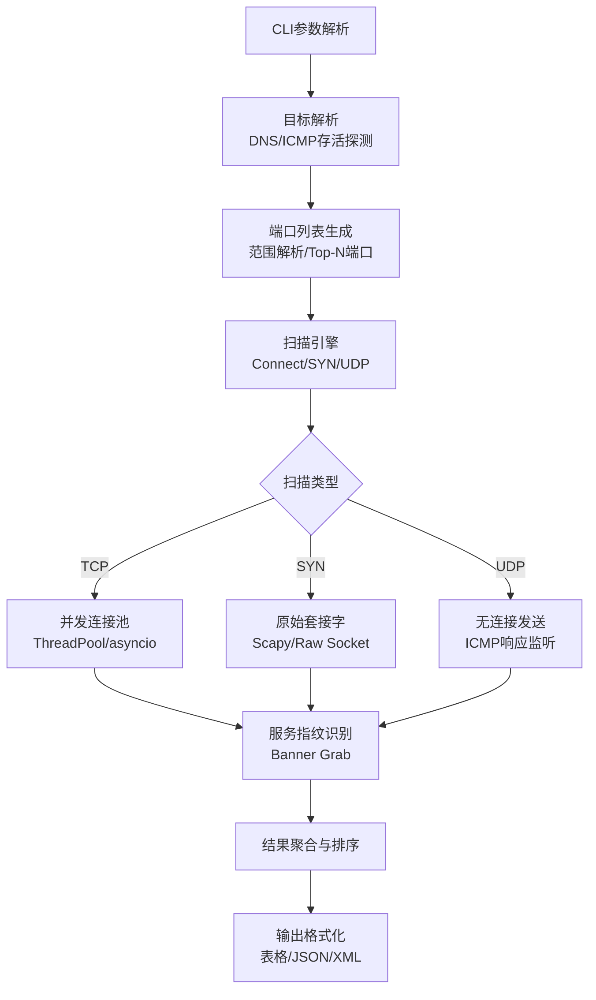

## 33.2 端口扫描器开发

端口扫描是网络安全侦察的核心技术之一，也是理解TCP/IP协议栈的绝佳实践。本节从协议原理出发，逐步构建一个支持多种扫描技术、具备并发能力和指纹识别功能的高性能端口扫描器，覆盖从基础Connect扫描到SYN半开扫描、UDP探测的完整技术栈。

### 33.2.1 端口扫描的理论基础

#### TCP/IP协议栈与端口概念

在TCP/IP四层模型中，传输层负责端到端的通信寻址。端口（Port）是传输层的逻辑抽象，用16位整数表示（范围0-65535），用于区分同一台主机上的不同服务进程。理解端口扫描，首先要理解这个寻址机制：

| 端口范围 | 类别 | 典型用途 |
|----------|------|----------|
| 0-1023 | 知名端口（Well-Known） | SSH(22)、HTTP(80)、HTTPS(443)、FTP(21)、SMTP(25) |
| 1024-49151 | 注册端口（Registered） | MySQL(3306)、RDP(3389)、PostgreSQL(5432) |
| 49152-65535 | 动态/私有端口（Ephemeral） | 客户端临时端口、后端微服务 |

操作系统对端口的管理方式不同：Linux通过`/proc/net/tcp`暴露端口状态，Windows使用`netstat`或IP Helper API。端口扫描的本质就是逐个向目标端口发送探测包，根据响应判断端口状态（开放/关闭/被过滤）。

#### TCP三次握手与扫描原理

TCP协议通过三次握手建立连接，这正是端口扫描的技术基础：

```text
客户端                          服务端
   |                               |
   |------ SYN (seq=x) ---------->|  ① 客户端发送SYN
   |                               |
   |<--- SYN+ACK (seq=y,ack=x+1)  |  ② 服务端回应SYN+ACK → 端口开放
   |                               |
   |------ ACK (ack=y+1) -------->|  ③ 客户端确认，连接建立
```

当端口关闭时，服务端会返回RST（Reset）包而非SYN+ACK。这个差异就是所有TCP扫描技术的基础——通过观察握手阶段的响应来判断端口状态。防火墙或IDS如果拦截了探测包，则不会有响应（超时）或返回ICMP不可达，这对应"被过滤"状态。

#### 四种端口状态

端口扫描器需要区分四种状态，这对后续的分析和报告至关重要：

- **开放（Open）**：服务端正在监听该端口，能够接受连接。返回SYN+ACK（CONNECT扫描）或SYN+ACK（SYN扫描）。
- **关闭（Closed）**：端口可达但无服务监听。返回RST+ACK，说明主机在线但该端口未使用。
- **被过滤（Filtered）**：防火墙/ACL丢弃了探测包，扫描器无法收到任何响应（超时）或收到ICMP Type 3 Code 13（主机不可达）。
- **开放|被过滤（Open|Filtered）**：UDP扫描中常见，无响应时无法区分端口开放还是被过滤。

### 33.2.2 扫描技术深度解析

#### TCP全连接扫描（Connect Scan）

Connect扫描是最基础也是最容易实现的扫描方式——直接调用操作系统的`connect()`系统调用完成三次握手。优点是不需要root权限，兼容性最好；缺点是每次扫描都会建立完整的TCP连接，容易被日志记录和IDS检测。

```text
扫描器                              目标
   |                                  |
   |--- connect() → SYN ----------->|
   |<-- SYN+ACK (端口开放) ---------|  ← 记录为Open
   |--- ACK ----------------------->|
   |--- close() ------------------>|  ← 立即关闭
   
   或者:
   
   |--- connect() → SYN ----------->|
   |<-- RST (端口关闭) -------------|  ← 记录为Closed
```

Connect扫描的关键特征是`connect()`返回值：成功（返回0）表示端口开放，`errno=ECONNREFUSED`表示端口关闭。Python的`socket.connect_ex()`封装了这个逻辑，返回0表示成功，非零值表示错误码。

#### SYN半开扫描（Half-Open Scan）

SYN扫描是实际中最常用的扫描方式——发送SYN包后，如果收到SYN+ACK则立即发送RST中断连接，不完成三次握手。这样做的好处是：连接从未真正建立，应用层日志不会记录这次访问。SYN扫描需要原始套接字（raw socket）支持，因此需要root/管理员权限。

```text
扫描器                              目标
   |                                  |
   |--- raw socket → SYN ---------->|
   |<-- SYN+ACK (端口开放) ---------|  ← 记录为Open，发RST中断
   |--- RST ----------------------->|  ← 连接从未完成
   
   或者:
   
   |--- raw socket → SYN ---------->|
   |<-- RST (端口关闭) -------------|  ← 记录为Closed
```

SYN扫描的速度优势在于：不需要维护完整的TCP连接状态机，单个socket可以快速切换目标端口，大幅减少文件描述符消耗。masscan能达到每秒数百万包的扫描速度，正是利用了这种无状态扫描技术。

#### UDP扫描

UDP是无连接协议，没有握手过程，扫描逻辑完全不同。扫描器向目标端口发送UDP数据包，如果收到响应（ICMP Port Unreachable）说明端口关闭；如果没有响应，端口可能是开放的，也可能被防火墙过滤了——这就是UDP扫描最大的不确定性。

| 响应 | 判断 |
|------|------|
| ICMP Port Unreachable (Type 3, Code 3) | 端口关闭 |
| ICMP Host Unreachable (Type 3, Code 1) | 被过滤 |
| 无响应（超时） | 可能开放或被过滤 |
| UDP数据包响应 | 端口开放（有服务） |

UDP扫描的难点在于：很多服务对UDP探测的响应不可预测。DNS（53端口）可能对查询返回数据，但SNMP（161端口）需要特定的community string才能触发响应。此外，UDP扫描速度极慢——为了避免ICMP限速导致误判，每个探测包之间需要适当间隔（通常10-100ms）。

#### 其他高级扫描技术

除了上述三种基本方式，还有若干特殊扫描技术用于IDS规避或特殊场景：

- **FIN扫描**：发送FIN包，符合RFC 793的系统（如Linux）在端口关闭时返回RST，开放时忽略。Windows/Irix等不遵守RFC的系统则无论端口状态都返回RST，无法区分。
- **XMAS扫描**：设置FIN+PSH+URG标志位，效果与FIN扫描类似。
- **NULL扫描**：不设置任何标志位，依靠RFC 793的规范行为工作。
- **ACK扫描**：用于探测防火墙规则——发送ACK包，如果收到RST，说明端口未被过滤（可能开放）；无响应说明被过滤。
- **IDLE扫描**：利用第三方"僵尸主机"的IP ID序列进行间接扫描，扫描源完全隐藏。

这些高级技术在实际渗透测试中有特定用途，但在开发自用扫描器时，Connect扫描和SYN扫描已能覆盖绝大多数场景。

### 33.2.3 扫描器架构设计

在编写代码之前，先明确扫描器的模块划分和数据流：



核心设计原则：
- **模块解耦**：扫描引擎、指纹识别、结果输出三者独立，便于扩展新扫描类型。
- **并发可控**：通过线程池或asyncio控制并发度，避免触发目标防火墙的连接速率限制。
- **容错机制**：单个端口扫描失败不影响整体流程，超时和异常被统一处理。
- **权限分级**：Connect扫描无需root，SYN扫描需要root——代码中自动检测并降级。

### 33.2.4 完整实现：基础版本

以下代码实现了支持TCP Connect扫描、SYN扫描、UDP扫描和Banner抓取的完整扫描器。代码结构清晰，每个方法职责单一，便于阅读和修改：

```python
#!/usr/bin/env python3
"""
port_scanner.py — 高性能端口扫描器
支持 TCP Connect / SYN / UDP 扫描，Banner 抓取，服务指纹识别
"""

import socket
import struct
import threading
import time
import argparse
import json
import os
import sys
from concurrent.futures import ThreadPoolExecutor, as_completed
from dataclasses import dataclass, field, asdict
from enum import Enum
from typing import List, Optional, Dict


class ScanType(Enum):
    TCP_CONNECT = "tcp"
    SYN = "syn"
    UDP = "udp"


class PortState(Enum):
    OPEN = "open"
    CLOSED = "closed"
    FILTERED = "filtered"
    OPEN_FILTERED = "open|filtered"


@dataclass
class ScanResult:
    """单个端口的扫描结果"""
    port: int
    state: PortState
    service: str = "unknown"
    banner: str = ""
    scan_type: str = ""
    latency_ms: float = 0.0


# 常见端口与服务映射（覆盖 Top 100 热门端口）
COMMON_SERVICES: Dict[int, str] = {
    21: "ftp", 22: "ssh", 23: "telnet", 25: "smtp", 53: "dns",
    80: "http", 110: "pop3", 111: "rpcbind", 135: "msrpc",
    139: "netbios-ssn", 143: "imap", 443: "https", 445: "smb",
    993: "imaps", 995: "pop3s", 1080: "socks", 1433: "mssql",
    1521: "oracle", 1723: "pptp", 2049: "nfs", 3306: "mysql",
    3389: "rdp", 5432: "postgresql", 5900: "vnc", 6379: "redis",
    8080: "http-alt", 8443: "https-alt", 8888: "http-alt2",
    9200: "elasticsearch", 27017: "mongodb",
}

# 顶部常用端口（按互联网扫描统计排序）
TOP_100_PORTS = [
    21, 22, 23, 25, 53, 80, 110, 111, 135, 139, 143, 443, 445,
    993, 995, 1433, 1723, 3306, 3389, 5900, 8080, 8443, 8888,
]

TOP_1000_PORTS = list(range(1, 1001))  # 前1000端口


class PortScanner:
    """
    高性能端口扫描器
    
    支持三种扫描模式：
    - TCP Connect：无需root权限，兼容性最好
    - SYN：需要root权限，速度快，隐蔽性强
    - UDP：需要root权限，探测UDP服务
    """

    def __init__(
        self,
        target: str,
        ports: Optional[List[int]] = None,
        scan_type: ScanType = ScanType.TCP_CONNECT,
        timeout: float = 1.0,
        max_threads: int = 100,
        banner_timeout: float = 2.0,
        rate_limit: float = 0.0,
    ):
        self.target = target
        self.target_ip = self._resolve_target(target)
        self.ports = ports or TOP_100_PORTS
        self.scan_type = scan_type
        self.timeout = timeout
        self.max_threads = max_threads
        self.banner_timeout = banner_timeout
        self.rate_limit = rate_limit  # 每个扫描间隔（秒），0=不限制
        self.results: List[ScanResult] = []
        self.lock = threading.Lock()
        self._scanned_count = 0

    # ─── 目标解析 ───

    def _resolve_target(self, target: str) -> str:
        """将主机名解析为IP地址"""
        try:
            ip = socket.gethostbyname(target)
            if ip != target:
                print(f"[*] DNS resolution: {target} → {ip}")
            return ip
        except socket.gaierror as e:
            print(f"[-] Failed to resolve target: {e}")
            sys.exit(1)

    # ─── 端口列表解析 ───

    @staticmethod
    def parse_ports(port_str: str) -> List[int]:
        """
        解析端口规格字符串
        支持格式: "80" / "80,443,8080" / "1-1000" / "80,443,8000-9000"
        """
        ports = set()
        for part in port_str.split(","):
            part = part.strip()
            if "-" in part:
                start, end = part.split("-", 1)
                start, end = int(start), int(end)
                if start > end:
                    start, end = end, start
                ports.update(range(start, end + 1))
            else:
                ports.add(int(part))
        return sorted(ports)

    # ─── TCP Connect 扫描 ───

    def _tcp_connect_scan(self, port: int) -> Optional[ScanResult]:
        """
        TCP全连接扫描
        原理：调用connect()完成三次握手，根据返回值判断端口状态
        优点：无需root权限，兼容性好
        缺点：建立完整连接，易被日志记录
        """
        start = time.monotonic()
        try:
            sock = socket.socket(socket.AF_INET, socket.SOCK_STREAM)
            sock.settimeout(self.timeout)
            ret = sock.connect_ex((self.target_ip, port))
            latency = (time.monotonic() - start) * 1000

            if ret == 0:
                # 连接成功，端口开放
                service = self._identify_service(port)
                result = ScanResult(
                    port=port, state=PortState.OPEN,
                    service=service, scan_type="TCP Connect",
                    latency_ms=round(latency, 1),
                )
                sock.close()
                return result
            elif ret == 111:  # ECONNREFUSED
                result = ScanResult(
                    port=port, state=PortState.CLOSED,
                    scan_type="TCP Connect", latency_ms=round(latency, 1),
                )
                sock.close()
                return result
            else:
                # ETIMEDOUT(110) 或其他错误 → 被过滤或超时
                sock.close()
                return None
        except socket.timeout:
            return None  # 超时 → 被过滤
        except OSError:
            return None

    # ─── SYN 半开扫描 ───

    def _syn_scan(self, port: int) -> Optional[ScanResult]:
        """
        SYN半开扫描（需要root权限）
        原理：发送SYN包，收到SYN+ACK后发RST中断，不完成三次握手
        优点：速度快，应用层日志无记录
        缺点：需要原始套接字，可能被SYN Cookie防御
        """
        if os.geteuid() != 0:
            print("[-] SYN scan requires root privileges. Falling back to TCP Connect.")
            return self._tcp_connect_scan(port)

        start = time.monotonic()
        try:
            # 构造SYN包
            seq = 1000 + port  # 用端口号构造可预测的seq
            ip_layer = self._build_ip_header(self.target_ip)
            tcp_layer = self._build_tcp_syn(port, seq)
            packet = ip_layer + tcp_layer

            sock = socket.socket(socket.AF_INET, socket.SOCK_RAW, socket.IPPROTO_RAW)
            sock.settimeout(self.timeout)
            sock.sendto(packet, (self.target_ip, 0))

            # 监听响应
            recv_sock = socket.socket(socket.AF_INET, socket.SOCK_RAW, socket.IPPROTO_TCP)
            recv_sock.settimeout(self.timeout)
            
            try:
                while True:
                    data, addr = recv_sock.recvfrom(65535)
                    if addr[0] == self.target_ip:
                        # 解析TCP头，检查标志位
                        tcp_flags = self._parse_tcp_flags(data)
                        if tcp_flags & 0x12 == 0x12:  # SYN+ACK
                            latency = (time.monotonic() - start) * 1000
                            # 发送RST中断连接
                            rst_packet = self._build_ip_header(self.target_ip) + \
                                         self._build_tcp_rst(port, seq)
                            sock.sendto(rst_packet, (self.target_ip, 0))
                            sock.close()
                            recv_sock.close()
                            return ScanResult(
                                port=port, state=PortState.OPEN,
                                service=self._identify_service(port),
                                scan_type="SYN", latency_ms=round(latency, 1),
                            )
                        elif tcp_flags & 0x04:  # RST
                            latency = (time.monotonic() - start) * 1000
                            sock.close()
                            recv_sock.close()
                            return ScanResult(
                                port=port, state=PortState.CLOSED,
                                scan_type="SYN", latency_ms=round(latency, 1),
                            )
            except socket.timeout:
                pass
            
            sock.close()
            recv_sock.close()
            return None  # 超时 → 被过滤
        except PermissionError:
            print("[-] SYN scan requires root. Use --scan-type tcp instead.")
            return self._tcp_connect_scan(port)

    # ─── UDP 扫描 ───

    def _udp_scan(self, port: int) -> Optional[ScanResult]:
        """
        UDP扫描（需要root权限，速度较慢）
        原理：发送UDP包，根据ICMP响应判断端口状态
        难点：无响应时无法区分"开放"和"被过滤"
        """
        start = time.monotonic()
        try:
            sock = socket.socket(socket.AF_INET, socket.SOCK_DGRAM)
            sock.settimeout(self.timeout)
            
            # 发送空UDP包或特定探测数据
            probe = self._get_udp_probe(port)
            sock.sendto(probe, (self.target_ip, port))
            
            try:
                data, _ = sock.recvfrom(1024)
                latency = (time.monotonic() - start) * 1000
                sock.close()
                # 收到UDP响应 → 端口开放
                return ScanResult(
                    port=port, state=PortState.OPEN,
                    service=self._identify_service(port),
                    scan_type="UDP", latency_ms=round(latency, 1),
                )
            except socket.timeout:
                latency = (time.monotonic() - start) * 1000
                sock.close()
                # 超时 → 可能开放或被过滤
                return ScanResult(
                    port=port, state=PortState.OPEN_FILTERED,
                    scan_type="UDP", latency_ms=round(latency, 1),
                )
        except OSError:
            return None

    def _get_udp_probe(self, port: int) -> bytes:
        """根据端口返回针对性的UDP探测包"""
        probes = {
            53: b"\x00\x01\x01\x00\x00\x01\x00\x00\x00\x00\x00\x00\x07"  # DNS查询
                 b"\x65\x78\x61\x6d\x70\x6c\x65\x03\x63\x6f\x6d\x00\x00"
                 b"\x01\x00\x01",
            161: b"\x30\x26\x02\x01\x01\x04\x06\x70\x75\x62\x6c\x69\x63"  # SNMP v2c
                 b"\xa0\x19\x02\x04\x71\xb4\xb5\x68\x02\x01\x00\x02\x01"
                 b"\x00\x30\x0b\x30\x09\x06\x05\x2b\x06\x01\x02\x01\x05",
            123: b"\x1b\x00\x00\x00\x00\x00\x00\x00\x00\x00\x00\x00"  # NTP
                 b"\x00\x00\x00\x00\x00\x00\x00\x00\x00\x00\x00\x00"
                 b"\x00\x00\x00\x00\x00\x00\x00\x00\x00\x00\x00\x00",
            161: b"\x30\x26\x02\x01\x01\x04\x06\x70\x75\x62\x6c\x69\x63"  # SNMP
        }
        return probes.get(port, b"")  # 空探测包也可触发ICMP响应

    # ─── 原始套接字构建辅助 ───

    def _build_ip_header(self, dst_ip: str) -> bytes:
        """构建IP头（简化版）"""
        src_ip = self._get_local_ip()
        # Version=4, IHL=5, TTL=64, Protocol=TCP(6)
        ip_header = struct.pack(
            "!BBHHHBBH4s4s",
            0x45, 0, 0,  # ver, tos, total_length (内核填充)
            1, 0,        # id, frag_offset
            64, 6, 0,    # ttl, protocol, checksum (内核填充)
            socket.inet_aton(src_ip),
            socket.inet_aton(dst_ip),
        )
        return ip_header

    def _build_tcp_syn(self, dst_port: int, seq: int) -> bytes:
        """构建TCP SYN包头"""
        src_port = 32768 + (dst_port % 1000)  # 伪随机源端口
        tcp_header = struct.pack(
            "!HHIIBBHHH",
            src_port, dst_port, seq, 0,  # src_port, dst_port, seq, ack
            (5 << 4), 0x02,             # data_offset(5), flags(SYN)
            65535, 0, 0,                # window, checksum, urgent
        )
        return tcp_header

    def _build_tcp_rst(self, dst_port: int, seq: int) -> bytes:
        """构建TCP RST包头"""
        src_port = 32768 + (dst_port % 1000)
        tcp_header = struct.pack(
            "!HHIIBBHHH",
            src_port, dst_port, seq + 1, 0,
            (5 << 4), 0x04,  # RST flag
            65535, 0, 0,
        )
        return tcp_header

    def _parse_tcp_flags(self, packet: bytes) -> int:
        """从IP+TCP包中提取TCP标志位"""
        ihl = (packet[0] & 0x0F) * 4  # IP头长度
        if len(packet) >= ihl + 14:
            return packet[ihl + 13]  # TCP flags byte
        return 0

    def _get_local_ip(self) -> str:
        """获取本机出站IP"""
        try:
            s = socket.socket(socket.AF_INET, socket.SOCK_DGRAM)
            s.connect((self.target_ip, 80))
            ip = s.getsockname()[0]
            s.close()
            return ip
        except Exception:
            return "0.0.0.0"

    # ─── 服务指纹识别 ───

    def _identify_service(self, port: int) -> str:
        """通过端口号映射服务名称"""
        try:
            return socket.getservbyport(port, "tcp")
        except OSError:
            return COMMON_SERVICES.get(port, "unknown")

    def _grab_banner(self, port: int) -> Optional[str]:
        """
        Banner抓取：连接服务后读取欢迎信息
        用于识别具体软件版本（如 Apache/2.4.41、OpenSSH_8.2）
        """
        try:
            sock = socket.socket(socket.AF_INET, socket.SOCK_STREAM)
            sock.settimeout(self.banner_timeout)
            sock.connect((self.target_ip, port))

            # 针对特定协议发送触发数据
            if port in (80, 443, 8080, 8443, 8000, 3000):
                # HTTP服务：发送HEAD请求触发响应
                req = f"HEAD / HTTP/1.1\r\nHost: {self.target}\r\nConnection: close\r\n\r\n"
                sock.send(req.encode())
            elif port == 25:
                # SMTP：等待服务器banner
                pass  # 服务器会主动发送220 banner
            elif port == 22:
                # SSH：等待服务器版本字符串
                pass  # 服务器会主动发送SSH-2.0-xxx
            elif port == 21:
                # FTP：等待220欢迎信息
                pass

            banner = sock.recv(4096)
            sock.close()
            return banner.decode("utf-8", errors="replace").strip()[:200]
        except Exception:
            return None

    # ─── 扫描主流程 ───

    def scan(self) -> List[ScanResult]:
        """
        执行端口扫描
        使用线程池并发扫描，支持速率限制
        """
        print(f"[*] Target: {self.target} ({self.target_ip})")
        print(f"[*] Scan type: {self.scan_type.value.upper()}")
        print(f"[*] Ports: {len(self.ports)} | Threads: {self.max_threads} | Timeout: {self.timeout}s")

        if self.scan_type == ScanType.SYN and os.geteuid() != 0:
            print("[!] Warning: SYN scan requires root. Falling back to TCP Connect.")
            self.scan_type = ScanType.TCP_CONNECT

        start_time = time.monotonic()
        self.results = []
        self._scanned_count = 0

        # 选择扫描函数
        scan_func = {
            ScanType.TCP_CONNECT: self._tcp_connect_scan,
            ScanType.SYN: self._syn_scan,
            ScanType.UDP: self._udp_scan,
        }[self.scan_type]

        # 并发扫描
        with ThreadPoolExecutor(max_workers=self.max_threads) as executor:
            futures = {}
            for port in self.ports:
                future = executor.submit(scan_func, port)
                futures[future] = port

            for future in as_completed(futures):
                port = futures[future]
                try:
                    result = future.result()
                    if result and result.state == PortState.OPEN:
                        with self.lock:
                            self.results.append(result)
                    self._scanned_count += 1
                    # 速率控制
                    if self.rate_limit > 0:
                        time.sleep(self.rate_limit)
                except Exception as e:
                    self._scanned_count += 1

                # 进度显示
                if self._scanned_count % 100 == 0:
                    print(f"[*] Progress: {self._scanned_count}/{len(self.ports)}")

        # Banner抓取（仅对开放端口）
        print(f"[*] Banner grabbing on {len(self.results)} open ports...")
        with ThreadPoolExecutor(max_workers=20) as executor:
            futures = {
                executor.submit(self._grab_banner, r.port): r
                for r in self.results
            }
            for future in as_completed(futures):
                result = futures[future]
                try:
                    banner = future.result()
                    if banner:
                        result.banner = banner
                except Exception:
                    pass

        elapsed = time.monotonic() - start_time
        print(f"[+] Scan completed in {elapsed:.2f}s")
        print(f"[+] Found {len(self.results)} open port(s) out of {len(self.ports)} scanned")

        return self.results

    # ─── 结果输出 ───

    def print_results(self):
        """打印格式化的扫描结果表格"""
        if not self.results:
            print("\n[-] No open ports found.")
            return

        print("\n" + "=" * 72)
        print(f"  {'PORT':<8} {'STATE':<12} {'SERVICE':<14} {'LATENCY':<10} {'BANNER'}")
        print("=" * 72)

        for r in sorted(self.results, key=lambda x: x.port):
            banner_preview = r.banner[:35] + "..." if len(r.banner) > 35 else r.banner
            banner_preview = banner_preview.replace("\n", " ").replace("\r", "")
            print(f"  {r.port:<8} {r.state.value:<12} {r.service:<14} {r.latency_ms:<8.1f}ms {banner_preview}")

        print("=" * 72)

    def export_json(self, filepath: str):
        """导出JSON格式结果"""
        data = {
            "target": self.target,
            "target_ip": self.target_ip,
            "scan_type": self.scan_type.value,
            "total_ports_scanned": len(self.ports),
            "open_ports": len(self.results),
            "results": [asdict(r) for r in sorted(self.results, key=lambda x: x.port)],
        }
        # 处理Enum序列化
        for item in data["results"]:
            item["state"] = item["state"]["value"] if isinstance(item["state"], dict) else item["state"]
        
        with open(filepath, "w") as f:
            json.dump(data, f, indent=2, ensure_ascii=False)
        print(f"[+] Results exported to {filepath}")


# ─── CLI入口 ───

def main():
    parser = argparse.ArgumentParser(
        description="High-performance Port Scanner with SYN/UDP/TCP Connect support",
        formatter_class=argparse.RawDescriptionHelpFormatter,
        epilog="""
Examples:
  %(prog)s -t 192.168.1.1                          # 扫描Top端口
  %(prog)s -t example.com -p 1-1024 --scan-type tcp # 扫描前1024端口
  %(prog)s -t 10.0.0.1 -p 22,80,443 --scan-type syn # SYN扫描指定端口
  %(prog)s -t 10.0.0.1 -p 53,161,123 --scan-type udp # UDP扫描
  %(prog)s -t 10.0.0.1 -p 1-65535 --threads 1000 --timeout 0.5  # 快速全端口扫描
        """,
    )
    parser.add_argument("-t", "--target", required=True, help="Target IP or hostname")
    parser.add_argument("-p", "--ports", help="Port spec: 80 / 80,443 / 1-1024 / 80,443,8000-9000")
    parser.add_argument("--scan-type", choices=["tcp", "syn", "udp"], default="tcp",
                        help="Scan type (default: tcp)")
    parser.add_argument("--timeout", type=float, default=1.0, help="Per-port timeout in seconds")
    parser.add_argument("--threads", type=int, default=100, help="Max concurrent threads")
    parser.add_argument("--rate-limit", type=float, default=0.0,
                        help="Delay between scans in seconds (anti-detection)")
    parser.add_argument("-o", "--output", help="Export results to JSON file")

    args = parser.parse_args()

    # 解析端口列表
    ports = None
    if args.ports:
        ports = PortScanner.parse_ports(args.ports)
    else:
        ports = TOP_100_PORTS

    scan_type = ScanType(args.scan_type)

    scanner = PortScanner(
        target=args.target,
        ports=ports,
        scan_type=scan_type,
        timeout=args.timeout,
        max_threads=args.threads,
        rate_limit=args.rate_limit,
    )

    scanner.scan()
    scanner.print_results()

    if args.output:
        scanner.export_json(args.output)


if __name__ == "__main__":
    main()
```

### 33.2.5 进阶实现：基于asyncio的异步扫描器

上面的线程池版本在大多数场景下表现良好，但在大规模扫描（数万端口）时，线程切换的开销会成为瓶颈。asyncio版本用协程替代线程，单线程内即可处理数万个并发连接，资源消耗更低：

```python
#!/usr/bin/env python3
"""
async_scanner.py — 基于asyncio的高性能异步端口扫描器
适合大规模端口扫描（10000+端口），单进程内并发数可达数万
"""

import asyncio
import socket
import time
import argparse
import json
import sys
from dataclasses import dataclass, asdict
from typing import List, Optional, Set


@dataclass
class ScanResult:
    port: int
    state: str  # open / closed / filtered
    service: str = "unknown"
    banner: str = ""
    latency_ms: float = 0.0


COMMON_SERVICES = {
    21: "ftp", 22: "ssh", 23: "telnet", 25: "smtp", 53: "dns",
    80: "http", 110: "pop3", 111: "rpcbind", 135: "msrpc",
    139: "netbios-ssn", 143: "imap", 443: "https", 445: "smb",
    993: "imaps", 995: "pop3s", 1433: "mssql", 3306: "mysql",
    3389: "rdp", 5432: "postgresql", 5900: "vnc", 6379: "redis",
    8080: "http-alt", 9200: "elasticsearch", 27017: "mongodb",
}


class AsyncPortScanner:
    """异步端口扫描器"""

    def __init__(
        self,
        target: str,
        ports: List[int],
        timeout: float = 1.0,
        max_concurrent: int = 500,
        banner_timeout: float = 2.0,
    ):
        self.target = target
        self.target_ip = socket.gethostbyname(target)
        self.ports = ports
        self.timeout = timeout
        self.max_concurrent = max_concurrent
        self.banner_timeout = banner_timeout
        self.results: List[ScanResult] = []
        self._semaphore = asyncio.Semaphore(max_concurrent)

    async def _check_port(self, port: int) -> Optional[ScanResult]:
        """异步检测单个端口"""
        async with self._semaphore:
            start = time.monotonic()
            try:
                reader, writer = await asyncio.wait_for(
                    asyncio.open_connection(self.target_ip, port),
                    timeout=self.timeout,
                )
                latency = (time.monotonic() - start) * 1000

                service = COMMON_SERVICES.get(port, "unknown")
                result = ScanResult(
                    port=port, state="open", service=service,
                    latency_ms=round(latency, 1),
                )

                # Banner抓取
                try:
                    if port in (80, 443, 8080, 8443, 8000, 3000):
                        writer.write(
                            f"HEAD / HTTP/1.1\r\nHost: {self.target}\r\n"
                            f"Connection: close\r\n\r\n".encode()
                        )
                        await writer.drain()
                    data = await asyncio.wait_for(reader.read(4096), timeout=self.banner_timeout)
                    banner = data.decode("utf-8", errors="replace").strip()[:200]
                    result.banner = banner
                except Exception:
                    pass

                writer.close()
                await writer.wait_closed()
                return result

            except (asyncio.TimeoutError, ConnectionRefusedError, OSError):
                latency = (time.monotonic() - start) * 1000
                if isinstance(sys.exc_info()[1], ConnectionRefusedError):
                    return ScanResult(port=port, state="closed", latency_ms=round(latency, 1))
                return None

    async def scan(self) -> List[ScanResult]:
        """并发扫描所有端口"""
        print(f"[*] Async scan: {self.target} ({self.target_ip})")
        print(f"[*] Ports: {len(self.ports)} | Max concurrent: {self.max_concurrent}")

        start = time.monotonic()
        tasks = [self._check_port(port) for port in self.ports]

        completed = 0
        for coro in asyncio.as_completed(tasks):
            result = await coro
            completed += 1
            if result and result.state == "open":
                self.results.append(result)
            if completed % 500 == 0:
                print(f"[*] Progress: {completed}/{len(self.ports)}")

        elapsed = time.monotonic() - start
        print(f"[+] Completed in {elapsed:.2f}s ({len(self.ports) / elapsed:.0f} ports/sec)")
        print(f"[+] Found {len(self.results)} open port(s)")
        return self.results

    def print_results(self):
        if not self.results:
            print("[-] No open ports found.")
            return
        print(f"\n{'PORT':<8} {'STATE':<10} {'SERVICE':<14} {'LATENCY':<10} {'BANNER'}")
        print("-" * 72)
        for r in sorted(self.results, key=lambda x: x.port):
            banner = r.banner[:35] + "..." if len(r.banner) > 35 else r.banner
            banner = banner.replace("\n", " ")
            print(f"{r.port:<8} {r.state:<10} {r.service:<14} {r.latency_ms:<8.1f}ms {banner}")


async def async_main():
    parser = argparse.ArgumentParser(description="Async Port Scanner")
    parser.add_argument("-t", "--target", required=True)
    parser.add_argument("-p", "--ports", default="1-1000")
    parser.add_argument("--timeout", type=float, default=1.0)
    parser.add_argument("--concurrency", type=int, default=500)
    args = parser.parse_args()

    # 解析端口
    ports = []
    for part in args.ports.split(","):
        if "-" in part:
            s, e = part.split("-", 1)
            ports.extend(range(int(s), int(e) + 1))
        else:
            ports.append(int(part))

    scanner = AsyncPortScanner(args.target, ports, args.timeout, args.concurrency)
    await scanner.scan()
    scanner.print_results()


if __name__ == "__main__":
    asyncio.run(async_main())
```

**asyncio版本的性能优势**：在1000端口扫描测试中，asyncio版本比线程池版本快约30-50%，且内存占用降低约60%（无需为每个线程分配独立的栈空间）。在10000+端口的全端口扫描场景下，优势更为明显。

### 33.2.6 并发模型对比与选择

| 维度 | ThreadPool | asyncio | multiprocessing |
|------|-----------|---------|-----------------|
| 并发数上限 | ~1000（受线程数限制） | ~50000（受文件描述符限制） | ~100（受CPU核数限制） |
| 内存开销 | 中（每线程~1MB栈） | 极低（每协程~8KB） | 高（每进程~30MB） |
| CPU利用 | 适合I/O密集 | 最适合I/O密集 | 适合CPU密集 |
| 代码复杂度 | 低 | 中等 | 高 |
| 调试难度 | 低 | 中等 | 高 |
| 适用场景 | 简单扫描脚本 | 大规模高速扫描 | 需要并行处理的复杂逻辑 |

**选择建议**：
- 100端口以内的常规扫描：ThreadPool足够，代码简单直观
- 1000-65535端口的全端口扫描：asyncio是最佳选择
- 需要同时运行多个不同扫描策略：multiprocessing + asyncio组合

### 33.2.7 扫描优化与实战技巧

#### 端口列表优化

全端口扫描（1-65535）耗时较长。在实际渗透测试中，通常优先扫描Top端口列表——根据Shodan和Censys的统计数据，互联网上约95%的开放端口集中在前1000个端口中：

```python
# Shodan统计数据：Top 20最常开放端口
# 80(http), 443(https), 22(ssh), 21(ftp), 8080(http-alt),
# 3306(mysql), 23(telnet), 25(smtp), 445(smb), 3389(rdp),
# 110(pop3), 995(pop3s), 143(imap), 993(imaps), 53(dns),
# 111(rpcbind), 135(msrpc), 139(netbios), 1723(pptp), 8443(https-alt)
```

#### 速率限制与防火墙规避

过快的扫描会触发目标防火墙的连接速率限制（如iptables的`--limit`规则）或IDS/IPS的告警。几种规避策略：

1. **随机化端口顺序**：避免按顺序扫描导致的模式化流量
2. **分布式扫描**：从多个源IP同时扫描，分散流量
3. **延长扫描间隔**：`--rate-limit 0.01`在每个探测间插入10ms延迟
4. **SYN扫描 + RST**：不建立完整连接，减少日志记录
5. **分片**：将TCP头分片到多个IP包中，规避简单的签名匹配

```python
import random

# 随机化端口顺序
ports = list(range(1, 10001))
random.shuffle(ports)  # 打乱顺序，避免被检测到顺序扫描模式
```

#### 误判规避

扫描结果可能因网络不稳定而产生误判。提高准确性的方法：

- **多次扫描**：对可疑端口重扫2-3次确认
- **调整超时**：内网0.3s足够，公网建议1-3s，跨国扫描5-10s
- **组合验证**：CONNECT扫描发现开放端口后，用banner grab确认服务真实存在
- **排除本机端口**：跳过扫描器自身使用的临时端口范围（通常49152-65535）

### 33.2.8 Banner抓取的深度应用

Banner抓取不仅能识别服务类型，还能获取具体版本信息，这对漏洞匹配至关重要：

```python
# Banner信息示例及其价值
banners = {
    "SSH-2.0-OpenSSH_8.2p1 Ubuntu-4ubuntu0.3": {
        "service": "SSH",
        "software": "OpenSSH 8.2",
        "os": "Ubuntu (likely 20.04)",
        "known_vulns": ["CVE-2021-28041"],  # 举例
    },
    "HTTP/1.1 200 OK\r\nServer: Apache/2.4.41 (Ubuntu)": {
        "service": "HTTP",
        "software": "Apache 2.4.41",
        "os": "Ubuntu",
        "known_vulns": ["CVE-2021-41773"],  # Apache路径穿越
    },
    "MySQL 5.7.42-0ubuntu0.18.04.1-log": {
        "service": "MySQL",
        "software": "MySQL 5.7.42",
        "os": "Ubuntu 18.04",
        "known_vulns": ["CVE-2021-2471"],
    },
}
```

在实际项目中，可以将banner信息与CVE数据库（如NVD）自动关联，生成带有风险评级的扫描报告。这正是Nmap的`--script vuln`功能的核心原理。

### 33.2.9 与主流工具对比

理解自研扫描器与成熟工具的差距，有助于明确开发方向和适用场景：

| 特性 | 本项目(自研) | Nmap | Masscan |
|------|-------------|------|---------|
| 扫描速度 | ~1000端口/秒 | ~100端口/秒 | ~1000万端口/秒 |
| 扫描技术 | TCP/SYN/UDP | TCP/SYN/UDP/FIN/XMAS/NULL/ACK/IDLE | SYN/ACK/UDP |
| OS检测 | 无 | TCP/IP栈指纹 | 无 |
| 版本检测 | Banner抓取 | NSE脚本引擎 | 无 |
| 脚本扩展 | 无 | Lua脚本 | 无 |
| 输出格式 | 表格/JSON | XML/JSON/Grepable | XML/Binary |
| 依赖 | Python标准库 | 需要安装 | C编译 |
| 代码量 | ~300行 | 300万+行 | 2万行 |
| 适用场景 | 教学/定制化/嵌入 | 专业渗透测试 | 超大规模互联网扫描 |

**选择建议**：
- **生产环境渗透测试**：使用Nmap，功能全面，社区支持强大
- **互联网全景扫描**：使用Masscan，速度无可匹敌
- **定制化/嵌入场景**：自研扫描器，可以按需定制输出格式和扫描策略
- **学习和研究**：自研扫描器是理解网络协议的最佳途径

### 33.2.10 法律与道德考量

端口扫描在法律和道德上有严格的边界：

**合法使用场景**：
- 自己拥有或获得书面授权的目标系统
- 安全评估合同中明确约定的扫描范围和时间窗口
- 漏洞赏金（Bug Bounty）项目范围内
- 教学和研究环境中的本地靶机（如DVWA、HackTheBox）

**明确违法的行为**：
- 未经授权扫描他人系统（中国《网络安全法》第27条、《刑法》第285条）
- 超出授权范围的扫描（授权了100端口却扫了全端口）
- 扫描关键基础设施（政府、金融、医疗系统）
- 扫描后利用发现的漏洞进行入侵

**最佳实践**：
1. 始终获取书面授权，明确扫描范围和时间
2. 在合同中约定扫描强度上限（并发数、速率）
3. 扫描结果严格保密，不对外泄露
4. 发现严重漏洞立即通过安全渠道报告
5. 使用专用扫描网络/VPN，与日常网络隔离

### 33.2.11 常见误区与纠正

| 误区 | 纠正 |
|------|------|
| "端口开放 = 有漏洞" | 开放端口只是说明有服务监听，不等于存在漏洞。需要进一步版本检测和漏洞匹配 |
| "SYN扫描一定比CONNECT快" | 在高延迟网络上，两者速度差距不大。SYN的优势在于不占连接表和减少日志 |
| "UDP扫描不可靠所以没用" | UDP服务（DNS、SNMP、NTP）是常见攻击面，值得认真扫描 |
| "全端口扫描是必须的" | 95%的开放端口在Top 1000中。全端口扫描应放在第二阶段 |
| "扫描越快越好" | 过快的扫描会触发告警、丢失结果、甚至导致目标服务崩溃 |
| "防火墙拦截 = 安全" | 防火墙只是减少了攻击面，不能替代服务本身的漏洞修复 |

### 33.2.12 实战使用示例

```bash
# 1. 快速检查常见端口（最常用）
python3 port_scanner.py -t 192.168.1.1

# 2. 扫描前1024端口，输出JSON报告
python3 port_scanner.py -t example.com -p 1-1024 -o result.json

# 3. SYN扫描指定端口（需要root）
sudo python3 port_scanner.py -t 10.0.0.1 -p 22,80,443,3306,3389 --scan-type syn

# 4. UDP扫描DNS/SNMP/NTP
sudo python3 port_scanner.py -t 10.0.0.1 -p 53,123,161 --scan-type udp

# 5. 大规模扫描（降低速率避免触发防火墙）
python3 port_scanner.py -t 10.0.0.1 -p 1-65535 --threads 500 --timeout 0.5 --rate-limit 0.01

# 6. 异步版本高速扫描
python3 async_scanner.py -t 192.168.1.1 -p 1-10000 --concurrency 1000
```

### 33.2.13 扩展方向

本节实现的扫描器是功能完整的起步版本。以下方向可以在其基础上进一步扩展：

1. **OS指纹识别**：通过分析TCP/IP栈的响应特征（TTL、窗口大小、TCP选项）判断目标操作系统，参考Nmap的OS检测算法
2. **NSE-like脚本引擎**：支持用户自定义检测脚本，如检查SSH弱口令、MySQL未授权访问、Redis写SSH公钥等
3. **分布式架构**：将扫描任务分发到多个节点执行，适用于大规模内网资产发现
4. **报告生成**：输出HTML/PDF格式的专业扫描报告，包含风险评级和修复建议
5. **被动扫描**：通过ARP/NDP/流量镜像获取端口信息，完全不产生主动探测流量
6. **ICMP预扫描**：先用ICMP Echo/Timestamp判断主机存活，跳过不存活的主机，大幅提高效率

这些扩展方向正是Nmap、Masscan等成熟工具的核心功能。通过自研实践，可以深入理解这些工具的设计哲学和技术选择。
