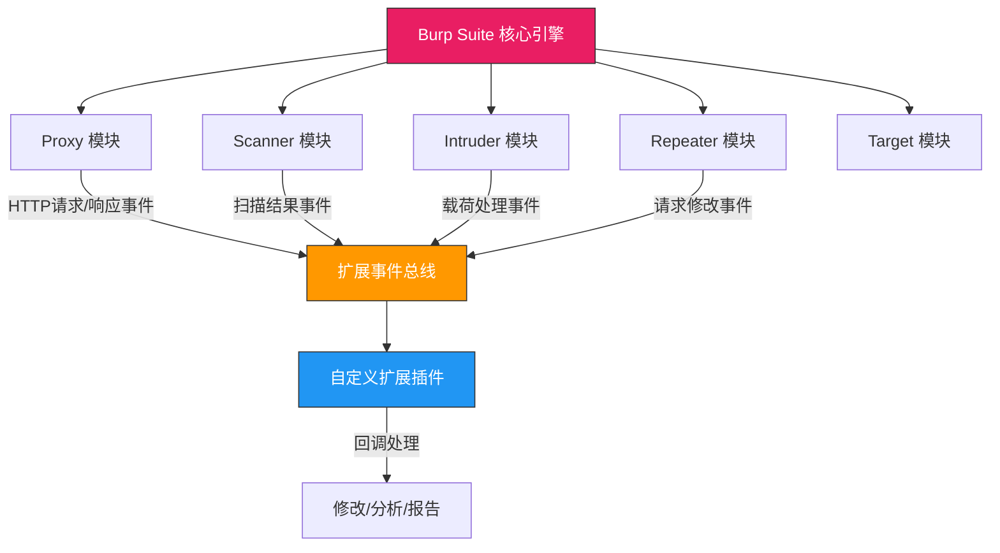
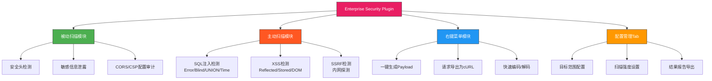

## 33.1 Burp Suite插件开发

Burp Suite是Web安全测试领域的"操作系统"——几乎每一个渗透测试工程师的工作流都围绕它展开。但Burp Suite本身只是一个框架，真正让它变得无懈可击的，是它的扩展（Extension）体系。通过插件开发，你可以将自定义的检测逻辑、自动化工作流、数据处理能力无缝嵌入Burp Suite的工作界面，让它从一个通用工具变成一把量身定制的手术刀。

本节将从Burp Suite扩展架构的底层原理讲起，逐步覆盖Java和Python两种开发路径，最终通过一个完整的实战案例——自定义SQL注入检测插件——将所有知识点串联起来。

### 33.1.1 Burp Suite扩展架构原理

#### 扩展机制的本质

Burp Suite基于Java构建，其扩展系统本质上是一个**插件化的事件驱动架构**。Burp Suite内部维护着多个功能模块（Proxy、Scanner、Intruder、Repeater、Target等），每个模块在处理HTTP请求/响应的过程中会触发特定事件。扩展通过注册监听器（Listener）来捕获这些事件，并在事件回调中注入自定义逻辑。



这个架构的关键特征是：

1. **被动监听**：扩展不需要主动轮询，而是被动接收Burp Suite推送的事件
2. **双向拦截**：既可以拦截请求（发往服务器前），也可以拦截响应（返回给浏览器前）
3. **模块化注册**：每个扩展只注册自己关心的事件类型，不需要的事件不会被推送
4. **线程安全**：Burp Suite保证事件回调在独立线程中执行，但扩展开发者需要自行处理并发问题

#### 两代API：Legacy API vs Montoya API

Burp Suite在2022年推出了全新的**Montoya API**（以安全研究员Montoya命名），用于替代基于`burp.*`包的传统Legacy API。理解两代API的差异是选择开发路径的前提。

| 维度 | Legacy API（burp.*） | Montoya API（burp.api.montoya） |
|------|----------------------|--------------------------------|
| 引入版本 | Burp Suite 1.x | Burp Suite 2022.1+ |
| 包名空间 | `burp.*` | `burp.api.montoya.*` |
| 注册入口 | `IBurpExtender.registerExtenderCallbacks` | `MontoyaExtension.initialize` |
| 接口命名 | `I`前缀（`IHttpListener`） | 功能化命名（`HttpListener`） |
| 类型安全 | 弱类型（大量`byte[]`和`String`） | 强类型（`Request`/`Response`对象） |
| API风格 | 命令式（回调方法） | 流式（支持链式调用） |
| 社区支持 | 成熟，示例丰富 | 活跃，是官方推荐方向 |
| 向后兼容 | 完全兼容 | Legacy插件可在新版Burp中运行 |

**选择建议**：新项目优先使用Montoya API，维护旧项目可以继续使用Legacy API。Montoya API的强类型设计能显著减少运行时错误，其流式接口也让代码更简洁。

```java
// Legacy API 风格
callbacks.registerHttpListener(new IHttpListener() {
    @Override
    public void processHttpMessage(int toolFlag, boolean messageIsRequest,
                                   IHttpRequestResponse messageInfo) {
        // 处理逻辑
    }
});

// Montoya API 风格
montoya.api().http().registerHttpHandler(new HttpHandler() {
    @Override
    public void handleHttpMessage(HttpMessageIntercepted message) {
        if (message.messageSource().isRequest()) {
            // 处理请求
        }
    }
});
```

#### 扩展类型全景

Burp Suite扩展不只是"写个HTTP监听器"这么简单。根据使用场景，扩展可以挂载到不同的功能入口：

| 扩展类型 | 核心接口 | 典型用途 |
|----------|----------|----------|
| HTTP监听器 | `HttpListener` / `IHttpListener` | 自动修改/分析经过Burp的每个请求 |
| 主动扫描检查 | `ActiveScanCheck` / `IScannerCheck` | 自定义漏洞检测逻辑 |
| 被动扫描检查 | `PassiveScanCheck` | 从响应中被动发现安全问题 |
| 上下文菜单 | `ContextMenuFactory` / `IContextMenuFactory` | 右键菜单自定义操作 |
| Intruder载荷处理器 | `IntruderPayloadProcessor` | 自定义Fuzzing载荷变换 |
| Proxy HTTP处理 | `ProxyHttpHandler` | 拦截并修改代理流量 |
| 自定义Tab页 | `Tab` / `ITab` | 在Burp界面中添加自定义面板 |
| 消息编辑器 | `MessageEditorController` | 自定义请求/响应编辑器 |
| 漏洞定义 | `VulnerabilityDefiner` / `IScanIssue` | 定义新的漏洞类型 |

### 33.1.2 开发环境搭建

#### 基础环境配置

Burp Suite插件开发需要Java开发环境。以下是完整的搭建步骤：

**1. JDK安装**

```bash
# Ubuntu/Debian
sudo apt update
sudo apt install openjdk-17-jdk

# CentOS/RHEL
sudo yum install java-17-openjdk-devel

# 验证安装
java -version
javac -version
```

**2. Maven项目初始化**

```xml
<!-- pom.xml -->
<?xml version="1.0" encoding="UTF-8"?>
<project xmlns="http://maven.apache.org/POM/4.0.0"
         xmlns:xsi="http://www.w3.org/2001/XMLSchema-instance"
         xsi:schemaLocation="http://maven.apache.org/POM/4.0.0
         http://maven.apache.org/xsd/maven-4.0.0.xsd">
    <modelVersion>4.0.0</modelVersion>
    
    <groupId>com.example.burp</groupId>
    <artifactId>custom-security-scanner</artifactId>
    <version>1.0.0</version>
    <packaging>jar</packaging>
    
    <properties>
        <maven.compiler.source>11</maven.compiler.source>
        <maven.compiler.target>11</maven.compiler.target>
        <project.build.sourceEncoding>UTF-8</project.build.sourceEncoding>
    </properties>
    
    <dependencies>
        <!-- Burp Suite Montoya API（从Burp Suite安装目录获取） -->
        <dependency>
            <groupId>net.portswigger.burp.extensions</groupId>
            <artifactId>montoya-api</artifactId>
            <version>LATEST</version>
            <scope>system</scope>
            <systemPath>${project.basedir}/lib/montoya-api.jar</systemPath>
        </dependency>
    </dependencies>
    
    <build>
        <plugins>
            <plugin>
                <groupId>org.apache.maven.plugins</groupId>
                <artifactId>maven-shade-plugin</artifactId>
                <version>3.5.0</version>
                <executions>
                    <execution>
                        <phase>package</phase>
                        <goals><goal>shade</goal></goals>
                    </execution>
                </executions>
            </plugin>
        </plugins>
        <finalName>CustomSecurityScanner</finalName>
    </build>
</project>
```

**3. IDE配置（IntelliJ IDEA）**

- 导入Maven项目
- 将Burp Suite安装目录下的API jar添加为项目库（File → Project Structure → Libraries）
- 配置运行参数：`--project-file <your_project_path>`（用于热重载）
- 安装Burp Suite Companion插件（JetBrains插件市场搜索"Burp Suite Companion"）

**4. 打包与加载**

```bash
# 编译打包
mvn clean package

# 生成的jar文件在 target/CustomSecurityScanner.jar
# 在Burp Suite中加载：Extender → Extensions → Add → Extension type: Java → 选择jar文件
```

#### 项目结构规范

一个专业的Burp Suite插件项目应该遵循以下目录结构：

```text
custom-scanner/
├── pom.xml
├── src/
│   └── main/
│       └── java/
│           └── com/
│               └── example/
│                   └── burp/
│                       ├── BurpExtender.java        # 入口类（必须在burp包下）
│                       ├── scanner/
│                       │   ├── CustomActiveCheck.java
│                       │   └── CustomPassiveCheck.java
│                       ├── listener/
│                       │   └── RequestModifier.java
│                       ├── ui/
│                       │   ├── ConfigTab.java
│                       │   └── ResultPanel.java
│                       └── model/
│                           ├── ScanResult.java
│                           └── Config.java
├── lib/
│   └── montoya-api.jar
├── README.md
└── build.sh
```

**关键规则**：入口类必须位于`burp`包下（Legacy API）或实现`BurpExtension`接口（Montoya API），否则Burp Suite无法识别。

### 33.1.3 Java扩展开发：从基础到进阶

#### 基础结构：HTTP监听器

HTTP监听器是最基础也是最常用的扩展类型。它能拦截Burp Suite处理的每一个HTTP消息（包括Proxy、Repeater、Scanner等模块的流量），让你在消息流转过程中注入自定义逻辑。

```java
package burp;

import burp.api.montoya.BurpExtension;
import burp.api.montoya.MontoyaApi;
import burp.api.montoya.http.HttpService;
import burp.api.montoya.http.handler.HttpHandler;
import burp.api.montoya.http.handler.HttpMessageIntercepted;
import burp.api.montoya.http.handler.HttpRequestToBeSent;
import burp.api.montoya.http.handler.HttpResponseReceived;
import burp.api.montoya.http.message.HttpRequestResponse;
import burp.api.montoya.logging.Logging;

public class BurpExtender implements BurpExtension {
    
    private MontoyaApi api;
    private Logging logging;
    
    @Override
    public void initialize(MontoyaApi api) {
        this.api = api;
        this.logging = api.logging();
        
        // 设置扩展名称
        api.extension().setName("Custom Security Scanner v1.0");
        
        // 注册HTTP处理器
        api.http().registerHttpHandler(new SecurityHttpHandler(logging));
        
        // 注册自定义Tab页
        api.userInterface().registerTab(new ConfigTab(api));
        
        logging.logToInfo("Custom Security Scanner loaded successfully");
    }
}
```

```java
package burp;

import burp.api.montoya.http.handler.HttpHandler;
import burp.api.montoya.http.handler.HttpMessageIntercepted;
import burp.api.montoya.http.handler.HttpRequestToBeSent;
import burp.api.montoya.http.handler.HttpResponseReceived;
import burp.api.montoya.http.message.HttpRequestResponse;
import burp.api.montoya.logging.Logging;

import java.util.List;

public class SecurityHttpHandler implements HttpHandler {
    
    private final Logging logging;
    private static final List<String> SECURITY_HEADERS = List.of(
        "X-Frame-Options",
        "X-Content-Type-Options",
        "Content-Security-Policy",
        "Strict-Transport-Security",
        "X-XSS-Protection"
    );
    
    public SecurityHttpHandler(Logging logging) {
        this.logging = logging;
    }
    
    @Override
    public HttpRequestToBeSent handleHttpRequestToBeSent(HttpRequestToBeSent request) {
        // 分析请求中的安全风险
        analyzeRequestSecurity(request);
        
        // 返回原始请求（如需修改，可构建新请求返回）
        return request;
    }
    
    @Override
    public HttpResponseReceived handleHttpResponseReceived(HttpResponseReceived response) {
        // 分析响应中的安全头缺失
        analyzeSecurityHeaders(response);
        
        // 检查敏感信息泄露
        checkSensitiveDataLeakage(response);
        
        return response;
    }
    
    private void analyzeRequestSecurity(HttpRequestToBeSent request) {
        String url = request.url();
        
        // 检查Cookie安全属性
        List<String> cookies = request.cookieJarEntries();
        for (String cookie : cookies) {
            if (cookie.toLowerCase().contains("session")) {
                if (!cookie.contains("Secure") || !cookie.contains("HttpOnly")) {
                    logging.logToWarning("Insecure session cookie at: " + url);
                }
            }
        }
        
        // 检查敏感参数是否通过GET传递
        if (request.method().equalsIgnoreCase("GET")) {
            String query = url.contains("?") ? url.substring(url.indexOf('?')) : "";
            if (query.toLowerCase().contains("password") || 
                query.toLowerCase().contains("token") ||
                query.toLowerCase().contains("secret")) {
                logging.logToWarning("Sensitive parameter in GET request: " + url);
            }
        }
    }
    
    private void analyzeSecurityHeaders(HttpResponseReceived response) {
        for (String header : SECURITY_HEADERS) {
            if (response.headerValue(header) == null) {
                logging.logToInfo("Missing security header: " + header + 
                    " at " + response.request().url());
            }
        }
    }
    
    private void checkSensitiveDataLeakage(HttpResponseReceived response) {
        String body = response.bodyToString();
        String[] sensitivePatterns = {
            "password", "passwd", "pwd",
            "api_key", "apikey", "api-key",
            "secret_key", "access_token",
            "BEGIN RSA PRIVATE KEY",
            "jdbc:mysql://",
            "mongodb://"
        };
        
        String lowerBody = body.toLowerCase();
        for (String pattern : sensitivePatterns) {
            if (lowerBody.contains(pattern)) {
                logging.logToWarning("Possible sensitive data leakage: " + pattern +
                    " found in response from " + response.request().url());
            }
        }
    }
}
```

**代码解析**：

- `handleHttpRequestToBeSent`：在请求发送到服务器之前被调用，可以修改请求内容（如添加自定义头、篡改参数）
- `handleHttpResponseReceived`：在响应从服务器返回后被调用，可以分析响应内容（如检查安全头、检测信息泄露）
- `logging.logToInfo/Warning/Error`：输出到Burp Suite的Event Log面板，是调试扩展的主要手段
- 返回修改后的对象才会生效；返回原始对象相当于不修改

#### 自定义扫描检查（Scanner Check）

自定义扫描检查是Burp Suite扩展最强大的功能之一。它允许你在Burp的主动/被动扫描流程中注入自定义漏洞检测逻辑，与Burp内置的扫描引擎协同工作。

##### 被动扫描检查（Passive Scan Check）

被动扫描只检查已经通过代理的流量，不会额外发送请求，适合发现信息泄露、配置错误等不改变请求就能检测的问题。

```java
package burp;

import burp.api.montoya.MontoyaApi;
import burp.api.montoya.scanner.ScanCheck;
import burp.api.montoya.scanner.ScannerInsertionPoint;
import burp.api.montoya.http.message.HttpRequestResponse;
import burp.api.montoya.http.message.responses.HttpResponse;
import burp.api.montoya.scanner.ScanIssue;
import burp.api.montoya.scanner.CollaboratorClient;
import burp.api.montoya.http.message.requests.HttpRequest;
import burp.api.montoya.http.HttpService;

import java.util.ArrayList;
import java.util.List;

public class CustomPassiveCheck implements ScanCheck {
    
    private final MontoyaApi api;
    
    public CustomPassiveCheck(MontoyaApi api) {
        this.api = api;
    }
    
    @Override
    public List<ScanIssue> passiveScanCheck(HttpRequestResponse baseRequestResponse) {
        List<ScanIssue> issues = new ArrayList<>();
        HttpResponse response = baseRequestResponse.response();
        String responseBody = response.bodyToString();
        
        // 检测1：响应中是否包含调试信息泄露
        checkDebugInfoLeakage(baseRequestResponse, responseBody, issues);
        
        // 检测2：响应中是否包含内部IP地址
        checkInternalIpDisclosure(baseRequestResponse, responseBody, issues);
        
        // 检测3：是否缺少关键安全头
        checkMissingSecurityHeaders(baseRequestResponse, issues);
        
        // 检测4：CORS配置是否过于宽松
        checkCorsMisconfiguration(baseRequestResponse, issues);
        
        // 检测5：是否泄露服务器版本信息
        checkServerVersionDisclosure(baseRequestResponse, issues);
        
        return issues;
    }
    
    private void checkDebugInfoLeakage(HttpRequestResponse baseRequestResponse,
                                        String responseBody,
                                        List<ScanIssue> issues) {
        String[] debugPatterns = {
            "stack trace", "stacktrace",
            "Exception in thread", "Traceback (most recent call last)",
            "at com\\.java\\..*\\(", "at org\\.springframework\\.",
            "SQLSTATE\\[", "ORA-\\d{5}",
            "DEBUG:", "VERBOSE:",
            "phpinfo\\(\\)", "php.ini"
        };
        
        String lowerBody = responseBody.toLowerCase();
        for (String pattern : debugPatterns) {
            if (lowerBody.contains(pattern.toLowerCase())) {
                issues.add(api.scanner().createScanIssue(
                    baseRequestResponse,
                    "Debug Information Leakage",
                    "The application exposes debug information that could " +
                    "aid an attacker. Detected pattern: " + pattern,
                    "Medium",
                    "Certain"
                ));
                return; // 每个请求只报一次
            }
        }
    }
    
    private void checkInternalIpDisclosure(HttpRequestResponse baseRequestResponse,
                                            String responseBody,
                                            List<ScanIssue> issues) {
        // 匹配RFC 1918私有地址范围
        String ipPattern = "(10\\.\\d{1,3}\\.\\d{1,3}\\.\\d{1,3}|" +
                           "172\\.(1[6-9]|2[0-9]|3[01])\\.\\d{1,3}\\.\\d{1,3}|" +
                           "192\\.168\\.\\d{1,3}\\.\\d{1,3})";
        
        java.util.regex.Pattern pattern = java.util.regex.Pattern.compile(ipPattern);
        java.util.regex.Matcher matcher = pattern.matcher(responseBody);
        
        List<String> foundIps = new ArrayList<>();
        while (matcher.find()) {
            if (!foundIps.contains(matcher.group())) {
                foundIps.add(matcher.group());
            }
        }
        
        if (!foundIps.isEmpty()) {
            issues.add(api.scanner().createScanIssue(
                baseRequestResponse,
                "Internal IP Address Disclosure",
                "The response contains internal IP addresses: " + String.join(", ", foundIps),
                "Low",
                "Certain"
            ));
        }
    }
    
    private void checkMissingSecurityHeaders(HttpRequestResponse baseRequestResponse,
                                              List<ScanIssue> issues) {
        HttpResponse response = baseRequestResponse.response();
        
        String[][] headerChecks = {
            {"X-Content-Type-Options", "Medium", "Without this header, browsers may " +
                "MIME-sniff responses to determine content type"},
            {"X-Frame-Options", "Medium", "Without this header, the page may be " +
                "vulnerable to clickjacking attacks"},
            {"Content-Security-Policy", "Low", "A CSP header helps prevent XSS, " +
                "code injection, and clickjacking"}
        };
        
        for (String[] check : headerChecks) {
            if (response.headerValue(check[0]) == null) {
                issues.add(api.scanner().createScanIssue(
                    baseRequestResponse,
                    "Missing Security Header: " + check[0],
                    check[2],
                    check[1],
                    "Firm"
                ));
            }
        }
    }
    
    private void checkCorsMisconfiguration(HttpRequestResponse baseRequestResponse,
                                            List<ScanIssue> issues) {
        HttpResponse response = baseRequestResponse.response();
        String accessControlOrigin = response.headerValue("Access-Control-Allow-Origin");
        
        if (accessControlOrigin != null) {
            if (accessControlOrigin.equals("*")) {
                issues.add(api.scanner().createScanIssue(
                    baseRequestResponse,
                    "CORS Misconfiguration: Wildcard Origin",
                    "The Access-Control-Allow-Origin header is set to '*', " +
                    "which allows any origin to make cross-origin requests. " +
                    "This may expose sensitive data to unauthorized websites.",
                    "Medium",
                    "Firm"
                ));
            }
            
            String accessControlCreds = response.headerValue("Access-Control-Allow-Credentials");
            if (accessControlCreds != null && accessControlCreds.equalsIgnoreCase("true")) {
                issues.add(api.scanner().createScanIssue(
                    baseRequestResponse,
                    "CORS Misconfiguration: Credentials with Permissive Origin",
                    "The server allows credentials in cross-origin requests " +
                    "while permitting a broad origin. This may enable " +
                    "credential theft via cross-origin attacks.",
                    "High",
                    "Firm"
                ));
            }
        }
    }
    
    private void checkServerVersionDisclosure(HttpRequestResponse baseRequestResponse,
                                               List<ScanIssue> issues) {
        HttpResponse response = baseRequestResponse.response();
        String server = response.headerValue("Server");
        String xPoweredBy = response.headerValue("X-Powered-By");
        
        if (server != null && server.matches(".*\\d+.*")) {
            issues.add(api.scanner().createScanIssue(
                baseRequestResponse,
                "Server Version Disclosure",
                "The Server header reveals version information: '" + server + 
                "'. This helps attackers identify known vulnerabilities " +
                "for the specific software version.",
                "Low",
                "Certain"
            ));
        }
        
        if (xPoweredBy != null) {
            issues.add(api.scanner().createScanIssue(
                baseRequestResponse,
                "Technology Disclosure via X-Powered-By",
                "The X-Powered-By header reveals: '" + xPoweredBy + "'",
                "Low",
                "Certain"
            ));
        }
    }
    
    @Override
    public int consolidateDuplicateIssues(ScanIssue existingIssue, ScanIssue newIssue) {
        if (existingIssue.url().equals(newIssue.url()) &&
            existingIssue.name().equals(newIssue.name())) {
            return -1; // 忽略重复
        }
        return 0; // 保留
    }
}
```

##### 主动扫描检查（Active Scan Check）

主动扫描会额外发送探测请求来验证漏洞，是编写自定义漏洞检测器的核心。下面是完整的自定义SQL注入检测器实现：

```java
package burp;

import burp.api.montoya.MontoyaApi;
import burp.api.montoya.http.message.HttpRequestResponse;
import burp.api.montoya.http.message.requests.HttpRequest;
import burp.api.montoya.http.HttpService;
import burp.api.montoya.http.handler.HttpRequestToBeSent;
import burp.api.montoya.scanner.ScannerCheck;
import burp.api.montoya.scanner.ScannerInsertionPoint;
import burp.api.montoya.scanner.ScanIssue;
import burp.api.montoya.http.message.params.HttpParameterType;
import burp.api.montoya.http.message.params.ParsedHttpParameter;

import java.util.ArrayList;
import java.util.List;
import java.util.regex.Pattern;

public class CustomSQLInjectionCheck implements ScannerCheck {
    
    private final MontoyaApi api;
    
    // SQL错误特征数据库——覆盖主流数据库的错误信息
    private static final String[][] SQL_ERROR_SIGNATURES = {
        // MySQL
        {"MySQL", "sql syntax.*?MySQL", "Warning.*?mysql_", "MySqlException",
         "valid MySQL result", "check the manual that corresponds to your MySQL"},
        // PostgreSQL
        {"PostgreSQL", "PostgreSQL.*?ERROR", "Warning.*?pg_", "valid PostgreSQL result",
         "Npgsql\\.", "PG::SyntaxError"},
        // Microsoft SQL Server
        {"MSSQL", "Driver.*?SQL[\\-\\ ]*Server", "OLE DB.*?SQL Server",
         "\\\\bSQL Server[^&lt;]\\";\\u00a6",
         "com\\.microsoft\\.sqlserver\\.jdbc", "Unclosed quotation mark"},
        // Oracle
        {"Oracle", "\\\\bORA-[0-9][0-9][0-9][0-9]", "Oracle error",
         "Oracle.*?Driver", "Warning.*?oci_", "Warning.*?ora_"},
        // SQLite
        {"SQLite", "SQLite/JDBCDriver", "SQLite\\.Exception",
         "System\\.Data\\.SQLite\\.SQLiteException", "Warning.*?sqlite_"},
    };
    
    // 用于检测布尔盲注的差异模式
    private static final String BLIND_TRUE_MARKER = "BLIND_TRUE_12345";
    private static final String BLIND_FALSE_MARKER = "BLIND_FALSE_67890";
    
    public CustomSQLInjectionCheck(MontoyaApi api) {
        this.api = api;
    }
    
    @Override
    public List<ScanIssue> activeScanCheck(
            HttpRequestResponse baseRequestResponse,
            ScannerInsertionPoint insertionPoint) {
        
        List<ScanIssue> issues = new ArrayList<>();
        
        // 依次测试不同类型的SQL注入
        checkErrorBasedSQLi(baseRequestResponse, insertionPoint, issues);
        checkBooleanBlindSQLi(baseRequestResponse, insertionPoint, issues);
        checkTimeBlindSQLi(baseRequestResponse, insertionPoint, issues);
        checkUnionBasedSQLi(baseRequestResponse, insertionPoint, issues);
        
        return issues;
    }
    
    /**
     * 基于错误的SQL注入检测
     * 原理：注入特殊SQL字符触发数据库错误，若错误信息出现在响应中则判定存在漏洞
     */
    private void checkErrorBasedSQLi(
            HttpRequestResponse baseRequestResponse,
            ScannerInsertionPoint insertionPoint,
            List<ScanIssue> issues) {
        
        // 每种payload类型覆盖不同的数据库和注入位置
        String[] errorPayloads = {
            "'",
            "\"",
            "' OR '1'='1",
            "\" OR \"1\"=\"1",
            "1' ORDER BY 100--",
            "1' AND 1=CONVERT(int, (SELECT @@version))--",
            "1' UNION SELECT NULL--",
            "1' AND EXTRACTVALUE(1, CONCAT(0x7e, (SELECT version()), 0x7e))--",
            "1' AND UPDATEXML(1, CONCAT(0x7e, (SELECT user()), 0x7e), 1)--",
        };
        
        for (String payload : errorPayloads) {
            // 使用insertion point构建注入后的请求
            HttpRequest checkRequest = insertionPoint.buildHttpRequest(
                baseRequestResponse.request().withBody(
                    baseRequestResponse.request().bodyToString()
                ).addOrUpdateParameter(
                    // 在每个参数位置尝试注入
                    ParsedHttpParameter.httpParameter(
                        "test", payload, HttpParameterType.BODY
                    )
                )
            );
            
            HttpRequestResponse checkResponse = api.http().sendRequest(
                baseRequestResponse.httpService(), checkRequest
            );
            
            if (checkResponse != null && checkResponse.response() != null) {
                String responseBody = checkResponse.response().bodyToString();
                
                if (detectSQLiErrors(responseBody)) {
                    issues.add(api.scanner().createScanIssue(
                        baseRequestResponse.withResponse(checkResponse),
                        "SQL Injection (Error-Based)",
                        "The application appears vulnerable to error-based " +
                        "SQL injection. Payload: " + payload + "\n" +
                        "The response contains SQL error messages that " +
                        "indicate unsanitized input is being used in database queries.",
                        "High",
                        "Firm"
                    ));
                    return; // 一旦发现就不再继续测试该类型
                }
            }
        }
    }
    
    /**
     * 布尔盲注检测
     * 原理：构造两个逻辑上应产生不同响应的payload，对比响应差异
     */
    private void checkBooleanBlindSQLi(
            HttpRequestResponse baseRequestResponse,
            ScannerInsertionPoint insertionPoint,
            List<ScanIssue> issues) {
        
        // 获取原始响应作为基准
        String originalBody = baseRequestResponse.response().bodyToString();
        int originalLength = originalBody.length();
        
        // 构造true条件：1=1（永真）
        String truePayload = "' OR 1=1--";
        // 构造false条件：1=2（永假）
        String falsePayload = "' OR 1=2--";
        
        HttpRequest trueRequest = insertionPoint.buildHttpRequest(
            baseRequestResponse.request().withBody(
                baseRequestResponse.request().bodyToString()
            ).addOrUpdateParameter(
                ParsedHttpParameter.httpParameter("test", truePayload, HttpParameterType.BODY)
            )
        );
        
        HttpRequest falseRequest = insertionPoint.buildHttpRequest(
            baseRequestResponse.request().withBody(
                baseRequestResponse.request().bodyToString()
            ).addOrUpdateParameter(
                ParsedHttpParameter.httpParameter("test", falsePayload, HttpParameterType.BODY)
            )
        );
        
        HttpRequestResponse trueResponse = api.http().sendRequest(
            baseRequestResponse.httpService(), trueRequest
        );
        HttpRequestResponse falseResponse = api.http().sendRequest(
            baseRequestResponse.httpService(), falseRequest
        );
        
        if (trueResponse != null && falseResponse != null &&
            trueResponse.response() != null && falseResponse.response() != null) {
            
            int trueLength = trueResponse.response().bodyToString().length();
            int falseLength = falseResponse.response().bodyToString().length();
            int diffThreshold = Math.max(originalLength / 10, 100);
            
            // 如果true和false条件产生了显著不同的响应长度
            if (Math.abs(trueLength - falseLength) > diffThreshold) {
                issues.add(api.scanner().createScanIssue(
                    baseRequestResponse.withResponse(trueResponse),
                    "SQL Injection (Boolean Blind)",
                    "The application appears vulnerable to boolean-based " +
                    "blind SQL injection. The true condition (payload: " +
                    truePayload + ") and false condition (payload: " +
                    falsePayload + ") produce significantly different " +
                    "response lengths (" + trueLength + " vs " + falseLength + " bytes).",
                    "High",
                    "Probable"
                ));
            }
        }
    }
    
    /**
     * 时间盲注检测
     * 原理：注入SLEEP/WAITFOR命令，观察响应延迟是否超过阈值
     */
    private void checkTimeBlindSQLi(
            HttpRequestResponse baseRequestResponse,
            ScannerInsertionPoint insertionPoint,
            List<ScanIssue> issues) {
        
        String[] timePayloads = {
            "' OR SLEEP(5)--",
            "' OR pg_sleep(5)--",
            "' OR WAITFOR DELAY '0:0:5'--",
        };
        
        for (String payload : timePayloads) {
            HttpRequest checkRequest = insertionPoint.buildHttpRequest(
                baseRequestResponse.request().withBody(
                    baseRequestResponse.request().bodyToString()
                ).addOrUpdateParameter(
                    ParsedHttpParameter.httpParameter("test", payload, HttpParameterType.BODY)
                )
            );
            
            long startTime = System.currentTimeMillis();
            HttpRequestResponse checkResponse = api.http().sendRequest(
                baseRequestResponse.httpService(), checkRequest
            );
            long elapsed = System.currentTimeMillis() - startTime;
            
            // 如果响应延迟超过4秒（注入的SLEEP为5秒），判定存在时间盲注
            if (elapsed > 4000) {
                issues.add(api.scanner().createScanIssue(
                    baseRequestResponse.withResponse(checkResponse),
                    "SQL Injection (Time-Based Blind)",
                    "The application appears vulnerable to time-based " +
                    "blind SQL injection. Payload: " + payload + "\n" +
                    "Response delay: " + elapsed + "ms (threshold: 4000ms).",
                    "High",
                    "Probable"
                ));
                return;
            }
        }
    }
    
    /**
     * UNION注入列数探测
     * 原理：逐步增加NULL的数量直到响应正常，确定原始查询的列数
     */
    private void checkUnionBasedSQLi(
            HttpRequestResponse baseRequestResponse,
            ScannerInsertionPoint insertionPoint,
            List<ScanIssue> issues) {
        
        String originalBody = baseRequestResponse.response().bodyToString();
        
        for (int cols = 1; cols <= 20; cols++) {
            StringBuilder nulls = new StringBuilder("NULL");
            for (int i = 1; i < cols; i++) {
                nulls.append(",NULL");
            }
            
            String payload = "' UNION SELECT " + nulls + "--";
            
            HttpRequest checkRequest = insertionPoint.buildHttpRequest(
                baseRequestResponse.request().withBody(
                    baseRequestResponse.request().bodyToString()
                ).addOrUpdateParameter(
                    ParsedHttpParameter.httpParameter("test", payload, HttpParameterType.BODY)
                )
            );
            
            HttpRequestResponse checkResponse = api.http().sendRequest(
                baseRequestResponse.httpService(), checkRequest
            );
            
            if (checkResponse != null && checkResponse.response() != null) {
                String responseBody = checkResponse.response().bodyToString();
                
                // 如果列数匹配，响应会变正常（不再有SQL错误）
                if (!detectSQLiErrors(responseBody) && 
                    !responseBody.equals(originalBody) &&
                    responseBody.length() > originalBody.length() * 1.1) {
                    
                    issues.add(api.scanner().createScanIssue(
                        baseRequestResponse.withResponse(checkResponse),
                        "SQL Injection (UNION-Based)",
                        "The application appears vulnerable to UNION-based " +
                        "SQL injection with " + cols + " columns. " +
                        "Payload: " + payload,
                        "High",
                        "Firm"
                    ));
                    return;
                }
            }
        }
    }
    
    /**
     * 检测响应中的SQL错误特征
     */
    private boolean detectSQLiErrors(String response) {
        String lowerResponse = response.toLowerCase();
        
        for (String[] dbErrors : SQL_ERROR_SIGNATURES) {
            for (int i = 1; i < dbErrors.length; i++) {
                if (lowerResponse.contains(dbErrors[i].toLowerCase())) {
                    return true;
                }
            }
        }
        return false;
    }
    
    @Override
    public int consolidateDuplicateIssues(ScanIssue existingIssue, ScanIssue newIssue) {
        if (existingIssue.url().equals(newIssue.url()) &&
            existingIssue.name().equals(newIssue.name())) {
            return -1;
        }
        return 0;
    }
}
```

#### 上下文菜单扩展（ContextMenuFactory）

上下文菜单扩展允许你在Burp Suite的右键菜单中添加自定义操作。这在需要"选中某个请求→执行特定操作"的工作流中非常实用。

```java
package burp;

import burp.api.montoya.MontoyaApi;
import burp.api.montoya.context.ContextMenuFactory;
import burp.api.montoya.context.ContextMenuItemsProvider;
import burp.api.montoya.context.ContextMenuEvent;
import burp.api.montoya.context.ContextMenuItem;

import java.util.ArrayList;
import java.util.List;

public class CustomContextMenu implements ContextMenuItemsProvider {
    
    private final MontoyaApi api;
    
    public CustomContextMenu(MontoyaApi api) {
        this.api = api;
    }
    
    @Override
    public List<ContextMenuItem> provideMenuItems(ContextMenuEvent event) {
        List<ContextMenuItem> menuItems = new ArrayList<>();
        
        // 添加"生成SQL注入Payload"菜单项
        menuItems.add(api.userInterface().menuItems()
            .addMenuItem("Generate SQLi Payloads")
            .onClick(() -> generateSQLIPayloads(event)));
        
        // 添加"导出请求为cURL命令"菜单项
        menuItems.add(api.userInterface().menuItems()
            .addMenuItem("Copy as cURL Command")
            .onClick(() -> copyAsCurl(event)));
        
        // 添加"编码/解码"子菜单
        menuItems.add(api.userInterface().menuItems()
            .addMenuItem("Security Encoding")
            .onClick(() -> openEncodingTool(event)));
        
        return menuItems;
    }
    
    private void generateSQLIPayloads(ContextMenuEvent event) {
        List<String> payloads = new ArrayList<>();
        payloads.add("=== Time-Based Blind ===");
        payloads.add("' OR SLEEP(5)--");
        payloads.add("' OR pg_sleep(5)--");
        payloads.add("' OR WAITFOR DELAY '0:0:5'--");
        payloads.add("");
        payloads.add("=== Error-Based ===");
        payloads.add("' AND EXTRACTVALUE(1, CONCAT(0x7e, (SELECT database()), 0x7e))--");
        payloads.add("' AND UPDATEXML(1, CONCAT(0x7e, (SELECT version()), 0x7e), 1)--");
        payloads.add("");
        payloads.add("=== UNION-Based ===");
        payloads.add("' UNION SELECT NULL,NULL,NULL--");
        payloads.add("' UNION SELECT username,password,NULL FROM users--");
        
        // 将payload复制到剪贴板
        api.userInterface().setClipboardContents(String.join("\n", payloads));
        api.logging().logToInfo("SQLi payloads copied to clipboard");
    }
    
    private void copyAsCurl(ContextMenuEvent event) {
        // 从选中的请求生成cURL命令
        if (event.selectedRequestResponses().size() > 0) {
            var requestResponse = event.selectedRequestResponses().get(0);
            var request = requestResponse.request();
            
            StringBuilder curl = new StringBuilder();
            curl.append("curl -X ").append(request.method()).append(" ");
            curl.append("'").append(request.url()).append("' ");
            
            // 添加请求头
            for (var header : request.headers()) {
                curl.append("-H '").append(header).append("' ");
            }
            
            // 添加请求体
            if (request.bodyToString() != null && !request.bodyToString().isEmpty()) {
                curl.append("-d '").append(request.bodyToString()).append("'");
            }
            
            api.userInterface().setClipboardContents(curl.toString());
        }
    }
    
    private void openEncodingTool(ContextMenuEvent event) {
        // 打开自定义编码工具Tab
        api.userInterface().activateTab("Security Encoding Tool");
    }
}
```

#### GUI Tab页扩展

在Burp Suite界面中添加自定义Tab页，提供配置面板或结果展示界面：

```java
package burp;

import burp.api.montoya.MontoyaApi;
import burp.api.montoya.user界面.Tab;
import burp.api.montoya.user界面.Editor;
import burp.api.montoya.user界面.UserInterface;

import javax.swing.*;
import java.awt.*;

public class ConfigTab implements Tab {
    
    private final MontoyaApi api;
    private JPanel mainPanel;
    private JTextField targetFilterField;
    private JCheckBox enableSQLICheck;
    private JCheckBox enableXSSCheck;
    private JCheckBox enableHeaderCheck;
    
    public ConfigTab(MontoyaApi api) {
        this.api = api;
        initializeUI();
    }
    
    @Override
    public String caption() {
        return "Custom Scanner Config";
    }
    
    @Override
    public Component uiComponent() {
        return mainPanel;
    }
    
    @Override
    public int tabIndex() {
        return Tab.TabPosition.BEFORE_PROXY;
    }
    
    private void initializeUI() {
        mainPanel = new JPanel(new BorderLayout());
        
        // 配置面板
        JPanel configPanel = new JPanel(new GridBagLayout());
        GridBagConstraints gbc = new GridBagConstraints();
        gbc.insets = new Insets(5, 5, 5, 5);
        gbc.anchor = GridBagConstraints.WEST;
        
        // 目标过滤器
        gbc.gridx = 0; gbc.gridy = 0;
        configPanel.add(new JLabel("Target Filter (Regex):"), gbc);
        gbc.gridx = 1; gbc.fill = GridBagConstraints.HORIZONTAL;
        targetFilterField = new JTextField(40);
        targetFilterField.setToolTipText("只对匹配此正则的URL执行扫描");
        configPanel.add(targetFilterField, gbc);
        
        // 扫描选项
        gbc.gridx = 0; gbc.gridy = 1; gbc.gridwidth = 2;
        configPanel.add(new JLabel("Scan Modules:"), gbc);
        
        enableSQLICheck = new JCheckBox("SQL Injection Detection");
        enableXSSCheck = new JCheckBox("XSS Detection");
        enableHeaderCheck = new JCheckBox("Security Header Check");
        
        gbc.gridy = 2; configPanel.add(enableSQLICheck, gbc);
        gbc.gridy = 3; configPanel.add(enableXSSCheck, gbc);
        gbc.gridy = 4; configPanel.add(enableHeaderCheck, gbc);
        
        // 保存按钮
        gbc.gridy = 5;
        JButton saveButton = new JButton("Save Configuration");
        saveButton.addActionListener(e -> saveConfig());
        configPanel.add(saveButton, gbc);
        
        mainPanel.add(configPanel, BorderLayout.NORTH);
        
        // 结果展示面板
        JTextArea logArea = new JTextArea();
        logArea.setEditable(false);
        logArea.setFont(new Font("Monospaced", Font.PLAIN, 12));
        JScrollPane scrollPane = new JScrollPane(logArea);
        mainPanel.add(scrollPane, BorderLayout.CENTER);
    }
    
    private void saveConfig() {
        String filter = targetFilterField.getText();
        boolean sqlEnabled = enableSQLICheck.isSelected();
        boolean xssEnabled = enableXSSCheck.isSelected();
        boolean headerEnabled = enableHeaderCheck.isSelected();
        
        api.logging().logToInfo("Configuration saved - Filter: " + filter +
            ", SQLi: " + sqlEnabled + ", XSS: " + xssEnabled +
            ", Headers: " + headerEnabled);
        
        JOptionPane.showMessageDialog(mainPanel, 
            "Configuration saved successfully!",
            "Success", JOptionPane.INFORMATION_MESSAGE);
    }
}
```

### 33.1.4 Python扩展开发（Jython）

Burp Suite通过Jython（Python on JVM）支持Python扩展开发。Python扩展相比Java的优势在于**开发速度**——你可以用更少的代码实现相同的功能，且不需要编译。但劣势也很明显：Jython目前只支持Python 2.7语法，不支持Python 3和原生C库（如requests、scapy等）。

#### Jython环境配置

1. 下载Jython Standalone JAR：https://www.jython.org/download
2. 在Burp Suite中配置：Extender → Options → Python Environment → 选择jython-standalone.jar路径
3. Python库路径：Extender → Options → Python Environment → 下方"Folder"可以设置第三方库路径

#### 基础HTTP监听器（Python版）

```python
from burp import IBurpExtender, IHttpListener, ITab
from javax.swing import JPanel, JButton, JTextArea, JScrollPane, BorderLayout
import re
import time

class BurpExtender(IBurpExtender, IHttpListener, ITab):
    
    def registerExtenderCallbacks(self, callbacks):
        self._callbacks = callbacks
        self._helpers = callbacks.getHelpers()
        callbacks.setExtensionName("Python Security Scanner")
        callbacks.registerHttpListener(self)
        callbacks.addSuiteTab(self)
        
        # 初始化UI
        self._panel = JPanel(BorderLayout())
        self._log_area = JTextArea(20, 60)
        self._log_area.setEditable(False)
        self._panel.add(JScrollPane(self._log_area), BorderLayout.CENTER)
        
        # 配置按钮
        btn_panel = JPanel()
        btn_clear = JButton("Clear Log")
        btn_clear.addActionListener(lambda e: self._log_area.setText(""))
        btn_panel.add(btn_clear)
        self._panel.add(btn_panel, BorderLayout.SOUTH)
        
        self._log("Python Security Scanner loaded")
    
    def getTabCaption(self):
        return "Py Scanner"
    
    def getUiComponent(self):
        return self._panel
    
    def processHttpMessage(self, toolFlag, messageIsRequest, messageInfo):
        if messageIsRequest:
            self._analyze_request(toolFlag, messageInfo)
        else:
            self._analyze_response(toolFlag, messageInfo)
    
    def _analyze_request(self, toolFlag, messageInfo):
        request_info = self._helpers.analyzeRequest(messageInfo)
        url = str(request_info.getUrl())
        method = request_info.getMethod()
        
        # 检查GET参数中的敏感信息
        if method == "GET":
            query = request_info.getUrl().getQuery()
            if query:
                sensitive_patterns = [
                    r'password', r'token', r'secret',
                    r'api[_-]?key', r'auth',
                    r'session[_-]?id'
                ]
                for pattern in sensitive_patterns:
                    if re.search(pattern, query, re.IGNORECASE):
                        self._log(
                            "[WARNING] Sensitive parameter in GET request: "
                            + url + " (pattern: " + pattern + ")"
                        )
        
        # 检查Authorization头
        headers = list(request_info.getHeaders())
        for header in headers:
            if header.lower().startswith("authorization:"):
                if "bearer" in header.lower():
                    # Bearer token通过URL传递
                    self._log("[WARNING] Bearer token in request header (potential leak): " + url)
    
    def _analyze_response(self, toolFlag, messageInfo):
        response_info = self._helpers.analyzeResponse(messageInfo.getResponse())
        status_code = response_info.getStatusCode()
        url = str(self._helpers.analyzeRequest(messageInfo).getUrl())
        
        # 检查响应中的安全头
        headers = list(response_info.getHeaders())
        header_names = [h.split(":")[0].strip().lower() for h in headers if ":" in h]
        
        missing = []
        required = [
            "x-frame-options",
            "x-content-type-options",
            "content-security-policy",
            "strict-transport-security"
        ]
        
        for req_header in required:
            if req_header not in header_names:
                missing.append(req_header)
        
        if missing:
            self._log(
                "[INFO] Missing security headers at " + url
                + ": " + ", ".join(missing)
            )
        
        # 检查调试信息泄露
        response_body = self._helpers.bytesToString(messageInfo.getResponse())
        debug_patterns = [
            r"stack\s*trace", r"exception\s+in\s+thread",
            r"traceback\s+\(most\s+recent\s+call\s+last\)",
            r"phpinfo\(\)", r"debug\s*mode",
            r"sqlstate\[", r"ORA-\d{5}"
        ]
        
        for pattern in debug_patterns:
            if re.search(pattern, response_body, re.IGNORECASE):
                self._log(
                    "[WARNING] Debug info leakage at " + url
                    + " (pattern: " + pattern + ")"
                )
                break  # 每个请求只报一次
        
        # 检查CORS配置
        for header in headers:
            if header.lower().startswith("access-control-allow-origin:"):
                if "*" in header:
                    self._log(
                        "[WARNING] CORS wildcard origin at " + url
                    )
    
    def _log(self, message):
        timestamp = time.strftime("%H:%M:%S")
        self._log_area.append("[%s] %s\n" % (timestamp, message))
        self._log_area.setCaretPosition(self._log_area.getDocument().getLength())
```

#### Python扩展实战：自定义Intruder载荷生成器

Intruder载荷处理器（Payload Processor）可以在Intruder的每个载荷发送前对载荷进行自定义变换，非常适合实现编码变换、模糊测试生成等场景：

```python
from burp import IBurpExtender, IIntruderPayloadProcessor
import base64
import urllib
import hashlib
import hmac
import time

class BurpExtender(IBurpExtender):
    
    def registerExtenderCallbacks(self, callbacks):
        self._callbacks = callbacks
        callbacks.setExtensionName("Custom Payload Processor")
        
        # 注册各种载荷处理器
        callbacks.registerIntruderPayloadProcessor(CustomEncoderProcessor())
        callbacks.registerIntruderPayloadProcessor(SQLMapEncoderProcessor())
        callbacks.registerIntruderPayloadProcessor(JWTTokenGenerator())
        callbacks.registerIntruderPayloadProcessor(SignatureGenerator())
        
        callbacks.printOutput("Custom Payload Processors loaded")


class CustomEncoderProcessor(IIntruderPayloadProcessor):
    """多编码载荷处理器：支持URL编码、Base64、HTML实体等"""
    
    def getProcessorName(self):
        return "Custom Encoder"
    
    def processPayload(self, baseValue, payload, originalPayload, currentPayload):
        # baseValue是用户在Processing Rules中输入的编码类型
        encoding_type = baseValue.lower() if baseValue else "url"
        payload_str = currentPayload.tostring() if hasattr(currentPayload, 'tostring') else str(currentPayload)
        
        if encoding_type == "url":
            return urllib.quote(payload_str, safe='')
        elif encoding_type == "double_url":
            return urllib.quote(urllib.quote(payload_str, safe=''), safe='')
        elif encoding_type == "base64":
            return base64.b64encode(payload_str.encode()).decode()
        elif encoding_type == "base64url":
            return base64.urlsafe_b64encode(payload_str.encode()).decode()
        elif encoding_type == "html":
            result = ""
            for c in payload_str:
                result += "&#%d;" % ord(c)
            return result
        elif encoding_type == "hex":
            return payload_str.encode().hex()
        elif encoding_type == "unicode":
            result = ""
            for c in payload_str:
                result += "\\u%04x" % ord(c)
            return result
        else:
            return currentPayload


class SQLMapEncoderProcessor(IIntruderPayloadProcessor):
    """SQL注入编码载荷处理器：自动构造各类注入Payload"""
    
    def getProcessorName(self):
        return "SQLi Payload Generator"
    
    def processPayload(self, baseValue, payload, originalPayload, currentPayload):
        payload_str = str(payload)
        injection_type = baseValue.lower() if baseValue else "error"
        
        if injection_type == "error":
            # 构造基于错误的注入
            return "' AND EXTRACTVALUE(1, CONCAT(0x7e, (%s), 0x7e))--" % payload_str
        elif injection_type == "blind":
            # 构造布尔盲注
            return "' AND (SELECT CASE WHEN (%s) THEN 1 ELSE 0 END)=1--" % payload_str
        elif injection_type == "union":
            # 构造UNION注入
            return "' UNION SELECT %s--" % payload_str
        elif injection_type == "time":
            # 构造时间盲注
            return "' OR IF((%s), SLEEP(5), 0)--" % payload_str
        else:
            return currentPayload


class JWTTokenGenerator(IIntruderPayloadProcessor):
    """JWT Token生成器：用于测试JWT相关漏洞"""
    
    def getProcessorName(self):
        return "JWT Token Generator"
    
    def processPayload(self, baseValue, payload, originalPayload, currentPayload):
        payload_str = str(payload)
        
        # 生成Header (algorithm: none 漏洞测试)
        header_none = base64.urlsafe_b64encode(
            b'{"alg":"none","typ":"JWT"}'
        ).decode().rstrip('=')
        
        # 生成Header (弱密钥HMAC)
        header_hmac = base64.urlsafe_b64encode(
            b'{"alg":"HS256","typ":"JWT"}'
        ).decode().rstrip('=')
        
        # Payload
        payload_b64 = base64.urlsafe_b64encode(
            payload_str.encode()
        ).decode().rstrip('=')
        
        # alg=none测试token（无签名）
        token_none = "%s.%s." % (header_none, payload_b64)
        
        return token_none


class SignatureGenerator(IIntruderPayloadProcessor):
    """HMAC签名生成器：用于测试签名验证绕过"""
    
    def getProcessorName(self):
        return "HMAC Signature Generator"
    
    def processPayload(self, baseValue, payload, originalPayload, currentPayload):
        secret = baseValue if baseValue else "secret"
        payload_str = str(payload)
        
        # 生成HMAC-SHA256签名
        signature = hmac.new(
            secret.encode(),
            payload_str.encode(),
            hashlib.sha256
        ).hexdigest()
        
        return "%s.%s" % (payload_str, signature)
```

### 33.1.5 扩展打包与分发

#### Java扩展打包

```bash
#!/bin/bash
# build.sh - 一键打包脚本

set -e

PROJECT_NAME="CustomSecurityScanner"
VERSION="1.0.0"
BUILD_DIR="target"
JAR_FILE="${BUILD_DIR}/${PROJECT_NAME}-${VERSION}.jar"

echo "=== Building ${PROJECT_NAME} v${VERSION} ==="

# 编译
mvn clean package -q

# 验证
if [ ! -f "${JAR_FILE}" ]; then
    echo "ERROR: Build failed, JAR not found"
    exit 1
fi

echo "Build successful: ${JAR_FILE}"
echo ""
echo "To install in Burp Suite:"
echo "  1. Open Burp Suite"
echo "  2. Go to Extender → Extensions → Add"
echo "  3. Extension type: Java"
echo "  4. Select file: ${JAR_FILE}"
echo "  5. Click Next"
```

#### Python扩展打包

Python扩展不需要编译，但建议将代码组织为单文件以方便分发：

```bash
# 将多个.py文件合并为单文件
cat > BurpPythonScanner.py << 'HEREDOC'
#!/usr/bin/env python
# -*- coding: utf-8 -*-
"""
Custom Python Security Scanner for Burp Suite
Author: Your Name
Version: 1.0.0
"""

from burp import IBurpExtender, IHttpListener, ITab
# ... (完整的扩展代码)
HEREDOC

echo "Python extension ready: BurpPythonScanner.py"
echo "Load it in Burp Suite → Extender → Extensions → Add → Extension type: Python"
```

#### 扩展发布到BApp Store

Burp Suite官方扩展商店（BApp Store）是推广你的扩展的最佳渠道。发布流程：

1. 在https://github.com/PortSwigger/bapp-store提交Pull Request
2. 提供扩展的描述、功能说明和截图
3. 经过PortSwigger团队审核后上架
4. 保持更新和维护

### 33.1.6 调试与常见问题

#### 调试技巧

Burp Suite扩展的调试不像普通Java应用那样方便（不能直接attach debugger），需要依赖以下方法：

**1. 输出日志**

```java
// 通过callbacks输出到Event Log
callbacks.printOutput("[INFO] 正常信息");
callbacks.printError("[ERROR] 错误信息");

// 通过Log4j输出到文件（需要在lib目录下放log4j配置）
import org.apache.logging.log4j.LogManager;
import org.apache.logging.log4j.Logger;
private static final Logger logger = LogManager.getLogger(BurpExtender.class);
```

**2. 远程调试**

```bash
# 启动Burp Suite时开启远程调试
java -agentlib:jdwp=transport=dt_socket,server=y,suspend=n,address=5005 \
    -jar burpsuite_community.jar

# 在IntelliJ IDEA中配置Remote Debug连接localhost:5005
```

**3. 异常捕获**

```java
try {
    // 可能出错的代码
} catch (Exception e) {
    // 将异常信息输出到Burp的Event Log
    StringWriter sw = new StringWriter();
    e.printStackTrace(new PrintWriter(sw));
    callbacks.printError(sw.toString());
}
```

#### 常见错误与解决方案

| 错误现象 | 原因 | 解决方案 |
|----------|------|----------|
| 扩展加载后无反应 | 入口类不在`burp`包下 | 确保`package burp;`，且类名正确 |
| `ClassNotFoundException` | 依赖库未打包进jar | 使用maven-shade-plugin合并依赖 |
| 扩展在Tab页显示空白 | UI操作不在EDT线程中执行 | 使用`SwingUtilities.invokeLater()` |
| `NullPointerException` | 未检查response是否为null | 每次使用response前做null检查 |
| 扩展导致Burp卡顿 | 在事件回调中执行了耗时操作 | 使用异步线程执行耗时任务 |
| Jython扩展报语法错误 | 使用了Python 3语法 | Jython只支持Python 2.7语法 |
| 扩展重启后不保留状态 | 未实现持久化 | 使用文件或数据库存储配置 |

#### 性能优化要点

1. **避免阻塞事件循环**：`processHttpMessage` / `handleHttpRequestToBeSent`中的代码必须快速返回，耗时操作（如网络请求、文件I/O）放到异步线程中
2. **减少内存占用**：不要在内存中缓存大量HTTP消息，使用完及时释放引用
3. **批量处理**：如果需要对多个请求做相同操作，尽量在一次扫描中合并处理
4. **线程池**：使用`ExecutorService`管理异步任务，避免无限制创建线程

```java
// 异步执行示例
private final ExecutorService executor = Executors.newFixedThreadPool(4);

@Override
public HttpRequestToBeSent handleHttpRequestToBeSent(HttpRequestToBeSent request) {
    // 轻量级检查放在这里
    if (request.method().equalsIgnoreCase("POST")) {
        executor.submit(() -> {
            // 耗时分析放在线程池中
            heavyAnalysis(request);
        });
    }
    return request;
}
```

### 33.1.7 完整实战案例：企业级Burp Suite安全插件

将前面所有知识点串联起来，实现一个完整的企业级安全插件——**Enterprise Security Plugin**。该插件包含以下功能模块：



**入口类整合：**

```java
package burp;

import burp.api.montoya.BurpExtension;
import burp.api.montoya.MontoyaApi;

public class BurpExtender implements BurpExtension {
    
    @Override
    public void initialize(MontoyaApi api) {
        api.extension().setName("Enterprise Security Plugin");
        
        // 注册被动扫描检查
        api.scanner().registerScanCheck(new CustomPassiveCheck(api));
        
        // 注册主动扫描检查
        api.scanner().registerScanCheck(new CustomSQLInjectionCheck(api));
        api.scanner().registerScanCheck(new CustomXSSCheck(api));
        api.scanner().registerScanCheck(new CustomSSRFCheck(api));
        
        // 注册HTTP处理器
        api.http().registerHttpHandler(new SecurityHttpHandler(api.logging()));
        
        // 注册上下文菜单
        api.userInterface().registerContextMenuItemsProvider(new CustomContextMenu(api));
        
        // 注册配置Tab
        api.userInterface().registerTab(new ConfigTab(api));
        
        api.logging().logToInfo("Enterprise Security Plugin v1.0 loaded");
    }
}
```

### 33.1.8 本节小结

Burp Suite插件开发的核心知识点总结：

| 知识点 | 要点 |
|--------|------|
| 架构原理 | 事件驱动、被动监听、模块化注册 |
| API选择 | 新项目用Montoya API，旧项目用Legacy API |
| 开发语言 | Java功能最全，Python开发最快，Go性能最好 |
| 核心接口 | HttpListener、ScanCheck、ContextMenuFactory、Tab |
| 调试方法 | 日志输出、远程调试、异常捕获 |
| 性能关键 | 异步处理、避免阻塞、线程池管理 |
| 打包分发 | Java用maven-shade-plugin，Python直接分发.py文件 |

**扩展阅读**：
- Burp Suite官方文档：https://portswigger.net/burp/extender
- Montoya API Javadoc：https://portswigger.net/burp/extender/api/
- BApp Store扩展源码：https://github.com/PortSwigger/bapp-store
- 社区项目：https://github.com/nickvdyck/burp-awesome-tabs
