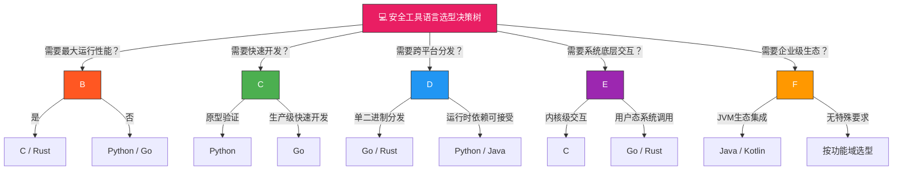
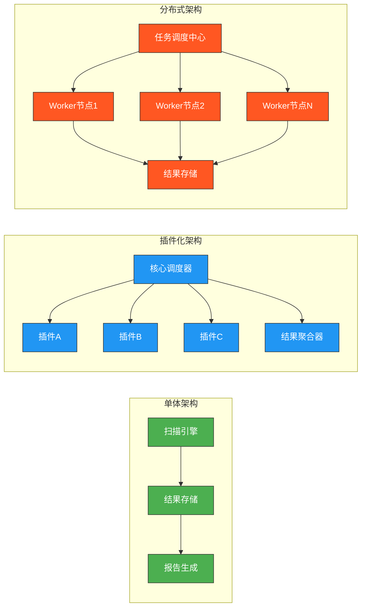
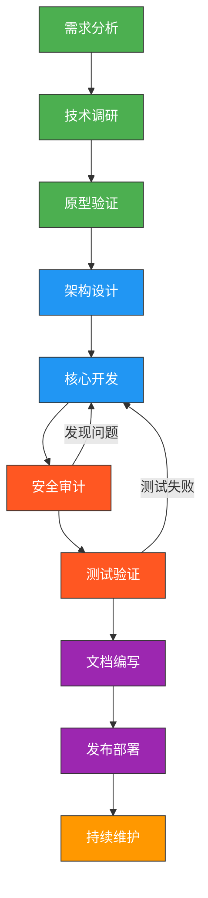
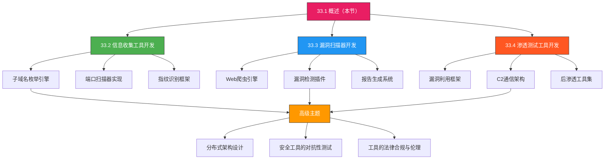

## 33.1 安全工具开发概述

安全工具是网络安全攻防体系的核心载体。无论是蓝队的入侵检测系统，还是红队的漏洞利用框架，亦或是甲方安全团队的自动化扫描平台，它们背后都遵循着相似的开发理念和工程方法论。本节作为安全工具开发篇的开篇，将系统性地梳理安全工具的分类体系、开发原则、技术选型和工程架构，为后续各专题的深入学习奠定全局认知基础。

---

### 33.1.1 安全工具的分类体系

安全工具的分类不是简单的标签贴附，而是基于**功能域、使用场景、技术层次**三个维度构建的知识地图。理解这张地图，才能在面对具体安全需求时快速定位合适的工具，或设计出匹配需求的新工具。

```mermaid
graph TD
    A["🛠️ 安全工具生态全景"]

    A --> B["信息收集与侦察"]
    A --> C["漏洞检测与扫描"]
    A --> D["渗透测试与利用"]
    A --> E["防御监控与响应"]
    A --> F["辅助与支撑工具"]
    A --> G["安全开发工具链"]

    B --> B1["子域名枚举：Sublist3r、Amass、assetfinder"]
    B --> B2["端口扫描：Nmap、Masscan、RustScan"]
    B --> B3["指纹识别：Wappalyzer、WhatWeb、Finger"]
    B --> B4["敏感信息收集：theHarvester、Shodan API"]

    C --> C1["Web漏洞扫描：Nikto、Xray、Nuclei"]
    C --> C2["二进制分析：Ghidra、IDA Pro、Binary Ninja"]
    C --> C3["SAST工具：Semgrep、CodeQL、SonarQube"]
    C --> C4["DAST工具：OWASP ZAP、Burp Suite"]

    D --> D1["漏洞利用：Metasploit、ExploitDB"]
    D --> D2["后渗透：Cobalt Strike、Sliver"]
    D --> D3["提权工具：LinPEAS、WinPEAS"]
    D --> D4["密码攻击：Hashcat、John the Ripper"]

    E --> E1["入侵检测：Suricata、Snort"]
    E --> E2["日志分析：ELK Stack、Splunk"]
    E --> E3["SIEM平台：Wazuh、Graylog"]
    E --> E4["蜜罐系统：T-Pot、Cowrie"]

    F --> F1["编码转换：CyberChef、Base64"]
    F --> F2["流量分析：Wireshark、tcpdump"]
    F --> F3["数据处理：pdftotext、exiftool"]

    G --> G1[" fuzzing框架：AFL++、libFuzzer"]
    G --> G2["二进制插桩：Pin、DynamoRIO"]
    G --> G3["符号执行：angr、Manticore"]

    style A fill:#E91E63,stroke:#333,color:#fff
    style B fill:#4CAF50,stroke:#333,color:#fff
    style C fill:#2196F3,stroke:#333,color:#fff
    style D fill:#FF5722,stroke:#333,color:#fff
    style E fill:#9C27B0,stroke:#333,color:#fff
    style F fill:#FF9800,stroke:#333,color:#fff
    style G fill:#00BCD4,stroke:#333,color:#fff
```



#### 一、信息收集与侦察工具

信息收集是安全评估的第一步，也是所有后续操作的基础。这类工具的核心目标是**在最小化暴露的前提下，尽可能全面地获取目标信息**。

**子域名枚举**解决了"目标有哪些暴露面"的问题。技术路线分为三类：

| 技术路线 | 代表工具 | 原理 | 优势 | 劣势 |
|----------|----------|------|------|------|
| DNS爆破 | Sublist3r | 使用预置字典递归查询DNS | 实现简单，覆盖已知子域 | 无法发现未在字典中的子域 |
| 被动收集 | Amass (passive) | 从Certificate Transparency、API等第三方源聚合 | 范围广，不直接接触目标 | 依赖外部数据源的时效性 |
| 混合模式 | Amass (active+passive) | 被动收集 + 主动DNS探测结合 | 覆盖最全面 | 需要更多时间和资源 |

**端口扫描**的本质是网络层面的指纹识别。Nmap、Masscan、RustScan三者代表了不同的设计哲学：Nmap追求功能全面（支持服务探测、OS识别、脚本引擎），Masscan追求极致速度（异步传输，百万端口/秒），RustScan追求Nmap与速度的平衡（先Masscan发现开放端口，再Nmap深入探测）。

**指纹识别**通过分析HTTP响应头、HTML特征、JavaScript特征、Cookie特征等来判断目标使用的技术栈。这类信息在漏洞挖掘中至关重要——知道目标使用Apache 2.4.49意味着可能存在路径穿越漏洞（CVE-2021-41773）。

#### 二、漏洞检测与扫描工具

漏洞扫描工具是安全评估的核心引擎，按分析对象可分为：

- **Web漏洞扫描器**：聚焦OWASP Top 10（SQL注入、XSS、SSRF等），通过爬虫+规则引擎+模糊测试发现Web应用漏洞。Xray和Nuclei是当前国内使用最广泛的两类，前者侧重主动扫描引擎，后者侧重基于模板的被动检测。
- **二进制漏洞分析工具**：在逆向工程层面工作，通过控制流分析、污点追踪、符号执行等技术发现内存安全漏洞（缓冲区溢出、Use-After-Free等）。
- **SAST/DAST工具**：分别代表静态分析（不运行代码，扫描源码）和动态分析（运行程序，观察行为）两条路线。现代安全开发实践中，两者通常配合使用，称为"双向扫描"（Two-Way Scanning）。

#### 三、渗透测试与利用工具

渗透测试工具的核心价值在于**验证漏洞的可利用性**。发现漏洞和利用漏洞是两个完全不同的工程问题：

- Metasploit提供了模块化的漏洞利用框架，涵盖了从漏洞验证到后渗透的完整链路
- Cobalt Strike / Sliver侧重C2（Command & Control）通信架构，解决的是"控制了目标之后如何维持访问"的问题
- 提权工具（LinPEAS/WinPEAS）是后渗透阶段的信息收集工具，通过枚举系统配置、内核版本、SUID文件等发现提权路径

#### 四、防御监控与响应工具

防御工具的开发逻辑与攻击工具截然不同——它要求**高可用性、低误报率、实时性**三者的平衡：

- **入侵检测系统**（IDS）：Suricata是当前最主流的开源IDS，支持多线程、Lua脚本扩展、IP信誉库集成
- **日志分析与SIEM**：ELK Stack（Elasticsearch + Logstash + Kibana）是中小规模部署的首选；Wazuh在ELK基础上增加了入侵检测和合规审计能力
- **蜜罐系统**：通过主动暴露虚假服务来诱捕攻击者并收集情报。Cowrie模拟SSH/Telnet交互，T-Pot整合了多种蜜罐服务的部署框架

#### 五、安全开发工具链

这是一类特殊的安全工具——它们帮助安全研究人员**开发其他安全工具**：

- **Fuzzing框架**：AFL++是覆盖率引导模糊测试的事实标准，通过变异输入触发程序异常路径来发现崩溃（通常对应漏洞）
- **二进制插桩**：Intel Pin允许在二进制程序执行时插入自定义分析逻辑，常用于动态二进制分析
- **符号执行**：angr将程序执行建模为符号运算，可以自动探索所有可行路径，在CTF和漏洞挖掘中有重要应用

---

### 33.1.2 安全工具开发的基本原则

开发安全工具与开发普通软件相比，有一个根本性的特殊约束：**安全工具处理的是攻击载荷、敏感凭证和系统漏洞，如果工具本身存在缺陷，后果比普通软件缺陷严重得多**。以下是安全工具开发必须遵循的核心原则。

#### 原则一：安全性原则——工具自身不能成为新的攻击面

这听起来是常识，但在实际开发中违反此原则的案例比比皆是。安全工具的"安全性"包含三个层面：

**输入验证**：安全工具接收的数据来源极其广泛——网络流量、用户输入、文件内容、命令行参数。其中网络流量和文件内容完全不可信，可能包含精心构造的恶意载荷。所有解析这些数据的代码都必须假设输入是恶意的。

```python
# 反面案例：未验证输入直接反序列化
import pickle
import subprocess

def load_scan_results(data_bytes):
    """从扫描结果文件加载数据"""
    # 危险！pickle.loads可以执行任意代码
    results = pickle.loads(data_bytes)  
    return results

# 正确做法：使用安全的反序列化方式
import json

def load_scan_results_safe(data_bytes):
    """使用JSON安全加载扫描结果"""
    results = json.loads(data_bytes.decode('utf-8'))
    # 验证数据结构是否符合预期
    if not isinstance(results, dict) or 'findings' not in results:
        raise ValueError("Invalid scan results format")
    for finding in results['findings']:
        if not isinstance(finding, dict):
            raise ValueError("Invalid finding format")
    return results
```

**最小权限**：端口扫描器需要构造原始TCP包（需要root/CAP_NET_RAW权限），渗透测试框架需要执行shell命令，IDS需要抓取网络流量（需要混杂模式）。工具应当在运行时请求恰好满足功能需求的最小权限集，并在不需要高权限时主动降权。

**凭证管理**：安全工具经常需要存储和使用凭证（API Key、密码、Token）。硬编码凭证是最常见的安全反模式——源码泄露意味着所有凭证泄露。应使用环境变量、加密密钥库或运行时交互式输入来管理凭证。

#### 原则二：稳定性原则——在恶劣环境下可靠运行

安全工具的运行环境往往是不理想的：目标网络不稳定、目标服务可能崩溃、输入数据格式不规范、系统资源受限。稳定性要求意味着：

- **异常处理的完备性**：网络连接超时、DNS解析失败、文件权限不足、内存不足——每一种失败模式都需要被捕获和优雅处理，而不是导致工具崩溃
- **幂等性**：同一操作多次执行应当产生相同结果，特别是在自动化批量扫描场景中
- **优雅降级**：当某个功能不可用时（如DNS解析失败），工具应跳过该功能继续处理其他任务，而非整体停止

```python
# 稳定的端口扫描核心逻辑
import socket
from concurrent.futures import ThreadPoolExecutor, as_completed

def scan_port(target_host: str, port: int, timeout: float = 3.0) -> dict:
    """扫描单个端口，返回扫描结果"""
    result = {"port": port, "state": "unknown", "service": ""}
    try:
        sock = socket.socket(socket.AF_INET, socket.SOCK_STREAM)
        sock.settimeout(timeout)
        sock.connect((target_host, port))
        result["state"] = "open"
        # 尝试获取服务banner（非关键，失败不影响主流程）
        try:
            sock.settimeout(2.0)
            banner = sock.recv(1024).decode('utf-8', errors='ignore').strip()
            result["service"] = banner[:100]  # 截断防止超长banner
        except (socket.timeout, OSError):
            pass
        finally:
            sock.close()
    except socket.timeout:
        result["state"] = "filtered"
    except ConnectionRefusedError:
        result["state"] = "closed"
    except OSError as e:
        result["state"] = "error"
        result["error"] = str(e)[:200]
    return result

def scan_ports(target_host: str, ports: list, max_workers: int = 100, 
               timeout: float = 3.0) -> list:
    """并发扫描多个端口"""
    results = []
    with ThreadPoolExecutor(max_workers=max_workers) as executor:
        futures = {
            executor.submit(scan_port, target_host, port, timeout): port 
            for port in ports
        }
        for future in as_completed(futures):
            try:
                result = future.result(timeout=timeout + 5)
                results.append(result)
            except Exception as e:
                # 单个端口的失败不应影响整体扫描
                results.append({
                    "port": futures[future], 
                    "state": "error",
                    "error": f"Scan exception: {str(e)[:200]}"
                })
    return sorted(results, key=lambda x: x["port"])
```

#### 原则三：效率原则——性能是安全工具的核心竞争力

安全工具往往面临海量数据处理：端口扫描器需要探测65535个端口，Web扫描器需要爬取数万个页面，Fuzzer需要每秒执行数千次测试。效率不是锦上添花，而是基本要求：

- **并发模型选择**：I/O密集型任务（网络扫描）使用异步I/O（asyncio）或线程池；CPU密集型任务（密码破解、模糊测试）使用多进程；需要同时处理I/O和CPU时混合使用
- **数据结构选择**：大规模IP集合使用位图（bitmap）或布隆过滤器（Bloom Filter）而非列表；正则匹配使用DFA/NFA引擎（如RE2）而非回溯引擎
- **避免重复计算**：DNS解析结果缓存、已知漏洞指纹去重、扫描结果增量保存

#### 原则四：可扩展性原则——架构必须支持演化

安全领域变化极快，新的漏洞类型、攻击手法和防御技术层出不穷。工具如果不能方便地扩展新功能，很快就会被淘汰：

- **插件/模块化架构**：核心引擎保持稳定，新功能以插件形式加载。Metasploit的模块系统（Exploits/Auxiliary/Payloads）、Nuclei的模板系统都是典型案例
- **清晰的接口契约**：模块间通过定义良好的接口通信，而非直接调用内部实现。这样替换或升级单个模块不会波及其他部分
- **配置驱动行为**：扫描范围、检测规则、输出格式等应当可通过配置文件控制，而非硬编码

```python
# 插件化扫描器架构示例
from abc import ABC, abstractmethod
from typing import List, Dict, Any

class ScannerPlugin(ABC):
    """扫描器插件基类"""
    
    @property
    @abstractmethod
    def name(self) -> str:
        """插件名称"""
        pass
    
    @property
    @abstractmethod
    def version(self) -> str:
        """插件版本"""
        pass
    
    @abstractmethod
    def scan(self, target: str, options: Dict[str, Any]) -> List[Dict[str, Any]]:
        """执行扫描，返回发现列表
        
        每个发现的格式：
        {
            "severity": "critical|high|medium|low|info",
            "title": "漏洞标题",
            "description": "漏洞描述",
            "evidence": "证据信息",
            "remediation": "修复建议"
        }
        """
        pass

class SQLInjectionPlugin(ScannerPlugin):
    """SQL注入检测插件"""
    
    @property
    def name(self) -> str:
        return "sql-injection-detector"
    
    @property
    def version(self) -> str:
        return "1.2.0"
    
    def scan(self, target: str, options: Dict[str, Any]) -> List[Dict[str, Any]]:
        findings = []
        # 检测基于时间的SQL注入
        # 检测基于错误的SQL注入
        # 检测基于布尔盲注
        # 检测基于联合查询
        return findings

class PluginManager:
    """插件管理器"""
    
    def __init__(self):
        self._plugins: List[ScannerPlugin] = []
    
    def register(self, plugin: ScannerPlugin):
        """注册新插件"""
        self._plugins.append(plugin)
    
    def scan_all(self, target: str, options: Dict[str, Any]) -> List[Dict[str, Any]]:
        """使用所有已注册插件执行扫描"""
        all_findings = []
        for plugin in self._plugins:
            try:
                findings = plugin.scan(target, options)
                for f in findings:
                    f["plugin"] = plugin.name
                all_findings.extend(findings)
            except Exception as e:
                print(f"[!] Plugin {plugin.name} failed: {e}")
        return all_findings
```

#### 原则五：易用性原则——再强大的工具，没人会用就等于零

安全工具的用户群体分布极广：从刚入门的安全爱好者到经验丰富的渗透测试专家。易用性设计需要覆盖多个层面：

- **清晰的命令行接口**：使用成熟的CLI框架（如Python的click、Go的cobra），提供合理的默认值、有用的帮助信息和错误提示
- **分层复杂度**：提供从"一键扫描"到"精细配置"的渐进式使用方式。Nmap的`-sS -sV -O -p-`简洁模式与Nmap Scripting Engine的高级模式就是这种分层设计的典范
- **结构化输出**：支持多种输出格式（JSON、CSV、HTML报告），便于集成到其他工具链中
- **完善的文档**：包括快速入门、配置参考、故障排查三个层次的文档

#### 原则六：合规与伦理原则——法律红线不可逾越

安全工具开发还有一层特殊的伦理约束：

- **合法使用场景限定**：工具文档和授权协议必须明确说明"仅限授权测试使用"
- **不内置后门或远程控制**：商业和开源安全工具历史上都曾出现过工具被植入后门的事件（如Kaspersky 2015年事件），这严重损害了整个行业的信任基础
- **漏洞披露责任**：如果在开发过程中发现第三方漏洞，应遵循负责任的漏洞披露流程（Responsible Disclosure），给予厂商合理修复时间

---

### 33.1.3 开发语言选择与技术栈决策

语言选择不是偏好问题，而是工程决策。不同类型的安全工具对运行性能、系统交互能力、开发效率、生态支持有截然不同的要求。



#### 语言详细对比

| 维度 | Python | Go | Rust | C/C++ | Java/Kotlin |
|------|--------|-----|------|-------|-------------|
| **运行性能** | 低（解释执行） | 高（编译为原生码） | 极高（零成本抽象） | 极高（贴近硬件） | 中高（JIT编译） |
| **开发效率** | 极高 | 高 | 中 | 低 | 中高 |
| **内存安全** | 自动GC管理 | 自动GC管理 | 编译期保证 | 手动管理（高风险） | 自动GC管理 |
| **并发模型** | GIL限制/asyncio | goroutine（原生） | async/await + Send/Sync | 线程/callback | 线程/虚拟线程 |
| **生态库支持** | 安全领域最丰富 | 网络/安全库充足 | 底层安全库增长快 | 底层工具生态成熟 | 企业安全生态完善 |
| **分发形式** | 源码/容器 | 单二进制文件 | 单二进制文件 | 动态/静态库 | JAR/WAR |
| **学习曲线** | 低 | 中 | 高 | 高 | 中 |
| **代表工具** | Scapy、Impacket、pwntools | Nuclei、Nmap (部分)、Gobuster | Wireshark (部分)、RustScan | Nmap、Metasploit (核心) | Burp Suite、Ghidra |

#### 语言选型实战指南

**选择Python的场景**：

1. **快速原型验证**：验证一个新检测思路是否可行，Python可以在数小时内完成原型
2. **脚本化工具**：如自动化扫描脚本、批量处理脚本、安全运维工具
3. **Web安全工具**：Python的requests/aiohttp/httpx生态成熟，Django/Flask用于构建Web界面
4. **CTF/教学工具**：Python的低入门门槛使其成为安全教学的首选语言
5. **AI/ML集成**：使用机器学习进行流量分析、恶意代码分类等场景

**选择Go的场景**：

1. **高性能网络工具**：Go的goroutine天生适合处理大量并发网络连接，是编写端口扫描器、代理工具的理想选择
2. **单文件分发**：编译为单个可执行文件，无需运行时依赖，适合在受限环境（如渗透测试U盘）中使用
3. **Docker/K8s安全工具**：Go与容器生态天然契合，许多云原生安全工具（如Falco agent）用Go编写
4. **CLI工具**：cobra库提供了成熟的命令行框架，适合构建复杂的终端工具

**选择Rust的场景**：

1. **内存安全关键工具**：处理不可信输入的解析器（如网络协议解析、文件格式解析），Rust的ownership机制从根本上杜绝了缓冲区溢出
2. **高性能计算**：密码破解、哈希计算等CPU密集型任务
3. **安全关键系统组件**：如加密库、安全协议实现
4. **替代C/C++旧工具**：Rust逐步替代安全领域的C/C++代码（如Wireshark正在引入Rust）

**选择C/C++的场景**：

1. **内核级安全工具**：如内核模块、eBPF程序、系统调用过滤器
2. **底层漏洞利用**：shellcode编写、内存操作相关工具
3. **与已有C生态集成**：如基于OpenSSL、libpcap等C库的工具

**选择Java/Kotlin的场景**：

1. **企业级安全平台**：SIEM、SOAR、安全管理平台等需要与企业Java生态集成
2. **Android安全工具**：Android逆向、APK分析工具（JADX、APKTool等基于JVM）
3. **大规模数据处理**：Spark等大数据框架的安全分析应用

---

### 33.1.4 安全工具的工程架构模式

从架构层面看，安全工具大致遵循三种模式，每种模式适用于不同规模和需求：



#### 单体架构（Monolithic）

适用于个人工具或小型团队使用的一体化工具。所有功能模块在同一个进程内运行，通过函数调用通信。

- **典型代表**：自定义的Python扫描脚本、Nmap的默认运行模式
- **优势**：开发简单，部署方便，调试容易
- **劣势**：功能扩展困难，无法水平扩展，单一故障影响全局
- **适用条件**：目标规模<1000个IP/URL，单人或2-3人团队使用

#### 插件化架构（Plugin-based）

核心引擎提供稳定的调度框架和接口契约，具体检测逻辑以插件形式动态加载。这是当前主流安全工具的标准架构。

- **典型代表**：Metasploit（模块系统）、Nuclei（YAML模板）、OWASP ZAP（扩展市场）
- **优势**：功能可灵活组合，社区可贡献插件，引擎与检测逻辑解耦
- **劣势**：插件接口设计需要前瞻性，版本兼容性管理有一定复杂度
- **适用条件**：功能需要持续扩展，有社区参与，工具定位为"平台"而非"工具"

#### 分布式架构（Distributed）

将扫描任务分发到多个Worker节点并行执行，适用于大规模目标扫描和需要高吞吐量的场景。

- **典型代表**：Masscan的分布式模式、Nuclei的TDM（Task Distribution Mode）
- **核心组件**：任务调度器（负责任务分片和分配）、Worker池（执行扫描任务）、结果聚合器（收集和去重结果）、消息队列（任务传递，如Redis/RabbitMQ）
- **优势**：线性水平扩展，单节点故障不影响整体，支持异步长时间任务
- **劣势**：架构复杂度高，需要处理分布式一致性、网络分区、任务重试等问题
- **适用条件**：目标规模>10万IP/URL，企业级部署，需要持续运行的扫描服务

---

### 33.1.5 安全工具开发的工作流

一个成熟的安全工具开发流程通常包含以下阶段：



**需求分析阶段**需要回答：这个工具解决什么安全问题？目标用户是谁？预期的使用场景和规模？与现有工具相比有何差异化价值？

**技术调研阶段**的核心产出是技术可行性报告，包括：目标协议/格式的分析、关键技术难点的识别、现有开源实现的调研（站在巨人肩膀上）。

**原型验证阶段**是在投入大量开发资源之前，用最小成本验证核心功能是否可行。这个阶段可能只需要几百行Python代码和几个下午的时间，但能避免数月的无效开发。

**安全审计阶段**是安全工具开发中不可或缺的特殊环节——对工具自身进行安全审计，检查是否存在引入新风险的代码。这包括：输入验证检查、凭证处理审计、依赖库漏洞扫描（SCA）、恶意代码植入检测。

**文档编写阶段**对安全工具尤为重要。安全工具的使用场景多样、配置复杂，缺乏文档的工具几乎无法被社区采纳。文档应包含：快速入门指南（5分钟内跑起来）、详细配置参考、常见问题FAQ、贡献指南（如果开源）。

---

### 33.1.6 常见误区与最佳实践

#### 误区一：从零开始造轮子

**现实**：80%的通用需求已有成熟的开源实现。在决定从零开发之前，应当调研：
- GitHub上是否有类似的开源项目？Star数如何？最近是否活跃？
- 是否可以在现有工具基础上通过配置或插件来满足需求？
- 现有工具的不足之处是什么？改进的成本是多少？

**正确做法**：先使用、理解现有工具，再决定是改进还是替代。

#### 误区二：忽视安全工具自身的安全性

**现实**：安全工具往往以高权限运行，且处理来自不可信来源的数据。如果工具自身存在漏洞，攻击者可以通过工具反过来攻击安全团队。

**真实案例**：2021年，安全研究人员发现某个流行的开源Web扫描器存在SSRF漏洞——扫描器在爬取目标URL时，如果目标返回恶意重定向，可以将扫描器的请求引导到内部服务，从而绕过网络隔离。

**正确做法**：安全工具必须接受与商业软件同等甚至更严格的安全审计。

#### 误区三：过度设计，追求"完美架构"

**现实**：安全领域的技术迭代速度极快，一个工具从发布到被新漏洞类型淘汰可能只需要1-2年。过度设计的代价是错过时间窗口。

**正确做法**：遵循"先跑通，再优化"原则。第一版只需要核心功能，架构要预留扩展点但不必预先实现所有扩展。

#### 误区四：只关注攻击侧，忽略防御侧工具开发

**现实**：安全行业存在显著的"攻防不对称"——攻击工具的创新速度远快于防御工具。这导致很多安全团队"有矛无盾"。

**正确做法**：防御工具开发同样重要。编写自定义的检测规则、告警逻辑、自动化响应脚本，是提升防御能力的关键手段。

#### 最佳实践速查表

| 实践 | 说明 | 优先级 |
|------|------|--------|
| 输入验证 | 所有外部输入必须经过验证和清洗 | P0-必须 |
| 权限最小化 | 只申请必需的系统权限 | P0-必须 |
| 凭证安全 | 不硬编码凭证，使用环境变量或密钥库 | P0-必须 |
| 异常处理 | 每个网络/文件操作都有异常处理 | P0-必须 |
| 单元测试 | 核心逻辑的单元测试覆盖率>70% | P1-应该 |
| 结构化输出 | 支持JSON等机器可读的输出格式 | P1-应该 |
| 日志与审计 | 记录关键操作日志，便于排查问题 | P1-应该 |
| 版本管理 | 语义化版本号，维护CHANGELOG | P2-建议 |
| CI/CD | 自动化构建、测试、发布流程 | P2-建议 |
| 多语言支持 | CLI工具支持中英文 | P2-建议 |

---

### 33.1.7 本章知识图谱与学习路径

本章（第33章）后续各节将围绕安全工具开发的具体技术领域展开深入讨论。以下是整体学习路径建议：



**入门路径**（适合初学者）：

1. 先通读本节，建立安全工具生态的全局认知
2. 选择一种感兴趣的工具类型（如端口扫描器），学习其原理
3. 用Python实现一个最简版本，在实践中理解开发难点
4. 对比学习现有开源实现的架构设计

**进阶路径**（适合有经验的开发者）：

1. 深入研究一个现有开源安全工具的源码（推荐Nuclei或Masscan）
2. 分析其架构模式、性能优化策略、插件系统设计
3. 基于分析结果，开发自己的安全工具或为现有工具贡献插件
4. 参与安全工具相关的开源社区，了解行业前沿动态

**核心认知**：安全工具开发不仅仅是编程技术的应用，更是对安全攻防本质的理解与工程化表达。最好的安全工具开发者，往往是那些既理解攻击原理、又掌握系统工程方法的复合型人才。
