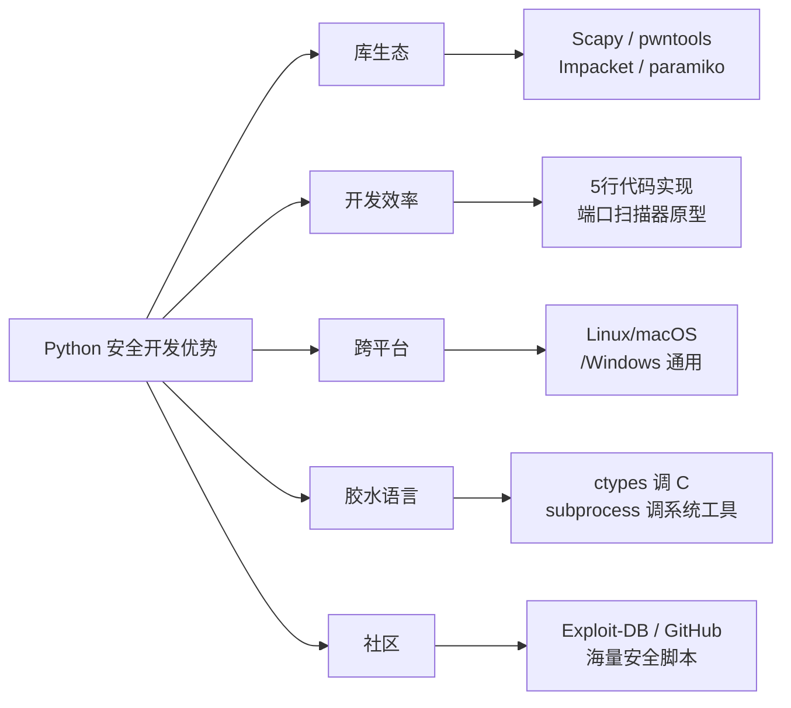
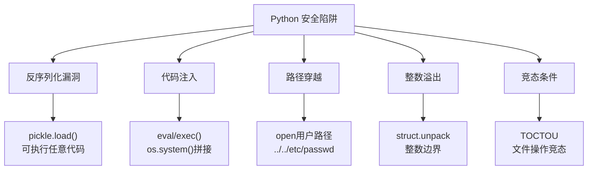

## 33.2 Python安全编程

Python 是安全领域事实上的通用语言——从 Nmap 的 NSE 脚本、Metasploit 的 Exploit 模块，到 Scapy 数据包构造、pwntools 二进制利用，再到 Impacket 协议交互和 Volatility 内存取证，几乎所有主流安全工具的底层或扩展层都依赖 Python。本节从**语言选型、核心库生态、加密编程、安全编码实践、Python 自身安全风险、错误恢复、性能优化**七个维度，系统讲解如何用 Python 构建可靠的安全工具。

### 33.2.1 为什么选择 Python 做安全开发



| 语言 | 开发速度 | 库生态(安全) | 执行性能 | 适用场景 |
|------|---------|-------------|---------|---------|
| Python | ★★★★★ | ★★★★★ | ★★☆ | 原型开发、工具集成、自动化脚本 |
| C/C++ | ★★☆ | ★★★☆ | ★★★★★ | 内核模块、高性能扫描器核心 |
| Go | ★★★☆ | ★★★☆ | ★★★★ | 高并发网络工具、CLI工具 |
| Rust | ★★☆ | ★★☆ | ★★★★★ | 安全敏感的系统级工具 |
| Ruby | ★★★★ | ★★★★ | ★★☆ | Metasploit 生态、Web 攻击脚本 |
| PowerShell | ★★★☆ | ★★★☆ | ★★☆ | Windows 渗透、AD 攻击 |

Python 的核心优势不在性能，而在**极低的原型成本**和**极其丰富的安全库生态**。一个完整的端口扫描器用 Python 可以在 50 行内完成原型；用 C 可能需要 500 行。安全工具的本质是**验证想法、快速迭代**，Python 完美契合这一需求。当性能成为瓶颈时，可以用 C 扩展（ctypes、Cython）或用 Rust 重写热路径。

**Python 在安全领域的典型应用矩阵：**

| 安全领域 | 代表性 Python 工具 | 核心库 |
|---------|-------------------|--------|
| 网络扫描 | Nmap (NSE)、Masscan wrapper | Scapy、socket、asyncio |
| 漏洞利用 | Metasploit、 pwntools | pwntools、struct、keystone |
| Web 安全 | SQLMap、Dirsearch、XSStrike | requests、aiohttp、BeautifulSoup |
| 协议分析 | Responder、Impacket | scapy、impacket、dpkt |
| 密码破解 | Hashcat wrapper、John wrapper | hashlib、bcrypt、multiprocessing |
| 内存取证 | Volatility、Rekall | struct、pefile、yara-python |
| 二进制分析 | ROPgadget、ropper | capstone、keystone、unicorn |
| 社会工程 | SET、Gophish | smtplib、jinja2、flask |
| 无线安全 | Wifite、Scapy WiFi | scapy、subprocess |

### 33.2.2 核心安全库详解

安全库不能只列 import 语句——每个库在安全工具中都有特定的使用模式和注意事项。

#### 网络层：数据包构造与发送

```python
from scapy.all import IP, TCP, UDP, ICMP, Raw, send, sr1, sniff

def quick_port_scan(target, ports, timeout=2):
    """
    SYN 半开扫描 - 利用 TCP 三次握手的中间态
    发送 SYN，收到 SYN/ACK 说明端口开放，无响应说明被过滤
    """
    results = {}
    for port in ports:
        # 构造 SYN 包
        syn_packet = IP(dst=target) / TCP(dport=port, flags="S")
        # sr1 发送并等待一个响应
        response = sr1(syn_packet, timeout=timeout, verbose=0)
        if response is None:
            results[port] = "filtered/no response"
        elif response[TCP].flags == 0x12:  # SYN+ACK
            results[port] = "open"
            # 发送 RST 关闭连接，避免完成三次握手
            rst_packet = IP(dst=target) / TCP(dport=port, flags="R")
            send(rst_packet, verbose=0)
        elif response[TCP].flags == 0x14:  # RST+ACK
            results[port] = "closed"
    return results

# 使用示例
scan_results = quick_port_scan("192.168.1.1", [22, 80, 443, 8080])
for port, status in scan_results.items():
    print(f"  Port {port}: {status}")
```

**Scapy 在安全工具中的关键模式：**

- `sr1()`：发送并等待单个响应，适合主动探测
- `sr()`：发送并等待所有响应，适合批量探测
- `sniff()`：被动嗅探，适合流量分析
- `send()`：发送不等待响应，适合 DoS/模糊测试
- `AsyncSniffer`：异步嗅探，不阻塞主线程

#### HTTP 层：Web 安全工具基础

```python
import requests
from requests.adapters import HTTPAdapter
from urllib3.util.retry import Retry
from urllib.parse import urljoin, urlparse
import logging

logger = logging.getLogger(__name__)

class SecurityHTTPClient:
    """
    安全工具专用 HTTP 客户端
    - 自动重试 + 指数退避
    - SSL 验证 + 证书固定
    - 请求/响应日志
    - 超时控制
    """
    
    def __init__(self, base_url=None, timeout=10, max_retries=3, 
                 verify_ssl=True, user_agent=None):
        self.base_url = base_url
        self.timeout = timeout
        self.session = requests.Session()
        
        # 配置重试策略：指数退避，避免触发目标 WAF
        retry_strategy = Retry(
            total=max_retries,
            backoff_factor=0.5,          # 退避因子：0.5s, 1s, 2s
            status_forcelist=[429, 500, 502, 503, 504],
            allowed_methods=["GET", "POST", "HEAD", "OPTIONS"],
            raise_on_status=False
        )
        adapter = HTTPAdapter(max_retries=retry_strategy)
        self.session.mount("http://", adapter)
        self.session.mount("https://", adapter)
        
        # 默认请求头，模拟正常浏览器
        self.session.headers.update({
            "User-Agent": user_agent or (
                "Mozilla/5.0 (Windows NT 10.0; Win64; x64) "
                "AppleWebKit/537.36 Chrome/120.0.0.0 Safari/537.36"
            ),
            "Accept": "text/html,application/xhtml+xml,application/xml;q=0.9,*/*;q=0.8",
            "Accept-Language": "en-US,en;q=0.9",
            "Accept-Encoding": "gzip, deflate",
            "Connection": "keep-alive",
        })
        
        # SSL 验证控制
        self.session.verify = verify_ssl
    
    def get(self, path, **kwargs):
        """发送 GET 请求"""
        url = self._build_url(path)
        kwargs.setdefault("timeout", self.timeout)
        kwargs.setdefault("allow_redirects", False)  # 安全工具通常不自动跟随重定向
        
        try:
            response = self.session.get(url, **kwargs)
            logger.info(f"GET {url} -> {response.status_code}")
            return response
        except requests.exceptions.SSLError as e:
            logger.error(f"SSL Error: {e}")
            raise
        except requests.exceptions.ConnectionError as e:
            logger.error(f"Connection Error: {e}")
            raise
        except requests.exceptions.Timeout:
            logger.error(f"Timeout: {url}")
            raise
    
    def post(self, path, data=None, json=None, **kwargs):
        """发送 POST 请求"""
        url = self._build_url(path)
        kwargs.setdefault("timeout", self.timeout)
        try:
            response = self.session.post(url, data=data, json=json, **kwargs)
            logger.info(f"POST {url} -> {response.status_code}")
            return response
        except requests.exceptions.RequestException as e:
            logger.error(f"POST failed: {e}")
            raise
    
    def _build_url(self, path):
        if self.base_url:
            return urljoin(self.base_url.rstrip("/") + "/", path.lstrip("/"))
        return path

# 使用示例
client = SecurityHTTPClient("https://target.com", timeout=15)
resp = client.get("/api/users")
print(f"Status: {resp.status_code}, Length: {len(resp.text)}")
```

#### 并发处理：安全扫描器的核心模式

安全工具的并发不是简单的多线程——需要考虑**速率控制、资源限制、优雅退出**：

```python
import asyncio
import aiohttp
from asyncio import Semaphore
from datetime import datetime
from collections import defaultdict
import time

class AsyncPortScanner:
    """
    异步端口扫描器 - 支持速率限制和并发控制
    """
    
    def __init__(self, max_concurrency=100, rate_limit=1000):
        """
        Args:
            max_concurrency: 最大并发连接数
            rate_limit: 每秒最大请求数（避免触发 IDS/IPS）
        """
        self.max_concurrency = max_concurrency
        self.semaphore = Semaphore(max_concurrency)
        self.results = defaultdict(str)
        self.start_time = None
        self.scanned = 0
        
        # 简单的令牌桶限速器
        self.rate_limit = rate_limit
        self.token_bucket = rate_limit
        self.last_refill = time.time()
        self._lock = asyncio.Lock()
    
    async def _acquire_token(self):
        """令牌桶限速：确保每秒不超过 rate_limit 次请求"""
        async with self._lock:
            now = time.time()
            elapsed = now - self.last_refill
            # 补充令牌（每秒 refill rate_limit 个）
            self.token_bucket = min(
                self.rate_limit,
                self.token_bucket + elapsed * self.rate_limit
            )
            self.last_refill = now
            
            if self.token_bucket < 1:
                wait_time = (1 - self.token_bucket) / self.rate_limit
                await asyncio.sleep(wait_time)
                self.token_bucket = 0
            else:
                self.token_bucket -= 1
    
    async def _check_port(self, host, port, timeout=3):
        """检测单个端口"""
        async with self.semaphore:  # 并发控制
            await self._acquire_token()  # 速率控制
            
            try:
                # asyncio.open_connection 做 TCP 连接测试
                reader, writer = await asyncio.wait_for(
                    asyncio.open_connection(host, port),
                    timeout=timeout
                )
                writer.close()
                await writer.wait_closed()
                self.results[port] = "open"
            except (asyncio.TimeoutError, ConnectionRefusedError, OSError) as e:
                if isinstance(e, ConnectionRefusedError):
                    self.results[port] = "closed"
                else:
                    self.results[port] = "filtered"
            finally:
                self.scanned += 1
    
    async def scan(self, host, ports):
        """
        并发扫描指定端口列表
        """
        self.start_time = datetime.now()
        print(f"Starting scan on {host}, {len(ports)} ports")
        
        # 创建所有扫描任务
        tasks = [self._check_port(host, port) for port in ports]
        
        # 并发执行，支持进度显示
        done = 0
        for coro in asyncio.as_completed(tasks):
            await coro
            done += 1
            if done % 100 == 0:
                elapsed = (datetime.now() - self.start_time).total_seconds()
                rate = done / elapsed if elapsed > 0 else 0
                print(f"  Progress: {done}/{len(ports)} ({rate:.0f} ports/sec)")
        
        elapsed = (datetime.now() - self.start_time).total_seconds()
        open_ports = sorted([p for p, s in self.results.items() if s == "open"])
        
        print(f"\nScan completed in {elapsed:.2f}s")
        print(f"Open ports: {open_ports}")
        return dict(self.results)

# 使用示例
async def main():
    scanner = AsyncPortScanner(max_concurrency=500, rate_limit=5000)
    results = await scanner.scan("scanme.nmap.org", range(1, 1025))

# asyncio.run(main())
```

#### 数据处理：解析与编码

```python
import base64
import hashlib
import json
import re
import struct
from binascii import hexlify, unhexlify

class SecurityEncoder:
    """
    安全工具中常用的编码/解码工具集
    覆盖渗透测试和逆向分析中的常见需求
    """
    
    @staticmethod
    def base64_variants(data):
        """Base64 的多种变体 - 很多 WAF 用变体绕过检测"""
        if isinstance(data, str):
            data = data.encode()
        
        standard = base64.b64encode(data)
        url_safe = base64.urlsafe_b64encode(data)
        # 无填充版本（JWT 常用）
        no_pad = standard.rstrip(b"=")
        
        return {
            "standard": standard.decode(),
            "url_safe": url_safe.decode(),
            "no_padding": no_pad.decode(),
            # 反转（某些 CTF 题的技巧）
            "reversed": standard.decode()[::-1],
        }
    
    @staticmethod
    def multi_hash(data):
        """一次性计算多种哈希 - 用于密码哈希识别"""
        if isinstance(data, str):
            data = data.encode()
        
        hashes = {
            "md5": hashlib.md5(data).hexdigest(),
            "sha1": hashlib.sha1(data).hexdigest(),
            "sha256": hashlib.sha256(data).hexdigest(),
            "sha512": hashlib.sha512(data).hexdigest(),
            # NTLM = MD4(UTF-16LE编码的密码)
            "ntlm": hashlib.new("md4", data.decode("utf-16-le").encode("utf-16-le")).hexdigest()
                if len(data) % 2 == 0 else "N/A",
        }
        return hashes
    
    @staticmethod
    def parse_shellcode(shellcode_str):
        """
        将字符串形式的 shellcode 转为 bytes
        支持多种格式：\x90\x90、0x90 0x90、\\x90\\x90、原始十六进制
        """
        # 清理输入
        cleaned = shellcode_str.replace("\\x", "").replace("0x", "")
        cleaned = cleaned.replace(",", " ").replace(" ", "")
        cleaned = re.sub(r"[^0-9a-fA-F]", "", cleaned)
        
        try:
            return bytes.fromhex(cleaned)
        except ValueError as e:
            raise ValueError(f"Invalid shellcode format: {e}")
    
    @staticmethod
    def extract_iocs(text):
        """
        从文本中提取 IOC（威胁指标）
        IP、域名、URL、邮箱、哈希值
        """
        patterns = {
            "ipv4": r"\b(?:\d{1,3}\.){3}\d{1,3}\b",
            "domain": r"\b(?:[a-zA-Z0-9](?:[a-zA-Z0-9-]{0,61}[a-zA-Z0-9])?\.)+[a-zA-Z]{2,}\b",
            "url": r"https?://[^\s<>\"']+",
            "email": r"\b[a-zA-Z0-9._%+-]+@[a-zA-Z0-9.-]+\.[a-zA-Z]{2,}\b",
            "md5": r"\b[a-fA-F0-9]{32}\b",
            "sha1": r"\b[a-fA-F0-9]{40}\b",
            "sha256": r"\b[a-fA-F0-9]{64}\b",
        }
        
        results = {}
        for ioc_type, pattern in patterns.items():
            matches = list(set(re.findall(pattern, text)))
            if matches:
                results[ioc_type] = matches
        
        return results

# 使用示例
encoder = SecurityEncoder()

# 编码变体
print(encoder.base64_variants("flag{this_is_a_secret}"))

# 哈希识别
print(encoder.multi_hash("password123"))

# 提取 IOC
sample_text = "Malware contacted 192.168.1.100 and evil.com at http://evil.com/payload"
print(encoder.extract_iocs(sample_text))
```

### 33.2.3 Python 自身的安全陷阱

开发安全工具时，**工具本身的漏洞**比目标的漏洞更危险——攻击者可能反过来利用你的工具。Python 有几个必须掌握的安全陷阱：



#### 反序列化攻击（pickle）

```python
import pickle
import io

class MaliciousPayload:
    """
    演示：pickle 反序列化可以执行任意代码
    攻击者构造恶意 pickle 字节流，目标反序列化时触发代码执行
    """
    def __reduce__(self):
        # __reduce__ 在 unpickle 时被调用，返回可执行的代码
        import os
        return (os.system, ("echo 'YOU HAVE BEEN PWNED'",))

# 安全的替代方案
import json
import dataclasses

def safe_serialize(obj):
    """使用 JSON 替代 pickle 序列化"""
    if dataclasses.is_dataclass(obj) and not isinstance(obj, type):
        return dataclasses.asdict(obj)
    return json.dumps(obj, default=str)

def safe_deserialize(data_str):
    """使用 JSON 替代 pickle 反序列化"""
    try:
        return json.loads(data_str)
    except json.JSONDecodeError as e:
        raise ValueError(f"Invalid JSON: {e}")

# 如果必须使用 pickle（如与遗留系统交互），使用 RestrictedUnpickler
class RestrictedUnpickler(pickle.Unpickler):
    """限制可反序列化的类 - 只允许安全类型"""
    ALLOWED_CLASSES = {
        ("builtins", "set"),
        ("builtins", "frozenset"),
        ("builtins", "dict"),
        ("builtins", "list"),
        ("builtins", "tuple"),
    }
    
    def find_class(self, module, name):
        if (module, name) not in self.ALLOWED_CLASSES:
            raise pickle.UnpicklingError(
                f"Disallowed class: {module}.{name}"
            )
        return super().find_class(module, name)

def safe_pickle_loads(data):
    """安全的 pickle 反序列化"""
    return RestrictedUnpickler(io.BytesIO(data)).load()
```

#### 命令注入与进程调用

```python
import subprocess
import shlex
import os

class SecureCommandExecutor:
    """
    安全的命令执行器
    核心原则：永远不要用字符串拼接构造命令
    """
    
    @staticmethod
    def safe_subprocess(command_args, timeout=30):
        """
        安全调用外部命令
        Args:
            command_args: 命令参数列表（不要传字符串！）
            timeout: 超时时间
        """
        # ❌ 危险：字符串拼接
        # os.system(f"ping -c 1 {user_input}")  # 命令注入！
        # subprocess.call(f"nmap {user_input}", shell=True)  # 命令注入！
        
        # ✅ 安全：参数列表 + 无 shell
        try:
            result = subprocess.run(
                command_args,           # 参数作为列表传入
                shell=False,           # 绝对不要 shell=True
                capture_output=True,
                text=True,
                timeout=timeout,
                env=os.environ.copy(),  # 显式传递环境变量
                cwd=None,              # 不要从用户输入设置工作目录
            )
            return {
                "returncode": result.returncode,
                "stdout": result.stdout,
                "stderr": result.stderr,
            }
        except subprocess.TimeoutExpired:
            return {"returncode": -1, "stdout": "", "stderr": "Timeout"}
        except FileNotFoundError:
            return {"returncode": -1, "stdout": "", "stderr": "Command not found"}
    
    @staticmethod
    def validate_user_input(input_str, allowed_pattern=r'^[a-zA-Z0-9.\-_]+$'):
        """白名单验证用户输入"""
        import re
        if not re.match(allowed_pattern, input_str):
            raise ValueError(f"Invalid input: contains disallowed characters")
        return input_str
    
    @staticmethod
    def safe_nmap_scan(target):
        """
        安全地调用 nmap - target 经过验证
        """
        # 验证目标（只允许 IP 和域名格式）
        SecureCommandExecutor.validate_user_input(
            target, r'^[a-zA-Z0-9.\-_\/]+$'
        )
        
        return SecureCommandExecutor.safe_subprocess(
            ["nmap", "-sV", "-T4", "--open", target],
            timeout=300
        )

# 使用示例
executor = SecureCommandExecutor()
result = executor.safe_nmap_scan("127.0.0.1")
print(result["stdout"])
```

#### 路径穿越防护

```python
import os
from pathlib import Path

def safe_file_path(base_dir, user_path):
    """
    防止路径穿越攻击
    攻击者输入 ../../etc/passwd 来读取系统文件
    """
    # 方法1：使用 Path.resolve() + 相对路径校验
    base = Path(base_dir).resolve()
    target = (base / user_path).resolve()
    
    if not str(target).startswith(str(base)):
        raise PermissionError(f"Path traversal detected: {user_path}")
    
    return target

def safe_read_file(base_dir, filename):
    """安全地读取文件 - 防止目录穿越"""
    filepath = safe_file_path(base_dir, filename)
    
    # 额外防护：限制文件大小（防止 DoS）
    MAX_FILE_SIZE = 10 * 1024 * 1024  # 10MB
    if filepath.stat().st_size > MAX_FILE_SIZE:
        raise ValueError(f"File too large: {filepath.stat().st_size} bytes")
    
    # 限制可读文件扩展名
    ALLOWED_EXTENSIONS = {".txt", ".log", ".json", ".csv", ".xml"}
    if filepath.suffix.lower() not in ALLOWED_EXTENSIONS:
        raise ValueError(f"File type not allowed: {filepath.suffix}")
    
    return filepath.read_text(encoding="utf-8")
```

### 33.2.4 加密编程

安全工具必须正确使用密码学——错误的加密比没有加密更危险。

```python
import hashlib
import hmac
import secrets
import os

class CryptoToolkit:
    """
    安全工具开发中常用的密码学操作
    注意：生产环境应使用 cryptography 库，而非自行实现
    """
    
    @staticmethod
    def secure_random(length=32):
        """生成密码学安全的随机数"""
        # secrets 模块（Python 3.6+）专为安全设计
        # 不要用 random 模块——它使用伪随机数生成器，可预测
        return secrets.token_bytes(length)
    
    @staticmethod
    def derive_key(password, salt=None, iterations=100000):
        """
        PBKDF2 密钥派生 - 从密码生成加密密钥
        用于：密码存储、密钥协商
        """
        if salt is None:
            salt = os.urandom(16)
        
        key = hashlib.pbkdf2_hmac(
            "sha256",
            password.encode("utf-8"),
            salt,
            iterations,
            dklen=32
        )
        return key, salt, iterations
    
    @staticmethod
    def verify_password(password, stored_hash, salt, iterations=100000):
        """验证密码 - 使用常量时间比较防止时序攻击"""
        derived = hashlib.pbkdf2_hmac(
            "sha256",
            password.encode("utf-8"),
            salt,
            iterations,
            dklen=32
        )
        # hmac.compare_digest 是常量时间比较，防止时序攻击
        return hmac.compare_digest(derived, stored_hash)
    
    @staticmethod
    def hash_file(filepath, algorithm="sha256"):
        """
        流式计算文件哈希 - 处理大文件时不会耗尽内存
        """
        h = hashlib.new(algorithm)
        with open(filepath, "rb") as f:
            while chunk := f.read(8192):
                h.update(chunk)
        return h.hexdigest()
    
    @staticmethod
    def generate_hmac(data, key):
        """生成 HMAC - 验证数据完整性"""
        if isinstance(data, str):
            data = data.encode()
        if isinstance(key, str):
            key = key.encode()
        return hmac.new(key, data, hashlib.sha256).hexdigest()

# 使用示例
crypto = CryptoToolkit()

# 安全随机数
token = crypto.secure_random(32)
print(f"Secure token: {token.hex()}")

# 密码哈希存储
password = "my_secure_password"
key, salt, iters = crypto.derive_key(password)
print(f"Salt: {salt.hex()}")
print(f"Derived key: {key.hex()}")

# 验证密码
is_valid = crypto.verify_password(password, key, salt, iters)
print(f"Password valid: {is_valid}")

# 文件完整性校验
# file_hash = crypto.hash_file("/path/to/suspicious_file")
```

### 33.2.5 错误处理与异常体系

安全工具的异常处理不是"try-except 打印错误"——需要**分层异常体系、重试策略、优雅降级**：

```python
import logging
import time
import functools
from enum import Enum

logger = logging.getLogger(__name__)

# ====== 分层异常体系 ======

class SecurityToolError(Exception):
    """安全工具基础异常 - 所有自定义异常的父类"""
    def __init__(self, message, code=None, details=None):
        super().__init__(message)
        self.code = code
        self.details = details or {}

class NetworkError(SecurityToolError):
    """网络层异常：连接超时、拒绝连接、DNS 失败"""

class AuthenticationError(SecurityToolError):
    """认证异常：凭证无效、令牌过期、权限不足"""

class ValidationError(SecurityToolError):
    """验证异常：输入格式错误、参数越界"""

class RateLimitError(SecurityToolError):
    """限速异常：请求频率超限"""
    def __init__(self, message, retry_after=None):
        super().__init__(message)
        self.retry_after = retry_after

class TargetUnreachableError(NetworkError):
    """目标不可达：防火墙/IDS 阻断"""

# ====== 重试装饰器 ======

def retry_on_failure(max_retries=3, backoff_base=1.0, 
                     exceptions=(NetworkError,), 
                     on_retry=None):
    """
    自动重试装饰器
    - 指数退避：避免雪崩
    - 异常类型过滤：只重试网络错误，不重试验证错误
    - 回调函数：允许记录重试日志
    """
    def decorator(func):
        @functools.wraps(func)
        def wrapper(*args, **kwargs):
            last_exception = None
            for attempt in range(max_retries + 1):
                try:
                    return func(*args, **kwargs)
                except exceptions as e:
                    last_exception = e
                    if attempt < max_retries:
                        wait_time = backoff_base * (2 ** attempt)
                        if isinstance(e, RateLimitError) and e.retry_after:
                            wait_time = max(wait_time, e.retry_after)
                        
                        if on_retry:
                            on_retry(attempt + 1, max_retries, e)
                        logger.warning(
                            f"Retry {attempt + 1}/{max_retries} "
                            f"after {wait_time:.1f}s: {e}"
                        )
                        time.sleep(wait_time)
            raise last_exception
        return wrapper
    return decorator

# ====== 优雅降级模式 ======

class RobustScanner:
    """
    健壮的扫描器 - 展示分层错误处理
    """
    
    @retry_on_failure(
        max_retries=3, 
        backoff_base=0.5,
        exceptions=(NetworkError, RateLimitError),
        on_retry=lambda n, m, e: logger.info(f"Attempt {n}/{m}")
    )
    def scan_target(self, target):
        """扫描单个目标 - 带完整错误处理"""
        try:
            # 第一层：验证输入
            self._validate_target(target)
            
            # 第二层：网络连接
            result = self._network_scan(target)
            
            # 第三层：结果验证
            self._validate_result(result)
            
            return result
            
        except ValidationError as e:
            # 输入错误 → 直接失败，不重试
            logger.error(f"Validation failed for {target}: {e}")
            raise
            
        except AuthenticationError as e:
            # 认证错误 → 尝试重新认证后失败
            logger.error(f"Auth failed: {e}")
            raise
            
        except NetworkError as e:
            # 网络错误 → 由重试装饰器处理
            logger.warning(f"Network error scanning {target}: {e}")
            raise
            
        except Exception as e:
            # 未知错误 → 包装后抛出
            logger.error(f"Unexpected error scanning {target}: {e}")
            raise SecurityToolError(
                f"Scan failed for {target}: {e}",
                details={"target": target, "original_error": str(e)}
            )
    
    def _validate_target(self, target):
        import re
        if not re.match(r'^[\d.]+$', target):
            raise ValidationError(f"Invalid target format: {target}")
    
    def _network_scan(self, target):
        # 实际扫描逻辑
        pass
    
    def _validate_result(self, result):
        if result is None:
            raise SecurityToolError("Empty scan result")
```

### 33.2.6 日志与审计

安全工具的日志不是普通的 debug 日志——它既是**调试手段**，也是**取证证据**：

```python
import logging
import json
import sys
from datetime import datetime, timezone
from pathlib import Path

class SecurityAuditLogger:
    """
    安全工具审计日志
    - 结构化 JSON 输出（便于 ELK/Splunk 分析）
    - 操作审计追踪（谁在什么时候做了什么）
    - 敏感信息脱敏
    """
    
    def __init__(self, log_dir=".", tool_name="security_tool"):
        self.tool_name = tool_name
        self.log_dir = Path(log_dir)
        self.log_dir.mkdir(parents=True, exist_ok=True)
        
        # 操作日志（JSON 结构化）
        self.audit_logger = logging.getLogger(f"{tool_name}.audit")
        self.audit_logger.setLevel(logging.INFO)
        audit_handler = logging.FileHandler(
            self.log_dir / f"{tool_name}_audit.jsonl"
        )
        audit_handler.setFormatter(
            logging.Formatter("%(message)s")
        )
        self.audit_logger.addHandler(audit_handler)
        
        # 运行日志（人类可读）
        self.run_logger = logging.getLogger(f"{tool_name}.run")
        self.run_logger.setLevel(logging.DEBUG)
        run_handler = logging.FileHandler(
            self.log_dir / f"{tool_name}_run.log"
        )
        run_handler.setFormatter(
            logging.Formatter(
                "%(asctime)s [%(levelname)s] %(name)s: %(message)s"
            )
        )
        self.run_logger.addHandler(run_handler)
        # 同时输出到 stderr
        stderr_handler = logging.StreamHandler(sys.stderr)
        stderr_handler.setFormatter(
            logging.Formatter("[%(levelname)s] %(message)s")
        )
        stderr_handler.setLevel(logging.WARNING)
        self.run_logger.addHandler(stderr_handler)
    
    def log_scan_start(self, target, scan_type, user=None):
        """记录扫描开始"""
        self.audit_logger.info(json.dumps({
            "event": "scan_start",
            "timestamp": datetime.now(timezone.utc).isoformat(),
            "tool": self.tool_name,
            "target": target,
            "scan_type": scan_type,
            "user": user or "unknown",
            "pid": __import__("os").getpid(),
        }))
        self.run_logger.info(f"Scan started: {scan_type} on {target}")
    
    def log_scan_result(self, target, results, summary=None):
        """记录扫描结果（不记录敏感数据）"""
        self.audit_logger.info(json.dumps({
            "event": "scan_result",
            "timestamp": datetime.now(timezone.utc).isoformat(),
            "target": target,
            "results_count": len(results) if results else 0,
            "summary": summary,
        }))
    
    def log_error(self, target, error, context=None):
        """记录错误"""
        self.audit_logger.info(json.dumps({
            "event": "error",
            "timestamp": datetime.now(timezone.utc).isoformat(),
            "target": target,
            "error_type": type(error).__name__,
            "error_message": str(error),
            "context": context,
        }))
        self.run_logger.error(f"Error scanning {target}: {error}")
    
    @staticmethod
    def sanitize_log_data(data):
        """脱敏：移除日志中的敏感信息"""
        SENSITIVE_KEYS = {"password", "token", "secret", "api_key", "credential"}
        
        if isinstance(data, dict):
            return {
                k: "***REDACTED***" if k.lower() in SENSITIVE_KEYS 
                else SecurityAuditLogger.sanitize_log_data(v)
                for k, v in data.items()
            }
        elif isinstance(data, list):
            return [SecurityAuditLogger.sanitize_log_data(item) for item in data]
        return data

# 使用示例
audit = SecurityAuditLogger(log_dir="/tmp/security_logs", tool_name="port_scanner")
audit.log_scan_start("192.168.1.1", "port_scan", user="admin")
```

### 33.2.7 性能优化策略

安全扫描器面对的往往是**大规模目标**（数千 IP × 数万端口），性能优化是刚需：

```python
import asyncio
import time
from collections import deque
from concurrent.futures import ThreadPoolExecutor, ProcessPoolExecutor

class PerformancePatterns:
    """安全工具中的性能优化模式"""
    
    @staticmethod
    def connection_pool_example():
        """
        连接池复用 - 避免重复建立 TCP 连接
        对 HTTP 扫描器性能提升 5-10 倍
        """
        import requests
        
        # ✅ 正确：复用 Session（底层维护连接池）
        session = requests.Session()
        session.headers.update({"Connection": "keep-alive"})
        
        for target in ["192.168.1.1", "192.168.1.2"]:
            # 连接被复用，省去 TLS 握手
            session.get(f"http://{target}/")
        
        # ❌ 错误：每次请求新建连接
        for target in ["192.168.1.1", "192.168.1.2"]:
            requests.get(f"http://{target}/")  # 每次都建立新连接
    
    @staticmethod
    def batch_processing(items, batch_size=100):
        """
        批量处理模式 - 处理大规模目标时避免内存爆炸
        """
        for i in range(0, len(items), batch_size):
            batch = items[i:i + batch_size]
            yield batch
    
    @staticmethod
    def memory_efficient_file_reader(filepath, chunk_size=8192):
        """
        流式文件处理 - 处理大型日志/pcap 文件时避免 OOM
        """
        with open(filepath, "rb") as f:
            while True:
                chunk = f.read(chunk_size)
                if not chunk:
                    break
                yield chunk
    
    @staticmethod
    def cpu_bound_with_processes(func, data_list, max_workers=None):
        """
        CPU 密集型任务使用多进程
        适用场景：密码哈希破解、加密运算、大量数据解析
        Python 的 GIL 限制了线程在 CPU 密集型任务上的性能
        """
        import os
        if max_workers is None:
            max_workers = os.cpu_count() or 4
        
        with ProcessPoolExecutor(max_workers=max_workers) as executor:
            results = list(executor.map(func, data_list))
        return results
    
    @staticmethod
    def io_bound_with_threads(func, data_list, max_workers=50):
        """
        IO 密集型任务使用线程池
        适用场景：网络扫描、HTTP 请求、文件 I/O
        """
        with ThreadPoolExecutor(max_workers=max_workers) as executor:
            results = list(executor.map(func, data_list))
        return results

# 使用示例
patterns = PerformancePatterns()

# 批量处理大量目标
all_targets = [f"192.168.1.{i}" for i in range(256)]
for batch in patterns.batch_processing(all_targets, batch_size=50):
    print(f"Processing batch: {batch[0]}...{batch[-1]} ({len(batch)} targets)")
```

### 33.2.8 完整安全工具框架

将以上所有知识整合为一个可复用的工具框架：

```python
"""
安全工具基础框架
提供：命令行解析、日志、目标管理、扫描器基类
适用于：端口扫描器、Web 漏洞扫描器、子域名枚举等
"""
import argparse
import logging
import sys
import json
from datetime import datetime
from pathlib import Path
from abc import ABC, abstractmethod
from dataclasses import dataclass, field, asdict
from typing import List, Optional
from enum import Enum

class Severity(Enum):
    INFO = "info"
    LOW = "low"
    MEDIUM = "medium"
    HIGH = "high"
    CRITICAL = "critical"

@dataclass
class Finding:
    """单条发现/漏洞"""
    target: str
    title: str
    severity: Severity
    description: str
    evidence: str = ""
    recommendation: str = ""
    timestamp: str = field(
        default_factory=lambda: datetime.now().isoformat()
    )
    
    def to_dict(self):
        d = asdict(self)
        d["severity"] = self.severity.value
        return d

class BaseScanner(ABC):
    """扫描器基类 - 所有安全扫描器的统一接口"""
    
    def __init__(self, name, output_dir="./results"):
        self.name = name
        self.output_dir = Path(output_dir)
        self.output_dir.mkdir(parents=True, exist_ok=True)
        self.findings: List[Finding] = []
        
        # 配置日志
        self.logger = logging.getLogger(name)
        handler = logging.StreamHandler(sys.stderr)
        handler.setFormatter(
            logging.Formatter("[%(levelname)s] %(message)s")
        )
        self.logger.addHandler(handler)
        self.logger.setLevel(logging.INFO)
    
    @abstractmethod
    def parse_args(self, argv):
        """解析命令行参数"""
        pass
    
    @abstractmethod
    def scan(self, target):
        """扫描单个目标 - 子类必须实现"""
        pass
    
    def add_finding(self, target, title, severity, description, 
                    evidence="", recommendation=""):
        """添加一条发现"""
        finding = Finding(
            target=target, title=title, severity=severity,
            description=description, evidence=evidence,
            recommendation=recommendation
        )
        self.findings.append(finding)
        self.logger.info(f"[{severity.value.upper()}] {title} on {target}")
    
    def export_results(self, format="json"):
        """导出扫描结果"""
        timestamp = datetime.now().strftime("%Y%m%d_%H%M%S")
        filename = f"{self.name}_{timestamp}.{format}"
        filepath = self.output_dir / filename
        
        if format == "json":
            report = {
                "scanner": self.name,
                "timestamp": datetime.now().isoformat(),
                "total_findings": len(self.findings),
                "findings": [f.to_dict() for f in self.findings],
            }
            filepath.write_text(json.dumps(report, indent=2, ensure_ascii=False))
        
        self.logger.info(f"Results exported to {filepath}")
        return filepath
    
    def run(self, argv):
        """统一运行入口"""
        args = self.parse_args(argv)
        self.logger.info(f"Starting {self.name}")
        
        targets = self._load_targets(args)
        for target in targets:
            self.logger.info(f"Scanning {target}")
            try:
                self.scan(target)
            except Exception as e:
                self.logger.error(f"Error scanning {target}: {e}")
        
        # 导出结果
        result_path = self.export_results()
        
        # 打印摘要
        severity_counts = {}
        for f in self.findings:
            severity_counts[f.severity.value] = severity_counts.get(f.severity.value, 0) + 1
        
        print(f"\n{'='*50}")
        print(f"Scan Summary: {len(self.findings)} findings")
        for sev, count in sorted(severity_counts.items()):
            print(f"  {sev.upper()}: {count}")
        print(f"Results: {result_path}")
        
        return self.findings
    
    def _load_targets(self, args):
        """从参数或文件加载目标列表"""
        targets = []
        if hasattr(args, 'target') and args.target:
            targets.append(args.target)
        if hasattr(args, 'target_file') and args.target_file:
            targets.extend(
                Path(args.target_file).read_text().strip().splitlines()
            )
        return targets

# ====== 示例：用基类构建子域名扫描器 ======

class SubdomainScanner(BaseScanner):
    """子域名枚举扫描器示例"""
    
    def parse_args(self, argv):
        parser = argparse.ArgumentParser(description=self.name)
        parser.add_argument("-d", "--domain", required=True, help="目标域名")
        parser.add_argument("-w", "--wordlist", help="字典文件路径")
        parser.add_argument("-o", "--output", default="./results")
        parser.add_argument("-t", "--threads", type=int, default=10)
        return parser.parse_args(argv)
    
    def scan(self, target):
        """枚举子域名"""
        # 这里是实际的 DNS 枚举逻辑
        # 示例：检查常见子域名前缀
        common_prefixes = [
            "www", "mail", "ftp", "admin", "test", "dev",
            "staging", "api", "cdn", "blog"
        ]
        for prefix in common_prefixes:
            subdomain = f"{prefix}.{target}"
            # 实际使用中这里做 DNS 查询
            self.add_finding(
                target=subdomain,
                title=f"Subdomain discovered: {subdomain}",
                severity=Severity.INFO,
                description=f"Found subdomain {subdomain}",
            )

# 运行示例
if __name__ == "__main__":
    scanner = SubdomainScanner("subdomain_scanner")
    # scanner.run(["-d", "example.com"])
```

### 33.2.9 常见误区与最佳实践

| 误区 | 正确做法 | 原因 |
|------|---------|------|
| `random.randint()` 生成安全 token | 使用 `secrets.token_bytes()` | random 是伪随机数，可被预测 |
| `pickle.load()` 加载数据 | 使用 `json.loads()` 或 `RestrictedUnpickler` | pickle 反序列化可执行任意代码 |
| `os.system(cmd)` 执行命令 | `subprocess.run(args, shell=False)` | 字符串拼接导致命令注入 |
| `verify=False` 禁用 SSL 验证 | 始终 `verify=True`，仅在测试时关闭 | 禁用验证使 MITM 攻击成为可能 |
| `shell=True` + 字符串拼接 | 参数列表 + `shell=False` | shell=True 会解析 shell 元字符 |
| `except Exception: pass` | 具体异常类型 + 至少记录日志 | 吞掉异常导致 bug 无法发现 |
| 硬编码密码/密钥 | 环境变量 + `.env` 文件 + keyring | 代码泄露即凭证泄露 |
| 在日志中记录密码/令牌 | 使用脱敏函数过滤敏感字段 | 日志文件常被忽略安全策略 |
| 用 `time.sleep()` 控制速率 | 令牌桶/漏桶算法 | sleep 不精确，且无法动态调整 |
| 单线程串行扫描 | asyncio/thread/process 并发 | 单线程扫描慢 100 倍 |

### 33.2.10 安全开发检查清单

在发布安全工具前，逐项检查：

```text
□ 输入验证：所有用户输入都经过白名单验证
□ 命令注入：subprocess 调用使用参数列表，shell=False
□ 路径穿越：文件操作使用 Path.resolve() + 前缀检查
□ 序列化安全：不使用 pickle.loads()，或使用 RestrictedUnpickler
□ 密码处理：使用 secrets 模块，不使用 random
□ SSL 验证：verify=True，不跳过证书验证
□ 日志脱敏：密码、令牌、密钥不写入日志
□ 异常处理：不使用裸 except，异常信息不泄露给用户
□ 超时控制：所有网络操作都有超时限制
□ 资源限制：文件大小、内存使用、并发数有上限
□ 权限最小化：以最低权限运行，不使用 root（除非必要）
□ 依赖安全：使用 pip-audit 或 safety 检查已知漏洞
□ 代码审计：关键函数有单元测试，敏感逻辑有注释
```

**总结：** Python 是安全工具开发的最佳选择——不是因为它快，而是因为它让安全研究者把精力集中在**逻辑本身**而非**语言细节**上。但"开发快"不等于"可以随便写"。安全工具是"用盾的矛"——它自己必须安全。输入验证、参数化调用、安全序列化、加密操作、日志审计，这些不是可选的"最佳实践"，而是安全工具的**底线要求**。本节所讲的每一项安全编码实践，都是真实安全工具开发中踩过的坑——它们不是理论，而是血泪经验。
