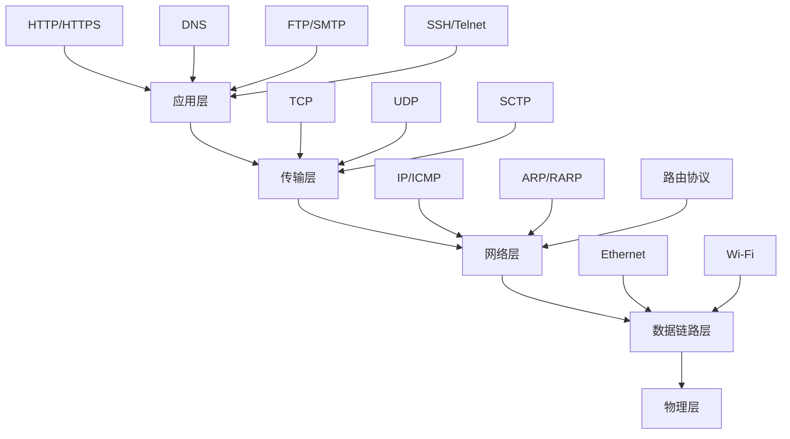
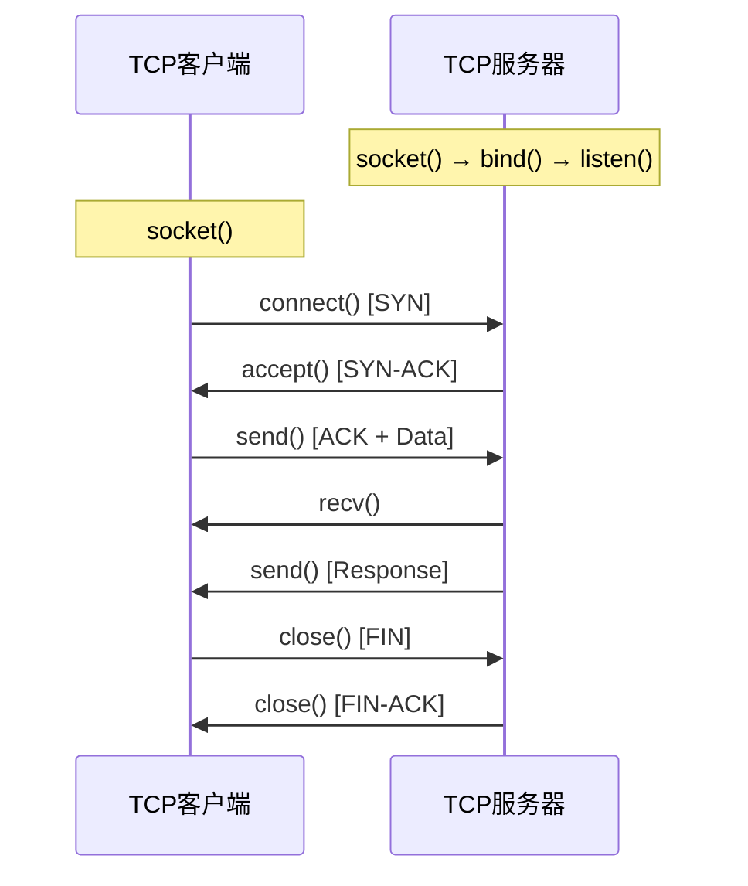

## 33.3 网络编程

网络编程是安全工具开发的基石。无论是编写端口扫描器、漏洞检测器、流量分析器还是渗透测试框架，都需要对网络协议栈有深入理解，并能灵活运用Socket API实现自定义的网络通信。本节将从协议基础出发，逐层深入到Socket编程、异步I/O、数据包构造、SSL/TLS处理以及并发性能优化，构建完整的安全工具网络编程知识体系。

### 33.3.1 TCP/IP协议栈深度解析

网络安全工具的开发必须建立在对TCP/IP协议栈的透彻理解之上。协议栈不仅是通信的基础，更是安全攻防的主战场——几乎所有网络攻击和防御都发生在协议栈的某一层次。

#### 协议栈层次结构



#### 各层协议详解与安全关联

| 层次 | 核心协议 | 安全工具关联 | 常见攻击向量 |
|------|---------|-------------|-------------|
| 应用层 | HTTP、DNS、FTP、SMTP | Web扫描器、DNS枚举、邮件安全 | SQL注入、XSS、DNS投毒 |
| 传输层 | TCP、UDP | 端口扫描、会话劫持、流量分析 | SYN洪泛、UDP反射放大 |
| 网络层 | IP、ICMP、ARP | 网络探测、路由追踪、ARP欺骗 | IP欺骗、ICMP重定向、ARP缓存投毒 |
| 链路层 | Ethernet、PPP | 流量嗅探、MAC欺骗 | MAC泛洪、VLAN跳跃 |

**TCP三次握手与安全**：TCP连接建立过程是端口扫描的理论基础。客户端发送SYN包（flags=0x02），服务端回复SYN-ACK（flags=0x12），客户端再发送ACK（flags=0x10）完成握手。SYN扫描正是利用这一机制：只发送SYN包，根据是否收到SYN-ACK判断端口状态，然后立即发送RST包中断连接，避免完成三次握手——这就是所谓的"半开扫描"（half-open scan），具有隐蔽性高、速度快的特点。

**UDP的无连接特性**：UDP不保证可靠传输，没有握手过程。扫描UDP端口时，发送UDP数据包后：若收到ICMP Port Unreachable（类型3，代码3），说明端口关闭；若无响应，端口可能开放或被防火墙过滤。由于UDP响应的不确定性，UDP端口扫描的准确率远低于TCP，通常需要多次探测和更长的超时时间。

**ICMP协议的安全用途**：ICMP不仅用于ping和traceroute，还被安全工具广泛用于网络存活探测、路径MTU发现、网络拓扑映射。但ICMP也是攻击者的工具——ICMP隧道可绕过防火墙，ICMP重定向可劫持路由。

#### IP协议关键字段

理解IP包头对构造自定义数据包至关重要：

```python
# IP包头关键字段解析
IP_HEADER_FIELDS = {
    "Version (4bit)":    "IP版本，通常为4（IPv4）或6（IPv6）",
    "IHL (4bit)":        "首部长度，单位为4字节（最小5=20字节）",
    "DSCP/ECN (8bit)":   "服务类型，可用于流量优先级标记",
    "Total Length (16bit)": "IP包总长度（首部+数据），最大65535字节",
    "Identification (16bit)": "分片标识，用于IP分片重组",
    "Flags (3bit)":      "标志位：DF(不分片)、MF(更多分片)",
    "Fragment Offset (13bit)": "分片偏移，指示分片在原始数据中的位置",
    "TTL (8bit)":        "生存时间，每经过一个路由器减1，用于traceroute",
    "Protocol (8bit)":   "上层协议：6=TCP, 17=UDP, 1=ICMP",
    "Header Checksum (16bit)": "首部校验和，用于差错检测",
    "Source IP (32bit)": "源IP地址",
    "Destination IP (32bit)": "目的IP地址",
}
```

### 33.3.2 Socket编程核心

Socket是操作系统提供的网络编程接口，是应用层与传输层之间的桥梁。掌握Socket API是编写任何网络工具的前提。

#### Socket类型与工作流程



**TCP客户端完整流程**：

```python
import socket
import struct


class TCPClient:
    """TCP客户端——安全工具的基础通信组件"""

    def __init__(self, host, port, timeout=10):
        self.host = host
        self.port = port
        self.timeout = timeout
        self.sock = None
        self.buffer_size = 4096

    def connect(self):
        """建立TCP连接"""
        try:
            self.sock = socket.socket(socket.AF_INET, socket.SOCK_STREAM)
            self.sock.settimeout(self.timeout)
            self.sock.connect((self.host, self.port))
            return True
        except socket.timeout:
            print(f"[!] 连接超时: {self.host}:{self.port}")
            return False
        except socket.error as e:
            print(f"[!] 连接失败: {e}")
            return False

    def send(self, data):
        """发送数据（支持字符串和字节）"""
        if isinstance(data, str):
            data = data.encode('utf-8')
        try:
            total_sent = 0
            while total_sent < len(data):
                sent = self.sock.send(data[total_sent:])
                if sent == 0:
                    raise RuntimeError("连接已断开")
                total_sent += sent
            return True
        except socket.error as e:
            print(f"[!] 发送失败: {e}")
            return False

    def receive(self, buffer_size=None):
        """接收数据"""
        if buffer_size is None:
            buffer_size = self.buffer_size
        try:
            data = self.sock.recv(buffer_size)
            return data if data else None
        except socket.timeout:
            return None
        except socket.error as e:
            print(f"[!] 接收失败: {e}")
            return None

    def receive_all(self):
        """接收所有可用数据（直到对方关闭连接）"""
        chunks = []
        while True:
            chunk = self.receive()
            if chunk is None:
                break
            chunks.append(chunk)
        return b''.join(chunks)

    def send_receive(self, data, response_size=4096):
        """发送并接收响应——最常用的模式"""
        if self.send(data):
            return self.receive(response_size)
        return None

    def close(self):
        """关闭连接"""
        if self.sock:
            try:
                self.sock.shutdown(socket.SHUT_RDWR)
            except OSError:
                pass
            self.sock.close()
            self.sock = None

    def __enter__(self):
        self.connect()
        return self

    def __exit__(self, exc_type, exc_val, exc_tb):
        self.close()
        return False
```

**TCP服务器——多线程处理模型**：

```python
import socket
import threading
from datetime import datetime


class TCPServer:
    """多线程TCP服务器——常用于C2框架、反弹Shell监听器"""

    def __init__(self, host='0.0.0.0', port=4444, max_clients=50):
        self.host = host
        self.port = port
        self.max_clients = max_clients
        self.server_socket = None
        self.clients = {}  # {socket: address}
        self.lock = threading.Lock()
        self.running = False

    def start(self):
        """启动服务器"""
        self.server_socket = socket.socket(socket.AF_INET, socket.SOCK_STREAM)
        self.server_socket.setsockopt(socket.SOL_SOCKET, socket.SO_REUSEADDR, 1)
        self.server_socket.settimeout(1.0)
        self.server_socket.bind((self.host, self.port))
        self.server_socket.listen(5)
        self.running = True

        print(f"[+] 服务器监听 {self.host}:{self.port}")
        print(f"[+] 最大客户端数: {self.max_clients}")

        while self.running:
            try:
                client_socket, address = self.server_socket.accept()
                with self.lock:
                    if len(self.clients) >= self.max_clients:
                        print(f"[!] 达到最大连接数，拒绝 {address}")
                        client_socket.close()
                        continue
                    self.clients[client_socket] = address

                print(f"[+] 新连接: {address[0]}:{address[1]} "
                      f"(当前 {len(self.clients)} 个)")
                client_thread = threading.Thread(
                    target=self.handle_client,
                    args=(client_socket, address),
                    daemon=True
                )
                client_thread.start()
            except socket.timeout:
                continue
            except OSError:
                break

    def handle_client(self, client_socket, address):
        """处理单个客户端连接"""
        try:
            while self.running:
                data = client_socket.recv(4096)
                if not data:
                    break
                response = self.process_data(data, address)
                if response:
                    client_socket.send(response)
        except (ConnectionResetError, BrokenPipeError):
            pass
        finally:
            with self.lock:
                self.clients.pop(client_socket, None)
            client_socket.close()
            print(f"[-] 断开: {address[0]}:{address[1]} "
                  f"(剩余 {len(self.clients)} 个)")

    def process_data(self, data, address):
        """处理接收到的数据——子类应重写此方法"""
        # 默认回显（Echo）
        return data

    def stop(self):
        """停止服务器"""
        self.running = False
        with self.lock:
            for sock in list(self.clients.keys()):
                sock.close()
            self.clients.clear()
        if self.server_socket:
            self.server_socket.close()
```

#### UDP Socket编程

UDP在安全工具中有独特用途：DNS查询、SNMP枚举、NTP反射放大检测、TFTP文件传输等。

```python
import socket
import struct


class UDPClient:
    """UDP客户端——适用于DNS查询、SNMP扫描等"""

    def __init__(self, host, port, timeout=3):
        self.host = host
        self.port = port
        self.timeout = timeout
        self.sock = socket.socket(socket.AF_INET, socket.SOCK_DGRAM)
        self.sock.settimeout(self.timeout)

    def send_receive(self, data, max_size=65535):
        """发送UDP数据包并等待响应"""
        if isinstance(data, str):
            data = data.encode('utf-8')
        try:
            self.sock.sendto(data, (self.host, self.port))
            response, addr = self.sock.recvfrom(max_size)
            return response, addr
        except socket.timeout:
            return None, None
        except socket.error as e:
            print(f"[!] UDP通信失败: {e}")
            return None, None

    def close(self):
        self.sock.close()


def dns_query(domain, dns_server='8.8.8.8', query_type='A'):
    """手动构造DNS查询——理解DNS协议的最佳实践"""
    # DNS查询类型映射
    qtypes = {'A': 1, 'AAAA': 28, 'MX': 15, 'NS': 2, 'TXT': 16, 'CNAME': 5}
    qtype = qtypes.get(query_type, 1)

    # 构造DNS查询包
    # Header: ID(2) + Flags(2) + Questions(2) + AnswerRR(2) + AuthRR(2) + AddRR(2)
    transaction_id = 0xABCD
    flags = 0x0100  # 标准查询，递归请求
    header = struct.pack('>HHHHHH', transaction_id, flags, 1, 0, 0, 0)

    # Question Section: 域名编码 + QType(2) + QClass(2)
    question = b''
    for part in domain.split('.'):
        question += bytes([len(part)]) + part.encode()
    question += b'\x00'  # 域名结束符
    question += struct.pack('>HH', qtype, 1)  # Type=A, Class=IN

    packet = header + question

    # 发送查询
    client = UDPClient(dns_server, 53)
    response, _ = client.send_receive(packet)
    client.close()

    if response and len(response) > 12:
        # 解析Answer Count
        answer_count = struct.unpack('>H', response[6:8])[0]
        print(f"[+] 域名: {domain}")
        print(f"[+] 查询类型: {query_type}")
        print(f"[+] 应答数量: {answer_count}")
        # 简单解析A记录
        offset = len(header) + len(question)
        for i in range(answer_count):
            # 跳过Name字段（处理指针）
            if offset < len(response) and response[offset] & 0xC0 == 0xC0:
                offset += 2  # 指针占2字节
            else:
                while offset < len(response) and response[offset] != 0:
                    offset += response[offset] + 1
                offset += 1
            rtype, rclass, ttl, rdlength = struct.unpack('>HHIH', response[offset:offset+10])
            offset += 10
            if rtype == 1 and rdlength == 4:  # A记录
                ip = socket.inet_ntoa(response[offset:offset+4])
                print(f"[+] IP: {ip} (TTL={ttl}s)")
            offset += rdlength
    return response
```

#### 原始Socket（Raw Socket）

原始Socket允许绕过传输层协议，直接构造IP层数据包，是实现高级扫描器（如SYN扫描、ACK扫描）和协议分析器的必备技术：

```python
import socket
import struct


class RawSocketManager:
    """原始Socket管理器——需要root/administrator权限"""

    @staticmethod
    def create_raw_socket(protocol=socket.IPPROTO_TCP):
        """创建原始Socket"""
        try:
            # AF_INET: IPv4, SOCK_RAW: 原始套接字
            # protocol: IPPROTO_TCP(6), IPPROTO_UDP(17), IPPROTO_ICMP(1)
            sock = socket.socket(socket.AF_INET, socket.SOCK_RAW, protocol)
            # IP_HDRINCL: 自己构造IP头
            sock.setsockopt(socket.IPPROTO_IP, socket.IP_HDRINCL, 1)
            sock.settimeout(5)
            return sock
        except PermissionError:
            print("[!] 原始Socket需要root权限: sudo python3 script.py")
            return None
        except OSError as e:
            print(f"[!] 创建原始Socket失败: {e}")
            return None

    @staticmethod
    def build_ip_header(src_ip, dst_ip, payload_len, protocol=6):
        """构造IP首部"""
        version = 4
        ihl = 5  # 5 × 4 = 20字节
        tos = 0
        total_len = 20 + payload_len
        ident = 54321
        frag_offset = 0
        ttl = 64
        checksum = 0  # 内核会自动计算

        header = struct.pack('>BBHHHBBH4s4s',
            (version << 4) + ihl, tos, total_len,
            ident, frag_offset, ttl, protocol,
            checksum, socket.inet_aton(src_ip),
            socket.inet_aton(dst_ip))
        return header

    @staticmethod
    def verify_checksum(data):
        """验证ICMP/TCP校验和"""
        if len(data) % 2:
            data += b'\x00'
        s = sum(struct.unpack(f'>{len(data)//2}H', data))
        s = (s >> 16) + (s & 0xFFFF)
        s = ~s & 0xFFFF
        return s
```

### 33.3.3 HTTP/HTTPS协议处理

Web安全工具的核心是HTTP协议处理。从简单的爬虫到复杂的漏洞扫描器，都需要对HTTP协议有精确的控制能力。

#### HTTP客户端封装

```python
import requests
from urllib.parse import urljoin, urlparse, urlencode
import urllib3
import time
import logging

# 禁用不安全请求警告（测试环境中常见）
urllib3.disable_warnings(urllib3.exceptions.InsecureRequestWarning)
logger = logging.getLogger(__name__)


class HTTPClient:
    """功能完整的HTTP客户端——安全工具的基础组件"""

    def __init__(self, base_url, headers=None, cookies=None,
                 verify_ssl=True, proxy=None, timeout=10):
        """
        Args:
            base_url: 目标基础URL
            headers: 自定义请求头
            cookies: 初始Cookie
            verify_ssl: 是否验证SSL证书（渗透测试中常设为False）
            proxy: 代理设置，如 'http://127.0.0.1:8080'（用于Burp Suite）
            timeout: 请求超时时间（秒）
        """
        self.base_url = base_url
        self.session = requests.Session()
        self.timeout = timeout

        # 默认浏览器UA
        default_headers = {
            'User-Agent': ('Mozilla/5.0 (Windows NT 10.0; Win64; x64) '
                          'AppleWebKit/537.36 (KHTML, like Gecko) '
                          'Chrome/120.0.0.0 Safari/537.36'),
            'Accept': 'text/html,application/xhtml+xml,application/xml;q=0.9,*/*;q=0.8',
            'Accept-Language': 'zh-CN,zh;q=0.9,en;q=0.8',
            'Accept-Encoding': 'gzip, deflate',
            'Connection': 'close',  # 避免连接池问题
        }
        if headers:
            default_headers.update(headers)
        self.session.headers.update(default_headers)

        if cookies:
            self.session.cookies.update(cookies)

        self.session.verify = verify_ssl
        if proxy:
            self.session.proxies = {'http': proxy, 'https': proxy}

    def get(self, path, params=None, **kwargs):
        """GET请求"""
        url = urljoin(self.base_url, path)
        kwargs.setdefault('timeout', self.timeout)
        return self.session.get(url, params=params, **kwargs)

    def post(self, path, data=None, json=None, **kwargs):
        """POST请求"""
        url = urljoin(self.base_url, path)
        kwargs.setdefault('timeout', self.timeout)
        return self.session.post(url, data=data, json=json, **kwargs)

    def put(self, path, data=None, json=None, **kwargs):
        """PUT请求"""
        url = urljoin(self.base_url, path)
        kwargs.setdefault('timeout', self.timeout)
        return self.session.put(url, data=data, json=json, **kwargs)

    def delete(self, path, **kwargs):
        """DELETE请求"""
        url = urljoin(self.base_url, path)
        kwargs.setdefault('timeout', self.timeout)
        return self.session.delete(url, **kwargs)

    def request(self, method, path, **kwargs):
        """任意HTTP方法"""
        url = urljoin(self.base_url, path)
        kwargs.setdefault('timeout', self.timeout)
        return self.session.request(method, url, **kwargs)

    def check_waf(self):
        """检测WAF/IDS的存在"""
        waf_signatures = {
            'Cloudflare': ['cf-ray', 'cloudflare'],
            'Akamai': ['akamai', 'x-akamai'],
            'ModSecurity': ['mod_security', 'modsecurity'],
            'AWS WAF': ['x-amzn-requestid', 'aws'],
            'F5 BIG-IP': ['bigip', 'f5'],
            'Imperva': ['imperva', 'incapsula'],
        }
        try:
            resp = self.get('/')
            headers_str = str(resp.headers).lower()
            server = resp.headers.get('Server', '').lower()
            for waf_name, keywords in waf_signatures.items():
                for kw in keywords:
                    if kw in headers_str or kw in server:
                        return waf_name
            return None
        except Exception:
            return None
```

#### Web爬虫——安全扫描器的核心组件

```python
from bs4 import BeautifulSoup
from urllib.parse import urljoin, urlparse, parse_qs
import re


class WebCrawler:
    """安全扫描器专用Web爬虫"""

    def __init__(self, target_url, max_depth=3, max_pages=500):
        self.client = HTTPClient(target_url, verify_ssl=False)
        self.target_domain = urlparse(target_url).netloc
        self.max_depth = max_depth
        self.max_pages = max_pages
        self.visited = set()
        self.forms = []      # 发现的表单（用于SQL注入/XSS测试）
        self.params = set()   # 发现的URL参数（用于参数模糊测试）
        self.sensitive_files = []  # 发现的敏感文件

    def crawl(self, url, depth=0):
        """递归爬取网站"""
        if depth > self.max_depth or len(self.visited) >= self.max_pages:
            return

        normalized = self._normalize_url(url)
        if normalized in self.visited:
            return

        self.visited.add(normalized)

        try:
            response = self.client.get(urlparse(url).path)
        except Exception as e:
            logger.debug(f"爬取失败 {url}: {e}")
            return

        content_type = response.headers.get('Content-Type', '')
        if 'text/html' not in content_type:
            return

        soup = BeautifulSoup(response.text, 'html.parser')

        # 提取表单（SQL注入/XSS测试目标）
        self._extract_forms(soup, url)

        # 提取URL参数（GET参数模糊测试目标）
        self._extract_params(url)

        # 检测敏感文件
        self._check_sensitive_files(url)

        # 提取链接并递归
        links = self._extract_links(soup, url)
        for link in links:
            if urlparse(link).netloc == self.target_domain:
                self.crawl(link, depth + 1)

    def _normalize_url(self, url):
        """URL标准化（去除锚点、排序参数）"""
        parsed = urlparse(url)
        return f"{parsed.scheme}://{parsed.netloc}{parsed.path}"

    def _extract_links(self, soup, base_url):
        """提取页面中的所有链接"""
        links = []
        for tag in soup.find_all(['a', 'link', 'script', 'img', 'iframe']):
            attr = 'href' if tag.name != 'script' else 'src'
            if tag.get(attr):
                absolute = urljoin(base_url, tag[attr])
                if absolute.startswith('http'):
                    links.append(absolute)
        return links

    def _extract_forms(self, soup, page_url):
        """提取表单信息——用于自动化漏洞测试"""
        for form in soup.find_all('form'):
            form_info = {
                'page': page_url,
                'action': urljoin(page_url, form.get('action', '')),
                'method': form.get('method', 'GET').upper(),
                'inputs': [],
            }
            for inp in form.find_all(['input', 'textarea', 'select']):
                form_info['inputs'].append({
                    'name': inp.get('name', ''),
                    'type': inp.get('type', 'text'),
                    'value': inp.get('value', ''),
                })
            self.forms.append(form_info)

    def _extract_params(self, url):
        """提取URL参数名"""
        parsed = urlparse(url)
        params = parse_qs(parsed.query)
        for param_name in params:
            self.params.add(param_name)

    def _check_sensitive_files(self, url):
        """检测常见敏感文件"""
        sensitive_paths = [
            '/robots.txt', '/.env', '/.git/config', '/wp-config.php.bak',
            '/.htaccess', '/web.config', '/phpinfo.php', '/server-status',
            '/.svn/entries', '/crossdomain.xml', '/backup.sql',
        ]
        base = urlparse(url)
        for path in sensitive_paths:
            try:
                resp = self.client.get(path)
                if resp.status_code == 200:
                    self.sensitive_files.append(
                        f"{base.scheme}://{base.netloc}{path}")
            except Exception:
                pass

    def get_results(self):
        """获取爬取结果汇总"""
        return {
            'pages_crawled': len(self.visited),
            'forms_found': len(self.forms),
            'url_params': list(self.params),
            'sensitive_files': self.sensitive_files,
        }
```

### 33.3.4 异步网络编程

同步Socket在面对大量并发连接时效率低下。异步编程通过事件循环实现单线程并发，是高性能网络工具的关键技术。

#### asyncio + aiohttp 高并发扫描器

```python
import asyncio
import aiohttp
import time


class AsyncHTTPScanner:
    """异步HTTP扫描器——性能比同步方案提升10-50倍"""

    def __init__(self, concurrency=50, timeout=10, retries=2):
        """
        Args:
            concurrency: 最大并发数（控制对目标的请求速率，避免触发WAF）
            timeout: 单次请求超时
            retries: 失败重试次数
        """
        self.concurrency = concurrency
        self.timeout = aiohttp.ClientTimeout(total=timeout)
        self.retries = retries
        self.semaphore = asyncio.Semaphore(concurrency)
        self.results = []
        self.errors = []

    async def fetch(self, session, url, method='GET', **kwargs):
        """带重试和限速的异步请求"""
        for attempt in range(self.retries + 1):
            async with self.semaphore:
                try:
                    async with session.request(
                        method, url, timeout=self.timeout,
                        ssl=False, **kwargs
                    ) as response:
                        body = await response.text()
                        return {
                            'url': url,
                            'status': response.status,
                            'headers': dict(response.headers),
                            'body_length': len(body),
                            'body_preview': body[:500],
                            'content_type': response.headers.get('Content-Type', ''),
                        }
                except asyncio.TimeoutError:
                    if attempt == self.retries:
                        return {'url': url, 'error': 'timeout'}
                    await asyncio.sleep(1 * (attempt + 1))
                except aiohttp.ClientError as e:
                    if attempt == self.retries:
                        return {'url': url, 'error': str(e)}
                    await asyncio.sleep(1 * (attempt + 1))
                except Exception as e:
                    return {'url': url, 'error': str(e)}

    async def scan_urls(self, urls, method='GET'):
        """批量异步扫描URL列表"""
        connector = aiohttp.TCPConnector(
            limit=self.concurrency,
            ttl_dns_cache=300,
            enable_cleanup_closed=True,
        )
        async with aiohttp.ClientSession(connector=connector) as session:
            tasks = [self.fetch(session, url, method) for url in urls]
            results = await asyncio.gather(*tasks, return_exceptions=True)
            return [r for r in results if isinstance(r, dict)]

    async def port_scan(self, host, ports, timeout=2):
        """异步TCP端口扫描"""
        async def check_port(host, port):
            try:
                _, writer = await asyncio.wait_for(
                    asyncio.open_connection(host, port),
                    timeout=timeout
                )
                writer.close()
                await writer.wait_closed()
                return {'port': port, 'state': 'open'}
            except (asyncio.TimeoutError, ConnectionRefusedError, OSError):
                return {'port': port, 'state': 'closed'}

        tasks = [check_port(host, port) for port in ports]
        return await asyncio.gather(*tasks)

    def run(self, urls, method='GET'):
        """同步入口——在异步事件循环中运行"""
        start = time.time()
        results = asyncio.run(self.scan_urls(urls, method))
        elapsed = time.time() - start
        print(f"[+] 扫描完成: {len(urls)} 个URL, 耗时 {elapsed:.2f}s "
              f"({len(urls)/elapsed:.0f} req/s)")
        return results
```

#### 异步TCP/UDP服务器

```python
import asyncio


class AsyncTCPServer:
    """基于asyncio的高性能TCP服务器"""

    def __init__(self, host='0.0.0.0', port=4444):
        self.host = host
        self.port = port

    async def handle_client(self, reader, writer):
        """处理单个客户端连接"""
        addr = writer.get_extra_info('peername')
        print(f"[+] 新连接: {addr}")

        try:
            while True:
                data = await asyncio.wait_for(reader.read(4096), timeout=30)
                if not data:
                    break
                response = self.process(data)
                writer.write(response)
                await writer.drain()
        except (asyncio.TimeoutError, ConnectionResetError):
            pass
        finally:
            writer.close()
            await writer.wait_closed()
            print(f"[-] 断开: {addr}")

    def process(self, data):
        """数据处理——子类重写"""
        return data  # Echo

    async def start(self):
        """启动异步服务器"""
        server = await asyncio.start_server(
            self.handle_client, self.host, self.port)
        print(f"[+] 异步服务器监听 {self.host}:{self.port}")
        async with server:
            await server.serve_forever()
```

#### 同步 vs 异步 vs 多线程对比

| 方案 | 并发模型 | CPU开销 | 适用场景 | 性能（1000连接） |
|------|---------|---------|---------|----------------|
| 同步阻塞 | 顺序执行 | 低 | 简单脚本、单目标测试 | 极慢（~100s） |
| 多线程 | 线程切换 | 中 | I/O密集型、中等并发 | 中等（~5s） |
| 多进程 | 进程切换 | 高 | CPU密集型计算 | 中等（~5s） |
| asyncio | 事件循环 | 极低 | 高并发I/O、网络扫描 | 极快（~0.5s） |
| epoll/kqueue | 底层事件驱动 | 极低 | 超大规模连接（C10K） | 极快（~0.2s） |

**选择建议**：安全工具开发优先选择asyncio方案。对于需要同时处理CPU计算（如密码哈希）和网络I/O的场景，可以结合asyncio + ProcessPoolExecutor实现真正的并行处理。

### 33.3.5 数据包构造与协议分析

使用scapy库可以构造任意协议的数据包，实现底层网络操作。这是编写端口扫描器、ARP欺骗工具、协议Fuzzer的核心技术。

#### Scapy基础操作

```python
from scapy.all import (
    IP, TCP, UDP, ICMP, Raw, Ether, ARP,
    send, sendp, sr1, sr, wrpcap, rdpcap,
    RandShort, conf
)
import time


class PacketBuilder:
    """数据包构造器——安全工具的核心组件"""

    @staticmethod
    def build_tcp_syn(dst_ip, dst_port, src_port=None, src_ip=None):
        """构造TCP SYN包（用于半开扫描）"""
        ip_layer = IP(dst=dst_ip)
        if src_ip:
            ip_layer.src = src_ip
        tcp_layer = TCP(
            sport=src_port or RandShort(),
            dport=dst_port,
            flags='S',      # SYN标志
            seq=1000,       # 初始序列号
            window=1024,
            options=[('MSS', 1460), ('SAckOK', b''), ('Timestamp', (0, 0))]
        )
        return ip_layer / tcp_layer

    @staticmethod
    def build_tcp_ack(dst_ip, dst_port):
        """构造TCP ACK包（用于ACK扫描，检测防火墙规则）"""
        return IP(dst=dst_ip) / TCP(dport=dst_port, flags='A')

    @staticmethod
    def build_tcp_xmas(dst_ip, dst_port):
        """构造TCP Xmas包（FIN+PSH+URG，用于Xmas扫描）"""
        return IP(dst=dst_ip) / TCP(dport=dst_port, flags='FPU')

    @staticmethod
    def build_udp_payload(dst_ip, dst_port, payload):
        """构造UDP数据包（用于UDP扫描和服务探测）"""
        return IP(dst=dst_ip) / UDP(dport=dst_port) / Raw(load=payload)

    @staticmethod
    def build_icmp_echo(dst_ip, data=b''):
        """构造ICMP Echo请求（增强版ping）"""
        return IP(dst=dst_ip) / ICMP(type=8) / Raw(load=data)

    @staticmethod
    def build_dns_query(domain, dns_server):
        """构造DNS查询包"""
        # 简化版DNS查询构造
        import struct
        header = struct.pack('>HHHHHH', 0x1234, 0x0100, 1, 0, 0, 0)
        question = b''
        for part in domain.split('.'):
            question += bytes([len(part)]) + part.encode()
        question += b'\x00\x00\x01\x00\x01'
        return IP(dst=dns_server) / UDP(dport=53) / Raw(load=header + question)

    @staticmethod
    def build_arp_request(target_ip, src_ip, src_mac=None):
        """构造ARP请求包"""
        if src_mac is None:
            from scapy.all import get_if_hwaddr
            src_mac = get_if_hwaddr("eth0")
        return (
            Ether(dst='ff:ff:ff:ff:ff:ff') /
            ARP(op=1, pdst=target_ip, psrc=src_ip, hwsrc=src_mac)
        )

    @staticmethod
    def build_arp_reply(target_ip, target_mac, spoofed_ip, spoofed_mac):
        """构造ARP回复包（ARP欺骗攻击用）"""
        return (
            Ether(dst=target_mac) /
            ARP(op=2, pdst=target_ip, psrc=spoofed_ip,
                hwdst=target_mac, hwsrc=spoofed_mac)
        )


class AdvancedPortScanner:
    """高级端口扫描器——支持多种扫描技术"""

    def __init__(self, target, iface=None):
        self.target = target
        self.iface = iface
        self.results = {}

    def syn_scan(self, ports, timeout=1):
        """SYN扫描（Stealth Scan / Half-open Scan）"""
        print(f"[*] SYN扫描 {self.target} ({len(ports)} 个端口)")
        results = []
        for port in ports:
            syn = PacketBuilder.build_tcp_syn(self.target, port)
            response = sr1(syn, timeout=timeout, verbose=0)

            if response is None:
                state = 'filtered'
            elif response.haslayer(TCP):
                flags = response[TCP].flags
                if flags == 0x12:  # SYN-ACK
                    # 发送RST中断连接（不完成三次握手）
                    rst = IP(dst=self.target) / TCP(dport=port, flags='R')
                    send(rst, verbose=0)
                    state = 'open'
                elif flags == 0x14:  # RST-ACK
                    state = 'closed'
                else:
                    state = 'unknown'
            else:
                state = 'filtered'

            results.append({'port': port, 'state': state})
            self.results['syn'] = results

        open_ports = [r['port'] for r in results if r['state'] == 'open']
        print(f"[+] 发现 {len(open_ports)} 个开放端口: {open_ports}")
        return results

    def ack_scan(self, ports, timeout=1):
        """ACK扫描——用于探测防火墙规则"""
        print(f"[*] ACK扫描 {self.target} ({len(ports)} 个端口)")
        results = []
        for port in ports:
            ack = PacketBuilder.build_tcp_ack(self.target, port)
            response = sr1(ack, timeout=timeout, verbose=0)

            if response is None:
                state = 'filtered'  # 无响应=被过滤
            elif response.haslayer(TCP):
                if response[TCP].flags == 0x04:  # RST
                    state = 'unfiltered'  # 收到RST=未过滤
                else:
                    state = 'unknown'
            else:
                state = 'filtered'

            results.append({'port': port, 'state': state})

        print(f"[+] 扫描完成: {len(results)} 个端口")
        return results

    def udp_scan(self, ports, timeout=2):
        """UDP端口扫描（速度较慢，需要更长超时）"""
        print(f"[*] UDP扫描 {self.target} ({len(ports)} 个端口)")
        results = []
        for port in ports:
            # 发送空UDP包
            pkt = IP(dst=self.target) / UDP(dport=port) / Raw(load=b'\x00')
            response = sr1(pkt, timeout=timeout, verbose=0)

            if response is None:
                state = 'open|filtered'  # 无响应可能是开放或被过滤
            elif response.haslayer(ICMP):
                icmp_type = response[ICMP].type
                icmp_code = response[ICMP].code
                if icmp_type == 3 and icmp_code in [1, 2, 3, 9, 10, 13]:
                    state = 'closed'  # Port Unreachable
                else:
                    state = 'filtered'
            elif response.haslayer(UDP):
                state = 'open'
            else:
                state = 'unknown'

            results.append({'port': port, 'state': state})

        open_ports = [r['port'] for r in results if 'open' in r['state']]
        print(f"[+] 发现 {len(open_ports)} 个开放/可能开放端口: {open_ports}")
        return results
```

### 33.3.6 SSL/TLS处理与证书分析

安全工具经常需要分析SSL/TLS配置、检测弱加密套件、提取证书信息。

#### SSL/TLS信息提取与漏洞检测

```python
import ssl
import socket
import struct
from datetime import datetime


class SSLAnalyzer:
    """SSL/TLS分析器——检测加密配置安全性"""

    # 危险的TLS版本和密码套件
    DANGEROUS_PROTOCOLS = {'SSLv2', 'SSLv3', 'TLSv1', 'TLSv1.1'}
    DANGEROUS_CIPHERS = [
        'RC4', 'DES', '3DES', 'MD5', 'NULL', 'EXPORT', 'anon',
    ]

    @staticmethod
    def get_certificate_info(hostname, port=443):
        """提取SSL证书详细信息"""
        try:
            context = ssl.create_default_context()
            with socket.create_connection((hostname, port), timeout=10) as sock:
                with context.wrap_socket(sock, server_hostname=hostname) as ssock:
                    cert = ssock.getpeercert()
                    cipher = ssock.cipher()
                    version = ssock.version()

                    # 解析证书有效期
                    not_before = datetime.strptime(
                        cert['notBefore'], '%b %d %H:%M:%S %Y %Z')
                    not_after = datetime.strptime(
                        cert['notAfter'], '%b %d %H:%M:%S %Y %Z')
                    days_remaining = (not_after - datetime.now()).days

                    # 提取SAN（Subject Alternative Name）
                    san_list = []
                    for san_type, san_value in cert.get('subjectAltName', []):
                        san_list.append(f"{san_type}: {san_value}")

                    return {
                        'subject': dict(x[0] for x in cert.get('subject', [])),
                        'issuer': dict(x[0] for x in cert.get('issuer', [])),
                        'version': cert.get('version'),
                        'serial_number': cert.get('serialNumber'),
                        'not_before': not_before.isoformat(),
                        'not_after': not_after.isoformat(),
                        'days_remaining': days_remaining,
                        'expired': days_remaining < 0,
                        'san': san_list,
                        'tls_version': version,
                        'cipher': cipher[0] if cipher else None,
                        'cipher_bits': cipher[2] if cipher else None,
                    }
        except Exception as e:
            return {'error': str(e)}

    @staticmethod
    def check_tls_versions(hostname, port=443):
        """检测服务器支持的TLS版本"""
        versions_to_test = [
            ('TLSv1.2', ssl.PROTOCOL_TLSv1_2),
            ('TLSv1.3', None),  # TLS 1.3需要OpenSSL 1.1.1+
        ]
        # 某些旧版本在新版Python中已被移除
        try:
            versions_to_test.insert(0, ('TLSv1.1', ssl.PROTOCOL_TLSv1_1))
        except AttributeError:
            pass
        try:
            versions_to_test.insert(0, ('TLSv1', ssl.PROTOCOL_TLSv1))
        except AttributeError:
            pass

        results = []
        for proto_name, proto_const in versions_to_test:
            try:
                if proto_const is None:
                    context = ssl.SSLContext(ssl.PROTOCOL_TLS_CLIENT)
                else:
                    context = ssl.SSLContext(proto_const)
                context.check_hostname = False
                context.verify_mode = ssl.CERT_NONE

                with socket.create_connection((hostname, port), timeout=5) as sock:
                    with context.wrap_socket(sock) as ssock:
                        risk = 'high' if proto_name in ['SSLv2', 'SSLv3'] else \
                               'medium' if proto_name in ['TLSv1', 'TLSv1.1'] else 'safe'
                        results.append({
                            'version': proto_name,
                            'supported': True,
                            'risk': risk,
                        })
            except Exception:
                results.append({
                    'version': proto_name,
                    'supported': False,
                    'risk': 'safe',
                })

        return results

    @staticmethod
    def get_cipher_suites(hostname, port=443):
        """获取服务器支持的密码套件（通过手动ClientHello）"""
        # 注意：完整实现需要手动构造TLS ClientHello
        # 这里展示使用ssl模块的简化方法
        context = ssl.SSLContext(ssl.PROTOCOL_TLS_CLIENT)
        context.check_hostname = False
        context.verify_mode = ssl.CERT_NONE

        try:
            with socket.create_connection((hostname, port), timeout=5) as sock:
                with context.wrap_socket(sock, server_hostname=hostname) as ssock:
                    cipher = ssock.cipher()
                    return {
                        'cipher_name': cipher[0],
                        'protocol': cipher[1],
                        'bits': cipher[2],
                    }
        except Exception as e:
            return {'error': str(e)}

    def full_audit(self, hostname, port=443):
        """完整SSL/TLS安全审计"""
        print(f"\n{'='*60}")
        print(f" SSL/TLS 安全审计报告: {hostname}:{port}")
        print(f"{'='*60}")

        # 1. 证书信息
        cert_info = self.get_certificate_info(hostname, port)
        if 'error' not in cert_info:
            print(f"\n[证书信息]")
            print(f"  主题: {cert_info['subject'].get('commonName', 'N/A')}")
            print(f"  颁发者: {cert_info['issuer'].get('organizationName', 'N/A')}")
            print(f"  有效期至: {cert_info['not_after']}")
            print(f"  剩余天数: {cert_info['days_remaining']}")
            print(f"  TLS版本: {cert_info['tls_version']}")
            print(f"  密码套件: {cert_info['cipher']} ({cert_info['cipher_bits']} bits)")
            if cert_info['expired']:
                print(f"  [!] 证书已过期!")
            if cert_info['days_remaining'] < 30:
                print(f"  [!] 证书即将过期（30天内）!")
        else:
            print(f"\n[!] 获取证书信息失败: {cert_info['error']}")

        # 2. TLS版本检测
        versions = self.check_tls_versions(hostname, port)
        print(f"\n[TLS版本支持]")
        for v in versions:
            status = "✓ 支持" if v['supported'] else "✗ 不支持"
            risk_mark = "[!]" if v['risk'] in ['high', 'medium'] else "   "
            print(f"  {risk_mark} {v['version']}: {status}")

        # 3. 危险配置检测
        risks = [v for v in versions if v['supported'] and v['risk'] != 'safe']
        if risks:
            print(f"\n[!] 发现 {len(risks)} 个安全风险:")
            for r in risks:
                print(f"  - {r['version']} 协议已过时，建议禁用")
        else:
            print(f"\n[+] 未发现协议版本风险")

        print(f"{'='*60}\n")
```

### 33.3.7 并发扫描与性能优化

大规模网络扫描需要高效的并发控制、进度追踪和资源管理。

#### 线程池并发扫描器

```python
import concurrent.futures
import threading
import time
import socket
from collections import defaultdict


class ConcurrentPortScanner:
    """高性能并发端口扫描器"""

    def __init__(self, max_workers=200, timeout=1):
        """
        Args:
            max_workers: 最大并发线程数
            single_timeout: 单个端口超时时间
        """
        self.max_workers = max_workers
        self.timeout = timeout
        self.results = defaultdict(list)  # {host: [port_info]}
        self.lock = threading.Lock()
        self.scanned = 0
        self.total = 0
        self.start_time = 0

    def scan_port(self, host, port):
        """扫描单个端口"""
        try:
            sock = socket.socket(socket.AF_INET, socket.SOCK_STREAM)
            sock.settimeout(self.timeout)
            result = sock.connect_ex((host, port))
            sock.close()

            state = 'open' if result == 0 else 'closed'
            with self.lock:
                self.scanned += 1
                if state == 'open':
                    self.results[host].append(port)

            # 进度显示
            if self.scanned % 100 == 0:
                elapsed = time.time() - self.start_time
                rate = self.scanned / elapsed if elapsed > 0 else 0
                pct = (self.scanned / self.total) * 100
                print(f"\r[*] 进度: {self.scanned}/{self.total} "
                      f"({pct:.1f}%) | 速率: {rate:.0f} ports/s", end='', flush=True)

        except Exception:
            with self.lock:
                self.scanned += 1

    def scan_hosts(self, hosts, ports):
        """扫描多个主机的多个端口"""
        self.start_time = time.time()
        self.total = len(hosts) * len(ports)

        print(f"[*] 开始扫描: {len(hosts)} 主机 × {len(ports)} 端口 = {self.total} 个目标")
        print(f"[*] 并发线程: {self.max_workers}, 超时: {self.timeout}s")

        with concurrent.futures.ThreadPoolExecutor(
            max_workers=self.max_workers
        ) as executor:
            futures = []
            for host in hosts:
                for port in ports:
                    futures.append(
                        executor.submit(self.scan_port, host, port))
            concurrent.futures.wait(futures)

        elapsed = time.time() - self.start_time
        total_open = sum(len(ports) for ports in self.results.values())
        print(f"\n[+] 扫描完成: 耗时 {elapsed:.2f}s, "
              f"发现 {total_open} 个开放端口")

        return dict(self.results)
```

#### 连接池与资源管理

```python
import queue
import threading
import socket


class ConnectionPool:
    """TCP连接池——避免频繁创建/销毁连接的开销"""

    def __init__(self, host, port, max_size=10, timeout=5):
        self.host = host
        self.port = port
        self.max_size = max_size
        self.timeout = timeout
        self.pool = queue.Queue(maxsize=max_size)
        self.size = 0
        self.lock = threading.Lock()

    def _create_connection(self):
        """创建新的TCP连接"""
        sock = socket.socket(socket.AF_INET, socket.SOCK_STREAM)
        sock.settimeout(self.timeout)
        sock.connect((self.host, self.port))
        return sock

    def acquire(self):
        """获取一个连接"""
        try:
            # 尝试从池中获取已有连接
            conn = self.pool.get_nowait()
            # 验证连接是否仍然有效
            try:
                conn.settimeout(0.1)
                conn.recv(1, socket.MSG_PEEK)
                conn.settimeout(self.timeout)
                return conn
            except (socket.error, OSError):
                # 连接已失效，关闭并创建新的
                conn.close()
                with self.lock:
                    self.size -= 1
        except queue.Empty:
            pass

        # 创建新连接
        with self.lock:
            if self.size < self.max_size:
                try:
                    conn = self._create_connection()
                    self.size += 1
                    return conn
                except socket.error:
                    return None
        return None

    def release(self, conn):
        """归还连接到池中"""
        try:
            self.pool.put_nowait(conn)
        except queue.Full:
            conn.close()
            with self.lock:
                self.size -= 1

    def close_all(self):
        """关闭所有连接"""
        while not self.pool.empty():
            try:
                conn = self.pool.get_nowait()
                conn.close()
            except queue.Empty:
                break
        with self.lock:
            self.size = 0
```

### 33.3.8 网络工具开发最佳实践

开发安全的网络工具需要遵循一系列工程最佳实践，避免常见陷阱。

#### 错误处理与健壮性

```python
import functools
import time


def retry_on_failure(max_retries=3, delay=1, backoff=2):
    """重试装饰器——处理网络瞬态故障"""
    def decorator(func):
        @functools.wraps(func)
        def wrapper(*args, **kwargs):
            last_exception = None
            current_delay = delay
            for attempt in range(max_retries):
                try:
                    return func(*args, **kwargs)
                except (ConnectionError, socket.timeout, OSError) as e:
                    last_exception = e
                    if attempt < max_retries - 1:
                        time.sleep(current_delay)
                        current_delay *= backoff
            raise last_exception
        return wrapper
    return decorator
```

#### 安全注意事项清单

```text
开发安全工具时的防护措施：

1. 权限最小化
   - 原始Socket需要root权限，完成后立即降权
   - 使用 capabilities 替代完整root：setcap cap_net_raw+ep

2. 网络流量保护
   - 通过代理（如Burp Suite）路由流量以便审计
   - 记录所有发送的数据包用于合规审查
   - 使用VPN或Tor隐藏真实IP

3. 并发控制
   - 设置合理的并发上限，避免对目标发起DoS
   - 在扫描间隔中加入随机延迟
   - 遵守robots.txt和目标的速率限制

4. 数据安全
   - 不要在代码中硬编码凭证
   - 扫描结果加密存储
   - 及时清理临时文件和日志

5. 法律合规
   - 只在获得授权的目标上使用
   - 保留授权证明文件
   - 遵守当地网络安全法律法规
```

#### 常见陷阱与解决方案

| 陷阱 | 表现 | 解决方案 |
|------|------|---------|
| 粘包问题 | recv()返回不完整数据 | 循环recv直到收到预期长度，或使用长度前缀协议 |
| 连接泄漏 | 文件描述符耗尽 | 使用context manager（with语句）确保关闭 |
| 阻塞调用 | 程序卡在connect/recv | 设置socket.settimeout() |
| DNS解析失败 | getaddrinfo抛出异常 | 预解析DNS，缓存结果，提供IP直接连接 |
| 端口复用 | Address already in use | 设置SO_REUSEADDR，等待TIME_WAIT |
| 编码问题 | UnicodeDecodeError | 明确指定编码（utf-8），捕获解码异常 |
| SSL证书验证 | SSLError: certificate verify failed | 测试环境设置verify=False（仅测试环境！） |
| 缓冲区溢出 | recv(1024)截断大数据 | 实现消息长度前缀或使用分隔符协议 |

### 33.3.9 实战案例：构建完整的网络侦察工具

将前面所有技术组合，构建一个实战级的网络侦察工具：

```python
import asyncio
import socket
import ssl
import time
from dataclasses import dataclass, field
from typing import List, Dict, Optional


@dataclass
class ScanResult:
    """扫描结果数据结构"""
    host: str
    open_ports: List[int] = field(default_factory=list)
    services: Dict[int, str] = field(default_factory=dict)
    os_guess: str = "Unknown"
    tls_versions: List[str] = field(default_factory=list)
    scan_time: float = 0.0


class NetworkRecon:
    """网络侦察工具——端口扫描 + 服务识别 + TLS分析"""

    # 常见端口-服务映射
    WELL_KNOWN_PORTS = {
        21: 'FTP', 22: 'SSH', 23: 'Telnet', 25: 'SMTP',
        53: 'DNS', 80: 'HTTP', 110: 'POP3', 111: 'RPC',
        135: 'MSRPC', 139: 'NetBIOS', 143: 'IMAP',
        443: 'HTTPS', 445: 'SMB', 993: 'IMAPS', 995: 'POP3S',
        1433: 'MSSQL', 1521: 'Oracle', 3306: 'MySQL',
        3389: 'RDP', 5432: 'PostgreSQL', 6379: 'Redis',
        8080: 'HTTP-Alt', 8443: 'HTTPS-Alt', 27017: 'MongoDB',
    }

    def __init__(self, target, port_range=None, concurrency=100):
        self.target = target
        self.port_range = port_range or range(1, 1025)
        self.concurrency = concurrency
        self.result = ScanResult(host=target)

    async def port_scan(self):
        """异步端口扫描"""
        start = time.time()
        semaphore = asyncio.Semaphore(self.concurrency)

        async def check(port):
            async with semaphore:
                try:
                    _, writer = await asyncio.wait_for(
                        asyncio.open_connection(self.target, port),
                        timeout=1
                    )
                    writer.close()
                    await writer.wait_closed()
                    return port
                except (asyncio.TimeoutError, ConnectionRefusedError, OSError):
                    return None

        tasks = [check(port) for port in self.port_range]
        results = await asyncio.gather(*tasks)
        self.result.open_ports = sorted([p for p in results if p is not None])
        self.result.scan_time = time.time() - start

    def service_detection(self):
        """服务指纹识别"""
        for port in self.result.open_ports:
            service = self.WELL_KNOWN_PORTS.get(port, 'Unknown')
            try:
                sock = socket.socket(socket.AF_INET, socket.SOCK_STREAM)
                sock.settimeout(3)
                sock.connect((self.target, port))

                # 发送探测数据获取Banner
                sock.send(b'HEAD / HTTP/1.0\r\n\r\n')
                banner = sock.recv(1024).decode('utf-8', errors='ignore')
                sock.close()

                # 从Banner中提取服务信息
                if 'HTTP' in banner:
                    server = ''
                    for line in banner.split('\n'):
                        if line.lower().startswith('server:'):
                            server = line.split(':', 1)[1].strip()
                            break
                    service = f"HTTP ({server})" if server else "HTTP"
                elif banner:
                    service = f"{service} ({banner[:50].strip()})"

            except Exception:
                pass
            self.result.services[port] = service

    def tls_check(self):
        """TLS版本检测"""
        if 443 not in self.result.open_ports:
            return

        for proto_name, kwargs in [
            ('TLSv1.2', {'ssl_version': ssl.PROTOCOL_TLSv1_2}),
            ('TLSv1.3', {}),
        ]:
            try:
                if kwargs.get('ssl_version'):
                    context = ssl.SSLContext(kwargs['ssl_version'])
                else:
                    context = ssl.SSLContext(ssl.PROTOCOL_TLS_CLIENT)
                context.check_hostname = False
                context.verify_mode = ssl.CERT_NONE

                with socket.create_connection((self.target, 443), timeout=5) as sock:
                    with context.wrap_socket(sock) as ssock:
                        self.result.tls_versions.append(proto_name)
            except Exception:
                pass

    def run(self):
        """执行完整侦察"""
        print(f"\n{'='*50}")
        print(f" 网络侦察: {self.target}")
        print(f" 端口范围: {self.port_range}")
        print(f"{'='*50}\n")

        # 异步端口扫描
        asyncio.run(self.port_scan())

        if not self.result.open_ports:
            print(f"[!] 未发现开放端口")
            return self.result

        # 服务识别
        print(f"[*] 发现 {len(self.result.open_ports)} 个开放端口，正在识别服务...")
        self.service_detection()

        # TLS检测
        print(f"[*] 正在检测TLS配置...")
        self.tls_check()

        # 输出结果
        print(f"\n{'='*50}")
        print(f" 扫描结果: {self.target}")
        print(f"{'='*50}")
        print(f" 扫描耗时: {self.result.scan_time:.2f}s")
        print(f" 开放端口: {len(self.result.open_ports)}")
        print()
        print(f" {'端口':<8} {'状态':<8} {'服务'}")
        print(f" {'-'*8} {'-'*8} {'-'*30}")
        for port in self.result.open_ports:
            service = self.result.services.get(port, 'Unknown')
            print(f" {port:<8} {'open':<8} {service}")

        if self.result.tls_versions:
            print(f"\n TLS版本: {', '.join(self.result.tls_versions)}")

        print(f"{'='*50}\n")
        return self.result


# 使用示例
if __name__ == '__main__':
    recon = NetworkRecon('scanme.nmap.org', port_range=range(1, 100))
    result = recon.run()
```

### 33.3.10 进阶方向

掌握基础网络编程后，以下方向值得深入探索：

| 进阶方向 | 核心技术 | 应用场景 | 推荐工具/库 |
|---------|---------|---------|------------|
| 协议Fuzzing | 随机化协议字段，触发异常 | 漏洞发现、协议安全性测试 | Boofuzz, AFL |
| 流量分析 | 深度包检测（DPI）、协议解析 | 入侵检测、流量审计 | Scapy, dpkt, pyshark |
| 中间人攻击 | ARP欺骗、DNS劫持、证书伪造 | 渗透测试、安全审计 | mitmproxy, Bettercap |
| 隧道技术 | ICMP隧道、DNS隧道、HTTP隧道 | 绕过防火墙、C2通信 | Iodine, dnscat2, Chisel |
| 加密通信 | 自定义加密协议、证书管理 | 安全C2、加密后门 | cryptography, PyOpenSSL |
| IPv6安全 | IPv6扩展头、邻居发现协议 | IPv6渗透测试 | Scapy, chiron |
| VPN/代理开发 | 隧道封装、加密传输 | 安全通信、匿名化 | WireGuard, OpenVPN |

**推荐学习路径**：

1. **初级**：熟练使用Socket API + requests库，能编写简单的端口扫描器和HTTP工具
2. **中级**：掌握asyncio异步编程 + Scapy数据包构造，能编写高性能扫描器
3. **高级**：深入协议分析 + 流量嗅探 + 中间人代理，能构建完整的渗透测试框架
4. **专家级**：协议Fuzzing + 0day挖掘 + 自定义加密隧道，能发现未知漏洞

---

网络编程是安全工具开发的核心能力。从TCP/IP协议栈的深入理解，到Socket API的灵活运用，再到异步编程的性能优化，每一层都是构建强大安全工具的基石。在下一节中，我们将深入探讨安全工具的核心开发技巧，将这些网络编程能力转化为实际的安全检测和防护工具。
