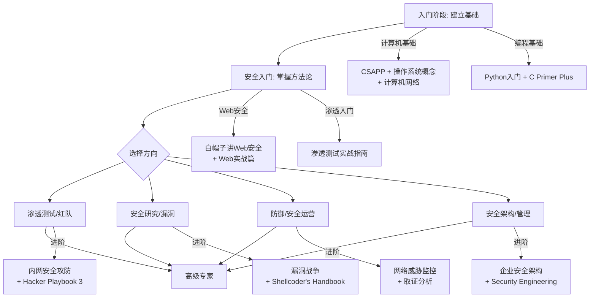

# 附录A 推荐书籍清单

## 概述

本附录精选了网络安全领域最具价值的书籍，按难度、主题和阅读路径分类。每本书附带详细说明、适合的读者群体、阅读优先级和实践建议。

网络安全是一个快速演进的领域，书籍的选择直接决定了学习效率。本清单遵循三个原则：

- **经典性**：优先选择经过时间检验、社区广泛认可的书籍
- **实操性**：优先选择有大量实验、案例和代码的实操型书籍
- **时效性**：标注出版年份，优先推荐近年出版的现代版本

> **阅读提示**：建议配合本教程的实战练习和CTF平台一起学习。每读完一章，尝试动手实验书中的技术。书籍是基础，但真正的成长来自实践。

---

## A.1 入门基础（适合零基础读者）

入门阶段的目标是建立扎实的计算机科学基础，理解操作系统、网络和编程的核心原理。这些知识是后续所有安全学习的基石。

### A.1.1 计算机系统与操作系统

| 书名 | 作者 | 出版年 | 阅读优先级 | 推荐理由 |
|------|------|--------|------------|----------|
| 《深入理解计算机系统》(CSAPP, 第3版) | Randal E. Bryant, David R. O'Hallaron | 2015 | ⭐⭐⭐⭐⭐ 必读 | 计算机科学的圣经。从信息表示、汇编、处理器架构到虚拟内存、链接器、并发编程，构建完整的系统认知。安全从业者理解缓冲区溢出、格式化字符串漏洞、竞态条件等攻击原理的理论基础 |
| 《操作系统概念》(第10版) | Abraham Silberschatz, Peter B. Galvin, Greg Gagne | 2018 | ⭐⭐⭐⭐ 强烈推荐 | 操作系统原理的权威教材。涵盖进程管理、内存管理、文件系统、I/O系统和保护机制。理解操作系统内核漏洞和权限提升攻击的必要前置知识 |
| 《计算机网络：自顶向下方法》(第8版) | James Kurose, Keith Ross | 2021 | ⭐⭐⭐⭐⭐ 必读 | 从应用层（HTTP/DNS）逐层向下讲解到物理层，符合安全从业者的实际工作视角。理解TCP/IP协议栈是网络攻防的基础 |
| 《TCP/IP详解 卷1：协议》 | W. Richard Stevens | 1994 | ⭐⭐⭐⭐ 强烈推荐 | 虽然出版较早，但TCP/IP协议的核心机制至今未变。对三次握手、滑动窗口、路由算法等的讲解至今无人超越。配合Wireshark抓包阅读效果最佳 |
| 《Linux命令行与Shell脚本编程大全》(第4版) | William Shotts | 2019 | ⭐⭐⭐⭐ 强烈推荐 | Linux是安全从业者的主战场。本书从命令行基础讲到Shell脚本编程，覆盖文件操作、文本处理、进程管理、正则表达式等日常高频技能 |

### A.1.2 编程基础

| 书名 | 作者 | 出版年 | 阅读优先级 | 推荐理由 |
|------|------|--------|------------|----------|
| 《Python编程：从入门到实践》(第2版) | Eric Matthes | 2019 | ⭐⭐⭐⭐⭐ 必读 | Python是安全工具开发的首选语言。本书零基础友好，前半部分讲语法基础，后半部分通过三个实战项目（游戏、数据可视化、Web应用）巩固所学。Metasploit、Scapy、Requests等安全库都是Python编写的 |
| 《C Primer Plus》(第6版) | Stephen Prata | 2013 | ⭐⭐⭐⭐ 强烈推荐 | 安全底层技术（漏洞利用、逆向工程、系统编程）离不开C语言。本书对指针、内存管理、位运算等关键概念的讲解尤为出色，这些恰恰是缓冲区溢出和内存破坏漏洞的核心 |
| 《Go语言实战》 | William Kennedy, Brian Ketelsen, Eric St. Martin | 2015 | ⭐⭐⭐ 推荐 | Go语言在云原生安全工具和高并发安全服务中应用广泛（Docker、Kubernetes、Terraform均为Go编写）。本书侧重实战，适合有其他语言基础的读者快速上手 |
| 《Rust程序设计语言》(第2版) | Steve Klabnik, Carol Nichols | 2019 | ⭐⭐⭐ 推荐 | Rust的内存安全特性使其成为编写安全工具的新选择。本书是Rust官方教程，对所有权系统、生命周期、并发安全的讲解深入浅出。适合有C/C++基础的读者 |

### A.1.3 网络基础

| 书名 | 作者 | 出版年 | 阅读优先级 | 推荐理由 |
|------|------|--------|------------|----------|
| 《网络是怎样连接的》 | 户根勤 | 2015 | ⭐⭐⭐⭐ 强烈推荐 | 用通俗语言解释从URL输入到页面显示的完整网络过程。覆盖DNS解析、TCP连接、HTTP通信、代理服务器、负载均衡等环节，是理解网络攻击面的极佳入门读物 |
| 《图解HTTP》 | 上野宣 | 2014 | ⭐⭐⭐ 推荐 | 以图解方式讲解HTTP协议的方方面面：请求方法、状态码、Cookie、缓存、HTTPS、Web安全等。Web安全从业者的HTTP协议速查手册 |

---

## A.2 安全入门（适合有基础的学习者）

安全入门阶段的目标是建立安全思维框架，理解常见攻击手法和防御策略，掌握基础安全工具的使用。

### A.2.1 Web安全

Web安全是渗透测试和安全防御的最大战场。建议从OWASP Top 10出发，系统学习每种漏洞的原理、利用和防御。

| 书名 | 作者 | 出版年 | 阅读优先级 | 推荐理由 |
|------|------|--------|------------|----------|
| 《白帽子讲Web安全》(第2版) | 吴翰清 | 2014 | ⭐⭐⭐⭐⭐ 必读 | 阿里云安全负责人吴翰清的Web安全经典。从攻击者视角系统讲解XSS、CSRF、SQL注入、文件上传、点击劫持等Web漏洞，每章都有完整的攻防代码示例。中文Web安全领域的标杆之作 |
| 《黑客攻防技术宝典：Web实战篇》(第2版) | Dafydd Stuttard, Marcus Pinto | 2012 | ⭐⭐⭐⭐⭐ 必读 | Web安全领域的圣经级著作。作者是Burp Suite的创造者，书中详细讲解Web应用渗透测试的方法论和实操技术，包括认证绕过、访问控制、SQL注入、命令注入、序列化攻击等。配套的WebGoat靶场是绝佳练习环境 |
| 《Web应用安全权威指南》 | 德丸浩 | 2012 | ⭐⭐⭐⭐ 强烈推荐 | 日本Web安全专家的力作，以"防御者"视角系统讲解Web应用安全。对输入验证、认证机制、会话管理、加密通信等安全设计有深入分析，适合防御方参考 |
| 《Web安全攻防：渗透测试实战指南》 | 徐焱 | 2019 | ⭐⭐⭐⭐ 强烈推荐 | 中文渗透测试实操指南，涵盖信息收集、漏洞扫描、漏洞利用、后渗透等完整流程。案例丰富，适合有一定基础的读者快速上手 |

### A.2.2 渗透测试方法论

| 书名 | 作者 | 出版年 | 阅读优先级 | 推荐理由 |
|------|------|--------|------------|----------|
| 《渗透测试：实战指南》(Penetration Testing) | Georgia Weidman | 2011 | ⭐⭐⭐⭐⭐ 必读 | 渗透测试的完整入门教程。从信息收集、漏洞扫描、渗透攻击到后渗透利用，覆盖Metasploit、Wireshark、Nmap、Burp Suite等核心工具。每章配有动手实验，是入门渗透测试的最佳选择 |
| 《Metasploit渗透测试指南》(第2版) | David Kennedy, Jim O'Gorman, Devon Kearns, Mati Aharoni | 2011 | ⭐⭐⭐⭐ 强烈推荐 | Metasploit框架的权威指南。从框架架构到模块开发，从基本用法到高级定制，系统讲解Metasploit在渗透测试各阶段的应用。配合Metasploit Unleashed在线教程效果更佳 |

### A.2.3 安全思维与方法论

| 书名 | 作者 | 出版年 | 阅读优先级 | 推荐理由 |
|------|------|--------|------------|----------|
| 《黑客大曝光》(第9版) | Stuart McClure, Joel Scambray, George Kurtz | 2012 | ⭐⭐⭐⭐ 强烈推荐 | 安全领域的经典参考书，覆盖Web、Windows、Linux、移动设备等各平台的攻击与防御技术。适合建立全面的安全知识框架，作为案头参考书使用 |
| 《社会工程：安全体系中的人性漏洞》 | Christopher Hadnagy | 2010 | ⭐⭐⭐ 推荐 | 社会工程攻击的系统讲解。从心理学原理到实操技巧，覆盖信息收集、信任建立、操纵策略等环节。理解社会工程是全面安全思维的重要组成部分 |

---

## A.3 进阶实战（适合中级安全从业者）

进阶阶段的目标是在某一专业方向深入，掌握高级攻击技术和防御策略。

### A.3.1 高级渗透测试与红队

| 书名 | 作者 | 出版年 | 阅读优先级 | 推荐理由 |
|------|------|--------|------------|----------|
| 《内网安全攻防》 | 徐焱 | 2016 | ⭐⭐⭐⭐⭐ 必读 | 中文内网渗透的权威之作。系统讲解域渗透、横向移动、权限维持、痕迹清理等内网攻击技术，覆盖Kerberos攻击、Pass-the-Hash、Golden Ticket等高级技术。实战案例丰富，是内网渗透的必读参考 |
| 《The Hacker Playbook 3: Penetration Testers Guide》 | Peter Kim | 2018 | ⭐⭐⭐⭐ 强烈推荐 | 红队实战手册，从传统渗透测试过渡到红队操作。涵盖初始访问、持久化、横向移动、数据提取等红队战术，大量使用Cobalt Strike和自定义工具。适合有渗透测试基础、想转型红队的读者 |
| 《红队实战》 | Emeric Nasi | 2017 | ⭐⭐⭐ 推荐 | 系统讲解红队操作方法论，从红队规划到实战执行。涵盖C2框架使用、权限提升、域渗透、免杀技术等。案例导向，实操性强 |
| 《Advanced Penetration Testing: Hacking the World's Most Secure Networks》 | Wil Allsopp | 2017 | ⭐⭐⭐⭐ 强烈推荐 | 高级渗透测试技术，超越常规渗透测试的范畴。涵盖攻击性基础设施搭建、高级社会工程、物理渗透、持久化技术等。适合有一定渗透测试经验、想挑战高安全环境的读者 |

### A.3.2 逆向工程与漏洞利用

逆向工程是理解软件行为和发现漏洞的核心技能。建议从x86汇编和调试器使用开始，逐步过渡到漏洞分析和利用开发。

| 书名 | 作者 | 出版年 | 阅读优先级 | 推荐理由 |
|------|------|--------|------------|----------|
| 《逆向工程核心原理》 | 李承远 | 2012 | ⭐⭐⭐⭐⭐ 必读 | 逆向工程的入门经典。从调试器使用、PE文件分析、壳的脱壳到反调试技术，循序渐进地讲解逆向工程的核心技能。每章配有大量实战案例，适合零基础读者入门 |
| 《加密与解密》(第4版) | 段钢 | 2019 | ⭐⭐⭐⭐⭐ 必读 | 中文逆向工程的权威之作。覆盖脱壳、调试、破解、漏洞分析、Rootkit等技术，对OllyDbg、IDA Pro、x64dbg等工具有系统讲解。第4版新增了64位逆向和移动平台内容 |
| 《漏洞战争：软件漏洞分析精要》 | 林桠泉 | 2017 | ⭐⭐⭐⭐ 强烈推荐 | 系统讲解软件漏洞分析方法，覆盖缓冲区溢出、整数溢出、格式化字符串、UAF、堆溢出等经典漏洞类型。每种漏洞都有完整的分析流程和利用代码，是从漏洞分析到漏洞利用开发的桥梁 |
| 《Hacking: The Art of Exploitation, 2nd Edition》 | Jon Erickson | 2008 | ⭐⭐⭐⭐ 强烈推荐 | 漏洞利用的艺术。从C语言、汇编、网络编程基础讲起，深入讲解缓冲区溢出、格式化字符串漏洞、网络编程、Shellcode编写等。理论与实践完美结合，是漏洞利用开发的经典教材 |
| 《The Shellcoder's Handbook: Discovering and Exploiting Security Holes》(第2版) | Chris Anley et al. | 2007 | ⭐⭐⭐ 推荐 | Shellcode开发和底层漏洞利用的深度教程。涵盖x86/x64 Shellcode编写、堆溢出利用、格式化字符串攻击、竞态条件利用等高级技术。适合有汇编基础、想深入漏洞利用的读者 |

### A.3.3 恶意软件分析

恶意软件分析是理解威胁、开发防御的关键技能。建议从静态分析开始，逐步过渡到动态分析和逆向分析。

| 书名 | 作者 | 出版年 | 阅读优先级 | 推荐理由 |
|------|------|--------|------------|----------|
| 《恶意代码分析实战》(Practical Malware Analysis) | Michael Sikorski, Andrew Honig | 2012 | ⭐⭐⭐⭐⭐ 必读 | 恶意软件分析的圣经。系统讲解静态分析、动态分析、逆向分析和行为分析的方法论，覆盖OllyDbg、IDA Pro、Wireshark、Process Monitor等工具。每章配有恶意软件样本和实验，是恶意软件分析的必读教材 |
| 《逆向：逆向工程的秘密》(Reverse: Secrets of Reverse Engineering) | Dennis Yurichev | 2020 | ⭐⭐⭐ 推荐 | 逆向工程的进阶教程，侧重从二进制代码中理解程序逻辑和算法。适合有逆向基础、想提升分析复杂软件能力的读者 |

### A.3.4 密码学与协议安全

密码学是现代安全的数学基础。虽然不需要成为密码学家，但理解密码学原理对安全从业者至关重要。

| 书名 | 作者 | 出版年 | 阅读优先级 | 推荐理由 |
|------|------|--------|------------|----------|
| 《应用密码学：协议、算法与C源程序》(第2版) | Bruce Schneier | 2015 | ⭐⭐⭐⭐ 强烈推荐 | 密码学领域的经典巨著。从对称加密、公钥加密、哈希函数到数字签名、密钥协商、随机数生成，覆盖密码学的方方面面。侧重实际应用而非数学理论，适合工程背景的读者 |
| 《图解密码技术》(第3版) | 结城浩 | 2015 | ⭐⭐⭐⭐⭐ 必读 | 日本密码学入门佳作。用大量图解和通俗语言讲解密码学基础，覆盖对称加密、公钥加密、哈希、数字签名、SSL/TLS、伪随机数等。零数学基础也能理解密码学原理，是入门密码学的最佳选择 |
| 《Crypto Engineering: Principles and Practices for Designing Secure Systems》 | Ferguson, Schneier, Kohno | 2010 | ⭐⭐⭐ 推荐 | 密码工程实践指南。从系统设计角度讲解如何正确使用密码学，覆盖协议设计、密钥管理、随机数生成、实现安全等。适合需要在实际项目中应用密码学的工程师 |

---

## A.4 高级专题（适合高级安全从业者）

高级阶段的目标是跨方向深入，掌握内核安全、云安全、AI安全等前沿领域的深度知识。

### A.4.1 操作系统内核与底层安全

| 书名 | 作者 | 出版年 | 阅读优先级 | 推荐理由 |
|------|------|--------|------------|----------|
| 《Windows Internals》(第7版 Part 1 & 2) | Mark Russinovich, David A. Solomon, Alex Ionescu | 2017 | ⭐⭐⭐⭐ 强烈推荐 | Windows内核的权威参考。深入讲解Windows进程、线程、内存管理、I/O系统、安全机制等内核组件。理解Windows内核是开发Rootkit、分析内核漏洞、研究EDR绕过技术的基础 |
| 《Linux内核设计与实现》(第3版) | Robert Love | 2010 | ⭐⭐⭐⭐ 强烈推荐 | Linux内核入门的经典教材。从进程管理、内存管理、文件系统到设备驱动、网络协议栈，系统讲解Linux内核的核心子系统。适合想理解Linux内核安全机制和内核漏洞的读者 |
| 《Linux内核完全注释》 | 赵炯 | 2006 | ⭐⭐⭐ 推荐 | 对Linux内核源码的逐行注释，适合想深入理解内核实现细节的中文读者。虽然基于较早版本，但内核核心机制的原理不变 |

### A.4.2 云安全与DevSecOps

云安全是当前增长最快的安全方向。随着企业大规模上云，云原生安全成为必备技能。

| 书名 | 作者 | 出版年 | 阅读优先级 | 推荐理由 |
|------|------|--------|------------|----------|
| 《云安全架构》 | 徐雷 | 2020 | ⭐⭐⭐⭐ 强烈推荐 | 中文云安全权威著作。系统讲解云平台安全架构、容器安全、微服务安全、云原生安全等主题。适合正在构建或维护云安全体系的架构师和工程师 |
| 《Hacking Kubernetes: Attack and Defense Strategies》 | Andrew Martin, Michael Hausenblas | 2021 | ⭐⭐⭐⭐ 强烈推荐 | Kubernetes安全的权威指南。从攻击者视角讲解K8s集群的攻击面，覆盖API Server安全、RBAC绕过、容器逃逸、供应链攻击等。每种攻击都有对应的防御策略 |
| 《AWS Security Cookbook》 | Sunny Veme | 2021 | ⭐⭐⭐ 推荐 | AWS安全实践指南。覆盖IAM策略、VPC安全组、S3桶策略、CloudTrail审计、GuardDuty威胁检测等AWS安全服务的最佳实践。适合AWS用户的实操参考 |
| 《Cloud Native Security》 | Chris Binnie, Rory McCune | 2021 | ⭐⭐⭐⭐ 强烈推荐 | 云原生安全的全面指南，覆盖容器、Kubernetes、服务网格、GitOps等云原生技术栈的安全防护。从开发到运维的全生命周期安全视角 |

### A.4.3 移动安全

移动安全是独立的专业方向，Android和iOS平台的安全机制差异大，需要分别学习。

| 书名 | 作者 | 出版年 | 阅读优先级 | 推荐理由 |
|------|------|--------|------------|----------|
| 《Android软件安全权威指南》 | 丰生强 | 2019 | ⭐⭐⭐⭐ 强烈推荐 | Android安全的中文权威之作。从Android系统架构、应用逆向、动态调试、漏洞分析到系统级Root，覆盖Android安全的方方面面。实操案例丰富，工具链完整 |
| 《Android安全攻防权威指南》 | Jeff Forristal, Collin Mulliner | 2014 | ⭐⭐⭐ 推荐 | Android安全的经典参考书，从攻击者视角系统分析Android平台的安全机制和攻击技术 |
| 《iOS安全攻防实战》 | Jonathan Zdziarski | 2012 | ⭐⭐⭐ 推荐 | iOS安全的入门读物，讲解iOS安全架构、越狱原理、应用安全分析等。虽然基于较早版本，但iOS安全的核心概念不变 |

### A.4.4 物联网与工控安全

IoT和ICS/SCADA安全是专业性极强的方向，涉及硬件安全、协议逆向和工控系统知识。

| 书名 | 作者 | 出版年 | 阅读优先级 | 推荐理由 |
|------|------|--------|------------|----------|
| 《IoT Penetration Testing Cookbook》 | Aaron Guzman, Aditya Gupta | 2017 | ⭐⭐⭐ 推荐 | IoT渗透测试实操指南，覆盖固件分析、协议逆向、硬件调试、无线安全等IoT安全核心技术。配有大量实验案例 |
| 《工业控制系统安全》 | 肖建鹏 | 2018 | ⭐⭐⭐ 推荐 | 中文工控安全著作，讲解SCADA、DCS、PLC等工控系统的安全威胁和防护策略。适合从事工控安全或关键基础设施保护的读者 |

### A.4.5 数字取证与应急响应

取证和应急响应是安全运营的核心能力，也是蓝队和安全分析师的必备技能。

| 书名 | 作者 | 出版年 | 阅读优先级 | 推荐理由 |
|------|------|--------|------------|----------|
| 《数字取证与应急响应》(The Art of Memory Forensics) | Michael Hale Ligh et al. | 2014 | ⭐⭐⭐⭐ 强烈推荐 | 内存取证的权威著作。系统讲解Volatility框架的使用，覆盖进程分析、网络连接、注册表、恶意代码检测等内存取证技术。内存取证是现代应急响应的关键能力 |
| 《Linux取证分析》(Learning Linux Digital Forensics) | Alexandru Ionescu | 2019 | ⭐⭐⭐ 推荐 | Linux数字取证的实操指南，覆盖文件系统分析、时间线重建、日志分析、内存取证等Linux取证核心技术 |
| 《Network Forensics》 | Ric Messier | 2017 | ⭐⭐⭐ 推荐 | 网络取证指南，讲解网络流量捕获、分析和溯源技术。覆盖Wireshark深度分析、网络日志关联、流量取证等 |

### A.4.6 AI安全与对抗机器学习

AI安全是快速发展的前沿方向，涵盖对抗样本、模型安全、AI驱动的攻防等新兴领域。

| 书名 | 作者 | 出版年 | 阅读优先级 | 推荐理由 |
|------|------|--------|------------|----------|
| 《Adversarial Machine Learning》 | Anthony D. Joseph, Brad Nelson, Huan Ranum | 2019 | ⭐⭐⭐ 推荐 | 对抗机器学习的学术参考书，系统讲解对抗样本、数据投毒、模型窃取等AI安全威胁。适合AI安全研究人员和对AI攻防感兴趣的高级从业者 |
| 《Not with a Bug, But with a Stake》 | Ram Shankar Siva Kumar, Hyrum Anderson | 2024 | ⭐⭐⭐⭐ 强烈推荐 | AI安全的最新实践指南，覆盖AI系统安全威胁的全谱系：数据投毒、模型逃逸、提示注入、隐私泄露等。从攻防双视角讲解AI系统的安全防护策略，适合实际部署AI系统的工程师 |

---

## A.5 管理与战略（适合安全管理者和架构师）

安全不仅是技术问题，更是管理和战略问题。安全管理者需要理解安全体系设计、风险管理和团队建设。

### A.5.1 安全架构与体系设计

| 书名 | 作者 | 出版年 | 阅读优先级 | 推荐理由 |
|------|------|--------|------------|----------|
| 《企业安全架构》(Security Architect) | John Sherwood, Andy Clark, David Lynas | 2005 | ⭐⭐⭐⭐ 强烈推荐 | 企业安全架构设计的经典参考。讲解安全架构的方法论、框架和最佳实践，覆盖纵深防御、最小权限、职责分离等核心安全原则。虽然出版较早，但安全架构的核心理念不变 |
| 《Security Engineering: A Guide to Building Dependable Distributed Systems》(第3版) | Ross Anderson | 2020 | ⭐⭐⭐⭐⭐ 必读 | 安全工程领域的巨著。从密码学、协议安全到系统安全、社会工程，全面覆盖安全工程的方方面面。第三版新增了云计算、物联网、深度学习安全等内容。免费在线阅读 |

### A.5.2 安全运营与威胁情报

| 书名 | 作者 | 出版年 | 阅读优先级 | 推荐理由 |
|------|------|--------|------------|----------|
| 《威胁情报》(Intelligence-Driven Incident Response) | Scott J. Roberts, Rebekah Brown | 2017 | ⭐⭐⭐⭐ 强烈推荐 | 威胁情报驱动的应急响应。讲解如何收集、分析和利用威胁情报，将被动响应转化为主动防御。覆盖威胁情报生命周期、情报共享、自动化响应等 |
| 《The Practice of Network Security Monitoring》 | Richard Bejtlich | 2013 | ⭐⭐⭐⭐ 强烈推荐 | 网络安全监控的实践指南。讲解NSM的六大流程（收集、处理、分析、检测、响应、反馈），覆盖传感器部署、流量分析、告警管理等。适合SOC团队参考 |
| 《Defensive Security Handbook: Best Practices for Securing Your IT Infrastructure》 | Lee Brotherston, Amanda Berlin | 2017 | ⭐⭐⭐ 推荐 | 防御性安全的最佳实践手册。覆盖网络分段、端点防护、日志管理、漏洞管理、安全策略等企业安全运营的关键领域 |

### A.5.3 安全经典与思维提升

| 书名 | 作者 | 出版年 | 阅读优先级 | 推荐理由 |
|------|------|--------|------------|----------|
| 《The Art of Intrusion》 | Kevin Mitnick | 2002 | ⭐⭐⭐⭐ 强烈推荐 | 凯文·米特尼克（世界头号黑客）的攻防案例集。通过真实的社会工程和入侵案例，展示安全系统的脆弱性和攻防思维。故事性强，适合培养安全意识 |
| 《Ghost in the Wires: My Adventures as the World's Most Wanted Hacker》 | Kevin Mitnick, William Simon | 2011 | ⭐⭐⭐ 推荐 | 凯文·米特尼克的自传，讲述了他从少年黑客到FBI通缉犯再到安全顾问的人生经历。读起来像惊悚小说，同时传达了社会工程攻击的真实威胁 |
| 《Thinking, Fast and Slow》 | Daniel Kahneman | 2011 | ⭐⭐⭐ 推荐 | 虽然不是安全书籍，但理解认知偏差和决策心理对安全管理者至关重要。安全策略的制定、风险评估、用户安全意识培训都离不开行为经济学的洞见 |
| 《The Cuckoo's Egg: Tracking a Spy Through the Maze of Computer Espionage》 | Clifford Stoll | 1989 | ⭐⭐⭐ 推荐 | 计算机安全领域的经典叙事。讲述了天文学家Clifford Stoll追踪苏联间谍入侵伯克利实验室的真实故事。虽然技术已过时，但安全思维和调查方法论至今仍有价值 |

---

## A.6 竞赛与靶场（适合CTF爱好者和实战练习者）

CTF（Capture The Flag）竞赛是提升安全实战技能的绝佳途径。以下书籍覆盖了CTF竞赛的核心知识和解题技巧。

| 书名 | 作者 | 出版年 | 阅读优先级 | 推荐理由 |
|------|------|--------|------------|----------|
| 《CTF竞赛权威指南：Erta》 | FlappyPig战队 | 2019 | ⭐⭐⭐⭐ 强烈推荐 | 国内顶级CTF战队FlappyPig的经验总结。覆盖Web、Pwn、Reverse、Crypto、Misc五大方向的核心解题技巧，配合大量真实赛题解析 |
| 《Exploiting Software: How to Break Code》 | Greg Hoglund, Gary McGraw | 2004 | ⭐⭐⭐ 推荐 | 软件漏洞利用的经典教材，讲解缓冲区溢出、格式化字符串、竞态条件等漏洞的利用技术。虽然是CTF的前置知识，但对PWN方向的CTF选手帮助巨大 |
| 《The Web Application Hacker's Handbook》(第2版) | Dafydd Stuttard, Marcus Pinto | 2011 | ⭐⭐⭐⭐⭐ 必读 | Web安全方向CTF的圣经。系统讲解Web应用漏洞的发现和利用技术，是Web安全CTF选手的核心参考书 |

> **在线CTF平台推荐**：除了书籍，实战练习同样重要。推荐以下平台：
> - **入门**：picoCTF、OverTheWire (Bandit/Natas)、TryHackMe
> - **进阶**：Hack The Box、VulnHub、PentesterLab
> - **竞赛**：CTFtime（全球CTF赛事日历）、BUUCTF（国内综合平台）
> - **专项**：DVWA（Web安全）、ROP Emporium（二进制利用）、Microcorruption（嵌入式安全）

---

## A.7 选书策略与阅读路径

网络安全的知识体系庞杂，盲目阅读效率低下。本节提供科学的选书策略和个性化阅读路径。

### A.7.1 按职业方向选择

不同职业方向需要不同的知识组合。以下是常见安全职业的推荐阅读路径：

| 职业方向 | 核心书籍（必读） | 补充书籍（推荐） | 技能重点 |
|----------|-------------------|-------------------|----------|
| **渗透测试工程师** | 《渗透测试：实战指南》《黑客攻防技术宝典：Web实战篇》《The Hacker Playbook 3》 | 《内网安全攻防》《Advanced Penetration Testing》 | 漏洞发现与利用、报告撰写、工具使用 |
| **安全研究工程师** | 《Hacking: The Art of Exploitation》《漏洞战争》《恶意代码分析实战》 | 《逆向工程核心原理》《The Shellcoder's Handbook》 | 漏洞挖掘与分析、利用开发、逆向工程 |
| **安全架构师** | 《企业安全架构》《Security Engineering》《云安全架构》 | 《Defensive Security Handbook》《Thinking, Fast and Slow》 | 安全体系设计、风险管理、合规 |
| **蓝队/SOC分析师** | 《The Practice of Network Security Monitoring》《威胁情报》《数字取证与应急响应》 | 《Defensive Security Handbook》《Linux取证分析》 | 威胁检测、事件响应、日志分析 |
| **红队成员** | 《The Hacker Playbook 3》《红队实战》《Advanced Penetration Testing》 | 《Windows Internals》《Black Hat Python》 | 对抗检测、权限维持、横向移动 |
| **恶意软件分析师** | 《恶意代码分析实战》《逆向工程核心原理》《加密与解密》 | 《Hacking: The Art of Exploitation》 | 静态分析、动态分析、逆向分析 |
| **移动安全工程师** | 《Android软件安全权威指南》《加密与解密》 | 《Android安全攻防权威指南》 | 应用逆向、动态调试、漏洞分析 |

### A.7.2 按学习阶段选择

### A.7.3 阅读建议

1. **入门阶段（0-6个月）**：先读A.1的基础书籍，建立计算机科学和编程基础。同时读A.2的Web安全和渗透测试入门书籍，培养安全思维。不要跳过基础直接读高级内容。

2. **安全入门阶段（6-12个月）**：在A.2的基础上，选择一个方向深入。通过CTF靶场（A.6）和教程实战练习巩固所学。这个阶段的关键是"动手"而非"读书"。

3. **进阶阶段（1-3年）**：选择A.3中对应方向的书籍深入学习。同时开始阅读A.4中的高级专题，拓展知识边界。这个阶段应该能独立完成中等难度的渗透测试或安全分析任务。

4. **高级阶段（3年以上）**：跨方向学习，阅读A.4的高级专题和A.5的管理战略书籍。关注安全会议（DEF CON、Black Hat、KCon）的演讲和论文，保持知识更新。

5. **持续学习**：安全领域变化极快，书籍的知识可能滞后1-2年。必须配合以下渠道保持更新：
   - **安全博客**：Krebs on Security、The Hacker News、FreeBuf、先知社区
   - **漏洞公告**：CVE Details、NVD、各大厂商安全公告
   - **安全会议**：DEF CON、Black Hat、KCon、HITB
   - **学术论文**：IEEE S&P、ACM CCS、USENIX Security
   - **开源工具文档**：Metasploit、Burp Suite、Nmap、Wireshark官方文档

---

## A.8 补充推荐：在线学习资源

除了传统书籍，以下在线资源是安全学习的重要补充：

### A.8.1 在线课程与教程

| 平台/资源 | 类型 | 适合阶段 | 推荐理由 |
|-----------|------|----------|----------|
| **TryHackMe** | 交互式靶场 | 入门-进阶 | 引导式学习路径，从零基础到高级攻击，配有详细教程和视频 |
| **Hack The Box** | CTF靶场 | 进阶-高级 | 高质量的渗透测试靶机，社区活跃，是提升实战能力的最佳平台 |
| **Cybrary** | 在线课程 | 入门-进阶 | 覆盖CISSP、CEH等认证课程，适合系统学习安全知识 |
| **SANS Cyber Aces** | 免费课程 | 入门 | SANS学院的免费基础课程，覆盖操作系统、网络、安全基础 |
| **OpenSecurityTraining2** | 免费课程 | 进阶-高级 | 高质量的免费安全培训，覆盖逆向工程、恶意软件分析、漏洞利用等 |
| **PentesterLab** | 靶场+教程 | 进阶 | Web安全和渗透测试的在线实验室，配有详细的练习指南 |

### A.8.2 常用安全工具参考

| 工具 | 用途 | 学习资源 |
|------|------|----------|
| **Nmap** | 网络扫描与发现 | Nmap官方文档 + 《Nmap Network Scanning》(免费) |
| **Wireshark** | 网络流量分析 | Wireshark官方文档 + Chris Sanders的《Practical Packet Analysis》 |
| **Burp Suite** | Web应用测试 | PortSwigger Web Security Academy (免费) |
| **Metasploit** | 渗透测试框架 | Metasploit Unleashed (免费在线教程) |
| **IDA Pro / Ghidra** | 反汇编与逆向 | IDA Pro官方文档 + Ghidra Book |
| **OllyDbg / x64dbg** | 用户态调试 | 实战驱动学习，配合逆向书籍使用 |
| **Volatility** | 内存取证 | Volatility官方文档 + 《The Art of Memory Forensics》 |
| **BloodHound** | AD域分析 | BloodHound官方文档 + 《Active Directory Security》 |

---

## A.9 书籍获取建议

### A.9.1 正版购买渠道

- **国内**：京东、当当、淘宝（出版商旗舰店）、机械工业出版社、电子工业出版社、人民邮电出版社
- **国际**：Amazon、O'Reilly Safari Books Online（订阅制，推荐）、Packt Publishing
- **电子版**：Kindle、Google Play Books、多看阅读

### A.9.2 学习资源的合理使用

- 优先购买纸质书或正版电子书，支持作者和出版行业
- O'Reilly Safari Books Online提供订阅制访问，适合需要阅读多本技术书籍的读者
- 部分经典书籍有免费在线版本（如《Security Engineering》第3版、Nmap书）
- 大学图书馆通常有技术书籍的馆际互借服务

> **重要提醒**：本书单中的书籍信息（书名、作者、出版年）力求准确，但出版信息可能随版本更新而变化。建议在购买前通过豆瓣读书、Amazon或出版社官网核实最新版本信息。
