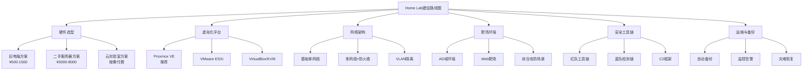
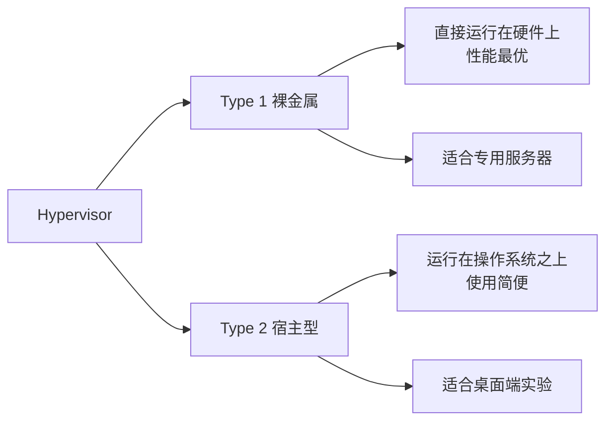
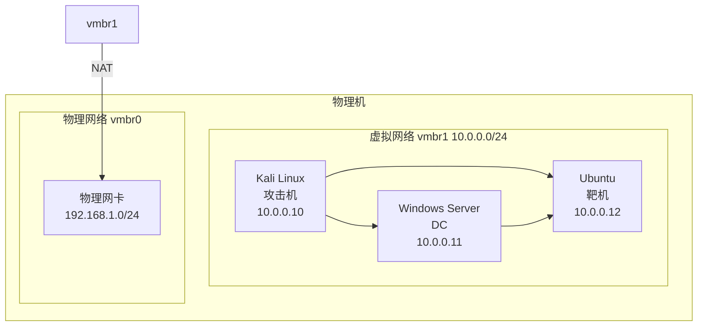
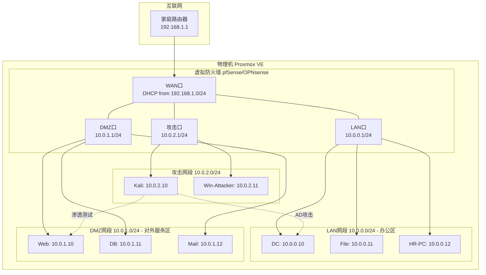
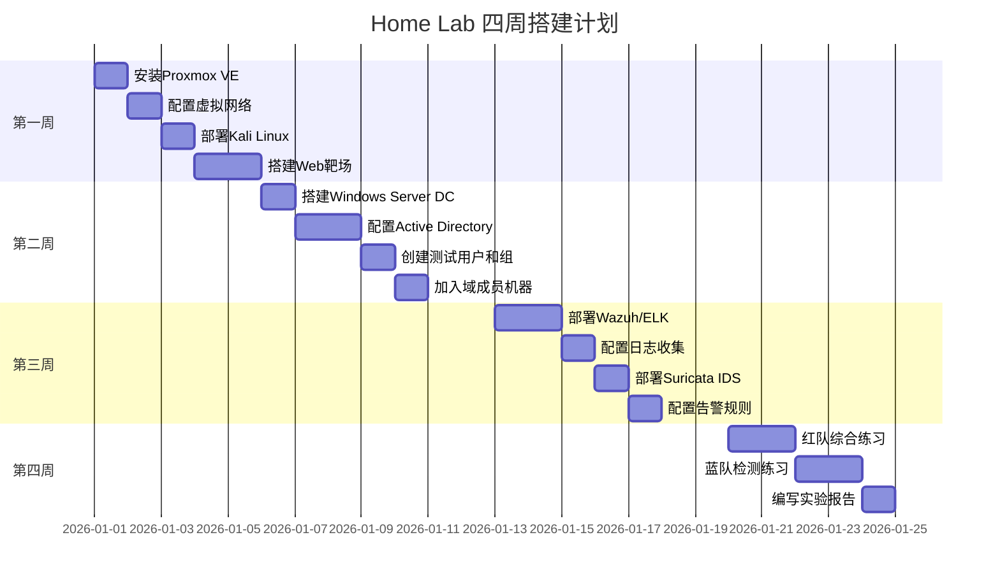

# 附录D Home Lab搭建指南

## 概述

Home Lab（家庭实验室）是网络安全学习者的核心基础设施。与在线靶场不同，Home Lab提供完全自主控制的隔离环境，允许你自由搭建攻击与防御场景、复现真实漏洞、调试自动化工具链，而不用担心对生产环境造成任何影响。

一个设计良好的Home Lab应当满足以下要求：

- **隔离性**：攻击实验流量不会泄露到家庭网络或互联网
- **可恢复性**：任何实验导致的"灾难"都能通过快照秒级回滚
- **真实性**：模拟真实企业网络拓扑（AD域、DMZ、多子网）
- **可扩展性**：随学习深度增加，能低成本扩展硬件和环境
- **低成本**：充分利用闲置硬件、开源工具和云服务免费额度

本附录将从硬件选型、虚拟化平台、网络拓扑、靶场搭建、工具安装到运维管理，提供一套完整的Home Lab建设方案。



---

## D.1 硬件选择

硬件是Home Lab的物理基础。选择方案时需要综合考虑预算、性能需求、电力成本、噪音水平和扩展空间四个维度。

### D.1.1 方案一：旧电脑改造（预算 ¥500-1500）

适合初学者，利用家中闲置的台式机或笔记本电脑。优点是零门槛启动，缺点是扩展性有限。

**最低配置**（能运行1-2台虚拟机）：

| 组件 | 最低要求 | 说明 |
|------|---------|------|
| CPU | 4核，支持VT-x/AMD-V | Intel 4代+ 或 AMD Ryzen 1代+ |
| 内存 | 16GB DDR4 | 虚拟化环境内存消耗大，16GB是底线 |
| 存储 | 256GB SSD | 系统盘+虚拟机存放，SSD是必须的 |
| 网络 | 千兆网卡 | 确保虚拟机间通信不成为瓶颈 |

**推荐配置**（能流畅运行4-6台虚拟机）：

| 组件 | 推荐要求 | 说明 |
|------|---------|------|
| CPU | 8核，支持VT-x/AMD-V/VT-d | Intel 6代+ 支持硬件直通 |
| 内存 | 32GB DDR4 | AD环境+Web靶场+Kali需要充足内存 |
| 存储 | 512GB SSD + 1TB HDD | SSD放系统和活跃VM，HDD放备份和冷数据 |
| 网络 | 千兆网卡 | 可加装USB千兆网卡做桥接 |
| 电源 | 450W 80Plus | 保证稳定供电，避免实验中途断电 |

**关键检查项**：购买或使用旧电脑前，务必确认BIOS中已开启虚拟化支持（Intel VT-x 或 AMD-V）。部分品牌机（如Dell OptiPlex、HP ProDesk）在二手市场价格极低，且自带企业级稳定性，是性价比极高的选择。

### D.1.2 方案二：专用服务器（预算 ¥3000-8000）

适合进阶学习者，需要运行较复杂的企业级场景（如多域AD环境、大规模Web应用集群）。

**推荐配置**：

| 组件 | 推荐规格 | 说明 |
|------|---------|------|
| 服务器 | Dell R720/R730 或 HP DL380 Gen9 | 二手企业服务器，性价比极高 |
| CPU | 2× E5-2680v3（12核24线程） | 双路处理器提供充足的计算资源 |
| 内存 | 64-128GB DDR4 ECC | ECC内存保证数据完整性，支持大内存虚拟机 |
| 存储 | 2× 1TB SSD + 4× 2TB HDD | SSD做ZFS缓存池，HDD做数据存储 |
| RAID | H730 Mini 或 HBA直通 | 支持ZFS直通最佳，避免RAID卡缓存干扰 |
| 网络 | 双千兆 + 万兆可选 | 万兆网卡适合多服务器集群 |

**购买渠道与注意事项**：

- **闲鱼/淘宝**：搜索"Dell R730"、"HP DL380 Gen9"，企业淘汰设备价格通常在原价1-3折
- **注意事项**：确认服务器已刷最新固件，检查硬盘健康状态（使用SMART检测），确认内存插满或可扩展
- **噪音问题**：企业服务器风扇噪音较大（40-60dB），建议放置在独立房间或使用第三方静音风扇方案
- **电力成本**：双路E5空载约150W，满载约400W，按0.5元/度计算，每月电费约54-144元

### D.1.3 方案三：云实验室（按需付费）

适合不想折腾硬件、需要弹性伸缩的学习者。优点是随时随地可用，缺点是长期使用成本较高。

**主流云平台对比**：

| 平台 | 规格 | 参考价格 | 优势 | 劣势 |
|------|------|---------|------|------|
| AWS EC2 | t3.xlarge (4vCPU/16GB) | ≈¥1.5/小时 | 全球覆盖，免费层12个月 | 中国区需备案 |
| Azure | Standard_D4s_v3 | ≈¥1.8/小时 | AD集成好，适合AD实验 | 价格偏高 |
| 阿里云 | ecs.c6.xlarge | ≈¥1.2/小时 | 国内速度快，合规性好 | 跨区域带宽贵 |
| 腾讯云 | S5.LARGE8 | ≈¥1.0/小时 | 价格最亲民，新用户优惠多 | 国际节点少 |

**省钱技巧**：

1. **Spot/竞价实例**：AWS和阿里云都支持竞价实例，价格可降低70-90%，适合可中断的实验任务
2. **用完立即关闭**：设置自动关机脚本，避免遗忘导致持续计费
3. **学生优惠**：AWS Educate、Azure for Students、腾讯云校园计划都提供免费额度
4. **按需关机策略**：编写脚本在非工作时间自动关机，工作时间自动开机

```bash
# 阿里云ECS自动关机脚本示例（需安装aliyun CLI）
#!/bin/bash
HOUR=$(date +%H)
if [ $HOUR -ge 23 ] || [ $HOUR -lt 8 ]; then
    aliyun ecs StopInstances --InstanceIds '["i-xxx"]' --Force true
fi
```

---

## D.2 虚拟化平台

虚拟化平台是Home Lab的软件基石，决定了你能管理多少虚拟机、支持哪些高级功能（如硬件直通、热迁移、快照回滚）。

### D.2.1 Hypervisor类型对比



**Type 1 Hypervisor（裸金属）**——安装在独立硬件上，直接接管物理资源：

| 平台 | 许可证 | 优势 | 劣势 |
|------|--------|------|------|
| **Proxmox VE** | 开源免费 | Debian底层、ZFS原生、Web管理界面、集群支持 | 企业功能需订阅 |
| VMware ESXi | 免费版可用 | 企业标准、vSphere生态、成熟稳定 | 高级功能需付费许可 |
| XCP-ng | 开源免费 | Xen底层、XOA管理界面、实时迁移 | 社区较小 |
| Hyper-V Server | 微软免费 | Windows生态、PowerShell管理 | 已停止独立版本更新 |

**Type 2 Hypervisor（宿主型）**——运行在现有操作系统之上：

| 平台 | 许可证 | 适用场景 |
|------|--------|---------|
| VirtualBox | 开源免费 | Windows/macOS/Linux桌面端快速实验 |
| VMware Workstation | 付费/免费（个人版） | 功能最全的桌面虚拟化 |
| UTM | 开源免费 | macOS/iOS最佳选择，基于QEMU |
| KVM/QEMU | 开源免费 | Linux原生虚拟化，性能接近裸金属 |

### D.2.2 Proxmox VE安装与配置（推荐方案）

Proxmox VE是Home Lab的最佳选择：基于Debian、原生支持ZFS、提供Web管理界面、支持LXC容器和KVM虚拟机、拥有活跃的开源社区。

**安装步骤**：

```bash
# 1. 下载ISO镜像
# 访问 https://www.proxmox.com/en/downloads 下载最新版ISO
# 建议选择最新的稳定版（如8.x）

# 2. 制作启动U盘
# Linux/Mac:
sudo dd if=proxmox-ve_8.x.iso of=/dev/sdX bs=4M status=progress
# Windows: 使用Rufus，选择DD模式写入

# 3. 安装过程（屏幕引导）
#    a. 选择目标磁盘（建议使用SSD）
#    b. 设置国家/时区/键盘布局
#    c. 设置root密码和管理员邮箱
#    d. 配置网络：管理IP、网关、DNS服务器
#    e. 确认配置，开始安装（约5-10分钟）

# 4. 安装完成后访问Web管理界面
# 浏览器打开 https://<服务器IP>:8006
# 用户名: root，密码: 安装时设置的密码
```

**基础配置——更换国内源**（解决国内访问Proxmox企业源速度慢的问题）：

```bash
# 禁用企业源（需要订阅才能使用）
sed -i.bak 's|^deb https://enterprise.proxmox.com|## deb https://enterprise.proxmox.com|' \
    /etc/apt/sources.list.d/pve-enterprise.list

# 添加无订阅源（社区维护，适合非生产环境）
echo 'deb http://mirrors.ustc.edu.cn/proxmox/debian/pve bookworm pve-no-subscription' > \
    /etc/apt/sources.list.d/pve-no-subscription.list

# 更新系统
apt update && apt dist-upgrade -y

# 禁用订阅弹窗（每次登录Web界面会提示）
sed -i.bak "s/data.status !== 'Active'/false/g" /usr/share/javascript/proxmox-widget-toolkit/proxmoxlib.js
systemctl restart pveproxy
```

**存储配置——ZFS vs LVM**：

| 特性 | ZFS | LVM |
|------|-----|-----|
| 快照 | 原生支持，秒级创建 | 需要thin provisioning |
| 数据完整性 | 内置校验和，自动修复 | 无内置校验 |
| 压缩 | 透明压缩（LZ4/ZSTD） | 不支持 |
| 内存开销 | 较高（1GB/TB存储） | 较低 |
| 适合场景 | 数据安全要求高 | 资源有限的环境 |

```bash
# Proxmox中配置ZFS存储
# 安装ZFS工具
apt install zfsutils-linux

# 创建ZFS存储池（假设 /dev/sdb 和 /dev/sdc 是空闲磁盘）
zpool create -f -o ashift=12 tank mirror /dev/sdb /dev/sdc

# 在Web界面添加ZFS存储
# Datacenter → Storage → Add → ZFS
# ID: zfs-storage
# Pool: tank
# Content: Disk image, ISO image, VZDump backup
```

### D.2.3 Proxmox虚拟网络配置

```bash
# Proxmox网络配置文件位置
# /etc/network/interfaces

# 默认安装后的配置示例
auto vmbr0
iface vmbr0 inet static
    address 192.168.1.100/24      # 管理IP
    gateway 192.168.1.1           # 物理网络网关
    bridge-ports eno1             # 桥接到物理网卡
    bridge-stp off
    bridge-fd 0

# 添加隔离的实验网络（不连接物理网络）
auto vmbr1
iface vmbr1 inet static
    address 10.0.0.1/24           # 内部网关
    bridge-ports none             # 不绑定物理网卡
    bridge-stp off
    bridge-fd 0
    post-up echo 1 > /proc/sys/net/ipv4/ip_forward
    post-up iptables -t nat -A POSTROUTING -s '10.0.0.0/24' -o vmbr0 -j MASQUERADE
    post-down iptables -t nat -D POSTROUTING -s '10.0.0.0/24' -o vmbr0 -j MASQUERADE

# 配置完成后重启网络
systemctl restart networking
```

---

## D.3 网络拓扑设计

网络拓扑是Home Lab的骨架。合理的网络设计决定了你的实验环境能否真实模拟企业场景，以及攻击实验是否会被隔离在安全边界内。

### D.3.1 基础拓扑（单网段环境）

适合初学者，所有虚拟机在同一网段，通过Proxmox的默认桥接网络通信。



**适用场景**：Web靶场练习（DVWA、Juice Shop）、基础渗透测试学习。

**优点**：配置简单，5分钟即可搭建完成。
**局限**：无法模拟真实企业多子网场景，网络隔离能力弱。

### D.3.2 高级拓扑（多网段+防火墙环境）

通过虚拟防火墙（pfSense/OPNsense）划分多个安全域，真实模拟企业网络架构。



**各网段职责**：

| 网段 | CIDR | 用途 | 访问控制 |
|------|------|------|---------|
| LAN | 10.0.0.0/24 | 企业内部办公网络（DC、文件服务器、终端） | 可访问DMZ，不可直接访问互联网 |
| DMZ | 10.0.1.0/24 | 对外服务（Web、数据库、邮件） | 仅允许80/443端口访问互联网 |
| 攻击网段 | 10.0.2.0/24 | 渗透测试工具和攻击机 | 可访问LAN和DMZ，禁止访问物理网络 |

### D.3.3 pfSense/OPNsense防火墙部署

pfSense和OPNsense是开源的网络防火墙/路由器方案，功能堪比企业级硬件防火墙。

```bash
# 在Proxmox中部署OPNsense
# 1. 下载OPNsense ISO
wget https://mirrors.opnsense.org/releases/24.1/OPNsense-24.1-OpenSSL-amd64.iso

# 2. 创建虚拟机（Web界面操作）
# VMID: 1000
# Name: opnsense-firewall
# ISO: 上传的OPNsense ISO
# CPU: 2核
# 内存: 2GB
# 磁盘: 32GB
# 网卡: 4个（WAN、LAN、DMZ、Attack分别桥接到vmbr0-vmbr3）

# 3. 安装后基础配置（通过Web界面 https://10.0.0.1）
# WAN: DHCP（从物理网络获取）
# LAN: 静态IP 10.0.0.1/24
# OPT1 (DMZ): 静态IP 10.0.1.1/24
# OPT2 (Attack): 静态IP 10.0.2.1/24

# 4. 启用DHCP服务器
# Services → DHCP Server → LAN
# Enable: ✓
# Range: 10.0.0.100 - 10.0.0.200
# DNS Server: 10.0.0.10 (DC的IP)
```

---

## D.4 靶机环境搭建

靶机环境是Home Lab的核心价值所在。好的靶机环境应能覆盖常见攻击面：Web应用漏洞、AD域渗透、内网横向移动、权限提升等。

### D.4.1 Active Directory域环境搭建

Active Directory是企业网络的核心身份认证和授权系统，也是红队渗透测试的重要目标。搭建一个完整的AD环境是学习域渗透的前提。

**环境规划**：

| 角色 | 主机名 | IP | 职责 |
|------|--------|-----|------|
| 域控制器 | LAB-DC01 | 10.0.0.10 | AD DS、DNS、DHCP |
| 文件服务器 | LAB-FS01 | 10.0.0.11 | SMB共享、文件权限实验 |
| 工作站 | LAB-WS01 | 10.0.0.20 | 域成员机、终端安全实验 |
| 工作站 | LAB-WS02 | 10.0.0.21 | 第二台终端、横向移动实验 |

**PowerShell一键搭建脚本**：

```powershell
# ============================================
# Active Directory 环境自动化搭建脚本
# 在 Windows Server 2022 上运行
# ============================================

# 1. 安装AD DS角色和管理工具
Install-WindowsFeature AD-Domain-Services -IncludeManagementTools

# 2. 提升为域控制器（创建新林）
Import-Module ADDSDeployment
Install-ADDSForest `
    -DomainName "lab.local" `
    -DomainNetBIOSName "LAB" `
    -ForestMode "WinThreshold" `
    -DomainMode "WinThreshold" `
    -InstallDNS:$true `
    -SafeModeAdministratorPassword (ConvertTo-SecureString "L@bR00t!2026" -AsPlainText -Force) `
    -Force:$true
# 重启后生效
Restart-Computer -Force

# ============================================
# 以下脚本在域控制器重启后运行
# ============================================

# 3. 创建组织单位（OU）结构
New-ADOrganizationalUnit -Name "IT" -Path "DC=lab,DC=local"
New-ADOrganizationalUnit -Name "HR" -Path "DC=lab,DC=local"
New-ADOrganizationalUnit -Name "Finance" -Path "DC=lab,DC=local"
New-ADOrganizationalUnit -Name "Sales" -Path "DC=lab,DC=local"
New-ADOrganizationalUnit -Name "Servers" -Path "DC=lab,DC=local"
New-ADOrganizationalUnit -Name "Workstations" -Path "DC=lab,DC=local"

# 4. 批量创建用户
$users = @(
    @{Name="张三"; Sam="zhangsan"; Dept="IT"; Title="系统管理员"; Admin=$true},
    @{Name="李四"; Sam="lisi"; Dept="HR"; Title="人力资源经理"; Admin=$false},
    @{Name="王五"; Sam="wangwu"; Dept="Finance"; Title="财务主管"; Admin=$false},
    @{Name="赵六"; Sam="zhaoliu"; Dept="Sales"; Title="销售经理"; Admin=$false},
    @{Name="钱七"; Sam="qianqi"; Dept="IT"; Title="网络工程师"; Admin=$false},
    @{Name="孙八"; Sam="sunba"; Dept="IT"; Title="安全分析师"; Admin=$false}
)

foreach ($u in $users) {
    $password = "Welcome1!"
    New-ADUser -Name $u.Name `
        -SamAccountName $u.Sam `
        -UserPrincipalName "$($u.Sam)@lab.local" `
        -Path "OU=$($u.Dept),DC=lab,DC=local" `
        -AccountPassword (ConvertTo-SecureString $password -AsPlainText -Force) `
        -Enabled $true `
        -ChangePasswordAtLogon $false `
        -Description "$($u.Title) - $($u.Dept)"
    
    Write-Host "[+] 已创建用户: $($u.Sam) ($($u.Name))"
}

# 5. 创建安全组
New-ADGroup -Name "Domain Admins-Extra" -GroupScope Global -Path "DC=lab,DC=local"
Add-ADGroupMember -Identity "Domain Admins" -Members @("zhangsan")

# 6. 创建服务账户（低权限，模拟真实场景）
$svcAccounts = @(
    @{Name="svc_backup"; Password="B@ckup2026!"},
    @{Name="svc_web"; Password="W3bS3rv!ce2026"},
    @{Name="svc_sql"; Password="SqL_S3rvc3!2026"}
)
foreach ($svc in $svcAccounts) {
    New-ADUser -Name $svc.Name `
        -SamAccountName $svc.Name `
        -UserPrincipalName "$($svc.Name)@lab.local" `
        -Path "OU=IT,DC=lab,DC=local" `
        -AccountPassword (ConvertTo-SecureString $svc.Password -AsPlainText -Force) `
        -Enabled $true `
        -PasswordNeverExpires $true
    Write-Host "[+] 已创建服务账户: $($svc.Name)"
}

# 7. 创建共享文件夹和权限
$shares = @(
    @{Name="IT$"; Path="C:\Shares\IT"; Group="IT"},
    @{Name="HR"; Path="C:\Shares\HR"; Group="HR"},
    @{Name="Finance"; Path="C:\Shares\Finance"; Group="Finance"},
    @{Name="Public"; Path="C:\Shares\Public"; Group="Domain Users"}
)

foreach ($s in $shares) {
    New-Item -Path $s.Path -ItemType Directory -Force
    New-SmbShare -Name $s.Name `
        -Path $s.Path `
        -FullAccess "LAB\Domain Admins" `
        -ReadAccess "LAB\$($s.Group)" `
        -Description "共享文件夹 - $($s.Name)"
}

# 8. 配置弱密码策略（故意留漏洞用于练习）
# 注意：仅限实验室环境，生产环境绝不可这样做！
net accounts /minpwlen:4 /maxpwage:unlimited /uniquepw:0

# 9. 配置易受攻击的GPO
# 禁用Windows防火墙
Set-NetFirewallProfile -Profile Domain,Public,Private -Enabled False

# 启用WinRM（用于远程管理，也是攻击向量）
Enable-PSRemoting -Force
winrm quickconfig -force
winrm set winrm/config/service '@{AllowUnencrypted="true"}'
winrm set winrm/config/service/auth '@{Basic="true"}'

# 启用SMBv1（已知漏洞，仅用于练习）
Set-SmbServerConfiguration -EnableSMB1Protocol $true -Force

# 启用RDP
Set-ItemProperty -Path 'HKLM:\System\CurrentControlSet\Control\Terminal Server' -Name "fDenyTSConnections" -Value 0
Enable-NetFirewallRule -DisplayGroup "Remote Desktop"

Write-Host "`n[+] AD环境搭建完成！" -ForegroundColor Green
Write-Host "[+] 域: lab.local" -ForegroundColor Cyan
Write-Host "[+] DC IP: $(Get-NetIPAddress -AddressFamily IPv4 | Where-Object {$_.InterfaceAlias -like 'Ethernet*'}).IPAddress" -ForegroundColor Cyan
Write-Host "[+] 警告：此环境包含故意配置的弱安全设置，仅用于安全学习！" -ForegroundColor Yellow
```

**将Windows机器加入域**（在成员机上运行）：

```powershell
# 修改DNS指向域控制器
Set-DnsClientServerAddress -InterfaceAlias "Ethernet" -ServerAddresses "10.0.0.10"

# 加入域
Add-Computer -DomainName "lab.local" `
    -Credential (Get-Credential) `
    -OUPath "OU=Workstations,DC=lab,DC=local" `
    -Force -Restart
```

### D.4.2 Web应用靶场

Web应用漏洞是最常见的攻击面。以下使用Docker快速搭建多款经典Web靶场：

```bash
# ============================================
# Docker环境安装
# ============================================
# 安装Docker Engine
curl -fsSL https://get.docker.com | sh
usermod -aG docker $USER
# 重新登录以使docker组生效，或执行：
newgrp docker

# 安装Docker Compose
apt install docker-compose-plugin -y

# 验证安装
docker --version
docker compose version

# ============================================
# 经典Web靶场部署
# ============================================

# DVWA (Damn Vulnerable Web Application)
# 覆盖：SQL注入、XSS、CSRF、文件包含、命令注入等
# 默认账号：admin / password
docker run -d --name dvwa -p 80:80 vulnerables/web-dvwa

# OWASP WebGoat
# 覆盖：OWASP Top 10 全部类别，含教学引导
docker run -d --name webgoat -p 8080:8080 \
    -e WEBGOAT_PORT=8080 webgoat/webgoat

# OWASP Juice Shop
# 覆盖：现代Web应用漏洞（JWT、GraphQL、SSTI等）
docker run -d --name juice-shop -p 3000:3000 \
    bkimminich/juice-shop

# SQLi-labs
# 覆盖：75+种SQL注入场景（GET/POST/Blind/Stacked）
docker run -d --name sqli-labs -p 8081:80 acgpiano/sqli-labs

# XSS Game (Google)
# 覆盖：6种经典XSS攻击场景
docker run -d --name xss-game -p 8082:80 janes/xss-game

# Pikachu（国产Web安全靶场）
# 覆盖：中英文双语，XSS/SQLi/RCE/SSRF等
docker run -d --name pikachu -p 8083:80 area39/pikachu
```

**Vulhub漏洞环境集合**（覆盖主流CVE漏洞复现）：

```bash
# Vulhub包含200+种漏洞环境，覆盖Tomcat、Struts2、Redis、Spring等
git clone https://github.com/vulhub/vulhub.git
cd vulhub

# 示例：部署Struts2 S2-045漏洞环境
cd struts2/s2-045
docker compose up -d
# 访问 http://<IP>:8080 即可开始利用

# 示例：部署Redis未授权访问环境
cd ../../redis/4-unacc
docker compose up -d
# Redis监听在 127.0.0.1:6379（需从同容器网络访问）

# 批量部署所有环境（谨慎，占用大量资源）
# for dir in */; do
#     if [ -f "$dir/docker-compose.yml" ]; then
#         echo "部署: $dir"
#         cd "$dir" && docker compose up -d && cd ..
#     fi
# done

# 停止所有容器
docker stop $(docker ps -q)
```

### D.4.3 AD攻击靶场

专门用于练习Active Directory渗透测试的靶场环境：

```bash
# ============================================
# GOAD (Game of Active Directory)
# 由Orange Cyberdefense维护，最全面的AD攻击靶场
# 包含：多域信任、Kerberos攻击、DCSync、GPO滥用等
# ============================================

git clone https://github.com/Orange-Cyberdefense/GOAD.git
cd GOAD

# 方式一：使用Vagrant（需要VirtualBox或VMware）
vagrant up    # 需要较长时间，约20-30分钟
# GOAD会自动搭建包含多个域控制器的完整AD环境

# 方式二：使用Ansible + Proxmox（推荐生产级部署）
# 修改Proxmox连接信息
cat > inventory/goad/proxmox.yml << 'EOF'
---
proxmox_host: "10.0.0.1"
proxmox_user: "root@pam"
proxmox_password: "your_password"
proxmox_node: "pve"
proxmox_storage: "local-lvm"
EOF

ansible-playbook -i inventory/goad main.yml

# ============================================
# Vulnerable-AD（轻量级方案）
# 适合资源有限的环境，单DC+单成员机
# ============================================

git clone https://github.com/safebuffer/vulnerable-ad.git
cd vulnerable-ad
# 按照README配置，提供：
# - 域管理员弱密码
# - Kerberoasting目标账户
# - DCSync权限配置
# - GPO漏洞

# ============================================
# DetectionLab（蓝队视角AD环境）
# 自动部署带日志收集的AD环境
# ============================================

git clone https://github.com/clong/DetectionLab.git
cd DetectionLab
# 使用Vagrant部署，包含：
# - Windows DC + Windows工作站
# - Splunk日志收集
# - osquery终端监控
# - Velociraptor取证工具
vagrant up
```

---

## D.5 安全工具安装

### D.5.1 红队工具链——Kali Linux配置

Kali Linux是渗透测试的标准操作系统，预装了600+安全工具。以下是在Kali基础上安装额外AD渗透和漏洞利用工具的完整流程：

```bash
# ============================================
# Kali Linux 基础配置
# ============================================

# 更新系统
sudo apt update && sudo apt full-upgrade -y

# ============================================
# AD渗透工具安装
# ============================================

# BloodHound — AD攻击路径可视化分析
sudo apt install bloodhound -y
# 启动Neo4j数据库（BloodHound后端）
sudo neo4j console &
# 访问 http://localhost:7474 初始化Neo4j（默认账号neo4j/neo4j）

# CrackMapExec (NetExec) — 网络协议攻击瑞士军刀
sudo apt install netexec -y
# 或通过pip安装最新版
pip3 install crackmapexec

# Evil-WinRM — Windows远程管理Shell
sudo apt install evil-winrm -y

# Impacket — 网络协议工具集（PsExec, Kerberoast, DCSync等）
pip3 install impacket
# 常用命令：
# impacket-psexec lab.local/zhangsan:Welcome1\!@10.0.0.10
# impacket-getTGT lab.local/zhangsan:Welcome1\!
# impacket-secretsdump lab.local/zhangsan:Welcome1\!@10.0.0.10

# Responder — LLMNR/NBT-NS投毒
sudo apt install responder -y

# mitm6 — IPv6 DNS投毒
pip3 install mitm6

# Certipy — Active Directory证书服务攻击
pip3 install certipy-ad

# bloodyAD — AD对象操纵工具
pip3 install bloodyad

# Coercer — NTLM中继/强制认证
pip3 install coercer

# PetitPotam — Windows DFSCoerce攻击
pip3 install git+https://github.com/topotam/PetitPotam.git
```

**C2框架安装**：

```bash
# ============================================
# Sliver C2（推荐，开源免费）
# ============================================
curl https://sliver.sh/install|sudo bash
# 启动服务器
sliver-server

# ============================================
# Metasploit Framework
# ============================================
sudo apt install metasploit-framework -y
# 初始化数据库
sudo msfdb init
sudo msfdb start
# 启动msfconsole
msfconsole
```

**网络侦察工具链**：

```bash
# 子域名发现
sudo apt install subfinder httpx katana naabu nuclei -y

# Web目录扫描
sudo apt install ffuf dirsearch -y

# 端口扫描增强
pip3 install pypykatz   # Mimikatz的Python实现
```

### D.5.2 蓝队工具链——检测与响应

```bash
# ============================================
# Wazuh — SIEM + HIDS（统一安全监控平台）
# 功能：日志分析、入侵检测、合规审计、漏洞扫描
# ============================================

# 一键安装（单节点部署）
curl -sO https://packages.wazuh.com/4.7/wazuh-install.sh
sudo bash ./wazuh-install.sh -a
# 安装完成后访问 https://<IP>
# 默认账号: admin / admin

# 安装Wazuh Agent（在被监控的主机上）
curl -sO https://packages.wazuh.com/4.7/wazuh-install.sh
sudo bash ./wazuh-install.sh -a -H <Wazuh服务器IP>

# ============================================
# Elastic Stack (ELK) — 日志收集与分析
# ============================================

# Docker部署（推荐方式）
cat > docker-compose.yml << 'EOF'
version: '3.8'
services:
  elasticsearch:
    image: docker.elastic.co/elasticsearch/elasticsearch:8.13.0
    environment:
      - discovery.type=single-node
      - xpack.security.enabled=false
      - "ES_JAVA_OPTS=-Xms512m -Xmx512m"
    ports:
      - "9200:9200"
    volumes:
      - es-data:/usr/share/elasticsearch/data

  kibana:
    image: docker.elastic.co/kibana/kibana:8.13.0
    environment:
      - ELASTICSEARCH_HOSTS=http://elasticsearch:9200
    ports:
      - "5601:5601"
    depends_on:
      - elasticsearch

  logstash:
    image: docker.elastic.co/logstash/logstash:8.13.0
    ports:
      - "5044:5044"
    volumes:
      - ./logstash.conf:/usr/share/logstash/pipeline/logstash.conf
    depends_on:
      - elasticsearch

volumes:
  es-data:
EOF

docker compose up -d

# ============================================
# Velociraptor — 终端取证与监控
# ============================================
wget https://github.com/Velocidex/velociraptor/releases/latest/download/velociraptor-v0.72-linux-amd64
chmod +x velociraptor-v0.72-linux-amd64
./velociraptor-v0.72-linux-amd64 gui
# 访问 http://localhost:8889 配置

# ============================================
# Suricata — 网络入侵检测系统 (IDS/IPS)
# ============================================
sudo apt install suricata -y
# 下载规则集
sudo suricata-update
# 编辑配置
sudo vim /etc/suricata/suricata.yaml
# 设置HOME_NET: "[10.0.0.0/24,10.0.1.0/24,10.0.2.0/24]"
# 启动服务
sudo systemctl enable suricata
sudo systemctl start suricata

# ============================================
# Zeek (formerly Bro) — 网络流量分析
# ============================================
sudo apt install zeek -y
# 配置网络接口监控
echo '[zeek]
interface=vmbr1' | sudo tee /etc/zeek/node.cfg > /dev/null
# 启动Zeek
sudo zeekctl deploy
```

---

## D.6 网络隔离与安全

### D.6.1 防火墙规则配置

在pfSense/OPNsense中配置规则，确保攻击实验不会泄漏到生产网络：

```bash
# ============================================
# OPNsense防火墙规则（通过Web界面或命令行配置）
# ============================================

# --- 攻击网段 (10.0.2.0/24) 规则 ---
# 允许攻击机访问DMZ的所有端口
pass in on $attack_net proto tcp from 10.0.2.0/24 to 10.0.1.0/24

# 允许攻击机访问LAN的常见端口
pass in on $attack_net proto tcp from 10.0.2.0/24 to 10.0.0.0/24 port { 80, 443, 445, 3389, 5985, 5986, 636, 389 }

# --- DMZ网段 (10.0.1.0/24) 规则 ---
# 允许DMZ访问互联网（更新和补丁）
pass in on $dmz_net proto tcp from 10.0.1.0/24 to any port { 80, 443 }

# 允许DMZ访问DNS
pass in on $dmz_net proto udp from 10.0.1.0/24 to any port 53

# 阻止DMZ主动访问LAN（防止横向移动）
block in on $dmz_net from 10.0.1.0/24 to 10.0.0.0/24

# --- 默认规则 ---
# 阻止所有实验网段访问物理网络（192.168.1.0/24）
block in on $lan_net from 10.0.0.0/8 to 192.168.1.0/24

# 阻止所有实验网段访问互联网（除DMZ 80/443外）
block in on $lan_net from 10.0.0.0/8 to any

# 允许所有内部通信（同网段内）
pass in on $lan_net from 10.0.0.0/24 to 10.0.0.0/24
pass in on $dmz_net from 10.0.1.0/24 to 10.0.1.0/24
pass in on $attack_net from 10.0.2.0/24 to 10.0.2.0/24
```

### D.6.2 网络隔离最佳实践

| 原则 | 说明 | 实施方法 |
|------|------|---------|
| 最小权限 | 每个网段只开放必要的通信 | 防火墙规则遵循白名单策略 |
| 物理隔离 | 攻击环境与家庭网络分离 | 使用独立虚拟交换机，不桥接物理网卡 |
| 出口控制 | 限制靶机的互联网访问 | 仅允许80/443端口用于更新 |
| 流量监控 | 记录所有跨网段通信 | Suricata/Zeek部署在防火墙出口 |
| 定期审计 | 检查是否有意外的网络连接 | 每周检查防火墙日志和连接状态 |
| 管理面保护 | 防火墙管理界面限制访问 | 仅允许从特定IP访问管理端口 |

---

## D.7 自动化部署脚本

以下脚本实现Proxmox VE环境的自动化初始化，包括网络配置、模板下载和基础VM创建：

```bash
#!/bin/bash
# ============================================
# Home Lab 一键部署脚本（Proxmox VE环境）
# 使用方法: chmod +x setup-lab.sh && ./setup-lab.sh
# ============================================

set -euo pipefail

# 颜色定义
RED='\033[0;31m'
GREEN='\033[0;32m'
YELLOW='\033[1;33m'
NC='\033[0m'

log_info()  { echo -e "${GREEN}[+]${NC} $1"; }
log_warn()  { echo -e "${YELLOW}[!]${NC} $1"; }
log_error() { echo -e "${RED}[-]${NC} $1"; }

# ============================================
# 第一阶段：环境检查
# ============================================
echo "=========================================="
echo "       Home Lab 自动部署脚本 v1.0"
echo "=========================================="

log_info "检查系统环境..."

# 检查是否在Proxmox上运行
if ! command -v pveversion &> /dev/null; then
    log_error "此脚本需要在Proxmox VE上运行"
    exit 1
fi

# 检查CPU虚拟化支持
if ! grep -qE "vmx|svm" /proc/cpuinfo; then
    log_error "CPU不支持虚拟化，请在BIOS中开启VT-x/AMD-V"
    exit 1
fi

# 检查内存（至少8GB）
TOTAL_MEM=$(free -m | awk '/^Mem:/{print $2}')
if [ "$TOTAL_MEM" -lt 8192 ]; then
    log_warn "系统内存不足8GB(${TOTAL_MEM}MB)，建议至少16GB"
fi

log_info "系统环境检查通过"

# ============================================
# 第二阶段：网络配置
# ============================================
log_info "配置虚拟网络..."

# 备份原有网络配置
cp /etc/network/interfaces /etc/network/interfaces.bak.$(date +%Y%m%d)

# 添加实验网络桥接
cat >> /etc/network/interfaces << 'NETEOF'

# ---- Home Lab 实验网络 ----

# 内部实验网络（10.0.0.0/24）
auto vmbr1
iface vmbr1 inet static
    address 10.0.0.1/24
    bridge-ports none
    bridge-stp off
    bridge-fd 0
    post-up echo 1 > /proc/sys/net/ipv4/ip_forward
    post-up iptables -t nat -A POSTROUTING -s '10.0.0.0/24' -o vmbr0 -j MASQUERADE
    post-down iptables -t nat -D POSTROUTING -s '10.0.0.0/24' -o vmbr0 -j MASQUERADE

# DMZ网络（10.0.1.0/24）
auto vmbr2
iface vmbr2 inet static
    address 10.0.1.1/24
    bridge-ports none
    bridge-stp off
    bridge-fd 0

# 攻击网络（10.0.2.0/24）
auto vmbr3
iface vmbr3 inet static
    address 10.0.2.1/24
    bridge-ports none
    bridge-stp off
    bridge-fd 0
NETEOF

# 重启网络服务
systemctl restart networking
log_info "网络配置完成"

# ============================================
# 第三阶段：下载虚拟机模板
# ============================================
log_info "下载虚拟机模板ISO..."

ISO_DIR="/var/lib/vz/template/iso"
mkdir -p "$ISO_DIR"

# Kali Linux（最新版）
if [ ! -f "$ISO_DIR"/kali-linux-*-installer-amd64.iso ]; then
    log_info "下载Kali Linux..."
    KALI_URL="https://cdimage.kali.org/kali-2024.4/kali-linux-2024.4-installer-amd64.iso"
    wget -c -P "$ISO_DIR" "$KALI_URL" || log_warn "Kali下载失败，请手动下载"
fi

# Ubuntu Server
if [ ! -f "$ISO_DIR"/ubuntu-*-live-server-amd64.iso ]; then
    log_info "下载Ubuntu Server..."
    wget -c -P "$ISO_DIR" "https://releases.ubuntu.com/22.04/ubuntu-22.04.4-live-server-amd64.iso" || log_warn "Ubuntu下载失败"
fi

log_info "ISO模板下载完成"

# ============================================
# 第四阶段：配置ZFS存储（如果有空闲磁盘）
# ============================================
FREE_DISKS=$(lsblk -dno NAME,SIZE,TYPE | awk '$3=="disk" && $2 !~ /G$/{print $1}' | head -2)

if [ -n "$FREE_DISKS" ]; then
    log_info "检测到可能的空闲磁盘，配置ZFS存储..."
    apt install zfsutils-linux -y
    
    # 注意：这里需要用户确认，因为会格式化磁盘
    log_warn "检测到空闲磁盘: $FREE_DISKS"
    log_warn "ZFS存储配置需要手动操作，请参考文档"
fi

# ============================================
# 完成
# ============================================
echo ""
echo "=========================================="
log_info "Home Lab 基础环境部署完成！"
echo "=========================================="
echo ""
echo "管理界面: https://$(hostname -I | awk '{print $1}'):8006"
echo ""
echo "下一步操作:"
echo "  1. 在Web界面上传Windows Server 2022 ISO"
echo "  2. 创建虚拟机（Kali + Windows Server + Ubuntu）"
echo "  3. 配置虚拟网络（将VM网卡桥接到vmbr1/vmbr2/vmbr3）"
echo "  4. 安装操作系统"
echo "  5. 按照D.4节搭建AD域环境和Web靶场"
```

---

## D.8 维护与备份

### D.8.1 备份策略

Home Lab的数据备份至关重要——辛苦搭建的AD环境和靶场配置一旦丢失，重建成本极高。

```bash
# ============================================
# Proxmox VE 备份方案
# ============================================

# 方案一：手动快照备份
# 创建VM快照（不影响运行）
qm snapshot <VMID> pre-experiment-$(date +%Y%m%d)

# 恢复快照（实验失败时回滚）
qm rollback <VMID> pre-experiment-20260626

# 删除旧快照（释放空间）
qm delsnapshot <VMID> pre-experiment-20260626

# 方案二：VZDump自动备份
# 单次备份
vzdump <VMID> --mode snapshot --compress zstd --storage local

# 全量备份所有VM
vzdump --all --mode snapshot --compress zstd --storage backup

# 方案三：自动定时备份脚本
cat > /usr/local/bin/backup-lab.sh << 'BACKUPEOF'
#!/bin/bash
# Home Lab 自动备份脚本
# 每天凌晨2点执行

LOG_FILE="/var/log/lab-backup.log"
BACKUP_DIR="/var/lib/vz/dump"
RETENTION_DAYS=7

echo "$(date '+%Y-%m-%d %H:%M:%S') 开始备份..." >> "$LOG_FILE"

# 备份所有运行中的虚拟机
for vmid in $(qm list | awk 'NR>1 {print $1}'); do
    VM_NAME=$(qm config $vmid | grep name | awk '{print $2}')
    echo "  备份 VM $vmid ($VM_NAME)..." >> "$LOG_FILE"
    vzdump $vmid --mode snapshot --compress zstd --storage backup 2>&1 >> "$LOG_FILE"
    
    if [ $? -eq 0 ]; then
        echo "  VM $vmid 备份成功" >> "$LOG_FILE"
    else
        echo "  VM $vmid 备份失败！" >> "$LOG_FILE"
        # 发送告警邮件（需配置邮件服务）
        # echo "VM $vmid 备份失败" | mail -s "Lab备份告警" admin@lab.local
    fi
done

# 清理超过保留天数的旧备份
find "$BACKUP_DIR" -name "vzdump-*" -mtime +$RETENTION_DAYS -delete

echo "$(date '+%Y-%m-%d %H:%M:%S') 备份完成" >> "$LOG_FILE"
BACKUPEOF

chmod +x /usr/local/bin/backup-lab.sh

# 添加到crontab（每天凌晨2点执行）
(crontab -l 2>/dev/null; echo "0 2 * * * /usr/local/bin/backup-lab.sh") | crontab -

echo "[+] 自动备份已配置，每天凌晨2点执行"
```

### D.8.2 资源监控

```bash
# ============================================
# 系统资源监控
# ============================================

# 安装监控工具
apt install htop iotop iftop dstat -y

# Proxmox API查看资源使用情况
# 列出所有VM状态
qm list

# 查看特定VM资源使用
qm status <VMID>

# 实时监控所有VM CPU和内存
watch -n 5 "qm list && echo '---' && free -h && echo '---' && df -h"

# 网络流量监控（需要iftop）
iftop -i vmbr1   # 监控实验网络流量

# 磁盘IO监控
iotop -o
```

### D.8.3 灾难恢复计划

```bash
# ============================================
# 灾难恢复步骤
# ============================================

# 1. Proxmox系统损坏 — 重装后恢复VM
# 重装Proxmox VE
# 将备份文件（vzdump-vzdump-*.vma.zst）复制到 /var/lib/vz/dump/
# 恢复VM:
vzdump --restore /var/lib/vz/dump/vzdump-vzdump-<VMID>-*.vma.zst

# 2. 磁盘故障 — ZFS自动恢复
# 如果使用ZFS镜像，单盘故障不影响数据
zpool status tank     # 检查池状态
zpool replace tank /dev/sdX /dev/sdY  # 替换故障盘

# 3. 完整环境重建 — 使用自动化脚本
# 保留setup-lab.sh脚本的副本（外部存储）
# 重装Proxmox后运行脚本，然后恢复VM备份
```

---

## D.9 学习路径建议

### D.9.1 四周快速上手计划



**第一周：基础环境搭建**

| 任务 | 目标 | 验证标准 |
|------|------|---------|
| 安装Proxmox VE | 系统可正常运行 | Web界面可访问 |
| 配置虚拟网络 | 创建隔离的实验网段 | VM间可ping通 |
| 部署Kali Linux | 渗透测试环境就绪 | Kali可正常联网 |
| 搭建Web靶场 | DVWA/Juice Shop可访问 | 浏览器可打开靶场 |

**第二周：AD域环境搭建**

| 任务 | 目标 | 验证标准 |
|------|------|---------|
| 搭建Windows Server DC | 域控制器就绪 | nslookup lab.local 可解析 |
| 配置Active Directory | 完整的AD结构 | AD Users and Computers可查看所有OU |
| 创建测试用户和组 | 模拟企业用户结构 | 各用户可登录域 |
| 加入域成员机器 | 域成员机就绪 | 域用户可登录成员机 |

**第三周：蓝队检测环境**

| 任务 | 目标 | 验证标准 |
|------|------|---------|
| 部署Wazuh/ELK | 日志收集平台就绪 | Web界面可访问，Agent已连接 |
| 部署Suricata IDS | 网络入侵检测就绪 | 有告警日志产生 |
| 配置告警规则 | 针对性检测能力 | 模拟攻击可被检测到 |

**第四周：综合攻防演练**

| 任务 | 目标 | 验证标准 |
|------|------|---------|
| 红队攻击AD | 完成Kerberoasting/DCSync等攻击 | 成功获取域管理员权限 |
| 蓝队检测攻击 | 检测到攻击行为 | Wazuh/Suricata产生告警 |
| 优化检测规则 | 降低误报率 | 告警准确率提升 |
| 编写报告 | 总结学习成果 | 完成渗透测试/防御报告 |

### D.9.2 进阶学习方向

完成基础搭建后，可以沿以下方向深入：

| 方向 | 实验内容 | 推荐靶场 |
|------|---------|---------|
| 内网渗透 | Kerberos攻击、GPO滥用、域信任利用 | GOAD、VulnAD |
| Web安全 | 前端漏洞、API安全、云原生安全 | Juice Shop、DVWA、Vulhub |
| 移动安全 | Android/iOS逆向、API抓包 | MASTG移动应用 |
| 云安全 | AWS/Azure/GCP misconfiguration | CloudGoat、DVCP |
| 恶意软件分析 | 静态分析、动态沙箱、C2通信 | ANY.RUN、VirusTotal |
| 密码学应用 | 密码破解、证书伪造、加密通信 | Hashcat、Certipy |

---

## D.10 常见问题与排错

| 问题 | 原因 | 解决方案 |
|------|------|---------|
| VM无法联网 | 网络桥接配置错误 | 检查vmbr0桥接，确认物理网卡名称 |
| Proxmox Web界面无法访问 | 防火墙或IP配置错误 | 检查IP是否可达，确认8006端口开放 |
| VM运行卡顿 | 内存或CPU不足 | 减少同时运行的VM数量，增加物理内存 |
| ZFS存储空间不足 | 虚拟机快照积累 | 定期清理旧快照，`zfs list`检查空间 |
| 虚拟机时间不同步 | NTP未配置 | 同步NTP服务器，`timedatectl set-ntp true` |
| Docker容器启动失败 | 端口冲突或权限不足 | `docker ps`检查端口占用，`docker logs`查看错误 |
| AD加入域失败 | DNS指向错误或网络不通 | 确认DNS指向DC，检查网络连通性 |
| Suricata无告警 | 规则未更新或接口配置错误 | 运行`suricata-update`更新规则，检查接口配置 |
