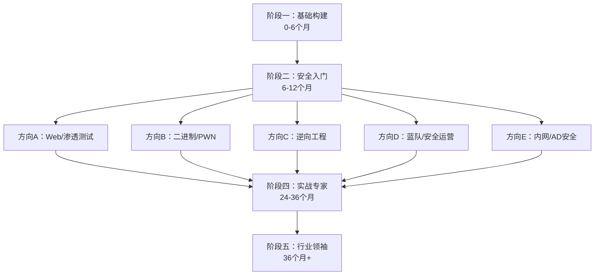
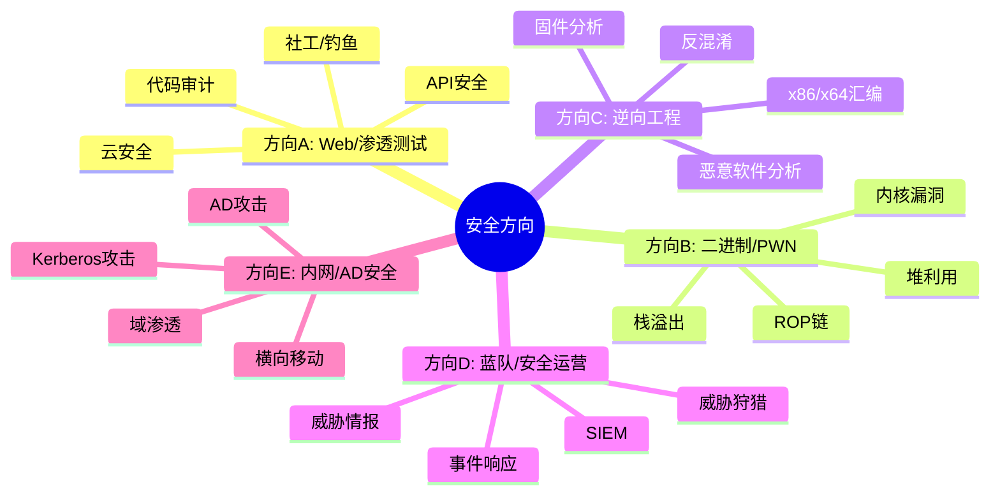
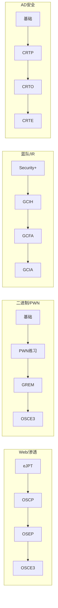

# 附录E 5阶段学习路线图

## 概述

本附录提供一个系统化的5阶段学习路线图，帮助读者从零基础逐步成长为安全领域的行业领袖。每个阶段包含明确的学习目标、核心技能树、推荐资源、里程碑检查点和常见陷阱，确保你能有计划、有节奏地推进学习进程。

> **使用方法：** 先通过阶段一的自测题确定自己当前所处阶段，然后沿路线图推进。每个阶段的里程碑检查点全部完成后，方可进入下一阶段。切勿跳级——安全领域的知识是层层叠加的，基础不牢会导致后续学习事倍功半。

### 学习节奏总览



### 当前阶段自测

在开始之前，回答以下问题以确定你的起点：

| 问题 | 是 → 进入下一题 | 否 → 从阶段一开始 |
|------|-----------------|-------------------|
| 你能流畅使用Linux命令行完成日常操作吗？ | 继续 | 阶段一 |
| 你能用Python编写网络请求和文件操作脚本吗？ | 继续 | 阶段一 |
| 你能解释TCP三次握手和HTTP请求/响应的完整过程吗？ | 继续 | 阶段一 |
| 你能独立利用SQL注入、XSS等Web漏洞吗？ | 继续 | 阶段二 |
| 你能熟练使用Burp Suite和Nmap进行渗透测试吗？ | 继续 | 阶段二 |
| 你在HTB或THM上独立拿下过10+台机器吗？ | 继续 | 阶段三 |
| 你通过了OSCP或同等级别的专业认证吗？ | 继续 | 阶段四 |
| 你在安全会议上发表过演讲或发现了0day吗？ | 阶段五 | 阶段四 |

---

## E.1 阶段一：基础构建（0-6个月）

### E.1.1 学习目标

本阶段的核心任务是建立计算机科学和网络安全的基础知识体系。这些知识是后续所有高级技术的根基——不了解网络协议就无法理解网络攻击，不掌握Linux就无法操作安全工具，不懂编程就无法编写自动化脚本。

- 掌握计算机网络协议栈（TCP/IP模型、HTTP/HTTPS、DNS等）
- 熟练使用Linux操作系统（命令行、文件系统、权限管理、服务管理）
- 学会Python编程（基础语法、网络编程、自动化脚本）
- 理解Web技术栈（前端三件套、后端框架、数据库、API）
- 建立安全思维模式（攻击者视角、威胁建模初步概念）

### E.1.2 核心技能详解

#### 计算机网络

网络是安全的基石。几乎所有安全漏洞都发生在网络通信的某个环节，理解协议的工作原理才能理解攻击为什么有效。

- **OSI七层模型与TCP/IP四层模型**：理解各层的功能、对应的协议和设备，以及数据在各层之间的封装与解封过程
- **IP地址与子网划分**：IPv4地址分类（A/B/C/D/E类）、CIDR记法、子网掩码计算、私有地址段（10.0.0.0/8、172.16.0.0/12、192.168.0.0/16）
- **TCP与UDP协议**：三次握手/四次挥手的完整流程、TCP状态机（ESTABLISHED、TIME_WAIT、CLOSE_WAIT等）、UDP的无连接特性及应用场景
- **HTTP/HTTPS协议**：请求方法（GET/POST/PUT/DELETE等）、状态码含义、请求/响应头的作用、HTTPS的TLS握手过程（证书验证、密钥交换、对称加密）
- **DNS与DHCP**：DNS解析流程（递归/迭代查询）、常见记录类型（A/AAAA/CNAME/MX/TXT）、DHCP的DORA过程
- **Wireshark抓包分析**：捕获过滤器与显示过滤器语法、追踪TCP流、分析HTTP请求、识别异常流量模式
- **网络故障排查**：ping/traceroute/nslookup/dig/netstat/ss等工具的使用场景和输出解读

#### Linux基础

Linux是安全从业者的主战平台。绝大多数安全工具（Kali Linux、Metasploit、Nmap等）都运行在Linux上。

- **文件系统与权限**：目录结构（FHS标准）、文件权限（rwx/数字表示/chown/chmod）、特殊权限位（SUID/SGID/Sticky Bit）、文件类型（普通文件、目录、链接、设备文件）
- **用户与组管理**：useradd/usermod/userdel、groupadd/groups、sudo配置（/etc/sudoers）、密码策略（/etc/shadow）
- **进程管理**：ps/top/htop的使用、前台/后台进程切换（jobs/fg/bg/nohup）、信号（SIGTERM/SIGKILL/SIGHUP）、进程优先级（nice/renice）
- **Shell脚本编程**：变量、条件判断（if/case）、循环（for/while/until）、函数、数组、字符串操作、管道与重定向（|、>、>>、<、2>&1）、常用文本处理工具（grep/awk/sed/cut/sort/uniq）
- **服务管理（systemd）**：systemctl start/stop/enable/disable/status、自定义service文件编写、日志查看（journalctl）
- **网络配置与排查**：ip addr/route/link、iptables/nftables基础、SSH配置与密钥认证、网络配置文件位置
- **日志分析**：/var/log/下各日志文件的作用、syslog/journalctl使用、logrotate配置

#### Python编程

Python是安全领域使用最广泛的编程语言，用于编写渗透脚本、自动化工具、漏洞利用代码和数据分析。

- **基础语法与数据结构**：变量与类型、列表/字典/集合/元组、列表推导式、字符串操作、异常处理（try/except/finally）
- **文件操作**：读写文本文件和二进制文件、CSV/JSON处理、目录遍历（os.walk/glob）
- **网络编程**：socket编程基础（TCP/UDP客户端/服务器）、HTTP请求（requests库：GET/POST/文件上传/会话管理/代理设置）
- **正则表达式**：re模块、匹配/搜索/替换、分组与捕获、常用模式（IP/邮箱/URL/手机号）
- **自动化脚本**：subprocess模块执行系统命令、paramiko（SSH）、scapy（网络包构造与分析）
- **安全相关库**：hashlib（哈希计算）、cryptography（加密操作）、pycryptodome（密码学）

#### Web技术栈

Web安全是安全领域最广泛的入口，理解Web技术栈是从事Web安全的前提。

- **前端基础**：HTML标签与表单、CSS选择器、JavaScript基础（DOM操作、事件处理、AJAX/Fetch）、浏览器同源策略
- **HTTP深入**：请求头/响应头各字段含义、Cookie/Session/Token机制、CORS策略、HTTP/2特性
- **数据库基础**：SQL语法（SELECT/INSERT/UPDATE/DELETE/JOIN/子查询）、MySQL/PostgreSQL/SQLite差异、NoSQL基础（MongoDB）
- **后端框架基础**：至少了解一个主流框架的路由、模板、ORM机制（如Flask/Django或Node.js/Express）
- **Web服务器**：Nginx/Apache配置基础、虚拟主机、反向代理、SSL/TLS配置
- **REST API**：API设计原则、认证方式（Basic/JWT/OAuth）、Postman使用

### E.1.3 推荐资源

| 资源 | 类型 | 说明 | 费用 |
|------|------|------|------|
| 《计算机网络：自顶向下方法》（Kurose/Ross） | 书籍 | 网络入门经典教材，讲解清晰 | 约80元 |
| linuxcommand.org | 网站 | Linux命令行全面教程 | 免费 |
| Python for Everybody（py4e.com） | 课程 | 零基础Python入门，配套练习 | 免费 |
| PortSwigger Web Security Academy | 网站 | Web安全系统教程，含交互式实验 | 免费 |
| TryHackMe Pre-Security路径 | 平台 | 引导式入门，环境已搭建好 | 免费/订阅 |
| 《鸟哥的Linux私房菜》 | 书籍 | Linux入门必读 | 约60元 |
| 《Python编程：从入门到实践》 | 书籍 | Python零基础最佳选择 | 约70元 |
| 本教程第1-12章 | 教材 | 知识体系完整覆盖 | — |

### E.1.4 每月学习计划

| 月份 | 重点方向 | 每周目标 |
|------|---------|---------|
| 第1个月 | Linux基础 | 能独立完成文件管理、用户管理、Shell脚本编写 |
| 第2个月 | 计算机网络 | 能解释TCP/IP模型各层协议，用Wireshark分析HTTP流量 |
| 第3个月 | Python编程 | 能编写网络请求脚本、文件批处理脚本、简单端口扫描器 |
| 第4个月 | Web技术 | 能搭建简单Web应用，理解HTTP请求/响应全流程 |
| 第5个月 | 安全思维 | 完成PortSwigger前10个Lab，建立攻击者视角 |
| 第6个月 | 综合巩固 | 完成TryHackMe Pre-Security路径，准备进入阶段二 |

### E.1.5 里程碑检查点

- [ ] 能用Wireshark捕获并分析HTTP/TCP流量，识别三次握手和数据传输过程
- [ ] 能在Linux上完成日常操作：文件管理、权限配置、服务管理、Shell脚本编写
- [ ] 能用Python编写网络请求脚本、文件批处理脚本和简单网络工具
- [ ] 能完整解释HTTP请求/响应过程（从URL输入到页面渲染）
- [ ] 能使用Nginx搭建简单的Web应用并理解其配置
- [ ] 完成PortSwigger Web Security Academy前10个Lab
- [ ] 完成TryHackMe Pre-Security路径所有模块

### E.1.6 常见陷阱

| 陷阱 | 危害 | 正确做法 |
|------|------|---------|
| 跳过网络直接学工具 | 不理解工具输出含义，遇到变体就懵 | 先花2个月扎实掌握网络基础 |
| 只看视频不动手 | 看似懂了，实际操作时无从下手 | 每学一个知识点立即在终端实操 |
| 忽视Linux基础 | 安全工具运行受阻，排查问题困难 | 把Linux作为日常操作系统使用 |
| Python学到爬虫就停 | 后续渗透脚本、自动化工具都需要更深的编程能力 | 继续学习网络编程、并发编程 |
| 死记硬背知识点 | 考完就忘，无法灵活应用 | 通过CTF和靶场实践巩固理解 |

---

## E.2 阶段二：安全入门（6-12个月）

### E.2.1 学习目标

本阶段从"学习基础"转向"学习攻击"，核心是掌握Web安全漏洞原理与利用方法、渗透测试工具使用、以及基础漏洞利用技术。这是从IT从业者到安全从业者的关键转变期。

- 系统掌握OWASP Top 10中的核心Web漏洞（SQL注入、XSS、CSRF、SSRF等）
- 熟练使用渗透测试工具链（Burp Suite、Nmap、SQLMap、Metasploit等）
- 理解常见攻击技术的原理和利用条件
- 开始CTF（Capture The Flag）竞赛练习
- 了解安全行业全貌和职业发展方向

### E.2.2 核心技能详解

#### Web安全漏洞

Web安全是渗透测试中占比最大的领域，掌握这些漏洞是入门安全的核心标志。

- **SQL注入**：
  - 联合查询注入（UNION SELECT）：适用于页面直接显示查询结果的场景
  - 布尔盲注（Boolean-based Blind）：根据页面返回的True/False判断数据
  - 时间盲注（Time-based Blind）：根据响应延迟判断数据，适用于无回显场景
  - 堆叠注入（Stacked Queries）：利用多语句执行，风险高但限制多
  - 二次注入（Second-Order Injection）：数据先存入数据库，后续操作触发注入
  - SQLMap自动化工具使用与手动绕过WAF技巧

- **跨站脚本攻击（XSS）**：
  - 反射型XSS：恶意脚本通过URL参数注入，受害者点击链接触发
  - 存储型XSS：恶意脚本存入数据库，所有访问用户都会触发
  - DOM型XSS：完全在客户端执行，服务端无感知
  - XSS利用：Cookie窃取、Session劫持、键盘记录、页面篡改
  - CSP（内容安全策略）绕过方法

- **服务端请求伪造（SSRF）**：内网探测、文件读取（file://协议）、远程代码执行（配合gopher/dict协议）、云元数据窃取（169.254.169.254）

- **文件上传漏洞**：绕过前端验证、MIME类型检查、文件头检测、双扩展名、.htaccess/.user.ini利用、图片马（文件包含+图片上传）

- **命令注入（Command Injection）**：管道符、反引号、$()子命令、无回显场景的带外数据获取（DNS外带、HTTP外带）

- **目录遍历与文件包含**：路径穿越（../）、空字节截断（%00）、PHP封装器（php://filter）、日志投毒实现RCE

- **认证与会话管理漏洞**：暴力破解、凭证填充（Credential Stuffing）、会话固定、JWT签名绕过/密钥泄露、OAuth重定向URI操纵

#### 渗透测试工具链

工具是安全从业者的武器库，熟练掌握每个工具的适用场景和高级用法至关重要。

- **Burp Suite**：代理拦截与修改、Repeater手动重放、Intruder自动化爆破/模糊测试、Scanner主动/被动扫描、Decoder编码解码、Comparer差异对比、扩展插件（Autorize用于授权测试、Logger++用于日志记录）
- **Nmap**：TCP SYN扫描（-sS）、UDP扫描（-sU）、服务版本检测（-sV）、操作系统识别（-O）、脚本引擎（NSE：--script）、时序模板（-T0到-T5）、输出格式（-oN/-oX/-oG/-oA）
- **SQLMap**：基本注入检测（-u/--url）、POST数据注入（--data）、Cookie注入（--cookie）、层级选择（--level/--risk）、自定义tamper脚本、数据库枚举与数据提取、OS shell获取
- **Metasploit**：模块搜索（search）、漏洞利用（use exploit/...）、载荷配置（set PAYLOAD）、会话管理（sessions）、后渗透模块（post/）、Meterpreter高级命令
- **目录扫描工具**：Gobuster（-w字典、-t线程、-s状态码过滤）、ffuf（高性能模糊测试、过滤器语法）、DirSearch
- **Hydra**：SSH/FTP/HTTP等多种协议的暴力破解、字典管理与密码策略理解

#### 基础漏洞利用

从"发现漏洞"到"利用漏洞"是质的飞跃，本阶段重点培养实战利用能力。

- **公开EXP的查找与使用**：Exploit-DB搜索、CVE编号查询、GitHub上的PoC收集、EXP的修改与适配
- **弱口令攻击**：密码字典构建策略、常见弱口令模式、社会工程学辅助的密码猜测
- **密码哈希基础**：MD5/SHA1/SHA256区别、加盐哈希原理、彩虹表攻击、John the Ripper/Hashcat基本使用
- **社会工程基础**：钓鱼邮件构造、信息收集（OSINT）、 pretexting手法
- **基础提权**：Linux SUID提权、Windows服务配置提权、内核漏洞提权初步

### E.2.3 推荐资源

| 资源 | 类型 | 说明 | 费用 |
|------|------|------|------|
| 《黑客攻防技术宝典：Web实战篇》（陈小兵） | 书籍 | Web安全经典中文教材 | 约60元 |
| PortSwigger Web Security Academy Labs | 实战 | 100+交互式Web安全实验 | 免费 |
| DVWA（Damn Vulnerable Web Application） | 靶场 | PHP编写的入门级Web漏洞靶场 | 免费 |
| OWASP WebGoat | 靶场 | OWASP官方教学靶场 | 免费 |
| TryHackMe Jr Penetration Tester路径 | 平台 | 系统化渗透测试入门 | 订阅 |
| PicoCTF | CTF平台 | 面向初学者的CTF比赛 | 免费 |
| HackTheBox Starting Point | 平台 | HTB入门引导路径 | 免费/订阅 |
| 《SQL注入攻击与防御》（Justin Clarke） | 书籍 | SQL注入深度讲解 | 约50元 |
| 本教程第13-15章 | 教材 | 安全技术入门体系 | — |

### E.2.4 每月学习计划

| 月份 | 重点方向 | 每周目标 |
|------|---------|---------|
| 第7个月 | SQL注入与XSS | 完成PortSwigger SQL注入全Lab、XSS基础Lab |
| 第8个月 | CSRF/SSRF/文件上传 | 完成DVWA对应模块、PortSwigger相关Lab |
| 第9个月 | 渗透测试工具链 | 熟练使用Burp Suite全流程、Nmap高级扫描 |
| 第10个月 | 命令注入/目录遍历 | HTB Starting Point 5+台、PicoCTF 20+题 |
| 第11个月 | 漏洞利用与提权 | HTB Easy 3-5台、基础EXP使用 |
| 第12个月 | 综合实战 | 独立完成DVWA全难度、PicoCTF累计50+题 |

### E.2.5 里程碑检查点

- [ ] 能独立完成OWASP Top 10中核心漏洞的利用（SQL注入、XSS、CSRF、SSRF、文件上传、命令注入）
- [ ] 能熟练使用Burp Suite完成请求拦截、修改、重放、自动化测试全流程
- [ ] 在PicoCTF中累计完成50+题目
- [ ] 能独立完成DVWA所有难度级别（Low→Impossible）
- [ ] 能用Python编写简单的渗透脚本（端口扫描、目录爆破、自动化漏洞检测）
- [ ] 理解渗透测试的完整流程（信息收集→漏洞发现→漏洞利用→后渗透→报告）
- [ ] 完成TryHackMe Jr Penetration Tester路径

### E.2.6 常见陷阱

| 陷阱 | 危害 | 正确做法 |
|------|------|---------|
| 只用自动化工具不理解原理 | 遇到WAF或变体就束手无策 | 先手动利用，再用工具提效 |
| 贪多学所有方向 | 什么都会一点，什么都不精 | 先打好Web安全基础，后续再选方向 |
| 不写学习笔记 | 知识快速遗忘，无法积累 | 每次实验都写详细笔记和总结 |
| 脱离靶场打真实目标 | 可能触犯法律，道德风险 | 始终在授权环境内练习 |
| 忽视报告撰写能力 | 实战中报告是核心交付物 | 每次渗透练习都写完整报告 |

---

## E.3 阶段三：专业深化（12-24个月）

### E.3.1 学习目标

本阶段是分水岭——从"全能初学者"转变为"某一领域的专家"。选择一个方向深耕，掌握高级攻击/防御技术，通过专业认证验证能力，开始在安全社区建立影响力。

- 选择一个安全细分方向深入研究（Web/渗透、二进制、逆向、蓝队、内网）
- 掌握该方向的高级技术栈
- 通过一个专业级别认证（eJPT/OSCP/CRTP等）
- 开始漏洞赏金（Bug Bounty）之旅
- 搭建Home Lab进行持续练习

### E.3.2 方向选择指南

选择方向时考虑三个因素：**兴趣**（你对哪类问题最着迷）、**市场需求**（该方向的就业/变现前景）、**个人优势**（你的技术背景和学习能力）。以下是五个主要方向：



### E.3.3 各方向详细路线

#### 方向A：Web安全/渗透测试

**适合人群：** 喜欢Web应用、API交互、逻辑漏洞分析的人。市场需求最大，入门相对容易。

**月1-3：高级Web技术**
- 代码审计：PHP危险函数（eval/system/exec/include）、Java反序列化入口（readObject/Reflection）、Python pickle/eval危险模式
- 反序列化漏洞：PHP、Java、Python、.NET各语言的反序列化攻击链
- 模板注入（SSTI）：Jinja2/Twig/Velocity/FreeMarker各引擎的利用方式
- JWT安全：算法混淆攻击（none/HS256→RS256）、密钥爆破、JWT嵌套
- OAuth安全：授权码拦截、重定向URI操纵、Token泄露
- GraphQL安全：内省查询、批量查询DoS、授权绕过

**月4-6：内网渗透基础**
- 信息收集：BloodHound域信息收集、PowerView使用、内网资产发现
- 横向移动：Pass-the-Hash/Pass-the-Ticket、WMI/WinRM、PsExec
- 权限提升：Windows（Token操纵、服务配置、UAC绕过）、Linux（SUID、Capabilities、Cron）
- 隧道代理：SSH隧道（本地/远程/动态）、Chisel、proxychains、DNS隧道

**月7-9：认证备考（OSCP）**
- PWK课程通读并完成所有练习
- 靶机练习：在HTB/THM/VulnHub上独立完成50+台机器
- 实验报告撰写：每台机器写详细报告（信息收集→漏洞发现→利用→提权）
- 考试模拟：24小时4台机器的限时模拟
- 正式考试：24小时攻破4台机器，24小时撰写报告

**月10-12：漏洞赏金**
- 目标选择：Bugcrowd/HackerOne平台、关注VDP（漏洞披露计划）
- 系统化测试：建立个人checklist、自动化辅助测试
- 报告撰写：清晰的漏洞描述、可复现的PoC、影响评估
- 持续学习：关注新漏洞类型、阅读优秀报告

#### 方向B：二进制安全/PWN

**适合人群：** 对底层原理着迷、喜欢与编译器和操作系统博弈的人。技术门槛最高，但稀缺性也最强。

**月1-3：基础构建**
- x86/x64汇编：指令集基础、调用约定（cdecl/System V AMD64）、栈帧结构
- GDB/WinDbg调试：断点、内存查看、栈回溯、数据断点
- 二进制分析：readobj/objdump/str/file命令、ELF/PE文件格式
- 环境搭建：pwntools、ROPgadget、GDB插件（pwndbg/GEF）

**月4-6：核心漏洞利用**
- 栈溢出：覆盖返回地址、ShellCode注入、NX/ASLR/Stack Canary绕过
- 堆利用：ptmalloc机制、use-after-free、double-free、off-by-one、tcache poisoning
- ROP链：ROPgadget使用、ret2libc、GOT覆写、格式化字符串漏洞
- 代码审计：从源码发现二进制漏洞的思路和方法

**月7-9：进阶技术**
- 内核漏洞：内核PWN基础、提权思路、QEMU环境搭建
- 浏览器漏洞：JavaScript引擎漏洞、类型混淆、沙箱逃逸
- 题目练习：在pwnable.kr/pwnable.tw/CTFHub上持续刷题

**月10-12：认证与实战**
- GREM认证备考（如果选择逆向方向）
- CTF比赛参与：团队协作、个人技术提升
- 漏洞研究：尝试分析真实CVE

#### 方向C：逆向工程

**适合人群：** 对软件内部机制着迷、喜欢"拆解"程序的人。与二进制安全有大量交叉。

- **月1-3：** x86/x64汇编、GDB/IDA Pro基础、ELF/PE文件格式、基础反混淆
- **月4-6：** IDA Pro高级功能、动态调试（x64dbg/WinDbg）、控制流分析、数据类型恢复
- **月7-9：** 恶意软件分析（静态+动态）、网络协议逆向、混淆代码还原
- **月10-12：** 固件逆向（路由器/IoT设备）、脱壳技术、加壳/保护机制对抗

#### 方向D：蓝队/安全运营

**适合人群：** 更倾向于防御、监控、事件响应的人。市场需求持续增长。

- **月1-3：** SIEM深度使用（Splunk/ELK）：日志收集、查询语法、仪表板创建、告警规则编写
- **月4-6：** 威胁狩猎：IOC/TTP概念、MITRE ATT&CK框架、假设驱动的狩猎方法、Sigma规则编写
- **月7-9：** 事件响应：IR流程（准备→识别→遏制→根除→恢复→总结）、取证工具（Volatility/Autopsy）、恶意软件初步分析
- **月10-12：** 威胁情报：情报收集（OSINT/TIP）、APT组织分析、情报产品编写、TIP平台使用

#### 方向E：内网/Active Directory安全

**适合人群：** 对企业网络架构和域环境着迷的人。AD环境在企业中极为普遍，专业人才稀缺。

- **月1-3：** AD基础（域/OU/Group Policy/GPO）、PowerShell AD模块、BloodHound使用
- **月4-6：** Kerberos攻击（AS-REP/Kerberoasting/Golden/Silver Ticket）、NTLM Relay、LLMNR/NBT-NS投毒
- **月7-9：** 高级横向移动（DCSync、Delegation攻击、AD CS攻击）、域渗透完整链路
- **月10-12：** CRTP/CRTO认证备考、大规模AD环境渗透模拟

### E.3.4 推荐资源

| 资源 | 类型 | 说明 | 费用 |
|------|------|------|------|
| Hack The Box | 平台 | 渗透测试闯关，300+台机器 | 订阅（约$14/月） |
| TryHackMe Offensive Security路径 | 平台 | 系统化进阶渗透 | 订阅 |
| PentesterLab | 平台 | Web安全进阶，代码审计为主 | 订阅 |
| VulnHub | 靶机 | 离线虚拟机靶场 | 免费 |
| Offensive Security PWK/ PEN-200 | 课程 | OSCP官方课程 | 约$1599 |
| PWNable.kr / PWNable.tw | 平台 | 二进制安全练习 | 免费 |
| TCM Security Practical Ethical Hacking | 课程 | 综合渗透测试课程 | 约$30 |
| 《逆向工程核心原理》 | 书籍 | 逆向工程经典 | 约80元 |
| 本教程第16-25章 | 教材 | 各方向深入内容 | — |

### E.3.5 Home Lab搭建

Home Lab是持续练习的安全环境，建议在本阶段开始搭建：

**硬件需求：**
- 最低配置：8GB RAM、256GB SSD、4核CPU
- 推荐配置：16GB RAM、512GB SSD、8核CPU（可运行多台虚拟机）
- 虚拟化平台：VirtualBox（免费）或VMware Workstation/Pro

**推荐环境：**
- Kali Linux（攻击机）
- Windows 10/11（靶机）
- Windows Server 2019/2022（AD环境靶机）
- DVWA/VulnHub靶机
- 自定义Docker环境

### E.3.6 里程碑检查点

- [ ] 在Hack The Box上独立完成20+台机器（含10+台Easy/Medium）
- [ ] 通过一个专业认证（eJPT/OSCP/CRTP/PNPT等）
- [ ] 在Bugcrowd或HackerOne提交第一个有效（非重复）漏洞
- [ ] 搭建完成Home Lab环境（攻击机+靶机+AD环境）
- [ ] 能独立完成一个完整的渗透测试项目（含报告撰写）
- [ ] 建立技术博客并发布10+篇文章
- [ ] 加入至少一个安全社区或团队（CTF/漏洞赏金/本地BSides）

---

## E.4 阶段四：实战专家（24-36个月）

### E.4.1 学习目标

从"能做事"到"做得好"的跨越。本阶段目标是在选定方向上达到专家水平，能够独立处理复杂安全问题，拥有发现高级漏洞或执行高级渗透的能力，并开始在行业内建立影响力。

- 在选定方向上达到专家水平，能够独立处理复杂场景
- 掌握高级漏洞研究和利用技术（0day挖掘、Fuzzing、漏洞利用开发）
- 考取高级专业认证（OSEP/OSED/CRTE/GXPN等）
- 参与安全社区贡献（CTF比赛、漏洞赏金、开源工具、技术分享）
- 建立个人品牌和行业影响力

### E.4.2 高级技能详解

#### 高级渗透测试

- **高级规避技术（Evasion）**：绕过EDR/AV（用户态hook解除、syscall直接调用、进程注入、文件加壳）、网络层规避（流量加密、协议混淆、DNS over HTTPS外带）
- **自定义工具开发**：用Go/Rust编写高性能安全工具、C2通信协议设计、自定义载荷生成器
- **C2框架**：Cobalt Strike深入使用（Malleable C2配置、Aggressor脚本）、Sliver/Brute Ratel等开源/商业替代、C2基础设施搭建（Redirector/Domain Fronting）
- **供应链攻击分析**：理解SolarWinds等事件的攻击链、npm/PyPI包投毒检测、CI/CD安全审计
- **物理渗透**：物理安全评估方法、锁具绕过、RFID/NFC攻击、无线网络攻击（Evil Twin/WPA攻击）
- **红队行动管理**：目标范围界定、行动计划制定、OPSEC意识、报告与复盘

#### 高级漏洞研究

- **0day挖掘方法论**：攻击面识别、代码审计自动化（Semgrep/CodeQL）、逻辑漏洞挖掘技巧
- **Fuzzing技术**：AFL/AFL++/LibFuzzer使用、覆盖率引导的模糊测试、自定义Fuzzer编写、语料库管理
- **漏洞利用开发**：ASLR/DEP/CFG绕过技术、信息泄露利用、堆喷射（Heap Spraying）、类型混淆利用
- **内核漏洞**：Windows/Linux内核漏洞分析与利用、内核调试（WinDbg/KGDB）、提权原理深入
- **浏览器漏洞**：JavaScript引擎漏洞（V8/SpiderMonkey）、沙箱逃逸、渲染引擎漏洞
- **虚拟机逃逸**：QEMU/VirtualBox/VMware逃逸案例分析、虚拟化安全边界

#### 高级蓝队技术

- **高级威胁狩猎**：行为分析、异常检测模型、数据科学在威胁狩猎中的应用
- **APT组织分析**：MITRE ATT&CK深度映射、APT报告解读、归因方法论
- **恶意软件高级分析**：IDA Pro逆向、动态行为分析（Cuckoo Sandbox）、恶意软件分类与家族追踪
- **威胁情报平台建设**：MISP部署与使用、STIX/TAXII标准、情报驱动的安全运营
- **安全架构设计**：零信任架构、微分段、纵深防御体系设计
- **安全自动化**：SOAR平台使用与开发、自动化响应剧本编写、与SIEM/TIP集成

### E.4.3 推荐认证

| 认证 | 方向 | 难度 | 费用 | 说明 |
|------|------|------|------|------|
| OSEP (PEN-300) | 高级渗透 | ★★★★ | ~$1599 | 高级规避与反检测 |
| OSED (EXP-301) | 漏洞开发 | ★★★★ | ~$1599 | Windows漏洞利用开发 |
| CRTE | AD高级 | ★★★★ | ~$2500 | 高级Active Directory攻击 |
| GPEN | 渗透测试 | ★★★ | ~$8000+ | SANS渗透认证（含培训） |
| GWAPT | Web安全 | ★★★ | ~$8000+ | SANS Web安全认证 |
| GCIH | 事件响应 | ★★★ | ~$8000+ | SANS应急响应认证 |
| GCFA | 取证分析 | ★★★★ | ~$8000+ | SANS高级数字取证 |
| OSCE3 | 综合高级 | ★★★★★ | ~$5599 | OffSec最高级别综合认证 |
| GXPN | 渗透研究 | ★★★★★ | ~$8000+ | SANS渗透研究与漏洞利用 |

### E.4.4 社区参与建议

| 参与方式 | 具体行动 | 收益 |
|----------|---------|------|
| CTF比赛 | 参加DEF CON CTF/PlaidCTF/0CTF等顶级赛事 | 技术提升、人脉拓展 |
| 漏洞赏金 | 在HackerOne/Bugcrowd持续参与 | 实战经验、收入、声誉 |
| 技术博客 | 在个人博客/知乎/公众号发布深度技术文章 | 个人品牌、知识沉淀 |
| 安全会议 | 提交BSides/补天/看雪等会议的演讲提案 | 行业影响力 |
| 开源项目 | 贡献/维护安全工具（GitHub） | 技术影响力、代码能力 |
| 安全社区 | 加入DEF CON Group/本地安全社区 | 人脉、信息、合作机会 |

### E.4.5 里程碑检查点

- [ ] 在CTF比赛中获得区域或全国级别名次
- [ ] 发现并报告一个知名厂商的漏洞（获得CVE编号或致谢）
- [ ] 通过高级认证（OSEP/OSED/CRTE/GXPN/OSCE3之一）
- [ ] 在安全会议上发表技术演讲（BSides/补天/看雪/ISC等）
- [ ] 在技术博客发布10+篇高质量深度技术文章
- [ ] 维护或贡献一个开源安全工具
- [ ] 在Bugcrowd/HackerOne累计获得有效漏洞10+个
- [ ] 与3+位同级别安全从业者建立深度合作关系

---

## E.5 阶段五：行业领袖（36个月+）

### E.5.1 学习目标

从"个人专家"到"行业领袖"的蜕变。本阶段不再仅关注个人技术提升，更关注如何引领团队、推动行业、创造更大的社会价值。

- 引领安全技术创新，推动安全边界拓展
- 培养下一代安全人才，建立专业团队
- 建立或领导安全团队/公司
- 影响行业标准制定和安全政策
- 在细分领域成为公认的权威专家

### E.5.2 发展方向

#### 技术领导路线

- **安全团队负责人**：管理10人以上安全团队、制定团队技术方向、资源规划与预算管理、跨部门协作推动安全建设
- **首席安全官（CISO/CSO）**：企业安全战略制定、合规与风险管理、董事会汇报、安全文化建设
- **安全架构师**：零信任架构设计、云安全架构、DevSecOps流程设计、安全合规体系建设
- **安全研究员**：漏洞挖掘与研究、安全工具/框架开发、学术论文发表、技术标准参与

#### 创业方向

- **安全产品公司**：开发安全产品（EDR/SIEM/漏洞扫描器等）、SaaS安全服务
- **安全咨询公司**：渗透测试服务、安全评估服务、合规咨询
- **安全培训公司**：安全课程开发、企业安全培训、认证培训
- **漏洞赏金全职**：全球顶尖赏金猎人年收入可达$500K+

#### 学术/研究方向

- **高校安全实验室**：安全研究课题、研究生培养
- **独立安全顾问**：为企业提供安全审计和咨询
- **漏洞猎人**：全职漏洞挖掘，与各大厂商合作

### E.5.3 领导力培养

技术专家向领袖转型需要补充以下能力：

- **团队管理**：目标设定（OKR/KPI）、绩效评估、团队文化建设、冲突解决
- **沟通表达**：技术汇报（向非技术管理层）、演讲能力、写作能力（报告/方案/白皮书）
- **战略思维**：安全风险评估、成本效益分析、ROI计算、长期安全规划
- **商业意识**：安全产品市场分析、创业基础（融资/运营/法律）
- **行业影响力**：安全社区贡献、标准制定参与、政策咨询

### E.5.4 里程碑检查点

- [ ] 管理一个5人以上安全团队或领导安全组织
- [ ] 在顶级安全会议（Black Hat/DEF CON/CanSecWest）演讲
- [ ] 开发并维护一个被安全社区广泛使用的工具或框架
- [ ] 出版安全相关书籍或被广泛使用的在线课程
- [ ] 成为某一细分领域的公认权威专家
- [ ] 建立或参与建立一个可持续发展的安全业务
- [ ] 在行业标准制定或政策咨询中发挥实质性作用

---

## E.6 学习方法论与实践

### E.6.1 每日学习计划模板

学习计划需要根据当前阶段和方向灵活调整，以下提供通用模板：

**工作日（2-3小时）：**

| 时间段 | 活动 | 说明 |
|--------|------|------|
| 30分钟 | 安全资讯阅读 | 安全客/FreeBuf/SecurityWeek/推特安全圈 |
| 60分钟 | 理论学习 | 课程/书籍/论文，专注当前阶段的核心技能 |
| 30分钟 | 动手实验 | Lab/靶机/代码练习，将理论转化为肌肉记忆 |
| 30分钟 | CTF/漏洞赏金 | 保持实战手感，积累解题经验 |

**周末（4-6小时）：**

| 时间段 | 活动 | 说明 |
|--------|------|------|
| 2小时 | 深度学习 | 攻克一个技术难点或深入研究一个主题 |
| 2小时 | 实战项目 | Home Lab搭建、漏洞赏金、CTF比赛 |
| 1小时 | 知识整理 | 写博客/笔记、复盘本周学习内容 |
| 1小时 | 社区互动 | 参与论坛讨论、阅读他人博客、建立人脉 |

### E.6.2 高效学习方法

#### 费曼学习法（Feynman Technique）

1. **选择一个概念**：如"SQL注入的盲注原理"
2. **用简单语言解释**：想象向一个不懂安全的朋友解释
3. **发现知识缺口**：哪些部分你解释不清楚？哪些地方你在用术语而非原理？
4. **回去补课**：针对缺口部分深入学习
5. **重新解释并简化**：直到你能用最简单的语言讲清楚

> **实践建议：** 每学习一个重要概念，写一篇博客文章或做一个技术分享。如果你不能用通俗语言写清楚，说明你还没有真正理解。

#### 刻意练习（Deliberate Practice）

- **明确目标**：每次练习有具体目标（如"今天完成SQLMap的时间盲注绕过WAF"），而非模糊的"练习一下"
- **专注弱项**：优先练习你不擅长的领域，而非重复已经会的
- **即时反馈**：利用靶场的反馈机制（得分/flag获取）验证学习效果
- **重复迭代**：对同一个技术反复练习直到熟练（如每种漏洞至少手动利用3次）

#### 项目驱动学习

1. **设定一个实际目标**：如"搭建一个自动化漏洞扫描工具"
2. **在项目中学习**：遇到不会的再去学，学了立刻用
3. **完成并发布**：把成果发布到GitHub
4. **总结复盘**：记录遇到的问题和解决方案

### E.6.3 常见学习陷阱与规避

| 陷阱 | 具体表现 | 危害 | 规避方法 |
|------|---------|------|---------|
| 只学理论不动手 | 看了100篇教程但从没打开终端 | 知识停留在表面，无法应用 | 每学一个知识点立即实操 |
| 贪多嚼不烂 | 同时学5个方向，每个都浅尝辄止 | 一年后什么都没精通 | 一次只专注一个方向 |
| 只看视频不做笔记 | 看了一堆视频但记不住 | 学了等于没学 | 每看一个视频写要点笔记 |
| 不参与社区 | 闭门造车，信息封闭 | 错过行业动态和合作机会 | 至少加入一个活跃社区 |
| 不写博客/不分享 | 从不输出，只输入 | 知识无法沉淀和验证 | 每周写一篇技术笔记 |
| 追求工具数量 | 收藏了100个工具但没几个会用 | 工具泛滥但实战能力弱 | 深度掌握5-10个核心工具 |
| 忽视法律和道德 | 在未授权环境下测试 | 法律风险、职业生涯终结 | 始终在授权范围内操作 |
| 不做职业规划 | 随波逐流，不知道下一步做什么 | 学习效率低、方向迷茫 | 每季度回顾和调整职业规划 |
| 过度依赖AI辅助 | 用AI写EXP但不理解原理 | 遇到变体无法适配 | AI辅助理解，但手动实现核心逻辑 |

### E.6.4 保持学习动力

安全学习是一场马拉松，保持动力至关重要：

- **设定阶段性目标**：将大目标拆解为每月/每周的小目标，每完成一个就奖励自己
- **记录成长轨迹**：维护一个学习日志，记录每天学了什么、解决了什么问题
- **找到学习伙伴**：与志同道合的人组队学习，互相激励和监督
- **参与竞赛**：CTF比赛的紧迫感和成就感是最好的学习动力
- **关注成果**：当你用学到的技术发现了第一个漏洞、拿到了第一个flag，那种成就感会推动你继续前进
- **定期休息**：避免学习倦怠，每周至少有一天完全放松

---

## E.7 职业发展与收入参考

### E.7.1 职业发展时间线

| 阶段 | 职位 | 中国年薪范围 | 核心能力要求 | 关键认证 |
|------|------|-------------|-------------|---------|
| Year 0-1 | 学习者/实习生 | 实习补贴 | 基础知识、Linux、Python | 无/入门级 |
| Year 1-2 | 初级安全工程师 | 8-15万 | Web漏洞利用、工具使用 | eJPT/Security+ |
| Year 2-3 | 中级安全工程师 | 15-30万 | 独立渗透测试、漏洞挖掘 | OSCP/CRTP |
| Year 3-5 | 高级安全工程师 | 30-60万 | 高级渗透、代码审计、0day | OSEP/GXPN |
| Year 5+ | 安全专家/架构师 | 60-150万+ | 技术领导、安全架构、行业影响 | CISSP/OSCE3 |
| 专家级 | CISO/安全合伙人 | 100-300万+ | 战略规划、团队管理、商业思维 | 行业认可 |

> **说明：** 以上薪资范围为参考值，实际收入受城市、公司规模、个人能力、细分方向等因素影响显著。一线城市（北上广深）通常高出20-40%。自由职业（漏洞赏金全职/独立顾问）收入波动大但上限更高。

### E.7.2 不同方向的就业前景

| 方向 | 需求热度 | 入门难度 | 天花板 | 典型雇主 |
|------|---------|---------|--------|---------|
| Web/渗透测试 | ★★★★★ | 中 | 高 | 安全公司、互联网大厂 |
| 二进制/PWN | ★★★ | 高 | 极高 | 安全研究院、漏洞猎人 |
| 逆向工程 | ★★★★ | 高 | 高 | 安全厂商、恶意软件分析 |
| 蓝队/安全运营 | ★★★★★ | 中 | 高 | 企业安全部门、SOC |
| 内网/AD安全 | ★★★★ | 中高 | 高 | 咨询公司、大型企业 |
| 云安全 | ★★★★★ | 中高 | 极高 | 云厂商、科技公司 |
| AI安全 | ★★★★★ | 高 | 极高 | AI公司、研究院 |

---

## E.8 快速参考卡片

### E.8.1 每阶段核心任务总览

| 阶段 | 时长 | 核心任务 | 关键产出 | 建议投入 |
|------|------|----------|----------|---------|
| 阶段一：基础构建 | 0-6月 | 网络+Linux+Python+Web | 能独立配置环境和编写脚本 | 每天2-3小时 |
| 阶段二：安全入门 | 6-12月 | Web安全+工具+漏洞利用 | 50+CTF题目、DVWA全难度 | 每天2-3小时 |
| 阶段三：专业深化 | 12-24月 | 方向选择+高级技术+认证 | 通过一个专业认证 | 每天3-4小时 |
| 阶段四：实战专家 | 24-36月 | 高级技术+社区+影响力 | 0day发现/会议演讲 | 持续投入 |
| 阶段五：行业领袖 | 36月+ | 领导力+创新+行业影响 | 团队/公司/标准制定 | 持续投入 |

### E.8.2 各方向认证路线



### E.8.3 技能树速览

```text
                    ┌─────────────────────┐
                    │    行业领袖 (36月+)    │
                    │  技术领导 / 创业 / 研究  │
                    └──────────┬──────────┘
                               │
                    ┌──────────┴──────────┐
                    │   实战专家 (24-36月)    │
                    │  高级渗透 / 0day / 社区  │
                    └──────────┬──────────┘
                               │
          ┌────────────────────┼────────────────────┐
          │                    │                    │
  ┌───────┴───────┐   ┌───────┴───────┐   ┌───────┴───────┐
  │  Web/渗透测试   │   │  二进制/PWN   │   │  蓝队/安全运营  │
  │  (12-24月)    │   │  (12-24月)   │   │  (12-24月)    │
  └───────┬───────┘   └───────┬───────┘   └───────┬───────┘
          │                    │                    │
          └────────────────────┼────────────────────┘
                               │
                    ┌──────────┴──────────┐
                    │   安全入门 (6-12月)    │
                    │  OWASP Top 10 / 工具   │
                    └──────────┬──────────┘
                               │
                    ┌──────────┴──────────┐
                    │   基础构建 (0-6月)     │
                    │  网络 / Linux / Python │
                    └─────────────────────┘
```

---

## 动手练习

1. **自我评估**：使用本文开头的自测表，确定你当前所处的阶段
2. **制定计划**：根据评估结果，参照对应阶段的月度计划，制定未来3个月的详细学习计划
3. **搭建环境**：按照附录D搭建Home Lab，确保学习环境就绪
4. **开始实践**：选择一个CTF平台（推荐从PicoCTF或TryHackMe开始），每天至少完成1道题
5. **记录进度**：建立学习日志（推荐使用Notion/Obsidian），记录每天的学习内容、心得和待解决的问题
6. **寻找同伴**：在安全社区中找到学习伙伴，定期交流和互相督促
7. **输出倒逼输入**：每周写一篇技术笔记或博客，用输出检验学习质量
