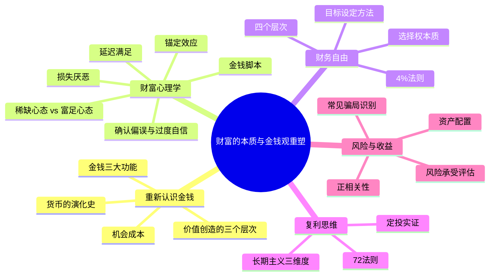
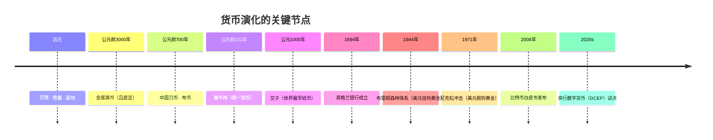
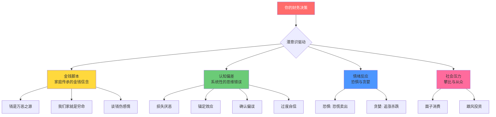
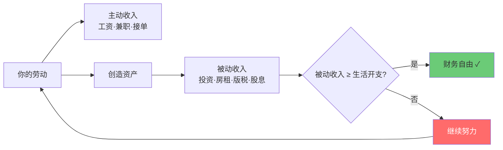
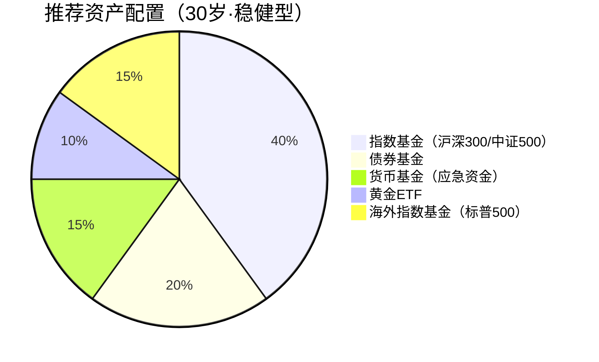

# 第一章：财富的本质与金钱观重塑

> "金钱不是万能的，但没有金钱是万万不能的。" —— 这句老话我们都听过，但真正理解金钱本质的人却少之又少。

在开始搞钱之前，我们必须先解决一个根本问题：**你对金钱的认知，决定了你能拥有多少金钱。** 本章将从财富的本质出发，帮你重塑金钱观，建立正确的财富思维框架。这不是一碗鸡汤，而是一套完整的认知操作系统——你需要先升级底层系统，才能在上面运行"搞钱"这个程序。



---

## 1.1 重新认识金钱

### 1.1.1 货币的演化史：从贝壳到区块链

要理解金钱的本质，我们先要追溯它的起源。货币的演化史就是一部人类协作方式的进化史。



**物物交换时代**：原始社会没有货币，人们以物易物——你用一头羊换我一袋米。这种方式有三个致命缺陷：第一，需要"双重巧合"——你需要米、我需要羊、双方还得觉得比例合适；第二，无法储存——羊会老死，米会发霉；第三，无法分割——一头羊换半袋米怎么办？把羊劈两半？

**商品货币时代**：人们发现某些商品更容易被所有人接受——贝壳（中国商朝）、盐块（古罗马士兵工资"salarium"就是盐的拉丁语，英语salary由此而来）、牲畜。这些商品有共同特征：稀缺、耐储存、可分割、被广泛认可。

**金属货币时代**：黄金、白银因其天然稀缺性、不易氧化、可锻造成标准形状等优势，成为货币的最优选择。中国从秦朝"半两钱"开始统一货币，到汉代"五铢钱"沿用700余年。金属货币的问题是：太重不便携带，且贵金属供给受限于矿产开采。

**纸币时代**：中国北宋的"交子"是世界上最早的纸币，最初是四川商人之间的存款凭证。纸币的本质是**信用**——你相信这张纸能换到东西，它就有价值；所有人都不信了，它就是废纸。1971年尼克松宣布美元与黄金脱钩后，全球进入纯信用货币时代，货币发行不再受实物约束，政府可以通过印钞影响经济——这带来了便利，也带来了通胀的隐患。

**数字货币时代**：2008年中本聪发布比特币白皮书，提出去中心化的电子现金系统。比特币总量2100万枚的设定，本质上是对信用货币"无限超发"的反叛。与此同时，中国的数字人民币（DCEP）由央行发行，是法定数字货币，与比特币的去中心化理念截然不同。

理解货币演化史的意义在于：**货币的形式在变，但本质不变——它是一种社会共识，是价值交换的工具。** 把任何一种货币形式当作"终极形态"都是短视的。

### 1.1.2 金钱的三大功能

货币有三个核心功能，理解它们有助于你看透金钱的本质：

| 功能 | 含义 | 生活实例 | 常见误解 |
|------|------|----------|----------|
| **交换媒介** | 让交易摆脱物物交换的困境 | 用工资买菜、用支付宝付水电费 | 把赚钱本身当目的 |
| **价值尺度** | 为万物提供统一的衡量标准 | 一部手机6000元，一顿饭30元，可以比较 | 用价格等同价值 |
| **价值储存** | 让劳动成果可以跨时间保存 | 存银行、买黄金、投资股票 | 忽视通胀侵蚀购买力 |

**理解了这一点，你就会明白：赚钱的本质不是"抢钱"，而是"创造价值"。** 你为社会创造的价值越大，你能获得的金钱就越多。当然，这里有一个重要的前提——你创造的价值需要被市场看见、被定价。很多人的价值被低估，不是因为他们创造的价值不够，而是他们不懂得如何让价值被看见和定价。这是后面章节会详细讨论的问题。

### 1.1.3 价值创造的三个层次

**案例：外卖骑手 vs 餐厅老板 vs 平台创始人**

| 维度 | 外卖骑手 | 餐厅老板 | 平台创始人 |
|------|----------|----------|------------|
| 月收入 | 0.8-1.2万 | 5-10万（利润） | 数百万-数千万 |
| 收入模式 | 单价 × 单数 | 客流量 × 客单价 × 利润率 | 用户量 × GMV × 抽佣比例 |
| 时间依赖 | 极高（一单赚一单） | 中等（系统自动运转） | 极低（平台自动匹配） |
| 规模上限 | 受体力限制 | 受门店数量限制 | 理论上无限 |
| 价值创造方式 | 线性劳动 | 系统化运营 | 网络效应平台 |

骑手的价值创造是线性的——送一单赚一单，受时间和体力限制。餐厅老板建立了一个系统：雇佣厨师、服务员，建立供应链，打造品牌。这个系统每天自动运转，创造的价值远超个人劳动。平台创始人更进一步，搭建了一个让供需双方自动匹配的网络，每多一个用户，平台的价值就增加一分——这就是**网络效应**。

**思维转变的三个层次**：

**第一层：卖时间**
- 打工、兼职、计件工作
- 收入 = 单价 × 时间
- 天花板明显：一天只有24小时，一年只有365天
- 即使单价很高（比如资深律师每小时收费5000元），收入仍然受制于时间
- **关键限制**：你在卖的是不可再生的资源——时间

**第二层：卖技能/产品**
- 自由职业、课程、软件、书籍、IP
- 收入 = 单价 × 销量
- 可以突破时间限制：一份产品可以卖给无数人
- **关键转变**：一次劳动，多次收益。你录一门课花40小时，但可以卖给1万人
- **案例**：一个设计师做了一套UI素材包，定价99元，累计卖出2万份，收入198万元。而他实际投入的时间是3个月，时薪远超任何打工

**第三层：卖系统/平台**
- 创业、投资、构建生态系统
- 收入 = 系统效率 × 规模
- 可以实现指数级增长
- **关键特征**：即使你不工作，系统也在为你赚钱
- **案例**：一个淘宝店主通过搭建自动化供应链、客服系统、营销系统，实现月利润30万+，每天实际工作时间不到2小时

**行动建议**：
1. 列出你目前的收入来源，判断它属于哪个层次
2. 思考如何从"卖时间"向"卖技能/产品"转型
3. 每天花30分钟学习如何创造可复用的价值
4. 观察你所在行业中，谁在第二层和第三层——研究他们的路径

### 1.1.4 机会成本：你每一次选择的隐藏代价

经济学中有一个极其重要但常被忽视的概念——**机会成本**：你选择做一件事，就意味着放弃了做其他所有事中收益最高的那个。

**生活中的机会成本**：

- 你花2小时刷短视频，机会成本不是"0元"，而是这2小时你本可以用来学习、副业、锻炼带来的收益
- 你把10万元存银行（年化2%），机会成本是这10万元如果投入指数基金（年化8-10%）可能获得的收益
- 你选择在小城市拿5000元/月的稳定工作，机会成本可能是大城市15000元/月的工作经验和人脉

**机会成本的计算方法**：

```text
机会成本 = 放弃的最佳替代选项的收益
```

| 你的选择 | 直接成本 | 机会成本 | 真实总成本 |
|----------|----------|----------|------------|
| 花3000元买一部新手机 | 3000元 | 如果投资，10年后约7800元 | 约10800元（10年维度） |
| 周末花8小时追剧 | 0元 | 如果做副业，可能赚200-500元 | 200-500元 |
| 读一个2年制MBA（学费20万） | 20万+生活费 | 2年的工资收入（约30万） | 约50万+ |

**为什么要理解机会成本？** 因为它帮你做出更理性的决策。当你理解了"不花钱"也有成本（时间的机会成本），你就不会把省钱当作唯一的美德。当你理解了"稳定"的机会成本（可能错过的增长机会），你就不会盲目追求安稳。

> **关键洞察**：穷人思维只看到直接成本（"这个太贵了"），富人思维同时考虑机会成本（"如果我不做这个，我会错过什么？"）。

---

## 1.2 财富心理学：你与金钱的关系

你的金钱观不是你"选择"的，而是被你的成长环境、社会文化和个人经历"塑造"的。理解财富心理学，就是理解那些在你潜意识中操控你财务决策的隐形力量。



### 1.2.1 金钱脚本：你的家庭给你植入了什么信念？

心理学家布莱德·克朗茨（Brad Klontz）提出了"金钱脚本"（Money Scripts）理论：我们在童年时期从父母和家庭环境中习得的关于金钱的潜意识信念，会深刻影响我们成年后的财务行为。

**四种常见的金钱脚本**：

| 脚本类型 | 核心信念 | 典型表现 | 财务后果 |
|----------|----------|----------|----------|
| **金钱逃避** | "钱是肮脏的"、"有钱人都不是好人" | 回避谈钱、不愿理财、觉得自己不配有钱 | 收入再高也存不下钱 |
| **金钱崇拜** | "有钱就有一切"、"钱越多越幸福" | 过度追求金钱、用消费填补空虚 | 赚再多也不满足，容易陷入消费主义 |
| **金钱地位** | "人的价值=拥有多少钱" | 攀比消费、炫耀性消费、用金钱衡量成功 | 为面子花冤枉钱，财务状况外强中干 |
| **金钱警觉** | "必须时刻警惕钱被偷/骗/花光" | 极度节俭、不敢花钱、过度焦虑 | 生活质量极低，错失投资和成长机会 |

**识别你的金钱脚本**：

问自己以下问题，你的第一反应是什么？
1. "谈钱"让你感到舒适还是不适？
2. 你认为"有钱人"是什么样的人？
3. 你花钱时，通常感到快乐还是内疚？
4. 你是否经常担心钱不够用？
5. 你的父母是如何对待钱的？

你的回答会揭示你的金钱脚本。注意，这些信念通常是潜意识的——你可能意识不到它们在影响你。

**如何改写金钱脚本**：
1. **觉察**：意识到你的金钱信念不是"真理"，而是被植入的"脚本"
2. **质疑**：这些信念真的合理吗？它们帮助了你还是限制了你？
3. **替换**：用更健康的信念取代有害的信念
4. **行动**：通过实际行动来强化新的信念（比如开始投资、开始记账）

### 1.2.2 稀缺心态 vs 富足心态

哈佛大学教授塞德希尔·穆来纳森（Sendhil Mullainathan）在《稀缺》一书中指出：**稀缺心态会俘获人的注意力，降低人的认知能力和决策质量**。这不是道德问题，而是认知机制问题——当你的大脑被"缺钱"这个念头占据时，你的认知带宽会被大幅压缩，就像电脑CPU被一个程序占满，其他程序都变卡了。

**稀缺心态的特征**：
- "钱总是不够用的"——即使收入增加，也总觉得不够
- "好机会都被别人抢走了"——被动等待，不主动创造
- "我条件不好，所以赚不到钱"——把现状当作不可改变的宿命
- 总是关注"缺什么"，而不是"有什么"
- **核心问题**：让你做出短视的决策——为了眼前的100元，放弃未来的10000元

**富足心态的特征**：
- "资源是充足的，关键是如何获取"——把注意力放在方法上
- "机会到处都是，关键是有眼光识别"——主动寻找可能性
- "我现在条件不好，但我可以改善"——相信成长和改变
- 关注"可以做什么"，而不是"不能做什么"
- **核心优势**：让你做出长期最优的决策

**案例：两个年轻人的选择**

小李和小张都是月薪5000元的应届毕业生。

小李（稀缺心态）：
- 每月工资一到手就开始焦虑——"又要交房租了"
- 不敢花钱学习，觉得"太贵了"——错过了一个仅需299元的行业认证培训
- 拒绝朋友聚餐，因为"要省钱"——人脉圈子越来越窄
- 把所有余钱存银行活期（年化0.2%），觉得"至少不会亏"
- 三年后：月薪6000元，存款3万，认知和技能几乎没有增长

小张（富足心态）：
- 每月拿出500元投资自己（买书、课程、参加行业活动）
- 适度社交，建立人脉——通过朋友介绍接到第一个副业项目
- 主动寻找副业机会——利用业余时间做了个公众号
- 把余钱投入指数基金定投（年化约8%）
- 三年后：月薪1.2万元，副业月入5000元，存款10万

**差距不在起点，在于认知。** 小李和小张的起点完全一样，但三年后的差距是巨大的。这不是因为小张运气好，而是因为他的"操作系统"不同——富足心态让他做出了不同的选择。

**如何培养富足心态**：

1. **感恩练习**：每天写下3件值得感恩的事。这听起来像鸡汤，但有神经科学依据——感恩练习可以激活大脑的奖赏回路，减少对"缺失"的过度关注
2. **投资自己**：把一部分钱花在提升能力上，这会形成正循环——能力提升→收入增加→有更多钱投资自己
3. **扩大视野**：接触比你优秀的人，看更大的世界。当你见过更大的可能性，你就不会被困在当前的局限中
4. **关注机会**：遇到困难时，问"我能从中学到什么？"而不是"为什么倒霉的总是我？"
5. **设定财务目标**：有明确目标的人，大脑会自动寻找实现目标的路径——这叫"网状激活系统"（RAS）

### 1.2.3 损失厌恶与风险认知偏差

诺贝尔经济学奖得主丹尼尔·卡尼曼（Daniel Kahneman）发现：**人们对损失的痛苦感，是获得同等收益快乐感的2-2.5倍**。这不是意志力问题，而是人类大脑的进化遗产——在原始社会，错过一顿饭可能饿死，所以"避免损失"比"追求收益"的优先级更高。

**损失厌恶在投资中的三大危害**：

| 偏差行为 | 具体表现 | 真实案例 | 正确做法 |
|----------|----------|----------|----------|
| **处置效应** | 过早卖出盈利的股票，过久持有亏损的股票 | 赚了10%赶紧卖，亏了30%死扛不卖 | 设定明确的买卖规则并严格执行 |
| **过度保守** | 只买银行理财，错过股市、基金等更高收益的机会 | 10万元存银行5年，同期沪深300涨了40% | 理解"不投资也有风险"（通胀侵蚀） |
| **追涨杀跌** | 在市场下跌时恐慌卖出，在市场上涨时追高买入 | 2015年6月牛市顶峰入场，2016年初割肉离场 | 制定定投计划，无视短期波动 |

**如何克服损失厌恶**：

1. **重新定义"风险"**：风险不是"会亏钱"，而是"最终结果与预期的偏离程度"。短期波动是正常的，真正的风险是你的购买力在长期内被侵蚀
2. **长期视角**：把投资时间拉长到5-10年。如果你每天看一次账户，你会觉得股市像过山车；如果你每5年看一次，你会发现它几乎一直在涨
3. **分散投资**：不要把所有鸡蛋放在一个篮子里——后面会详细讲资产配置
4. **设定止损**：提前设定止损点（比如亏损15%就卖出），避免情绪化决策
5. **理解"不投资的风险"**：把钱全部存银行，每年被通胀吃掉2-3%的购买力，10年后你的10万元实际只值7.4万元——这才是真正的"亏损"

### 1.2.4 延迟满足与即时满足的博弈

斯坦福大学著名的"棉花糖实验"发现：**能够延迟满足的孩子，长大后在学业、事业、财务等方面都表现更好**。后续研究（2018年Watts等人）虽然指出家庭经济条件也会影响延迟满足能力，但核心结论不变——延迟满足是一种可以训练的技能，而不是天生的性格。

**即时满足的陷阱**：
- 刷信用卡买最新款手机——分期付款让你感觉"不贵"，但总成本高出10-20%
- 每天点外卖，不愿自己做饭——一年下来，外卖比自己做饭多花1-2万元
- 追剧到凌晨，不愿学习——一年365天，每天浪费2小时就是730小时，够学会一门新技能了
- 每月月光，不愿储蓄——10年后你会发现，同龄人已经有了几十万的积蓄和投资收益

**延迟满足的智慧**：
- 先储蓄，再消费——**支付自己优先**（Pay Yourself First）
- 先投资自己，再享受生活——能力是最好的资产
- 先建立被动收入，再提高消费水平——用被动收入来"奖励"自己

**案例：两个家庭的10年财务轨迹**

| 维度 | 家庭A（即时满足） | 家庭B（延迟满足） |
|------|-------------------|-------------------|
| 月收入 | 2万 | 2万 |
| 月消费 | 1.8万 | 1.2万 |
| 月储蓄/投资 | 2000元 | 8000元 |
| 消费习惯 | 最新款iPhone、名牌包、每年出国旅游2次 | 用国产手机、买经典款衣服、每年国内旅游1次 |
| 10年后存款 | 约24万（存银行） | 约120万（含投资收益） |
| 被动收入 | 约400元/月（利息） | 约8000元/月（投资收益） |
| 财务状态 | 仍在为生活奔波 | 开始享受被动收入带来的自由 |

**练习延迟满足的实用方法**：

1. **24小时法则**：想买东西时，等24小时再决定。很多冲动消费会在等待中消退
2. **10-10-10法则**：问自己——这个决定10分钟后我会怎么想？10个月后呢？10年后呢？
3. **替代满足**：用更便宜的方式获得类似的满足感——想喝奶茶？自己泡杯好茶。想买新衣服？整理一下衣柜，重新搭配
4. **可视化目标**：把你的财务目标（比如"2027年存够50万"）放在手机壁纸、电脑桌面、床头
5. **自动化储蓄**：设置工资到账日自动转一笔钱到储蓄/投资账户——不给自己花掉它的机会

### 1.2.5 锚定效应在消费和投资中的影响

锚定效应是指：**人们在做决策时，会过度依赖第一个接收到的信息（"锚"）**。这是心理学家特沃斯基和卡尼曼在1974年通过经典实验证明的——即使"锚"是随机数字，也会影响人们的判断。

**消费中的锚定效应**：
- 商场先标高价（锚），再打折，让你觉得"便宜了"——"原价999，现价299"让你觉得省了700，其实这件东西本来就只值200
- 套餐比单点"划算"——其实你根本吃不完，多花了钱买了不需要的东西
- "买二送一"——你以为赚了，其实你本来只需要一个
- **房地产中介的经典手法**：先带你看一套又贵又差的房子（锚），再带你看目标房子，你会觉得目标房子"太划算了"

**投资中的锚定效应**：
- "这只股票曾经涨到100元，现在才50元，肯定能涨回去"——过去的高点不代表未来的价值
- "去年收益率20%，今年应该也能"——过去业绩不代表未来表现
- "大盘3000点是底部，不会跌破"——没有任何点位是"铁底"
- "我买入的价格是30元，不到30元我不卖"——你的买入成本与这只股票的未来走势毫无关系

**如何避免锚定效应**：

1. **独立思考**：在看别人的报价/推荐之前，先自己评估价值
2. **多角度分析**：从不同角度看同一个问题——基本面、技术面、行业趋势
3. **关注内在价值**：股票的真实价值取决于公司未来的盈利能力，而不是历史价格
4. **设定标准**：提前设定买入/卖出标准（比如PE低于15倍才买），严格执行
5. **忽略沉没成本**：已经花出去的钱不影响未来的决策——"我买入价30元"是沉没成本，不应成为卖出/持有的依据

### 1.2.6 确认偏误与过度自信

除了锚定效应，还有两种认知偏差在财务决策中极其常见：

**确认偏误（Confirmation Bias）**：人们倾向于寻找、解释和记忆支持自己已有信念的信息，忽略相反的证据。

- 你看好某只股票，就只看利好消息，忽略风险警告
- 你决定买房，就只关注"房价还要涨"的文章
- 你加了一个投资群，群里所有人都在喊"抄底"，你就觉得自己判断对了
- **危害**：让你在错误的道路上越走越远，直到撞墙

**过度自信（Overconfidence）**：人们倾向于高估自己的知识、能力和判断准确性。

- "我研究了一周，这只股票肯定会涨"——市场比你聪明
- "我的投资组合比大盘好"——大多数主动投资者跑不赢指数基金
- "我不会犯那种错误"——每个亏大钱的人都这么说过
- **数据**：研究表明，约74%的基金经理长期跑不赢标普500指数

**应对方法**：
1. **主动寻找反对意见**：你看好一个投资？专门去找看空的理由
2. **写投资日记**：记录你每次决策的理由和预期，事后复盘——你会发现自己错得比想象中多
3. **用数据说话**：不要凭感觉投资，用历史数据和概率思维来评估
4. **接受不确定性**：投资中没有100%确定的事，最好的策略是为各种情况做好准备

---

## 1.3 财务自由的定义与标准

### 1.3.1 财务自由不是"有钱"，而是"有选择"

很多人把财务自由理解为"有花不完的钱"。这个定义有问题——多少钱才算"花不完"？月薪5000的人觉得月入5万就自由了，月入5万的人觉得要500万才自由。

**更精确的定义：财务自由 = 被动收入 ≥ 生活开支**

被动收入是指你不需要主动工作就能获得的收入——投资收益、房租收入、版税、股息、系统自动运转的生意收入等。



### 1.3.2 财务自由的四个层次

| 层次 | 月被动收入 | 对应资产（按4%法则） | 生活状态 | 适合人群 |
|------|-----------|---------------------|----------|----------|
| **基础自由** | 3000-5000元 | 90-150万 | 不工作也能活，但比较拮据 | 三四线城市低消费人群 |
| **舒适自由** | 1-2万元 | 300-600万 | 体面生活，需要控制开支 | 大部分中产的目标 |
| **富裕自由** | 5-10万元 | 1500-3000万 | 高品质生活，不用为钱发愁 | 中高产/企业主 |
| **绝对自由** | 无上限 | 5000万以上 | 随心所欲，追求任何梦想 | 高净值人群 |

**注意**：这些数字因城市而异。在北上广深，"舒适自由"的门槛可能要翻倍；在小城市或农村，可能减半。

### 1.3.3 深入理解"4%法则"

4%法则来自1998年威廉·本根（William Bengen）的研究：**如果一个退休者每年从投资组合中取出不超过4%（考虑通胀调整），这个组合在30年内几乎不会耗尽。**

**计算方法**：

```text
财务自由所需资产 = 年生活开支 × 25

例如：年开支12万 × 25 = 300万
```

**4%法则的假设条件**：
1. 投资组合：50%股票 + 50%债券
2. 每年提取金额随通胀调整
3. 回测数据来自美国市场1926-1997年的历史表现
4. 30年的时间跨度

**4%法则的局限性**：

| 局限 | 说明 | 应对方法 |
|------|------|----------|
| 基于美国市场 | 中国市场的历史回报和波动不同 | 根据A股和中国市场调整预期收益率 |
| 30年跨度 | 如果你35岁退休，需要覆盖50年以上 | 将提取率降到3-3.5% |
| 不考虑税费 | 投资收益在中国暂免个人所得税（股票），但其他渠道有税 | 把税费纳入开支计算 |
| 不考虑黑天鹅 | 极端市场（如2008年金融危机）可能导致组合大幅缩水 | 保留1-2年现金缓冲 |
| 固定提取率 | 实际生活开支是弹性的，丰年多花、歉年少花 | 采用"动态提取"策略 |

**更适合中国人的调整方案**：

1. **保守提取率**：用3%替代4%，所需资产 = 年开支 × 33
2. **动态提取**：市场好的年份多提一点（4-5%），市场差的年份少提一点（2-3%）
3. **保留现金缓冲**：保留1-2年生活费在货币基金中，不在熊市被迫卖出
4. **多元收入来源**：不要只靠投资收益，叠加房租、版税等其他被动收入

### 1.3.4 个人财务自由目标的设定方法

**Step 1：计算你的年生活开支**

别凭感觉估，记账3个月，算出真实数字。通常包括：
- 住房（房贷/房租 + 物业 + 维修）
- 饮食（买菜 + 外出就餐 + 零食）
- 交通（油费/公交 + 保养 + 保险）
- 教育（学费 + 培训 + 书籍）
- 医疗（保险 + 日常看病 + 体检）
- 娱乐（旅游 + 社交 + 爱好）
- 其他（人情往来 + 服装 + 日用品）

例如：月开支1万元 × 12 = 年开支12万元

**Step 2：确定你的财务自由数字**

用保守的3%提取率：年开支12万 × 33 = 396万
用标准的4%提取率：年开支12万 × 25 = 300万

**Step 3：设定时间节点**

复利终值公式：

```text
所需资产 = 当前资产 × (1 + 收益率)^年数 + 每年储蓄 × [(1 + 收益率)^年数 - 1] / 收益率
```

假设你目前有50万资产，每年能存10万，年化收益率8%：
- 10年后：约280万
- 15年后：约480万
- 20年后：约770万

**Step 4：制定行动计划**

| 行动方向 | 具体措施 | 预期效果 |
|----------|----------|----------|
| 增加收入 | 主业争取加薪 + 发展副业 | 收入提升20-50% |
| 减少开支 | 砍掉不必要的订阅、减少冲动消费 | 月支出减少1000-3000元 |
| 提高投资收益 | 学习资产配置，从存银行到定投指数基金 | 年化收益从2%提升到8-10% |
| 延长投资时间 | 越早开始越好 | 多5年投资，最终资产可能差50%以上 |

### 1.3.5 财务自由≠不工作，而是拥有选择权

很多人误解财务自由就是"不用工作"。其实，**财务自由的本质是拥有选择权**——你可以选择做什么，也可以选择不做什么。

你可以选择：
- 做自己喜欢的工作，而不是被迫工作
- 不做违背价值观的事情
- 有更多时间陪伴家人
- 追求自己的兴趣爱好
- 帮助他人，回馈社会
- 承担更大的风险去追求更大的事业

**案例**：李笑来在《财富自由之路》中写道："财务自由不是终点，而是新的起点。当你不需要为钱工作时，你可以把时间花在真正重要的事情上。"很多实现财务自由的人并没有停止工作——他们只是不再为钱工作，而是为热爱、为使命、为好奇心工作。

---

## 1.4 复利思维与长期主义

### 1.4.1 复利的力量

爱因斯坦曾说："复利是世界第八大奇迹。"虽然这句名言的真实性存疑，但复利的威力是真实的。

**复利公式**：

```text
FV = PV × (1 + r)^n

其中：
FV = 终值（Future Value）
PV = 现值（Present Value）
r = 年化收益率
n = 年数
```

**复利的三个要素**：

| 要素 | 含义 | 你能做的 |
|------|------|----------|
| **本金** | 你的起点 | 增加收入、减少支出，积累更多本金 |
| **收益率** | 你的增长速度 | 学习投资知识，提高投资能力 |
| **时间** | 你的坚持 | 尽早开始，不要等待"完美时机" |

**72法则**：资产翻倍所需年数 ≈ 72 ÷ 年化收益率

| 年化收益率 | 翻倍所需年数 | 对应投资方式 |
|-----------|-------------|-------------|
| 2% | 36年 | 银行定期存款 |
| 3% | 24年 | 国债/货币基金 |
| 5% | 14.4年 | 债券基金 |
| 8% | 9年 | 指数基金定投 |
| 10% | 7.2年 | 优质股票/混合基金 |
| 12% | 6年 | 优秀主动管理基金 |
| 15% | 4.8年 | 顶级投资者长期业绩 |

**案例：每月定投3000元，30年后的财富增长**

假设年化收益率8%：
- 每月定投3000元
- 30年后总投入：3000 × 12 × 30 = 108万
- 30年后总资产：约450万
- 其中复利收益：约342万

**你的本金只有108万，但复利帮你赚了342万，是本金的3倍多！** 更惊人的是，如果你从25岁开始定投到55岁，你55岁时已经有了450万——而这只是每月3000元的结果。

**复利的反面——债务的复利效应**：

复利不仅在投资中起作用，在负债中也同样有效（只不过是负面的）：
- 信用卡分期年化利率约12-18%
- 网贷年化利率可达24-36%
- 如果你欠10万元信用卡债务（年化18%），不还款，5年后会变成约22.9万

**关键洞察**：复利是你的朋友（在投资中），也是你的敌人（在负债中）。先还清高息债务，再开始投资——因为消灭18%的债务，等同于获得18%的无风险收益。

### 1.4.2 长期主义的三个维度

**维度一：时间**
- 不要追求短期暴利——每年稳定8-10%，30年就是巨富
- 接受市场波动——短期波动是长期收益的"入场费"
- 坚持长期投资——巴菲特持有可口可乐超过35年

**维度二：认知**
- 持续学习，提升认知——你赚不到认知以外的钱，即使凭运气赚到了，也会凭实力亏回去
- 认知决定你能看到的机会——不懂股票的人看到的是"赌场"，懂的人看到的是"优质企业的一部分所有权"
- 认知决定你能承受的波动——理解市场周期的人不会在熊市恐慌

**维度三：行动**
- 知道不等于做到——你知道应该定投，但你做了吗？
- 行动比完美更重要——不要等到"完全准备好"才开始
- 坚持比聪明更重要——一个智商普通但坚持定投30年的人，比一个聪明但频繁交易的人赚得多

**案例：巴菲特的财富积累**

沃伦·巴菲特99%的财富是在50岁之后赚到的。他从11岁开始投资，坚持了70多年。

| 年龄 | 净资产 | 关键事件 |
|------|--------|----------|
| 11岁 | 120美元 | 买入第一只股票 |
| 30岁 | 100万美元 | 合伙基金年化收益29.5% |
| 50岁 | 3亿美元 | 收购伯克希尔·哈撒韦 |
| 70岁 | 360亿美元 | 互联网泡沫期间坚守价值投资 |
| 90岁 | 1000亿美元 | 捐出99%的财富给慈善 |

如果巴菲特30岁就退休，他只是一个百万富翁。复利的真正威力需要时间来展现。

### 1.4.3 如何实践长期主义

1. **设定长期目标**：10年、20年、30年的财务目标。把它们写下来，贴在你每天能看到的地方
2. **建立系统**：自动储蓄（工资日自动转账）、自动投资（定投计划）、自动学习（每天阅读30分钟）
3. **保持耐心**：不要被短期波动影响。市场跌20%不是世界末日，而是打折买入的好时机
4. **定期复盘**：每季度复盘一次财务状况，每年调整一次投资策略
5. **持续学习**：不断提升认知和技能。推荐每天花30分钟阅读财经和投资类书籍

---

## 1.5 风险与收益的辩证关系

### 1.5.1 风险与收益的正相关性

在投资领域，有一条铁律：**高收益必然伴随高风险**。这不是建议，而是现实。如果有人告诉你"高收益、低风险"，要么他不懂，要么他在骗你。

| 投资品种 | 预期年化收益 | 风险等级 | 最大回撤（历史） | 适合持有期 |
|---------|-------------|---------|-----------------|-----------|
| 银行存款 | 1-2% | 极低 | 无（保本） | 随时 |
| 国债 | 2-3% | 低 | 极小 | 1-10年 |
| 货币基金 | 1.5-2.5% | 低 | 极小 | 随时 |
| 债券基金 | 4-6% | 中低 | -5%~-10% | 1-3年 |
| 混合基金 | 6-10% | 中 | -15%~-25% | 3-5年 |
| 股票基金 | 8-15% | 中高 | -30%~-50% | 5年以上 |
| 个股 | -100%~∞ | 高 | 可能归零 | 不确定 |
| 期货期权 | -∞~∞ | 极高 | 可能穿仓 | 短期 |

**"高收益低风险"的三大骗局**：

| 骗局类型 | 承诺收益 | 实际本质 | 识别方法 |
|----------|----------|----------|----------|
| P2P理财 | 年化15-24% | 庞氏骗局或高风险借贷 | 2018-2020年大面积暴雷，几乎全部归零 |
| 资金盘 | 月收益10-20% | 庞氏骗局（用后来者的钱付先来者） | 年化超过12%就要警惕 |
| 虚拟币传销 | 翻倍/百倍 | 传销包装成区块链 | 拉人头返佣、白皮书造假、团队匿名 |

**记住**：如果一个投资机会听起来好得不像真的，那它很可能就不是真的。

### 1.5.2 风险承受能力评估

在投资之前，你需要了解自己的风险承受能力。这不是"胆量"测试，而是"承受能力"评估——你能承受多大的亏损而不影响生活和心理健康？

**影响风险承受能力的因素**：

| 因素 | 高承受能力 | 低承受能力 |
|------|-----------|-----------|
| **年龄** | 20-40岁，有时间恢复 | 55岁以上，接近退休 |
| **收入稳定性** | 公务员、大企业员工 | 自由职业、收入波动大 |
| **家庭负担** | 未婚/无子女 | 有房贷、有多个子女要抚养 |
| **投资经验** | 经历过牛熊周期 | 刚入场的新人 |
| **心理素质** | 能承受30%+的浮亏 | 亏10%就失眠 |
| **应急储备** | 有6个月以上的生活费储备 | 没有应急资金 |

**风险承受能力自测**：

> 如果你的投资组合下跌20%（比如50万变成40万），你会怎么做？
>
> A. 恐慌卖出，再也不碰投资了（保守型）
> B. 感到不安但继续持有，等它涨回来（稳健型）
> C. 认为是加仓机会，趁便宜再买一些（积极型）
> D. 把更多钱投进去，抄底！（激进型）

**重要提醒**：你的风险承受能力不是固定的。随着年龄增长、家庭责任增加、投资经验积累，你的风险承受能力会变化。定期重新评估。

### 1.5.3 资产配置：不要把所有鸡蛋放在一个篮子里

分散投资是投资界最经典的忠告，但"分散"不是随便买几只不同的股票就完了——你需要在不同维度上分散。

**分散投资的四个维度**：

1. **资产类别分散**：股票、债券、现金、房产、黄金——不同资产在不同经济环境下表现不同
2. **地域分散**：A股、港股、美股、新兴市场——避免单一市场的系统性风险
3. **行业分散**：科技、消费、医疗、金融——避免单一行业的政策风险
4. **时间分散**：定投，不要一次性买入——避免在市场高点一次性投入全部资金

**案例：30岁上班族的资产配置方案**



| 资产类别 | 配比 | 用途 | 推荐标的 |
|----------|------|------|----------|
| 指数基金 | 40% | 长期增值主力 | 沪深300ETF、中证500ETF |
| 债券基金 | 20% | 稳定收益+降低波动 | 纯债基金、二级债基 |
| 货币基金 | 15% | 应急资金（3-6个月生活费） | 余额宝、零钱通 |
| 黄金ETF | 10% | 对冲通胀和黑天鹅 | 华安黄金ETF |
| 海外指数 | 15% | 地域分散 | 标普500ETF联接、纳斯达克100 |

**不同年龄段的资产配置调整**：

| 年龄段 | 股票类 | 债券类 | 现金类 | 原因 |
|--------|--------|--------|--------|------|
| 20-30岁 | 70-80% | 10-20% | 10% | 时间长，可以承受更大波动 |
| 30-40岁 | 60-70% | 20-30% | 10% | 家庭责任增加，适当降低风险 |
| 40-50岁 | 40-50% | 30-40% | 10-20% | 接近退休，保本为主 |
| 50岁以上 | 20-30% | 40-50% | 20-30% | 以稳定现金流为主 |

**行动建议**：
1. 评估自己的风险承受能力
2. 根据年龄和风险偏好，制定资产配置方案
3. 选择低费率的指数基金（管理费低于0.5%）
4. 每年再平衡一次（把偏离目标配比超过5%的部分调回来）
5. 不要因为短期波动而改变长期策略

### 1.5.4 中国语境下的特殊考虑

在中国，有几个特殊的财务因素需要纳入考量：

**房产**：在中国家庭资产中，房产占比高达60-70%（远高于美国的25-30%）。这意味着：
- 你的资产配置可能已经过度集中在房产上
- 房贷是一笔巨大的长期负债，需要纳入财务自由的计算
- 房产流动性差，变现需要时间
- 2020年后"房住不炒"政策下，房产的投资属性在下降

**社保与养老金**：中国的社保体系包括养老、医疗、失业、工伤、生育五险。其中：
- 养老保险：退休后可以领取养老金，但替代率（退休金/退休前工资）只有40-50%
- 医疗保险：覆盖基本医疗，但大病仍需商业保险补充
- 公积金：可以用于购房或租房，是一种"强制储蓄"

**通胀**：中国的CPI（消费者物价指数）官方数据在2-3%，但实际感受往往更高（尤其是教育、医疗、住房）。用CPI来计算通胀可能低估了真实的生活成本上升。

**税收**：中国目前对股票投资收益暂免个人所得税，但对以下收入征税：
- 工资薪金：3-45%累进税率
- 稿酬、劳务报酬：20-40%
- 利息、股息、红利：20%
- 房产交易：增值税、个税、契税等

---

## 本章总结

### 核心要点

1. **金钱的本质**：价值交换的媒介。赚钱的本质是创造价值，而不是"抢钱"
2. **价值创造的三个层次**：卖时间→卖技能/产品→卖系统。层次越高，收入上限越高
3. **机会成本**：每个选择都有隐藏代价。穷人只看直接成本，富人同时考虑机会成本
4. **财富心理学**：金钱脚本、稀缺心态、损失厌恶、锚定效应、确认偏误——这些潜意识力量在操控你的财务决策，必须识别并克服
5. **财务自由**：被动收入≥生活开支，本质是拥有选择权。4%法则需要根据中国语境调整
6. **复利思维**：时间+收益率+坚持=财富自由。复利在投资中是朋友，在负债中是敌人
7. **风险与收益**：高收益必然伴随高风险，分散投资是关键。警惕"高收益低风险"骗局

### 行动清单

- [ ] 计算你的财务自由数字（年开支 × 25 或 × 33）
- [ ] 评估你的风险承受能力（参考1.5.2的自测）
- [ ] 列出你目前的收入来源，判断属于哪个层次（卖时间/卖技能/卖系统）
- [ ] 识别你的金钱脚本（参考1.2.1）
- [ ] 制定一个简单的资产配置方案（参考1.5.3）
- [ ] 开始记账3个月，了解你的真实消费习惯
- [ ] 设定一个1年、3年、5年的财务目标
- [ ] 设置工资日自动转储蓄/投资

### 推荐资源

**书籍**：
| 书名 | 作者 | 推荐理由 |
|------|------|----------|
| 《富爸爸穷爸爸》 | 罗伯特·清崎 | 资产vs负债的经典思维框架 |
| 《穷查理宝典》 | 查理·芒格 | 多元思维模型，投资哲学 |
| 《金钱心理学》 | 摩根·豪塞尔 | 财富心理学的现代经典 |
| 《稀缺》 | 塞德希尔·穆来纳森 | 理解稀缺心态如何影响决策 |
| 《思考，快与慢》 | 丹尼尔·卡尼曼 | 认知偏差的奠基之作 |
| 《漫步华尔街》 | 伯顿·马尔基尔 | 投资入门必读 |
| 《指数基金投资指南》 | 银行螺丝钉 | 中国市场的定投实操 |

**课程**：
- Coursera - Financial Markets（耶鲁大学，免费，罗伯特·席勒主讲）
- 得到App - 《香帅的北大金融学课》
- B站 - 搜索"资产配置入门"、"指数基金定投"

**工具**：
- 记账App：随手记、Money Pro、钱迹（国产简洁）
- 基金平台：天天基金、蚂蚁财富、蛋卷基金
- 投资社区：雪球（看别人的投资逻辑，但不要抄作业）

---

> **下一章预告**：我们将深入探讨财富增长的底层逻辑，了解收入的三种类型、资产与负债的重新定义、财富增长的四个阶段，以及如何升级你的个人商业模式。
