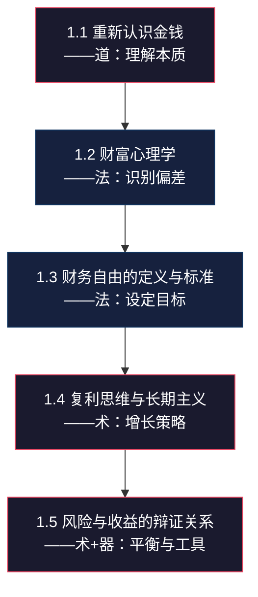

# 第一章：财富的本质与金钱观重塑

## 章节概览

> "金钱不是万能的，但没有金钱是万万不能的。" —— 这句老话我们都听过，但真正理解金钱本质的人却少之又少。

在开始搞钱之前，我们必须先解决一个根本问题：**你对金钱的认知，决定了你能拥有多少金钱。** 本章将从财富的本质出发，帮你重塑金钱观，建立正确的财富思维框架。

这不仅仅是一篇"心灵鸡汤"——本章的每一个概念都会在后续章节中反复出现，成为你分析投资机会、评估商业模式、制定财务策略的底层操作系统。就像盖房子需要地基一样，金钱观就是你整个财富大厦的地基。地基不牢，地动山摇。

---

## 为什么这一章排在最前面

很多人急于学习"怎么赚钱"，跳过认知层面直接进入实操。这就像一个不会游泳的人直接跳进深水区——技术动作再标准也没用，因为你连浮起来的基本原理都不理解。

**认知决定行动，行动决定结果。** 同样一只股票涨了10%，有人急着卖出"落袋为安"，有人坚定持有等待更大收益，还有人加仓追涨。三种截然不同的行动，根源在于三种完全不同的金钱认知。

本章要解决的，正是这个"根目录"级别的问题。

---

## 本章核心问题

本章围绕五个核心问题展开，每个问题都是财富认知体系的一根支柱：

| # | 核心问题 | 为什么重要 | 本章会给你什么 |
|---|---------|-----------|--------------|
| 1 | 金钱的本质是什么？ | 理解金钱的本质才能正确地赚钱，而不是被金钱奴役 | 从经济学、社会学、心理学三个角度解析金钱，建立完整的金钱认知模型 |
| 2 | 你的金钱观从何而来？ | 你80%的财务决策由潜意识中的金钱观驱动，不识别它就无法改变它 | 一套自我诊断工具，帮你识别和重塑限制性金钱信念 |
| 3 | 什么是财务自由？ | 没有清晰定义的目标，你永远不知道自己走到了哪里 | 四个层次的财务自由框架+可量化的个人目标计算公式 |
| 4 | 复利的力量有多大？ | 复利是普通人实现财富跃迁的最可靠路径，但99%的人低估了它 | 复利的数学原理+实际案例+如何从今天开始利用复利 |
| 5 | 风险与收益的关系是什么？ | 不理解风险的人要么错过机会，要么一夜回到解放前 | 风险评估框架+资产配置入门+风险管理的实操方法 |

---

## 本章结构

本章遵循**道→法→术→器**的递进逻辑，从最底层的"道"（金钱的本质和原理）开始，逐步推进到"法"（思维方式和框架）、"术"（具体方法和策略）、"器"（工具和计算模型）。

### 1.1 重新认识金钱（道：理解本质）

> **一句话总结：** 金钱不是"东西"，而是一种社会契约和价值度量衡。

这一节会彻底颠覆你对金钱的直觉认知。大多数人把钱当成"东西"——一种可以拥有、可以花掉、可以存起来的实体。但金钱的本质远比这复杂：

- **经济学视角：** 金钱是交易媒介、价值尺度、价值储藏手段和延期支付标准。这四个功能缺一不可，理解它们能帮你判断"什么算钱"——从贝壳到比特币，本质都在执行这四个功能。
- **社会学视角：** 金钱是一种信任协议。一张100元人民币的制造成本不到1元，它之所以值100元，是因为14亿人共同相信它值100元。这种信任一旦崩塌（如恶性通胀），钱就变成了废纸。
- **心理学视角：** 金钱在大脑中激活的区域和毒品类似——它是多巴胺的触发器。理解这一点，你才能解释为什么"剁手"会上瘾，为什么赌博会让人倾家荡产。
- **思维跃迁：** 从"怎么赚钱"到"怎么创造价值"——这不是心灵鸡汤，而是一个极其务实的策略转变。当你把注意力从"收入"转移到"价值创造"时，你的收入天花板会被彻底打开。

**本节你将获得：**
- 金钱的四维认知模型
- 货币演变的完整时间线（从物物交换到数字货币）
- "赚钱"与"创造价值"的根本区别及实操案例
- 金钱时间价值的计算方法

### 1.2 财富心理学（法：识别偏差）

> **一句话总结：** 你以为你在理性决策，其实你在被大脑的"出厂设置"操控。

行为经济学的大量研究证明，人类在财务决策中充满系统性偏差。这些偏差不是"不聪明"导致的，而是进化留给我们的"认知遗产"——在原始社会很有用，在现代社会却会让我们亏钱。

本节会深入分析四大核心心理偏差：

- **稀缺心态 vs 富足心态：** 稀缺心态让人只关注眼前、忽略长远规划。哈佛大学Sendhil Mullainathan的研究表明，稀缺心态会降低人的认知能力——相当于智商下降13-14个点。你将学习如何从稀缺心态切换到富足心态。
- **损失厌恶：** Daniel Kahneman的前景理论揭示，损失带来的痛苦是同等收益快乐感的2-2.5倍。这意味着什么？意味着你会死守亏损的股票不愿意割肉，却急于卖掉盈利的股票"落袋为安"——这是最典型的亏钱操作。
- **延迟满足：** 著名的"棉花糖实验"跟踪了参与者40年，发现能延迟满足的孩子在成年后的收入、健康、人际关系全面优于即时满足的孩子。但延迟满足不是"忍耐"，而是一种可以训练的能力。
- **锚定效应：** 商场里"原价999，现价199"为什么有效？因为你被"999"这个锚定住了。在投资中，锚定效应会让你过度依赖某个历史价格做决策，忽略资产的真实价值。

**本节你将获得：**
- 12种常见财务心理偏差的识别清单
- 每种偏差的科学解释和真实案例
- 针对每种偏差的"反偏差"实操策略
- 个人财务决策日志模板（帮你记录和反思自己的决策过程）

### 1.3 财务自由的定义与标准（法：设定目标）

> **一句话总结：** 财务自由不是"有很多钱"，而是"你的被动收入≥你的生活开支"。

"财务自由"这个词被用烂了，但大多数人对它的理解是模糊的。本节会给你一个精确的、可量化的定义，并帮你计算出你自己的"财务自由数字"。

核心内容包括：

- **财务自由的四个层次：**
  - 第一层：基本生存保障（被动收入覆盖基本生活开支）
  - 第二层：生活品质保障（被动收入覆盖当前生活水平的开支）
  - 第三层：生活选择权（被动收入远超开支，可以自由选择工作和生活方式）
  - 第四层：财富影响力（财富足以产生社会影响力，实现更高层次的自我价值）

- **4%法则及其局限：** 来自Trinity Study的经典结论——如果你每年从投资组合中取出不超过4%，你的钱大概率可以"永远"花不完。但这个法则在中国是否适用？有哪些前提条件？有哪些风险？本节会详细分析。

- **个人财务自由目标计算：** 你需要多少钱才够？这取决于你的月开支、预期通胀率、预期投资收益率和预期寿命。本节会给你一个完整的计算公式和Excel模板。

**本节你将获得：**
- 四层财务自由的详细定义和判断标准
- 4%法则的完整推导和适用条件分析
- 个人财务自由数字计算器（含通胀调整和敏感性分析）
- 不同收入水平的财务自由路径对比

### 1.4 复利思维与长期主义（术：增长策略）

> **一句话总结：** 复利是世界第八大奇迹，但前提是你给它足够的时间。

爱因斯坦是否真的说过"复利是世界第八大奇迹"还有争议，但复利的力量是数学上无可争议的事实。本节会用大量数据和案例，让你真正"感受到"复利的威力——而不仅仅是"知道"它。

核心内容包括：

- **复利的数学原理：** A = P(1 + r)^n 这个公式你可能见过，但你知道当r从7%变成10%时，30年后的结果差多少吗？你知道当n从20年变成30年时，结果又差多少吗？本节会用直观的图表和计算，让你对这些数字建立"直觉"。
- **72法则：** 一个心算复利的实用工具——用72除以年收益率，就能得到资金翻倍所需的大致年数。年化8%的投资，9年翻倍；年化12%的投资，6年翻倍。
- **长期主义的三个维度：** 不只是投资上的长期主义，还包括能力积累的长期主义（复利式学习）和人际关系的长期主义（信任的复利效应）。
- **复利的"敌人"：** 通胀（每年侵蚀你2-5%的购买力）、交易成本（频繁交易的手续费和税费）、情绪决策（在低点卖出、高点买入）。
- **起步时间的差距：** 25岁开始每月投2000元 vs 35岁开始每月投2000元，到60岁时差距有多大？本节会给你一个震撼的对比案例。

**本节你将获得：**
- 复利计算器（含可视化图表）
- 72法则的完整应用场景
- "早开始10年"的对比案例（含具体数字）
- 长期主义在投资、学习、社交三个领域的应用方法

### 1.5 风险与收益的辩证关系（术+器：平衡与工具）

> **一句话总结：** 风险不是"危险"，而是"不确定性"；管理风险的目的是让不确定性为你服务。

很多人一听到"风险"就想到"亏钱"，这是一个根本性的误解。在金融学中，风险指的是"收益的不确定性"——它既包括亏钱的可能性，也包括少赚的可能性。

核心内容包括：

- **风险与收益的正相关性：** 这是金融学最基本的原理之一——更高的预期收益通常伴随着更高的风险。但"正相关"不等于"线性关系"，也不是说"承担高风险就一定有高收益"。
- **风险的分类：**
  - 系统性风险（市场风险）：不能通过分散化消除的风险，如金融危机、政策变化
  - 非系统性风险（个股风险）：可以通过分散化消除的风险，如单个公司的经营风险
  - 流动性风险：资产无法快速变现的风险
  - 通胀风险：购买力被侵蚀的风险
  - 行为风险：自己做出错误决策的风险（这是最被低估的风险类型）
- **风险承受能力评估：** 你的风险承受能力取决于三个因素——年龄（年轻可以承受更多波动）、收入稳定性（稳定收入可以承受更多投资风险）、心理承受力（有些人天生更能承受波动）。本节会给你一个完整的风险承受能力评估问卷。
- **资产配置入门：** 现代投资组合理论（MPT）的核心思想——不是选择"最好的资产"，而是选择"最好的资产组合"。本节会介绍经典的资产配置模型（如60/40股债组合、全天候策略），并分析它们的适用场景。

**本节你将获得：**
- 五类风险的详细解释和应对策略
- 风险承受能力评估问卷（30题，含评分标准）
- 三种经典资产配置模型的对比分析
- 个人资产配置方案设计指南

---

## 学习目标

完成本章学习后，你应该能够：

1. **理解金钱的本质** —— 从经济学、社会学、心理学三个维度建立完整的金钱认知模型，不再被"钱就是一切"或"钱不重要"的极端观点左右
2. **识别并克服心理偏差** —— 能够在做出财务决策前，快速检查自己是否正在被损失厌恶、锚定效应等偏差影响，并采取纠偏措施
3. **计算你的财务自由数字** —— 用本章提供的公式和工具，精确计算出你需要多少钱才能实现财务自由，以及需要多长时间
4. **理解并运用复利效应** —— 不仅理解复利的数学原理，更能在日常生活中实践复利思维——在投资、学习、社交三个领域同时发力
5. **评估风险承受能力** —— 完成风险评估问卷，了解自己的风险偏好，并根据评估结果制定初步的资产配置方案

---

## 关键概念速查表

| 概念 | 定义 | 核心要点 | 详见 |
|------|------|---------|------|
| 金钱观 | 个人对金钱的认知、态度和价值观 | 80%的财务决策由潜意识金钱观驱动 | 1.1, 1.2 |
| 财务自由 | 被动收入能够覆盖生活开支的状态 | 分四个层次，每个人的"数字"不同 | 1.3 |
| 复利效应 | 利息产生利息，实现指数级增长 | 时间是最大的杠杆，起步越早优势越大 | 1.4 |
| 72法则 | 用72除以收益率得到翻倍年数 | 心算复利的实用工具 | 1.4 |
| 损失厌恶 | 对损失的痛苦感大于获得的快乐感 | 痛苦/快乐比约2-2.5倍 | 1.2 |
| 锚定效应 | 决策过度依赖第一个接收到的信息 | 在消费和投资中都有强大影响 | 1.2 |
| 延迟满足 | 为了更大的未来收益，放弃眼前的享受 | 可以通过训练提升的能力 | 1.2 |
| 稀缺心态 | 资源不足时产生的短视思维模式 | 会降低认知能力，影响判断 | 1.2 |
| 资产配置 | 将资金分配到不同资产类别的策略 | 目标是最大化风险调整后收益 | 1.5 |
| 系统性风险 | 不能通过分散化消除的市场风险 | 所有投资者都要面对的风险 | 1.5 |
| 4%法则 | 每年取出投资组合的4%可永续使用 | 有前提条件，中国适用性需调整 | 1.3 |

---

## 预计学习时间

| 学习方式 | 时长 | 适合人群 |
|---------|------|---------|
| 快速通读 | 60-90分钟 | 有一定基础，想快速了解框架 |
| 精读+笔记 | 2-3小时 | 想深入理解每个概念 |
| 精读+练习+计算 | 3-4小时 | 想完成所有实操练习和财务自由计算 |
| 分段学习（推荐） | 每天30-45分钟，一周完成 | 时间有限但想真正吸收的上班族 |

> **学习建议：** 不建议一次性读完。本章的信息密度很高，一次性消化容易"左耳进右耳出"。建议分3-4次学习，每次聚焦1-2个小节，学完后花10分钟做笔记或完成练习，把知识"固定"下来。

---

## 本章金句

> "赚钱的本质不是'抢钱'，而是'创造价值'。你为社会创造的价值越大，你能获得的金钱就越多。"

> "复利是世界第八大奇迹。理解它的人赚取它，不理解它的人支付它。" —— 常被归于阿尔伯特·爱因斯坦

> "财务自由不是终点，而是新的起点。它给你的不是不用工作的权利，而是选择做什么工作的自由。"

> "人们对损失的痛苦感，是获得同等收益快乐感的2-2.5倍。" —— 丹尼尔·卡尼曼，《思考，快与慢》

> "种一棵树最好的时间是十年前，其次是现在。复利也是如此。"

> "风险不是你需要逃避的东西，而是你需要理解、量化和管理的东西。"

---

## 适用人群

本章适合：

- **金钱认知模糊的年轻人（18-30岁）：** 你正处于建立金钱观的关键时期，这一章会帮你绕过很多弯路
- **想要改变财务状况但不知从何入手的人：** 你可能收入不低但存不下钱，或者有存款但不知道如何增值——本章帮你找到症结
- **对投资理财感兴趣但缺乏基础知识的人：** 不需要任何金融背景，本章会从零开始建立你的知识框架
- **想要实现财务自由的人：** 无论你现在处于什么阶段，本章帮你明确目标、制定路线图
- **曾经在投资中亏过钱的人：** 亏钱的原因往往不是"运气不好"，而是认知偏差在作祟——本章帮你找到真正的原因

---

> **阅读建议：** 建议先通读全文，了解整体框架。然后针对自己的薄弱环节，重点阅读相关部分。完成每节的练习，将知识转化为行动。特别是1.2节的心理偏差自测和1.3节的财务自由数字计算——这两个练习会产生最直接的行动价值。
