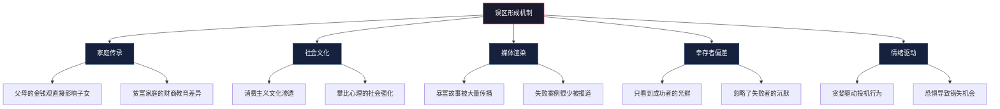
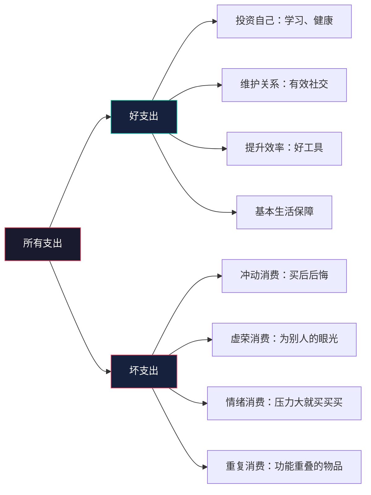
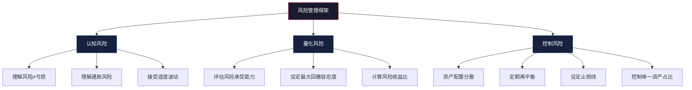
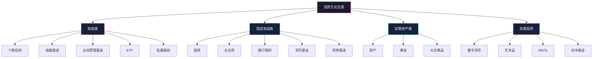
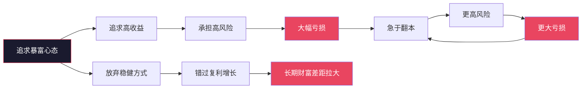

# 第一章：财富的本质与金钱观重塑 —— 常见误区

> "最危险的不是无知，而是自以为正确的一知半解。" —— 马克·吐温

金钱观的偏差往往不是一朝一夕形成的，而是家庭环境、社会文化和个人经历长期塑造的结果。这些根深蒂固的错误认知就像财务道路上的暗礁——你看不见它，但它一直在那里，悄无声息地侵蚀你的财富积累能力。

本章系统梳理财富认知中最常见的十大误区，不仅告诉你"错在哪里"，更深入分析"为什么会错"以及"如何纠正"。每个误区都配有心理学机制解析、真实案例和可执行的纠正方案。

---

## 误区形成的认知机制

在逐一拆解误区之前，有必要理解这些错误认知是如何形成的。只有看清误区的"生成机制"，才能从根本上避免陷入其中。



**五种误区形成机制详解：**

| 机制 | 运作方式 | 典型表现 |
|------|----------|----------|
| 家庭传承 | 从小耳濡目染父母的金钱行为模式 | "我家就是这么过来的" |
| 社会文化 | 社会主流价值观的潜移默化 | "大家都这么做" |
| 媒体渲染 | 媒体选择性报道造成的认知偏差 | "那个人炒股赚了1000万" |
| 幸存者偏差 | 只看到成功案例，忽略大量失败 | "他能成功，我也能" |
| 情绪驱动 | 贪婪和恐惧替代理性判断 | "这次不一样" |

---

## 误区一：钱是赚出来的，不是省出来的

### 误区描述

这句话在社交媒体上广为流传，甚至被一些"成功学"大师奉为金科玉律。它的潜台词是：省钱是穷人思维，赚钱才是富人思维；关注省钱会让你格局变小，应该把精力全部放在赚钱上。

### 为什么这个误区如此危险

这个观点之所以危险，是因为它**半对半错**——前半句"钱是赚出来的"没错，但后半句"不是省出来的"大错特错。它用一个正确的前提推导出了一个错误的结论，极具迷惑性。

**核心逻辑拆解：**

财富积累的基本公式是：

$$\text{财富积累} = \text{收入} - \text{支出}$$

或者更精确地说：

$$\text{净资产} = \sum_{t=0}^{n}(\text{收入}_t - \text{支出}_t) \times (1 + r)^{n-t}$$

其中 $r$ 是投资收益率。这个公式告诉我们：**收入和支出是财富积累的两个同等重要的变量**，忽略任何一个都是片面的。

### 数据实证

假设两位同龄人，月薪分别为30000元和10000元：

| 指标 | 高收入者A | 低收入者B |
|------|-----------|-----------|
| 月收入 | 30,000元 | 10,000元 |
| 月支出 | 28,000元 | 5,000元 |
| 月储蓄 | 2,000元 | 5,000元 |
| 储蓄率 | 6.7% | 50% |
| 年储蓄 | 24,000元 | 60,000元 |
| 10年后（年化8%） | 约36万元 | 约90万元 |
| 20年后（年化8%） | 约115万元 | 约290万元 |

**结论**：低收入者B因为更高的储蓄率，20年后的财富反而是高收入者A的2.5倍。这就是储蓄率的力量。

### 真实案例

**案例一：NBA球星的财富悲剧**

据《体育画报》统计，约60%的NBA球员在退役5年内面临破产。Allen Iverson职业生涯赚取超过2亿美元，但因奢侈消费和不当投资，2013年向法院表示自己甚至买不起一个汉堡。这些球员的收入远超普通人，但"只赚不省"让他们最终一无所有。

**案例二：美国彩票中奖者的悲剧**

美国国家经济研究局（NBER）的研究显示，约70%的彩票大奖得主在几年内破产或回到中奖前的经济水平。这些案例一再证明：没有与之匹配的财务纪律，高收入只是一时的幻象。

**案例三：高储蓄率的普通人**

美国作家Thomas Stanley在《邻家的百万富翁》中调查了超过10000名百万富翁，发现他们的共同特征不是高收入，而是高储蓄率——平均将收入的20%以上用于储蓄和投资，生活方式远低于其收入水平。

### 心理学机制

这个误区背后有一个心理学概念叫**生活方式膨胀**（Lifestyle Inflation）：随着收入增加，人的消费标准也会同步提高，导致收入增长了，但储蓄并没有增长。

行为经济学家Richard Thaler的**心理账户理论**也能解释这个现象：人们倾向于把"赚来的钱"和"省下的钱"放在不同的心理账户中，认为前者更"真实"，后者不重要。但实际上，一块钱就是一块钱，无论它是赚来的还是省下来的。

### 正确认知与纠正方法

**核心观点**：赚钱能力决定财富上限，储蓄纪律决定财富下限。两者缺一不可。

**四步纠正法：**

1. **先算储蓄率，再算收入**：把储蓄率作为核心财务指标，目标是月储蓄率≥30%
2. **自动化储蓄**：工资到账当天自动转出储蓄部分，剩余的才是可支配金额
3. **建立"收入-储蓄-消费"顺序**：不是"收入-消费=储蓄"，而是"收入-储蓄=消费"
4. **持续提升赚钱能力**：储蓄纪律保证下限，能力提升拓展上限

---

## 误区二：投资是有钱人的事

### 误区描述

"等我有钱了再投资"——这句话是很多人的口头禅。背后的逻辑是：投资需要大量启动资金，月薪几千块根本"投不起"。

### 为什么这个误区如此顽固

这个误区的形成有两个原因：一是**门槛认知偏差**——把"投资"等同于"买房""买大额理财"，自然觉得门槛高；二是**拖延心理**——"等有钱了再投资"本质上是为自己的拖延找借口。

### 复利的数学真相

投资的门槛从来不是资金量，而是**时间**。以下是不同起步金额、不同起步年龄的终值对比（假设年化收益率10%）：

| 每月定投 | 起步年龄 | 退休年龄(60) | 投资年数 | 终值（万元） |
|----------|----------|-------------|----------|-------------|
| 500元 | 25岁 | 60岁 | 35年 | 约170万 |
| 500元 | 35岁 | 60岁 | 25年 | 约66万 |
| 1,000元 | 25岁 | 60岁 | 35年 | 约340万 |
| 1,000元 | 35岁 | 60岁 | 25年 | 约132万 |
| 2,000元 | 25岁 | 60岁 | 35年 | 约680万 |
| 2,000元 | 35岁 | 60岁 | 25年 | 约264万 |

**关键洞察**：每月500元，从25岁开始，60岁时拥有170万——这完全不是"有钱人"的专属领域。

### 真实案例

**案例一：Ronald Read——加油站员工的800万美元遗产**

Ronald Read是美国佛蒙特州的加油站员工和看门人，一辈子从事最普通的工作。2014年他去世时，遗产价值约800万美元。他的秘诀极其简单：从年轻时就开始定期投资蓝筹股，坚持了几十年，从不卖出，让复利持续运转。

**案例二：中国基金定投的真实回报**

以沪深300指数基金为例，从2005年开始每月定投1000元（选择沪深300ETF联接基金），到2025年，累计投入约24万元，账户价值约52万元（含分红再投资），年化收益率约8.5%。这个收益远超同期银行存款。

### 投资门槛实测

| 投资方式 | 最低门槛 | 适合人群 |
|----------|----------|----------|
| 货币基金（余额宝等） | 1元 | 所有人 |
| 基金定投 | 10-100元 | 工薪阶层 |
| 指数基金 | 100-1000元 | 有一定积蓄者 |
| 股票 | 约几百元（1手起） | 有学习意愿者 |
| 国债 | 100元 | 保守型投资者 |
| 银行理财 | 1万元 | 稳健型投资者 |

### 正确认知与纠正方法

**核心观点**：投资的最大门槛不是资金，而是知识和习惯。100元就可以开始。

**四步启动法：**

1. **今天就开户**：选择一个正规基金平台（天天基金、蚂蚁财富等），完成开户
2. **设置自动定投**：选一只宽基指数基金（沪深300或中证500），设置每月自动扣款
3. **从100元开始**：不要等"有钱了"，100元就是开始
4. **边投边学**：在定投的同时，系统学习投资知识（本书后续章节会详细展开）

---

## 误区三：省钱就是不花钱，过苦行僧生活

### 误区描述

一提到"省钱"，很多人的第一反应是：降低生活质量、拒绝社交、不买新衣服、不吃好东西。这种极端理解让很多人对"省钱"产生本能的排斥。

### 误区的本质

这个误区犯了一个逻辑错误：把"省钱"等同于"不花钱"。实际上，省钱的真正含义是**优化资源配置**——把钱花在回报率最高的地方，减少回报率低甚至为负的支出。

### "好支出"与"坏支出"分类框架



**具体区分标准：**

| 维度 | 好支出 | 坏支出 |
|------|--------|--------|
| 投资回报 | 长期带来收益或成长 | 购买后价值迅速归零 |
| 情绪状态 | 冷静思考后的决策 | 冲动或情绪化消费 |
| 使用频率 | 高频使用，持续创造价值 | 买后闲置，使用率极低 |
| 机会成本 | 花这笔钱比不花更划算 | 不花这笔钱不影响生活 |
| 生命影响 | 提升健康、能力、关系 | 只满足一时快感 |

### 真实场景对比

**场景一：同样是花5000元**

- 坏支出：买一个名牌包（实际使用率低，满足的是虚荣心）
- 好支出：报一个与职业相关的培训课程（提升专业能力，可能带来升职加薪）

**场景二：同样是花200元**

- 坏支出：心情不好时冲动下单买了不需要的小物件
- 好支出：和行业前辈吃一顿饭（获取信息和人脉）

**场景三：同样是"省"**

- 错误省钱：为了省200元不参加行业会议（错失人脉和机会）
- 正确省钱：取消一个几乎不用的订阅服务（释放资金用于更有价值的地方）

### 正确认知与纠正方法

**核心观点**：省钱不是压缩生活，而是优化生活。聪明的人不是不花钱，而是让每一块钱都花得值得。

**实操方法——"三问过滤法"：**

每次消费前问自己三个问题：
1. **这件事3个月后还会对我有价值吗？** ——过滤冲动消费
2. **有没有更低成本的替代方案能达到同样效果？** ——过滤溢价消费
3. **如果不买，我会损失什么具体的东西？** ——过滤伪需求

三个问题都能通过的消费，就是值得的消费；任何一个通不过，建议暂缓24小时再决定。

---

## 误区四：复利效应需要太长时间才能见效，现在开始太早了

### 误区描述

"复利是第八大奇迹"这句话几乎人人都听过，但很多人的反应是："确实神奇，但我才20多岁，几十年后的事太遥远了，晚几年开始也没关系。"

### 为什么"晚几年"代价巨大

这个误区的危险在于：它听起来合情合理，但数学上完全站不住脚。复利的时间价值不是线性的，而是**指数级**的——每晚一年开始，损失的不是一年的收益，而是那一年收益在未来几十年的复利增长。

**对比数据（假设年化收益率10%，每月定投1000元，目标60岁）：**

| 开始年龄 | 投资年数 | 累计投入 | 60岁时终值 | 相比25岁起步的差额 |
|----------|----------|----------|-----------|------------------|
| 25岁 | 35年 | 42万 | 约380万 | — |
| 30岁 | 30年 | 36万 | 约227万 | 少153万 |
| 35岁 | 25年 | 30万 | 约132万 | 少248万 |
| 40岁 | 20年 | 24万 | 约72万 | 少308万 |

**晚5年起步，少赚153万；晚10年起步，少赚248万。** 这不是线性衰减，而是指数衰减。

### 巴菲特的复利奇迹

沃伦·巴菲特的财富增长曲线是最好的复利教材：

| 年龄 | 净资产 | 关键事件 |
|------|--------|----------|
| 21岁 | 2万美元 | 大学毕业 |
| 30岁 | 100万美元 | 成立合伙基金 |
| 40岁 | 2,500万美元 | 关闭合伙基金 |
| 50岁 | 3.76亿美元 | 伯克希尔持续增长 |
| 60岁 | 38亿美元 | 成为顶级富豪 |
| 70岁 | 360亿美元 | 复利加速 |
| 80岁 | 585亿美元 | 持续增长 |
| 90岁+ | 1,000亿美元+ | 仍在增长 |

注意看60岁之后的变化：从38亿到360亿到585亿——**他95%以上的财富是在60岁之后获得的**。如果他从30岁而不是11岁开始投资，他的最终财富可能不到现在的十分之一。

### 正确认知与纠正方法

**核心观点**：复利最大的敌人不是收益率不够高，而是开始得太晚。每一天的延迟都有真实的机会成本。

**行动方案：**

1. **理解72法则**：用72除以年化收益率，就是资金翻倍的年数。例如8%收益率，72÷8=9年翻一倍
2. **画一条时间线**：在纸上画出你的投资时间线，标注每5年的预期资产，让"未来"变得具体
3. **立即开始**：哪怕每月只有100元，今天就开始。行动本身会改变你对复利的感知
4. **不要频繁查看收益**：复利需要耐心，频繁查看只会增加焦虑

---

## 误区五：风险就是亏损

### 误区描述

"投资有风险"这句话被很多人理解为"投资=可能亏钱"，因此选择把钱全部存在银行，认为这样最"安全"。

### 风险的真正定义

在金融学中，风险（Risk）的准确定义是**不确定性**（Uncertainty），特别是指资产价格的波动性，而不是"亏损"本身。

**区分三个概念：**

| 概念 | 定义 | 举例 |
|------|------|------|
| 波动（Volatility） | 资产价格的短期上下浮动 | 股票今天涨3%，明天跌2% |
| 风险（Risk） | 实际收益偏离预期收益的可能性 | 年化收益可能在-5%到+25%之间 |
| 亏损（Loss） | 本金的实际减少 | 投入10万，只剩8万 |

**关键洞察**：波动不等于亏损。一只股票今天跌了10%，如果你不卖出，你并没有实际亏损——只是浮亏。如果你投资的是优质资产，长期来看波动会被时间熨平。

### 真正的风险：不投资的风险

很多人忽略了一个更严重的风险——**通胀风险**。把所有钱存在银行，表面上"没有风险"，实际上你的购买力在持续缩水。

| 年份 | 银行存款利率（活期） | 实际CPI通胀率 | 实际收益率 |
|------|---------------------|---------------|-----------|
| 2015 | 0.35% | 约1.4% | -1.05% |
| 2018 | 0.35% | 约2.1% | -1.75% |
| 2020 | 0.35% | 约2.5% | -2.15% |
| 2023 | 0.20% | 约0.2% | 0% |
| 2024 | 0.15% | 约0.3% | -0.15% |

长期来看，**"什么都不做"才是最大的风险**。如果过去20年你把所有钱存活期，你的购买力缩水了约30-40%。

### 风险管理的正确方法



**风险承受能力自测：**

问自己一个问题：如果明天你的投资账户缩水30%，你会——
- A. 不管它，甚至加仓 → 高风险承受能力（可配置70%+权益类资产）
- B. 有点焦虑，但能忍住不卖 → 中等风险承受能力（可配置40-60%权益类资产）
- C. 彻夜难眠，想立刻卖掉 → 低风险承受能力（应以固收类为主，权益类≤30%）

### 正确认知与纠正方法

**核心观点**：不投资的风险远大于投资的风险。风险是可以管理的，而不是应该逃避的。

**四步风险管理法：**

1. **接受波动是常态**：股市短期波动不可预测，但长期趋势向上（全球主要股指年化收益7-10%）
2. **分散投资**：不要把所有资金集中在单一资产类别。股债搭配、跨行业分散、跨市场配置
3. **用时间熨平波动**：投资期限越长，波动的影响越小。投资5年以上，亏损概率大幅下降
4. **定期再平衡**：每年检查一次资产配置比例，偏离超过5%就调整回目标比例

---

## 误区六：财务自由就是不用工作，躺着收钱

### 误区描述

社交媒体上充斥着这样的画面：年轻富豪躺在沙滩上，喝着鸡尾酒，被动收入源源不断。这让很多人认为财务自由=永远不工作=每天享乐。

### 财务自由的准确定义

**财务自由的真正含义是：被动收入 ≥ 生活支出。** 也就是说，你不需要为钱而工作，但你完全可以选择继续工作。

这个定义有两层含义：

1. **被动收入**：不需要你每天到场就能持续产生的收入（投资收益、版税、租金等）
2. **生活支出**：维持你期望的生活水平所需的费用

**关键变量**：财务自由的门槛取决于你的生活支出。如果每月支出5000元，被动收入达到5000元就自由了；如果每月支出50000元，你需要10倍的被动收入。

### 财务自由的四个层级

| 层级 | 定义 | 被动收入 vs 支出 | 生活状态 |
|------|------|------------------|----------|
| 财务安全 | 被动收入覆盖基本生存需求 | 覆盖最低生活费 | 不再担心温饱 |
| 财务活力 | 被动收入覆盖舒适生活 | 覆盖80%生活支出 | 可以选择降薪但有意义的工作 |
| 财务独立 | 被动收入完全覆盖生活 | 覆盖100%生活支出 | 可以不为钱工作 |
| 财务自由 | 被动收入远超生活所需 | 覆盖200%+生活支出 | 可以追求任何想做的事 |

大多数人的合理目标是达到"财务活力"或"财务独立"，而不是"财务自由"。

### 真实的财务自由者在做什么

**数据**：根据US Trust的调查，超过70%的百万富翁在实现财务自由后仍然在工作，但工作内容发生了显著变化——从"为钱工作"转变为"为意义工作"。

**案例一：比尔·盖茨**
微软上市后不久就实现了财务自由，但他继续工作了几十年，退休后全身心投入慈善事业。

**案例二：日本的Ikigai文化**
日本很多百岁老人即使在经济上已经不需要工作，仍然每天坚持做自己的事情——因为工作本身就是生命意义的一部分。

### 正确认知与纠正方法

**核心观点**：财务自由不是终点，而是起点。它是让你有权利选择做什么，而不是什么都不做。

**重新设定财务目标：**

1. **计算你的"自由数字"**：年度生活支出 × 25 = 你的财务自由数字（基于4%提取率法则）
2. **区分"生存成本"和"理想生活成本"**：前者是底线，后者是目标
3. **思考财务自由后想做什么**：如果答案是"不知道"，说明你需要先找到人生方向
4. **享受过程**：通往财务自由的路上，每一天的生活质量同样重要

---

## 误区七：投资就是炒股

### 误区描述

一提到"投资"，很多人立刻想到的是：盯着K线图、追涨杀跌、内幕消息、涨停跌停。因为在A股市场，"炒股亏钱"的故事太多，导致很多人把"投资"和"赌博"画上等号。

### 投资的完整图谱

"炒股"只是投资这个庞大体系中的一个很小的分支。以下是主要投资类别的全景图：



**各投资方式对比：**

| 投资方式 | 风险等级 | 预期年化收益 | 门槛 | 适合人群 | 需要投入的时间 |
|----------|----------|-------------|------|----------|--------------|
| 货币基金 | 极低 | 1.5-3% | 1元 | 所有人 | 几乎不需要 |
| 国债 | 低 | 2.5-4% | 100元 | 保守型 | 很少 |
| 债券基金 | 中低 | 3-6% | 100元 | 稳健型 | 很少 |
| 指数基金定投 | 中 | 7-12% | 100元 | 大多数人 | 每月几小时学习 |
| 主动管理基金 | 中高 | 5-15% | 1000元 | 有筛选能力者 | 需要研究基金 |
| 个股投资 | 高 | -50%到+50% | 几百元 | 专业投资者 | 大量时间 |
| 房产 | 中 | 3-8%（含租金） | 几十万 | 大额资金持有者 | 中等 |
| 数字货币 | 极高 | 极大波动 | 几百元 | 高风险偏好者 | 大量时间 |

### 为什么大多数人不应该"炒股"

中国证券登记结算公司的数据显示，A股市场约70%的散户长期处于亏损状态。这不是因为"投资不好"，而是因为**直接炒个股**对普通人的要求极高：需要大量的财务分析能力、时间精力和情绪管理能力。

**更适合普通人的投资方式：**

1. **宽基指数基金定投**：不需要选股能力，长期跑赢70%的主动投资者
2. **目标日期基金**：自动调整股债比例，完全"懒人"投资
3. **FOF基金**：专业基金经理帮你选基金

### 正确认知与纠正方法

**核心观点**：投资是一种思维方式和生活方式，不是"炒股"的代名词。普通人最好的投资方式是指数基金定投——省心、省力、长期收益优秀。

**行动建议：**

1. **建立正确的投资认知**：投资≠炒股，投资=让钱为你工作
2. **选择适合自己的方式**：根据时间、知识、资金、风险偏好选择
3. **从指数基金开始**：沪深300、中证500、创业板ETF等宽基指数是入门首选
4. **不碰不懂的东西**：巴菲特说"不投自己不了解的东西"，这是最好的投资纪律

---

## 误区八：记账太麻烦，没有用

### 误区描述

"记账"常常被认为是强迫症行为。反对者的理由包括：太花时间、记了也不会改变什么、生活不应该这么"斤斤计较"。

### 记账的真实价值

记账的本质不是"记录数字"，而是**建立对自己财务状况的掌控感**。就像体检能让你了解身体状况一样，记账能让你了解财务状况。

**不记账的人通常有以下特征：**

- 不知道自己每月花多少钱
- 不知道钱花在了哪些类别上
- 经常在月底发现"钱不够了"
- 想存钱但不知道从哪里省
- 觉得自己"没花什么大钱"但就是存不下钱

**记账的人的典型改变：**

| 记账前 | 记账3个月后 | 记账6个月后 |
|--------|-----------|-----------|
| 不知道钱去哪了 | 清楚每一分钱的去向 | 已优化大部分不必要的支出 |
| 月光族 | 储蓄率提升到15-20% | 储蓄率稳定在30%+ |
| 冲动消费频繁 | 冲动消费减少50%+ | 建立起理性消费习惯 |
| 觉得收入太低 | 发现浪费比想象的多 | 认识到"会花钱"比"多赚钱"更可控 |

### 记账的正确方法：极简记账法

传统的记账方式（每笔消费都手动记录）确实太繁琐，坚持不下来。推荐**极简记账法**：

**第一步：分类（而不是记每一笔）**

只关注5-7个大类，不用记录每一笔消费的具体细节：
- 🏠 居住（房贷/房租、水电燃气、物业）
- 🍜 餐饮（外卖、聚餐、食材）
- 🚗 交通（打车、地铁、加油）
- 🛒 购物（衣物、电子产品、日用品）
- 📚 学习（课程、书籍、培训）
- 🎮 娱乐（电影、游戏、旅行）
- 💊 健康（体检、运动、医疗）

**第二步：利用工具自动化**

| 工具 | 特点 | 推荐理由 |
|------|------|----------|
| 随手记 | 功能全面 | 支持多账本、报表丰富 |
| 钱迹 | 极简设计 | 无广告、操作简单 |
| 微信/支付宝账单 | 零成本 | 自动记录，月度导出 |
| Excel/Notion | 高度自定义 | 适合喜欢DIY的人 |

**第三步：每月复盘一次（15分钟）**

每月初花15分钟，回顾上月的支出分布：
1. 哪个类别超支了？为什么？
2. 有没有不需要的固定支出？（订阅、会员等）
3. 下个月可以优化什么？

### 正确认知与纠正方法

**核心观点**：记账不是为了"斤斤计较"，而是为了"心中有数"。你不需要记一辈子，但至少需要认真记3-6个月来建立对支出的感知。

**行动建议：**

1. **从今天开始记账**：选择一个工具，先坚持30天
2. **不要追求完美**：漏记几笔没关系，关键是建立习惯
3. **每周快速回顾**：花5分钟看一眼本周支出，保持感知
4. **每月深度复盘**：花15分钟分析支出结构，找出优化空间

---

## 误区九：借钱投资是聪明的做法——用杠杆放大收益

### 误区描述

"用别人的钱赚钱"听起来很聪明。一些人认为：如果投资回报率高于借款利率，借钱投资就是"套利"。这个逻辑在数学上似乎成立，但在现实中极其危险。

### 为什么借钱投资几乎总是灾难

**数学上的陷阱：**

假设你借了10万元，年利率6%，投资预期年化收益10%：
- 乐观情况：投资赚10%，扣除利息6%，净赚4% = 4000元
- 中性情况：投资赚5%，扣除利息6%，净亏1% = -1000元
- 悲观情况：投资亏20%，加上利息6%，净亏26% = -26000元
- 极端情况：投资亏50%，加上利息6%，净亏56% = -56000元

**关键问题**：借钱投资的风险收益是**不对称的**——赚了只多赚一点点，亏了却可能倾家荡产。

### 杠杆杀人的真实案例

**案例一：2015年中国股市杠杆牛市**

2015年上半年，大量投资者通过场外配资（1:3甚至1:10杠杆）涌入A股。上证指数从3000点涨到5178点，很多人账面暴富。但6月股灾来临，千股跌停，杠杆投资者被强制平仓，不仅利润全无，还背负巨额债务。据估计，这场股灾导致数百万人爆仓。

**案例二：Bill Hwang的Archegos Capital爆仓**

2021年3月，前对冲基金经理Bill Hwang的Archegos Capital因高杠杆投资中概股，在一周内亏损约200亿美元，成为美国金融史上最大的个人亏损事件之一。高杠杆在顺风时放大收益，在逆风时同样放大亏损——而且亏损的速度远快于盈利的速度。

### 心理学机制：杠杆如何扭曲决策

借钱投资最大的危害不是财务上的，而是心理上的：

| 没有杠杆时 | 有杠杆时 |
|-----------|---------|
| 可以耐心持有等反弹 | 被迫频繁关注盈亏 |
| 短期下跌不焦虑 | 短期下跌极度恐慌 |
| 可以做出理性决策 | 容易情绪化操作 |
| 亏损是浮亏，可以等 | 亏损可能被强制平仓 |
| 心态平和 | 心态扭曲，影响生活和工作 |

**行为金融学研究表明**：杠杆投资者的收益率普遍低于非杠杆投资者，因为他们无法承受正常波动，倾向于在最差的时机卖出。

### 唯一合理的"借钱"

并不是所有负债都是坏事。有一种负债是**良性负债**：

- **房贷**：购买自住房产的贷款（利率低、有实物资产、刚需）
- **教育贷款**：投资自己的人力资本（提升赚钱能力）
- **经营贷款**：用于扩大有稳定现金流的生意

**判断标准**：借钱的目的是**增加资产或收入能力**，而不是**投机**。

### 正确认知与纠正方法

**核心观点**：投资应该用闲钱——3-5年内不会用到的钱。永远不要借钱投资，永远不要用生活必需的资金投资。

**铁律：**

1. **只用闲钱投资**：紧急备用金（6个月生活费）之外的钱才能用于投资
2. **永远不上杠杆**：无论"机会"看起来多么确定
3. **不用信用卡套现投资**：这是最常见的隐蔽杠杆
4. **远离任何形式的配资**：场外配资、融资融券等

---

## 误区十：投资可以一夜暴富

### 误区描述

社交媒体时代，"一夜暴富"的故事被无限放大：某人买了某个币赚了100倍，某人买了某只股票翻了10倍，某人做直播带货月入百万。这些故事让人觉得：快速致富不是梦。

### 幸存者偏差的残酷真相

你听到的每一个"暴富"故事背后，都有成千上万个"暴亏"的沉默者。

**数据实证：**

- **加密货币**：2021年NFT热潮中，约95%的NFT项目最终归零
- **期权交易**：芝加哥期权交易所的数据显示，约80%的个人期权交易者亏损
- **日间交易**：巴西证券委员会的一项研究发现，97%的日间交易者在持续交易超过300天后亏损
- **彩票**：中国体彩中头奖概率约为1/21,000,000，远低于被雷击的概率（1/1,000,000）

**一个直观的比喻**：暴富故事就像冰山露出水面的尖角——你看到了1%的成功，却看不到99%沉在水下的失败。

### 为什么"追求暴富"心态极其危险



追求暴富的人陷入一个恶性循环：亏损→急于翻本→冒更大风险→更大亏损。同时，他们放弃了指数基金定投等稳健方式，错过了真正可靠的财富增长路径。

### 被"暴富"心态坑害的典型骗局

| 骗局类型 | 典型话术 | 运作方式 | 受害者规模 |
|----------|----------|----------|-----------|
| P2P暴雷 | "年化收益15-24%" | 借新还旧，资金池 | 数千万人 |
| 资金盘 | "每天收益1%" | 用后来者的钱付前面的人 | 数百万人 |
| 虚拟币骗局 | "下一个比特币" | 发行无价值的代币后跑路 | 数百万人 |
| 杀猪盘 | "稳赚不赔的投资" | 虚假平台操控数据 | 数十万人 |
| 非法荐股 | "明天必涨停" | 收取高额会员费 | 数百万人 |

**这些骗局的共同特征**：承诺高收益、低风险、快速回报。记住一个铁律：**如果一个投资机会听起来好得不像真的，那它很可能就不是真的。**

### 正确认知与纠正方法

**核心观点**：真正的财富增长是缓慢而稳定的。年化8-12%的长期收益率，通过复利效应，已经足以创造惊人的财富。

**对比：两条路径的终局**

假设从25岁开始，到60岁：

- **路径A（追求暴富）**：前10年频繁交易，平均年化收益-2%（亏钱），后10年改为稳健投资，年化8%
  - 35岁时净资产为负，到60岁积累有限
- **路径B（稳健投资）**：每月定投2000元到指数基金，年化10%
  - 到60岁积累约680万元

**行动建议：**

1. **删除"暴富"的期望**：接受"慢慢变富"才是最可靠的路径
2. **警惕高收益承诺**：年化收益超过15%的投资机会，先问自己"为什么是我？"
3. **建立稳健投资体系**：指数基金定投+适度分散+长期持有
4. **把精力放在提升收入上**：增加主动收入，而不是期望被动收入一夜翻倍

---

## 误区十一：有钱就幸福

### 误区描述

"如果我有1000万，我一定会很幸福。" 这种把幸福和财富画等号的想法，是很多人的深层信念。

### 财富与幸福的真实关系

普林斯顿大学Daniel Kahneman和Angus Deaton的经典研究（2010年）发现：

- 在年收入约75,000美元（约合人民币50万元）以下，收入增长确实能显著提升幸福感
- 超过这个阈值后，收入增长对日常幸福感的提升效果急剧递减
- 后续研究（2023年，Matthew Killingsworth）指出，对于大多数人，收入与幸福仍然正相关，但增速大幅放缓

**财富与幸福的关系更像对数函数，而不是线性函数：**

| 收入水平 | 对幸福感的影响 |
|----------|---------------|
| 无法满足基本需求 | 极大影响：贫穷带来持续焦虑和压力 |
| 刚好满足基本需求 | 显著影响：从生存焦虑中解放 |
| 中等水平 | 有一定影响：更多选择带来一定满足 |
| 高收入 | 影响递减：边际效用大幅下降 |
| 超高收入 | 几乎无影响：可能带来新的烦恼 |

### 有钱人不幸福的原因

1. **享乐适应**（Hedonic Adaptation）：人对任何物质条件都会快速适应。买了新车的兴奋感通常不超过3个月
2. **社会比较升级**：收入越高，参照群体也越高，永远觉得"不够"
3. **时间贫困**：高收入往往意味着更长的工作时间和更高的压力
4. **关系空心化**：忙于赚钱忽略了家人朋友，关系质量下降
5. **存在焦虑**：物质满足后，对人生意义的追问反而更加强烈

### 正确认知与方法

**核心观点**：金钱是幸福的必要条件之一，但远非充分条件。真正的幸福来源于：有意义的工作、良好的人际关系、健康的身体、持续的成长。

**实用框架——PERMA幸福模型（Martin Seligman）：**

| 要素 | 含义 | 与金钱的关系 |
|------|------|-------------|
| P（Positive Emotion） | 积极情绪 | 金钱有一定帮助，但边际递减 |
| E（Engagement） | 投入感/心流 | 与金钱关系不大 |
| R（Relationship） | 良好关系 | 金钱帮助不大，甚至可能阻碍 |
| M（Meaning） | 人生意义 | 与金钱关系不大 |
| A（Accomplishment） | 成就感 | 金钱可以辅助，但不是核心 |

---

## 误区十二：省钱靠意志力

### 误区描述

"我要靠强大的意志力控制消费！" 这种想法几乎注定失败。行为科学一再证明：意志力是一种有限的、会消耗的心理资源。

### 为什么意志力不可靠

**心理学实验**：Roy Baumeister的"巧克力曲奇"实验发现，意志力就像肌肉——使用后会疲劳。被迫抵抗诱惑的被试，在后续任务中的自我控制能力明显下降。

**应用到理财场景**：

- 你决定这个月不买新衣服 → 第1周忍住了 → 第2周忍住了 → 第3周看到打折 → 崩溃 → 比原计划买得更多
- 你决定每天不点外卖 → 第1天忍住了 → 第3天加班 → 报复性消费 → 点了最贵的

### 环境设计：替代意志力的系统方法

行为经济学家Richard Thaler提出：**不要试图改变人的行为，要改变人做决策的环境。**

**环境设计的具体方法：**

| 策略 | 具体操作 | 原理 |
|------|----------|------|
| 增加消费摩擦 | 删除购物App、取消免密支付、不保存支付密码 | 让消费变得"麻烦" |
| 自动化储蓄 | 工资日自动转账到储蓄账户 | 让储蓄变成"默认选项" |
| 减少诱惑暴露 | 取关购物博主、退出种草群、取消促销短信 | 降低诱惑频率 |
| 设置冷静期 | 超过500元的消费等待48小时再决定 | 给理性决策留出时间 |
| 无现金日 | 每周安排1-2天只带固定现金出门 | 物理限制消费金额 |
| 预算信封法 | 把月预算按类别分装在不同"信封"里 | 可视化剩余预算 |

**核心原则**：与其靠意志力对抗诱惑，不如设计一个让正确行为自动发生的环境。

### 正确认知与方法

**核心观点**：好的财务习惯不应该依赖意志力，而应该依赖系统设计。让"正确的事"变得容易，让"错误的事"变得困难。

---

## 误区总结与自我诊断

### 十二大误区速查表

| # | 误区 | 核心错误 | 正确认知 |
|---|------|----------|----------|
| 1 | 钱是赚出来的不是省出来的 | 忽视储蓄的作用 | 赚钱和储蓄同等重要 |
| 2 | 投资是有钱人的事 | 混淆门槛与能力 | 100元就可以开始 |
| 3 | 省钱就是不花钱 | 混淆节俭与吝啬 | 省钱是优化资源配置 |
| 4 | 复利需要太久 | 低估时间的价值 | 每晚一年代价巨大 |
| 5 | 风险就是亏损 | 混淆波动与亏损 | 不投资的风险更大 |
| 6 | 财务自由=不工作 | 混淆自由与懒惰 | 财务自由是选择权 |
| 7 | 投资就是炒股 | 窄化投资的含义 | 投资方式多种多样 |
| 8 | 记账没用 | 低估自我认知的价值 | 记账是财务掌控的基础 |
| 9 | 借钱投资聪明 | 忽视杠杆的毁灭性 | 只用闲钱投资 |
| 10 | 投资能一夜暴富 | 幸存者偏差 | 慢慢变富才是正道 |
| 11 | 有钱就幸福 | 混淆条件与结果 | 幸福来源多元化 |
| 12 | 省钱靠意志力 | 高估自我控制能力 | 依靠系统设计而非意志力 |

### 自我诊断：你中了几个误区？

**快速测试**：对以下12个陈述，诚实回答"同意"或"不同意"：

1. 我觉得省钱是小气的表现（→ 误区1）
2. 我觉得等有钱了再投资（→ 误区2）
3. 我觉得省钱会降低生活质量（→ 误区3）
4. 我觉得复利是几十年后的事（→ 误区4）
5. 我觉得投资风险太大，不如存银行（→ 误区5）
6. 我觉得财务自由就是不用工作（→ 误区6）
7. 我觉得投资就是炒股（→ 误区7）
8. 我觉得记账没用（→ 误区8）
9. 我觉得借钱投资可以放大收益（→ 误区9）
10. 我期待通过投资快速致富（→ 误区10）
11. 我觉得有钱了一切都会好（→ 误区11）
12. 我觉得省钱靠意志力就行（→ 误区12）

**评分标准：**
- 0-2个"同意"：你有比较健康的金钱观，继续保持
- 3-5个"同意"：有一些认知偏差，需要针对性调整
- 6-8个"同意"：存在较多误区，建议系统学习财务知识
- 9-12个"同意"：金钱观存在严重偏差，本书将对你帮助很大

### 行动建议：走出误区的四步法

**第一步：承认误区（本周内）**

回顾上面的12个误区，标记出你曾经或正在陷入的误区。不要自责——这些误区是社会环境塑造的，不是你的错。

**第二步：替换认知（1-2周）**

针对每个你中招的误区，写出"旧信念"和"新信念"：

```text
旧信念：钱是赚出来的，不是省出来的
新信念：赚钱决定上限，储蓄决定下限，两者同等重要
```

把新信念写在便利贴上，贴在你每天能看到的地方。

**第三步：建立系统（1-3个月）**

根据本章的建议，逐步建立你的财务系统：
- 设置自动储蓄（本周）
- 开始记账（本周）
- 开始基金定投（本月）
- 建立预算系统（本月）
- 每月进行财务复盘（持续）

**第四步：持续迭代（长期）**

每季度回顾一次自己的财务认知和行为，看看有没有新的误区潜入，有没有旧的误区又被触发。金钱观的纠正是一个持续的过程，不是一劳永逸的事。

---

> **本章核心要记住的一句话**：大多数人不是输在"不够聪明"或"不够努力"上，而是输在了根深蒂固的错误认知上。改变认知，是改变财务命运的第一步。
