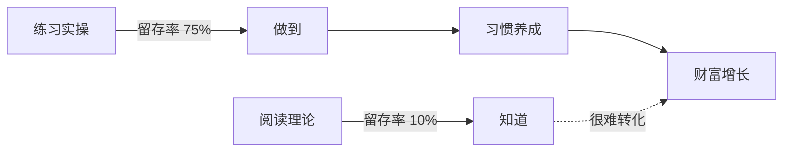
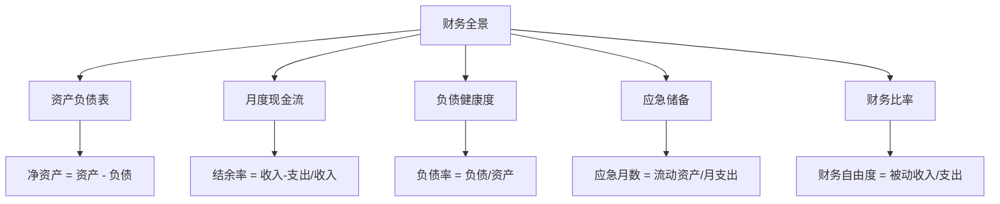
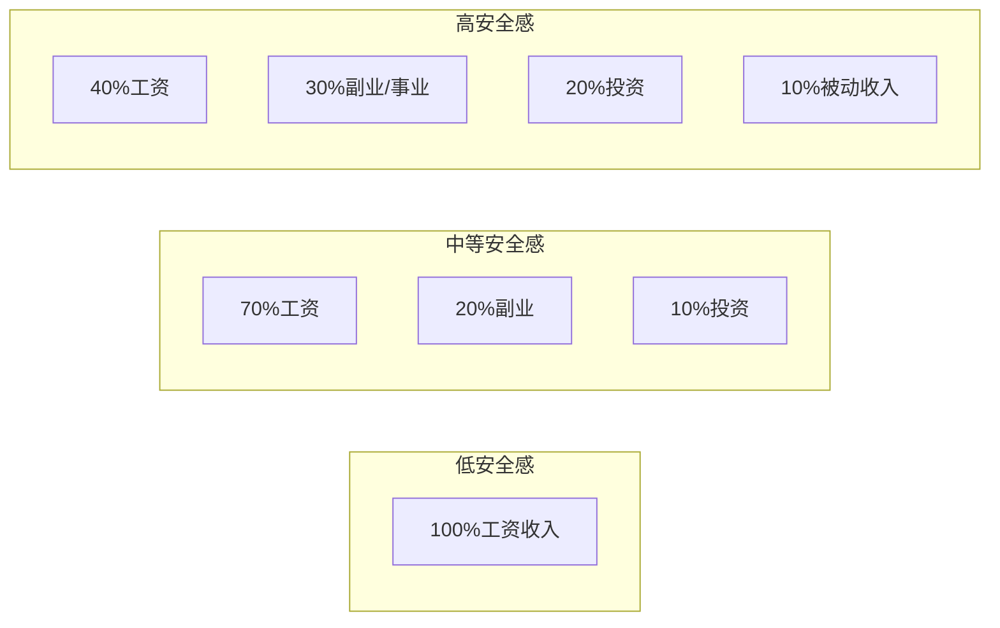
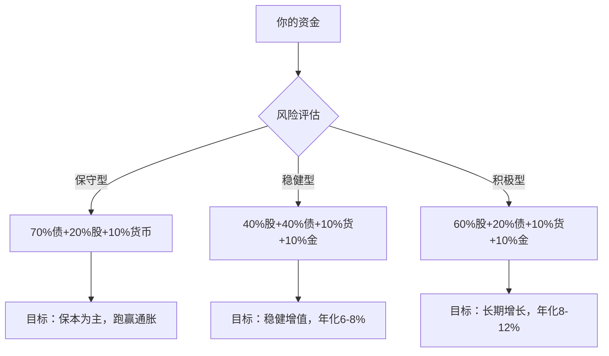

# 第一章：财富的本质与金钱观重塑 —— 练习方法

> **阅读指南**：本章提供 9 个系统化练习，从金钱观认知到实战投资规划，覆盖从零基础到进阶的完整路径。建议按顺序完成，每个练习都配有理论背景、操作步骤、填写示例和自检清单。预计总耗时 4-6 小时（分散在 1-2 周内完成效果最佳）。

## 为什么练习比阅读更重要

认知科学中的「生成效应」（Generation Effect）表明：主动产出的信息比被动阅读的信息记忆留存率高 40-70%。金钱观重塑不是知识积累问题，而是**行为模式重构**——你必须通过亲手填写、计算、决策，才能将书本知识转化为本能反应。



**关键原则**：
- 不要只在脑子里做练习，必须写下来或敲进电子表格
- 允许答案「不好看」——真实比完美重要
- 做完一个练习再看下一个，避免跳读
- 每完成一个练习，花 5 分钟写下「我最大的发现是什么」

---

## 练习一：金钱观自测——解构你的财富潜意识

### 为什么这个练习排在第一位

你的金钱观不是你「选择」的，而是被环境「安装」的。心理学家布拉德·克朗茨（Brad Klontz）提出的「金钱剧本」（Money Script）理论指出，人在 7 岁前就形成了对金钱的核心信念，这些信念在成年后持续驱动财务决策——而大多数人对此毫无察觉。

常见的金钱剧本有四类：

| 类型 | 核心信念 | 典型表现 | 潜在危害 |
|------|---------|---------|---------|
| 金钱逃避 | "钱是万恶之源" | 回避谈钱、拒绝理财 | 收入停滞、财务混乱 |
| 金钱崇拜 | "钱能解决一切问题" | 过度追求收入、忽视健康关系 | 工作狂、人际关系破裂 |
| 金钱地位 | "身价等于自我价值" | 炫耀消费、攀比心理 | 永不满足、焦虑抑郁 |
| 金钱警觉 | "钱随时会被偷走" | 过度储蓄、不敢消费 | 错失投资机会、生活质量低 |

你可能同时持有多种剧本的混合体。这个练习的目标是：**识别你的金钱剧本，评估它是否在帮你或害你**。

### 练习步骤

**Step 1：金钱第一反应测试（5 分钟）**

闭上眼睛，深呼吸三次。当我说「金钱」这个词时，你脑海中冒出的**第一个画面、第一个词、第一种情绪**是什么？不要思考，直接写下来。

接着回答以下 10 个问题，每个问题用**不超过 10 个字**快速回答——直觉反应比深思熟虑更有价值：

1. 金钱是______（一个名词或形容词）
2. 有钱人通常______（描述特征）
3. 穷人通常______（描述特征）
4. 赚大钱需要______（条件）
5. 我父母对钱的态度是______
6. 我小时候家里最常因为钱______
7. 如果我突然有 100 万，第一反应是______
8. 我对投资的感觉是______
9. 谈论收入让我感到______
10. 我觉得自己这辈子能赚到的钱上限是______

**Step 2：金钱剧本识别（10 分钟）**

根据 Step 1 的回答，对照下表圈出你身上存在的金钱剧本：

| 问题编号 | 逃避型信号 | 崇拜型信号 | 地位型信号 | 警觉型信号 |
|---------|-----------|-----------|-----------|-----------|
| 1 | "脏的/邪恶的/不重要的" | "万能的/美好的/必需的" | "成功的标志/面子" | "危险的/不安全的" |
| 2 | "贪婪的/不快乐的" | "聪明的/厉害的" | "值得尊敬的/成功的" | "精明的/小心的" |
| 3 | "善良的/单纯的" | "懒惰的/愚蠢的" | "失败的/可怜的" | "被骗的/大意的" |
| 4 | "运气/背景/关系" | "能力/野心/努力" | "学历/人脉/平台" | "谨慎/节俭/防守" |
| 5 | "不重要/从不讨论" | "很重要/经常讨论" | "衡量成功的标准" | "要小心/要藏好" |

**Step 3：金钱观来源追溯（15 分钟）**

你现在的金钱观不是凭空产生的。完成以下「金钱观家谱」：

```text
我的金钱观来源追溯

祖父辈的金钱观：
  祖父：____________________（例：经历过饥荒，极度节俭）
  祖母：____________________
  
父辈的金钱观：
  父亲：____________________（例：工薪阶层，认为稳定最重要）
  母亲：____________________

这些观念如何传给了我：
  直接教导：____________________（例："省一分就是赚一分"）
  行为示范：____________________（例：父母从不在我面前讨论钱）
  重大事件：____________________（例：家里经历过破产）
  社会环境：____________________（例：周围人都说"男人要有钱"）

我现在的金钱观：
  积极的：____________________
  消极的：____________________
```

**Step 4：金钱观健康度评估**

给以下 10 个陈述打分（1=完全不同意，5=完全同意）：

| 序号 | 陈述 | 得分(1-5) |
|------|------|----------|
| 1 | 我能在不感到焦虑的情况下查看银行余额 | ___ |
| 2 | 我能坦然地和伴侣/朋友讨论收入和支出 | ___ |
| 3 | 我认为赚钱和道德可以兼得 | ___ |
| 4 | 我不会因为别人比我有钱而感到自卑 | ___ |
| 5 | 我不会因为别人比我穷而感到优越 | ___ |
| 6 | 我愿意为学习投资知识投入时间和金钱 | ___ |
| 7 | 我能区分"需要"和"想要" | ___ |
| 8 | 我对未来财务状况感到可控而非恐惧 | ___ |
| 9 | 我不会用消费来缓解负面情绪 | ___ |
| 10 | 我相信通过正确方法可以逐步改善财务状况 | ___ |

**评分解读**：
- **40-50 分**：金钱观健康，可以快速进入实操阶段
- **30-39 分**：有轻微偏差，建议在后续练习中重点关注标记项
- **20-29 分**：存在明显障碍，建议先完成 Step 3 的来源追溯再继续
- **10-19 分**：金钱观严重扭曲，建议寻求专业理财心理咨询

### 填写示例

以下是虚构人物「小李」的完整示例，供参考：

```text
Step 1 直觉回答：
1. 金钱是 "生存工具"
2. 有钱人通常 "精明但冷漠"
3. 穷人通常 "善良但可怜"
4. 赚大钱需要 "运气+关系"
5. 我父母对钱的态度是 "能省则省"
6. 我小时候家里最常因为钱 "争吵"
7. 如果我突然有 100 万，第一反应是 "存起来不敢花"
8. 我对投资的感觉是 "害怕亏损"
9. 谈论收入让我感到 "不自在"
10. 我觉得自己这辈子能赚到的钱上限是 "300万"

Step 2 剧本识别：逃避型(3个) + 警觉型(2个)
→ 核心问题：对金钱有恐惧和回避倾向

Step 4 评分：27分
→ 属于"存在明显障碍"区间，需要重点关注金钱与安全的关系
```

### 常见误区

| 误区 | 纠正 |
|------|------|
| "我从小就这样，改不了" | 神经可塑性研究表明，信念系统在任何年龄都可以重塑，只是需要刻意练习 |
| "我的金钱观没问题" | 如果你在 Step 1 中有任何犹豫或情绪波动，说明存在潜意识冲突 |
| "这太玄学了" | 克朗茨的研究已被《Journal of Financial Therapy》多次验证，是有实证基础的心理学 |
| "做完就完了" | 建议 3 个月后重做一次，对比变化——行为改变需要时间 |

---

## 练习二：财务全景诊断——看清你的真实财务状况

### 为什么需要「全景」诊断

大多数人对自己的财务状况只有模糊印象——知道大概有多少存款，但不清楚净资产、现金流、负债结构和应急储备是否健康。这就像体检只量了体重就以为了解全部健康状况。

财务全景诊断包含五个维度：



### 练习步骤

**Step 1：资产负债表（15 分钟）**

把你的所有资产和负债列出来。注意：资产按流动性排列，从最容易变现的开始。

**资产清单**：

| 资产类别 | 具体项目 | 当前市值（元） | 流动性评级 |
|---------|---------|--------------|-----------|
| **现金及等价物** | | | |
| 银行活期存款 | ___ | ___ | ★★★★★ |
| 银行定期存款 | ___ | ___ | ★★★★ |
| 货币基金（余额宝等） | ___ | ___ | ★★★★★ |
| **投资资产** | | | |
| 股票账户 | ___ | ___ | ★★★★ |
| 基金（非货币） | ___ | ___ | ★★★★ |
| 债券/国债 | ___ | ___ | ★★★ |
| 黄金（实物/ETF） | ___ | ___ | ★★★★ |
| 数字货币 | ___ | ___ | ★★★ |
| **固定资产** | | | |
| 自住房产（市值） | ___ | ___ | ★ |
| 投资房产（市值） | ___ | ___ | ★ |
| 车辆（残值） | ___ | ___ | ★★ |
| **其他资产** | | | |
| 公积金账户余额 | ___ | ___ | ★★ |
| 社保/商业保险现金价值 | ___ | ___ | ★ |
| 借给他人的钱 | ___ | ___ | ★★ |
| 其他 | ___ | ___ | ___ |
| **总资产** | | **___** | |

**负债清单**：

| 负债类别 | 具体项目 | 剩余本金（元） | 月还款额 | 利率 | 剩余期限 |
|---------|---------|--------------|---------|------|---------|
| **长期负债** | | | | | |
| 房贷 | ___ | ___ | ___ | ___ | ___ |
| 车贷 | ___ | ___ | ___ | ___ | ___ |
| 教育贷款 | ___ | ___ | ___ | ___ | ___ |
| **短期负债** | | | | | |
| 信用卡账单 | ___ | ___ | — | 18%+ | — |
| 花呗/借呗/白条 | ___ | ___ | ___ | ___ | — |
| 亲友借款 | ___ | ___ | — | — | — |
| 其他 | ___ | ___ | ___ | ___ | ___ |
| **总负债** | | **___** | **___** | | |

**Step 2：月度现金流（10 分钟）**

记录你最近一个正常月份（非春节、国庆等特殊月份）的收支：

```text
月度现金流表

【收入项】
  工资/薪金（税后）：        ___元
  副业/兼职收入：            ___元
  投资收益（利息/分红）：    ___元
  房租收入：                ___元
  其他收入：                ___元
  ────────────────────────
  月收入合计：               ___元

【支出项——固定支出】
  房贷/房租：                ___元
  车贷/养车费：              ___元
  保险费（月均）：            ___元
  水电燃气物业：              ___元
  通讯费：                  ___元
  ────────────────────────
  固定支出小计：              ___元

【支出项——可变支出】
  餐饮（含外卖）：            ___元
  交通出行：                ___元
  日用品/家居：              ___元
  服装/个人护理：            ___元
  社交/人情往来：            ___元
  娱乐/爱好：                ___元
  学习/教育：                ___元
  医疗/健康：                ___元
  其他支出：                ___元
  ────────────────────────
  可变支出小计：              ___元

【月度结余】
  月结余 = 收入 - 支出：     ___元
  结余率 = 结余/收入：       ___%
```

**Step 3：计算五大核心财务指标（5 分钟）**

```text
① 净资产 = 总资产 - 总负债 = ___元

② 负债率 = 总负债 ÷ 总资产 × 100% = ___%
   → 健康标准：< 50%（< 30% 为优秀）

③ 结余率 = 月结余 ÷ 月收入 × 100% = ___%
   → 健康标准：> 20%（> 30% 为优秀）

④ 应急储备月数 = 流动资产（现金+货币基金） ÷ 月支出 = ___个月
   → 健康标准：3-6 个月（自由职业者建议 6-12 个月）

⑤ 偿债比率 = 月还款总额 ÷ 月收入 × 100% = ___%
   → 健康标准：< 40%（< 30% 为优秀，超过 50% 是危险信号）
```

**Step 4：财务健康度诊断**

根据 Step 3 的数据，对照下表做出诊断：

| 指标 | 优秀 | 健康 | 警戒 | 危险 | 你的值 | 你的评级 |
|------|------|------|------|------|--------|---------|
| 净资产 | 持续增长 | 正数 | 接近零 | 负数 | ___ | ___ |
| 负债率 | < 30% | 30-50% | 50-70% | > 70% | ___ | ___ |
| 结余率 | > 30% | 20-30% | 10-20% | < 10% | ___ | ___ |
| 应急储备 | > 6月 | 3-6月 | 1-3月 | < 1月 | ___ | ___ |
| 偿债比率 | < 20% | 20-30% | 30-50% | > 50% | ___ | ___ |

### 填写示例

```text
【示例：28岁互联网从业者小王】

资产：活期5万，余额宝3万，股票账户12万，公积金8万，自住房产市值180万
      → 总资产 = 208万

负债：房贷余额120万（月供6500，利率4.1%，剩余25年），信用卡账单3000
      → 总负债 = 120.3万

月收入：税后18000 + 股票分红月均200 = 18200元
月支出：房贷6500 + 养车2000 + 餐饮3000 + 其他3500 = 15000元
月结余：3200元

五大指标：
① 净资产 = 208 - 120.3 = 87.7万 ✓
② 负债率 = 120.3/208 = 57.8% ⚠ 警戒
③ 结余率 = 3200/18200 = 17.6% ⚠ 警戒
④ 应急储备 = 8万/1.5万 = 5.3个月 ✓ 健康
⑤ 偿债比率 = 6500/18200 = 35.7% ⚠ 警戒

诊断结论：资产总量不错，但负债率偏高，结余率偏低。
首要任务：控制可变支出（当前8000元/月偏高），目标将结余率提升到25%以上。
```

### 常见误区

| 误区 | 纠正 |
|------|------|
| "房产市值按买入价算" | 必须按当前市场价，可用链家/贝壳APP查看同小区成交价 |
| "公积金不算资产" | 公积金是你的钱，只是流动性受限，但属于资产 |
| "车是资产" | 车是贬值资产，按当前二手车残值计算，不是购车价 |
| "信用卡下个月还就不用算" | 只要账单已出，就是负债，必须计入 |
| "负债都是坏事" | 房贷利率 4% 的负债 vs 投资收益 8% 的资产，合理负债是杠杆工具 |

---

## 练习三：消费习惯深度分析——你的钱去了哪里

### 为什么记账一周不够

大多数记账指南让你记录一周消费，但一周的数据无法反映真实消费模式——你可能刚好没社交、没购物、没生病。本练习要求记录**完整一个月**，并引入「消费决策分析」维度：不仅记录「花了多少」，还要记录「为什么花」。

### 练习步骤

**Step 1：完整月度消费记录（持续 30 天）**

每天晚上花 5 分钟填写当天消费。使用以下分类体系：

| 一级分类 | 二级分类 | 举例 |
|---------|---------|------|
| **生存必需** | 住房 | 房租/房贷、物业、水电燃气 |
| | 饮食 | 买菜做饭、工作餐（不含外卖奶茶） |
| | 交通 | 公交地铁、必要打车 |
| | 医疗 | 就诊、药品、体检 |
| **发展投资** | 教育 | 课程、书籍、培训 |
| | 健康 | 健身、体检、营养品 |
| | 社交资本 | 有价值的饭局、行业活动 |
| **生活品质** | 升级饮食 | 外卖、奶茶、餐厅 |
| | 穿着打扮 | 服装、鞋包、护肤、理发 |
| | 娱乐休闲 | 电影、游戏、旅行、爱好 |
| | 居住升级 | 家具、家电、装修 |
| **人情往来** | 礼金 | 红包、礼物 |
| | 请客 | 朋友聚餐、社交应酬 |
| **冲动消费** | 情绪消费 | 心情不好买东西、焦虑购物 |
| | 跟风消费 | 看到别人有就买、直播带货 |
| | 囤积消费 | 囤货、打折冲动 |

```text
第___天消费记录

日期：____年____月____日    心情：😊😐😞（标记情绪，用于后续分析）

| 时间 | 项目 | 金额 | 一级分类 | 二级分类 | 是否计划内 | 决策动机 |
|------|------|------|---------|---------|-----------|---------|
| 08:30 | 早餐 | 12 | 生存必需 | 饮食 | 是 | 日常需要 |
| 10:00 | 咖啡 | 28 | 生活品质 | 升级饮食 | 否 | 困了提神 |
| 12:00 | 午餐 | 35 | 生存必需 | 饮食 | 是 | 日常需要 |
| 15:00 | 淘宝买手机壳 | 49 | 冲动消费 | 跟风消费 | 否 | 看同事换了新的 |
| ... | | | | | | |

当日合计：___元
当日计划外支出：___元
```

**Step 2：月末汇总分析（30 分钟）**

完成一个月记录后，按以下维度汇总：

**维度一：按一级分类汇总**

| 一级分类 | 金额（元） | 占比 | 行业参考基准 |
|---------|-----------|------|------------|
| 生存必需 | ___ | ___% | 40-55% |
| 发展投资 | ___ | ___% | 10-15% |
| 生活品质 | ___ | ___% | 15-25% |
| 人情往来 | ___ | ___% | 5-10% |
| 冲动消费 | ___ | ___% | 目标 < 5% |

**维度二：计划内 vs 计划外**

```text
计划内消费总额：___元（占比___%）
计划外消费总额：___元（占比___%）

→ 健康标准：计划外消费 < 15%
→ 如果计划外 > 25%，说明消费缺乏规划，需要建立预算制度
```

**维度三：情绪-消费关联分析**

统计一个月内标注了「😞」心情的日子：
- 心情不好的天数：___天
- 这些天的平均日消费：___元
- 心情正常的天数：___天
- 这些天的平均日消费：___元

```text
→ 如果心情不好时的消费显著高于正常日（> 1.5 倍），
  说明存在「情绪消费」模式，需要建立替代应对机制
```

**Step 3：识别优化机会**

将计划外消费按金额从大到小排列，逐项分析：

| 排名 | 项目 | 金额 | 分类 | 事后感受 | 是否后悔 | 优化方案 |
|------|------|------|------|---------|---------|---------|
| 1 | ___ | ___ | ___ | ___ | 是/否 | ___ |
| 2 | ___ | ___ | ___ | ___ | 是/否 | ___ |
| 3 | ___ | ___ | ___ | ___ | 是/否 | ___ |
| ... | | | | | | |

**优化原则**：
- **砍掉后悔消费**：事后觉得不值的钱，下次设 24 小时冷静期
- **压缩升级消费**：不是不喝奶茶，而是从每天一杯变成每周两杯
- **增加发展投资**：学习和健康的钱要敢花，回报率最高
- **保留快乐消费**：真正让你开心的消费不要砍，否则不可持续

### 填写示例

```text
【示例：月薪12000元的小陈，一个月消费记录汇总】

生存必需：5200元（43%）     ✓ 正常
发展投资：800元（7%）        ⚠ 偏低
生活品质：3800元（32%）      ⚠ 偏高
人情往来：1200元（10%）      ✓ 正常
冲动消费：1500元（12%）      ⚠ 偏高

计划外消费占比：28% → 需要建立预算

情绪分析：心情不好时日均消费185元，正常时日均110元 → 存在情绪消费

优化方案：
1. 奶茶从每天一杯（15元×30=450元）改为每周三杯（15元×12=180元），月省270元
2. 淘宝冲动消费设48小时冷静期，预计月省500-800元
3. 将省下的钱用于购买线上课程，发展投资预算提升到1200元/月

优化后月结余：从-500元提升到+700元，结余率6%
```

---

## 练习四：收入结构优化——从单一工资到多元收入

### 为什么这个练习很重要

工资收入是「用时间换钱」，天花板清晰可见。真正的财务安全感来自**收入多元化**——当任何单一收入来源中断，你的生活不会崩塌。



### 练习步骤

**Step 1：绘制你的收入地图**

列出你当前所有的收入来源：

| 收入来源 | 类型 | 月均收入 | 占比 | 稳定性 | 成长性 |
|---------|------|---------|------|--------|--------|
| 主业工资 | 主动-时间型 | ___ | ___% | ★★★★★ | ★★★ |
| ___ | ___ | ___ | ___% | ___ | ___ |
| ___ | ___ | ___ | ___% | ___ | ___ |

**收入类型说明**：
- **主动-时间型**：用时间换钱（工资、兼职），收入 = 时间 × 时薪
- **主动-成果型**：用成果换钱（项目、咨询、创作），收入可与时间脱钩
- **被动-资产型**：资产产生收入（利息、分红、房租），需要先积累资产
- **被动-系统型**：系统自动产生收入（课程版权、自媒体广告分成），需要先构建系统

**Step 2：评估你的「可变现技能」**

每个人都有可以变现的技能，只是大多数人没有意识到。完成以下评估：

| 维度 | 问题 | 你的回答 |
|------|------|---------|
| **专业技能** | 你的本职工作技能，能否接私活或做咨询？ | ___ |
| **兴趣爱好** | 你的爱好中，有别人愿意付费学习的吗？ | ___ |
| **生活经验** | 你经历过的事情，对别人有参考价值吗？ | ___ |
| **信息差** | 你知道但别人不知道的信息/渠道？ | ___ |
| **人脉资源** | 你能连接的人和资源，有商业价值吗？ | ___ |

**Step 3：制定收入增长路线图**

```text
我的收入增长路线图

【0-3个月：优化现有收入】
  当前主业月收入：___元
  优化措施：
    1. ____________________（例：争取加薪/晋升）
    2. ____________________（例：提升时薪——考证、升职）
  目标月收入：___元

【3-6个月：启动第二收入】
  第二收入方向：____________________
  启动成本（时间/金钱）：____________________
  预期月收入：___元
  第一步行动：____________________

【6-12个月：构建被动收入】
  被动收入方向：____________________
  前期投入：____________________
  预期月被动收入：___元

【1-3年：收入结构目标】
  主动收入占比：___%
  被动收入占比：___%
  月总收入目标：___元
```

### 填写示例

```text
【示例：程序员小张的收入增长路线图】

当前收入结构：
  主业工资：15000元（100%）
  其他：0元

可变现技能评估：
  专业技能：Python开发，可以在平台接外包项目
  兴趣爱好：摄影，可以卖图/接拍摄
  信息差：熟悉AI工具，很多人不会用

0-3个月：争取绩效加薪，目标17000元
3-6个月：在闲鱼/淘宝接Python小项目，目标月均3000元
6-12个月：录制Python入门课程放到B站/网易云课堂，积累被动收入
1年后目标：工资17000 + 副业5000 + 课程收入2000 = 24000元，被动占比8%
```

---

## 练习五：财务自由目标设定——从梦想到数字

### 财务自由的三个层次

财务自由不是「有很多钱」，而是「被动收入 ≥ 生活支出」。但「生活支出」因人而异，所以财务自由有不同层次：

| 层次 | 定义 | 标准 | 生活状态 |
|------|------|------|---------|
| **基础自由** | 被动收入覆盖基本生存开支 | 被动收入 ≥ 衣食住行 | 不工作也不会饿死，但生活质量低 |
| **舒适自由** | 被动收入覆盖当前生活水平 | 被动收入 ≥ 当前月支出 | 可以选择不工作，维持现有生活质量 |
| **富足自由** | 被动收入覆盖理想生活水平 | 被动收入 ≥ 理想月支出 | 可以追求任何想做的事 |

### 练习步骤

**Step 1：定义你的「自由月支出」**

不要只算当前支出——考虑财务自由后你想过什么样的生活：

```text
我的「自由月支出」计算

【基础生存层】
  住房（房贷/房租+物业）：      ___元
  饮食（自己做饭为主）：        ___元
  交通（公交地铁）：            ___元
  通讯：                        ___元
  水电燃气：                    ___元
  基础医疗：                    ___元
  ────────────────────────
  基础生存合计：                ___元

【当前生活层】（在基础层上增加）
  升级饮食（外卖+餐厅）：      +___元
  交通升级（打车/养车）：      +___元
  穿着打扮：                    +___元
  娱乐休闲：                    +___元
  社交人情：                    +___元
  学习成长：                    +___元
  ────────────────────────
  当前生活合计：                ___元

【理想生活层】（在当前层上增加）
  旅行（月均摊）：              +___元
  品质升级（更好的住房/饮食）： +___元
  兴趣爱好投入：                +___元
  家庭成员（子女教育/父母赡养）：+___元
  公益/回馈：                    +___元
  ────────────────────────
  理想生活合计：                ___元
```

**Step 2：计算你的财务自由数字**

使用「4% 法则」——这是基于美国 Trinity Study 的经典结论：如果每年从投资组合中取出不超过 4%，本金可以持续 30 年以上不枯竭。

```text
财务自由数字 = 月支出 × 12 ÷ 4% = 月支出 × 300

基础自由数字 = ___元 × 300 = ___万元
舒适自由数字 = ___元 × 300 = ___万元
富足自由数字 = ___元 × 300 = ___万元
```

> **4% 法则的中国适用性修正**：考虑到中国市场波动性较大、通胀预期不同，建议使用 3-3.5% 的安全提取率，对应乘数 285-400。保守起见，本练习建议使用 3.5%（乘数 285）。

```text
修正后：
基础自由数字 = ___元 × 285 = ___万元
舒适自由数字 = ___元 × 285 = ___万元
富足自由数字 = ___元 × 285 = ___万元
```

**Step 3：倒推实现路径**

```text
我的财务自由倒推表

目标层级：□ 基础自由  □ 舒适自由  □ 富足自由
目标数字：___万元
目标年龄：___岁
当前年龄：___岁
可用时间：___年

当前净资产：___万元
距目标缺口：___万元

【路径一：纯储蓄路径】
  需要年储蓄：缺口 ÷ 年数 = ___万元/年
  需要月储蓄：___元
  当前月储蓄能力：___元
  差距：___元 → 不现实/可努力/已达标

【路径二：储蓄+投资路径】（假设年化收益 7%）
  使用复利公式倒推所需月投资额：
  需要月投资：___元（可用 Step 6 的复利计算器反推）
  当前月投资能力：___元
  差距：___元

【路径三：储蓄+投资+收入增长路径】
  第一阶段（0-3年）：提升主业收入，目标月入___元
  第二阶段（3-5年）：发展第二收入，目标月入___元
  第三阶段（5-10年）：构建被动收入，目标月入___元
  综合路径可行性：___
```

**Step 4：设定里程碑**

| 里程碑 | 目标净资产 | 目标被动收入 | 达成日期 | 关键行动 |
|--------|-----------|-------------|---------|---------|
| 第一桶金 | 10万 | — | ___ | ___ |
| 被动收入破千 | 30万 | 1000元/月 | ___ | ___ |
| 被动收入破万 | 100万 | 10000元/月 | ___ | ___ |
| 基础自由 | ___万 | ___元/月 | ___ | ___ |
| 舒适自由 | ___万 | ___元/月 | ___ | ___ |

### 填写示例

```text
【示例：25岁小刘的财务自由规划】

基础生存月支出：3500元 → 基础自由数字 = 3500 × 285 = 99.75万 ≈ 100万
当前生活月支出：8000元 → 舒适自由数字 = 8000 × 285 = 228万
理想生活月支出：15000元 → 富足自由数字 = 15000 × 285 = 427.5万 ≈ 430万

当前净资产：8万
目标：35岁实现基础自由（10年，缺口92万）

倒推路径：
  储蓄+投资路径（7%年化）：需月投资5300元
  当前月投资能力：3000元
  差距：2300元 → 需要提升收入或降低支出

  路径三：
  0-2年：提升主业到15000元，月投4000元
  2-5年：副业月入3000元，月投6000元
  5-10年：被动收入开始贡献，月投8000元

里程碑：
  27岁：净资产30万（第一桶金）
  30岁：净资产80万，被动收入2000元/月
  35岁：净资产110万，被动收入3500元/月 → 基础自由达成 ✓
```

---

## 练习六：复利计算与投资模拟——感受时间的力量

### 复利的本质

爱因斯坦（据传）说：「复利是世界第八大奇迹。」不论出处，复利确实是普通人实现财富增长的核心引擎。理解复利不能只看公式，必须**亲手计算**不同场景，才能建立直觉。

**核心公式**：

```text
一次性投资终值：FV = PV × (1 + r)^n
  FV = 终值, PV = 现值, r = 年收益率, n = 年数

定期定投终值：FV = PMT × [((1 + r)^n - 1) / r]
  PMT = 每期投入金额, r = 每期收益率, n = 总期数
```

### 练习步骤

**Step 1：一次性投资的复利计算**

假设一次性投入 10 万元，计算不同收益率、不同时间的终值：

| 年数 | 年化 5% | 年化 8% | 年化 10% | 年化 12% |
|------|--------|--------|---------|---------|
| 5 年 | ___ | ___ | ___ | ___ |
| 10 年 | ___ | ___ | ___ | ___ |
| 20 年 | ___ | ___ | ___ | ___ |
| 30 年 | ___ | ___ | ___ | ___ |

**Step 2：定期定投的复利计算**

假设每月定投 3000 元，计算不同收益率、不同时间的终值：

| 年数 | 总投入 | 年化 5% | 年化 8% | 年化 10% | 年化 12% |
|------|--------|--------|--------|---------|---------|
| 5 年 | 18万 | ___ | ___ | ___ | ___ |
| 10 年 | 36万 | ___ | ___ | ___ | ___ |
| 20 年 | 72万 | ___ | ___ | ___ | ___ |
| 30 年 | 108万 | ___ | ___ | ___ | ___ |

**Step 3：用 Python 验证你的计算**

把以下代码保存为 `compound_interest.py`，运行验证你的手算结果：

```python
def one_time_invest(principal, rate, years):
    """一次性投资复利计算"""
    result = principal * (1 + rate) ** years
    return result

def regular_invest(monthly, annual_rate, years):
    """定期定投复利计算"""
    monthly_rate = annual_rate / 12
    months = years * 12
    if monthly_rate == 0:
        return monthly * months
    fv = monthly * (((1 + monthly_rate) ** months - 1) / monthly_rate)
    total_invested = monthly * months
    return fv, total_invested, fv - total_invested

# 一次性投资10万
print("=== 一次性投资10万元 ===")
for rate in [0.05, 0.08, 0.10, 0.12]:
    for year in [5, 10, 20, 30]:
        fv = one_time_invest(100000, rate, year)
        print(f"  {rate*100:.0f}% × {year}年 = {fv:,.0f}元")
    print()

# 每月定投3000元
print("=== 每月定投3000元 ===")
for rate in [0.05, 0.08, 0.10, 0.12]:
    for year in [5, 10, 20, 30]:
        fv, invested, earned = regular_invest(3000, rate, year)
        print(f"  {rate*100:.0f}% × {year}年 = {fv:,.0f}元 (投入{invested:,.0f}, 收益{earned:,.0f})")
    print()
```

**参考答案**（运行上述代码的结果）：

一次性投资 10 万元：

| 年数 | 年化 5% | 年化 8% | 年化 10% | 年化 12% |
|------|--------|--------|---------|---------|
| 5 年 | 127,628 | 146,933 | 161,051 | 176,234 |
| 10 年 | 162,889 | 215,892 | 259,374 | 310,585 |
| 20 年 | 265,330 | 466,096 | 672,750 | 964,629 |
| 30 年 | 432,194 | 1,006,266 | 1,744,940 | 2,995,992 |

每月定投 3000 元：

| 年数 | 总投入 | 年化 5% | 年化 8% | 年化 10% | 年化 12% |
|------|--------|--------|--------|---------|---------|
| 5 年 | 18万 | 200,360 | 221,137 | 235,275 | 249,929 |
| 10 年 | 36万 | 465,239 | 549,832 | 616,242 | 692,388 |
| 20 年 | 72万 | 1,231,897 | 1,774,024 | 2,300,338 | 2,984,380 |
| 30 年 | 108万 | 2,496,785 | 4,527,362 | 6,781,463 | 10,463,890 |

**Step 4：分析与洞察**

用你计算的数据回答以下问题：

1. **时间的威力**：同样 10 万元、10% 年化，30 年终值是 10 年终值的多少倍？为什么？
   > 答：1,744,940 ÷ 259,374 ≈ 6.7 倍。每多 20 年，增长不是线性叠加，而是指数爆炸。

2. **收益率的威力**：每月定投 3000 元、30 年，12% 和 5% 的终值差多少？
   > 答：10,463,890 - 2,496,785 = 7,967,105 元。收益率差 7 个百分点，最终差了将近 800 万。

3. **起始时间的威力**：小王 25 岁开始定投 3000 元/月（10% 年化），小李 35 岁才开始同样的定投。到 55 岁时，小王的资产是小李的多少倍？
   > 答：小王投 30 年 = 6,781,463 元；小李投 20 年 = 2,300,338 元。小王只多投了 10 年（36 万多），却多出 448 万。

4. **复利对你意味着什么？** 写下你的结论：
   > ____________________

### 常见误区

| 误区 | 纠正 |
|------|------|
| "10% 收益率太低了" | 巴菲特长期年化收益约 20%，普通投资者 7-10% 已经是优秀水平 |
| "我没钱投资，等有钱再说" | 每月 500 元起步，30 年后也有 100 万+（10% 年化） |
| "复利这么好，我全投进去" | 复利的前提是不亏损，连续两年 -50% 需要 +100% 才能回本 |
| "我算过了，够了" | 计算只是第一步，关键是坚持执行 10 年、20 年、30 年 |

---

## 练习七：资产配置方案制定——构建你的投资组合

### 为什么不能「全买股票」

投资中有一个核心概念叫「有效前沿」（Efficient Frontier）：在给定风险水平下，存在一个收益最大化的资产组合。全买股票风险太高，全买债券收益太低，合理配置可以在降低风险的同时不牺牲太多收益。



### 练习步骤

**Step 1：风险承受能力评估**

回答以下 8 个问题，每题选择最符合的选项：

| 问题 | A (1分) | B (2分) | C (3分) | D (4分) |
|------|---------|---------|---------|---------|
| 1. 你的年龄 | > 50岁 | 40-50岁 | 30-40岁 | < 30岁 |
| 2. 你的收入稳定性 | 不稳定 | 一般 | 稳定 | 非常稳定 |
| 3. 你有房贷/车贷吗 | 月供>收入50% | 月供30-50% | 月供<30% | 无贷款 |
| 4. 你有需要赡养的人吗 | 父母+子女 | 仅子女 | 仅父母 | 无 |
| 5. 你的投资经验 | 从未投资 | 买过余额宝 | 买过基金/股票 | 3年以上经验 |
| 6. 投资亏损20%你会 | 立刻全部卖出 | 卖出一部分 | 持有不动 | 加仓买入 |
| 7. 你多久不用这笔钱 | 随时可能用 | 1-3年 | 3-5年 | 5年以上 |
| 8. 你的应急储备 | 无 | 1-3个月 | 3-6个月 | > 6个月 |

**评分解读**：
- **8-14 分**：保守型 → 资产安全第一
- **15-22 分**：稳健型 → 平衡风险与收益
- **23-32 分**：积极型 → 追求长期增长

**Step 2：选择配置方案并个性化调整**

根据你的风险类型，选择基础方案并调整：

| 资产类别 | 保守型 | 稳健型 | 积极型 | 你的配置 |
|---------|--------|--------|--------|---------|
| 货币基金/存款 | 25% | 10% | 5% | ___% |
| 债券基金/国债 | 50% | 35% | 15% | ___% |
| 沪深300指数基金 | 15% | 25% | 35% | ___% |
| 中证500/创业板指数 | 0% | 10% | 20% | ___% |
| 黄金ETF | 10% | 10% | 10% | ___% |
| 个股/行业基金 | 0% | 10% | 15% | ___% |
| **合计** | **100%** | **100%** | **100%** | **100%** |

**个性化调整原则**：
- 30 岁以下无负债：可在积极型基础上增加权益类比例
- 有房贷且月供压力大：增加货币基金比例到 20%+
- 近 3 年有大额支出计划（买房/结婚）：增加债券和货币基金比例
- 投资经验不足 1 年：先从稳健型开始，积累经验后再调

**Step 3：选择具体投资品种**

| 资产类别 | 推荐品种（示例） | 选择标准 | 你的选择 |
|---------|----------------|---------|---------|
| 货币基金 | 余额宝、微信零钱通 | 规模 > 100亿，收益稳定 | ___ |
| 债券基金 | 纯债基金、二级债基 | 成立 > 3年，基金经理稳定 | ___ |
| 沪深300 | 场内ETF或联接基金 | 跟踪误差小，费率低 | ___ |
| 中证500 | 场内ETF或联接基金 | 同上 | ___ |
| 黄金ETF | 华安黄金ETF等 | 规模大，流动性好 | ___ |

**Step 4：制定执行规则**

```text
我的投资执行规则

【定投规则】
  定投金额：每月___元（建议月收入的 20-30%）
  定投日期：每月___日（发工资后 1-3 天）
  定投方式：□ 手动定投  □ 自动定投（推荐）

【买入规则】
  市场正常时：按计划定投
  市场大跌（指数跌 > 15%）：追加投入___元（用储备的子弹）
  市场大涨（指数涨 > 30%）：暂停追加，只维持基础定投

【卖出/再平衡规则】
  定期再平衡：每___个月检查一次（建议每 6 个月）
  触发条件：任一资产类别偏离目标配置超过 5 个百分点
  再平衡方法：卖出超配资产，买入低配资产
  止损规则：单只个股亏损超过 ___% 清仓（建议 20-30%）

【纪律守则】
  1. 不因短期波动改变长期计划
  2. 不借钱投资
  3. 不把所有钱投入同一资产
  4. 不追热点、不听小道消息
  5. 每次想冲动操作前，等 24 小时
```

---

## 练习八：投资心理学实战——识别并克服决策偏差

### 为什么投资亏损 80% 是心理问题

行为金融学研究表明，散户投资者的长期平均收益远低于市场指数，根本原因不是信息不足或技术不够，而是**心理偏差导致的错误决策**。达特茅斯大学的研究显示，频繁交易的投资者年均收益比买入持有策略低 6.5%。

### 常见投资心理偏差清单

| 偏差名称 | 表现 | 真实案例 | 经济损失估算 |
|---------|------|---------|------------|
| **损失厌恶** | 亏损时死扛不卖，盈利时急于落袋 | 股票从100跌到60不卖，涨回65就卖了 | 高 |
| **锚定效应** | 以买入价为锚，忽视基本面变化 | "它以前涨到过100，一定会回去" | 高 |
| **确认偏差** | 只看支持自己观点的信息 | 买入后只看利好新闻，忽略风险 | 中 |
| **从众心理** | 看到别人赚钱就跟风 | 2021年追高白酒/新能源 | 高 |
| **过度自信** | 频繁交易，认为自己能跑赢市场 | 每天盯盘、频繁换股 | 中 |
| **处置效应** | 急于卖出盈利股，不愿卖出亏损股 | 赚10%就跑，亏30%死扛 | 高 |
| **近因偏差** | 过度关注近期事件 | 连续涨三天就觉得牛市来了 | 中 |
| **沉没成本** | 因为已经投入而不愿放弃 | "我已经亏了这么多，不能卖" | 中 |

### 练习步骤

**Step 1：回顾你的投资历史**

如果你有投资经历，完成以下复盘表格。如果没有投资经历，回顾你在其他领域的决策（如购物、职业选择）。

```text
投资决策复盘表

决策1：
  时间：____年____月
  标的：____________________
  操作：买入/卖出/持有
  买入价：___    当前价/卖出价：___
  收益率：___%
  当时的心理状态：____________________
  当时的决策依据：____________________
  事后看，这个决策正确吗？□ 正确  □ 部分正确  □ 错误
  如果重新来过，我会：____________________
  涉及的心理偏差：____________________

（重复填写至少 5 个决策）
```

**Step 2：建立心理偏差应对清单**

针对你识别出的偏差，制定具体的应对策略：

| 我的偏差 | 触发场景 | 我的应对策略 | 预防措施 |
|---------|---------|------------|---------|
| 例：损失厌恶 | 股票下跌超过15% | 回到买入时的研究报告，重新评估基本面 | 买入前就写下止损点和理由 |
| ___ | ___ | ___ | ___ |
| ___ | ___ | ___ | ___ |
| ___ | ___ | ___ | ___ |

**Step 3：建立投资决策检查清单**

在做出任何投资决策前，逐项检查：

```text
投资决策检查清单

【买入前必查】
  □ 我研究这家公司/资产超过 20 小时了吗？
  □ 我能用一句话说清楚它为什么值得买吗？
  □ 我的买入理由是基于数据还是情绪？
  □ 我设定了止损点吗？止损点是___
  □ 这笔投资占我总资产的比例是多少？（单只 < 10%）
  □ 如果买入后立刻跌 20%，我能承受吗？
  □ 我是否因为别人赚钱才想买的？（从众检查）
  □ 我是否只看了支持买入的信息？（确认偏差检查）

【卖出前必查】
  □ 我卖出的理由是什么？（基本面变化 / 达到目标 / 止损）
  □ 这个理由在买入时就预设好了吗？
  □ 我是因为涨了想落袋、还是因为跌了想止损？
  □ 如果卖出后继续涨/跌，我能接受吗？
  □ 我是否等了 24 小时再做决定？

【持仓期间必查】（每月一次）
  □ 基本面有变化吗？
  □ 我的买入逻辑还成立吗？
  □ 我是否因为短期波动想做操作？
  □ 我的投资组合偏离目标配置了吗？
```

**Step 4：设计「反脆弱」机制**

```text
我的投资纪律守则

1. 单笔投资决策前，写下理由并保存，3个月后复盘
2. 设立「冲动惩罚账户」：每次冲动操作，往储蓄罐存100元
3. 每月只看一次账户，不每天盯盘
4. 投资讨论群只看不说话，避免被情绪传染
5. 每季度做一次完整的投资组合复盘
6. 亏损超过10%时，先冷静48小时再做任何操作
7. ____________________（你自己加一条）
```

---

## 练习九：90 天行动计划——从练习到习惯

### 为什么是 90 天

行为心理学研究表明，一个新习惯的形成平均需要 66 天，复杂习惯需要 90 天以上。90 天足够你完成一个完整的「认知 → 行动 → 反馈 → 调整」循环。

### 练习步骤

**Step 1：确定你的优先级（从前面 8 个练习中提取）**

```text
我的财务状况优先级排序

根据前面的练习，我最需要改进的是（按紧急程度排序）：

1. ____________________（例：应急储备不足，只有1个月）
   具体目标：____________________
   行动：____________________

2. ____________________（例：结余率只有5%，太低）
   具体目标：____________________
   行动：____________________

3. ____________________（例：没有任何投资）
   具体目标：____________________
   行动：____________________
```

**Step 2：制定 90 天行动日历**

| 周次 | 日期范围 | 核心任务 | 具体行动 | 完成标志 |
|------|---------|---------|---------|---------|
| 第1周 | ___ | 建立记账习惯 | 下载记账APP，记录每天消费 | 连续7天记账 |
| 第2周 | ___ | 开始记账 | 继续记录，不遗漏 | 连续14天记账 |
| 第3周 | ___ | 分析消费 | 汇总前两周数据，找出优化点 | 完成消费分析报告 |
| 第4周 | ___ | 制定预算 | 根据分析结果制定月度预算 | 预算表完成 |
| 第5周 | ___ | 开设投资账户 | 对比券商费率，开户 | 账户开通 |
| 第6周 | ___ | 学习基础 | 阅读1本投资入门书 | 读书笔记完成 |
| 第7周 | ___ | 第一次定投 | 按配置方案执行第一次定投 | 定投完成 |
| 第8周 | ___ | 建立应急基金 | 设立专用账户，开始存入 | 应急基金开户 |
| 第9周 | ___ | 继续定投 | 第二次定投 + 消费预算执行检查 | 连续2次定投 |
| 第10周 | ___ | 收入优化 | 评估副业/加薪可能性 | 制定收入增长计划 |
| 第11周 | ___ | 继续定投 | 第三次定投 + 记账习惯检查 | 连续3次定投 |
| 第12周 | ___ | 复盘总结 | 回顾90天，调整计划 | 复盘报告完成 |
| 第13周 | ___ | 制定下一阶段 | 基于复盘结果制定下一个90天计划 | 新计划完成 |

**Step 3：设定里程碑奖励**

```text
我的里程碑奖励机制

完成第1个月（记账+预算）：
  奖励自己：____________________（预算内，例：吃一顿好的）
  
完成第2个月（开户+第一次定投）：
  奖励自己：____________________

完成第3个月（完整复盘）：
  奖励自己：____________________

90天后回顾：
  我最大的改变是：____________________
  我最意外的发现是：____________________
  下一步我要：____________________
```

### 90 天检查清单

```text
90天成果自检

基础建设：
  □ 我连续记账超过 60 天
  □ 我有明确的月度预算
  □ 我知道自己的净资产是多少
  □ 我有应急基金账户并开始存入
  □ 我的应急储备达到 ___ 个月

投资起步：
  □ 我已开通投资账户
  □ 我执行了至少 3 次定投
  □ 我理解了自己的资产配置方案
  □ 我读了至少 1 本投资相关书籍

认知升级：
  □ 我识别了自己的金钱剧本
  □ 我知道自己的投资心理偏差
  □ 我建立了投资决策检查清单
  □ 我有清晰的财务自由目标和时间表

习惯养成：
  □ 记账已成为我的日常习惯
  □ 定投已设置为自动执行
  □ 我不再因为短期波动而焦虑
  □ 我能区分「需要」和「想要」
```

---

## 练习工具推荐

### 记账工具

| 工具 | 平台 | 费用 | 特点 | 适合人群 |
|------|------|------|------|---------|
| 随手记 | iOS/Android | 基础免费 | 功能全面，支持多账本 | 需要详细记账的人 |
| 钱迹 | Android | 免费 | 极简设计，无广告 | 喜欢简洁的人 |
| MoneyWiz | iOS/Mac | 订阅制 | 多平台同步，报表强大 | Apple 生态用户 |
| Excel/飞书表格 | 全平台 | 免费 | 完全自定义 | 喜欢自己设计的人 |

### 投资工具

| 工具 | 用途 | 费用 |
|------|------|------|
| 天天基金 | 场外基金购买 | 申购费 0.1-0.15% |
| 券商APP（华泰/中信等） | 场内ETF/股票交易 | 佣金万 2-万 3 |
| 且慢/蛋卷 | 智能定投/组合投资 | 部分策略收费 |
| 雪球 | 投资社区+模拟盘 | 免费 |

### 学习资源

| 类型 | 推荐 | 说明 |
|------|------|------|
| 入门书 | 《小狗钱钱》| 德国理财启蒙书，适合零基础 |
| 进阶书 | 《穷查理宝典》| 查理·芒格的智慧，投资心法 |
| 实操书 | 《指数基金投资指南》| 银行螺丝钉，A股实操 |
| 心理学 | 《思考，快与慢》| 丹尼尔·卡尼曼，理解决策偏差 |
| 播客 | 知行小酒馆 | 中文投资理财播客 |
| 网站 | 理杏仁、韭圈儿 | 基金/指数估值查询 |

---

## 练习总结

### 九大练习速览

| 序号 | 练习名称 | 核心目标 | 预计时间 | 建议频率 |
|------|---------|---------|---------|---------|
| 1 | 金钱观自测 | 识别潜意识金钱剧本 | 45 分钟 | 每 3 个月重做 |
| 2 | 财务全景诊断 | 摸清家底，五大指标 | 30 分钟 | 每季度更新 |
| 3 | 消费习惯分析 | 找出钱去了哪里 | 30 天记录 + 30 分钟分析 | 每季度一次 |
| 4 | 收入结构优化 | 从单一到多元 | 30 分钟 | 每半年评估 |
| 5 | 财务自由目标 | 把梦想变成数字 | 45 分钟 | 每年更新 |
| 6 | 复利计算 | 建立投资直觉 | 30 分钟 | 一次性（可重算验证） |
| 7 | 资产配置方案 | 构建投资组合 | 45 分钟 | 每年调整 |
| 8 | 投资心理学 | 克服决策偏差 | 60 分钟 | 每次投资前回顾 |
| 9 | 90天行动计划 | 从练习到习惯 | 30 分钟 + 90 天执行 | 每 90 天一个循环 |

### 核心建议

1. **先完成再完美**：不要等到「完全理解」再开始做练习，边做边学效果更好
2. **写下来才有力量**：脑子里的想法是模糊的，写下来才是清晰的决策
3. **定期复盘**：每 3 个月回顾一次练习结果，你会惊讶于自己的变化
4. **找到同路人**：找一个朋友一起做这些练习，互相监督、互相激励
5. **允许犯错**：投资中犯错是学费，关键是每次错误都让你学到东西

### 从练习到行动的桥梁


> **记住**：财富增长是一个马拉松，不是短跑。这些练习是你的训练计划——完成它们不会让你一夜暴富，但会让你在 10 年后感谢今天的自己。
