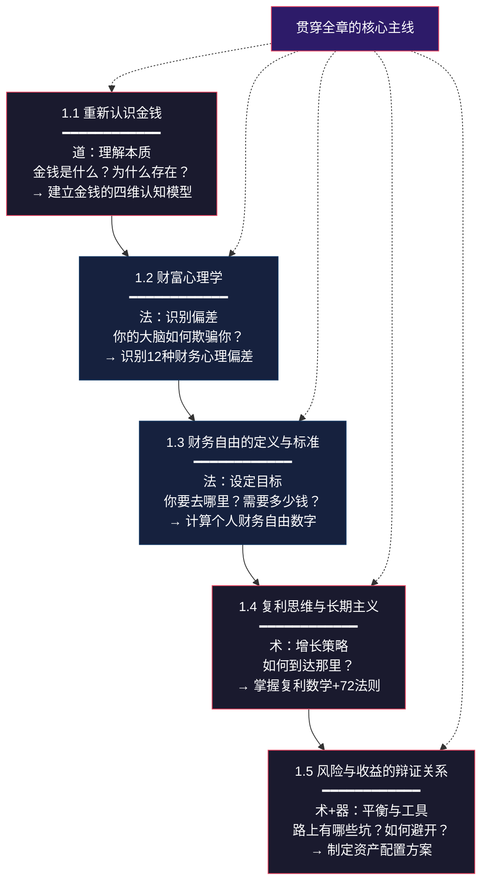

# 第一章：财富的本质与金钱观重塑 —— 本章小结

> "未经审视的人生不值得过。" —— 苏格拉底

本章是整本"搞钱指南"的地基。如果把财富增长比作盖楼，那么金钱观就是地基——地基不牢，地动山摇。这一小结不是简单的"划重点"，而是一次系统性的认知整合：帮你把散落在五个小节中的知识点串联成一张完整的思维网络，并通过自检工具确认你是否真正内化了这些内容。

---

## 一、全章知识架构总览

本章遵循"道→法→术→器"的递进逻辑，从最底层的认知重塑逐步推进到可操作的投资工具。下面这张图展示了五个核心模块之间的逻辑关系——每个模块都建立在前一个模块的基础之上，形成层层递进的认知阶梯。



**为什么是这个顺序？**

- 如果不理解金钱的本质（1.1），你就不明白为什么"创造价值"比"追逐金钱"更有效
- 如果不认识心理偏差（1.2），你设定了再好的目标也会被情绪化决策摧毁
- 如果没有清晰的财务自由目标（1.3），你的投资就缺乏方向，容易半途而废
- 如果不理解复利（1.4），你会低估时间的力量，迟迟不肯开始
- 如果不理解风险（1.5），你可能在追求收益的路上被一次重击打回原形

这五个模块不是孤立的知识点，而是一个**完整的操作系统**。下面逐一回顾每个模块的核心内容。

---

## 二、五大核心模块深度回顾

### 模块一：重新认识金钱 —— 从"赚钱"到"创造价值"

**本模块的核心命题：** 金钱不是目的，而是价值交换的媒介。赚钱的本质是创造价值，你为社会创造的价值越大，你能获得的金钱就越多。

**你必须记住的三个关键点：**

**1. 金钱的四维本质**

金钱不是一种"东西"，而是一个多维度的社会契约。从经济学、社会学、心理学三个视角来看：

| 维度 | 核心观点 | 实际意义 |
|------|---------|---------|
| 经济学 | 交易媒介、价值尺度、价值储存、延期支付标准 | 判断"什么算钱"——从贝壳到比特币都在执行这四个功能 |
| 社会学 | 一种信任协议，14亿人共同相信100元值100元 | 信任崩塌（恶性通胀）时，钱变成废纸 |
| 神经科学 | 多巴胺触发器，激活区域与毒品类似 | 解释"剁手"上瘾、赌博成瘾的生理机制 |
| 哲学 | 自由的度量衡，选择权的具象化 | 财务自由的本质是选择权，不是不工作 |

**2. 价值创造的三种模式**

这是理解"为什么有些人轻松赚钱，有些人辛苦一辈子却存不下钱"的关键：

| 模式 | 收入公式 | 天花板 | 典型代表 |
|------|---------|--------|---------|
| 卖时间 | 单价 × 时间 | 一天只有24小时 | 外卖骑手、普通上班族 |
| 卖技能/产品 | 单价 × 销量 | 突破时间限制 | 自由职业者、课程创作者、软件开发者 |
| 卖系统/平台 | 系统效率 × 规模 | 指数级增长 | 企业家、平台运营者、投资人 |

**关键认知跃迁：** 从"怎么赚钱"到"怎么创造价值"——这不是心灵鸡汤，而是极其务实的策略转变。当你把注意力从"收入"转移到"价值创造"时，你的收入天花板会被彻底打开。

**3. 金钱的时间价值**

今天的一块钱比明天的一块钱更值钱，原因有三：通货膨胀每年侵蚀2-5%的购买力；今天的一块钱可以投资产生收益；未来的钱存在拿不到的风险。复利公式 `FV = PV × (1 + r)^n` 是理解这一概念的核心工具——10万元按年化10%投资，30年后变成174.5万，其中前10年赚15.9万，最后10年赚107.2万。**时间是复利最大的杠杆。**

---

### 模块二：财富心理学 —— 识别大脑的"出厂设置"

**本模块的核心命题：** 你以为你在理性决策，其实你在被进化留给我们的"认知遗产"操控。这些偏差在原始社会很有用，在现代社会却会让你亏钱。

**四大核心心理偏差及应对策略：**

| 偏差 | 科学机制 | 危害表现 | 纠正方法 |
|------|---------|---------|---------|
| **稀缺心态** | 哈佛Mullainathan研究：降低认知能力≈智商下降13-14点 | 只关注眼前、忽略长远规划、不敢投资自己 | 每日感恩练习；拿出收入的5-10%投资自己；扩大社交圈 |
| **损失厌恶** | Kahneman前景理论：损失痛苦=2-2.5倍收益快乐 | 处置效应（卖盈持亏）、过度保守、追涨杀跌 | 理解风险≠亏损；长期视角（5-10年）；分散投资+设定止损 |
| **即时满足** | 棉花糖实验40年跟踪：延迟满足者全面优于即时满足者 | 月光、信用卡负债、错失复利 | 24小时法则；10-10-10法则；先储蓄再消费 |
| **锚定效应** | 决策过度依赖第一个接收到的信息 | 被"原价999现价199"欺骗；凭历史价格做投资决策 | 独立评估真实价值；关注基本面而非历史价格；设定预设标准 |

**进阶认知：金钱脚本理论**

心理学家Brad Klontz提出的"金钱脚本"（Money Scripts）理论揭示，每个人在7岁前就形成了关于金钱的潜意识信念。四种金钱脚本——金钱警觉、金钱回避、金钱崇拜、金钱地位——深刻影响着一生的财务行为。通过认知行为疗法和有意识的自我反思，可以在12-18个月内显著改变自己的金钱脚本。

**进阶认知：心理账户的善用**

理查德·塞勒的"心理账户"理论揭示，我们会给不同的钱贴上不同的"标签"。虽然这是一种"非理性"偏差，但可以反过来利用：信封预算法（将月收入分成不同"信封"）、大额消费的每日成本换算、意外之财的预分配方案——都是利用心理账户效应来改善理财行为的实用技巧。

---

### 模块三：财务自由 —— 定义你的"数字"

**本模块的核心命题：** 财务自由不是"有很多钱"，而是"被动收入≥生活开支"。没有清晰定义的目标，你永远不知道自己走到了哪里。

**四层财务自由框架：**

| 层次 | 被动收入要求 | 对应资产（按4%年化） | 生活状态 |
|------|------------|-------------------|---------|
| 第一层：基础自由 | 3,000-5,000元/月 | 100-200万 | 可以不工作，但生活较拮据 |
| 第二层：舒适自由 | 1-2万元/月 | 300-600万 | 体面生活，需要控制开支 |
| 第三层：富裕自由 | 5-10万元/月 | 1,500-3,000万 | 高品质生活，不用为钱发愁 |
| 第四层：绝对自由 | 无上限 | 5,000万以上 | 随心所欲，追求任何梦想 |

**你的财务自由数字计算公式：**

```text
财务自由所需资产 = 年生活开支 × 25
```

为什么是25倍？这是基于"4%法则"——来自Trinity Study的经典结论：如果你每年从投资组合中取出不超过4%（考虑通胀调整），你的钱大概率可以"永远"花不完。

**举例：** 月开支1万元 → 年开支12万 → 财务自由数字 = 12万 × 25 = 300万。

**重要提醒：** 财务自由≠不工作。它的本质是**选择权**——你可以选择做自己喜欢的工作，而不是被迫工作；可以选择不做不喜欢的事情；可以选择有更多时间陪伴家人。正如李笑来所说："财务自由不是终点，而是新的起点。"

---

### 模块四：复利思维与长期主义 —— 时间是你最大的杠杆

**本模块的核心命题：** 复利是世界第八大奇迹，但前提是你给它足够的时间。大多数人不是不懂复利，而是低估了时间的力量。

**复利三要素：** 本金（你的起点）、收益率（你的增长速度）、时间（你的坚持）。三者缺一不可，但时间是最不可替代的——你无法买到更多时间，只能尽早开始。

**72法则——心算复利的瑞士军刀：**

| 年化收益率 | 翻倍所需年数 | 实际场景举例 |
|-----------|-------------|------------|
| 3% | 24年 | 银行定期存款 |
| 5% | 14.4年 | 债券基金 |
| 8% | 9年 | 沪深300指数基金长期平均 |
| 10% | 7.2年 | 优质主动基金 |
| 12% | 6年 | 标普500历史平均 |

**复利的震撼对比——早开始10年的差距：**

每月定投3,000元，年化收益率8%：
- 投资30年：总投入108万 → 总资产约450万（复利收益342万，是本金的3倍多）
- 投资20年：总投入72万 → 总资产约176万
- 投资10年：总投入36万 → 总资产约55万

**30年 vs 20年的差距：** 多投10年（多投入36万），资产多出274万。最后10年的复利收益是前20年的1.6倍。

**长期主义的三个维度：**

1. **时间维度：** 接受短期波动，以年为单位评估投资表现，不追求短期暴利
2. **认知维度：** 持续学习提升认知，认知决定你能看到的机会和赚到的钱
3. **行动维度：** 知道不等于做到，行动比完美更重要，坚持比聪明更重要

**复利的"敌人"：** 通胀（每年侵蚀2-5%购买力）、交易成本（频繁交易的手续费和税费）、情绪决策（低点卖出、高点买入）。这三个敌人会从三个方向侵蚀你的复利收益，必须同时防范。

---

### 模块五：风险与收益 —— 理解不确定性，让它为你服务

**本模块的核心命题：** 风险不是"危险"，而是"不确定性"。管理风险的目的是让不确定性为你服务，而不是被它吓退。

**风险与收益的对应关系：**

| 投资品种 | 预期年化收益 | 风险等级 | 适合人群 |
|---------|------------|---------|---------|
| 银行存款 | 1-2% | 极低 | 保守型，短期资金 |
| 国债/货币基金 | 2-3% | 低 | 稳健型，应急资金 |
| 债券基金 | 4-6% | 中低 | 稳健型，中期目标 |
| 混合基金 | 6-10% | 中 | 平衡型，3-5年投资 |
| 股票基金/指数基金 | 8-15% | 中高 | 成长型，5年以上投资 |
| 个股 | -100%~∞ | 高 | 有经验的投资者 |
| 期货期权 | -∞~∞ | 极高 | 专业交易者 |

**五类风险的完整分类：**

| 风险类型 | 定义 | 能否分散 | 应对策略 |
|---------|------|---------|---------|
| 系统性风险 | 整个市场的风险（金融危机、政策变化） | 不能 | 资产配置跨类别（股+债+商品+现金） |
| 非系统性风险 | 单个公司的经营风险 | 能 | 分散持股（指数基金天然分散） |
| 流动性风险 | 资产无法快速变现 | 部分能 | 保留3-6个月应急资金在高流动性资产中 |
| 通胀风险 | 购买力被侵蚀 | 部分能 | 配置抗通胀资产（股票、房产、TIPS） |
| 行为风险 | 自己做出错误决策 | 能 | 建立投资纪律、自动定投、降低查看频率 |

**资产配置入门原则：**

- "100-年龄"法则：股票配置比例 = 100 - 年龄（30岁→70%股票+30%债券）
- 核心-卫星策略：80%配置低成本指数基金（核心），20%配置个股/行业基金（卫星）
- 定期再平衡：每年或每半年调整一次，让资产比例回到目标配置

**警惕"高收益低风险"骗局：** 如果一个投资机会听起来好得不像真的，那它很可能就不是真的。P2P年化15%以上→暴雷；资金盘月收益10-20%→庞氏骗局；虚拟币传销→包装成区块链的传销。

---

## 三、关键概念速查表

下表汇总了本章所有核心概念，可作为日常参考工具：

| 概念 | 定义 | 核心要点 | 章节来源 |
|------|------|---------|---------|
| 金钱的本质 | 价值交换的媒介，社会信任协议 | 赚钱的本质是创造价值 | 1.1 |
| 价值创造三模式 | 卖时间→卖技能/产品→卖系统/平台 | 从线性增长到指数增长的跃迁 | 1.1 |
| 稀缺心态 | 资源不足时产生的短视思维模式 | 降低认知能力≈智商下降13-14点 | 1.2 |
| 损失厌恶 | 对损失的痛苦感是获得快乐感的2-2.5倍 | 导致处置效应、过度保守、追涨杀跌 | 1.2 |
| 延迟满足 | 为了更大的未来收益放弃眼前享受 | 可训练的能力，40年跟踪验证有效 | 1.2 |
| 锚定效应 | 决策过度依赖第一个接收到的信息 | 消费和投资中都有强大影响 | 1.2 |
| 金钱脚本 | 7岁前形成的潜意识金钱信念 | 四类脚本：警觉/回避/崇拜/地位 | 1.2 |
| 心理账户 | 给不同来源的钱贴上不同"标签" | 可善用来改善理财行为 | 1.2 |
| 财务自由 | 被动收入≥生活开支的状态 | 四个层次，每个人的"数字"不同 | 1.3 |
| 4%法则 | 每年取出投资组合的4%可永续使用 | 来自Trinity Study，需注意中国适用性 | 1.3 |
| 复利效应 | 利息产生利息，实现指数级增长 | 时间是最大杠杆，起步越早优势越大 | 1.4 |
| 72法则 | 用72除以收益率得到翻倍年数 | 心算复利的实用工具 | 1.4 |
| 系统性风险 | 不能通过分散化消除的市场风险 | 所有投资者都要面对的风险 | 1.5 |
| 非系统性风险 | 可以通过分散化消除的个股风险 | 指数基金天然分散 | 1.5 |
| 资产配置 | 将资金分配到不同资产类别的策略 | 目标是最大化风险调整后收益 | 1.5 |

---

## 四、学习成果自检清单

完成本章学习后，用以下清单检验你的掌握程度。每一项都是本章的核心能力目标——如果你在某一项上打了"否"，建议回到对应章节重新学习。

### 认知层面

- [ ] **我能用自己的话解释"金钱的本质"**——不是背诵定义，而是能举出生活中的例子说明金钱为什么是"价值交换的媒介"
- [ ] **我能识别四种金钱脚本**——完成了金钱观自测，知道自己的主导脚本是什么，以及它如何影响了我的财务行为
- [ ] **我能区分稀缺心态和富足心态**——能回忆起自己最近一次被稀缺心态影响的具体场景
- [ ] **我理解损失厌恶的科学机制**——不是"知道"这个词，而是理解为什么2-2.5倍的比率会导致处置效应

### 能力层面

- [ ] **我计算了自己的财务自由数字**——知道自己的年生活开支、25倍数字、以及按当前储蓄率和预期收益率需要多少年才能达到
- [ ] **我能运用72法则**——心算任何收益率下的翻倍年数（例如：年化8%→9年翻倍）
- [ ] **我能评估自己的风险承受能力**——考虑了年龄、收入稳定性、家庭负担、心理承受力四个因素
- [ ] **我理解复利的"敌人"**——能说出通胀、交易成本、情绪决策这三个因素如何侵蚀复利收益

### 行动层面

- [ ] **我开始记账了**——至少使用了一个记账工具记录了本周的收支
- [ ] **我列出了自己的资产和负债清单**——知道自己的净资产是多少
- [ ] **我设定了一个具体的财务目标**——不是"我要变有钱"，而是"我要在X年内达到Y万的资产"
- [ ] **我了解了至少一种投资工具**——知道指数基金是什么、为什么适合初学者

---

## 五、行动清单：从知道到做到

> "知道不等于做到，做到不等于做好。" —— 本章最重要的认知

以下行动清单按时间维度分为四个阶段。每个阶段都有明确的执行标准和预期产出，不是"做不做"的问题，而是"什么时候做"的问题。

### 第一阶段：立即行动（今天，30分钟内）

| 行动 | 具体步骤 | 预期产出 | 检验标准 |
|------|---------|---------|---------|
| 完成金钱观自测 | 回到练习一，完成10道快速问答+金钱剧本识别 | 知道自己的主导金钱脚本 | 能说出"我是XX型金钱脚本" |
| 计算财务自由数字 | 年生活开支 × 25 = 你的数字 | 一个具体的数字 | 写下来贴在显眼的地方 |
| 开始记账 | 下载随手记/Money Pro，记录今天所有支出 | 第一天的记账记录 | 今天结束前完成 |

### 第二阶段：本周行动（2-3小时）

| 行动 | 具体步骤 | 预期产出 | 检验标准 |
|------|---------|---------|---------|
| 资产负债清单 | 列出所有资产（存款、投资、房产等）和负债（贷款、信用卡等） | 一张完整的资产负债表 | 知道自己的净资产 |
| 消费习惯分析 | 回顾过去3个月的银行流水，分类统计 | 消费结构饼图 | 知道钱花在了哪里 |
| 风险承受能力评估 | 完成本章的风险评估问卷 | 风险偏好等级 | 知道自己是保守/平衡/进取型 |

### 第三阶段：本月行动（投入500-1000元）

| 行动 | 具体步骤 | 预期产出 | 检验标准 |
|------|---------|---------|---------|
| 开通投资账户 | 选择一个平台（天天基金/蛋卷基金/支付宝），完成开户+风险测评 | 一个已激活的投资账户 | 能登录并查看账户 |
| 开始定投指数基金 | 选择沪深300或中证500指数基金，设置每月自动定投500-1000元 | 一个已设置的自动定投计划 | 第一笔定投已扣款 |
| 阅读一本投资书籍 | 从推荐书单中选一本，每天读30分钟 | 读完一本书+写了读书笔记 | 能复述书中的3个核心观点 |

### 第四阶段：持续行动（建立系统）

| 行动 | 频率 | 具体做法 | 预期效果 |
|------|------|---------|---------|
| 记账+复盘 | 每日记账，每月复盘 | 分析消费结构，识别可优化项 | 3个月内储蓄率提升5-10% |
| 学习投资知识 | 每周3-5小时 | 读1本投资书/听1门课程 | 6个月内建立完整的投资知识框架 |
| 审视资产配置 | 每半年一次 | 检查配置比例是否偏离目标，必要时再平衡 | 长期风险调整后收益最大化 |
| 更新财务自由进度 | 每年一次 | 重新计算财务自由数字和预期达成时间 | 看到自己在进步 |

---

## 六、常见问题深度解答

### Q1：我没有钱，怎么开始投资？

**A：** 这是初学者最常问的问题，但它的前提假设是错的——你不需要"有钱"才能开始投资。

**事实：** 很多基金定投的最低门槛是10元甚至1元。重要的是开始，而不是金额。每月定投500元，年化8%，30年后约74万——其中复利收益约56万，是本金的3倍多。

**具体行动方案：**
1. 今天：下载支付宝/天天基金，完成开户（10分钟）
2. 本周：选择一只沪深300指数基金，设置每月自动定投100元
3. 下个月：如果感觉良好，提高到300-500元
4. 关键心态：100元不是"太少"，而是"开始"。行为习惯的建立比金额重要100倍

### Q2：我害怕亏损，怎么办？

**A：** 你的恐惧来自两个误解：一是把"波动"等同于"亏损"，二是把"短期"等同于"永远"。

**数据事实：** 沪深300指数从2005年到2024年的20年间，经历了2008年金融危机（跌幅超60%）、2015年股灾（跌幅超40%）、2018年熊市（跌幅超30%），但20年累计收益仍然超过300%。**任何一个超过10年的持有期，股票指数基金都没有让投资者亏过钱。**

**具体应对策略：**
1. 把投资时间拉长到5-10年，短期波动就不那么可怕了
2. 分散投资：不要把所有钱投在一只基金上
3. 降低查看频率：以季度或年度为单位评估，不要每天看
4. 设定自动定投：无论涨跌都投，避免情绪化择时

### Q3：我应该投资什么？

**A：** 对于初学者，答案很明确：**从宽基指数基金定投开始。**

**为什么是指数基金？**
- 分散风险：一只基金持有几百只股票，不会因为单个公司暴雷而血本无归
- 费用低：管理费通常只有0.5%/年，远低于主动基金的1.5%
- 长期表现好：据统计，80%以上的主动基金长期跑不赢指数基金
- 不需要选股能力：买入即持有整个市场

**推荐起步方案：**
- 沪深300指数基金（代表A股最大的300家公司）
- 中证500指数基金（代表A股中等规模的500家公司）
- 各配50%，每月等额定投

### Q4：我需要多少年才能实现财务自由？

**A：** 这取决于四个变量：你的收入、支出、储蓄率和投资收益率。下面是一个具体的计算框架：

**Step 1：** 计算你的财务自由数字（年开支 × 25）
**Step 2：** 计算你的年储蓄额（年收入 - 年支出）
**Step 3：** 用以下公式估算所需年数：

```text
所需年数 ≈ log(目标资产 × 收益率 / 年储蓄 + 1) / log(1 + 收益率)
```

**速查表（假设年化收益率8%，从0开始）：**

| 月储蓄额 | 财务自由数字300万 | 财务自由数字500万 |
|---------|-----------------|-----------------|
| 2,000元 | 约30年 | 约35年 |
| 5,000元 | 约21年 | 约26年 |
| 8,000元 | 约17年 | 约22年 |
| 15,000元 | 约13年 | 约17年 |

**关键结论：** 提高储蓄率（同时增加收入和减少支出）比提高收益率更可控、更有效。

### Q5：我应该如何开始？有没有一个"最小可行方案"？

**A：** 如果你只做一件事，就做这件事：**今天设置工资自动转出30%到一个单独的储蓄/投资账户。**

**完整最小可行方案（本周内完成）：**

1. **今天（10分钟）：** 完成金钱观自测，写下你的财务自由数字
2. **明天（30分钟）：** 下载记账App，设置工资到账自动转出30%
3. **本周末（1小时）：** 开通基金账户，设置每月自动定投
4. **本月内（每天10分钟）：** 坚持记账，了解你的消费结构
5. **持续：** 每月花1小时复盘，每半年调整一次资产配置

不要等到"准备好了"再开始——你永远不会"准备好"。种一棵树最好的时间是十年前，其次是现在。

---

## 七、本章金句与深度解读

> **"赚钱的本质不是'抢钱'，而是'创造价值'。你为社会创造的价值越大，你能获得的金钱就越多。"**

**深度解读：** 这句话不只是道德说教，而是一个极其务实的商业逻辑。市场经济的本质是自愿交换——没有人会强迫别人给你钱，除非你提供了对方认为值得交换的价值。把注意力从"怎么从别人口袋里掏钱"转移到"怎么为别人创造不可替代的价值"，你会发现赚钱的路突然变宽了。

> **"复利是世界第八大奇迹。理解它的人赚取它，不理解它的人支付它。" —— 常被归于爱因斯坦**

**深度解读：** "不理解它的人支付它"——这句话才是重点。你的房贷利息、信用卡分期手续费、消费贷利率，本质上都是你在为别人的复利"买单"。理解复利，不仅意味着用它来增长财富，更意味着避免成为别人复利收益的"原料"。

> **"人们对损失的痛苦感，是获得同等收益快乐感的2-2.5倍。" —— 丹尼尔·卡尼曼**

**深度解读：** 这个比率解释了90%的非理性投资行为。为什么你死守亏损的股票？因为卖出=确认亏损=2.5倍的痛苦。为什么你急着卖出盈利的股票？因为持有=可能回吐利润=预期中的2.5倍痛苦。认识到这一点，你就有了对抗它的第一步武器。

> **"财务自由不是终点，而是新的起点。它给你的不是不用工作的权利，而是选择做什么工作的自由。"**

**深度解读：** 很多人把财务自由想象成"躺平"，但真正实现财务自由的人几乎都还在工作——区别在于他们做的是自己热爱的事情，而不是被账单逼迫的事情。财务自由消除的不是工作，而是被迫感。

> **"种一棵树最好的时间是十年前，其次是现在。"**

**深度解读：** 在复利的世界里，时间是你最稀缺的资源。25岁开始每月投2000元和35岁开始每月投2000元，到60岁时的差距是惊人的——前者约540万，后者约220万。差10年起步，最终差了320万。这就是为什么"现在开始"比"等有钱了再开始"重要100倍。

---

## 八、推荐学习资源

### 书籍推荐（按难度递进）

**入门级——建立基础认知：**

| 书名 | 作者 | 核心价值 | 推荐理由 |
|------|------|---------|---------|
| 《富爸爸穷爸爸》 | 罗伯特·清崎 | 资产vs负债的现金流思维 | 金钱观重塑的第一本书，颠覆"好好读书→好工作→存钱"的传统路径 |
| 《小狗钱钱》 | 博多·舍费尔 | 用童话故事讲理财入门 | 通俗易懂，适合零基础读者，也是很好的亲子财商读物 |
| 《金钱心理学》 | 摩根·豪塞尔 | 财富背后的心理和行为因素 | 2020年出版，融合了行为经济学最新研究，案例生动 |

**进阶级——深化理解：**

| 书名 | 作者 | 核心价值 | 推荐理由 |
|------|------|---------|---------|
| 《穷查理宝典》 | 查理·芒格 | 多元思维模型+投资哲学 | 巴菲特搭档的智慧精华，教你用多学科视角看问题 |
| 《思考，快与慢》 | 丹尼尔·卡尼曼 | 系统1和系统2的决策机制 | 行为经济学奠基之作，理解人类决策偏差的必读书 |
| 《稀缺》 | 塞德希尔·穆来纳森 | 稀缺心态如何俘获注意力 | 深入理解"穷人为什么穷"的认知机制 |

**投资类——实操指南：**

| 书名 | 作者 | 核心价值 | 推荐理由 |
|------|------|---------|---------|
| 《聪明的投资者》 | 本杰明·格雷厄姆 | 价值投资的圣经 | 巴菲特称之为"有史以来最伟大的投资书" |
| 《漫步华尔街》 | 伯顿·马尔基尔 | 指数投资的理论基础 | 用数据证明：大多数主动投资者不如买指数基金 |
| 《投资最重要的事》 | 霍华德·马克斯 | 风险管理和逆向思维 | 每一封信都值得反复读，巴菲特"第一时间打开"的备忘录 |

### 在线课程

| 课程 | 平台 | 特点 | 适合人群 |
|------|------|------|---------|
| Financial Markets | Coursera（耶鲁大学） | Nobel奖得主Robert Shiller亲授，免费 | 想系统学习金融市场的人 |
| 《香帅的北大金融学课》 | 得到App | 中文讲解，贴近中国实际 | 习惯音频学习的上班族 |
| 雪球投资课程 | 雪球 | 实战导向，社区讨论 | 有一定基础想实操的人 |

### 实用工具

| 类别 | 工具 | 用途 | 推荐理由 |
|------|------|------|---------|
| 记账 | 随手记 | 日常收支记录 | 国内用户最多，功能全面 |
| 记账 | Money Pro | 预算管理 | 界面美观，预算功能强 |
| 投资 | 天天基金 | 基金购买 | 基金种类最全，费率低 |
| 投资 | 蛋卷基金 | 组合投资 | 有现成的资产配置组合 |
| 投资 | 雪球 | 投资社区 | 信息丰富，可以看别人的投资逻辑 |
| 数据 | 东方财富 | 行情数据 | 数据最全，更新最快 |

---

## 九、下一章预告

在下一章中，我们将深入探讨**财富增长的底层逻辑**，包括：

1. **收入的三种类型：** 主动收入、组合收入、被动收入——理解它们的区别，才能选择正确的财富增长路径
2. **资产与负债的重新定义：** 从现金流视角看资产和负债——你的自住房到底是资产还是负债？
3. **财富增长的四个阶段：** 积累期、加速期、杠杆期、自由期——每个阶段有不同的策略重点
4. **个人商业模式升级：** 从卖时间到卖产品/服务——具体的升级路径和方法论
5. **认知变现的底层逻辑：** 信息差、认知差、执行差——为什么有些人能"看到"机会而你不能

这些内容将帮助你建立系统的财富增长框架，把本章学到的"道"转化为下一章的"法"和"术"。

---

> **学习建议：** 本章是全书的认知地基，建议至少精读两遍。第一遍通读，建立整体框架；第二遍配合练习，逐个击破。将知识转化为行动，才是学习的真正目的。如果自检清单中有3项以上打了"否"，强烈建议重读对应章节后再进入下一章。
