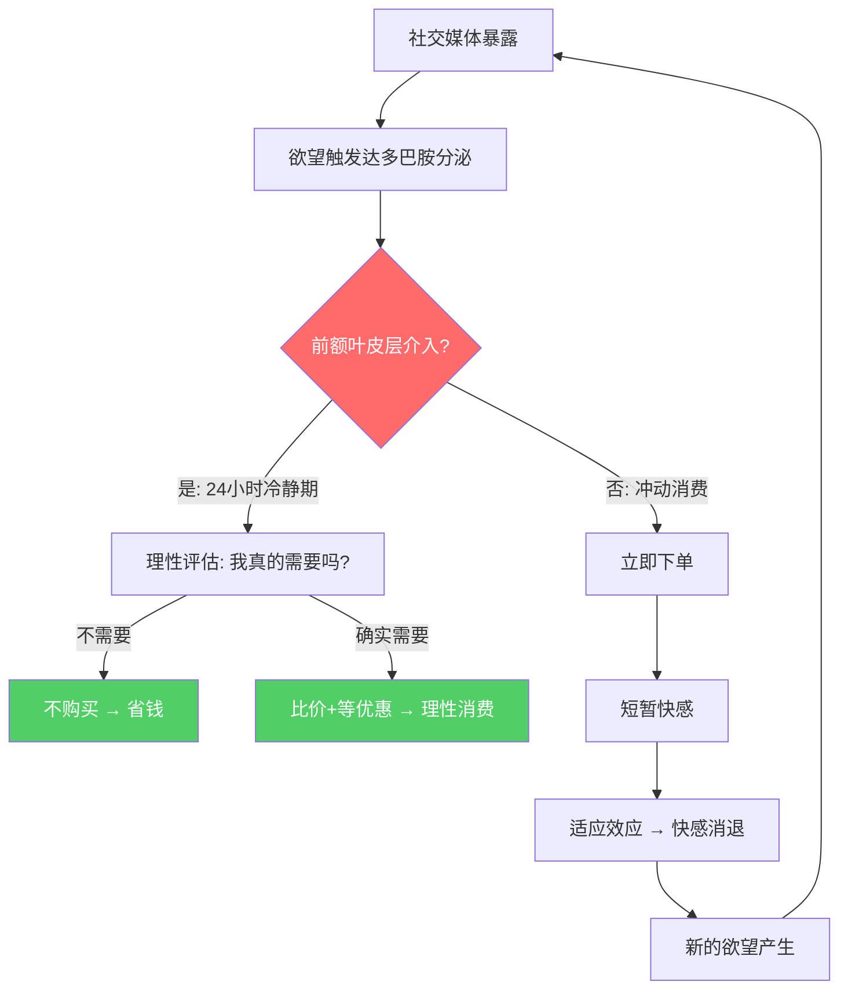
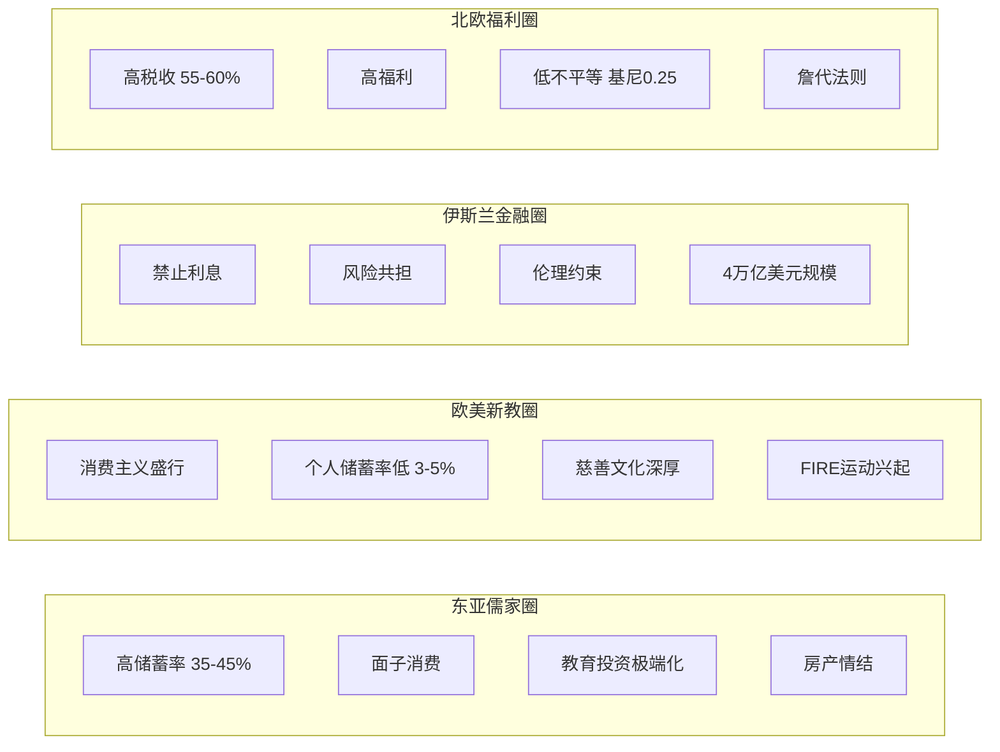
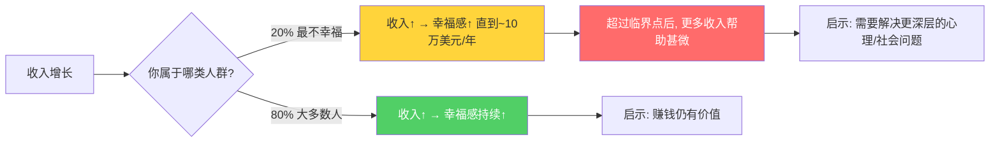
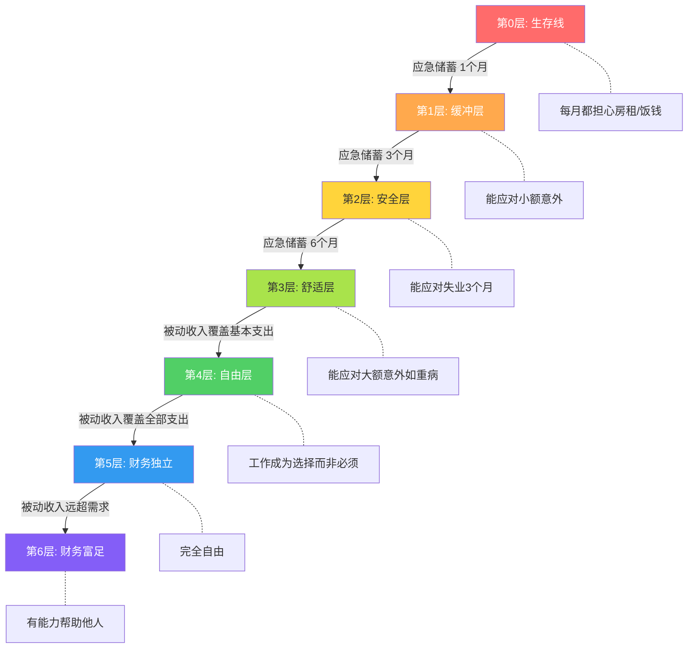
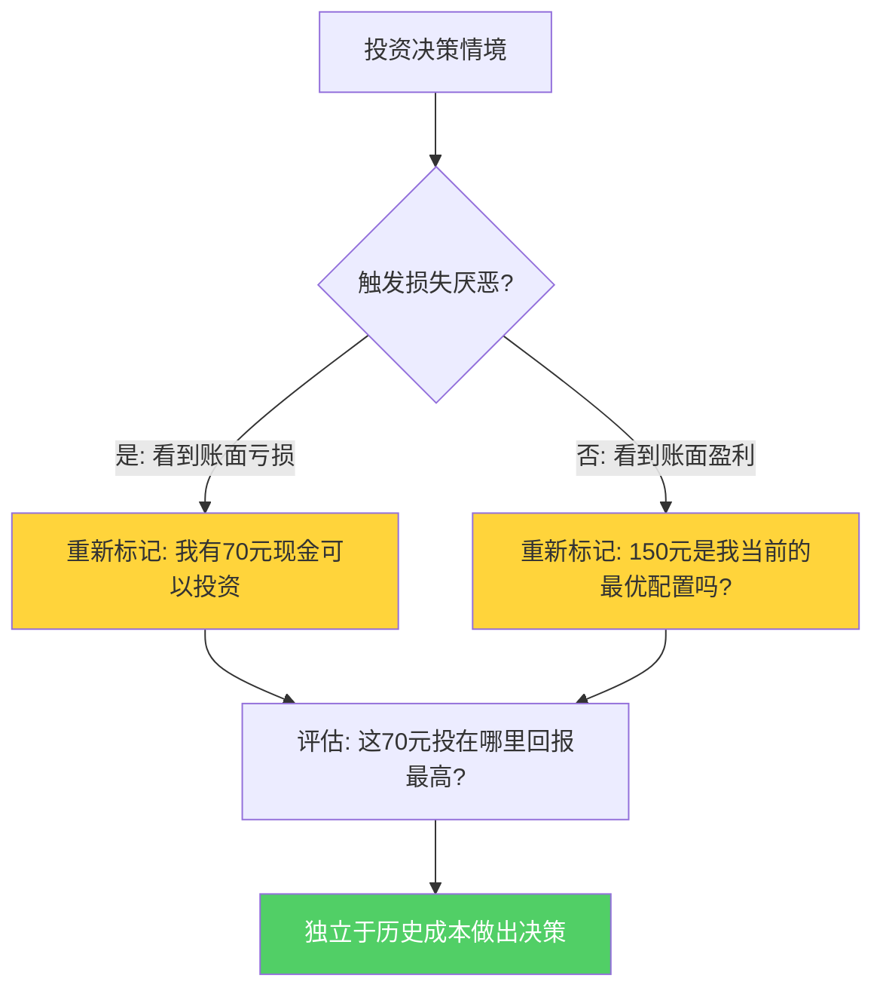

# 深度拓展：财富的本质与金钱观重塑

本章是第一章的纵深延伸，旨在从心理学、神经科学、行为经济学、文化比较、社会学和哲学等多个维度，构建一个完整的"金钱认知"知识体系。阅读本章后，你将不仅理解"钱是什么"，更能看清"钱如何塑造你的思维、行为和人生选择"，以及"如何主动重塑这种关系"。

---

## 一、金钱心理学的深度解析

### 1.1 金钱在人类心理中的原始编码

金钱并非人类文明诞生之初就存在的概念。从进化心理学的角度来看，人类对"资源获取"的本能驱动力深植于我们的基因之中。在原始社会中，食物、领地和配偶是最核心的生存资源，而我们的大脑发展出了一套复杂的奖赏机制来驱动我们去获取这些资源。当人类社会发展出货币体系之后，金钱作为一种"万能交换媒介"，完美地嫁接到了这套古老的奖赏系统之上。

神经科学研究表明，当人们获得金钱时，大脑中的伏隔核（nucleus accumbens）会被激活，释放多巴胺——这与获得食物、性等基本生存资源时的大脑反应完全一致。斯坦福大学的布莱恩·克努森（Brian Knutson）教授通过fMRI实验发现，仅仅是预期获得金钱奖励，就能显著激活大脑的伏隔核区域。这解释了为什么"赚钱"本身就能带来快感——它触发的是我们最原始的神经奖赏回路。

更有趣的是，金钱对大脑的影响具有"双刃剑"效应。一方面，它能激发人的积极性和创造力；另一方面，对金钱的过度追求会激活杏仁核（amygdala），引发焦虑和恐惧情绪。普林斯顿大学的安格斯·迪顿（Angus Deaton）和丹尼尔·卡尼曼（Daniel Kahneman）在2010年的经典研究中发现，当年收入超过75,000美元（按购买力折算约合2024年的100,000美元）之后，更多的收入对日常情绪幸福感的提升效果微乎其微。这说明金钱对心理的影响存在一个"临界点"——在这个点之前，金钱的增加显著改善生活质量；超过这个点之后，边际效应急剧递减。

#### 神经经济学视角：金钱与大脑的完整图谱

金钱对大脑的影响不仅限于伏隔核和杏仁核，还涉及一个复杂的神经网络：

| 脑区 | 功能 | 与金钱相关的反应 | 关键研究 |
|------|------|------------------|----------|
| **伏隔核** | 奖赏与愉悦 | 预期和获得金钱时激活 | Knutson et al., 2001 |
| **前额叶皮层** | 理性决策与规划 | 财务规划和延迟满足时激活 | Bechara, 2005 |
| **脑岛（Insula）** | 痛觉与厌恶 | 支付金钱时激活（"花钱的痛感"） | Prelec & Loewenstein, 1998 |
| **杏仁核** | 恐惧与威胁 | 财务损失和不确定性时激活 | De Martino et al., 2006 |
| **前扣带回皮层** | 冲突监测 | 在"想买"与"该省"之间挣扎时激活 | Botvinick et al., 2004 |
| **腹侧苍白球** | 习惯形成 | 重复消费模式时激活 | O'Doherty et al., 2004 |

这个神经网络解释了许多看似"非理性"的财务行为：当你的伏隔核在兴奋地期待购物快感时，前额叶皮层可能正在被边缘系统"压制"——这就是为什么冲动消费如此常见，也是为什么"冷静期"策略有效（它给了前额叶皮层重新接管控制权的时间窗口）。

### 1.2 金钱脚本理论

心理学家布拉德·克朗茨（Brad Klontz）提出了"金钱脚本"（Money Scripts）理论，认为每个人从小在家庭和文化环境中形成的关于金钱的潜意识信念，深刻影响着其一生的财务行为。他将金钱脚本分为四大类：

**金钱警觉脚本（Money Vigilance）**：持有这类脚本的人对金钱高度谨慎，倾向于储蓄而非消费，对财务信息保持高度敏感。这种脚本的积极面是能促进良好的储蓄习惯，但过度发展可能导致"守财奴"心态——即使拥有足够财富也无法享受生活，甚至在基本需求上过度节省而损害生活质量。典型表现：明明有足够的钱，却在点餐时永远选最便宜的；即使生病也不愿花钱看医生。克朗茨的研究发现，约30%的高净值人群存在轻度至中度的金钱警觉过度问题。

**金钱回避脚本（Money Avoidance）**：持有者潜意识认为"金钱是万恶之源"或"有钱人是贪婪的"。这种脚本往往源于童年时期目睹因金钱引发的家庭冲突——比如父母为钱吵架，或者亲戚因遗产反目。其结果是，这类人在无意识中会"推开"财富——可能在收入达到某个水平后自毁前程（迟到、拖延、与上级冲突），或者在获得意外之财后迅速挥霍，潜意识中觉得"持有太多钱是不道德的"。一个典型的案例：某位年收入50万的律师，总是不自觉地在重要案件中犯错，心理治疗揭示其童年经历——父亲因事业成功而抛妻弃子，他潜意识中将"有钱"与"被抛弃"画上了等号。

**金钱崇拜脚本（Money Worship）**：持有者相信"只要有钱，一切问题都能解决"。这种脚本驱使人不断追求更多财富，但永远无法满足——因为"下一个数字"才是"足够"。研究显示，金钱崇拜脚本与过度消费、信用卡债务和工作倦怠呈正相关。具有这种脚本的人往往在物质充裕后仍然感到空虚，因为他们将所有人生问题都归因于"钱不够"，从而回避了真正的心理议题。典型表现：工作狂、忽视家庭关系、在达到一个财务目标后立即设定更高的目标而不允许自己享受成果。

**金钱地位脚本（Money Status）**：持有者将自我价值与财务状况等同，认为"你的钱就是你的价值"。这种脚本最容易导致炫耀性消费和攀比心理，在社交媒体时代尤为普遍。典型表现：购买超出经济能力的奢侈品、频繁在社交媒体晒消费、因为收入不如同龄人而感到自卑。一项2021年的研究发现，金钱地位脚本得分最高的人群，其信用卡债务平均是其他人群的3.2倍，而生活满意度却显著更低。

#### 如何识别自己的主导金钱脚本

克朗茨开发了标准化的"金钱脚本量表"（Klontz Money Script Inventory, KMSI），包含48个自评题目。以下是每类脚本的几个核心自评问题（5分制，从"强烈不同意"到"强烈同意"）：

**金钱警觉识别题：**
- "我很少谈论金钱相关的话题"
- "我不信任任何人帮我管理财务"
- "我担心自己攒的钱不够"

**金钱回避识别题：**
- "有钱人通常不诚实"
- "我不想让别人知道我有多少钱"
- "金钱是大多数问题的根源"

**金钱崇拜识别题：**
- "如果我有更多的钱，我的问题就解决了"
- "我的生活会更好，如果我能赚更多的钱"
- "钱永远不够"

**金钱地位识别题：**
- "我用拥有的东西来衡量自己的成功"
- "别人会通过我的财务状况来评价我"
- "我需要买好东西来给别人留下好印象"

了解自己的主导金钱脚本，是重塑健康金钱观的第一步。克朗茨的研究表明，通过认知行为疗法和有意识的自我反思，人们可以在12-18个月内显著改变自己的金钱脚本，从而改善财务行为。

### 1.3 心理账户与金钱的"标签化"

诺贝尔经济学奖得主理查德·塞勒（Richard Thaler）提出的"心理账户"（Mental Accounting）理论，揭示了人类对待金钱的一个根本性认知偏差：我们会给不同的钱贴上不同的"标签"，即使金钱本身是完全可互换的。

经典实验：研究者问两组人是否愿意花15美元去看一场电影。第一组被告知他们昨天刚花150美元买了一张音乐会门票；第二组被告知他们昨天刚丢了150美元。结果第一组更不愿意花钱看电影（"我已经花了太多娱乐费用"），而第二组则更愿意花钱（"反正已经亏了，不差这点"）。从经济学角度看，两种情境完全等价——都是"昨天损失了150美元"——但心理账户的"标签"不同，导致了截然相反的行为。

在个人理财中，心理账户的影响无处不在：

- **年终奖效应**：人们倾向于把年终奖当作"意外之财"，花起来比正常工资更随意，即使两者在经济学上完全等价。一项对中国白领的调查显示，年终奖的储蓄率仅为正常工资储蓄率的40%，而奢侈消费占比是正常工资的2.3倍。
- **信用卡效应**：使用信用卡消费时，大脑的"疼痛感"（脑岛激活）比现金支付显著降低，导致消费金额增加12-18%。MIT的Drazen Prelec和Duncan Simester通过实验证明，使用信用卡的消费者愿意为同一商品支付比现金消费者高出60-100%的价格。
- **储蓄罐效应**：为特定目标设立专门的储蓄账户（如旅行基金、教育基金），虽然在利息收益上不如统一管理，但因为利用了心理账户效应，反而更容易实现储蓄目标。
- **"赌场的钱"效应（House Money Effect）**：当人们在赌博或投资中获利后，倾向于将盈利视为"赌场的钱"，从而冒更大的风险。这解释了为什么许多初入股市的新手在首次获利后会过度交易——他们把盈利当作"免费的钱"，降低了风险意识。

### 1.4 数字时代的金钱心理学

互联网和金融科技的发展，深刻改变了人类与金钱的互动方式，并催生了全新的心理陷阱。

#### "先买后付"（BNPL）的心理陷阱

"先买后付"服务（如花呗、白条、Afterpay、Klarna）在本质上是一种"延迟支付的心理账户"——它把"现在花钱"和"现在痛苦"分离开来，从而大幅降低了消费时的心理阻力。研究表明：

- 使用BNPL服务的消费者，平均每次消费金额比使用信用卡高18%，比使用现金高35%
- 约60%的BNPL用户表示，他们会购买"如果没有BNPL就不会买"的商品
- BNPL的分期机制利用了"分割收益、整合损失"的心理原则——把一笔大额支出分成多笔小额"无痛"支出

对抗BNPL陷阱的核心方法：在使用任何分期服务之前，先问自己"如果必须一次性全额支付，我还会买吗？"如果答案是否定的，那么分期只是在掩盖一个不应该发生的消费决策。

#### 加密货币与投机心理学

加密货币市场的暴涨暴跌，为研究"投机心理"提供了前所未有的案例。以下是几个关键心理机制：

**FOMO（Fear of Missing Out，错失恐惧）**：当看到身边的人在加密货币中暴富时，大脑的社会比较机制会被强烈激活，产生"如果我不参与就会被落下"的焦虑。这种焦虑往往在市场高点时最为强烈——因为此时的"暴富故事"最多。

**叙事经济学**：诺贝尔奖得主罗伯特·席勒（Robert Shiller）提出的"叙事经济学"指出，经济行为往往受"故事"驱动而非数据。加密货币市场的"去中心化革命""数字黄金""Web3改变世界"等叙事，为投机行为提供了强大的心理合法性外衣——人们不是在"赌博"，而是在"投资未来"。

**锚点错乱**：加密货币的高波动性导致人们的"心理锚点"不断变化。当比特币从69,000美元跌到30,000美元时，已经持有比特币的人会将其锚定在69,000美元，觉得"亏了一半"而不愿卖出；而空仓者则觉得"已经很便宜了"——两者都不是基于理性估值。

#### 社交媒体与消费主义

社交媒体不仅是信息平台，更是一个精密的"欲望制造机"。以下是社交媒体影响消费决策的主要路径：

- **算法推荐的信息茧房**：推荐算法倾向于展示消费类内容（因为此类内容互动率高），导致用户不断暴露在"种草"信息中
- **KOL的信任嫁接**：用户对喜欢的博主的信任，会无意识地转移到博主推荐的商品上，形成"信任消费"
- **社交证明与从众效应**：看到"10万人已购买"的标签，购买决策的天平会大幅倾斜
- **即时满足的标准化**：快速下单→快速到货的闭环训练，降低了延迟满足的能力

---

## 二、不同文化的金钱观比较

### 2.1 东亚儒家文化圈：勤俭与面子的双重奏

东亚地区的金钱观深受儒家思想影响，呈现出鲜明的二元特征。一方面，"勤俭持家""俭以养德"的训诫深入骨髓，东亚国家的储蓄率在全球名列前茅（中国家庭储蓄率约35-45%，日本约28%，韩国约35%）。另一方面，"面子文化"催生了强烈的炫耀性消费动机——在婚礼、丧礼、节日等社交场合的支出往往远超理性水平。

中国传统文化中的金钱观尤其复杂。"君子喻于义，小人喻于利"的儒家训诫与"人为财死，鸟为食亡"的民间智慧并存，形成了一种"口头上鄙视金钱，行动上追求财富"的独特张力。这种张力在当代中国社会表现为：人们在公开场合倾向于淡化对金钱的重视，但在私下的财务决策中却高度务实。

中国的"房奴"现象也是这种文化张力的产物：住房在中国不仅是居住需求，更是婚姻市场的"入场券"和家庭社会地位的象征。丈母娘经济学、彩礼文化、学区房焦虑，都是东亚金钱观在住房领域的集中体现。

日本的金钱观则体现了另一种独特的文化融合。一方面，日本文化中的"もったいない"（不要浪费）精神促进了极高的资源利用效率和储蓄习惯；另一方面，泡沫经济时代的记忆使得日本年轻一代出现了"低欲望"倾向——不买房、不结婚、不消费，对投资和财富积累持消极态度。这种"低欲望"并非不渴望更好的生活，而是对"努力就能成功"这一叙事的集体幻灭。

韩国社会的"빨리빨리"（快快快）文化则催生了一种"快速致富"心态，这在韩国股市极高的散户交易率和加密货币参与率中得到充分体现。韩国散户占股市交易量的60%以上，加密货币参与率一度高达30%以上——远超全球平均水平。"东学（동학）散户运动"一词的诞生，反映了韩国年轻人将股市投资视为对抗阶层固化的"最后机会"。

### 2.2 欧美新教伦理：劳动天职与延迟享受

马克斯·韦伯在《新教伦理与资本主义精神》中深刻阐述了新教（尤其是加尔文教派）如何塑造了西方的金钱观。核心理念包括：

**劳动天职观**：工作不仅是谋生手段，更是上帝赋予的"天职"（calling）。尽职尽责地工作、创造财富，被视为荣耀上帝的行为。这种观念消除了传统基督教对财富的道德怀疑，为资本主义精神提供了伦理基础。

**禁欲主义消费观**：赚钱是美德，但奢侈消费是罪恶。这种"努力赚、省着花"的伦理，直接促进了资本积累。韦伯指出，正是这种"赚钱但不花钱"的悖论，使得大量资本被投入到再生产中，推动了资本主义的蓬勃发展。

**信托责任观**：财富被视为上帝暂时托付给个人管理的资源，而非可以随意挥霍的私有物。这种"受托人"意识在西方慈善文化中有深刻体现——比尔·盖茨、沃伦·巴菲特等超级富豪的"捐赠誓言"（Giving Pledge）可以追溯到这一传统。

然而，当代西方社会的金钱观正在经历深刻变革。消费主义文化在很大程度上取代了新教禁欲伦理，美国个人储蓄率从1960年代的12%下降到2020年代的3-5%。同时，千禧一代和Z世代中兴起的"FIRE运动"（财务独立、提前退休）可以看作是对新教伦理的一种回归——通过极度节俭和高储蓄率，在40岁之前实现财务自由。但FIRE运动也引发了争议：支持者认为它是对消费主义的反叛，批评者则指出它只适用于高收入群体，是另一种形式的"幸存者偏差"。

### 2.3 伊斯兰金融伦理：禁止利息的替代方案

伊斯兰教对金钱有独特的规定，其中最核心的是"里巴"（Riba，利息）禁令。《古兰经》明确规定："真主准许买卖，而禁止利息。"这一原则催生了一整套独特的伊斯兰金融体系：

**穆拉巴哈（Murabaha）**：成本加价销售。银行购买客户所需商品，然后以加价方式转售给客户，客户分期付款。这在经济效果上类似于贷款利息，但在法律形式上是商品交易。

**穆沙拉卡（Musharakah）**：合伙制。银行与客户共同投资一个项目，共享利润、共担风险。这种模式更接近股权投资而非债权投资。

**苏库克（Sukuk）**：伊斯兰债券。与传统债券不同，苏库克代表的是对实物资产的所有权份额，其收益来自资产的使用费而非利息。

据统计，全球伊斯兰金融资产在2023年已超过4万亿美元，覆盖80多个国家。这种"金融伦理化"的趋势对全球金融体系产生了深远影响——特别是在2008年金融危机之后，很多人开始反思传统金融体系的弊端，伊斯兰金融的风险共担原则获得了更多关注。

### 2.4 北欧福利模式：高税收、高福利与幸福指数

北欧国家（丹麦、瑞典、挪威、芬兰、冰岛）代表了一种截然不同的金钱观：通过高税收（边际税率可达55-60%）实现高福利（免费教育、免费医疗、慷慨的失业保险和育儿假），从而在整体层面提升国民幸福感。

这种模式的哲学基础是"詹代法则"（Janteloven）——"不要以为你比别人特殊"。在这种文化中，过度炫富被视为不礼貌，成功和财富应低调处理。挪威甚至有一个词"janteloven"来描述这种"不要自以为是"的社会规范。

北欧模式的成效是有目共睹的：这些国家常年占据全球幸福指数排行榜前列，基尼系数普遍在0.25-0.28之间（远低于全球平均水平），社会流动性也很高。然而，批评者指出，这种模式可能抑制创新和个人奋斗精神——北欧国家的亿万富翁密度确实低于美国。

### 2.5 文化比较总览

| 维度 | 东亚儒家 | 欧美新教 | 伊斯兰 | 北欧福利 |
|------|----------|----------|--------|----------|
| **核心价值** | 勤俭持家+面子 | 劳动天职+消费自由 | 风险共担+伦理约束 | 平等+福利保障 |
| **储蓄率** | 35-45% | 3-8% | 15-25% | 10-15% |
| **投资偏好** | 房产>储蓄>股票 | 股票>房产>储蓄 | 伊斯兰金融产品 | 养老基金>股票 |
| **消费驱动力** | 面子+实用 | 品质+体验 | 需求驱动 | 功能驱动 |
| **债务态度** | 谨慎（房贷除外） | 普遍接受 | 避免利息 | 谨慎 |
| **慈善参与** | 较低 | 高（尤其美国） | 义务性（天课） | 通过税收实现 |
| **社会流动性** | 教育驱动 | 资本驱动 | 宗教网络 | 制度保障 |

---

## 三、金钱与幸福感的科学研究

### 3.1 "伊斯特林悖论"及其修正

1974年，经济学家理查德·伊斯特林（Richard Easterlin）提出了一个震撼学界的发现：在一个国家内部，收入较高的人确实报告更高的幸福感；但跨国比较或跨时间比较时，国家整体收入的增长并不带来幸福感的同步提升。这就是著名的"伊斯特林悖论"（Easterlin Paradox）。

以日本为例：1958-1987年间，日本人均实际收入增长了约5倍，但报告"非常幸福"的人口比例几乎没有变化。类似的现象在美国也被观察到——1972-2006年间，美国人均GDP翻了一番，但声称"非常幸福"的人口比例从30%下降到29%。

然而，2008年以来的研究对伊斯特林悖论提出了挑战。经济学家贾斯汀·沃尔弗斯（Justin Wolfers）和贝齐·史蒂文森（Betsey Stevenson）使用更广泛的数据集发现，无论是在国家内部还是跨国比较中，收入与幸福感之间都存在正相关，且没有发现"临界点"。他们的结论是：伊斯特林悖论可能只是数据质量问题导致的统计假象。

2023年，马修·基林斯沃思（Matthew Killingsworth）和丹尼尔·卡尼曼联合发表的研究提供了一个更精细的答案：对大多数人而言，收入与幸福感之间的关系确实是单调递增的；但对约20%最不幸福的人群而言，收入增加对幸福感的提升确实存在一个约100,000美元/年的临界点——超过这个点后，更多的钱对他们的幸福感几乎没有帮助。

### 3.2 相对收入与社会比较

大量研究表明，相对于绝对收入，相对收入（即与周围人的比较）对幸福感的影响更大。这可以用"社会比较理论"（Social Comparison Theory）来解释——人类天生倾向于通过与他人比较来评估自身状况。

经典研究案例：哈佛大学的经济学家索拉布·莱文（Sara Solnick）和大卫·赫蒙恩（David Hemenway）进行了一个实验，让受访者在两个选项中选择：
- A：你年收入50,000美元，其他人年收入25,000美元
- B：你年收入100,000美元，其他人年收入200,000美元

结果令人震惊：56%的受访者选择了A——宁愿自己赚得少，只要比别人多。这个发现揭示了一个深刻的心理真相：人类追求的往往不是绝对的富裕，而是相对的优势。

社交媒体时代极大地放大了这种社会比较效应。研究发现，频繁使用Facebook、Instagram等社交平台的人，更容易出现"攀比性焦虑"——因为他们不断接触到经过精心筛选和美化的生活展示。一项2022年的研究发现，每增加1小时的社交媒体使用时间，个人对自身财务状况的满意度下降约5%。

**对抗社会比较的实用策略：**

1. **向上比较→向下比较**：有意识地与条件不如自己的人比较（这不是幸灾乐祸，而是校准视角）。全球范围内，年收入超过35,000美元就已跻身全球最富有的4%。
2. **缩小比较范围**：只与自己过去的表现比较（"我比去年进步了吗？"），而非与他人的"展示面"比较。
3. **信息斋戒**：定期（如每周末）完全断开社交媒体，重建对"正常生活"的感知。
4. **感恩练习**：每天记录3件值得感恩的事。研究表明，持续8周的感恩练习能显著降低社会比较倾向。

### 3.3 经验消费vs物质消费

心理学研究一致表明，在提升幸福感方面，"体验型消费"（如旅行、学习、社交活动）比"物质型消费"（如名牌包、豪车、豪宅）更有效。康奈尔大学的托马斯·吉洛维奇（Thomas Gilovich）教授对此进行了长达20年的系统研究，他总结出三个主要原因：

**适应效应更慢**：人们会很快适应新的物质财富（"享乐适应"），但对美好经历的记忆却会随着时间推移而变得更加积极（"玫瑰色回忆"效应）。一辆新车带来的兴奋感通常在3-6个月内消退；但一次深入的文化旅行体验，回忆的甜蜜度可能在5年后反而更高。

**社会连接更强**：体验型消费通常涉及与他人的互动，而社会关系是幸福感最重要的预测因子之一。物质消费则往往是孤立的。你和朋友一起徒步的经历，会成为你们关系的纽带；而你独自拥有的一块名表，不会。

**身份认同更深刻**：人们倾向于将经历视为"我是谁"的一部分，而非将物质财富等同于身份。"我是一个去过南极的人"比"我是一个拥有爱马仕包的人"更能带来持久的自我认同感。

**抗后悔性更强**：吉洛维奇的研究还发现一个有趣的现象：人们更后悔"没有去体验"，而非"没有买某样东西"。在生命回顾中，未实现的体验（"如果我当年去了就好了"）比未购买的物品（"如果我当年买了就好了"）更频繁地被提及。

| 维度 | 物质消费 | 体验消费 |
|------|----------|----------|
| **初始快感** | 高（开箱快感） | 中-高（期待+体验） |
| **适应速度** | 快（3-6个月） | 慢（记忆会美化） |
| **社会价值** | 低（炫耀短暂） | 高（共同记忆持久） |
| **身份建构** | 弱（"我拥有X"） | 强（"我是X的人"） |
| **后悔模式** | 很少后悔没买 | 强烈后悔没体验 |
| **社交媒体价值** | 中（晒物） | 高（晒体验） |
| **财务灵活性** | 可转卖 | 不可逆（但也更珍贵） |

### 3.4 财富安全感与心理幸福感

除了收入水平之外，"财务安全感"（Financial Security）是影响幸福感的关键变量。研究表明，拥有3-6个月生活费用的应急储蓄，对心理健康的正面影响甚至超过收入翻倍。这是因为：

**消除焦虑的"底板效应"**：缺乏应急储蓄的人长期处于"财务脆弱"状态，任何意外支出（如医疗费用、汽车维修）都可能引发严重的财务危机和心理压力。这种持续的底层焦虑会消耗大量心理资源，降低工作表现和决策质量，形成"贫困→焦虑→表现下降→更贫困"的恶性循环。

**选择权的价值**：储蓄不仅仅是数字的积累，更是"选择权"的积累。拥有储蓄的人可以拒绝不合理的工作要求、投资自己感兴趣的机会、或者在遇到不公正待遇时有底气维权。这种"可选择性"本身就是一种强大的心理资源——即使你从不使用这些选择权，知道它们的存在就能带来安全感。

**财务安全的层级模型：**

---

## 四、财富不平等的经济学分析

### 4.1 基尼系数与财富集中度

基尼系数是衡量收入/财富不平等程度的标准指标，取值范围从0（完全平等）到1（完全不平等）。2020年代全球主要经济体的基尼系数如下：
- 南非：0.63（全球最高之一）
- 美国：0.39（发达国家中最高）
- 中国：0.47（近20年显著上升）
- 英国：0.35
- 德国：0.32
- 日本：0.33
- 北欧国家：0.25-0.28（全球最低）

然而，基尼系数描述的只是收入不平等。财富不平等的程度要严重得多。根据瑞士信贷《全球财富报告》的数据，全球最富有的1%人口拥有全球约46%的财富，而最贫穷的50%人口仅拥有全球约1%的财富。

法国经济学家托马斯·皮凯蒂（Thomas Piketty）在其里程碑式著作《21世纪资本论》中提出了一个核心命题：当资本回报率（r）持续高于经济增长率（g）时，财富不平等将不可避免地加剧（r > g）。他的数据表明，从历史长时段来看，这一不等式几乎总是成立的——只有两次世界大战和大萧条等极端事件才短暂打断了这一趋势。

**r > g 的个人启示**：理解这个不等式，对个人理财有深远意义。如果你的全部收入都来自劳动（工资），而没有任何资产性收入，那么在宏观层面上，你的财富增长速度就不可能超过那些以资本收入为主的富人。这不是你的错，而是系统性的结构特征。因此，"尽早开始投资"不仅是一条理财建议，更是一个对抗结构性不平等的个人策略。

### 4.2 帕累托法则与幂律分布

意大利经济学家维尔弗雷多·帕累托（Vilfredo Pareto）在19世纪末发现，财富分布遵循一种幂律（Power Law）分布——即少数人拥有大部分财富。这一规律被后人称为"帕累托法则"或"80/20法则"。

现代研究证实，财富分布可以用帕累托分布来精确描述。如果用数学公式表示，财富超过W的人口比例大约为：

P(Wealth > W) ∝ W^(-α)

其中α是帕累托指数，通常在1.5-2.5之间。这意味着：
- 当α = 1.5时，最富有的1%人口拥有约30%的财富
- 当α = 2.0时，最富有的1%人口拥有约20%的财富
- 当α = 2.5时，最富有的1%人口拥有约15%的财富

幂律分布的一个重要特征是"厚尾效应"——极端富裕的概率远高于正态分布的预测。这解释了为什么亿万富翁的存在不是异常现象，而是财富分布的内在特征。

**帕累托法则在个人生活中的应用**：
- 你80%的财务收益可能来自20%的决策
- 你80%的消费快乐可能来自20%的购买
- 你80%的财务焦虑可能来自20%的问题
- 识别并聚焦于那关键的20%，是高效理财的核心能力

### 4.3 不平等的经济后果

高度不平等不仅仅是一个道德问题，它还会产生深远的经济后果：

**经济增长效应**：国际货币基金组织（IMF）2015年的研究表明，当收入最高的20%人口的收入份额增加1个百分点时，未来5年的GDP增长率下降0.08个百分点。相反，当底层20%人口的收入份额增加1个百分点时，GDP增长率提高0.38个百分点。这表明降低不平等可以促进经济增长。

**社会流动性**：经济学家迈尔斯·克拉克（Miles Corak）发现的"了不起的盖茨比曲线"（Great Gatsby Curve）表明，收入不平等程度越高的国家，代际收入流动性越低。在高度不平等的社会中，一个人的经济命运更多地取决于其父母的收入，而非其自身的能力和努力。

**健康与社会问题**：理查德·威尔金森（Richard Wilkinson）和凯特·皮克特（Kate Pickett）在《精神层面》（The Spirit Level）中系统论证了，不平等程度越高的社会，在几乎所有健康和社会指标上都表现更差——包括预期寿命、心理健康、犯罪率、社会信任等。这种关联不是因果关系（不是不平等直接导致疾病），而是通过多条中间路径：压力激素升高、社会信任降低、公共品投资减少等。

### 4.4 应对不平等的政策工具

各国政府采用多种政策工具来应对财富不平等：

**累进税制**：对高收入者征收更高的税率。北欧国家的最高边际税率可达55-60%，而美国约为37%。遗产税是另一种重要的再分配工具——美国的联邦遗产税最高税率为40%，但存在约1200万美元的免税额度。

**最低工资政策**：设定工资下限。研究表明，适度提高最低工资对就业的负面影响远小于预期——加州大学伯克利分校的大卫·卡德（David Card）和艾伦·克鲁格（Alan Krueger）的经典研究发现，适度提高最低工资对快餐行业就业几乎没有负面影响。

**全民基本收入（UBI）**：一种激进的再分配方案，无条件向所有公民发放固定金额的现金。芬兰在2017-2018年进行了UBI实验，发现接受UBI的群体在就业率方面与对照组没有显著差异，但在心理健康和生活满意度方面显著优于对照组。UBI的核心争议在于：它是否会导致大规模退出劳动力市场？芬兰实验的答案是否定的——但该实验的样本量和持续时间有限，尚不能得出决定性结论。

**教育与技能培训**：长期来看，提升人力资本是缩小收入差距最根本的手段。但教育本身也可能加剧不平等——优质教育资源的不均等分配，使得教育成为阶层再生产的工具而非阶层跃升的阶梯。

---

## 五、行为经济学在个人理财中的应用

### 5.1 锚定效应与消费决策

锚定效应（Anchoring Effect）是指人们在做决策时，会过度依赖最先接触到的信息（"锚"）。在消费场景中，锚定效应无处不在：

**价格锚定**：商场中先展示高价商品，再展示中等价格商品，后者的购买率会显著提高。房地产中介会先带客户看几套超出预算的房子，再带看预算内的房子——此时客户会觉得后者"很划算"。

**参考价格锚定**：电商平台先标出一个很高的"原价"，再显示折扣价，即使原价从未真实存在过。研究表明，仅仅在价格旁标注"原价XXX"，就能将购买率提高20-30%。

**数字锚定**：实验表明，即使锚点是完全随机的数字（比如让你在猜测之前先看一个轮盘赌的随机数字），你的估值仍然会被拉向这个数字。这意味着，你接触的第一个价格信息——无论它多么荒谬——都会影响你的最终判断。

**对抗锚定效应的方法**：

1. **独立估值**：在看到商家的标价之前，先独立评估商品对你的实际价值。问自己："如果没有看到这个价格，我愿意为它支付多少？"
2. **多源比较**：至少比较3个不同来源的价格，建立自己的"参考价格"
3. **"24小时法则"**：对任何超过1000元的非必要消费，强制等待24小时再决定
4. **日成本换算**：将价格换算成"每天多少钱"或"每小时工资的多少倍"
5. **替代品思维**：问自己"这笔钱还能用来做什么？"——经济学称之为"机会成本"

### 5.2 损失厌恶与投资行为

行为经济学的核心发现之一是"损失厌恶"（Loss Aversion）——人们对损失的痛苦感受大约是对同等金额收益的快乐感受的2-2.5倍。在投资领域，损失厌恶导致了一系列非理性行为：

**处置效应（Disposition Effect）**：投资者倾向于过早卖出盈利的股票（"落袋为安"），同时过久持有亏损的股票（"不愿割肉"）。研究表明，投资者卖出盈利股票的概率比卖出亏损股票的概率高约1.5倍。这导致投资组合中积累了大量"僵尸股票"——既不上涨、也不止损，拖累了整体收益。

**短视损失厌恶（Myopic Loss Aversion）**：以色列经济学家什洛莫·贝纳茨（Shlomo Benartzi）和理查德·塞勒发现，投资者查看账户的频率越高，越容易因为短期波动而恐慌性卖出。如果投资者每月查看一次账户，股票的波动会被感知为"风险"；但如果每5年查看一次，股票几乎总是盈利的。他们的建议是：降低查看账户的频率，以年为单位而非以天为单位来评估投资表现。

**沉没成本谬误**：人们倾向于因为已经投入了时间、金钱或精力，而继续一项不值得的投资。在股票投资中，这表现为"我已经亏了这么多，不能现在卖"的心态。但理性的做法是：无论你以什么价格买入，只问自己一个问题——"如果我今天没有持有这只股票，我会以当前价格买入吗？"如果答案是否定的，就应该卖出。

**处置效应的数学分析**：

假设你持有两只股票：
- 股票A：买入价100元，现价150元（盈利50%）
- 股票B：买入价100元，现价70元（亏损30%）

处置效应驱动的选择：卖出A（锁定利润），持有B（等回本）。

理性分析驱动的选择：对每只股票独立评估——哪只股票从当前价格起更有上涨潜力？过去的买入价与当前决策无关（买入价是沉没成本）。如果B的基本面恶化而A仍然优秀，正确的操作恰恰相反：持有A，卖出B，将资金重新配置到最优机会。

**破解损失厌恶的框架——"重新标记"技术**：

### 5.3 默认选项的力量

行为经济学中最有影响力的应用之一是"默认选项效应"——人们倾向于接受默认选项，而不是主动改变。在个人理财中，利用默认选项效应可以产生巨大的正面影响：

**自动加入养老金计划**：美国经济学家布里奇特·马德里安（Brigitte Madrian）和丹尼斯·谢伊（Dennis Shea）的研究发现，当公司将养老金计划从"选择加入"（opt-in）改为"默认加入"（opt-out）时，员工参与率从49%跃升至86%。这一发现推动了美国2006年《养老金保护法案》的修订，使得"自动加入"成为美国企业养老金计划的标准做法。

**自动增额储蓄**：理查德·塞勒和什洛莫·贝纳茨设计的"为明天储蓄更多"（SMarT）计划，让员工同意将未来工资增长的一部分自动转入储蓄账户。由于增额来自未来的加薪（而非现有工资），员工几乎感觉不到"损失"。参与该计划的员工在40个月后，储蓄率从3.5%提高到了13.6%。

在个人理财中应用这一原理：
- 设置工资到账后自动转出一定比例到储蓄/投资账户
- 设置信用卡自动全额还款（避免逾期利息和最低还款陷阱）
- 设置基金定投的自动扣款（避免"择时"的心理挣扎）
- 设置账单自动支付（避免因忘记缴费产生的滞纳金）

### 5.4 心理账户的善用

虽然心理账户在理论上是一种"非理性"的认知偏差，但聪明的理财者可以反过来利用它：

**信封预算法**：将月收入分成不同"信封"（可以是实体信封或不同的银行账户）：生活必需、储蓄投资、娱乐休闲、学习成长、应急基金。每个信封的钱只能用于对应类别。这种方法利用了心理账户的"不可转移性"，防止"拆东墙补西墙"。

**大额消费的心理定价**：将大额消费转化为"每日成本"。例如，一部6000元的手机，如果使用2年，每天成本仅约8.2元——这个数字让人感觉不那么"贵"。但反过来，如果你想戒掉一个每天30元的外卖习惯，可以把它换算成每年10,950元——这个数字会让你重新审视这个习惯。

**"意外之财"的预分配**：每当年终奖、退税或任何"意外收入"到账之前，提前规划好分配方案（如50%储蓄/投资、30%偿还债务、20%奖励自己）。这样可以避免"意外之财"被冲动消费掉。

**"虚拟贫穷"策略**：故意将自己的心理账户设定在"较低水平"——例如，银行账户中保留X元作为"真正的余额"，其余的全部转入投资账户或定期存款，让自己的"可用余额"看起来很少。这种策略利用了心理账户的"参照点效应"——当你的"可用余额"较低时，消费欲望自然降低。

### 5.5 承诺机制与自我控制

行为经济学还提供了"承诺机制"（Commitment Device）的概念——通过事先设定约束条件来约束未来的自己。在个人理财中，常见的承诺机制包括：

**定期定额投资（DCA）**：承诺每月固定日期投入固定金额到基金或ETF中，无论市场涨跌。这不仅是一种投资策略，更是一种行为约束——它消除了"择时"的决策负担，也避免了因市场恐慌而停止投资。

**定期存款锁定**：将一部分资金存入定期存款或封闭式基金，设置提前支取的"惩罚"（如损失利息），利用损失厌恶来阻止自己动用储蓄。

**"冷酷"的自动规则**：例如，"如果信用卡余额超过月收入的30%，自动冻结所有非必要支出"或"如果投资组合中某只股票上涨超过50%，自动卖出一半"。

**"如果-那么"计划（If-Then Planning）**：心理学家彼得·戈尔维策（Peter Gollwitzer）的研究表明，事先制定"如果X发生，我就做Y"的计划，能将目标实现率提高2-3倍。例如："如果我收到工资，我就立刻转入30%到储蓄账户"；"如果我想买超过500元的东西，我就先等48小时"。

**公开承诺**：将自己的财务目标告诉信任的朋友或家人。社会压力可以成为强大的行为约束。一项研究发现，将储蓄目标写下来并告诉一个朋友的人，实现目标的概率比"只是想想"的人高出33%。

### 5.6 框架效应与财务沟通

框架效应（Framing Effect）是指同一信息的不同表达方式会导致截然不同的决策。在财务沟通中，框架效应的应用至关重要：

**损失框架vs收益框架**："不买保险，你可能损失100万"比"买保险，你可能节省100万"更有效——即使两者在数学上等价。保险公司深谙此道。

**百分比vs绝对金额**："手续费只要0.5%"听起来微不足道，但对一笔100万的投资来说，这是5000元。相反，"每天只需3元"比"每年1095元"听起来更轻松——这就是为什么订阅服务都用月费而非年费标价。

**在个人理财中的应用**：当向家人（尤其是对理财不感兴趣的家人）解释财务决策时，选择最有效的框架。例如："如果我们不削减这项开支，5年后我们会多花3万元"比"我们需要减少每月500元的开支"更有说服力。

---

## 六、金钱与亲密关系

### 6.1 财务冲突：亲密关系的第一杀手

多项研究表明，财务冲突是离婚的首要预测因子——排名第一，排在家务分配、性生活不和谐、育儿分歧之前。堪萨斯州立大学的索尼娅·布瑞特（Sonya Britt）研究发现，财务冲突是婚姻解体最强的预测变量，即使控制了收入水平、净值和债务水平之后，这一结论依然成立。

**财务冲突的根源**往往不是"钱不够"，而是：

1. **不同的金钱脚本**：一方可能是金钱警觉型（省省省），另一方可能是金钱崇拜型（赚赚赚）。这种脚本差异在恋爱期被荷尔蒙掩盖，婚后被日常账单放大。
2. **财务透明度不足**：一方隐瞒债务或消费，形成"财务出轨"。一项调查发现，约20%的已婚人士承认对配偶隐瞒了某种财务信息。
3. **权力不对称**：收入较高的一方可能将经济优势转化为关系中的控制权，导致另一方感到被贬低。
4. **不同的风险偏好**：一方想投资股票，另一方只想存银行。这种分歧没有"正确答案"，但处理不当会成为持续的摩擦源。

### 6.2 建立健康伴侣财务关系的框架

**"三账户体系"**：许多财务顾问推荐的成熟框架——
- 账户A（共同账户）：双方各投入收入的固定比例，用于房租、水电、食品、育儿等共同支出
- 账户B（个人账户-甲方）：甲方的"自由支配"资金，不需要向对方解释用途
- 账户C（个人账户-乙方）：乙方的"自由支配"资金，不需要向对方解释用途

这个体系的精妙之处在于：它同时满足了"共同体"的需求（共同账户承担共同责任）和"个人自由"的需求（个人账户保护自主权），避免了"每笔消费都要向对方汇报"的窒息感。

**"财务约会"（Money Date）**：每两周或每月固定一个时间，双方坐下来（在轻松的环境下，如咖啡馆或散步时）讨论财务状况。内容包括：
- 上一周期的收入/支出总结
- 重大支出的提前沟通
- 财务目标的进度检查
- 任何财务焦虑的坦诚分享

关键规则：不指责、不翻旧账、聚焦未来。使用"我"开头的表达（"我感到担心，因为…"）而非"你"开头的指责（"你又乱花钱了"）。

**婚前财务对话清单**：
1. 你的家庭在金钱方面是怎样的？你从父母那里学到了什么关于钱的观念？
2. 你有债务吗？具体多少？什么类型？
3. 你的信用评分是多少？
4. 你对储蓄和投资的态度是什么？
5. 你认为结婚后应该合并财务还是保持独立？
6. 如果一方想辞职创业或深造，另一方的底线在哪里？
7. 对于给父母/亲戚财务支持，你的态度是什么？

---

## 七、财务创伤与贫困心理

### 7.1 什么是财务创伤

财务创伤（Financial Trauma）是指由严重的财务困境（如破产、失业、被诈骗、长期贫困）引发的持续心理影响，其症状与PTSD（创伤后应激障碍）高度相似：

- **回避行为**：完全回避查看银行余额、拒绝打开账单、不愿讨论金钱话题
- **过度警觉**：即使财务状况已经稳定，仍然处于持续的财务焦虑中
- **侵入性思维**：反复出现"如果钱用完了怎么办"的灾难化想象
- **情感麻木**：对金钱相关的决策感到"无力"或"麻木"，放弃主动管理财务

**童年贫困的长期影响**：哈佛大学和普林斯顿大学的联合研究发现，在贫困中度过童年的人，即使成年后收入达到中产水平，其大脑的决策模式仍然保留着"匮乏心态"的特征——对风险的容忍度更低，对未来折现率更高（更倾向于"现在享受"而非"延迟满足"），对稀缺线索更敏感。

### 7.2 从贫困心态到富足心态

心理学家区分了两种对立的思维模式：

| 维度 | 贫困心态（Scarcity Mindset） | 富足心态（Abundance Mindset） |
|------|------------------------------|-------------------------------|
| **对金钱的隐喻** | 有限的饼，我多你就少 | 可以不断增长的饼 |
| **对机会的态度** | "我没有条件" | "我如何创造条件" |
| **对失败的态度** | "我不行" | "我还没找到方法" |
| **对投资的态度** | "万一亏了怎么办" | "不投资才是最大的风险" |
| **对学习的态度** | "学这些有什么用" | "每项新技能都是资产" |
| **对时间的态度** | "省时间不如省钱" | "时间是最稀缺的资源" |
| **社交模式** | 圈子固定，信息有限 | 主动扩展，获取资源 |
| **对他人成功** | 嫉妒或自卑 | 学习和借鉴 |

从贫困心态转向富足心态，不是简单的"积极思考"，而是一个系统性的认知重构过程：

1. **觉察**：识别自己在哪些场景下会陷入贫困心态（如看到账单时、考虑投资时）
2. **溯源**：追溯这种思维模式的来源——是童年的家庭环境？还是一次具体的财务创伤？
3. **重构**：用具体的证据挑战贫困心态的假设。例如，把"我没有条件"改为"我现在的条件是什么？我能用这些条件做什么？"
4. **行动**：采取一个小小的"富足行动"——比如在力所能及的范围内请朋友喝一杯咖啡，体验"给予"的感觉而非"匮乏"的恐惧
5. **专业支持**：如果财务创伤严重影响了日常生活，不要羞于寻求心理咨询师的帮助——尤其是那些专注于财务心理的治疗师

---

## 八、"足够"的哲学：何时停止追逐

### 8.1 "足够"的悖论

投资大师霍华德·马克斯（Howard Marks）曾说："投资中最大的风险，不是赔钱，而是不知道什么时候该满足。"这个观察揭示了一个深刻的人生悖论——人类有一种"目标位移"的本能：每当达到一个目标，大脑就会自动将"足够"的标准上移。

心理学家蒂莫西·威尔逊（Timothy Wilson）将这种现象称为"满足跑步机"（Satisfaction Treadmill）——你永远在跑，但始终停留在同一个位置。研究表明：
- 年收入10万的人认为"赚到20万就会满足"
- 年收入20万的人认为"赚到50万就会满足"
- 年收入50万的人认为"赚到100万就会满足"
- 年收入100万的人认为"赚到300万就会满足"

每个阶段的人都觉得自己"还不够"，但旁观者看每个阶段的人都会觉得"已经够了"。

### 8.2 定义你自己的"足够"

"足够"没有客观标准——它完全取决于你的生活方式、价值观和人生目标。但以下是几个帮助你定义"足够"的思考框架：

**"死前测试"**：想象你80岁回顾人生，你会更后悔"没有赚更多钱"还是"没有花更多时间陪伴家人/追求热爱/看世界"？研究表明，人们在生命末期最大的遗憾几乎都与"关系"和"体验"有关，极少与"赚钱不够多"有关。

**"够了数字"（Enough Number）**：计算你维持理想生活方式所需的年支出，乘以25（基于4%安全提取率的"25倍法则"）。例如，如果你的理想生活需要每年20万元，那么你的"够了数字"就是500万。一旦达到这个数字，额外的赚钱努力是否值得，就需要认真评估了。

**"边际效用递减"清单**：列出你生活中"已经足够好"的方面——健康、住房、饮食、社交、兴趣爱好。当你意识到大部分需求已经被满足时，追逐"更多"的冲动会自然减弱。

### 8.3 "知止"不等于"不进取"

理解"足够"不是要你放弃进取心，而是要你在追求的过程中保持清醒。一个有效的心理框架是：

- **生存需求**：全力以赴（这是底线）
- **安全需求**：高度优先（这是稳定的基础）
- **成长需求**：持续追求（这是人生的意义所在）
- **欲望需求**：有意识地节制（这是自由的代价）

问题不在于赚钱，而在于是否"被赚钱这件事控制"。当赚钱从"手段"变成"目的"，当财富从"工具"变成"身份"，你就走上了一条没有终点的路。

---

## 九、认知偏差完整图谱

### 9.1 影响财务决策的全部主要认知偏差

以下是影响个人财务决策的主要认知偏差的完整列表，按作用场景分类：

**消费决策类：**
- **锚定效应**：被先看到的价格"锚定"（详见5.1）
- **框架效应**：同一信息的不同表述导致不同决策（详见5.6）
- **峰终定律**：对消费体验的记忆取决于"峰值"和"结尾"，而非总时长或总和
- **宜家效应**：对自己投入劳动的事物赋予过高价值（如坚持一个亏损的DIY项目）
- **零价格效应**：免费的东西吸引力不成比例地高（"买一送一"比"打五折"更有效）

**投资决策类：**
- **损失厌恶**：对损失的敏感度是收益的2-2.5倍（详见5.2）
- **处置效应**：过早卖出赢家、过久持有输家（详见5.2）
- **过度自信**：高估自己的投资判断力（研究显示，74%的基金经理的回报低于指数基金）
- **确认偏差**：只关注支持自己投资决策的信息，忽略反面证据
- **近因偏差**：过度受最近发生的事件影响（如市场暴跌后不敢投资）
- **可得性偏差**：根据容易想起的案例做判断（如因为记得朋友炒股亏钱而不投资股票）
- **从众效应**：跟随"大家都在买"的趋势（如追涨杀跌）
- **本土偏好**：过度投资于本国/本地市场（如中国投资者只买A股）

**储蓄决策类：**
- **现时偏差**：过度重视眼前的享受，低估未来的收益（这是储蓄不足的核心原因）
- **双曲贴现**：对近期收益的折现率远高于远期（如宁要今天的100元，不要明天的105元；但30天后的100元和31天后的105元，会选105元）
- **心理账户**：给不同的钱贴不同的标签（详见1.3）
- **默认效应**：倾向于接受默认选项（详见5.3）

### 9.2 认知偏差的系统性防御

针对上述偏差，建立一个"认知防御系统"比逐一克服每个偏差更有效：

**决策前：**
1. 写下决策的理由和预期（避免事后合理化）
2. 列出至少3个反面论点（对抗确认偏差）
3. 设定"冷静期"（对抗冲动决策）

**决策中：**
4. 使用"10-10-10法则"：这个决定在10分钟后、10个月后、10年后分别意味着什么？（对抗现时偏差）
5. 使用"预验尸法"（Pre-mortem）：假设这个决定失败了，最可能的原因是什么？（对抗过度自信）
6. 寻求外部意见（尤其来自与你利益无关的人）（对抗从众和本土偏差）

**决策后：**
7. 记录决策日志，定期复盘（对抗记忆偏差）
8. 区分"好决策+坏结果"和"坏决策+好结果"（结果偏差）
9. 允许自己改变立场（对抗承诺升级和沉没成本谬误）

---

## 十、行动工具箱

### 10.1 金钱脚本自评与改善工作表

**第一步：识别你的主导金钱脚本**

对以下每个陈述，用1-5分评估你的同意程度（1=强烈不同意，5=强烈同意）：

| 编号 | 陈述 | 评分 |
|------|------|------|
| 1 | 我很少跟别人谈论钱 | __ |
| 2 | 我担心自己的钱不够用 | __ |
| 3 | 我不信任任何人帮我管钱 | __ |
| 4 | 钱是大多数问题的根源 | __ |
| 5 | 如果我有更多钱，生活会好很多 | __ |
| 6 | 我用拥有的东西衡量自己的成功 | __ |
| 7 | 有钱人通常不诚实 | __ |
| 8 | 我需要买好东西给别人留下印象 | __ |

评分方法：1-3题均分反映金钱警觉度，4、7题均分反映金钱回避度，5题反映金钱崇拜度，6、8题均分反映金钱地位度。最高分的维度就是你的主导脚本。

**第二步：制定改善计划**

针对主导脚本，制定一个12周的改善计划。例如，如果你的主导脚本是金钱回避，改善计划可能包括：
- 第1-4周：每天记录一个"金钱给你带来正面体验"的小事
- 第5-8周：开始学习一个基础的理财知识（如基金入门），打破"不懂钱"的回避循环
- 第9-12周：设定一个具体的财务目标（如"3个月内存下5000元"），并执行

### 10.2 "心理账户善用"预算模板

将月收入分配到以下"心理账户"中（百分比可根据个人情况调整）：

| 心理账户 | 建议比例 | 对应银行账户/工具 | 用途 |
|----------|----------|-------------------|------|
| 生存必需 | 50% | 日常消费卡 | 房租、餐饮、交通、水电 |
| 财务自由 | 20% | 投资账户 | 指数基金定投、退休金 |
| 自我提升 | 10% | 学习专用卡 | 课程、书籍、培训 |
| 生活享受 | 10% | 娱乐专用卡 | 旅行、社交、兴趣爱好 |
| 应急基金 | 10% | 货币基金/活期 | 直到达到6个月支出上限 |

**关键操作：**
1. 每月工资到账当天，自动将各比例转入对应账户
2. 每个账户只用对应的卡消费，"不可互通"
3. 生活享受账户如果月底有余额，可以累积（利用心理账户的"储蓄罐效应"）
4. 应急基金达到6个月支出后，将10%转入财务自由账户

### 10.3 "如果-那么"承诺模板

为你的核心财务场景制定预设反应方案：

| 如果（触发条件） | 那么（预设反应） |
|------------------|------------------|
| 收到工资 | 立即自动转入20%到投资账户 |
| 看到超过500元的非必需品 | 等待48小时再决定是否购买 |
| 股票单日下跌超过5% | 不做任何操作，不查看账户直到下周 |
| 收到年终奖/退税 | 按50%投资/30%还债/20%享受预分配 |
| 信用卡余额超过月收入30% | 冻结非必要支出直到余额降至20%以下 |
| 投资组合偏离目标配比超过10% | 季度末进行再平衡 |
| 朋友推荐"高收益"投资机会 | 必须做72小时独立调研，且投入不超过净资产的5% |
| 想要借钱给亲友 | 只借出"送出去也不心疼"的金额，视为送礼而非借贷 |

### 10.4 伴侣财务对话指南

**"财务约会"议程模板（建议每2-4周一次，30-60分钟）：**

1. **暖场（5分钟）**：互相肯定对方在财务方面做得好的一件事
2. **数据同步（10分钟）**：分享上一周期的收入、支出、投资情况
3. **目标检查（10分钟）**：检查共同财务目标的进度（如买房基金、旅行基金）
4. **焦虑分享（10分钟）**：轮流说出当前最大的一个财务担忧，另一方只倾听、不评判
5. **行动计划（10分钟）**：确定下一周期的一个具体财务行动
6. **结束（5分钟）**：互相感谢，约定下次"财务约会"时间

**沟通原则：**
- 使用"我"句式："我担心我们的储蓄进度"而非"你花钱太多了"
- 聚焦未来："我们下个月可以怎么做？"而非"你上个月为什么买了那个？"
- 承认差异："我知道我们对钱的看法不同，这很正常"
- 设定"免谈区"：如果某个话题容易引发争吵，可以先搁置，等双方都冷静后再讨论

---

## 十一、推荐阅读与延伸资源

### 11.1 必读书目

| 书名 | 作者 | 核心主题 | 适合人群 |
|------|------|----------|----------|
| 《思考，快与慢》 | 丹尼尔·卡尼曼 | 认知偏差与决策心理学 | 所有人 |
| 《助推》 | 理查德·塞勒 | 行为经济学与政策设计 | 对"选择架构"感兴趣者 |
| 《金钱心理学》 | 摩根·豪泽尔 | 金钱与人性的关系 | 想理解金钱本质者 |
| 《21世纪资本论》 | 托马斯·皮凯蒂 | 财富不平等的经济学分析 | 关注宏观经济者 |
| 《精神层面》 | 威尔金森&皮克特 | 不平等对社会的影响 | 关注社会问题者 |
| 《稀缺》 | 穆来纳森&沙菲尔 | 贫困如何影响认知 | 想理解贫困心理者 |
| 《叙事经济学》 | 罗伯特·席勒 | 故事如何驱动经济行为 | 对市场心理学感兴趣者 |
| 《新教伦理与资本主义精神》 | 马克斯·韦伯 | 文化如何塑造金钱观 | 对文化比较感兴趣者 |

### 11.2 延伸主题

本章的知识体系还可以向以下方向延伸：

- **神经经济学的前沿研究**：fMRI和脑成像技术如何帮助我们理解经济决策
- **文化心理学**：集体主义vs个人主义如何影响财务行为
- **进化心理学**：人类的资源获取本能如何在现代社会中"失灵"
- **代际财富传递**：财务观念如何在家庭中代际传承
- **金融素养教育**：如何在学校和社区中培养健康的金钱观
- **人工智能与未来工作**：技术变革如何影响收入分配和财务安全感

---

*本章从心理学、神经科学、行为经济学、文化研究、社会学和哲学六个维度，构建了一个完整的"金钱认知"知识体系。掌握这些知识不会让你一夜暴富，但会帮助你看清"钱"这个东西对你思维和行为的深层影响，从而做出更清醒、更自由的财务决策。*
