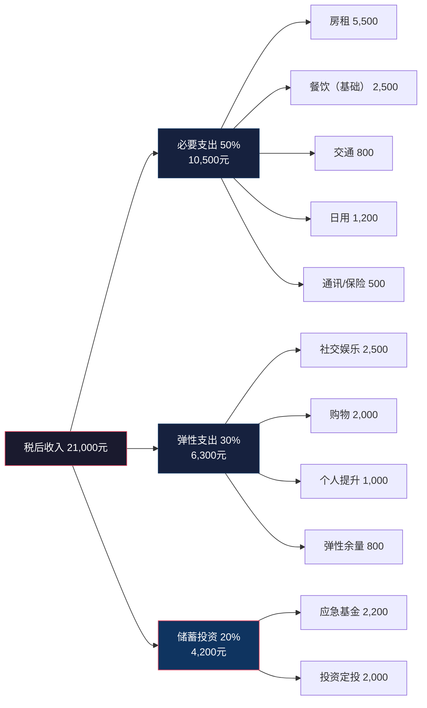
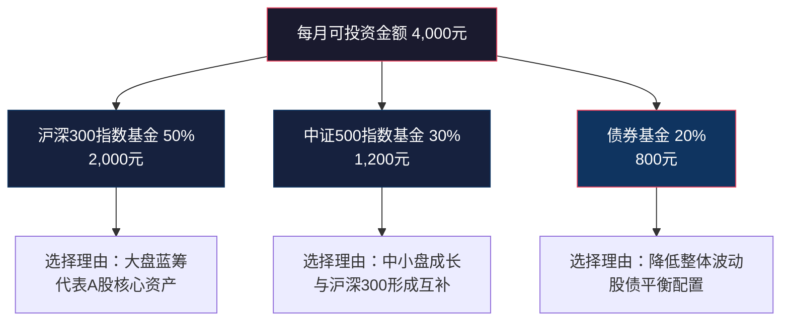
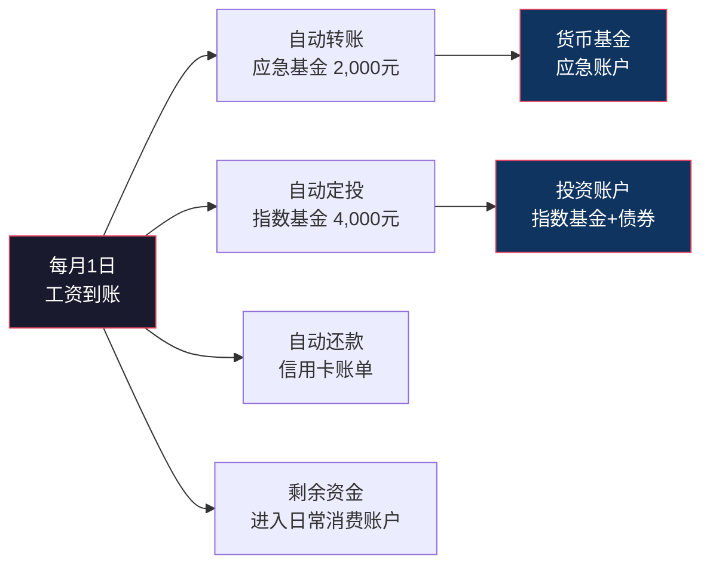

## 案例一：从月光族到财务自由的转变

> "我不是赚得少，我是花得多——直到我发现，这两件事其实是同一个问题。"

这是一个真实可复现的财务转型案例。主角小李从月薪2.5万、存款为零的月光族，用18个月时间建立起月储蓄率超过50%、总资产突破30万的财务体系。这个案例的核心价值不在于"他做了什么"，而在于"他为什么能坚持做"——因为它完整呈现了一个普通人如何突破金钱观的底层限制，从行为到认知完成系统性升级。

---

### 案例背景：一个"典型月光族"的画像

小李，28岁，某互联网公司产品经理，坐标北京，月薪2.5万元（税后约2.1万）。工作5年，经历过两次跳槽加薪，收入从最初的8000元涨到现在的位置。按理说，这个收入水平在北京不算低，但他的银行账户余额长期维持在三位数。

**财务全景扫描：**

| 项目 | 月金额 | 占税后收入比 | 备注 |
|------|--------|-------------|------|
| 税后收入 | 21,000元 | 100% | 含基本工资+绩效 |
| 房租 | 5,500元 | 26% | 朝阳区合租主卧 |
| 餐饮 | 3,800元 | 18% | 外卖为主，偶尔聚餐 |
| 购物（服饰/数码） | 4,500元 | 21% | 网购冲动消费为主 |
| 娱乐 | 2,800元 | 13% | 游戏充值、视频会员、社交 |
| 交通 | 800元 | 4% | 地铁+偶尔打车 |
| 其他（日用/社交/红包） | 2,600元 | 12% | 杂项支出，无明细 |
| **月储蓄** | **1,000元** | **5%** | **有时为负** |

**表面问题：** 收入2.1万，月光甚至透支。

**深层问题——三种限制性金钱信念：**

1. **"钱是赚出来的，不是省出来的"** ——这句话本身没错，但小李把它当作不控制支出的借口。他的理解是"等我赚更多钱就会好了"，而事实是，他的消费习惯会随着收入同步膨胀（心理学上叫"生活方式膨胀"或"生活方式蠕变"）。
2. **"年轻就应该享受"** ——即时满足偏好。看到喜欢的耳机立刻下单，看到同事换了新手机第二天就去买同款。大脑的多巴胺回路被"下单-收货-拆快递"的循环反复强化。
3. **"理财是有钱人的事"** ——典型的"等我有钱了再开始"思维，完美错过复利的时间窗口。

这三种信念不是小李"想出来"的，而是他的成长环境、消费文化和社交圈共同塑造的。这也是为什么单纯"教你省钱"没有用——不改变底层信念，行为改变撑不过两周。

---

### 第一阶段：觉察与记账（第1个月）

> 核心突破：从"不知道钱去哪了"到"每一笔支出都看得见"

#### 1. 触发事件

小李的转折点来自一件小事：2023年3月，他想买一张2800元的演唱会门票，打开银行App发现余额只有1200元。他愣了五分钟——上个月工资刚发，钱去哪了？

这个瞬间激活了他从未有过的"财务觉察"。行为经济学中有一个概念叫"心理账户"（Mental Accounting），由诺贝尔经济学奖得主Richard Thaler提出：人们会把钱分到不同的"心理账户"里，比如"工资账户""娱乐账户""投资账户"，但很少有人对自己的总财务状况有清晰的全局视图。小李的问题正是如此——他觉得"工资刚发所以有钱"，却不知道这些钱已经被预分配到了各种消费中。

#### 2. 行动：开始系统记账

小李没有选择传统的手工记账（太麻烦，坚持不下来），而是用了一款自动记账App（如"随手记"或"钱迹"），绑定银行卡和支付宝/微信支付，实现消费自动分类。

**记账的第一个关键技巧：先记录，不评判。**

很多人记账的第一反应是"我怎么花了这么多？！"然后焦虑地删掉App。正确的做法是：先完整记录一个月，不做任何改变。目的是建立"财务觉察"——让你的消费从"无意识行为"变成"有意识行为"。

#### 3. 第一个月的发现

一个月后，小李导出了消费报告，发现三个惊人的事实：

**发现一：隐形消费占总支出的18%**

| 隐形消费项 | 月金额 | 真相 |
|-----------|--------|------|
| 自动续费订阅 | 280元 | 视频会员×2、音乐会员、云存储、健身App——一半已经不用了 |
| 凑单满减 | 650元 | 为了"满200减30"多买了根本不需要的东西 |
| 便利性溢价 | 420元 | 5公里内打车、便利店买水（比超市贵3倍）、外卖配送费 |
| 情绪消费 | 450元 | 加班后"犒劳自己"、心情不好"买点开心的" |
| **合计** | **1,800元** | **占月支出的8.6%，相当于一年浪费2.16万** |

**发现二：消费的时间分布有规律**

小李的高消费集中在三个时段：
- **发工资后3天**：报复性消费（"终于发工资了，犒劳一下自己"）
- **周五晚上**：社交消费（聚餐、KTV、酒吧）
- **深夜11点后**：冲动网购（躺在床上刷手机，越刷越想买）

这三个时段对应了不同的心理机制：发工资后的消费是"心理账户充值效应"（觉得有钱了可以花了），周五社交是"从众压力"，深夜网购是"意志力低谷期的冲动决策"。

**发现三：餐饮支出的"冰山效应"**

小李以为自己每月餐饮花3000元，实际记录显示是3800元。差的800元来自"不算账的小钱"：下午奶茶15元、便利店零食12元、加班夜宵25元……这些单笔不超过30元的支出，每天可能有2-3笔，一个月累积就是一笔巨款。

#### 4. 第一个月的行动

基于记账数据，小李做了三件"低痛苦"的调整：

| 行动 | 月节省 | 痛苦程度 | 原理 |
|------|--------|---------|------|
| 取消不用的自动续费 | 150元 | ★☆☆☆☆ | 无痛操作，这些服务本来就没在用 |
| 设定深夜网购限制：22点后不打开购物App | 400元 | ★★☆☆☆ | 环境设计比意志力更可靠 |
| 带水杯+周末集中采购零食 | 200元 | ★☆☆☆☆ | 替代方案，不是"戒掉"而是"换一种方式满足" |

**第一个月结果：** 月储蓄从1000元提升到1750元，储蓄率从5%提升到8%。

这个数字看起来不起眼，但意义重大——**小李第一次证明了"不降低生活质量也能存下更多钱"**。这打破了他"省钱=受苦"的潜意识等式。

---

### 第二阶段：系统化节流（第2-3个月）

> 核心突破：从"零散省钱"到"建立预算系统"

#### 1. 引入"50-30-20"预算框架

小李在阅读《小狗钱钱》和浏览理财社区后，接触到了一个简单但有效的预算框架：

**为什么是50-30-20而不是其他比例？**

这个比例的核心逻辑是"先支付自己"（Pay Yourself First）——在你拿到工资的那一刻，先把20%划走，剩下的80%才是你可以花的钱。大多数人的做法相反：先花，剩多少存多少。结果就是"永远剩不下"。

对于小李当前的情况，他先从60-30-10开始（因为房租占比较高，短期内无法改变），逐步过渡到50-30-20。

#### 2. 三个关键节流动作

**动作一：餐饮结构重组**

| 调整项 | 调整前 | 调整后 | 月节省 | 执行难度 |
|--------|--------|--------|--------|---------|
| 工作日晚餐 | 外卖（均价35元） | 周日批量备菜+工作日带饭 | 1,200元 | ★★★☆☆（需周末投入2小时） |
| 午餐 | 公司附近餐厅（均价45元） | 公司食堂/自带便当 | 500元 | ★★☆☆☆ |
| 奶茶/咖啡 | 每天1杯（均价18元） | 每周2杯+其余速溶/挂耳 | 350元 | ★★☆☆☆ |
| 聚餐 | 每周2-3次（均价150元/次） | 每周1次+改为家庭聚餐 | 600元 | ★★★☆☆ |

**备菜的具体操作流程（小李的实际方法）：**

1. 周六晚规划下周菜单（参考小红书/下厨房的"一周便当"话题）
2. 周日上午采购（盒马/美团买菜，控制在150元以内）
3. 周日下午花2小时处理食材：切配、分装、冷冻
4. 工作日早上花15分钟炒菜装盒

这个习惯的建立花了小李大约3周时间。前两周很痛苦（做饭慢、味道一般），第三周开始变得流畅。心理学上，这叫"习惯养成的21天效应"——但更准确地说，关键不是天数，而是"重复次数+正反馈"。小李的正反馈是：看到每月餐饮支出从3800元降到1800元时的成就感。

**动作二：购物行为改造**

小李的网购金额从月均4500元降到了月均1500元，核心方法是"72小时冷静期"规则：

- 看到想买的东西，先加购物车
- 设置72小时倒计时提醒
- 72小时后重新审视：我真的需要它吗？它能解决什么具体问题？有没有更便宜的替代方案？
- 如果72小时后仍然确定要买，再下单

这个方法的底层原理是"冲动消费的半衰期"——大部分冲动在24小时内衰减70%，72小时后衰减90%以上。小李统计过，他加购物车的商品中，只有约25%在72小时后仍然下单。

**动作三：社交成本优化**

小李没有"断绝社交"（那不现实也不健康），而是做了三个改变：

1. **聚餐地点降级**：从人均200元的餐厅改为人均80-100元的餐厅，品质差异很小但价格差一倍
2. **增加低成本社交**：爬山、桌游、在家做饭聚餐——这些活动的社交质量反而更高，因为互动更深入
3. **学会说"不"**：对于纯粹的"凑人数"局（比如同事叫去酒吧，他其实不想去），学会礼貌拒绝。这一点最难，因为它涉及社交压力和"怕被孤立"的心理

#### 3. 第二、三个月的结果

| 指标 | 第1个月末 | 第3个月末 | 变化 |
|------|----------|----------|------|
| 月支出 | 19,250元 | 14,800元 | -23% |
| 月储蓄 | 1,750元 | 6,200元 | +254% |
| 储蓄率 | 8% | 30% | +22个百分点 |
| 生活满意度 | 6/10 | 7/10 | 反而提升了 |

最后一行是关键——**小李的生活满意度反而提升了**。这看起来违反直觉，但心理学研究反复证实：当人对自己的财务有了掌控感后，焦虑感会大幅下降，幸福感会上升。消费带来的快感是短暂的（多巴胺峰值持续不超过30分钟），而掌控感带来的满足是持续的。

---

### 第三阶段：建立应急基金与开始投资（第4-6个月）

> 核心突破：从"只存钱"到"让钱开始工作"

#### 1. 应急基金：财务安全的第一道防线

小李做的第一件事不是投资，而是建立应急基金。这是很多人忽略的关键步骤——没有应急基金就开始投资，就像不系安全带就上高速。

**应急基金的设定逻辑：**

| 计算项 | 金额 | 说明 |
|--------|------|------|
| 月必要支出 | 14,800元 | 房租+基础餐饮+交通+日用 |
| 建议覆盖月数 | 6个月 | 互联网行业裁员风险较高 |
| 目标应急基金 | 88,800元 | 约9万元 |
| 当前已有存款 | 约6,000元 | 前3个月的积蓄 |
| 还需积累 | 约83,000元 | 按月存4,000元，约需21个月 |

小李选择将应急基金存放在货币基金中（如余额宝、零钱通），原因有三：
- **流动性高**：随时可取，T+0到账
- **风险极低**：几乎不会亏损
- **收益虽低但优于活期**：年化约2%，比银行活期0.2%高10倍

**重要原则：应急基金只用于真正的紧急情况**（失业、重大疾病、紧急维修），不能用于"双十一打折""朋友结婚随份子"等非紧急支出。小李为此专门开了一张独立银行卡，不绑定任何支付平台，增加"取用摩擦"。

#### 2. 投资入门：从指数基金定投开始

在积累了2个月应急基金（约1.2万元）后，小李开始将每月储蓄的一部分用于投资。

**为什么选择指数基金定投作为投资起点？**

| 投资方式 | 门槛 | 风险 | 需要的专业知识 | 适合新手程度 |
|---------|------|------|--------------|-------------|
| 银行定期存款 | 低 | 极低 | 无 | ★★★★★ 但收益跑不赢通胀 |
| 货币基金 | 极低 | 极低 | 无 | ★★★★★ 适合存放应急基金 |
| **指数基金定投** | **低** | **中** | **基础** | **★★★★☆ 新手最佳起步点** |
| 主动型基金 | 中 | 中高 | 中等 | ★★★☆☆ 需要选基金经理 |
| 个股投资 | 中 | 高 | 高 | ★★☆☆☆ 不建议新手直接进入 |
| 期货/期权 | 高 | 极高 | 极高 | ★☆☆☆☆ 新手禁区 |

小李的投资方案：

**定投的执行细节：**

- **平台选择**：支付宝/天天基金/蛋卷基金（费率低，操作方便）
- **定投日期**：每月15日（发工资后第二天，确保资金到位）
- **定投策略**：普通定投（固定金额固定时间），不玩"智能定投"——新手阶段越简单越好
- **选基金的标准**：费率低于0.5%、跟踪误差小、规模大于10亿元

**小李学到的第一个投资教训（第5个月）：**

定投第2个月，A股下跌约8%，小李的基金账户浮亏约600元。他的第一反应是"亏了！赶紧卖掉止损！"——这是典型的"损失厌恶"在发作。

他差点就卖了，但想起书中的一句话："定投的魅力恰恰在于下跌时——同样的金额能买到更多份额。"他忍住了。后来市场反弹，到第6个月时不仅回本，还略有盈利。

这次经历让小李深刻理解了本章1.2节讲的"损失厌恶"——**账面浮亏不是真正的亏损，只有你卖出的那一刻才变成真正的亏损。**

---

### 第四阶段：开源——提升收入（第7-12个月）

> 核心突破：从"只靠工资"到"多渠道收入"

节流有天花板——小李的月支出已经降到了1.3万左右，再降就真的影响生活质量了。但收入没有天花板。

#### 1. 主业加薪：用数据说话

小李没有盲目跳槽，而是做了一件事：**量化自己的市场价值**。

他花了一周时间做了三件事：
1. 在Boss直聘、拉勾等平台调研同岗位薪资范围（产品经理，3-5年经验，北京：2.5万-4万/月）
2. 整理自己过去一年的工作成果（上线了3个核心功能，用户增长20%，获得季度优秀员工）
3. 与直属领导进行了一次"加薪沟通"——不是"我觉得我应该涨工资"，而是"我为公司创造了X价值，市场同类岗位的薪资是Y，我希望薪资能调整到Z"

结果：公司同意加薪2000元（从2.1万涨到2.3万税后），同时承诺下个季度再评估一次。

小李同时也更新了简历，开始面试。3个月后拿到了另一家公司的offer，税后月薪2.8万。他用这个offer和现公司谈，最终公司匹配到了2.6万。他选择留在原公司（熟悉的环境、好的团队），但薪资提升了24%。

#### 2. 副业探索：把专业能力变现

作为产品经理，小李有三种副业路径：

| 副业类型 | 具体方式 | 月收入预期 | 时间投入 | 启动难度 |
|---------|---------|----------|---------|---------|
| 产品咨询 | 在"在行"等平台接咨询 | 2,000-5,000元 | 每月8-12小时 | ★★★☆☆ |
| 产品文档/需求写作 | 在猪八戒等平台接单 | 1,000-3,000元 | 每月6-10小时 | ★★☆☆☆ |
| 自媒体输出 | 在公众号/知乎写产品分析 | 前期0，后期可达3,000+ | 每月10-15小时 | ★★★★☆ |

小李选择了**产品咨询+自媒体**的组合。他的逻辑是：咨询直接变现，自媒体建立个人品牌为长期价值铺路。

**副业收入增长曲线：**

| 月份 | 副业收入 | 来源 |
|------|---------|------|
| 第7个月 | 800元 | 第1单产品咨询 |
| 第8个月 | 1,500元 | 2单咨询 |
| 第9个月 | 2,200元 | 3单咨询+公众号开始有打赏 |
| 第10个月 | 3,000元 | 咨询稳定+公众号接了第一篇软文 |
| 第11个月 | 3,500元 | 口碑传播，咨询需求增加 |
| 第12个月 | 4,000元 | 咨询+自媒体双渠道稳定 |

#### 3. 收入结构变化

到第12个月，小李的收入结构已经发生了根本性变化：

| 收入来源 | 第1个月 | 第12个月 | 增幅 |
|---------|--------|---------|------|
| 主业工资 | 21,000元 | 26,000元 | +24% |
| 副业收入 | 0元 | 4,000元 | 从0到1 |
| 投资收益 | 0元 | 约800元 | 从0到1 |
| **总计** | **21,000元** | **30,800元** | **+47%** |

---

### 第五阶段：系统优化与心态升级（第13-18个月）

> 核心突破：从"做对的事"到"建立自动运行的系统"

#### 1. 财务系统的"自动化"

小李意识到，靠意志力维持财务纪律是不可持续的。他把整个财务系统变成了"自动驾驶"：

**关键原则：钱在你看到之前就已经被分配好了。**

小李设置了工资卡的自动转账：发工资当天，6000元自动转到投资账户和应急基金账户。他的日常消费卡里只有1.5万——这就是他这个月可以花的全部。花完了就等下个月，没有"挪用投资账户"的选项。

#### 2. 心态层面的三个跃迁

**跃迁一：从"消费思维"到"投资思维"**

以前的小李看到一杯30元的咖啡，想的是"30元，不贵"。现在他会想："30元，如果投资年化8%，30年后变成30×(1.08)^30 ≈ 302元。这杯咖啡的真实成本是302元的未来财富。"

这不是说他不喝咖啡了——他改为买15元的美式，或者自己冲挂耳。**投资思维不是不消费，而是更聪明地消费。**

**跃迁二：从"稀缺心态"到"富足心态"**

稀缺心态让人只关注眼前——"我现在缺钱，所以我要省钱"。富足心态让人关注长远——"我现在投资自己和资产，未来会有更多选择"。

小李的变化体现在一个具体行为上：以前他不愿意花钱买书、买课程（"免费的就够了"），现在他每月预算1000元用于自我提升——买专业书籍、参加行业培训、订阅高质量内容。因为他理解了：**能力是最优质的资产，它不会贬值，不会被通胀侵蚀，而且可以持续产生现金流。**

**跃迁三：从"独自摸索"到"构建财务支持系统"**

小李做了三件事：
1. 加入了一个理财社群（不是那种"带你炒股"的群，而是讨论理财知识和互相监督的群）
2. 找了一个同样在学习理财的朋友做"财务搭子"，每月互相分享收支报告
3. 每季度做一次"财务复盘"，回顾自己的收支、投资收益和目标进度

---

### 18个月后的成果

**财务数据：**

| 指标 | 起点（第0个月） | 第18个月 | 变化 |
|------|----------------|---------|------|
| 月收入 | 21,000元 | 32,000元 | +52% |
| 月支出 | 20,000元 | 13,500元 | -33% |
| 月储蓄 | 1,000元 | 18,500元 | +1,750% |
| 储蓄率 | 5% | 58% | +53个百分点 |
| 应急基金 | 0元 | 60,000元 | 覆盖4.4个月支出 |
| 投资资产 | 0元 | 85,000元 | 持续增长中 |
| 总资产 | 约2,000元 | 约150,000元 | 从月光到15万 |

**非财务成果（同样重要）：**

| 维度 | 变化 |
|------|------|
| 心理状态 | 从"月光焦虑"变为"财务掌控感"，睡眠质量明显改善 |
| 消费习惯 | 从"冲动消费"变为"有意识消费"，但并未降低生活品质 |
| 投资认知 | 从"投资是有钱人的事"变为"投资是每个人的必修课" |
| 个人能力 | 副业能力提升，建立了个人品牌，职业选择权增加 |
| 社交质量 | 社交圈从"酒肉朋友"扩展为"互相成长的伙伴" |

---

### 案例复盘：关键成功因素分析

小李的成功不是偶然的。复盘整个过程，有五个关键因素决定了这次转型能否成功：

**因素一：从觉察开始，而不是从"省钱"开始**

大多数人失败的原因是直接跳到"我要省钱"，结果坚持两周就放弃。小李的第一步是"记账"——不是为了省钱，而是为了看清现状。**觉察是改变的前提。** 没有觉察，你甚至不知道自己需要改变。

**因素二：渐进式改变，而不是激进式改变**

小李没有一夜之间把月支出从2万砍到1万。他第一个月只省了750元，第二个月才开始系统化调整。**激进的改变会触发大脑的"威胁反应"，导致报复性反弹。** 渐进式改变让大脑有时间适应新的行为模式。

**因素三：系统大于意志力**

自动转账、自动定投、72小时冷静期、独立的应急基金银行卡——这些都不是靠"我一定要坚持"来执行的，而是靠系统设计。**意志力是有限资源，系统是无限执行器。**

**因素四：开源与节流并行**

如果小李只做节流，他的月储蓄上限大约是8000元（2.1万收入-1.3万支出）。加入副业收入后，上限提升到了1.8万以上。**节流解决下限问题，开源解决上限问题。**

**因素五：认知升级驱动行为改变**

小李的每一个行为改变背后，都有一个认知升级：理解了"心理账户"才开始记账，理解了"损失厌恶"才忍住了基金下跌时的卖出冲动，理解了"复利"才坚持了18个月的定投。**行为是认知的外显，改变认知才能持久改变行为。**

---

### 可复用的方法论：月光族转型路线图

如果你现在是月光族，想复现小李的路径，以下是经过验证的步骤：

**第一步（第1个月）：财务体检**
- 开始记账（推荐自动记账App）
- 完整记录一个月，不做任何改变
- 月底导出报告，找到三个最大的"出血点"

**第二步（第2-3个月）：建立预算系统**
- 采用50-30-20或适合自己的预算比例
- 设置自动转账（先支付自己）
- 对高消费类别设定上限
- 实施"72小时冷静期"规则

**第三步（第4-6个月）：建立安全垫+开始投资**
- 优先积累3-6个月的应急基金
- 从指数基金定投开始投资
- 不要试图"择时"，坚持定期定额

**第四步（第7-12个月）：提升收入**
- 主动争取加薪或跳槽
- 探索副业，将专业能力变现
- 投资自己的学习和成长

**第五步（第12个月以后）：系统化与自动化**
- 将所有财务流程自动化
- 每季度做一次财务复盘
- 持续优化投资组合

---

### 常见问题与误区

**问：月薪不到1万也能走这条路吗？**

能，但需要调整预期。月薪8000元的核心策略是"先活下来，再积累"——目标储蓄率从10%开始，重点放在提升收入能力上。小李的路径适用于月收入8000元以上的群体；低于这个线，优先级应该是提升主业收入。

**问：记账太麻烦了，坚持不下来怎么办？**

用自动记账工具。支付宝和微信支付都有年度账单功能，很多记账App支持自动同步银行卡和支付平台数据。你需要做的只是每周花10分钟检查分类是否正确。如果连这也做不到，那就先从"每周记录一次大额支出"开始。

**问：定投基金亏了怎么办？**

亏了就继续投。定投的核心逻辑是"下跌时买入更多份额，拉低平均成本"。如果你在下跌时停止定投甚至卖出，就完美错过了定投最大的优势。历史上，任何一次A股的沪深300指数定投，只要坚持超过5年，没有亏损的先例。（但过去不代表未来，这只是一个参考。）

**问：副业会影响主业吗？**

会，如果副业占用了过多时间和精力。小李的规则是：副业时间不超过主业时间的30%（即每周不超过15小时），副业内容与主业能力相关（产品咨询，不需要额外学习全新技能），副业不能影响工作日的精力状态。

**问：18个月从月光到15万，是不是太理想化了？**

这个案例的数字基于小李的真实情况，但每个人的起点和环境不同。重点不是"15万"这个数字，而是"储蓄率从5%提升到58%"这个方法。即使你的起点更低、收入更少，只要储蓄率能从5%提升到30%，你已经在正确的轨道上了。

---

### 本案例对应的核心知识

本案例不是一个独立的故事，而是本章多个核心概念的综合应用：

| 案例环节 | 对应知识点 | 核心概念 |
|---------|----------|---------|
| 记账与觉察 | 1.2 财富心理学 | 心理账户、无意识消费 |
| 72小时冷静期 | 1.2 财富心理学 | 冲动消费的多巴胺机制 |
| 应急基金 | 1.3 财务自由的定义与标准 | 财务安全垫、流动性管理 |
| 指数基金定投 | 1.4 复利思维与长期主义 | 复利效应、长期主义 |
| 忍住不卖亏损基金 | 1.2 财富心理学 | 损失厌恶 |
| 收入结构优化 | 1.1 重新认识金钱 | 从"赚钱"到"创造价值" |
| 自动化财务系统 | 1.5 风险与收益的辩证关系 | 系统化风险管理 |

如果你还没有阅读本章的理论部分，建议先完成理论学习，再回来看这个案例——你会发现每一个细节都有理论支撑，而不再是"他做了什么"的简单罗列。
