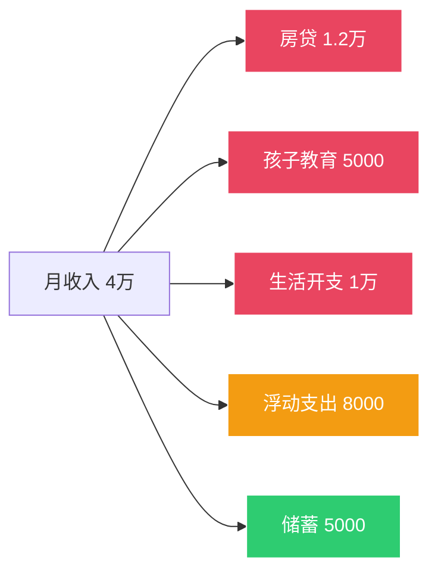
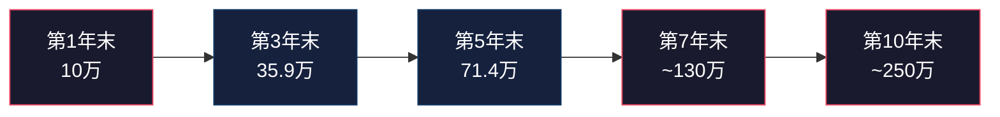
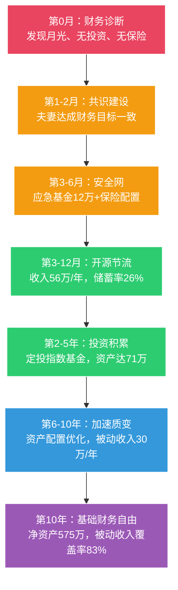

## 案例二：一个家庭的财务自由之路

> 个人的财务自由靠纪律，家庭的财务自由靠系统。因为家庭意味着两个人（甚至两代人）的金钱观要在同一频道上——这才是最难的部分。

### 为什么需要一个家庭案例

前面的月光族案例解决的是"一个人从零开始"的问题。但现实中，大多数人的财务决策是以家庭为单位做出的——房贷是两个人一起背的，孩子的教育支出是两个人一起扛的，投资计划也需要两个人达成共识。

家庭理财和个人理财有一个本质区别：**个人只需要说服自己，家庭需要说服队友。** 一个家庭的财务自由之路，至少50%的难度在于"共识建设"，而不是"技术操作"。

这个案例完整展示了一个普通双职工家庭，如何从"月月光"走向"基础财务自由"的全过程——包括他们犯过的错误、踩过的坑、以及哪些弯路其实可以避免。

---

### 案例背景：王家的起点

**家庭画像：**

| 维度 | 详情 |
|------|------|
| 夫妻 | 王先生（35岁，互联网公司产品经理）+ 李女士（33岁，小学教师） |
| 孩子 | 1个，5岁，即将上小学 |
| 居住城市 | 二线城市（成都） |
| 房产 | 一套自住房（市值180万，贷款余额120万，月供1.2万） |

**财务体检（第0个月）：**

| 指标 | 数值 | 评价 |
|------|------|------|
| 家庭月收入 | 4万元（王先生2.5万 + 李女士1.5万） | 二线城市中等偏上 |
| 月固定支出 | 2.7万元（房贷1.2万 + 孩子教育5000 + 生活开支1万） | 偏高 |
| 月浮动支出 | 8000元（社交、购物、旅行等） | 缺乏控制 |
| 月储蓄 | 5000元 | 储蓄率仅12.5%，远低于安全线 |
| 应急基金 | 3万元存款 | 不足1个月开支，极度危险 |
| 投资 | 几乎为零 | 完全没有让钱生钱 |
| 保险 | 仅基本社保 | 一场大病就能让家庭财务崩塌 |
| 负债 | 房贷120万 | 负债率67%，偏高但可管理 |

**诊断结论：** 这个家庭处于"高收入、低储蓄、零投资、无保障"的状态。收入不低，但钱像水一样从各种管道漏掉了。用本章1.3节的四层财务自由框架来衡量，他们连第一层（基本生存保障）都没有达到——因为如果任何一个人失业或生病，家庭财务会立即陷入危机。



**关键问题：** 储蓄率12.5%意味着什么？假设他们维持这个状态不变，每月存5000元，年化收益7%，30年后大约有600万。看起来不少，但考虑到通货膨胀（假设年化3%），这600万的购买力只相当于今天的250万左右——勉强够养老，但远远谈不上"财务自由"。

---

### 第一阶段：财务诊断与共识建设（第1-2个月）

#### 1. 财务诊断：把钱的流向搞清楚

很多家庭理财的第一步就错了——直接开始"省钱"或"投资"。正确的第一步是**搞清楚钱到底花到哪里去了**。

王先生用了一个月时间，把过去6个月的所有银行流水、支付宝、微信支付记录全部导出来，按类别汇总。结果让他大吃一惊：

| 支出类别 | 月均金额 | 占比 | 诊断 |
|----------|----------|------|------|
| 房贷 | 12,000元 | 30% | 合理，不可压缩 |
| 孩子教育（培训班） | 5,000元 | 12.5% | 部分可优化 |
| 餐饮（含外卖） | 4,500元 | 11.3% | 外卖过多，可压缩 |
| 交通（含油费停车） | 2,000元 | 5% | 基本合理 |
| 日用品/超市 | 2,500元 | 6.3% | 有冲动消费 |
| 社交/聚餐 | 2,500元 | 6.3% | 偏高 |
| 购物（衣服/电子产品） | 3,000元 | 7.5% | 很多是"想要"而非"需要" |
| 娱乐/旅行 | 2,000元 | 5% | 月均摊 |
| 其他杂项 | 1,500元 | 3.8% | 碎片化消费 |
| **合计** | **40,000元** | — | — |

**关键发现：** 真正"不可压缩"的刚性支出（房贷+基本生活）大约2万元，剩下的2万元中有至少1万元属于"可优化"的弹性支出。这意味着他们并不是"挣得不够多"，而是"花得不够聪明"。

#### 2. 最难的一步：夫妻达成共识

财务诊断的数字摆出来之后，王家经历了一场"家庭财务会议"。这是整个计划中最关键、也最困难的一步。

**分歧点：**
- 李女士认为孩子的培训班不能砍："别人家孩子都在学，我们不能落后"
- 王先生觉得社交开支太高："有些应酬根本没必要"
- 两人对"投资"都有恐惧心理："万一亏了怎么办？"

**解决方法：** 他们没有争论"谁对谁错"，而是用了一个框架——**把所有支出分为三类：**

| 类别 | 定义 | 处理方式 |
|------|------|----------|
| 生存支出 | 不花就会危及基本生活 | 保留，但寻找更优方案 |
| 发展支出 | 对家庭长期发展有明确价值 | 保留，但评估投入产出比 |
| 享受支出 | 提升当下生活幸福感 | 保留一部分，但设上限 |

这个分类框架帮助他们把"砍支出"变成了"优化支出结构"——不是不花钱，而是把钱花在回报率最高的地方。

**共识结果：**
- 孩子培训班：从5个砍到3个（保留英语、钢琴、游泳，砍掉围棋和编程——5岁学编程确实太早）
- 社交开支：设月度上限2000元
- 购物：执行"48小时冷静期"规则——想买的东西先加购物车，48小时后还想买再买
- 王先生同意学习投资基础知识，李女士负责家庭账本管理

---

### 第二阶段：构建财务安全网（第3-6个月）

在开始"进攻"（投资增值）之前，必须先"防守"（建立安全网）。这是很多家庭忽略的步骤——还没建好安全网就急着投资，结果市场一波动就恐慌卖出，不仅没赚到钱，还亏了本金。

#### 1. 应急基金：家庭的"消防栓"

**目标：** 6个月基本生活开支 = 12万元

**建设策略：**
- 第3-4个月：从存款中拿出3万（已有），加上每月节省的5000元，快速累积到5万
- 第5-6个月：继续积累到12万
- 存放位置：货币基金（如余额宝、零钱通），年化约2%，随时可取

**为什么要6个月而不是3个月？** 对于双职工家庭，3个月的应急基金只够应对一个人短期失业。但如果遇到更严重的情况（两个人同时失业、重大疾病、家庭紧急事件），6个月的缓冲能让你不必在恐慌中做出错误的财务决策。记住本章1.2节讲的——稀缺心态会降低认知能力，而应急基金就是防止你进入稀缺心态的"防火墙"。

#### 2. 保险配置：家庭的"安全气囊"

在应急基金建立的同时，王家开始配置保险。他们请了一位独立的保险经纪人（不隶属于任何保险公司），做了全家的风险评估。

**配置方案：**

| 家庭成员 | 险种 | 产品类型 | 年保费 | 保额 |
|----------|------|----------|--------|------|
| 王先生 | 定期寿险 | 消费型 | 1,800元 | 100万 |
| 王先生 | 重疾险 | 消费型 | 3,500元 | 50万 |
| 王先生 | 百万医疗 | 消费型 | 800元 | 400万 |
| 王先生 | 意外险 | 消费型 | 300元 | 100万 |
| 李女士 | 定期寿险 | 消费型 | 1,200元 | 80万 |
| 李女士 | 重疾险 | 消费型 | 2,800元 | 50万 |
| 李女士 | 百万医疗 | 消费型 | 600元 | 400万 |
| 李女士 | 意外险 | 消费型 | 200元 | 100万 |
| 孩子 | 百万医疗 | 消费型 | 600元 | 400万 |
| 孩子 | 意外险 | 消费型 | 100元 | 50万 |
| **合计** | — | — | **11,900元/年** | — |

**关键原则：**
- **先保障后理财：** 纯保障型消费险优先，不买返还型（返还型保费贵3-5倍，收益还不如自己投资）
- **先大人后小孩：** 大人是家庭的"收入来源"，大人的保障比小孩更重要
- **保额要够：** 重疾险保额至少覆盖3-5年收入，定期寿险保额至少覆盖房贷余额+5年生活费
- **年保费占家庭收入2-5%：** 超过5%就是过度保险，会挤占投资资金

**这笔保险解决了什么问题？** 之前王家最大的风险是"一场大病回到解放前"——任何一个人生重病，不仅收入中断，还要面对高额医疗费。现在，1.2万/年的保费撬动了近千万的保障杠杆，让家庭财务的"底线"有了保障。

---

### 第三阶段：收入增长与支出优化并行（第3-12个月）

#### 1. 收入端：双轮驱动策略

单纯靠"省钱"实现财务自由是不现实的——省钱有天花板，而收入增长没有天花板。王家采取了"主业精进+副业探索"的双轮策略。

**王先生的路径（主业精进）：**

| 时间 | 动作 | 结果 |
|------|------|------|
| 第3个月 | 整理个人作品集，更新简历 | — |
| 第4个月 | 投递目标公司，参加面试 | 收到3个offer |
| 第5个月 | 跳槽到一家更大的互联网公司 | 月薪从2.5万涨到3.2万（+28%） |
| 第6-12个月 | 快速适应新环境，争取绩效 | 年底获得优秀员工，年终奖+2万 |

**为什么跳槽能涨薪28%？** 在互联网行业，跳槽的平均涨薪幅度是20-30%，而内部调薪通常只有5-10%。这不是说要频繁跳槽，而是说——如果你的能力确实被低估了，跳槽是最快的价值重估方式。但前提是你的能力真的值这个价，而不是靠面试技巧"骗"到一个高薪职位。

**李女士的路径（副业探索）：**

| 时间 | 动作 | 结果 |
|------|------|------|
| 第3个月 | 分析自身技能，确定在线教育方向 | 小学数学思维训练 |
| 第4-5个月 | 录制课程，在B站和小红书发布免费内容 | 积累500个粉丝 |
| 第6个月 | 开设付费小班课（6人班，每人800元/期） | 第一期招满，收入4800元 |
| 第7-12个月 | 通过口碑传播，学员增长 | 月均收入稳定在6000元 |

**副业选择的底层逻辑：** 李女士选择在线教育不是因为"教育行业火"，而是因为这个方向满足三个条件——（1）她有专业能力（10年教学经验），（2）市场需求真实存在（家长愿意为教育付费），（3）时间灵活（不影响本职工作和带孩子）。这三个条件的交集，才是适合你的副业方向。

#### 2. 支出端：结构性优化

经过半年的调整，王家的月支出结构发生了显著变化：

| 支出项 | 优化前 | 优化后 | 节省 | 优化方法 |
|--------|--------|--------|------|----------|
| 外卖/餐饮 | 4,500 | 2,500 | 2,000 | 每周做饭4次，减少外卖 |
| 购物 | 3,000 | 1,500 | 1,500 | 48小时冷静期+月度预算 |
| 社交 | 2,500 | 1,500 | 1,000 | 筛选高价值社交 |
| 孩子教育 | 5,000 | 3,500 | 1,500 | 砍掉低效培训班 |
| 日用品 | 2,500 | 1,500 | 1,000 | 批量采购+比价 |
| **合计节省** | — | — | **7,000** | — |

注意，他们没有"苦行僧式省钱"——社交没有砍到零，孩子教育没有完全停掉，生活品质没有断崖式下降。他们砍掉的是"边际效用低"的支出：那些花了钱但并没有带来多少快乐或成长的消费。

---

### 第四阶段：投资体系建设（第7个月起）

#### 1. 投资前的准备

在开始投资之前，王家完成了三件事：

（1）**学习基础知识：** 王先生花了2个月读了3本书——《小狗钱钱》（入门）、《指数基金投资指南》（实操）、《漫步华尔街》（理念）。不需要成为金融专家，但需要理解"什么是指数基金""为什么长期定投有效""什么是资产配置"。

（2）**确定投资理念：** 基于本章1.4节的复利思维和1.5节的风险管理，他们确定了投资原则——**不择时、不选股、长期持有、定期再平衡**。

（3）**开立投资账户：** 在天天基金和蛋卷基金各开一个账户（分散平台风险），绑定工资卡设置自动扣款。

#### 2. 定投方案

**核心策略：指数基金定投**

| 投资标的 | 占比 | 月投金额 | 选择理由 |
|----------|------|----------|----------|
| 沪深300指数基金 | 40% | 3,200元 | 大盘蓝筹，波动相对小 |
| 中证500指数基金 | 30% | 2,400元 | 中盘成长，长期收益潜力大 |
| 恒生科技指数基金 | 15% | 1,200元 | 港股科技龙头，分散A股风险 |
| 债券基金 | 15% | 1,200元 | 降低组合波动 |
| **月投合计** | **100%** | **8,000元** | — |

**为什么是8000元？** 这是经过计算的——月收入4.8万（跳槽+副业后），扣除所有支出2.8万和保费摊销1000元后，可投资金额约1.9万。但考虑到收入波动和意外支出，他们只把其中8000元（约42%）用于定投，剩下的作为"投资弹药库"积累起来，等待市场大跌时加仓。

**为什么选指数基金而不是个股？** 对于非专业投资者，指数基金有三个优势——（1）天然分散风险（一个指数包含几十到几百只股票），（2）费率低（管理费通常0.5%以下），（3）不需要花时间研究个股。巴菲特多次公开推荐普通投资者买指数基金，他的原话是："通过定期投资指数基金，一个什么都不懂的业余投资者往往能够战胜大部分专业投资者。"

#### 3. 投资纪律：穿越牛熊的心法

王家给自己定了一套"投资纪律清单"，贴在冰箱上：

```text
投资纪律清单（王家版）
====================

1. 每月10号自动扣款定投，不看行情，不改金额
2. 市场下跌20%以上：加倍定投（动用弹药库）
3. 市场上涨50%以上：停止定投，转入债券基金
4. 每半年做一次再平衡（恢复原始比例）
5. 任何时候都不做以下操作：
   ✗ 听消息买股票
   ✗ 跟风追热门板块
   ✗ 借钱投资
   ✗ 在恐慌时卖出
6. 投资决策必须夫妻双方同意
```

第5条和第6条是最重要的。很多人投资失败不是因为选错了基金，而是因为违反了纪律——在市场最恐慌的时候割肉离场，或者在市场最疯狂的时候满仓冲入。而"夫妻双方同意"这条规则，本质上是一个"双因素认证"——任何一个人想做出冲动决策时，另一个人可以踩刹车。

---

### 第五阶段：复利开始发力（第2-5年）

#### 1. 收入增长曲线

| 年份 | 王先生年收入 | 李女士年收入（含副业） | 家庭年总收入 | 增长率 |
|------|-------------|----------------------|-------------|--------|
| 第1年 | 38万 | 18万（工资15万+副业3万） | 56万 | — |
| 第2年 | 42万 | 22万（工资15万+副业7万） | 64万 | +14% |
| 第3年 | 48万 | 26万（工资16万+副业10万） | 74万 | +16% |
| 第4年 | 50万 | 30万（工资16万+副业14万） | 80万 | +8% |
| 第5年 | 52万 | 35万（工资17万+副业18万） | 87万 | +9% |

**关键观察：** 李女士的副业收入从第1年的3万增长到第5年的18万，复合年增长率约43%。这验证了一个重要原则——**当你在一个领域持续积累专业能力和口碑时，收入增长会呈现指数曲线而非线性增长**。前两年增长缓慢（积累期），第三年开始加速（口碑效应）。

#### 2. 投资资产增长曲线

假设投资年化收益8%（沪深300过去15年年化约9%，考虑未来可能降低，取保守值）：

| 年份 | 年度定投 | 年初资产 | 投资收益 | 年末资产 | 累计投资 |
|------|----------|----------|----------|----------|----------|
| 第1年 | 9.6万 | 0 | 0.4万 | 10万 | 9.6万 |
| 第2年 | 9.6万 | 10万 | 1.6万 | 21.2万 | 19.2万 |
| 第3年 | 12万 | 21.2万 | 2.7万 | 35.9万 | 31.2万 |
| 第4年 | 12万 | 35.9万 | 3.8万 | 51.7万 | 43.2万 |
| 第5年 | 14.4万 | 51.7万 | 5.3万 | 71.4万 | 57.6万 |

第5年末，投资资产达到71.4万，其中57.6万是本金，13.8万是收益。**复利效应开始显现**——收益已经占总资产的19%，而这个比例会随着时间推移加速增长。



#### 3. 遇到的挫折与应对

真实的财务自由之路不可能一帆风顺。王家在第2-5年遇到了三次重大挑战：

**挫折一：第2年市场大跌（沪深300下跌18%）**

投资组合从21万缩水到17万，账面亏损4万。李女士很紧张，提出要不要先暂停定投。

**应对：** 王先生翻出"投资纪律清单"第2条——"市场下跌20%以上，加倍定投"。他们没有暂停，反而从弹药库中拿出2万元加仓。半年后市场反弹，这些加仓的资金带来了额外15%的收益。

**教训：** 市场下跌时定投更多，成本更低，未来收益更高。这就是定投的"微笑曲线"——在下跌时买入更多份额，等市场回升时获利更多。但这需要纪律，更需要对复利的深刻理解。

**挫折二：第3年王先生公司裁员**

王先生被裁，失业了2个月。家庭收入从每月6万骤降到李女士的2万（工资+副业）。

**应对：** 应急基金派上了用场——12万的应急基金足以支撑4-5个月的基本开支，让他们不必在恐慌中接受一个不好的offer。王先生利用这段时间系统学习了产品经理的进阶课程，2个月后拿到了一个更好的offer，薪资反而涨了15%。

**教训：** 应急基金不是"浪费的钱"，而是"购买从容的钱"。没有应急基金，王先生可能被迫接受任何一份工作，而有了应急基金，他可以从容选择，最终实现了"失业→充电→更好工作"的良性循环。

**挫折三：第4年李女士副业遇到瓶颈**

在线教育的竞争者增多，招生从每期满员变成了需要主动营销。李女士感到疲惫，想放弃副业。

**应对：** 他们做了成本收益分析——副业年收入14万，时间投入约每周15小时。时薪约180元，远高于李女士的本职时薪（约85元）。从理性角度看，副业的"性价比"很高。但他们也认识到需要调整策略——从"自己教所有学生"变成"培训其他老师，自己做平台运营"，实现从"卖时间"到"卖系统"的转变。

**教训：** 副业遇到瓶颈时，不要急着放弃，也不要死扛，而是要分析瓶颈的本质——是市场问题、能力问题还是模式问题？不同的问题需要不同的解法。

---

### 第六阶段：加速与质变（第6-10年）

#### 1. 资产配置升级

随着投资资产增长到百万级别，简单的指数基金定投已经不够了。王家在第6年开始优化资产配置：

| 资产类别 | 占比 | 具体配置 | 预期年化 |
|----------|------|----------|----------|
| A股指数基金 | 35% | 沪深300+中证500 | 8-10% |
| 港股/美股指数基金 | 15% | 恒生科技+标普500QDII | 8-12% |
| 债券基金 | 20% | 纯债基金+二级债基 | 4-6% |
| 房产投资 | 20% | 出租公寓（首付+贷款） | 租金+增值 |
| 货币基金/现金 | 10% | 应急基金+弹药库 | 2% |
| **综合预期** | **100%** | — | **7-9%** |

**为什么加入房产？** 第7年，他们用投资收益+积蓄在城市新区买了一套小公寓（总价80万，首付30万，贷款50万），出租后月租金3000元，基本覆盖月供。房产投资的意义不仅在于收益，更在于**资产类别的多样化**——股票和房产的相关性较低，当股票下跌时，房产可能稳定或上涨，起到对冲作用。

#### 2. 第10年的财务全景

| 指标 | 数值 | 对比起点 |
|------|------|----------|
| 家庭年收入 | 105万（主业60万+副业25万+投资收益20万） | 起点56万，增长88% |
| 投资资产 | 250万 | 起点0，从零开始 |
| 房产 | 自住房（市值220万，贷款余额60万）+ 出租公寓（市值100万，贷款余额35万） | 新增1套投资房 |
| 家庭净资产 | 约575万 | 起点约60万，增长8.6倍 |
| 被动收入 | 约30万/年（投资收益20万+房租10万） | 起点0 |
| 年支出 | 约36万（月均3万，含房贷） | 起点40万，反而降低 |
| 储蓄率 | 约65% | 起点12.5% |

**被动收入30万/年 vs 年支出36万/年——覆盖率83%。** 距离"被动收入完全覆盖支出"还差一步，但如果考虑投资资产仍在增长、副业收入仍可能提升，再过2-3年就能实现完全的财务自由。

#### 3. 生活状态的根本改变

财务自由带来的不只是"有钱"，而是**选择权**：

- **王先生：** 不再害怕被裁员，因为他知道即使失业，家庭也有足够的被动收入和应急储备。这种安全感让他在工作中反而更放松、更有创造力，职业发展也更好。
- **李女士：** 副业已经发展成一个小团队（3个兼职老师+1个助教），她从"上课的老师"变成了"运营平台的人"。每周投入时间从15小时降到8小时，但收入反而增长了。
- **孩子：** 教育金已经通过专项基金（每月定投2000元到教育主题基金）准备好了，不再为学费焦虑。
- **家庭关系：** 金钱不再是夫妻争吵的导火索。每月一次的"家庭财务会议"反而成了他们增进沟通的契机。

---

### 十年财务自由路径全景图



---

### 关键经验提炼

王家十年财务自由之路，浓缩为六条核心经验：

**1. 先诊断后行动。** 不要一上来就"省钱"或"投资"，先搞清楚钱去了哪里、家庭财务的真实状况是什么。就像看病要先做检查一样，财务诊断是所有后续决策的基础。

**2. 共识比策略更重要。** 夫妻理财最大的敌人不是市场波动，而是意见不合。再好的投资计划，如果另一半不认同、不配合，都无法执行。每月一次的"家庭财务会议"比任何投资技巧都重要。

**3. 安全网优先于进攻。** 应急基金和保险不是"浪费钱"，而是让你在投资时心态更稳、纪律更强的"心理基础设施"。没有安全网的投资就像没有刹车的汽车——速度越快越危险。

**4. 收入增长比省钱更有效。** 省钱有天花板（你不可能把支出降到零），而收入增长没有天花板。王先生的跳槽涨薪+李女士的副业探索，让家庭收入从56万增长到105万——这88%的增长，靠省钱永远做不到。

**5. 纪律是投资的核心竞争力。** 定投不难，难的是在市场大跌时继续定投甚至加倍定投。王家的"投资纪律清单"和"双因素认证"制度，帮助他们穿越了多次市场波动，避免了追涨杀跌的人性弱点。

**6. 财务自由是过程，不是终点。** 当被动收入开始覆盖生活开支时，你会发现——你不是"不用工作了"，而是"可以做自己真正想做的工作了"。这才是财务自由最珍贵的价值。

---

### 不同起点的参考对照

这个案例的起点是"月入4万、储蓄率12.5%"的二线城市家庭。不同起点的读者可以参考以下对照：

| 家庭类型 | 月收入 | 储蓄率起点 | 预计达到基础财务自由年限 | 核心策略调整 |
|----------|--------|-----------|----------------------|-------------|
| 一线城市高收入 | 6万+ | 10% | 8-10年 | 重点优化支出结构，利用高收入优势 |
| 二线城市中等收入（本案例） | 4万 | 12.5% | 10年 | 收入增长+支出优化双管齐下 |
| 三线城市中等收入 | 2万 | 15% | 12-15年 | 更侧重副业收入增长，投资门槛低但要坚持 |
| 单收入家庭 | 2.5万 | 5% | 15-18年 | 最紧迫的是建立第二收入来源 |
| 高负债家庭 | 3万 | 负值 | 先解决负债 | 优先还清高息负债，再启动投资计划 |

**注意：** 以上年限均为"基础财务自由"（第一层），即被动收入覆盖基本生活开支。如果要达到"生活品质保障"（第二层），通常需要再加3-5年。

---

### 常见误区提醒

在模仿王家的路径时，要特别注意避免以下误区：

**误区一：只关注投资收益，忽视收入增长。** 很多人把所有精力放在"买什么基金"上，却不愿意花时间提升自己的赚钱能力。在资产规模较小的阶段（前5年），收入增长对财富积累的贡献远大于投资收益。

**误区二：照搬别人的配置比例。** 王家的资产配置比例适合他们的风险承受能力和家庭状况，不一定适合你。你需要根据自己的年龄、收入稳定性、家庭负担等因素，确定自己的配置比例（参见本章1.5节的风险评估框架）。

**误区三：忽视保险就急着投资。** 没有保险的投资就像没有安全气囊的赛车——正常行驶没问题，但一旦出事就是灾难性的。

**误区四：副业影响主业。** 李女士的副业之所以成功，一个重要前提是她严格控制了副业的时间投入，不影响本职工作。如果副业导致主业绩效下降甚至失业，那就是本末倒置了。

**误区五：市场大跌时停止定投。** 这是最常见、也最昂贵的错误。定投的核心优势就是在下跌时买入更多份额——停止定投等于放弃了最大的赚钱机会。

---

> **本案例的核心启示：** 财务自由不是一个"奇迹"，而是一个"系统"——由正确的金钱观（道）、清晰的财务规划（法）、具体的执行策略（术）、和合适的工具（器）四层构成。王家能做到的，你也能做到——前提是你愿意像他们一样，从财务诊断开始，一步一个脚印地走下去。
