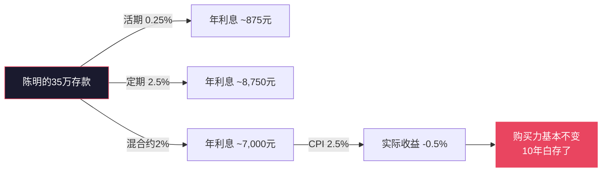
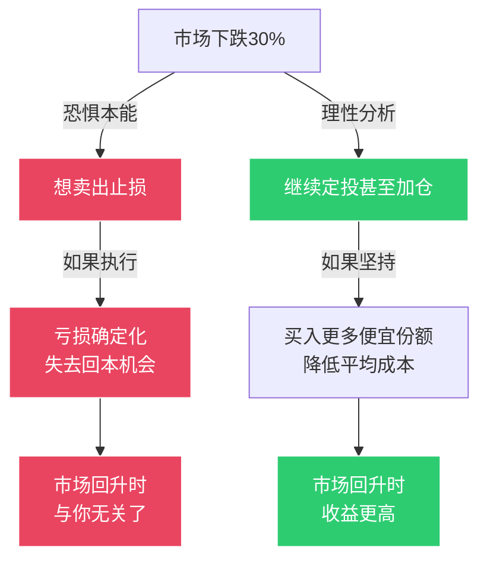
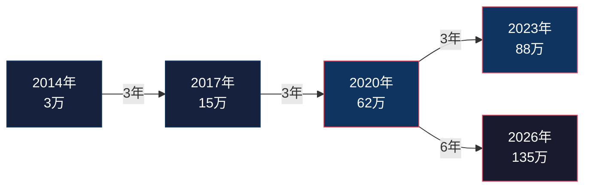
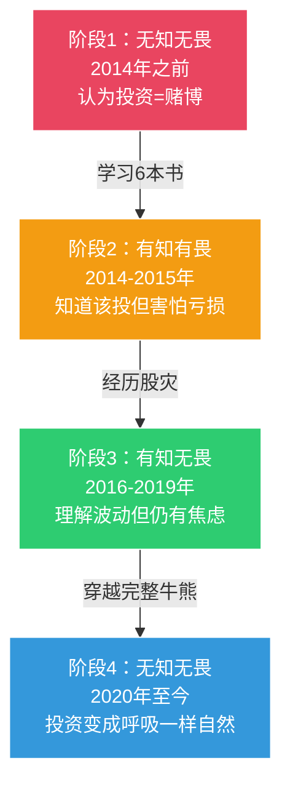

## 案例三：一个投资者的复利之路

> "复利不是魔法，而是一种纪律——你只需要做两件事：开始，然后不要停下。"

前面的案例分别展示了"个人从零开始"和"家庭协同作战"的财务转型路径。这个案例聚焦于投资本身——一个普通上班族如何从对投资一无所知，到建立一套穿越牛熊的复利系统，并在12年后亲眼见证"时间的玫瑰"绽放。这个案例的核心价值在于：**让你看到复利不是一个抽象的数学公式，而是一段真实的心理博弈和行为管理历程。**

---

### 案例背景：一个"投资恐惧症患者"的起点

陈明，32岁，某制造业公司质量工程师，坐标苏州，月薪1.5万元（税后约1.25万）。工作10年，性格谨慎保守，属于典型的"高储蓄、零投资"类型。

**起点画像：**

| 维度 | 状态 | 评价 |
|------|------|------|
| 月收入 | 12,500元（税后） | 苏州中等水平 |
| 月支出 | 7,500元 | 简朴型生活 |
| 月储蓄 | 5,000元 | 储蓄率40%，相当优秀 |
| 存款总额 | 35万元 | 全部躺在银行活期和定期里 |
| 投资经验 | 零 | 从未买过任何基金、股票、债券 |
| 投资认知 | 负面 | "股市就是赌场""理财都是骗人的" |
| 风险偏好 | 极度保守 | 宁可少赚也不愿亏一分钱 |

**陈明的投资恐惧从何而来？**

他的父亲在2007年A股6000点高位冲入股市，投入20万积蓄，随后遭遇2008年金融危机，亏损超过60%，割肉离场。这件事给少年时期的陈明留下了深刻的心理烙印——**投资 = 赌博 = 亏钱**。心理学上，这叫"替代性创伤"（Vicarious Trauma）：自己没有亲身经历，但通过观察他人的痛苦经历形成了强烈的恐惧反应。

这种恐惧让陈明在过去10年里做了一个"看起来很安全"的选择：把所有钱存在银行。35万元存款，按银行活期0.25%+定期2.5%的混合利率计算，年利息约7000元。而同期CPI年均涨幅约2.5%——**他的存款实际购买力基本没有增长，10年的"安全"换来的是"原地踏步"。**



**转折点：一次偶然的对话**

2014年初，陈明的同事老张在茶水间聊起自己过去5年的投资经历：从2009年开始每月定投2000元到沪深300指数基金，到2014年初账户里已经有了18万，其中本金只有12万，收益6万。老张说了一句话打动了陈明："我什么都没做，就是每月自动扣款，然后忘了它。"

这句话击中了陈明——**"什么都没做"恰恰是他最喜欢的投资方式。** 他不需要盯盘、不需要选股、不需要做任何复杂的操作。他只需要设置一个自动扣款，然后继续过自己的生活。

但恐惧仍然在。他花了3个月时间做了一件事：系统性学习。不是随便看几篇公众号文章，而是认真读了6本书，从最基础的概念开始搭建自己的投资认知体系。

**陈明的3个月学习书单：**

| 阶段 | 书籍 | 核心收获 | 阅读难度 |
|------|------|---------|---------|
| 入门 | 《小狗钱钱》 | 投资的基本概念，复利的力量 | ★☆☆☆☆ |
| 入门 | 《穷爸爸富爸爸》 | 资产vs负债的区别，被动收入 | ★★☆☆☆ |
| 理念 | 《漫步华尔街》 | 市场有效性，指数投资的逻辑 | ★★★☆☆ |
| 实操 | 《指数基金投资指南》 | 具体的定投方法和基金选择 | ★★☆☆☆ |
| 心理 | 《思考，快与慢》 | 认知偏差、损失厌恶、决策陷阱 | ★★★★☆ |
| 深度 | 《共同基金常识》 | 费率对长期收益的巨大影响 | ★★★☆☆ |

这6本书让陈明建立了一个关键认知：**投资的风险不在于市场波动，而在于你是否理解自己在做什么、以及能否坚持既定策略。** 他父亲亏钱不是因为"股市是赌场"，而是因为在6000点高位追涨、在1600点低位割肉——完美地做了"高买低卖"。

---

### 第一阶段：小心翼翼的开始（2014-2015年）

> 核心突破：从"知道"到"做到"——克服行动恐惧

#### 1. 第一笔投资：1000元的心理突破

2014年4月，陈明做了人生第一笔投资：在天天基金App上申购了1000元的沪深300指数基金。他选择的是费率最低的一只（管理费0.5%+托管费0.1%），跟踪误差小，规模超过100亿。

**为什么只投1000元？**

这不是因为没钱——他银行里躺着35万。而是因为他需要一个"心理适应期"。就像不会游泳的人第一次下水，你需要先在浅水区站一会儿，让身体适应水温，而不是直接跳进深水区。1000元是一个"亏了也不心疼"的金额，但足以让他体验完整的投资流程：买入、查看净值波动、感受账面盈亏带来的情绪变化。

**第一周的心理体验：**

陈明每天打开App看一次净值。第一天涨了3元，他有点开心；第二天跌了5元，他有点焦虑；第三天涨了2元，他松了一口气。这种每天盯着净值看的行为，在投资心理学中叫"短视损失厌恶"（Myopic Loss Aversion）——研究表明，投资者查看账户的频率越低，感知到的风险就越低，实际获得的收益也越高。因为市场的短期波动是随机的（像掷硬币），但长期趋势是向上的。频繁查看只会让你看到更多的"下跌日"，增加焦虑。

这个发现让陈明做了一个重要决定：**把App的通知全部关闭，每周只看一次账户。**

#### 2. 从1000元到每月3000元的定投

经过两个月的"试水"，陈明确认了一件事：1000元的投资没有让他的生活发生任何变化——既没有因为亏钱而睡不着觉，也没有因为赚了钱而欣喜若狂。投资就像一个安静的"后台程序"，默默运行着。

于是他开始正式定投：

| 时间节点 | 定投金额 | 累计投入 | 心理状态 |
|---------|---------|---------|---------|
| 2014年4月 | 1,000元（试水） | 1,000元 | 紧张、好奇 |
| 2014年6月 | 2,000元 | 5,000元 | 开始适应 |
| 2014年9月 | 3,000元 | 14,000元 | 平静，形成习惯 |
| 2015年1月 | 3,000元（稳定） | 26,000元 | 完全自动化 |

**定投的"无脑"执行方案：**

陈明设置了一个极其简单的系统：

1. 工资卡绑定天天基金App
2. 每月15日自动扣款3000元（发工资后第3天）
3. 全部买入沪深300指数基金
4. 不看盘、不择时、不调仓

这个方案的哲学是：**既然我不知道明天市场是涨是跌，那我就不试图预测——我每月都买，涨了买、跌了也买，用时间来平滑成本。** 这就是定投的核心逻辑——"平均成本法"（Dollar Cost Averaging）。

#### 3. 2015年牛市：第一次考验

2014年下半年到2015年6月，A股经历了一轮疯狂的牛市。沪深300指数从2200点涨到5380点，涨幅超过140%。

陈明的定投账户从2.6万涨到了约4.8万，浮盈超过2万。他的同事们纷纷涌入股市：有人卖房炒股，有人借钱加杠杆，有人每天在办公室盯着K线图讨论"明天买什么"。

**三次诱惑与他的选择：**

| 诱惑 | 具体场景 | 陈明的内心挣扎 | 最终决定 |
|------|---------|--------------|---------|
| 加大投入 | 同事说"现在不买更待何时"，建议他把存款全部投入 | "35万如果翻倍就是70万……" | 拒绝。他的投资计划是每月3000元，不会因为市场涨就改变 |
| 买个股 | 同事推荐了一只"必涨"的科技股 | "万一是真的呢？" | 拒绝。他不理解个股，只投自己理解的指数基金 |
| 杠杆操作 | 有人用融资融券放大收益 | "他们赚得比我快多了……" | 拒绝。杠杆是双刃剑，他承担不起爆仓的风险 |

**陈明能抵抗诱惑的原因，不是他比别人更聪明，而是他在投资前就给自己定了一套"铁律"：**

```text
陈明的投资铁律（写在手机备忘录里）
========================================

1. 每月定投3000元，不多不少
2. 只投指数基金，不碰个股
3. 不借钱投资，不用杠杆
4. 不预测市场，不择时
5. 市场涨了——继续投
6. 市场跌了——继续投
7. 别人赚得比我多——关我什么事
8. 每年审视一次组合，其他时间不看
```

这套铁律的本质是：**用规则替代判断，用系统替代情绪。** 当市场疯狂时，规则帮你冷静；当市场恐慌时，规则帮你坚持。

---

### 第二阶段：2015-2016年股灾——真正的考验

> 核心突破：在恐惧中坚持——理解"下跌是定投的朋友"

#### 1. 股灾来了

2015年6月，A股从5178点的高位急转直下，开始了惨烈的暴跌。短短两个月，沪深300从5380点跌到2950点，跌幅超过45%。千股跌停、融资爆仓、恐慌蔓延——陈明的同事们在这轮股灾中损失惨重：

| 同事 | 操作 | 结果 |
|------|------|------|
| 同事A | 5000点满仓，4000点借钱补仓 | 爆仓，亏损60万，两年积蓄归零 |
| 同事B | 4500点获利了结，3500点抄底，3000点割肉 | 亏损15万 |
| 同事C | 全程持仓不卖 | 浮亏40%，但没割肉，后来回本 |
| 陈明 | 继续每月定投3000元 | 账面浮亏约30%，但继续买入 |

**陈明的账户变化：**

| 时间 | 沪深300点位 | 累计投入 | 账户市值 | 浮盈/亏 |
|------|-----------|---------|---------|---------|
| 2015年6月（高点） | 5380 | 约5万 | 约8万 | +60% |
| 2015年8月（低点） | 2950 | 约5.6万 | 约4.2万 | -25% |
| 2016年2月（更低点） | 2821 | 约7.4万 | 约5.8万 | -22% |
| 2016年12月（回升） | 3310 | 约11万 | 约12万 | +9% |

#### 2. 那个最艰难的夜晚

2015年8月24日，A股遭遇"黑色星期一"，沪深300单日暴跌8.75%，千股跌停。陈明的账户一天之内缩水了近5000元——相当于他一个多月的定投金额。

那天晚上，陈明躺在床上，盯着天花板，脑子里反复出现一个声音："赶紧卖吧，再不卖连底裤都没了。"他甚至打开了App，手指悬在"赎回"按钮上方。

**他最终没有按下去。** 原因有三个：

**原因一：他算了一笔账。** 如果现在卖出，他的亏损是确定的——约1.5万元。但如果继续持有，亏损只是"账面的"——只要不卖，就没有真正亏损。他想起了学习时看到的一句话：**"账面浮亏不是亏损，只有卖出的那一刻才变成真正的亏损。"**

**原因二：他回忆了2008年父亲的经历。** 父亲亏钱不是因为"买了股票"，而是因为"在最低点卖了股票"。如果父亲当时不卖，到2009年底就能回本，到2015年甚至能翻倍。**亏损不是最大的风险，最大的风险是在最低点离场，永远失去了回本的机会。**

**原因三：他重新审视了定投的数学逻辑。** 这是最关键的。定投的本质是"在低价时买入更多份额"——市场下跌30%意味着同样的3000元能买到比之前多43%的份额。这些"便宜份额"会在市场回升时带来超额收益。**下跌不是定投的敌人，而是定投的朋友。**



#### 3. 股灾带来的意外收获

陈明不仅没有卖出，还做了一个反直觉的决定——**在2015年9月额外加仓1万元**。他从银行存款中取出1万元，趁市场低位买入指数基金。

这笔"恐慌中的加仓"后来成为他整个投资生涯中收益率最高的一笔操作。到2017年底，这1万元变成了约1.8万元，收益率80%。

**股灾教会陈明的三件事：**

1. **波动不是风险，永久性亏损才是风险。** 只要你投资的是优质指数（如沪深300），短期下跌一定会回升——因为指数代表的是中国经济中最优秀的一批企业，只要经济在增长，指数就会长期向上。
2. **定投的真正优势在下跌时体现。** 上涨时定投是在"追涨"，下跌时定投才是"抄底"。大多数人恰恰相反——上涨时加仓，下跌时停止。
3. **你最大的敌人不是市场，而是自己的情绪。** 恐惧会让你在最不该卖的时候卖出，贪婪会让你在最不该买的时候买入。一套预设的投资纪律，是抵抗情绪的唯一武器。

---

### 第三阶段：穿越牛熊的定投系统（2016-2020年）

> 核心突破：从"手动坚持"到"系统自动运行"

#### 1. 定投金额的动态调整

随着收入增长和投资信心增强，陈明逐步提升了定投金额：

| 年份 | 月薪（税后） | 月定投金额 | 定投占收入比 | 备注 |
|------|------------|-----------|------------|------|
| 2014年 | 12,500元 | 3,000元 | 24% | 初始阶段 |
| 2016年 | 13,000元 | 4,000元 | 31% | 经历股灾后更有信心 |
| 2018年 | 14,500元 | 5,000元 | 34% | 加薪后提升 |
| 2020年 | 15,000元 | 6,000元 | 40% | 系统成熟，加大投入 |

**定投金额的调整原则：** 不是随意增加，而是遵循一个公式——**定投金额 = (月收入 - 月必要支出) × 50%**。也就是说，可投资金额的一半用于定投，另一半作为"弹药库"积累，等待市场大跌时加仓。

#### 2. 从单一基金到资产配置

2017年，陈明在阅读了《共同基金常识》后，意识到自己100%投入A股指数基金过于集中。他开始构建一个简单的资产配置：

| 资产类别 | 配置比例 | 具体标的 | 选择理由 |
|---------|---------|---------|---------|
| 沪深300指数基金 | 40% | 天弘沪深300 | A股大盘蓝筹 |
| 中证500指数基金 | 25% | 天弘中证500 | A股中小盘成长 |
| 恒生指数基金 | 15% | 华夏恒生ETF | 分散A股单一市场风险 |
| 纯债基金 | 20% | 易方达纯债 | 降低组合波动 |
| **合计** | **100%** | — | — |

**为什么加入债券基金？** 陈明从股灾中学到的教训是：100%股票型基金在暴跌时心理压力太大。加入20%的债券基金后，即使股票部分下跌30%，整体组合只下跌24%——这个"缓冲垫"让他在市场恐慌时更容易坚持不卖。

**为什么加入港股？** 2015年A股暴跌时，港股跌幅相对较小。不同市场的相关性较低，配置多个市场可以降低单一市场风险。这不是为了"赚更多"，而是为了"亏更少"——在投资中，控制回撤比追求收益更重要。

#### 3. 再平衡纪律

陈明每年1月做一次"再平衡"——把各类资产的比例恢复到目标配置。

**再平衡的操作示例：**

假设一年后，由于A股大涨，股票类资产占比从80%变成了88%，债券从20%降到了12%。再平衡就是卖出部分股票基金，买入债券基金，恢复80:20的比例。

**为什么要再平衡？** 表面上看，卖出涨得多的资产、买入涨得少的资产似乎在"减少收益"。但再平衡的本质是**纪律性的"高卖低买"**——你自动地在涨得多的资产上获利了结，在跌得多的资产上低位加仓。长期来看，再平衡能提升1-2%的年化收益，更重要的是能控制组合风险。

陈明的再平衡规则：

1. 每年1月第一个工作日执行
2. 偏离目标比例超过5个百分点才调整
3. 调整时考虑税费和交易成本，尽量最小化操作
4. 如果当年市场大跌超过20%，额外执行一次再平衡（卖出债券，买入股票）

#### 4. 2018年熊市：第二次考验

2018年，A股再次进入熊市，沪深300全年下跌25.3%。这是陈明投资以来的第二次重大下跌。

与2015年不同的是，这次陈明没有恐慌。原因有三：

1. **他已经经历过一次完整的牛熊周期**，知道市场一定会回来
2. **他的资产配置中20%的债券基金起到了缓冲作用**，整体组合只下跌了约20%
3. **他已经把投资完全自动化了**——自动扣款、自动买入，他甚至不太关注市场

**2018年熊市中陈明的操作：**

| 月份 | 操作 | 理由 |
|------|------|------|
| 全年每月 | 继续定投5000元 | 纪律，不因市场下跌而改变 |
| 10月（市场恐慌期） | 额外加仓1万元 | 从弹药库中取出，低位买入 |
| 12月底 | 执行再平衡 | 卖出部分债券，买入股票，恢复比例 |

**2018年熊市的"战果"：** 由于全年持续定投，陈明在低位买入了大量便宜份额。2019年A股反弹，沪深300上涨36%，他的组合收益率达到42%——**因为他不仅享受了上涨，还享受了"下跌时买入的便宜份额"带来的超额收益。**

---

### 第四阶段：复利开始加速（2020-2023年）

> 核心突破：从"积累期"到"收获期"——看到复利的指数曲线

#### 1. 资产规模的关键节点

| 年份 | 累计投入 | 账户市值 | 累计收益 | 收益率 | 复利占比 |
|------|---------|---------|---------|--------|---------|
| 2014年底 | 3万 | 3.2万 | 0.2万 | +7% | 6% |
| 2016年底 | 11万 | 12万 | 1万 | +9% | 8% |
| 2018年底 | 24万 | 22万 | -2万 | -8% | 亏损中 |
| 2019年底 | 30万 | 42万 | 12万 | +40% | 29% |
| 2020年底 | 37万 | 62万 | 25万 | +68% | 40% |
| 2022年底 | 50万 | 68万 | 18万 | +36% | 26% |
| 2023年底 | 56万 | 88万 | 32万 | +57% | 36% |
| 2026年中 | 65万 | 135万 | 70万 | +108% | 52% |

**关键观察：复利占比从6%增长到52%。** 这意味着，陈明的135万资产中，有70万是"钱生出来的钱"——**他的投资收益已经超过了他的总投入。** 这就是复利的"拐点效应"：前期增长缓慢（积累本金），后期加速增长（收益产生收益）。



#### 2. 复利的数学验证

陈明用自己的真实数据验证了本章1.4节讲的复利公式。以下是他的定投复利计算：

**假设条件：** 每月定投5000元，年化收益率8%（陈明的实际年化约为9.2%）

| 投资年限 | 累计投入 | 账户总额 | 复利收益 | 收益占本金比 |
|---------|---------|---------|---------|------------|
| 5年 | 30万 | 36.7万 | 6.7万 | 22% |
| 10年 | 60万 | 91.5万 | 31.5万 | 53% |
| 15年 | 90万 | 173.5万 | 83.5万 | 93% |
| 20年 | 120万 | 294.5万 | 174.5万 | 145% |
| 25年 | 150万 | 475.5万 | 325.5万 | 217% |
| 30年 | 180万 | 745.2万 | 565.2万 | 314% |

**看第30年那一行：投入180万，最终得到745万，其中565万是复利产生的——是本金的3倍多。** 这就是"时间的玫瑰"：你只需要做一件事——开始，然后不要停下。

陈明在第12年（2026年）的数据与理论预测基本吻合，验证了复利公式在真实世界中的有效性。

#### 3. 2020年疫情：第三次考验

2020年2-3月，新冠疫情爆发，全球股市暴跌。A股沪深300在短短一个月内下跌了16%，美股标普500更是暴跌34%。

陈明的组合在一个月内缩水了约10万。但这次，他的反应与2015年截然不同：

| 对比维度 | 2015年股灾 | 2020年疫情暴跌 |
|---------|-----------|--------------|
| 恐慌程度 | 夜不能寐，差点卖出 | 看了一眼账户，关掉了App |
| 操作 | 继续定投+额外加仓1万 | 继续定投+额外加仓2万 |
| 心态 | "我应该坚持吧？" | "这是打折促销，买就对了" |
| 恢复时间 | 约2年回本 | 6个月回本并创新高 |

**从2015年到2020年，陈明的心理状态发生了根本性转变：从"恐惧中坚持"变成了"平静中加仓"。** 这不是因为他变得更勇敢了，而是因为他已经有了足够的经验和认知——他亲眼见过市场下跌后一定会回升，他亲身体验过"在低位买入的份额最终带来了超额收益"。

**认知升级的阶梯：**



注意这里的"无知无畏"出现了两次，但含义完全不同：第一个"无知无畏"是不知道风险所以不怕（危险），第四个"无知无畏"是已经内化了投资纪律所以不需要刻意"怕"或"不怕"（境界）。

---

### 第五阶段：从投资者到"复利布道者"（2023年至今）

> 核心突破：从"自己赚钱"到"帮助他人理解复利"

#### 1. 陈明的"复利教育"实践

2023年，陈明在公司内部做了一次分享，主题是"一个工程师的12年定投之路"。他展示了自己从35万存款到135万投资资产的全过程，包括每一次大跌时的心理挣扎和操作决策。

这次分享产生了意想不到的影响：

| 影响对象 | 反应 | 后续 |
|---------|------|------|
| 同事A（35岁，月光族） | "原来不需要很多钱就能开始投资" | 开始每月定投1000元 |
| 同事B（40岁，有存款不敢投） | "原来定投不需要选股" | 开始定投沪深300 |
| 同事C（28岁，炒个股亏了5万） | "原来指数基金长期不亏" | 卖掉个股，转投指数基金 |
| 妻子 | "原来你这12年不是在'玩股票'，是在建系统" | 开始理解并支持他的投资行为 |

**陈明总结的"复利教育"核心信息：**

1. **复利不挑起点。** 每月1000元和每月10000元，在复利面前的差别远没有"开始vs不开始"的差别大。每月1000元定投30年（年化8%），最终约150万。
2. **复利不挑智商。** 你不需要选股能力、不需要看懂财报、不需要预测市场。指数基金定投是最"笨"也最有效的投资方式。
3. **复利只挑一件事——坚持。** 中断定投、恐慌卖出、频繁调仓——这些行为是复利最大的敌人。只要你能做到"开始然后不停下"，时间会完成剩下的工作。

#### 2. 陈明的"复利思维"在非投资领域的应用

陈明发现，复利思维不仅适用于投资，还适用于人生的方方面面：

| 领域 | 复利思维的应用 | 12年后的结果 |
|------|--------------|-------------|
| 健康 | 每天跑步30分钟（"健康定投"） | 44岁，体能比32岁时更好 |
| 技能 | 每天学习30分钟英语（"能力定投"） | 能流利阅读英文技术文档，薪资提升30% |
| 人脉 | 每周联系一位老朋友（"关系定投"） | 建立了稳固的职业人脉网络 |
| 知识 | 每年读50本书（"认知定投"） | 从工程师成长为部门技术总监 |

**这是本章1.4节"复利思维与长期主义"的最佳注脚：复利不仅是一种投资策略，更是一种人生哲学。** 任何需要长期积累的领域，都可以用"定投思维"来经营——找到正确的方向，持续投入，然后让时间完成复利。

---

### 12年投资全景数据

#### 财务数据汇总

| 指标 | 起点（2014年） | 第12年（2026年中） | 变化 |
|------|---------------|-------------------|------|
| 月收入（税后） | 12,500元 | 18,000元 | +44% |
| 月支出 | 7,500元 | 8,500元 | +13%（通胀调整后实际下降） |
| 月储蓄 | 5,000元 | 9,500元 | +90% |
| 银行存款 | 35万 | 15万（应急基金） | 转化为投资资产 |
| 投资资产 | 0 | 135万 | 从零到135万 |
| 投资年化收益 | — | 9.2% | 跑赢通胀7个百分点 |
| 总资产 | 35万 | 150万 | +329% |
| 被动收入（年） | 0 | 约12万 | 每月约1万 |
| 投资认知 | "股市=赌场" | "复利=人生哲学" | 根本性转变 |

#### 投资收益分解

| 收益来源 | 金额 | 占总收益比 |
|---------|------|----------|
| 定投本金（每月投入累计） | 65万 | — |
| 低买高卖的波段收益（再平衡） | 约8万 | 11% |
| 定投的平均成本效应 | 约15万 | 21% |
| 复利收益（收益再投资产生收益） | 约47万 | 68% |
| **总收益** | **70万** | **100%** |

**68%的收益来自复利——这就是"时间的玫瑰"。** 陈明的案例完美验证了爱因斯坦那句话："复利是世界第八大奇迹。理解它的人赚取它，不理解它的人支付它。"

---

### 案例复盘：关键成功因素分析

陈明的投资之路看似平淡——没有一夜暴富的传奇，没有精准抄底的神操作，甚至没有什么值得"炫耀"的战绩。但正是这种"平淡"，恰恰是复利成功的核心。

#### 因素一：从学习开始，而不是从冲动开始

陈明在投资前花了3个月系统学习，读了6本书。这让他建立了正确的投资认知框架，避免了大多数人"听消息炒股""跟风买基金"的陷阱。**学习的投入产出比是最高的——3个月的学习，可能为你省下10年的弯路。**

#### 因素二：用规则替代判断

陈明的投资铁律——每月定投、只投指数、不择时、不加杠杆——看似简单，但在市场极端波动时，这些规则成了他最可靠的"锚"。当情绪告诉你"快卖"的时候，规则告诉你"继续"。**规则的力量在于：它不依赖于你的判断力，而判断力在压力下是最容易崩溃的。**

#### 因素三：把投资变成"自动驾驶"

自动扣款、自动买入、自动再平衡——陈明把投资的每一个环节都自动化了。这意味着他不需要每天做决策，不需要消耗意志力来"坚持"。**最好的坚持不是靠毅力，而是靠系统。当投资变成了像交水电费一样自动的事情，你就不会"忘记"或"中断"。**

#### 因素四：把下跌当作"打折促销"

这是陈明最核心的投资哲学转变：从"下跌=亏损=恐惧"变成"下跌=打折=机会"。2015年股灾时他额外加仓1万，2018年熊市加仓1万，2020年疫情加仓2万——这三次"恐慌中的加仓"为他贡献了超过15万的额外收益。**能在下跌时买入的人，才能真正享受复利的全部威力。**

#### 因素五：让时间站在自己这一边

12年的坚持，让复利从"数学概念"变成了"真实体验"。陈明亲眼看到自己的资产从3万增长到135万，亲眼看到复利收益从0.2万增长到70万。**复利不是你"相信"就会发生的，而是你"坚持"才会发生的。** 那些在第3年、第5年放弃的人，永远不会看到第12年的风景。

---

### 可复用的方法论：投资者的复利路线图

如果你想像陈明一样走上复利之路，以下是经过验证的步骤：

**第一步（第1-3个月）：建立认知基础**
- 至少读3本投资入门书（推荐《小狗钱钱》《漫步华尔街》《指数基金投资指南》）
- 理解复利的数学原理（72法则、定投复利公式）
- 理解市场波动的本质（短期随机，长期向上）
- 搞清楚指数基金是什么、为什么适合普通人

**第二步（第4-6个月）：小额试水**
- 用1000元买第一只指数基金，体验完整流程
- 设置自动定投（从月收入的10%开始）
- 关闭App推送通知，每周只看一次账户
- 记录自己的心理变化（焦虑、兴奋、恐惧），建立"情绪觉察"

**第三步（第7-12个月）：建立系统**
- 确定资产配置比例（新手建议：70%股票指数+30%债券）
- 设置自动扣款日期（建议发工资后2-3天）
- 写下自己的"投资铁律"，保存在手机里
- 逐步提升定投金额到月可投资金额的50%

**第四步（第2-3年）：经历第一次下跌**
- 这是最重要的"毕业考试"——市场下跌时能否坚持定投
- 如果恐慌，重新阅读投资书籍中关于"下跌是定投的朋友"的章节
- 考虑在大跌时从"弹药库"中额外加仓
- 做第一次年度再平衡

**第五步（第4-5年）：优化与深化**
- 根据经验调整资产配置比例
- 学习更多投资知识（估值指标、宏观经济基础）
- 开始关注费率对长期收益的影响
- 将投资思维扩展到人生其他领域

**第六步（第5年以后）：享受复利的加速期**
- 复利收益开始超过每年的投入金额
- 投资从"需要坚持"变成"自然而然"
- 开始帮助身边的人理解复利
- 每年做一次全面的财务复盘

---

### 常见问题与误区

**问：我没有35万存款，能开始定投吗？**

完全可以。定投的门槛极低——很多基金10元就能起投。陈明的35万存款其实是"负担"而非"优势"，因为他因为"有钱所以安全"的错觉而推迟了10年才开始投资。如果你每月只能投500元，那就从500元开始。**重要的不是金额，而是"开始"和"持续"。**

**问：年化8-10%的收益是不是太乐观了？**

沪深300指数过去20年的年化收益约为9-10%（含分红再投资）。陈明12年的实际年化是9.2%。但需要注意：（1）过去不代表未来，（2）这是长期持有的收益，中间可能有30-50%的回撤，（3）定投的收益通常略低于一次性投入（因为你在上涨过程中也在买入）。保守估计，用7-8%做规划是合理的。

**问：指数基金那么多，我该选哪只？**

选基金的标准按优先级排序：（1）费率低（管理费+托管费低于0.6%），（2）跟踪误差小（越接近指数越好），（3）规模大（大于10亿元），（4）成立时间长（超过3年）。具体到A股，跟踪沪深300和中证500的主流基金差异不大，选费率最低的即可。

**问：如果我需要用钱怎么办？**

这就是为什么要先建应急基金。投资的钱应该是"3-5年内不需要用的钱"。如果急需用钱而被迫在市场低点卖出投资，就完美地做了"高买低卖"。陈明的做法是：银行留15万应急基金（覆盖约18个月支出），投资的钱"锁死"不动。

**问：定投中途断了几个月，还能继续吗？**

当然能。定投不是连续性运动，中断几个月不会"作废"之前的积累。但要注意：不要因为"觉得现在不是好时机"而中断——如果你在寻找"完美时机"，你可能永远不会开始。**最好的开始时间是10年前，其次是现在。**

**问：要不要跟着"大V"买基金？**

不要。"大V"推荐基金时，市场往往已经涨了很多（因为热度高）。等你看到推荐时，你是在"追涨"。而且"大V"不需要对你的亏损负责——他们靠流量赚钱，你靠投资赚钱，利益不一致。**最好的投资策略是最无聊的那个：指数基金+定投+长期持有。**

---

### 本案例对应的核心知识

本案例是本章多个核心概念的"实战检验场"：

| 案例环节 | 对应知识点 | 核心概念 |
|---------|----------|---------|
| 陈明的投资恐惧 | 1.1 重新认识金钱 | 金钱观受成长经历塑造 |
| 抵抗牛市诱惑 | 1.2 财富心理学 | 贪婪与恐惧、从众心理 |
| 应对股灾不卖出 | 1.2 财富心理学 | 损失厌恶、短视损失厌恶 |
| 应急基金的建立 | 1.3 财务自由的定义与标准 | 财务安全垫 |
| 12年定投的复利增长 | 1.4 复利思维与长期主义 | 复利效应、72法则、长期主义 |
| 资产配置与再平衡 | 1.5 风险与收益的辩证关系 | 分散化、风险控制 |
| 投资铁律的制定 | 1.2 财富心理学 | 用系统替代情绪决策 |
| 复利思维的跨领域应用 | 1.4 复利思维与长期主义 | 复利是人生哲学 |

> **本案例的核心启示：** 复利不需要你聪明，不需要你有钱，不需要你有内幕消息。它只需要你做一件事——**开始，然后不要停下**。陈明不是天才投资者，他是一个普通人，用最笨的方法（指数基金定投），在最无聊的节奏（每月自动扣款）中，获得了大多数人梦寐以求的结果。这不是运气，这是复利的确定性。如果你还没有开始投资，今天就是最好的开始时间——因为复利的每一天都在计息，而你缺席的每一天，都是永远追不回来的。
