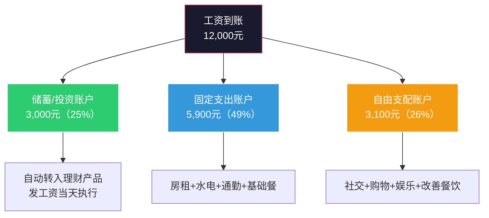

## 案例四：从消费思维到投资思维的转变

> "穷人买消费品，中产买负债，富人买资产——区别不在收入高低，而在每一块钱花出去时大脑里的决策回路。"

前面三个案例分别展示了"个人从零到一""家庭协同作战""投资者穿越牛熊"的路径。这个案例的焦点更底层——**思维方式本身的转变**。案例主角林瑶的收入在转变前后并没有飞跃式增长，但她对"每一块钱应该怎么用"的理解发生了根本性重构，最终让一个普通收入者在8年内积累了远超同龄人的净资产。这个案例的核心价值在于：**让你看到消费思维和投资思维不是两种"知识"，而是两套完全不同的操作系统——切换操作系统比安装几个应用重要得多。**

---

### 案例背景：一个"高收入月光族"的真实画像

林瑶，26岁入职时，坐标杭州，某互联网公司运营岗，月薪到手1.2万元。到30岁时涨到税后2.2万元，收入在同龄人中处于中上水平。但她的财务状况却令人担忧。

**起点画像（26岁，2016年）：**

| 维度 | 状态 | 评价 |
|------|------|------|
| 月收入（税后） | 12,000元 | 互联网行业新人正常水平 |
| 月支出 | 11,800元 | 几乎100%花光 |
| 月储蓄 | 约200元 | 名义储蓄，实际经常为零 |
| 存款 | 8,000元 | 工作一年的全部积累 |
| 负债 | 花呗分期3,200元 | 新买的AirPods和护肤品 |
| 资产 | 零 | 没有任何投资 |
| 消费习惯 | 即时满足型 | 想到就买，买了就后悔 |

**林瑶的月度支出明细（2016年）：**

| 类别 | 金额 | 占比 | 详情 |
|------|------|------|------|
| 房租 | 3,500元 | 30% | 合租单间，离公司地铁3站 |
| 餐饮 | 3,200元 | 27% | 工作日外卖+周末聚餐，偶尔打卡网红店 |
| 通勤 | 800元 | 7% | 地铁+偶尔打车 |
| 购物 | 2,500元 | 21% | 衣服、化妆品、电子产品、各种"种草"好物 |
| 娱乐 | 1,200元 | 10% | 视频会员、游戏充值、偶尔看展 |
| 社交 | 600元 | 5% | 朋友生日礼物、团建AA |
| **合计** | **11,800元** | **100%** | — |

**关键问题：** 11,800元支出中，有多少是"必要支出"，有多少是"可优化支出"？

- 必要支出（维持基本生活）：房租3500 + 基础餐饮1800 + 通勤600 = **5,900元**（50%）
- 品质提升支出（合理但可优化）：改善餐饮1400 + 基础娱乐300 + 社交600 = **2,300元**（19%）
- 冲动消费/非必要支出：购物2500 + 过度娱乐900 = **3,400元**（29%）
- 债务利息：花呗分期手续费 = **200元**（2%）

**近三分之一的支出花在了"买完就后悔"的东西上。** 这就是消费思维的核心特征：用金钱交换即时快感，而快感消退后什么都没有留下。

---

### 消费思维的深层解剖：为什么我们总是"忍不住"？

在展示林瑶的转变之前，有必要深入理解消费思维的运作机制。这不是简单的"自控力差"——背后有一套完整的行为经济学和神经科学逻辑。

#### 消费思维的四重驱动力

**驱动力一：多巴胺驱动的即时满足**

神经科学研究表明，人在"期待购买"时，大脑伏隔核（Nucleus Accumbens）的多巴胺分泌量甚至超过"实际拥有"时。换句话说，**购物的快感主要发生在下单那一刻，而不是使用的时候。** 这解释了为什么林瑶经常买完东西就后悔——多巴胺在下单后迅速消退，留下的是空虚和账单。


**驱动力二：社会比较与身份焦虑**

"同事都用最新款iPhone""朋友圈里都在打卡米其林""小红书上同龄人都在精致生活"——社交媒体把消费变成了社交货币。林瑶后来回忆："我买东西不是因为需要，是因为不买就觉得'掉队了'。"

行为经济学家罗伯特·弗兰克（Robert Frank）在《奢侈病》中指出：**当参照群体的消费水平上升时，个体会感到巨大的"相对剥夺感"，即使自己的绝对生活水平在提高。** 这种心理在社交媒体时代被无限放大。

**驱动力三：商家精心设计的"消费陷阱"**

现代零售业的核心能力不是生产好产品，而是制造购买冲动：

| 陷阱类型 | 具体手段 | 林瑶中招案例 |
|---------|---------|-------------|
| 锚定效应 | 原价999，现价299 | "省了700！"实际这件东西本来就不值999 |
| 稀缺效应 | "限时3小时""仅剩5件" | 黑五囤了一堆用不完的护肤品 |
| 捆绑销售 | 满300减50 | 为了凑单多买了150元不需要的东西 |
| 分期免息 | "每天只要3.3元" | 把3200元的耳机"变成"无感的小额支出 |
| 情感绑定 | "你值得拥有""对自己好一点" | 把消费合理化为"自我关爱" |
| 沉没成本 | "已经花了2000积分，再花1000就能兑换" | 为了凑积分买了更多不需要的东西 |

**驱动力四：缺乏"替代满足"**

林瑶当时的生活模式是"上班→刷手机→购物→上班"的循环。购物是她唯一的"奖励机制"和"情绪调节器"。当一个人缺乏其他获得满足感的渠道时，消费就会成为默认选项。

---

### 转折点：一本记账本引发的认知地震

#### 导火索事件

2017年春节，林瑶回家过年，看到母亲在用一个旧笔记本记账。她好奇翻了翻，发现母亲记录了过去5年的每一笔家庭支出——精确到买菜的零头。账本最后一页有一行字：

> "2012-2016年，家庭总收入89万，总支出87万，结余2万。五年白干了。"

母亲叹了口气说："你爸工资不低，我也不知道钱花哪了，就是存不下来。"

这句话像一颗石子投进林瑶心里——**她意识到自己正在重复母亲的命运。** 月薪1.2万，一个月花1.18万，5年后她也会得出同样的结论："白干了。"

#### 第一步：开始记账——"看见"自己的消费

回到杭州后，林瑶做的第一件事不是"省钱"，而是**记录每一笔支出**。她用了一个简单的记账App，坚持每天花2分钟记录。

**第一个月的"震撼教育"：**

记账30天后，林瑶看到自己的消费报告，震惊了：

| 类别 | 预估金额 | 实际金额 | 差距 |
|------|---------|---------|------|
| 购物 | "大概1000多" | 3,400元 | 差了2倍多 |
| 餐饮 | "也就2000" | 3,100元 | 差了50% |
| 娱乐 | "没花什么钱" | 1,500元 | 差了3倍 |

**所有人在没有记账时都会低估自己的消费。** 这是心理学中的"峰终定律"（Peak-End Rule）——我们只记得印象最深的几次消费（峰值），而忽略了那些"无痛"的小额支出。一天一杯30元的奶茶，一个月就是900元，但你根本不会觉得"花了900块买奶茶"。

**记账的核心价值不是"省钱"，而是"看见真相"。** 你无法改变你看不见的东西。

---

### 第一阶段：从"记账"到"预算"——建立金钱的控制权（第1-3个月）

> 核心突破：从"钱花完了才知道"到"钱还没花就已经分配好了"

#### 1. 建立"三账户体系"

记账一个月后，林瑶开始尝试把收入分配到三个独立账户：



**关键操作：发工资当天自动转出3000元。** 这利用了一个行为经济学原理——"心理账户"（Mental Accounting）。理查德·塞勒（Richard Thaler）的研究表明：人对不同"账户"里的钱有不同的消费态度。如果3000元一开始就不在"可花"的账户里，你就不会觉得自己"缺了3000元"；但如果月底"看看剩多少再存"，结果一定是存不下来。

**这就是消费思维和投资思维的第一个分水岭：**
- 消费思维：收入 - 支出 = 储蓄（有多少存多少，通常为零）
- 投资思维：收入 - 储蓄 = 支出（先存后花，消费是剩余）

#### 2. 建立"48小时冷静期"规则

林瑶给自己定了一个规则：**任何超过200元的非必要消费，必须等48小时再决定。**

48小时后，如果还想买，就买——但记录下来，观察自己事后是否后悔。一个月后她发现：**48小时后仍然想买的东西只有30%。** 另外70%的购买冲动在等待中自然消退了——多巴胺峰值过了，理性回来了。

**"冷静期"的进阶版——愿望清单法：**

林瑶把想买的东西记在一个"愿望清单"里，每月底回顾一次。她发现了一个有趣的规律：

| 月份 | 愿望清单新增 | 实际购买 | "存活率" |
|------|------------|---------|---------|
| 第1个月 | 23件 | 7件 | 30% |
| 第2个月 | 18件 | 4件 | 22% |
| 第3个月 | 12件 | 3件 | 25% |

清单在缩短——不是因为她在刻意控制，而是因为**记账和冷静期让她重新校准了"想要"和"需要"的边界。** 愿望清单新增数从23件降到12件，说明冲动触发的频率本身在下降。

---

### 第二阶段：从"省钱"到"重新分配"——金钱的意义被重定义（第4-8个月）

> 核心突破：从"少花钱"到"把钱花在更有价值的地方"

#### 1. 省下来的钱去哪了？

很多人把"消费转投资"理解为"苦行僧式省钱"——这是错误的。林瑶的做法是**重新分配，而非简单削减**。

**优化后的月度支出（2017年中期，月薪仍为12,000元）：**

| 类别 | 原金额 | 优化后 | 变化 | 优化方法 |
|------|--------|--------|------|---------|
| 房租 | 3,500元 | 3,500元 | 不变 | 这是硬性开支，不压缩生活底线 |
| 餐饮 | 3,200元 | 2,200元 | -1,000元 | 学做3道家常菜，周末自带午餐，减少网红店打卡 |
| 通勤 | 800元 | 600元 | -200元 | 提前规划路线，减少打车 |
| 购物 | 2,500元 | 800元 | -1,700元 | 冷静期+愿望清单，只买清单上"存活"下来的 |
| 娱乐 | 1,200元 | 500元 | -700元 | 取消不用的会员，用免费资源替代 |
| 社交 | 600元 | 600元 | 不变 | 社交不压缩，这是真实的人际关系投入 |
| **投资自己** | **0元** | **800元** | **+800元** | **新增项：买书、付费课程、行业社群** |
| **定投基金** | **0元** | **3,000元** | **+3,000元** | **新增项：自动定投沪深300** |
| **合计** | **11,800元** | **12,000元** | — | — |

**注意两个关键变化：**

1. **投资自己是新增项，不是从某个类别"挤"出来的。** 林瑶没有压缩社交和房租——这些是生活质量的底线。压缩的是购物冲动和无效娱乐，这些减少后对生活质量几乎零影响，因为她发现那些东西买了也没用几次。

2. **省下来的钱不是"存起来"，而是"重新投入"。** 3000元定投基金是"钱去工作"，800元投资自己是"我去升级"——两个方向都是在为未来创造更多价值。

#### 2. 消费观的根本重构：用"资产/负债"框架审视每一笔支出

林瑶从《富爸爸穷爸爸》中学到了一个关键框架：**资产是把钱放进你口袋的东西，负债是从你口袋拿走钱的东西。** 她把这个框架应用到了日常消费中：

| 购买物 | 消费思维判断 | 投资思维判断 | 结论 |
|--------|------------|------------|------|
| 3000元的新手机 | "旧手机还能用，但新手机拍照更好" | 新手机不会产生收入，是纯消费 | 旧手机再用一年 |
| 2000元的行业培训课 | "好贵，不如看看免费教程" | 学完可能带来升职加薪机会 | 投资，买入 |
| 500元的品牌卫衣 | "打折省了200" | 穿一年就过时，不产生价值 | 换成200元的基础款 |
| 1500元的专业机械键盘 | "写代码需要好键盘" | 提升编码效率和体验，长期使用 | 投资型消费，买入 |
| 300元的网红餐厅打卡 | "难得犒劳自己" | 吃完就没了，纯体验消费 | 改为100元的优质餐厅 |
| 999元的Kindle | "看书很贵吧" | 降低阅读成本，培养终身习惯 | 投资，买入 |

**这个框架不是让你变成一个"不消费的机器"，而是让你在消费前多问一个问题：** "这笔钱花出去，是让我的未来更值钱，还是只是让现在爽一下？"两种消费都有存在的价值，但比例决定了你的财富走向。

**消费思维 vs 投资思维的核心差异：**

| 维度 | 消费思维 | 投资思维 |
|------|---------|---------|
| 核心驱动力 | 即时满足 | 延迟满足 |
| 金钱观 | 钱是用来花的 | 钱是用来工作的 |
| 决策依据 | "我想要" | "我需要"+"它能带来什么" |
| 时间框架 | 关注当下 | 关注3-5年后的自己 |
| 对"贵"的定义 | 价格高 | 价值低于价格 |
| 对"便宜"的定义 | 价格低 | 价值高于价格 |
| 购物后的情绪 | 短暂兴奋→空虚 | 满足→持续受益 |
| 财富趋势 | 资产不增长或负增长 | 资产持续积累 |

---

### 第三阶段：从"投资者"到"价值创造者"——投资思维的全面渗透（第9-24个月）

> 核心突破：投资思维不再局限于金钱，而是渗透到时间、精力、关系的每一个决策中

#### 1. 投资思维在职业发展中的应用

林瑶发现，投资思维最深刻的影响不在理财，而在**职业选择**。

**消费思维的职业选择模式：**
- 选钱多的工作
- 下班后就不想工作的事
- 技能够用就行，不主动学习
- 把培训当负担

**投资思维的职业选择模式：**
- 选能让自己增值的工作（即使短期少赚）
- 下班后用一部分时间投资自己的技能
- 持续学习，让技能产生复利
- 把培训当福利

林瑶的具体行动：

| 行动 | 投入 | 回报 |
|------|------|------|
| 每晚花1小时学习数据分析（Python+SQL） | 800元课程费+300小时 | 6个月后成功转岗，月薪从1.2万涨到1.8万 |
| 每周写一篇运营复盘发在行业社群 | 每周2小时 | 被猎头注意到，收到2个面试机会 |
| 主动申请参与公司的跨部门项目 | 额外工作量+30% | 拓展了技能边界和内部人脉 |
| 花2000元参加行业峰会 | 一天时间+门票 | 认识了后来创业的合伙人 |

**投资思维的职业公式：**

```text
职业价值 = 核心技能 × 影响力半径 × 行业杠杆
```

- **核心技能**：你能做到别人做不到的事（投资时间学习）
- **影响力半径**：多少人知道你能做这件事（投资精力输出内容）
- **行业杠杆**：你所在的行业天花板有多高（投资判断力选赛道）

三个变量都需要"投资"才能增长，而且它们之间存在乘法关系——**提升任何一个，总价值都会成倍放大。**

#### 2. 投资思维在人际关系中的应用

林瑶意识到，人际关系也遵循"投资回报"逻辑，但回报不是金钱，而是**信任、机会和支持**。

**消费型社交 vs 投资型社交：**

| 维度 | 消费型社交 | 投资型社交 |
|------|-----------|-----------|
| 动机 | 消磨时间、寻找刺激 | 建立深度连接、互相成长 |
| 方式 | 无目的聚餐、KTV、酒局 | 主题交流、互相帮忙、资源互换 |
| 选择标准 | 谁有空就约谁 | 谁值得深度交往就优先 |
| 后果 | 花了钱，关系还是浮在表面 | 投入少，但关系牢固、有复利效应 |
| 典型场景 | 每周3次聚餐，每次200元 | 每月1次深度交流，请教行业前辈 |

林瑶的做法：把每周3次无效聚餐减少到1次，省下的时间和精力用来维护5-8个"高价值关系"——不是功利地"利用"别人，而是**真诚地与那些能互相促进成长的人建立深度连接。**

#### 3. 投资思维在时间管理中的应用

林瑶用投资思维重新审视了自己每天24小时的分配：

**时间审计（转变前）：**

| 时间段 | 活动 | 时长 | 投资/消费属性 |
|--------|------|------|-------------|
| 7:00-8:00 | 刷手机赖床 | 1h | 消费（即时快感） |
| 8:00-9:00 | 通勤 | 1h | 必要成本 |
| 9:00-18:00 | 工作 | 9h | 投资（换工资） |
| 18:00-19:00 | 通勤 | 1h | 必要成本 |
| 19:00-23:00 | 刷剧/购物/闲聊 | 4h | 消费 |
| 23:00-7:00 | 睡眠 | 8h | 必要成本 |
| **自由支配时间** | — | **5h** | **100%消费** |

**时间审计（转变后）：**

| 时间段 | 活动 | 时长 | 投资/消费属性 |
|--------|------|------|-------------|
| 7:00-7:30 | 晨间阅读 | 0.5h | 投资（知识积累） |
| 7:30-8:30 | 通勤+听播客 | 1h | 投资（碎片学习） |
| 9:00-18:00 | 工作（含30分钟刻意练习） | 9h | 投资（提升效率） |
| 18:00-19:00 | 通勤+听播客 | 1h | 投资 |
| 19:00-20:00 | 做饭+吃饭 | 1h | 消费（但比外卖健康且省钱） |
| 20:00-22:00 | 学习/副业探索 | 2h | 投资（技能复利） |
| 22:00-22:30 | 刷手机放松 | 0.5h | 消费（有意识的放松） |
| 22:30-7:00 | 睡眠 | 8.5h | 必要成本 |
| **自由支配时间** | — | **5.5h** | **投资90%+消费10%** |

**时间的复利效应：** 每天多投入2小时学习，一年就是730小时。按"一万小时定律"计算，13.7年就能成为某个领域的顶尖专家。即使不追求顶尖，3年后也足以从"运营专员"成长为"运营专家"——这直接转化为收入的阶梯式增长。

---

### 第四阶段：收入跃升后的"消费反弹"考验（第25-48个月）

> 核心突破：在有钱之后仍然保持投资思维——这是最难的考验

#### 1. 收入增长带来的新诱惑

转岗后，林瑶的月薪从1.2万涨到1.8万，一年后涨到2.2万。收入增长83%——这是投资思维带来的第一个复利成果。但收入增长也带来了新的考验：**生活方式膨胀（Lifestyle Inflation）**。

心理学中的"享乐适应"（Hedonic Adaptation）理论指出：**人对收入增长带来的幸福感是短暂的。** 研究表明，加薪后3-6个月，人的幸福感会回落到加薪前的水平——因为消费标准会自动升级到"匹配"新收入。

**林瑶身边同事的"加薪诅咒"：**

| 同事 | 加薪前月支出 | 加薪后月支出 | 支出增幅 | 实际多存了多少 |
|------|------------|------------|---------|-------------|
| 同事A | 9,000元 | 15,000元 | +67% | 0元（加了多少花多少） |
| 同事B | 11,000元 | 17,000元 | +55% | -1,000元（反而更紧了） |
| 同事C | 8,000元 | 18,000元 | +125% | 0元（升级了所有消费品） |
| 林瑶 | 9,000元 | 11,500元 | +28% | +6,500元（储蓄率从25%提升到53%） |

林瑶的做法：**支出增长幅度控制在收入增长幅度的三分之一以内。** 收入涨83%，支出只涨28%——多出来的全部进入投资账户。她把这叫做"三分之一定律"：加薪的钱，三分之一改善生活（这是合理的），三分之二投入未来。

#### 2. 消费升级的"有意识版本"

林瑶没有完全拒绝消费升级，而是做了**有选择的升级**：

| 升级项 | 投入 | 理由 |
|--------|------|------|
| 搬到离公司更近的房子 | 房租从3500涨到4200 | 每天省1小时通勤=每年省365小时，值得 |
| 换了一把好的人体工学椅 | 2,500元 | 每天坐8小时，保护腰椎是"身体投资" |
| 买了降噪耳机 | 1,200元 | 通勤时学习效率提升，两年用了超过1500小时 |
| 升级了护肤品 | 月增200元 | 皮肤是长期资产，基础护理值得投入 |

| 拒绝升级项 | 原因 |
|-----------|------|
| 换最新iPhone | 旧手机完全够用，新手机是"功能冗余" |
| 买奢侈品包 | 纯社交信号，不产生实际价值 |
| 升级健身房到高端会所 | 小区健身房完全能满足需求 |
| 买车 | 杭州公共交通发达，养车成本远超打车 |

**投资思维的消费哲学不是"不花钱"，而是"每一分钱都花在刀刃上"——让金钱为你创造长期价值，而不是短暂快感。**

---

### 成果数据：8年财务全景

#### 资产增长轨迹

| 年份 | 年龄 | 月收入（税后） | 月储蓄 | 累计净资产 | 关键事件 |
|------|------|-------------|--------|-----------|---------|
| 2016年 | 26岁 | 12,000元 | 200元 | 0.8万 | 月光边缘，开始记账 |
| 2017年 | 27岁 | 12,000元 | 3,000元 | 4.2万 | 建立三账户体系，开始定投 |
| 2018年 | 28岁 | 18,000元 | 6,000元 | 11.5万 | 转岗加薪，学习投资自己 |
| 2019年 | 29岁 | 22,000元 | 10,000元 | 24万 | 升职，三分之一定律 |
| 2020年 | 30岁 | 22,000元 | 11,500元 | 39万 | 疫情中加仓，副业收入启动 |
| 2021年 | 31岁 | 25,000元（含副业） | 13,000元 | 58万 | 副业收入稳定 |
| 2022年 | 32岁 | 28,000元（含副业） | 14,000元 | 78万 | 投资组合优化 |
| 2023年 | 33岁 | 30,000元（含副业） | 15,000元 | 102万 | 净资产突破100万 |

**8年时间，从存款0.8万到净资产102万。** 其中工资收入累计约180万，但消费只花了约100万——剩下的80万通过投资产生了约22万的收益。这就是消费思维到投资思维的量化差异。

#### 对比：如果没有转变

| 维度 | 实际结果（投资思维） | 假设结果（维持消费思维） | 差距 |
|------|-------------------|---------------------|------|
| 8年总收入 | 约180万 | 约180万 | 相同 |
| 8年总消费 | 约100万 | 约175万 | 75万 |
| 8年储蓄 | 约80万 | 约5万 | 75万 |
| 投资收益 | 约22万 | 0元 | 22万 |
| 净资产 | 102万 | 5万 | **20倍差距** |
| 职业发展 | 运营专家+副业 | 可能还是运营专员 | — |
| 抗风险能力 | 可支撑2年不工作 | 可支撑2周不工作 | — |

**收入相同，结果差20倍。** 这就是思维方式的力量——它不改变你赚多少，但决定你留住多少、增长多少。

---

### 消费思维到投资思维的转变路线图

如果你想像林瑶一样完成这个转变，以下是经过验证的分阶段路径：

#### 第一阶段：觉察期（第1-30天）

**目标：** 看清自己的真实消费状况

1. **开始记账**：用App记录每一笔支出，不评判，只记录
2. **月末回顾**：把支出分为"必要""品质提升""冲动消费"三类
3. **计算你的真实储蓄率**：(收入-支出)/收入 × 100%
4. **找一个参照**：同龄人中财务状况最好的那个人，了解他的消费结构

**预期成果：** 发现自己至少有20-30%的支出属于"冲动消费"或"无效消费"

#### 第二阶段：控制期（第2-4个月）

**目标：** 建立收入分配的主动权

1. **建立三账户体系**：工资到账当天，自动转出至少20%到独立账户
2. **设置冷静期**：超过200元的非必要消费，等48小时
3. **建立愿望清单**：想买的东西先记下来，月底再决定
4. **取消"被动消费"**：不用的订阅、自动续费、免密支付

**预期成果：** 储蓄率从接近0%提升到20-30%

#### 第三阶段：重定义期（第5-12个月）

**目标：** 把储蓄转化为"投资"

1. **开始定投**：哪怕每月500元，也要让钱开始"工作"
2. **投资自己**：每月至少500-1000元用于学习（课程、书籍、社群）
3. **建立"资产/负债"消费框架**：每笔支出前问"这是资产还是负债"
4. **优化收入结构**：评估自己的技能，寻找增值路径

**预期成果：** 开始看到投资收益，职业方向更清晰

#### 第四阶段：巩固期（第13-24个月）

**目标：** 投资思维内化为自动行为

1. **抵御"生活方式膨胀"**：加薪后严格执行"三分之一定律"
2. **优化资产配置**：从单一基金到多资产组合
3. **建立"时间投资"意识**：审计每天24小时的分配
4. **扩展投资思维到人际关系**：有意识地构建"投资型社交圈"

**预期成果：** 储蓄率稳定在40%以上，净资产开始加速增长

#### 第五阶段：飞轮期（第25个月起）

**目标：** 复利开始显现，形成正循环

1. **投资收益开始覆盖部分生活成本**：减轻工作压力
2. **技能复利带来收入跃升**：因为持续投资自己，收入进入快车道
3. **开始帮助他人建立投资思维**：教是最好的学
4. **规划更长远的财务目标**：财务自由的路径变得清晰

---

### 常见误区与纠正

在从消费思维转向投资思维的过程中，大多数人会经历以下陷阱：

#### 误区一：把"投资思维"等同于"抠门"

**错误表现：** 为了省钱不吃早餐、不社交、不买任何"非必要"的东西，生活质量严重下降。

**纠正：** 投资思维不是"少花钱"，而是"聪明地花钱"。压缩必要支出会导致健康问题（医疗费更贵）和社交断裂（失去机会），得不偿失。正确的做法是：**保持生活质量底线，优化超过底线的部分。**

#### 误区二：只省钱不投资

**错误表现：** 每月存3000元到银行活期，觉得"存下来就是好的"。

**纠正：** 银行活期利率0.25%，通胀率2.5%——你的钱每年贬值2.25%。储蓄是投资的必要前提，但不是终点。**钱存下来后，必须让它"工作"——哪怕从最简单的货币基金开始。**

#### 误区三：过度关注"小钱"忽略"大钱"

**错误表现：** 每天纠结要不要喝30元的奶茶，却不关注自己是否在正确的行业、正确的岗位上。

**纠正：** 省奶茶钱一年省1万，但选对行业可能一年多赚10万。投资思维的优先级是：**先优化大方向（行业、岗位、技能），再优化小细节（日常消费）。** 不要捡了芝麻丢了西瓜。

#### 误区四：把投资自己当成"消费"

**错误表现：** 花2000元买课程觉得"太贵了"，但花2000元买衣服毫不犹豫。

**纠正：** 课程是资产（可能带来收入增长），衣服是消费品（价值随时间递减）。**用2000元换一个能帮你升职加薪的技能，回报率可能是1000%——比任何理财产品都高。**

#### 误区五：认为"等有钱了再投资"

**错误表现：** "我现在月薪才5000，存不了多少，等月薪过万再说。"

**纠正：** 投资思维不是关于"投多少钱"，而是关于"用什么逻辑做决策"。月薪5000时建立的习惯和认知，到月薪5万时会放大10倍。**越早建立投资思维，复利效应越强。** 每月500元定投，年化8%，30年后约75万——不是小钱。

#### 误区六：投资思维 = 不享受生活

**错误表现：** 觉得"投资思维的人都是苦行僧"，因此抗拒转变。

**纠正：** 投资思维的人享受的是**更高质量、更持久的满足感**。用省下的冲动消费去一次真正有意义的旅行、买一件真正喜欢的经典款、吃一顿真正值得的美食——这种满足感远超"又买了一个快递，拆完就忘了"。

---

### 进阶视角：消费与投资的哲学边界

#### "一切消费都是投资"的辩证思考

从更宏观的视角看，消费和投资并非截然二分：

| 支出类型 | 哲学本质 | 例子 |
|---------|---------|------|
| 纯消费 | 价值在使用瞬间耗尽 | 一次性餐具、过期食品 |
| 体验消费 | 价值转化为记忆和成长 | 旅行、音乐会、深度社交 |
| 能力投资 | 价值转化为未来生产力 | 教程、工具、健康饮食 |
| 资产投资 | 价值产生现金流或增值 | 基金、房产、知识产权 |
| 关系投资 | 价值转化为信任和支持网络 | 请客吃饭维护深度关系 |

**智慧的花钱方式是：尽量把支出从前两类转移到后三类。** 同样花3000元，买一个名牌包是纯消费，但用这3000元参加一个行业峰会+买3本专业书+请一位前辈吃顿饭，就是投资。

#### 复利人生：消费思维到投资思维的终极形态

林瑶在33岁时总结了一句话：

> "消费思维的人在用金钱交换今天的快感，投资思维的人在用金钱购买明天的自由。当你意识到每一块钱都是你生命中一小时的凝结物，你就不会再轻易地把它扔进'快感黑洞'里了。"

这就是消费思维到投资思维转变的终极意义——**不是变成一个"不花钱"的人，而是变成一个"知道每一块钱在为谁工作"的人。** 让金钱为你工作，而不是你为金钱工作；让时间站在你这一边，而不是成为你的敌人。

当这个认知内化为本能反应时，你不再需要"坚持"省钱、不再需要"逼自己"投资——**因为投资思维已经变成了你的操作系统，就像呼吸一样自然。**
