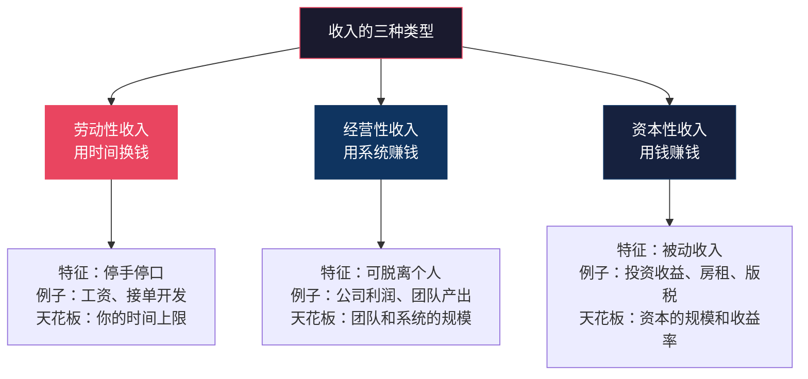
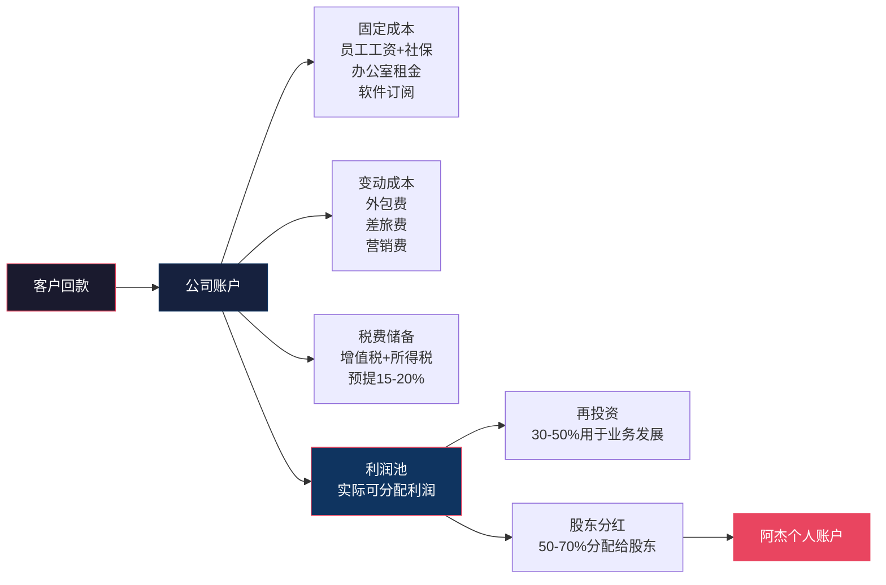
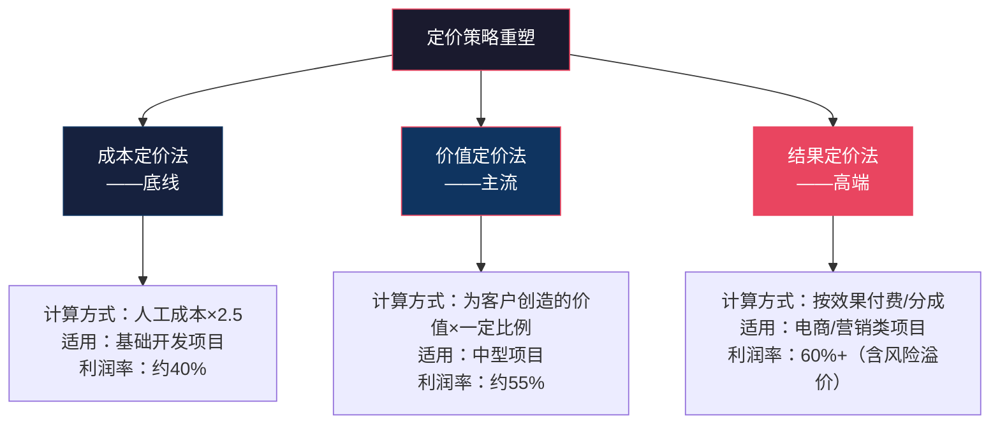
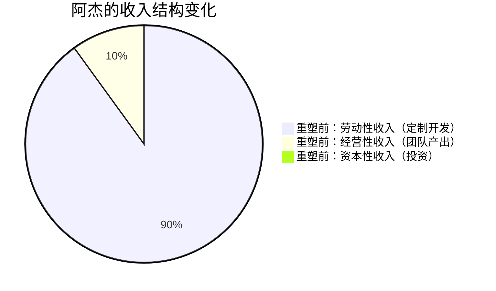
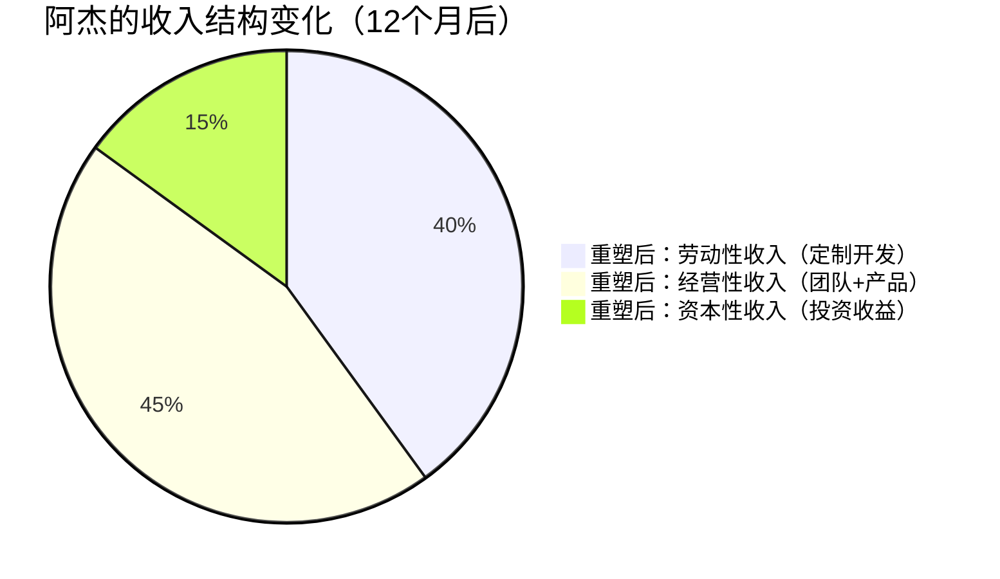

## 案例五：一个创业者的财富观重塑

> "我创业三年，公司流水做到年营收200万，但我的银行卡余额还不如上班时多。直到有一天，我老婆问我：'你到底是在创业，还是在给自己找一份更累的工作？'这句话像一盆冷水浇醒了我。"

这是一个关于"会赚钱但不会管钱"的创业者的财富观重塑案例。主角阿杰从月薪1.5万的技术工程师，辞职创业后年营收突破200万，但个人净资产几乎为零。他的问题不是"赚不到钱"，而是整个财富认知系统存在致命缺陷——他把"公司流水"等同于"个人财富"，把"忙碌"等同于"成长"，把"风险"等同于"赌一把"。这个案例完整记录了他如何用12个月时间，从一个"高收入的穷人"蜕变为一个真正理解财富本质的创业者。

---

### 案例背景：一个"赚钱但没钱"的创业者画像

阿杰，32岁，坐标深圳，原某互联网公司后端开发工程师，工作7年，月薪从最初的6000元涨到1.5万元。2021年中，他感觉"在公司打工看不到头"，加上有几个朋友都创业了，于是辞职，和一个做销售的大学同学合伙开了一家小程序开发公司。

**创业前的财务状态（2021年6月）：**

| 项目 | 金额 | 说明 |
|------|------|------|
| 月工资收入 | 15,000元（税后） | 工程师，7年经验 |
| 配偶月收入 | 8,000元 | 某公司行政岗 |
| 家庭月支出 | 18,000元 | 房贷8000+生活8000+其他2000 |
| 存款 | 约120,000元 | 两人工作5年的积蓄 |
| 房贷余额 | 约800,000元 | 月供8000元，还有22年 |
| 股票/基金 | 约30,000元 | 零散投资，无系统规划 |

**创业一年后的财务状态（2022年6月）：**

| 项目 | 金额 | 说明 |
|------|------|------|
| 公司年营收 | 约200万 | 含3个长期客户+零散项目 |
| 阿杰个人月提取 | 约12,000元 | 从公司"发给自己的工资" |
| 配偶月收入 | 8,000元 | 未变 |
| 家庭月支出 | 22,000元 | 反而增加了（创业社交、焦虑消费） |
| 存款 | 约40,000元 | 比创业前少了8万 |
| 公司账面利润 | 约15万 | 但大部分压在应收账款上 |
| 个人贷款 | 80,000元 | 创业初期借的周转资金 |
| 股票/基金 | 约20,000元 | 亏损后割了一部分 |

**核心矛盾：** 公司年营收200万，听起来很成功；但阿杰个人比创业前更穷了——存款缩水、负债增加、生活质量下降、夫妻关系紧张。

这个矛盾的根源不是"创业失败"，而是阿杰的财富观存在三个致命盲区。

---

### 第一层诊断：三种限制性创业财富信念

> 核心问题：不是你赚得不够多，而是你对"钱"的理解从根子上就错了

#### 信念一："公司赚的钱就是我的钱"

这是创业者最普遍也最危险的认知陷阱。阿杰在创业初期完全没有区分"公司资产"和"个人资产"——公司的钱和个人的钱混在一起用，公司需要买设备就从家里的存款拿，客户回款了就觉得自己"有钱了"。

**这种思维的三个危害：**

1. **税务风险。** 公私不分在财税上叫"股东与公司财产混同"，一旦被税务稽查，不仅面临补税和罚款，还可能丧失有限责任保护——如果公司出了法律纠纷，债权人可以直接追索到个人资产。这在法律上叫"揭开公司面纱"。

2. **无法判断真实盈亏。** 公司账上有50万，但这50万中有多少是应付供应商的？有多少是预收款？有多少是老板自己垫进去的钱？阿杰当时完全搞不清楚。他觉得自己"赚了不少"，但其实公司一直在用未来的钱支付现在的账单。

3. **个人财务被公司绑架。** 创业第一年，阿杰给自己定的"工资"是12000元/月，但实际上经常因为公司需要周转而"延迟发工资"。有三个月他给自己发了零工资，靠老婆的8000元支撑全家。这不是创业，这是自我剥削。

**正确的认知应该是：** 公司是一个独立的法律主体和财务主体。创业者是公司的股东和员工，应该像对待任何一份工作一样，给自己发合理的工资。公司的利润是公司的，通过合法的分红机制变成个人收入后，才是你的钱。

#### 信念二："创业就是高风险高回报，搏一把"

阿杰辞职创业时的心态是："打工一辈子也买不起深圳的房子，不如搏一把。"这种"赌徒心态"让他在创业过程中做出了多个高风险决策：

- **没有预留安全垫就开始创业。** 家庭存款12万，辞职后第一个月就花掉了4万（注册公司、租办公室、买设备）。他没有计算过"如果公司半年没有收入，我们能撑多久"。
- **不做市场验证就投入重资产。** 公司成立第一个月就租了一间办公室（月租6000元），买了两台高配电脑，配了办公家具。如果当时选择在共享工位或居家办公，前6个月的成本可以降低60%。
- **不签合同就干活。** 为了"快速拿下客户"，有三个项目没有签正式合同就开始做了。结果其中一个客户赖账，损失了约5万元。

**创业的本质不是"赌博"，而是"管理不确定性"。** 真正成功的创业者不是"敢赌"的人，而是"把风险控制在可承受范围内"的人。他们会在每个决策节点上计算"如果最坏的情况发生，我能不能承受？"如果答案是"不能"，那就需要调整方案——要么降低投入，要么分散风险，要么找到对冲手段。

#### 信念三："只要业务做大了，钱的问题自然就解决了"

阿杰创业第一年的核心目标是"做大规模"——多接客户、多做项目、扩大团队。他的逻辑是：规模越大，利润越多，个人收入自然就高了。

但现实是：团队从2人扩大到5人后，管理成本剧增（社保、公积金、管理精力），利润率反而从35%降到了18%。他接了一个"大客户"的年度框架合同，金额60万，但执行了8个月才收到第一笔款20万——期间他不得不自掏腰包垫付了员工工资。

**"做大"不等于"做好"，更不等于"做富"。** 很多创业者的悲剧就在于：公司规模越来越大，自己越来越累，但个人财富几乎没有增长。因为你创造的所有价值都被"再投入"到了公司里，你本质上是在做一个"永续投入、永不回报"的项目。

**三个必须回答的问题：**

| 问题 | 阿杰创业前的回答 | 阿杰应该有的回答 |
|------|-----------------|-----------------|
| 创业的目标是什么？ | "把公司做大" | "在X年内实现个人年收入Y，同时积累Z净资产" |
| 什么时候该停止扩张？ | "不知道，先做了再说" | "当边际收益低于边际成本，或利润率跌破15%时" |
| 个人收入的底线是多少？ | "先不给自己发工资也行" | "不低于当地同等岗位市场薪资的70%，这是底线" |

---

### 第二层重塑：从"赚钱思维"到"资产思维"

> 核心突破：理解"赚钱"和"积累财富"是两件完全不同的事

阿杰的转折点来自2022年7月的一次偶然——他参加了一个创业者的财务管理沙龙，主讲人说了一句话："如果你停止工作一个月，你的公司和个人财务会怎样？"

阿杰回家认真算了一下：如果他停止工作一个月，公司会立刻停摆（因为80%的项目依赖他的技术能力），个人收入归零，家庭存款只够撑两个月。

他突然意识到：**他不是在经营一家公司，他是在经营一个高度依赖他个人的"自雇项目"。** 这和上班的本质区别仅仅是——风险更大、保障更少、工作时间更长。

这个认知冲击触发了阿杰的财富观系统性重塑。他开始大量阅读财务管理书籍（从《富爸爸穷爸爸》到《创业公司的财务管理》），参加了两次财务规划培训，并且和老婆做了一次长达3小时的家庭财务"深度对话"。

#### 认知重塑一：区分三种收入

阿杰第一次理解了收入的三种类型：



**阿杰当时的状态：** 100%劳动性收入（无论是给公司干活还是接项目，本质都是用他的时间换钱），0%经营性收入（公司无法脱离他独立运转），0%资本性收入（没有投资，仅有的3万股票还亏了）。

**阿杰的目标状态：** 劳动性收入占比降到50%以下，经营性收入占比提升到30%以上，资本性收入占比逐步提升到20%以上。

#### 认知重塑二：理解"个人资产负债表"

阿杰以前只看"收入"——公司赚了多少，自己拿了多少。他第一次开始构建自己的个人资产负债表：

| 资产类别 | 项目 | 金额 | 说明 |
|---------|------|------|------|
| **现金类资产** | 银行存款 | 40,000元 | 流动性最高 |
| **投资类资产** | 股票/基金 | 20,000元 | 波动性资产 |
| **不动产** | 房产市值 | 约2,800,000元 | 自住，无投资收益 |
| **公司权益** | 公司净资产 | 约150,000元 | 50%股权，对应7.5万 |
| **无形资产** | 个人技能/品牌 | 难以量化 | 技术能力和行业人脉 |
| **资产合计** | | 约985,000元 | |
| | | | |
| **负债类别** | 项目 | 金额 | 说明 |
| **长期负债** | 房贷余额 | 800,000元 | 22年还清 |
| **短期负债** | 创业借款 | 80,000元 | 朋友借款，需尽快还 |
| **负债合计** | | 880,000元 | |
| | | | |
| **净资产** | | **105,000元** | 资产-负债 |

这个表让阿杰震惊了：他以为自己是"有房有公司的人"，实际上他的净资产只有10.5万元——甚至比创业前（12万存款+3万股票-80万房贷=负65万，加上房产后约15万）还少了。

**净资产的计算公式：**

```text
净资产 = 总资产 - 总负债
       = (现金 + 投资 + 不动产 + 公司权益 + 其他资产) - (房贷 + 车贷 + 信用卡 + 其他借款)
```

这个公式很简单，但大多数创业者从来没有算过。他们关注的是"公司账上有多少钱"或"我这个月赚了多少"，而不是"我的真实财富净值是多少"。

#### 认知重塑三：建立"创业者现金流管理模型"

阿杰在学习了财务管理知识后，为自己的个人和公司分别建立了现金流管理模型：

**公司层面：**



**个人层面（借鉴案例一的50-30-20框架，调整为创业者版本）：**

| 类别 | 比例 | 月金额（按月入2万计算） | 具体分配 |
|------|------|----------------------|---------|
| **必要支出** | 45% | 9,000元 | 房贷8000+基础生活1000（配偶分担部分生活开支） |
| **弹性支出** | 20% | 4,000元 | 社交/个人消费/创业相关社交 |
| **安全基金** | 15% | 3,000元 | 应急基金（目标：覆盖6个月家庭开支） |
| **投资** | 15% | 3,000元 | 指数基金定投+个人能力提升 |
| **创业储备** | 5% | 1,000元 | 用于创业学习/行业会议/证书考取 |

**为什么创业者版本和上班族不同？** 因为创业者的收入波动更大，需要更高的安全垫比例（15% vs 上班族的10%），同时需要单独的"创业储备"项——持续学习和行业社交是创业者的"生产资料投入"，不能省。

---

### 第三层改造：系统化的执行阶段

> 从"想到什么做什么"到"按系统执行"

#### 第一阶段：财务切割与基础建设（第1-2个月）

**行动一：公私分离**

阿杰做了以下具体操作：

1. **给自己发固定工资。** 从公司账户每月15日给自己发15000元（略高于之前，但低于市场价——因为他清楚这是创业初期，需要和公司共担风险）。不管公司当月营收多少，这个数字不变。

2. **设立独立的公司对公账户。** 所有客户回款必须进对公账户，所有公司支出必须从对公账户出。杜绝"从个人微信收客户款项"的行为。

3. **建立简易账务系统。** 使用"金蝶云星辰"（小微企业财务软件，月费约100元），每一笔收支都记录在案。阿杰每周五下午花30分钟核对账目。

4. **预留税费。** 每月在公司账户中预提收入的18%作为税费储备，不动用。

**行动二：清偿高息负债**

阿杰优先用存款还清了8万元创业借款（向朋友借的，虽然没有利息，但心理负担很重，影响决策质量）。还清后，他和老婆做了一个约定：**创业期间不再向亲友借钱。如果公司需要周转资金，要么找银行贷款（利率透明、有还款计划），要么压缩业务规模。**

**行动三：重建应急基金**

| 时间节点 | 应急基金余额 | 覆盖月数 | 说明 |
|---------|------------|---------|------|
| 第1个月初 | 0元 | 0 | 存款还完借款后归零 |
| 第1个月末 | 3,000元 | 0.1个月 | 个人工资存下3000 |
| 第3个月末 | 12,000元 | 0.5个月 | 持续积累 |
| 第6个月末 | 35,000元 | 1.6个月 | 达到"最低安全线" |
| 第9个月末 | 55,000元 | 2.5个月 | 接近"基本安全线" |
| 第12个月末 | 85,000元 | 3.8个月 | 达到"舒适安全线" |

**关键原则：应急基金是创业者的"氧气瓶"。** 对上班族来说，3个月的应急基金是标准建议；对创业者来说，至少需要6个月——因为创业者的收入波动更大，找工作的时间也更长（很多创业者重新求职时会面临"为什么创业失败了"的质疑）。

#### 第二阶段：业务结构优化（第3-6个月）

> 核心目标：让公司从"依赖阿杰一个人"变成"依赖一个系统"

**行动一：建立标准化服务流程**

阿杰把公司的核心业务拆解成标准化流程：

| 业务环节 | 以前的做法 | 优化后的做法 | 效果 |
|---------|----------|------------|------|
| 需求分析 | 阿杰亲自和客户聊，口头确认需求 | 标准化需求文档模板+确认签字流程 | 需求变更减少60% |
| 开发执行 | 阿杰写核心代码，其他人辅助 | 代码模块化，80%的项目用现成模块组装 | 开发效率提升40% |
| 项目验收 | 客户说了算，没有明确标准 | 验收标准在合同中明确+分阶段验收 | 回款周期从平均90天缩短到45天 |
| 售后维护 | 阿杰随叫随到 | 签订年度维护合同，按月收费 | 新增稳定月收入约8000元 |

**行动二：定价策略重塑**

阿杰以前的定价方式是"客户说预算多少，我就报多少"——典型的"成本定价"思维。他重新设计了定价体系：



**价值定价的实际案例：**

阿杰有一个做餐饮连锁的客户，想要一个小程序点餐系统。以前阿杰会按照"开发工时"报价：3个开发×2个月×1.5万/月 = 9万元。但他换了一个角度：这个客户有20家门店，使用小程序后每家门店每月预计节省2个服务员的人工成本（约8000元），20家门店每月节省16万元。阿杰报价15万元——对客户来说，不到一个月就能回本；对阿杰来说，利润率从40%提升到了60%。

**行动三：控制团队扩张节奏**

阿杰在第3个月做了一个"反直觉"的决定：把团队从5人缩减到3人。

| 人员变动 | 操作 | 月节省 | 说明 |
|---------|------|--------|------|
| 辞退1名初级开发 | 业务流程标准化后不需要 | 8,000元（含社保） | 模块化开发降低了对人力的需求 |
| 将1名全职转为兼职 | 设计师，项目制合作 | 5,000元 | 设计需求不是每天都有 |
| 新增兼职销售1人 | 纯提成制，零底薪 | 0元（新增成本） | 帮助获取新客户 |

**结果：** 团队从5人缩减到3人+1兼职，月人力成本从6.5万降到3.2万，但产能几乎不变（因为标准化流程提升了效率），公司利润率从18%回升到32%。

#### 第三阶段：个人资产配置起步（第5-8个月）

> 核心目标：让钱开始"工作"，而不只是躺在银行里

阿杰在创业初期完全忽略了投资——他觉得"创业本身就是最好的投资"。但财务知识的积累让他理解了一个关键概念：**创业是"经营性收入"，投资是"资本性收入"，两者不矛盾，而是互补。** 创业收入波动大，投资收入可以提供底层的安全感。

**阿杰的投资起步方案：**

| 阶段 | 时间 | 投资动作 | 金额 | 原因 |
|------|------|---------|------|------|
| 第一阶段 | 第5-6个月 | 应急基金达标后，开始定投货币基金 | 2,000元/月 | 先建立"存钱"的习惯 |
| 第二阶段 | 第7-8个月 | 增加指数基金定投 | 3,000元/月（货币基金1000+指数基金2000） | 学习了基础投资知识后开始 |
| 第三阶段 | 第9-12个月 | 建立股债组合 | 3,000元/月（指数基金2000+债券基金1000） | 建立初步的资产配置 |

**为什么创业者应该更保守地投资？**

上班族有稳定的工资收入来"补仓"，创业者没有。如果创业者的投资亏损了，同时公司又遇到困难（比如大客户回款延迟），就会面临"两头亏"的灾难。因此阿杰的投资策略比普通上班族更保守——股票类资产占比不超过60%，债券和货币基金至少占40%。

**投资纪律的建立：**

阿杰给自己定了三条铁律：

1. **定投不中断。** 不管公司当月业绩好坏，个人投资定投绝不中断。如果公司经营困难需要钱，用应急基金和银行贷款解决，绝不挪用投资账户。
2. **不投自己不懂的东西。** 有朋友推荐他投资某个"区块链项目"，承诺月回报20%。阿杰拒绝了——不是因为他不想赚钱，而是因为他无法解释这个回报率的来源。如果一个投资的收益来源你无法解释，那大概率是"你的本金就是别人的收益"。
3. **投资决策和创业决策隔离。** 阿杰在做投资决策时，不会考虑"我创业需要钱"这个因素。投资是长期行为，创业是短期行为，不能用短期需求绑架长期规划。

#### 第四阶段：构建"脱离个人"的业务系统（第7-12个月）

> 核心目标：让公司成为一个可以独立运转的系统，而不是一个"阿杰的影子"

这是阿杰整个财富观重塑中最艰难也最有价值的阶段。他的目标是：**即使他出差一个月不碰工作，公司的核心业务也能正常运转。**

**关键动作一：知识沉淀与技术传承**

阿杰花了两个月时间，把他的核心技术和业务知识沉淀成了文档和培训体系：

| 知识类型 | 沉淀形式 | 目的 |
|---------|---------|------|
| 技术架构决策逻辑 | 技术决策文档（ADR） | 让团队成员能理解"为什么这样做" |
| 客户沟通话术 | 标准话术库+案例库 | 让销售人员能独立处理80%的客户沟通 |
| 项目管理流程 | 流程图+检查清单 | 让任何团队成员都能按流程执行 |
| 常见问题排查 | 故障排查手册 | 减少"只有阿杰才能解决"的技术问题 |

**关键动作二：建立客户分层管理体系**

| 客户层级 | 特征 | 服务模式 | 阿杰参与度 |
|---------|------|---------|----------|
| A类客户（年合作>30万） | 战略客户 | 阿杰亲自维护关系，执行交给团队 | 关系维护30%，执行0% |
| B类客户（年合作10-30万） | 重要客户 | 团队负责人维护，阿杰月度review | review 10%，执行0% |
| C类客户（年合作<10万） | 常规客户 | 标准化服务流程，团队自主执行 | 0% |

**关键动作三：开发"可复制"的产品**

阿杰意识到，定制开发项目的利润率天花板很明显（每个项目都需要投入人力），但"产品化"的项目可以一次开发、多次销售。他从现有项目中提炼出了两个标准化产品：

1. **餐饮连锁小程序SaaS版：** 把为餐饮客户定制的小程序做成标准化产品，新客户只需配置不需要开发。每套售价2万元，后续每年收5000元维护费。开发成本约8万元，卖到第5套就开始盈利。

2. **企业内部管理系统模板：** 把几个项目的通用模块（审批流程、考勤、日报）打包成模板，可以快速部署。定价3-5万元/套。

**到第12个月，产品化收入已经占到公司总收入的25%——这部分收入的利润率高达75%，因为边际成本几乎为零。**

---

### 12个月后的成果

**个人财务数据：**

| 指标 | 创业前（2021.6） | 重塑前（2022.6） | 重塑后（2023.6） | 变化趋势 |
|------|----------------|-----------------|-----------------|---------|
| 个人月收入 | 15,000元 | 12,000元 | 22,000元 | 先降后升 ↑ |
| 家庭月支出 | 18,000元 | 22,000元 | 16,500元 | 先升后降 ↓ |
| 月储蓄 | -3,000元 | -10,000元 | 5,500元 | 从负到正 ↑ |
| 储蓄率 | 负数 | 负数 | 25% | 从0到25% ↑ |
| 应急基金 | 0元（含在存款中） | 0元 | 85,000元 | 从0到8.5万 ↑ |
| 投资资产 | 30,000元 | 20,000元 | 55,000元 | 恢复并增长 ↑ |
| 负债 | 800,000元（房贷） | 880,000元 | 785,000元 | 房贷正常还款+借款已清 ↓ |
| 个人净资产 | 约150,000元 | 约80,000元 | 约205,000元 | 翻倍增长 ↑↑ |

**公司经营数据：**

| 指标 | 第1年（无序期） | 第2年（重塑期） | 变化 |
|------|---------------|---------------|------|
| 年营收 | 200万 | 280万 | +40% |
| 利润率 | 18% | 35% | +17个百分点 |
| 团队人数 | 5人 | 3人+1兼职 | 精简40% |
| 阿杰每周工作时间 | 70+小时 | 50小时 | -30% |
| 阿杰月提取 | 12,000元 | 22,000元 | +83% |
| 产品化收入占比 | 0% | 25% | 从0开始 |
| 客户续约率 | 约40% | 75% | +35个百分点 |

**最核心的变化——收入结构的转变：**





---

### 案例复盘：创业者的财富观重塑关键原则

阿杰的转变不是偶然的。复盘整个过程，有六个关键原则值得所有创业者借鉴：

**原则一：先活着，再做大**

创业的第一目标不是"做大"，而是"活下来"。活下来意味着：有正向现金流、有应急储备、有可持续的商业模式。在"活下来"之前，一切关于"规模化""融资""上市"的讨论都是空中楼阁。

**原则二：给自己发工资不是自私，是专业**

创业者给自己发合理工资，不是"自私"，而是"专业"。它保护了你的家庭财务安全，让你在做公司决策时不会因为"个人缺钱"而做出短视的判断（比如为了快速拿到钱而接一个烂项目）。

**原则三：公司是资产，不是你的延伸**

把公司当成一个独立的"资产"来经营，而不是你个人的"延伸"。这意味着：公司应该有自己的财务系统、自己的目标、自己的运营逻辑。你应该像管理一个投资组合一样管理你的公司——追求风险调整后的回报最大化，而不是盲目追求规模。

**原则四：建立系统比亲自干活更重要**

创业者最大的"资产"不是他的技术能力或客户资源，而是他能建立的系统。一个能独立运转的系统，价值远大于一个依赖某个天才的项目。阿杰花在"建立系统"上的时间，短期内看是"不赚钱"的（因为这段时间他在减少直接干活），但长期看，这是他做的最赚钱的投资。

**原则五：风险管理和赚钱同等重要**

创业者的财务管理不是"赚钱之后"才需要考虑的事情，而是从创业第一天就开始的事情。应急基金、保险、债务管理、资产配置——这些不是"有钱了再说"，而是"先做好这些，才能赚到钱"。

**原则六：个人财富和公司财富必须双轨并行**

很多创业者犯的最大错误是：把所有的钱和精力都投入公司，忽略个人财富的积累。结果是：公司可能做得很好，但个人的财务状况一塌糊涂。正确的做法是：公司和个人各有各的财务目标，各有各的管理策略，双轨并行、互不干扰。

---

### 可复用的方法论：创业者财富管理路线图

如果你是一个创业者，想要复现阿杰的路径，以下是经过验证的步骤：

**第一步（立即执行）：财务健康体检**

- 计算你的个人净资产（资产-负债）
- 梳理你的收入结构（劳动性/经营性/资本性各占多少比例）
- 检查公私是否分离（有没有公司和个人混用账户的情况）
- 计算你的"财务安全月数"（应急基金÷月必要支出）

**第二步（第1-2个月）：基础建设**

- 给自己定合理的工资（不低于当地同等岗位市场价的70%）
- 分离公司和个人的银行账户
- 建立简易的公司账务系统
- 制定应急基金积累计划（目标：6个月家庭必要支出）

**第三步（第3-6个月）：业务优化**

- 梳理业务流程，找到可以标准化的环节
- 重新审视定价策略（从"成本定价"向"价值定价"过渡）
- 评估团队效率，必要时精简
- 建立客户分层管理体系

**第四步（第5-8个月）：启动个人投资**

- 应急基金达标后，开始小额定投
- 选择保守的投资策略（创业者应该比上班族更保守）
- 设定投资纪律（不中断、不挪用、不投不懂的东西）

**第五步（第9-12个月）：系统化**

- 沉淀核心知识和流程到文档
- 逐步减少对个人的依赖
- 探索产品化/可复制的业务模式
- 每季度做一次个人+公司的财务复盘

---

### 常见问题与误区

**问：创业初期收入不稳定，怎么给自己发工资？**

这是最常见的问题。答案是：先定一个"最低工资"——能覆盖你个人基本生活开支的最低金额。在深圳这样的一线城市，建议不低于8000元/月。如果公司连这个数都发不出来，说明公司的现金流有问题，你需要先解决现金流问题（比如砍成本、找新客户、调整业务模式），而不是"不发工资硬撑"。

**问：创业公司请不起财务，怎么做账？**

小微企业不需要请专职财务。可以用以下方案：
1. 使用云端财务软件（金蝶云星辰、用友畅捷通，月费100-200元）
2. 找代理记账公司（月费200-500元，处理税务申报）
3. 创始人自己每周花30分钟核对账目

关键是"记录"和"核对"——不需要你成为会计专家，但你需要知道自己公司每个月的收支情况。

**问：创业已经亏了很多钱，还来得及改变吗？**

来得及。阿杰在创业一年后净资产比创业前还少的情况下才开始改变，12个月后净资产翻了一倍多。关键不是"你现在有多少钱"，而是"你现在有没有一个正确的系统"。有了系统，时间会站在你这边。

**问：合伙人对公司财务管理有不同的看法怎么办？**

这是非常常见也非常棘手的问题。阿杰和他的合伙人之间也有过分歧——合伙人更倾向于"激进扩张"，阿杰更倾向于"稳健经营"。他们的解决方案是：

1. **明确权责分工。** 阿杰负责技术和财务管理，合伙人负责销售和客户关系。在各自的领域内，对方给予充分信任。
2. **建立决策框架。** 对于重大财务决策（超过5万元的支出），必须两人一致同意；对于日常运营决策，各自负责的领域自行决定。
3. **定期财务透明。** 每月第一个周一，两人一起看公司的财务报表，确保信息对称。

**问：如何判断"该坚持创业"还是"该回去上班"？**

这是一个没有标准答案的问题，但有几个可以参考的判断维度：

| 判断维度 | 继续创业的信号 | 考虑回去上班的信号 |
|---------|-------------|-----------------|
| 现金流 | 公司现金流为正，且趋势向好 | 连续3个月以上现金流为负，看不到转机 |
| 个人状态 | 依然充满热情，有清晰的方向 | 严重焦虑、失眠，对业务失去兴趣 |
| 家庭影响 | 家庭财务在可控范围内 | 家庭财务陷入严重困境，影响家庭关系 |
| 市场机会 | 行业趋势向好，有明确的增长空间 | 市场在萎缩，竞争在加剧 |
| 能力匹配 | 你在持续学习和成长 | 你的技能在被消耗而非积累 |

---

### 本案例对应的核心知识

本案例综合应用了本章的多个核心概念：

| 案例环节 | 对应知识点 | 核心概念 |
|---------|----------|---------|
| 公私不分导致财务混乱 | 1.1 重新认识金钱 | 金钱的四维认知——作为"度量衡"需要精确 |
| "搏一把"的赌徒心态 | 1.5 风险与收益的辩证关系 | 风险管理≠逃避风险，而是量化和控制风险 |
| 只关注收入不关注净资产 | 1.3 财务自由的定义与标准 | 财务自由的核心指标是净资产和被动收入 |
| 收入结构从单一到多元 | 1.4 复利思维与长期主义 | 资本性收入是复利效应的直接体现 |
| 创业焦虑导致冲动决策 | 1.2 财富心理学 | 稀缺心态、损失厌恶在创业场景下的表现 |
| 从"做大"到"做好"的转变 | 1.1 重新认识金钱 | 从"赚钱思维"到"价值创造思维"的跃迁 |

如果你还没有阅读本章的理论部分，建议先完成理论学习再回看这个案例。你将发现：阿杰的每一个错误，都有对应的理论解释；他的每一次突破，都有理论支撑。理解了"道"和"法"，"术"和"器"自然水到渠成。
