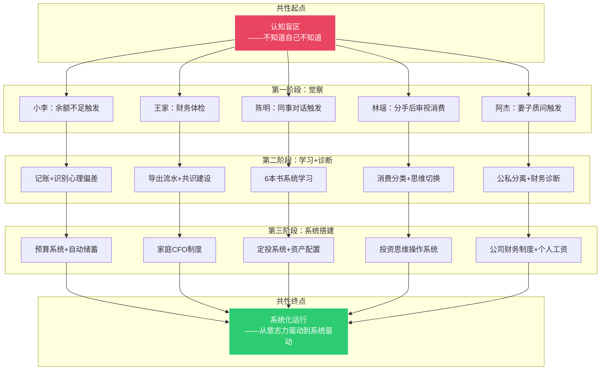
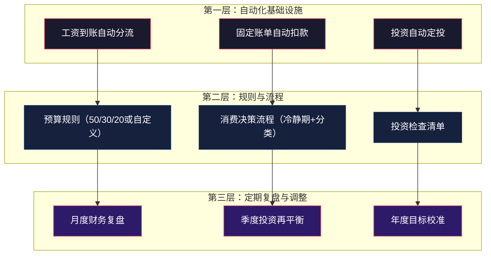
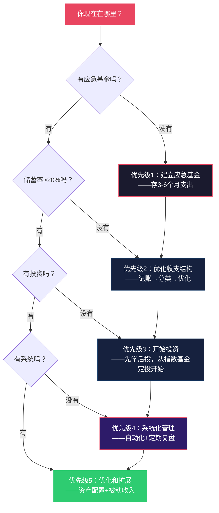

## 案例总结：五个真实案例背后的财富认知升级地图

> "经验不是你经历了什么，而是你从经历中提取了什么。" —— 约翰·杜威

前面五个案例分别展示了五种不同起点、不同路径的财务转型故事。但如果你只看到了"五个不同的故事"，那就浪费了这些案例最大的价值。这五个案例不是独立的——它们是一面棱镜的五个切面，折射出同一束光：**财富认知的系统性升级**。

本节的目标不是重复每个案例的细节，而是做三件事：

1. **提炼共性模式** —— 五个看似不同的故事背后，有哪些反复出现的规律？
2. **构建可复用框架** —— 把经验抽象成你可以直接套用的决策模型
3. **指出关键分岔点** —— 在哪些节点上，正确的选择和错误的选择会导致截然不同的结果？

---

### 一、五个案例的全景对照

在深入分析之前，先用一张表把五个案例的核心信息放在同一个平面上对比，这样更容易看出规律。

#### 1.1 案例主角画像对照

| 维度 | 案例一·小李 | 案例二·王家 | 案例三·陈明 | 案例四·林瑶 | 案例五·阿杰 |
|------|------------|------------|------------|------------|------------|
| **年龄** | 28岁 | 35+33岁 | 32岁 | 26→34岁 | 32岁 |
| **身份** | 互联网产品经理 | 双职工家庭 | 制造业工程师 | 互联网运营 | 创业者/前工程师 |
| **城市** | 北京 | 成都 | 苏州 | 杭州 | 深圳 |
| **月收入（起点）** | 2.1万（税后） | 4万（家庭） | 1.25万（税后） | 1.2万（税后） | 1.5万（税后） |
| **核心问题** | 月光族，消费无节制 | 高收入低储蓄，缺乏系统 | 投资恐惧症，钱存银行 | 消费思维主导 | 公私不分，赚了流水没赚到钱 |
| **限制性信念** | "钱是赚出来的不是省出来的" | "过日子差不多就行" | "股市就是赌场" | "年轻就应该享受" | "公司赚的就是我的" |
| **转型周期** | 18个月 | 36个月 | 12年（持续中） | 8年 | 12个月 |
| **最终成果** | 储蓄率>50%，资产30万+ | 被动收入覆盖基础支出 | 复利系统穿越牛熊 | 净资产远超同龄人 | 个人与公司财务分离，净资产回正 |

#### 1.2 转型路径对照

**关键洞察：** 五个案例的路径虽然不同，但都遵循同一个三阶段模型——**觉察→诊断→系统搭建**。这不是巧合，而是行为改变的基本规律。任何持久的财务改善，都必须经历这三个阶段，跳过任何一个都会导致失败。

---

### 二、六个反复出现的核心规律

从五个案例中提取出六个反复出现的规律。这些规律不是"鸡汤"，而是经过多个真实案例验证的因果关系。

#### 规律一：触发事件是改变的起点，但不是改变的原因

五个案例都有一个明确的"触发事件"：

| 案例 | 触发事件 | 表面原因 | 深层原因 |
|------|---------|---------|---------|
| 小李 | 余额不足买不起演唱会门票 | 消费失控 | 从未有过"财务觉察" |
| 王家 | 孩子即将上学，教育支出压力 | 储蓄不足 | 从未做过家庭财务诊断 |
| 陈明 | 同事展示定投收益 | 信息差 | 投资恐惧源于童年创伤 |
| 林瑶 | 分手后审视自己的财务状况 | 情感冲击 | 消费思维从未被质疑过 |
| 阿杰 | 妻子的一句质问 | 外部视角 | 创业者身份认知偏差 |

**为什么这很重要？** 因为大多数人等待一个"完美的触发事件"才开始改变。但真相是：**触发事件只是打开了一扇门，真正决定你是否走进去的，是你在门打开之前就已经积累的不满和认知准备。** 小李如果之前没有隐隐约约觉得"钱不够花"，那次余额不足只会让他找朋友借钱，而不是开始记账。

**实操建议：** 不要等待触发事件。主动制造"财务觉察时刻"——现在就打开你的银行App，导出过去三个月的消费记录，按类别汇总。你看到的数字，就是你的触发事件。

#### 规律二：限制性信念是最大的敌人，比收入低更致命

五个案例主角的起点各不相同，但有一个共同点：**他们最大的障碍不是"钱不够"，而是"想法错了"。**

| 案例 | 限制性信念 | 这个信念造成的直接后果 | 纠正后的认知 |
|------|-----------|-------------------|------------|
| 小李 | "钱是赚出来的不是省出来的" | 收入涨了3倍，存款依然是零 | 赚和管是两条腿，缺一条都走不远 |
| 王家 | "过日子差不多就行" | 储蓄率12.5%，远低于安全线 | 差不多=差很多，复利会把微小差距放大100倍 |
| 陈明 | "股市就是赌场" | 35万存银行10年，购买力原地踏步 | 赌博和投资的区别在于是否有系统 |
| 林瑶 | "年轻就应该享受" | 29%的支出花在"买完就后悔"的东西上 | 真正的享受是拥有选择权，而不是拥有物品 |
| 阿杰 | "公司赚的就是我的" | 年营收200万，个人净资产几乎为零 | 公司是公司，你是你，两个独立的财务主体 |

**限制性信念的三个特征：**

1. **它们感觉像是"常识"** —— "年轻就应该享受"听起来天经地义，但如果你把它翻译成"我现在应该把29%的收入花在让我后悔的东西上"，你就会意识到它有多荒谬
2. **它们来自环境而非思考** —— 小李的信念来自消费主义文化，陈明的恐惧来自父亲的投资失败，林瑶的消费习惯来自社交媒体的"种草"——没有一个是自己独立思考得出的
3. **它们会自我强化** —— 你相信"理财是有钱人的事"，所以你不去理财，所以你的钱永远不多，所以你更加相信"理财是有钱人的事"。这是一个闭环陷阱

**如何识别自己的限制性信念？** 做这个练习：写下你对以下五个问题的第一反应（不要思考，写第一个冒出来的答案）：

1. "有钱人通常是怎么变有钱的？"
2. "投资股票最可能发生什么？"
3. "省钱意味着什么？"
4. "我现在最应该把钱花在什么上？"
5. "等我赚到____万，我就会开始理财。"

你的第一反应里，藏着你的限制性信念。

#### 规律三：系统胜过意志力——所有成功的转型最终都落脚于"自动化"

这是五个案例中最重要的共性，也是大多数人最容易忽略的。

| 案例 | 初期依赖意志力 | 最终搭建的系统 | 系统的效果 |
|------|--------------|--------------|----------|
| 小李 | 手动控制每笔消费 | 自动转账+预算App+消费冷静期 | 储蓄从"需要坚持"变成"自动发生" |
| 王家 | 夫妻互相提醒省钱 | 家庭CFO制度+月度财务会议+自动化投资 | 财务管理从"看心情"变成"看制度" |
| 陈明 | 每次投资都要克服恐惧 | 自动定投+年度再平衡+投资检查清单 | 投资从"需要勇气"变成"需要耐心" |
| 林瑶 | 每次购物前"想一想" | 24小时冷静期+消费分类系统+资产账户 | 消费决策从"靠感觉"变成"靠框架" |
| 阿杰 | 手动控制公司开支 | 公私账户分离+固定工资+财务报表制度 | 财务管理从"拍脑袋"变成"看数据" |

**为什么系统比意志力可靠？** 心理学研究表明，意志力是一种有限资源（Roy Baumeister的"自我损耗"理论）。每天你做的每一个决策都在消耗意志力——到下午，你的自控力已经比早上低了40%以上。这就是为什么"发工资那天发誓要省钱"的人，到了月底总是存不下钱。

**系统的作用就是把需要意志力的行为变成默认行为。** 自动转账到储蓄账户，你不需要"决定"是否存钱——钱在你看到工资之前就已经被存起来了。自动定投指数基金，你不需要"决定"是否投资——系统替你做了这个决策。

**系统搭建的三层架构：**

#### 规律四：认知升级必须先于行动改变——顺序错了就会失败

五个案例中，每个主角在"认知升级"之前都尝试过"直接行动"，结果无一例外地失败了：

| 案例 | 先尝试的行动（失败了） | 后来的认知升级 | 认知升级后的新行动（成功了） |
|------|-------------------|--------------|------------------------|
| 小李 | 多次"发誓省钱"，坚持不过两周 | 理解了"心理账户"和"生活方式膨胀" | 建立自动化储蓄系统，不依赖意志力 |
| 王家 | 直接开始"砍支出"，夫妻吵架 | 建立了"家庭财务共识"，理解了对方的金钱观 | 以共识为基础制定共同计划 |
| 陈明 | 跟风买了股票，亏了就跑 | 系统学习6本书，理解了复利和市场有效性 | 建立指数基金定投系统 |
| 林瑶 | 卸载购物App，三天后重装 | 理解了消费思维的神经科学机制 | 建立消费决策框架（冷静期+分类） |
| 阿杰 | 控制公司开支，但公私仍然混在一起 | 理解了"公司是独立法律主体" | 建立公私分离的财务制度 |

**这个规律的底层逻辑是：** 行为是认知的外化。如果你的认知没有改变，你的行为改变只能靠意志力维持，而意志力是有限的。只有当你的认知真正升级了——你真正理解了"为什么要这样做"——新的行为才会变得自然，就像你不需要靠意志力来记住"火是烫的"一样。

**实操检验标准：** 判断自己是否完成了认知升级，问自己一个问题——"我能不能用三句话向一个完全不懂的人解释清楚，我为什么要这样做？"如果你只能说"因为专家说要这样做"或"因为大家都这样做"，说明你的认知还没有到位。

#### 规律五：每个案例都经历了"退缩期"——坚持过去才能看到结果

| 案例 | 退缩期的时间点 | 退缩的表现 | 什么帮助他们坚持过去 |
|------|-------------|----------|------------------|
| 小李 | 第3个月 | "存了点钱，奖励自己一下"→大额消费 | 看到储蓄增长的可视化数据 |
| 王家 | 第6个月 | 夫妻因预算分配发生争吵 | 月度财务会议制度+弹性预算 |
| 陈明 | 第1年 | 定投亏损20%，想全部卖出 | 投资检查清单+历史数据回测 |
| 林瑶 | 第4个月 | 朋友都买了新包，心理不平衡 | 重新定义"拥有"——"我拥有选择权" |
| 阿杰 | 第8个月 | 公司现金流紧张，想从家里拿钱 | 提前建立的应急基金+公私分离制度 |

**退缩期的本质是"新旧系统的冲突"。** 你的大脑已经习惯了旧的金钱模式——月光、冲动消费、恐惧投资——这些模式已经被神经通路反复强化了几十年。新的行为模式虽然理性上"正确"，但在神经层面还没有形成自动化的通路。在过渡期，旧模式会反复试图夺回控制权。

**应对退缩期的四个策略：**

1. **预设"如果-那么"规则** —— "如果我想放弃定投，那么我先查看过去10年的市场走势图再做决定。"提前制定应对方案，避免在情绪高涨时做出冲动决策
2. **设置不可逆的自动化** —— 自动转账、自动定投、工资日自动扣款。让自己"来不及"后悔
3. **建立支持系统** —— 找一个同样在做财务改善的朋友，定期互相汇报进度。社会压力是最好的坚持动力
4. **记录"前后对比"** —— 把起点时的财务状况和现在的数据放在一起看。当进步可视化时，坚持变得容易得多

#### 规律六：财务自由是一个连续光谱，不是一个开关

五个案例的"成功"定义各不相同：

| 案例 | "成功"的定义 | 对应的财务自由层次 |
|------|------------|----------------|
| 小李 | 月储蓄率>50%，有30万资产 | 第一层：基本生存保障（应急基金覆盖6个月支出） |
| 王家 | 被动收入覆盖基础生活支出 | 第二层：基本财务自由（不工作也能维持基本生活） |
| 陈明 | 建立穿越牛熊的复利系统 | 向第三层迈进（资产持续增长，时间是盟友） |
| 林瑶 | 净资产远超同龄人，拥有选择权 | 第二到第三层之间（有底气做选择） |
| 阿杰 | 个人与公司财务分离，净资产回正 | 回到第一层（先修复财务健康） |

**这告诉我们：不要用别人的终点来衡量自己的起点。** 小李从月光族到储蓄率50%，这个进步的意义不亚于陈明的复利系统。每个案例都在自己所在的层次上实现了质的突破。

---

### 三、五种起点，一个决策框架

基于五个案例的共性规律，提炼出一个通用的财务转型决策框架。无论你处于什么起点，都可以用这个框架来规划自己的路径。

#### 3.1 第一步：自我诊断——你在哪里？

在开始任何行动之前，先搞清楚自己处于财务健康光谱的哪个位置。

**财务健康自检表：**

| 检查项 | ✅ 健康 | ⚠️ 警戒 | ❌ 危险 | 你的状态 |
|--------|--------|--------|--------|---------|
| 应急基金 | 覆盖6个月以上支出 | 覆盖1-3个月支出 | 不足1个月支出 | ？ |
| 储蓄率 | >30% | 10%-30% | <10%或为负 | ？ |
| 负债率（月还款/月收入） | <30% | 30%-50% | >50% | ？ |
| 投资占比（投资资产/总资产） | >30% | 10%-30% | <10% | ？ |
| 保险覆盖 | 重疾+意外+医疗 | 仅有社保 | 无任何保障 | ？ |
| 财务知识 | 能解释复利、通胀、资产配置 | 听说过但不清楚 | 完全不了解 | ？ |
| 消费记录 | 知道每笔大额支出去向 | 大概知道 | 完全不清楚 | ？ |

**评分标准：** 7个✅ = 财务健康；4-6个✅ = 需要优化；0-3个✅ = 需要紧急行动。

**对标五个案例：**

- 如果你和**小李**一样"收入不低但存不下钱" → 重点解决消费端的问题
- 如果你和**王家**一样"有家庭但缺乏系统" → 重点搭建家庭财务制度
- 如果你和**陈明**一样"有钱但不敢投资" → 重点解决投资认知和恐惧
- 如果你和**林瑶**一样"消费思维主导" → 重点进行思维方式的切换
- 如果你和**阿杰**一样"会赚钱但不会管钱" → 重点解决财务管理系统

#### 3.2 第二步：识别你的限制性信念

基于五个案例中出现的限制性信念模式，整理出最常见的12种限制性信念及其纠正方法：

| # | 限制性信念 | 出现在哪个案例 | 纠正后的认知 |
|---|-----------|-------------|------------|
| 1 | "钱是赚出来的不是省出来的" | 案例一 | 赚和管是两条腿，只赚不等于拥有 |
| 2 | "年轻就应该享受" | 案例四 | 真正的享受是拥有选择权 |
| 3 | "理财是有钱人的事" | 案例一 | 100元就可以开始，复利不设门槛 |
| 4 | "股市就是赌场" | 案例三 | 赌博没有系统，投资有系统 |
| 5 | "过日子差不多就行" | 案例二 | 差不多在复利面前会变成差很多 |
| 6 | "投资太复杂了我学不会" | 案例三 | 指数基金定投，核心逻辑30分钟就能理解 |
| 7 | "省钱=降低生活质量" | 案例四 | 省的是"不带来价值的支出"，不是生活质量 |
| 8 | "公司赚的就是我的" | 案例五 | 公司是独立法人，混同有法律和财务风险 |
| 9 | "等我有钱了再开始" | 案例一 | 复利最大的敌人是"晚开始" |
| 10 | "买房是最好的投资" | 案例二 | 自住房是消费品，不是投资品 |
| 11 | "风险越大收益越大" | 案例三 | 风险和收益不是线性关系，分散化可以降低风险而不降低收益 |
| 12 | "记账太麻烦了坚持不下来" | 案例一 | 自动记账工具让这件事几乎零成本 |

**使用方法：** 逐条检查，如果某一条让你产生"但这不一样……"的防御反应，那大概率就是你的限制性信念。防御反应本身就是信号。

#### 3.3 第三步：搭建你的系统

根据你所处的阶段，选择对应的系统搭建优先级：

**每个优先级对应的具体行动清单：**

**优先级1：建立应急基金**（参考案例一·小李的第1-2个月）

- [ ] 计算你的月均必要支出（房租+餐饮+交通+基本日用）
- [ ] 目标金额 = 月均必要支出 × 6
- [ ] 开一个独立的储蓄账户，命名为"应急基金"
- [ ] 设置工资日自动转账（至少收入的10%）
- [ ] 应急基金只用于真正的紧急情况（失业、生病、意外），不是"想买东西"

**优先级2：优化收支结构**（参考案例一·小李和案例四·林瑶）

- [ ] 连续记录30天所有支出（用App自动记录）
- [ ] 将支出分为三类：必要（50%以内）、品质提升（30%以内）、可优化（20%以内）
- [ ] 识别并砍掉"买完就后悔"的支出类别
- [ ] 设置每个类别的月度预算上限
- [ ] 建立"24小时冷静期"规则：超过月收入1%的非必要消费，等24小时再决定

**优先级3：开始投资**（参考案例三·陈明）

- [ ] 花30小时系统学习投资基础知识（推荐书单见案例三）
- [ ] 理解三个核心概念：复利、指数基金、定投
- [ ] 选择一个费率低的指数基金（如沪深300或中证500）
- [ ] 设置每月自动定投（金额 = 收入的10%-20%）
- [ ] 制定一份"投资检查清单"，在市场波动时用于对抗情绪

**优先级4：系统化管理**（参考案例二·王家）

- [ ] 建立月度财务复盘习惯（每月最后一个周末，30分钟）
- [ ] 制定年度财务目标（储蓄目标、投资目标、负债减少目标）
- [ ] 设置季度投资再平衡提醒
- [ ] 如果有伴侣，建立"家庭财务会议"制度（参考案例二）
- [ ] 所有固定操作实现自动化（转账、定投、账单支付）

**优先级5：优化和扩展**（参考所有案例的后期阶段）

- [ ] 学习资产配置（股债比例、地域分散）
- [ ] 探索被动收入来源（不是盲目创业，参考案例五的教训）
- [ ] 考虑保险配置（重疾、意外、医疗）
- [ ] 制定3-5年的财务规划
- [ ] 定期回顾和修正限制性信念

---

### 四、常见陷阱与反模式

从五个案例中提取出最容易掉进去的五个陷阱。这些不是"理论上可能发生"的风险，而是案例主角们真实踩过的坑。

#### 陷阱一：把"记账"当成"理财"

**表现：** 花大量时间记录每一笔支出，制作精美的Excel表格，但从未基于数据做任何改变。

**案例中的教训：** 小李在第一个月记账后，发现自己花了3800元在餐饮上，但接下来两个月这个数字几乎没有变化。记账本身不产生价值——**基于记账数据做出的决策和行动才产生价值。**

**正确做法：** 记账是诊断工具，不是治疗手段。记账的目的是发现问题→分析原因→制定对策→执行改变。如果你记了三个月账但支出结构没有任何变化，说明你只做了第一步。

#### 陷阱二：在认知不足时就开始大额投资

**表现：** 听朋友说某只股票/基金好，就把大量资金投进去，没有自己的判断框架。

**案例中的教训：** 陈明在开始投资前花了3个月系统学习，这让他在后来的市场波动中保持了定力。而他的父亲在2007年高位冲入股市，没有学习过程，结果亏损60%。

**正确做法：** 投资的第一笔钱应该花在学习上，而不是花在买入上。至少花30小时学习基础知识，理解"为什么要投"比"投什么"更重要。

#### 陷阱三：家庭理财不沟通

**表现：** 一方制定了完美的理财计划，但没有和伴侣达成共识，最终因为对方不配合而失败。

**案例中的教训：** 王家在第一阶段最重要的工作不是"制定预算"，而是"建立共识"。他们花了整整两个月时间做这件事，但这两个月的投资回报率是最高的——因为之后的所有财务决策都有了共同基础。

**正确做法：** 如果你有伴侣，财务计划必须是两个人共同制定的。一人制定、另一人执行的模式注定失败。

#### 陷阱四：把"忙碌"等同于"进步"

**表现：** 每天忙于工作和生活，没有时间停下来审视自己的财务状况。"等忙完这阵子再说"永远在说。

**案例中的教训：** 阿杰创业三年，每天工作12小时以上，但从未花30分钟审视自己的个人财务。三年后他比创业前更穷。忙碌本身不创造财富——**正确的方向上的忙碌才创造财富。**

**正确做法：** 每月固定一个"财务审视日"，30分钟，不可取消。这30分钟的回报率可能超过你30天的忙碌。

#### 陷阱五：把"成功案例"当成"必然结果"

**表现：** 看了别人的成功故事，觉得"只要我照做就能成功"，忽略了案例中的偶然因素和个人条件差异。

**案例中的教训：** 五个案例的主角都成功了，但他们成功的路径、速度和程度各不相同。小李18个月实现储蓄率50%，陈明花了12年建立复利系统——不存在"标准时间表"。

**正确做法：** 从案例中提取原则和方法，而不是复制具体行动和时间表。你的起点、收入、家庭状况、风险偏好都和案例主角不同，你的路径也必然不同。

---

### 五、案例背后的数据真相

为了让这些案例的教训更具说服力，这里用数据来展示几个关键的财务对比。

#### 5.1 "早开始"vs"晚开始"的复利差距

以每月定投2000元、年化收益7%为例：

| 开始年龄 | 投资年数 | 60岁时总资产 | 其中本金 | 其中收益 |
|---------|---------|------------|--------|--------|
| 25岁 | 35年 | 约340万 | 84万 | 约256万 |
| 30岁 | 30年 | 约243万 | 72万 | 约171万 |
| 35岁 | 25年 | 约166万 | 60万 | 约106万 |
| 40岁 | 20年 | 约110万 | 48万 | 约62万 |

**晚开始5年，最终资产少了约40%。晚开始10年，少了约68%。** 这就是为什么案例一中小李"等有钱了再开始"的信念如此危险——复利最大的敌人不是低收益，而是晚开始。

#### 5.2 "月光"vs"储蓄率30%"的10年差距

以月收入2万元、储蓄部分年化收益5%为例：

| 模式 | 月储蓄 | 10年后资产 | 差距 |
|------|--------|----------|------|
| 月光族 | 0元 | 0元 | — |
| 储蓄率10% | 2,000元 | 约31万 | +31万 |
| 储蓄率20% | 4,000元 | 约62万 | +62万 |
| 储蓄率30% | 6,000元 | 约93万 | +93万 |
| 储蓄率50%（小李的目标） | 10,000元 | 约155万 | +155万 |

**10年时间，储蓄率从0%提升到30%，就能积累近百万资产。** 这不需要你赚更多钱，只需要你更聪明地管理已有的收入。

#### 5.3 "消费思维"vs"投资思维"的净资产对比

以案例四·林瑶为例，对比两种思维模式下8年后的净资产差异：

| 维度 | 消费思维路径（未改变） | 投资思维路径（实际路径） |
|------|-------------------|---------------------|
| 月均消费性支出 | 11,800元（保持不变） | 逐步降至7,500元 |
| 月均投资 | 0元 | 逐步升至5,000元 |
| 8年后累计投资本金 | 0元 | 约35万 |
| 8年后投资收益 | 0元 | 约12万（年化7%） |
| 8年后净资产 | 约2万（零散存款） | 约47万 |
| 差距 | — | **45万** |

**45万的差距，不是因为她赚得比别人多，而是因为她对每一块钱的"用法"不同。** 这就是思维模式切换的价值。

---

### 六、从案例到行动：你的下一步

读完五个案例和这份总结，最重要的是——**现在就开始行动。** 不是明天，不是下周一，不是等你"准备好了"。因为"准备好"是一个永远不会到来的状态。

#### 立即可做的三件事（今天，10分钟以内）

**第一件：做财务自检**（3分钟）

打开你的银行App和支付宝/微信支付，回答这三个问题：
1. 我现在有多少存款？
2. 我上个月花了多少钱？
3. 我上个月最大的三笔支出是什么？

如果你不能在30秒内回答这三个问题，这就是你的第一个需要解决的问题。

**第二件：设置一个自动转账**（5分钟）

在银行App里设置一个"工资日自动转账"——发工资的第二天，自动转10%到一个独立的储蓄账户。不需要多，10%就够了。关键是让它"自动发生"。

**第三件：写下你的一个限制性信念**（2分钟）

回顾前面的12种限制性信念列表，找到最让你"不舒服"的那一条，写下来。不舒服意味着它触动了你，触动意味着它可能就是你需要突破的那个信念。

#### 30天行动计划

| 时间 | 行动 | 目标 |
|------|------|------|
| 第1-7天 | 自动记账+导出上月消费数据 | 搞清楚钱花到哪里去了 |
| 第8-14天 | 分类支出+识别可优化项 | 找到可以砍掉或减少的支出 |
| 第15-21天 | 制定预算+设置自动转账 | 建立收入自动分流系统 |
| 第22-30天 | 开始学习投资基础知识 | 读完第一本投资入门书 |

**30天后，你会拥有：** 一套基本的收支管理系统 + 一个正在增长的储蓄账户 + 对投资的初步认知。这就是从零到一的全部。

---

### 七、总结：五个案例，一个道理

如果要用一句话总结五个案例的共同教训，那就是：

> **财富不是"赚"出来的，而是"管"出来的。赚钱是开源，管钱是节流和增长——三者缺一不可，但大多数人只关注了第一个。**

小李的问题不是赚得少，而是管不住；王家的问题不是收入低，而是没有系统；陈明的问题不是没有储蓄，而是不会让储蓄增长；林瑶的问题不是没有钱，而是把钱花在了不产生价值的地方；阿杰的问题不是赚不到钱，而是分不清"公司的钱"和"自己的钱"。

五个不同的问题，同一个根源：**财富认知的缺失。**

好消息是，认知是可以升级的。你正在读这段文字，就说明你已经迈出了第一步。接下来要做的，就是把认知转化为行动，把行动固化为系统，让系统自动运行。

这就是从"知道"到"做到"的全部距离。
