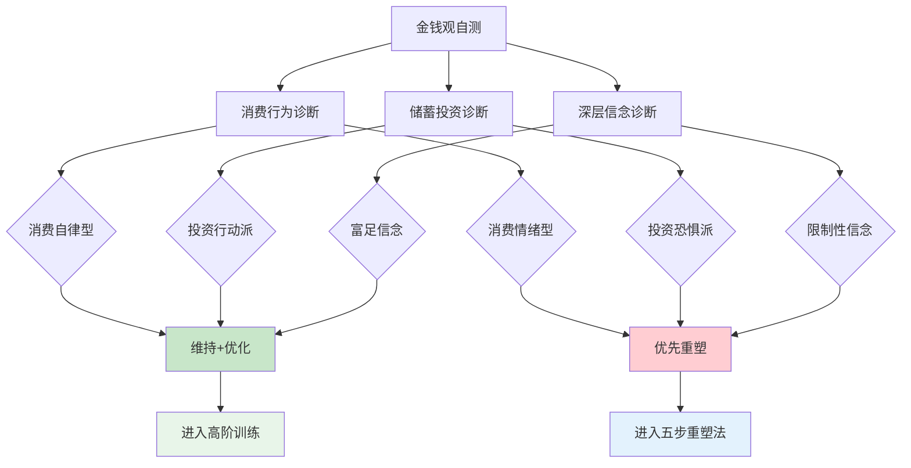
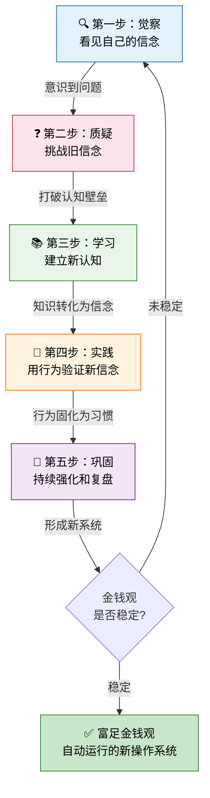
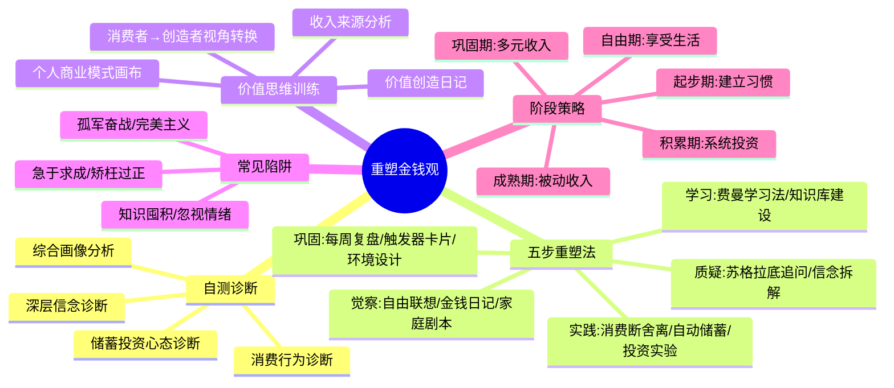

## 2.1 重塑金钱观的实用技巧

> **一句话总结：** 金钱观不是天生的，而是可以被识别、质疑、重塑的——但你必须先看见它，才能改变它。

金钱观是一套深植于潜意识的认知系统，它在你不知不觉中驱动着80%以上的财务决策。你今天选择点外卖还是自己做饭、看到打折商品是否冲动下单、工资到账后先消费还是先储蓄——这些看似微小的决策，背后都是金钱观在发挥作用。

本节提供一套完整的、可实操的金钱观重塑工具箱。它不是"想开点"式的心灵鸡汤，而是基于认知行为疗法（CBT）和行为经济学的系统方法，配合具体练习、模板和真实案例，帮你从"知道"走向"做到"。

---

### 2.1.1 金钱观自测：发现你的隐藏信念

在开始改变之前，你需要一张"金钱观X光片"——清晰地看到你当前的信念系统是什么样的。大多数人对自己的金钱观处于"无意识"状态：他们不知道自己为什么这样花钱、这样存钱、这样投资。以下三个维度的自测工具，帮你把潜意识里的信念"打捞"出来。

#### 维度一：消费行为诊断

消费行为是金钱观最直接的外在表现。通过观察你的消费模式，可以反推底层信念。

| # | 问题 | 从不(1分) | 偶尔(2分) | 经常(3分) | 总是(4分) |
|---|------|----------|----------|----------|----------|
| 1 | 看到"限时折扣""最后一天"会心动并购买 | □ | □ | □ | □ |
| 2 | 购买后感到后悔或内疚 | □ | □ | □ | □ |
| 3 | 用购物来缓解压力、焦虑或无聊 | □ | □ | □ | □ |
| 4 | 不清楚自己每月的具体消费金额 | □ | □ | □ | □ |
| 5 | 觉得"对自己好一点"就是花钱 | □ | □ | □ | □ |
| 6 | 借钱消费（信用卡分期、花呗等）用于非必需品 | □ | □ | □ | □ |
| 7 | 购买商品时更关注品牌而非实际功能 | □ | □ | □ | □ |
| 8 | 社交场合中为了面子超预算消费 | □ | □ | □ | □ |

**评分解读：**

| 分数区间 | 诊断结果 | 核心特征 | 典型信念 |
|----------|---------|---------|---------|
| 8-12分 | 消费自律型 | 理性消费，有预算意识 | "钱要花在刀刃上" |
| 13-20分 | 消费模糊型 | 消费习惯不清晰，时而理性时而冲动 | "差不多就行，不用算那么细" |
| 21-28分 | 消费情绪型 | 消费受情绪驱动，容易冲动 | "人生苦短，及时行乐" |
| 29-32分 | 消费失控型 | 消费严重超出能力，有债务风险 | "钱就是用来花的" |

#### 维度二：储蓄与投资心态诊断

储蓄和投资行为反映了你对"未来"和"风险"的态度。

| # | 问题 | 从不(1分) | 偶尔(2分) | 经常(3分) | 总是(4分) |
|---|------|----------|----------|----------|----------|
| 1 | 每月有固定的储蓄目标并执行 | □ | □ | □ | □ |
| 2 | 把储蓄视为"剩余"而非"必须" | □ | □ | □ | □ |
| 3 | 害怕亏损，把所有钱存在银行活期 | □ | □ | □ | □ |
| 4 | 认为投资是有钱人才做的事 | □ | □ | □ | □ |
| 5 | 看到别人赚钱就急于跟风投资 | □ | □ | □ | □ |
| 6 | 亏损时立刻卖出，盈利时急于卖出 | □ | □ | □ | □ |
| 7 | 不了解自己持有资产的风险等级 | □ | □ | □ | □ |
| 8 | 认为"省下的就是赚到的" | □ | □ | □ | □ |

**评分解读：**

| 分数区间 | 诊断结果 | 核心特征 | 典型信念 |
|----------|---------|---------|---------|
| 8-12分 | 投资行动派 | 有储蓄纪律，主动学习投资 | "让钱为我工作" |
| 13-20分 | 投资观望派 | 有储蓄意识但投资犹豫不决 | "等我有钱了再投资" |
| 21-28分 | 投资恐惧派 | 极度厌恶风险，错失增长机会 | "投资就是赌博" |
| 29-32分 | 投资冲动派 | 跟风追涨杀跌，缺乏独立判断 | "别人赚钱我也能" |

#### 维度三：财富信念深层诊断

这一维度直击你潜意识中的核心信念——它们通常来自童年经历和家庭环境，是你最难意识到、却影响最深的部分。

请对以下陈述给出你的第一反应（同意/不同意/不确定）：

**限制性信念清单：**

| # | 信念陈述 | 同意 | 不同意 | 不确定 | 信念来源推测 |
|---|---------|------|--------|--------|------------|
| 1 | "钱是万恶之源" | □ | □ | □ | 家庭/宗教/文学作品 |
| 2 | "有钱人都不是好人" | □ | □ | □ | 媒体/社会舆论 |
| 3 | "我天生不擅长和钱打交道" | □ | □ | □ | 早期失败经历 |
| 4 | "赚钱很辛苦，没有轻松的方式" | □ | □ | □ | 父母的言传身教 |
| 5 | "我不配拥有很多钱" | □ | □ | □ | 低自尊/童年匮乏 |
| 6 | "谈钱伤感情/谈钱很俗" | □ | □ | □ | 文化/家庭教育 |
| 7 | "运气比努力更重要" | □ | □ | □ | 周围人的经历 |
| 8 | "等我有了XX万，一切就会好起来" | □ | □ | □ | 对金钱功能的误解 |
| 9 | "财务自由是少数人的特权" | □ | □ | □ | 阶层固化感 |
| 10 | "我现在收入太低，没法规划财务" | □ | □ | □ | 稀缺心态 |

**关键判断标准：** 如果你在6道以上选择了"同意"，说明你的金钱观中有较多限制性信念需要重塑。每一句"同意"都值得深入追问——这个信念是怎么来的？它真的成立吗？它在如何影响我的行为？

#### 综合诊断：你的金钱观画像

将三个维度的得分叠加，形成你的个人金钱观画像：



---

### 2.1.2 金钱观重塑的五步法

金钱观重塑不是"突然想通了"那么简单。它是一个有明确阶段、可重复操作的系统过程，基于认知行为疗法（CBT）的核心原理：**认知影响情绪，情绪影响行为，行为反馈认知**。以下五步法是这一原理的实操版本。



> **关键数据：** 伦敦大学学院（UCL）Phillippa Lally的研究表明，养成一个新习惯平均需要66天，范围从18天到254天不等。金钱观的重塑本质上是"认知习惯"的重建，通常需要3-6个月的持续练习。不要期望一夜之间改变——但也不需要等太久，只要你开始做。

---

#### 第一步：觉察——看见你的金钱信念

觉察是一切改变的起点。你无法改变你看不见的东西。大多数人对金钱的反应是"自动驾驶"模式——看到打折就兴奋，看到账单就焦虑，看到别人赚钱就羡慕。这些反应发生得太快，以至于你根本没有机会去审视它们。

**核心任务：** 把潜意识中的金钱信念"打捞"到意识层面，让它变得可见、可分析。

**实操练习一：金钱自由联想**

找一个安静的时间，准备纸笔或打开笔记软件，完成以下练习（建议手写，手写的思考深度通常优于打字）：

1. **设定计时器5分钟**，在纸上写下所有你看到"金钱"这个词时脑海中浮现的词语、画面、感受。不要审查，不要筛选，想到什么写什么。
2. **完成后分类**：将你写下的内容分为三类——
   - 情绪类（焦虑、安全、恐惧、自由、快乐……）
   - 信念类（钱不够用、赚钱辛苦、有钱会变坏……）
   - 画面类（父母为钱吵架、自己第一次赚到钱的场景……）
3. **标注来源**：在每个条目旁边写下"这个想法/感受最早是什么时候出现的？和谁有关？"

> **为什么要手写？** 普林斯顿大学的研究发现，手写笔记比打字笔记的理解深度高出29%。手写时大脑的编码过程更慢、更深，更容易触及潜意识层面的内容。

**实操练习二：金钱日记（持续7天）**

从今天开始，连续7天记录你的每一笔财务决策，以及决策时的内心状态：

```markdown
## 金钱日记模板

### 日期：____年____月____日

**决策记录：**

| 时间 | 决策内容 | 金额 | 决策前的情绪 | 决策的理由 | 事后感受 |
|------|---------|------|------------|-----------|---------|
| 08:30 | 买咖啡 | ¥25 | 疯困，需要提神 | 习惯了每天一杯 | 正常 |
| 12:00 | 点外卖 | ¥38 | 懒，不想走路 | 同事都在点 | 有点贵但算了 |
| 20:00 | 逛淘宝买了一件外套 | ¥299 | 无聊，心情一般 | 打折很划算，之前就想要 | 买完有点后悔 |

**今日反思：**
- 今天有哪些消费是可以避免的？
- 哪些消费受了情绪的影响？
- 如果重来一次，我会做出不同的选择吗？
```

**为什么是7天？** 7天足够覆盖一个完整的工作日/休息日周期，能捕捉到不同场景下的消费模式。很多人的工作日和周末消费模式截然不同——工作日理性消费，周末报复性消费，这种模式只有跨场景观察才能发现。

**实操练习三：家庭金钱剧本回顾**

你的金钱观有60-80%来自家庭。以下是帮你"考古"原生家庭金钱影响的结构化练习：

1. **回忆你家关于钱的三个最深刻的场景**——可以是争吵、庆祝、恐惧、骄傲。写下每个场景中谁在场、发生了什么、你当时的感受。
2. **列出你父母常说的关于钱的话**——比如"我们家没钱""钱要省着花""赚钱不容易""别和别人比"。这些话你现在还在对自己说吗？
3. **分析你父母的金钱行为模式**——他们是储蓄型还是消费型？投资过吗？为钱吵过架吗？他们对富人的态度是什么？
4. **对比：你的金钱行为和父母有多相似？** 这个对比往往会让人大吃一惊——很多人发现自己在无意识地重复父母的金钱模式，即使理智上知道那不是最优选择。

---

#### 第二步：质疑——挑战限制性信念

觉察之后，你需要对那些"限制性信念"进行审问。这些信念之所以根深蒂固，是因为你从来没有质疑过它们——它们就像空气一样，你一直呼吸着却从未注意过。

**核心任务：** 用苏格拉底式的追问法，拆解每一个限制性信念的逻辑链条。

**苏格拉底追问法实操模板：**

对每一个你在第一步中发现的限制性信念，用以下五个问题进行"审讯"：

| # | 追问 | 目的 | 示例 |
|---|------|------|------|
| 1 | 这个信念的**证据**是什么？ | 区分事实和观点 | "钱是万恶之源"——这句话有统计数据支持吗？ |
| 2 | 这个信念的**反例**是什么？ | 打破绝对化思维 | 巴菲特、稻盛和夫都是有钱且受人尊敬的人 |
| 3 | 这个信念的**来源**是什么？ | 追溯信念起源 | 来自父母的抱怨还是文学作品的渲染？ |
| 4 | 这个信念**保护**了我什么？ | 理解信念的功能 | "我不配有钱"可能保护我不面对失败的风险 |
| 5 | 如果放弃这个信念，**最坏会发生什么？** | 评估改变的风险 | 最坏的情况不过是回到现在的状态 |

**六大常见限制性信念深度拆解：**

**信念一："钱是万恶之源"**

- **原文出处误读：** 这句话的原文是"对金钱的贪爱（love of money）是万恶之源"（《提摩太前书》6:10），指的是对金钱的过度执着，而非金钱本身。金钱是中性的工具，就像刀可以用来做饭也可以用来伤人。
- **逻辑检验：** 如果钱是万恶之源，那么没有钱就不会有恶？历史证明，贫穷同样会催生犯罪和冲突。联合国数据显示，全球犯罪率最高的地区往往不是最富裕的地区，而是最贫困的地区。
- **替代信念：** "金钱是放大器——它放大你本来的样子。善良的人有了钱会做更多善事，贪婪的人有了钱会更加贪婪。"

**信念二："有钱人都不是好人"**

- **数据反驳：** 根据《中国慈善发展报告》，中国年捐赠超过1亿元的企业家超过100位。全球范围内，比尔·盖茨基金会已经挽救了超过1亿人的生命。财富和道德之间没有必然的负相关。
- **幸存者偏差：** 媒体报道的富人负面新闻更具传播性，导致你对富人群体产生了系统性的负面认知偏差。你不会看到"某企业家正常缴税、正常生活"这样的新闻标题。
- **替代信念：** "有钱人中有好人也有坏人，和任何群体一样。我关注的应该是他们创造财富的方法，而不是给他们贴标签。"

**信念三："赚钱很辛苦"**

- **来源分析：** 这个信念通常来自父母的言传身教。如果你的父母是体力劳动者或低薪工作者，"赚钱辛苦"就是他们的亲身经历。但他们的经历不等于所有赚钱方式的真相。
- **认知陷阱：** 这个信念会把你锁定在"用时间和体力换钱"的模式里，让你忽略"用知识、系统、资本赚钱"的可能性。
- **替代信念：** "赚钱可以是辛苦的，也可以是聪明的。我需要学习的是如何让赚钱变得更高效，而不是接受辛苦是唯一的路径。"

**信念四："我现在收入太低，没法理财"**

- **数学反驳：** 假设你每月只能存500元，年化收益8%，20年后你将拥有约29.4万元。如果你同时把每月的储蓄额每年提升10%（随着收入增长），20年后这个数字将超过80万。"太少不值得理"是一个数学上完全错误的判断。
- **行为陷阱：** 这个信念的真正危害不在于金额大小，而在于它让你延迟了"开始"。投资中最大的优势是时间，而这个信念正在偷走你最宝贵的时间。
- **替代信念：** "最好的开始时间是十年前，其次是现在。金额不重要，重要的是建立习惯和学习过程。"

**信念五："谈钱伤感情/谈钱很俗"**

- **文化根源：** 这个信念在中国文化中尤为根深蒂固，它和"君子喻于义，小人喻于利"的传统观念有关。但在现代商业社会中，不谈钱往往导致更大的伤害——合伙创业不谈股权分配最后反目成仇的故事比比皆是。
- **功能分析：** 这个信念实际上保护了什么呢？它可能保护了短期关系的表面和谐，但代价是长期的财务混乱和潜在的更大冲突。
- **替代信念：** "清晰的财务沟通是健康关系的基础。真正伤害感情的不是谈钱，而是因为不谈钱导致的误解和不公平。"

**信念六："等我有了XX万，一切就会好起来"**

- **心理学解释：** 这叫"到达谬误"（arrival fallacy）——以为达到某个目标就会获得持久的幸福感。哈佛大学的研究表明，中彩票的人在一年后幸福水平回到基线。
- **逻辑问题：** 这个信念把幸福和特定金额挂钩，但幸福来自过程而非终点。而且，"一切会好起来"具体指什么？如果你说不清楚，这个信念就是一个空洞的安慰。
- **替代信念：** "财务目标给我方向，但幸福来自追求目标的过程和沿途的成长。我享受变富的旅程，而不仅仅是终点。"

---

#### 第三步：学习——建立新的认知框架

质疑旧信念之后，你需要用新的、有事实支撑的信念来替代它们。"真空"不会持续太久——如果你只是打破了旧信念却没有建立新信念，旧信念会很快回来。

**核心任务：** 系统学习财富知识，用事实和逻辑构建新的金钱认知框架。

**必学知识清单：**

| 知识领域 | 核心概念 | 为什么重要 | 推荐学习资源 |
|----------|---------|-----------|------------|
| 金钱本质 | 交易媒介、价值尺度、价值储藏、延期支付 | 理解金钱的功能才能正确使用它 | 本章1.1节 |
| 财富心理学 | 稀缺心态、损失厌恶、锚定效应、延迟满足 | 识别自己的认知偏差 | 《思考，快与慢》卡尼曼 |
| 复利效应 | 72法则、时间价值、指数增长 | 建立长期投资的信心和耐心 | 本章1.4节 |
| 资产配置 | 风险分散、资产类别、再平衡 | 从"选对股票"升级到"搭对组合" | 本章1.5节 |
| 价值创造 | 需求分析、商业模式、杠杆效应 | 从"怎么赚钱"升级到"怎么创造价值" | 《富爸爸穷爸爸》清崎 |
| 财务报表 | 资产负债表、现金流量表、利润表 | 用数据而非感觉管理个人财务 | 《小狗钱钱》博多·舍费尔 |

**学习方法论：费曼学习法**

不要只是"读过"——用费曼学习法确保你真正理解了：

1. **选择一个概念**（如"复利效应"）
2. **用大白话解释给一个完全不懂的人听**——假装对方是你的朋友，没有任何金融背景
3. **发现卡壳的地方**——你解释不清楚的地方，就是你没有真正理解的地方
4. **回去重新学习，然后再次解释**——直到你能流畅地用日常语言解释清楚

**建立"金钱观知识库"：**

创建一个专门的笔记（可以用Notion、Obsidian、飞书文档或纸质笔记本），按以下结构组织：

```markdown
# 我的金钱观知识库

## 一、旧信念 vs 新信念
| 旧信念 | 来源 | 质疑结果 | 新信念 | 证据支撑 |
|--------|------|---------|--------|---------|
| 钱是万恶之源 | 家庭教育 | 原文被误读 | 金钱是中性工具 | 《提摩太前书》6:10原文 |
| ... | ... | ... | ... | ... |

## 二、关键概念笔记
（每个概念用费曼学习法记录）

## 三、启发性案例
（记录你遇到的改变金钱观的真实故事）

## 四、每周反思
（每周回顾一次，更新你的认知）
```

---

#### 第四步：实践——用行为验证新信念

认知层面的改变如果不通过行为来验证和强化，很快就会消退。你需要用具体的财务行为来"检验"你的新信念，让新信念从"我知道"变成"我体验过"。

**核心任务：** 设计三个"行为实验"，分别对应消费、储蓄、投资三个维度。

**行为实验一：30天消费断舍离**

| 阶段 | 时间 | 行动 | 目的 |
|------|------|------|------|
| 第1周 | 7天 | 只买必需品（食物、交通、住房），所有非必需消费暂停 | 打破消费惯性 |
| 第2周 | 7天 | 恢复消费，但每笔非必需消费前等待24小时再决定 | 建立"冷静期"机制 |
| 第3周 | 7天 | 对每笔消费问自己"这能给我带来持续价值吗？" | 从"想要"切换到"需要" |
| 第4周 | 7天 | 总结本月消费数据，对比上月 | 量化行为改变的效果 |

> **真实案例：** 一位25岁的互联网从业者进行30天消费断舍离后发现，自己每月有38%的消费属于"情绪性消费"——主要是工作压力大时的外卖升级和深夜网购。30天实验后，她将月消费降低了2100元，相当于每年多存下25200元。

**行为实验二：自动储蓄系统搭建**

不要依赖"意志力"来储蓄——意志力是有限资源，会疲劳。用系统替代意志力：

**"先付给自己"法则的实操步骤：**

1. **计算你的储蓄率目标**：建议从收入的10%开始，逐步提升到20-30%
2. **设置自动转账**：在工资到账日（或次日），设置银行自动转账，将目标金额转入专用储蓄账户
3. **开立三个账户**：
   - 日常消费账户（工资卡）
   - 应急基金账户（货币基金，存够3-6个月生活费）
   - 投资账户（用于长期投资）
4. **储蓄率递增计划**：每3个月将储蓄率提升2-3个百分点，直到达到目标

**为什么要"自动"？** 行为经济学研究表明，"默认选项"的力量极其强大。当储蓄成为"默认"（自动执行），而消费需要"主动选择"（手动转出）时，储蓄率会显著提升。401(k)计划的研究表明，自动加入使参与率从49%提升到86%。

**行为实验三：100元投资实验**

如果你从未投资过，用100元开始你的第一次投资体验：

1. **选择一个低门槛平台**：如支付宝的余额宝、微信的零钱通（货币基金），或者一个指数基金定投
2. **投入100元**——金额不重要，重要的是"开始"
3. **每天观察一次**：记录你看到金额波动时的情绪反应
4. **坚持30天**：体验"钱生钱"的过程
5. **复盘**：30天后回顾——你的收益是多少？你的心理感受如何？你对投资的恐惧减少了吗？

**这个实验的真正目的不是赚多少钱**，而是打破"投资很复杂""投资很危险""投资是有钱人的事"这些心理壁垒。当你亲手体验过"钱在自动增长"的感觉后，你对投资的恐惧会显著降低。

---

#### 第五步：巩固——持续强化新系统

新的金钱观建立后，需要持续的维护和强化。旧信念不会自动消失——它们只是暂时被压制了。如果不持续巩固，压力大、情绪低落时旧信念很容易反弹。

**核心任务：** 建立"金钱观维护系统"，让新信念成为你的默认反应。

**巩固工具一：每周金钱观复盘（15分钟）**

```markdown
## 每周金钱观复盘模板

### 本周日期：____月____日 至 ____月____日

**1. 财务行为回顾**
- 本周最大的一笔消费是什么？这笔消费值得吗？
- 本周有没有被情绪驱动的消费决策？
- 本周的储蓄/投资计划执行了吗？

**2. 信念检查**
- 本周有没有出现旧信念？（如"赚钱太辛苦了"）
- 当时的应对方式是什么？
- 新信念是否起到了替代作用？

**3. 学习收获**
- 本周学到了什么新的财富知识？
- 有没有遇到启发性的案例或故事？

**4. 下周计划**
- 下周的重点财务目标是什么？
- 需要避免的消费陷阱有哪些？
```

**巩固工具二：金钱观"触发器-应对"卡片**

识别你的"旧信念触发器"，为每个触发器预先准备应对方案：

| 触发场景 | 可能出现的旧信念 | 预设的新信念回应 | 具体行动 |
|----------|----------------|----------------|---------|
| 看到同事买了新包 | "我也应该买一个" | "别人的消费不是我的标准" | 打开储蓄APP看余额增长 |
| 工资没涨 | "赚钱太难了" | "收入有多种提升路径" | 列出3个提升收入的行动方案 |
| 投资短期亏损 | "我果然不适合投资" | "短期波动是正常的" | 查看投资的长期历史走势 |
| 朋友借钱不还 | "谈钱伤感情" | "清晰的边界保护双方" | 建立借贷规则，下次提前说明 |
| 看到"财务自由"广告 | "别人都成功了，就我没有" | "每个人的路径不同" | 关闭广告，回到自己的计划 |

**巩固工具三：环境设计**

你的环境比你的意志力更强大。设计一个支持新金钱观的环境：

- **信息环境：** 取关制造消费焦虑的社交媒体账号，关注理财知识类博主。卸载不必要的购物APP，或者将它们从手机首页移到最后一页。
- **社交环境：** 找到1-2个有正确金钱观的朋友或社群，定期交流。你不需要刻意疏远消费型朋友，但你需要增加"财富正向"的社交比例。
- **物理环境：** 在你的钱包里放一张小纸条，写上你的新核心信念或财务自由数字。在电脑桌面上放一张你的财务目标可视化图。
- **数字环境：** 设置手机的"屏幕使用时间"限制，减少在购物APP上的浏览时长。设置每月消费预算提醒。

---

### 2.1.3 建立"价值思维"的训练方法

价值思维是从"消费者思维"到"创造者思维"的根本转变。消费者思维问的是"这个东西值多少钱"，创造者思维问的是"我能创造什么价值"。前者是零和博弈（我的钱少了，商家的钱多了），后者是正和博弈（我创造价值，我获得回报）。

这个思维转变为什么重要？因为**你的收入上限取决于你创造价值的能力，而不是你"要价"的能力**。一个只能"要价"的人，收入天花板是老板愿意给的最高价；一个能"创造价值"的人，收入天花板是他能解决多大的问题。

#### 训练一：价值创造日记

每天花5分钟回答三个问题，持续30天：

```markdown
## 价值创造日记（每日记录）

**日期：** ____年____月____日

**1. 今天我创造了什么价值？**
（可以是工作中的一个解决方案、帮同事解决一个问题、写了一篇有用的文章、教会了别人一个技能、甚至做了一顿好吃的饭让家人开心）

**2. 这些价值被谁认可了？他们愿意为此付多少钱？**
（如果不确定，想象一下：如果这是你的产品/服务，市场上有人愿意付费吗？）

**3. 我如何创造更多的价值？**
（列出1-2个具体的行动方案）
```

**30天后的复盘：** 回顾你的价值创造日记，你会发现：
- 你创造的价值比你以为的要多
- 有些价值很容易被量化（帮公司省了多少钱），有些很难（让团队士气提升）
- 你有能力创造但尚未发挥的价值领域

#### 训练二：收入来源价值分析

用以下表格分析你的每一个收入来源，找出价值提升空间：

```markdown
## 收入来源价值分析表

### 收入来源1：______（如：本职工作）

| 分析维度 | 你的回答 | 价值提升方向 |
|----------|---------|------------|
| 这个收入创造了什么价值？ | （具体描述） | （如何创造更大价值？） |
| 这个价值是否可复制？ | 是/否/部分 | （如何让更多人受益？） |
| 这个价值是否有时间杠杆？ | 是/否 | （能否一次创造、多次收费？） |
| 替代我的成本有多高？ | 高/中/低 | （如何提升不可替代性？） |
| 我的收入和我创造的价值匹配吗？ | 偏高/匹配/偏低 | （如果不匹配，如何调整？） |
| 3年后这个收入来源会更强还是更弱？ | 更强/不变/更弱 | （需要提前布局什么？） |
```

#### 训练三：商业模式画布（个人版）

用商业模式画布的思维来审视自己——把"你"当作一个"产品"来运营：

| 画布模块 | 个人版问题 | 你的回答 |
|----------|----------|---------|
| **价值主张** | 我能为别人解决什么独特的问题？ | |
| **客户群体** | 谁最需要我解决的这个问题？ | |
| **渠道通路** | 我如何让需要的人知道我？ | |
| **客户关系** | 我如何与客户建立长期关系？ | |
| **收入来源** | 我通过什么方式获得回报？ | |
| **核心资源** | 我拥有什么独特的技能、知识、资源？ | |
| **关键活动** | 我需要做哪些关键事情来交付价值？ | |
| **重要伙伴** | 我需要和谁合作来放大价值？ | |
| **成本结构** | 我需要付出什么成本（时间、金钱、精力）？ | |

> **实操建议：** 每季度更新一次这个画布。你的"个人商业模式"会随着技能增长、市场变化、人生阶段的不同而持续进化。

#### 训练四：从消费者到创造者的视角转换练习

下次你在消费任何产品或服务时，用"创造者视角"来观察：

1. **这个产品解决了什么问题？**——把注意力从"我要不要买"转移到"它为什么能卖"
2. **它的目标客户是谁？**——分析市场定位
3. **它的商业模式是什么？**——靠什么赚钱？一次收费还是持续收费？
4. **如果我来做，我会怎么做？**——锻炼商业直觉
5. **它有什么不足？**——寻找改进和创业机会

这个练习不需要你真的去创业，但它会从根本上改变你看待世界的方式。当你开始用"创造者的眼睛"看世界时，你会发现到处都是机会——而这些机会在"消费者视角"下是完全隐形的。

---

### 2.1.4 金钱观重塑的常见陷阱与应对

重塑金钱观的过程中，有一些常见的"坑"会让努力白费。提前识别它们，才能绕过它们。

**陷阱一：急于求成**

- **表现：** 学了几节理财课就觉得自己"顿悟"了，大额投资、辞掉工作、全职炒股
- **为什么危险：** 认知改变需要时间沉淀，行为改变需要反复练习。"顿悟"的感觉往往是短暂的多巴胺冲动，而不是真正的认知升级
- **应对：** 给自己设定一个"冷静期"——任何重大财务决策（超过月收入20%的支出或投资），至少等待72小时再执行

**陷阱二：矫枉过正**

- **表现：** 从"月光族"突然变成"铁公鸡"，拒绝一切消费，连必要的社交和娱乐都砍掉
- **为什么危险：** 过度节俭会导致报复性消费——压抑越久，爆发越猛。而且，金钱是改善生活品质的工具，不是存折上的数字
- **应对：** 设定"享乐预算"——每月拿出收入的5-10%专门用于"让自己开心"，花这笔钱时不用有任何负罪感

**陷阱三：知识囤积症**

- **表现：** 疯狂买书、报课、关注公众号，但从不实践。用"我在学习"来逃避"我在行动"
- **为什么危险：** 知识不等于能力。你可以读100本游泳教材，但不跳进水里就永远学不会游泳
- **应对：** 遵循"学一个、用一个"原则——每学完一个知识点，必须在一周内设计一个实操练习并完成

**陷阱四：忽视情绪因素**

- **表现：** 以为改变金钱观就是"想通了"，不处理伴随的情绪（恐惧、内疚、焦虑、羞耻）
- **为什么危险：** 情绪是决策的隐形驱动器。你可以理智上知道"应该投资"，但恐惧情绪会阻止你按下"买入"按钮
- **应对：** 当你做出一个"正确但不舒服"的财务决策时（如开始定投），注意到那种不舒服的感觉，给它命名（"这是我的恐惧情绪"），然后继续执行。情绪不需要消失，只需要被识别和管理

**陷阱五：孤军奋战**

- **表现：** 一个人默默改变金钱观，不告诉任何人，也不寻求支持
- **为什么危险：** 环境的力量大于个人意志。如果你周围的人都在消费，你的改变会被环境不断消解
- **应对：** 至少找一个"金钱观改变伙伴"——可以是朋友、家人、或线上社群的陌生人。定期分享进展、互相监督。研究表明，有"问责伙伴"的人完成目标的概率提高65%

**陷阱六：完美主义陷阱**

- **表现：** 要求自己在所有维度同时完美——既要节俭、又要投资、还要副业、还要学习。一个月做不到就觉得自己"失败了"
- **为什么危险：** 完美主义是行动的天敌。"全有或全无"的思维模式让你在遇到挫折时彻底放弃
- **应对：** 每个月只聚焦一个改变。第一个月只做记账，第二个月在记账基础上加上自动储蓄，第三个月再加上小额投资。小步迭代，持续进步

---

### 2.1.5 不同人生阶段的金钱观重塑重点

金钱观重塑不是一成不变的——不同人生阶段面临不同的挑战和机遇，需要有针对性的策略。

| 人生阶段 | 年龄段 | 核心挑战 | 重塑重点 | 关键行动 |
|----------|--------|---------|---------|---------|
| 起步期 | 18-25岁 | 收入低、消费诱惑大、缺乏财务知识 | 建立基础习惯：记账、储蓄、学习 | 建立自动储蓄（即使每月只有500元） |
| 积累期 | 25-35岁 | 收入增长期但开支也增大（房贷、育儿） | 平衡消费与投资，建立投资体系 | 开始系统投资，储蓄率提升到20%以上 |
| 巩固期 | 35-45岁 | 职业瓶颈、家庭责任加重 | 优化资产配置，开辟第二收入来源 | 多元化收入来源，加大权益类投资比重 |
| 成熟期 | 45-55岁 | 收入高峰期但体力开始下降 | 被动收入体系建设，风险管理 | 确保被动收入覆盖基本生活开支 |
| 自由期 | 55岁以后 | 退休准备、健康支出增加 | 保本为主、享受生活 | 调整为低风险配置，关注健康投资 |

---

### 2.1.6 本节核心要点回顾



**最后的话：**

重塑金钱观不是一个"项目"（有开始和结束），而是一个"系统"（持续运行和迭代）。你不需要在某一天"完成"金钱观重塑，你需要做的是建立一套每天自动运行的"金钱观操作系统"——它帮你自动做出更好的消费决策、自动储蓄、自动学习、自动复盘。

从今天开始的第一步是什么？打开你的笔记工具，完成"金钱自由联想"练习。只用5分钟。不需要完美，不需要全面，只需要开始。

**种一棵树最好的时间是十年前，其次是现在。重塑金钱观也是如此。**
