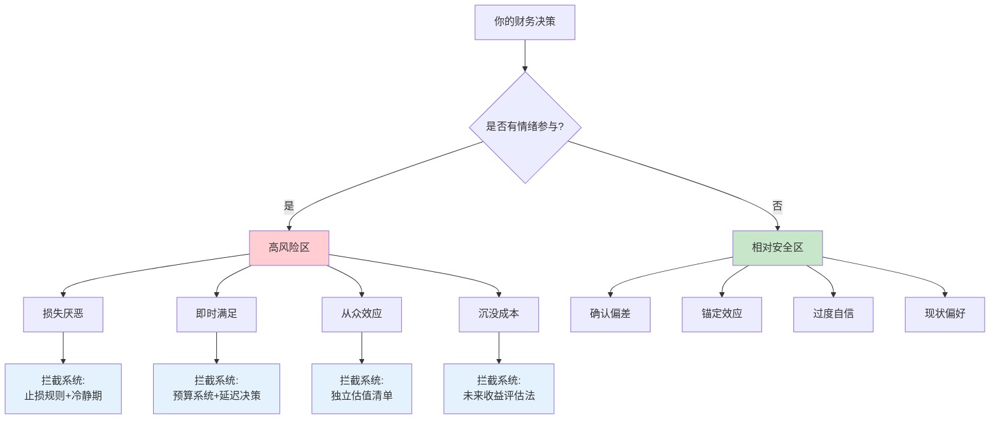
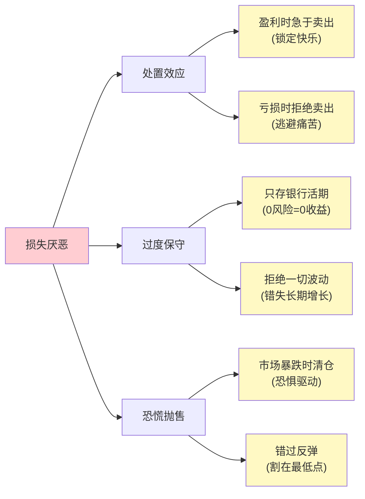
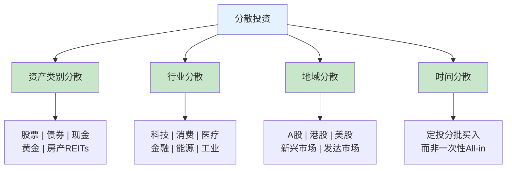
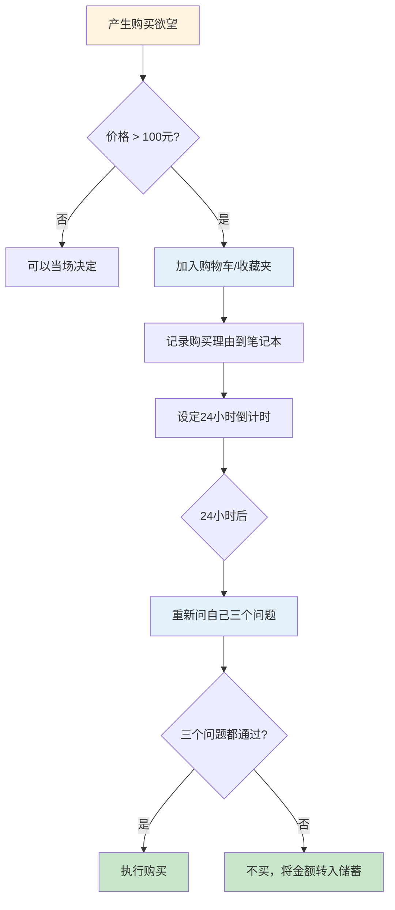
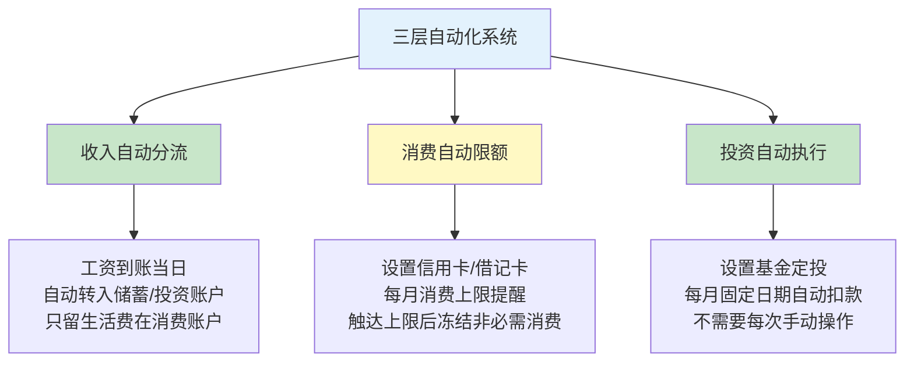

## 2.2 克服心理偏差的实用技巧

> **一句话总结：** 心理偏差不是性格缺陷，而是大脑的默认"快捷方式"——你无法消灭它，但可以建立"拦截系统"，在偏差触发的瞬间用正确的流程接管决策。

上一节（1.2 财富心理学）已经让你认识到损失厌恶、锚定效应、即时满足等心理偏差的存在和危害。知道"敌人"是谁是第一步，但知道敌人不等于能打败敌人。本节提供一套经过行为经济学验证、可立即执行的实操工具箱——每个技巧都有具体步骤、真实案例、常见陷阱和验证标准，确保你从"知道偏差存在"升级到"能在关键时刻拦截偏差"。

### 认知偏差全景图：你需要克服的不只是三个偏差

在深入具体技巧之前，先建立一个全景认知。影响财务决策的心理偏差远不止损失厌恶、锚定效应和即时满足三种。以下是一个影响个人财务的核心偏差清单，帮助你建立完整的"敌人名单"：

| 偏差名称 | 通俗解释 | 财务场景举例 | 影响程度 |
|----------|---------|------------|---------|
| **损失厌恶** | 亏100元的痛苦 > 赚100元的快乐 | 不愿止损、过度保守 | ★★★★★ |
| **锚定效应** | 被第一个数字"锚住"后续判断 | "曾经100现在50肯定便宜" | ★★★★☆ |
| **即时满足偏好** | 偏好眼前的快乐而非未来的收益 | 月光、冲动消费 | ★★★★★ |
| **确认偏差** | 只看支持自己观点的信息 | 只看利好消息就买入 | ★★★★☆ |
| **从众效应** | 看到别人做就跟风 | 追涨杀跌、抢购热潮 | ★★★★☆ |
| **沉没成本谬误** | 因为已经投入所以继续投入 | "已经亏了这么多不能卖" | ★★★★☆ |
| **过度自信** | 高估自己的判断准确率 | 频繁交易、重仓单一股票 | ★★★☆☆ |
| **可得性偏差** | 容易想到的事被认为更常见 | 听说朋友炒股赚了就以为股市赚钱容易 | ★★★☆☆ |
| **心理账户** | 对不同来源的钱区别对待 | 年终奖挥霍、工资精打细算 | ★★★☆☆ |
| **现状偏好** | 维持现状比改变更舒适 | 明知该调整资产配置却一直不动 | ★★★☆☆ |



> **核心认知：** 心理偏差不是偶尔犯的小错误，而是人类大脑经过数百万年进化形成的"默认设置"。它们在原始环境中是生存优势（害怕损失→避免危险、跟从群体→提高存活率），但在现代金融环境中变成了系统性陷阱。你不需要"变聪明"来克服它们，你需要的是**建立外部系统来拦截它们**——就像自动驾驶汽车不需要"更聪明的司机"，而是需要更好的传感器和规则引擎。

---

### 2.2.1 克服损失厌恶的四步法

#### 理解机制：为什么你会被损失厌恶"绑架"

卡尼曼和特沃斯基的前景理论（Prospect Theory）揭示了一个关键发现：**人对损失的感受强度约是同等收益的2-2.5倍**。这意味着亏1万元的痛苦，需要赚2-2.5万元的快乐才能"对冲"。这不是意志力问题——这是大脑杏仁核（负责恐惧和情绪）在前额叶皮层（负责理性决策）还没反应过来之前就已经做出了"逃跑"指令。

在投资中，损失厌恶会导致三种典型行为模式：



**真实数据：** 行为金融学家Terrance Odean的研究显示，散户卖出盈利股票的概率比卖出亏损股票高出约50%——盈利的平均被卖掉了，亏损的被死死抱着。结果是：被卖出的盈利股后续平均上涨了3.4%，而被持有的亏损股后续平均又下跌了4.4%。处置效应每年让投资者损失约3.8%的收益率。

---

#### 第一步：接受波动——重新定义"正常"

**原理：** 损失厌恶的根源之一是把"波动"等同于"亏损"。股票从100元跌到80元，你并没有"亏"20元——你只是看到一个暂时的数字变化。真正的亏损发生在你以低于买入价的价格卖出的那一刻。在你持有期间，波动只是波动，不是亏损。

**具体操作：**

1. **查看历史波动数据。** 打开你投资的基金或股票的历史走势图，选择"全部"时间范围。记录以下数据：
   - 过去10年经历了多少次超过10%的下跌？
   - 每次下跌后恢复到前高平均用了多久？
   - 如果在每次下跌时卖出，最终收益会减少多少？

   > **案例数据：** 以沪深300指数为例，2005年至2025年的20年间，经历了12次超过10%的回调，其中4次超过30%。但如果你在2005年初投入1万元并持有到2025年（不做任何操作），你的资产约为5.8万元。如果你在每次下跌15%时恐慌卖出、等涨回来再买入，由于你几乎不可能买在最低点，你的最终资产可能只有2-3万元——甚至更低。

2. **建立"波动正常化"认知卡片。** 在你的投资笔记本或手机备忘录中记录：

```text
   【波动正常化卡片】
   
   - 标普500年均出现3-5次超过5%的回调（正常）
   - 标普500平均每3-4年出现一次超过20%的熊市（正常）
   - 标普500长期年化收益约10%，但有约1/3的年份是下跌的（正常）
   - 短期波动是长期收益的"入场费"——没有波动就没有超额收益
   - 我的目标是10年后的收益，不是明天的涨跌
   ```

3. **设置"波动检查"频率。** 根据你的投资期限设定查看频率：

   | 投资期限 | 建议查看频率 | 原因 |
   |----------|------------|------|
   | 3年以内 | 每周1次 | 短期需关注趋势变化 |
   | 3-5年 | 每月1次 | 中期投资减少噪音干扰 |
   | 5-10年 | 每季度1次 | 长期投资忽略短期波动 |
   | 10年以上 | 每半年或1年1次 | 超长期投资只需关注基本面 |

---

#### 第二步：设定止损点——用规则替代情绪

**原理：** 损失厌恶之所以危险，是因为它让你在最需要理性的时候（亏损时）反而最不理性。解决方案不是"变得更理性"——这做不到——而是在你理性的时候（投资之前）预先制定规则，然后在触发时机械执行。

**止损规则的三层设计：**

| 层级 | 止损对象 | 触发条件 | 执行动作 | 决策时间 |
|------|---------|---------|---------|---------|
| **个股层** | 单只股票 | 亏损15-20% | 卖出50%，剩余设跟踪止损 | 买入时设定 |
| **基金层** | 单只基金 | 亏损25-30% | 赎回，转入更稳健品种 | 买入时设定 |
| **组合层** | 整体投资组合 | 亏损30%以上 | 暂停所有投资，全面复盘 | 买入时设定 |

**止损的正确心态框架：**

很多人抗拒止损，觉得"止损就是认输"。需要重新理解止损的本质：

- **止损不是认输，是风险管理。** 职业交易员的胜率通常只有40-55%，但他们赚钱的秘密是"赚的时候多赚，亏的时候少亏"。止损就是保证"亏的时候少亏"。
- **止损不是永久退出，是战术调整。** 止损后你并没有亏掉所有的钱——你保留了大部分本金，可以在更好的时机重新入场。
- **不止损才是真正的赌博。** 一只股票从100跌到50是跌50%，但从50涨回100需要涨100%。跌得越深，回本越难。

**止损后的复盘模板：**

```markdown
## 止损复盘表

**日期：** ____年____月____日
**标的：** ____________
**买入价：** ____元 | **止损价：** ____元 | **亏损幅度：** ____%

### 1. 止损原因
- [ ] 触发了预设止损点
- [ ] 基本面发生了实质变化
- [ ] 行业/宏观环境剧变

### 2. 决策过程评估
- 止损执行是否果断？（是/否，如果不是，拖延了多久？）
- 执行时是否有情绪干扰？（焦虑/恐惧/不甘心/其他）
- 是否按预设规则执行？（是/否）

### 3. 复盘总结
- 这次止损的决策是对的吗？
- 如果重来，买入时机/仓位选择需要调整吗？
- 止损规则本身需要修改吗？

### 4. 后续计划
- 这笔资金如何处置？（转入备用金/等待机会/重新配置）
- 对该标的是否继续跟踪？（是，跟踪条件是____ / 否）
```

---

#### 第三步：分散投资——用结构对冲心理弱点

**原理：** 分散投资不仅是一种数学上的风险管理工具，更是一种"心理保险"。当你的投资组合中任何一个单一资产出现大幅波动时，其他资产的稳定表现会"缓冲"你的心理冲击，降低你在恐慌中做出错误决策的概率。

**分散投资的四个维度：**



**不同风险偏好的分散配置参考：**

| 配置类型 | 股票 | 债券 | 现金/货基 | 黄金 | 适合人群 | 预期年化收益 |
|---------|------|------|----------|------|---------|------------|
| 保守型 | 20% | 50% | 20% | 10% | 退休人群、风险极度厌恶者 | 3-5% |
| 稳健型 | 40% | 30% | 15% | 15% | 有家庭负担的中年人 | 5-8% |
| 平衡型 | 60% | 20% | 10% | 10% | 有一定风险承受力的投资者 | 7-10% |
| 积极型 | 80% | 10% | 5% | 5% | 年轻、收入稳定、长期投资 | 9-12% |

**分散投资的常见误区：**

| 误区 | 错误做法 | 正确理解 |
|------|---------|---------|
| "买了10只股票就是分散" | 10只全是科技股 | 分散的核心是**相关性低**，同行业股票高度相关 |
| "基金越多越分散" | 持有20只基金 | 很多基金持仓重叠，5-8只不同策略的基金就够了 |
| "分散了就不会亏" | 分散降低波动但不消除风险 | 2008年全球危机中所有资产类别同时下跌 |
| "买完就不看了" | 持续3年不做再平衡 | 各资产涨跌速度不同，比例会偏离目标，需要定期再平衡 |

---

#### 第四步：长期视角——用时间消灭焦虑

**原理：** 损失厌恶的痛苦强度随时间衰减。今天看到账户亏5000元的痛苦是真实的，但如果你设定一个10年的投资期限，你就知道短期亏损在长期复利曲线中几乎不可见。关键不是"不怕亏"，而是"把注意力从短期数字转移到长期目标上"。

**"时间消灭焦虑"的数据证明：**

| 持有时间 | 正收益概率（沪深300，2005-2025） | 最大可能亏损 |
|----------|-------------------------------|------------|
| 1天 | 约52% | -8.8%（单日） |
| 1个月 | 约58% | -25% |
| 1年 | 约65% | -40% |
| 3年 | 约75% | -20% |
| 5年 | 约85% | -10% |
| 10年 | 约95% | 接近0%（几乎不会亏） |

> **关键洞察：** 当持有时间拉长到10年，正收益概率接近95%。这不是"赌"，这是数学和历史告诉你的确定性。你唯一需要做的，是确保自己能在市场低迷时"撑住"不卖——而这正是前三步（接受波动、止损规则、分散投资）要帮你解决的问题。

**长期视角的实操练习：**

1. **写下你的"投资使命宣言"。** 这不是一个空洞的口号，而是你投资的终极目的，用于在焦虑时重新锚定自己：

```text
   我的投资使命宣言
   
   我投资的目的是：____________________
   （如：在55岁时拥有足够的被动收入覆盖生活开支）
   
   我的时间期限是：____年
   我能承受的最大年度亏损是：____%
   我不需要这笔钱的时间是：____年之前
   
   当市场下跌时，我会提醒自己：
   - 短期波动不影响我的长期目标
   - 我有分散的投资组合和预设的止损规则
   - 历史数据证明长期持有正收益概率超过90%
   ```

2. **建立"不看账户"的习惯。** 这是克服损失厌恶最简单也最有效的技巧之一：
   - 将投资APP从手机首页移到最后一页或文件夹深处
   - 关闭所有涨跌推送通知
   - 设定一个"查看日"（如每月1号），只在那天查看账户
   - 如果忍不住想看，先问自己："看了之后我会做什么？如果答案是'什么也不做'，那就不需要看"

3. **年度复盘而非日度盯盘。** 每年年底做一次全面的投资复盘：

   ```markdown
   ## 年度投资复盘模板
   
   ### 收益回顾
   - 本年投资总收益：____元，收益率____%
   - 与目标收益率对比：高于/低于/持平
   - 收益主要来源：____
   
   ### 行为回顾
   - 本年有几次情绪化交易？____次
   - 最大的情绪化决策是什么？____
   - 止损规则执行情况：严格执行/部分执行/未执行
   
   ### 认知回顾
   - 本年最大的投资教训是什么？
   - 哪些心理偏差影响了我的决策？
   - 明年需要改进的一件事是什么？
   
   ### 下年计划
   - 资产配置是否需要调整？
   - 储蓄率目标：____%
   - 学习计划：____
   ```

---

### 2.2.2 克服锚定效应的技巧

#### 理解机制：为什么你的大脑爱"锚"

锚定效应（Anchoring Effect）由卡尼曼和特沃斯基在1974年首次系统描述。他们的经典实验表明：即使给参与者一个完全随机的数字（比如转盘停在10或65），再让他们估计非洲国家在联合国中的比例，被"锚"在高数字的人平均估计45%，被"锚"在低数字的人平均估计25%。**一个明知无关的数字，依然会影响你的判断。**

在投资和消费中，锚定效应的危害尤为隐蔽——因为你通常意识不到自己被"锚"住了。你以为自己在做理性分析，实际上大脑已经被某个数字悄悄"设定"了参照点。

**投资中常见的锚定陷阱：**

| 锚的类型 | 具体表现 | 为什么是陷阱 |
|---------|---------|------------|
| 历史价格锚 | "这股票曾涨到100，现在50，肯定便宜" | 过去的价格和未来价值没有必然关系 |
| 买入价格锚 | "我买入价是80，不回到80我不卖" | 你的买入价对市场毫无意义 |
| 整数关口锚 | "3000点是底部，不会跌破" | 整数关口只是心理暗示，不是技术支撑 |
| 专家目标价锚 | "分析师说目标价150" | 分析师的目标价准确率通常不到50% |
| 同类比较锚 | "同行业另一只股票PE是30，这只才20，便宜" | 不同公司的基本面差异巨大 |

---

#### 技巧一：独立估值——用数字打破幻觉

**原理：** 对抗锚定效应最有效的方法是建立你自己的"锚"——一个基于基本面分析的独立估值。当你有了自己的估值体系，外界的噪音就很难左右你。

**独立估值的三步流程：**

**步骤1：收集基本面数据**

以股票为例，在做出任何估值之前，先收集以下核心数据：

| 数据项 | 含义 | 去哪里找 |
|--------|------|---------|
| 营业收入 | 公司卖了多少钱 | 年报、季报 |
| 净利润 | 公司实际赚了多少 | 年报、季报 |
| 营收增长率 | 收入增长速度 | 对比去年同期 |
| 净利润率 | 每1元收入赚多少利润 | 净利润/营收 |
| 市盈率(PE) | 股价/每股收益 | 任何行情软件 |
| 市净率(PB) | 股价/每股净资产 | 任何行情软件 |
| ROE | 净资产收益率 | 年报 |
| 自由现金流 | 公司真正能支配的现金 | 年报现金流量表 |

**步骤2：选择估值方法**

根据公司类型选择合适的估值方法：

| 公司类型 | 推荐估值方法 | 计算逻辑 |
|---------|------------|---------|
| 稳定盈利成熟企业 | PE估值法 | 合理PE × 每股收益 = 合理股价 |
| 高成长企业 | PEG估值法 | PE/盈利增长率，PEG<1通常被认为低估 |
| 重资产行业 | PB估值法 | 合理PB × 每股净资产 = 合理股价 |
| 现金流充沛企业 | DCF估值法 | 预测未来现金流并折现到今天 |

**步骤3：与当前价格对比，设定买卖区间**

```text
估值结果示例：
- 我的合理估值区间：80-100元
- 当前市场价：60元（低于我的估值，可能值得买入）
- 当前市场价：120元（高于我的估值，需要谨慎）

注意：即使低于估值也不要All-in，分批建仓更安全
```

> **关键提醒：** 任何估值方法都有局限性。不要追求"精确的错误"，而要追求"模糊的正确"。估值是一个区间，不是一个精确的数字。

---

#### 技巧二：多角度分析——强制启动"反对派思维"

**原理：** 确认偏差（只看到支持自己观点的信息）和锚定效应往往联手行动。你被某个数字"锚"住后，会自动搜索支持这个数字的信息。破解方法是**强制自己寻找反对证据**——在投资领域，这叫"红队分析"。

**"红队分析"实操框架：**

每次做出投资决策之前，填写以下"反对派清单"：

```markdown
## 红队分析清单

### 我的原始判断
- 标的：____
- 判断方向：看涨/看跌/观望
- 主要理由：____

### 反对派意见（必须填写，不能留空）

#### 看空的理由（如果你看涨）
1. ____
2. ____
3. ____

#### 看多的理由（如果你看空）
1. ____
2. ____
3. ____

#### 最可能让我判断错误的3个因素
1. ____
2. ____
3. ____

#### 如果我的判断完全错误，最大损失是多少？我能承受吗？
____

### 综合修正
基于正反两面分析，我原来的判断需要调整吗？
- [ ] 不需要，反面理由不够充分
- [ ] 需要调整，调整方案：____
- [ ] 需要放弃，改为：____
```

**案例演示：**

假设你在2024年初考虑买入某新能源汽车股票，股价80元：

```text
原始判断：看涨，新能源是趋势

红队分析：

看空理由：
1. 新能源补贴退坡，行业增速放缓
2. 价格战导致利润率持续下降
3. 该企业负债率高，现金流为负
4. 市场已有30+品牌，竞争惨烈

看多理由：
1. 全球电动化趋势不可逆
2. 该企业技术壁垒较高
3. 海外市场增长空间大

最可能判断错误的因素：
1. 政策变化（如贸易壁垒限制出口）
2. 竞争对手突破性技术
3. 宏观经济下行压制消费

最大亏损：如果跌到40元（-50%），投入10万亏5万，能承受

修正判断：维持看涨但降低仓位，从30%降到15%
```

---

#### 技巧三：设定标准——建立你的"投资检查清单"

**原理：** 锚定效应最狡猾的地方在于它在你"不知不觉"中发生。对抗方法是在你头脑清醒时建立一份"投资检查清单"（Investment Checklist），每次做决策时逐项打勾——就像飞行员起飞前的检查单一样，即使飞行了10000次，每次依然必须逐项确认。

**投资检查清单模板：**

| 检查项 | 标准 | 当前值 | 是否达标 |
|--------|------|--------|---------|
| **估值** | PE低于历史中位数 | PE=____，中位数=____ | ☐ |
| **盈利质量** | 连续3年净利润为正 | ____年：____，____年：____，____年：____ | ☐ |
| **成长性** | 营收增长率 > 10% | ____% | ☐ |
| **负债率** | 资产负债率 < 60% | ____% | ☐ |
| **现金流** | 自由现金流为正 | ____亿 | ☐ |
| **行业地位** | 行业前3或细分龙头 | ____ | ☐ |
| **管理层** | 管理层无重大诚信问题 | ____ | ☐ |
| **估值锚定排除** | 买入理由不包含"曾经到过XX元" | 是/否 | ☐ |

> **规则：** 如果检查清单中有2项以上未达标，不买入。如果买入理由中包含任何与历史价格相关的描述（"曾经到过"、"跌了很多"、"比最高点便宜"），必须删除该理由并重新评估。

---

#### 技巧四：反向锚定训练——刻意暴露练习

**原理：** 锚定效应可以通过刻意练习来减弱。研究发现，当你被提醒"注意锚定效应"或被要求"从相反方向思考"时，锚定效应的影响会显著降低。

**日常训练方法：**

1. **消费场景练习：** 下次看到"原价999，现价299"时，强制自己忽略"原价999"这个锚，问自己：
   - 如果标签上只写了299，没有原价，我还觉得便宜吗？
   - 其他平台/品牌的同类产品卖多少？
   - 这个东西的制造成本大概是多少？

2. **投资场景练习：** 看到任何"历史最高价"、"目标价"时，强制自己执行：
   - 闭上眼睛5秒，清除刚才看到的数字
   - 从零开始分析：这家公司的业务值多少钱？
   - 用你自己的估值框架得出结论，然后才对比市场价

3. **谈判场景练习：** 任何涉及价格谈判的场景（薪资、买卖、服务费）：
   - 如果对方先报价，先不反应，给自己30秒冷静期
   - 根据你的独立评估（而非对方报价）来回应
   - 主动先报价的人更容易设定"锚"——如果可能，争取先报价

---

### 2.2.3 培养延迟满足的实用方法

#### 理解机制：为什么你的大脑偏爱"现在"

即时满足偏好（Present Bias）是人类最强大的本能之一。神经科学研究表明，当人们考虑"现在就能得到"的东西时，大脑的边缘系统（负责情绪和本能）高度活跃；而考虑"未来才能得到"的东西时，主要由前额叶皮层（负责规划和自控）参与。问题在于，边缘系统的反应速度远快于前额叶——**在你还没"想"到要不要买之前，你的大脑已经"想要"了**。

更深层的原因是"双曲贴现"（Hyperbolic Discounting）：人们对延迟获得的奖励会打一个非理性的"折扣"。实验表明，大多数人宁愿今天拿100元，也不要1年后拿150元——这相当于年化50%的"贴现率"，远超任何合理投资回报率。你每次冲动消费，本质上就是用未来的50%年化收益换今天的即刻快乐。

---

#### 方法一：24小时法则——用时间差打败冲动

**原理：** 冲动消费的"热度"通常在20-30分钟内达到峰值，然后逐渐衰减。24小时足以让绝大多数冲动完全冷却——到那时，你大脑的前额叶皮层已经重新"上线"，能够做出理性评估。

**实操流程（精确版）：**



**24小时后的三个必答问题：**

| # | 问题 | 通过标准 | 不通过 |
|---|------|---------|--------|
| 1 | 如果这个东西不打折、不促销、不网红，我还会买吗？ | 答案是"是" | 你的购买动力来自外部刺激而非真实需求 |
| 2 | 这个东西的"每次使用成本"是多少？（价格÷预计使用次数） | 每次使用成本 < 心理阈值 | 买来很可能闲置 |
| 3 | 如果把这笔钱用于投资，10年后值多少？ | 对比后仍觉得值得买 | 可能不是最优选择 |

> **案例：** 一个常见的24小时法则应用——想买一台5000元的咖啡机。24小时后重新评估：(1) 确实喜欢喝咖啡，不是被博主种草→通过；(2) 预计每天使用，每次成本约0.7元（按5年使用寿命）→比外面买咖啡便宜很多→通过；(3) 5000元如果投资10年按8%年化，约值10795元→但每天的咖啡享受是真实的→综合判断通过→执行购买。

---

#### 方法二：10-10-10法则——扩展你的时间视野

**原理：** 即时满足的本质是"时间视野过窄"——你只看到了"此刻"的好处，忽略了"之后"的代价。10-10-10法则强制你从三个时间维度评估同一个决策，让你的"未来自我"参与当前的决策。

**实操流程：**

面对任何消费决策，依次回答：

| 时间维度 | 核心问题 | 示例（想买2000元的运动鞋） |
|---------|---------|----------------------|
| **10分钟后** | 我会有什么感受？ | 兴奋、满足、"终于买到了" |
| **10个月后** | 这个东西还重要吗？ | 可能已经不太穿了，放在鞋柜积灰 |
| **10年后** | 这笔钱的去向会影响我的生活吗？ | 2000元如果每年投资，10年后约4300元；运动鞋早已扔掉 |

**10-10-10法则的进阶应用——"未来自我对话"：**

这是一个被心理学研究验证有效的深度练习。闭上眼睛，想象10年后的自己坐在对面。然后问：

1. "未来的我，你会希望我现在怎么花这笔钱？"
2. "未来的我，你会后悔我今天的这个消费决定吗？"
3. "未来的我，你最希望我现在开始做什么？"

> **研究支持：** 斯坦福大学Hal Hershfield的研究发现，当人们看到自己衰老后的数字模拟照片时，储蓄意愿平均提升了30%。原因是"未来的自己"从一个抽象概念变成了一个具体的"人"，你更难对一个具体的人（未来的自己）不负责任。

---

#### 方法三：替代满足——低成本的情绪满足方案

**原理：** 很多消费的本质不是"需要那个东西"，而是"需要那种感觉"。如果能找到低成本的方式获得同样的感觉，你就实现了"既要又要"——既满足了情绪需求，又没有花大钱。

**情绪需求→替代方案对照表：**

| 核心情绪需求 | 常见消费行为 | 消费金额 | 替代方案 | 替代成本 | 满足度对比 |
|------------|------------|---------|---------|---------|----------|
| 社交归属感 | 买名牌包/手表 | 3000-50000元 | 加入兴趣社群、参加线下活动 | 0-200元 | 80%以上 |
| 压力释放 | 深夜网购/暴食 | 500-2000元/次 | 跑步/冥想/写日记 | 0元 | 90%以上 |
| 新鲜感 | 买最新款电子产品 | 3000-10000元 | 学习新技能/探索新地方 | 0-500元 | 85%以上 |
| 成就感 | 买奢侈品"奖励自己" | 5000-50000元 | 完成一个挑战（马拉松/读书100本） | 100-500元 | 95%以上 |
| 安全感 | 囤货/过度消费 | 1000-5000元 | 建立应急基金，看余额增长 | 0元 | 100%以上 |
| 娱乐/消遣 | 频繁外出聚餐/KTV | 500-3000元/次 | 家庭聚会/户外野餐/桌游 | 50-200元 | 80%以上 |

**关键认知：** 替代满足不是"委屈自己"——很多人发现替代方案带来的满足感不仅不低于原消费，反而更持久。原因是：物质消费的快乐来自"获得瞬间"，之后迅速衰减（享乐适应）；而体验型、成长型活动的快乐来自"过程"，可以持续更久。

---

#### 方法四：可视化目标——让"未来"变得具体

**原理：** 人类的大脑对具体、生动、可感知的信息远比对抽象数字更敏感。"5年后存100万"是一个抽象目标，对你的情绪系统几乎没有触发作用。但如果你把它变成一张具体的画面——你坐在自己的房子里、不用为房租发愁、每年能自由旅行两次——这个画面就会在你每次想冲动消费时自动弹出来，与即时满足进行"竞争"。

**可视化目标的四步搭建法：**

**第一步：将数字转化为生活场景**

不要只写"100万"，而是写出100万能让你的具体生活发生什么变化：

```markdown
## 我的财务自由画面

当我的存款达到100万时：
- 每月被动收入约3000-5000元（按4%提取率）
- 我可以选择喜欢的工作，不再为工资忍受不喜欢的环境
- 每年可以旅行2次，不用算计预算
- 父母生病时，我可以承担最好的医疗
- 遇到好机会时，我有能力抓住
```

**第二步：创建视觉提醒**

将你的目标转化为你可以每天看到的视觉元素：

- **手机壁纸：** 用Canva或简单图片编辑工具，制作一张包含你的目标金额和核心场景的图片，设为手机壁纸
- **冰箱贴/镜子贴：** 打印一张小纸条："今天省下的200元 = 10年后的430元"
- **桌面便签：** 在电脑桌面放一个便签，写上你的目标和距离目标的进度
- **进度条：** 画一个从0到目标金额的进度条，每月更新一次，填色涂满

**第三步：建立"消费-储蓄"换算习惯**

每次想消费时，自动在脑海中进行换算：

| 想买的东西 | 价格 | 等价于投资10年后（8%年化） | 值得吗？ |
|-----------|------|------------------------|---------|
| 一杯星巴克 | 35元 | 75.6元 | 自己带咖啡更划算 |
| 一件快时尚T恤 | 200元 | 431.8元 | 买一件质量好的穿3年 |
| 最新款iPhone | 8000元 | 17270元 | 现在的手机再用1年 |
| 一次冲动旅行 | 5000元 | 10794元 | 做好预算再出发 |

> **注意：** 这个换算的目的不是让你什么都不买，而是让你在"充分信息"下做决策。如果换算后你仍然觉得值得，那就买——这是经过理性评估的真实需求，不是冲动消费。

**第四步：每季度更新进度**

每个季度花15分钟更新你的财务进度：

```markdown
## 季度财务进度报告（Q__，20__年）

- 当前总资产：____元
- 本季度新增储蓄/投资：____元
- 本季度投资收益：____元，收益率____%
- 距离目标还差：____元
- 预计还需____年达到目标
- 本季度最大一笔非必要消费：____，金额____元
- 下季度优化方向：____
```

---

#### 方法五：自动化系统——用系统替代意志力

**原理：** 延迟满足最大的敌人是"每天都要做选择"——每一次选择都在消耗你的意志力，而意志力是有限资源。最好的策略不是"每天选择延迟满足"，而是**建立一个自动化系统，让延迟满足成为默认选项**。

**三层自动化系统：**



**具体设置指南：**

1. **收入自动分流（最关键）：**
   - 在银行APP中设置"自动转账"：工资到账日（或次日）自动将收入的20-30%转入专用储蓄/投资账户
   - 这笔钱在你看到余额之前就已经"消失"了——你用剩余的钱生活，自然会适应
   - 如果不确定比例，从10%开始，每3个月增加5%

2. **消费限额提醒：**
   - 在记账APP中设置各类别的月度预算
   - 设置日消费限额提醒（如每日非必要消费不超过100元）
   - 当月消费达到预算80%时触发黄色提醒，100%时触发红色提醒

3. **投资自动定投：**
   - 选择1-3只宽基指数基金（如沪深300、中证500）
   - 设置每月固定日期（如工资次日）自动定投固定金额
   - 除非有重大市场变化，否则不手动干预

> **行为经济学数据：** 研究美国401(k)退休计划发现，当企业将"自动加入"设为默认选项（员工需要主动选择退出而非主动选择加入）时，参与率从49%跃升到86%。这证明了"默认选项"的力量远超个人意志力。你的自动化储蓄/投资系统就是你的"个人401(k)"。

---

### 2.2.4 克服其他常见心理偏差的速查手册

除了上述三大偏差外，以下是其他高影响偏差的快速应对方案：

#### 确认偏差（只看自己想看的）

**识别信号：** 你搜索信息时只点开支持你观点的链接；看到反对意见时第一反应是"这个不对"。

**应对方法：**

| 步骤 | 操作 | 工具 |
|------|------|------|
| 1 | 每次分析时，刻意搜索"[标的名称]+风险/缺点/看空" | 搜索引擎 |
| 2 | 阅读至少1篇与你观点相反的深度分析 | 财经社区/研报 |
| 3 | 记录反对意见中最有力的3个论点 | 笔记本 |
| 4 | 评估这些反对论点是否有数据支持 | 财务数据网站 |

---

#### 从众效应（别人都在买所以我也要买）

**识别信号：** 你的购买/投资理由中出现"大家都在买"、"朋友说这个好"、"最近很火"。

**应对方法：**

1. **延迟决策：** "大家都在买"时，等待至少48小时。历史上每次投资泡沫都是"大家都在买"的高峰期。
2. **反向思考：** "如果这件事只有我一个人知道，我还会这么做吗？"
3. **检查独立数据：** 你的判断依据中有多少来自独立分析，多少来自他人意见？如果超过50%来自他人，暂停决策。

---

#### 沉没成本谬误（已经投了这么多不能放弃）

**识别信号：** "我已经投了这么多了"、"已经亏了这么多了卖了就太亏了"、"这个项目做了半年了不能白费"。

**应对方法：**

**"清零测试"：** 假设你今天刚得到一笔和当前持仓等值的现金，但没有持仓。你会用这笔钱买入当前的标的吗？
- 如果答案是"不会"——说明继续持有是非理性的，应该卖出
- 如果答案是"会"——继续持有是合理的

这个测试的核心在于它消除了"沉没成本"的影响——从零开始评估，只看未来的可能性。

---

#### 过度自信（我比市场聪明）

**识别信号：** 频繁交易、重仓单一股票、认为自己能预测市场、嘲笑"长期持有"策略。

**应对方法：**

1. **记录预测并追踪准确率。** 每次你做出预测（"这只股票下周会涨"），记录下来。一个月后统计你的准确率——大多数人会发现自己远没有想象中那么准。
2. **认识"邓宁-克鲁格效应"。** 研究发现，投资知识越少的人往往越自信。真正的专业投资者反而更谦逊，因为他们知道市场的复杂性。
3. **设定交易频率上限。** 如果你发现自己每周交易超过2次，强制降低到每月1-2次。频繁交易的散户长期收益显著低于"买入并持有"的投资者。

---

#### 心理账户（年终奖可以挥霍但工资要精打细算）

**识别信号：** 年终奖/意外收入花起来特别大方；觉得"反正是白来的钱"。

**应对方法：**

1. **统一记账：** 将所有收入（工资、奖金、红包、退款）记入同一个账户，不做区分。钱就是钱，来源不影响它的价值。
2. **"意外收入"规则：** 任何意外收入，70%自动转入投资账户，30%可以自由支配。这样既满足了"奖励自己"的心理需求，又不会挥霍。
3. **时间价值换算：** 今天的1万元年终奖 = 10年后的2.16万元（8%年化）。你确定要把2.16万花在一顿大餐和几件衣服上吗？

---

### 2.2.5 建立你的"心理偏差防御系统"：整合框架

以上所有技巧如果孤立使用，效果有限。真正有效的是将它们整合成一个系统——一个在你每次做财务决策时自动运行的"防御协议"。

#### 决策前检查清单

在做出任何超过500元的财务决策前，花3分钟完成这个清单：

```markdown
## 财务决策检查清单

### 决策信息
- 决策内容：____
- 金额：____元
- 决策时间：____
- 是否在情绪波动中？（是/否）

### 偏差检查（逐项确认）
- [ ] 我没有被"历史价格"锚定（买入理由不包含"曾经到过XX元"）
- [ ] 我没有因为"已经投入"而继续投入（不考虑沉没成本）
- [ ] 我的判断不只基于"大家都这么说"（有独立分析支撑）
- [ ] 我没有只搜索支持自己观点的信息（看过正反两面）
- [ ] 我不是在"情绪化"状态下做决定（情绪平稳）
- [ ] 我考虑了10个月后的自己会怎么看待这个决定
- [ ] 我已经等待了至少24小时（对于非紧急决策）

### 最终判断
- 是否通过所有检查？（是/否）
- 如果否，哪一项未通过？____
- 未通过项的应对方案：____
```

#### 每周偏差复盘

每周花10分钟回顾自己的财务决策，检查是否有偏差影响：

```markdown
## 每周偏差复盘

### 本周财务决策回顾
| 决策 | 金额 | 是否受偏差影响 | 具体偏差类型 | 教训 |
|------|------|-------------|------------|------|
| 例：冲动买了一件衣服 | 300元 | 是 | 即时满足 | 应该等24小时 |
| 例：坚持持有亏损股票 | - | 是 | 沉没成本 | 应做"清零测试" |
| | | | | |

### 本周最大的偏差"胜利"
（描述一个你成功拦截了心理偏差的时刻）

### 下周需要警惕的偏差触发场景
- ____
- ____
```

---

### 2.2.6 高阶进阶：从"对抗偏差"到"利用偏差"

当你已经能够稳定地识别和拦截自己的心理偏差后，可以进入更高阶的阶段——**理解市场中其他参与者的偏差，从中寻找机会**。

#### 逆向思维：别人恐慌时贪婪

巴菲特的名言"别人贪婪时我恐惧，别人恐惧时我贪婪"本质上就是利用市场的集体心理偏差。当市场暴跌、所有人恐慌抛售时（集体损失厌恶），优质资产往往被错杀到远低于其内在价值的价格——这正是理性投资者的机会。

**实操框架：**

| 市场状态 | 大众情绪 | 大众行为 | 理性投资者策略 |
|---------|---------|---------|-------------|
| 牛市顶峰 | 极度乐观 | 追涨、加杠杆 | 逐步减仓、锁定利润 |
| 熊市中期 | 焦虑不安 | 观望、犹豫 | 开始小仓位建仓 |
| 熊市底部 | 极度恐惧 | 恐慌卖出 | 大胆买入优质资产 |
| 牛市初期 | 怀疑犹豫 | 不敢入场 | 加大仓位 |

#### 利用市场锚定

当市场被某个"锚"（如整数关口、分析师目标价、历史高点）影响时，你能识别出价格偏离基本面的机会。例如：当某只优质公司的股价因为"未达到分析师预期"而暴跌，但公司的实际基本面没有变化时，这就是一个锚定效应创造的买入机会。

**高阶警告：** 逆向投资是高风险策略，仅适用于有足够知识、经验和资金的成熟投资者。在你还没有建立完整的投资分析框架之前，不要尝试"抄底"或"逃顶"——先做好前三节（接受波动、止损规则、分散投资），用时间和纪律赚钱。

---

### 2.2.7 本节核心要点回顾

| 章节 | 核心技巧 | 一句话总结 | 立即可执行的动作 |
|------|---------|---------|---------------|
| 2.2.1 损失厌恶 | 接受波动→止损规则→分散投资→长期视角 | 用规则系统替代情绪决策 | 设定止损点，关闭涨跌推送 |
| 2.2.2 锚定效应 | 独立估值→红队分析→检查清单→反向训练 | 建立自己的估值锚，拒绝被外界数字操控 | 下次投资前填写"红队分析清单" |
| 2.2.3 延迟满足 | 24小时法则→10-10-10→替代满足→可视化→自动化 | 让"未来自我"参与今天的选择 | 设置工资自动转存10%到储蓄账户 |
| 2.2.4 其他偏差 | 确认偏差/从众/沉没成本/过度自信/心理账户 | 每个偏差都有识别信号和应对流程 | 开始记录预测并追踪准确率 |
| 2.2.5 防御系统 | 决策前检查清单+每周偏差复盘 | 将分散技巧整合为可重复的系统 | 本周开始使用"财务决策检查清单" |

> **最后的提醒：** 克服心理偏差不是一次性事件，而是一个持续的修炼过程。你不会有一天突然"免疫"了所有偏差——即使是专业交易员也会受到偏差影响。区别在于：他们建立了系统来拦截偏差，并且在偏差"漏网"时能够快速识别和修正。你的目标不是完美，而是从"无意识的偏差受害者"变成"有意识的偏差管理者"。每拦截一次偏差，就是一次胜利。

***
