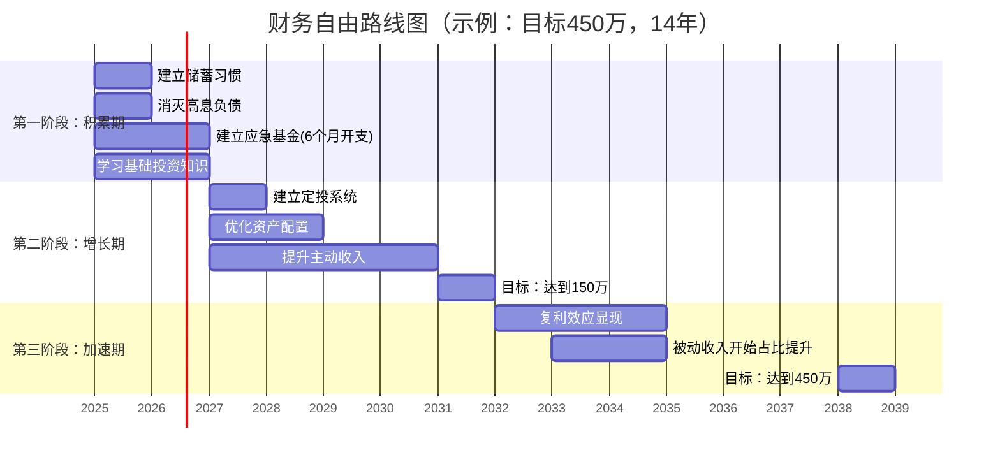

## 2.3 财务自由目标设定技巧

> "一个没有目标的人，终将为别人的目标而工作。" —— 塞涅卡

理论基础章节已经告诉你财务自由的定义和4%法则的计算公式。但知道"需要300万"和"真的攒到300万"之间，隔着一整套目标设定与执行系统。本节提供的是从"我想要财务自由"这个模糊念头，到"2035年6月前积累450万可投资资产"这个精确靶心的全部方法。

### 2.3.1 为什么大多数人设不好财务自由目标

在讲方法之前，先理解常见的失败模式，这样你才能主动避开它们。

**失败模式一：目标过于模糊**

"我要财务自由"不是一个目标，是一个愿望。它没有数字、没有期限、没有路径，就像在GPS里输入"远方"——系统无法给你导航。

**失败模式二：只算总数不拆路径**

"我需要500万"这个数字本身会让人产生无力感。但如果你知道通过每月定投8000元、年化收益8%、18年后可以达到这个数字，压力就变成了一个可控的月度任务。

**失败模式三：忽略动态调整**

25岁时设定的目标，35岁时一定需要修正。收入变化、家庭结构变化、通胀、政策变化都会影响你的财务自由数字。每年不复盘的目标，到第3年就已经偏离轨道。

**失败模式四：混淆"资产总额"与"被动收入"**

很多人执着于攒到一个大数字，却忽略了财务自由的本质是**被动收入≥生活开支**。一个人有500万但全部锁在自住房产里，和一个人有200万但全部是能产生现金流的投资组合，后者的财务自由程度远高于前者。


### 2.3.2 第一步：精确计算你的财务自由数字

#### 计算当前年度生活开支

不是估算，是**精确统计**。拿出过去3个月的银行流水和支付宝/微信账单，按以下分类逐项填写：

| 支出类别 | 月均金额（元） | 年度金额（元） | 是否刚性 | 备注 |
|---------|-------------|-------------|---------|------|
| 房租/房贷 | 5,000 | 60,000 | 刚性 | 含物业费 |
| 餐饮 | 3,000 | 36,000 | 半刚性 | 可压缩至2000 |
| 交通 | 800 | 9,600 | 半刚性 | 通勤为主 |
| 通讯/网络 | 200 | 2,400 | 刚性 | — |
| 日用品 | 500 | 6,000 | 弹性 | 含衣物 |
| 医疗/保险 | 1,000 | 12,000 | 刚性 | 商保+自费 |
| 教育/学习 | 500 | 6,000 | 弹性 | 课程、书籍 |
| 娱乐/社交 | 1,500 | 18,000 | 弹性 | 可大幅压缩 |
| 孝敬父母 | 2,000 | 24,000 | 刚性 | — |
| 其他杂项 | 500 | 6,000 | — | 预留缓冲 |
| **合计** | **15,000** | **180,000** | — | — |

**关键区分：刚性支出 vs 弹性支出**

刚性支出是你在财务自由后也必须承担的费用（住房、基本饮食、保险、赡养义务）。弹性支出是你可以根据财务状况调整的消费。在计算财务自由数字时，建议使用**当前实际支出**作为基准，而不是压缩后的"理想支出"——因为人往往会高估自己的节俭能力。

#### 应用4%法则并加入安全系数

基本公式：

```text
财务自由所需资产 = 年度生活开支 × 25
```

以年开支18万为例：18万 × 25 = **450万**

但这个公式有几个前提假设，你需要根据自身情况做修正：

| 调整因素 | 修正方式 | 调整后数字 |
|---------|---------|-----------|
| 基础4%法则 | 18万 × 25 | 450万 |
| 加入通胀缓冲（年通胀3%） | 年开支按3%逐年递增计算 | ~520万 |
| 考虑社保养老金抵扣 | 减去预计社保覆盖部分 | 450万 - 80万 = 370万 |
| 考虑医疗风险溢价 | 加50万医疗储备金 | 450万 + 50万 = 500万 |
| 如果计划提前退休（40岁前） | 乘以1.3安全系数 | 450万 × 1.3 = 585万 |

**推荐做法：取一个区间而非单一数字。**

- 保守目标（含安全边际）：500-600万
- 中性目标（4%法则标准值）：400-500万
- 激进目标（含社保抵扣等乐观假设）：300-400万

用**中性目标**作为你的核心靶心，保守目标作为"超额完成"的加分线。

#### 设定时间节点——倒推法

知道自己需要多少钱之后，下一步是"什么时候能到"。这里用到的是**未来价值公式**：

```text
FV = PV × (1 + r)^n + PMT × [((1 + r)^n - 1) / r]
```

其中：
- FV = 目标金额（如450万）
- PV = 当前已有可投资资产（如30万）
- r = 预期年化收益率（如8%）
- PMT = 每年新增储蓄/投资额（如15万/年）
- n = 需要的年数（要求解的变量）

用具体数字代入：

```text
450万 = 30万 × (1.08)^n + 15万 × [((1.08)^n - 1) / 0.08]
```

这个方程手算较复杂，下面用Python快速求解：

```python
def years_to_freedom(target, current, annual_saving, rate=0.08):
    """计算达到财务自由目标所需年数"""
    fv = current
    for year in range(1, 51):  # 最多算50年
        fv = fv * (1 + rate) + annual_saving
        if fv >= target:
            return year, round(fv, 2)
    return None, round(fv, 2)

target = 4_500_000    # 目标450万
current = 300_000     # 当前30万
annual_saving = 150_000  # 每年存15万
rate = 0.08            # 年化8%

years, final = years_to_freedom(target, current, annual_saving, rate)
print(f"需要 {years} 年，届时资产约 {final/10000:.1f} 万")
# 输出：需要 14 年，届时资产约 457.3 万
```

这意味着：如果你现在30岁，有30万存款，每年能攒下15万用于投资（年化8%），那么44岁左右可以实现基础财务自由。

#### 目标设定的SMART+框架

传统SMART原则（具体、可衡量、可达成、相关、有时限）不够用，财务自由目标需要增加两个维度：

| 维度 | 含义 | 反面案例 | 正面案例 |
|------|------|---------|---------|
| **S**pecific 具体 | 有明确数字 | "攒够钱" | "积累450万可投资资产" |
| **M**easurable 可衡量 | 有进度指标 | "慢慢来" | "每年新增投资15万" |
| **A**chievable 可达成 | 基于现实推算 | "3年赚1000万" | "14年达到450万" |
| **R**elevant 相关 | 与生活愿景一致 | "别人说要1000万" | "匹配我每年18万的生活方式" |
| **T**ime-bound 有时限 | 有明确DDL | "总有一天" | "2039年前达成" |
| **+D**ynamic 动态 | 定期复盘调整 | "定了就不改" | "每年1月重新校准" |
| **+P**ath-oriented 路径化 | 有中间里程碑 | "只看终点" | "第5年达到150万" |

### 2.3.3 第二步：拆解为可执行的阶段目标

一个14年的长周期目标不可能一步到位，需要拆成三个阶段：



#### 第一阶段：积累期（第1-3年）

核心目标：**建立财务纪律，消灭坏负债，积累第一桶金。**

| 年度 | 关键行动 | 里程碑 | 资产目标 |
|------|---------|--------|---------|
| 第1年 | 记账→建立预算→消灭信用卡分期/网贷 | 消灭所有年化>6%的负债 | 净资产30万→40万 |
| 第2年 | 建立6个月应急基金→开始基金定投 | 应急基金到位，定投系统运转 | 40万→58万 |
| 第3年 | 学习资产配置→优化投资组合 | 形成稳定的投资体系 | 58万→80万 |

**第一阶段的关键：不要急着投资，先把地基打好。** 没有应急基金就去投资，等于在钢丝绳上骑自行车——一个意外（失业、疾病、家庭变故）就可能让你被迫在最差的时间点卖出投资。

#### 第二阶段：增长期（第4-8年）

核心目标：**主动收入提升 + 投资系统成熟，资产加速增长。**

| 年度 | 关键行动 | 里程碑 | 资产目标 |
|------|---------|--------|---------|
| 第4-5年 | 职业突破（跳槽/升职/副业）→加大投资金额 | 年储蓄额提升到20万+ | 80万→140万 |
| 第6-8年 | 投资组合稳健运行→复利开始显现 | 被动收入首次超过1万/年 | 140万→250万 |

**第二阶段的关键：提升收入的天花板比压缩开支的地板更重要。** 月薪从1万提升到2万，每年多出12万储蓄能力，这比每天省吃俭用攒下的3万效率高4倍。

#### 第三阶段：加速期（第9-14年）

核心目标：**复利爆发，被动收入逐步覆盖生活开支。**

| 年度 | 关键行动 | 里程碑 | 资产目标 |
|------|---------|--------|---------|
| 第9-11年 | 资产配置再平衡→逐步增加债券等稳健资产比例 | 被动收入达到5万/年 | 250万→380万 |
| 第12-14年 | 完成目标→制定退休/半退休计划 | 被动收入≥年生活开支 | 380万→450万+ |

**第三阶段的关键：从"进攻"转向"防守"。** 越接近目标，越要降低投资组合的波动性，因为你已经承受不起一次30%的回撤。

### 2.3.4 第三步：建立量化追踪系统

设定目标不追踪，等于没有目标。你需要一套可视化的追踪机制。

#### 资产净值追踪表

每月月底花15分钟更新这张表：

```markdown
## 2025年6月 资产月报

| 项目 | 本月金额 | 上月金额 | 变动 | 目标值 | 完成度 |
|------|---------|---------|------|--------|--------|
| 现金/活期 | 52,000 | 48,000 | +4,000 | 90,000 | 57.8% |
| 基金投资 | 185,000 | 178,000 | +7,000 | — | — |
| 股票投资 | 62,000 | 58,000 | +4,000 | — | — |
| 养老金账户 | 35,000 | 33,000 | +2,000 | — | — |
| **总资产** | **334,000** | **317,000** | **+17,000** | — | — |
| 负债(房贷) | -280,000 | -282,000 | +2,000 | 0 | — |
| **净资产** | **54,000** | **35,000** | **+19,000** | **4,500,000** | **1.2%** |

本月储蓄率：68%（目标≥60%）✓
本月投资收益率：+1.8%（同期沪深300 +1.2%）
```

#### 关键指标仪表盘

除了追踪绝对数字，还需要监控几个健康指标：

| 指标 | 计算方式 | 健康阈值 | 警戒线 |
|------|---------|---------|--------|
| **储蓄率** | 月储蓄额 / 月税后收入 | ≥50% | <30% |
| **投资收益率** | 年化复合收益 | 6-12%（长期） | 连续2年<3% |
| **负债收入比** | 月还款额 / 月收入 | <30% | >50% |
| **应急基金倍数** | 应急资金 / 月开支 | ≥6个月 | <3个月 |
| **被动收入占比** | 被动收入 / 总收入 | 持续上升 | 连续下降 |
| **财务自由进度** | 当前净资产 / 目标资产 | 与时间进度匹配 | 落后>20% |

#### 季度复盘清单

每3个月做一次深度复盘，回答以下问题：

```text
□ 本季度净资产增长了多少？是否达到预期？
□ 储蓄率是否稳定在目标以上？
□ 投资组合表现如何？是否需要调整？
□ 有哪些意外支出影响了进度？如何预防？
□ 收入端有没有提升机会被错过？
□ 生活开支是否有优化空间？
□ 下季度的重点行动是什么？
□ 是否需要调整年度/总目标？
```

### 2.3.5 第四步：应对目标偏离的纠偏策略

执行过程中，偏离计划是常态，完美执行才是例外。关键是建立纠偏机制。

#### 场景一：收入下降（裁员/降薪/行业衰退）

```text
应对策略：
1. 立即压缩弹性支出，维持储蓄率底线（30%）
2. 应急基金启动，保护投资组合不被迫卖出
3. 目标时间线后移1-2年，但不放弃目标
4. 把"危机"视为收入转型的窗口期
```

#### 场景二：投资亏损（市场大跌20%+）

```text
应对策略：
1. 不卖出——这是最重要的纪律
2. 检查资产配置是否符合风险承受能力
3. 如果有余力，逢低加仓（定投不停）
4. 调整心态：下跌时同样的钱能买更多份额
5. 回顾历史：A股每次大跌后3-5年内都创过新高
```

#### 场景三：大额意外支出（结婚/生子/买房/家人生病）

```text
应对策略：
1. 先用应急基金覆盖
2. 重新计算目标数字（如买房后增加房贷，年开支上升）
3. 如果目标数字大幅增加，考虑延长周期或提升收入
4. 不要因为一次大支出就"放弃理财"——调整比放弃好
```

#### 场景四：进度严重落后（落后目标>30%）

```text
应对策略：
1. 诊断原因：是收入不足？开支失控？还是投资策略失误？
2. 收入不足 → 发展副业/跳槽/提升技能
3. 开支失控 → 重新记账1个月，找出"出血点"
4. 投资失误 → 复盘决策，考虑转向指数基金定投
5. 调整目标本身——300万的财务自由也是财务自由
```

### 2.3.6 不同人生阶段的目标设定策略

财务自由目标不是一成不变的，不同年龄、不同人生阶段需要不同的策略。

#### 22-28岁：播种期

**特点：** 收入基数低，但时间是最大优势。

| 策略重点 | 具体做法 |
|---------|---------|
| 最大化储蓄率 | 目标50%+，利用单身/无房贷的优势 |
| 投资自己 | 职业技能提升带来的收入增长，远超投资收益 |
| 开始定投 | 即使每月只有1000元，也要建立习惯 |
| 目标设定 | 设定"30岁前积累50万"这样的中期目标 |

**典型错误：** 觉得"钱太少不值得理财"。实际上，25岁开始每月定投2000元（年化8%），到60岁是约450万；35岁才开始，同样条件只能攒约180万。差10年，差了270万。

#### 28-35岁：建设期

**特点：** 收入快速增长期，但支出也在攀升（房贷、结婚、育儿）。

| 策略重点 | 具体做法 |
|---------|---------|
| 控制"生活方式膨胀" | 收入涨30%，支出只涨10%，差额全部投资 |
| 做好保险配置 | 重疾险+寿险+意外险，保护家庭财务安全 |
| 双收入家庭优势 | 两份收入的储蓄率可以轻松达到单人2倍 |
| 目标设定 | 设定"40岁前达到150万"这样的里程碑 |

#### 35-45岁：冲刺期

**特点：** 收入通常达到生涯峰值，是最后的"黄金窗口"。

| 策略重点 | 具体做法 |
|---------|---------|
| 全力储蓄 | 这10年的储蓄能力决定后半生 |
| 投资组合优化 | 从激进型逐步过渡到平衡型 |
| 被动收入建设 | 房租、股息、版税等开始贡献有意义的现金流 |
| 目标设定 | 设定"45岁前达到300万"，接近财务自由 |

#### 45岁以上：收获期

**特点：** 距离退休近，安全性优先于收益性。

| 策略重点 | 具体做法 |
|---------|---------|
| 降低波动 | 债券/大额存单比例提升至50%以上 |
| 社保规划 | 精确计算养老金领取金额 |
| 半退休过渡 | 考虑从全职转为兼职/顾问，减少对投资组合的提取压力 |
| 目标设定 | 精确计算"还需要多少年可以退休" |

### 2.3.7 财务自由目标的常见误区

#### 误区一："等有钱了再理财"

**真相：** 理财能力是需要练习的。月薪5000时不学理财，月薪5万时大概率也是月光。先用小金额建立系统和习惯，金额自然会随着收入增长而放大。

#### 误区二："目标定得越高越好"

**真相：** 过高的目标会导致两种负面结果：要么因为觉得"反正达不到"而放弃；要么为了达到目标铤而走险（过度杠杆、高风险投机）。一个你相信能达到且愿意为之持续行动的目标，才是好目标。

#### 误区三："财务自由 = 不工作"

**真相：** 财务自由的本质是**拥有选择权**。很多实现财务自由的人依然在工作，但他们的工作是出于热爱而非生存压力。目标应该是"可以不工作"，而不是"一定不工作"。

#### 误区四："一个目标定终身"

**真相：** 财务自由目标应该是动态的。每年人生状况都在变化——涨薪了可以加速，结婚了可能要调增，生了孩子可能要重新规划。目标是活的工具，不是刻在石头上的碑文。

#### 误区五："只关注数字不关注生活"

**真相：** 为了攒钱牺牲所有生活乐趣，即使提前10年达到目标，这10年的苦行僧生活也值得反思。财务自由是**为了更好地生活**，而不是让生活变成纯粹的数字游戏。找到"储蓄率"和"生活质量"的平衡点，通常在40-60%的储蓄率区间比较可持续。

### 2.3.8 一个完整的目标设定案例

**人物画像：** 小张，28岁，一线城市互联网从业者，月薪2万（税后1.6万），存款12万，每月开支8000元。

**Step 1：计算财务自由数字**

```text
月开支：8,000元
年开支：96,000元
含通胀缓冲的年开支：96,000 × 1.03 ≈ 100,000元（取整）
财务自由目标：100,000 × 25 = 2,500,000元（250万）
加医疗储备金：250万 + 30万 = 280万
保守目标：300万
```

**Step 2：评估当前财务状况**

```text
当前净资产：12万
月储蓄能力：16,000 - 8,000 = 8,000元
年储蓄能力：8,000 × 12 = 96,000元（约10万/年）
储蓄率：50%（健康）
```

**Step 3：计算时间线**

```python
# 假设年化收益8%，年储蓄10万，从12万起步
years_to_freedom(3_000_000, 120_000, 100_000, 0.08)
# 结果：约15年，43岁实现
```

**Step 4：设定里程碑**

| 时间节点 | 年龄 | 累计资产目标 | 关键行动 |
|---------|------|------------|---------|
| 2025年 | 28岁 | 12万（当前） | 建立记账习惯，消灭消费贷 |
| 2028年 | 31岁 | 50万 | 第一桶金到位，定投系统运转 |
| 2032年 | 35岁 | 120万 | 职业跃迁（目标月薪3万+），投资组合优化 |
| 2036年 | 39岁 | 210万 | 复利效应显现，被动收入>2万/年 |
| 2040年 | 43岁 | 300万+ | 财务自由达成 |

**Step 5：年度行动计划**

```text
2025年具体行动：
Q1: 完成3个月记账→分析支出结构→制定年度预算
Q1: 消灭花呗/信用卡分期（如有）
Q2: 建立6个月应急基金（4.8万）
Q2: 开始基金定投（每月5000元，沪深300+中证500各50%）
Q3: 学习资产配置基础知识（读完2本投资书）
Q4: 第一次年度复盘→调整下年计划
```

### 2.3.9 工具推荐

| 工具类型 | 推荐工具 | 用途 | 费用 |
|---------|---------|------|------|
| 记账 | 随手记 / 钱迹 | 日常收支记录 | 免费 |
| 预算 | YNAB / 简单预算 | 预算管理 | 付费/免费 |
| 投资追踪 | 天天基金 / 蛋卷基金 | 基金定投+收益追踪 | 免费 |
| 资产总览 | Excel / 腾讯自选股 | 全部资产一览表 | 免费 |
| 复利计算 | 投资计算器小程序 | 目标倒推 | 免费 |
| 知识学习 | 《小狗钱钱》《富爸爸穷爸爸》 | 入门 | 书籍 |

### 2.3.10 本节核心要点回顾

1. **量化你的目标：** "财务自由"必须变成一个具体数字（如450万）和一个具体时间点（如2039年）。
2. **分阶段执行：** 积累期→增长期→加速期，每个阶段有不同的侧重点。
3. **建立追踪系统：** 月度资产报表 + 关键指标监控 + 季度深度复盘。
4. **动态调整：** 每年至少一次目标校准，重大生活事件发生时随时调整。
5. **避免极端：** 不要苦行僧式攒钱，也不要放任消费；在储蓄率和生活质量间找平衡。
6. **现在就开始：** 时间是复利最大的朋友，今天开始比明天开始值几十万。
