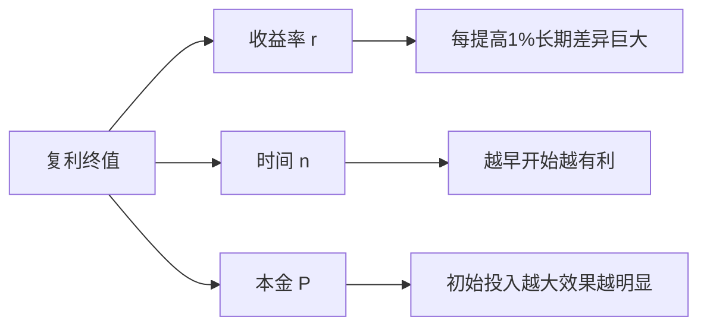
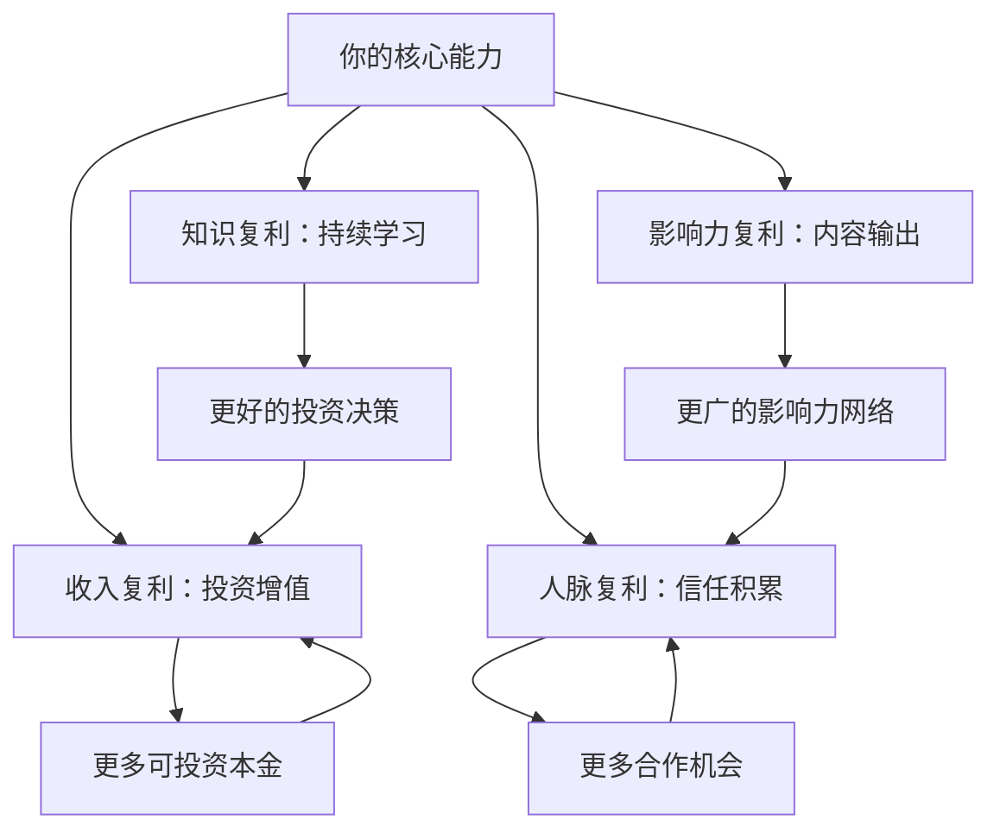

## 2.4 复利思维的应用技巧

> "复利是世界第八大奇迹。理解它的人赚取它，不理解的人支付它。" —— 常被归于爱因斯坦

复利不仅仅是银行存款的利息计算方式，更是一种底层思维模型。掌握复利思维，意味着你能让时间成为最强大的盟友——每一分努力都在为下一分努力加码，每一笔收益都在为下一笔收益铺路。

### 2.4.1 复利的数学本质

#### 复利公式详解

复利的核心公式为：

$$A = P \times (1 + r)^n$$

其中：
- **A** = 最终金额
- **P** = 本金（初始投入）
- **r** = 每期利率（小数形式）
- **n** = 期数

与之对比的是单利公式：

$$A = P \times (1 + r \times n)$$

两者的差距随时间呈指数级拉大：

| 年数 | 单利（年化10%，本金1万） | 复利（年化10%，本金1万） | 差额 |
|------|------------------------|------------------------|------|
| 1年 | 11,000 | 11,000 | 0 |
| 5年 | 15,000 | 16,105 | 1,105 |
| 10年 | 20,000 | 25,937 | 5,937 |
| 20年 | 30,000 | 67,275 | 37,275 |
| 30年 | 40,000 | 174,494 | 134,494 |

第1年差距为零，第30年差距是本金的13倍。这就是复利的力量——它在前期沉默，后期爆发。

#### 72法则：快速估算翻倍时间

用72除以年化收益率，得到资产翻倍所需的大致年数：

- 年化6% → 72 ÷ 6 = 12年翻倍
- 年化10% → 72 ÷ 10 = 7.2年翻倍
- 年化15% → 72 ÷ 15 = 4.8年翻倍
- 年化24% → 72 ÷ 24 = 3年翻倍

这个法则在估算长期规划时极为实用。当你看到一个"年化8%的机会"，立刻就能算出：大约9年翻倍，18年翻4倍，27年翻8倍。

#### 复利的三个核心变量

影响复利效果的只有三个变量，每个变量的微小变化都会在长期产生巨大影响：



**变量一：收益率（r）**

收益率从5%提升到10%，看似只提高了5个百分点，但在30年的维度上：
- 5%复利30年：1万变成43,219
- 10%复利30年：1万变成174,494

收益率翻倍，终值翻了4倍。这就是为什么投资能力的提升如此重要。

**变量二：时间（n）**

假设年化10%：
- 投资20年：1万变成67,275
- 投资30年：1万变成174,494
- 投资40年：1万变成452,593

多等10年，从30年到40年，资产增加了278,098——几乎是在前30年基础上又翻了1.6倍。这就是"时间的朋友"的真实含义。

**变量三：本金（P）**

本金翻倍，终值等比翻倍，这是线性关系。但结合持续追加投入，效果会更惊人。每月定投3000元，年化10%，30年后约为678万。如果每月定投5000元，30年后约为1,130万。每月多投2000元，最终多出452万。

### 2.4.2 复利思维的四大应用领域

#### 领域一：金融投资中的复利

这是复利最直接的应用场景。核心策略如下：

**策略一：尽早开始，拉长时间**

假设目标是60岁拥有500万，年化收益8%：
- 25岁开始：每月只需投入约2,600元
- 35岁开始：每月需要投入约6,700元
- 45岁开始：每月需要投入约19,500元

晚开始10年，每月投入要增加2.5倍；晚20年，要增加7.5倍。

**策略二：持续定投，利用平均成本法**

定投（Dollar Cost Averaging）的核心是：市场跌时买入更多份额，市场涨时买入更少份额，长期自动拉低平均成本。

| 月份 | 基金净值 | 定投1000元买入份额 | 累计份额 |
|------|---------|-------------------|---------|
| 1月 | 10元 | 100份 | 100份 |
| 2月 | 8元 | 125份 | 225份 |
| 3月 | 5元 | 200份 | 425份 |
| 4月 | 8元 | 125份 | 550份 |
| 5月 | 10元 | 100份 | 650份 |

投入5000元，持有650份，平均成本 = 5000 ÷ 650 = 7.69元/份。而市场均价 = (10+8+5+8+10) ÷ 5 = 8.2元/份。定投让你的成本低于市场均价。

**策略三：红利再投资**

选择分红再投资（DRIP, Dividend Reinvestment Plan），让每年的分红自动买入更多份额，而不是取出来消费。以沪深300为例，包含股息再投资的全收益指数，长期表现远超价格指数。

**策略四：避免复利的反面——债务复利**

信用卡分期年化利率约15-18%，网贷年化可达24-36%。如果你欠款10万，年化18%，不还款的情况下：
- 1年后：118,000
- 3年后：164,303
- 5年后：230,672
- 10年后：532,945

债务复利5年翻倍，10年翻5倍。这就是为什么"先还高息债"是财务规划的第一步。

#### 领域二：知识积累中的复利

知识的复利效应体现在三个层面：

**层面一：知识的指数增长**

学习金融学基础 → 理解投资组合理论 → 能看懂财报 → 能评估企业价值 → 能做资产配置。每一步都建立在前一步的基础上，这就是知识的复利。一个零基础的人学投资，前3个月可能什么都看不懂，但一旦基础知识体系搭建完成，后面的学习速度会呈指数级增长。

**层面二：迁移能力的叠加**

学了统计学，看数据报表的能力提升了；学了心理学，理解市场情绪的能力提升了；学了编程，自动化分析的能力提升了。这些能力相互叠加，产生远超单项能力之和的效果。

**层面三：输出倒逼输入**

写文章、做分享、教别人——这些输出行为本身就是复利行为。你教一个概念，需要把它理解得更透彻；你写一篇文章，会吸引志同道合的人；你建立专业形象，会获得更多机会。

知识复利的具体操作方法：

1. **建立知识管理系统**：用Obsidian/Notion等工具，让笔记之间相互链接，形成知识网络而非信息孤岛
2. **每日学习30分钟**：每天30分钟，一年182小时。5年910小时，足以成为任何领域的专家
3. **费曼学习法**：学完一个概念后，尝试用最简单的语言解释给别人听。解释不清楚的地方就是理解不到位的地方
4. **跨领域连接**：主动寻找不同领域知识之间的关联。查理·芒格的"多元思维模型"本质上就是知识复利的极致应用

#### 领域三：人际关系中的复利

人脉的复利效应常常被低估：

**信任的累积**

第一次合作，对方对你的信任度是50分；合作愉快后第二次是70分；第三次是85分；第五次以后接近满分。信任一旦建立，后续的合作成本极低，机会自然涌现。

**弱关系的指数扩展**

你的直接联系人是1度关系（假设100人），通过他们可以接触到2度关系（假设每人100人，去重后约5000人），3度关系（约25万人）。每维护好一个1度关系，就打开了通往他身后整个网络的门。

**口碑的裂变传播**

你帮了A解决了问题，A推荐了B来找你，B满意后又推荐了C。这种口碑传播就是人际关系的复利——你的影响力以指数级扩散，而你只需要做好每一次交付。

具体操作方法：

1. **每周深度维护3-5个关系**：不是群发祝福，而是有实质内容的交流——分享对方可能感兴趣的信息、介绍对对方有帮助的人
2. **先付出后收获**：主动帮助别人解决问题，不计较即时回报。复利的本质是先投入再收获
3. **建立个人品牌**：在某个领域持续输出价值，让更多人通过你的内容认识你。这是被动扩展人脉的复利方式
4. **维护关系数据库**：记录重要联系人的关键信息、上次交流内容、他们的需求和兴趣点

#### 领域四：习惯与技能的复利

微小习惯的复利效应是最容易被忽视、也最强大的：

**每天进步1%的魔力**

$$1.01^{365} = 37.78$$

每天进步1%，一年后你是年初的37.78倍。

$$0.99^{365} = 0.03$$

每天退步1%，一年后你只剩年初的3%。

这个计算虽然简化了现实，但核心逻辑成立：微小的正向偏差，经过时间的放大，会产生惊人的结果。

**技能复利的实际案例**

以写作能力为例：
- 第1个月：写500字都很吃力
- 第6个月：能流畅写出2000字的分析文章
- 第1年：文章开始有人阅读和转发
- 第2年：接到约稿和合作邀请
- 第3年：写作成为稳定的收入来源之一
- 第5年：出书、开课、建立个人IP

写作能力本身在提升（能力复利），写作带来的读者和影响力在积累（影响力复利），写作衍生出的商业机会在增加（收入复利）。三重复利同时运转。

具体操作方法：

1. **选择有复利属性的技能**：编程、写作、演讲、投资、外语——这些技能的学习曲线前期陡峭，但一旦突破拐点，回报会加速增长
2. **每日固定时间练习**：30分钟写作、20分钟编程、15分钟英语——小投入、长期坚持
3. **设定里程碑**：把大目标拆成小里程碑，每达到一个就获得正反馈，维持动力
4. **记录进步轨迹**：定期回顾自己3个月前、6个月前、1年前的水平，看到进步才能坚持

### 2.4.3 复利思维的实操框架

#### 框架一：复利投资实操方案

**Step 1：建立紧急备用金**

在启动任何复利投资之前，先存够3-6个月的生活费作为紧急备用金，放在货币基金中（年化2-3%，随时可取）。这确保你在遇到突发情况时不会被迫中断投资。

**Step 2：还清高息债务**

信用卡、消费贷、网贷等年化利率超过10%的债务，优先还清。这些债务的复利在吞噬你的财富，比任何投资的回报都高。

**Step 3：配置核心投资**

根据年龄和风险承受能力，建立核心投资组合：

| 年龄段 | 建议配置 | 具体标的示例 |
|--------|---------|------------|
| 25-35岁 | 股票型70%，债券型30% | 沪深300指数基金、中证500指数基金、纯债基金 |
| 35-45岁 | 股票型50%，债券型50% | 宽基指数基金、二级债基、可转债基金 |
| 45-55岁 | 股票型30%，债券型70% | 红利指数基金、中短期纯债基金、货币基金 |
| 55岁以上 | 股票型10%，债券型90% | 高股息ETF、国债、大额存单 |

**Step 4：设定自动定投**

在券商或基金平台设置自动定投，发工资后第二天自动扣款。金额 = 收入 × 储蓄率（建议30%以上）。自动化消除了人性弱点——不择时、不犹豫、不中断。

**Step 5：年度再平衡**

每年年底检查一次资产配置比例，如果偏离目标超过5%，通过买卖进行再平衡。例如目标70%股/30%债，实际变成80%股/20%债，就卖掉部分股票买入债券。再平衡本质上是"高卖低买"的纪律化执行。

**Step 6：收益再投资**

所有分红、利息、到期收益，一律再投资，不取出消费。这是复利链条中最关键的一环——中断收益再投资，复利就退化为单利。

#### 框架二：知识复利实操方案

**每日知识复利流程：**

```text
06:30-07:00  阅读30分钟（输入）
07:00-07:10  写阅读笔记/摘要（加工）
12:30-12:40  回顾早上的笔记，补充思考（强化）
21:30-21:45  写当日总结或发布一篇短文（输出）
```

**每周知识复利流程：**

```text
周一  回顾上周笔记，整理到知识库
周三  和一位同行交流，交换观点
周五  写一篇周总结或主题文章
周日  阅读一本新书的前3章，决定是否继续
```

**每年知识复利检查清单：**

- [ ] 今年读了多少本书？（目标：30-50本）
- [ ] 写了多少篇文章/笔记？（目标：100+篇）
- [ ] 学会了哪些新技能？
- [ ] 建立了哪些新的人脉关系？
- [ ] 知识体系有哪些新增模块？

#### 框架三：习惯复利实操方案

**选择一个有复利属性的核心习惯，坚持90天：**

| 周数 | 重点 | 预期状态 |
|------|------|---------|
| 第1-2周 | 降低启动门槛，只做最低限度 | 每天完成即可，不追求质量 |
| 第3-4周 | 逐步增加时长和难度 | 开始感受到规律性 |
| 第5-8周 | 形成自动化，不需意志力 | 做这件事变成"默认行为" |
| 第9-12周 | 开始看到初步成果 | 正反馈出现，动力内化 |

关键要点：不要同时启动两个以上的习惯。复利需要连续性，多线程操作会分散注意力，导致每个都坚持不下来。

### 2.4.4 复利的常见误区与陷阱

#### 误区一：追求高收益率而忽视风险

很多人看到"年化20%"就两眼放光，却忽略了两个事实：
- 巴菲特的长期年化收益约为20%，已经是人类投资史上的顶级水平
- 高收益必然伴随高风险，一次-50%需要+100%才能回本

| 亏损幅度 | 回本所需涨幅 |
|---------|------------|
| -10% | +11.1% |
| -20% | +25% |
| -30% | +42.9% |
| -50% | +100% |
| -70% | +233.3% |
| -90% | +900% |

**纠正方法**：先保住本金，再谈收益。年化8-12%的稳健收益，持续30年，远比追求20%但中途爆仓要好。

#### 误区二：频繁操作打断复利

频繁买卖不仅增加交易成本（手续费、印花税、滑点），更打断了复利链条。假设年化收益10%，但每年交易12次，每次成本0.5%，全年交易成本6%，实际收益只剩4%。

更深层的问题是：频繁操作会导致"卖飞"——你卖掉的股票继续涨，你买入的股票反而跌。研究显示，普通投资者的交易频率与收益呈负相关。

**纠正方法**：定投+持有，减少操作频率。一年最多检查和调整2次。

#### 误区三：急于看到效果而过早放弃

复利曲线是一条"先平后陡"的曲线。前5年几乎看不到明显效果，很多人因此放弃。但真正的爆发在第10年以后。

以每月定投3000元、年化10%为例：
- 第5年末：约23万（投入18万，收益5万）
- 第10年末：约61万（投入36万，收益25万）
- 第20年末：约228万（投入72万，收益156万）
- 第30年末：约678万（投入108万，收益570万）

第20-30年的收益（414万）是前20年收益（156万）的2.65倍。坚持不住前10年的人，永远看不到后面的爆发。

**纠正方法**：设定阶段性里程碑，每达到一个小目标就奖励自己。同时可视化你的复利曲线——用Excel或在线计算器画出你的资产增长曲线，贴在显眼的地方。

#### 误区四：只关注金钱复利，忽视其他维度

金钱只是复利的一个应用领域。如果你只关注投资收益，却忽视了知识、人脉、健康、习惯的复利，你的整体人生复利就被严重削弱了。

一个身体健康、知识渊博、人脉广泛的人，即使初始资金不多，长期来看也比一个只有钱但其他维度都在贬值的人过得好。

**纠正方法**：建立"人生复利仪表盘"，同时追踪至少4个维度的进展。

#### 误区五：忽视通胀的侵蚀

复利帮你增值，通胀帮你贬值。如果投资年化收益6%，但通胀率3%，你的实际购买力年化只增长约3%。

中国过去20年的平均通胀率约为2-3%，但教育、医疗、住房等关键领域的涨幅远超这个数字。

**纠正方法**：投资目标应该是"实际收益率"（名义收益率 - 通胀率），而不是名义收益率。尽量选择长期能跑赢通胀的资产类别——股票指数基金是被历史验证最可靠的抗通胀工具之一。

### 2.4.5 进阶：复利的高阶策略

#### 策略一：多重复利叠加

最强大的复利是多个维度同时运转：



当你用知识提升投资能力，用投资收益增加学习资源，用人脉获得更多机会，用影响力吸引更好的人脉——四重复利形成正向循环，加速效果远超单一维度。

#### 策略二：打造"睡后收入"系统

睡后收入是指不需要你持续投入时间就能产生收益的系统。它的复利属性在于：一次建设，长期收益，收益再投入建设更多系统。

常见的睡后收入系统：

1. **投资组合**：定投指数基金，股息自动再投资
2. **数字产品**：电子书、在线课程、付费专栏——一次创作，无限销售
3. **自动化业务**：搭建SaaS工具、自动售货机、有稳定现金流的小生意
4. **知识产权**：专利授权、版权收入、商标授权

建设路径：先用主动收入（工资/自由职业）积累第一桶金和核心技能 → 用技能和资金搭建睡后收入系统 → 让系统产生的收入覆盖生活开支 → 实现财务自由。

#### 策略三：逆向复利——识别和避免"负复利"

负复利不仅指投资亏损，还包括：
- **健康负复利**：长期熬夜、不运动、饮食不规律，身体逐年恶化
- **关系负复利**：不维护重要关系，信任度逐年下降
- **技能负复利**：停止学习，技能逐渐过时
- **信誉负复利**：不守承诺，口碑逐年变差

识别负复利的方法：问自己"这件事如果持续做5年，结果是越来越好还是越来越差？"如果是越来越差，就立刻停止或转向。

#### 策略四：寻找非线性拐点

复利曲线有一个关键特征：存在拐点。拐点之前增长缓慢，拐点之后加速增长。

在不同领域的拐点：
- **投资**：本金积累到一定程度后，投资收益开始超过工资收入
- **写作**：粉丝积累到临界点后，内容传播呈裂变式增长
- **技能**：练习小时数突破10000小时后，从"会做"变为"做得极好"
- **人脉**：行业知名度达到阈值后，机会开始主动找你

识别你当前处于哪个阶段，如果在拐点之前，最重要的策略就是——坚持。拐点一定会来，但只奖励坚持到它出现的人。

### 2.4.6 复利思维的自检清单

每月用这份清单检查自己是否在正确的复利轨道上：

- [ ] 本月是否有持续投入（时间/金钱/精力）到有复利属性的事情？
- [ ] 本月是否有任何"打断复利"的行为（冲动卖出、中断学习、忽视人脉）？
- [ ] 本月的知识是否有增量？能否说出一个新学到的重要概念？
- [ ] 本月的投资是否按计划执行？有没有受情绪影响的操作？
- [ ] 本月是否维护了至少3个重要关系？
- [ ] 本月的健康习惯是否坚持？运动、饮食、睡眠是否达标？
- [ ] 本月是否有输出（写作、分享、教学）？
- [ ] 如果持续当前状态5年，我会在哪里？这个答案让我满意吗？

最后一个问题最为关键。如果答案是"不满意"，就找到那个需要调整的变量——收益率、时间投入、本金积累、还是方向本身——然后做出改变。

复利不会辜负每一个理解它并坚持执行的人。关键不在于起点多高，而在于方向正确、持续投入、足够耐心。时间会完成剩下的工作。
