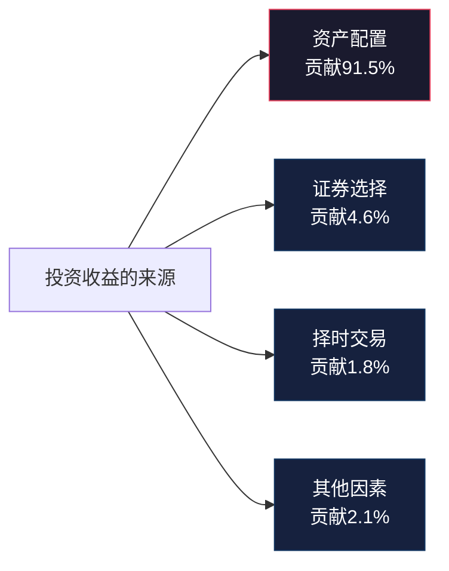
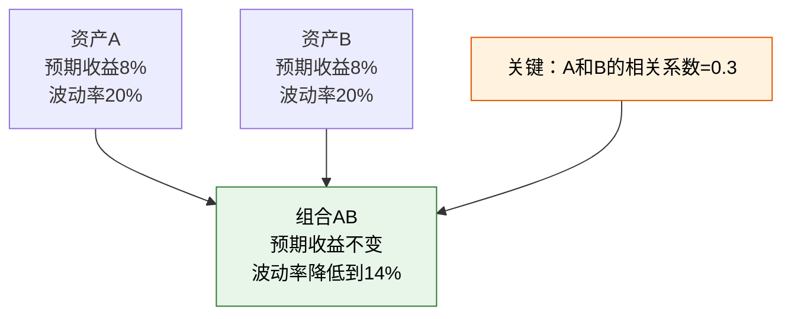
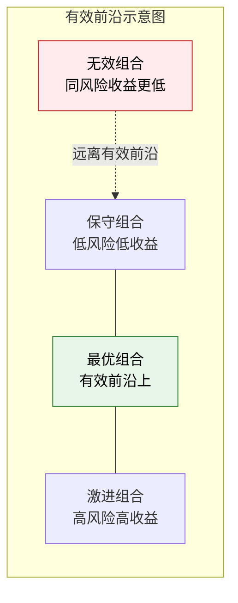
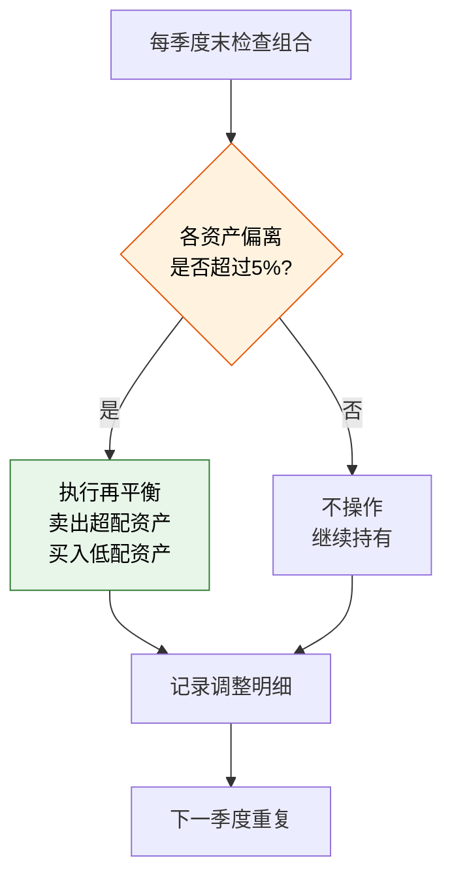
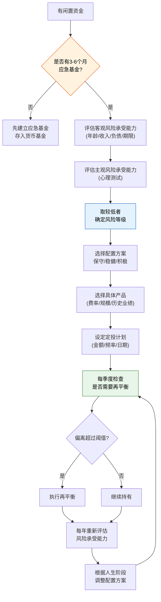
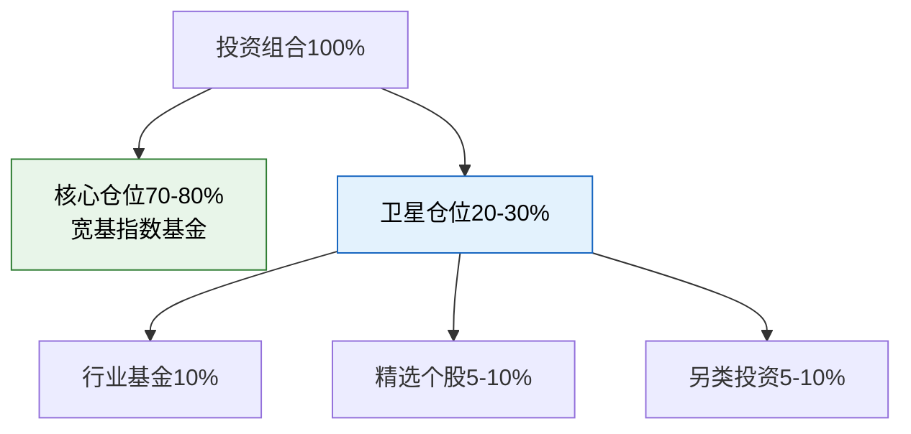

## 2.5 风险评估与资产配置技巧

> **核心观点：** 资产配置决定了投资组合长期收益的91.5%——这是Brinson、Hood和Beebower在1986年发表于《Financial Analysts Journal》的经典研究结论。选股和择时加在一起，对收益的贡献不到10%。换句话说，你花在"买什么股"上的精力，应该远少于花在"怎么分配"上的精力。

### 为什么资产配置比选股更重要

大多数人进入投资市场后，把90%的精力放在"买什么"上——哪只股票会涨、哪个基金排名靠前、哪个板块有政策利好。但学术研究反复证明，决定长期投资成败的最大因素不是选股，而是资产配置。



这组数据来自Brinson等人对美国91家大型养老金计划10年期业绩的归因分析。后续多项研究（如Ibbotson和Kaplan在2000年的研究）进一步证实了这个结论。即使把样本扩展到全球不同市场、不同时间段，资产配置对收益差异的解释力始终保持在70%-90%之间。

这意味着什么？意味着你不需要成为选股高手，不需要每天盯盘，不需要预测市场走势。你只需要做好两件事：**选对资产配置比例**，以及**坚持执行**。

---

### 2.5.1 风险承受能力评估：量化你的"风险胃纳"

风险承受能力不是靠"感觉"判断的，而是需要从**客观条件**和**主观心理**两个维度系统评估。

#### 客观风险承受能力：你能亏多少不伤筋动骨

客观风险承受能力取决于你的财务状况。核心公式：

```text
可承受最大亏损 = (总资产 - 应急基金 - 刚性负债) × 心理亏损上限比例
```

举例：你有50万存款，应急基金需要6万（月开支1万×6个月），房贷余额30万，心理上能接受30%的亏损。那么你的可投资资产 = 50 - 6 = 44万，可承受最大亏损 = 44 × 30% = 13.2万。

**客观风险承受能力评估表：**

| 评估维度 | 低承受力（0分） | 中等承受力（1分） | 高承受力（2分） |
|----------|----------------|-------------------|----------------|
| 年龄 | 55岁以上 | 35-55岁 | 35岁以下 |
| 收入来源 | 自由职业/不稳定 | 企业雇员/较稳定 | 公务员/体制内/多元收入 |
| 收入增长性 | 收入下降或停滞 | 缓慢增长（<5%/年） | 快速增长（>10%/年） |
| 负债率 | 负债/收入>50% | 负债/收入20%-50% | 负债/收入<20% |
| 家庭负担 | 赡养多人+有子女 | 有部分负担 | 无负担或负担轻 |
| 投资资产占比 | 投资资产>总资产80% | 投资资产占40%-80% | 投资资产<总资产40% |
| 投资期限 | <3年 | 3-10年 | >10年 |

**评分标准：** 0-5分为低承受力，6-9分为中等，10-14分为高承受力。

#### 主观风险承受能力：你能承受多大的心理压力

客观条件允许你承担高风险，不代表你的心理能承受。一个年收入百万但看到账户亏损5%就失眠的人，客观风险承受力很高，但主观风险承受力很低。

**关键心理测试问题：**

1. **场景一：** 你投资了10万元，一个月后跌到7万（亏损30%），你会怎么做？
   - A. 立刻全部卖出，保住剩下的7万 → 保守型
   - B. 卖出一部分，降低仓位 → 中等偏保守
   - C. 不动，等待反弹 → 稳健型
   - D. 再加仓3万，摊低成本 → 积极型

2. **场景二：** 你的朋友投资某只股票赚了50%，你会怎么做？
   - A. 不为所动，坚持自己的计划 → 成熟投资者
   - B. 去了解一下，但不急着行动 → 理性
   - C. 马上跟着买 → 易受情绪影响

3. **场景三：** 你需要一笔钱在3年后使用，你会选择哪种投资？
   - A. 银行定期存款 → 极度保守
   - B. 债券基金 → 保守
   - C. 股债混合基金 → 稳健
   - D. 股票基金 → 积极

**主客观综合判断：** 取客观评分和主观测试结果中**较低的那个**作为最终风险承受能力等级。因为投资中，心理防线一旦崩溃，所有配置计划都会被推翻。

---

### 2.5.2 资产配置的核心理论

在动手配置之前，你需要理解三个核心理论，它们是所有配置策略的底层逻辑。

#### 现代投资组合理论（MPT）

Harry Markowitz在1952年提出的现代投资组合理论，是资产配置的理论基石，他也因此获得了1990年诺贝尔经济学奖。

MPT的核心思想：**不要看单个资产的风险和收益，要看整个组合的风险和收益。** 通过将相关性低的资产组合在一起，可以在不降低预期收益的情况下降低风险——这就是"免费的午餐"。



**相关性是关键。** 两个资产的相关系数范围从-1到+1：
- 相关系数=+1：完全同涨同跌，组合无法降低风险
- 相关系数=0：没有关联，组合可以显著降低风险
- 相关系数=-1：完全反向运动，组合可以最大程度降低风险

**常见资产的相关性矩阵（基于近20年历史数据）：**

|  | 沪深300 | 中证500 | 国债 | 黄金 | 美股 | 房产 |
|--|---------|---------|------|------|------|------|
| 沪深300 | 1.00 | 0.85 | -0.10 | 0.05 | 0.35 | 0.20 |
| 中证500 | 0.85 | 1.00 | -0.05 | 0.08 | 0.30 | 0.15 |
| 国债 | -0.10 | -0.05 | 1.00 | 0.25 | -0.15 | 0.10 |
| 黄金 | 0.05 | 0.08 | 0.25 | 1.00 | 0.10 | 0.05 |
| 美股 | 0.35 | 0.30 | -0.15 | 0.10 | 1.00 | 0.25 |

从表中可以看出：A股和国债呈弱负相关（-0.10），这意味着当股票下跌时，国债往往上涨或保持稳定，两者组合可以有效对冲风险。这就是为什么经典的"股债搭配"策略经久不衰。

#### 有效前沿（Efficient Frontier）

有效前沿是MPT的图形化表达。在"风险-收益"坐标系中，所有可能的资产组合构成一个区域，而有效前沿就是这个区域左上方的边界线——它代表了**在给定风险水平下收益最高**，或**在给定收益水平下风险最低**的组合集合。



**实操意义：** 你不需要真的画出有效前沿，但需要理解它的含义——通过合理配置不同相关性的资产，你可以找到一个"甜蜜点"，在可承受的风险水平下获得尽可能高的收益。盲目追求高收益（全部买股票）或过度保守（全部存银行），都不是最优选择。

#### 生命周期投资理论

生命周期投资理论认为，你的资产配置应该随年龄变化而动态调整。核心逻辑很简单：**年轻时亏得起，年老时亏不起。**

经典公式（简化版）：

```text
股票配置比例 = 100 - 年龄
```

例如，30岁的人配置70%股票、30%债券；50岁的人配置50%股票、50%债券。

但这个公式过于简单，实际上应该考虑更多因素。改良版公式：

```text
股票配置比例 = (100 - 年龄) × 收入稳定性系数 × 风险偏好系数
```

- 收入稳定性系数：稳定收入=1.2，一般收入=1.0，不稳定收入=0.7
- 风险偏好系数：积极型=1.2，稳健型=1.0，保守型=0.7

举例：一个35岁、收入稳定、风险偏稳健的投资者，股票配置比例 = (100-35) × 1.2 × 1.0 = 78%。

---

### 2.5.3 三种资产配置方案详解

基于风险承受能力，下面给出三种完整的配置方案。每种方案都包含具体的资产类别、比例、产品选择标准和预期表现。

#### 方案一：保守型配置（年化目标4%-6%，最大回撤<10%）

**适合人群：** 55岁以上、临近退休、收入不稳定、心理上无法承受较大亏损的投资者。

| 资产类别 | 配置比例 | 推荐产品类型 | 选择标准 |
|----------|---------|-------------|----------|
| 货币基金/银行理财 | 20% | 余额宝、零钱通、银行T+0理财 | 7日年化收益率，流动性（T+0赎回额度） |
| 纯债基金 | 40% | 短债基金、中长期纯债基金 | 成立3年以上，规模>5亿，基金经理任职>2年，最大回撤<3% |
| 国债/国债ETF | 20% | 10年期国债ETF、国债逆回购 | 到期收益率，久期匹配 |
| 黄金ETF | 10% | 华安黄金ETF(518880)等 | 规模大、流动性好、跟踪误差小 |
| 宽基指数基金 | 10% | 沪深300ETF、上证50ETF | 跟踪误差<0.1%，费率<0.5%/年 |

**保守型配置的关键原则：**
- 债券类资产（纯债+国债）占比60%，提供稳定收益和本金保护
- 货币基金20%作为流动性缓冲，随时可以应对突发资金需求
- 权益类资产（指数基金）仅占10%，少量参与股票市场的长期增长
- 黄金10%作为极端风险的对冲工具

**预期表现（基于历史回测）：**
- 年化收益：4%-6%
- 最大回撤：5%-10%
- 波动率：3%-6%
- 适合持有期：1年以上

#### 方案二：稳健型配置（年化目标7%-10%，最大回撤<25%）

**适合人群：** 30-55岁、收入稳定、有一定投资经验、能承受中等亏损的投资者。

| 资产类别 | 配置比例 | 推荐产品类型 | 选择标准 |
|----------|---------|-------------|----------|
| 货币基金 | 10% | 余额宝、银行现金管理类理财 | 流动性、收益率 |
| 债券基金（含转债） | 25% | 二级债基、可转债基金 | 成立3年以上，规模>10亿，长期业绩排名前1/3 |
| 沪深300指数基金 | 25% | 沪深300ETF、沪深300增强基金 | 跟踪误差小，增强型看超额收益稳定性 |
| 中证500指数基金 | 15% | 中证500ETF | 与沪深300形成大中小盘互补 |
| 海外指数基金 | 10% | 标普500ETF(QDII)、纳斯达克100ETF | 规模、流动性、汇率对冲选项 |
| 黄金ETF | 10% | 华安黄金ETF等 | 与股票低相关性 |
| 行业/主题基金 | 5% | 消费、医药、科技等长期赛道 | 行业前景、估值水平 |

**稳健型配置的关键逻辑：**
- 权益类资产（指数基金+海外+行业）合计55%，是收益的主要来源
- 债券类资产35%提供缓冲，在股市下跌时减缓组合波动
- 黄金10%作为"保险"，在极端市场（如金融危机、地缘冲突）中提供保护
- 海外配置10%分散单一市场风险，A股和美股相关性仅0.35

**预期表现（基于历史回测）：**
- 年化收益：7%-10%
- 最大回撤：15%-25%
- 波动率：10%-15%
- 适合持有期：3年以上

#### 方案三：积极型配置（年化目标10%-15%，最大回撤<40%）

**适合人群：** 35岁以下、收入增长快、无负债或低负债、投资经验丰富、能承受大幅波动的投资者。

| 资产类别 | 配置比例 | 推荐产品类型 | 选择标准 |
|----------|---------|-------------|----------|
| 货币基金 | 5% | 仅作为交易备用金 | 流动性优先 |
| 债券基金 | 15% | 二级债基、可转债基金 | 弹性收益，非纯防守 |
| 沪深300指数基金 | 20% | ETF或增强型 | 核心仓位 |
| 中证500/中证1000 | 20% | 中小盘ETF | 弹性更大，成长性更强 |
| 海外指数基金 | 15% | 标普500+纳斯达克100+新兴市场 | 全球分散 |
| 个股 | 15% | 精选3-8只长期看好的个股 | 深度研究，基本面扎实 |
| 黄金/商品 | 5% | 黄金ETF、商品基金 | 极端对冲 |
| 另类投资 | 5% | REITs、量化对冲基金 | 与传统资产低相关 |

**积极型配置的关键逻辑：**
- 权益类资产（指数+海外+个股）合计70%，充分利用股票市场的长期增长潜力
- 中小盘20%提供更高的弹性——历史上中证500的长期年化收益高于沪深300约2-3个百分点
- 个股15%需要深度研究能力，如果没有选股能力，这部分应全部转为指数基金
- 另类投资5%进一步分散风险

**预期表现（基于历史回测）：**
- 年化收益：10%-15%
- 最大回撤：25%-40%
- 波动率：15%-25%
- 适合持有期：5年以上

**重要警告：** 积极型配置的高收益是用高波动换来的。如果你在2008年或2015年的暴跌中会恐慌卖出，那么积极型配置不适合你——再高的预期收益，如果你拿不住，都是纸上谈兵。

---

### 2.5.4 资产再平衡：纪律性操作的收益

再平衡（Rebalancing）是资产配置中最容易被忽视、但收益最确定的环节。

#### 什么是再平衡

再平衡就是定期把投资组合中各类资产的比例调回到目标配置。比如你的目标是60%股票+40%债券，一年后股票涨到了70%、债券跌到了30%，你就需要卖出一部分股票、买入一部分债券，恢复60/40的比例。

#### 为什么再平衡能赚钱

再平衡本质上是一种**纪律性的"高卖低买"**机制。当股票涨多了，你卖出部分股票（高卖）；当股票跌多了，你买入更多股票（低买）。这不是择时，而是基于配置纪律的机械操作。

学术研究显示，定期再平衡的组合，长期年化收益比不再平衡的组合高出0.5%-1.5%，同时波动率更低。这1%的额外收益在30年的复利作用下，最终资产差距可达20%-30%。

#### 三种再平衡方法

**方法一：日历再平衡（Calendar Rebalancing）**

固定时间间隔（如每季度、每半年或每年）检查并调整一次。

- **优点：** 简单易执行，不需要频繁监控
- **缺点：** 可能在不需要调整时也调整了，产生不必要的交易成本
- **推荐频率：** 大多数投资者每半年一次即可，过于频繁会增加交易成本

**方法二：阈值再平衡（Threshold Rebalancing）**

当某类资产偏离目标比例超过设定阈值（如5%或10%）时触发再平衡。

- **优点：** 只在偏离足够大时才调整，减少不必要的交易
- **缺点：** 需要更频繁地监控组合
- **推荐阈值：** 绝对偏离5%或相对偏离20%（以较低者为准）

**方法三：日历+阈值混合法（最佳实践）**

每季度检查一次，只有当偏离超过阈值时才执行再平衡。这是大多数专业投资者采用的方法。



#### 再平衡的实操步骤

**第一步：记录目标配置**

建立一个配置记录表，明确每类资产的目标比例和可容忍的偏离范围：

| 资产类别 | 目标比例 | 可容忍范围 | 当前比例 | 偏离 |
|----------|---------|-----------|---------|------|
| 货币基金 | 10% | 5%-15% | 8% | -2% |
| 债券基金 | 25% | 20%-30% | 23% | -2% |
| 沪深300 | 25% | 20%-30% | 30% | +5% ⚠️ |
| 中证500 | 15% | 10%-20% | 17% | +2% |
| 海外指数 | 10% | 5%-15% | 9% | -1% |
| 黄金ETF | 10% | 5%-15% | 8% | -2% |
| 行业基金 | 5% | 0%-10% | 5% | 0% |

从表中可以看出，沪深300偏离了+5%，触发再平衡阈值。

**第二步：计算调整金额**

假设组合总市值10万元：
- 沪深300当前30%，需要降到25%，即卖出30%-25%=5%=5000元
- 将5000元按比例分配到低配的资产中

**第三步：执行调整**

优先通过以下方式再平衡，减少交易成本：
1. **优先调整新增资金流向：** 如果你每月有新增投资，优先投向低配的资产
2. **利用分红再投资：** 将分红定向投向低配资产
3. **最后才是卖出操作：** 只有当上述两种方式都无法满足时，才卖出超配资产

#### 再平衡的税务考量

在中国A股市场，基金买卖暂不征收资本利得税（目前只有分红税），所以再平衡的税务成本相对较低。但如果你投资的是美股或其他海外市场，卖出盈利部分可能需要缴纳资本利得税，这时需要在再平衡收益和税务成本之间权衡。

---

### 2.5.5 投资决策完整流程图

将上述所有内容整合为一个可执行的投资决策流程：



---

### 2.5.6 产品选择的实操标准

确定了配置比例后，下一步是选择具体产品。以基金为例，以下是筛选标准：

#### 指数基金的筛选标准

| 筛选维度 | 优选标准 | 淘汰标准 |
|----------|---------|---------|
| 跟踪误差 | <0.1%/年 | >0.3%/年 |
| 管理费率 | <0.5%/年 | >1%/年 |
| 基金规模 | >10亿元 | <2亿元 |
| 成立时间 | >3年 | <1年 |
| 日均成交额（ETF） | >1000万元 | <100万元 |
| 基金公司 | 头部公司（华夏、易方达、南方等） | 小型公司 |

#### 主动型基金的筛选标准

| 筛选维度 | 优选标准 | 淘汰标准 |
|----------|---------|---------|
| 基金经理任职年限 | >3年 | <1年 |
| 长期业绩 | 同类排名前1/3（3年/5年） | 排名后1/2 |
| 最大回撤 | <同类平均 | >同类平均1.5倍 |
| 基金规模 | 5-100亿元 | >200亿元（船大难掉头）或<1亿元 |
| 换手率 | 适中（100%-300%） | 极高（>500%，频繁交易） |
| 持仓集中度 | 前10大重仓占40%-60% | >80%（风险集中） |

#### 债券基金的筛选标准

| 筛选维度 | 优选标准 | 淘汰标准 |
|----------|---------|---------|
| 最大回撤 | <3%（纯债）/ <8%（二级债基） | >5%/15% |
| 基金规模 | >5亿元 | <2亿元 |
| 成立时间 | >3年 | <1年 |
| 杠杆率 | <140% | >180% |
| 信用债占比 | 适度（50%-70%） | >90%（信用风险集中） |

---

### 2.5.7 常见错误与纠正方法

**错误一：把资产配置当成"选一个方案然后忘了"**

很多人做了一次资产配置后就再也不管了。但资产配置是动态的——随着市场涨跌，你的实际比例会偏离目标；随着人生阶段变化，你的风险承受能力也会变。

**纠正方法：** 每季度检查一次，每年重新评估一次风险承受能力，根据变化调整配置。

**错误二：过度分散**

分散投资是好事，但过度分散反而有害。持有20只以上的基金，不仅管理困难，而且很多基金的持仓高度重叠（比如多只沪深300指数基金），实际上并没有真正分散风险。

**纠正方法：** 同一资产类别持有1-2只产品即可。判断产品是否真正分散，要看底层持仓的重叠度，而不是基金的数量。

**错误三：追逐热门资产**

2020年全民买基金、2021年全民炒白酒、2023年全民买AI——每次热门资产的追捧都以大量投资者高位站岗告终。资产配置的核心是"反人性"的：在大家都不看好时买入，在大家都看好时保持冷静。

**纠正方法：** 严格按配置比例执行，不因为某类资产最近涨得好就加仓。再平衡机制天然地帮你执行"高卖低买"。

**错误四：忽略费率对长期收益的侵蚀**

管理费1%和0.5%看起来差距很小，但30年复利下来，差距可达最终资产的10%-15%。以100万元投资30年、年化8%为例：
- 费率0.5%：最终约900万
- 费率1.0%：最终约760万
- 差距：140万，相当于费率的7倍

**纠正方法：** 同类产品中优先选择费率低的。指数基金的管理费通常在0.15%-0.5%，主动基金在1%-1.5%。

**错误五：在市场恐慌时偏离配置计划**

2020年2月、2022年4月、2024年初，市场大跌时大量投资者恐慌卖出，结果错过了随后的反弹。资产配置的最大敌人不是市场波动，而是你在波动面前的纪律崩溃。

**纠正方法：** 提前写好"投资纪律承诺书"，在市场平静时制定应对极端行情的规则（如"账户亏损30%不卖出，反而加仓定投金额的50%"），在恐慌时严格按照规则执行。

---

### 2.5.8 进阶策略：超越基础配置

当你已经熟练掌握基础配置并执行了2-3年后，可以考虑以下进阶策略。

#### 策略一：核心-卫星策略（Core-Satellite）

将投资组合分为"核心"和"卫星"两部分：
- **核心（70%-80%）：** 宽基指数基金，被动跟踪市场，低成本、低维护
- **卫星（20%-30%）：** 行业基金、个股、另类投资，追求超额收益



这个策略的好处是：核心仓位提供市场平均收益（beta），卫星仓位尝试获取超额收益（alpha）。即使卫星部分表现不佳，核心仓位也能保证你不会跑输市场太多。

#### 策略二：全天候策略（All Weather Strategy）

桥水基金Ray Dalio提出的全天候策略，核心思想是：不预测经济环境，而是构建一个在任何经济环境下都能稳定表现的组合。

经济环境分为四种：
1. 经济增长+通胀上升：商品、通胀保值债券、新兴市场股票
2. 经济增长+通胀下降：股票、公司债券
3. 经济衰退+通胀上升：通胀保值债券、黄金
4. 经济衰退+通胀下降：国债、现金

简化版全天候配置（适合个人投资者）：
- 30% 股票（沪深300+标普500）
- 40% 长期国债（10年期国债ETF）
- 15% 黄金
- 15% 大宗商品（如有色金属ETF、原油ETF）

#### 策略三：估值调整策略

在基础配置上，根据市场估值水平动态调整权益仓位。核心逻辑：**估值低时多配股票，估值高时少配股票。**

以沪深300市盈率（PE）为参考：

| 沪深300 PE（TTM） | 估值水平 | 权益仓位调整 |
|-------------------|---------|-------------|
| <10倍 | 极度低估 | 权益仓位+20% |
| 10-12倍 | 低估 | 权益仓位+10% |
| 12-14倍 | 正常 | 维持目标配置 |
| 14-16倍 | 偏高 | 权益仓位-10% |
| >16倍 | 高估 | 权益仓位-20% |

**注意：** 估值调整策略不等于择时。它有明确的规则和上限，最大调整幅度不超过20%，且基于客观数据（估值）而非主观判断（预测涨跌）。

---

### 2.5.9 实操清单：从今天开始行动

**第一步（本周完成）：**
- [ ] 完成客观风险承受能力评估（填写评估表）
- [ ] 完成主观风险承受能力测试（回答3个场景问题）
- [ ] 确定你的风险等级（保守/稳健/积极）

**第二步（本月完成）：**
- [ ] 确保已有3-6个月应急基金存入货币基金
- [ ] 选择适合你的配置方案
- [ ] 列出每类资产要买的具体产品（参考筛选标准）
- [ ] 开设必要的投资账户（证券账户、基金账户）

**第三步（持续执行）：**
- [ ] 设定每月定投计划（金额、日期、产品）
- [ ] 建立配置记录表，记录目标比例
- [ ] 每季度末检查一次组合，执行再平衡
- [ ] 每年重新评估风险承受能力
- [ ] 持续学习，优化策略

> **最后的忠告：** 资产配置不是一劳永逸的事情，但它是最不需要频繁操作的投资策略。你需要的不是更多的信息，而是更好的纪律。制定计划，执行计划，定期检查，按需调整——这四步循环，就是投资成功的全部秘密。

***
