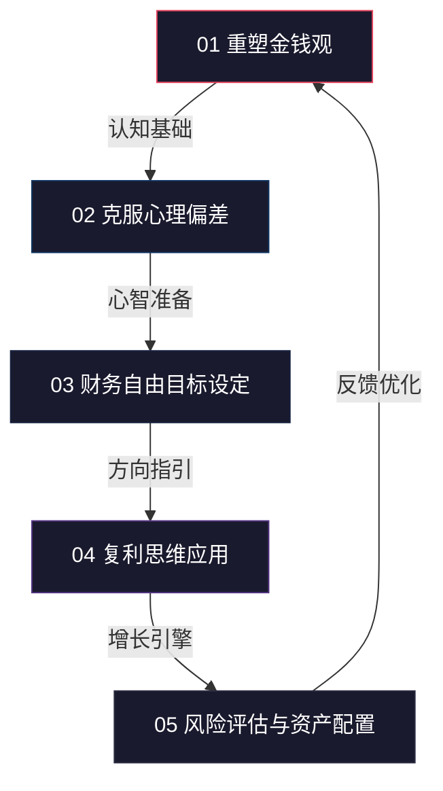
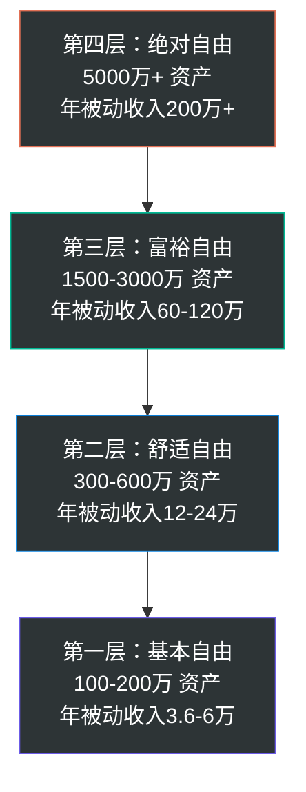
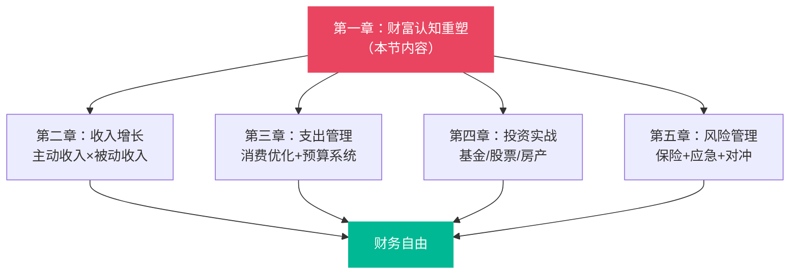

## 核心技巧·本节小结

本节围绕"财富的本质与金钱观重塑"这一主题，提供了五个可落地的核心技巧。它们不是独立的碎片，而是一条完整的行动链：**先重塑认知 → 再矫正偏差 → 然后设定目标 → 接着运用复利 → 最后管理风险**。下面逐一回顾每个技巧的核心要点、关键方法和常见陷阱，并给出将五个技巧串联为个人财富系统的实操路径。

---

### 一、五个核心技巧的全景回顾

#### 1.1 技巧一：重塑金钱观

**核心理念**：金钱观是所有财务行为的操作系统。系统不升级，行为不会变。

| 维度 | 旧操作系统 | 新操作系统 |
|------|-----------|-----------|
| 金钱本质 | 钱是目的，越多越好 | 钱是价值交换的媒介，是工具 |
| 消费逻辑 | 想要就买，及时行乐 | 每笔消费都是投资决策，看回报率 |
| 储蓄认知 | 储蓄 = 不花钱 = 亏待自己 | 储蓄 = 为未来投资 = 购买自由 |
| 收入模型 | 用时间换钱，加班越多赚越多 | 用系统赚钱，让钱和系统替自己工作 |
| 财富目标 | 赚到某个数字就自由了 | 被动收入覆盖支出才是真正的自由 |

**关键方法**：
- **金钱观自评**：从消费习惯、储蓄投资、财富目标三个维度进行量化诊断，找到最薄弱的环节
- **认知重构五步法**：觉察 → 质疑 → 学习 → 实践 → 巩固，每一步都有具体的操作模板
- **价值思维训练**：写价值创造日记，分析身边每一个赚钱行为背后的价值创造逻辑

**核心公式**：`财富观 = 对金钱本质的理解 × 对时间价值的认知 × 对复利效应的信仰`

#### 1.2 技巧二：克服心理偏差

**核心理念**：人类大脑天生不擅长处理财务决策。进化留给我们的本能反应，在现代金融环境中往往是错的。

**十大心理偏差速查表**：

| 偏差 | 表现 | 危害程度 | 典型场景 |
|------|------|---------|---------|
| 损失厌恶 | 亏损100元的痛苦是盈利100元快乐的2-2.5倍 | ★★★★★ | 跌了不舍得卖，涨了急着落袋为安 |
| 锚定效应 | 过度依赖第一个接触到的数字 | ★★★★ | "这个东西原价999，现在只要399" |
| 处置效应 | 过早卖出盈利资产、过久持有亏损资产 | ★★★★ | 股市中的经典错误 |
| 确认偏差 | 只接受支持自己观点的信息 | ★★★★ | "我就说这只股票会涨" |
| 从众心理 | 别人买我也买，别人跑我也跑 | ★★★★ | 牛市末期跟风入市 |
| 沉没成本 | 因为已经投入了所以继续坚持 | ★★★ | "都学了这么久了不能放弃" |
| 过度自信 | 高估自己的判断能力和信息优势 | ★★★ | "我研究了很多，这只一定能涨" |
| 即时满足 | 偏好眼前利益，忽视长远收益 | ★★★ | "现在不享受，以后有钱了也没用了" |
| 心理账户 | 不同来源的钱区别对待 | ★★ | 年终奖随便花，工资却精打细算 |
| 禀赋效应 | 高估自己拥有的东西的价值 | ★★ | "我这只基金亏了但我就是觉得它好" |

**关键方法**：
- **四步克服损失厌恶**：接受波动是正常的 → 设置止损纪律 → 分散配置降低冲击 → 拉长视角看收益
- **24小时冷静规则**：任何超过月收入10%的消费决定，等24小时再做
- **投资清单制度**：每笔投资前，填写包含买入理由、目标价、止损价、持有期限的标准化清单
- **10-10-10法则**：做决定前问自己——10分钟后我会怎么想？10个月后呢？10年后呢？

#### 1.3 技巧三：财务自由目标设定

**核心理念**：没有量化目标的财务规划等于没有规划。但目标不是拍脑袋，而是算出来的。

**财务自由四层金字塔**：

**关键公式**：
- **4%法则**：财务自由数字 = 年支出 × 25。例如月支出1万元，年支出12万，自由数字 = 300万
- **修正4%法则**（适合中国市场）：考虑到通胀和波动，用3%更保守——财务自由数字 = 年支出 × 33

**关键方法**：
- **SMART原则拆解财务目标**：具体（存多少钱）、可衡量（每月存多少）、可实现（基于收入测算）、相关（服务于自由目标）、有时限（设定截止日期）
- **三阶目标分解**：短期1年（记账+储蓄率）、中期3年（收入增长+投资启动）、长期5-10年（资产规模+被动收入）
- **月度追踪模板**：每月末填写资产变动表、收支分析表、投资组合表，用数据驱动决策

#### 1.4 技巧四：复利思维的应用

**核心理念**：复利是宇宙第八大奇迹（爱因斯坦语），但前提是你给它足够的时间和持续的投入。

**复利 vs 单利对比**：

| 指标 | 单利 | 复利 | 差距（10万本金/10%年化/30年） |
|------|------|------|--------------------------|
| 计算方式 | 本金 × 利率 × 年数 | 本金 × (1+利率)^年数 | — |
| 10年后 | 20万 | 25.9万 | 5.9万 |
| 20年后 | 30万 | 67.3万 | 37.3万 |
| 30年后 | 40万 | 174.5万 | 134.5万 |
| 核心差异 | 线性增长 | 指数增长 | 时间越长差距越大 |

**72法则速算**：资产翻倍所需年数 ≈ 72 ÷ 年化收益率

| 年化收益率 | 翻倍所需年数 | 10万变100万所需年数 |
|-----------|------------|-------------------|
| 3%（货基） | 24年 | 约80年 |
| 7%（指数基金） | 10.3年 | 约35年 |
| 10%（优秀基金） | 7.2年 | 约25年 |
| 15%（顶级投资） | 4.8年 | 约17年 |

**关键方法**：
- **定投策略**：每月固定日期、固定金额买入，利用"微笑曲线"摊低成本。不择时、不择价，用纪律战胜情绪
- **复利的三个维度**：资金复利（钱生钱）、技能复利（能力越强收入越高）、人脉复利（信任积累带来机会）
- **复利启动四步**：①先存下第一笔钱（哪怕100元）→ ②选择合适的投资工具 → ③设置自动定投 → ④至少坚持5年以上不动

#### 1.5 技巧五：风险评估与资产配置

**核心理念**：资产配置决定了91.5%的长期投资收益差异（Brinson, Hood & Beebower, 1986），选股和择时加起来还不到10%。

**风险-收益光谱**：

| 资产类型 | 预期年化收益 | 风险等级 | 适合场景 |
|---------|------------|---------|---------|
| 银行存款/货基 | 1-3% | ★☆☆☆☆ | 应急资金、短期储备 |
| 国债/债券基金 | 3-5% | ★★☆☆☆ | 稳健配置、降低组合波动 |
| 指数基金 | 7-12% | ★★★☆☆ | 长期投资核心仓位 |
| 个股投资 | -20%~30%+ | ★★★★☆ | 需要专业能力 |
| 期货/期权 | -50%~100%+ | ★★★★★ | 专业投机，非普通投资者 |

**关键方法**：
- **风险承受能力评估**：综合考虑年龄、收入稳定性、家庭负担、投资经验、心理承受力五个维度
- **100-年龄法则**：股票类资产比例 ≈ 100 - 你的年龄。30岁可配置70%权益类，50岁降到50%
- **核心-卫星策略**：70-80%配置宽基指数基金（核心），20-30%配置行业/主题基金（卫星）
- **再平衡机制**：每半年或一年检视一次组合，偏离目标比例超过5%时调整

---

### 二、五个技巧的内在逻辑链

五个技巧不是并列关系，而是**层层递进的因果链**。跳过任何一步，后面的步骤都会打折扣。

**逻辑关系详解**：

1. **金钱观是地基**：如果你骨子里认为"钱是万恶之源"或者"今朝有酒今朝醉"，后面所有技巧都建立不起来。就像给一个不相信健身有效的人推销健身计划——他根本不会开始。

2. **心理偏差是暗礁**：即使你有了正确的金钱观，损失厌恶、锚定效应、从众心理这些认知偏差会让你在执行中不断犯错。知道该做什么和真正做到之间，隔着一整套认知偏差。

3. **目标是方向盘**：有了正确的心态和清醒的头脑，你需要一个明确的目的地。否则就像在高速公路上开得很卖力，但不知道要去哪里。

4. **复利是引擎**：方向确定后，复利提供加速能力。它让你的努力产生"滚雪球"效应，前期慢，后期快到不可思议。

5. **风险配置是安全带**：有了引擎还不够，你还需要保护机制。风险配置确保你在遇到意外（黑天鹅事件、经济下行、个人变故）时不会翻车。

---

### 三、串联实操：从零搭建个人财富系统

#### 第一周：认知诊断

| 步骤 | 具体行动 | 预计耗时 | 产出 |
|------|---------|---------|------|
| 1 | 完成金钱观自评问卷（技巧一） | 30分钟 | 诊断报告：你的金钱观类型 |
| 2 | 列出过去3个月的3个"冲动消费"决策 | 20分钟 | 识别主要心理偏差类型 |
| 3 | 计算当前月支出和年支出 | 15分钟 | 财务自由数字初算 |
| 4 | 梳理所有资产和负债 | 30分钟 | 个人资产负债表 |

#### 第二周：目标设定

| 步骤 | 具体行动 | 预计耗时 | 产出 |
|------|---------|---------|------|
| 1 | 用4%法则计算财务自由数字 | 15分钟 | 你的"自由数字" |
| 2 | 设定短期/中期/长期三阶目标 | 30分钟 | SMART目标清单 |
| 3 | 制定月度储蓄率目标 | 20分钟 | 收支预算表 |
| 4 | 选择记账工具并开始记录 | 10分钟 | 连续记账习惯启动 |

#### 第三周：投资启动

| 步骤 | 具体行动 | 预计耗时 | 产出 |
|------|---------|---------|------|
| 1 | 完成风险承受能力评估 | 20分钟 | 你的风险等级 |
| 2 | 根据年龄和风险等级制定资产配置方案 | 30分钟 | 配置比例表 |
| 3 | 开设基金账户，设置自动定投 | 40分钟 | 定投计划启动 |
| 4 | 建立投资决策清单 | 20分钟 | 标准化决策模板 |

#### 第四周：体系固化

| 步骤 | 具体行动 | 预计耗时 | 产出 |
|------|---------|---------|------|
| 1 | 设置月末财务检视提醒 | 5分钟 | 自动提醒机制 |
| 2 | 制定投资再平衡规则 | 15分钟 | 再平衡纪律 |
| 3 | 回顾本月心理偏差记录 | 15分钟 | 偏差纠正日志 |
| 4 | 总结本月进展，调整下月计划 | 30分钟 | 月度复盘报告 |

---

### 四、高频陷阱与应对

| 陷阱 | 错误表现 | 正确做法 |
|------|---------|---------|
| 知道不等于做到 | 学了一堆理论但一分钱没存 | 今天就开始，哪怕只存100元 |
| 完美主义拖延 | "等我研究透了再开始投资" | 先用小金额（500元/月）开始定投，在实践中学习 |
| 过度优化 | 每天花2小时研究哪个基金收益高0.1% | 核心配置选2-3只宽基指数基金，把时间花在提升收入上 |
| 盲目照搬 | 看到别人年化15%就照抄策略 | 每个人的风险承受力、收入结构、家庭状况不同，方案必须个性化 |
| 忽视保险 | 把所有钱都投入基金 | 先配置基础保障（医疗险+意外险+定期寿险），再投资 |
| 追涨杀跌 | 跟着热点板块买进卖出 | 用定投+再平衡策略，用纪律代替情绪 |
| 忽略通胀 | "我的银行存款每年都在增长" | 银行存款实际购买力每年缩水2-3%，必须让资产增速跑赢通胀 |

---

### 五、从本节到全书：知识图谱

本节的五个核心技巧是整本书的**认知起点**。后续章节将在此基础上展开：

本节解决的是**底层操作系统**问题——如果你的金钱观、心理模式、目标框架没有建立起来，后面的收入技巧、投资方法、风险管理都会成为无根之木。

---

### 六、一句话总结

> **财富自由的本质路径：先让认知升级（金钱观+心理偏差），再让目标清晰（量化自由数字），然后启动引擎（复利+定投），最后系好安全带（风险配置）。四步完成，剩下唯一的变量就是时间——以及你是否真的开始了。**

五个技巧归结为一个行动指令：**今天就打开记账App，记录下今天的每一笔支出。** 这是所有改变的起点。
